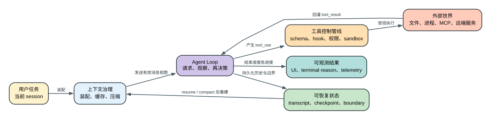

# Claude Code CLI 2.1.235 技术文章总入口

这里是给人阅读的入口。机器清单、反汇编和 JSONL 用来证明结论，不应该挡在文章前面。

## 先读这三篇

1. [完整机制说明书](analysis/claude-code-2.1.235-complete-guide.md)：单卷 36 章，从发布物、请求装配、Agent Loop、上下文、权限、多 Agent、恢复、遥测一直讲到原生桥、产品表面和版本变化。
2. [Agent Loop 专题](analysis/agent-loop.md)：解释 Claude Code 为什么能连续读文件、改代码、执行测试、吸收工具结果并继续决策。
3. [`/compact` 图文专题](analysis/compact-visual-guide.md)：用一个完整场景和三张图说明 Summary、近期消息、附件恢复、compact boundary 与失败恢复。

## 本轮新增的全量参考

1. [70 类证据归属地图](analysis/product-surface-evidence-map.md)：70/70 inventory 逐类区分产品结构、真实调用点、混合 heuristic、依赖 surface 和证据底座，并路由到人类机制与 Boundary。
2. [全面性审计与收口合同](analysis/completeness-audit.md)：按 36 个产品能力面区分 Deep 与 Boundary；它负责证明“为什么已经讲清”或“为什么发布物无法恢复”，不以文章篇幅或清单数量冒充全面。
3. [29 个内置工具逐项参考](analysis/builtin-tools-reference.md)：29/29 覆盖，并深入说明 Workflow、Cron、LSP、Task、Artifact、Worktree、文件工具和后台输出的状态与失败边界。
4. [Settings 解析、合并与热重载](analysis/settings-resolution-and-reload.md)：讲清进程级 store、五层/admin tier、四类 merge、ConfigChange、程序写入、consumer 刷新、remote managed settings 与 policy helper 恢复。
5. [156 个 Settings 全字段参考](analysis/settings-reference.md)：156/156 direct key 逐项解释类型、来源、merge、consumer、生命周期和影响，另解释 4 个 spread。
6. [CLI、SDK 与输出协议](analysis/cli-sdk-output-protocol.md)：讲清 text/JSON/stream-json、stdin/stdout envelope、control request/response、观察事件、structured output、session 与终态。
7. [Plugins、Skills、Slash Commands 与 LSP](analysis/plugins-skills-commands-lsp.md)：讲清来源信任、安装与 enable、session registry、listing 预算、reload、MCP cache 和 language server 生命周期。

## 本轮完成的产品表面深挖

1. [103 个 Slash Command 生命周期](analysis/slash-command-reference.md)：103/103 精确覆盖，逐命令说明 `local`、`local-jsx`、`prompt`、thin-client twin、可见性、gate、状态 owner、失败和副作用。
2. [31 个 Hook 事件参考](analysis/hooks-event-reference.md)：31/31 精确覆盖，解释事件时机、公共/专属字段、matcher、command/HTTP/MCP 载体、阻塞、输入输出修改、超时和后置副作用边界。
3. [29 个 Storage v5 namespace](analysis/storage-v5-reference.md)：29/29 精确覆盖，解释 typed key、scope、atomic/in-place/append、前置条件、真实 consumer、敏感度，以及本版不会自行创建 v5 backend 的边界。
4. [Workflow、Artifact 与 Design 数据链](analysis/workflow-artifact-design.md)：从确定性 Workflow/journal，到 Artifact 文件身份、CSP、comments/DB/assets，再到 Design build/diff/validate/upload/sidecar。
5. [Feature Flags 与 Remote Config](analysis/feature-flags-remote-config.md)：解释 361 个 key、498 个调用点背后的启用门、属性、fresh/disk/default、实验 exposure、刷新、账号切换和不可用 override。
6. [TUI、输入、无障碍、媒体、IDE 与 Chrome](analysis/tui-input-accessibility-media-ide-chrome.md)：把 renderer/composer/spellcheck/paste/image/voice/IDE/Chrome 的状态机、阈值、权限、重试和竞态串起来。
7. [后台执行、Channels 与 Cloud](analysis/cloud-background-channels.md)：区分本地 task/supervisor、Cron/loop/Monitor/Push、Channel 队列、Remote Control、本地/云执行 owner、CCR/BYOC/self-hosted runner。

## 按问题阅读

| 你想弄清楚什么 | 对应文章 |
| --- | --- |
| 70 类机器清单分别属于产品、依赖、heuristic 还是证据底座 | [产品表面与证据归属地图](analysis/product-surface-evidence-map.md) |
| 一次请求从输入到工具执行、持久化和遥测经历什么 | [技术机制总图](analysis/technical-mechanism-atlas.md) |
| 当前分析到底覆盖了什么、还有哪些能力面不能称为全面 | [全面性审计与收口合同](analysis/completeness-audit.md) |
| 29 个内置工具分别改变什么状态、哪些副作用不能 rewind | [内置工具逐项参考](analysis/builtin-tools-reference.md) |
| Settings 为什么写入后不一定立刻被所有子系统采用，policy helper 失败后怎样恢复 | [Settings 解析、合并与热重载](analysis/settings-resolution-and-reload.md) |
| 156 个 settings 字段各自从哪里来、怎样 merge、由谁消费 | [Settings 全字段参考](analysis/settings-reference.md) |
| `--print`、stream-json、control RPC、event 和终态怎样配对 | [CLI、SDK 与输出协议](analysis/cli-sdk-output-protocol.md) |
| Plugin 安装后为什么仍不可见，Skill/command/LSP 何时刷新 | [Plugins、Skills、Commands 与 LSP](analysis/plugins-skills-commands-lsp.md) |
| 103 个 slash command 哪些可见、谁执行、改变什么状态 | [Slash Command 全量参考](analysis/slash-command-reference.md) |
| 31 个 Hook 事件何时运行、能阻止或修改什么 | [Hooks 全事件参考](analysis/hooks-event-reference.md) |
| 29 个 Storage namespace 各存什么、怎样写、哪些只是声明 | [Storage v5 全量参考](analysis/storage-v5-reference.md) |
| Workflow、Artifact、Design 为什么不是同一种“生成内容” | [Workflow、Artifact 与 Design](analysis/workflow-artifact-design.md) |
| 同一版本为什么不同账号拿到不同功能，flag 缓存怎样刷新 | [Feature Flags 与 Remote Config](analysis/feature-flags-remote-config.md) |
| TUI 输入、拼写、图片、语音、IDE、Chrome 的状态怎样汇入 Agent Loop | [TUI、媒体、IDE 与 Chrome](analysis/tui-input-accessibility-media-ide-chrome.md) |
| 后台命令、定时唤醒、Channel、Remote Control、Cloud 到底在哪里跑 | [后台执行、Channels 与 Cloud](analysis/cloud-background-channels.md) |
| system prompt、messages、tools、provider 和请求体怎样装配 | [技术架构导读](analysis/technical-architecture.md) |
| Prompt Cache、Tool Search、microcompaction 和 auto-compact 有什么区别 | [上下文治理与多层缓存](analysis/context-governance-and-caching.md) |
| Resume、fork、rewind、checkpoint 和 Memory 分别恢复什么 | [会话、检查点与 Memory](analysis/sessions-checkpoints-memory.md) |
| 工具执行为什么还要经过 hook、permission、policy 和 sandbox | [工具、权限与 Hooks](analysis/tools-permissions-hooks.md) |
| MCP 工具何时刷新，子 Agent 和后台任务怎样回传结果 | [MCP、Agents 与后台协作](analysis/mcp-agents-background.md) |
| Retry、fallback、reactive compact 和 file rewind 分别恢复哪一层 | [韧性与恢复](analysis/resilience-and-recovery.md) |
| 模型别名、provider、凭据、base URL、beta 和 request body 怎样决定 | [模型、认证、Provider 与请求装配](analysis/models-auth-providers-request.md) |
| 为什么 settings 或 feature flag 写了却不生效 | [Settings、Feature Flags 与 Managed Policy](analysis/settings-feature-flags-policy.md) |
| TUI、IDE、Remote Control 和 Cloud Session 谁真正持有执行状态 | [TUI、IDE、Remote Control 与 Cloud Session](analysis/tui-ide-remote-cloud.md) |
| 安装、更新、Doctor 和版本回退怎样验证真实二进制 | [安装、更新、Doctor 与版本生命周期](analysis/install-update-doctor-lifecycle.md) |
| `.node` 模块怎样连接 JavaScript、N-API、Rust/Swift 和 macOS | [Native Bridge 与 JavaScript Runtime](analysis/native-bridge-runtime.md) |
| 一方事件、OTEL、Datadog、错误上报和本地诊断记录什么 | [遥测、日志与诊断](analysis/telemetry.md) |
| JSONL 中 `comparisonKey`、payload、schema 和 model 字段怎么读 | [机器清单字段阅读指南](analysis/inventory-field-guide.md) |
| bundle 到底还能提取出哪些产品能力和证据 | [全量可提取能力面](analysis/source-surface.md) |

## 每篇文章怎么读

核心专题都按三层组织：

1. **60 秒模型**：读者问题、单句结论、贯穿场景、状态表和机制图。
2. **完整机制**：调用顺序、状态字段、gate、优先级、阈值、并发、失败与恢复。
3. **证据层**：`2.1.235` 源码范围、精确二进制 Probe、literal output、exit status 和不可证明边界。

图是为了先把状态变化讲清楚，不会替代字段、阈值、失败路径或源码证据。
