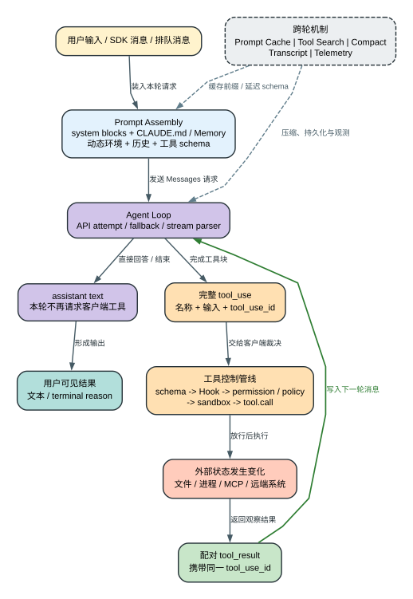

# Claude Code CLI 2.1.235 深度逆向快照

这是 Claude Code CLI `2.1.235` **实际发布程序的版本化研究快照**。仓库从 Anthropic 签名的 macOS arm64 Mach-O 中无损提取 Bun 模块、JavaScriptCore bytecode 和 5 个原生 `.node` 模块，再把这些发布字节整理成可检索源码视图、运行机制文章、精确二进制探针和跨版本语义索引。

它不是 Anthropic 内部 TypeScript 原始仓库。这里能完整保存的是**发布物中仍然存在的信息**；构建时已经丢失的注释、原始文件边界、变量名和被 tree shaking 删除的代码，不能被诚实地还原成“原始源码”。

> **核心判断：** Claude Code 不是“终端里套了一层模型 API”，而是一套由客户端编译能力并维护因果账本的 Agent 运行时。模型提出下一步，客户端负责编译上下文、裁决和调度客户端工具、记录会话与观测；文件系统、子进程和远端服务则持有已经完成的真实副作用。`2.1.235` 没有重写这套架构；它主要修正权限范围、缓存身份、恢复状态和输入界面的边界错误。

[人类阅读首页](README.md) · [从一次真实请求开始](analysis/technical-mechanism-atlas.md) · [2.1.235 深度技术指南](analysis/claude-code-2.1.235-complete-guide.md) · [证据与边界](analysis/completeness-audit.md)


## 先建立一个正确模型

假设用户要求 Claude“读取配置，把端口从 `8080` 改成 `9090`，运行测试并修复失败”。真正发生的不是一次长文本生成，而是一组互相咬合的状态转换：



这张图里最重要的分界是：**消息历史决定模型以后看到什么，外部状态记录世界已经发生什么。** compact、fallback、tombstone 或 resume 可以重建前者，却不会自动撤销已经完成的文件修改、Shell 命令或远端写入。

### 1. Agent Loop 不是一个循环计数器

本版运行时至少同时管理四种节奏：用户任务、模型 iteration、单次 API attempt、工具执行。一次 iteration 可以因网络或模型兼容性问题包含多个 attempt；模型流还没完全结束时，一个完整的 `tool_use` block 就可以进入调度器。调度器让并发安全的工具重叠执行，让写文件、Shell 等非并发安全动作形成屏障，再把每个结果按 `tool_use_id` 配回消息图。

继续还是结束也不是只看模型有没有文字输出。客户端还要吸收中途用户消息、检查 `maxTurns`、执行 Stop hook、处理 fallback sweep，并保存明确的 terminal reason。子 Agent 使用独立消息历史和轮次预算；它不会和父会话共享一份“无限上下文”。完整调用链见 [Agent Loop 专题](analysis/agent-loop.md)。

### 2. 上下文治理不是“快满了就总结”

Claude Code 同时维护多种对象，目的并不相同：

| 机制 | 管的对象 | 它不负责什么 |
| --- | --- | --- |
| Prompt cache | 稳定的 system/message 前缀和 cache breakpoint | 不缩短逻辑历史，也不负责 resume |
| Tool Search | 延迟没有被使用的完整工具 schema | deferred declaration 仍进入 request body；模型初始 active context 没有完整 description/input schema，也不是零 token |
| microcompaction | 清理 active view 中较旧、较大的 tool result | 不删除 tool ID 因果链，不改物理 transcript |
| precomputed compact | 提前生成候选 summary，命中时校验 anchor/分支 | 过期候选不会直接替换当前历史 |
| manual/reactive/partial/precomputed compact | 用 summary 重建，并按各自规则保留合法 group、选择器另一侧或 `messagesSince` | 不存在固定的“保留末尾 N 条”规则 |
| cold/full auto 与特定 SDK full compact | 用 summary 重建，返回 `messagesToKeep: []` | 不保留旧消息后缀，也不撤销工具副作用或复活旧进程 |

`/compact` 因而不是单纯“把聊天总结成一段话”。普通 manual miss 会按合法 group 切开历史，用 Summary 承接较早语义，保留近期因果并重新装入精确附件；预计算命中只是把 Summary 生成提前，full 路径则可能不保留旧消息后缀。成功路径都会写 compact boundary，供 resume 修复逻辑链。Claude Code 自身的 `Grep/Read/tool_result` 压缩前后对照和三张机制图见 [`/compact` 真实上下文压缩指南](analysis/compact-visual-guide.md) 与 [上下文治理专题](analysis/context-governance-and-caching.md)。

### 3. 模型可以提议动作，客户端决定动作能否发生

一个 Edit、Bash 或 MCP 调用不会从模型输出直接落到系统。它先经过名称解析、JSON/schema、工具自己的 `validateInput` 和 `PreToolUse`，再汇合 permission mode、allow/deny rule、managed policy 与必要的 classifier。Hook 或 permission 若给出 `updatedInput`，客户端会重新执行通用 schema 与 permission 语义检查；之后才进入适用的 sandbox/OS 限制和真实 `tool.call`，最后进入 `PostToolUse` 与结果映射。

这里的风控不是一个“危险/安全”分类器：

- managed policy、显式 deny/ask、工具约束、workspace trust 和 sandbox 是确定性下限；
- Auto Mode 只处理前面仍未裁决的普通询问，无法得到有效 verdict 时走 fail-closed；
- Hook 或 permission 可以阻止、延迟或改写输入；改写后会复验 schema 与 permission 语义，但不会自动重跑工具自定义 `validateInput`；
- `bypassPermissions` 不会关闭工具内部校验、OS/TCC、sandbox 或远端权限；
- `PostToolUse`、compact 和 resume 发生在副作用之后，不能冒充回滚。

完整优先级与失败语义见 [工具、权限与 Hooks](analysis/tools-permissions-hooks.md)、[Auto Mode](analysis/auto-mode-classifier.md) 和 [Workspace Trust](analysis/onboarding-workspace-trust-and-safe-startup.md)。

### 4. 恢复是“按 owner 恢复”，不是时间倒流

Transcript 保存消息事件，compact boundary 保存表示切换，file checkpoint 保存受管文件快照，task registry 保存任务身份，daemon/runner/remote owner 保存仍可连接的执行状态。`resume` 会分别询问这些 owner，而不是从一份万能快照恢复整个进程。

因此会出现看似矛盾但正确的结果：对话被 compact 后 token 下降，文件仍保持修改；fallback 丢弃失败 attempt 的临时消息，已经成功的外部调用仍然存在；rewind 能恢复被跟踪文件，却不能自动撤销数据库、Git remote 或第三方 API。见 [会话、Checkpoint 与 Memory](analysis/sessions-checkpoints-memory.md) 和 [韧性与恢复](analysis/resilience-and-recovery.md)。

### 5. “遥测”不是一条开关控制的一根管道

本版同时包含一方 analytics、用户或管理员配置的 OTEL exporter、受一方门控的 Datadog 转发和独立的 error reporting；此外还有只属于本地持久化/诊断的 debug、profile、diagnostic、transcript 与 PTY recording。各通道拥有不同的启用门、采样、队列、重试、持久化、脱敏和目标；本地文件存在不等于网络已经上报，一个事件 callsite 存在也不等于运行时一定走到了该分支。

分析文档把 API attempt、工具授权、compact、session、MCP、后台任务和错误终态放回各自状态机，再解释事件字段和出口资格，而不是把事件名堆成“功能列表”。先看 [数据流与隐私](analysis/client-data-flow-and-privacy.md) 和 [遥测机制](analysis/telemetry.md)；排障时再进入 [事件语义目录](analysis/telemetry-event-catalog.md)。

## `2.1.235` 到底改了什么

上游为这个版本列出 19 条变化。它们共同指向一个主题：**让界面展示的状态、客户端真正持有的状态和最终发生的动作重新一致。** Agent Loop、compact、MCP 或权限系统不是本版新发明，不能因为在本仓库被详细解释就算作 `2.1.235` 的新增功能。

| 变化主线 | 代表性修复 | 为什么重要 |
| --- | --- | --- |
| 输入与终端状态 | 可选本地 spellcheck；多行高亮偏移、深层列表缩进、Vim 光标与快速方向键 + Enter 修复 | 屏幕所见重新对应实际提交字符和当前 selection |
| 权限边界 | Shift+Tab 不再误批准 Edit；授权说明、实际 scope 和 `don't ask again` 对齐；Notebook 读取失败明确展示 | 防止“关闭备注框”变成 session-wide grant，防止在内容不可见时持久授权 |
| 长会话连续性 | LSP reconnect 不再导致 whole-prompt-cache invalidation；任务列表恢复展开态；auto-compact 关闭时给出可操作诊断 | 减少无意义 cache rewrite，并让 resume 后的 UI 对应真实任务状态 |
| Agent 与远端协作 | 不存在默认 Agent 时明确列出可用类型；超大 `SendMessage` 在发送前拒绝；cloud event 改为增量消费 | 把静默丢失和错误默认值变成模型可观察、可修正的失败 |
| Native 与发布生命周期 | embedded grep 对病态正则快速失败并修正 `-m` context；后台更新后保留 restart notice | 防止搜索拖垮进程，并提醒用户“新版本已落盘”不等于当前进程已切换 |

逐字上游条目、每条对应的客户端状态变化、Static/Probe 证据和未验证边界见 [2.1.235 Release Notes 对照](analysis/release-notes.md)。

### 两个容易被一句 Release Note 掩盖的细节

**Updater 的 restart notice 只证明 UI 知道一次更新已安装，不证明当前进程已经换成新版本。** Native updater 会选择 channel/target，读取 manifest，校验平台 binary 的 SHA-256，把同目录临时文件 rename 到版本路径，再尝试切换 installer-owned launcher。launcher 激活可能被拒绝或失败，而新版本文件仍已落盘；当前进程始终继续运行旧 bytes。完整生命周期和两个 commit point 之间的部分成功边界见 [安装、自更新与 Doctor](analysis/install-update-doctor-lifecycle.md)。

**LSP reconnect 修的是 cache identity，不是让所有上下文都永久命中缓存。** 普通 LSP 断线/重连不再导致 whole-prompt-cache invalidation；消息增长、工具集合变化、system block 变化和缓存 TTL 仍会产生新的 breakpoint 或 miss。见 [Plugins、Skills、Commands 与 LSP](analysis/plugins-skills-commands-lsp.md)。

## 怎么读这个仓库

不要从 JSONL、字符串表或反汇编开始。按问题选择一条路线：

| 你的目的 | 推荐顺序 |
| --- | --- |
| 理解一次请求如何变成连续行动 | [Prompt Assembly](analysis/prompt-assembly-and-system-reminders.md) -> [Agent Loop](analysis/agent-loop.md) -> [权限与 Hooks](analysis/tools-permissions-hooks.md) -> [Context / Cache / Compact](analysis/context-governance-and-caching.md) -> [数据流与隐私](analysis/client-data-flow-and-privacy.md) |
| 快速查一个具体能力 | [深度技术指南](analysis/claude-code-2.1.235-complete-guide.md)；再从 [人类阅读首页](README.md) 进入对应专题 |
| 判断结论是否可靠 | [全面性审计](analysis/completeness-audit.md) -> [运行探针索引](analysis/runtime-probe-index.md) -> [结构化机制证据](analysis/mechanism-evidence.jsonl) |
| 查字段、命令或事件 | [机器证据索引](analysis/product-surface-inventory-index.md) 和 [字段阅读指南](analysis/inventory-field-guide.md) |
| 研究原生模块 | [Native Bridge](analysis/native-bridge-runtime.md) -> [重建说明](reconstructed/README.md) -> `reverse/native/` |

文章负责解释“为什么、何时、失败后怎样”；机器索引负责保证跨版本时不漏字段。二者互相校验，不能彼此替代。

## 仓库里实际保存了什么

| 层级 | 目录 | 内容 | 能证明什么 |
| --- | --- | --- | --- |
| 发布字节 | `extracted/` | 未格式化、未改名的 Bun packed 文件和 5 个 `.node` | 发布程序中确实携带这些字节；逐项 hash 可回到原始 Mach-O |
| 派生分析 | `reverse/` | 完整 JSC bytecode、可读化 JS、稳定索引、Mach-O slice/符号/反汇编 | 便于定位和跨版本 diff；不是新的原始源码 |
| 兼容重建 | `reconstructed/` | 4 个 Rust crate、1 个 Swift Package、行为对照报告 | 重建实现满足已观察接口与测试；不是 Anthropic 原文件 |
| 人类解释 | `analysis/` | 机制文章、Release 对照、Probe、证据合同与机器 inventory | 结论的调用链、失败、恢复、用户影响和证明边界 |
| 长期流程 | `skill/claude-code-version-diff/` | 解包、逆向、验证和版本比较方法 | 后续版本可以按同一证据合同重跑，而不是手工挑亮点 |

```text
extracted/cli.js                 canonical packed JavaScript
reverse/javascript/             可读分析视图
reverse/bytecode/               完整 JSC bytecode 与字符串
reverse/native/                 5 个模块、7 个架构 slice 的静态逆向
reconstructed/                  可编译的 Rust/Swift 兼容实现
analysis/                       面向人和机器的两层证据
skill/claude-code-version-diff/ 长期版本归档与对比流程
```

### 原生模块重建到了哪一步

发布物包含图像处理、音频采集、URL event、Computer Use 输入注入和 Swift 屏幕/窗口能力 5 个模块。仓库保存全部架构 slice 的导出、依赖、符号、字符串和反汇编，并按 JavaScript 调用合同重建对应 Rust/Swift 接口。

验证不是“能编译就算完成”：arm64 对照覆盖导出树、错误文本、固定图像输出、权限查询、窗口筛选和截图返回合同；x86_64 先验证独立 artifact 的架构、加载与导出，再只对原发布物确实含 x86 slice 的模块做同输入比较。没有原版 x86 slice 的模块不会被包装成“跨架构行为等价”。逐项结果见 [`reconstructed/EVIDENCE.md`](reconstructed/EVIDENCE.md)。

## 快照身份与证据边界

| 项目 | 值 |
| --- | --- |
| Git 分支 / CLI 输出 | `2.1.235` / `2.1.235 (Claude Code)` |
| 原始程序 | macOS arm64 Mach-O，`313,334,608` 字节 |
| 原始程序 SHA-256 | `83b8f806f6f2eea316cfe246628e6c23374711d868f1fd0409db551b877b7748` |
| 签名 | Anthropic PBC，Team ID `Q6L2SF6YDW` |
| 解包结果 | 15 个 packed 文件，`--path-patching false` |
| 主 JavaScript | `27,305,344` 字节，65,943 行 |
| JSC bytecode | `204,740,576` 字节，仓库以确定性 gzip 保存 |
| 原生模块 | 5 个 `.node`，共 7 个架构 slice |

完整大小、偏移和哈希在 [`analysis/version.json`](analysis/version.json) 与 [`analysis/unpack-manifest.json`](analysis/unpack-manifest.json)，不重复堆在项目首页。

本仓库使用下面的证据等级避免把“看见字符串”写成“功能已经发生”：

| 等级 | 含义 |
| --- | --- |
| Static | 目标 bundle 中的静态证据；可能是 runtime/consumer/constant，也可能只是 surface/declaration，后两者不证明运行时可达或已经发生 |
| Probe | 固定 SHA-256 的目标二进制真实走过指定路径，并记录输入、输出和 exit status |
| Public | 按 URL、抓取时间和响应 hash 固化的一方公开资料；只解释设计或声明，能否归属于 `2.1.235` 仍需目标版 Static/Probe |
| Compatible | 重建实现满足已声明的接口/行为合同，不代表原始源码身份 |
| Boundary | 目标发布物不能独立证明，例如服务端规则、真实账号状态或外部宿主内部实现 |

三个硬边界始终成立：

1. 可读化 JS 和 Rust/Swift 重建都不能冒充内部原始源码。
2. 当前官方文档或更高版本行为不能倒灌到 `2.1.235`。
3. 客户端可见的 header、feature key、API path 或事件名，不自动证明服务端已采用、已发送或已执行对应行为。

## 验证与长期版本对比

完整快照验证：

```bash
python3 skill/claude-code-version-diff/scripts/validate_snapshot.py .
```

验证器会重新核对发布身份、packed hash、bytecode、原生报告、确定性 inventory、运行 Probe、文章证据合同和隐私路径；它不是只检查 Markdown 里有没有几个关键词。

准备好两个本地版本分支后，将 `OLD_VERSION_BRANCH` 替换为旧分支名：

```bash
python3 skill/claude-code-version-diff/scripts/compare_versions.py \
  . OLD_VERSION_BRANCH 2.1.235 --output comparison-to-2.1.235.md
```

对比器先比较 packed bytes、命令/设置/工具/协议/事件的稳定语义字段，再回到 Agent Loop、上下文、权限、恢复、遥测和 native 合同解释行为变化；minified symbol、地址或整块反汇编变化不会单独被当成功能变化。

长期流程位于 [`skill/claude-code-version-diff`](skill/claude-code-version-diff)。它要求每个版本同时交付：原始发布证据、可复现分析、读者可理解的机制文章、明确的未知边界和跨版本人类结论。机器清单负责不漏，文章负责不让人淹死在清单里。
