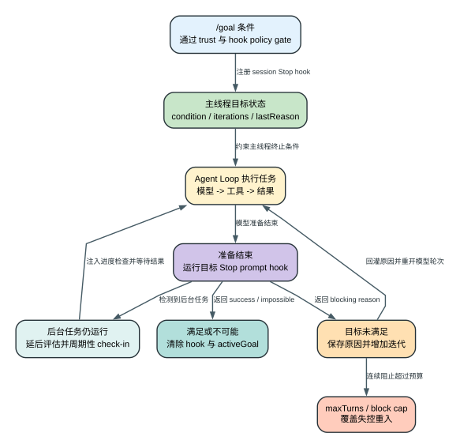

# Claude Code CLI 2.1.235 Active Goal：`/goal` 如何把“结束回答”改造成“继续工作”

> 版本：`2.1.235` | 证据：`Static` | 本章没有把未实际触发的目标评估写成 `Probe`

## 60 秒理解

**读者问题：** 设置 `/goal 修完测试并全部通过` 后，Claude 为什么不能只说“我做完了”，而会在准备结束时再次检查、继续执行？

**一句话模型：** 主线程把目标条件注册成 session-scoped `Stop` prompt hook；每当 Agent Loop 准备结束，hook 都会让模型判定目标是否成立，未成立就把原因写回消息图并开启下一轮，成立或判定不可能才清除目标。



图的结论不是“`/goal` 启动了另一个 Agent”，而是它修改了**当前主 Agent 的终止条件**。

贯穿场景：用户执行 `/goal 所有单元测试通过`。Claude 修改代码并跑测试，第一次准备结束时仍有 2 个测试失败；目标 hook 返回 blocking reason，CLI 记录原因并把它作为新观察送回 Agent Loop。Claude继续修复，第二次准备结束时测试通过，hook 成功，CLI 清除目标并显示耗时、轮次和 token。

## 目标设置前后，哪些状态真的变了

| 对象 | Before | Transformation | After | User-visible effect |
| --- | --- | --- | --- | --- |
| session hook registry | 没有目标专用 `Stop` hook | 注册 matcher 为空、内容为目标条件的 prompt hook | 每个正常结束点都会执行目标评估 | Claude 不能仅靠一句完成声明结束 |
| `activeGoal` | `undefined` | 保存 condition、起始时间、起始 token 和来源 | 主线程拥有一份可更新的目标状态 | UI/Remote 能显示目标和进度 |
| Agent Loop 消息图 | 只有任务、工具和模型消息 | 未满足时追加 blocking feedback 与 `goal_status` | 下一轮能看到“为什么还没完成” | Claude 可针对缺口继续工作 |
| `iterations` / `lastReason` | 0 / 空 | 每次目标阻止结束时递增并保存原因 | 形成连续目标评估轨迹 | 状态可显示仍未满足的原因 |
| session metadata | 没有 `goal` | 映射为 `condition/set_at/iterations/last_reason/met` | Remote/SDK 可同步相同语义 | 远程界面不必猜测本地 UI 文本 |
| 外部状态 | 工具可能尚未执行 | Agent Loop 继续调用工具 | 文件、命令、远端系统可能已改变 | 清除目标不会回滚已经完成的动作 |

## 先区分三个容易混淆的对象

| 对象 | 谁拥有 | 做什么 | 不做什么 |
| --- | --- | --- | --- |
| `/goal` 命令 | 当前 session 的命令层 | 安装、替换或清除目标 | 不单独执行任务 |
| `activeGoal` | 主线程 app state | 保存目标的可观察状态 | subagent 不复制这份状态 |
| `Stop` prompt hook | session hook registry + Agent Loop | 在模型准备结束时评估条件 | 不撤销此前工具副作用 |

普通 `Stop` hook 可以来自设置或插件；`/goal` 只是用 session registry 动态安装了一个特定 prompt hook，并额外维护 `activeGoal`、目标 UI、Remote metadata 和后台任务延后逻辑。两者共用 Agent Loop 的 Stop-hook 重入与熔断机制。

证据：`reverse/javascript/cli.readable.js` 267568-267629、272253-272264。

## 阶段 1：`/goal` 先通过两道策略门，再改变 session 状态

目标文本最长 `4000` 字符。设置前，客户端检查：

1. 当前 workspace 是否已受信任；未受信任时返回 trust gate 错误。
2. hooks 是否被 `disableAllHooks` 或 `allowManagedHooksOnly` 等策略限制；受限时返回 hooks gate 错误。
3. 现有目标是否存在；存在则以 `superseded` 记录清理原因，并移除旧的目标 prompt hook。
4. 在当前 session hook registry 中加入 `Stop` prompt hook，prompt 就是目标条件。
5. 写入 `activeGoal`：`condition / iterations / setAt / origin / tokensAtStart`，并追加一个不可见的 `goal_status` sentinel attachment。

`clear/stop/off/reset/none/cancel` 这组输入会走提前清除语义，而不是被当成新目标。显式清除会移除 prompt hook，把 `activeGoal` 置空，记录 `user_clear`，并追加对应 sentinel。新目标替换旧目标时也不会并存两个目标评估器。

为什么需要 trust 和 hook policy gate：目标评估不是纯 UI 标签，它会改变模型是否继续运行，从而继续消耗 token、调用工具并产生副作用。CLI 因此把它放在与 hook 执行一致的策略边界内。

证据：`reverse/javascript/cli.readable.js` 267573-267629、367384-367414。

## 阶段 2：正常工作期间，目标不会每一步都启动一次独立检查

目标存在时，主 Agent 仍走原来的 Agent Loop：请求模型、执行工具、回灌结果。`activeGoal` 不会让每个 Read/Edit/Bash 后都额外调用一次目标模型；它主要在本轮准备停止、工具声明 end-turn、MCP end-turn 或 loop tick 等结束边界参与处理。

只有主线程读取和更新 `activeGoal`：相关代码都以 `!agentId` 或 main-thread source 为条件。subagent 仍可运行自己的 `SubagentStop` hooks，但不会继承主线程这份目标状态，也不会独立宣布主目标完成。

这避免了两个问题：

- 多个 subagent 同时改写同一目标轮次和完成状态；
- 一个局部子任务成功，被误当成整个 session 目标成功。

证据：`reverse/javascript/cli.readable.js` 270425-270457、270508-270576、272253-272261。

## 阶段 3：模型准备结束时，目标 hook 决定“结束还是重入”

普通前台结束路径按以下顺序发生：

```text
模型返回本轮最终响应
  -> Agent Loop 运行 Stop / SubagentStop hooks
  -> 找到 prompt 与 activeGoal.condition 相同的目标 hook
  -> hook success: 清除目标并结束
  -> hook impossible: 清除目标并记录失败
  -> hook blocking: 保存原因并进入下一模型轮次
```

### 目标尚未满足

当目标 hook 返回 blocking error 时，客户端：

1. 生成一条供模型阅读的 blocking feedback；
2. 把 `activeGoal.iterations` 加 1；
3. 把 `stopReason` 保存为 `lastReason`；
4. 发出 `goal_status {met:false}`；
5. Agent Loop 把 assistant 结束响应、hook feedback 一起写进下一轮消息；
6. `turnCount` 和连续 Stop-block 计数增加，transition 记为 `stop_hook_blocking`。

因此，“Goal not yet met… continuing”不是 UI 自己循环，也不是客户端硬编码下一条工具，而是**新一轮模型请求**。模型拿到未满足原因后决定下一步动作。

### 目标已经满足

当 hook success 且对应当前目标时，CLI 先从 registry 移除该 prompt hook，再计算：

- `iterations = activeGoal.iterations + 1`；
- `durationMs = now - setAt`；
- `tokens = currentTokenCounter - tokensAtStart`。

随后它清空 `activeGoal`，写入 `goal_status {met:true}`，记录 `tengu_goal_achieved`，并把 Remote metadata 更新为 `met:true`。UI 会把耗时、turn 数和 token 放在 “Goal achieved” 后面。

### 目标被评估为不可能

prompt hook success 仍可能携带 `impossible`。客户端会清除 hook 和 `activeGoal`，但写入的是 `goal_status {met:false, failed:true}`，保留 reason，并显示 “Goal could not be achieved”。这和普通 blocking 不同：它是**目标生命周期终态**，不会仅凭该结果继续循环。

证据：`reverse/javascript/cli.readable.js` 270534-270577、459132-459186。

## 阶段 4：为什么存在连续阻止上限

目标 hook 共用 Stop-hook 的两层保险：

| 保险 | 默认/条件 | 触发结果 |
| --- | --- | --- |
| `maxTurns` | 用户或宿主配置 | 下一轮将超过上限时返回 `max_turns` |
| `CLAUDE_CODE_STOP_HOOK_BLOCK_CAP` | 默认 `8`；大于 0 时启用 | 第 `cap + 1` 次连续阻止时覆盖 hook，警告后结束当前 turn |

这两个保险限制的是“目标一直说没完成”造成的无限模型重入。cap 分支只覆盖本次结束决定；从可达代码看，它没有执行目标成功/失败清理，所以 session 中的目标状态与 hook 仍可保留到后续交互。它也不撤销前 8 轮已经发生的工具副作用。

CLI 会在 `tengu_stop_hook_block_count` 中记录 block 次数、是否命中 `maxTurns`、是否命中 cap、是否有 active goal，便于区分正常目标推进和失控重入。

证据：`reverse/javascript/cli.readable.js` 272253-272264。

## 阶段 5：后台任务运行时，目标评估为什么会被临时拆下

假设 Claude 为“所有测试通过”启动了一个后台测试命令。当前前台回答到达结束点时，测试还没结束。如果此时目标 hook立即评估，模型很可能因为缺少最终结果而反复说“还没完成”，既浪费 token，也可能错误停止后台工作。

2.1.235 的处理是：

1. 主线程查询 task registry 中仍活跃的 local agent、shell、monitor 或 workflow。
2. 找到与当前目标 condition 完全匹配的 `Stop` prompt hook并临时移除。
3. 保留 `activeGoal`，写入 `deferredSince/checkinCount/lastDeferralPassAt`，把评估状态标为 deferred。
4. 默认每 `30` 分钟生成一次 goal check-in；`CLAUDE_CODE_GOAL_CHECKIN_MINUTES` 可改变间隔，feature gate 关闭时返回 0。
5. check-in 列出仍运行的后台任务，要求模型检查进度、处理卡住的任务或继续等待。
6. 后台任务消失后，清掉 deferred 字段；外围 `finally` 恢复被临时移除的目标 hook。

这不是把目标交给后台 Agent。目标所有权仍在主线程；客户端只是把“现在能否结束”的判断延后到更有信息的时刻。

check-in 还有一个细节：如果一批后台任务已经结束，后来出现一批新的后台任务，且与上次 pass 的间隔超过 check-in 窗口，客户端会把它视为 new run，重置 `deferredSince` 与计数，避免沿用旧批次的等待时钟。

证据：`reverse/javascript/cli.readable.js` 267400-267436、270508-270529、270631-270645。

## 特殊结束路径：hook 会运行，但 blocking 结果被丢弃

工具结果声明 end-turn、MCP meta end-turn 或 loop tick 到达时，客户端仍执行 Stop hook，以便产生 hook 消息、错误通知和观测事件；但这些路径已经决定“不再重新调用模型”，所以即使 hook 返回 blocking/preventContinuation，也只写诊断日志：

```text
Stop hook block discarded
(turn ended by tool result / MCP end-turn / loop tick, no model re-invoke)
```

这条分支很关键：不能从“Stop hook 被调用”推导出“目标一定能阻止所有形式的 turn end”。普通模型完成路径会重入；上述三个既定 end-turn 路径不会。

证据：`reverse/javascript/cli.readable.js` 270425-270457。

## UI、SDK 与 Remote 如何看到同一目标

app-state 比较只关注：`condition / setAt / iterations / tokensAtStart / lastReason`。字段变化后：

- session state 收到 `notifyActiveGoalChanged`；
- metadata 写入 `goal {condition,set_at,iterations,last_reason,met}`；
- Remote 模式向输出队列发 `active_goal` 事件；
- headless/SDK 消费 `active_goal` 后更新自己的 app state；
- 最终 `goal_status` attachment负责显示 pending、achieved 或 failed。

`tokensAtStart` 用于本地计算消耗，但 Remote metadata 映射会剥离它；远端得到的是 `set_at`、迭代和原因等状态，而不是本地计数器的原始起点。

证据：`reverse/javascript/cli.readable.js` 433751-433813、597781-597783、600493-600497。

## 失败、恢复与副作用矩阵

| Failure | Detection | Retry/change | State retained | Final user effect |
| --- | --- | --- | --- | --- |
| workspace 未受信任 | `/goal` 设置前 trust gate | 不安装 hook | 原 session 消息保留 | 显示只能在 trusted workspace 使用 |
| hooks 被策略限制 | hooks policy gate | 不安装 hook | 原 session 与策略保留 | 显示 hooks restricted |
| 目标未满足 | prompt hook 返回 blocking | 回灌 reason，开启下一模型轮次 | 消息、工具结果、外部副作用、目标状态都保留 | 显示 continuing，Claude继续工作 |
| 评估器超时 | hook result `timedOut` | 本轮不把它当成功 | active goal 仍在；记录 evaluator timeout | 后续仍可再次评估 |
| 评估器执行错误 | hook error attachment/exception | 通知并记录 telemetry | active goal 与已完成动作保留 | transcript 中可查看错误 |
| 连续 blocking 超过 cap | Stop block counter | 覆盖本次 hook 决定并结束 turn | 目标通常仍在；外部副作用不回滚 | 警告 hook 连续阻止过多 |
| 达到 `maxTurns` | 下一轮计数超过上限 | 不再调用模型 | 工具结果与 active goal 保留 | 返回 `max_turns_reached` |
| 后台任务仍运行 | task registry 非空 | 临时移除目标 hook，周期性 check-in | active goal、任务、等待时钟保留 | 不会为未知后台结果反复评估 |
| 用户清除或新目标替换 | `/goal clear` 或新 `/goal` | 移除旧 hook | 已完成工具与消息保留 | 目标停止约束后续结束 |

**不可逆边界：** 目标重入只改变控制流和消息状态。Edit、Bash、远端 API 等工具已经造成的外部变化不会因为目标被清除、评估超时、命中 cap 或 session 结束而自动回滚。

## Token、延迟、质量、隐私与安全影响

| 维度 | 具体影响 |
| --- | --- |
| token / 成本 | 每次 blocking 都会触发新的模型轮次；目标达成时统计的是 `tokensAtStart` 之后的 token 差值。后台 defer 减少无信息重入，但 check-in 本身也会占上下文。 |
| 延迟 | 目标评估位于结束路径，至少增加一次 hook 执行；未满足时还增加完整模型轮次和后续工具时间。 |
| 质量 | `lastReason` 把“还缺什么”变成下一轮明确观察，比仅重复原目标更容易收敛；评估质量仍取决于 prompt hook 能看到的上下文。 |
| 隐私 | condition、last reason、迭代与时间会进入 session state/metadata；Remote 模式会同步 goal 语义。目标文本不应被误认为只停留在本地 UI。 |
| 安全 | trust、hook policy、`maxTurns` 和 block cap 共同限制无边界执行；它们不替代每个工具自己的 permission、sandbox 和 hook 检查。 |
| 可恢复性 | session-scoped registry、app state 和 Remote metadata维持目标连续性；但特殊 end-turn 路径会丢弃 blocking 决定，必须按真实终止原因诊断。 |

## 证据边界

| Classification | 本章使用方式 | 能证明什么 | 不能证明什么 |
| --- | --- | --- | --- |
| `Static` | 追踪 `2.1.235` readable bundle 的命令、state、hook、Agent Loop、UI 和 Remote 路径 | 字段、阈值、调用顺序、可达成功/失败分支 | 某次真实账号会给出什么目标判断 |
| `Probe` | 本章未新增 exact-binary `/goal` 正向 probe | 无 | 真实服务端模型的评估文本、延迟和 token 数 |
| `Public` | 本章未用当前官网补实现缺口 | 无 | 不能把当前文档的行为倒灌为 2.1.235 事实 |
| `Boundary` | prompt hook 的语义判断由模型/服务能力参与，具体回答不在静态 bundle 中 | 客户端如何消费 success/block/impossible | 服务端如何形成某个判断、远端 feature gate 当前取值 |

## 可复核源码索引

| 结论 | `reverse/javascript/cli.readable.js` |
| --- | --- |
| check-in 默认 30 分钟、任务换批与注入文本 | 267400-267436 |
| 设置/清除、trust 和 hook gates、4000 字符上限、state 字段 | 267568-267629 |
| 既定 end-turn 路径丢弃 blocking 结果 | 270425-270457 |
| 后台任务 defer、目标 success/block/impossible、finally 恢复 | 270508-270645 |
| Stop hook 重入、`maxTurns`、默认 block cap 8 | 272253-272264 |
| Remote metadata field mapping | 433751-433813 |
| goal UI 的 pending/achieved/failed 与统计值 | 459132-459186 |
| headless/SDK 消费 `active_goal` | 597781-597783 |
| Remote 输出 `active_goal` | 600493-600497 |

相关总机制：[Agent Loop](agent-loop.md)、[工具、权限与 Hooks](tools-permissions-hooks.md)、[恢复与降级](resilience-and-recovery.md)、[Slash Command 参考](slash-command-reference.md)。
