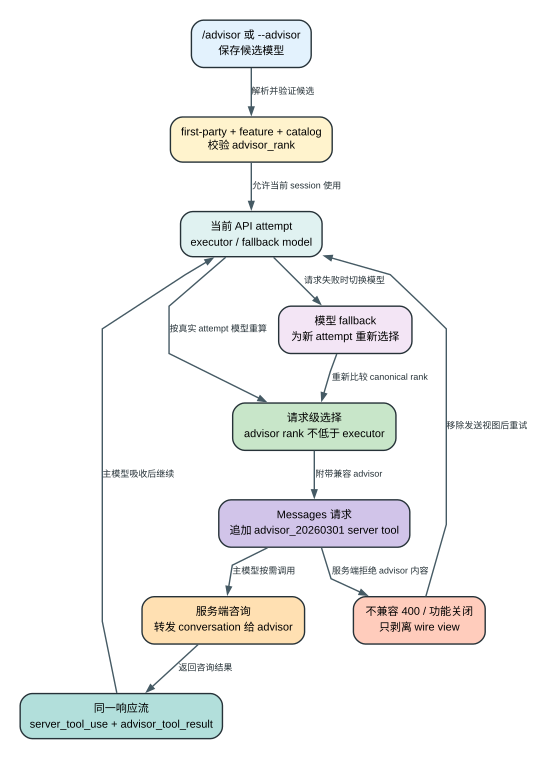

# Claude Code CLI 2.1.235 Advisor：主模型怎样在同一次请求里咨询更强模型

> 版本：`2.1.235` | 证据：`Static` | Advisor 的服务端推理过程属于 `Boundary`

## 60 秒理解

**读者问题：** 配置 `/advisor` 后，是不是客户端会并行启动第二个 Agent，把答案互相投票后再返回？

**一句话模型：** 客户端仍只运行一个本地 Agent Loop；它为每次 API attempt 选择一个等级不低于执行模型的 advisor，把 `advisor_20260301` 作为 server tool 加进同一个 Messages 请求，主模型需要时调用，服务端完成咨询并把结果作为流式 tool result送回当前响应。



贯穿场景：用户让 Sonnet 执行一次高风险数据库迁移审查，并把 Opus 配成 advisor。主模型仍负责读代码、调用本地工具和最终回答；遇到架构取舍时，它在当前响应中发起 `advisor` server tool。客户端注入的 Advisor 协议明确告知主模型：调用时整个 conversation history 会自动转发给 advisor；服务端随后返回 advisor result，主模型吸收建议后继续生成。bundle 不能证明服务端是否还会裁剪、缓存或重组这份输入。若本次主请求 fallback 到另一模型，客户端会重新比较等级，而不是无条件沿用原 advisor。

## 配置前后，哪些对象发生变化

| Object | Before | Transformation | After | User-visible effect |
| --- | --- | --- | --- | --- |
| session settings | 没有 `advisorModel` | `/advisor` 或 `--advisor` 解析并校验 catalog | 保存所选 advisor | UI 可显示当前 advisor |
| API attempt | 只有 executor/base model | 每次 attempt 根据当前模型重算兼容 advisor | request-local `advisorModel` 可能存在或被移除 | fallback 后不会盲目带错模型 |
| tool list | 只有 client tools 与其他 server tools | 追加 `advisor_20260301` 描述 | 主模型可调用 `name:"advisor"` | 咨询发生在同一响应流 |
| system prompt | 无 Advisor 使用规范 | 注入什么时候咨询、结果如何使用的说明 | 主模型知道该工具不是执行器 | 最终答案仍由主模型负责 |
| streamed assistant content | 普通 text/tool blocks | 接收 `server_tool_use` 与 `advisor_tool_result` | transcript 可保留咨询事实 | UI 能显示调用、结果或错误 |
| token/延迟 | 单模型消耗 | advisor 读取对话并生成咨询结果 | 额外输入、输出和等待 | 成本与响应时间增加 |

## 它不是两个本地 Agent Loop

| 角色 | 运行位置 | 拥有什么 | 不拥有什么 |
| --- | --- | --- | --- |
| executor / base model | 当前 Messages 请求的主响应 | 本地工具 schema、Agent Loop、最终回答控制权 | 不会因 advisor 存在而永久换模型 |
| advisor model | Anthropic server tool 执行侧 | 按客户端注入协议声明可看到 conversation history 与咨询请求 | 本地 task registry、独立本地 transcript、直接工具执行权 |
| Claude Code client | 本地 CLI | 选择模型、组装 request、解析 stream、fallback/strip | advisor 内部提示、推理调度和服务端资源分配 |

如果把 Advisor 描述成“客户端启动一个 Opus subagent”，会误判三件事：本地没有第二套工具权限流水线；advisor 不出现在 local-agent task registry；咨询的输入和计费走 server tool，而不是普通 `Agent` tool fork。

## 阶段 1：先判断产品和账号是否允许出现 Advisor

Advisor 不是任何 provider 的通用 Messages API 功能。2.1.235 的启用路径要求：

- first-party provider/账号路径；
- 客户端内部 capability 允许；
- feature 或 experimental gate 打开；
- 没有 `CLAUDE_CODE_DISABLE_ADVISOR_TOOL` 等显式禁用；
- catalog 中存在可用 advisor candidate。

第三方 Bedrock、Vertex、Foundry 或任意兼容 gateway 即使能发送普通 Messages 请求，也不能仅凭本地 `--advisor` 获得同样的 server tool。first-party gate 是协议和服务能力边界，不是 UI 限制。

证据：`reverse/javascript/cli.readable.js` 163403-163507、583542-583569。

## 阶段 2：`advisor_rank` 把“更强”变成可计算约束

model catalog 为部分模型声明 `advisor_rank`。2.1.235 的选择规则至少包含两层：

1. advisor candidate 的 rank 至少为 `2`；
2. advisor rank 不能低于 executor/base model rank。

因此，“选了另一个模型”不等于“形成 advisor”。例如 rank 1 的轻量模型不能作为有效 advisor；高等级 executor 也不能咨询低等级 advisor。这个约束避免主模型把关键判断委托给 catalog 认为更弱的模型。

启动参数校验还有 surface 差异：前台交互对非法 `--advisor` 配置可以直接报错退出；后台或附属启动路径倾向于 warning 并继续，让一个辅助功能配置错误不至于杀死已有 background workload。

证据：`reverse/javascript/cli.readable.js` 163403-163507、592811-592835；catalog 结构见 8033 附近。

## 阶段 3：`/advisor` 改的是设置，真正请求前还会再算一次

`/advisor` 通常把选择写进 user settings，后续 session 可以继续使用。Remote Control 下，客户端不能假设自己拥有远端用户配置文件，因此只改 session flag/settings，不把远端临时选择持久化成本机全局配置。

但 `advisorModel` 不是“设置一次后原样塞进所有请求”。Agent Loop 每个 API attempt 都会调用选择逻辑，输入至少包括：

- 当前 attempt 真正使用的 model；
- session 配置的 base model；
- 用户配置的 advisor；
- model catalog 的 canonical identity 与 advisor rank。

若 attempt 仍是配置的 base model，使用已校验 advisor。若普通 request 因过载、拒绝或 provider 策略 fallback 到另一个 model，客户端重新比较 canonical model 与 rank；只有新 attempt 仍兼容时才附带 advisor，否则移除。这样可以避免：主请求已经降级/切换，advisor 却仍按旧组合收费或被服务端拒绝。

证据：`reverse/javascript/cli.readable.js` 271779-271842、464108-464190。

## 阶段 4：请求里增加的是 server tool，不是本地工具实现

通过 gate 和 rank 后，请求工具数组追加：

```json
{
  "type": "advisor_20260301",
  "name": "advisor",
  "model": "<selected-advisor-model>"
}
```

system prompt 同时加入 Advisor Tool 规范，告诉主模型：在复杂、关键或需要第二意见的地方调用；把咨询问题交给 advisor；收到结果后自己综合，而不是把工具结果原样当最终用户回答。

这个 tool 没有本地 `call()`、permission dialog 或 shell 进程。Messages API 服务识别 beta server tool，执行咨询并在同一 stream 中返回对应 block。客户端负责协议组装和显示，不拥有咨询内部实现。

证据：`reverse/javascript/cli.readable.js` 399749-399759、409325-409436。

## 阶段 5：同一条流里如何识别 Advisor 调用与结果

流解析器专门识别：

- `server_tool_use` 且 `name === "advisor"`；
- `advisor_tool_result`；
- 调用开始、成功结果、error 与 interrupted 状态。

它把这些 block 纳入 assistant content，而不是伪造成普通用户 `tool_result`。这点很重要：普通本地工具遵循 `tool_use_id -> client execution -> user tool_result`；Advisor 是 server tool，服务端在一个响应生命周期内完成调用和回传。

主模型看到 result 后可以继续本响应或后续推理，并负责最终表达。客户端 UI 明示 Advisor 会使用额外 token；stream block 还让 transcript/遥测可以区分“主模型自己生成”与“咨询发生过”。

证据：`reverse/javascript/cli.readable.js` 409843-409965。

## 阶段 6：fallback 和旧消息兼容为何需要两种 strip

### Advisor 当前未启用：规范化 wire view

会话历史可能是在 Advisor 开启时产生的，后来用户关闭 Advisor、换 provider 或恢复到不支持的 host。发送新请求前，wire normalization 会移除历史中的 advisor server-tool blocks，避免把目标服务不认识的内容再次发出。

如果移除后某条 assistant message 变成空内容，客户端补一个 `[Advisor response]` 文本占位，维持 Messages API 的消息合法性和轮次结构。这里改变的是**本次发送视图**，不是删除本地 transcript 的原始事实。

### 服务端 400：`retry:advisor-strip`

若服务端以特定 400 响应指出 advisor content 不兼容，客户端可以在同一个 API attempt recovery 中选择 `retry:advisor-strip`：重新构造不含 advisor blocks 的 wire messages 再发。它同样不应被理解为“从磁盘抹掉咨询历史”。

这两条 strip 解决不同问题：前者是请求前能力归一化；后者是服务端明确拒绝后的兼容重试。

证据：`reverse/javascript/cli.readable.js` 324107-324115、409712、409843-409965。

## 失败与恢复矩阵

| Failure | Detection | Retry/change | State retained | Final user effect |
| --- | --- | --- | --- | --- |
| provider/feature 不支持 | 启用 gate | 不注册 Advisor tool | 主 Agent、普通工具与 session 保留 | 继续单模型执行 |
| `--advisor` 模型不存在或 rank 不合格 | 启动 catalog validation | 前台报错；后台 warning 后继续 | base model 配置保留 | Advisor 不生效或要求改配置 |
| advisor rank 低于 executor | request-time selector | 本 attempt 不附带 advisor | 主请求继续 | 不会付费咨询更弱模型 |
| 主模型 fallback 到另一 model | 每个 API attempt 重算 | 兼容则换组合，不兼容则移除 advisor | Agent Loop messages 与 fallback state 保留 | fallback 可继续而不是组合失配 |
| stream 中 advisor result error | 专用 result block | 记录 error/interrupted；主响应按服务端结果继续或结束 | 已产生主响应 block 保留 | UI 能区分咨询失败 |
| 历史 advisor block 发往不支持服务 | request normalization | strip wire view，空消息补占位 | 本地 transcript 原始 block 保留 | 新请求仍符合协议 |
| 服务端返回特定 400 | response classifier | `retry:advisor-strip` 后重发 | 本地历史与 attempt recovery state 保留 | 可能降级为无 advisor 完成 |

## 成本、延迟、上下文和隐私

| 维度 | 2.1.235 的实际含义 |
| --- | --- |
| token / 费用 | advisor 会读取转发给它的会话并生成额外结果；不是免费“内部思考”。UI 明示额外 token。 |
| 延迟 | 主 stream 在 advisor server tool 执行期间等待结果；是否并行、排队和服务端 timeout 由服务端实现决定。 |
| 上下文 | 客户端注入的 Advisor system prompt 声明整个 conversation history 会自动转发，而不是只传一行问题；服务端实际选取、裁剪、缓存和保留方式仍是 `Boundary`。 |
| 隐私 | advisor 接收当前会话内容，是主要数据边界。用户不应把它当成本地离线第二意见。 |
| 工具安全 | advisor 本身不直接获得本地 client tools；最终本地动作仍由主 Agent 产生 tool call，并经过原 permission/hook/sandbox 流水线。 |
| 可恢复性 | wire strip 能兼容不支持的服务，但已经发生的 advisor 调用、费用和服务端处理不能被本地 transcript strip 撤销。 |

## 证据边界

| Classification | 本章使用方式 | 已证明 | 未证明 |
| --- | --- | --- | --- |
| `Static` | 读取 2.1.235 model catalog、settings、request builder、stream parser 和 retry path | gate、rank、request shape、strip 与显示逻辑 | 服务端 advisor 内部怎样推理 |
| `Probe` | 本章未用有 entitlement 的账号执行真实咨询 | 无 | 实际 token、延迟、模型回答和 400 retry 是否在当前账号触发 |
| `Public` | 未用当前文档替代目标版本源码 | 无 | 当前文档的产品可用性不能倒灌为 2.1.235 账号事实 |
| `Boundary` | server tool 的咨询执行、模型资源、配额和保留策略 | 客户端发送与消费协议 | 服务端提示、调度、缓存、计费细节 |

## 可复核源码索引

| 结论 | `reverse/javascript/cli.readable.js` |
| --- | --- |
| model catalog / `advisor_rank` 与选择 helpers | 163403-163507 |
| 每次 Agent Loop request 传递 attempt-local advisor | 271779-271842 |
| 不支持时移除历史 advisor content | 324107-324115 |
| request tool shape 与 Advisor system prompt | 399749-399759、409325-409436 |
| request normalization 与 400 strip recovery | 409712、409843-409965 |
| `/advisor` UI/settings 与 Remote session behavior | 464108-464190 |
| feature/provider eligibility | 583542-583569 |
| CLI `--advisor` 启动校验 | 592811-592835 |

相关机制：[模型、认证、Provider 与请求装配](models-auth-providers-request.md)、[Agent Loop](agent-loop.md)、[恢复与降级](resilience-and-recovery.md)、[Slash Command 参考](slash-command-reference.md)。
