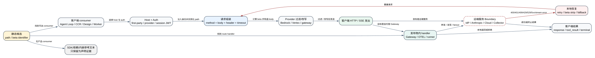

# Claude Code CLI 2.1.235 API、Beta 与路由所有权

**读者问题：** `api-paths.txt` 里出现 99 条路径、`anthropic-beta-identifiers.txt` 里出现 53 个日期后缀标识，哪些真由 Claude Code 客户端发起，哪些只是 SDK/依赖或内嵌参考文本，看到它们又能推断到哪一步？

**一句话模型：** 路径字符串只是地址候选，Beta 字符串只是协议候选；必须分别追到客户端 consumer、发布物内服务端 handler 或依赖声明，才能确认谁拥有它，而本地 Gateway 再向 Anthropic/云 Provider/IdP/Collector 发出的请求才进入远端 Boundary。

贯穿场景：一次普通 Agent Loop 请求最终走 `/v1/messages`。CLI 先按模型和 provider 计算 beta descriptor，过滤当前 provider 不能承载的 header，再把 `model/messages/system/tools/max_tokens/thinking/output_config` 组进 SDK 请求；Bedrock/Vertex 会在 middleware 中把同一个 Messages 语义改写为各自的传输形态。400 若明确归因于 fallback beta，客户端会剥离对应 beta 并重试；这能证明客户端恢复分支，不能证明服务端为何拒绝或某 beta 在账号上已开放。

## 60 秒看懂：先分清五种“所有权”

| 层 | 谁拥有状态 | 本地快照能证明什么 | 不能直接推出什么 |
| --- | --- | --- | --- |
| 产品调用者 | Claude Code 命令、Agent Loop、Remote/CCR、Design、Artifact、feedback 等模块 | method/path/body/header、timeout、validateStatus、局部失败分支 | 服务器一定接受、账号一定有权限 |
| 请求基础设施 | host selector、auth selector、Axios/SDK wrapper、provider middleware | URL 怎样拼、凭据怎样选、请求怎样改写 | DNS、网关、负载均衡和服务端 handler |
| 打包 SDK/依赖 | Anthropic SDK、OAuth/OIDC、Google/Azure/AWS、OTEL exporter | 该依赖带有哪些客户端方法和固定 endpoint | Claude Code 产品路径一定调用这些方法 |
| 发布物内服务端 handler | `claude gateway`、OTEL forwarding handler、self-hosted runner metrics listener | 路由条件、鉴权、policy、Postgres、upstream 转发、错误和恢复分支 | 目标部署是否启用、配置/数据库里有什么、外部上游是否成功 |
| 远端服务 Boundary | Anthropic API、Claude.ai/CCR/Worker、IdP、云 Provider、Collector | 本地调用者或 Gateway 预期的 status/response shape | 远端 handler、账号策略、rollout、模型执行和持久化 |

## 请求生命周期：从字符串到一次真实调用

1. **入口选择调用者。** 命令、Agent Loop、Remote Control、Artifact/Design 或 telemetry 模块先决定本次动作；没有 consumer 的路径不自动成为功能。
2. **host 与身份分流。** `qa()` 一类配置提供 first-party base URL/OAuth URL/MCP proxy；统一 HTTP client 再按 `auth` 类型注入 OAuth、API key、session JWT、trusted-device 或组织头。
3. **路径实例化。** 静态 path、模板 path 与 `:orgUUID` 占位符由不同 wrapper 处理；清单里的 `/v1/code/`、`/api/frame/` 也可能只是 prefix/allowlist，不是可单独请求的 endpoint。
4. **Beta descriptor 计算。** 2.1.235 把 name/header 绑定为 descriptor，按模型、provider、feature、query source 和 sticky state 选集合，而不是把 53 个日期标识全塞进每次请求。
5. **provider 过滤和改写。** Bedrock 会把部分 beta 放进 body，Vertex/Bedrock middleware 会改写 Messages path/body；模拟代理路径会主动剥离除 OAuth 外的 beta。
6. **判定接收者。** 普通 Claude Code 请求发向外部服务；`claude gateway --config` 则会在同一发布物内启动 HTTP server，真实接收 discovery、OAuth、managed settings、Messages、models、spend admin 和 OTLP 路由。
7. **发出或转发请求。** 调用点确定 method、timeout、body、stream、status 接受范围和 abort signal；Gateway handler 还会校验身份/策略/花费、改写凭据和模型，再转发 upstream。
8. **解释失败。** 网络异常、401/403、400 beta 不兼容、409 冲突、429/529、5xx 分别进入自己的 retry/fallback；不是所有非 2xx 都自动重试。
9. **停在远端 Boundary。** 发布物内 Gateway handler 可以静态证明，但公司 IdP、Anthropic/Bedrock/Vertex/Foundry、Claude.ai/CCR 和 Collector 的内部执行仍不可从客户端快照恢复。

## Agent Loop 的 Messages 主链

Beta 的核心不是一张“功能开关表”，而是参与请求规范化的协议对象：

- descriptor registry 把稳定语义名映射到 header，见 [`reverse/javascript/cli.readable.js` L68918-L68931](../reverse/javascript/cli.readable.js#L68918)；
- 自定义 beta 只对 API-key 用户开放，并只允许 `Isd` 中的集合；不允许的值会告警并忽略，见 [L71218-L71238](../reverse/javascript/cli.readable.js#L71218)；
- `SGs/SDe/GOr` 按 provider、模型、thinking、1M、tool search、context management 与 SDK 输入计算集合，见 [L71276-L71383](../reverse/javascript/cli.readable.js#L71276)；
- 主请求在 [L409326-L409522](../reverse/javascript/cli.readable.js#L409326) 组装工具 schema、cache、thinking、fallback、context management 与 beta；最终 SDK body 的 `betas` 还会经过 provider allowlist；
- fallback beta 的 400 不是笼统重试：可归因错误会定向 strip credit/category/array header；此外，当 stream fallback-credit、server-fallback 或 credit-header 的对应恢复分支已经 armed 且尚未消费预算时，未归因 400 也可触发一次保守 strip/retry，见 [L409545-L409575](../reverse/javascript/cli.readable.js#L409545)。

这条链解释了三个容易写错的结论：

1. “出现在 beta inventory”不等于“默认发送”。descriptor 可能受模型/provider/gate 控制，也可能只是 SDK 或内嵌参考文本。
2. `ANTHROPIC_BETAS` 不等于任意透传。CLI 交互入口会验证 allowlist；SDK query 还有 first-party/third-party 过滤。
3. beta header 被发送也不等于功能成功。服务端可返回 400/403/409/529，客户端可能 strip、fallback 或停机。

## Gate、协议选择与精确阈值

路由是否真正可达，不由 path 字符串单独决定。调用者、身份、provider、beta descriptor、managed policy 和目标 handler 会按顺序缩小候选集合；同一个 `/v1/messages` 在 direct Anthropic、Bedrock、Vertex 和 bundled Gateway 下可以拥有不同 transport、header/body 位置与恢复分支。

| Gate / 阈值 | `2.1.235` 客户端或 bundled handler 行为 | 读者不能外推的结论 |
| --- | --- | --- |
| 自定义 Beta | 仅 API-key 用户可配置，并且必须命中 release-local allowlist；未允许项告警后丢弃 | allowlist 命中不等于账号 entitlement 或服务端启用 |
| Provider 兼容 | descriptor 集合先按 model/provider/feature 计算，再由 Bedrock/Vertex/custom middleware 过滤或改写 | inventory 中 53 个标识不会同时出现在一次请求 |
| 组织与 billing 请求 | 不同 consumer 使用 `5 s` 或 `30 s` timeout，并按 GET/PUT/POST 解释结果 | timeout 只终止本地等待，不证明服务端没有完成写入 |
| Remote trigger | CCR trigger 调用使用 `20 s` timeout 和专属 beta | 触发请求返回不证明 worker 已开始或完成任务 |
| fallback beta | 可归因 `400` 定向写 sticky strip state；已 armed 且预算未消费的 fallback-credit/server-fallback/credit-header 分支也可对未归因 `400` 做一次保守 strip/retry | 不是任意 400/403/5xx 都会移除 beta 或自动重试；未 armed 或预算已用尽时仍会停止 |
| Gateway OTLP ingress | 最多 `128` 个 in-flight；连续 `5` 次失败后开路 `30 s`，成功可复位 | handler fast-ack 不证明 collector 已落盘或保留 |
| Runner metrics ingress | 只接受 loopback，body 最大 `1 MiB` | 本地接收成功不等于远端 exporter 或 collector 成功 |
| Managed settings | handler 可按 ETag 返回 `304`，并按首个匹配 policy 生成结果 | 当前部署 policy、claims 与组织分组不在静态包内 |

这些阈值属于各自 owner：HTTP timeout 不消耗 Agent Loop turn，beta strip 的 request attempt 也不等于用户新发一轮；Gateway 的 in-flight/circuit breaker 更不能拿来解释 direct Anthropic 请求。排障时必须同时记录 caller、provider、method/path、beta 集合、attempt reason、status/request ID 和目标 owner，不能只凭 URL 猜是哪一层失败。

## 路由家族与真实客户端职责

### Claude API 与 provider middleware

`/v1/messages`、`/v1/messages/count_tokens`、`/v1/models`、`/v1/messages/batches` 的固定方法都出现在打包 Anthropic SDK，但产品层消费情况不同：Agent Loop 使用 Messages，token 估算使用 countTokens/direct HTTP，gateway provider 使用 models discovery；没有找到 CLI 产品层提交 Message Batches 的直接 consumer。`/v1/complete` 是 SDK legacy method 加 Bedrock middleware 可识别 surface，也不能写成 Agent Loop 正在使用。Bedrock middleware 接受 completion/messages path 集合，Vertex 会把 Messages/count-tokens 改写为 Google publisher URL，见 [L219418-L219470](../reverse/javascript/cli.readable.js#L219418)、[L230642-L230724](../reverse/javascript/cli.readable.js#L230642)。

本版还把 Enterprise Gateway 的服务端实现打进同一 bundle：`/v1/messages`、`/v1/messages/count_tokens`、`/v1/models` 在 [L625733-L625812](../reverse/javascript/cli.readable.js#L625733) 和 [L627687-L627731](../reverse/javascript/cli.readable.js#L627687) 有真实 handler。它们不是“Anthropic 远端服务器源码”，却也绝不能归成只有客户端 consumer。

### Claude.ai、组织、billing 与 onboarding

`/api/oauth/organizations/:orgUUID/...` 由统一 first-party client 消费，`:orgUUID` 是 client wrapper 识别的组织占位符。billing 路径分别使用 GET/PUT/POST，并设置 5 秒或 30 秒 timeout；usage 会输出 attempt 诊断，见 [L216288-L216445](../reverse/javascript/cli.readable.js#L216288)。这些调用证明 CLI 能发起查询或变更，不能证明订阅资格、税率或扣款在服务端如何决定。

### Remote、CCR、session ingress 与 worker

`/v1/code/*`、`/v2/ccr-sessions/*`、`/worker/*` 覆盖 session、trigger、file sync、runner heartbeat、event stream 和 skill manifest。它们使用不同 auth：teleport-org、session JWT、remote credential/trusted device。比如 trigger 使用 `ccr-triggers-2026-01-30` 且 20 秒 timeout，见 [L204520-L204764](../reverse/javascript/cli.readable.js#L204520)；worker synced file 对 409 有显式并发语义，见 [L206180-L206205](../reverse/javascript/cli.readable.js#L206180)。

### Frame、Design、Artifact 与 filestore

`/api/frame/*` 和 `/v1/design/*` 不是同一套状态：Frame 管 deploy/upload/track 与 agent proxy，Design 管 consent/grants/MCP；Artifact 下载还会走 `/v1/filestore/fs/readFile`。调用者分别拥有本地 artifact/design state、上传阶段和错误映射，服务端 contract/asset 存储不在本快照。

### Telemetry、managed settings 与协议发现

`/api/event_logging/v2/batch` 是一方事件 batch 默认 path。`/v1/metrics|logs|traces` 一方面是 OTEL exporter surface，另一方面是 Enterprise Gateway 的接收/后台 fanout handler；其中 `/v1/metrics` 还被 self-hosted runner 的 loopback listener 用来接收子进程 metrics，见 [L626470-L626510](../reverse/javascript/cli.readable.js#L626470)、[L627680-L627686](../reverse/javascript/cli.readable.js#L627680)、[L633160-L633181](../reverse/javascript/cli.readable.js#L633160)。三者不能合并成一个“遥测 API”：owner、认证、payload、failure tolerance 和持久性不同。

`/managed/settings` 同时是 CLI managed-policy consumer 和 Gateway handler；Gateway 按 session claims 选 policy、用 ETag/304 返回，并可下发 OTEL 环境，见 [L627665-L627671](../reverse/javascript/cli.readable.js#L627665)。`/.well-known/oauth-authorization-server`、`/oauth/device_authorization`、`/oauth/callback`、`/oauth/token` 也同时构成 Gateway 自托管 device/OIDC bridge 的服务端状态机，见 [L627530-L627649](../reverse/javascript/cli.readable.js#L627530)。外部 IdP 的认证、MFA 和 token 签发仍是远端 Boundary。

### Enterprise Gateway 的本地 handler 不是远端 Boundary

下列路径的 handler 可以从 `2.1.235` 发布物直接恢复，不能再写成“服务端实现不可见”：

| Path | 发布物内 owner | 可证状态变化 | 仍在 Boundary 的部分 |
| --- | --- | --- | --- |
| `/.well-known/oauth-authorization-server` | Gateway discovery handler | 返回 issuer、device/token endpoint、grant/scopes、协议版本 | 外部部署是否可达、客户端是否信任 |
| `/oauth/device_authorization`、`/oauth/callback`、`/oauth/token` | Gateway IdP/OAuth bridge | device grant、browser binding、OIDC callback、refresh、session JWT | 公司 IdP 的登录/MFA/风险决策 |
| `/managed/settings` | Gateway managed-policy handler | claims 匹配首个 policy、ETag/304、OTEL bootstrap | 生产 policy 内容和组织分组 |
| `/v1/messages`、`/v1/messages/count_tokens` | Gateway inference handler | auth/policy/spend precheck、模型映射、upstream failover、response hygiene/metering | 模型执行、云配额、上游内容策略 |
| `/v1/models` | Gateway model-list handler | 配置模型与 builtin/provider capability 合成，再按 policy 过滤 | 远端模型此刻是否可调用 |
| `/v1/organizations/spend_limits...` | Gateway admin handler | Postgres list/upsert/delete/effective/audit 与事务审计 | 部署数据、管理员身份、外部账单 |
| `/v1/metrics|logs|traces` | Gateway OTEL forward handler | 鉴权、200 fast-ack、128 in-flight 上限、5 次失败开路 30 秒 | Collector 接收/采样/保留 |
| `/v1/metrics` | self-hosted runner loopback handler | 只收 loopback、最大 1 MiB、解析后聚合为 Prometheus state | 远端 exporter/Collector 状态 |

## 失败、恢复与用户影响

| 故障 | 客户端分支 | 保留状态 | 用户可见影响 | Boundary |
| --- | --- | --- | --- | --- |
| 自定义 beta 不在 allowlist | 打印 warning，丢弃该项 | 其余允许 beta 保留 | 请求继续但该实验不生效 | allowlist 不代表服务端 entitlement |
| provider 不支持 beta | 请求前过滤或移到 Bedrock body | model/messages 不变 | 可能降级为 GA/旧协议 | provider 后端实际支持面不可见 |
| fallback beta 返回可归因 400，或已 armed 的恢复分支收到未归因 400 | 可归因时定向 strip 对应 header；未归因时只在各自一次性 budget 未消费时保守 strip，随后重建并重试 | transcript、sticky strip state 与完成的外部副作用保留 | 多一次延迟；功能可能降级；预算耗尽后终止该恢复 | 错误文本与未归因 400 均由服务端产生，客户端只能按本地 armed state 解释 |
| 401/凭据过期 | auth owner 刷新或向 SDK host 请求新 token | session identity 尽量保留 | 登录提示、重试或终止 | 身份服务策略不可见 |
| 409 | 由具体 consumer 解释；文件 sync 可当并发冲突 | last-known-good/远端版本 | 要求重读或重试 | 冲突判定在服务端 |
| 429/529/5xx/网络错误 | 进入 request/stream retry 与 backoff | 已完成 tool 副作用不会回滚 | 等待、fallback 或失败 | 服务端容量与调度不可见 |
| abort/timeout | signal 取消本地等待和流 | 已提交请求未必被服务端取消 | 中断或超时提示 | 远端是否停止需要独立确认 |

## Token、延迟、成本、隐私与副作用

| 影响面 | 本版本可确认的客户端行为 | 正确解释 |
| --- | --- | --- |
| Token | Messages/count-tokens 路径承载 prompt、tools、thinking、cache 与 output 配置；beta descriptor 自身是协议元数据 | beta 数量不等于额外模型 token；真正 token 取决于请求内容、模型计数和服务端执行 |
| 延迟 | host/auth 选择、provider 改写、网络、stream、定向 beta strip、retry/fallback 都可能增加一次或多次 request attempt | request attempt 增加不等于 Agent Loop turn 增加；timeout 也不证明远端已取消 |
| 成本 | 重建请求、fallback model、重复 stream 或 Gateway upstream failover可能产生额外 provider 工作 | 客户端只能记录/估算使用；最终账单、credits、云 provider 计价和失败请求计费属于外部 owner |
| 隐私 | request body 可能包含消息、system、tool schema/result、project/session metadata；auth header、session JWT 与组织标识按目标 host 注入 | path/header 清单不能证明服务端保留、二次处理或人工访问策略 |
| 安全 | custom beta allowlist、provider filter、managed policy、Gateway auth/spend precheck 和 response hygiene分别约束自己的入口 | 某一层通过不代表后续 IdP、provider、collector 或账号风控通过 |
| 副作用 | HTTP 写入、Remote trigger、billing/privacy/credential 更新和 Gateway upstream 请求可能在本地收到错误前已经提交 | abort、retry、beta strip、resume 或 rewind 都不会统一撤销远端已完成动作；必须按目标 API readback 或 owner 审计确认 |

## 全量 API path 目录

下面 99 行逐项覆盖 [`source-inventory/api-paths.txt`](source-inventory/api-paths.txt)。`提取锚点`证明固定字符串位置；`consumer/所有权`区分直接调用、发布物内 handler、SDK/依赖、prefix/allowlist 和协议发现。路径本身不证明 handler，但 handler 的条件分支、method、鉴权与返回构造可以证明。

<!-- API_PATH_CATALOG_START -->
| # | Path | consumer/所有权 | 客户端语义 | 提取与 consumer 锚点 | Boundary |
| ---: | --- | --- | --- | --- | --- |
| 1 | `/.well-known/oauth-authorization-server` | OAuth discovery consumer + bundled gateway handler | CLI/依赖构造 RFC 8414 discovery candidate；Enterprise Gateway 同时在该 path 返回自身 issuer、device/token endpoints 与协议版本。 | [inventory L1](source-inventory/api-paths.txt#L1); [canonical L1297:C12284](../extracted/cli.js#L1297); [readable L151218](../reverse/javascript/cli.readable.js#L151218), [readable L440543](../reverse/javascript/cli.readable.js#L440543), [readable L627530](../reverse/javascript/cli.readable.js#L627530) | 发布物内 handler 可证；外部 gateway 的 metadata、网络可达性与 issuer 信任结果仍需运行验证。 |
| 2 | `/.well-known/openid-configuration` | OAuth/OIDC discovery | 客户端构造 discovery candidate，读取 metadata 后再选择 authorization/token endpoint。 | [inventory L2](source-inventory/api-paths.txt#L2); [canonical L1297:C12363](../extracted/cli.js#L1297); [readable L151218](../reverse/javascript/cli.readable.js#L151218), [readable L382761](../reverse/javascript/cli.readable.js#L382761) | metadata 内容和 issuer 信任结果属于运行时与服务端。 |
| 3 | `/api/claude_cli_feedback` | Feedback upload consumer | POST 经过清洗和大小预检的 description、session/subagent transcript 与可选 debug log，timeout 30 s；200 还必须返回 feedback_id。413、RangeError、疑似大包 timeout、ZDR 403、auth/data-residency 和网络错误分别映射为 typed failure。 | [inventory L3](source-inventory/api-paths.txt#L3); [canonical L22687:C2163](../extracted/cli.js#L22687); [readable L448980](../reverse/javascript/cli.readable.js#L448980), [readable L449002](../reverse/javascript/cli.readable.js#L449002), [readable L449020](../reverse/javascript/cli.readable.js#L449020) | 客户端可证发送内容、redaction 和失败分类；服务端保存期、工单处理、删除与最终隐私策略不可见。 |
| 4 | `/api/claude_code/notification/preferences` | Notification preference hydrate/patch consumer | 登录后 GET/PATCH，timeout 10 s。GET 先做 schema parse，再把 push reachability 写入进程状态，并且只在本地对应 setting 尚未显式设置时 seed userSettings；PATCH 失败只记录诊断，不回滚本地设置。 | [inventory L4](source-inventory/api-paths.txt#L4); [canonical L18879:C19195](../extracted/cli.js#L18879); [readable L332452](../reverse/javascript/cli.readable.js#L332452), [readable L332465](../reverse/javascript/cli.readable.js#L332465), [readable L332506](../reverse/javascript/cli.readable.js#L332506) | 服务端 channel 注册、push token 健康和真实送达结果属于远端 Boundary。 |
| 5 | `/api/claude_code/organizations/metrics_enabled` | Organization metrics opt-out consumer | GET 使用 async auth、5 s timeout，并允许绕过 essential-traffic-only gate；成功值进入最多 24 h 的本地 cache，失败返回 enabled=false/hasError=true，避免把未知状态写成已允许。 | [inventory L5](source-inventory/api-paths.txt#L5); [canonical L19248:C34266](../extracted/cli.js#L19248); [readable L338513](../reverse/javascript/cli.readable.js#L338513), [readable L338517](../reverse/javascript/cli.readable.js#L338517), [readable L338529](../reverse/javascript/cli.readable.js#L338529) | 组织策略值、审计保留和服务端是否接受后续 metrics 不在静态快照内。 |
| 6 | `/api/claude_code/skills` | Skills Dashboard health consumer | 仅在 tengu_skills_dashboard_enabled 为 true 时 GET，async auth、5 s timeout、接受任意 HTTP status 后自行判断；非 ok、status>=400、非法 skills 数组或异常都降级 null，成功只保留 good/warn/poor 的 skill_name -> health。 | [inventory L6](source-inventory/api-paths.txt#L6); [canonical L23398:C8156](../extracted/cli.js#L23398); [readable L495556](../reverse/javascript/cli.readable.js#L495556), [readable L495558](../reverse/javascript/cli.readable.js#L495558), [readable L495563](../reverse/javascript/cli.readable.js#L495563) | 健康计算算法和账号 rollout 在服务端；null 只表示本次没有可采用的 health map。 |
| 7 | `/api/claude_code_grove` | Grove notice/config consumer | GET 读取 grove_enabled、domain_excluded、grace-period 与 reminder frequency，timeout 3 s；失败返回 success=false。客户端另以 24 h cache 决定当前 session 展示或后台刷新。 | [inventory L7](source-inventory/api-paths.txt#L7); [canonical L19236:C599](../extracted/cli.js#L19236); [readable L334824](../reverse/javascript/cli.readable.js#L334824), [readable L334836](../reverse/javascript/cli.readable.js#L334836), [readable L334839](../reverse/javascript/cli.readable.js#L334839) | 服务端条款状态、domain classification 与实际账号选择属于远端 Boundary。 |
| 8 | `/api/claude_code_shared_session_transcripts` | Shared transcript upload consumer | POST JSON transcript，timeout 30 s；200/201 提取 transcript_id，essential-traffic-only/data-residency/no-auth 记为 blocked，413、RangeError、timeout/network 等按 payload-too-large 与普通失败分流。 | [inventory L8](source-inventory/api-paths.txt#L8); [canonical L63583:C2198](../extracted/cli.js#L63583); [readable L581317](../reverse/javascript/cli.readable.js#L581317), [readable L581319](../reverse/javascript/cli.readable.js#L581319), [readable L581327](../reverse/javascript/cli.readable.js#L581327) | 远端 transcript 的访问控制、保留、分享页面渲染和删除状态需服务端 readback。 |
| 9 | `/api/desktop/` | Updater egress prefix | Desktop updater 把该固定 prefix 与 /update suffix 组合，并根据 updateViaUpdatesHost 选择当前 Anthropic host 或专用 update host；它同时进入 renderer/main firewall egress rules。 | [inventory L9](source-inventory/api-paths.txt#L9); [canonical L64183:C14265](../extracted/cli.js#L64183); [readable L624068](../reverse/javascript/cli.readable.js#L624068) | prefix 只证明路由合同；实际 release feed、签名、下载与安装结果由 updater/远端服务决定。 |
| 10 | `/api/directory/` | Anthropic MCP registry egress prefix | 作为 nonessential-services 下的 MCP directory/registry renderer egress allowlist，与 /mcp-registry/ 并列；设置可整体关闭该网络能力。 | [inventory L10](source-inventory/api-paths.txt#L10); [canonical L64183:C15902](../extracted/cli.js#L64183); [readable L624068](../reverse/javascript/cli.readable.js#L624068) | allowlist 不证明目录请求已发生，也不证明 catalog 内容、entitlement 或 connector 可用。 |
| 11 | `/api/event_logging/` | First-party telemetry egress prefix | 作为 nonessential telemetry 的 renderer egress path，绑定当前 Anthropic host；disableNonessentialTelemetry 可从服务集合移除。具体 batch consumer 使用 /api/event_logging/v2/batch。 | [inventory L11](source-inventory/api-paths.txt#L11); [canonical L64183:C15602](../extracted/cli.js#L64183); [readable L624068](../reverse/javascript/cli.readable.js#L624068) | egress 允许不等于 event gate、采样、发送、接收或保留已经发生。 |
| 12 | `/api/event_logging/v2/batch` | First-party telemetry batch transport | 一方 event queue 把通过 enable/sample/privacy gate 的事件批量 POST 到该固定 path；batch exporter 自己拥有队列、flush、retry 与 auth fallback，单个业务 event 不直接发 HTTP。 | [inventory L12](source-inventory/api-paths.txt#L12); [canonical L310:C31787](../extracted/cli.js#L310); [readable L77555](../reverse/javascript/cli.readable.js#L77555) | 静态 path 和队列合同不证明某事件本次被采样、成功到达或被服务端保留。 |
| 13 | `/api/frame/` | Frame host-routing prefix | 作为 Frame/Artifact host routing 与 normalization anchor；真正请求由 contract、deploy、upload、track、DB 等精确子路由构造，prefix 本身不可独立调用。 | [inventory L13](source-inventory/api-paths.txt#L13); [canonical L1978:C807](../extracted/cli.js#L1978); [readable L162550](../reverse/javascript/cli.readable.js#L162550) | 只能证明 client routing surface，不能推断任一子路由 entitlement 或成功。 |
| 14 | `/api/frame/contract/latest` | Artifact capability-contract consumer | GET 最新 contract，限制响应体并做 schema 校验；publish 前用它校验 capability 名、解析 dual spelling、选择 explicit/echo/latest pin，服务不可用时拒绝需要 contract 的发布，而不是猜版本。 | [inventory L14](source-inventory/api-paths.txt#L14); [canonical L14247:C31880](../extracted/cli.js#L14247); [readable L261117](../reverse/javascript/cli.readable.js#L261117) | 客户端可证 contract adoption；远端 contract 内容、yank 和 rollout 仍需实时响应。 |
| 15 | `/api/frame/db/agent` | Artifact DB read/write consumer | 承载 get/list/query/set/update/delete；客户端校验 slug/path/operator、读响应上限 4 MiB、写 data 16 KiB、路径 1,000 bytes，并把 not_found/quota/busy/auth/store errors 映射成 typed result。 | [inventory L15](source-inventory/api-paths.txt#L15); [canonical L17181:C25874](../extracted/cli.js#L17181); [readable L308798](../reverse/javascript/cli.readable.js#L308798) | 远端数据库事务、索引一致性、配额和持久化不在客户端；成功 echo 也不等于跨区域 durable。 |
| 16 | `/api/frame/deploy/complete` | Artifact signed-upload completion notifier | POST slug/version/ok 与 publish telemetry，15 s timeout；期望 204。该调用是 best-effort，非 ok、非 204 或异常只记录日志，不改写前面 upload 的真实结果。 | [inventory L16](source-inventory/api-paths.txt#L16); [canonical L14247:C10909](../extracted/cli.js#L14247); [readable L260720](../reverse/javascript/cli.readable.js#L260720) | 通知失败时 signed upload 可能已经完成，不能据此自动重发或回滚对象。 |
| 17 | `/api/frame/deploy/direct` | Artifact inline publish consumer | POST HTML/manifest 与 metadata，timeout 60 s；处理 409 version conflict、404 create gate、400 compatibility retry、429 一次等待与 503 最多 3 attempts，并验证 slug/version echo。 | [inventory L17](source-inventory/api-paths.txt#L17); [canonical L14247:C13549](../extracted/cli.js#L14247); [readable L260784](../reverse/javascript/cli.readable.js#L260784), [readable L260857](../reverse/javascript/cli.readable.js#L260857) | timeout/relay error 后结果可能未知；客户端明确要求先查 artifact list，不能盲目重发。 |
| 18 | `/api/frame/deploy/init` | Artifact signed-upload preflight consumer | POST publish metadata 获取 slug/version、signed PUT URL/headers 与可选 thumbnail URL，15 s timeout；503 等待 2 s 重试一次，并对旧 control plane 的 unknown force/baseVersion/thumbType 做有界兼容重试。 | [inventory L18](source-inventory/api-paths.txt#L18); [canonical L14247:C4457](../extracted/cli.js#L14247); [readable L260609](../reverse/javascript/cli.readable.js#L260609) | init 成功只分配上传合同，不证明后续 object PUT、complete 通知或页面渲染成功。 |
| 19 | `/api/frame/deploy/prepare` | Artifact multi-file hash preflight consumer | POST 可选 slug 与 SHA-256 列表，timeout 30 s；返回 reserved slug 和 missing hashes，429 最多重试一次。客户端随后分批 upload，若 deploy 仍报告缺块只再准备一次，拒绝无限 GC loop。 | [inventory L19](source-inventory/api-paths.txt#L19); [canonical L14247:C19783](../extracted/cli.js#L14247); [readable L260879](../reverse/javascript/cli.readable.js#L260879) | preflight 可能已保留 slug；后续失败不是原子回滚，重试必须复用返回 slug。 |
| 20 | `/api/frame/track` | Artifact view/action tracking consumer | POST event_name、slug/via/mode，timeout 5 s；期望 204。失败、非 204 或异常只写 debug，不阻断 artifact 的主读取/发布流程。 | [inventory L20](source-inventory/api-paths.txt#L20); [canonical L14247:C11525](../extracted/cli.js#L14247); [readable L260734](../reverse/javascript/cli.readable.js#L260734) | 事件接收、采样、归因和保留属于服务端 telemetry Boundary。 |
| 21 | `/api/frame/upload` | Artifact missing-blob upload consumer | multi-file publish 按 preflight missing SHA 分批 POST path/content/contentType，timeout 60 s；单批 wire 预算约 15 MiB，429 等待后只重试一次，非 200 终止发布并保留可恢复 slug。 | [inventory L21](source-inventory/api-paths.txt#L21); [canonical L14247:C18951](../extracted/cli.js#L14247); [readable L260868](../reverse/javascript/cli.readable.js#L260868) | 上传成功不等于 manifest deploy 已提交；失败后远端可能已有部分 blob debris。 |
| 22 | `/api/oauth/account/grove_notice_viewed` | Grove notice acknowledgement consumer | POST 空 body 标记 notice viewed；成功清 Grove account cache，失败只记诊断，不伪造已确认状态。 | [inventory L22](source-inventory/api-paths.txt#L22); [canonical L19230:C4064](../extracted/cli.js#L19230); [readable L334736](../reverse/javascript/cli.readable.js#L334736), [readable L334739](../reverse/javascript/cli.readable.js#L334739), [readable L334742](../reverse/javascript/cli.readable.js#L334742) | 服务端是否持久化、跨设备同步和条款合规判定属于远端 Boundary。 |
| 23 | `/api/oauth/account/settings` | Grove account settings consumer | GET 以 3 s timeout 读取 Grove account config；PATCH 写 grove_enabled。成功后清 account cache，读取失败返回 success=false，写失败不更新为远端成功。 | [inventory L23](source-inventory/api-paths.txt#L23); [canonical L19230:C4474](../extracted/cli.js#L19230); [readable L334747](../reverse/javascript/cli.readable.js#L334747), [readable L334750](../reverse/javascript/cli.readable.js#L334750), [readable L334824](../reverse/javascript/cli.readable.js#L334824) | 账号级设置的服务端版本、并发冲突和跨设备最终一致性不可见。 |
| 24 | `/api/oauth/organizations/:orgUUID/admin_requests` | Usage-credit admin request consumer | teleport-org auth 下 POST 创建 limit_increase 等请求；同一 owner 还从 /me 与 /eligibility 派生 GET，按 request_type/status 查询。非 5xx 结构化 message 可直接向用户展示。 | [inventory L24](source-inventory/api-paths.txt#L24); [canonical L19673:C12872](../extracted/cli.js#L19673); [readable L366756](../reverse/javascript/cli.readable.js#L366756), [readable L366758](../reverse/javascript/cli.readable.js#L366758), [readable L366767](../reverse/javascript/cli.readable.js#L366767) | 管理员审批、通知、SLA 和最终额度变更由组织服务拥有。 |
| 25 | `/api/oauth/organizations/:orgUUID/billing/tax_rate` | Credit purchase tax preview consumer | POST product_id、price、currency，timeout 5 s；有 tax_rate 才计算本地 tax_minor_units，缺 product/rate 或请求失败都降级为无 preview。 | [inventory L25](source-inventory/api-paths.txt#L25); [canonical L3105:C46798](../extracted/cli.js#L3105); [readable L216387](../reverse/javascript/cli.readable.js#L216387), [readable L216389](../reverse/javascript/cli.readable.js#L216389), [readable L216393](../reverse/javascript/cli.readable.js#L216393) | 税务归属、最终结算税额和支付合规由 billing 服务决定。 |
| 26 | `/api/oauth/organizations/:orgUUID/claude_code/pro_trial` | Pro trial activation consumer | teleport-org auth 下 POST 空 body；成功采用 ends_at 更新本地 trial state，no-auth 与服务不可用转成显式失败。 | [inventory L26](source-inventory/api-paths.txt#L26); [canonical L23121:C9659](../extracted/cli.js#L23121); [readable L482585](../reverse/javascript/cli.readable.js#L482585), [readable L482589](../reverse/javascript/cli.readable.js#L482589), [readable L482591](../reverse/javascript/cli.readable.js#L482591) | 资格、重复领取、订阅状态和最终到期时间由账号服务拥有。 |
| 27 | `/api/oauth/organizations/:orgUUID/contracts/auto_reload_settings` | Prepaid auto-reload settings consumer | PUT enabled、threshold、reload amount 与 currency，timeout 30 s；失败保留服务端 user-facing reason，不把本地表单值当成已生效。 | [inventory L27](source-inventory/api-paths.txt#L27); [canonical L3105:C43178](../extracted/cli.js#L3105); [readable L216312](../reverse/javascript/cli.readable.js#L216312), [readable L216316](../reverse/javascript/cli.readable.js#L216316), [readable L216318](../reverse/javascript/cli.readable.js#L216318) | 支付方式、触发扣款、并发更新和最终账单属于 billing Boundary。 |
| 28 | `/api/oauth/organizations/:orgUUID/contracts/prepaid/credits` | Prepaid credit purchase consumer | POST amount，或 amount + bundle_id + expected_price_minor_units，timeout 30 s；响应可进入 success、3DS requires_action 或 pending invoice 后续状态机。 | [inventory L28](source-inventory/api-paths.txt#L28); [canonical L3105:C46251](../extracted/cli.js#L3105); [readable L216368](../reverse/javascript/cli.readable.js#L216368), [readable L216376](../reverse/javascript/cli.readable.js#L216376), [readable L216378](../reverse/javascript/cli.readable.js#L216378) | 支付授权、3DS、invoice settlement、退款和余额入账由 billing 服务决定。 |
| 29 | `/api/oauth/organizations/:orgUUID/mcp/connectors/list` | Connector catalog list consumer | POST 空 body，teleport-org auth、15 s timeout；schema 校验后返回 connector results，并用当前 MCP server IDs 标注 enabledInChat。opt_in_required 是可见状态，不当成空目录。 | [inventory L29](source-inventory/api-paths.txt#L29); [canonical L16977:C1917](../extracted/cli.js#L16977); [readable L298650](../reverse/javascript/cli.readable.js#L298650), [readable L298676](../reverse/javascript/cli.readable.js#L298676) | 服务端 catalog、entitlement、自定义 connector 内容和实时安装状态需运行验证。 |
| 30 | `/api/oauth/organizations/:orgUUID/mcp/connectors/search` | Connector keyword search consumer | POST keywords + include_custom=true，teleport-org auth、15 s timeout；>=400 解析 error envelope，成功结果必须通过 schema，opt-in requirement 单独返回。 | [inventory L30](source-inventory/api-paths.txt#L30); [canonical L16977:C1792](../extracted/cli.js#L16977); [readable L298636](../reverse/javascript/cli.readable.js#L298636), [readable L298676](../reverse/javascript/cli.readable.js#L298676) | 搜索排序、索引新鲜度、账号 entitlement 与第三方 connector 质量在服务端。 |
| 31 | `/api/oauth/organizations/:orgUUID/mcp/connectors/suggest` | Connector UUID lookup/suggestion consumer | POST uuids，teleport-org auth、15 s timeout；复用 connector response schema 和 opt-in 分支，用于把候选 UUID 解析为可展示 connector。 | [inventory L31](source-inventory/api-paths.txt#L31); [canonical L16977:C1854](../extracted/cli.js#L16977); [readable L298643](../reverse/javascript/cli.readable.js#L298643), [readable L298676](../reverse/javascript/cli.readable.js#L298676) | 建议算法、候选生成来源和远端 catalog 内容不可从客户端恢复。 |
| 32 | `/api/oauth/organizations/:orgUUID/overage_credit_grant` | Promotional overage credit eligibility/claim consumer | GET campaign eligibility 使用 10 s timeout；POST campaign/feature/enable_overages claim 使用 60 s timeout。两者接受 <500 status 后由客户端区分 unavailable、eligible、claimed 或 failed。 | [inventory L32](source-inventory/api-paths.txt#L32); [canonical L14963:C5279](../extracted/cli.js#L14963); [readable L276151](../reverse/javascript/cli.readable.js#L276151), [readable L276155](../reverse/javascript/cli.readable.js#L276155), [readable L276180](../reverse/javascript/cli.readable.js#L276180) | campaign 规则、风控、额度到账和重复领取判定由服务端拥有。 |
| 33 | `/api/oauth/organizations/:orgUUID/overage_spend_limit` | Overage spend-limit consumer | PUT 可只开启 overage，或写 monthly_credit_limit + currency；成功返回 disabled_until/used_credits，失败保留 user-facing reason。setup flow 会在 setup_overage_billing 成功后再调用本路由。 | [inventory L33](source-inventory/api-paths.txt#L33); [canonical L3105:C41960](../extracted/cli.js#L3105); [readable L216284](../reverse/javascript/cli.readable.js#L216284), [readable L216290](../reverse/javascript/cli.readable.js#L216290), [readable L216303](../reverse/javascript/cli.readable.js#L216303) | 最终信用额度、计费、并发更新和管理员策略属于 billing Boundary。 |
| 34 | `/api/oauth/organizations/:orgUUID/payment_method` | Payment-method summary consumer | GET 使用 teleport-org auth 和 5 s timeout，返回支付方式摘要或 null；请求失败不会凭空构造可支付状态。 | [inventory L34](source-inventory/api-paths.txt#L34); [canonical L3105:C45463](../extracted/cli.js#L3105); [readable L216359](../reverse/javascript/cli.readable.js#L216359), [readable L216363](../reverse/javascript/cli.readable.js#L216363), [readable L216365](../reverse/javascript/cli.readable.js#L216365) | 完整卡数据、支付处理商 token、验证和可扣款性不在客户端。 |
| 35 | `/api/oauth/organizations/:orgUUID/plugin_ratings` | Plugin rating submit/withdraw consumer | POST bad/fine/good rating；dismissed/not_sure 后如本 session 已评分则 DELETE 撤回。执行前还检查 first-party、org pin、feedback policy、marketplace 来源和远端 feature。 | [inventory L35](source-inventory/api-paths.txt#L35); [canonical L63587:C29735](../extracted/cli.js#L63587); [readable L582513](../reverse/javascript/cli.readable.js#L582513), [readable L582521](../reverse/javascript/cli.readable.js#L582521), [readable L582527](../reverse/javascript/cli.readable.js#L582527) | 评分聚合、反滥用、审核与最终存储由服务端拥有。 |
| 36 | `/api/oauth/organizations/:orgUUID/plugin_ratings/appearances` | Plugin rating appearance consumer | POST marketplace、plugin、client surface 与 appearance_id，记录评分控件实际展示；调用被同一串 policy/org/feature gates 保护。 | [inventory L36](source-inventory/api-paths.txt#L36); [canonical L63587:C29418](../extracted/cli.js#L63587); [readable L582506](../reverse/javascript/cli.readable.js#L582506), [readable L582510](../reverse/javascript/cli.readable.js#L582510) | 服务端曝光归因、采样和保留策略不可见。 |
| 37 | `/api/oauth/organizations/:orgUUID/plugin_ratings/appearances/outcome` | Plugin rating dismissal outcome consumer | POST dismissed 或 unsure outcome；若此前已提交 rating，再尝试 DELETE rating，使本地 ratedInStore 状态与用户撤回动作一致。 | [inventory L37](source-inventory/api-paths.txt#L37); [canonical L63587:C30388](../extracted/cli.js#L63587); [readable L582524](../reverse/javascript/cli.readable.js#L582524), [readable L582526](../reverse/javascript/cli.readable.js#L582526) | 跨设备最终状态和服务端去重/归因规则属于远端 Boundary。 |
| 38 | `/api/oauth/organizations/:orgUUID/plugins/search` | Plugin catalog search consumer | policy 允许后确保 user:plugins scope，再 POST keywords，teleport-org auth、15 s timeout。403 entitlement 错误降级为空结果，其他 HTTP/schema 错误保持失败。 | [inventory L38](source-inventory/api-paths.txt#L38); [canonical L16991:C6805](../extracted/cli.js#L16991); [readable L298946](../reverse/javascript/cli.readable.js#L298946), [readable L298985](../reverse/javascript/cli.readable.js#L298985) | 搜索排名、catalog 内容、entitlement 和安装成功不由该响应证明。 |
| 39 | `/api/oauth/organizations/:orgUUID/prepaid/bundles` | Prepaid bundle catalog consumer | GET 使用 teleport-org auth 和 5 s timeout；404 明确解释为当前不可用并返回 null，其他失败记录诊断。 | [inventory L39](source-inventory/api-paths.txt#L39); [canonical L3105:C44933](../extracted/cli.js#L3105); [readable L216345](../reverse/javascript/cli.readable.js#L216345), [readable L216349](../reverse/javascript/cli.readable.js#L216349), [readable L216353](../reverse/javascript/cli.readable.js#L216353) | 价格、折扣、购买上限和商品可售性以服务端实时结果为准。 |
| 40 | `/api/oauth/organizations/:orgUUID/prepaid/credits` | Prepaid balance consumer | GET 使用 teleport-org auth 和 5 s timeout；只有 amount 为 number 才采用，并携带 currency、auto_reload_settings 与 expiry policy。非法 shape 降级为 not_supported/null。 | [inventory L40](source-inventory/api-paths.txt#L40); [canonical L3105:C43926](../extracted/cli.js#L3105); [readable L216325](../reverse/javascript/cli.readable.js#L216325), [readable L216329](../reverse/javascript/cli.readable.js#L216329), [readable L216332](../reverse/javascript/cli.readable.js#L216332) | 余额账本、过期执行、并发扣费和最终账单属于服务端。 |
| 41 | `/api/oauth/organizations/:orgUUID/setup_overage_billing` | Overage billing setup consumer | POST 初始 org_monthly_spend_limit，timeout 30 s；成功后还必须 PUT overage_spend_limit 开启功能，任一步失败都使整体 enable 返回 false。 | [inventory L41](source-inventory/api-paths.txt#L41); [canonical L3105:C41745](../extracted/cli.js#L3105); [readable L216284](../reverse/javascript/cli.readable.js#L216284), [readable L216288](../reverse/javascript/cli.readable.js#L216288), [readable L216292](../reverse/javascript/cli.readable.js#L216292) | 两步远端写不是原子事务；部分完成状态必须通过 billing API/readback 确认。 |
| 42 | `/api/oauth/organizations/:orgUUID/skills/search` | Skill catalog search consumer | policy 允许后 POST keywords，teleport-org auth、15 s timeout；403 entitlement 错误降级为空结果，其他 HTTP/schema 错误保持失败。 | [inventory L42](source-inventory/api-paths.txt#L42); [canonical L16991:C6860](../extracted/cli.js#L16991); [readable L298946](../reverse/javascript/cli.readable.js#L298946), [readable L298985](../reverse/javascript/cli.readable.js#L298985) | 搜索排名、skill 内容、账号 entitlement 和安装/注入结果属于后续 owner。 |
| 43 | `/api/oauth/organizations/:orgUUID/sync/github/auth` | GitHub sync auth-status consumer | GET 使用 teleport-org auth、10 s timeout 并接受任意 status；只有 HTTP 200、is_authenticated=true 且 auth_source 为 oauth 或 cli_import 才返回已认证来源，其余统一 null。 | [inventory L43](source-inventory/api-paths.txt#L43); [canonical L23545:C2186](../extracted/cli.js#L23545); [readable L508876](../reverse/javascript/cli.readable.js#L508876), [readable L508878](../reverse/javascript/cli.readable.js#L508878), [readable L508881](../reverse/javascript/cli.readable.js#L508881) | GitHub token 权限、过期、仓库访问和后续 sync 成功仍需目标服务验证。 |
| 44 | `/api/oauth/usage` | Plan usage/rate-limit consumer | first-party OAuth 条件满足时 GET，timeout 5 s、refreshOAuth=true；wrapper 允许 401 刷新后重试，并把 plan windows/extra usage/model limits 交给本地额度状态机。 | [inventory L44](source-inventory/api-paths.txt#L44); [canonical L3105:C48876](../extracted/cli.js#L3105); [readable L216437](../reverse/javascript/cli.readable.js#L216437), [readable L216442](../reverse/javascript/cli.readable.js#L216442), [readable L216446](../reverse/javascript/cli.readable.js#L216446) | 响应只是查询快照；最终计费、并发消费和 reset 执行由服务端拥有。 |
| 45 | `/api/organization/claude_code_first_token_date` | First-token-date consumer | GET 使用 async auth 和 10 s timeout；合法 ISO date 或 null 写入本地 config cache，非法日期拒绝采用，已有 cache 时不重复请求。 | [inventory L45](source-inventory/api-paths.txt#L45); [canonical L22059:C27640](../extracted/cli.js#L22059); [readable L433890](../reverse/javascript/cli.readable.js#L433890), [readable L433898](../reverse/javascript/cli.readable.js#L433898), [readable L433910](../reverse/javascript/cli.readable.js#L433910) | 服务端历史完整性、账号合并和该日期的业务解释属于账号服务。 |
| 46 | `/api/organizations/:orgUUID/claude_code/onboarding` | Team onboarding guide CRUD consumer | allow_team_onboarding policy 通过后，10 s timeout + beta header 执行 list/create/update/delete；create/update 上传 ONBOARDING.md 内容，失败不产生本地成功链接。 | [inventory L46](source-inventory/api-paths.txt#L46); [canonical L17413:C3087](../extracted/cli.js#L17413); [readable L315063](../reverse/javascript/cli.readable.js#L315063), [readable L315069](../reverse/javascript/cli.readable.js#L315069), [readable L315084](../reverse/javascript/cli.readable.js#L315084) | 组织权限、分享链接访问、版本冲突和远端内容保留属于服务端。 |
| 47 | `/api/organizations/:orgUUID/cowork/remote_devices` | Cowork trusted-device registration consumer | 客户端先生成并持久化私钥，再 POST display_name/platform/public_key，teleport-org auth、beta header、10 s timeout。只有 201 + 合法 UUID 才缓存 row ID；device limit、账号失效和 server-revoked key 分别处理。 | [inventory L47](source-inventory/api-paths.txt#L47); [canonical L2972:C32185](../extracted/cli.js#L2972); [readable L210500](../reverse/javascript/cli.readable.js#L210500), [readable L210510](../reverse/javascript/cli.readable.js#L210510), [readable L210544](../reverse/javascript/cli.readable.js#L210544) | 远端设备风控、撤销传播、数量限制和 session binding 验证由账号服务拥有。 |
| 48 | `/api/ws/speech_to_text/voice_stream` | Voice WebSocket streaming consumer | 语音输入 owner 把该 path 与一方 host 组合为 WebSocket，完成 auth、audio chunk streaming、transcript event 与本地 retry/circuit-breaker；它不是普通 JSON POST。 | [inventory L48](source-inventory/api-paths.txt#L48); [canonical L19303:C11616](../extracted/cli.js#L19303); [readable L362402](../reverse/javascript/cli.readable.js#L362402) | 真实麦克风权限、音频质量、服务端转写、保留与账号 entitlement 需运行验证。 |
| 49 | `/managed/settings` | CLI managed-policy consumer + bundled gateway handler | CLI 拉取并合并 managed policy；Enterprise Gateway 按 session claims 选择首个 policy，支持 ETag/304，并可注入 OTEL 环境。 | [inventory L49](source-inventory/api-paths.txt#L49); [canonical L65061:C16095](../extracted/cli.js#L65061); [readable L625196](../reverse/javascript/cli.readable.js#L625196), [readable L627665](../reverse/javascript/cli.readable.js#L627665) | 本地 serve/merge 可证；部署时实际 policy 内容与身份分组仍需运行证据。 |
| 50 | `/oauth/callback` | Bundled gateway OAuth callback handler | Enterprise Gateway 接收 IdP code callback，校验 state/nonce/PKCE 与 browser binding，再把 device grant 更新为 complete/denied。 | [inventory L50](source-inventory/api-paths.txt#L50); [canonical L65061:C11976](../extracted/cli.js#L65061); [readable L627575](../reverse/javascript/cli.readable.js#L627575), [readable L627597](../reverse/javascript/cli.readable.js#L627597) | Gateway callback 可证；IdP 的登录、MFA、风险判断和 code 签发仍是外部 Boundary。 |
| 51 | `/oauth/device_authorization` | Gateway auth consumer + bundled device handler | CLI 从 Gateway metadata 解析或回退到该 endpoint；Gateway handler 创建带 TTL/rate-limit 的 device grant 与 user code。 | [inventory L51](source-inventory/api-paths.txt#L51); [canonical L22065:C124287](../extracted/cli.js#L22065); [readable L440545](../reverse/javascript/cli.readable.js#L440545), [readable L627547](../reverse/javascript/cli.readable.js#L627547) | 客户端与本地 handler 可证；真实用户授权和 IdP session 仍需端到端验证。 |
| 52 | `/oauth/token` | OAuth consumer + bundled gateway token handler | 客户端执行 device/refresh grant；Gateway handler 处理 pending、slow_down、denied、refresh 与 session JWT 签发。 | [inventory L52](source-inventory/api-paths.txt#L52); [canonical L22065:C124356](../extracted/cli.js#L22065); [readable L216501](../reverse/javascript/cli.readable.js#L216501), [readable L440545](../reverse/javascript/cli.readable.js#L440545), [readable L627606](../reverse/javascript/cli.readable.js#L627606) | 本地协议状态机可证；外部 IdP refresh/token 策略仍是 Boundary。 |
| 53 | `/v1/code/` | Remote/CCR route prefix | 该固定值作为 prefix、host-routing allowlist 或 normalization anchor；具体请求通常由模板补全。 | [inventory L53](source-inventory/api-paths.txt#L53); [canonical L287:C101239](../extracted/cli.js#L287); [readable L75020](../reverse/javascript/cli.readable.js#L75020) | 不能把 prefix 本身当成可独立调用 endpoint。 |
| 54 | `/v1/code/agent-proxy` | Remote/CCR direct consumer | Remote session、trigger、agent proxy、memory、SCM tunnel 或 ingress 的客户端调用/路由常量。 | [inventory L54](source-inventory/api-paths.txt#L54); [canonical L63823:C376](../extracted/cli.js#L63823); [readable L591152](../reverse/javascript/cli.readable.js#L591152) | 远端 session owner、授权与持久化属于服务端 Boundary。 |
| 55 | `/v1/code/agent-proxy/artifact` | Remote/CCR direct consumer | Remote session、trigger、agent proxy、memory、SCM tunnel 或 ingress 的客户端调用/路由常量。 | [inventory L55](source-inventory/api-paths.txt#L55); [canonical L17181:C45096](../extracted/cli.js#L17181); [readable L309107](../reverse/javascript/cli.readable.js#L309107) | 远端 session owner、授权与持久化属于服务端 Boundary。 |
| 56 | `/v1/code/agent-proxy/frame` | Remote/CCR direct consumer | Remote session、trigger、agent proxy、memory、SCM tunnel 或 ingress 的客户端调用/路由常量。 | [inventory L56](source-inventory/api-paths.txt#L56); [canonical L1978:C863](../extracted/cli.js#L1978); [readable L162553](../reverse/javascript/cli.readable.js#L162553) | 远端 session owner、授权与持久化属于服务端 Boundary。 |
| 57 | `/v1/code/github/import-token` | Remote/CCR direct consumer | Remote session、trigger、agent proxy、memory、SCM tunnel 或 ingress 的客户端调用/路由常量。 | [inventory L57](source-inventory/api-paths.txt#L57); [canonical L23545:C1435](../extracted/cli.js#L23545); [readable L508858](../reverse/javascript/cli.readable.js#L508858) | 远端 session owner、授权与持久化属于服务端 Boundary。 |
| 58 | `/v1/code/local/memory/credential` | Remote/CCR direct consumer | Remote session、trigger、agent proxy、memory、SCM tunnel 或 ingress 的客户端调用/路由常量。 | [inventory L58](source-inventory/api-paths.txt#L58); [canonical L857:C15826](../extracted/cli.js#L857); [readable L112537](../reverse/javascript/cli.readable.js#L112537) | 远端 session owner、授权与持久化属于服务端 Boundary。 |
| 59 | `/v1/code/local/memory/mounts` | Remote/CCR direct consumer | Remote session、trigger、agent proxy、memory、SCM tunnel 或 ingress 的客户端调用/路由常量。 | [inventory L59](source-inventory/api-paths.txt#L59); [canonical L857:C45351](../extracted/cli.js#L857); [readable L113455](../reverse/javascript/cli.readable.js#L113455) | 远端 session owner、授权与持久化属于服务端 Boundary。 |
| 60 | `/v1/code/memory/` | Remote/CCR route prefix | 该固定值作为 prefix、host-routing allowlist 或 normalization anchor；具体请求通常由模板补全。 | [inventory L60](source-inventory/api-paths.txt#L60); [canonical L857:C22111](../extracted/cli.js#L857); [readable L112758](../reverse/javascript/cli.readable.js#L112758), [readable L113102](../reverse/javascript/cli.readable.js#L113102) | 不能把 prefix 本身当成可独立调用 endpoint。 |
| 61 | `/v1/code/scm-connectors/{provider}/{id}/tunnel` | Remote/CCR direct consumer | Remote session、trigger、agent proxy、memory、SCM tunnel 或 ingress 的客户端调用/路由常量。 | [inventory L61](source-inventory/api-paths.txt#L61); [canonical L65380:C8443](../extracted/cli.js#L65380); [readable L633747](../reverse/javascript/cli.readable.js#L633747) | 远端 session owner、授权与持久化属于服务端 Boundary。 |
| 62 | `/v1/code/sessions` | Remote/CCR direct consumer | Remote session、trigger、agent proxy、memory、SCM tunnel 或 ingress 的客户端调用/路由常量。 | [inventory L62](source-inventory/api-paths.txt#L62); [canonical L2990:C1764](../extracted/cli.js#L2990); [readable L211098](../reverse/javascript/cli.readable.js#L211098), [readable L305658](../reverse/javascript/cli.readable.js#L305658) | 远端 session owner、授权与持久化属于服务端 Boundary。 |
| 63 | `/v1/code/triggers` | Remote/CCR direct consumer | Remote session、trigger、agent proxy、memory、SCM tunnel 或 ingress 的客户端调用/路由常量。 | [inventory L63](source-inventory/api-paths.txt#L63); [canonical L2895:C2925](../extracted/cli.js#L2895); [readable L204520](../reverse/javascript/cli.readable.js#L204520), [readable L204737](../reverse/javascript/cli.readable.js#L204737), [readable L298566](../reverse/javascript/cli.readable.js#L298566) | 远端 session owner、授权与持久化属于服务端 Boundary。 |
| 64 | `/v1/code/webhook-triggers` | Remote/CCR direct consumer | Remote session、trigger、agent proxy、memory、SCM tunnel 或 ingress 的客户端调用/路由常量。 | [inventory L64](source-inventory/api-paths.txt#L64); [canonical L16973:C2801](../extracted/cli.js#L16973); [readable L298583](../reverse/javascript/cli.readable.js#L298583) | 远端 session owner、授权与持久化属于服务端 Boundary。 |
| 65 | `/v1/complete` | Bundled SDK + provider middleware surface | 打包 Anthropic SDK 保留 legacy Complete method，Bedrock middleware 也识别该 path；未找到 Claude Code Agent Loop 的直接产品调用。 | [inventory L65](source-inventory/api-paths.txt#L65); [canonical L81:C14934](../extracted/cli.js#L81); [readable L12718](../reverse/javascript/cli.readable.js#L12718), [readable L219442](../reverse/javascript/cli.readable.js#L219442) | SDK/middleware surface 不能升级为本版 CLI 正在使用 legacy Completions。 |
| 66 | `/v1/design/` | Frame/Design route prefix | 该固定值作为 prefix、host-routing allowlist 或 normalization anchor；具体请求通常由模板补全。 | [inventory L66](source-inventory/api-paths.txt#L66); [canonical L287:C99656](../extracted/cli.js#L287); [readable L74932](../reverse/javascript/cli.readable.js#L74932), [readable L384172](../reverse/javascript/cli.readable.js#L384172), [readable L384175](../reverse/javascript/cli.readable.js#L384175) | 不能把 prefix 本身当成可独立调用 endpoint。 |
| 67 | `/v1/design/consent` | Frame/Design/Artifact consumer | Frame deploy/upload/track、Design consent/grants/MCP 或 artifact file read 的直接 consumer。 | [inventory L67](source-inventory/api-paths.txt#L67); [canonical L17023:C5840](../extracted/cli.js#L17023); [readable L300433](../reverse/javascript/cli.readable.js#L300433), [readable L300485](../reverse/javascript/cli.readable.js#L300485), [readable L300494](../reverse/javascript/cli.readable.js#L300494) | deploy/asset 服务端状态和不可逆副作用需端到端验证。 |
| 68 | `/v1/design/grants` | Frame/Design/Artifact consumer | Frame deploy/upload/track、Design consent/grants/MCP 或 artifact file read 的直接 consumer。 | [inventory L68](source-inventory/api-paths.txt#L68); [canonical L17023:C7994](../extracted/cli.js#L17023); [readable L300503](../reverse/javascript/cli.readable.js#L300503), [readable L300533](../reverse/javascript/cli.readable.js#L300533), [readable L300547](../reverse/javascript/cli.readable.js#L300547) | deploy/asset 服务端状态和不可逆副作用需端到端验证。 |
| 69 | `/v1/design/mcp` | Frame/Design/Artifact consumer | Frame deploy/upload/track、Design consent/grants/MCP 或 artifact file read 的直接 consumer。 | [inventory L69](source-inventory/api-paths.txt#L69); [canonical L17040:C17963](../extracted/cli.js#L17040); [readable L301284](../reverse/javascript/cli.readable.js#L301284) | deploy/asset 服务端状态和不可逆副作用需端到端验证。 |
| 70 | `/v1/filestore/fs/readFile` | Frame/Design/Artifact consumer | Frame deploy/upload/track、Design consent/grants/MCP 或 artifact file read 的直接 consumer。 | [inventory L70](source-inventory/api-paths.txt#L70); [canonical L63880:C37584](../extracted/cli.js#L63880); [readable L599536](../reverse/javascript/cli.readable.js#L599536), [readable L599569](../reverse/javascript/cli.readable.js#L599569) | deploy/asset 服务端状态和不可逆副作用需端到端验证。 |
| 71 | `/v1/logs` | OTEL exporter + bundled gateway forward handler | 客户端 OTEL exporter 可向该 path 发 payload；Gateway handler 鉴权后立即应答并在后台 fanout 到对应 Collector。 | [inventory L71](source-inventory/api-paths.txt#L71); [canonical L64292:C7550](../extracted/cli.js#L64292); [readable L626498](../reverse/javascript/cli.readable.js#L626498), [readable L627680](../reverse/javascript/cli.readable.js#L627680) | 本地 handler 可证，但 Collector 的接收、采样、保留和导出仍是外部 Boundary。 |
| 72 | `/v1/mcp/{server_id}` | MCP proxy configuration | first-party/custom OAuth config 选择的 MCP proxy path template。 | [inventory L72](source-inventory/api-paths.txt#L72); [canonical L104:C82563](../extracted/cli.js#L104); [readable L17168](../reverse/javascript/cli.readable.js#L17168) | 具体 server_id、目标 MCP server 与 proxy handler 不在快照内。 |
| 73 | `/v1/messages` | Bundled SDK + CLI consumer + bundled gateway handler | CLI Agent Loop 通过 SDK 发 Messages；同一发布物的 Enterprise Gateway 校验身份/策略/花费、映射模型并代理到 operator upstream。 | [inventory L73](source-inventory/api-paths.txt#L73); [canonical L82:C650](../extracted/cli.js#L82); [readable L13132](../reverse/javascript/cli.readable.js#L13132), [readable L625736](../reverse/javascript/cli.readable.js#L625736), [readable L627688](../reverse/javascript/cli.readable.js#L627688) | 本地 Gateway handler 可证；Anthropic/Bedrock/Vertex/Foundry 的模型执行和账号权限仍是远端 Boundary。 |
| 74 | `/v1/messages/batches` | Bundled Anthropic SDK | 打包 SDK 实现 Message Batches create/list 等方法；未找到 Claude Code 产品层直接 consumer。 | [inventory L74](source-inventory/api-paths.txt#L74); [canonical L81:C25302](../extracted/cli.js#L81); [readable L13086](../reverse/javascript/cli.readable.js#L13086), [readable L13092](../reverse/javascript/cli.readable.js#L13092) | SDK method 随包存在不证明 CLI UI、命令或 Agent Loop 会提交 batch。 |
| 75 | `/v1/messages/count_tokens` | Bundled SDK + CLI consumer + bundled gateway handler | CLI token 估算链调用 SDK 或 direct HTTP；Enterprise Gateway handler 代理 Anthropic/Vertex/Foundry，Bedrock 分支明确返回 501。 | [inventory L75](source-inventory/api-paths.txt#L75); [canonical L82:C1047](../extracted/cli.js#L82); [readable L13142](../reverse/javascript/cli.readable.js#L13142), [readable L625744](../reverse/javascript/cli.readable.js#L625744), [readable L627688](../reverse/javascript/cli.readable.js#L627688) | 本地路由和 501 分支可证；各 upstream 的计数实现与结果仍是远端 Boundary。 |
| 76 | `/v1/metrics` | OTEL exporter + bundled gateway forward handler + local runner handler | 客户端 OTEL exporter 可向该 path 发 metrics；Gateway 接收后异步 fanout；self-hosted runner 还在 loopback listener 接收最大 1 MiB 的 OTLP/JSON metrics。 | [inventory L76](source-inventory/api-paths.txt#L76); [canonical L64292:C7526](../extracted/cli.js#L64292); [readable L626498](../reverse/javascript/cli.readable.js#L626498), [readable L627680](../reverse/javascript/cli.readable.js#L627680), [readable L633160](../reverse/javascript/cli.readable.js#L633160) | Gateway 返回 200 不证明下游 Collector 已接收；runner listener 也不等于公网 exporter。 |
| 77 | `/v1/models` | Bundled SDK + CLI consumer + bundled gateway handler | SDK 提供 models list；CLI gateway provider 可做动态发现；Enterprise Gateway handler 按配置、provider 与 policy allowlist 返回模型目录。 | [inventory L77](source-inventory/api-paths.txt#L77); [canonical L82:C2393](../extracted/cli.js#L82); [readable L13160](../reverse/javascript/cli.readable.js#L13160), [readable L622294](../reverse/javascript/cli.readable.js#L622294), [readable L627687](../reverse/javascript/cli.readable.js#L627687) | 本地目录生成可证；远端模型实际可用性和 entitlement 仍需运行验证。 |
| 78 | `/v1/oauth/token` | Bundled SDK + CLI OAuth consumer | Anthropic SDK OAuth provider 和 CLI first-party login 都使用该 token exchange path；实际 host 由登录环境选择。 | [inventory L78](source-inventory/api-paths.txt#L78); [canonical L39:C54534](../extracted/cli.js#L39); [readable L8756](../reverse/javascript/cli.readable.js#L8756) | 客户端 exchange 可证，不证明身份服务接受 grant、scope 或账号权限。 |
| 79 | `/v1/organizations/spend_limits` | Bundled gateway admin handler | Enterprise Gateway 的 spend-limit admin 根路由，覆盖 list/upsert，并以同一 prefix 派生 effective、audit 和按 ID 删除。 | [inventory L79](source-inventory/api-paths.txt#L79); [canonical L64290:C1128](../extracted/cli.js#L64290); [readable L626029](../reverse/javascript/cli.readable.js#L626029), [readable L626040](../reverse/javascript/cli.readable.js#L626040), [readable L626187](../reverse/javascript/cli.readable.js#L626187) | 本地 Postgres handler、鉴权与事务可证；部署数据、管理员身份和外部账单不在快照中。 |
| 80 | `/v1/sessions` | SDK + Remote session consumer | Managed Agents SDK 和 Claude Code Remote/CCR 都保留 sessions 语义，host/auth 不同。 | [inventory L80](source-inventory/api-paths.txt#L80); [canonical L2990:C1784](../extracted/cli.js#L2990); [readable L211098](../reverse/javascript/cli.readable.js#L211098), [readable L305658](../reverse/javascript/cli.readable.js#L305658) | 同名 path 不能合并成同一个服务端资源。 |
| 81 | `/v1/token` | Bundled dependency | Google/AWS credential dependency 的 token endpoint；没有 Claude Code 产品 consumer。 | [inventory L81](source-inventory/api-paths.txt#L81); [canonical L274:C40808](../extracted/cli.js#L274); [readable L57816](../reverse/javascript/cli.readable.js#L57816) | 只能证明依赖随包存在，不能当 Claude/CCR API。 |
| 82 | `/v1/toolbox/shttp/mcp/{server_id}` | MCP proxy configuration | first-party/custom OAuth config 选择的 MCP proxy path template。 | [inventory L82](source-inventory/api-paths.txt#L82); [canonical L104:C80306](../extracted/cli.js#L104); [readable L17141](../reverse/javascript/cli.readable.js#L17141) | 具体 server_id、目标 MCP server 与 proxy handler 不在快照内。 |
| 83 | `/v1/traces` | OTEL exporter + bundled gateway forward handler | 客户端 OTEL exporter 可向该 path 发 payload；Gateway handler 鉴权后立即应答并在后台 fanout 到对应 Collector。 | [inventory L83](source-inventory/api-paths.txt#L83); [canonical L64292:C7568](../extracted/cli.js#L64292); [readable L626498](../reverse/javascript/cli.readable.js#L626498), [readable L627680](../reverse/javascript/cli.readable.js#L627680) | 本地 handler 可证，但 Collector 的接收、采样、保留和导出仍是外部 Boundary。 |
| 84 | `/v1/ultrareview/preflight` | Ultrareview direct consumer | 云端 review preflight/quota 的客户端检查。 | [inventory L84](source-inventory/api-paths.txt#L84); [canonical L19333:C4027](../extracted/cli.js#L19333); [readable L362860](../reverse/javascript/cli.readable.js#L362860) | quota、findings 和评论副作用由远端服务决定。 |
| 85 | `/v1/ultrareview/quota` | Ultrareview direct consumer | 云端 review preflight/quota 的客户端检查。 | [inventory L85](source-inventory/api-paths.txt#L85); [canonical L19333:C5536](../extracted/cli.js#L19333); [readable L362896](../reverse/javascript/cli.readable.js#L362896) | quota、findings 和评论副作用由远端服务决定。 |
| 86 | `/v2/ccr-sessions/` | Remote/CCR route prefix | 该固定值作为 prefix、host-routing allowlist 或 normalization anchor；具体请求通常由模板补全。 | [inventory L86](source-inventory/api-paths.txt#L86); [canonical L287:C101219](../extracted/cli.js#L287); [readable L75020](../reverse/javascript/cli.readable.js#L75020) | 不能把 prefix 本身当成可独立调用 endpoint。 |
| 87 | `/v2/ccr-sessions/-/chat-project` | Remote/CCR direct consumer | Remote session、trigger、agent proxy、memory、SCM tunnel 或 ingress 的客户端调用/路由常量。 | [inventory L87](source-inventory/api-paths.txt#L87); [canonical L3096:C3042](../extracted/cli.js#L3096); [readable L214695](../reverse/javascript/cli.readable.js#L214695) | 远端 session owner、授权与持久化属于服务端 Boundary。 |
| 88 | `/v2/ccr-sessions/-/meta/mcp` | Remote/CCR direct consumer | Remote session、trigger、agent proxy、memory、SCM tunnel 或 ingress 的客户端调用/路由常量。 | [inventory L88](source-inventory/api-paths.txt#L88); [canonical L287:C99681](../extracted/cli.js#L287); [readable L74934](../reverse/javascript/cli.readable.js#L74934) | 远端 session owner、授权与持久化属于服务端 Boundary。 |
| 89 | `/v2/session_ingress/mcp/ws/` | Remote/CCR route prefix | 该固定值作为 prefix、host-routing allowlist 或 normalization anchor；具体请求通常由模板补全。 | [inventory L89](source-inventory/api-paths.txt#L89); [canonical L287:C101189](../extracted/cli.js#L287); [readable L75020](../reverse/javascript/cli.readable.js#L75020) | 不能把 prefix 本身当成可独立调用 endpoint。 |
| 90 | `/v2/session_ingress/shttp/mcp/` | Remote/CCR route prefix | 该固定值作为 prefix、host-routing allowlist 或 normalization anchor；具体请求通常由模板补全。 | [inventory L90](source-inventory/api-paths.txt#L90); [canonical L287:C101156](../extracted/cli.js#L287); [readable L75020](../reverse/javascript/cli.readable.js#L75020) | 不能把 prefix 本身当成可独立调用 endpoint。 |
| 91 | `/worker/events` | Worker direct consumer | CCR worker 的 event/file/heartbeat/internal-event/skill-manifest 调用面。 | [inventory L91](source-inventory/api-paths.txt#L91); [canonical L17093:C9275](../extracted/cli.js#L17093); [readable L303599](../reverse/javascript/cli.readable.js#L303599), [readable L303609](../reverse/javascript/cli.readable.js#L303609) | session JWT、worker epoch 和远端处理结果需运行验证。 |
| 92 | `/worker/events/delivery` | Worker direct consumer | CCR worker 的 event/file/heartbeat/internal-event/skill-manifest 调用面。 | [inventory L92](source-inventory/api-paths.txt#L92); [canonical L17093:C11009](../extracted/cli.js#L17093); [readable L303637](../reverse/javascript/cli.readable.js#L303637), [readable L304047](../reverse/javascript/cli.readable.js#L304047) | session JWT、worker epoch 和远端处理结果需运行验证。 |
| 93 | `/worker/events/stream` | Worker direct consumer | CCR worker 的 event/file/heartbeat/internal-event/skill-manifest 调用面。 | [inventory L93](source-inventory/api-paths.txt#L93); [canonical L17094:C5221](../extracted/cli.js#L17094); [readable L304458](../reverse/javascript/cli.readable.js#L304458), [readable L596785](../reverse/javascript/cli.readable.js#L596785) | session JWT、worker epoch 和远端处理结果需运行验证。 |
| 94 | `/worker/files` | Worker direct consumer | CCR worker 的 event/file/heartbeat/internal-event/skill-manifest 调用面。 | [inventory L94](source-inventory/api-paths.txt#L94); [canonical L63880:C36383](../extracted/cli.js#L63880); [readable L599512](../reverse/javascript/cli.readable.js#L599512) | session JWT、worker epoch 和远端处理结果需运行验证。 |
| 95 | `/worker/heartbeat` | Worker direct consumer | CCR worker 的 event/file/heartbeat/internal-event/skill-manifest 调用面。 | [inventory L95](source-inventory/api-paths.txt#L95); [canonical L17093:C21183](../extracted/cli.js#L17093); [readable L303849](../reverse/javascript/cli.readable.js#L303849) | session JWT、worker epoch 和远端处理结果需运行验证。 |
| 96 | `/worker/internal-events` | Worker direct consumer | CCR worker 的 event/file/heartbeat/internal-event/skill-manifest 调用面。 | [inventory L96](source-inventory/api-paths.txt#L96); [canonical L17093:C10470](../extracted/cli.js#L17093); [readable L303625](../reverse/javascript/cli.readable.js#L303625), [readable L303970](../reverse/javascript/cli.readable.js#L303970), [readable L303973](../reverse/javascript/cli.readable.js#L303973) | session JWT、worker epoch 和远端处理结果需运行验证。 |
| 97 | `/worker/record-created-pr` | Worker direct consumer | CCR worker 的 event/file/heartbeat/internal-event/skill-manifest 调用面。 | [inventory L97](source-inventory/api-paths.txt#L97); [canonical L1978:C1785](../extracted/cli.js#L1978); [readable L162579](../reverse/javascript/cli.readable.js#L162579) | session JWT、worker epoch 和远端处理结果需运行验证。 |
| 98 | `/worker/skill-manifest` | Worker direct consumer | CCR worker 的 event/file/heartbeat/internal-event/skill-manifest 调用面。 | [inventory L98](source-inventory/api-paths.txt#L98); [canonical L22037:C5200](../extracted/cli.js#L22037); [readable L432369](../reverse/javascript/cli.readable.js#L432369) | session JWT、worker epoch 和远端处理结果需运行验证。 |
| 99 | `/worker/synced_file` | Worker direct consumer | CCR worker 的 event/file/heartbeat/internal-event/skill-manifest 调用面。 | [inventory L99](source-inventory/api-paths.txt#L99); [canonical L2945:C21230](../extracted/cli.js#L2945); [readable L206187](../reverse/javascript/cli.readable.js#L206187) | session JWT、worker epoch 和远端处理结果需运行验证。 |
<!-- API_PATH_CATALOG_END -->

## 全量 Beta/version identifier 目录

下面 53 行逐项覆盖 [`source-inventory/anthropic-beta-identifiers.txt`](source-inventory/anthropic-beta-identifiers.txt)。特别注意“内嵌参考文本”：发布物包含多语言 SDK/迁移说明，regex 会收集其中的日期标识；这类行可以证明文档随包发布，不能证明 CLI runtime 发送该 header。

<!-- BETA_IDENTIFIER_CATALOG_START -->
| # | Identifier | 权威分类 | runtime/声明语义 | 证据锚点 | Boundary |
| ---: | --- | --- | --- | --- | --- |
| 1 | `advanced-tool-use-2025-11-20` | CLI request beta descriptor | 在 release-local registry 中登记为两个 tool_search wire header 之一；Tool Search 开启后，普通 first-party 路径选它，Vertex/Bedrock/Mantle/Gateway 或兼容分支改选 tool-search-tool。 | [inventory L1](source-inventory/anthropic-beta-identifiers.txt#L1); [L68930](../reverse/javascript/cli.readable.js#L68930), [L71317](../reverse/javascript/cli.readable.js#L71317) | 静态 registry 只能证明客户端认识并可选择该 header，不能证明本次请求携带或服务端接受。 |
| 2 | `advisor-tool-2026-03-01` | CLI request beta descriptor | 登记为 advisor_tool header；query 仅在 Advisor gate 与 first-party 条件通过时加入 beta，同时装配 advisor_20260301 server tool schema，400 compatibility latch 可再剥离。 | [inventory L2](source-inventory/anthropic-beta-identifiers.txt#L2); [L68930](../reverse/javascript/cli.readable.js#L68930), [L409380](../reverse/javascript/cli.readable.js#L409380) +2 additional literal hits | 不能由 descriptor 推断 server tool 已执行、产生建议或被当前账号开放。 |
| 3 | `afk-mode-2026-01-31` | CLI request beta descriptor | 登记为 afk_mode header；Agentic query、Auto/AFK gate 与 sticky state 通过后加入 request，Bedrock 还可改写进 body.anthropic_beta。 | [inventory L3](source-inventory/anthropic-beta-identifiers.txt#L3); [L68930](../reverse/javascript/cli.readable.js#L68930), [L409437](../reverse/javascript/cli.readable.js#L409437), [L409494](../reverse/javascript/cli.readable.js#L409494), [L409467](../reverse/javascript/cli.readable.js#L409467) | registry 不证明 AFK query 已触发、后台结果已生成或远端状态已持久化。 |
| 4 | `agent-memory-2026-07-22` | Bundled Anthropic SDK memory-store surface | 打包 TypeScript SDK 的 memory stores、memories 和 versions CRUD 方法会自动附加该 header；未仅凭这些 SDK 类升级为 Claude Code 产品 consumer。 | [inventory L4](source-inventory/anthropic-beta-identifiers.txt#L4); [L11427](../reverse/javascript/cli.readable.js#L11427) +13 additional literal hits | SDK resource 随包存在不证明 CLI Agent Loop 调用它，也不证明任何远端 memory store 已创建。 |
| 5 | `auto-mode-classifier-2026-07-16` | CLI request beta descriptor | 登记为 auto_mode_classifier header；classifier request 只有 first-party、可用内部 API 条件通过时返回这一项 beta，否则返回空集合并走 fail-closed。 | [inventory L5](source-inventory/anthropic-beta-identifiers.txt#L5); [L68930](../reverse/javascript/cli.readable.js#L68930), [L326213](../reverse/javascript/cli.readable.js#L326213) | descriptor 不证明分类请求发生，更不证明某条命令被服务端判定为危险。 |
| 6 | `bedrock-2023-05-31` | AWS Bedrock protocol version | 这是 Bedrock request body 的 anthropic_version 值；provider middleware 与 CountTokens payload 写入它，不是 anthropic-beta header。 | [inventory L6](source-inventory/anthropic-beta-identifiers.txt#L6); [L219431](../reverse/javascript/cli.readable.js#L219431), [L370539](../reverse/javascript/cli.readable.js#L370539) | 客户端协议版本可证，Bedrock 模型执行、账号权限和响应语义仍由 AWS/上游服务拥有。 |
| 7 | `cache-diagnosis-2026-04-07` | CLI request beta descriptor | 登记为 cache_diagnosis header；cache-diagnosis gate 置入 sticky beta，request 装配时加入，明确 400 拒绝后删除 latch 并重试。 | [inventory L7](source-inventory/anthropic-beta-identifiers.txt#L7); [L68930](../reverse/javascript/cli.readable.js#L68930), [L409441](../reverse/javascript/cli.readable.js#L409441), [L409505](../reverse/javascript/cli.readable.js#L409505), [L409728](../reverse/javascript/cli.readable.js#L409728) +2 additional literal hits | registry 不证明诊断已运行，也不能把内嵌 SDK 示例当成本版 CLI 的 runtime outcome。 |
| 8 | `ccr-byoc-2025-07-29` | CLI descriptor + direct Remote/CCR consumer | 既登记为 ccr_byoc descriptor，也被 Remote environment、self-hosted runner 和 bridge session 的直接 HTTP consumer 写入 anthropic-beta。 | [inventory L8](source-inventory/anthropic-beta-identifiers.txt#L8); [L68930](../reverse/javascript/cli.readable.js#L68930), [L204505](../reverse/javascript/cli.readable.js#L204505), [L204648](../reverse/javascript/cli.readable.js#L204648), [L268774](../reverse/javascript/cli.readable.js#L268774) +3 additional literal hits | header 写入可证；远端 session、runner、environment 创建和授权结果仍需网络/账号 Probe。 |
| 9 | `ccr-triggers-2026-01-30` | Direct Remote trigger consumer | Remote trigger 列表 GET 直接把该值写入 anthropic-beta；它不经过通用 model beta registry。 | [inventory L9](source-inventory/anthropic-beta-identifiers.txt#L9); [L204524](../reverse/javascript/cli.readable.js#L204524) | 客户端请求合同可证，trigger entitlement、列表内容和后续触发副作用属于远端服务。 |
| 10 | `code-execution-2025-08-25` | Embedded SDK/skill reference text | 只在随包 SDK 教学/skill 参考文本中作为旧版 code-execution 示例出现，没有本版 Claude Code runtime literal consumer。 | [inventory L10](source-inventory/anthropic-beta-identifiers.txt#L10); [L574104](../reverse/javascript/cli.readable.js#L574104) +5 additional literal hits | 可证明参考材料随包发布，不能证明 CLI 发送该 header 或启用了对应 server tool。 |
| 11 | `compact-2026-01-12` | Embedded SDK/skill reference text | 只在随包 SDK 教学/skill 参考文本的 API compaction 示例中出现；本版 `/compact` 客户端压缩流程不依赖这个 header。 | [inventory L11](source-inventory/anthropic-beta-identifiers.txt#L11); [L565430](../reverse/javascript/cli.readable.js#L565430) +7 additional literal hits | 不能把 SDK 的服务端 context-management 示例倒推成 Claude Code `/compact` 的实现。 |
| 12 | `computer-use-2025-11-24` | Embedded SDK/skill reference text | 只在随包 SDK 教学/skill 参考文本中出现，没有已确认的 Claude Code runtime header consumer。 | [inventory L12](source-inventory/anthropic-beta-identifiers.txt#L12); [L571524](../reverse/javascript/cli.readable.js#L571524) | 参考文本不证明 computer-use tool 在本版 CLI 被装配、发送或授权。 |
| 13 | `context-1m-2025-08-07` | CLI descriptor + output-schema declaration | 登记为 long_context header，并在 SDK/output schema 中声明为可见字面值；model beta builder 仅在长上下文模型 gate 通过时加入，Bedrock 会把它移到 extra body。 | [inventory L13](source-inventory/anthropic-beta-identifiers.txt#L13); [L68930](../reverse/javascript/cli.readable.js#L68930), [L71336](../reverse/javascript/cli.readable.js#L71336), [L595960](../reverse/javascript/cli.readable.js#L595960) | schema 声明不是第二个 direct consumer；是否发送、是否获得 1M window 和最终计费仍需 request/response 证据。 |
| 14 | `context-hint-2026-04-09` | CLI request beta descriptor | 登记为 context_hint header；仅 first-party 主 REPL 且 hint controller active 时生成 beta，并按可节省 token 阈值决定是否同时发 context_hint body；400/409/529 各自关闭或回退。 | [inventory L14](source-inventory/anthropic-beta-identifiers.txt#L14); [L68930](../reverse/javascript/cli.readable.js#L68930), [L408938](../reverse/javascript/cli.readable.js#L408938) | registry 不证明 hint 已发出、服务端采用或改变了压缩决策。 |
| 15 | `context-management-2025-06-27` | CLI request beta descriptor | 登记为 context_management header；model beta builder 检查 provider、模型、API context-management gate 与 fallback 条件后才加入。 | [inventory L15](source-inventory/anthropic-beta-identifiers.txt#L15); [L68930](../reverse/javascript/cli.readable.js#L68930), [L71341](../reverse/javascript/cli.readable.js#L71341) +4 additional literal hits | descriptor 与内嵌 SDK 文档都不能证明本次服务端 edit 已应用。 |
| 16 | `dreaming-2026-04-21` | Bundled Anthropic SDK Dreams surface | 打包 TypeScript SDK 的 dreams create/retrieve/list/archive/cancel 方法自动附加该 header；这与 Claude Code 的 Auto Dream 本地 owner 不是同一项证据。 | [inventory L16](source-inventory/anthropic-beta-identifiers.txt#L16); [L9799](../reverse/javascript/cli.readable.js#L9799) +4 additional literal hits | SDK resource 不证明 CLI 调用 Dreams API，也不证明任何 dream 已创建或持久化。 |
| 17 | `effort-2025-11-24` | CLI request beta descriptor | 登记为 effort header；request normalization 在模型支持时把 effort 写入 output_config，并同步加入该 beta，随后仍受组织 ceiling 与 provider 过滤。 | [inventory L17](source-inventory/anthropic-beta-identifiers.txt#L17); [L68930](../reverse/javascript/cli.readable.js#L68930), [L409052](../reverse/javascript/cli.readable.js#L409052), [L409053](../reverse/javascript/cli.readable.js#L409053) +5 additional literal hits | registry 不证明服务端采用了请求 effort，也不证明实际 thinking 深度。 |
| 18 | `environments-2025-11-01` | CLI request beta descriptor | 登记为 environments header；Environment runner API 的 auth header 直接写入它，并同时携带 runner version 与可选 trusted-device token。 | [inventory L18](source-inventory/anthropic-beta-identifiers.txt#L18); [L68930](../reverse/javascript/cli.readable.js#L68930), [L413396](../reverse/javascript/cli.readable.js#L413396) | descriptor 不证明远端 environment 已创建、可连接或具有指定网络权限。 |
| 19 | `extended-cache-ttl-2025-04-11` | CLI request beta descriptor | 登记为 extended_cache_ttl header；只有本地 cache policy 选择 1h 且 first-party 条件通过时才加入 request。 | [inventory L19](source-inventory/anthropic-beta-identifiers.txt#L19); [L68930](../reverse/javascript/cli.readable.js#L68930), [L409497](../reverse/javascript/cli.readable.js#L409497) | 客户端 header 资格不证明服务端 cache 写入、命中、账单或实际 TTL。 |
| 20 | `fallback-credit-2026-06-01` | CLI request beta descriptor | 登记为 fallback_credit header；mint model/code 与 sticky state 满足时加入 request，错误归因命中后会剥离该 header 并执行一次受控重试。 | [inventory L20](source-inventory/anthropic-beta-identifiers.txt#L20); [L68930](../reverse/javascript/cli.readable.js#L68930), [L266705](../reverse/javascript/cli.readable.js#L266705), [L409473](../reverse/javascript/cli.readable.js#L409473), [L409573](../reverse/javascript/cli.readable.js#L409573) +3 additional literal hits | registry 不证明额度已授予、扣除或服务端完成自动恢复。 |
| 21 | `fast-mode-2026-02-01` | CLI request beta descriptor | 登记为 speed header；Fast Mode gate 先置 sticky beta，单次 request 再同时写 speed=fast 与该 header，并受模型、账号 opt-in、429/529 cooldown 与 fallback 控制。 | [inventory L21](source-inventory/anthropic-beta-identifiers.txt#L21); [L68930](../reverse/javascript/cli.readable.js#L68930), [L409439](../reverse/javascript/cli.readable.js#L409439), [L409493](../reverse/javascript/cli.readable.js#L409493) +8 additional literal hits | UI 开启和 descriptor 存在都不证明服务端采用 fast tier。 |
| 22 | `files-api-2025-04-14` | CLI descriptor + SDK/direct Files consumer | 既登记为 files_api header，也由打包 SDK Files 方法和 CLI 文件上传/下载 header 组合直接使用；该组合还同时带 oauth header。 | [inventory L22](source-inventory/anthropic-beta-identifiers.txt#L22); [L9862](../reverse/javascript/cli.readable.js#L9862), [L68930](../reverse/javascript/cli.readable.js#L68930), [L209365](../reverse/javascript/cli.readable.js#L209365) +29 additional literal hits | 客户端传输合同可证，文件扫描、远端保留、跨 session 可见性和最终消费仍属服务端 Boundary。 |
| 23 | `fine-grained-tool-streaming-2025-05-14` | Embedded SDK/skill reference text | 只在随包 SDK 教学/迁移参考文本中出现，没有本版 CLI runtime literal consumer。 | [inventory L23](source-inventory/anthropic-beta-identifiers.txt#L23); [L570656](../reverse/javascript/cli.readable.js#L570656) +3 additional literal hits | 参考文本不能证明 Agent Loop 启用了该 streaming beta 或改变了 tool execution 时点。 |
| 24 | `interleaved-thinking-2025-05-14` | CLI request beta descriptor | 登记为 interleaved_thinking header；model beta builder 按模型能力与 DISABLE_INTERLEAVED_THINKING gate 加入，Bedrock 将它放进 extra-body beta 集合。 | [inventory L24](source-inventory/anthropic-beta-identifiers.txt#L24); [L68930](../reverse/javascript/cli.readable.js#L68930), [L71337](../reverse/javascript/cli.readable.js#L71337) +5 additional literal hits | header 资格不证明服务端返回 thinking，也不能绕过签名/opaque block 边界。 |
| 25 | `managed-agents-2026-04-01` | Bundled Anthropic SDK Managed Agents surface | 打包 TypeScript SDK 的 deployments、agents、environments、sessions、vaults 等方法自动附加该 header。 | [inventory L25](source-inventory/anthropic-beta-identifiers.txt#L25); [L9743](../reverse/javascript/cli.readable.js#L9743) +84 additional literal hits | SDK control plane 随包不证明 Claude Code 当前工作流调用这些方法，远端 agent/session 结果也不可由静态类推断。 |
| 26 | `mcp-client-2025-11-20` | Embedded SDK/skill reference text | 只在随包 SDK 教学/skill 参考文本中出现，没有 release-local CLI request descriptor 或 direct header consumer。 | [inventory L26](source-inventory/anthropic-beta-identifiers.txt#L26); [L565983](../reverse/javascript/cli.readable.js#L565983) +4 additional literal hits | 不能由示例文本推断 MCP client beta 已发送或第三方 MCP server 已支持。 |
| 27 | `mcp-servers-2025-12-04` | CLI request beta descriptor | 登记为 mcp_servers header；claude.ai connector loader 对 `/v1/mcp_servers?limit=1000` 的直接 GET 写入它，并受 provider、OAuth scope、safe mode 与重试预算保护。 | [inventory L27](source-inventory/anthropic-beta-identifiers.txt#L27); [L68930](../reverse/javascript/cli.readable.js#L68930), [L273581](../reverse/javascript/cli.readable.js#L273581) | descriptor 不证明任何 MCP server 已连接、tool schema 已常驻或服务端执行成功。 |
| 28 | `mcp-tunnels-2026-06-22` | Bundled Anthropic SDK MCP Tunnels surface | 打包 TypeScript SDK 的 tunnels/certificates CRUD、token reveal/rotate 方法自动附加该 header。 | [inventory L28](source-inventory/anthropic-beta-identifiers.txt#L28); [L12528](../reverse/javascript/cli.readable.js#L12528) +9 additional literal hits | SDK surface 不证明 CLI 产品调用，也不证明 tunnel、certificate 或 token 已创建。 |
| 29 | `message-batches-2024-09-24` | Bundled Anthropic SDK Message Batches surface | 打包 TypeScript SDK 的 batch create/retrieve/list/delete/cancel/results 方法自动附加该 header。 | [inventory L29](source-inventory/anthropic-beta-identifiers.txt#L29); [L11547](../reverse/javascript/cli.readable.js#L11547) +5 additional literal hits | SDK surface 不证明 Claude Code Agent Loop 提交 batch；batch 执行和结果存储属于远端服务。 |
| 30 | `mid-conversation-system-2026-04-07` | CLI request beta descriptor | 登记为 mid_conversation_system header；model beta builder 与 wire normalizer 按模型/turn gate 加入，中途 system 被服务端拒绝后 sticky latch 会阻止再次发送。 | [inventory L30](source-inventory/anthropic-beta-identifiers.txt#L30); [L68930](../reverse/javascript/cli.readable.js#L68930), [L71347](../reverse/javascript/cli.readable.js#L71347), [L409004](../reverse/javascript/cli.readable.js#L409004), [L409413](../reverse/javascript/cli.readable.js#L409413) | descriptor 不证明某一轮实际携带 mid-conversation system block 或服务端采用。 |
| 31 | `mid-conversation-tool-changes-2026-07-01` | Embedded SDK/skill reference text | 只在随包 SDK 教学/迁移参考文本中出现；本版 Tool Search/deferred tool 机制不能仅凭该字符串归因到这个 beta。 | [inventory L31](source-inventory/anthropic-beta-identifiers.txt#L31); [L571278](../reverse/javascript/cli.readable.js#L571278) +5 additional literal hits | 参考文本不证明 request-time tool changes header 已发送或服务端支持。 |
| 32 | `oauth-2025-04-20` | CLI OAuth descriptor + SDK/direct auth consumer | 常量先进入 oauth_auth descriptor registry；SDK OAuth token exchange 与 CLI 文件传输 header 组合也直接使用它。registry 处通过变量引用，因此不能只靠 literal 行号扫描。 | [inventory L32](source-inventory/anthropic-beta-identifiers.txt#L32); [L8756](../reverse/javascript/cli.readable.js#L8756), [L17163](../reverse/javascript/cli.readable.js#L17163), [L68930](../reverse/javascript/cli.readable.js#L68930), [L209365](../reverse/javascript/cli.readable.js#L209365) +3 additional literal hits | 客户端 OAuth 协议可证，grant 接受、scope、账号身份与 token 生命周期由身份服务决定。 |
| 33 | `oidc-federation-2026-04-01` | Bundled SDK OIDC federation auth consumer | 打包 OAuth provider 在 JWT bearer/OIDC federation token exchange 时与 oauth beta 一起写入 anthropic-beta；它不是普通 beta resource CRUD。 | [inventory L33](source-inventory/anthropic-beta-identifiers.txt#L33); [L8756](../reverse/javascript/cli.readable.js#L8756) | SDK auth flow 可证，外部 IdP 签发、MFA、风险判断和 token 接受仍是服务端 Boundary。 |
| 34 | `output-128k-2025-02-19` | Embedded SDK/skill reference text | 只在随包 SDK 教学/迁移参考文本中出现，且相邻新文档明确说明新模型的 128k output 不再依赖该旧 header。 | [inventory L34](source-inventory/anthropic-beta-identifiers.txt#L34); [L570659](../reverse/javascript/cli.readable.js#L570659) +1 additional literal hits | 不能据此声称本版 CLI 发送旧 header 或当前模型获得 128k 输出。 |
| 35 | `per-turn-control-2026-07-01` | CLI request beta descriptor | 登记为 per_message_effort header；Agentic request 满足模型/turn 条件时加入，明确拒绝后从当次 beta 集合删除并记录 server_rejected latch。 | [inventory L35](source-inventory/anthropic-beta-identifiers.txt#L35); [L68930](../reverse/javascript/cli.readable.js#L68930), [L71367](../reverse/javascript/cli.readable.js#L71367), [L409576](../reverse/javascript/cli.readable.js#L409576), [L409579](../reverse/javascript/cli.readable.js#L409579) | descriptor 不证明每轮 control 被服务端采用，也不替代本地 effort precedence 证据。 |
| 36 | `pre-2026-07-28` | MCP protocol-era label | 这是 MCP server/discover 版本协商中的 legacy era 边界文本，用于 fallback/error；不是 Anthropic API beta header。 | [inventory L36](source-inventory/anthropic-beta-identifiers.txt#L36); [L151496](../reverse/javascript/cli.readable.js#L151496), [L152465](../reverse/javascript/cli.readable.js#L152465) +2 additional literal hits | 只能证明客户端如何命名旧 MCP 协议时代，不能证明某个 server 当前属于该 era。 |
| 37 | `prompt-caching-evict-2026-05-12` | CLI request beta descriptor | 登记为 prompt_caching_evict header；仅 evictCacheOnComplete、sticky state 与 gate 同时满足时加入，并把 cache_control.evict_on_complete 写进 request。 | [inventory L37](source-inventory/anthropic-beta-identifiers.txt#L37); [L68930](../reverse/javascript/cli.readable.js#L68930), [L409442](../reverse/javascript/cli.readable.js#L409442), [L409502](../reverse/javascript/cli.readable.js#L409502) | descriptor 不证明服务端执行 eviction，也不证明后续 cache miss 的唯一原因。 |
| 38 | `prompt-caching-scope-2026-01-05` | CLI request beta descriptor | 登记为 prompt_caching_scope header；first-party model beta builder 默认候选，Tool Search/MCP cache layout 还会在需要 global scope 时确保它存在。 | [inventory L38](source-inventory/anthropic-beta-identifiers.txt#L38); [L68930](../reverse/javascript/cli.readable.js#L68930), [L71346](../reverse/javascript/cli.readable.js#L71346), [L409403](../reverse/javascript/cli.readable.js#L409403) | header 存在不证明 scope 命中、复用或账单结果。 |
| 39 | `redact-thinking-2026-02-12` | CLI request beta descriptor | 登记为 redact_thinking header；first-party thinking-capable request 先加入，若客户端要求显示 thinking，request normalization 会把它移除。 | [inventory L39](source-inventory/anthropic-beta-identifiers.txt#L39); [L68930](../reverse/javascript/cli.readable.js#L68930), [L71338](../reverse/javascript/cli.readable.js#L71338), [L409485](../reverse/javascript/cli.readable.js#L409485) | descriptor 不证明 thinking 被生成、展示或服务端完成了特定 redaction。 |
| 40 | `server-side-fallback-2026-06-01` | CLI request beta descriptor | 登记为 server_side_fallback header；fallback planner 根据模型、sticky state、silent arm 和 default/explicit mode 加入，错误分类可剥离并重试。 | [inventory L40](source-inventory/anthropic-beta-identifiers.txt#L40); [L68930](../reverse/javascript/cli.readable.js#L68930), [L266695](../reverse/javascript/cli.readable.js#L266695), [L266697](../reverse/javascript/cli.readable.js#L266697), [L409549](../reverse/javascript/cli.readable.js#L409549) +13 additional literal hits | 客户端请求资格不证明服务端发生 fallback、选中哪个模型或是否产生费用。 |
| 41 | `server-side-fallback-2026-06-09` | Embedded SDK/skill reference text | 只在随包 SDK 教学/迁移参考文本中出现；release-local CLI registry 使用的是 2026-06-01 和 2026-07-01 两个不同 header。 | [inventory L41](source-inventory/anthropic-beta-identifiers.txt#L41); [L571716](../reverse/javascript/cli.readable.js#L571716) | 不能把文档中的中间版本写成当前 CLI runtime descriptor。 |
| 42 | `server-side-fallback-2026-07-01` | CLI request beta descriptor | 登记为 server_side_fallback_category header；default category fallback 路径选择它，与 2026-06-01 的显式/兼容 fallback descriptor 分开处理和剥离。 | [inventory L42](source-inventory/anthropic-beta-identifiers.txt#L42); [L68930](../reverse/javascript/cli.readable.js#L68930), [L266695](../reverse/javascript/cli.readable.js#L266695), [L266697](../reverse/javascript/cli.readable.js#L266697), [L409556](../reverse/javascript/cli.readable.js#L409556) +9 additional literal hits | 两个 descriptor 都不证明服务端实际 fallback 或 category 判定结果。 |
| 43 | `skills-2025-10-02` | Bundled Anthropic SDK Skills surface | 打包 TypeScript SDK 的 skills/versions create、retrieve、list、delete、download 方法自动附加该 header；内嵌教学也用它演示 Agent Skills。 | [inventory L43](source-inventory/anthropic-beta-identifiers.txt#L43); [L12468](../reverse/javascript/cli.readable.js#L12468) +19 additional literal hits | SDK 与示例存在不证明 Claude Code 本地 Skill 系统调用远端 Skills API。 |
| 44 | `structured-outputs-2025-11-13` | Embedded SDK/skill reference text | 只在随包 SDK 教学/迁移参考文本中出现；不是 release-local CLI registry 采用的 structured outputs header。 | [inventory L44](source-inventory/anthropic-beta-identifiers.txt#L44); [L565822](../reverse/javascript/cli.readable.js#L565822) +1 additional literal hits | 不能据此声称本版 CLI 发送该旧版本 header。 |
| 45 | `structured-outputs-2025-12-15` | CLI descriptor + bundled SDK parse consumer | 既登记为 structured_outputs header，也由打包 SDK beta.messages.parse 自动附加；CLI 只有 output format、模型支持与 feature gate 同时满足时才写 output_config.format 并加入该 beta。 | [inventory L45](source-inventory/anthropic-beta-identifiers.txt#L45); [L12300](../reverse/javascript/cli.readable.js#L12300), [L68930](../reverse/javascript/cli.readable.js#L68930), [L409061](../reverse/javascript/cli.readable.js#L409061) | 本地 schema/parse 与 header 可证，服务端 constrained decoding 和业务真实性仍是 Boundary。 |
| 46 | `task-budgets-2026-03-13` | CLI request beta descriptor | 登记为 task_budgets header；request normalization 在 first-party 且存在 taskBudget 时写 output_config.task_budget，并确保该 beta 只加入一次。 | [inventory L46](source-inventory/anthropic-beta-identifiers.txt#L46); [L68930](../reverse/javascript/cli.readable.js#L68930), [L409057](../reverse/javascript/cli.readable.js#L409057) +8 additional literal hits | descriptor 不证明远端执行预算、强制停止或产生对应 usage。 |
| 47 | `thinking-token-count-2026-05-13` | CLI request beta descriptor | 登记为 thinking_token_count header；model beta builder 仅在 first-party、thinking-capable 且 release gate 存在时加入。 | [inventory L47](source-inventory/anthropic-beta-identifiers.txt#L47); [L68930](../reverse/javascript/cli.readable.js#L68930), [L71339](../reverse/javascript/cli.readable.js#L71339) | header 候选不证明返回了独立 thinking token 计数或账单字段。 |
| 48 | `token-counting-2024-11-01` | Bundled Anthropic SDK token-counting surface | 打包 TypeScript SDK 的 beta messages countTokens 方法自动附加该 header；CLI 自己的 count path 是否走该方法需看 provider 分支。 | [inventory L48](source-inventory/anthropic-beta-identifiers.txt#L48); [L12307](../reverse/javascript/cli.readable.js#L12307) | SDK method 不证明本次计数请求成功，也不等同最终计费。 |
| 49 | `token-efficient-tools-2025-02-19` | Embedded SDK/skill reference text | 只在随包 SDK 教学/迁移参考文本中出现，没有 release-local CLI descriptor 或 direct consumer。 | [inventory L49](source-inventory/anthropic-beta-identifiers.txt#L49); [L570658](../reverse/javascript/cli.readable.js#L570658) +1 additional literal hits | 不能由旧示例推断本版 tool schema/token 行为由该 header 驱动。 |
| 50 | `tool-search-tool-2025-10-19` | CLI request beta descriptor | 在 registry 中登记为另一个 tool_search header；Tool Search 开启后，Vertex/Bedrock/Mantle/Gateway 或兼容分支选择它，普通 first-party 路径选择 advanced-tool-use。 | [inventory L50](source-inventory/anthropic-beta-identifiers.txt#L50); [L68930](../reverse/javascript/cli.readable.js#L68930), [L71315](../reverse/javascript/cli.readable.js#L71315), [L71316](../reverse/javascript/cli.readable.js#L71316) | descriptor 存在不等于所有 deferred tool schema 常驻，也不证明 ToolSearch 本轮被调用。 |
| 51 | `user-profiles-2026-03-24` | Bundled Anthropic SDK User Profiles surface | 打包 TypeScript SDK 的 user profiles create/retrieve/update/list/enrollment URL 方法自动附加该 header。 | [inventory L51](source-inventory/anthropic-beta-identifiers.txt#L51); [L9906](../reverse/javascript/cli.readable.js#L9906) +4 additional literal hits | SDK surface 不证明 Claude Code 产品使用 user profile 资源或本次消息携带 profile id。 |
| 52 | `vertex-2023-10-16` | Google Vertex protocol version | 这是 Vertex provider middleware 写入请求 body 的 anthropic_version 值，不是 anthropic-beta header。 | [inventory L52](source-inventory/anthropic-beta-identifiers.txt#L52); [L230649](../reverse/javascript/cli.readable.js#L230649) | 客户端协议改写可证，Vertex 模型执行、IAM、region 与响应语义仍由 Google/上游服务拥有。 |
| 53 | `web-search-2025-03-05` | CLI request beta descriptor | 登记为 web_search header；model beta builder 对 Vertex 的兼容模型和 Foundry provider 明确加入，其他 provider 不因字符串存在而自动发送。 | [inventory L53](source-inventory/anthropic-beta-identifiers.txt#L53); [L68930](../reverse/javascript/cli.readable.js#L68930), [L71344](../reverse/javascript/cli.readable.js#L71344), [L71345](../reverse/javascript/cli.readable.js#L71345) | descriptor 不证明 web search tool 被装配、调用、产生引用或服务端保留查询。 |
<!-- BETA_IDENTIFIER_CATALOG_END -->

## 证据与边界

**Static：** 路径与 beta 全量集合来自 canonical `extracted/cli.js` 的确定性 inventory；consumer、gate、timeout、header/body 与失败分支来自格式化可读视图。可读视图是从发布 bundle 生成的定位层，不是 Anthropic 原始源码。

**Boundary：** 本文不把 endpoint 名称解释为公开承诺。对 `claude gateway` 与 runner，本地 handler、Postgres schema/transaction 和恢复分支可以静态证明；对 Anthropic/Claude.ai/CCR、公司 IdP、云 Provider、Collector，客户端快照不能证明服务端 handler、账号权限、rollout、实际响应、SLA 或副作用完成状态。要把某条路径升级为端到端结论，需要精确二进制 Probe/网络捕获，并记录输入、literal output、exit status、账号/provider 前提与回滚。
