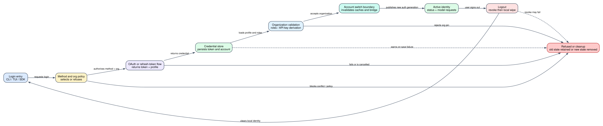

# Claude Code CLI 2.1.235 账号、认证与订阅生命周期：登录成功以后到底改变了什么

> 版本：`2.1.235` | 主证据：目标版本可读化 bundle 的 `Static` 可达路径 | 运行边界：没有把 Anthropic OAuth 服务、组织风控或订阅计费后端冒充成本地 CLI 实现

**读者问题：** 执行 `claude auth login` 或 `/login` 后，Claude Code 为什么会切换账号、断开 Remote Control、刷新组织信息；执行 logout 时，又到底清除了哪些东西？

**一句话模型：** Claude Code 把一次登录拆成登录方式裁决、OAuth/Token 获取、本地凭据保存、账号与组织校验、派生 API key/角色信息、运行时缓存换代六步；logout 则先尝试远端撤销 refresh token，再清本地凭据和账号派生缓存，但远端撤销失败不会阻止本地退出。

图中最重要的结论是：**“浏览器显示登录成功”不是最终提交点。** 新 token 还要进入本地存储、通过组织策略校验并替换旧账号派生状态，当前进程才真正进入新身份。

## 60 秒看懂一次账号切换

沿用一个贯穿全文的场景：开发者当前登录个人 Claude subscription，正在一个 Remote Control 会话中；管理员随后要求该机器只允许组织 `ORG-B`，开发者通过 `/login` 切换到公司账号。

完整成功路径是：

1. `/login` 读取 `forceLoginMethod`、`forceLoginOrgUUID` 和 Gateway 策略，决定允许哪种登录方式。
2. OAuth service 生成浏览器 URL；浏览器无法自动回调时，用户可以粘贴 `authorizationCode#state`。
3. CLI 拿到 access/refresh token 和 profile，先用保留当前进程 token 的 logout 变体清掉旧账号持久状态。
4. 新 profile 写入 account、organization、billing、trial、seat 等字段；OAuth token 尝试写入 secure storage。
5. CLI 拉取角色信息；若 token 不是 Claude subscription 范围，则尝试派生 API key。
6. 组织 pin 校验通过后，CLI 清理模型、用量、client-data、prompt-window 等账号相关 cache。
7. 因 account UUID 已改变，Remote Control bridge 被断开，trusted-device 和账号相关 UI state 重新建立。

### 登录前后哪些对象发生变化

| Object | Before | Transformation | After | User-visible effect |
| --- | --- | --- | --- | --- |
| 登录方式 | 用户可选 subscription / Console | managed policy、CLI 参数和 Gateway gate 裁决 | 得到唯一允许的登录路径 | 冲突或被策略禁止时，浏览器不会打开 |
| OAuth 凭据 | 旧账号 token 或无 token | 获取、保存或进程内兜底 | 新 access/refresh token 成为 first-party credential | 新请求使用新身份；保存失败会出现 warning |
| `oauthAccount` | 个人账号与旧 organization | profile/token account 覆盖 | 公司 account/org、billing、trial、seat、role | `/status`、模型与额度界面切换 |
| 派生 API key | 可能属于旧 Console 身份 | 非 Claude subscription scope 时重新创建 | 新 API key 写入对应 credential store | Console billing 路径可以继续调用 Messages API |
| 运行时 cache | 旧模型可见性、org default、用量、client data | account-switch invalidation | 下一次读取重新计算 | 切换后不会沿用旧组织模型和额度 |
| Remote Control / trusted device | 绑定旧账号 | 检测 account UUID 变化 | bridge 断开并重新 enrollment | 远端会话停止，避免跨账号继续控制 |
| logout 状态 | 本地与远端都可能持有 refresh token | 尝试 revoke，再删除本地凭据 | 本机退出；远端 revoke 可能失败 | 本机不再登录，但别处的 token 是否失效取决于 revoke 结果 |

## 先把五个容易混淆的概念分开

| 概念 | 2.1.235 中的含义 | 不代表什么 |
| --- | --- | --- |
| `authMethod` | CLI 对当前有效凭据来源的归类：`claude.ai`、`oauth_token`、`api_key`、`api_key_helper`、`third_party`、`none` | 不等于 wire header；多个来源最终都可能形成 bearer |
| account | 人的账号 UUID 和 email | 不等于 organization；一个账号切换组织会改变授权边界 |
| organization | organization UUID/name、role、seat/billing/trial 等派生信息 | 不等于 subscription；组织席位和个人订阅是不同来源 |
| subscription | `subscriptionType`、billing/trial/seat 等客户端已知状态 | 不证明服务端实时可用额度或支付状态 |
| provider | `firstParty`、Gateway、Bedrock、Vertex、Foundry 等请求 owner | 第三方 provider 可以完全不使用 Anthropic OAuth |

`claude auth status` 正是把这些层拆开输出，而不是只返回一个布尔值。JSON 默认包含 `loggedIn`、`authMethod`、`apiProvider`；存在 managed 强制方式时加 `forcedLoginMethod`，存在 API key 来源时加 `apiKeySource`；只有 `authMethod === "claude.ai"` 才补充 email、org ID/name 和 subscription type。[状态字段：627912-627939](../reverse/javascript/cli.readable.js#L627912)

## 谁拥有哪一份账号状态

| Owner | 持有状态 | 写入/刷新时机 | 清理时机 | 边界 |
| --- | --- | --- | --- | --- |
| OAuth server | authorization code、access/refresh token、撤销状态 | 浏览器/device flow、refresh、revoke | token 过期或服务端撤销 | 服务端风控、MFA、账号冻结算法不在 bundle 内 |
| secure credential storage | `claudeAiOauth`、design OAuth、organization UUID、Gateway credential 等 | login/token refresh | logout 或账号切换 | backend 可以是平台 keychain/受控存储；具体 OS 实现另见 native/credential 分析 |
| global config | `oauthAccount`、订阅/额度/model/client-data cache | profile/roles/usage 拉取 | logout 清空账号派生字段 | 存的是身份元数据和 cache，不应存明文 setup token 文档 |
| process-local state | access token fallback、provider/model cache、Remote bridge、trusted-device generation | login 完成、401 refresh、settings reload | account switch/logout/restart | 进程退出即丢失，但已落盘 token 可恢复 |
| environment | `CLAUDE_CODE_OAUTH_TOKEN`、refresh token/scopes、API key | 启动前由调用方提供 | CLI 只能 unset 当前进程变量 | shell profile/settings 中的旧值不会被 CLI 自动删除 |
| organization/Gateway policy | 强制登录方式、组织 pin、managed settings | 启动和登录后刷新 | policy 更新或重新登录 | 客户端只执行已收到的策略，不实现企业 IdP 的判定 |

## 入口面：三个登录入口共享核心，但交互合同不同

### `claude auth login`

Commander 注册的参数是：

- `--email`：预填登录页 email；
- `--sso`：强制 SSO 登录路径；
- `--console`：Anthropic Console/API usage billing；
- `--claudeai`：Claude subscription，默认路径。

`--console` 与 `--claudeai` 同时出现会在任何网络动作前退出。若 managed `forceLoginMethod` 是 `gateway`，非交互 `auth login` 也会直接拒绝，并要求进入交互 `/login`，因为 Gateway 登录还需要证书/managed-settings 等会话级处理。[CLI 注册：630183-630198](../reverse/javascript/cli.readable.js#L630183)，[登录前置 gate：627842-627853](../reverse/javascript/cli.readable.js#L627842)

### `/login`

`/login` 是 TUI 中的 `local-jsx` command。它不仅显示 OAuth UI，还在成功后执行当前会话的身份边界处理：

- Gateway 首次请求证书 pin 不一致时，清掉新 Gateway credential并结束当前 session；
- managed settings 需要重启才能完整生效时，先保存 transcript，再尝试 relaunch；
- account UUID 变化时断开 Remote Control；
- 清空旧 trusted-device、模型/组织 cache 和 ultrareview overage confirmation；
- 同账号同组织且已有 token 时可以跳过重复 enrollment。

因此，`auth login` 的“命令成功”与 `/login` 的“当前交互会话已经安全迁移到新身份”不是完全相同的外层生命周期。[交互后处理：486299-486471](../reverse/javascript/cli.readable.js#L486299)

### SDK `claude_authenticate`

SDK control request 会先验证强制登录方式，然后以 `skipBrowserOpen: true` 启动 OAuth flow，把 `manualUrl` 和 `automaticUrl` 返回给 host。host 再发送 `claude_oauth_callback` 或等待 `claude_oauth_wait_for_completion`。成功后 SDK 回传 account 的 email、organization、subscription、token source、API key source 和 provider。

SDK 不负责绕过组织 pin：`mhr()` 保存身份后仍调用组织校验，失败时明确要求从 terminal 运行 `claude auth login` 查看细节。[SDK authenticate/callback：602156-602189](../reverse/javascript/cli.readable.js#L602156)

## 登录成功路径：六个阶段缺一不可

### Phase 1：登录方式和组织先被策略收窄

客户端同时读取普通配置和 managed policy：

1. CLI 参数先解决用户显式选择；
2. `forceLoginMethod` 检查选择是否被允许；
3. 只有登录方式没有违反 policy 时，`forceLoginOrgUUID` 才进入 OAuth request；
4. Gateway 强制方式只允许交互流程。

这条顺序很重要：若方法本身被禁止，CLI 不会把组织 UUID 继续带入一个错误的 OAuth flow。managed `forceLoginOrgUUID` 支持单字符串或 JSON 字符串数组的规范化；格式错误会记录 policy warning 而不是把畸形值发给 OAuth。[组织策略解析：622900-622950](../reverse/javascript/cli.readable.js#L622900)

### Phase 2：浏览器回调不是唯一输入

普通 CLI 创建 OAuth service 后监听 stdin。手工输入必须是 `authorizationCode#state`；缺少任一部分只提示 invalid code，不提交半个 credential。flow callback 同时打印浏览器 URL和粘贴提示，finally 中关闭 readline 并 cleanup service，避免失败后残留监听器。[浏览器与手工 code：627876-627910](../reverse/javascript/cli.readable.js#L627876)

环境也可直接提供 `CLAUDE_CODE_OAUTH_REFRESH_TOKEN`，但必须同时提供空格分隔的 `CLAUDE_CODE_OAUTH_SCOPES`。缺少 scopes 时本地退出，因为 refresh token 本身不能可靠说明它被签发了哪些能力。可选 `CLAUDE_CODE_OAUTH_CLIENT_ID` 会一起进入 refresh。[refresh-token 登录：627853-627875](../reverse/javascript/cli.readable.js#L627853)

### Phase 3：新凭据落盘前先隔离旧账号

`mhr()` 先读取旧 account，再比较新 token/profile 的 account UUID 和 organization UUID。它调用 logout 核心时设置：

- `preserveInProcessTokens: true`：不先删掉刚拿到、尚未保存的新 token；
- `preserveNonAnthropicAuth: true`：账号切换不应顺带清空其它 provider credential；
- `preserveQuotaAutoResume`：只有同账号同组织时才保留 quota auto-resume 状态。

随后 profile 被写成 `oauthAccount`：account UUID/email、organization UUID、display/full name、extra usage、billing type、subscription/account 创建时间、onboarding flags、trial 结束时间与天数、seat tier、profile fetch time。token response 只有精简 account 信息时，也至少保存 account/email/org UUID。[账号切换与 profile：433926-433941](../reverse/javascript/cli.readable.js#L433926)

### Phase 4：token 保存失败不等于立即丢失当前会话

只有 Claude subscription scopes 且同时有 refresh token、expires-at 的 token 才写 `claudeAiOauth`。inference-only token 或非 claude.ai scopes 不会被错误塞进这份持久结构。保存失败会返回 warning、清 credential cache，并由上层记录 `tengu_oauth_storage_warning`；当前进程还可以保留 access token fallback，但重启后的恢复能力下降。[持久化条件与 warning：86870-86912](../reverse/javascript/cli.readable.js#L86870)

这解释了一个常见现象：终端显示 `Login successful`，当前请求可用，但下一次启动又要求登录。此时应检查 credential backend warning，而不是只看 OAuth 回调是否成功。

### Phase 5：subscription scope 决定派生动作

保存后，CLI 总会尝试拉取 roles 并补全 organization/workspace role 和 organization name。然后分支：

- Claude subscription scope：获取 first-token date 等订阅派生信息；
- 非 subscription scope：请求创建 API key；服务端接受但没有返回 `raw_key` 时，整个登录失败。

因此 `--console` 不是“换一张登录页面”这么简单，它最终可能把 OAuth 身份换成 Messages API 使用的 API key。[角色与 API key：78314-78330](../reverse/javascript/cli.readable.js#L78314)

### Phase 6：组织校验和 cache 换代形成提交点

CLI 命令在 `mhr()` 后调用组织策略校验。校验不通过会进入专门失败清理，而不是保留一个“不符合组织 pin 但已经写入”的静默状态。成功后才输出 `Login successful`。

cache invalidation 会清理 provider/model config、OAuth/profile lookup、usage、client data、auto-compact window、org model default 等状态，并以 `account_switch` 通知相关订阅者。交互 `/login` 还会递增 `authVersion`，迫使 UI consumer 重新读取身份。[完整 cache 清理：361927-361937](../reverse/javascript/cli.readable.js#L361927)

## `setup-token`：长寿命凭据，不是普通 login 的别名

`claude setup-token` 是独立 Commander command，描述明确要求 Claude subscription。OAuth UI 进入 `setup-token` mode 时默认选择 subscription 路径，并使用自己的完成状态；它面向需要长期 token 的调用环境，而不是当前 TUI 的普通 session 切换。[命令注册：630196-630198](../reverse/javascript/cli.readable.js#L630196)，[setup-token UI mode：441628-441706](../reverse/javascript/cli.readable.js#L441628)

安全含义是：

- setup token 应被当作可长期调用账户的 secret；
- `auth status` 不会打印 token 本身；
- logout 清本机存储，不代表所有外部复制品都消失；
- 自动化环境应避免把 setup token、refresh token 或完整 callback code 写入日志。

## `auth status` 字段逐项解释

| Field | 何时出现 | 真正说明什么 | 不能据此推出什么 |
| --- | --- | --- | --- |
| `loggedIn` | 总是 | 当前至少存在一种有效 credential 来源 | 不证明下一次网络请求一定成功 |
| `authMethod` | 总是 | CLI 对 credential source 的归类 | 不直接显示 header shape 或 refresh 能力 |
| `apiProvider` | 总是 | 当前请求 provider selector | 不说明 organization 或 subscription |
| `forcedLoginMethod` | managed policy 存在 | 后续登录必须满足的方式 | 不代表当前 token 已通过最新远端策略刷新 |
| `apiKeySource` | API key source 存在 | key 来自环境、helper 或 managed login | 不打印 key，也不验证余额 |
| `email` | `claude.ai` | 本地 profile 中的账号 email | 可能是最近一次成功 profile，不是实时目录查询 |
| `orgId` / `orgName` | `claude.ai` | 当前本地 organization identity | 不等于 workspace role 或所有可见组织 |
| `subscriptionType` | `claude.ai` | profile/refresh 派生的 subscription classification | 不等于实时 rate-limit utilization |

未登录时 JSON 仍输出结构，但 command exit status 是 1；已登录时是 0。`--text` 会组合可用的状态 notices，若没有 credential 则明确提示运行 `claude auth login`。[状态和退出码：627912-627939](../reverse/javascript/cli.readable.js#L627912)

## Logout：远端撤销、持久删除和 cache 清理是三层动作

`auth logout`、`/logout`、fleet-host logout 最终进入同一个 `performLogout` 核心，但传入的 `clearOnboarding` 不同。核心顺序是：

1. flush telemetry；
2. first-party 且不保留 process token 时，读取 secure storage 中的 Claude/design refresh token并调用 revoke；
3. unset 当前进程 `CLAUDE_CODE_OAUTH_TOKEN`，清 process token；
4. 清 API key/login state；
5. 删除 secure credential store；cowork remote device identity 会尝试跨 wipe 搬回；
6. 清 account/provider/model/usage/client-data/compact-window cache；
7. 清 `oauthAccount` 等全局配置字段；
8. `/logout` 的 fleet-host 变体还会重置 onboarding、subscription notice、custom API-key approval 等 UI 状态。

远端 revoke timeout 是 5 秒。HTTP 或网络失败只记录 `oauth_token_revoke` failure，并明确继续 local logout；所以“本机已退出”与“refresh token 已在服务端失效”必须分开判断。[revoke 失败继续：78307-78313](../reverse/javascript/cli.readable.js#L78307)，[完整 logout：361874-361937](../reverse/javascript/cli.readable.js#L361874)

## 失败与恢复矩阵

| Failure | Detection | Retry/change | State retained | Final user effect |
| --- | --- | --- | --- | --- |
| `--console` 与 `--claudeai` 冲突 | argv gate | 不重试 | 旧凭据不变 | exit 1，浏览器不打开 |
| managed method 拒绝 | login method/policy check | 改用允许的 `/login` 或 Gateway flow | 旧凭据不变 | 显示强制方式 |
| refresh token 缺 scopes | env contract | 补 `CLAUDE_CODE_OAUTH_SCOPES` 后重启 | 旧凭据不变 | exit 1，无 token exchange |
| 浏览器/手工 code 失败 | OAuth service | 可重新开始 flow | 旧身份仍在；service cleanup | 显示 provider/OAuth 错误 |
| secure storage 写失败 | credential mutate result/exception | 当前进程保留 access-token fallback | profile 可能已更新，持久 refresh 不可靠 | 本轮可能可用，重启可能需再登录 |
| 组织 pin 不满足 | post-login org validation | 使用允许的 org/method 重新登录 | 失败路径清理不合规新身份 | login 被阻断 |
| Gateway cert pin 不匹配 | 登录后首次 managed-settings fetch | 清新 Gateway credential并结束 session | transcript 尽量保留 | 防止半应用 Gateway 身份 |
| logout revoke 失败 | 5 秒网络/HTTP 错误 | 不阻止本地清理 | 服务端 token 状态未知 | 本机退出成功，外部复制品需另行处理 |
| secure store wipe 失败 | storage delete/mutate | fallback retry；必要时报告失败 | 可能仍有本地 credential | logout command 失败，不能宣称已清干净 |

## 不可逆副作用与恢复边界

- Remote revoke 成功后，旧 refresh token 不能靠恢复本地文件重新启用。
- account switch 断开的 Remote Control 连接不会因切回旧配置自动续上，需要重新建立会话。
- 新登录触发 trusted-device enrollment 或 Gateway managed-settings relaunch 后，外部系统可能已经记录设备/会话；删除本地 cache 不会删除服务端审计。
- logout 只 unset 当前 process env。shell profile、CI secret、父进程环境或其它 token 副本不由 CLI 修改。
- `oauthAccount`、usage/model cache 可以重建，但服务端 subscription、seat、billing、risk decision 不是本地回滚对象。

## 成本、隐私与安全影响

| Dimension | 影响 |
| --- | --- |
| Latency | 登录至少包含 OAuth exchange、profile/roles、可能的 API-key 创建、组织校验和 Gateway settings fetch；不是单一 HTTP 请求 |
| Availability | secure storage 写失败可让当前进程短暂工作，但降低重启恢复性；Gateway settings/cert failure会主动结束 session |
| Privacy | `auth status --json` 可输出 email、organization、subscription；适合诊断，不应无筛选上传公共 CI 日志 |
| Secret handling | callback code、access/refresh/setup token 都是 credential；status 和 telemetry 路径不应记录原值 |
| Cross-account safety | account UUID 变化会清 cache、断 Remote bridge、重建 trusted device，防止旧组织状态渗入新账号 |
| Recovery | 本地 metadata/cache 可通过重新登录恢复；服务端 revoke、账号冻结、seat/订阅变化只能由远端身份和计费系统解决 |

## 微小但关键的特性

- `CLAUDE_CODE_OAUTH_TOKEN` 已设置时，交互 `/login` 会提醒：当前会话切到新 credential，但 shell profile/settings 仍可能让下次启动重新使用旧 token。
- token refresh response 未返回新 refresh token 时会保留旧 token，不会把恢复能力清空。[refresh 语义：78280-78306](../reverse/javascript/cli.readable.js#L78280)
- logout 会尽力保留 cowork remote-device identity，但不会保留 Anthropic account credential。
- `auth status` 的 `loggedIn` 可以由 API key、OAuth、third-party provider 或 helper 满足；不能把它当作“已登录 Claude subscription”。
- `forceLoginOrgUUID` 只有在登录方式本身满足 policy 时才进入 OAuth flow。
- 登录成功会清 auto-compact window cache，因为组织/模型变化可能改变上下文窗口；认证和上下文治理并非完全独立。

## 证据等级与明确边界

### Static

- Commander auth/setup-token surface：[630183-630198](../reverse/javascript/cli.readable.js#L630183)
- CLI login/status/logout 主链：[627842-627948](../reverse/javascript/cli.readable.js#L627842)
- token/profile 保存与账号切换：[433926-433941](../reverse/javascript/cli.readable.js#L433926)
- OAuth storage 条件与 warning：[86870-86912](../reverse/javascript/cli.readable.js#L86870)
- 完整 logout/cache invalidation：[361874-361937](../reverse/javascript/cli.readable.js#L361874)
- `/login` 当前会话身份边界：[486299-486471](../reverse/javascript/cli.readable.js#L486299)
- SDK authenticate/callback/wait：[602156-602189](../reverse/javascript/cli.readable.js#L602156)

### Probe

本仓库已有 exact-binary request probes 证明 API-key 与 bearer 两种 header shape，但本专题没有新增真实 OAuth、组织切换或 revoke probe。原因是这些路径需要外部账号、浏览器和服务端状态；因此本文不声称在隔离环境中观察过真实 subscription 切换。

### Public

公开 authentication 文档可解释 API key 与 bearer 的产品合同；本专题的 `forceLoginMethod`、组织 pin、secure-store warning、Remote bridge 断开和 logout 顺序仍以 `2.1.235` Static 路径为准，不把当前官网行为倒灌成目标版本证据。

### Boundary

本地 bundle 不能证明 Anthropic 服务端的 MFA、账号风控、subscription 计费、seat 分配、token revoke 最终一致性和 organization membership 判定。客户端只能证明它发送了什么、保存/删除了什么，以及收到某类结果后怎样迁移本地状态。
