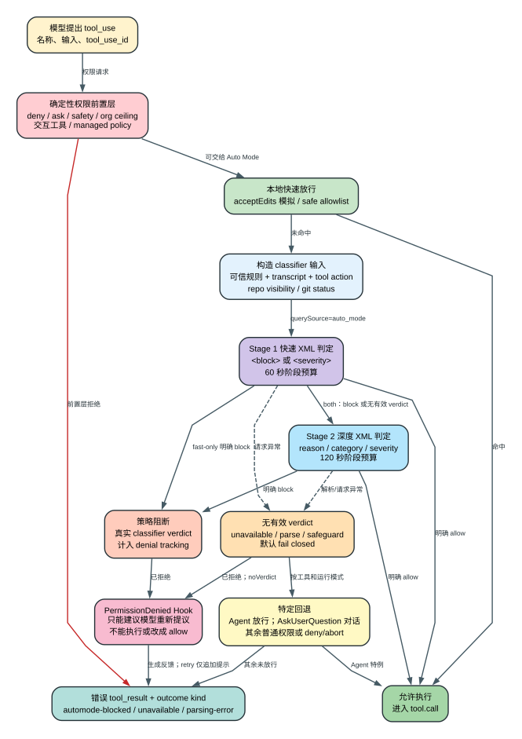

# Claude Code CLI 2.1.235 Auto Mode：权限系统里的两阶段 AI 分类器

Auto Mode 不是“模型想做什么就自动批准”，也不是一套取代权限规则的万能风控。它位于 Claude Code 本地权限系统中：确定性的 `deny`、`ask`、交互要求、组织上限和 safety floor 先裁决；只有仍需判断的动作才可能进入一个客户端驱动的两阶段分类器。分类器拿到经过整理的对话、工具动作、可信配置规则和少量环境事实，返回 XML verdict；客户端再把 verdict 映射为允许、策略阻断或 fail-closed。

本文只解释 **2.1.235 发布 bundle 中可达的客户端实现**。模型为什么给出某个判断、服务端 safeguard 如何工作、远端配置在某个账号上的实时取值，以及真实世界识别质量，均属于本文明确标出的 `Boundary`。

## 60 秒理解 Auto Mode

**读者问题：** 为什么开启 Auto Mode 后，有些 Bash 不问就执行，有些动作仍弹审批，有些又显示“分类器不可用”并拒绝？

**一句话模型：** Auto Mode 是权限管线中的一个 AI verdict 层；确定性规则先挡住不能交给分类器的动作，本地快速路径再放行明显安全的动作，剩余请求才进入 Stage 1/Stage 2，任何没有形成有效 verdict 的普通工具默认 fail closed。



贯穿场景：模型准备执行 `Bash("git push origin main")`。

1. 客户端先查 deny/ask/managed policy、工具交互要求、组织审批上限和当前 permission mode；其中任一层要求阻止或询问，就不会让分类器越权覆盖。
2. 如果动作在 `acceptEdits` 模式模拟下本来就会允许，或命中客户端 safe allowlist，可跳过分类器。
3. 否则客户端把历史 transcript、最新 Bash 调用、用户规则、repo visibility/git status 等事实送入 Auto Mode classifier。
4. Stage 1 可以直接给出 allow；默认 `both` 模式下，Stage 1 的 block 倾向还要进入 Stage 2 深判。
5. Stage 2 明确 block 才是策略拒绝。API 不可用、XML 解析失败和 safeguard refusal 都会阻止普通工具，但这类 fail-closed **不等于分类器判断该命令危险**。
6. 拒绝后可以运行 `PermissionDenied` Hook。Hook 的 `retry:true` 只给下一轮模型追加“可以重试提议”的提示，原始工具调用仍未执行。

| 状态 | 谁拥有 | 成功时 | 失败时 | 是否已执行工具 |
| --- | --- | --- | --- | --- |
| 确定性权限前置层 | 本地 permission/policy engine | 允许继续、直接允许或进入询问 | deny/ask/floor 终止 Auto Mode 路径 | 否 |
| 快速路径 | 本地工具规则 | `acceptEdits` 模拟或 safe allowlist 直接放行 | 未命中才构造 classifier 请求 | 否 |
| classifier 输入 | 本地 transcript/rule builder | 得到 system prompt、历史动作和当前 action | 上下文超限进入专用 fallback | 否 |
| Stage 1/2 | 模型请求 + 本地 XML parser | `shouldBlock=false/true` | unavailable、parse failure、refusal 都无可靠 verdict | 否 |
| PermissionDenied Hook | 本地 hook runner | 可给模型追加 retry 建议 | Hook 错误不改变原 denial | 否 |
| `tool.call` | 工具实现 | 真正产生文件、进程或远端副作用 | 只有前面最终 allow 才能到达 | 是 |

## 1. Auto Mode 在权限管线的准确位置

基础 permission engine 先执行确定性判断，顺序可从 [395300-395335](../reverse/javascript/cli.readable.js#L395300) 恢复：

```text
deny rule
-> tool.checkPermissions / tool 自身 safety check
-> ask rule
-> requiresUserInteraction
-> 组织级 ask ceiling / safety floor
-> bypassPermissions 或 plan-bypass
-> allow rule
-> 普通 ask
```

Auto Mode 的外层入口位于 [395392-395501](../reverse/javascript/cli.readable.js#L395392)。它处理有效模式为 `auto` 的请求；配置允许时，`plan` 也可以采用 Auto Mode 语义，但 plan-mode floor 仍能把动作退回 ask。这里最重要的不是“分类器有多聪明”，而是 **哪些裁决根本不交给它**：

- safety check 若标记为不可由 classifier 批准，直接回退 ask/deny；
- 显式 ask rule、MCP server policy、组织 `effectiveMaxPermission=ask` 保留审批上限；
- `requiresUserInteraction` 工具通常回到真实对话框；
- managed policy、deny rule、sandbox 和工具自身校验不会被 Auto Mode 替代；
- 排队等待 classifier 后，客户端重新读取 permission mode 和 Auto Mode active 状态。期间模式发生变化时，旧 verdict 不会直接套到新模式。

因此，Auto Mode 的权限关系不是“AI classifier > 所有规则”，而是：

```text
确定性安全下限和组织上限
            >
可分类的普通 permission ask
            >
Auto Mode verdict
            >
实际 tool.call 内的 sandbox / OS / 远端权限
```

### 两条本地快速路径

分类器调用有 token、延迟和可用性成本，所以 2.1.235 先做两类本地 fast path [395429-395452](../reverse/javascript/cli.readable.js#L395429)：

1. **`acceptEdits` 模拟。** 客户端用经过过滤的 allow rule 和 permission layer 重新调用工具权限检查；如果该动作在 `acceptEdits` 下会直接允许，就以 `decisionReason.mode=auto` 放行。working-directory 场景还可以把已链接 worktree 作为临时允许范围再次计算。
2. **safe allowlist。** 对本版明确列入安全快速路径的工具/输入直接允许，并记录 `fastPath=allowlist`。

快速路径只是省掉 classifier 请求，不会越过此前已经命中的 deny、ask、组织上限或交互要求。

## 2. 配置不是简单对象覆盖

### 可配置字段

Auto Mode schema 暴露五个核心字段 [39898](../reverse/javascript/cli.readable.js#L39898)：

| 字段 | 进入 prompt 的位置 | 语义 |
| --- | --- | --- |
| `environment[]` | 环境说明 | 告诉 classifier 当前项目、组织、基础设施和常用工作方式 |
| `allow[]` | allow section | 对默认 block 规则做窄范围 carve-out，仍受用户显式边界约束 |
| `soft_deny[]` | soft block section | 默认阻断破坏性/不可逆动作；足够具体的用户授权可以清除 |
| `hard_deny[]` | hard block section | 安全边界；用户意图不能清除 |
| `classifyAllShell` | permission fast-path gate | Auto Mode 活跃时暂停 Bash/PowerShell allow rule，让 shell 动作都经过 classifier |

`skipAutoPermissionPrompt` 和 `useAutoModeDuringPlan` 是 Auto Mode 周边开关，不属于四段 classifier prompt 内容。

### 只有三个可信来源可以写 classifier 规则

规则聚合器只接受 `userSettings`、`flagSettings`、`policySettings`。`projectSettings` 和 `localSettings` 由仓库内容影响，若其中出现合法 `autoMode` block，客户端只告警并忽略 [42983-43007](../reverse/javascript/cli.readable.js#L42983)。这是一个明确的 prompt-injection 边界：项目不能通过提交 settings 自行放宽分类器。

三个可信来源的数组按来源顺序 **追加**，不是高优先级对象把低优先级整段覆盖。`classifyAllShell` 则独立计算：任一可信来源为 `true` 即生效。

### `$defaults` 是有位置的 splice 指令

`allow`、`soft_deny`、`hard_deny` 和 `environment` 使用同一个展开器 [277417-277427](../reverse/javascript/cli.readable.js#L277417)：

- 自定义数组不存在或为空：完整使用 shipped defaults；
- 第一次遇到字面量 `$defaults`：在该位置插入默认项；
- 后续重复 `$defaults`：忽略；
- 没有 `$defaults`：该数组完全替换默认段，而不是自动追加。

这使规则顺序可控，例如：

```json
{
  "autoMode": {
    "soft_deny": [
      "先执行的组织补充规则",
      "$defaults",
      "默认规则之后的项目特定规则"
    ]
  }
}
```

prompt builder 会把四个命名 slot 和 `<settings_deny_rules>` 替换为最终文本 [277437-277462](../reverse/javascript/cli.readable.js#L277437)。普通 `permissions.deny` 还会被转成一段防绕过指令：即使模型换用 Bash、`python -c`、`sed -i` 或 heredoc 实现相同效果，也应阻断 [277433-277435](../reverse/javascript/cli.readable.js#L277433)。

`classifyAllShell=true` 不会删除用户的 shell allow rule。它只在 Auto Mode 活跃时暂停这些 allow fast path；离开 Auto Mode 后原规则仍生效 [328236-328249](../reverse/javascript/cli.readable.js#L328236)。

## 3. 分类器究竟看到了什么

默认 system prompt 不是一句“判断是否危险”，而是一份长安全合同 [325417-325749](../reverse/javascript/cli.readable.js#L325417)：

- threat model：prompt injection、scope creep、accidental damage；
- 默认原则：不匹配 hard/soft block 的动作允许；
- hard block 与 soft block 的差异；
- 用户授权的高证据门槛和用户边界的低证据门槛；
- 对 assistant proposal、用户简短 `yes`、第三方消息插入、引用文本的解释规则；
- push、发布、凭据、共享资源、生产变更、破坏性 Git 等细分类别；
- 明确排除低质量代码、浪费 token、错误答案等非权限风险。

所以 classifier 判断的对象是“这一次工具动作是否越过安全/授权边界”，不是评价 Agent 工作质量，也不是 Anthropic 账户级 abuse scoring。

### transcript 不是原始 messages 直接拼接

输入构造器位于 [326273-326310](../reverse/javascript/cli.readable.js#L326273)。它会：

1. 从可见历史生成 classifier transcript，并按 role 统计用户、assistant 和 tool action 长度；
2. 清理或格式化工具 input，保留当前待判断的 tool call 为最后 action；
3. 对特定 git/gh 外发动作补充 repo visibility；
4. 对可能破坏未提交内容的动作补充 live `git status`；
5. 给 transcript 尾段和当前 action 设置 prompt-cache breakpoint；
6. 估算 `classifierChars / 4` 作为 token 诊断，但真实上下文限制仍由模型/API 返回决定。

历史工具 outcome 也有严格语义 [325434-325441](../reverse/javascript/cli.readable.js#L325434)：`ok` 只代表 harness 没报告执行错误，不代表动作安全；`interrupted` 表示可能部分执行；`automode-unavailable` 与 `automode-parsing-error` 代表 fail-closed 而非策略判断；后台任务的 `ok` 只证明启动成功。

## 4. 两阶段 XML classifier

默认远端配置缺省值是 `twoStageClassifier="both"`；远端也可以选择 `fast` 或 `thinking` [326424-326430](../reverse/javascript/cli.readable.js#L326424)。默认 `both` 的执行方式如下。

### Stage 1：低输出预算的快速筛选

Stage 1 请求使用 `querySource="auto_mode"`，默认输出上限为 `64 + thinking overhead`；若配置为 fast-only，则为 `256 + thinking overhead`。阶段外层超时为 60 秒，请求 SDK timeout 也是 60 秒 [277499](../reverse/javascript/cli.readable.js#L277499)、[326151-326169](../reverse/javascript/cli.readable.js#L326151)。

XML parser 接受 `<block>yes|no</block>`；启用 severity 模式时读取唯一 `<severity>` 数字。冲突的多个 block、缺失标签、未闭合 thinking 或不合格 stop reason 都会得到 `null`，不会猜测 [326102-326140](../reverse/javascript/cli.readable.js#L326102)。

- Stage 1 明确 allow：立即返回，不再调用 Stage 2；
- fast-only 明确 block：直接阻断；
- 默认 both 下明确 block：进入 Stage 2 复核；
- Stage 1 无有效 verdict：默认 both 仍可进入 Stage 2，但失败状态会被保留用于后续错误归因。

### Stage 2：给理由和分类的深判

Stage 2 输出预算为 `8192 + thinking overhead`，阶段外层超时 120 秒。它返回最终 block/allow，并可携带 `<reason>`、受客户端 allowlist 约束的 `<category>`、thinking 和 severity [326172-326177](../reverse/javascript/cli.readable.js#L326172)。

Stage 2 可以推翻 Stage 1 的 block 倾向而允许动作。反过来，如果 Stage 2 没形成有效 verdict，客户端不会凭空当作 allow：

| 失败形态 | 客户端结果 |
| --- | --- |
| Stage 2 parse failure | `shouldBlock=true`，带 `failureMode`，属于 no-verdict fail-closed |
| Stage 1 已 block，Stage 2 safeguard refusal | 保留 Stage 1 block 理由，避免 refusal 把已有阻断变成 allow |
| Stage 1 已完成、Stage 2 请求异常 | 以 Stage 1 assessment 阻断，并注明通常可重试 |
| Stage 1 尚无结果、请求异常 | `unavailable=true`，普通工具 fail closed |
| transcript/context too long | `transcriptTooLong=true`，交给专用 fallback，而不是伪造风险 verdict |

请求内部默认 `maxRetries=4`，可由远端配置改为非负整数；XML 无法解析时也会在阶段预算内受限重试。某个 classifier beta 被 HTTP 400 拒绝时，客户端可在剩余阶段时间内去掉该 beta 重试；成功后为本 session 锁存“不要再带该 beta” [326219-326268](../reverse/javascript/cli.readable.js#L326219)。

`unavailableOuterRetries` 默认是 0，远端只接受 0-10；指数等待从 2 秒起，封顶 10 秒并带随机抖动 [326310-326317](../reverse/javascript/cli.readable.js#L326310)、[326410-326423](../reverse/javascript/cli.readable.js#L326410)。classifier model、按主模型映射和 fallback 候选也可以受远端配置及组织 model policy 影响；**某账号在某一时刻究竟取到什么值，bundle 无法证明。**

## 5. Fail closed 不等于“判定危险”

权限入口对 classifier 返回值做二次映射 [395470-395501](../reverse/javascript/cli.readable.js#L395470)。必须把三类 denial 分开：

| 类型 | 条件 | 含义 | denial counter |
| --- | --- | --- | --- |
| 策略阻断 | 有明确 `shouldBlock` verdict，且非 unavailable/超长/refusal | classifier 判断动作命中策略 | 计入 |
| unavailable | API、transport、abort 等导致没有 verdict | 为防误执行而拒绝，不是危险结论 | 不作为普通策略拒绝累计 |
| no verdict | XML parse failure、safeguard refusal 等 | 输出无法可靠解释或被独立 safeguard 拦截 | `noVerdict=true`，不按普通拒绝处理 |

失败回退按工具和运行模式细分：

- **transcript too long + `Agent` 工具：直接 allow。** `fi` 在本版绑定为 `Agent` [115490](../reverse/javascript/cli.readable.js#L115490)，特殊分支位于 [395474-395479](../reverse/javascript/cli.readable.js#L395474)。这不是“所有超长请求都放行”。
- **AskUserQuestion：** transcript 超长或 classifier unavailable 时回到真实 question dialog。
- **headless/不可弹权限框：** transcript 超长或 safeguard refusal 会 abort Agent，避免静默猜测。
- **`dontAsk`：** 不能回退弹框时返回 deny。
- **其余交互场景：** transcript 超长可退回普通 permission handling；真正 unavailable 的普通工具直接 deny，并给重试指导。

tool-result 侧会把 denial kind 明确编码 [315769-315777](../reverse/javascript/cli.readable.js#L315769)：

```text
明确策略拒绝       -> automode-blocked
classifier 不可用  -> automode-unavailable
无有效 verdict     -> automode-parsing-error
```

这三个值随后进入 transcript，下一次 classifier 可以区分“之前被判危险”和“之前只是系统没得出结论”。

## 6. PermissionDenied Hook 能做什么，不能做什么

拒绝结果已经构造后，只有 `decisionReason.type=classifier` 且 `classifier=auto-mode` 的 denial 会运行 `PermissionDenied` Hook [316295-316318](../reverse/javascript/cli.readable.js#L316295)。

Hook 可以看到工具名、tool-use ID、输入和拒绝理由。若任一 Hook 返回 `retry:true`，客户端给后续 Agent Loop 追加一条 meta 消息：`The PermissionDenied hook indicated you may retry this tool call.` [91994-92002](../reverse/javascript/cli.readable.js#L91994)。

边界必须说清：

- 原工具在本次 denial 中 **没有执行**；
- Hook 不能把 deny 改成 allow，也不会替用户点击审批；
- `retry:true` 只鼓励模型重新提议、缩小范围或换一种合法动作；
- `noVerdict=true` 时即使 Hook 请求 retry，也不追加这条提示，避免把解析/可用性故障伪装成策略纠正；
- Hook 自身失败不会倒转 denial。

## 7. `/auto-mode-setup` 如何避免“模型写完直接生效”

2.1.235 把配置建议和配置写入分成两个阶段。

### 交互流程

交互向导会先说明要读取当前项目、近期 Claude sessions，以及用户可选的 shell history/其他仓库；用户选择使用场景（work/open-source/hobby/mixed）和附加扫描范围后，扫描可以后台运行 [467141-467156](../reverse/javascript/cli.readable.js#L467141)、[467254-467279](../reverse/javascript/cli.readable.js#L467254)。

模型只能生成固定 JSON schema 的六个数组：`environment`、`allow`、`soft_deny`、`hard_deny`、`remove_from_permissions_allow`、`notes` [329159-329184](../reverse/javascript/cli.readable.js#L329159)。客户端随后：

1. 校验 JSON shape；必要时只发起一次格式修复请求；
2. 过滤过宽或不允许的 allow proposal；
3. 验证待移除的 `permissions.allow` 必须确实出现在本次扫描的 flagged 列表；
4. 把 proposal 固定标记为 `mode=append` 并写入用户选择的 `scope`；
5. 展示 Environment、Allow carve-outs、Soft blocks、Hard blocks、Notes；
6. 只有用户选择 “Looks good - save it” 才写 settings；decline/cancel 都是零写入；
7. 对危险或绕过 classifier 的旧 `permissions.allow` 再单独询问是否移除，不能随 proposal 自动删除。

交互 review 和后台对话框路径见 [467020-467039](../reverse/javascript/cli.readable.js#L467020)、[467307-467346](../reverse/javascript/cli.readable.js#L467307)。

### 非交互 propose/apply 是 hash-bound 两阶段协议

非交互命令只允许：

```text
/auto-mode-setup [--request-id UUID] --wizard posture=... scope=... depth=... --propose
/auto-mode-setup [--request-id UUID] [--apply-target user|project]
  --expect-sha256 64_HEX --apply-file ABSOLUTE_PATH
```

参数顺序是语法合同：`--request-id` 必须第一，`--apply-target` 只能用于 apply-file，`--expect-sha256` 必须紧贴并位于 `--apply-file` 前；不存在一步完成的 `--apply` [329250-329323](../reverse/javascript/cli.readable.js#L329250)。canonical UUID 校验失败时不会回显非法 token [329238-329248](../reverse/javascript/cli.readable.js#L329238)。

apply 路径有以下写前约束 [329188-329237](../reverse/javascript/cli.readable.js#L329188)：

- proposal 必须是系统临时目录或 Claude config 目录下的绝对路径；
- `permissions.deny` 的 read rule 可以阻止读取；
- 读取使用 `noFollow=true`、`requireNlink1=true`，拒绝 symlink/hard-link 替换类风险；
- 上限 1 MiB，并保留原始 bytes；
- SHA-256 对精确 bytes 计算，不是对 parse 后 JSON 计算；hash 不符时零写入；
- proposal schema、规则和移除列表再次校验；
- `--apply-target` 不决定真实写入位置，只校验 proposal scope 是否与用户/项目选择一致；最终始终写 `userSettings`。

### 最终 settings 写入仍有第二层校验

写入函数 [328728-328813](../reverse/javascript/cli.readable.js#L328728) 不信任 proposal 已校验过：

- `environment` 必须非空，且不能带 `$defaults`；
- 非空 `allow/soft_deny/hard_deny` 必须包含 `$defaults`，否则会意外替换 shipped rules；
- `removeFromPermissionsAllow` 最多 200 条，每条必须是向导可产生的合法 rule string；
- `append` 模式保留并去重已有 environment，规则按各自 slot 合并；
- 合并后的完整 `autoMode` 再过 schema；
- environment 超过 200 项或约 50 KB时告警；整个 autoMode section 接近 settings 文件总上限的四分之一时告警；
- settings 文件不是合法 JSON、磁盘写入失败、合并后无效都返回结构化错误，不进行半可信写入。

## 8. 成本、延迟、隐私和调试字段

每次真正调用 classifier 都是独立模型请求，因此会增加延迟和 token 成本。`classifyAllShell` 会减少 shell allow fast path，通常增加 classifier 调用次数。客户端为 `tengu_auto_mode_decision` 和 session metric 记录：

- decision、tool、是否 MCP、fastPath；
- classifier model、stage、category、failure mode；
- Stage 1/2 各自 request/message ID、耗时、input/output/cache token；
- 总耗时、估算成本、queue depth/wait；
- system prompt/tool calls/user prompts 长度；
- consecutive/total denial 数；
- repo/protected namespace 等风险上下文。

字段装配见 [395470-395497](../reverse/javascript/cli.readable.js#L395470)。这些字段能解释“为什么慢、在哪一阶段失败、是 policy block 还是 unavailable”，但它们不能证明模型内部推理正确。

隐私方面，classifier transcript 会包含对话、工具输入、用户配置的 environment 和选择性本地事实；`/auto-mode-setup` 还可读取项目、近期 sessions、shell history 命令词和其他仓库信息。因此环境规则应避免塞入不必要的秘密，企业部署也应把 classifier endpoint、日志和 retention 当作真实的数据处理面，而不是“纯本地权限判断”。

## 9. 能确认与不能确认的边界

### Static：2.1.235 客户端可以确认

- Auto Mode 的权限位置、前置 floor、快速路径和 mode-change 重检；
- 四段规则、可信来源、数组追加、`$defaults` 插入和 `classifyAllShell`；
- transcript/action/meta 构造和 outcome 语义；
- 两阶段请求预算、XML parser、timeout、retry、beta 降级和 fail-closed；
- Agent/AskUserQuestion/headless/dontAsk 的不同 fallback；
- PermissionDenied Hook 只追加重试提示；
- `/auto-mode-setup` 的 proposal/review/hash-bound apply/settings 写入保护；
- 客户端发出的 telemetry 字段。

### Boundary：发布 bundle 不能确认

- classifier 模型在真实请求上的判断质量、误报率和漏报率；
- 模型内部如何把 prompt 转成 verdict；
- 服务端 safeguard、账户风控、abuse detection 和封禁策略；
- 某个账号当前拿到的远端 model mapping、threshold、retry 或 two-stage 配置值；
- 未执行运行探针时，各 provider/gateway 对 classifier beta、prompt cache 和请求字段的真实兼容性；
- bundle 之外被删去的原始 TypeScript、服务端源码和训练数据。

最后用一句话收口：**Auto Mode 提高的是“普通审批可自动化”的范围，不会取消确定性权限、managed policy、Hook、sandbox 或真实操作系统/远端权限；而 fail-closed 只说明客户端没有得到可安全采用的 allow，不代表模型已经判定动作危险。**
