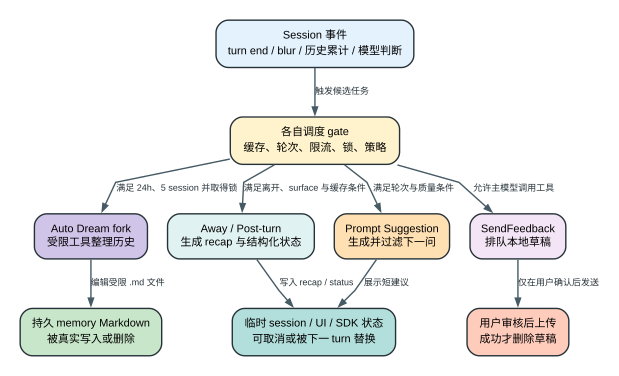

# Claude Code CLI 2.1.235 后台模型任务：哪些只是提示，哪一个会真正改写记忆

一个项目在上次记忆整理后又完成了 5 个 session，当前正在使用第 6 个。距离上次 consolidation 已超过默认的 `24` 小时；某个 turn 结束后，Auto Dream 调度器通过 `10` 分钟扫描节流，列出这 5 个已结束 session，并明确排除仍在变化的当前 session。

这时客户端还不会立即请求模型。它先争抢这份 project memory 的跨进程锁：本地文件后端检查 `.consolidate-lock` 的 PID 和 mtime，Storage V5 后端则用对象版本做 compare-and-swap。另一个 Claude Code 进程若已经持锁，本次任务直接跳过，不会同时启动两个整理 Agent 去覆盖同一批 Markdown。

拿到锁后，客户端在 task registry 中创建一条 `type:"dream"` 的 running task，记录 `sessionsReviewing:5`、空的 `filesTouched/turns`、独立 `AbortController` 和锁之前的 `priorMtime`。随后它 fork 一个 `querySource:"auto_dream"` 的 Agent Loop。发给这个 Agent 的任务 prompt 会列出待整理的 session ID，并直接声明工具边界：

```text
Sessions since last consolidation (5):
- <session-id-1>
- ...

Shell 只允许 ls/find/grep/cat/stat/wc/head/tail 等只读命令；
只允许在 memory 目录内写入或删除 .md；
禁止一般 shell 写操作、重定向和 MCP。
```

这个 fork 的第一次模型请求携带上述 consolidation prompt 和受限工具集合，并设置 `skipTranscript:true`，再按配置使用 `skipCacheWrite`；这只是不把整理过程伪装成普通用户对话，也不表示模型没有读取 session 和 memory。Agent 通过受限工具检查历史记录、现有 daily logs 与长期记忆，把仍有价值的事实合并进 memory Markdown，并删除已经被吸收的冗余 `.md`。每次 assistant turn 的文字、工具次数和实际触碰文件都会投影回 dream task。

Agent 正常结束后，task 变成 `completed`，客户端记录模型 usage、检查的 session 数、发现的 daily logs 和 `filesTouched`。只要确实改过文件，app state 还会追加一条 `source:"dream"` 的 `pendingMemoryUpdates`；下一次 session 读到的是已经改变的长期 memory，而不是一条仅供界面展示的摘要。

失败时要区分调度状态和文件状态。fork 阶段失败会把 task 标成 `failed`，并尝试把 consolidation 时间恢复为 `priorMtime`，让后续调度仍能重试；用户 abort 则记录 aborted 后退出。但如果 Agent 已经写了一部分 Markdown，时间回滚不会恢复那些文件。Auto Dream 的持久副作用由 memory 文件持有，不由 task 状态代替。



## Auto Dream：不是“摘要提示”，而是受限的持久记忆维护 Agent

### 它为什么存在

长期使用后，memory 目录会积累每日记录和零散事实。如果每次新 session 都直接加载全部记录，内容会重复、冲突和膨胀。Auto Dream 的职责是周期性阅读近期 session，把值得保留的信息合并进长期 memory，并删除已被吸收的冗余 Markdown。

### 触发不是一个简单定时器

默认 gate 为：

| Gate | 2.1.235 默认值 | 目的 |
| --- | --- | --- |
| 距上次 consolidation | `24` 小时 | 避免每次启动都整理 |
| 新 session 数 | 至少 `5` 个 | 没有足够新信息时不花模型成本 |
| session 扫描节流 | `10` 分钟 | 多次 turn 经过 time gate 时避免重复扫描 |
| lock 有效窗口 | `1` 小时 | 跨进程阻止同时整理同一 memory |
| 当前 session | 明确排除 | 避免整理正在变化的 transcript |

远端 feature config 可提供正数 `minHours/minSessions`，否则回落到 `24/5`。调度器还检查运行环境、auto memory 可用性等条件；其中部分 gate 的当前服务值不是 bundle 静态证据。

证据：`reverse/javascript/cli.readable.js` 268404-268465、268533-268564。

### 锁不是“先看文件再写”这么简单

本地文件后端读取 `.consolidate-lock` 的 PID 与 mtime；一小时内且 PID 仍存活时放弃。本版还支持 storage V5 路径：读取对象版本后用 compare-and-swap `updateText`，只有版本仍等于刚读取的版本时才写入当前 PID 和时间。

这解决两个并发窗口：

1. 两个 Claude Code 进程同时看到“24 小时已到”；
2. 两个进程同时统计出“5 个新 session”。

只有真正拿到 lock 的进程能 fork dream agent。单纯依赖进程内布尔值无法覆盖多进程和 storage backend。

证据：`reverse/javascript/cli.readable.js` 268272-268365。

### fork agent 拿到什么，拿不到什么

Auto Dream 注册 `type:"dream"` task，状态包含：

- `status/phase/sessionsReviewing/filesTouched/turns`；
- `skipTranscript:true`；
- 独立 `AbortController`；
- lock 的 `priorMtime`，用于失败回滚。

随后以 `querySource:"auto_dream"`、`forkLabel:"auto_dream"` 启动 fork agent。它不是普通全权限子 Agent：

- shell 只允许 `ls/find/grep/cat/stat/wc/head/tail` 等只读命令；
- 写操作只允许在 memory 目录内写 `.md`；
- 删除只允许 memory 内 `.md`，并排除 `.git`、`agents` 等保护目录；
- 禁止重定向、一般状态修改和 MCP；
- `skipTranscript:true`，并按配置使用 `skipCacheWrite`。

这种设计承认了一个事实：memory consolidation 需要写权限，但不应该获得项目代码、远端 MCP 或任意 shell 写权限。

证据：`reverse/javascript/cli.readable.js` 268378-268503。

### 成功和失败分别留下什么

成功时，task 标记 `completed`，记录模型 usage、检查过的 session、找到的 daily logs 和实际触碰的 memory 文件；`pendingMemoryUpdates` 追加一条 `source:"dream"` 通知。真正重要的副作用是：memory Markdown 已经被写入或删除，后续 session 会读到新内容。

失败分两类：

- fork 阶段失败：task 标记 `failed`，并把 consolidation 时间回滚到拿锁前的值，让后续调度仍有机会重试；
- 用户 abort：记录 aborted 并退出，不把它伪装成 completed。

如果回滚本身失败，日志明确指出下一次触发至少会被 `minHours` 延迟。文件编辑已经发生到一半时，时间回滚不能自动恢复旧 Markdown 内容；这也是 Auto Dream 的不可逆边界。

证据：`reverse/javascript/cli.readable.js` 268382-268398、268463-268484。

## 其余后台任务不是 Auto Dream 的子阶段

Auto Dream 完成后，不会顺带生成 Away Summary、Post-turn Summary、Prompt Suggestion 或 Feedback Draft。它们由不同事件和 owner 触发，也不会保证在同一个 session 中全部出现。下面的表只用于横向查阅，不能读成一条连续流水线。

| 机制 | 主要触发 | 是否额外调用模型 | 工具能力 | 写入位置 | 会不会自动上传 |
| --- | --- | --- | --- | --- | --- |
| Auto Dream | 24h + 5 个新 session 等 gate | 是，fork agent | 只读探索 + memory 内 `.md` 写删；禁 MCP | 持久 memory 文件、task state | 否 |
| 自动 Away Summary | 离开窗口、缓存仍新鲜且自动 gate 通过 | 是，单轮无工具 | 无工具 | 追加 session `away_summary` system event | 否 |
| `/recap` | 用户显式执行命令 | 是，复用同一个单轮无工具生成器 | 无工具 | 只把 text/typed failure 返回给命令调用方，不写 `away_summary` 或 metadata | 否 |
| Post-turn Summary | turn 结束且宿主 surface 需要 | 默认 heuristic；可选 LLM | 分类器无业务工具 | app/session summary fields | 只发给当前宿主协议 |
| Prompt Suggestion | 至少 2 个 assistant turn 且多道 gate 通过 | 是，单轮无工具 | 无工具 | `promptSuggestion` UI/SDK event | 否 |
| Feedback Draft | 主模型自然时机调用 `SendFeedback` | 工具调用来自主 Agent；写草稿本身不另起模型 | 仅写受控草稿 | 本地持久 draft，权限 `0600` | 否；必须用户审核发送 |

### 每条分支最终改变哪一份状态

| 独立分支 | 触发前 | 转换 | 触发后 | 用户可见结果 |
| --- | --- | --- | --- | --- |
| 自动 Away Summary | conversation transcript 有多个真实用户 turn | 无工具模型把现状压成 `<40 words` recap | 追加一条 `away_summary` system event | 回来时快速知道刚才做到哪 |
| `/recap` | 用户显式请求即时 recap | 同一生成器返回 `ok/api-error/no-turn/aborted/failed` | wrapper 映射成 text 返回，不改 transcript/metadata | 当前调用方看到一次性短摘要或明确失败文案 |
| Post-turn Summary | 没有本轮状态 | heuristic 或 classifier 生成结构化字段 | `status_category/status_detail/needs_action` | 宿主可显示等待、阻塞或完成 |
| Prompt Suggestion | prompt input 为空 | suggestion model 生成并通过长度/语气过滤 | 保存一条短建议 | 用户可一键继续下一步 |
| Auto Dream | project memory 仍是旧整理结果 | 读取 session 与 memory，编辑 `.md` | 长期记忆内容被真实改写 | 后续 session 会读到新记忆 |
| Feedback Draft | feedback queue 无草稿 | `SendFeedback` 写本地 draft | 最多保留 10 个待审草稿 | `/feedback` 可审核、发送或丢弃 |
| 共同 accounting 选项 | 主 turn 正常记录 | 后台调用设置 `skipTranscript`，部分设置 `skipCacheWrite` | 后台生成不伪装成用户对话 | 仍有额外 token/延迟，但消息历史更干净 |

这些机制只共享“发生在主回答之外”的表象。Auto Dream 会改文件，Feedback Draft 可能在用户确认后出网，自动 Away Summary 会写一条展示 event，而 `/recap` 只返回当次命令结果；把它们统称为 background summarizer 会直接丢掉状态 owner。

## Away Summary：给“离开后回来”的人看，不是 `/compact`

Away Summary 的目标是用 1-2 句告诉用户刚才做到哪里，不承担重建完整上下文。生成 prompt 要求 `<40 words`；fork 调用无工具、`maxTurns=1`、`skipTranscript:true`、`skipCacheWrite:true`。它不会替换历史消息，也不会建立 compact boundary。

### 什么时候才会生成

interactive session 默认启用，可由 `awaySummaryEnabled` 设置或 `CLAUDE_CODE_ENABLE_AWAY_SUMMARY` 等初始化 gate 控制。本地 delay fallback 是 `180000ms`；`tengu_sedge_lantern_config.delayMs` 可覆盖，但任何更小值都会被抬到 `30000ms`。实际等待取该 delay 与 prompt-cache 剩余寿命 `80%` 的较小值，因此它不是“固定离开 3 分钟必定生成”。

生成前还要同时满足：

1. 第一次 recap 前至少有 `3` 个真实用户 turn；已有 recap 后至少再有 `2` 个。
2. 已知 prompt cache 的年龄与剩余寿命，且离开时间没有接近缓存失效线。
3. 不在或接近 rate limit。
4. 输入框没有未发送草稿。
5. 没有待完成 agent/workflow，也没有 loop wakeup。
6. 最近没有 StructuredOutput recap。
7. 当前末尾还不是 `away_summary`。

窗口重新聚焦或新 turn 到来时，正在生成的自动 recap 会 abort；如果生成结果对应的消息版本已经过期，也会被丢弃。`/recap` 复用 `qYn` 生成器，并在缺少缓存参数时尝试从当前 session 重建参数，但它不经过自动 Away Summary 的 append 分支：wrapper 只返回 text/typed failure，不追加 `away_summary` system event，也不调用 metadata writer。

源码中的 `5` 分钟 blur 阈值用于“用户返回 session”遥测条件，不是 recap 的生成硬阈值。把它写成“离开 5 分钟才生成”是不准确的。

证据：`reverse/javascript/cli.readable.js` 584410-584563。

## Post-turn Summary：同一份 turn，为不同宿主生成不同粒度状态

Post-turn Summary 不是一段固定自然语言。surface detector 把宿主映射为三种 sink：

| Surface | Sink | 典型用途 |
| --- | --- | --- |
| `ccr / bridge / desktop / cli` | `summary` | 较完整的结构化状态 |
| `bg / watched` | `state` | 后台任务状态机 |
| `repl` | `headline` | 紧凑标题 |

2.1.235 中普通 CLI summary surface 的一条函数直接返回 false；因此“bundle 里有 summary engine”不等于每个普通 CLI turn 都会显示它。是否启用还取决于宿主、feature 与 storage watch 状态。

turn end 时，若 sink 需要 summary，客户端先发 `post_turn_summary:null` 清除旧值，再计算并写入：

- `status_category`：大类状态；
- `status_detail`：解释当前停在哪里；
- `needs_action`：是否需要用户动作。

默认 engine 是 heuristic，不必为每个 turn 额外调用模型。env/实验配置可以启用 LLM classifier；它选 small/fast model、关闭 thinking，最多尝试 2 次 JSON 解析，第二次追加格式纠正。没有正文的新 turn 可以复用旧 summary；权限阻塞则可立即写 blocked 状态，不必等待完整分类。

证据：`reverse/javascript/cli.readable.js` 269801-270170、270292-270366、270458-270480。

## Prompt Suggestion：额外模型调用，但结果必须通过严格产品过滤

Prompt Suggestion 试图在任务完成后给出“下一步可以问什么”。启用优先级是：

1. `CLAUDE_CODE_ENABLE_PROMPT_SUGGESTION=true/false` 明确覆盖；
2. GrowthBook feature；
3. interactive、swarm/session mode 与用户 setting 等运行 gate。

生成至少要求已经有 `2` 个 assistant turn。错误、权限待决、elicitation、plan mode、rate limit 等状态会抑制建议；上一轮 usage 汇总超过 `10000` 时以 `cache_cold` 抑制，避免为了一个可选提示重新发送昂贵的冷上下文。

模型调用无工具，并设置 `skipTranscript/skipCacheWrite`。返回文本还必须通过产品层过滤：

- `2-12` 个词；
- 字符长度 `<100`；
- 单句；
- 无 Markdown；
- 不是评价语或空泛赞美；
- 不用 Claude 口吻替用户说话。

新用户输入会取消仍在生成的 suggestion；SDK 可在最终 result 后发独立 `prompt_suggestion` 事件。它不修改 transcript，但确实是额外模型请求，因此有 token、网络延迟和失败概率。

证据：`reverse/javascript/cli.readable.js` 268566-268701、270482-270489、601191-601217。

## Feedback Draft：主模型可以排队问题报告，但用户仍掌握发送权

`SendFeedback` 不是自动摘要服务，而是受 first-party、policy 和 feature gate 控制的本地工具。`feedbackDrafts=off` 时会从可用工具集合移除。模型只应在自然节点记录产品 bug 或模型行为问题，工具 prompt 明确要求事实、用户原话、最小复现和可追踪证据，禁止编造情绪、秘密与未验证根因。

工具 permission 固定 allow，因为调用结果只是**本地排队**：

- 单个 draft 最大 `32768` bytes；
- 最多保留 `10` 个；
- `30` 天过期；
- 文件权限 `0600`；
- 超量时按规则淘汰旧 draft；
- 创建后不弹 UI，也要求模型不要中断当前任务宣布它。

只有用户显式打开 `/feedback`，审核草稿并确认 Send 后，客户端才构造上传 payload。用户可选择是否附 transcript。上传前会：

1. 检查 draft 与当前/来源 session 身份是否相符；
2. 检测第三方 transcript marker，命中时扣留 transcript 或 raw JSONL；
3. 按上传预算从旧到新裁剪，只保留较新的消息并记录 truncation；
4. 发送成功后删除 draft；网络、鉴权、超时或 payload 过大时保留 draft以便重试；
5. 用户也可直接 discard。

这条链路把“模型发现问题”和“向服务端提交反馈”拆成两个动作。前者可以自动排队，后者必须有人确认。

证据：`reverse/javascript/cli.readable.js` 295584-296019、462800-462910。

## 失败与恢复矩阵

| Failure | Detection | Retry/change | State retained | Final user effect |
| --- | --- | --- | --- | --- |
| Auto Dream 未到 24h / 不足 5 session | scheduler gate | 跳过，等待后续 turn 再检查 | memory 与上次时间保留 | 无提示性副作用 |
| 另一个进程持有 dream lock | PID/mtime 或 storage CAS 失败 | 本次跳过 | 现有 memory 保留 | 避免并发覆盖 |
| Dream fork 启动失败 | fork exception | task failed，回滚 consolidation 时间 | 已有 memory；部分写入不保证自动撤销 | 后续可再次触发 |
| Away recap 缓存过旧 | cache age > 剩余寿命比例 | 跳过自动生成 | transcript 保留 | 回来时没有 recap |
| Away recap 生成中收到新 turn | AbortController / message version | abort 或丢弃旧结果 | 新 turn 与 transcript 保留 | 不显示过时总结 |
| Post-turn LLM JSON 非法 | schema parse | 最多第 2 次加格式纠正 | 旧 summary 可保留或清空 | 宿主降级为无新分类 |
| Suggestion 不符合 2-12 words 等规则 | product filter | 丢弃，不再作为 prompt 展示 | transcript 不变 | 输入框无建议 |
| Feedback 上传失败 | HTTP/auth/timeout/payload response | 保留 draft，允许以后重试 | 本地草稿和审核状态保留 | 明确显示仍 queued |
| Feedback 上传成功 | service success | 删除本地 draft | 远端反馈成为外部副作用 | 用户得到 feedback ID |

## Token、缓存、延迟、隐私和副作用

| 机制 | Token/延迟 | Cache / transcript | 隐私 | 不可逆副作用 |
| --- | --- | --- | --- | --- |
| Auto Dream | 额外 fork 模型与工具轮次，可能读取多个 session | `skipTranscript`; 可 `skipCacheWrite` | 会读取历史 session 和 memory | 写删持久 memory Markdown |
| 自动 Away Summary | 一次无工具、单轮短输出 | `skipTranscript/skipCacheWrite` | recap 输入来自当前 session | 追加 session system recap；可被新 turn 取消 |
| `/recap` | 同一单轮模型调用 | `skipTranscript/skipCacheWrite` | 必要时从当前 session 重建生成参数 | 只返回命令文本；没有 transcript/metadata 写入 |
| Post-turn Summary | heuristic 几乎无模型成本；LLM 模式有额外请求 | 保存结构化状态，不是业务 transcript | 分类输入来自本轮消息 | 通常只是宿主状态变更 |
| Prompt Suggestion | 额外模型请求；冷缓存 >10000 usage 时抑制 | `skipTranscript/skipCacheWrite` | suggestion model 读取必要会话上下文 | 通常只改变 UI/SDK suggestion state |
| Feedback Draft | 主模型先产生工具调用；上传另有网络成本 | draft 持久化，transcript 附件可选 | 本地草稿可能含 session 证据；上传前校验和裁剪 | 用户确认后反馈出网；成功删除本地 draft |

`skipTranscript` 只表示后台调用不作为普通对话轮次写入 transcript，不表示“模型没有接收上下文”或“没有计费”。同理，`skipCacheWrite` 表示不创建新的 prompt cache 写入，不等于输入 token 为零。

## 证据边界

| Classification | 本章使用方式 | 已证明 | 未证明 |
| --- | --- | --- | --- |
| `Static` | 追踪 2.1.235 scheduler、fork options、tool gate、文件写入、surface 和 upload path | 默认值、字段、顺序、权限与失败分支 | 当前账号的远端 feature 值、真实模型输出质量 |
| `Probe` | 本章未启动真实 Auto Dream/Away/Suggestion/Feedback 上传 | 无 | 实际延迟、token、服务响应、真实文件改写内容 |
| `Public` | 未用当前官网补齐实现 | 无 | 当前官网描述不能自动代表 2.1.235 |
| `Boundary` | GrowthBook、entitlement、服务端 feedback endpoint 和模型生成结果 | 客户端如何应用这些结果 | 服务端选择、配额、保留策略和模型内部判断 |

## 可复核源码索引

| 机制 | `reverse/javascript/cli.readable.js` |
| --- | --- |
| Auto Dream lock、CAS、rollback | 268272-268365 |
| Auto Dream task、gate、fork、权限、成功/失败 | 268378-268529 |
| Auto Dream 默认 `24h / 5 sessions / 10min scan` | 268533-268564 |
| Prompt Suggestion 启用、抑制、生成与过滤 | 268566-268701 |
| Post-turn Summary surface、heuristic/LLM、两次 JSON 尝试 | 269801-270170、270292-270366 |
| Away Summary / `/recap` 共用生成器与 CCR metadata sink | 367208-367253 |
| `/recap` wrapper 的 text-only 返回 | 367349-367380 |
| 自动 Away Summary turn/cache/delay/abort 与 event append | 584410-584563 |
| Feedback Draft 本地持久化与 `SendFeedback` tool | 295584-296019 |
| Feedback transcript 校验、裁剪、上传、删除/保留 | 462800-462910 |
| SDK prompt suggestion 事件 | 601191-601217 |

相关机制：[Session、Checkpoint 与 Memory](sessions-checkpoints-memory.md)、[MCP、Agents 与后台任务](mcp-agents-background.md)、[遥测](telemetry.md)、[Agent Loop](agent-loop.md)。
