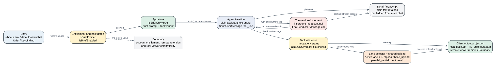

# Claude Code CLI 2.1.235 Brief Mode 与用户可见输出通道

用户给 Claude Code 的任务是生成周报，并把两个已经存在的文件一起发来：

```text
用户：
把本周错误情况整理成周报，把 report.pdf 和 raw.csv 一起发给我。

本地文件：
  /workspace/project/out/report.pdf   184320 bytes
  /workspace/project/out/raw.csv        9216 bytes
```

## 第一步：Claude 已经写了普通文字，但主视图没有这条回答

模型先生成一个普通 assistant text block：

```text
周报已经生成。本周共有 37 次接口错误，其中 29 次来自上游 503；
高峰集中在周三 14:00 到 14:20。完整结论见 report.pdf，原始记录见 raw.csv。
```

此刻两个界面的可见结果不同：

```text
Brief 主视图：
  [没有出现上面这段 Claude 消息]

展开 detail / transcript：
  Claude: 周报已经生成。本周共有 37 次接口错误……
```

文字没有丢。它已经进入会话消息历史，只是主视图的 renderer 没把普通 assistant text 投影成一条聊天消息。到这里再给第一条通道命名：这是 **detail/transcript 通道**，消息历史保存内容，renderer 决定当前视图是否显示。

## 第二步：模型调用 `SendUserMessage`

同一轮响应接着产生一个结构化工具调用：

```text
assistant tool_use:
  id: send_weekly_01
  name: SendUserMessage
  input:
    status: normal
    message: |
      周报已生成：本周 37 次接口错误，其中 29 次是上游 503。
      详细分析和原始数据见附件。
    attachments:
      - /workspace/project/out/report.pdf
      - /workspace/project/out/raw.csv
```

这时主视图仍不能凭工具输入断言两个文件都已交付。客户端要先校验路径，再处理每个附件。

## 第三步：两个附件并行上传，一个成功，一个失败

两个路径都通过 regular-file 和可读性检查。客户端随后并行调用同一个上传实现。本例固定上传接口返回：

```text
report.pdf
  POST /api/oauth/file_upload
  HTTP 201
  body: {"file_uuid":"file_report_01"}

raw.csv
  POST /api/oauth/file_upload
  HTTP 503
  client error: upload failed: server returned 503
```

客户端不会因为 `raw.csv` 失败而回滚 `report.pdf`。工具执行数据变成：

```text
message: 周报已生成：本周 37 次接口错误，其中 29 次是上游 503。详细分析和原始数据见附件。
sentAt: 2026-08-24T14:32:00.000Z
rendered_locally: true
attachments:
  - path: /workspace/project/out/report.pdf
    size: 184320
    isImage: false
    media_type: application/pdf
    pathValidated: true
    file_uuid: file_report_01
  - path: /workspace/project/out/raw.csv
    size: 9216
    isImage: false
    media_type: text/csv
    pathValidated: true
    upload_error: "upload failed: server returned 503"
```

因为一个附件已有 `file_uuid`，成功数是 1；另一个附件只有本地路径和 `upload_error`。客户端给下一轮模型的 tool result 是：

```text
tool_use_id: send_weekly_01
content: |
  Message delivered to user. (1 attachment included)
  1 attachment NOT delivered to Remote Control (phone/web) viewers — only visible in the desktop app on this machine:
    /workspace/project/out/raw.csv: upload failed: server returned 503
  Tell the user the attachment is only visible in the desktop app, and why.
```

这里没有 `is_error:true`，因为本例固定走的是“当前桌面仍能打开失败附件”的分支。桌面主视图此时出现：

```text
Claude
周报已生成：本周 37 次接口错误，其中 29 次是上游 503。
详细分析和原始数据见附件。

  [file] report.pdf
  [file] raw.csv
```

手机/Web 端不能由这张桌面视图推出同样结果。客户端只知道 `report.pdf` 获得了远端标识，而 `raw.csv` 上传返回 503；是否有任意远端 viewer 真正渲染 `report.pdf`，仍需要 viewer 侧验证。

到这里才需要引入 **upload lane**。要产生上面的 `rendered_locally:true`，本例固定选择 `sdk_hosted`，并命中允许本地兜底的附加条件。`sdk_hosted` 是选择标签，不是另一套上传协议；它与 `repl`、`env_brief_upload`、`env_ccr`、`env_byoc` 共用同一个 `/api/oauth/file_upload` 实现。若没有本地兜底，同一个 503 会让 tool result 带 `is_error:true`，但已经送达的消息正文和成功的 `report.pdf` 仍不会回滚。

## 第四步：下一轮把“部分失败”明确告诉用户

下一次模型请求已经包含上面的 tool result。模型据此再次调用 `SendUserMessage`，这次不重复附加文件：

```text
assistant tool_use:
  id: send_weekly_02
  name: SendUserMessage
  input:
    status: normal
    message: |
      report.pdf 的上传已被接口接受。
      raw.csv 上传返回 503，目前只在这台桌面应用里可见。
```

客户端返回：

```text
tool_use_id: send_weekly_02
content: Message delivered to user.
```

主视图新增第二条 Claude 消息，用户现在能直接看到附件交付差异。第一次的普通 assistant text 仍然没有成为主消息。

## 第五步：主视图和 transcript 保存的不是同一份展示

这轮结束时，Brief 主视图显示：

```text
1. SendUserMessage 正文，以及 report.pdf/raw.csv 两张本地文件卡片
2. “report.pdf 已被接口接受；raw.csv 只在当前桌面可见”的补充消息
```

同一会话的 transcript 还保留：

```text
1. 最开始那段普通 assistant text
2. send_weekly_01 的 tool_use
3. send_weekly_01 的 tool_result，包括 HTTP 503 对应的 upload_error
4. send_weekly_02 的 tool_use
5. send_weekly_02 的 tool_result
```

因此“模型生成过”“主视图展示过”“附件上传成功”“远端 viewer 看见过”是四个不同事实。隐藏普通文字只是视图投影，不是删除 transcript；HTTP `201 + file_uuid` 只是客户端接受上传成功，不是 viewer 渲染证明。

现在再给这条链上的所有者命名：

| 已经看到的事实 | 通道或状态 | 谁负责 |
| --- | --- | --- |
| 普通 assistant text 只在 detail/transcript 出现 | detail/transcript 通道 | Agent Loop 消息历史保存，renderer 选择是否展示 |
| `SendUserMessage` 正文成为主聊天消息 | brief 主输出通道 | tool call 产生数据，主视图 renderer 投影 |
| `report.pdf` 获得 `file_uuid`，`raw.csv` 获得 `upload_error` | attachment 交付状态 | 本地文件系统提供 bytes，上传接口返回远端结果，tool result 保存分类 |
| 同一附件在桌面可见、Remote viewer 不完整 | viewer 投影 | 各端 renderer 决定实际呈现，客户端上传结果不能替它作证 |

这条链不是远端 viewer 的在线 Probe。模型文本、两次 tool call、`201`、`503` 和示例 `file_uuid` 都是为了走完客户端分支而固定的输入；上面的可见块按 renderer 结构展开，不是在线截图。消息映射、错误文字、`is_error` 判定和视图选择来自 2.1.235 可读 bundle。哪些事实仍缺少真实手机/Web 验证，文末 Boundary 会单独说明。



Brief Mode 因而不是把长回答自动摘要成短回答，也不是 `/compact`。它改变的是哪一种输出进入 UI 主视图。`SendUserFile`/`Artifact` 可以形成独立文件卡片或 artifact 页面，`PushNotification` 由通知/Remote 通道处理，`/compact` summary 则属于上下文治理；这些都不能替代上面已经逐步走完的正文与附件交付判断。

## 五个入口怎样汇聚为 `isBriefOnly`

### 1. `--brief`

根命令注册 `--brief`，帮助文本为 `Enable SendUserMessage tool for agent-to-user communication`。启动处理读取 CLI flag 或 `CLAUDE_CODE_BRIEF`，再检查 entitlement；通过才调用 brief state setter，并记录 `tengu_brief_mode_enabled` 的 `enabled/gated/source`。

### 2. `CLAUDE_CODE_BRIEF`

环境变量同时参与 entitlement 和启动来源判定。它是本地显式入口，不等于跳过全部工具装配条件；session 仍需把 `SendUserMessage` 纳入候选工具集合，turn-end enforcement 也要求当前 tool list 中确实存在该 canonical name。

### 3. `defaultView=chat`

非 remote、非特殊 host 的启动路径读取 local setting；当 `defaultView === "chat"` 且 entitlement 通过时自动开启 brief state。设置面板把 `chat` 映射为 `isBriefOnly=true`，`transcript`/default 则走普通呈现。

### 4. `/brief`

`/brief` 自身还受动态配置 `tengu_kairos_brief_config.enable_slash_command` 控制。命令切换前再次检查 account entitlement；被 gate 时只显示 `Brief tool is not enabled for your account`，不会改变 app state。成功时同时更新进程状态、发出 `apply_flag_settings` 事件并插入 system reminder，告诉模型新的输出规则。

### 5. keybinding / transcript toggle

TUI 有独立 toggle。effect 会持续检查 brief 是否仍可用；feature 被撤销时会把 `isBriefOnly` 复位。切到 transcript 不是销毁消息，而是改变 renderer 展示集合；`briefTranscript` 又是另一个“是否缩短 transcript”的偏好，不能与 `isBriefOnly` 混为同一个状态。

## Entitlement、enable 与工具装配不是同一个判断

源码把三个问题拆开：

| 判断 | 关键条件 | 结论 |
| --- | --- | --- |
| `isBriefEntitled` | `CLAUDE_CODE_BRIEF`，或 `tengu_kairos_brief` 动态 entitlement；缓存参数为 `300000` ms | 账号/环境是否允许进入 Brief 产品面 |
| `isBriefEnabled` | 特定 host 状态与 entitlement，或 pewter-owl 分支 | 当前 runtime 是否应使用 brief tool schema/prompt |
| `shouldToolsListOptInToBrief` | tool name list 含 `SendUserMessage`/`Brief`、非 pewter 分支、entitled | 工具装配是否选择 brief 变体 |

这也是为什么只在 bundle 中搜到 `SendUserMessage` 不能证明用户当前可用。实时远端 flag、账号 entitlement 和 host state 不在固定发布物中；本章能恢复客户端判断顺序，不能恢复某个账号在某一时刻的服务端值。

## 系统提示如何改变 Agent 行为

Brief 专用 prompt 不只是“请简短回复”。它规定：

1. `SendUserMessage` 是用户真正会读到的通道；
2. 每次用户说话都应通过该工具答复，包括简单问候；
3. 需要先查资料时，先发一行 acknowledgement，再工作，再发结果；
4. 长任务只在有信息增量时发 checkpoint，不发送“还在运行”式填充；
5. `status=proactive` 用于用户未主动询问但现在需要看到的完成、阻塞或主动状态；普通追问用 `normal`。

这套 prompt 增加了 schema 与 instruction token，也可能增加一到多个 tool call，但它换来的不是模型能力提升，而是宿主能够区分正常答复、主动消息、附件交付和隐藏 detail。

## `SendUserMessage` 的输入、校验与 side effect

### Schema

完整 Brief 分支输入包含：

| 字段 | 类型 | 语义 |
| --- | --- | --- |
| `message` | string | 用户消息正文，支持 Markdown |
| `attachments` | string path 或 uploaded file object 数组，可选 | 本地文件路径，或设备工具已上传并返回的 `{file_uuid,file_name,size,is_image,media_type?}` |
| `status` | `normal` / `proactive` | 下游路由使用的意图标签，不是装饰性字段 |

pewter-owl 兼容分支只暴露 `message`。输出包含 `message`、解析后的 attachment metadata、可选 `sentAt` 和可选 `rendered_locally`。旧 transcript 可能没有 `sentAt`，renderer 必须兼容。

### 路径前置校验

本地字符串附件在上传前经过以下顺序：

1. URL-like 字符串被拒绝；工具只接受已经存在于本地文件系统的文件；
2. UNC 和 `/net` autofs 网络路径被拒绝，避免把网络挂载当普通本地附件；
3. 相对路径按当前 cwd 解析；
4. `stat` 必须证明它是 regular file；
5. `ENOENT` 会返回当前 cwd，并尝试给出最接近路径或去掉重复 cwd 前缀的建议；
6. 权限错误返回 `not accessible`，不会静默进入上传。

设备已上传对象不做本地 `stat`，并以 `pathValidated:false` 保留来源差异。renderer 只有在 path 是 absolute、`pathValidated=true` 且不是 network path 时才把它做成可打开的本地链接。

### Upload lane 只是选择与遥测标签，不是多套传输实现

客户端根据 app/session state 按优先级选择 lane。对需要上传的本地附件，`repl`、`env_brief_upload`、`env_ccr`、`env_byoc` 和 `sdk_hosted` 最终都进入同一个 `uploadBriefAttachment`，读取本地字节后统一 `POST /api/oauth/file_upload`；lane 被写入 `upload_lane` 遥测字段。`none` 与 `sdk_hosted_disabled` 才会跳过上传。

| lane | 选择条件 | 已证明的客户端行为 |
| --- | --- | --- |
| `repl` | REPL bridge 已连接 | 允许上传；与其他有效 lane 共用同一上传函数和 OAuth endpoint，`repl` 作为 lane 标签进入遥测 |
| `env_brief_upload` | `CLAUDE_CODE_BRIEF_UPLOAD` | 允许上传；环境变量改变 lane 标签，不产生已证明的独立 transport |
| `env_ccr` | remote environment type | 允许上传；`env_ccr` 标识运行环境，上传仍走同一 endpoint |
| `env_byoc` | remote/BYOC | 允许上传；`env_byoc` 标识运行环境，上传仍走同一 endpoint |
| `sdk_hosted` | hosted SDK 且 feature 允许 | 允许上传；当额外的 `Bye()` 条件成立时，客户端还把失败附件视为可本地渲染 |
| `sdk_hosted_disabled` | hosted SDK 但 feature 关闭 | 保留本地 metadata，不执行 hosted upload |
| `none` | 其他普通本地状态 | 不上传，仍可在本地渲染 |

因此 lane 证明的是选择优先级、跳过规则、本地 fallback 条件和遥测归因，不能证明 REPL、CCR、BYOC 各有一套不同的附件转送 owner。多个本地附件用 `Promise.all` 并行调用同一上传实现；每个失败只在对应 attachment 写入 `upload_error`，不会把其他成功附件回滚，这是部分完成，不是事务。

### 统一上传实现的完整控制链

lane 选完之后，真正决定“字节能不能离开本机”的不是 lane 名，而是下面这条固定链。每一层拥有不同的失败语义，排障时不能把它们都归成“网络不好”。

| 顺序 | 控制点 | 成功后留下什么 | 失败结果与含义 |
| ---: | --- | --- | --- |
| 1 | 本地 path validation | absolute/resolved path、size、`pathValidated:true` | URL、UNC、`/net`、目录、不可读或不存在在读文件前失败；不会发请求 |
| 2 | provider gate | 仅 `firstParty` 继续 | 自定义 provider 直接返回 `not_first_party`；附件内容不会被发往该 provider，也不会改走另一 endpoint |
| 3 | privacy/managed policy | essential-traffic 未启用，`allow_send_file` 返回允许 | privacy 配置拒绝记为 `essential_traffic`；policy cache miss 和显式 deny 分别记为 `policy_cache_miss` / `policy_denied`，都 fail closed |
| 4 | 大小与本地读取 | 文件完整读入内存 | 上限是 `31,457,280` bytes，即 30 MiB；读取前按 stat size 检查，底层 byte uploader 还会按实际 buffer length 再检查；read error 单独记为 `read_failed` |
| 5 | OAuth credential | 得到 OAuth Bearer token | 没有 OAuth token 返回 `no_token`；普通 API key 不替代这条上传凭据 |
| 6 | endpoint 与 multipart body | 形成单文件 multipart/form-data body | base URL 优先级为 runtime override、`ANTHROPIC_BASE_URL`、默认 API base；path 固定追加 `/api/oauth/file_upload` |
| 7 | HTTP 与 response schema | HTTP `201`，body 通过 `{file_uuid:string}` 校验 | 非 201 按 `401/403/413`、其他 4xx、5xx、other 分类；201 但 body 不合 schema 记为 `bad_response` |
| 8 | attachment metadata 回填 | 对应 attachment 增加 `file_uuid` | abort 记为 `aborted`，其他异常记为 `network_error`；失败只写当前项 `upload_error` |

上传请求有几个容易被忽略的微小合同：

- 请求使用 `Authorization: Bearer <OAuth token>`，并显式设置 multipart boundary 与 `Content-Length`；boundary 由随机 UUID 生成。
- 文件名进入 `Content-Disposition` 前会删除 CR/LF，并转义反斜杠和双引号，避免文件名破坏 multipart header。
- 单次 HTTP timeout 是 `30,000 ms`。这里没有上传重试循环；失败交回 tool result，由模型或用户决定是否补传。
- 只有 `201` 被接受，普通 `200` 也会进入失败分支。成功响应还必须能被严格解析出 `file_uuid`，所以“HTTP 成功”与“客户端获得可用文件标识”是两道检查。
- endpoint host 可以被 base URL 配置改变，但 path 和 OAuth file-upload contract 固定。自定义 provider 又会在前面的 first-party gate 被拒绝，因此不能仅凭 `ANTHROPIC_BASE_URL` 字符串就声称任意兼容服务支持附件上传。

### metadata MIME 与上传 MIME 不是同一张表

附件 metadata 的扩展名表比较宽，能识别图片、视频、音频、PDF、Office、Markdown、JSON、CSV、HTML、XML 和 ZIP；这决定 renderer/metadata 中的 `media_type`。真正构造上传 body 时使用的是另一张更窄的表，只为 PNG、JPEG、GIF 和 WebP 选择明确 image MIME，其他扩展名回退到 `application/octet-stream`。

因此一个 PDF 可以在 attachment metadata 中显示为 `application/pdf`，上传 multipart 的 `Content-Type` 却是 `application/octet-stream`。这是两层消费者的不同需求，不是提取冲突：前者服务 UI/结果描述，后者是上传实现的保守 content type。跨版本比较必须分别追这两张表，不能只比较一个 `media_type` 字段。

### 预上传对象绕过了什么，又没有绕过什么

`{file_uuid,file_name,size,is_image,media_type?}` 形式的设备已上传对象不会执行本地 `stat`、路径规范化或再次 upload，并以 `pathValidated:false` 进入结果。它绕过的是“本机文件是否存在”的检查，不是远端对象真实性、访问控制、retention 或内容安全检查。客户端信任调用方提供的 metadata 形状，但本 bundle 不包含验证该 `file_uuid` 在远端仍存在、属于当前账号或能被目标 viewer 读取的正向逻辑。

这也解释了为什么 renderer 只把 `pathValidated:true`、absolute 且非 network path 的附件做成本地可打开链接：预上传对象可能只有远端标识，没有可信本地路径。相反，本地 path 即使未上传成功，只要满足这些条件，桌面 renderer 仍可能打开它；这正是 `rendered_locally` 与远端交付状态会分叉的根源。

### 错误分类怎样进入遥测与用户结果

上传实现把底层失败压缩成有限 reason，便于统计但不会吞掉用户可操作信息：

| reason | 实际触发 | 用户应先处理什么 |
| --- | --- | --- |
| `not_first_party` | provider 不是 first-party | 不要把附件上传能力当作自定义 endpoint 的通用协议 |
| `essential_traffic` | 当前 privacy 配置禁止这类上传 | 调整数据流配置前不要反复重试 |
| `policy_cache_miss` / `policy_denied` | managed policy 没有可用允许结论 | 等待/修复 policy 获取，或由管理员放行；默认拒绝 |
| `too_large` | stat size 或实际 buffer 超过 30 MiB | 压缩、拆分或改用其他交付物 |
| `no_token` | 没有 OAuth token | 修复账号认证；API key 不能替代 |
| `read_failed` | 文件在校验后读取失败 | 检查权限、TOCTOU 变化或文件被删除 |
| `http_401/403/413` | endpoint 明确拒绝凭据、权限或大小 | 按状态码修复，不应盲目网络重试 |
| `http_4xx` / `http_5xx` / `http_other` | 其他 HTTP 结果 | 结合服务端状态与 response log 判断是否可重试 |
| `bad_response` | 201 body 没有合法 `file_uuid` | 视为协议不兼容，不把它包装成成功 |
| `aborted` / `network_error` | session abort 或传输异常 | abort 跟随会话取消；网络错误可在确认未交付后补传 |

`bridge_attachment_upload` 事件携带 `upload_lane`，用来比较不同运行环境下的成功/失败分布；它不证明 lane 使用不同网络栈。`tengu_brief_send` 另记录 `proactive`、attachment count 和所选 lane，描述的是发起意图。两类事件都不能单独证明远端 viewer 最终呈现；要证明呈现还需要 viewer 侧 Probe。

### 状态所有权与不可回滚点

附件发送跨越四个 owner：本地文件系统拥有 path/bytes，上传接口拥有 `file_uuid` 对应的远端对象，tool result 拥有成功/失败 metadata，renderer 拥有本地链接和主视图投影。`/compact`、resume、tombstone 或 rewind 只能改变模型后续看到的消息视图，不能撤销已经完成的 HTTP upload，也不能删除已经被其他 viewer 拉取的远端对象。反过来，上传成功也不保证 `SendUserMessage` 之后的 UI renderer 没有崩溃；传输成功与呈现成功必须分开验收。

## 三种附件结果必须分开讲

| 结果 | tool result 给模型什么 | 客户端可证明的状态 | `is_error` |
| --- | --- | --- | --- |
| 全部成功 | `Message delivered to user. (N attachments included)` | 每个需上传附件都获得 `file_uuid`，mapper 判定无 `upload_error`；远端 viewer 是否实际显示仍是 Boundary | false/省略 |
| 部分失败，但 `rendered_locally=true` | 消息已送达；失败附件只在当前桌面可见，要求模型告知 remote viewer 差异 | 本机可见，手机/Web 不完整 | false/省略 |
| 部分失败，且没有本地兜底 | 消息已送达；列出未交付附件并要求模型说明 | 文本成功，部分附件失败 | true |

最容易误读的是第三行：`is_error:true` 不表示消息正文没送达，错误只针对附件交付完整性。反过来，第二行虽然不是 tool error，也要求模型主动说明“只在桌面可见”，否则不同 viewer 会对“是否收到文件”产生冲突事实。

## Turn-end enforcement 怎样补漏

Brief enforcement 位于主 loop 的 post-turn 阶段，触发条件同时包括：

- query source 是 `repl_main_thread*` 或 `sdk`；
- `isBriefEnabled()` 为真；
- `DISABLE_BRIEF_MODE_STOP_HOOK` 未设为 true；该变量只关闭“漏调 SendUserMessage 后注入 sentinel 并 re-entry”的 post-turn enforcement，不关闭 Brief entitlement、Brief 工具或已经完成的发送；
- 当前不是 subagent (`agentId` 为空)；
- 当前工具集合确实包含 canonical `SendUserMessage`。

客户端找到本轮最近边界后的消息，检查是否出现 `SendUserMessage` 或 legacy `Brief` tool use。如果没有，且本轮历史还没有 brief sentinel，就 yield 一条 meta user message：

```text
You ended the turn without calling SendUserMessage.
```

后面附带的默认文字提醒模型：普通 assistant text 对用户隐藏，应该现在调用工具给出 substantive reply；若确实没有任何有用内容，也可以结束。Agent Loop 会把这条 meta message 当成新的可处理输入继续，而 `M` guard 确保同一漏调不会无限注入 sentinel。

因此它是“最多一次的客户端修复回路”，不是无上限 Stop hook。它也只检查是否发生过 tool use，不证明附件 upload 成功；交付完整性由后续 tool result 决定。

## Renderer 怎样区分 chat、brief 和 transcript

`SendUserMessage` result renderer 有三条主要分支：

1. transcript mode：按普通 transcript 行展示，保留完整时间顺序；
2. brief-only：显示 `Claude` label、可选 `sentAt` 和消息/附件，不展示普通 assistant text 作为主消息；
3. 其他模式：按常规 tool-result 样式展示。

会话 renderer 还会累计 `briefHiddenCount`，提示有多少消息被隐藏以及可用 `/focus` 查看。隐藏是 view projection，不是从 transcript 删除；resume、export、debug 和 detail view 仍可能接触这些内容，所以隐私判断不能把“主视图看不到”误写成“没有保存”。

## 与 Agent Loop、Prompt Cache 和 compact 的关系

| 机制 | Brief 对它做了什么 | 没做什么 |
| --- | --- | --- |
| Agent Loop | 增加可选 tool schema、tool call 和漏调后的 meta input | 不替换流式解析、permission 和 tool-result pairing |
| Prompt Cache | Brief prompt/tool schema 改变请求前缀，切换模式可能改变 cache shape | 不提供新的响应缓存 |
| microcompact | `briefStandalone` tool use/result 被当成独立可见 checkpoint 保留 | 不保证所有普通 detail text 永久驻留上下文 |
| `/compact` | compact summary 需要保留任务事实，resume 后旧 `sentAt` 可缺失 | Brief 不负责历史摘要，也不把 UI 隐藏等同于上下文删除 |
| Session transcript | 保存 assistant/tool use/tool result 与呈现 metadata | 不回滚已经上传或通知的外部副作用 |

切换 Brief 可能造成一次 prompt-cache miss，因为 system section 和工具集合发生变化；附件 upload 还会增加本地读取、hash/metadata、网络延迟和远端存储成本。具体服务端计费和 retention 不在 bundle 中。

## 失败排查表

| 用户症状 | 先检查什么 | 客户端真实分支 | 恢复动作 |
| --- | --- | --- | --- |
| `--brief` 后仍是普通视图 | init event 的 `enabled/gated/source`、entitlement | flag/env 存在但 entitlement false 时不写 brief state | 使用有 entitlement 的账号/环境；不要只看 CLI flag |
| `/brief` 不出现 | dynamic config `enable_slash_command` | slash object `isEnabled` false | 这是功能入口 gate，不是命令 parser 丢失 |
| 普通文字有内容但主视图空 | 本轮是否有 `SendUserMessage` tool use | plain assistant text 被 brief projection 隐藏 | 等待一次 enforcement 补发，或切 transcript/detail 核对 |
| 连续出现漏调提醒 | 本轮边界、legacy alias、tool 是否真的在 active set | sentinel guard 只阻止重复注入；模型仍可再次停下 | 检查 tool schema residency、模型 tool-call 解析和 request logs |
| 路径附件报不存在 | cwd、相对路径、重复项目目录前缀 | `stat`/ENOENT + suggestion | 先 Read/stat 正确路径，再重发 |
| 桌面有文件，手机没有 | tool result 的 `rendered_locally` 和 `upload_error` | 统一上传路径失败，本机 renderer 仍可打开；真实 viewer 状态需现场核对 | 明确告知 viewer 差异，修复 auth/policy/network 后重传 |
| 文本成功但 tool result 是 error | 是否只有附件失败 | `is_error:true` 针对未交付附件，不撤销文本 | 不重复发送正文；只补传失败附件并说明 |
| 切换 transcript 后 Brief 被关闭 | feature effect 与 transcript toggle | brief 不再 enabled 时 app state 被复位 | 重新确认 entitlement；不要把 view toggle 当持久账号设置 |

## 成本、延迟、隐私和风控

- **Token：** Brief system section 和 `SendUserMessage` schema 占请求 token；一次漏调可能额外产生一个模型 iteration。checkpoint 太频繁会增加 tool use/result 历史和后续上下文成本。
- **延迟：** 纯文本 tool call 增加一次工具处理但无远端 upload；多附件通过同一实现并行上传，总耗时受最慢单项影响，并可能在失败后需要补传。
- **隐私：** 普通 text 即使主视图隐藏仍进入 transcript；附件路径、名称、大小、媒体类型和 upload error 可能进入 tool result、日志或远端通道。已上传 file object 绕过本地 path 校验，但并不绕过远端数据治理。
- **安全：** URL、UNC 和 `/net` 拒绝减少把网络资源伪装成本地文件的风险；regular-file 和 access check 避免目录/不可读对象进入上传。它不是内容安全扫描，也不证明附件没有秘密。
- **可恢复性：** resume 可重放旧 result，`sentAt` 因兼容可缺失；已经发给用户、上传到远端或触发 notification 的副作用不能由 tombstone、rewind 或 compact 撤销。

## 2.1.235 证据索引

| 结论 | readable JavaScript |
| --- | --- |
| canonical name、legacy alias、sentinel 与 prompt | `75232-75245` |
| entitlement、enable、300000ms 参数与 enforce text | `270397-270420` |
| turn-end 检查和单次 sentinel guard | `270482-270508` |
| tool schema、enable、validation、result mapping、call | `292287-292339` |
| 统一 upload endpoint、lane 选择、URL/UNC/regular-file/ENOENT 校验 | `292102-292269` |
| `briefStandalone` checkpoint 保留 | `203083-203101` |
| `/brief` gate、state 和 reminder | `367131-367154` |
| default view 与 app state | `332734-332741`、`592842-592845` |
| brief renderer 与附件本地链接条件 | `454061-454084` |
| `--brief` CLI 注册和启动 gate event | `603792`、`592320-592325` |
| alias canonicalization | `40006-40009` |
| 22 项 workspace policy 枚举含 `SendUserMessage` | `622428-622429` |

## 边界

本章证明 `2.1.235` 客户端的入口、状态、tool schema、lane 选择、统一上传实现、renderer 和 enforcement。它没有把下列内容包装成已验证事实：某个真实账号当前 entitlement、远端 file store retention、手机/Web viewer 的线上兼容、服务端 proactive routing、附件病毒/秘密检测、第三方 MCP/device tool 上传对象的真实性。HTTP `201` 和 `file_uuid` 只证明客户端认定上传接口成功，不证明任意 viewer 已渲染。要把这些从 Boundary 提升为 Probe，需要固定账号/host、捕获真实 request/result 和 viewer 状态，并记录退出码、附件 hash 与服务端返回。
