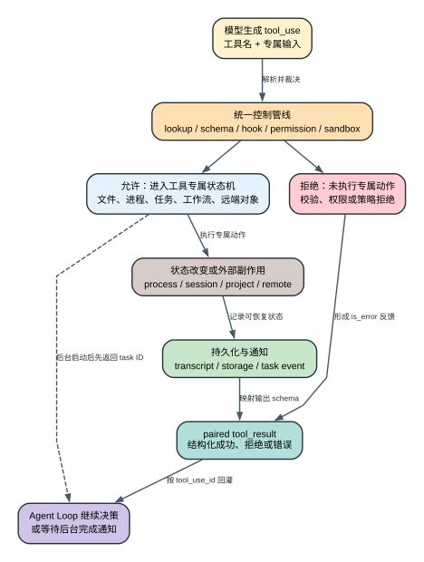

# Claude Code CLI 2.1.235 的 29 个内置工具：每个工具到底改变了什么

这篇只解释 `2.1.235` 从一方 tool assignment 确认的 29 个 built-in tool。`known-tool-catalog.txt` 里的 hosted、internal、静态 MCP 和 106 个 `mcp__github__*` 不混进来。

## 60 秒理解内置工具

**读者问题：** 既然所有工具都经过同一套 registry、schema、Hook 和 Permission 管线，为什么还需要逐个理解工具？

**一句话模型：** 统一管线只决定“这次调用能不能开始”；真正决定可恢复性、持久化、成本和风险的是每个工具自己的状态机，例如 `Edit` 修改项目文件，`Task` 启动独立 Agent Loop，`Workflow` 持久化并后台执行确定性脚本，`Artifact` 发布远端对象，四者不能用同一种成功或回滚语义解释。

贯穿场景：用户要求“检查项目、修复配置、让另一个 Agent 跑测试，明早再检查一次，并把结果做成可查看页面”。模型可能依次调用 `Glob/Read/Grep`、`Edit`、`Task`、`CronCreate` 和 `Artifact`。这些调用都产生 `tool_result`，但状态分别落在当前请求、项目文件、后台 task registry、调度存储和 claude.ai 远端对象；`rewind` 最多恢复文件，不能撤销已经发布的 Artifact 或已经发出的远端请求。

| 阶段 | 共同状态 | 工具专属状态 | 用户真正关心的差异 |
| --- | --- | --- | --- |
| 调用前 | tool name、raw input、tool_use_id | 文件路径、命令、agent prompt、cron、artifact action | 是否会产生本地或远端副作用 |
| 裁决 | schema、PreToolUse、permission、policy；适用工具再进入 sandbox | named workflow rule、Read-before-Write、worktree/git 条件、登录态 | 为什么被拒绝、是否允许改写输入 |
| 执行 | abort signal、progress、output budget | 进程、文件、task、worktree、LSP connection、远端对象 | 是否同步完成，能否中止，谁持有状态 |
| 持久化 | transcript 与 paired tool_result | file history、task registry、workflow journal、cron file、remote artifact | 进程退出或 resume 后还能找回什么 |
| 恢复 | Agent Loop 可根据错误重试 | 各工具自己的幂等性和补偿动作 | 重试会不会重复副作用 |

## 29 个工具的覆盖索引

下面的 `Product` 集合来自 `analysis/source-inventory/builtin-tool-identifiers.txt`，不是 regex 猜测。表中“主要所有者”说的是专属状态，不代表该工具绕过统一控制管线。

<!-- BUILTIN_TOOL_COVERAGE_BEGIN -->
| 工具 | 类别 | 主要所有者 | 成功后留下什么 | 最关键的失败/边界 |
| --- | --- | --- | --- | --- |
| `Artifact` | 远端内容对象 | session + claude.ai artifact | 发布/读取/live-edit/comment 的远端对象状态和受控摘要 | 需要 claude.ai 登录；发布是远端副作用，file rewind 不撤销 |
| `AskUserQuestion` | 人机交互 | 当前 TUI/host request | 用户选择或自由输入，随后回灌 Agent Loop | 只应解决真正需要用户决策的问题；host 取消不是模型答案 |
| `Bash` | 本地执行 | 子进程 + task/file history | stdout/stderr/exit code、可能的文件/网络/进程副作用 | permission 允许后仍受 sandbox；重试可能重复外部动作 |
| `CronCreate` | 调度 | session scheduler 或项目 durable file | job ID、cron、prompt、recurring/durable 状态 | 只在 idle 时入队；进程退出会丢 session-only job |
| `CronDelete` | 调度 | 同一 cron store | 删除指定 job | job ID 不存在或 store 不一致时不能假装已取消 |
| `CronList` | 调度 | 同一 cron store | 当前可见 job 快照 | 只列本 session/当前 durable scope 可见对象 |
| `Edit` | 文件变更 | 项目文件 + read state + file history | 精确替换后的文件和 checkpoint 触点 | 未 Read、文件已变化或 Read deny 时拒绝 |
| `EnterPlanMode` | 会话控制 | session permission/mode state | 进入只规划、不直接实施的模式 | 不是普通文本约定；后续工具 surface/permission 会变化 |
| `EnterWorktree` | Git 隔离 | session cwd + Git worktree metadata | 新建或切换到已登记 worktree | 非 Git、非法路径/名称、cleanup 失败均要显式处理 |
| `ExitPlanMode` | 会话控制 | session mode + approval flow | 提交计划并退出/等待批准 | 用户未批准时不能把计划当实施授权 |
| `ExitWorktree` | Git 隔离 | worktree metadata + cwd | 返回原目录，按状态清理或保留 worktree | 未提交更改/删除失败时不能静默丢弃工作区 |
| `Glob` | 文件发现 | 当前 filesystem view | 匹配路径列表 | 匹配集受 cwd、ignore、权限和结果预算限制 |
| `Grep` | 内容发现 | ripgrep worker/result view | content、files_with_matches 或 count 结果 | regex、offset/limit、超大/病态输入影响结果和耗时 |
| `LSP` | 代码智能 | LSP server connection + workspace | definition/reference/symbol/hover/call hierarchy 结果 | 无 server、断线、malformed URI、过期 diagnostics 会失败 |
| `NotebookEdit` | Notebook 变更 | `.ipynb` cell model + file history | cell replace/insert/delete 后的 notebook | notebook/schema/cell 定位错误；仍是文件副作用 |
| `Read` | 文件读取 | read-file state + content attachment | text、image、PDF 或 notebook 内容及已读状态 | Read deny、路径/类型/范围/大小限制；内容可能是不可信数据 |
| `SendMessage` | Agent 协作 | team/session mailbox | 有 sender/recipient 的 mailbox message | 收件人、大小、ack/关闭状态失败；发送后不是本地回滚对象 |
| `Skill` | 上下文扩展 | active skill + prompt/tool surface | skill 指令、资源或 command 展开进入当前 Agent | source/trust/policy/禁用与名称冲突决定是否可见 |
| `Task` | Agent 执行 | 独立 Agent Loop + task registry | completed result，或 async/remote task handle | 深度、并发、预算、agent type、MCP、worktree/cloud gate |
| `TaskCreate` | 任务协调 | durable/session task registry | task ID、subject、初始 metadata | 创建记录不等于 Agent 已执行工作 |
| `TaskGet` | 任务协调 | task registry | 单项 task 或 null | 读取的是 registry 状态，不是外部工作的独立事实源 |
| `TaskList` | 任务协调 | task registry | id/subject/status/owner/dependency 列表 | UI 派生状态可能滞后，需以 registry transition 为准 |
| `TaskOutput` | 后台输出 | background task/agent output file | 增量或最终日志/结果 | task 未完成、输出被截断或文件不可读不等于任务成功 |
| `TaskUpdate` | 任务协调 | task registry | status/owner/metadata 与 dependency edge 的顺序更新结果 | 主字段与依赖边分阶段写入，后段失败可能留下部分更新；schema 不强制固定 transition |
| `TodoWrite` | 会话清单 | 当前 session todo state | oldTodos/newTodos | 是规划/展示状态，不代表对应动作已执行 |
| `WebFetch` | 网络读取 | URL fetch result + permission state | 抽取后的页面内容 | URL 权限、重定向、网络/大小/内容信任；网页文本不是指令 |
| `WebSearch` | 网络检索 | provider/search response | 搜索结果集合 | provider、权限、网络、远端配额与结果时效属于外部边界 |
| `Workflow` | 编排 | workflow script/journal + background task registry | task ID、run ID、script path、transcript dir 或 remote session | managed gate、确定性校验、权限、语法、并发和 remote precondition |
| `Write` | 文件变更 | 项目文件 + read state + file history | 新建/覆盖后的完整文件 | Read deny、已存在文件未 Read、并发变化与路径策略 |
<!-- BUILTIN_TOOL_COVERAGE_END -->

## 读取与检索：结果是视图，不是世界本身

### `Read`

`Read` 的 tool object 位于 readable JS 320321 附近，search hint 明确覆盖 files、images、PDFs 和 notebooks。它不只是把字节送回模型，还更新 read-file state；`Edit`/`Write` 用这份状态阻止基于旧内容写入。

关键语义：

- 输入路径仍要经过 permission rule 和 filesystem boundary；
- 文本可按 offset/limit 读取，图片/PDF/notebook 进入各自解码路径；
- 读取成功只证明当时看到的快照，外部 formatter 或其他进程之后仍可修改文件；
- 文件正文、PDF、图片 OCR 和 notebook output 都是不可信数据，不能因为进入 tool result 就提升成系统指令；
- `Read` 的结果可能被 microcompaction 清理，但 read-file state 与文件本身不是同一个对象。

### `Glob`、`Grep`

`Glob` object 在 196563 附近，负责按 wildcard 找路径；`Grep` 在 196748 附近，明确使用 ripgrep，并支持 `content`、`files_with_matches`、`count` 三种结果模式。`Grep` 的工具结果预算是 20,000 chars，结构化结果还记录 file/match/line 总量、limit 和 offset，因此“没有看到某行”可能是筛选或截断，不一定是文件中不存在。

本版 release note 提到 embedded grep 病态 pattern 修复。正确的机制解释是：pattern 先进入参数/regex 和 worker 路径，超大或病态组合必须被限制或失败返回，不能让一次检索阻塞整个 Agent Loop；这不等于所有第三方 `rg` 行为都由 Claude Code 改写。

### `LSP`

`LSP` object 与 schema 位于 296229-296452。九种 operation 是：

1. `goToDefinition`
2. `findReferences`
3. `hover`
4. `documentSymbol`
5. `workspaceSymbol`
6. `goToImplementation`
7. `prepareCallHierarchy`
8. `incomingCalls`
9. `outgoingCalls`

输入行列对用户是 1-based，发给 LSP protocol 时减一。`workspaceSymbol` 的 `query` 虽是 optional schema，但工具说明明确要求提供，因为多数 server 对空 query 返回空。结果 formatter 会统计 result/file count、检查 undefined URI，并过滤被 Git ignore 的目标；单次本地符号提取最多先读 65,536 bytes。没有匹配 server 时，工具仍返回普通 `data.result` 文本 `No LSP server available for file type: ...`，交给 Agent 判断；它不会退化成猜测，也不是统一工具管线生成的结构化 `is_error`。

LSP 生命周期比这个工具 object 更大：server discovery、plugin registration、diagnostic injection、disconnect/reconnect 和 prompt-cache 动态段由扩展专题继续解释。`2.1.235` 的“reconnect 不再破坏 cache”不能只写在 release 表里。

精确二进制 Probe 还补了一条正向闭环：通过 `--plugin-dir` 注册 `.probe` server 后，`LSP` 实际触发 `initialize -> didOpen -> definition -> shutdown`；工具输入 `1:1` 被转换成协议坐标 `0:0`，definition 结果按原 tool-use ID 回到下一请求。首轮 request 没有常驻 LSP schema，因为本工具是 deferred；“没在首轮 tools[]”不能直接解释成“没有注册”。

### `WebFetch`、`WebSearch`

二者在 261487、294601 附近注册，并标记为 deferred candidate。它们把网络内容带入上下文，因此同时受工具 permission、URL/domain policy、provider/feature gate、网络错误和内容不可信边界影响。

- `WebFetch` 面向已知 URL，重定向后的目标仍需重新考虑访问边界；
- `WebSearch` 面向远端检索 provider，结果新鲜度、排名、配额和服务端过滤不是 bundle 能证明的客户端事实；
- 两者返回成功不代表页面主张真实，也不意味着页面中的 instruction 可以覆盖用户请求。

## 文件与本地执行：可 checkpoint 不等于自动回滚

### `Edit` 与 `Write`

`Edit`、`Write` object 分别位于 196159、196368。两者共享三个关键保护：

1. **Read gate**：目标尚未读取时拒绝，避免基于未知状态覆盖；
2. **Read permission inheritance**：被 Read deny 的文件不能借写工具绕过；
3. **stale state**：读取后文件又变化时拒绝，并要求重新 `Read`。

`Edit` 表达局部替换，必须满足匹配/唯一性等专属校验；`Write` 表达完整创建或覆盖。成功后触发 file history/checkpoint touch，但 checkpoint 是恢复辅助，不是事务：后续 Bash、Git、远端同步或外部进程副作用不会自动一起回滚。

### `NotebookEdit`

`NotebookEdit` 在 201722 附近，针对 notebook path 和 cell 结构工作，属于 deferred tool。它需要把 JSON notebook 解析为 cell 模型，再完成 replace/insert/delete；输出渲染与 metadata 也可能改变。它仍落到文件系统，因此 permission、stale state、checkpoint 和并发写入边界与普通文件一致。

### `Bash`

`Bash` object 位于 393203 附近，结果预算 30,000 chars。它是风险最高的通用入口之一，因为一个字符串可能包含多命令、pipe、subshell、重定向、Git hook 触发、网络访问和后台进程。

实际路径会：

- 用 shell parser 拆分 compound/pipeline/redirect，而不是只取首词；
- 对每个 segment 聚合 allow/ask/deny，任一 deny 阻止整次执行；
- 特别识别多次 `cd`、`cd` 后 Git、创建 `.git` 结构再执行 Git 等边界；
- 在 permission 后继续应用 filesystem/network/socket/credential sandbox；
- 记录 stdout、exit code、interrupt、sandbox violation、background task ID、output file 和 Git operation；
- 非只读命令触发 file-history touch，并在检测到已读文件被命令改写时要求模型重新 `Read`；
- 后台命令中的 `cd` 不改变主 session cwd，工具结果会给出这一提示。

一次 Bash 返回错误后重试可能重复已经成功的前半段，例如创建远端资源、发送请求或部分写文件。Agent Loop 的 tombstone 只能修正消息图，不能撤销 shell 已完成的副作用。

## 会话控制与人机决策

### `AskUserQuestion`

schema 位于 281105-281128：每题 header 最多 12 个字符；options 必须 2-4 项；客户端自动提供 `Other`，因此模型不应自行添加；`multiSelect` 默认 false。preview 只用于确实需要视觉比较的单选场景。

它的用途是阻塞在“只有用户能决定”的分支，而不是把可从代码、文档或合理默认值确定的问题推回用户。host 取消、超时或关闭必须作为控制结果处理，不能伪造一个选项。

### `EnterPlanMode`、`ExitPlanMode`

这两个工具在 281784 附近进入 mode/approval 状态机。Plan mode 改变可用工具和 permission 预期；`ExitPlanMode` 负责提交计划并触发用户批准流程。模型在获得批准前不能把“计划已生成”当作“实施已授权”。

### `TodoWrite`

`TodoWrite` object 位于 294954，输入是完整 todo list，输出同时包含 old/new state。它适合让 session 的工作状态可见，但它不是执行引擎：把条目标成 completed 不能证明测试、部署或外部操作真的完成，仍需相应工具结果或外部证据。

## Agent、Task、Mailbox 与 Worktree

### `Task`

`Task` 的 tool object 位于 290940 附近，alias 为 `Agent`。输入至少包含 description、prompt，可指定 agent type/model/background/name/isolation/cwd。它创建的是另一个 Agent Loop，不是普通函数调用。

启动前会检查：

- subagent nesting depth；
- concurrent agent cap；
- session USD budget；
- agent type allow/deny、tools 和 required MCP servers；
- teammate 不能再生成扁平 roster teammate 的约束；
- `worktree`/`remote` isolation 与 cwd 的互斥及可达性；
- cloud 登录、feature 和 remote precondition。

结果可能是同步 `completed`、本地 `async_launched` 或 `remote_launched`。异步启动先返回 agent/task ID 与 output file；真正完成通过 task notification 和 registry transition 回来。`Task` 成功只代表启动成功时，不能把它写成子任务已经成功。

### `TaskCreate`、`TaskGet`、`TaskList`、`TaskUpdate`

这四个 object 位于 297329-297652：

- `TaskCreate` 写入 subject、description、activeForm 和 metadata，返回 id；
- `TaskGet` 按 id 返回完整任务或 null；
- `TaskList` 返回 status、owner、blockedBy 的快照；
- `TaskUpdate` 先读取旧任务并构造 subject/description/activeForm/owner/metadata/status 主字段 patch，通过一次 `Hht` 写入；随后才逐条写 `addBlocks` 和 `addBlockedBy` dependency edge，最后返回 updated fields 与 status change。

这不是整次工具调用的事务或 CAS：主字段写入后，后续 dependency edge 仍可能失败并留下部分落盘状态。schema 接受 `pending`、`in_progress`、`completed` 或 `deleted`，consumer 会在进入 `completed` 前运行 TaskCompleted hooks，但没有统一校验 `pending -> in_progress -> completed` 的固定 transition，也没有对“claim”执行 compare-and-swap。registry 是协调事实源，UI panel 是它的派生视图；`2.1.235` 的 Task panel 修复应解释为“派生状态和 registry 状态的一致性修正”，不是新增一套 task 状态。

### `TaskOutput`

`TaskOutput` object 位于 294460，兼容若干历史 alias，用于读取 background agent/shell 的 output/log。它可能拿到运行中增量、截断内容、最终结果或错误。日志里出现成功字样不等于 registry 已进入 completed；反过来，输出暂时为空也不等于任务失败。

### `SendMessage`

`SendMessage` object 位于 307349。它把消息写入 teammate/cross-session mailbox，并依赖 sender、recipient、team/session identity、message size 和收件方状态。发送成功证明消息已进入协作通道，不证明对方已经执行；发送失败也不能靠在主 transcript 写一段文字冒充 mailbox delivery。

### `EnterWorktree`、`ExitWorktree`

schema/object 位于 296923-297159。`EnterWorktree` 可以生成受限名称的新 worktree，或切换到 `git worktree list` 已知路径；`name` 与 `path` 互斥。它同时改变 cwd、worktree metadata、sandbox/policy path 注册和后续 Git 上下文。

退出时要区分 clean、存在更改、hook-created、删除成功/失败和需要保留的路径。Worktree 隔离项目文件，不隔离远端 API、账户配额、共享 cache、外部数据库或同仓库之外的资源。

## Skill、Workflow 与 Artifact

### `Skill`

`Skill` object 位于 282215。它把已发现 skill/command 的指令与资源注入当前 Agent，而不是启动任意同名 shell 文件。可见集合受 bundled/user/project/plugin/account 来源、workspace trust、safe/bare mode、managed policy、disable source settings、reload generation 和命名冲突影响。

调用成功意味着 skill 内容已进入上下文/工具 surface；它不自动证明其中描述的外部依赖可用，也不提升 skill 内文本的权限等级。

精确二进制 Probe 进一步拆开了 dispatch 的 wire shape：Plugin Skill 先在 system reminder 中以 `plugin:skill` 名进入 listing；`Skill` tool result 是 `Launching skill` acknowledgement，正文则独立注入下一次 Messages request。把 acknowledgement 当正文会漏掉真实 context 变化，把正文当 tool result 又会错误解释消息配对。

### `Workflow`

`Workflow` object 位于 288728，alias 为 `RunWorkflow`。它执行一个受限、确定性的 JavaScript orchestration DSL，输入可来自 inline script、named workflow 或已持久化 `scriptPath`，三者至少一个；`scriptPath` 优先。脚本必须以纯 literal `export const meta = { name, description, phases }` 开头，不能省略 `export const`。

核心约束：

- managed `disableWorkflows` 可直接禁用；另外还有 org/launch/setting gate；
- 受限 session 可只允许 `{name,args}`，拒绝 inline/scriptPath/resume/remote；
- inline script 出现 `Date.now()`、`Math.random()`、`new Date()` 会被拒绝，以保证 resume 可重放；
- named workflow 进入 `Workflow(name)` 的 deny/ask/allow rule；默认仍要求审阅；
- 每次 invocation 会把脚本持久化到 session 目录并返回 `scriptPath`；
- 本地运行生成 `wf_*` run ID、task ID、transcript dir 和 journal；后台完成另行通知；
- `resumeFromRunId` 只限同 session，旧 run 仍运行时必须先 stop；恢复按调用顺序复用最长未变化的 `agent()` 前缀，首个 prompt/options 变化或新增调用以及它之后的调用都重新执行，不是每个相同调用各自独立命中；
- remote launch 在 CCR fresh clone 上运行，session URL 才是进度事实源，本地 `/workflows` 不能冒充远端实时状态。

Workflow 的“确定性”保证编排输入可比较，不保证 Agent 输出相同，也不能撤销 agent 已完成的外部副作用。

### `Artifact`

`Artifact` object 位于 313318，结果预算 16,000 chars，并对 subagent/transcript storage 做专门的 strip/preserve 处理。bundle 实际携带 Chart.js、Highlight.js、Mermaid 和 HTML payload，说明本地存在渲染/预览底座；这些依赖本身不等于每个图表功能都可达。

已确认的产品边界：

- artifact 支持 HTML/Markdown 内容、publish/live-edit、读取 live version 和 comment/thread 操作；
- 发布/读取需要 claude.ai subscription 登录；Console account、remote launch machine 未登录、host-injected credential 都有不同拒绝文案；
- publish 前会验证 session 是否看过当前 live version，避免基于旧版本覆盖；
- artifact ID/URL 有严格 UUID/host 解析，隐藏控制字符、HTML entity 和标题/描述长度会被规范化；
- comment 内容被显式标为 untrusted DATA；自动回复/编辑还有 plan mode、permission、content gate、hourly cap 和 circuit breaker；
- 远端 publish/comment 是不可撤销副作用，失败后出现 `UNKNOWN whether changed` 时必须重新读取远端对象，不能盲目重试。

完整 Artifact/Design/文件传输生命周期由独立专题继续拆解；这里只界定它在 29 个工具中的状态所有权。

## Cron：调度不是后台 sleep

三个 cron tool 的 prompt/constant 在 155554-155624，object/schema 位于 297713-297796。

### `CronCreate`

- 使用用户本地时区的标准 5-field cron；
- `recurring` 默认 true，false 在下一次 match 后自动删除；
- `durable` 默认 false；开启且 gate 可用时写入 `.claude/scheduled_tasks.json`，否则只在内存 session；
- job 只在 REPL idle 时把 prompt 入队，不会中断当前 query；
- 本地 fallback 配置 `Eke` 是 recurring 最多周期 50%、上限 30 分钟的确定性延迟，落在 `:00`/`:30` 的 one-shot 最多提前 90 秒，recurring max age 为 7 天；
- 模型可见的 `CronCreate` prompt 却宣称 recurring 最多周期 10%、上限 15 分钟，并把 fallback max age 插值为 7 天；这证明发布物内部的 prompt 文案与本地 fallback 在 jitter 上不一致，不能把 10%/15 分钟直接当成实际 scheduler 常量；
- 运行时通过 `tengu_kairos_cron_config` 读取可远端覆盖的有效配置，schema 允许在边界内改写 jitter、one-shot、max-age 与 cache lead；未做 exact-binary 配置 Probe 时，只能确认本地 fallback、模型可见提示和可覆盖机制，不能确认某账号当时的最终有效值；
- `CLAUDE_CODE_DISABLE_CRON` 或 `tengu_kairos_cron` gate 可关闭 surface；durable 另有 gate。

这些时间偏移用于削峰，因此“9:00 cron”不是硬实时调度合同。对用户解释计划时间时，应优先报告实际创建结果和当前配置证据，不应只复述模型 prompt 中已经与 fallback 冲突的 10%/15 分钟。

### `CronDelete`、`CronList`

`CronDelete` 只能按 `CronCreate` 返回的 ID 删除；durable 和 session-only 从各自 store 移除。`CronList` 返回当前可见 jobs 的 cron、human schedule、prompt、recurring/durable 状态。列表是读取时快照；一个 job 正在入队或被其他路径清理时，需要以 scheduler/registry 后续状态为准。

## 失败后模型到底看到什么

| 失败点 | 专属动作是否发生 | tool_result | 下一步 |
| --- | --- | --- | --- |
| input/schema/custom validation | 否 | `is_error`，带参数错误 | 修正输入，不应重复副作用 |
| permission/policy/trust 拒绝 | 否 | 拒绝原因/decision source | 换方案或请求用户/管理员 |
| sandbox 启动前拒绝 | 否 | sandbox/policy error | 不得假装 Bash/Edit 已执行 |
| 工具执行中部分失败 | 可能 | exit/error + 部分输出 | 先核对外部状态，再决定补偿或重试 |
| async launch 成功 | 已创建 task | task/agent/run ID，不是最终结果 | 等通知或读 TaskOutput/registry |
| remote publish 返回不确定 | 可能已发生 | unknown/failed outcome | 重新读取远端对象，禁止盲重试 |
| PostToolUse/output validation 失败 | 主动作可能已发生 | 映射错误 | 不能因为结果格式失败就假定副作用没发生 |

## 成本、隐私与安全

- `Read/Grep/LSP` 会把项目内容送入模型上下文；结果越大，token 和隐私暴露面越大。
- `Task/Workflow` 启动额外模型循环，成本由 agent 数、模型、重试和重复 context 决定；后台不等于免费。
- `WebFetch/WebSearch/Artifact/remote Task` 产生网络边界；目标 host、凭据来源、上传内容和远端 retention 必须分别判断。
- `Bash/Edit/Write/NotebookEdit` 改本地状态；checkpoint 可帮助恢复文件，但不提供跨文件、进程、Git 和远端系统的原子事务。
- `Skill/MCP/plugin` 扩大指令和工具 surface；信任的是来源与已解析内容，不是名称看起来熟悉。
- mailbox、task、cron、artifact comment 等机器注入消息仍需保留 author/source，不能与用户直接输入混为一类。

## 证据与版本边界

产品集合：[builtin-tool-identifiers.txt](source-inventory/builtin-tool-identifiers.txt)。主要 tool object 的 readable-JS 行：196159 `Edit`、196368 `Write`、196563 `Glob`、196748 `Grep`、201722 `NotebookEdit`、261487 `WebFetch`、281128 `AskUserQuestion`、281784 Plan、282215 `Skill`、288721-288728 `Workflow` schema/object、290940 `Task`、294460 `TaskOutput`、294601 `WebSearch`、294954 `TodoWrite`、296452-296537 `LSP`、296923-297159 Worktree、297329-297796 Task/Cron、307349 `SendMessage`、313318 `Artifact`、320321 `Read`、393203 `Bash`。Cron runtime fallback/remote-config schema 位于 154690-154737，模型可见 prompt 位于 155604-155608；`TaskUpdate` 的分阶段写入位于 297540-297595。

这些 Static 证据证明 `2.1.235` 中的注册、schema、gate、调用和结果映射。真实网页排序、cloud/CCR 调度、claude.ai Artifact 服务端存储、账号 entitlement、服务端 abuse/risk score 以及模型内部如何选择工具不在客户端 bundle 中，保持 Boundary。
