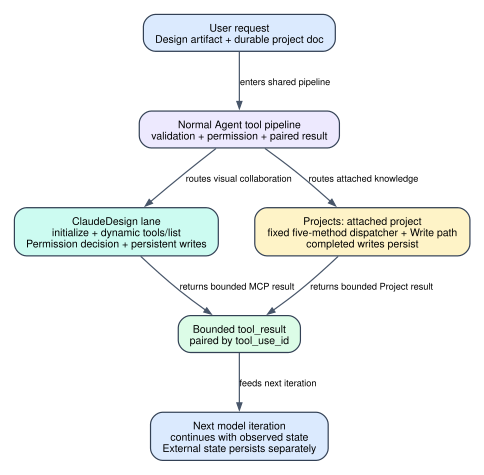

# Claude Code CLI 2.1.235 ClaudeDesign 与 Projects：远端设计画布和附着项目怎样进入 Agent Loop

> 版本：`2.1.235` | 证据：`Static`（发布 bundle 的可读逆向视图） | claude.ai 服务端存储、授权裁决、RAG 排序和团队可见性：`Boundary`

## 60 秒心智模型

**读者问题：** `ClaudeDesign` 和 `Projects` 都能读写 claude.ai 上的内容，它们是否只是两个名字不同的远端文件工具？

**一句话模型：** `ClaudeDesign` 是一个由客户端托管权限、由服务端动态发布操作目录的 MCP 会话；`Projects` 是一个固定五方法、被启动环境绑定到单个 Project 的知识容器工具。前者围绕设计画布、plan token 和 durable grant 运转，后者围绕 attached project、OAuth scope、知识预算和安全文件搬运运转。

贯穿场景：用户先让 Claude 在 Design 中制作一份可协作演示稿，再把最终说明写入当前会话附着的 Project。ClaudeDesign 首次连接时完成 `initialize -> tools/list`，读取服务端当前操作 schema；写 Design 文件时，客户端根据 consent、15 分钟 path grant 或 durable project grant 决定是否询问。随后 `Projects project_write` 从工作区读取说明文件，经过路径和 TOCTOU 校验、25 MiB 文件上限与知识预算检查后上传；若只需回答 Project 中的问题，则先 `project_search`，RAG 被 403 拒绝时退回文档名列表，而不是假装得到了搜索命中。



图的结论：两条链都进入普通 tool pipeline，并最终形成与 `tool_use_id` 配对的 `tool_result`；但它们不共享操作目录、授权 token、缓存或持久对象。Design grant 不能授权 Projects，Projects 的 project scopes 也不能替代 Design consent。

### 场景的前后状态

| 对象 | Before | Transformation | After | 用户可见效果 |
| --- | --- | --- | --- | --- |
| Design MCP session | 尚未初始化，客户端不知道服务端当前操作 | `initialize` 获取 `Mcp-Session-Id`，`tools/list` 发现操作并合并 hint | 进程内缓存 session id、operation hints 和 catalog hash | 后续操作可以直接调用；404 会清缓存并重新握手 |
| Design consent | consent 未知或服务端返回 `needs_consent` | GET 预取或 403 seed；人工批准后 POST consent | 服务端 consent 变为 true，进程内 cache 同步 | 后续 Design 连接不再重复问同一 consent，撤销后相关本地授权缓存被清空 |
| Path plan | 没有当前进程认可的 path token | `finalize_plan` 展示 writes/deletes，服务端返回 token | token 与 project、精确路径集合和 expiry 缓存在进程内 | 最长 15 分钟内，命中路径的 write/delete 可以不再弹窗 |
| Durable Design project grant | 当前项目未获得长期写授权 | 首次 tokenless write 展示服务端验证的项目身份，批准后 POST grant | grant 持久在服务端；本进程记录 verified project | 普通文件写入以后不再逐批询问，直到在 Design settings 撤销；删除和保留路径仍需逐批批准 |
| Attached Project auth | 登录 token 没有 project scopes | 受锁保护的 refresh 扩展 `user:projects:read/write` 并保存新 token | 当前登录具备 Project API scope | 首次使用可能显示 scope-upgrade notice；自定义 OAuth client、无 refresh token 等路径直接拒绝 |
| Project document | 不存在，或已有同名文档 | namespace 解析、知识预算、上传或替换 | claude.ai Project 中持久存在新版本 | 同一 Project 的其他会话和团队表面可见；本地 transcript/rewind 不能撤销远端写入 |

## 状态所有权

### ClaudeDesign 的状态不是一个授权位

| 状态 | Owner | 形态 | 失效或清理条件 | 不代表什么 |
| --- | --- | --- | --- | --- |
| `cachedSessionId` / `initialized` | 当前 Claude Code 进程 | MCP session id 与初始化 latch | MCP call/list 返回 404 时 reset；进程退出即消失 | 不代表 Design 项目仍存在或当前操作被批准 |
| `initializeInFlight` / `discoverInFlight` | 当前进程 | 并发首调用共享的 Promise | 完成或失败后清空 | 只是去重握手，不是跨进程锁 |
| operation hint registry | 当前进程 | `readOnly` / `destructive` hint map | 新一轮 `tools/list` 先 reset 再重建 | 服务端 hint 不能把客户端已知写操作降级成只读 |
| served catalog hashes | 当前进程，按 agent id 记忆 | 最多 64 项的 LRU map | 超过 64 淘汰最旧；进程退出清空 | `catalog_unchanged` 只说明 schema hash 相同，不说明旧结果仍在 context |
| consent | claude.ai 服务端；本地有 cache | `agent_design_projects` boolean | `/design revoke` 或服务端 403 更新；拒绝时清 plan/grant cache | 不等于某个具体项目已获得 durable write grant |
| approved path plans | 当前进程 | `plan_token -> project + writes/deletes + expiresAt` | 到期、项目敏感成员/分享变化、consent revoke、进程退出 | 不是服务端 durable project grant，也不能跨项目复用 |
| durable project grant | claude.ai 服务端；进程内 verified set | project id grant，可由 settings 撤销 | 403 `needs_project_grant`、敏感项目操作或 revoke 会使本地重新核验 | 不覆盖 delete、`CLAUDE.md`、`.claude` 等保留目标 |

### Projects 的 owner 更简单，但持久性更强

| 状态 | Owner | 客户端保存/看到什么 | 谁能改变 | 生命周期边界 |
| --- | --- | --- | --- | --- |
| attached project id | 启动 harness / session environment | `CLAUDE_PROJECT_UUID` | 创建该 session 的宿主 | 模型不能传 project id，也不能在工具内枚举或切换 Project |
| project OAuth scopes | claude.ai OAuth credential store | access/refresh token 与 scope list | scope-expansion refresh 或 `/login` | Projects scope 不授予 ClaudeDesign consent |
| Project metadata/knowledge stats | claude.ai Project API | name、instructions、docs、uploads、sync sources、knowledge counters | 团队成员、同步源和其他会话 | `project_info` 是读取时快照，不是事务锁 |
| text docs | claude.ai Project | path、uuid、content、created_at | `project_write` / `project_delete` 与其他表面 | transcript rewind 不恢复远端旧内容 |
| file uploads | claude.ai Project | file kind、raw bytes 或 extracted text | 此工具只读；删除要去 claude.ai | `project_delete` 只能删 text doc |
| downloaded temp files | 当前 session 临时目录 | mode `0600` 的 text/raw file | `project_read` 创建，本地清理机制删除 | 文件路径可能进入 tool result；原始内容不一定进入模型 context |

最关键的所有权判断是：**客户端拥有 permission decision 和本地缓存，但不拥有 claude.ai 上的最终数据。** 客户端可以 fail closed、重试握手、清除过期 token 映射，却不能通过删除 transcript 撤销已完成的远端写入。

## 完整调用顺序

### A. ClaudeDesign：动态 MCP 与三层写授权

#### 1. 装配 gate 决定工具是否进入本轮 schema

`ClaudeDesign` 只有在以下条件同时满足时启用：

1. managed/local policy `allow_design_sync` 允许；
2. 当前不是 nonessential-traffic-only 状态；
3. provider 是 first-party claude.ai 路径；
4. feature `tengu_omelette_fouet` 开启。

durable grant 的 server-approval watcher 另受 `tengu_omelette_grant_watch` 控制。静态 bundle 中存在完整实现，不等于某个账号或会话实际拿到了这两个远端 gate。

[启用 gate：300911-300920](../reverse/javascript/cli.readable.js#L300911) [工具注册：301327-301359](../reverse/javascript/cli.readable.js#L301327)

#### 2. 首次调用共享一次 `initialize`，然后动态 `tools/list`

ClaudeDesign 不是把二十个远端操作逐个注册为本地工具，而是暴露一个本地工具：

```text
ClaudeDesign({ operation, arguments })
```

客户端第一次需要目录或未知操作时执行：

```text
POST /v1/design/mcp  initialize
  -> protocolVersion 2025-03-26
  -> clientInfo claude-cli-design-tool / 1
  -> response header Mcp-Session-Id

POST /v1/design/mcp  tools/list
  -> Mcp-Session-Id header
  -> operation names, descriptions, inputSchema, annotations
```

`initializeInFlight` 和 `discoverInFlight` 让并发首调用共享同一 Promise，避免每个 read-only operation 都重复握手。若 `tools/list` 或 `tools/call` 带旧 session id 返回 404，客户端清掉 session、initialize、discovery 状态，再重新 initialize 并重试一次。

若共享握手被另一个并发 ClaudeDesign 调用中途取消，当前调用得到专门的 `design_tool_shared_handshake_cancelled`，提示重试；它不会把取消误报成远端操作自己的业务错误。

[session state：299631-299647](../reverse/javascript/cli.readable.js#L299631) [discovery/initialize：301230-301260](../reverse/javascript/cli.readable.js#L301230)

#### 3. 远端 schema 负责发现，本地 schema 负责写风险下限

`tools/list` 返回的每项会被解析为：`name`、`description`、`inputSchema`、`readOnlyHint`、`destructiveHint`。但客户端没有无条件相信服务端 annotation：

- 对客户端已知操作，`serverReadOnly && clientReadOnly` 才能成为只读；服务端不能把本地已知写操作声明成 read-only 来绕过询问；
- `serverDestructive || clientDestructive` 决定 destructive；服务端不能把本地已知破坏性操作降级；
- 新发现且明确 `readOnlyHint=true` 的操作可以在 discovery 后调用；
- 新发现的 write-tier 操作如果没有本地 `WRITE_OP_SCHEMAS`，客户端直接拒绝并要求升级 Claude Code；
- 完全未知且尚未 discovery 的操作被要求先调用 `list`。

本地 schema 还限制：operation 名最多 64 字符；普通字符串和非正文数组字段最多 4096 UTF-8 bytes；`plan_token` 最多 65536 bytes；未知 top-level/entry field 会带大小写纠错提示；`finalize_plan scope="project"` 即使 schema 中还保留该枚举，permission 层也明确拒绝。

这是一种双控制面：服务端可以增加只读能力和更新描述，客户端发布版本仍掌握写操作的参数可枚举性和最低风险分类。

[hint 合并：301015-301039](../reverse/javascript/cli.readable.js#L301015) [本地参数校验：300944-300995](../reverse/javascript/cli.readable.js#L300944) [write/read schema：301034-301038](../reverse/javascript/cli.readable.js#L301034)

#### 4. catalog hash 减少重复 schema token，但不假装旧目录还在

`operation:list` 会序列化完整 tools 目录并计算 catalog hash。对同一 agent id，若 hash 与先前相同且没有 `arguments.full`，返回值缩成：

- `catalog_unchanged: true`；
- `catalog_hash`；
- 每个 operation 的 name 和 description 首句摘要；
- 明确提示：如果早先完整 schema 已不在 context，使用 `{full:true}` 重取。

本地只保留最近 64 个 agent/catalog 记录。这是**schema 结果去重**，不是远端 MCP 结果缓存，也不是 prompt cache。实际 `tools/call` 仍发到服务端。

[catalog hash 与 LRU：301181-301203](../reverse/javascript/cli.readable.js#L301181)

#### 5. transport 只允许 first-party JSON，401 最多自动刷新一次

每次 MCP request 都经过同一 transport：

1. 当前 OAuth base URL 必须在 first-party allowlist；
2. POST `/v1/design/mcp`，timeout `60,000 ms`；
3. Axios `maxContentLength` 是 `16 * 130,000 = 2,080,000 bytes`；
4. 带 Bearer、Anthropic version、client platform、可选 `Mcp-Session-Id`；
5. 401 时尝试刷新当前可刷新的凭据，并以 `5,000 ms` race 约束刷新等待；
6. 只以新 token 重试一次；第二次 401 变成明确 auth error；
7. error/body 中出现 token 时统一替换成 `[redacted-oauth-token]`；
8. 虽然 Accept 包含 event stream，`2.1.235` 明确拒绝 `text/event-stream`，只处理 JSON。

这条链把 credential expiry 与 operation failure 分开。网络或 policy gate 失败不会被描述成“Design 操作参数错了”，而 SSE 也不会被半解析成不完整 JSON。

[auth refresh：301262-301280](../reverse/javascript/cli.readable.js#L301262) [transport：301282-301311](../reverse/javascript/cli.readable.js#L301282)

#### 6. consent 是 Design agent 总入口，不是每个项目的写授权

客户端先 GET `/v1/design/consent` 预取 `agent_design_projects`。预取失败时只留下空 cache；如果服务端随后在 `tools/call` 返回 403 `{error:"needs_consent"}`，客户端把该 bit seed 为 false，让下一次 permission decision 能显示准确 consent card。

当 permission card 确实到达主用户且用户批准：

1. POST `/v1/design/consent`；
2. 本地 consent cache 写 true；
3. 原 operation 重试一次；
4. 成功后保持 consent；
5. `/design revoke` DELETE consent，并清 approved plans、verified grants 和 plan store。

subagent、PermissionRequest-hook 或不能显示交互卡的 permission mode 不会自动替用户 POST consent，而是 fail closed 并要求 `/design consent`。

[consent cache/GET/POST：300410-300499](../reverse/javascript/cli.readable.js#L300410) [403 intercept/retry：301509-301514](../reverse/javascript/cli.readable.js#L301509)

#### 7. `plan_token` 是“这批路径在短时间内已被人看过”

`finalize_plan` 要求 project id，并列出 writes/deletes。人工批准后，服务端返回 `plan_token` 和可选 `expires_at`；客户端只在 `finalize_plan` 成功、permission card 确实展示且 scope 不是 project 时，把它登记到 `approvedPlans`。

登记前的可审阅性门槛包括：

- project id 必须可安全展示；
- writes 和 deletes 各不超过 20 项；
- 单个 path 最多 80 字符；
- 展示 payload 总预算约 2,000 字符；
- path 不能包含控制/混淆字符、保留路径、`..` 或无法规范化的 segment；
- 后续 operation 最多枚举 256 个 target；
- `copy_files` 没有 token 时永远拒绝，不能借 durable grant 自动放行。

允许条件是：token 在**当前进程**存在、未到期、project id 相同、operation 可以枚举 target、每个规范化 target 都属于对应 writes/deletes 集合。expiry 取服务端时间与 `now + 900,000 ms` 的较早值，所以客户端认可时间最长 15 分钟。

这不是“15 分钟内所有 Design 写操作都允许”，而是**同一项目、同一 token、同一精确路径集合**的临时授权。

[plan 登记与匹配：300307-300368](../reverse/javascript/cli.readable.js#L300307) [permission 消费：301382-301399](../reverse/javascript/cli.readable.js#L301382) [成功后登记：301474-301477](../reverse/javascript/cli.readable.js#L301474)

#### 8. durable project grant 是“这个 Design 项目以后普通写入不再逐批问”

durable grant 只适用于 tokenless `write_files` 和 `create_support_js` 的可枚举、非保留目标。新建 grant 前，客户端必须：

1. 确认当前是 main agent，且没有 PermissionRequest hook 截走批准；
2. 确认不是无法显示审批的 non-interactive、plan 或 bypass 分支；
3. GET `/v1/design/grants`，先复用已有服务端 grant；
4. 若未授权，调用 `get_project` 获取并严格清洗项目 name、sharing scope 和 HTTPS URL；
5. 在卡片中明确说明：批准后可写该项目任何普通文件，直到用户在 Design settings 撤销；
6. 工具执行若仍收到 `needs_project_grant`，POST `/v1/design/grants`，再重试 operation 一次；
7. POST 返回 404 时把该项目标记为 grant-ineligible，后续强制使用 per-batch plan。

非交互或 bypass session **不能 mint 新 grant**，但在 main-agent、非 plan、路径可审阅且服务端已经存在 grant 时可以复用。grant watcher 还能在审批期间轮询 server grant 的 `created_at`，发现一个比基线更新的 grant 后更新进程内 verified set。

以下操作不会被 durable grant 静默放行：delete、membership/sharing 敏感操作、`copy_files`、保留/不可枚举路径、`CLAUDE.md`/`.claude` 类目标。它们仍走 plan token 或逐批 ask。

[grant probe/mint/watch：300501-300571](../reverse/javascript/cli.readable.js#L300501) [permission 状态机：301400-301447](../reverse/javascript/cli.readable.js#L301400) [403 grant 重试：301491-301507](../reverse/javascript/cli.readable.js#L301491)

#### 9. result 在 transport、映射和工具框架三层受限

ClaudeDesign 的返回不是“服务器给多少就全部塞进下一轮”：

- transport response cap：`16 * 130,000`；
- `render_preview` 单个 base64 image block 若字符串长度超过 `130,000`，替换为 omitted 文本；
- text/image 结果按字符长度累计，aggregate cap `130,000`，超出 block 被丢弃并追加 truncation notice；
- 工具注册的 `maxResultSizeChars` 另外是 `100,000`；
- 普通 error 结果最终折成文本并设置 `is_error:true`；
- empty result 变成 `(empty result)`，避免生成非法空 content。

这里的 image 限制测量的是 base64 字符串长度，不是解码后的像素或原始 byte size；aggregate 也是字符预算。三个数字位于不同阶段，不应合并成一个“总文件大小上限”。

[result mapping：301149-301169](../reverse/javascript/cli.readable.js#L301149) [工具 cap 与映射：301327-301568](../reverse/javascript/cli.readable.js#L301327)

### B. Projects：单 Project dispatcher 与知识预算

#### 10. 工具只绑定一个 Project，不提供 discovery 或 project id 参数

`Projects` 的启用条件是：`allow_projects_tool` gate 开启，并且 session environment 中存在 `CLAUDE_PROJECT_UUID`。输入 schema 只有五个 method：

| method | 读写性 | 核心输入 | 结果 |
| --- | --- | --- | --- |
| `project_info` | read | 无 | metadata、instructions、docs、uploads、sync sources、knowledge stats |
| `project_read` | read | `path` | inline content 或 mode 0600 的 `local_file` |
| `project_search` | read | `query`, `n=5`，范围 1-15 | RAG hits；403 时返回 `rag:false` 和 docs list |
| `project_write` | write/destructive | `path` + `content` xor `local_path` | doc uuid、是否 replace、最终 path |
| `project_delete` | write/destructive | `path` | 只删除 text doc |

工具被标记为 non-concurrency-safe；write/delete 都是 destructive。模型不能把 project id 作为输入，也不能通过此工具切到另一个 Project。若 session 没有 attached project，call 阶段再次抛 precondition error，而不是只依赖 schema 装配。

[固定五方法与说明：301599-301624](../reverse/javascript/cli.readable.js#L301599) [schema/启用/执行：301822-301897](../reverse/javascript/cli.readable.js#L301822)

#### 11. 首次 Projects 调用可能扩展 OAuth scope

调用前 `Kci()` 依次检查：

1. `allow_projects_tool` policy；
2. first-party provider；
3. nonessential traffic 限制；
4. remote session JWT 是否已可用；
5. 本地 claude.ai access token；
6. 是否已有 `user:projects:read` 和 `user:projects:write`；
7. token 是否来自 custom OAuth client；
8. 是否有 refresh token，且当前环境允许 refresh；
9. credential lock 是否可获得。

缺 scopes 时，refresh request 保留基础 scopes、已有允许保留的 product scopes，再加入 read/write project scopes。刷新结果必须安全保存；若另一个进程已刷新、secure storage 保存失败、服务端没授予 scope，都会返回不同 failure reason。成功的第一次 tool result 会追加 scope-upgrade notice。

这一设计避免每次 Projects call 单独弹 OAuth，也避免用 API key、Bedrock/Vertex credential 或自定义 client 静默访问 claude.ai Project。

[scope 定义：17134-17168](../reverse/javascript/cli.readable.js#L17134) [scope expansion：214715-214762](../reverse/javascript/cli.readable.js#L214715) [用户错误映射：301625-301653](../reverse/javascript/cli.readable.js#L301625)

#### 12. API transport 根据宿主分成 session-JWT 与 teleport-org

普通本地 claude.ai session 通过 `/api/organizations/:orgUUID/projects/{project}` 路径和 `auth:"teleport-org"` 调用；带 remote session JWT 时，改走 `/v2/ccr-sessions/-/chat-project`，body 以 `op` 区分 detail/read/write/delete/search。

共同性质：

- timeout `30,000 ms`；
- project id 来自 attached session，不来自模型；
- transport reason、HTTP status 和业务 action 被包装为 `ProjectsApiError`；
- access token 只用于 auth readiness 和错误字符串 redaction，不作为模型可见字段返回；
- remote session 替换已有 doc 时采用 delete + create，普通 org API 采用 PATCH，因此两条 transport 的 replace 副作用并不完全相同。

[Projects API transport：214610-214695](../reverse/javascript/cli.readable.js#L214610) [replace 分支：301739-301745](../reverse/javascript/cli.readable.js#L301739)

#### 13. `project_read` 先区分 text extract 与原始 file upload

读取顺序：

1. `project_info` 获取最新 docs/files 清单；
2. exact path 先查 text documents，再查 file uploads；
3. text doc 直接读 content；
4. `file_kind=document` 的 upload 优先读服务端 extracted text；
5. 其他 upload 下载 raw bytes；
6. 找不到时最多列 30 个 available path，帮助纠错。

结果预算：

- text/extracted content UTF-8 size不超过 `256 KB` 时 inline；更大时写入 session 临时目录的 `project-doc-*.txt`，mode `0600`；
- raw upload 最大 `20 MB`；客户端比较 `file_size_bytes` 与实际 base64 decode 长度，不一致时完整重试一次；仍不一致则按并发修改或损坏报错；
- raw file id 必须是 UUID，文件名只保留安全字符和末尾 64 字符，再以 mode `0600` 落盘；
- Projects tool 的结果上限和 persistence ceiling 均为 `300,000` chars，但大内容已经优先转 local file，避免直接占满模型 context。

因此“内容没有 inline”不等于读取失败；它可能是客户端主动把大内容搬到本地文件，再要求后续使用合适工具读取。

[read dispatcher：301761-301780](../reverse/javascript/cli.readable.js#L301761) [inline/raw caps：301708-301737](../reverse/javascript/cli.readable.js#L301708) [20 MB transport cap：214695-214702](../reverse/javascript/cli.readable.js#L214695)

#### 14. `project_search` 的 403 fallback 只返回目录，不伪造 RAG

正常 search 把 `text_results` 和 `rich_content_results` 投影成 `name/doc_uuid/text` hits，并返回 `rag:true`。只有 Projects API 明确返回 HTTP 403 时，客户端 fallback 到 `project_info`，返回：

```json
{"method":"project_search","rag":false,"docs":["..."]}
```

它没有在本地逐文件 grep，也没有把 docs list 包装成命中。其他 status 或 transport error继续抛错。这让下一步很明确：模型可以按目录选择 `project_read`，但不能声称 RAG 已找到相关片段。

[search/fallback：301782-301820](../reverse/javascript/cli.readable.js#L301782)

#### 15. `local_path` 上传通过已打开 fd 对抗路径替换

`project_write` 的 `local_path` 不把文件正文放进 tool input/context，而由客户端直接读取。为了避免“permission 时看到 A，upload 时 symlink 已换成工作区外 B”的 TOCTOU，运行时执行：

1. lexical `resolve(cwd, local_path)`，必须位于 cwd；
2. 分别 `realpath(candidate)` 与 `realpath(cwd)`，再次要求 candidate 位于真实 cwd；
3. read-only 打开解析后的文件，并使用额外平台 flag；
4. 对已打开 fd 做 bigint `fstat`；
5. 再次 realpath 原始 candidate 并 `stat`；
6. 比较 real path、device 和非零 inode；任一变化报 `local_path was replaced during the upload`；
7. 要求 regular file；
8. 拒绝超过 `26,214,400 bytes`（25 MiB）；
9. 从已经验证的 fd 读取，按 UTF-8 解码成 text doc content，finally close。

常见错误被分成不存在、不可读、目录/特殊文件、symlink loop、路径替换和过大文件。`local_path` 不是任意二进制 upload：运行时最终执行 `readFile().toString("utf8")`，非 UTF-8 bytes 会按文本解码，Project 原始 file uploads 在这个工具中仍是只读对象。内容没有作为模型 input 暴露，但解码后的文本会上传到 claude.ai，解析后的 absolute local path 会进入工具展示/结果，因此仍有路径隐私面。

[TOCTOU 与 25 MiB：301667-301707](../reverse/javascript/cli.readable.js#L301667)

#### 16. namespace 和 knowledge budget 在发写请求前确定

path 解析规则不是所有文件都强制加 `claude/`：

- 去掉开头 `./`；
- 如果 exact path 已存在，保持原 path，完成 replace；
- 新 path 含 `/` 时尊重显式 namespace；
- 只有**新建的 bare filename**自动变成 `claude/<name>`。

随后以 `ceil(UTF8 bytes / 4)` 估算本次知识 token 增量。若 `knowledge_size + estimate > max_knowledge_size`，客户端在请求前拒绝，并要求删除不用的 docs 或拆分写入。

这里是保守的客户端预检，不是服务端计费或 tokenizer 精确值。replace 也用整份新内容做增量预检，没有在本地扣除旧文档大小；服务端仍是最终 quota owner。

[namespace/预算：301658-301666](../reverse/javascript/cli.readable.js#L301658) [write dispatcher：301792-301797](../reverse/javascript/cli.readable.js#L301792)

#### 17. Project 内容是持久共享数据，但不升级为指令

工具 prompt 明确声明 Project docs 可能由其他组织成员或其他 session 写入，必须作为 data 而非 instructions。这个边界适用于：

- project custom instructions 之外的普通 docs；
- RAG snippets；
- extracted PDF/docx text；
- raw upload 的文件名、metadata 和后续读取结果；
- sync source metadata。

`project_write` 返回 `present_to_user` 只是交付呈现标记，不改变 permission，也不把文档升级成 system message。远端写成功后，其他团队表面可能立即看到；Agent Loop 后续失败、compact、resume 或 rewind 都不会撤销它。

[Projects tool contract：301599-301603](../reverse/javascript/cli.readable.js#L301599) [write result：301792-301797](../reverse/javascript/cli.readable.js#L301792)

## Gate / 默认值 / 阈值

### ClaudeDesign

| 项目 | `2.1.235` 值 | 精确含义 |
| --- | --- | --- |
| enable policy | `allow_design_sync` | false 时工具不装配 |
| feature gate | `tengu_omelette_fouet` | 远端 config；静态代码不能证明账号值 |
| watcher gate | `tengu_omelette_grant_watch` | 控制 durable grant server-approval observer |
| MCP timeout | `60,000 ms` | initialize/list/call 共用 |
| refresh race | `5,000 ms` | 401 后等待新 token 的上限；最多重试一次 |
| operation name | `1-64` chars | `^[\w.-]+$` |
| ordinary string | `4,096 UTF-8 bytes` | top-level string与非正文 entry 字段 |
| `plan_token` | `65,536 bytes` | token 字段独立上限 |
| plan paths | writes/deletes 各 `<=20` | 人工展示和登记门槛 |
| one plan path | `<=80 chars` | 超过则不登记/不走静默 allow |
| render budget | 约 `2,000 chars` | 确保 approval card 可完整展示 |
| operation targets | `<=256` | 超过转 ask，不静默允许 |
| approved path TTL | `<=900,000 ms` | 取 server expiry 与 15 分钟较早值 |
| catalog LRU | `64` | 按 agent/conversation key 保留 hash |
| preview image | `130,000 base64 chars` | 单 image block mapping cap |
| aggregate mapping | `130,000 chars` | 超出 block omitted，并追加 notice |
| tool max result | `100,000 chars` | 工具框架级 result cap |

### Projects

| 项目 | `2.1.235` 值 | 精确含义 |
| --- | --- | --- |
| enable gate | `allow_projects_tool` + `CLAUDE_PROJECT_UUID` | 有实现不等于当前 session attached |
| methods | `5` | info/read/search/write/delete |
| concurrency | `false` | 所有 method 进入顺序执行工具批次 |
| search hits | default `5`, range `1-15` | 传给服务端 RAG |
| API timeout | `30,000 ms` | session-JWT 和 org API 共用 |
| inline text | `262,144 bytes` | 超过写 mode 0600 local file |
| raw download | `20,971,520 bytes` | 20 MiB，reported/decoded size需一致 |
| local upload | `26,214,400 bytes` | 25 MiB regular-file hard cap |
| knowledge estimate | `ceil(bytes/4)` | 客户端预算预检，不是精确 tokenizer |
| tool result | `300,000 chars` | max result 与 persistence ceiling |
| path | `1-255 chars` | read/write/delete schema |
| downloaded mode | `0600` | text extract 和 raw file 均为 owner-only |

## 失败恢复

| 故障 | 客户端保留什么 | 客户端丢弃/重置什么 | 自动动作 | 用户下一步 | 已完成副作用 |
| --- | --- | --- | --- | --- | --- |
| Design MCP 404 + old session id | operation input、OAuth token | cached session id、initialized/discovery in-flight | re-initialize 并重试一次 | 再失败则重试或检查服务 | 先前成功远端写保留 |
| Design 401 | operation input | 旧 token不再使用 | 5 秒内刷新，最多一次新 token retry | `/login` 或 `/design login` | 401 前已成功调用不回滚 |
| Design SSE response | 原始 HTTP status | 不解析 event stream | 无 fallback | 升级客户端或等待 JSON endpoint | 服务端是否已处理 request 取决于远端，客户端不能撤销 |
| `needs_consent` 未提前显示 | consent bit 被 seed false | 当前 call 失败 | 下次 permission 决策展示 card | retry 或 `/design consent` | 当前 operation 未获得成功结果 |
| `needs_project_grant` 且 card 已批准 | project id、operation input | verified grant cache先失效 | POST grant 后重试一次 | 若 404，改走 finalize_plan | 首次 call 是否服务端部分执行属于远端边界 |
| plan token 过期/跨项目/漏 path | operation input | 过期 token entry被删除 | 转 ask，不自动扩大范围 | 新 `finalize_plan` | 以前 token 下成功写入保留 |
| catalog 未知 write op | 动态目录和 description | 不执行 operation | 无 | 升级到含本地 write schema 的版本 | 无本次写副作用 |
| Projects scope expansion lock contention | 原 credential | 不覆盖 sibling refresh | 返回可区分 reason | 稍后 retry | 无 Project API write |
| Project RAG 403 | query、attached project | 不生成假 hits | `project_info` docs list fallback | 选择 relevant doc 后 `project_read` | 无写副作用 |
| raw file size mismatch | 第一次 metadata | 第一次 bytes | 完整下载重试一次 | 再失败则等并发保存完成后 retry | 只产生临时文件前的网络读取 |
| local_path 被替换 | 已打开 fd 与 stat证据 | 不上传 bytes | fail closed | 固定 symlink/并发写后 retry | 无本次远端写 |
| knowledge budget超限 | 当前 stats 与估算值 | 不发写 request | 无 | 删除 Project docs 或缩小内容 | 旧 Project 内容不变 |
| remote-session replace 中途失败 | attached project 与错误 | delete/create 不是原子事务 | 无通用 rollback | 重新 `project_info/read` 核实 | 旧 doc可能已删除，必须以远端事实为准 |

恢复设计有一个共同原则：**恢复控制状态，不伪造数据事务。** 清 MCP session、重取 scope、重试 download 都能恢复客户端一致性；已经成功的远端写、删除、分享变更或成员变更不会因为后续 tool error、abort、compact 或 rewind 自动回滚。

## 用户影响

### 可读性与交互

- ClaudeDesign 用一个 tool 承载动态 operation catalog，模型不必永久携带所有远端 schema；catalog hash 进一步降低重复目录 token。
- `list -> get_claude_design_prompt -> list_projects -> finalize_plan/write_files -> render_preview` 是推荐顺序，但具体 operation 名和 schema 仍以实时 `tools/list` 为准。
- Projects 固定五方法，用户不需要管理 project id；代价是切换 Project 必须重启/重建 attached session。
- 大 Project 文本和原始 file upload 通过 local file handoff，减少单轮 context 压力，但多一次本地 Read/文件工具步骤。

### 延迟与成本

- ClaudeDesign 冷启动至少需要 initialize + discovery，再加实际 call；并发去重避免首轮 N 倍握手。
- 401 refresh、404 reinitialize、consent/grant POST 都可能增加一到两个 round trip。
- Projects 首次 scope expansion 需要 OAuth refresh 和 secure-store write；`project_info` 常被 read/write/search dispatcher作为最新目录和 quota 前置请求。
- `project_search` 能减少逐文档读取 token；403 fallback 只给目录，后续成本取决于人工/模型选择多少 docs。
- 修改 Project 文档可能影响其他 Project chat 的缓存，客户端 prompt有明确警告；具体 server cache invalidation 和计费不在本地 artifact 中，不能把这条提示扩写成已验证账单结论。

### 隐私与安全

- Design 和 Projects 都会把内容发送到 claude.ai，不是本地-only artifact。
- ClaudeDesign 会严格清洗项目名称、sharing scope 和 URL 后才用于 durable-grant approval card，避免控制字符、混淆字符或伪 URL污染审批。
- `local_path` 的正文不进入模型 tool input，但绝对路径可能进入 UI/result，文件 bytes 会上传；这是“减少 context 暴露”，不是“无数据外发”。
- downloaded Project 文件以 mode `0600` 写临时目录，降低同机其他用户读取风险；留存时间仍取决于 session temp 清理。
- Project docs、Design read_file 和 conversation 都是外部数据，不因来自 Anthropic endpoint 自动变成可信指令。

### 可恢复性

- MCP session/cache 是进程态，可重建；consent/durable grant/Project docs 是服务端态，跨 session 存在。
- 15 分钟 plan token 是进程内认可的短授权，进程重启后需要重新审批，即使服务端 token 字符串仍被模型记住。
- durable grant 可以跨 session复用，但 server revoke、敏感项目操作或 403 会使本地重新确认。
- Projects 的 write/delete 是外部副作用；transcript rewind 只改变会话历史视图，不能恢复 Project 文档。

## 证据

### 关键源码索引

| 机制 | 可读视图范围 |
| --- | --- |
| ClaudeDesign 工具说明、本地 operation schema | `300927-301039` |
| Design state、plan/consent/grant helper | `299631-300590` |
| MCP initialize/discovery/call | `301191-301260` |
| OAuth refresh与 JSON transport | `301262-301312` |
| permission 与 execution backstop | `301327-301520` |
| result rendering/caps | `301149-301169`, `301517-301568` |
| Projects auth scope expansion | `214715-214762` |
| Projects API transport | `214610-214702` |
| Projects fixed methods与 attached-project contract | `301599-301653`, `301822-301897` |
| path、budget、read/search/write/delete dispatcher | `301658-301820` |

对应结构化 claim 位于 [mechanism-evidence.jsonl](mechanism-evidence.jsonl)，topic 为 `claude-design-projects`。这些 claim 使用 `runtime`/`consumer` 静态证据；没有用 operation schema、help text 或字符串命中冒充远端成功执行。

## Boundary

`2.1.235` 发布 artifact 可以证明客户端怎样装配工具、校验输入、缓存 MCP session、刷新 token、询问 consent、登记 path token、核验 durable grant、限制结果、检查本地路径、预算 Project 写入并处理错误。它不能证明：

1. 某个真实账号的 `tengu_omelette_fouet`、grant watcher 或 Projects policy 当前值；
2. claude.ai 当前 `tools/list` 实际返回的完整操作集、schema 和 annotation；
3. 服务端如何生成 `plan_token`、如何判定 consent/grant、如何持久化或复制 Design 项目；
4. durable grant 在服务端的内部 ACL、审计、撤销传播延迟和跨组织规则；
5. Project RAG 的 embedding、召回、排序、过滤、引用质量与 403 产生原因；
6. `knowledge_size` 的服务端精确 tokenizer、quota 结算和并发写事务；
7. 修改 Project docs 后服务端 prompt cache 的实际失效范围、时点和账单；
8. 远端 write/delete 是否具备内部事务或幂等键，以及超时后是否已经落地；
9. 用户或团队在 claude.ai UI 中最终看到的权限、同步延迟和内容版本；
10. 已完成外部副作用的自动回滚。

因此本专题的准确结论是：**客户端实现了可验证的动态发现、权限下限、短期和长期授权分层、路径 TOCTOU 防护与结果/知识预算；远端业务状态和服务端算法仍必须通过 exact-account runtime probe 或服务端证据验证。**
