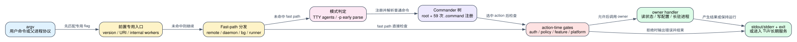

# Claude Code 2.1.235 完整 CLI 命令树：为什么 `--help` 不是全貌

> **版本与证据：** 本文只解释 Claude Code CLI `2.1.235`，目标二进制 SHA-256 为 `83b8f806f6f2eea316cfe246628e6c23374711d868f1fd0409db551b877b7748`。命令拼写、alias、hidden/conditional 注册来自可读化 bundle；65 组 help/usage 结果来自同哈希精确二进制 Probe。帮助文本只证明 parser surface，不证明 action 已成功执行。

## 60 秒模型

**读者问题：** 为什么顶层 `claude --help` 看不到 `daemon`、`self-hosted-runner`、`sandbox` 和 `remote-control`，而执行一个并不存在的 `claude status --help` 又会 exit 0 并打印根帮助？

**一句话模型：** `2.1.235` 不是“一棵 Commander 命令树”，而是按顺序经过专用 flag、fast-path 手写分发、TTY/print 模式分支和 Commander 四层路由；顶层帮助只能显示最后一层里未隐藏、当时已注册的节点。



场景：用户输入 `claude remote-control --help`。程序在 Commander 生成帮助之前就命中 Remote Control fast path，先检查本地 OAuth、组织策略、产品能力和 trusted device；隔离 Probe 因未登录直接 exit 1，所以“这是已注册的隐藏命令”与“能打印 Commander help”是两回事。

| 对象 | 之前 | 转换 | 之后 | 用户可见效果 |
| --- | --- | --- | --- | --- |
| argv | 一串 token | 先匹配 URI、worker 和 fast path | 某个专用 owner 接管，或继续进入 Commander | 同一 token 可能完全绕过根命令树 |
| 命令注册 | bundle 中有 `.command(...)` | 根据 `-p`、remote config、环境变量注册 | 当前进程的一棵临时 Commander 树 | XAA/auto-mode 等节点可条件出现 |
| help | parser 已选定某个节点 | 只渲染 visible options/children | 一段局部 usage | hidden、action gate、手写 parser 不会自动出现 |
| action | 命令名和参数已通过 parser | 再检查 auth/policy/platform/trust/feature | 调用 handler 或提前失败 | “help 可见”不等于“功能可用” |
| 状态 | 配置、凭据、会话、daemon 或远端任务 | handler 读取、修改或启动长驻进程 | stdout/exit、TUI 或长期服务 | 有些命令不可逆地改文件、凭据或远端状态 |

本次结构化清单记录 `90` 个命令路径：`60` 个 root/Commander 行（根 action + bundle 中 `59` 次显式 `.command(...)` 注册）和 `30` 个手写 fast-path/manual-parser 行；另外单列 `8` 个父进程或 OS 集成使用的内部入口。精确二进制 Probe 执行 `65` 组 help/usage case，并验证不存在的 `status` 会回退根帮助、Remote Control help 会被登录 gate 抢先、`code-sign --help` 会按签名 helper 参数失败。

## 第一件要记住的事：路由顺序决定 owner

### 1. 前置专用入口

`gw0` 在导入主 Commander 之前先处理版本、deep link URI 和内部子进程协议：

```text
--handle-uri <uri>
--claude-in-chrome-mcp
--chrome-native-host
--computer-use-mcp
--daemon-worker <kind>
--bg-pty-host
--bg-spare
--preload
```

这些 token 的 owner 是 OS protocol handler、Chrome/Computer Use bridge 或 background supervisor。它们需要父进程提供的环境、pipe、token 或 IPC，不是面向普通用户的命令。直接调用可能报错、等待 stdin 或启动长期 worker；清单把它们列出，是为了跨版本 diff 和故障诊断，不是推荐使用。

### 2. Fast path

随后程序在 Commander 之前识别：

- `remote-control`、`rc`、`remote`、`sync`、`bridge`；
- `daemon`；
- `logs`、`attach`、`stop`、`kill`、`respawn`、`rm`，以及 argv 中的 `--bg/--background`；
- TTY 下的 `agents` 视图；
- `self-hosted-runner` 及其 operator/helper 子命令；
- `--tmux + --worktree` 的提前 exec 路径；
- 单独出现的 `--update/--upgrade`，会改写为 `update`。

这些分支的关键差异是：它们可以在 `.parseAsync()` 之前检查 policy、auth、fleet gate、daemon lock 或 runner secret。因此 `remote-control --help` 也可能先失败，`daemon --help` 则由自己的手写 help renderer 输出。

### 3. `agents` 与 `-p` 会改变树的构造时机

TTY 且输入只包含 `agents`/少量 dispatch defaults 时，程序可以直接进入 Fleet View，不走 Commander 的 `agentsCommandHandler`。非 TTY 或 `--json` 等组合再落到普通 action。

更容易误判的是 `-p/--print`：`Db0` 检测到 print mode 后会立即对 root program 解析并返回，而 `gateway`、MCP、Plugin、Auth、Project 等子命令是在这条 early return 之后才注册。结论不是“这些命令支持或不支持 `-p`”，而是 **print 根 action 和非 print 子命令树拥有不同的注册时序**。不能拿一次根帮助外推全部 argv 组合。

### 4. Commander 只负责最后一层

进入普通路径后，root action、MCP、Plugin、Auth、Project、Agents、Auto Mode、installer 等节点才组成 Commander 树。Parser 负责 argument/option/choice 校验；真正的 auth、policy、trust、platform 和远端能力通常在 action 内再次检查。

## 全量命令树

下面列的是 inventory 中全部用户/运维可表达路径。`[hidden]` 表示根帮助不展示，`[conditional]` 表示注册或执行受 gate 控制，`[fast]` 表示可能在 Commander 前被接管。

```text
claude [prompt]
├─ mcp
│  ├─ serve
│  ├─ add <name> <commandOrUrl> [args...]
│  ├─ remove <name>
│  ├─ list
│  ├─ get <name>
│  ├─ login <name>
│  ├─ logout <name>
│  ├─ add-json <name> <json>
│  ├─ add-from-claude-desktop
│  ├─ reset-project-choices
│  └─ xaa                                      [conditional: CLAUDE_CODE_ENABLE_XAA=1]
│     ├─ setup
│     ├─ login
│     ├─ show
│     └─ clear
├─ plugin | plugins
│  ├─ init | new <name>
│  ├─ validate <path>
│  ├─ tag [path]
│  ├─ list
│  ├─ eval [target]                            [action-time early-access gate]
│  │  └─ init [name]
│  ├─ details <name>
│  ├─ marketplace
│  │  ├─ add <source>
│  │  ├─ list
│  │  ├─ remove <name>
│  │  └─ update [name]
│  ├─ install | i <plugin>
│  ├─ uninstall | remove <plugin>
│  ├─ prune | autoremove
│  ├─ enable <plugin>
│  ├─ disable [plugin]
│  └─ update <plugin>
├─ gateway --config <path>
├─ auth
│  ├─ login
│  ├─ status
│  └─ logout
├─ project
│  └─ purge [path]
├─ setup-token
├─ agents                                      [fast when TTY/fleet view]
├─ ultrareview [target]
├─ auto-mode                                  [conditional: remote config not disabled]
│  ├─ defaults
│  ├─ config
│  ├─ reset
│  └─ critique
├─ remote-control | rc                         [hidden + fast]
│  aliases accepted only by fast path: remote | sync | bridge
├─ doctor
├─ sandbox                                     [hidden]
│  ├─ install
│  └─ status
├─ update | upgrade
│  flag rewrites: --update | --upgrade
├─ install [target]
├─ import [source]                             [conditional action]
└─ import-conversations <exportPath>           [hidden]

claude daemon                                 [hidden + manual parser + fast]
├─ run [json-path]
├─ status
├─ logs | log
├─ install                                    [present but disabled in this build]
├─ start                                      [present but disabled in this build]
├─ restart                                    [present but disabled in this build]
├─ uninstall
├─ stop
├─ list                                       [hidden from daemon help]
├─ scheduled                                  [hidden from daemon help]
│  ├─ add
│  ├─ remove <task-id>
│  └─ list
├─ remote-control                             [hidden from daemon help]
│  ├─ add
│  ├─ remove <name-or-dir>
│  └─ list
└─ hub                                        [hidden; TTY only]

claude self-hosted-runner                     [hidden + manual parser + fast]
├─ orchestrator
├─ setup
├─ doctor
├─ code-sign                                  [internal Git SSH signing helper]
└─ decode-token                               [operator helper]

claude logs <job>                             [conditional background fast path]
claude attach <job>                           [conditional background fast path]
claude stop | kill <job>                      [conditional background fast path]
claude respawn <job>                          [conditional background fast path]
claude rm <job>                               [conditional background fast path]
```

Commander 自动生成的 `help [command]` 只属于相应 group 的帮助机制，不单独计为产品 handler。完整的逐路径 syntax、observed options、隐藏/static options、children、owner、side effect、failure 和证据见 [`cli-command-inventory.json`](cli-command-inventory.json)。

## alias 不是同一种 alias

| 表面 | 实现方式 | 影响 |
| --- | --- | --- |
| `plugin` / `plugins` | Commander `.alias()` | 两者进入同一个 group，帮助会显示 `plugin|plugins` |
| `plugin init` / `new`、`install` / `i`、`uninstall` / `remove`、`prune` / `autoremove` | Commander `.aliases()` | parser、options、action 完全共用 |
| `update` / `upgrade` | Commander alias | 普通子命令路径共用 updater |
| `--update` / `--upgrade` | argv rewrite | 仅在 argv 只有该 flag 时改写为 `update` |
| `remote-control` / `rc` | Commander alias + fast path | 登录状态下可能继续进入 bridge；未登录时 help 也先被 gate 拒绝 |
| `remote` / `sync` / `bridge` | 只存在于 fast-path token 比较 | 根帮助和 Commander alias 清单都看不到，但会进入同一个 bridge owner |
| `daemon logs` / `log` | 手写 parser alias | daemon help 只写 `logs`，parser 同时接受 `log` |
| background `stop` / `kill` | fast-path switch | 两者最终调用同一个 stop handler，不代表可回滚已完成工作 |

跨版本比较若只 diff Commander help，会漏掉后四类 alias。

## gate 必须分成四种

| gate 类型 | 代表路径 | 发生时间 | 被拒绝时留下什么 |
| --- | --- | --- | --- |
| 条件注册 | `mcp xaa`、`auto-mode` | 构造命令树时 | 节点可能根本不在当前树中；XAA Probe 需显式设置环境变量 |
| action-time feature gate | `plugin eval`、`import` | parser 已接受后 | help 正常，但执行时报 early access/feature unavailable |
| 身份与组织 policy | `remote-control`、cloud review、gateway auth | fast path 或 action 前 | 通常没有业务副作用；输出精确拒绝原因和非零 exit |
| 平台/运行态 gate | `sandbox install`、daemon service、agents fleet、self-hosted runner | handler 初始化时 | 可能已经读取配置或检查锁；不应把“命令存在”写成“当前平台可用” |

`mcp xaa setup` 还展示了一个重要的部分成功边界：它先写 `xaaIdp` settings，再尝试把 client secret 写入 keychain。后一步失败时，配置可能已经持久化。CLI 错误不能一律解释为“什么都没发生”。

## 关键命令族：owner、状态和失败

### Root session

Root 拥有交互 TUI、`--print`、SDK NDJSON、resume/fork、cloud/worktree、模型、工具和 permission 选项。公开帮助显示约束稳定的常用 flag；bundle 还注册了 SDK/worker/deep-link/teammate/channel 等隐藏 option，例如 `--sdk-url`、`--managed-settings`、`--session-mirror`、`--resume-session-at`、`--channels` 和 `--teammate-mode`。

这些隐藏 option 不是“秘密功能开关”的同义词：多数是父进程协议或内部状态传递。它们的可见性、parser 存在和 handler 可达必须分别判断。Root 成功可能写 transcript、调用模型并执行外部工具；resume/rewind 只能恢复受管理的会话或文件 checkpoint，不能撤销已经完成的外部系统副作用。

### MCP 与 XAA

| 命令 | 主要 option/argument | 状态变化 | 典型失败 |
| --- | --- | --- | --- |
| `mcp add` | name、command/URL、transport、scope、env/header、OAuth client、callback；XAA flag 条件隐藏 | 写 local/user/project MCP 配置，HTTP/SSE secret 可写 secure storage | URL 被误当 stdio 会警告；scope、port、secret、XAA prerequisite 分别拒绝 |
| `mcp list/get` | server name | 读取配置；已批准 server 会 health-check，未批准只显示 pending | server 不存在、配置/连接失败；列表为空只证明状态为空 |
| `mcp login/logout` | name、`--no-browser` | 获取/清除 OAuth token；claude.ai connector 指向远端凭据 owner | transport 不支持 OAuth、browser/callback、token revoke 失败 |
| `mcp xaa setup/login/show/clear` | issuer、client ID/secret、callback、force/id-token | settings + keychain/id_token cache | 环境 gate、OIDC issuer、JWT、浏览器、keychain；部分写入边界见上文 |

### Plugin、Marketplace 与 Eval

Plugin group 的命令不是单纯“增删文件”：marketplace declaration、checkout/cache、安装 scope、enablement 和 session registry 是不同状态层。`plugin update` 成功后帮助明确提示 restart required；当前进程已经装载的 registry 不会自动等同于磁盘新版本。

`plugin install/uninstall/prune/update` 对 marketplace-declared command 有 `-y/--yes` 非交互确认合同；uninstall 的 `--keep-data` 与 `--prune` 分别控制持久数据和孤立依赖。`plugin eval` 又是另一类 owner：它会启动模型/grader、可选执行作者提供的 scaffold shell、写 JSON/HTML、受 cost/turn/timeout/threshold 控制，并可发布 report。把它与普通 manifest validate 混在一个“plugin 命令”描述里会丢掉成本和执行风险。

### Auth、Project、Lifecycle 与 Import

- `auth login/logout/status` 管理账户凭据；`setup-token` 生成长期 subscription token。状态输出成功不证明某个远端产品 entitlement。
- `project purge` 可删除 transcript、task、file history 和 config entry；`--dry-run` 才是只读，`-y` 只是跳过确认，不提供回滚。
- `doctor` 读取当前目录 settings 且不弹 trust prompt；`update/install` 会替换 native build。二进制回滚不会自动降级 settings/transcript schema。
- `import` 的 pre-rewrite 会把受支持参数转换为一次 `/import` query，并用 preview digest 绑定 `--yes=<digest>`；project-level 或警告项不会被无条件批量导入。`import-conversations` 是另一个隐藏 archive importer，不走同一交互选择器。

## 手写 parser：顶层帮助最容易漏掉的部分

### `daemon`

`FKc` 允许在 `daemon` 前出现 bypass-permission flags，然后把后续 argv 整体交给 `daemonMain`。它不使用 Commander，自己的 parser 接受：

- global/manual options：`--json-path`、`--log-file`，内部还有 `--origin`、`--spawned-by`；
- lifecycle：`run/status/logs|log/install/start/restart/uninstall/stop`；
- hidden config：`list`、`scheduled add|remove|list`、`remote-control add|remove|list`、`hub`。

本版 help 明确写着 service install disabled，但 parser 和 handler 仍保留 `install/start/restart`，运行时由 `HIt()` 和 platform service manager 再拒绝。这是“代码存在但版本 gate 禁用”的典型例子，不能删出 inventory，也不能宣称当前可用。

`daemon stop` 通过 lock pid、process start identity、control socket 和 `--any` 防止误杀不属于自己的进程；`--keep-workers` 可保留 detached sessions。无法验证 holder 时它宁可失败，也不会凭 PID 猜测。`scheduled add` 要求有效 cron、trusted directory、permission mode，并在写配置前要求 service installed；`remote-control add` 同样先 canonicalize/trust 目录。

### `self-hosted-runner`

Runner root 是长期 operator 进程，help 分为连接、runtime、runner lifecycle、per-session watchdog 和 debug：environment secret、capacity/base dir、child exec、hooks、Git rewrite/proxy/signing、workspace trust/confine、health/log、idle/drain/retire/startup/max-lifetime 等 option 都进入自己的 parser。

- `orchestrator` 轮询 spawn hints，按 hook exit code 区分 retryable/non-retryable，并可维护 standby capacity 与 SCM connector。
- `setup`、`doctor` 不是普通静态检查器，而是带固定 system prompt/tool pool 启动新的 Claude 子会话；子进程 exit 会原样影响命令结果。
- `code-sign` 是 Git `gpg.ssh.program` helper，只接受 SSH signing argv，读取 runner session token并调用 sign-commit；它没有 help action，`--help` 会按非法签名参数 exit 1。
- `decode-token` 默认验证签名和 expiry；`--no-verify` 是离线观察模式，不能用于授权判断。

### Background verbs

`logs/attach/stop/kill/respawn/rm` 由 fast path 读取 fleet gate、Storage v5/daemon 状态并调用 job handler。`kill` 实际落到 stop handler。它们不在 root help，也不能用“`status --help` exit 0”那套探测方法判断存在性。

## 参数错误、帮助和退出码的陷阱

| 输入 | 精确二进制结果 | 正确解释 |
| --- | --- | --- |
| `claude status --help` | exit `0`；第一行是 `Usage: claude [options] [command] [prompt]` | `status` 不存在；Commander 把它当 root prompt/argument 后显示根帮助 |
| `claude remote-control --help`（隔离无登录） | exit `1`；`You must be logged in` | fast path 在 Commander help 前执行身份 gate；不能说命令不存在 |
| `CLAUDE_CODE_ENABLE_XAA=1 claude mcp xaa --help` | exit `0`；显示 setup/login/show/clear | XAA 是条件注册，不设置 gate 时父命令树不会列出它 |
| `claude self-hosted-runner code-sign --help` | exit `1`；only SSH-style signing | 这是父进程 helper，不实现 help convention |
| `claude daemon --help` | exit `0`；手写 usage | 它证明 manual parser help，不会列出全部 hidden parser action |

因此可靠的命令存在性判断至少需要同时检查 usage 首行/特征 marker、源码注册/dispatcher 和 gate；只看 exit status 会产生确定性的假阳性。

## 副作用与恢复边界

| 类别 | 代表命令 | 已拥有的状态 | 可恢复范围 |
| --- | --- | --- | --- |
| 只读/观察 | `auth status`、`mcp get/list`、`plugin list/details`、`daemon status/list`、sandbox status | 本地配置、凭据元数据、daemon/server health | 不修改目标状态，但 health check/telemetry 仍可能产生网络或观测事件 |
| 本地配置写 | MCP add/remove/reset、XAA setup/clear、plugin enable/disable、auto-mode reset | settings、plugin registry/cache、secure storage | 可用反向命令或备份恢复；跨 settings/keychain 的部分成功需分别处理 |
| 文件/项目删除 | `project purge`、plugin uninstall/prune、daemon config remove | transcript/task/history/plugin data/schedule | `--dry-run` 可预览；执行后不由 Claude rewind 自动恢复 |
| 长驻进程 | gateway、remote-control、daemon run、self-hosted-runner/orchestrator | socket、lock、worker/lease、health listener | stop/信号只结束进程；已完成的 child/tool/Git/remote 副作用继续存在 |
| 远端创建/发布 | ultrareview、plugin eval publish、cloud/root flows | remote job/report/comment/session | timeout/cancel 不等于服务端回滚；`--post` 会写 PR comment |
| 安装/系统修改 | update/install、sandbox install、daemon service | binary、service unit、Windows filters | 需要显式 reinstall/uninstall/rollback；settings/transcripts不随 binary 自动回退 |

## 如何读结构化 inventory

[`cli-command-inventory.json`](cli-command-inventory.json) 的每个 command row 都包含：

- `path`、`syntax`、`arguments`：完整路径和 exact-binary usage；
- `aliases`：Commander alias、fast-path alias 或 manual alias；
- `parser`、`visibility`、`gate`：由哪一层解析、是否 hidden/conditional、gate 在哪里；
- `observedOptions`：精确二进制 help 中实际出现的 option；
- `hiddenOrStaticOptions`：bundle 中存在但该 help case 不显示的 option；
- `observedChildren`：该局部 help 实际列出的 children；
- `handlerOwner`、`sideEffects`、`failureBehavior`：命令族的 owner、状态变化和失败边界；
- `evidence.static`、`evidence.probeCase`、`evidence.limitation`：源码位置、Probe case 与证据不能证明的部分。

`source.explicitCommanderRegistrationSpecs` 保留 bundle 中全部 `59` 次 `.command("...")` 参数，便于下一版本做集合 diff；`internalEntrypoints` 与普通 commands 分开，防止内部 worker protocol 被误写成用户功能。

## 证据附录

| 结论 | 证据 |
| --- | --- |
| root options/action 与隐藏 flags | [readable 603700](../reverse/javascript/cli.readable.js#L603700) |
| MCP/XAA 注册、handler 和环境 gate | [readable 423906](../reverse/javascript/cli.readable.js#L423906)、[442367](../reverse/javascript/cli.readable.js#L442367) |
| Plugin/Marketplace/Eval 完整树 | [readable 448563](../reverse/javascript/cli.readable.js#L448563) |
| Auth/Project/Agents/Auto/hidden/lifecycle/import Commander 注册 | [readable 630169](../reverse/javascript/cli.readable.js#L630169) |
| URI/internal/Remote/daemon/background/runner fast path 顺序 | [readable 637899](../reverse/javascript/cli.readable.js#L637899) |
| daemon manual parser、hidden config action 与 fail-closed lock/service | [readable 632110](../reverse/javascript/cli.readable.js#L632110) |
| self-hosted runner dispatch | [readable 638118](../reverse/javascript/cli.readable.js#L638118) |
| 精确二进制 literal output、exit status 与 65 个 help case | [cli-command-tree.json](runtime-probes/cli-command-tree.json) |
| 90 command rows + 8 internal entrypoints | [cli-command-inventory.json](cli-command-inventory.json) |

### 明确边界

1. 可读化 JavaScript 是生成的分析视图，不是 Anthropic 原始 TypeScript 文件或原始符号名。
2. Help、`.description()`、schema 和字符串是 `surface/declaration` 证据；只有 dispatcher/handler consumer 能说明本地调用路径，只有正向 Probe 能说明受控环境下的实际状态变化。
3. 本次 Probe 不使用真实登录、企业 policy、Windows sandbox、cloud service 或 self-hosted control plane，因此不宣称这些远端/平台 action 成功。
4. `cli-surface.txt` 仍适合比较公开顶层 help token，但不再被视为完整 CLI authority；完整性合同以本专题、结构化 inventory、dispatcher 静态证据和精确二进制 Probe 的组合为准。
