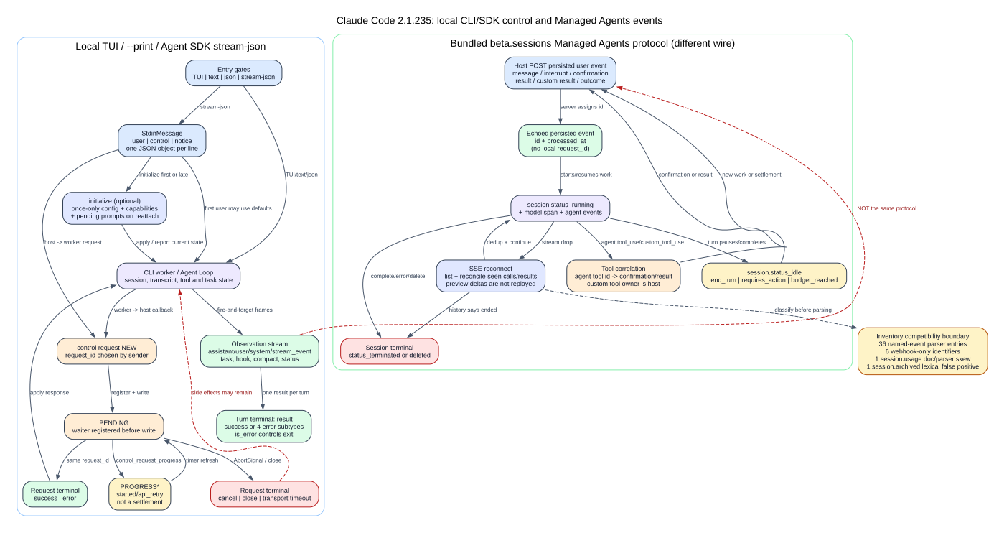

# Claude Code 2.1.235 CLI、SDK 与输出协议

> **版本边界：** 本文只解释仓库中 Claude Code CLI `2.1.235` 的 CLI 帮助、bundle schema、可读化 JavaScript、生成清单与已有精确二进制 Probe。当前官网没有被用来补写本版行为。

## 先回答读者真正会遇到的问题

**读者问题：** 为什么同一个 Claude Code，直接运行时是 TUI，`-p` 时可以只打印一段文本，SDK 却能边收消息、边审批工具、边切模型，而且 `stream-json` 里的 `success`、`agent.message`、`control_response` 看起来像三套不同协议？

**一句话模型：** `2.1.235` 把同一个 Agent Loop 包在三种入口外面：TUI 持有本地交互，`--print` 把一轮结果投影为 text/json/NDJSON，SDK 再在 NDJSON 上叠加带 `request_id` 的双向控制 RPC；消息流负责“观察发生了什么”，控制流负责“请求另一端改变或补充状态”。



图的结论：`result` 是一轮结束信号，不是整个输出协议；`control_response` 是某个 RPC 的答复，不是模型回答；SDK host 与 CLI worker 可以同时成为 request 的发起方。

## 60 秒模型

贯穿场景：一个自动化程序恢复已有会话，要求 Claude 检查仓库；模型先输出文字，再请求 `Read`。SDK host 收到 `can_use_tool`，批准后 CLI 执行工具并继续模型轮次，最终产出符合 JSON Schema 的对象。

| 对象 | 之前 | 转换 | 之后 | 用户可见效果 |
| --- | --- | --- | --- | --- |
| 入口 | SDK 调用参数 | SDK 启动 CLI 子进程并固定 `stream-json + verbose` | stdin/stdout 成为 NDJSON 双工通道 | 调用方不需要解析 TUI |
| 会话 | 一个 session ID 或 resume 条件 | CLI 重建 transcript；`fork` 时派生新 session ID | 同一逻辑历史或新的 fork 身份 | 可以续接，也可以从现场另开分支 |
| 配置 | SDK options | `initialize` 传 hooks、MCP、schema、agents、skills 等 | worker 返回模型、命令、账户、权限模式和能力 | host 知道可用表面并能渲染控件 |
| 工具审批 | Agent Loop 等待决定 | CLI 发 `can_use_tool`，host 用相同 `request_id` 回答 | allow/deny 进入工具管线 | 本地没有 TUI 也能审批 |
| 内容 | 模型正在流式生成 | 可选 `stream_event` 增量 + 完整 assistant 消息 | 消费者得到预览和权威完整消息 | 可以实时显示且能在回撤时修正 |
| 结构化结果 | JSON Schema | 注入 `StructuredOutput` 工具并校验调用输入 | `result.structured_output` 或重试耗尽错误 | 调用方拿到对象而不是再解析自然语言 |
| 终态 | Agent Loop 尚未结束 | 每轮恰好一个 `result` | `success` 或四类 error subtype | `is_error` 决定进程退出码 |

## 三个协议面不能混在一起

| 协议面 | 载体 | 方向 | 状态所有者 | 本文证据 |
| --- | --- | --- | --- | --- |
| 本地 CLI 输出 | stdout 文本、单个 JSON 或 NDJSON | CLI -> 调用者 | CLI 的本轮 Agent Loop | CLI 选项与 `runHeadless` 分支 |
| SDK control channel | NDJSON 中的 `control_request/response/cancel` | 双向 | request 发起者持有 pending；接收者持有处理中的 abort | control schema、Query 类、worker handler |
| Managed Agents session event | HTTP list/SSE event | client -> service 或 service -> client | 远端 session/thread orchestration | bundle 内 SDK parser、tool runner与随包文档 |

`analysis/source-inventory/output-protocol-event-identifiers.txt` 的 44 项属于第三行的远端事件词汇。它们不是本地 `--output-format=stream-json` 的 44 种 stdout frame。把两者合并会导致错误的 parser、错误的重连语义和错误的状态归属。

## 入口与格式矩阵

### 交互模式与 `--print`

- 默认入口是交互 TUI；`-p/--print` 打印响应后退出。
- 该版帮助明确说明：非交互入口会跳过 workspace trust 对话；无效 settings 在该模式下没有对话框，可能被静默忽略。因此 `--print` 是自动化入口，不等于更严格的信任入口。
- SDK 不是第二套 Agent Loop。TypeScript SDK 启动同一个 CLI，并固定添加 `--output-format stream-json --verbose --input-format stream-json`。

### `input-format` 与 `output-format`

| 输入 | 输出 | 是否成立 | 实际行为 |
| --- | --- | --- | --- |
| `text` | `text` | 是，默认 | 最终成功文本或固定的人类错误短句 |
| `text` | `json` | 是 | 默认只输出最终 `result` 对象；`--verbose` 输出该轮收集的消息数组 |
| `text` | `stream-json` | 是，但必须 `--print --verbose` | 每个 stdout frame 一行 JSON |
| `stream-json` | `stream-json` | 是，但必须 `--print` | stdin/stdout 都保持为逐行 JSON；可多轮输入 |
| `stream-json` | `text/json` | 否 | 启动阶段直接报错并 exit 1 |
| 任意 | 其他字符串 | 否 | Commander choices 或启动校验拒绝 |

进一步约束：

- `--replay-user-messages` 需要 input/output 都是 `stream-json`。
- `--include-partial-messages`、`--forward-subagent-text` 需要 `--print + stream-json`；仅由内部条件隐式打开而用户没有显式传 flag 时，非法组合会被关闭而不是总是报错。
- `--prompt-suggestions` 只在 `--print + stream-json` 输出。
- `--sdk-url` 同时要求输入和输出为 `stream-json`，并有保留给 Remote Control worker 的 host 校验。
- `stream-json` 还要求 `--verbose`，否则在加载会话后、进入主循环前 exit 1。

### 三种输出的终态差异

`text` 只保留人类可读投影：成功打印 `result`，四类错误分别打印固定短句。`json` 保留 result 字段。`stream-json` 不再额外打印终态，因为 result 本身已经是一条 NDJSON frame。

不要只看 `subtype`：`subtype: "success"` 仍可能同时有 `is_error: true`，表示 API error 文本被装进 `result`。该版最终退出规则是 `result.is_error` 或永久 transport close 为 exit 1，否则 exit 0。

## 本地 stdout/stdin 的真实 envelope

### stdout

schema 把 stdout 定义为“一行一个 JSON object”，主要成员是：

| `type` | 作用 | 关键字段 | 是否需要答复 |
| --- | --- | --- | --- |
| `assistant` | 完整 assistant message | `message`, `uuid`, `session_id`, `parent_tool_use_id`, attribution/error 元数据 | 否 |
| `user` | CLI 生成或 replay 的 user/tool_result message | `message`, `uuid`, `tool_use_result`, `tool_result_meta` | 否 |
| `stream_event` | Messages 流的增量事件 | `event`, `ttft_ms`, `uuid`, `session_id` | 否 |
| `system` | init、retry、task、hook、compact 等状态 | `subtype` + subtype 专属字段 | 否 |
| `tool_progress` | 工具/子 agent 进度 | tool ID/name、elapsed、retry | 否 |
| `result` | 一轮终态 | subtype、usage/cost、turns、result/errors | 否；是 turn-complete signal |
| `control_request` | CLI 向 host 请求决定/能力 | `request_id`, `request.subtype` | 通常需要一条 response |
| `control_response` | 回答 host 发来的 request | `response.request_id`, success/error | 已是答复 |
| `control_cancel_request` | 撤回自己发出的 pending request | `request_id` | cancel 本身无答复 |
| `keep_alive` | 长等待期间保活 | 无 payload | 忽略 |

另外还有 `auth_status`、`tool_use_summary`、`rate_limit_event`、`prompt_suggestion`、`conversation_reset`、`command_lifecycle`、`transcript_mirror`、`active_goal`、`autocompact_state`。这再次证明“89 subtype 清单”不是完整 stdout 类型表。

### stdin

stdin schema允许 user message、内部 `bash_command`、双向 control frames、`update_environment_variables`、`queued_notification` 和 `session_notice`。`initialize` 通常是第一条，但不是强制；第一条 user message 可以用默认值完成初始化。后到的 `initialize` 会返回当前状态，标题、SDK MCP server 与进度摘要仍可处理，但 system prompt/hooks/agents/skills 等一次性配置不会再次应用。

输入流关闭的语义是“让 CLI 完成当前 turn 后退出”，不是立即 kill。SDK 在存在双向回调需求时会等到首个 result，再关闭子进程 stdin。

## Partial messages：实时预览不是简单透传

打开 `--include-partial-messages` 后，CLI 把底层 `message_start`、`content_block_*`、`message_delta`、`message_stop` 包成 `type: stream_event`。完整 assistant message仍是权威记录。

该版还维护 `message id` 与当前 block index。在 fallback、refusal 或 tombstone 回撤已经预览的内容时，它会合成缺失的 `content_block_stop`、`message_delta` 和 `message_stop`，把消费者看到的流闭合，再开始新的 message。否则 UI 会永久停留在“block 未结束”状态，或把被撤回的文字当成最终回答。

代价是 stdout 字节数、解析次数和 UI 状态复杂度增加；普通批处理应只读完整 assistant/result，需要低延迟预览时再打开 partial。

## Structured output：不是在最后做一次 JSON.parse

1. `--json-schema` 先解析为 JSON object；字符串、数组或无效 schema 在启动阶段失败。
2. CLI 用 AJV 校验 schema，本版拒绝过大的 schema，并尝试派生 strict schema，失败时回落非 strict。
3. CLI 创建名为 `StructuredOutput` 的内置工具，把用户 schema 作为 tool input schema，并提示模型必须在结尾调用一次。
4. 工具调用输入通过 schema 校验后，返回 `structured_output` attachment 且 `endsTurn: true`。
5. 最终 `result.structured_output` 取最后一个仍存活的 attachment；若 model fallback tombstone 回撤了对应 tool call，该 attachment 也被移除。
6. 默认最多允许 `5` 次结构化输出尝试；`MAX_STRUCTURED_OUTPUT_RETRIES` 可覆盖。耗尽后返回 `error_max_structured_output_retries`。

因此结构化输出会占用工具 schema、至少一次 tool call，并可能增加模型轮次、token、时延和费用。它保证的是工具输入通过本地 schema 校验，不证明业务语义正确。

## Session、resume 与 fork

| 操作 | session 身份 | 逻辑历史 | 进程状态 | usage/cost |
| --- | --- | --- | --- | --- |
| 新 `--session-id` | 指定或生成 | 新历史 | 新进程 | 本次 query 从零累计 |
| `--resume` / `--continue` | 复用 transcript 身份 | 从持久记录重建 | 不复活旧 socket/Promise/子进程 | 本次 query 重新累计 |
| `--fork-session` + resume | 新 session ID | 继承选择后的逻辑历史 | 新进程 | 新 query 累计 |

不存在或含糊的 resume 目标会 exit 1，不会静默变成新会话。fork 在恢复消息后改写 session 身份，并保留逻辑历史。已有精确二进制 Probe 已证明 resume 会注入旧 prompt/result，fork 会产生不同 session ID 并继承 compact summary；详见 [运行探针索引](runtime-probe-index.md)。

## Control request/response 生命周期

### 普通成功路径

1. 发起端生成在当前 in-flight 集合中唯一的 `request_id`。
2. 它先登记 pending resolver，再写出 `control_request`。
3. 接收端按 subtype 处理；需要长操作时可发 `control_request_progress`。
4. 接收端写一条 `control_response`，其中 `response.request_id` 必须相同，verdict 为 `success` 或 `error`。
5. 发起端移除 pending，成功时按 subtype response schema 校验 payload，失败时 reject。

### 配对、重复与乱序

- SDK host 允许 response 比 waiter 更早到达：先放入 unmatched map，稍后 `awaitControlResponse` 再领取。
- unmatched map 上限为 `1024`，超限淘汰最老项，防止错误/恶意 peer 无限占用内存。
- worker 对未知 request ID 不会错误地完成另一个 request；`can_use_tool` 还校验 response 的 tool name。
- 已解决 toolUseID 的重复 response 会忽略。
- `request_user_dialog` 的 `error` response 不被当作用户选择，dialog 保持 parked；只有 completed/cancelled 语义的成功 response 才结算。

### cancel、abort 与关闭

发起者 abort 时删除 pending 并发送 `control_cancel_request`。cancel 没有自己的 response；接收端可中止工作，也可能来不及中止并仍发回晚到 response。发起者已经停止等待，晚到 response 不应改变已结束状态。

关闭 transport 会 reject 所有 pending control/MCP promise，并终止或清理 callback。它只能恢复协议一致性，不能撤销已执行的文件写入、命令、网络请求或反馈上传。

### initialize 的特殊重连语义

`initialize` response 除普通 payload 外可带 `pending_permission_requests` 与 `pending_user_dialog_requests`。新 host 加入已经运行的 session 时据此重新挂载未完成对话；同一 request 还可能作为 live/replay frame 到达，消费者必须按 `request_id` 去重。

### request 的完整状态机，而不是“发一行等一行”

```text
NEW
  -> PENDING(request_id 已登记，再写 control_request)
     -> PROGRESS*                 control_request_progress，只续期/展示，不结算
     -> SUCCEEDED                 control_response.success，同 request_id
     -> FAILED                    control_response.error，同 request_id
     -> CANCELLED                 发起端停止等待并发 control_cancel_request
     -> TRANSPORT_CLOSED          所有 pending 被 reject
     -> TIMED_OUT                 仅有超时策略的 transport；本地 Query 没有通用 RPC 超时
```

这里有六个容易写错的实现细节：

1. **pending 必须先登记再写出。** 否则极快的 response 可能在 waiter 建立前到达。SDK `Query` 仍额外保留 `unmatchedControlResponses`，允许 response 先于 `awaitControlResponse()`；最多 `1024` 条，超限淘汰最老项。
2. **`request_id` 只做关联，不做授权。** 本地 Agent SDK 用随机 base36 字符串，Remote Control transport 使用 UUID；schema 只要求在本端 in-flight 集合中唯一。任何能写入可信 control transport 的 peer 已经在更高的信任边界内。
3. **成功 verdict 不等于业务成功。** `control_response.response.subtype: success` 表示 handler 正常结算；`mcp_set_servers.response.errors`、`submit_feedback.failure_reason`、`rewind_files.canRewind:false` 等仍可能表达部分成功或业务不可用。
4. **取消只撤销等待和仍可中止的 handler。** 本地 `Query` 收到 cancel 后 abort 对应 callback controller；worker 只会 abort 登记在异步控制表中的任务。已完成的文件写入、命令、MCP 调用、反馈上传或设置落盘不会被撤回。
5. **本地 Agent SDK 没有统一 wall-clock timeout。** `Query.request()` 只响应调用方 `AbortSignal`、response 或 transport close。Remote Control manager 是另一层 host：普通 request 为 `75s`，`side_question` 为 `600s`，每条 `control_request_progress` 会重置同样的计时器；不能把这组数写成所有 SDK transport 的默认值。
6. **重复只在当前 in-flight 窗口内去重。** SDK host 对正在处理的同一 `request_id` 跳过重复 delivery；结算后不会永久保存所有 request ID。需要跨重连幂等时，必须依赖 initialize 的 pending redelivery、已见 response 集合或业务对象自身的幂等键。

#### 本地 Agent SDK 的典型线序

```text
SDK host                         CLI worker                         Agent Loop
   | initialize(request_id=A)       |                                  |
   |------------------------------->| apply once-only config            |
   |<-------------------------------| success(A, capabilities)          |
   |                                |                                  |
   | user message                   |                                  |
   |------------------------------->|-------------------------------> model
   |<-------------------------------| assistant / stream_event          |
   |<-------------------------------| can_use_tool(request_id=B)        |
   | render permission UI           | parked tool                       |
   | success(B, allow/deny)          |                                  |
   |------------------------------->| permission -> tool -> tool_result |
   |<-------------------------------| system/task/hook observations     |
   |<-------------------------------| result                            |
```

`result` 只结束当前 query turn。若 stdin 仍保持开放，下一条 user frame 可以启动下一轮；单轮 Query 在首个 result 后关闭 stdin。反过来，`control_response` 只结束一个 RPC，既不代表 turn 完成，也不应触发进程退出。

#### cancel 与晚到 response

```text
host: PENDING(C) -> AbortSignal -> 删除 waiter -> 发 control_cancel_request(C)
worker: 收到 cancel -> abort 仍登记的 handler
worker: handler 已完成或不可撤销 -> 仍可能写回 response(C)
host: C 已不在 pending -> 缓存为 unmatched 或记录后忽略，不能恢复已取消调用
```

因此客户端必须把 `CANCELLED` 视为本端终态，而不是等待一个“取消确认”。协议明确规定 cancel 自身没有 response。

## 89 个 subtype 清单到底是什么

生成器的规则是扫描所有 `subtype: literal("...")` schema。结果精确为 89 个唯一字符串，但它混合了：

- **42 个 schema 化 control request subtype**；
- **`success/error` 两个 control response verdict**，其中 `success` 同时也是 result subtype；
- **46 个观察型 system/result subtype**。

所以数学关系是 `42 + 2 + 46 - 1(success 重叠) = 89`。清单名是历史命名，不能据此宣称“SDK 有 89 个 RPC”。

### 42 个 schema 化 control request

方向中的 `client` 指 SDK/远端 host -> CLI loop，`agent` 指 CLI loop -> host，`both` 指双向。注册表精确分成 **35 个 client、6 个 agent、1 个 both**。下面的“返回”都是 `control_response.response` 内部 payload；`null` 表示只需 success/error verdict，不表示整条 `control_response` 可以省略。

<!-- SDK_CONTROL_REQUESTS_START -->
| subtype | 方向 | 关键请求字段 | 成功响应/状态所有权 |
| --- | --- | --- | --- |
| `initialize` | client -> loop | hooks, sdkMcpServers, jsonSchema, prompts, agents, skills, supportedDialogKinds | worker session config；返回 commands/models/account/current mode |
| `interrupt` | client -> loop | reason, cancel_queued | 当前 turn/queue；可返回 still_queued/cancelled |
| `set_permission_mode` | client -> loop | mode, ultraplan | worker permission context；返回实际 mode |
| `set_model` | client -> loop | model, system_prompt | session model |
| `set_max_thinking_tokens` | client -> loop | max_thinking_tokens, thinking_display | session thinking override |
| `rename_session` | client -> loop | title | transcript/session metadata |
| `set_color` | client -> loop | color | session UI metadata；schema 存在，主 worker handler 未见对应分支 |
| `apply_flag_settings` | client -> loop | settings | flag settings layer |
| `get_settings` | client -> loop | 无 | 返回 effective/sources/applied/errors |
| `get_context_usage` | client -> loop | 无 | 返回分类 token、window、threshold、message breakdown |
| `get_session_cost` | client -> loop | 无 | 返回格式化 cost text |
| `get_usage` | client -> loop | 无 | experimental session/rate-limit usage |
| `get_binary_version` | client -> loop | 无 | 返回 version/buildTime |
| `list_models` | client -> loop | 无 | worker 可选 model catalog |
| `file_suggestions` | client -> loop | query | 返回 fuzzy path suggestions |
| `read_file` | client -> loop | path, max_bytes, encoding | 受 Read 权限约束；返回内容/绝对路径/截断标记 |
| `get_workspace_diff` | client -> loop | 无 | 返回 capped git diff 或 null |
| `get_plan` | client -> loop | 无 | 返回 exists/content/path，不创建 plan |
| `rewind_files` | client -> loop | user_message_id, dry_run | file checkpoint state；返回预览/恢复结果 |
| `seed_read_state` | client -> loop | path, mtime | Edit 前置 read cache |
| `set_cwd` | client -> loop | path, trust_accepted, trusted_directory | cwd/trust/transcript relocation；非 ok 保持 cwd |
| `register_repo_root` | client -> loop | directory, reload_* | working roots 与 CLAUDE.md/plugin/skill reload |
| `cancel_async_message` | client -> loop | message_uuid | command queue；返回 cancelled |
| `stop_task` | client -> loop | task_id | task registry，not-found/not-running 幂等成功 |
| `background_tasks` | client -> loop | optional tool_use_id | foreground task ownership；可返回 backgrounded |
| `mcp_status` | client -> loop | 无 | 返回 MCP connection snapshot |
| `mcp_set_servers` | client -> loop | servers | 动态 MCP set；返回 added/removed/errors |
| `mcp_reconnect` | client -> loop | serverName | MCP connection generation/cache |
| `mcp_toggle` | client -> loop | serverName, enabled | MCP enabled state |
| `set_mcp_permission_mode_override` | client -> loop | serverName, mode | per-server tighten-only permission override |
| `mcp_call` | client -> loop | tool, arguments, expiry/timeout/files | 可信 control channel 直接调用 MCP；无模型 turn/普通 permission prompt |
| `mcp_message` | both | server_name, JSON-RPC message | SDK-hosted MCP transport；响应含 mcp_response |
| `reload_plugins` | client -> loop | 无 | commands/agents/plugins/MCP generation |
| `reload_skills` | client -> loop | 无 | skill command list |
| `message_rated` | client -> loop | messageUuid, sentiment, surface, cleared | product feedback event state |
| `submit_feedback` | client -> loop | description, draft_id, attach_transcript 等 | feedback policy/upload；返回 ID 或 unavailable/failure reason |
| `can_use_tool` | loop -> client | tool/input/decision metadata/tool_use_id | host permission UI/callback；返回 allow/deny 与可选更新 |
| `hook_callback` | loop -> client | callback_id, input, tool_use_id | SDK host hook callback |
| `oauth_token_refresh` | loop -> client | 无 | host-owned OAuth credential；返回 accessToken/null |
| `host_auth_token_refresh` | loop -> client | 无 | host-owned provider credential；返回 authToken/materialUnchanged |
| `elicitation` | loop -> client | MCP server/message/mode/schema/display | host MCP elicitation UI；返回 accept/decline/cancel |
| `request_user_dialog` | loop -> client | dialog_kind, opaque payload, tool_use_id | host renderer；返回 completed/cancelled + opaque result |
<!-- SDK_CONTROL_REQUESTS_END -->

#### 42 项的 response、所有权和结算语义

| request 组 | success payload | 真正 owner | 失败、取消与用户影响 |
| --- | --- | --- | --- |
| `initialize` | commands、agents、models、account、当前 model/mode、PID、fast/remote capability；envelope 还可带两类 pending prompt | worker session config；host 只提供初始材料 | one-time 的 system prompt/hooks/agents/skills 不会在晚到 initialize 重放；title、SDK MCP、进度摘要仍会处理。字段非法返回 error，已应用的更早配置不回滚 |
| `interrupt` | `still_queued[]`，可选 `cancelled[]` | worker turn、command queue、task registry | abort 当前模型/工具等待；`cancel_queued:true` 还清队列。已经完成的外部副作用保留 |
| `set_permission_mode` | 实际 `mode` | worker permission context | mode/gate 不允许时 error；只影响后续 permission 决策，不撤销已执行工具 |
| `set_model`、`set_max_thinking_tokens` | 空 acknowledgement | worker session request defaults | 只影响后续 API request；当前已发出的 model request 不被重写 |
| `rename_session`、`apply_flag_settings` | 空 acknowledgement | transcript metadata / flag settings layer | 写入失败或字段不支持返回 error；success 只证明 handler 完成，不证明所有远端 surface 已同步 |
| `set_color` | schema 声明为空 | 专用 REPL bridge/UI | schema 和 bridge case 存在，但主 print-worker dispatch 未见同名分支；这是 capability-negotiation 项，不能宣称所有 Agent SDK transport 可用 |
| `get_settings` | `effective`、低到高优先级 `sources`、runtime `applied`、`errors` | worker settings resolver | 读取不修改；`errors` 表示对应文件被跳过，不应把它们再计入 effective |
| `get_context_usage` | categories、message breakdown、window/threshold、memory/MCP/tool/schema 细分 | worker context estimator | 是客户端估算快照，不是服务端最终 token 账单；读取期间状态仍可能变化 |
| `get_session_cost`、`get_usage` | 格式化 `text`；experimental usage/rate-limit snapshot | worker usage accumulator / account surface | `get_usage` 名字已明确标 experimental；字段不得作为长期稳定 API 合同 |
| `get_binary_version`、`list_models` | version/buildTime；model list | 当前 worker executable / model resolver | 证明本进程所见版本与模型表，不证明账户服务端最终授权 |
| `file_suggestions` | `suggestions[]` | cwd/path index | fuzzy 结果是建议，不是存在性或权限证明 |
| `read_file` | `contents`、`absPath`、`truncated`、`encoding` | worker filesystem + Read permission | SDK 高层 `readFile()` 会把 control error 折叠为 `null`；调用者要区分 null 与空文件。`truncated:true` 时内容不是完整文件 |
| `get_workspace_diff`、`get_plan` | capped `diff|null`；`exists/content/path` | git/plan filesystem | 只读快照；空值不创建 plan，也不证明仓库无其他未追踪状态 |
| `rewind_files` | `canRewind/error/filesChanged/insertions/deletions/skippedLinks` | file checkpoint store | `dry_run` 不写文件，且 `skippedLinks` 只对真实恢复有意义；恢复不能撤销命令、网络、Git remote 等副作用 |
| `seed_read_state` | 空 acknowledgement | Edit 前置 read cache | mtime 不匹配时后续 Edit 仍会拒绝；它不授予文件权限 |
| `set_cwd` | `status/cwd/changed/transcript_relocated` | worker cwd、trust、transcript path | 必须读 status/changed，不能只看 success verdict；trust attestation 可先持久化，而 cwd relocation 随后失败 |
| `register_repo_root` | canonical `directory` | additional working directories + config/plugin/skill loaders | 目标必须是允许根目录的子目录；DirectoryAdded hook 异步运行，response 不等待每个 hook 的业务成功 |
| `cancel_async_message` | `cancelled` | command queue | 只取消仍在队列/可取消的 message UUID；false 是正常业务结果 |
| `stop_task` | 空 acknowledgement | task registry | not-found/not-running 被当作幂等成功；并不证明外部子进程的所有副作用被撤回 |
| `background_tasks` | 指定 tool 时返回 `backgrounded`；全量时空对象 | foreground task registry | 返回后 blocking tool_result 立即结束，但后台 task 继续运行并另发 task notification |
| `mcp_status` | `mcpServers[]`，含 status/config/tool/capability | MCP connection manager | snapshot 可在下一刻变化；connected 不保证下一次 tool call 成功 |
| `mcp_set_servers` | `added[]/removed[]/errors{}` | dynamic MCP set + generation/cache | 允许部分成功；必须读取 errors，不能只看 control success |
| `mcp_reconnect`、`mcp_toggle` | 空 acknowledgement | MCP connection generation / enablement state | reconnect 结算不等于 server 已提供工具；toggle 会触发后续刷新 |
| `set_mcp_permission_mode_override` | 空 acknowledgement | per-server permission clamp | 只接受 `default`、`auto` 或 null 的 tighten-only 语义；不会扩大组织策略上限 |
| `mcp_call` | content、structuredContent、`_meta`、staging | worker 的可信 control-side MCP executor | 不经过模型 turn 和普通交互 permission prompt；`timeout_ms`、expiry、文件 staging 各自可失败。control cancel 无法撤销 server 已执行的动作 |
| `reload_plugins`、`reload_skills` | commands/agents/plugins/MCP/error_count；skills | plugin/skill registry + prompt/cache generation | reload 可部分失败；返回的新表面用于后续 turn，不改写已发送 request |
| `message_rated` | 空对象 | product-feedback event logger | policy 禁用时可能只不记录；不改变 assistant message 本体 |
| `submit_feedback` | feedback_id 或 unavailable/failure/status；可选 share URL | feedback policy/uploader | `attach_transcript` 是显式外发；control success 仍可能携带 unavailable/failure_reason |
| `can_use_tool` | allow：updatedInput/updatedPermissions/toolUseID/classification；deny：message/interrupt/toolUseID | SDK host 的 permission UI/callback，worker 保留工具执行权 | callback 缺失会 error；返回 null 会抑制 response，留给其他 client 或 park deadline。toolUseID/name 不匹配不会错误批准另一个工具 |
| `hook_callback` | sync HookJSONOutput 或 `{async:true, asyncTimeout}`；可含 continue/decision/reason/hookSpecificOutput | SDK host hook callback | callback ID 不存在返回 error；cancel abort callback signal，已由 hook 启动的外部进程是否停止取决于 host 实现 |
| `oauth_token_refresh`、`host_auth_token_refresh` | accessToken|null；authToken|null + materialUnchanged | host-owned credential provider | token 是敏感数据；null 可表示没有 token或 out-of-band 刷新，`materialUnchanged:true` 会要求 CLI 快速失败而不是继续退避 |
| `elicitation` | `action: accept/decline/cancel` + content | host MCP form/URL UI | 没有 handler 时 SDK 默认 decline；cancel 只结算 elicitation，不撤销 MCP server 已完成动作 |
| `request_user_dialog` | `behavior: completed/cancelled` + opaque result | 声明了 dialog kind 的 host renderer | 未声明/无 handler 时必须保持 silent；error verdict 会被 parked dialog 忽略，`cancelled` 才是真实用户结算 |
| `mcp_message` | 有 JSON-RPC request id 时返回 `mcp_response`；notification 可空 ack | SDK-hosted MCP transport 两端共同拥有 | `server_name` 找不到返回 error；它与 control request_id 是两层关联，MCP JSON-RPC `id` 不能拿来替代 control request_id |

注册表只定义协议合同，不等于所有 transport 都实现所有项。静态 dispatch 审计的可执行结论是：主 print worker 处理 client 方向的注册请求并对未知 subtype 返回 error；`set_color` 只在专用 bridge 分支可见。agent 方向 6 项由 SDK `Query.processControlRequest()` 消费，`mcp_message` 同时走两端。feature flag、provider、登录态和 host callback 仍决定实际可达性。

### schema 清单之外的 16 个 worker 分支

实际 worker handler 还识别下列 string-only subtype：

`add_directory`, `channel_enable`, `claude_authenticate`, `claude_oauth_callback`, `claude_oauth_wait_for_completion`, `end_session`, `generate_session_title`, `mcp_authenticate`, `mcp_clear_auth`, `mcp_oauth_callback_url`, `poll_event`, `remote_control`, `rewind_conversation`, `side_question`, `stage_file`, `ultrareview_launch`。

它们证明“89 清单”甚至不是全部 control handler 表面。反过来，schema 中 `set_color` 没有出现在这条主 worker dispatch；因此本文不把 schema 存在升级为已执行证明。`2.1.235` 的静态事实是：schema 定义 42 个、主 worker 分支识别 51 个、两者并集 58 个；不同 transport/capability 仍决定可达性。

### 46 个观察型 subtype

| 类别 | subtype 与关键字段 | 状态归属 |
| --- | --- | --- |
| 启动/会话 | `init`(version/cwd/tools/models/capabilities), `status`, `session_state_changed`, `worker_shutting_down`, `commands_changed`, `turn_duration` | worker 与当前 turn |
| compact/总结 | `compact_boundary`(metadata/logical parent), `post_turn_summary`, `away_summary`, `task_summary` | transcript/message graph 或展示摘要 |
| API/模型恢复 | `api_error`, `api_retry`, `control_request_progress`, `model_fallback`, `model_consent_fallback`, `model_refusal_fallback`, `model_refusal_no_fallback` | 当前 API attempt/fallback chain |
| thinking/提示 | `thinking`, `thinking_tokens`, `informational`, `notification` | 展示层；thinking token 是估算信号 |
| hook/权限 | `hook_started`, `hook_progress`, `hook_response`, `stop_hook_summary`, `permission_denied`, `permission_retry`, `elicitation_complete` | hook run、permission/tool request |
| task/agent | `task_started`, `task_progress`, `task_updated`, `task_notification`, `background_tasks_changed`, `agents_killed`, `scheduled_task_fire` | task registry/background lifecycle |
| 文件/持久化 | `file_snapshot`, `files_persisted`, `mirror_error` | checkpoint、sync/mirror adapter |
| 插件/记忆 | `plugin_install`, `memory_recall`, `memory_saved` | plugin install 与 memory store |
| 外部变更/反馈 | `code_change_published`, `vcs_state_changed`, `feedback_draft_queued`, `local_command_output` | 外部 repo/UI/feedback 状态；部分字段只是提示，需重查权威对象 |
| 终态 | `success` | result；含 result/structured_output/usage/cost/turns/permission denials |

`error` 是 control response verdict，不是观察事件。四个 result error subtype 使用一个 enum，因此没有进入这份 89 字符串清单：`error_during_execution`、`error_max_turns`、`error_max_budget_usd`、`error_max_structured_output_retries`。

### 46 个观察 subtype 的逐项协议语义

这 46 项精确由 **45 个 `system` subtype + 1 个 `result.success`** 构成。它们都不需要 `control_response`；只有 `control_request_progress.request_id` 会关联某个 RPC，但它仍不是结算帧。

| subtype | 关键字段 | 状态转换与 consumer 规则 | 终态/证据强度 |
| --- | --- | --- | --- |
| `init` | cwd、tools、MCP、model、permissionMode、commands、agents、skills、plugins、account/capability hints | 建立 host 的初始只读视图；后续 `commands_changed`、MCP/status 等可使其过期 | 非终态；schema + headless emitter |
| `status` | status、permissionMode、compact_result/error | spinner/worker 状态快照；不能代替 `result` | 非终态；多处 emitter/consumer |
| `session_state_changed` | state，部分 producer 另带 waiting_on_user | idle/running/requires_action 等会话展示状态 | 非终态；worker 与 Remote Control consumer |
| `worker_shutting_down` | reason | 表示 worker 正在收尾，host 应停止发新工作并等待 close/result | 进程过渡，不保证已退出 |
| `commands_changed` | commands | reload/attach 后替换 host 的 command capability cache | 非终态；SDK Query 明确更新 latestCommands |
| `turn_duration` | duration_ms、budget tokens/limit/nudges、message/background/workflow counts | 记录一轮耗时与预算上下文 | 观察值，不是 result |
| `compact_boundary` | compact_metadata、logical_parent_uuid | transcript 消费者重建压缩边界和逻辑 parent；不是简单 UI 文案 | 持久状态转折，但不结束 turn |
| `post_turn_summary` | summarizes_uuid、status_category/detail、needs_action | 对已结束内容做展示摘要；SDK Query 会转发给 host | 非终态；可晚于正文消息 |
| `away_summary` | content | 用户离开期间的展示摘要 | schema + internal message producer；非权威 transcript |
| `task_summary` | detail | task/远端层的摘要 frame；Query 特别保留 | 非终态；不能替代 task_notification/result |
| `api_error` | error、retry_in_ms、retry_attempt、max_retries | Agent Loop 内部 API error 事件；stdout 投影通常转成 `api_retry` | 非终态；internal producer + projection consumer |
| `api_retry` | attempt、max_retries、retry_delay_ms、error_status、error | host 显示一次 API attempt 的退避；同一 turn 后续仍可成功 | 非终态；headless emitter |
| `control_request_progress` | request_id、status(started/api_retry)、attempt/retry delay/error_status | 只更新并续期 transport-specific RPC timer；未知 request_id 必须忽略 | 非终态；明确 emitter/Remote Control consumer |
| `model_fallback` | trigger、original_model、fallback_model、content | availability 等原因切换后续 attempt 的 model | 非终态；当前 preview 可能需要重建 |
| `model_consent_fallback` | choice、original/fallback model、persisted_as_default、content | 记录用户对 fallback 的选择及是否持久化 | 非终态；选择结果不是 model request 终态 |
| `model_refusal_fallback` | trigger、direction、scope、models、request_id、refusal category/explanation、retracted_message_uuids、content | retry 时撤回指定 wire message，再以 fallback/续写继续 | 非终态；consumer 必须按 UUID 幂等回撤 |
| `model_refusal_no_fallback` | original_model、request_id、refusal fields、refused_user_message_uuid、content | refusal 链耗尽，不再切换 model | 模型 attempt 终态，但 turn 最终仍看 `result` |
| `thinking` | content | 完整 thinking 展示消息 | schema + internal message path；敏感内容，不能当普通日志 |
| `thinking_tokens` | estimated_tokens、estimated_tokens_delta | 增量估算 thinking token；Remote SSE 只允许该 system subtype 走 ephemeral channel | 非终态；估算值 |
| `informational` | content、level、tool_use_id、prevent_continuation | 通用信息/错误展示；prevent_continuation 可阻止继续但仍需后续 result | 非终态；多个 producer |
| `notification` | key、text、priority、color、timeout_ms | keyed UI notification；重复 key 可被 surface 合并/替换 | 非终态；展示状态 |
| `hook_started` | hook_id/name/event | 建立 hook run | 非终态；与 progress/response 按 hook_id 关联 |
| `hook_progress` | hook_id/name/event、stdout/stderr/output | 更新运行中 hook 输出 | 非终态；输出可能含敏感路径/命令结果 |
| `hook_response` | hook_id/name/event、output/stdout/stderr、exit_code/outcome | 结束一个 hook run；不等于工具或 turn 成功 | hook 局部终态 |
| `stop_hook_summary` | hook_count/infos/errors/context、prevented_continuation、stop_reason、duration | 汇总 Stop hook 批次并决定是否重入 Agent Loop | hook 批次终态；turn 可能继续 |
| `permission_denied` | tool_name/use_id/agent_id、decision reason/message | 记录某个工具被拒；模型可能修正后继续 | 工具审批局部终态 |
| `permission_retry` | content、commands | 告知权限流程可重试/给出命令 | 非终态；不能当已授权 |
| `elicitation_complete` | mcp_server_name、elicitation_id | 通知 MCP elicitation 已结算 | elicitation 局部终态，不证明 MCP 调用成功 |
| `task_started` | task_id、tool_use_id、description、subagent/task/workflow fields、prompt、skip_transcript | task registry 新增任务 | 非终态；task_id 是后续关联键 |
| `task_progress` | task_id/tool_use_id、description、usage、last_tool_name、summary | 更新 task；usage 为阶段快照 | 非终态 |
| `task_updated` | task_id、patch | 对已有 task 应用 patch | 非终态；未知 patch 字段应前向兼容 |
| `task_notification` | task_id/tool_use_id、status、output_file、summary、usage、skip_transcript | 后台任务结算/通知主循环 | task 局部终态；output_file 仍需按文件数据处理 |
| `background_tasks_changed` | tasks[] | 替换 foreground/background task 展示快照 | 非终态；可能紧接 background request |
| `agents_killed` | 无业务字段 | 告知 agent 集合被终止 | agent 批次局部终态；schema + internal producer |
| `scheduled_task_fire` | content | scheduler 把一次到期 fire 投影给会话 | 非终态；真正执行仍进入普通 Agent Loop |
| `file_snapshot` | content、snapshot_files | 记录 checkpoint/文件快照信息 | 持久化转折；不是恢复成功证明 |
| `files_persisted` | files、failed、processed_at | remote/file sync 的持久化回执 | 局部终态；schema + consumer，未见同样强的本地主 producer |
| `mirror_error` | error、key | transcript mirror 批处理失败 | 非终态；Query 自身 emitter |
| `code_change_published` | provider、url、repo、identifier、action | 提示 commit/push/PR 等外部状态发生变化 | 观察提示；consumer 必须重新读取 repo/remote 权威状态 |
| `vcs_state_changed` | kind、cwd、branch | 最小化 Git 状态失效信号 | 非终态；不携带完整 diff/remote 结果 |
| `plugin_install` | status、name、error | headless plugin install 进度/失败 | 单插件局部状态；整体结果另行汇总 |
| `memory_recall` | mode、memories | 表示 memory 被注入/召回 | 非终态；内容进入上下文，涉及隐私/token |
| `memory_saved` | written_paths、team_count、verb | 表示 memory 文件写入 | 写入局部终态；不能证明未来一定被召回 |
| `feedback_draft_queued` | draft_id/type/title/details_preview | 本地 feedback draft 已登记 | 局部终态；尚未上传 |
| `local_command_output` | content | 本地 slash/command 输出投影 | schema + consumer 路径；不是 Agent answer |
| `success` | result、structured_output/deferred_tool_use、usage/modelUsage/cost、turns、stop_reason、is_error、timing、permission_denials | 结束当前 query turn；单轮 SDK 收到后关闭 stdin，多轮 stream input 可继续下一 turn | **turn 终态**；`is_error:true` 仍可能与 subtype success 同时出现 |

`success` 之外的四个 result error subtype 不在 89 清单，却同样是 turn 终态。可靠 consumer 必须先按 `type: result` 分流，再读取 `subtype` 和 `is_error`；不能用“是否出现在 89 个字符串里”决定是否终止。

## 44 个 Managed Agents event identifier

这 44 项由宽词法规则从 bundle 恢复。逐项追到 parser、SessionToolRunner 和随包文档后，真实构成不是“44 种 output frame”，而是：

| 证据类别 | 数量 | 含义 |
| --- | ---: | --- |
| bundled SSE parser 明确接受 | 36 | parser 对对应 SSE event name 执行 JSON.parse 并 yield；仍不校验每个 payload 字段 |
| webhook-only 兼容 identifier | 6 | 只在随包 Managed Agents webhook 文档的 `data.type` 中出现；不是 session SSE event |
| embedded-doc event / parser skew | 1 | `session.usage` 被随包 event 文档定义为 persisted event，但 named-event parser 没有显式列出；只证明文档合同，不能证明这份 runtime 对所有 wire 表达都直达 consumer |
| lexical false positive | 1 | `session.archived` 来自 `session.archived` 对象属性访问，不是字符串 event token |

也就是说，**36 + 6 + 1 + 1 = 44**。这项审计修正了“44 项都由 SSE parser 接收”的旧说法。44 清单必须继续保留用于跨版本词法比较，但人类文档必须把 runtime、webhook、文档偏差和误报分开。

bundle 中另一套 `SessionsV2Client` 读取的是 `/v1/code/sessions/...` 的 Remote Control `client_event/ephemeral_event`，承载本地 CLI wire frame；这里的 44 项来自 bundled `beta.sessions.events` Managed Agents SDK。两者 host、重连游标、事件 ID 和终态完全不同。

共同字段以远端 persisted event record 为中心，通常包含 `type`、event `id` 和 `processed_at`。client-posted event 首次出现时 `processed_at` 可为 null；`user.define_outcome`、`user.custom_tool_result`、`user.tool_result` 在接收时处理，首次 echo 已可能非 null。下表只列 parser、SessionToolRunner 或随包文档能证明的字段；没有 runtime field validator 的项目继续标 Boundary。

| event | 方向 | 关键字段/配对 | 状态所有者 |
| --- | --- | --- | --- |
| `user.message` | client -> remote session；stream echo | `content` | session input log |
| `user.interrupt` | client -> remote session；通常 echo | 未恢复稳定专属字段；budget pause 时可被接受但不落 event | remote scheduler/session |
| `user.tool_confirmation` | client -> session；echo | `tool_use_id`, `result: allow/deny` | pending tool approval |
| `user.tool_result` | client -> session；echo | `tool_use_id`, `is_error`, `content` | built-in tool call pairing |
| `user.custom_tool_result` | client -> session；echo | `custom_tool_use_id`, `is_error`, `content` | custom tool call pairing |
| `user.define_outcome` | client -> session；echo | outcome/rubric shape由随包 outcome 文档定义 | outcome evaluation loop |
| `agent.message` | service -> client | `content`; buffered record 是权威文本 | thread conversation |
| `agent.thinking` | service -> client | 进度信号；随包文档明确不携带 thinking content | active model request |
| `agent.tool_use` | service -> client | `id`, `name`, `input`, optional evaluated_permission | built-in tool lifecycle |
| `agent.tool_result` | service -> client | 与 agent tool use 关联；稳定完整 shape 未从 runtime consumer恢复 | remote tool executor |
| `agent.mcp_tool_use` | service -> client | tool identity/input；完整 shape 边界 | remote MCP executor |
| `agent.mcp_tool_result` | service -> client | 对应 MCP use；完整 shape 边界 | remote MCP executor |
| `agent.custom_tool_use` | service -> client | `id`, `name`, `input`, permission；需要 custom result | client-owned custom tool |
| `agent.thread_context_compacted` | service -> client | 随包示例提到 `pre_compaction_tokens`，部分示例可省略 | thread context state |
| `agent.thread_message_sent` | service -> client | `to_session_thread_id` | cross-thread mailbox |
| `agent.thread_message_received` | service -> client | `from_session_thread_id` | cross-thread mailbox |
| `agent.session_thread_message_sent` | service -> client | inventory 可证明名称；稳定专属字段未恢复 | session/thread bridge boundary |
| `agent.session_thread_message_received` | service -> client | inventory 可证明名称；稳定专属字段未恢复 | session/thread bridge boundary |
| `session.status_scheduled` | Anthropic webhook -> host | thin payload：webhook event ID + session resource ID；收到后 fetch session | webhook compatibility；不在 SSE parser |
| `session.status_run_started` | Anthropic webhook -> host | 每次进入 running 触发；thin resource identity | webhook compatibility；不在 SSE parser |
| `session.status_running` | service -> client | 无必须专属字段被 runtime consumer依赖 | session lifecycle |
| `session.status_rescheduled` | service -> client | retry/reschedule 状态 | scheduler |
| `session.status_idle` | service -> client | `stop_reason`；end_turn/requires_action/budget_reached | session lifecycle |
| `session.status_idled` | Anthropic webhook -> host | thin payload；必须 list session events 读取最新 `session.status_idle.stop_reason` | webhook compatibility；不能与 SSE `status_idle` 合并 |
| `session.status_terminated` | service -> client | terminal reason/detail shape 边界；完成或错误都可终止 | terminal session |
| `session.updated` | service -> client | 只带 changed fields；删除 budget 用 `budget:null` | session resource |
| `session.usage` | service -> client（embedded-doc） | cumulative tokens、list_cost、active_seconds、server_tool_use、budget；budget pause 时紧邻 status_idle | 文档合同；named SSE parser 未显式列出，runtime reachability 为 Boundary |
| `session.error` | service -> client | error payload；稳定细分 shape 边界 | session processing |
| `session.archived` | 非协议事件 | 清单命中的是运行时代码里的 `session.archived` 布尔属性访问；未找到同名 event token | **词法误报**，不得生成 parser 分支 |
| `session.deleted` | service -> client | resource identity；SessionToolRunner 将其视为终止 | session resource |
| `session.thread_created` | service -> client | thread identity/name；可代表 subagent/advisor | thread registry |
| `session.thread_status_created` | service -> client | thread identity；字段边界 | thread lifecycle |
| `session.thread_status_running` | service -> client | thread identity/status | thread lifecycle |
| `session.thread_status_rescheduled` | service -> client | retry state | thread scheduler |
| `session.thread_status_idle` | service -> client | `stop_reason` | thread lifecycle |
| `session.thread_status_terminated` | service -> client | thread identity/terminal state | thread lifecycle |
| `session.thread_idled` | Anthropic webhook -> host | child thread resource identity；状态细节需重新 fetch/list | webhook compatibility；不在 SSE parser |
| `session.thread_terminated` | Anthropic webhook -> host | child thread ended/archived；primary thread 用 session.status_terminated | webhook compatibility；不在 SSE parser |
| `session.outcome_evaluation_ended` | Anthropic webhook -> host | outcome grader 一次 iteration 结束；thin resource identity | webhook compatibility；不在 SSE parser |
| `span.model_request_start` | service -> client | span/request identity、model；完整 shape 边界 | model request span |
| `span.model_request_end` | service -> client | start correlation、model usage | model request span |
| `span.outcome_evaluation_start` | service -> client | evaluation span identity | outcome evaluator |
| `span.outcome_evaluation_ongoing` | service -> client | ongoing grader progress | outcome evaluator |
| `span.outcome_evaluation_end` | service -> client | evaluation result/correlation；完整 shape 边界 | outcome evaluator |

远端流还有 `event_start/event_delta` 预览帧，但不进入这 44 个 `{domain}.{action}` 标识；随包文档明确它们只在 SSE preview 中出现，不在普通 event list 中。这个差异与本地 `stream_event` 仍然是两套协议。

### Managed Agents 的关联键与终态

| 关系 | 关联字段 | 正确 consumer 行为 |
| --- | --- | --- |
| client event 入队与 echo | server-assigned event `id`、`processed_at` | 用 event id 去重；`processed_at:null` 表示仍排队，不要另造 request_id |
| built-in tool | `agent.tool_use.id` <-> `user.tool_confirmation.tool_use_id` / `user.tool_result.tool_use_id` | confirmation 只决定是否执行；result 才结算工具输出 |
| custom tool | `agent.custom_tool_use.id` <-> `user.custom_tool_result.custom_tool_use_id` | custom tool 由 host 执行；没有 result 时 session 可停在 requires_action |
| model span | `span.model_request_end.model_request_start_id` | 按 start ID 配对 usage/error；span end 不是 session 终态 |
| live preview | `event_start.event.id` -> `event_delta.event_id` -> buffered event `id` | preview 只做 scratch buffer；buffered `agent.message` 到达后丢弃 preview 并以完整内容为准 |
| cross-thread mailbox | `to_session_thread_id` / `from_session_thread_id` | 更新对应 thread，而不是把 child message 直接并入 primary transcript |

远端“结束”必须按状态对象判断：

- `session.status_idle` 是**条件终态**：`end_turn` 表示当前工作完成但 session 可继续；`requires_action` 表示还欠 tool confirmation/result；`budget_reached` 表示暂停，只有修改/移除 budget 才会恢复。
- `session.status_terminated` 是 session 的不可逆终态，成功完成和错误结束都会出现；不能把它当 error-only。
- `session.deleted` 同样终止 SessionToolRunner，因为资源已不存在。
- `session.error`、`session.status_rescheduled`、`span.model_request_end.is_error` 都不是充分终态；服务可能重排后继续。
- `session.thread_status_terminated` 只结束一个 thread，不结束整个 session。

### 典型 Managed Agents custom-tool 线序

```text
host POST user.message
  -> echo user.message(processed_at may be null, then populated)
  -> session.status_running
  -> span.model_request_start
  -> agent.custom_tool_use(id=T, name, input)
  -> session.status_idle(stop_reason=requires_action, event_ids=[T])
host executes its own tool
host POST user.custom_tool_result(custom_tool_use_id=T, content, is_error)
  -> echo user.custom_tool_result(processed_at populated)
  -> session.status_running
  -> ... more model/tool events ...
  -> session.status_idle(end_turn) OR session.status_terminated
```

这条链没有 `control_request/control_response`，也没有本地 Agent SDK 的 `request_id`。把 `agent.custom_tool_use` 误当成本地 `can_use_tool`，会导致 approval/result 字段、重连策略和终态全部错误。

### SSE 断线后的恢复为什么要“list + reconcile”

bundled `SessionToolRunner` 的真实恢复路径是：stream 断开后以 `500ms` 起步、最高 `10s` 退避重连；重新连上先 list events，再从历史重建 seen tool-use、tool-result 与 confirmation 三组状态，然后只执行仍未结算且由当前 runner 拥有的工具。工具执行本身有 `120s` abort timeout，result POST 最多尝试 `3` 次，退避 `1s/2s`；退出时最多等待 `30s` drain。

这条 reconcile 避免断线后重复执行已收到 result 的 tool call，但边界仍然存在：

- host 工具已经产生副作用、result POST 却失败时，重连可能再次面对同一未结算 call；真正的外部工具必须用 `tool_use_id` 做业务幂等；
- runner 不拥有的 tool name 会保持 pending 并交给真正 owner，不会伪造 result；
- `session.status_terminated` 或 `session.deleted` 会停止 runner；普通 stream error 只触发重连；
- preview delta 不持久化、不可 replay，重连后只能用 buffered event 对账。

## 103 个 slash command 的协议归属

slash command 首先是 **输入扩展/本地命令路由**，不是 control subtype。命令可能：只改 TUI、本地读写 session/settings、生成 prompt 进入 Agent Loop，或在 remote mode 下转成 control request。不能从命令名推断网络协议。

| 路由类别 | 2.1.235 inventory 中的命令 |
| --- | --- |
| 会话、上下文、历史、目录 | `add-dir`, `autocompact`, `branch`, `brief`, `btw`, `cd`, `clear`, `compact`, `context`, `export`, `focus`, `fork`, `goal`, `import`, `memory`, `pause-memory`, `recap`, `rename`, `resume`, `rewind`, `session`, `exit` |
| 模型、权限、执行模式 | `advisor`, `auto-mode-setup`, `effort`, `fast`, `model`, `permissions`, `plan`, `powerup`, `ultraplan`, `ultrareview`, `autofix-pr`, `passes` |
| agent、task、background、schedule | `agents`, `background`, `list-agents`, `loops`, `stop`, `subtask`, `tasks`, `team-onboarding` |
| MCP、plugin、skill、hook | `hooks`, `mcp`, `plugin`, `reload-plugins`, `reload-skills`, `skill-doctor`, `skills` |
| IDE、浏览器、远端与 daemon | `chrome`, `daemon`, `desktop`, `ide`, `mobile`, `remote-control`, `remote-env`, `teleport`, `web-setup` |
| workflow、artifact、design | `artifacts`, `design`, `design-consent`, `design-login`, `design-revoke`, `workflow-launch-exec`, `workflows` |
| 安装、账户、provider、升级 | `config`, `extra-usage`, `install`, `install-github-app`, `install-slack-app`, `login`, `logout`, `privacy-settings`, `pro-trial-expired`, `rate-limit-options`, `setup-bedrock`, `setup-vertex`, `update`, `upgrade`, `usage`, `usage-credits` |
| TUI、输入、可访问性、媒体 | `color`, `copy`, `keybindings`, `radio`, `scroll-speed`, `status`, `statusline`, `stickers`, `terminal-setup`, `theme`, `tui`, `voice`, `wellbeing` |
| 帮助、诊断、信息与反馈 | `bug`, `diff`, `feedback`, `heapdump`, `help`, `init`, `insights`, `release-notes`, `version` |

这张表覆盖生成清单中的全部 103 个名字，但只说明入口归属。具体某个命令是 local/local-jsx/prompt、有哪些 feature gate、是否在 remote mode 改走 control channel，需要回到对应 command object 与 handler，不能由这份词法清单推出。

## 失败恢复与诊断顺序

| 症状 | 先检查 | 原因 |
| --- | --- | --- |
| 没有任何 stdout | format validation、是否 `--verbose`、子进程 spawn | Agent Loop 可能尚未启动 |
| 有 init 没 result | stdin 是否关闭、pending control request、transport close | result 是 turn-complete gate |
| permission 卡住 | `can_use_tool.request_id` 是否有对应 response/cancel | assistant stream 与审批 RPC 是两条状态线 |
| partial UI 卡在生成中 | 是否收到合成/真实 `message_stop`，是否处理 tombstone 后续 | 预览可能被 fallback 回撤 |
| subtype success 但进程 exit 1 | 看 `is_error` 与 `api_error_status` | success 表示 result shape，不保证无 API error |
| structured output 缺失 | 看 tool call 是否发生、是否被 tombstone、retry count | 文本成功不等于 schema tool 成功 |
| resume 后状态不同 | 区分 transcript state 与 process-local pending/socket | resume 不复活旧进程 |
| 收到未知 type/subtype | 忽略并记录，继续等待 result；control unknown 应等 error response | schema 明确要求 forward-compatible consumer |

## 安全、隐私与成本

- `system/init` 可包含 cwd、工具、MCP server、plugin/skill、账户 email/organization、模型和权限模式；assistant/user/tool result 还可包含源码、文件路径和命令输出。NDJSON 必须按会话数据处理，不能当普通 debug log 公开。
- `submit_feedback` 可以附带 transcript；schema 说明会运行 policy/redaction，但调用者仍要把 `attach_transcript` 当成显式数据外发决定。
- `mcp_call` 的 schema 说明 control channel 被视为可信，不走普通 model-turn permission check。任何能写入 stdin control frame 的进程都处在高信任边界。
- `update_environment_variables` 只应用 allowlist 键；非 allowlist 被拒绝。remote stdin 还会过滤 server-authored-only frame，防止伪造 ingress provenance。
- `read_file` 复用 Read 权限规则；`set_cwd` 复用目录校验和 trust，但 trust attestation 可能先持久化，随后因 busy/relocation 失败而 cwd 不变。
- `result.total_cost_usd` 与 `modelUsage` 是当前 `query()` 的累计估算；多轮 streaming input 应读取最新 result，不要把每轮累计值相加。resume 新 query 重新累计。
- partial events、hook events、replay、verbose JSON 数组会增加传输/内存成本。structured output 默认最多 5 次尝试，会增加模型调用成本。

## 可验证证据

| 结论 | 2.1.235 可读源码/清单 |
| --- | --- |
| bundled Managed Agents named-event parser 的 36 项 allowlist | [canonical packed `extracted/cli.js` line 42](../extracted/cli.js#L42)、[readable 9200-9300](../reverse/javascript/cli.readable.js#L9200) |
| Managed Agents SessionToolRunner 的 reconcile、tool owner、timeout/retry、terminal consumer | [canonical packed line 47](../extracted/cli.js#L47)、[readable 10620-10730](../reverse/javascript/cli.readable.js#L10620) |
| Agent SDK Query pending/unmatched/abort/close、双向 callback consumer | [canonical packed 21853-21856](../extracted/cli.js#L21853)、[readable 417825-418242](../reverse/javascript/cli.readable.js#L417825) |
| Remote Control V2 SSE provenance filter、request set 与 75s/600s timeout | [canonical packed 23607](../extracted/cli.js#L23607)、[readable 522843-523400](../reverse/javascript/cli.readable.js#L522843) |
| 42 项 schema registry、方向、response schema、45 system + result schema | [canonical packed 63856](../extracted/cli.js#L63856)、[readable 595960-595972](../reverse/javascript/cli.readable.js#L595960) |
| print worker request dispatch、response/error helper、keepalive/progress/cancel | [canonical packed 63921-63924](../extracted/cli.js#L63921)、[readable 601417-602490](../reverse/javascript/cli.readable.js#L601417) |
| bundled Managed Agents event、preview、budget 文档合同 | [canonical packed line 57491](../extracted/cli.js#L57491) |
| webhook-only compatibility identifiers | [canonical packed 58083-58132](../extracted/cli.js#L58083) |
| CLI flags 与公开格式 | [CLI surface](cli-surface.txt)、[CLI option definitions](../reverse/javascript/cli.readable.js#L603757) |
| input/output 组合校验与 JSON Schema 装载 | [592654-592773](../reverse/javascript/cli.readable.js#L592654) |
| SDK 固定启动 `stream-json + verbose` | [417551-417660](../reverse/javascript/cli.readable.js#L417551) |
| Query pending、unmatched cap、initialize、request/cancel | [417820-418430](../reverse/javascript/cli.readable.js#L417820) |
| stdout/stdin/control schema 与方向/字段 | [595960-595972](../reverse/javascript/cli.readable.js#L595960) |
| stdin 解析、重复/未知 response、schema sampling | [596065-596390](../reverse/javascript/cli.readable.js#L596065) |
| partial 回撤、result 与 structured output retry | [597607-597884](../reverse/javascript/cli.readable.js#L597607) |
| stream/json/text 输出与 exit rule | [600172-600302](../reverse/javascript/cli.readable.js#L600172) |
| worker control dispatch | [601930-602550](../reverse/javascript/cli.readable.js#L601930) |
| StructuredOutput tool/AJV | [155470-155532](../reverse/javascript/cli.readable.js#L155470) |
| 89 subtype 生成清单 | [sdk-control-subtypes.txt](source-inventory/sdk-control-subtypes.txt) |
| 44 remote event identifier | [output-protocol-event-identifiers.txt](source-inventory/output-protocol-event-identifiers.txt) |
| Managed Agents SSE parser 与 runtime tool consumer | [9261-9274](../reverse/javascript/cli.readable.js#L9261)、[10496-10730](../reverse/javascript/cli.readable.js#L10496) |
| bundle 随包 Managed Agents event guide | [569615](../reverse/javascript/cli.readable.js#L569615) |
| 103 slash command inventory | [slash-command-identifiers.txt](source-inventory/slash-command-identifiers.txt) |

## 仍然不能从本版证明的边界

- schema/handler 的存在不证明任意账户、provider、remote service 或 feature flag 下都可达。
- 44 个 Managed Agents 词法项中只有 36 个进入 named-event parser；6 个是 webhook-only，`session.usage` 只有 embedded-doc 合同，`session.archived` 是属性访问误报。没有登录态 service Probe，不能宣称远端实际发送了每一种 runtime event。
- named-event parser 对 36 项只做 `JSON.parse`，不运行逐 event 字段 validator；字段结论只能来自 SessionToolRunner 的真实读取或随包文档，不能凭名字补造。
- `session.usage` 的随包 event 文档与 named-event parser allowlist 不一致；它可能经 generic `message` SSE event 或更新的 service/SDK path 到达，但 2.1.235 bundle 不能证明所有表达都可被当前 parser 消费。
- `output-protocol-event-identifiers.txt` 是宽词法 inventory，不是一份 runtime discriminated union；它适合发现版本词汇，不适合直接生成生产 parser。
- `set_color` 有 schema 声明但主 worker dispatch 未见处理；16 个 string-only handler 又未进入 schema inventory。客户端必须做 capability/version negotiation，不能硬编码某一集合为永恒协议。
- 本地 Agent SDK Query 没有统一 RPC timeout，Remote Control manager 的 75s/600s 也不能外推到其他 transport；host 必须自己提供 AbortSignal 和业务 deadline。
- control cancel、resume、fork、rewind 都不能回滚已经完成的外部副作用。
