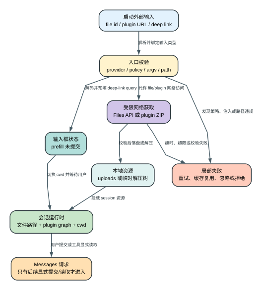

# Claude Code CLI 2.1.235 启动资源：`--file`、`--plugin-url` 与 Deep Link 到底在启动前改了什么？

> `2.1.235 | Static` | 视图：`reverse/javascript/cli.readable.js`

**读者问题：** Claude Code 启动时收到远端文件、URL 插件或 Deep Link 后，是直接把内容交给模型，还是先改变本地文件、插件图和输入框状态；哪些校验能阻止路径穿越与参数注入，哪些网络边界仍交给外部系统？

**一句话模型：** 启动资源层把三类外部输入分别变成 session uploads、临时插件树和受限 argv/composer 状态，它们改变客户端环境，但不会自动等价为一次已提交的模型请求。

图的结论：三条入口的最终归属不同，必须分别讨论下载、加载与提交边界。

## 60 秒看懂：三类输入的状态变化

贯穿场景：自动化系统启动一个新 Claude Code session，同时传入一个文档 file id、一个会话级插件 ZIP URL，以及一个带项目目录和预填问题的 Deep Link。

| 状态 owner / 对象 | Before | Transformation | After | 用户可见效果 |
| --- | --- | --- | --- | --- |
| `--file` 资源 | Files API 中的 file id | 下载并写入 `<cwd>/<session>/uploads/...` | 本地文件路径 | 文件存在，但内容不会自动注入模型 |
| `--plugin-url` ZIP | 任意 URL 上的压缩包 | 限流下载、ZIP 校验、解压、manifest/MCP/command 合并 | session-only plugin | 本会话出现插件能力，退出后临时缓存清理 |
| Deep Link URI | OS/网页发起的 URI | handler 校验 argv、解析 URI、编码 cwd/query | 新终端进程的隐藏参数 | 项目目录切换，query 只预填输入框 |
| Composer | 空输入 | 接收 `prefill` 或 `prefill-b64` | 有文字但未提交 | 用户仍可编辑或取消 |
| 外部状态 | 尚未改变 | 注册 OS handler、落盘 uploads、插件产生运行时能力 | 本地持久/临时状态并存 | rewind 不能自动删除所有外部变化 |

## 端到端状态机：三条入口共用的六步骤

1. **识别入口**：启动参数把输入分成 Files API file spec、远程 plugin URL 或 Deep Link URI，三者不共用业务语义。
2. **执行专属 gate**：`--file` 检查 first-party/provider、HIPAA 与 session token；`--plugin-url` 检查 managed sideload policy；Deep Link 检查 OS 注册、argv 形状和隐藏参数。
3. **获取或解码**：file 与 plugin 走受限网络请求；Deep Link 解码 cwd/query，任何超时、超限、无效 base64url 或 argv 注入都在进入 session 前停止对应分支。
4. **建立本地状态**：file 落到 session uploads，plugin 落到临时 ZIP/解压树并装配 plugin graph，Deep Link 则更改新进程 cwd 和 composer prefill。
5. **挂载到会话**：resume 对 file promise 显式等待，新 session 则可与下载并行；plugin 开始提供 command/skill/hook/MCP；prefill 仍只是可编辑输入框状态。
6. **显式提交才进入模型**：file bytes 必须被用户或工具读取，Deep Link 文字必须由用户提交，plugin 能力也只在装配与当轮 tool/prompt 选择后才影响 Messages 请求。

这六步不是把三条入口强行抽象成同一种对象，而是标出它们在启动边界上的共同检查点。每经过一步，状态 owner 都可能改变：URL 和 file id 最初由外部系统拥有；下载成功后，文件字节或 ZIP 由本地文件系统拥有；插件装配后，command、skill、hook 和 MCP 注册由 session plugin graph 拥有；Deep Link 解码后，cwd 由进程拥有、prefill 由 composer 拥有。只有最终用户提交或工具读取，相关内容才成为 Messages 请求的一部分。

| 检查点 | `--file` 的状态变化 | `--plugin-url` 的状态变化 | Deep Link 的状态变化 | 此时是否已经调用模型 |
| --- | --- | --- | --- | --- |
| 输入识别后 | 得到 file id 与相对路径 | 得到待下载 URL | 得到 URI 与 handler argv | 否 |
| 专属 gate 后 | provider、HIPAA、token 已判定 | managed sideload policy 已判定 | OS handler 与 argv 形状已判定 | 否 |
| 获取或解码后 | 产生待落盘 bytes | 产生经大小限制的 ZIP stream | 产生受限 cwd/query 值 | 否 |
| 本地状态建立后 | uploads 中出现文件 | 临时目录中出现可校验插件树 | 进程 cwd/composer 发生变化 | 否 |
| 会话挂载后 | 只有路径可供后续读取 | 能力进入本 session 的 registry | query 仍停留在输入框 | 通常否；插件初始化可有独立网络活动 |
| 显式消费后 | Read/工具/用户引用才带入上下文 | 被选择的 prompt/tool/schema 才影响请求 | 用户提交后才形成 user message | 是 |

因此启动成功只能证明资源进入了对应客户端状态，不能简写为“文件已经发给 Claude”“插件已经执行”或“Deep Link 已替用户提问”。相反，失败也按 owner 局部收敛：一个 file 下载失败不撤销其他已写文件，插件 ZIP 拒绝不应污染已验证的正式 cache，URI 参数拒绝不会回滚另一个进程此前完成的 OS handler 注册。这个非原子边界决定了恢复必须按 uploads、plugin cache、session registry、进程 cwd 和 composer 分别检查。

## 一、`--file`：下载到 session uploads，不等于读入上下文

### 成功路径

1. CLI 解析一个或多个 `file_id:relative_path`；没有冒号、缺 id 或缺 path 的 spec 被忽略并记录错误。
2. 启动要求 `CLAUDE_CODE_SESSION_ACCESS_TOKEN`；缺失时整个启动直接返回错误。
3. Files API 仅允许 first-party provider，HIPAA 组织被明确拒绝。
4. 每个 file 请求 `GET /v1/files/{id}/content`，带 session OAuth token、Anthropic version/beta headers，超时 `60 s`。
5. 每个下载最多 `3` 次尝试，退避为 `500 ms`、`1000 ms`；`404/401/403` 变成明确错误，其他非 5xx 状态可重试，Axios 网络错误可重试。
6. 默认最多 `5` 个文件并发，成功后写入 `<cwd>/<sessionId>/uploads/<relativePath>`。
7. 结果按全部成功、部分失败、全部失败记录不同 telemetry。

证据：`reverse/javascript/cli.readable.js:209220-209288`、`reverse/javascript/cli.readable.js:209340-209354`、`reverse/javascript/cli.readable.js:592478-592486`。

### 路径规则与真实边界

路径函数先做词法 `normalize`，拒绝以 `..` 开头的结果，再把路径拼到 session uploads 根目录。它还识别调用方已经传入 `<cwd>/<session>/uploads/...` 或 `/uploads/...` 的形式，去掉重复前缀。

这能阻止直接 `../../secret` 形式的词法穿越，但当前消费链没有展示目标父目录的 `realpath` 比较、逐级 symlink 拒绝或 `O_NOFOLLOW`。因此可以确认“词法 containment”，不能扩大成“证明抵抗已有符号链接引出的真实路径逃逸”。

证据：`reverse/javascript/cli.readable.js:209265-209278`。

### 启动时序：resume 会等待，新 session 不在这里等待

下载被保存为 `fileDownloadPromise` 并传入后续 TUI/session 配置。resume 路径显式 `await` 该 promise，并向用户显示失败文件数量；普通新会话路径直接挂载主界面，没有在同一分支先等待下载完成。

更关键的是：这条路径只下载和落盘，没有读取文件内容、构造 user content block 或把 bytes 自动附加到 Messages 请求。文件是否进入模型上下文，取决于后续用户提示、工具读取或其他显式引用。

证据：`reverse/javascript/cli.readable.js:592927`、`reverse/javascript/cli.readable.js:630541-630565`。

## 二、`--plugin-url`：下载的是会话级可执行能力，不只是资料文件

### 成功路径

1. CLI pre-action 收集重复的 `--plugin-url`；managed `disableSideloadFlags` gate 可以在解析期拒绝，并在插件加载期再次丢弃 inline specs，形成双层防线。
2. 每个 URL 在 session plugin cache 中获得确定性文件名；目录形如 `claude-plugin-session-<random>`，进程 cleanup handle 在退出时递归删除。
3. `fetch` 超时 `30 s`；若 `Content-Length` 已超过 `256 MiB` 立即拒绝，流式读取过程中再次累计字节，超过同一上限时销毁流。
4. 先写 `.part`，完成后原子替换正式 ZIP；重新 fetch 失败但正式 ZIP 已存在时复用 session cache。
5. ZIP 解压前逐 entry 校验相对路径、单文件大小、总解压大小、文件数和压缩比。
6. 解压后识别 wrapper directory，读取 plugin manifest，合并 commands/skills/hooks/MCP 等能力。
7. URL plugin 默认保留 MCP discovery；只有 path 形态 `--plugin-dir-no-mcp` 才设置 `skipMcpDiscovery` 并清空 `mcpServers`。
8. session-only plugin 优先于同名 marketplace plugin，但同名 managed plugin 会阻止 session copy；builtin 最后合并。

证据：`reverse/javascript/cli.readable.js:185588-185628`、`reverse/javascript/cli.readable.js:190679-190740`、`reverse/javascript/cli.readable.js:190805-190823`、`reverse/javascript/cli.readable.js:190864-190867`、`reverse/javascript/cli.readable.js:603711-603740`。

### ZIP 防护阈值

| 控制项 | `2.1.235` 阈值 | 阻止的问题 |
| --- | --- | --- |
| 压缩包下载 | `256 MiB` | 超大网络输入与磁盘占用 |
| 下载 timeout | `30 s` | 无期限挂起 |
| 单文件解压 | `512 MiB` | 单 entry 内存/磁盘爆炸 |
| 总解压 | `1 GiB` | ZIP bomb 总量膨胀 |
| 文件数 | `100,000` | inode/遍历耗尽 |
| 压缩比 | `50:1` | 高压缩比 ZIP bomb |
| ZIP 路径 | 禁止绝对路径和 `..` traversal | 覆盖解压目录外文件 |

证据：`reverse/javascript/cli.readable.js:108608-108661`、`reverse/javascript/cli.readable.js:182138`、`reverse/javascript/cli.readable.js:190679-190700`、`reverse/javascript/cli.readable.js:190930`。

### 网络信任边界

在 `--plugin-url` 这条**具体消费链**中，代码直接对用户提供的 URL 构造 `new URL` 并调用 `fetch`。这里没有看到应用层强制 HTTPS、host allowlist、loopback/link-local 拒绝或 redirect 目标复检。不能据此断言全程序其他网络层完全没有保护，但也不能把 ZIP 安全校验误写成 URL 来源安全。

插件不是被动文档。加载成功后，它可以向当前 session 提供命令、skills、hooks、MCP servers 和 bin 路径，因此 URL 来源的可信度直接影响本会话的控制面。

## 三、Deep Link：URI 可以启动会话和预填文字，但不能偷偷追加 argv 或自动提交

### OS handler 注册

客户端可为 macOS、Linux、Windows 注册协议 handler：

- macOS 创建后台 `.app`、`Info.plist` 与指向当前 binary 的 symlink，再调用 LaunchServices 注册；
- Linux 写 `.desktop` 并调用 `xdg-mime`；
- Windows 写 URL protocol registry；
- managed `disableDeepLinkRegistration=disable` 时跳过；
- 注册失败会写 `.deep-link-register-failed`，`EACCES/ENOSPC` 等失败在 `24 h` 内避免反复尝试。

该注册是本地持久副作用，不属于某一条对话消息。

证据：`reverse/javascript/cli.readable.js:524912-525048`、`reverse/javascript/cli.readable.js:622497`。

### 从 URI 到新进程 argv

handler 固定使用 `--handle-uri <uri>`。如果 URI 后还有额外 argv，入口直接拒绝并明确标记为 argument injection；手工调用时其他 flags 必须放在 `--handle-uri` 前。

启动新终端时，客户端不把 query/cwd 原样拼进 shell：

- argv 总带 `--deep-link-origin`；
- repo 和 fetch 时间使用受控 flag；
- cwd/query 在通用路径中使用 base64url 编码，变成 `--deep-link-cwd-b64` 与 `--prefill-b64`；
- iTerm/Terminal shell command 会验证生成参数不含 shell metacharacter，并拒绝无法可移植引用的 binary path；
- detached spawn 成功后 `unref`，带 cwd 的启动失败时可去掉 cwd 再尝试一次。

证据：`reverse/javascript/cli.readable.js:138-141`、`reverse/javascript/cli.readable.js:603930-604095`。

### 新进程如何消费隐藏参数

新进程解析隐藏 flags 后：

- 无效 `--prefill-b64` 被记录并忽略；
- 无效 `--deep-link-cwd-b64` 被记录并忽略；
- 有效 cwd 会触发 `chdir`，并刷新 cwd、git、workspace 与相关缓存；
- `prefill` 进入 composer 预填状态；
- telemetry 记录 deep link 是否携带 prefill/repo，但没有调用“提交 prompt”的动作。

所以 Deep Link 可以把用户带到正确仓库并把问题放进输入框，**用户仍然拥有最后一次编辑与提交动作**。

证据：`reverse/javascript/cli.readable.js:592378-592388`、`reverse/javascript/cli.readable.js:603764-603771`、`reverse/javascript/cli.readable.js:630310-630313`。

## Gate、默认值与状态归属

| 入口 | 必要 gate | 默认/阈值 | 状态 owner | 生命周期 |
| --- | --- | --- | --- | --- |
| `--file` | first-party、非 HIPAA、session token | 3 次、500ms 指数退避、60s、并发 5 | session uploads | 文件留在 workspace/session 路径 |
| `--plugin-url` | sideload policy 允许 | 30s、256MiB 下载；总解压 1GiB、100,000 files、最大 50:1 压缩比 | session plugin cache + plugin graph | temp cache 退出清理，能力仅本 session |
| Deep Link 注册 | OS 支持、managed 未禁用 | 失败 latch 24h | OS + 本地状态目录 | 注册跨 session 持久 |
| Deep Link 启动 | handler argv 无注入、参数可解码 | query/cwd base64url | 新 CLI 进程 | cwd 改变，prefill 只在 composer |

这些限制在不同阶段生效：`Content-Length` 和流式累计共同约束下载为 `256 MiB`，ZIP entry 扫描再独立约束总解压量 `1 GiB`、文件数 `100,000`、单项大小与压缩比 `50:1`。因此“小 ZIP 下载成功”不等于“插件可以解压”，cache 命中也不绕过后续 entry 校验。Deep Link 的 `24 h` latch 只抑制重复注册失败，不会把未校验 URI 变成可信输入。

## 失败与恢复矩阵

| Failure | Detection | Retry/change | State retained | Final user effect |
| --- | --- | --- | --- | --- |
| file token 缺失 | 启动 gate | 不启动下载 | workspace 未写新文件 | CLI 显示 token 必需错误 |
| file 404/401/403 | HTTP status | 明确错误，不把状态伪装为成功 | 其他文件可继续 | resume 显示失败数量 |
| file 网络失败 | Axios error | 最多 3 次指数退避 | 已成功文件保留 | 可出现部分成功 |
| file 词法穿越 | normalized path 以 `..` 开头 | 拒绝该 spec | 其他下载保留 | 目标文件不写入 |
| plugin 下载中断 | fetch/stream/timeout | 有正式 cache 时复用，否则失败 | `.part` 不替代正式 ZIP | 该 plugin 不加载或复用旧包 |
| plugin ZIP bomb/path traversal | entry 校验超阈值 | 解压中止 | 其他 plugin 可继续 | 返回 inline plugin error |
| plugin 名称冲突 | managed/session/marketplace precedence | managed 阻止 session；session 覆盖 marketplace | 其余 plugin graph 保留 | 同名低优先级插件不可见 |
| Deep Link argv 注入 | `--handle-uri` 后发现额外参数 | 立即拒绝 | 当前进程状态不变 | URI 不启动目标会话 |
| Deep Link base64 无效 | decode/validation exception | 忽略对应 prefill 或 cwd | 其他合法参数保留 | 会话仍可启动但缺少该状态 |
| OS 注册失败 | 注册命令异常 | 写失败 latch，24h 内不重试 | 既有 handler 可能保留 | 外部链接无法自动打开或继续用旧 handler |
| 目标 terminal 启动失败 | spawn/open code 非 0 | macOS 可回退 Terminal.app；cwd spawn 可无 cwd 重试 | URI 数据保留 | 最终显示/记录启动失败 |

## 不可撤销或非事务副作用

- `--file` 已写入的文件不会因另一个文件失败而整体回滚；退出会话也没有在该路径展示自动删除 uploads。
- URL plugin 的 session cache 会注册 cleanup，但插件已执行的 hook、MCP 调用或外部命令不因 cache 删除而撤销。
- Deep Link handler 注册改变 OS 配置；对话 rewind 或 session abort 不会注销 handler。
- Deep Link 触发的 `chdir` 会重建当前进程的 workspace 状态，但已由插件或后续工具产生的外部副作用仍独立存在。

## Token、延迟、费用、隐私、安全和恢复影响

- **Token：** `--file` 下载本身不消耗模型 token，除非后续读取；plugin discovery 会增加命令/skill/MCP schema 或系统上下文；prefill 在提交前不产生 Messages 请求。
- **延迟：** file 有网络重试且 resume 显式等待；plugin 下载、校验、解压位于启动加载链；Deep Link 还包含 OS 新终端启动。
- **费用：** 文件和插件下载主要是网络/磁盘成本；插件启用的 MCP/skills 和用户提交的 prefill 才可能产生模型/API费用。
- **隐私：** file id 与 session token发往 Files API；plugin URL 请求会暴露客户端网络来源，插件可声明外部 MCP；Deep Link 的 cwd/query进入本地 argv，提交 query 后才进入模型请求。具体服务端日志保留是 Boundary。
- **安全：** file 有 provider/HIPAA gate与词法路径检查；plugin 有强 ZIP 限制但 URL 来源约束在此链未证明；Deep Link 有 argv 注入拒绝、base64url 和 shell-safe 构造。
- **恢复：** file 是逐项成功；plugin 支持正式 cache 回退并在退出清理；Deep Link 注册失败有 24h latch。三者都不是跨资源原子事务。
- **副作用：** uploads 文件、OS handler 注册和当前进程 cwd 是真实本地变化；插件在 session 中执行过的 hook、MCP 或命令可能已经改变外部系统。删除临时 ZIP、退出 session 或 rewind 对话都不会自动补偿这些动作。

## Static 与 Boundary

### `Static` 可确认

- `--file` 的 endpoint、headers、重试、timeout、并发、路径和新/旧 session 等待差异；
- `--plugin-url` 的下载/解压阈值、session temp cleanup、MCP discovery 与 precedence；
- Deep Link 的 OS 注册、argv 注入拒绝、shell-safe 构造、cwd 切换和 prefill 不自动提交。

### `Boundary` 仍不能由客户端静态源码证明

- Files API 的服务端授权、保留和内容完整性实现；
- HTTP 栈、系统代理或外围网络层是否另有 URL/redirect/SSRF 防护；
- 远端 plugin ZIP 的发布者身份与供应链可信度；
- OS、terminal 和浏览器如何记录 Deep Link；
- plugin 加载后每个第三方 hook/MCP 的真实副作用。

## 证据索引

| 主题 | 精确源码范围 |
| --- | --- |
| Files API gate、下载、重试和写入 | `reverse/javascript/cli.readable.js:209220-209288` |
| file spec 与常量 | `reverse/javascript/cli.readable.js:209340-209354` |
| file 启动 token 与 promise | `reverse/javascript/cli.readable.js:592478-592486`、`592927` |
| resume/new session 等待差异 | `reverse/javascript/cli.readable.js:630541-630565` |
| ZIP 安全校验 | `reverse/javascript/cli.readable.js:108608-108661` |
| session plugin cache cleanup | `reverse/javascript/cli.readable.js:185588-185628` |
| URL 下载、cache、解压和 MCP | `reverse/javascript/cli.readable.js:190679-190740` |
| plugin precedence 与 managed gate | `reverse/javascript/cli.readable.js:190805-190823`、`190864-190867`、`603711-603740` |
| Deep Link argv 注入拒绝 | `reverse/javascript/cli.readable.js:138-141` |
| OS 注册与失败 latch | `reverse/javascript/cli.readable.js:524912-525048` |
| Deep Link 参数消费 | `reverse/javascript/cli.readable.js:592378-592388` |
| shell-safe terminal argv | `reverse/javascript/cli.readable.js:603930-604095` |
| managed schema 与 composer prefill | `reverse/javascript/cli.readable.js:622497`、`630310-630313` |
