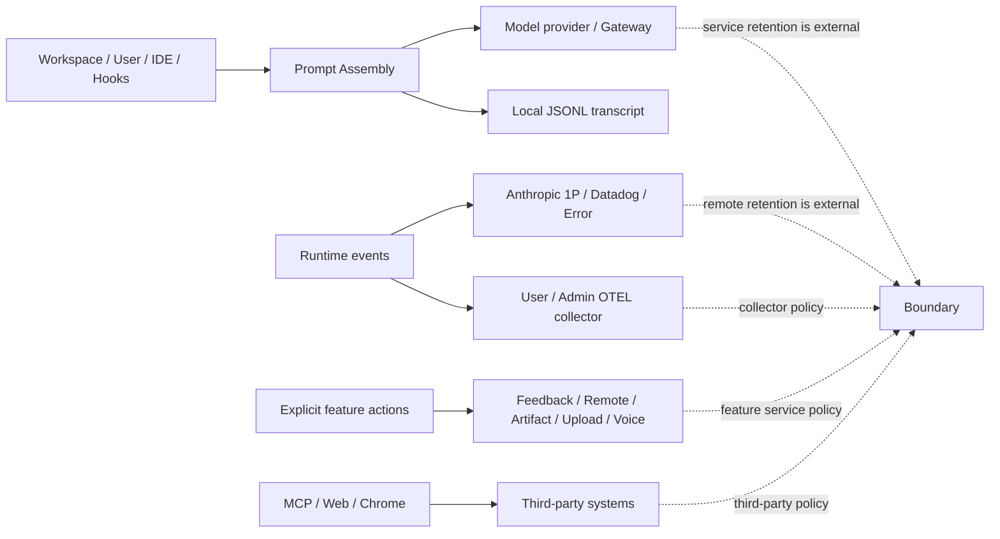

# Claude Code CLI 2.1.235 全局数据流与隐私：什么留在本机，什么会出网

> 版本：`2.1.235` | 证据：`Static` + `Probe` + `Public` | 服务端保存策略：`Boundary`

**读者问题：** Claude Code 读了一个文件、调用了模型、连了 MCP、开了 Remote Control，又记录了 telemetry。哪些内容发给了谁？关闭遥测是不是就不出网？`/compact`、`/clear`、rewind 或删除本地 transcript 能不能删除已经发送的数据？

**一句话模型：** `2.1.235`没有一个“隐私总开关”；模型推理、本地transcript、一方遥测、用户/管理员配置的OTEL、Feedback、Remote Control、WebFetch、MCP/Hook、Artifact/附件和Voice都有各自owner、目的地、内容门与删除边界。

## 先记住六条彼此独立的数据线



1. **模型请求是核心流量。** `DISABLE_TELEMETRY` 不会关闭 Messages 推理。
2. **本地 transcript 是本地持久化。** print模式可用`--no-session-persistence`关闭本次写入；它不会阻止本轮prompt已经发给provider。
3. **一方事件与用户/管理员配置的OTEL是两套出口。** 关闭一个不自动关闭另一个。
4. **Feedback 草稿与 Feedback 上传是两个动作。** 模型可以本地排队草稿，用户确认前不上传。
5. **Remote Control 的执行 owner 仍在本机，但 transcript 会同步。** “代码本地执行”不等于“对话只留本机”。
6. **compact/rewind/tombstone 只改变客户端持有的表示。** 它们不是任何外部服务的删除 API。

## 贯穿场景：一句“修配置并查官方文档”会经过哪些目的地

用户让 Claude：读取 `config.ts`，修改端口，WebFetch 一页文档，通过 MCP 更新 ticket，并用手机看 Remote Control；最后用户选择提交 Feedback。

| 时刻 | 本机状态 | 可能出网的数据 | 谁拥有最终副作用 |
| --- | --- | --- | --- |
| Session 启动 | 加载 CLAUDE.md/rules、settings、Git、工具表 | 登录/模型目录/feature 等按各自 gate | 账号服务与本地配置分别拥有 |
| 用户提交 | Prompt Assembly 生成 system/messages/tools | 用户文字、动态上下文、工具 schema 发给 model provider | provider处理请求；客户端只拥有 request/result 表示 |
| Read/Edit | 文件内容/差异进入 tool result 与 transcript | 下一轮模型请求可带文件正文/差异 | 本地文件系统拥有修改后字节 |
| WebFetch | 普通路径先检查hostname，再取完整URL；预批准Markdown可直接返回，其他内容按条件交给小模型提取 | hostname preflight、页面下载与可选小模型是不同请求 | 站点、preflight服务、model provider分别拥有日志/处理 |
| MCP update | 本地 registry执行 schema/permission/Hook | tool args发 MCP server，result回到模型和 transcript | MCP目标系统拥有 ticket 变更 |
| Remote Control | 本地 Agent Loop继续执行 | transcript、tool activity、控制/附件同步到 Remote服务 | 文件仍在本机，远端服务拥有同步副本 |
| Feedback | 先写`0600`本地draft | 用户明确发送后按destination禁用、写本地bundle或远端POST | 本地archive或Feedback服务分别拥有结果 |

这条链里没有一个统一 rollback。Edit rewind 不能撤销 MCP ticket；断开 Remote Control 不等于删除同步 transcript；删除本地 Feedback draft 也不能收回已经成功上传的 Feedback。

## 一、核心推理与本地持久化

### Messages request：发送的是编译后的 wire view，不是原始 JSONL

| 字段 | `2.1.235` 事实 |
| --- | --- |
| Local owner | Agent Loop、Prompt Assembly、provider client |
| Destination | provider/gateway选择的 Messages endpoint |
| Default | 只要调用模型就必须发送；它是 essential inference traffic |
| Content | top-level system、逻辑 messages、active tool schema/result、thinking/media、metadata/betas等 |
| Gate | message graph选链、compact、tool-result cleanup、Tool Search、provider capability与定向400 strip |
| Consent | 用户提交任务即启动推理；不会对每个 retry/attempt重复弹窗 |
| Delete boundary | `/clear`、compact、tombstone只改后续 wire view；客户端不能删除 provider已处理请求 |

模型请求会带什么，取决于当前任务实际装入了什么：Read 文件正文、IDE选区、CLAUDE.md、Memory、Hook additional context、MCP result或图片一旦进入有效消息视图，就会发给当前 model provider。Claude Code不会自动上传整个 repository，但“没有显式粘贴代码”也不等于模型没看到代码。

provider 可能是一方 Anthropic、Bedrock、Vertex、Foundry、自建 gateway或其他受支持路径。客户端能证明 header、endpoint选择、重试和wire形状，不能从本地 binary推出各 provider的内部保存、训练和删除政策。主请求证据见 `reverse/javascript/cli.readable.js:271834-271842,409464-409531`；精确 wire Probe 见 [运行证据指南](runtime-probe-index.md)。

### 本地 transcript：默认明文保存，但不是模型缓存

| 项目 | `2.1.235` 行为 |
| --- | --- |
| Destination | `~/.claude/projects/.../*.jsonl` 或宿主注入的 Storage v5 adapter |
| 内容 | user/assistant、tool pair、attachment、system、compact boundary、控制/进度类记录的可持久子集 |
| 默认 | 开启；`cleanupPeriodDays` 默认 `30` 天 |
| 关闭 | `--no-session-persistence`只在`--print`模式生效，禁止该print session持久写入 |
| 删除 | 自动清理或 `claude project purge`；purge是顺序副作用，中途失败不提供跨对象事务回滚 |
| 权限 | legacy transcript/临时发布路径使用 `0600`；目录与Storage owner另有合同 |

`/compact` 生成 summary/boundary，改变 resume 与后续 request使用的逻辑消息图；物理 transcript压实是另一套文件协议。`/clear` 建新上下文也不必删除旧 session。删除本地 JSONL不能证明 Remote/Cloud/provider副本已删。

详细物理写入、父链和压实协议见 [Session、Checkpoint 与 Memory](sessions-checkpoints-memory.md) 与 [Storage v5](storage-v5-reference.md)。

### Remote Control：本地执行，远端同步

Remote Control 默认未连接，需要显式命令、开关或 startup setting；本地进程只建立出站连接。连接后：

- Agent Loop、filesystem、command与tool execution仍由本机 session拥有；
- transcript、messages、responses、tool activity、dialog/control和支持的attachment引用通过Remote服务同步给web/mobile viewer；
- sequence、ack、supported-dialog/capability决定哪些帧可投递；
- compact重写或resume切换会触发archive/reconnect逻辑，但不证明服务端删除旧副本。

因此“Remote Control不在云端执行代码”与“Remote Control不上传对话”不能画等号。本版客户端链见 `reverse/javascript/cli.readable.js:302480-304666`；当前官方 [Remote Control](https://code.claude.com/docs/en/remote-control) 对服务端同步的说明属于 Public，具体 retention/delete仍是服务边界。

## 二、观测出口：三套默认和内容门不能合并

### 一方事件、Datadog、Error reporting

| Lane | 默认与目的地 | 内容 gate | 关闭方式 | 失败/保留 |
| --- | --- | --- | --- | --- |
| 一方产品事件 | first-party环境候选发送到 `/api/event_logging/v2/batch` | provider、nonessential、killswitch、sampling、远端batch config、逐event payload | `DISABLE_TELEMETRY`、`DO_NOT_TRACK`、`CLAUDE_CODE_DISABLE_NONESSENTIAL_TRAFFIC`等共享门 | 队列、batch、失败落盘和有界重试；远端retention未知 |
| Datadog forwarding | first-party + feature + 181项allowlist，US5 logs intake | 删除26字段、34 tags、tool/model归一化、局部rate bound | 与一方feature/killswitch联动 | 该删除表只适用Datadog lane，不是全局脱敏合同 |
| Error reporting | 独立Datadog browser-intake error lane | first-party、登录、版本、feature、policy、HIPAA/ZDR taint、noise/filter/scrub | `DISABLE_ERROR_REPORTING`；`DISABLE_TELEMETRY`单独不关闭它，nonessential总门会关闭 | 内存ring与远端上报独立；局部scrub不等于其他lane已脱敏 |

一方 event schema能承载 session/model/provider、token/cost、timing、permission/tool/error和部分identity/environment字段，但“schema有字段”不等于每个event都填了该字段，也不等于每个callsite实际运行或送达。逐场景读法见 [Telemetry](telemetry.md) 和 [事件目录](telemetry-event-catalog.md)。

### 用户/管理员 OTEL：默认关闭，正文开关彼此独立

OTEL需要`CLAUDE_CODE_ENABLE_TELEMETRY=1`和对应exporter配置，属于用户/管理员opt-in。它支持metrics、structured logs、traces；traces还需要enhanced telemetry beta。目的地可以是console、Prometheus或指定OTLP collector。

内容门不是一个布尔值：

| 内容 | 默认/开关 |
| --- | --- |
| User prompt | 默认 `<REDACTED>`；独立 prompt content gate |
| Assistant/tool content | tool有独立detail gate；assistant override未设置时继承user-prompt gate |
| Raw API body | `OTEL_LOG_RAW_API_BODIES` 独立高风险门 |
| Raw body `inline` | request/response body按content limit截断后进入log record |
| Raw body `file:<dir>` | 未截断body写本地文件，再把引用/元数据进入OTEL；该文件写入没有额外证明统一`0600` |
| Thinking | raw-body路径仍有专门redaction，不等于所有正文都原样输出 |

所以“启用了OTEL metrics”不能推导“prompt正文也上传”；反过来，打开raw body也不能靠默认prompt redaction保护完整Messages body。collector的保留、访问控制和删除由管理员系统拥有。

精确 binary Probe 已验证 prompt默认/开启两态、raw-body inline/file三态，以及HTTP logs的effective CA/mTLS/proxy owner。见 [Telemetry](telemetry.md) 与 [网络专题](network-proxy-ca-and-mtls.md)。

## 三、Feedback 与 Survey：至少四次不同的用户决定

### Feedback Draft 不会自治上传

`SendFeedback` 工具只排队本地草稿：

- 单份最大 `32,768` bytes；
- 最多 `10` 份；
- `30` 天过期；
- 文件权限 `0600`；
- 写草稿本身固定 allow，因为没有出网；
- 模型prompt禁止编造秘密、情绪和未验证根因。

用户可以打开`/feedback`审核，也可以在明确的卡片动作中选择`card_send_as_is`一键发送；两者都是用户同意，不是模型自治。随后客户端先选择destination：`disabled`不提交，`bundle`把反馈材料写成本地archive，`post`才构造远端payload。`bundle`常用于第三方provider或没有可用一方凭据的路径，不能写成远端副作用。

在`post`路径，用户还能选择是否附transcript。提交前会核对draft/session身份、检测第三方transcript marker、scrub已知secret、按payload预算从旧到新裁剪；成功后删除draft，失败保留供重试，用户也可discard。本地bundle ZIP以`0600`写入`feedback-bundles/`，由`cleanupPeriodDays` sweep清理；Survey的本地transcript bundle复用这条路径。本地archive与远端POST是两个owner。

因此准确状态机是：

```text
模型发现问题
  -> 本地 SendFeedback draft
  -> 用户打开审核 UI 或明确 card_send_as_is
  -> destination = disabled | bundle | post
  -> bundle: 本地 archive
  -> post: 用户选择描述/类型/transcript并确认远端提交
```

草稿在 `295584-296019`，上传在 `462800-462910`。完整解释见 [后台模型任务与 Memory](background-model-tasks-and-memory-consolidation.md)。

### Session Survey rating 与 transcript share 不是一件事

`2.1.235`的survey候选受policy、远端配置和节流等条件控制，但UI eligibility不是简单的first-party provider gate，第三方路径也可能显示。本地baked候选率为`0.005`，baked transcript-ask probability为0，远端配置可改变，不能理解成所有用户固定概率。

1. 用户对“本次体验如何”作答：rating event只带response/appearance/type等产品字段。
2. 产品可以再单独询问是否共享 transcript：这是第二次同意，选项包含 Yes / No / Don't ask again。
3. 选择Yes后，目标版share builder可收集主/子Agent transcript、可选raw JSONL、HEAD SHA与last API request，并执行secret scrub、第三方marker withholding和逐级payload降级；destination=`bundle`时写本地ZIP，只有first-party/`post`路径才上传到`/api/claude_code_shared_session_transcripts`。

当前官网 [Data usage](https://code.claude.com/docs/en/data-usage) 写到共享 transcript 的现行保留政策；该政策是 2026-08-24 Public snapshot，不是 `2.1.235` 客户端能独立证明的服务端事实。

## 四、WebFetch：hostname preflight、页面下载和可选小模型是三条流

目标版 preflight 可精确确认：

```text
https://api.anthropic.com/api/web/domain_info?domain=<hostname>
```

- 只发送 hostname，不发送 path、query或页面正文；
- 普通本地WebFetch路径默认执行，`skipWebFetchPreflight`可跳过；first-party CCR proxy在本地preflight前返回，不能写成所有provider/host一律经过；
- 只缓存 `allowed` 结果；最多128项，TTL 5分钟；
- blocked或check_failed不缓存，下一次重新查；
- preflight不受 nonessential traffic总门等同关闭，因为它属于WebFetch安全路径。

随后WebFetch访问完整URL、处理redirect并取得页面。小型、预批准且已经是Markdown的内容可以直接返回；需要提取/压缩的大内容才交给小模型按用户prompt处理。因此hostname-only只描述第一步，“每次都再调用小模型”也不成立。preflight与host分支见`reverse/javascript/cli.readable.js:241722-241834`，直接Markdown路径见`261568-261576`。

`skipWebFetchPreflight` 只绕过Anthropic blocklist查询，不等于跳过WebFetch permission、sandbox network policy、站点权限或provider内容处理。

## 五、扩展与本机集成：谁配置，谁获得数据

### MCP

MCP只在server配置、信任与managed allow/deny通过后连接。模型使用工具时：

- schema/description可能进入 tools或Tool Search；
- tool args发给MCP server；
- result/resource/prompt回到Messages与transcript；
- OAuth/header helper/token由对应credential owner管理；
- PreToolUse、permission和result-size guard在客户端执行。

Tool Search只延迟schema进入模型，不减少真实MCP调用时发给server的参数，也不改变server对业务数据的retention。第三方MCP是否记录、保留、训练、转发或支持删除，均为外部owner边界。

### Hooks

Hook可接触的内容包括prompt、tool input/output、cwd、session ID、transcript path、permission、MCP elicitation、task/Agent和compact summary。目的地可能是：

- 本地command subprocess；
- HTTP endpoint；
- MCP tool；
- model/agent runner。

配置Hook意味着未来命中event时自动执行，不会每次再询问。source/trust、matcher、managed-only、HTTP URL/env allowlist、schema和timeout减少风险，但外部Hook如何保存输入不在Claude Code控制内。大输出持久化解决context体积，不是脱敏。

### IDE 与 Chrome

IDE extension拥有selection/open file/diagnostics等live state，CLI每轮只取snapshot；Read deny可以阻止特定文件选区和opened-file notice进入Claude。loopback token保护连接，不等于进入Messages后的内容仍只留本机。目标bundle能看到 `mcp__ide__executeCode` 与 `mcp__ide__getDiagnostics` 等CLI侧合同，但extension Quick Pick/UI内部实现属于Boundary。

Chrome bridge默认关闭，需要账号/scope、显式或持久enable、配对和site/action permission。page text、截图、DOM/action result经过本地bridge后仍可能进入Messages/transcript；浏览器history、tab和站点数据由Chrome与目标网站拥有。

## 六、Artifact、附件与 Voice：成功上传就是外部副作用

### Artifact

Artifact publish不是“本地预览”。客户端会做account/feature/policy、Read deny、regular-file/symlink/hardlink/network-path、TOCTOU、size、MIME/CSP、ownership/version/stale和consent检查；通过后页面、files、assets、comments或DB操作进入远端Artifact owner。

stop watch只停止本地观察，不删除远端Artifact；`delete_asset`只删除特定asset，不等于删除页面；timeout后的远端结果可能未知，需要readback，不能用本地transcript宣布回滚。

### `SendUserMessage` 文件附件

本地viewer lane可以只展示文件；真正upload lane会向一方`/api/oauth/file_upload`发送multipart并取得`file_uuid`。客户端先拒绝URL/UNC/`/net`、非regular file和超过30MiB文件，并检查first-party、nonessential/policy和OAuth。该流没有通用的逐文件确认框；出网由`SendUserMessage`调用、有效upload lane、`allow_send_file` policy、first-party/OAuth和路径检查共同决定。

HTTP 201与合法`file_uuid`只证明upload endpoint接受；viewer最终展示、服务端retention与delete API不在bundle。compact/rewind不能撤销已经完成的upload。

### Voice / STT

Voice默认关闭，需要`/voice`/setting、Claude账号OAuth、`allow_voice_mode`、非remote、audio backend与OS麦克风同意。目标版把约16kHz mono signed 16-bit PCM以约32KiB frame发送到`VOICE_STREAM_BASE_URL || BASE_API_URL.replace(http, ws) + /api/ws/speech_to_text/voice_stream`，最长约120秒，并维护有限replay用于连接恢复。默认base URL是一方服务，但环境覆盖会改变PCM接收方。

录音结束后PCM/chunk在本地内存清理；final transcript进入composer。Hold-to-record是否立即发送取决于`autoSubmit`；tap模式在转写至少3个词时会自动提交。提交后文本又成为普通Messages/transcript数据。当前官网说明audio由Anthropic服务处理；服务端audio retention/training/delete仍是Boundary。

## 删除动作到底删除哪一份

| 用户动作 | 能确认删除/改变 | 不能推出 |
| --- | --- | --- |
| `/compact` | 后续active wire view、compact boundary、summary | provider/Remote/MCP/Hook/Artifact数据删除 |
| `/clear` | 当前conversation view/new identity | 旧JSONL或远端副本立刻删除 |
| rewind | 被checkpoint覆盖的文件与消息视图 | Bash/MCP/Git/HTTP/上传副作用回滚 |
| print模式`--no-session-persistence` | 本次print session不写本地会话transcript | 不发送模型请求、不产生外部tool调用；交互模式不存在同一flag合同 |
| `project purge` | 计划内本地project domains；可能部分完成 | Cloud/Remote/provider第三方数据删除 |
| 关闭 telemetry | 后续一方事件候选被门控 | OTEL、模型请求、Feedback、Remote同步都关闭 |
| 关闭 OTEL | 后续管理员collector出口 | Anthropic一方事件或模型请求关闭 |
| Feedback discard | 本地未发送draft | 已成功提交的远端Feedback收回 |
| Remote disconnect | 停止当前viewer连接/同步 | 服务端历史副本立即删除、外部动作回滚 |
| stop Artifact watch | 本地watcher停止 | Artifact/page/comment/asset删除 |

## 失败与恢复矩阵

| Failure | Client detection | State retained | Privacy consequence |
| --- | --- | --- | --- |
| Messages retry/fallback | HTTP/stream classifier | 已完成tool副作用、transcript候选 | 同一逻辑turn可能向多个attempt/model发送上下文 |
| Transcript写失败 | writer/atomic publish error | 内存消息与外部副作用 | 本地审计不完整，不代表请求没发 |
| 1P/OTEL exporter失败 | queue/batch/backoff/flush timeout | 本地失败batch或collector状态 | 业务继续；不能据此证明远端未收到前序batch |
| Feedback upload失败 | HTTP/auth/size | 本地draft保留 | 可重试；用户不应重复创建多个含敏感内容的draft |
| WebFetch preflight失败 | blocked/check_failed | 不缓存该hostname | 页面fetch不继续；下次会重查 |
| MCP/Hook timeout | transport/runner timeout | 远端动作结果可能未知 | 重试前需readback，尤其写操作 |
| Remote viewer断线 | sequence/ack/reconnect | 本地Agent Loop可继续 | viewer缺帧不等于本地没执行；重连可能重发/归档 |
| Artifact/upload timeout | HTTP/relay timeout | 本地result未知 | 服务端可能已提交，必须查询owner |
| Voice WebSocket断线 | buffer/replay budget | 有界PCM replay | replay可重复发送片段；最终服务状态仍需协议结果 |

## 当前官网可以解释什么，不能证明什么

本轮线上盘点使用当前官方 Data usage、Remote Control、Monitoring、Security、MCP、Hooks与Prompt Cache资料来发现问题。它们有两个价值：

1. 给出用户真正会问的数据目的地与当前产品政策；
2. 暴露本地文章原先没有统一回答的隐私边界。

但目标分支是 `2.1.235`，发布日期为2026-08-18。当前网页可能包含后续版本新增的survey、Remote、MCP、OTEL或IDE行为。本文只有客户端入口、gate、payload、默认值、失败和本地删除使用Static/Probe；远端retention、training、ZDR资格、服务端删除和第三方内部实现统一保留为Public-current或Boundary。

## 可复核证据索引

| 数据流 | 主要证据 |
| --- | --- |
| Messages wire、provider、retry、tool feedback | `readable.js:271834-271842,409464-409531`；[models-auth-providers-request.md](models-auth-providers-request.md) |
| Prompt Assembly 与文件/IDE/Hook/MCP进入Messages | [prompt-assembly-and-system-reminders.md](prompt-assembly-and-system-reminders.md) |
| 本地transcript、compact、resume、purge | [sessions-checkpoints-memory.md](sessions-checkpoints-memory.md)、[project-purge-import-and-data-lifecycle.md](project-purge-import-and-data-lifecycle.md) |
| Remote Control | `readable.js:302480-304666`；[tui-ide-remote-cloud.md](tui-ide-remote-cloud.md) |
| 一方/Datadog/Error/OTEL/raw body | [telemetry.md](telemetry.md)、[error-diagnostic-atlas.md](error-diagnostic-atlas.md) |
| Feedback draft、bundle与post | `readable.js:295584-296019,448878-449086,462800-462910`；[background-model-tasks-and-memory-consolidation.md](background-model-tasks-and-memory-consolidation.md) |
| Survey与transcript share | `readable.js:581239-581549,598095-598104` |
| WebFetch hostname preflight | `readable.js:241722-241807` |
| MCP | [mcp-agents-background.md](mcp-agents-background.md)、[connectors-catalog-and-mcp-operators.md](connectors-catalog-and-mcp-operators.md) |
| Hooks | [hooks-event-reference.md](hooks-event-reference.md) |
| IDE/Chrome/Voice | [tui-input-accessibility-media-ide-chrome.md](tui-input-accessibility-media-ide-chrome.md)、[native-bridge-runtime.md](native-bridge-runtime.md) |
| Artifact/附件upload | [workflow-artifact-design.md](workflow-artifact-design.md)、[brief-mode-and-user-visible-output.md](brief-mode-and-user-visible-output.md) |
