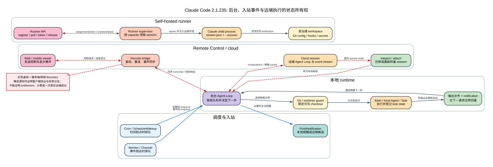

# Claude Code CLI 2.1.235 后台执行、Channels 与 Cloud：任务到底在哪里跑

> 版本：`2.1.235`
>
> 证据：`Static` 为本版 readable JavaScript；`Release` 为官方 release note 与 `2.1.233` 源码对比；`Public` 为抓取时的当前官方文档；`Boundary` 为 bundle 无法独立证明的服务端行为。

## 60 秒心智模型

**读者问题：** Claude Code 把命令放到后台、定时运行 `/loop`、接收 Channel 消息、开启 Remote Control 或创建 cloud session 后，究竟是谁在执行，结果什么时候进入模型上下文，终端关掉后又留下什么？

**一句话模型：** Claude Code 把“执行 owner”“唤醒来源”“持久状态”和“显示端”分开管理：本地 Bash/Agent 由本地 runtime 或后台 supervisor 执行，Cron/Monitor/Channel 只负责在合适的请求边界排入新输入，Remote Control 仍由本机执行，cloud/self-hosted session 才把 Agent Loop 放到远端环境；所有异步结果都必须通过 task/event/notification 状态重新进入主循环。



图中红色虚线不是“功能不可靠”，而是证据边界：2.1.235 客户端可以证明请求如何组装、状态如何更新以及失败如何分类，但账号 entitlement、服务端调度、真实送达和计费规则必须由在线服务或运行探针证明。

## 先跟完一条真实生命周期

贯穿场景：用户让 Claude Code 在后台修复一个分支，持续观察 CI；CI 结束后发通知，用户再从手机查看；如果本机不适合执行，则把任务创建成 cloud session，或者由企业 self-hosted runner 接单。

1. **前台 Agent 决定执行形态。** 普通 Bash 可以前台执行，也可以显式 `run_in_background`；Agent 可以异步启动；要求隔离时进入 `.claude/worktrees/` 下的 worktree。
2. **执行 owner 登记 task。** 本地 shell、local Agent、Monitor、remote Agent 各自有 task type、状态、输出位置和停止方式。后台启动返回的是句柄，不是最终答案。
3. **唤醒来源独立工作。** Cron 按时间排队，Monitor 按 stdout 事件排队，Channel 按 MCP notification 排队，remote/cloud poll 按远端 `newEvents` 更新 task。
4. **主循环只在边界吸收变化。** 正在流式生成的模型请求不会被 Channel 或后台结果中途改写；事件进入队列后，在下一次请求组装时成为模型的新观察。
5. **主动通知是另一条输出通道。** `PushNotification` 可以发本地通知；Remote Control 有可用 transport 时还可请求手机推送。用户正在终端前时，presence check 可以跳过重复提醒。
6. **关闭界面的后果取决于 owner。** 关网页不等于终止本地 Remote Control owner；关掉本地执行进程也不等于 cloud worker 停止。恢复 transcript 也不会自动复活只存在旧进程内存里的 Promise。
7. **完成后必须收口。** 读取输出、停止 Monitor/Task、处理 worktree、合并分支，并确认远端 session、runner lease 或 notification 已进入终态。

### 前后状态变化

| 对象 | 执行前 | 转换 | 执行后 | 用户可见效果 |
| --- | --- | --- | --- | --- |
| Git checkout | 主 checkout 可被当前前台会话写入 | EnterWorktree 或后台写保护限定写入根 | 修改落在隔离 worktree，或写入被拒绝 | 并行任务不直接踩主 checkout |
| Bash / Agent 调用 | 只有调用参数 | 注册 task 并启动独立执行 | `running`，随后 `completed/failed/stopped` | 首次返回 task ID；最终结果稍后到达 |
| Cron / `/loop` | 没有未来输入 | 写入内存或 durable schedule | 到期时 prompt 被 enqueue | REPL 空闲后出现新一轮工作 |
| Monitor / Channel | 外部状态尚未进入对话 | 事件被包装成 notification/meta prompt | 下一请求边界吸收事件 | Agent 对新日志、CI 或消息作出反应 |
| Remote Control | 本地 session 只有终端 UI | bridge 同步 transcript、控制请求和 dialog | web/mobile 成为远端窗口 | 文件操作仍在本机发生 |
| Cloud session | 本机没有远端 worker state | create/attach，远端运行并产出 event stream | 本地按增量事件显示 task 进度 | 即使本地只作 viewer，远端任务可继续 |
| Self-hosted runner | runner 有空闲 capacity | poll 领取 session，spawn Claude child | child 在受治理 workspace 执行 | 企业环境承载远端 Agent Loop |

## 所有权总表：不要把“看到”误认为“执行”

| 机制 | Agent Loop owner | 文件/进程 owner | 持久状态 | 唤醒主循环 | 关键边界 |
| --- | --- | --- | --- | --- | --- |
| 前台 Bash | 当前 CLI | 当前 CLI 子进程 | transcript/tool result | 同一 tool batch | Ctrl+C/abort 不能撤销已发生副作用 |
| Background Bash | 后台 task/supervisor | shell 子进程 | task metadata + output file | completion notification | 启动成功不等于命令成功 |
| Background Agent | 独立 Agent Loop | local Agent runtime | task metadata；内部 transcript 单独保存 | progress/completed notification | 父模型不自动拥有子 Agent 全轨迹 |
| Cron | 当前 session scheduler | 不直接执行业务 | 内存或 `.claude/scheduled_tasks.json` | 到期 enqueue prompt | 只在 REPL idle 时 fire |
| Dynamic `/loop` | 每一轮仍由 Agent Loop 决策 | ScheduleWakeup/Monitor 只唤醒 | wakeup + 可选 monitor task | timer 或 event | heartbeat 不是持续占用一个模型调用 |
| Monitor | monitor task | 长运行脚本/MCP/WS | task state，stdout 每行事件 | task notification | 无限 monitor 必须显式停止 |
| Channel | MCP connection handler | Channel provider/MCP server | handler + session channel list | `priority:"next"` meta prompt | 收到 notification 不代表正在生成的请求被改写 |
| Remote Control | 本地 CLI session | 本地 filesystem/commands | 本地 session + 服务端同步 transcript | bridge events/control | viewer 不是执行器 |
| Cloud session | cloud worker | cloud/self-hosted workspace | 远端 session/event stream | local poll/attach | entitlement、服务端调度与计费为 Boundary |
| Self-hosted runner | runner spawn 的 Claude child | 企业 runner host/workspace | runner record、lease、session token | worker event stream | 客户端协议不证明真实接单成功 |

## 一、本地 Git、worktree 与后台执行

### 1. 后台写保护解决的不是 Git 合并，而是 checkout 归属

2.1.235 会读取 `CLAUDE_BG_ISOLATION`、团队/会话状态或仓库 `worktree.bgIsolation`。值为 `worktree` 时，后台 session 或其 subagent 如果仍指向共享 checkout，写工具会在执行前返回可读错误；值为 `none` 才关闭该保护。

保护逻辑不只做字符串前缀判断。它会规范化路径、判断 symlink/网络路径/不可解析祖先，并区分：

- 当前 session 已有 worktree，但工具试图写共享 checkout；
- 背景父 session 尚未隔离，subagent 继承了不安全根；
- 路径无法可靠解析，不能证明它属于允许根；
- network/device namespace 让 containment 无法确定。

**实际含义：** worktree guard 只控制“哪个 checkout 可写”。它不隔离端口、数据库、Docker daemon、浏览器登录态、云资源或第三方 API。两个 worktree 仍可能争用同一个服务端测试环境。

`Static`：`reverse/javascript/cli.readable.js:194083-194113`。

### 2. `EnterWorktree` 的默认基线容易被误解

| 输入/设置 | 实际行为 | 影响 |
| --- | --- | --- |
| 默认 `worktree.baseRef=fresh` | 从 `origin/<default-branch>` 建新分支/worktree | 当前本地未推送 commit 不会自动成为基线 |
| `worktree.baseRef=head` | 从当前本地 HEAD 建立 | 才会继承当前 commit 状态 |
| `name` | 在 `.claude/worktrees/` 下创建或恢复受管 worktree | session cwd 和可写根切换过去 |
| `path` | 进入已有 worktree | 首次从 launch dir 进入时必须属于当前或嵌套 repo 的 `git worktree list` |
| 外部/模型提供的 path | 触发审批 | 因为 cwd、项目指令和权限根都会随之变化 |

创建后客户端会切换 `process.cwd()`、更新 session/agent metadata、刷新 Git 分支、清理 CWD 相关缓存并重新加载项目上下文。它不是单纯执行一次 `git worktree add`。

`ExitWorktree` 只认**本 session 通过 EnterWorktree 管理的 worktree**。手工创建、前一 session 创建或没有被当前 session 接管的 worktree不会被它删除。`action:"remove"` 遇到未提交文件或未合并 commit 时默认拒绝；只有显式确认 `discard_changes:true` 才允许破坏性清理。

`Static`：`reverse/javascript/cli.readable.js:296855-296991`、`297046-297075`。

### 3. Bash 进入后台有三条不同路径

| 路径 | 触发者 | 首次返回 | 需要注意 |
| --- | --- | --- | --- |
| 显式后台 | 工具输入 `run_in_background:true` | `backgroundTaskId`、输出文件等 task 信息 | 从一开始就不等待完成 |
| 超时转后台 | 前台等待超过工具/环境阈值 | 当前执行转成 task | “超时”不等于命令失败或被杀死 |
| Ctrl+B 转后台 | 用户在支持的交互路径操作 | task 继续，前台恢复 | 与 Ctrl+C 终止语义不同 |

因此，第一次工具结果里的 `backgroundTaskId` 只证明后台 task 已登记。业务命令的 exit code、完整 stdout/stderr、测试是否通过，要等输出文件或 completion notification。

`Static`：`reverse/javascript/cli.readable.js:391458-391463`、`393043-393120`。

### 4. Background Agent 的 `async_launched` 也不是答案

异步 Agent 会先注册 local-agent task，返回 `async_launched`，然后独立 Agent Loop 执行。父循环得到的是：

1. agent/task ID；
2. 运行状态与可选 progress；
3. 完成 notification；
4. 压缩后的最终 result，或错误/停止状态。

子 Agent 的 messages、工具轨迹和 token 使用属于它自己的上下文。主 Agent 不会因为拿到 task ID 就自动读到完整过程。这样可以隔离搜索噪声，但会增加一套 system/tool/history token 和协调成本。

`Static`：`reverse/javascript/cli.readable.js:290928-290936`、`291129-291136`、`291260-291277`。

### 5. `TaskOutput`、输出文件和 `TaskStop` 的正确分工

`TaskOutput` 的 `timeout` 最大为 `600000ms`，支持阻塞或非阻塞查询，但 2.1.235 已把它标为 deprecated，并给出更精确的读取建议：

- Bash task：直接 `Read` 返回的输出文件，内容是 stdout/stderr；
- remote-agent task：直接读取 streamed remote output 文件；
- local-agent task：使用 Agent tool 最终结果，不要读取 `.output`，因为它指向完整 JSONL 子会话 transcript，容易把上下文灌爆。

`TaskStop` 只接受存在且仍运行的 task；完成/失败 task 不是“再停止一次”。停止 local process 可以终止未来工作，但已写文件、已发请求、已推送 commit 等外部副作用不会倒放。

`Static`：`reverse/javascript/cli.readable.js:294459-294486`、`291927-291960`。

### 6. task metadata 是观察面，不是进程本身

task 列表变化会同时触发：

- internal metadata：`running_background_tasks`；
- system event：`background_tasks_changed`。

Remote viewer、UI 和 Agent Loop 可以据此更新任务面板或下一轮上下文。但持久化一条 `running` metadata 并不能证明旧进程仍然存在。容器重启路径会明确构造 system reminder：先前后台任务已停止，需要重新创建。

`Static`：`reverse/javascript/cli.readable.js:433721-433785`、`302437-302443`。

### 7. 当前官方文档中的 per-user supervisor 边界

当前官方 network 文档说明，background agents、`--bg` 和 `/background` 不是运行在派发它们的 terminal 进程内部，而是由按需启动、可超过 shell 生命周期的 per-user supervisor 承载。这解释了一个常见故障：只在当前 shell `export` proxy、CA、mTLS 或其他网络变量，不保证后台 session 获得同样配置；放进用户/managed settings 的 `env` 才能稳定到达所有 background session。

这是抓取时的 `Public` 产品说明，不是本快照已经完成的 supervisor 跨进程 reattach Probe。它也不改变前面的恢复边界：task metadata 可以留下，容器/host 重启后具体 child 是否仍活着仍要观察实际进程和 task notification。

`Public`：`analysis/public-source-excerpts.md` 的 `public-background-network-settings`；来源为 [Enterprise network configuration](https://code.claude.com/docs/en/network-config)。

## 二、Cron、`/loop`、Monitor 与主动通知

### 1. Cron 是“未来 prompt 队列”，不是常驻模型

Cron job 保存 5-field cron、prompt、recurring 标记和创建时间。到点后 scheduler 把 prompt 排入会话；只有 REPL idle 时才 fire，避免把一条定时输入插进正在进行的 query。

| 持久性 | 保存位置 | 退出后 | 适用场景 |
| --- | --- | --- | --- |
| `durable:false` | 当前 session 内存 | 消失 | 一次提醒、短期轮询 |
| `durable:true` | `.claude/scheduled_tasks.json` | 重启后可恢复 | 用户明确要求长期持续 |

durable 只持久化调度定义，不等于持久化正在执行的 shell、Monitor socket 或本轮模型调用。

durable one-shot 在 REPL 关闭期间错过时间点时，下一次启动会进入 catch-up 提示路径；它不是把旧时刻的进程“补跑回来”，而是在恢复 scheduler 后重新把遗漏的 prompt 交给当前 session 决定。

`Static`：`reverse/javascript/cli.readable.js:155561-155616`。

### 2. 2.1.235 有两套必须区分的 jitter 数值

这是一个不能被文案掩盖的实现细节：

| 来源 | recurring jitter | recurring cap | one-shot | max age |
| --- | --- | --- | --- | --- |
| 本地 fallback 配置 `Eke` | 周期的 `50%` | `30` 分钟 | 对落在 `:00/:30` 的任务最多提前 `90` 秒 | `7` 天 |
| 模型可见工具 prompt | 对模型声称最多 `10%` | 对模型声称最多 `15` 分钟 | 最多提前 `90` 秒 | `7` 天 |
| 远端动态配置 `tengu_kairos_cron_config` | `0..1` | 最大 `30` 分钟 | floor/max 均最大 `30` 分钟 | 最大 `30` 天；`0` 可关闭 age-out |

因此，不能只抄工具 prompt 就断言 runtime 固定使用 10%/15 分钟；也不能只看 fallback 就断言所有账号一定是 50%/30 分钟。准确说法是：**2.1.235 baked fallback 与模型说明不一致，动态配置可以覆盖实际 runtime 值。**

Jitter 通过 task 标识的稳定哈希计算，目的是把大批用户的 `:00`、`:30` 调度错开，而不是每次完全随机漂移。recurring 到 max age 后会最后执行一次，再删除 task；它不是悄悄消失。

`Static`：`reverse/javascript/cli.readable.js:154686-154737`、`155604-155610`、`586967-587031`。

### 3. `/loop` 有 fixed interval 与 dynamic 两种引擎

#### Fixed interval

`/loop 5m check CI` 会把 interval 转成 cron，先创建 recurring job，再立即执行一次 prompt。后续每次 fire 都是新的模型轮次，不是一条模型请求睡眠五分钟。

间隔转换有约束：cron 最小粒度是一分钟；不能整除单位的 interval 会被要求取近似 cadence 并告知用户。`7m` 在 5-field cron 中存在小时边界不均匀，`90m` 也不能直接表达成精确 1.5 小时周期。

#### Dynamic mode

`/loop check CI` 没有显式 interval 时，模型每轮根据状态决定是否继续，并通过 `ScheduleWakeup` 安排下一次唤醒。若任务真正依赖事件，例如 CI 完成、日志匹配、文件变化、PR 评论，则应只创建一次 persistent Monitor：

- Monitor 是主唤醒信号；
- `ScheduleWakeup` 的 `1200-1800s` 是无事件时的 fallback heartbeat；
- 事件提前到达就立即唤醒，不必等 heartbeat；
- 每轮结束都要重新决定继续还是 `stop:true`；
- 停止 loop 时还要停止它创建的 Monitor。

这套设计把“有变化才处理”和“长时间没事件也检查一次”组合起来，减少无效模型轮次，同时防止 monitor 丢事件或外部系统沉默后永远不再醒来。

runtime 还会把模型选择的 `delaySeconds` 四舍五入并夹在 `60-3600` 秒，随后对齐到分钟边界；短延迟会考虑 `cacheLeadMs`，尽量避免刚跨过缓存有利窗口。auto keepalive 只有有限预算：已经由 keepalive 补过一次、模型下一轮仍不重新安排时，loop 进入 `model_stopped`。`ScheduleWakeup({stop:true})` 会取消全部 pending loop wakeup，并清理可能仍在 flight 的 tick；用户 abort 也走集中清理，而不是只删当前一个 timer。

`Static`：`reverse/javascript/cli.readable.js:563970-564104`、`155094-155179`。

### 4. Monitor 的 stdout 每一行都是一个事件

Monitor 不是“把一个后台 Bash 换个名字”。它面向多次或持续事件：

- 单次条件：用会退出的前台/后台 Bash `until ...`，完成后只通知一次；
- 无限多次：Monitor 运行 `tail -f`、WebSocket listener 或循环脚本，每行 stdout 形成一条事件；
- 有自然终点的多次：脚本每次输出一个状态，完成后退出。

如果用户只要“服务 ready 时告诉我一次”，无界 `tail -f` 会在匹配后继续存活，必须避免。Monitor 的 stderr、退出码和 task 状态仍需单独处理；“看到一行事件”不等于 monitor 已完成。

`Static`：`reverse/javascript/cli.readable.js:154826-154858`。

### 5. `PushNotification` 不是无条件手机推送

输入 schema 建议正文少于 200 字符，因为移动系统会截断。调用后的结果明确区分：

| `disabledReason` | 含义 | 可能仍发生什么 |
| --- | --- | --- |
| `config_off` | mobile push 配置关闭 | 不发送 |
| `user_present` | presence check 判断用户正在终端 | 当前终端输出已经可见，因此跳过重复提醒 |
| `no_transport` | 没有 Remote Control/远端 transport | 交互 session 仍可能发送本地 OS notification |
| 无 reason | push request 已发出 | 真实手机展示仍属于 transport/OS Boundary |

`pushSent:true` 的语义是客户端已请求推送路径，不证明通知一定越过服务端、APNs/FCM、系统免打扰并被用户看到。

`Static`：`reverse/javascript/cli.readable.js:299581-299629`。

## 三、Channels：外部消息怎样进入 Agent Loop

### 1. Channel 是受门控的 MCP unsolicited notification

MCP server 首先必须声明 `experimental["claude/channel"]` capability。随后客户端按顺序检查：

1. server 是否声明 channel capability；
2. negotiated protocol era 是否仍支持 unsolicited notification path；
3. provider 是否为 first-party；
4. channels feature flag 是否开启；
5. managed policy 的 `channelsEnabled`；
6. 当前 session 的 `--channels` 选择；
7. plugin 名称与 marketplace source 是否匹配；
8. `allowedChannelPlugins` org/ledger allowlist；
9. development channel 是否使用显式危险开关。

Teams/Enterprise 默认需要 managed settings 显式 `channelsEnabled:true`。Console 在存在 managed settings 时同样要求显式 true。门控不是“连接成功后再提示一下”，而是决定 notification handler 是否注册。

`Static`：`reverse/javascript/cli.readable.js:282618-282620`、`282659-282709`；root settings schema 的 `channelsEnabled`、`allowedChannelPlugins`。

### 2. `--channels` entry 的语法也是身份约束

正常 session entry 只能是：

```text
plugin:<name>@<marketplace>
server:<name>
```

plugin entry 同时钉住 plugin name 和 marketplace，防止同名 plugin 从另一个来源被当作已批准 Channel。dev channel 不走普通 allowlist，而要通过单独的 development-channel 开关。

`Static`：`reverse/javascript/cli.readable.js:592604-592626`。

### 3. 入站消息先被消毒和包装，再进入队列

server 发来的内容会被包装为：

```xml
<channel source="server-name" allowed_meta="value">
external content
</channel>
```

meta key 只有匹配白名单正则的字段才保留；其他 key 被丢弃并记录 warning。content 和 attribute value 还会做相应转义。这个包装提供来源边界，但不会把第三方文本变成可信系统指令。

随后客户端 enqueue：

```text
mode: "prompt"
priority: "next"
isMeta: true
origin.kind: "channel"
origin.server: <server name>
skipSlashCommands: true
```

关键结论是：**Channel 只在下一请求边界影响 Agent。** 它不会中途插入正在 streaming 的 assistant message，也不会把外部文本当作用户直接敲入的 slash command 执行。

`Static`：`reverse/javascript/cli.readable.js:282646-282652`、`491881-491914`、`602813-602825`。

### 4. reconnect 与撤销不是一个动作

MCP reconnect 后，符合 gate 的 Channel 会重新注册 notification handler。gate 变为 hard revocation 时，客户端会移除 handler；hard kind 包括 provider、disabled、capability、era。policy/session/marketplace/allowlist 等 soft gate 在某些已注册场景会保留旧 handler，同时给出可见告警，以避免短暂状态抖动导致消息路径反复断开。

这不是“策略永远不会立即生效”的结论，而是 2.1.235 本地 handler 更新逻辑。组织侧是否还在服务端阻断消息，属于 Boundary。

`Static`：`reverse/javascript/cli.readable.js:491890-491914`。

### 5. Channel 的安全模型

| 风险 | 客户端控制 | 剩余边界 |
| --- | --- | --- |
| 未批准 provider/server | capability、provider、session、allowlist gate | 服务端账号 entitlement |
| 同名 plugin 替换 | marketplace source pin | marketplace 分发/签名保证 |
| meta 注入 | 非法 key 丢弃，值转义 | content 本身仍是不可信文本 |
| 外部文本触发 slash command | `skipSlashCommands:true` | Agent 仍可能基于内容决定调用其他工具 |
| 在生成中途改变行为 | 只 enqueue 到 `priority:"next"` | 下一轮仍需权限、hook 和工具验证 |

因此，Channel 是新的**输入来源**，不是新的**权限来源**。后续工具执行仍应经过普通 Agent Loop 的 schema、hook、permission、sandbox 和 result pairing。

## 四、Remote Control、cloud session 与 teleport

### 1. Remote Control：远端看，本地跑

当前官方文档的 ownership 说明很明确：Remote Control session 在本机运行并访问本地 filesystem；web/mobile 只是这个本地 session 的窗口。连接只发起出站 HTTPS，不在本机开放入站端口。连接期间，消息、assistant response 和 tool activity 构成的 transcript 会同步并存储到 Anthropic server。

这几条是 `Public`，描述抓取时的当前产品，不应被静默当成“2.1.235 精确运行探针”。2.1.235 静态源码可以与它相互印证 bridge、control request、event sync 和 reconnect 路径，但没有在本快照中完成真实手机连接 Probe。

`Public`：`analysis/public-source-excerpts.md` 中 `public-remote-local-execution`、`public-remote-transcript-security`；来源为 [Remote Control](https://code.claude.com/docs/en/remote-control)。

### 2. Remote Control 的重连预算是分层的

2.1.235 baked 常量给出：

- 单轮 reconnect `14` attempts；
- 约 `30` 分钟持续不可达后耗尽该恢复阶段；
- 一小时窗口内连续 drop 有独立预算；
- 24 小时内超过 `72` 次 drop 会给出另一种 exhausted reason；
- healthy beat 会影响 drop 计费边界。

这些阈值用于决定何时继续自愈、何时提示用户 fresh session，而不是 API request 的普通 model retry 次数。

`Static`：`reverse/javascript/cli.readable.js:302480-302493`。

2.1.235 还修复了 `claude rc` alias 的入口一致性：它现在与交互式 Remote Control 启动走相同的 enterprise-gateway availability check。这个改动只统一本地入口 gate，不证明某个组织已经获得 Remote Control entitlement。

`Release`：`analysis/release-notes.md` 的 Remote Control alias 条目。

### 3. reattach 的失败要按层分类

Remote bridge 没有 OAuth token 时直接失败。reattach 还会区分：

- session gone/archived；
- auth/OAuth rejected；
- credential fetch 失败；
- transport setup 失败；
- transient reattach，提示 retry；
- teleported session：禁止普通 reattach；非强制路径会 mint fresh session。

这样做的原因是恢复动作不同：auth 要重新登录，gone 要新建 session，transport 可以重连，而已 teleport 的 session ownership 已迁移，不能同时让旧 attachment 假装仍是 owner。

`Static`：`reverse/javascript/cli.readable.js:304548-304551`、`304586-304666`。

### 4. 远端不能任意改本地 flag

Remote Control 的 `apply_flag_settings` 只允许：

- `effortLevel`：string 或 null；
- `ultracode`：boolean。

任何其他 key 都 fail closed，并明确返回“only effortLevel and ultracode can”。空对象、错误类型或未注册 callback 也失败。远端 viewer 因此不是一个任意 settings 注入接口。

`Static`：`reverse/javascript/cli.readable.js:72502-72525`。

### 5. 本地显示附件不证明远端收到了附件

CLI 可以在本地 transcript/UI 中显示 attachment metadata，但 bridge 发送、服务端接受、viewer 下载和展示是不同步骤。报告必须分别确认：

1. 本地 attachment object 已创建；
2. outbound event 包含附件引用；
3. 服务端接受；
4. web/mobile 实际可读。

2.1.235 静态路径只能证明前两层的组装分支；没有在线 evidence 时，不能从本地画面推断手机已收到。

`Static/Boundary`：`reverse/javascript/cli.readable.js:292313-292338`。

### 6. `--cloud` 的 create 与 attach 是两条路径

`claude --cloud "task"` 创建 cloud session；识别到已有 session ID 时走 attach。2.1.235 中：

- attach existing 受 `tengu_remote_backend` gate；
- 没有 description 且不是 attach，会显示 `--cloud requires a description`；
- `--environment` 选择 self-hosted environment/pool；
- attach 时 `--permission-mode` 不覆盖已有 session，session 保留当前 mode；
- create 可以从允许的 flag/settings 推导 permission mode；
- create 成功后输出 title、可选 session ID、View URL 和 `claude --teleport <id>`；
- create 失败保留 endpoint/server reason 与 transient 分类供 telemetry/错误展示。

`--cloud` 是否对账号开放、environment 是否存在、远端 worker 是否真正启动、费用归属和资源配额均为 `Boundary`。

`Static`：`reverse/javascript/cli.readable.js:630380-630440`。

### 7. `/teleport` 是把 cloud session 拉到本地继续

teleport 可以交互选择或直接指定 session ID，然后读取远端 session/log、检查 repo/host 并在本地恢复。它不是 Remote Control 的别名：

- Remote Control：本地 owner 不变，增加 web/mobile viewer；
- cloud attach：继续观察/控制远端 owner；
- teleport：把 cloud session 的可恢复状态拉到本地 terminal，形成新的执行边界。

在 remote session 内不能再运行普通 `/teleport`，避免 owner 嵌套迁移。teleport 也不保证远端临时 filesystem 的每个未同步文件都出现于本机；session transcript、Git outcome、stage files 和 workspace durability要分别验证。

`Static`：`reverse/javascript/cli.readable.js:276300-276313`、`630440` 之后的 teleport 分支。

## 五、CCR transport、BYOC 与 self-hosted runner

### 1. 不要从缩写推断架构

源码使用 `CCR_BYOC_BETA`、`CLAUDE_CODE_USE_CCR_V2`、`CCR_*` 环境变量以及 remote/cloud transport 名称。本报告把它称为 **CCR remote/cloud transport**，不擅自展开 CCR 的英文全称。

旧 Sessions API 路径会附带 `CCR_BYOC_BETA` header；新 `/v1/code/...` 路径使用另一套 endpoint shape。这个差异只能证明客户端兼容多代 API，不能证明服务端内部实现相同。

`Static`：`reverse/javascript/cli.readable.js:305651-305658`、`305728-305741`。

### 2. self-hosted runner 先注册和领取，再 spawn Claude child

Runner API surface 包含：

1. `registerRunner`；
2. `pollWork` 并上报 `available_capacity`；
3. `issueSessionToken`；
4. 获取 session remote config；
5. `registerWorker` / post worker events；
6. `reportSessionFailure`；
7. `releaseSession`；
8. `deregisterRunner`；
9. token refresh。

runner 本身不是 Agent Loop。它是 supervisor：维护 capacity、lease、activeSessions、retire/drain 和健康状态，然后为每个 assignment spawn 一个 Claude child。

`Static`：`reverse/javascript/cli.readable.js:632920-632968`。

### 3. child 的命令行说明了协议边界

child 以类似下面的参数启动：

```text
--print
--sdk-url <session worker URL>
--input-format stream-json
--output-format stream-json
--replay-user-messages
--resume=<remote resume URL>
```

它把本地 executable 变成一个由 runner 管理的结构化流式 worker，而不是打开交互 TUI。server 下发的 Claude Code args 还会经过 allowlist/filter；runner operator tool 名称会从 `tools` 参数剥离，避免远端 session反过来调用管理 runner 自身的操作面。

`Static`：`reverse/javascript/cli.readable.js:635733-635747`。

### 4. 环境变量同时建立能力和隔离边界

child env 明确包含：

```text
CLAUDE_CODE_ENVIRONMENT_KIND=byoc
CLAUDE_CODE_REMOTE=true
CLAUDE_CODE_REMOTE_ENVIRONMENT_TYPE=self_hosted
CLAUDE_CODE_USE_CCR_V2=1
CLAUDE_CODE_OAUTH_SCOPES="user:inference user:ccr_inference user:file_upload"
```

同时：

- 注入 session access token、worker epoch、远端 API base；
- 清空普通 `ANTHROPIC_MODEL`，避免宿主机模型变量覆盖 session config；
- 禁用 autoupdater；
- 将 pool secret、environment secret、host config dir 从 child env 删除；
- 可注入受治理 Git config、GitHub shim 和 tracing/metrics 配置；
- worker epoch 大于 1 时写入恢复提示，要求先验证 workspace 文件仍存在。

这里最重要的不是变量数量，而是信任分层：runner 需要长期 pool credential 来领取工作，child 只得到当前 session 所需的短期/受限 credential。把 pool secret继续传进 child 会让任意会话获得 runner 管理面权限，因此源码显式移除。

`Static`：`reverse/javascript/cli.readable.js:635744-635747`。

### 5. capacity、重试、drain 与 retire

| 状态/失败 | 处理 | 用户/运维影响 |
| --- | --- | --- |
| 正常 poll | `available_capacity = capacity - activeSessions` | 不超过 runner 并发上限 |
| register transient failure | 最多 5 次指数退避 | 暂时网络错误不立即退出 |
| register auth failure | 终止 | credential 失效需要外部修复 |
| poll auth failure | 停止领新工作，drain 后退出 | 让 orchestrator 干净重启/换 token |
| poll 404 | 连续 3 次确认后退出 | 避免单次抖动，也避免已删除 runner 永久空转 |
| 普通 poll error | 固定间隔 retry | 保留 active sessions |
| retireAt 到期 | 拒绝新工作并 release active sessions | 等 slot 清空后退出 |
| idle/drain timeout | 退出 | 允许 autoscaler 缩容或 fresh disk |

`Static`：`reverse/javascript/cli.readable.js:637361-637375`、`637452-637524`。

### 6. Git proxy 是高约束模式

Anthropic Git proxy 路径只允许 capacity `1`，要求 Git `>=2.32` 才启用完整受治理行为；runner 会清理/覆盖 HOME-level Git config，要求把必要配置放到 system level 或使用 `--configure-git`。这是为了避免不同会话共享 home config、credential helper、signing hook 或 URL rewrite 后相互污染。

它不等于每个 self-hosted runner 都使用 Git proxy。是否启用由 runner 参数决定；实际 Git server、credential issuance、push policy 与代码托管权限仍是 Boundary。

`Static`：`reverse/javascript/cli.readable.js:637403-637420`。

## 六、2.1.235 的关键 release change：cloud event 不再每轮全量重扫

官方 release note 写的是：后台 cloud session（例如 `/ultrareview`、`/autofix-pr`）减少 memory/CPU，方法是避免每次更新都完整重扫 event stream 和触发 re-render。源码对比可以把这句话展开成精确的数据结构变化。

### 1. 2.1.233：task state 持有不断增长的完整 `log`

旧版 remote task restore 会创建 `log:[]`。每次 poll：

```text
newEvents = poll(after lastEventId)
log = [...log, ...newEvents]
result = log.findLast(type == result)
hasActivity = log.some(...)
hasSessionStartHook = log.some(...)
hasAssistant = log.some(...)
todoList = Agf(log)
taskRegistry.update(... log ...)
```

即使本轮只新增一个 event，多个状态判断和 todo 重建仍扫描从任务开始以来的全部 `log`，并把完整数组写回 task state。长任务的影响是：

- retained event 数随任务长度线性增长；
- 每次 poll 的扫描成本随历史长度增长；
- 连续 N 个事件逐个到达时，累计扫描工作可趋近二次增长；
- 新 `log` 数组和新 task object 增加 GC 与 UI re-render 压力。

`Static 2.1.233`：`reverse/javascript/cli.readable.js:316641-316699`（从 `2.1.233` branch 读取）。

### 2. 2.1.235：把历史扫描结果变成增量 owned state

新版 restored/created remote task 不再在普通 task state 保存完整 `log`。poll closure 持有：

| 状态 | 含义 | 如何更新 |
| --- | --- | --- |
| `u` | 累计 event count | 加上 `S.newEvents.length` |
| `d` | 是否见过 assistant event | 新 event 为 assistant 时置 true |
| `p` | 是否见过 hook progress/response | 只检查本轮新 system event |
| `f` | 是否见过 SessionStart hook | 只检查本轮新 system event |
| `m` | 最新 result event | 新 result 覆盖旧值 |
| `h = ADp()` | Todo observer/cache | 每个新 event 调用 `observe`，需要时返回缓存 todos |
| `c` | remote review/workflow 专用完整数组 | 只有最终解析确实依赖历史时才分配和追加 |

普通 remote Agent 因此只处理 `S.newEvents`。`ADp()` 用 `pendingCreates`/`tasks` Map 维护 TaskCreate、TaskUpdate 和 tool_result 的增量状态，并缓存 materialized todos；有变化时才失效缓存。

“不保存完整 log”也不等于完全不留诊断轨迹。独立的 `remoteSessionLogs` 仍累计 `eventCount`、`toolCallCount`、`agentSpawnCount`、`lastToolUse`，并保留最近 `30` 个 events 的 rolling tail。它为观察和诊断保留有限上下文，但不会随普通长任务无限增长。

`Static 2.1.235`：`reverse/javascript/cli.readable.js:205103-205146`、`205324-205403`。

### 3. 避免 re-render 的关键不是“数组更短”，而是保持对象 identity

task update callback 先计算当前 status、todos 和 review progress。若 task 仍为 `running/starting`、`todoList` 引用没有变化、且本轮没有新的 review progress，就直接返回原 task object：

```text
if (stillRunning && todos === previous.todoList && noReviewProgress) {
  return previousTaskObject
}
```

React/store 观察层因此不会把“poll 了一次但 UI 有效状态没变”误认为新状态。旧版只要 `newEvents` 到达就常常构造新 `log` 和 task object；新版把 event ingestion 与 UI state mutation 分离。

此外，`skipMetadata` 会在上一轮有新 events 时让下一次 poll 省掉 metadata fetch；客户端已经知道会继续沿 event cursor消费时，不必每轮重复取不变 metadata。

### 4. 哪些复杂度真的降低了

| 维度 | 2.1.233 | 2.1.235 | 准确结论 |
| --- | --- | --- | --- |
| 普通 remote task retained history | task `log` 保存全部 events | 保存计数/布尔/最新 result/Todo state | 客户端常驻内存显著减少 |
| 诊断轨迹 | 完整 task log 同时承担状态来源 | 独立计数 + 最近 30 events rolling tail | 保留有限可观测性，不恢复无限历史 |
| 每 poll 活动判断 | 多次扫描完整 log | 只扫描 `newEvents` | event consumption 从历史长度相关变为增量相关 |
| Todo | `Agf(log)` 全量重算 | `ADp.observe(newEvent)` + cache | 长任务 CPU 降低 |
| store update | 常写新 log/task object | 无实质变化返回旧对象 | re-render 降低 |
| review/workflow | 完整 log | 仍保留专用 `c` | 不能声称所有 cloud 类型都完全 O(1) memory |
| server worker | 未由本改动触及 | 未由本改动触及 | 不证明模型、容器或服务端执行更快 |
| token/计费 | event consumer 变化 | event consumer 变化 | 不证明减少服务端推理 token 或任务费用 |

`Release`：`analysis/release-notes.md` 的 cloud session memory/CPU 条目；`Static`：上述两版源码。

### 5. 一个量化思考例子

如果一个普通 remote task 已有 10,000 个 events，下一 poll 只来 5 个 events：

- 旧版会把 5 个追加到 10,000 个历史里，并让 `findLast`、多个 `some`、Todo 重建面对约 10,005 项；
- 新版普通路径只观察 5 个新项，长期状态是少量布尔/计数、最新 result 与 Todo Map；
- 这个例子说明**算法输入规模**，不是对真实 CPU 百分比的 benchmark。实际收益还取决于 event 类型、poll 频率、Todo 数量、review 类型和 UI subscriber。

## 七、延迟、token、费用、隐私与安全

| 机制 | 延迟 | Token / 费用 | 隐私 | 安全与恢复 |
| --- | --- | --- | --- | --- |
| Worktree | 创建/切换有 Git 开销 | 不直接增加模型 token | 文件仍在本机 | 隔离 checkout，不隔离远端副作用 |
| Background Agent | 可与前台并行 | 每个 Agent 有独立 system/tool/history 和 API 使用 | 读取内容进入其 session | stop 不撤销已完成写入/API 操作 |
| Cron fixed loop | 受 cadence+jitter+REPL idle 影响 | 每次 fire 都可能产生新模型调用 | durable prompt 写入项目 `.claude` | max age 和 cancel 限制长期失控 |
| Dynamic loop + Monitor | event 可早于 heartbeat 唤醒 | 减少空轮询；每次真正 wake 仍有模型成本 | monitor stdout 会进入对话 | 无界 monitor 要显式 stop |
| Channel | 下一请求边界生效 | 入站内容和后续处理占 context | 第三方文本进入 transcript | allowlist/marketplace/meta filter，不替代工具权限 |
| Remote Control | 网络与 bridge reconnect 增加延迟 | 本地 Agent Loop 的模型成本不因 viewer 消失 | transcript 连接期间同步到 Anthropic server | 出站 TLS；本地 owner 退出后 viewer 无法代跑 |
| Cloud session | 创建、排队、event poll 有远端延迟 | 服务端推理/环境费用为 Boundary | 代码、事件、附件可能进入远端环境 | permission mode、entitlement、retention需独立确认 |
| Self-hosted runner | poll、token、spawn、checkout 增加启动时间 | 模型调用仍由 remote session 发起 | workspace 留在企业 runner，但 transcript/控制面流向取决于部署 | pool secret 不下放 child；runner 需 drain/release |
| 2.1.235 event 增量化 | 降低本地 poll 处理与 UI churn | 不直接减少推理 token | 少保留普通 remote task 完整 event log 于 task state | review/workflow 仍保留必要历史 |

## 八、按症状定位故障

| 症状 | 先看什么 | 常见本质 | 恢复动作 |
| --- | --- | --- | --- |
| 后台 Agent 启动后没有结论 | task status、notification、Agent final result | `async_launched` 只是登记成功 | 等完成或停止后重跑；不要读完整 JSONL `.output` |
| 后台写共享 checkout 被拒绝 | session kind、`worktree.bgIsolation`、当前 cwd | 背景 session 尚未进入受管 worktree | `EnterWorktree` 后用 worktree path 重试，或明确关闭 repo guard |
| Cron 没准点触发 | REPL 是否 busy、jitter config、时区、max age | scheduler 只在 idle fire，并有错峰 | 查看 job list/config；不要把 prompt 里的 10% 当唯一 runtime 值 |
| `/loop` 一直空转 | 是否缺少 Monitor、heartbeat 是否过短 | 用 timer 轮询了本可事件驱动的状态 | 建 persistent Monitor，将 wakeup 改为 1200-1800s fallback |
| 收到一条 Monitor 事件后任务不结束 | monitor command 是否无界 | stdout event 与 process exit 是两件事 | 单次条件改用会退出的 Bash；或显式 TaskStop |
| Channel server connected 但不收消息 | capability、protocol era、provider、policy、`--channels`、source、allowlist | 连接成功不等于 handler 注册 | 按 gate 顺序检查，不要只重连 MCP |
| Channel 消息没有立刻打断回答 | queue priority/origin | 设计为下一请求边界吸收 | 等当前 turn 收尾；检查是否出现 queued meta prompt |
| 手机能看但本地文件没有继续变化 | local owner 是否还活着 | viewer 不是执行器 | 恢复/新建本地 owner；仅重开网页不够 |
| Remote Control 反复掉线 | OAuth、credentials、transport、drop budget | 恢复层不同 | auth 重登；transient 重连；gone/teleported 建 fresh session |
| `--cloud` attach 被拒 | `tengu_remote_backend`、session ID、entitlement | create 与 attach gate 不同 | 确认账号/flag；不要改成 create 后声称 attach 成功 |
| runner 不接单 | register、capacity、poll auth、404 count、retire/drain | supervisor 未处于可领取状态 | 修 credential/record；等 drain；由 orchestrator 重启 |
| cloud UI 随时间越来越卡 | 版本、task type、event 数、review/workflow | 旧版全量 event rescan 或保留完整 review history | 2.1.235 普通任务已增量化；review 路径继续观察专用历史 |

## 九、证据边界与准确措辞

### 可以写成确定结论

- 2.1.235 本地后台写 guard、Enter/ExitWorktree、TaskOutput/TaskStop 的客户端语义；
- baked Cron fallback、模型 prompt 数值和远端动态配置 schema之间的差异；
- `/loop` fixed/dynamic 分支、Monitor stdout event 语义、PushNotification 的本地结果分类；
- Channel gate 顺序、entry grammar、message wrapping、queue priority、reconnect handler；
- Remote bridge 的本地 reconnect/auth/transport 分支与允许的 flag keys；
- `--cloud` create/attach/teleport 的客户端 branch；
- self-hosted runner API、capacity、spawn 参数、env isolation、retry/drain/retire；
- 2.1.233 到 2.1.235 cloud event consumer 的数据结构和复杂度变化。

### 必须保留为 Boundary

- 某个账号是否拥有 Channels、Remote Control、cloud 或 self-hosted entitlement；
- 一次真实 MCP Channel notification 是否跨服务端成功投递；
- 手机 push 是否最终展示；
- cloud worker 的调度算法、容器规格、排队时延、retention 和计费规则；
- self-hosted runner 是否真实领取某个线上 assignment；
- 服务端 abuse/risk scoring、组织后台策略执行和未打包代码；
- 2.1.235 增量扫描带来的实际 CPU/内存百分比，除非另做同负载 benchmark。

## 十、证据索引

| 主题 | 证据类别 | 位置 |
| --- | --- | --- |
| background worktree guard | Static | `reverse/javascript/cli.readable.js:194083-194113` |
| Enter/ExitWorktree | Static | `reverse/javascript/cli.readable.js:296855-296991`、`297046-297075` |
| Bash background 分支 | Static | `reverse/javascript/cli.readable.js:391458-391463`、`393043-393120` |
| async Agent / notification | Static | `reverse/javascript/cli.readable.js:290928-290936`、`291129-291136`、`291260-291277` |
| TaskOutput / TaskStop | Static | `reverse/javascript/cli.readable.js:294459-294486`、`291927-291960` |
| task metadata / restart | Static | `reverse/javascript/cli.readable.js:433721-433785`、`302437-302443` |
| Cron config / max age | Static | `reverse/javascript/cli.readable.js:154686-154737`、`155604-155610`、`586967-587031` |
| `/loop` / Monitor / push | Static | `reverse/javascript/cli.readable.js:563970-564104`、`155094-155179`、`154826-154858`、`299581-299629` |
| Channels | Static | `reverse/javascript/cli.readable.js:282618-282709`、`491881-491914`、`592604-592626`、`602813-602825` |
| Remote Control / cloud / teleport | Static + Public | `reverse/javascript/cli.readable.js:302480-302493`、`304548-304666`、`72502-72525`、`630380-630440`、`276300-276313`；`analysis/public-source-excerpts.md` |
| CCR / self-hosted runner | Static | `reverse/javascript/cli.readable.js:305651-305741`、`632920-632968`、`635733-635747`、`637361-637524` |
| cloud event delta | Release + Static | `analysis/release-notes.md`；`2.1.233:316641-316699`；`2.1.235:205103-205146`、`205324-205403` |

## 最后用四句话记住

1. **后台启动返回句柄，不返回完成事实；结果必须从 output/notification/terminal state 收口。**
2. **Cron、Monitor 和 Channel 是唤醒/输入层，不是绕过 Agent Loop、hook 或权限的新执行器。**
3. **Remote Control 是远端窗口、本地执行；cloud/self-hosted session 才改变 Agent Loop owner。**
4. **2.1.235 优化的是客户端 cloud event 消费与渲染，不等于远端模型更快、token 更少或账单更低。**
