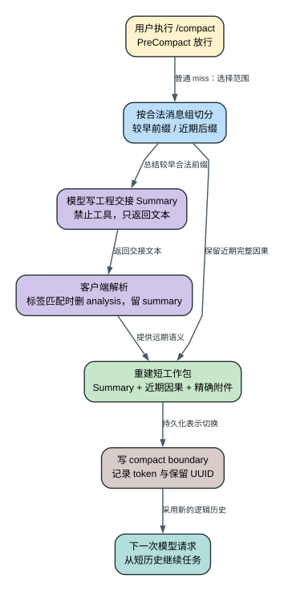
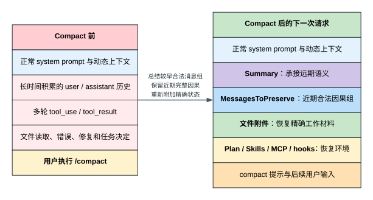
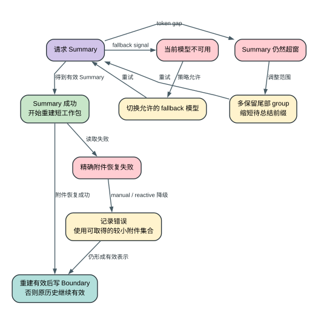

# Claude Code `/compact`：一次长任务怎样被压短又接着干（2.1.235）

用户让 Claude 重构评论分页。它已经读过服务代码，试过一个错误方案，跑出两次测试失败，刚找到 cursor 的边界问题。对话越来越长，用户输入：`/compact 保留测试失败原因和当前重构计划`。

**读者问题：** Claude Code 接下来究竟压缩了什么？旧细节减少后，模型凭什么还能接着修改同一个功能？

> 本文只讲 Claude Code CLI `2.1.235` 的 `/compact`。结论来自该版本可读化 bundle；手动 compact、消息视图切换和 resume 另有同版本精确二进制 Probe。

## 60 秒模型：它在做一次工程换班

**一句话模型：** 客户端把旧工作记录换成一份短工作包：Summary 保存较早经历，近期因果组保存刚才的现场，精确附件补回仍要使用的材料；它另在本地会话档案里写一条 Boundary，供以后 resume 接班。



可以把它理解成一次工程换班：Summary 是交接报告，近期消息组是刚刚发生的施工记录，Attachments 是重新摊在桌面的图纸和配置，Boundary 是会话档案中的交接分界页。

这里是一个“3+1”结构：前三项组成下一次模型请求的短工作包；Boundary 留在 transcript 中，负责记录这次表示切换，不是作为普通业务内容再发给模型。

### 场景里的信息去了哪里

评论分页任务有四条关键信息：较早的“不能修改数据库结构”、V1/V2 的测试失败、刚刚读到的 cursor 边界代码，以及 Plan 中“修完后重跑测试”的待办。

普通 `/compact` 不会识别并删除失败版本、只留下成功态。它会把不同信息交给不同精度的载体：

| 对象 | Compact 前 | 转换 | Compact 后 | 用户可见影响 |
| --- | --- | --- | --- | --- |
| 较早对话 | 约束、错误尝试和决定散在长历史里 | 模型生成有损摘要 | Summary 承接远期语义 | 对话变短，逐字细节可能丢失 |
| 最近工具因果 | `tool_use` 与 `tool_result` 必须配对，后续判断可能属于下一 group | 按合法 group 保留 | Preserved messages 保存近期现场 | Claude 知道刚才做了什么 |
| 工作材料 | 文件、Plan、Skills、MCP 等位于外部状态 | 客户端重新读取和组装 | Attachments/Hooks 补回精确材料 | 关键代码不必依赖 Summary 背诵 |
| 本地 transcript | 含 compact 前事件 | 追加 Summary 与 boundary | 逻辑视图改用新表示 | Resume 不会机械回灌全部旧事件 |

下面只沿一次**没有命中预计算结果的普通手动 `/compact`**走到底。预计算和自动触发放到主线讲完之后。

## 第一步：客户端先决定“总结哪一段，哪一段保留因果”

用户输入 `/compact ...` 后，客户端不再把它当成普通业务问题。客户端运行 `PreCompact` hook；本例假设 Hook 放行，并且当前没有可复用的预计算结果。

客户端接下来不能简单从“最后 N 条消息”处切开历史，因为工具调用和工具结果必须保持合法配对：

```text
assistant: tool_use(id=42, Read)
user:      tool_result(tool_use_id=42, 文件正文)
```

如果只留下第二条，下一次 API 请求虽然更短，消息结构却坏了。因此客户端先按合法因果 group 划分历史，再把较早 groups 交给模型总结，把近期 groups 的内容、UUID 和工具因果保留下来。保留的 assistant message 会清零四项旧 usage 计数，所以它不是 JavaScript 对象逐字段不变。

当前 manual `/compact` 从“至少保留最后 1 个合法 group”开始尝试。它不是固定保留一条消息，也不是固定保留最近一轮。

放回评论分页场景：较早的数据库约束、V1/V2 失败和设计讨论可以进入待总结前缀。最近的 `Read pagination.ts` 与配对的文件正文 `tool_result` 属于一个合法 group；读取后的下一条 assistant 判断通常已经进入另一个 group。两组是否都在 preserved suffix 中，取决于实际切点，不能把三者说成必然一起原样保留。

## 第二步：模型收到一份专门的“工程交接任务”

客户端在待总结前缀末尾加入一条虚拟用户消息。它不是一句随意的“总结一下”，而是强制模型暂停业务工作的专用任务：

```text
CRITICAL：停止当前业务工作，只生成对话总结。

不要调用 Read、Bash、Grep、Glob、Edit、Write 或任何其他工具。
先输出 <analysis>，按时间检查要求、文件、决定、错误和反馈；
再输出 <summary>，形成可继续工作的工程交接文档。
```

这次请求只允许一轮模型决策，客户端的工具权限函数也固定返回 deny。Prompt 负责把模型带入总结模式，权限层保证这一轮只能产出交接文本，不能继续读文件或跑命令。

### 九段 Summary 为什么像一份工程交接单

本次总结模板要求九段内容：

| Summary 段落 | 在评论分页场景中试图保住什么 |
| --- | --- |
| Primary Request and Intent | 重构分页，以及“不能改数据库结构”的约束 |
| Key Technical Concepts | cursor 分页、边界条件和当前架构 |
| Files and Code Sections | 已读、已改文件及其作用 |
| Errors and Fixes | V1/V2 为什么失败、怎样修正 |
| Problem Solving | 已排除的方向和仍需验证的问题 |
| All User Messages | 待总结范围内的用户反馈和需求变化 |
| Pending Tasks | 修复边界并重跑测试 |
| Current Work | compact 前正在检查的 cursor 条件 |
| Optional Next Step | 与最近任务直接一致的下一步 |

模板明确要求保留 errors、fixes 和 problem solving。因此它做的是“把失败经验压成语义”，不是“删除失败，只留成功”。

这些栏目是保真目标，不是无损保证。Summary 仍由模型生成，可能遗漏精确值；用户可以通过 `/compact <instructions>`，项目也可以通过 `PreCompact` hook，强调本次必须关注的约束。

## 第三步：客户端删掉整理草稿，只留下正式交接内容

提示词要求模型先输出 `<analysis>`，再输出 `<summary>`。这里的 `<analysis>` 是应用层提示格式，不等于 API 原生 thinking。

客户端的解析器会尽力执行：

```text
匹配到 <analysis>...</analysis>  -> 删除
匹配到 <summary>...</summary>    -> 改写为 Summary: ...
```

标签匹配时，梳理时间线的 analysis 草稿被删除，正式 Summary 进入新历史。但这不是严格的结构化输出 schema：若模型返回非空文本却没有完整标签，当前路径仍可能接受整段文本。双标签主要由强 prompt 约束，Compact 的语义质量仍然依赖模型，不是客户端逐字段填表。

## 第四步：客户端重新搭一张工作台，而不是只留下 Summary

如果 compact 只留下模型摘要，压缩率会很高，接班质量却不可靠。摘要擅长保留“为什么这样做”，不保证逐字符保存代码、配置、测试输出和工具因果。

所以客户端把下一次上下文重建成三层：



**第一层是 Summary。** 它保存较早的目标、约束、错误、决定和待办，压缩率高，但有损。

**第二层是 preserved messages。** 当前 manual 路径保留近期合法 group；工具调用、结果、内容和 UUID 继续配对。它负责保存“刚才发生了什么”。

**第三层是精确附件。** 客户端重新读取最近相关文件，并补回当前任务和运行状态。Plan、Skills、MCP 与 hook 等具体材料由各自装配逻辑提供，读者不需要先记住完整名单。

`2.1.235` 对**文件恢复**有明确预算：最多 5 个文件，每个最多 5,000 token，所有恢复文件合计最多 50,000 token。这个上限只针对恢复文件，不是所有 attachment 的统一上限。

这就是为什么 Summary 与附件可能重复：Summary 用低精度保存理解，附件用受限长度保存精确材料。客户端宁可花一部分 token 重读 `pagination.ts`，也不要求摘要逐字背出代码。

```text
压缩前：数据库约束 + V1/V2 失败 + Read/tool_result + 当前 Plan

压缩后：Summary 中的约束与失败经验
       + preserved suffix 中仍合法存在的近期 groups
       + 重新读取的 pagination.ts 与当前任务状态
       + 用户 compact 后的新输入
```

在当前 manual/reactive 路径中，如果附件恢复失败，客户端会记录错误并退化到仍能取得的材料；它不会把不存在的精确附件当成恢复成功。

## 第五步：Boundary 让下一轮和 Resume 都采用新历史

重建完成后，客户端向 transcript 追加 `system/compact_boundary`。它不是第二份 Summary，而是一条恢复元数据，说明较早历史已经由新表示替代。

Boundary 记录 compact 的来源、前后 token 和保留消息的 UUID 关系，让客户端以后知道较早历史已由 Summary 接管。

```text
物理 transcript：旧事件 + Summary/boundary + compact 后的新事件
下一次逻辑历史：Summary + 近期合法 groups + Attachments/Hooks + 后续输入
```

Resume 读取 JSONL 时，不是取最后 N 行，而是按 Boundary 指向的保留关系重建逻辑消息链。因此磁盘档案和模型工作历史可以同时存在，却不会一起完整塞回 context。

### 评论分页任务为什么还能继续

用户接着说：“修复 cursor 边界，然后重跑测试。”下一次模型从 Summary 得知“为什么不能改数据库”；近期 Read 结果若仍在 preserved suffix，可直接提供 cursor 代码，否则重新读取的文件 attachment 可以补回精确材料。模型随后继续修改并运行测试。

它看起来像从原对话无缝继续，实际是在一份新的短工作包上继续。

如果 Summary 漏了更早的精确片段，客户端会在路径可用时把完整 transcript 路径告诉模型；模型需要主动 `Read`。这是**沿明确路径补查**，不是客户端检测“记忆缺失”后自动语义检索。

## 两个必要分支：预计算和自动阈值

到这里，真实 compact 的核心状态变化已经结束。预计算和自动阈值只回答两个问题：Summary 能不能提前写，以及客户端什么时候自动进入这条流程。

### Precomputed compact：把等待前移

上下文到达 precompute line 后，客户端可以在后台对当时的历史预写 Summary，但不立即替换主历史。当前进程中的 ready result 命中时，客户端确认预计算点仍在当前历史，再把之后的新消息作为 `messagesSince` 接入保留区。

因此 precomputed hit 在**这一次 compact**不发新的 Summary 请求；模型调用只是提前发生了。若用户给 `/compact` 加了新 instructions、Hook 追加了新要求，或预计算点已不在当前历史，客户端放弃复用，回到前面讲过的普通 miss。磁盘 sidecar 在重新装入内存前还会做更完整的 session、model、时间、增长和 preserve UUID 校验，细节放在文末证据层。

### Auto-compact：阈值来自预算公式

手动 `/compact` 可以随时执行。自动路径必须先给模型输出留位置，再给“开始总结、提醒用户、最终阻断”留出不同缓冲。

先用 200k 窗口把两个容易混淆的分母讲清楚：原始 context 是 200k；预留最多 20k 输出后，本例真正可用于输入判断的 budget/ceiling 是 180k。后面的 13k、20k 和 3k 都从对应预算线继续扣，不是直接拿一个固定百分比乘 200k。

```text
input_budget    = effective_window - min(max_output_tokens, 20k)
compact_line    = input_budget - 13k
precompute_line = min(input_budget - input_budget * precompute_fraction,
                      compact_line)
warn_line       = compact_line - 20k
blocked_line    = model_input_ceiling - 3k
```

代入 200k context、20k 输出预留和默认 20% precompute fraction：

```text
input budget = 200k - 20k = 180k
precompute   = 180k - 20% = 144k
compact      = 180k - 13k = 167k
warn         = 167k - 20k = 147k
blocked      = 180k model input ceiling - 3k = 177k
```

| 线 | Token | 客户端动作 |
| --- | ---: | --- |
| precompute | 144k | 后台准备 Summary，主历史暂不切换 |
| warn | 147k | UI 开始提示余量 |
| compact | 167k | 触发自动 compact |
| blocked | 177k | 阻止继续无界增加输入 |

这些数字只属于这个算例。模型窗口、输出预算、设置和远程 precompute 配置都会改变结果；源码没有固定 T1-T5，也没有 30%、60%、75%、90% 四档。这里的 `20k` 是 auto-window 输出预留上限，不是 Summary 的固定输出上限。

## 失败时，客户端不能把半份 Summary 当成功

只有 Summary、保留区、附件和 boundary 完成组装，active view 才正式切换。



| 失败 | 客户端怎样处理 | 结果 |
| --- | --- | --- |
| `PreCompact` 阻止 | 保留原历史，不绕过 Hook | 不写成功 boundary |
| Summary 请求超窗 | 多保留尾部 group，缩短待总结前缀 | 自适应重试，耗尽后失败 |
| 当前模型不可用 | 沿允许的 fallback chain 切换 | 用下一模型重新总结 |
| 当前 manual/reactive 附件恢复失败 | 记录错误并降级附件集合 | 可能继续，但精确材料减少 |

失败时最重要的合同只有一个：成功的新表示和 Boundary 尚未形成，原 active history 就仍然有效。至于媒体剥离、自动失败计数和 rapid-refill breaker 等保护，属于异常路径细节，放在证据层，不打断主线。

## 三个最容易讲错的边界

**Compact 会固定切换到“模型 B”吗？** 不会。它使用当前 main-loop model 的请求策略；模型不可用且策略允许时才沿 fallback chain 切换。固定的是这轮“只能总结、不能使用工具”的职责，不是某个永远专用的模型 ID。

**Summary 漏了细节，客户端会自动搜索外部存储吗？** 不会。客户端可以重装有限附件，也可以把 transcript 路径告诉模型；后续仍需要模型主动 `Read`，不存在统一的自动语义召回层。

**Compact 能撤销已经发生的动作吗？** 不能。文件修改、`git push`、数据库写入、MCP 写操作和远端 API 请求仍由工作区或外部系统持有。Compact 是逻辑消息表示切换，不是外部系统 rollback。

## 最后只记住四件事

1. `/compact` 改写的是下一次模型看到的逻辑历史，不是简单删除磁盘聊天记录。
2. Summary 保存远期语义，近期合法 group 保存工具因果，Attachments 保存精确材料，Boundary 保存恢复关系。
3. Precompute 只把 Summary 生成提前；auto-compact 只改变客户端何时自动进入这条流程。
4. Summary 有损，附件有上限，路径需要模型主动读取，所以 compact 能提高连续性，却不能保证零遗忘。

真正的技术结论是：**Claude Code 的上下文压缩不是一段摘要文本，而是客户端拥有的一次消息图切换。模型负责生成有损语义；客户端负责选择合法范围、补回精确材料、写入恢复边界，并在失败时继续保留旧表示。**

<details>
<summary>源码与运行证据</summary>

| 机制 | `reverse/javascript/cli.readable.js` 定位或 Probe |
| --- | --- |
| Auto threshold 与 effective window | 216095-216245；`context.autocompact-thresholds` |
| Summary 模板、九段结构与双标签解析 | 261901-262207 |
| Group summarizer、token-gap retry 与 preserved suffix | 262209-262294 |
| Precomputed 生成、校验、`messagesSince` 与失败 cap | 262320-262680 |
| Tool deny、模型 fallback 和附件恢复 | 263099-263235 |
| Manual slash command 与 finalize/boundary | 331301-331367、232845-232876 |
| Boundary 字段与累计 dropped token | 211531-212001 |
| 同版本 manual compact、fork 与 resume Probe | `analysis/runtime-probes/agent-loop-tool-result-resume.json`；`probe.manual-compaction-boundary` |

普通 manual miss 的调用主线是 `gEv -> yEv -> nFa -> vmi -> Smi`。`vmi()` 从至少保留 1 个合法 group 开始；`Smi()` 负责恢复附件、运行 compact hook、生成 boundary 并产出新的 active view。

实现边界保留如下，供调试和跨版本比较：

- Manual 入口并行运行 `PreCompact` 与请求上下文准备；用户或 Hook 新增 summary instructions 会让 ready precompute 放弃复用。
- 当前进程内 ready hit 主要检查预计算点并拼 `messagesSince`；磁盘 sidecar rehydrate 才检查 session/model、7 天期限、150k 增长、缩减一半和 preserve UUID。Sidecar 记录 CLI version，但 `2.1.235` 不会仅因 CLI version mismatch 拒绝。
- Manual/reactive 的 Summary 超窗会扩大 preserved suffix；full/partial 使用另一套最多 3 次的截断重试，不能把两类恢复写成一个算法。
- Auto compact 连续失败 3 次会跳过本 session 后续 auto 尝试；compact 后少于 3 turns 又连续第 3 次触线会触发 rapid-refill breaker。两者都不禁止用户手动 `/compact`。
- Boundary 还可记录累计 dropped token、耗时、precomputed、discovered tools、preserved segment/messages；Resume 通过 UUID/parent 关系修链。同版本 Probe 证明一次 manual compact 后的 fork 采用了新逻辑视图，但不证明所有 manual 路径都没有 preserved messages。

Prompt cache、Tool Search、context hint 与 microcompaction 属于相邻但不同的问题，见[上下文治理与多层缓存](context-governance-and-caching.md)；UUID、checkpoint、resume、fork 和 Memory 见[会话、检查点与记忆](sessions-checkpoints-memory.md)。

</details>

图表源文件位于 `analysis/visuals/compact-*.dot`，通过 Graphviz 确定性生成对应 SVG。
