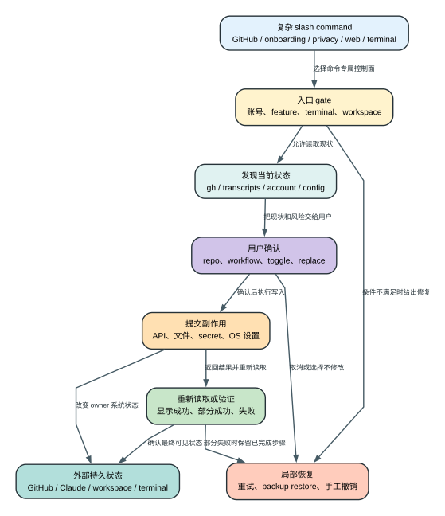

# Claude Code CLI 2.1.235 复杂 Slash Command 生命周期：哪些命令只是提示词，哪些在本地编排真实外部系统？

> `2.1.235 | Static` | 视图：`reverse/javascript/cli.readable.js`

**读者问题：** `/install-github-app`、`/team-onboarding`、`/privacy-settings`、`/web-setup`、`/terminal-setup` 看起来都像一条 slash command，为什么它们的权限、失败恢复和不可撤销副作用完全不同？

**一句话模型：** 复杂 slash command 是本地状态机或受限 agent 工作流的入口，它先收集并验证本机状态，再跨 GitHub、Claude 账号、文件系统或终端配置提交副作用；命令名称相同不代表执行模型相同。

图的结论：复杂命令的共同点是“先 gate、再确认、后提交、最后验证”，但真正 owner 分别是 GitHub、Claude 服务端、本地 workspace 和 OS 配置。

## 60 秒看懂：五种命令，五种状态所有权

贯穿场景：团队负责人想把一个仓库接入 Claude：安装 GitHub App 和 Actions、生成 `ONBOARDING.md`、确认数据训练设置、把本地 GitHub 凭据连接到 Claude Web，并修好终端多行输入。

| 状态 owner / 对象 | Before | Transformation | After | 用户可见效果 |
| --- | --- | --- | --- | --- |
| GitHub repo | 无 App/workflow/secret 或状态未知 | `/install-github-app` 检查 gh、scope、权限并创建/更新 | App 页面、secret、branch/workflow/PR | GitHub 能响应 `@claude` 或 review workflow |
| 团队知识 | 分散在本地 transcript、MCP 和 repo | `/team-onboarding` 扫描并交给受限 agent 编写 | `ONBOARDING.md` + 可选分享链接 | 新成员获得可复制的交互式指南 |
| 隐私偏好 | 服务端 `grove_enabled` 未知/旧值 | `/privacy-settings` 读取域策略并提交 toggle | Claude 账号服务端设置更新 | CLI 显示 true/false 和保留期文案 |
| Web GitHub 凭据 | Web 未连接或已用 GitHub App OAuth | `/web-setup` 导入本地 gh token | Web credential 变为本地 token，可能创建环境 | 浏览器打开 Claude Web 项目页 |
| 终端配置 | Shift+Enter/Option+Enter/clipboard 未配置 | `/terminal-setup` 按 terminal 写配置或确认原生支持 | plist/settings/keymap 改变 | 多行输入、clipboard 或 bell 行为改变 |

## 共同生命周期：不是“一条命令直接执行完”

五个复杂流程都包含下面几层，只是 owner 不同：

1. **入口与可用性 gate**：账号类型、feature flag、workspace、terminal attached、OS/terminal、远端能力。
2. **现状发现**：读取 gh auth、repo 权限、transcript、Claude 账号设置、terminal config。
3. **用户确认**：选择 repo/workflow/auth 类型、隐私 toggle、是否替换现有 OAuth。
4. **提交副作用**：GitHub API/CLI、服务端设置 API、本地文件写入、OS defaults/plist。
5. **验证与结果**：重新读取状态、显示成功/失败、保存计数或打开浏览器。

这五层描述的是控制顺序，不表示所有命令共享一个执行器。入口层拥有的只是 command/UI state；发现层得到的是只读快照；确认层保存的是用户选择；提交层才把选择转换成 GitHub、Claude API、文件系统或 OS 写入；验证层只能重新观察结果，不能让之前分散提交的外部系统自动组成事务。

| 生命周期阶段 | 客户端持有的状态 | 允许发生的动作 | 失败时能保留什么 | 不能由该阶段保证什么 |
| --- | --- | --- | --- | --- |
| 1. 入口 gate | command descriptor、feature/account/terminal 条件 | 显示不可用原因或进入流程 | 外部系统保持原状 | 远端账号权限真实可写 |
| 2. 现状发现 | gh auth/repo、transcript、privacy、credential、terminal snapshot | 读取、归一化、计算下一步 | 已读取快照与诊断 | 快照在提交时仍未变化 |
| 3. 用户确认 | repo、workflow、toggle、替换 OAuth、terminal 方案 | 改变待提交计划 | 用户选择和 UI step | 已经完成任何外部写入 |
| 4. 提交副作用 | 每个 owner 专属 request/CLI/file operation | 创建 secret/branch/file、写 setting/token/plist | 已成功的前序步骤 | 跨 GitHub、Claude、磁盘和 OS 的统一 rollback |
| 5. 验证结果 | refresh/readback、exit code、返回 URL、backup 状态 | 确认、警告、提供修复入口 | 真实已观测结果 | readback 失败就等于前一步没写成功 |

读这类命令时最重要的是区分“准备提交”和“副作用已经提交”。例如 `/privacy-settings` 的 toggle UI 只是本地选择，服务端写请求成功后才改变账号设置；但写后 refresh 失败时，正确状态是“结果未知、写入可能已发生”，不能报告为自动回滚。`/install-github-app` 更明显：App authorization、secret、branch、workflow commit 和 PR 分属多个远端对象，后一步的 `422` 不会撤销前一步。`/terminal-setup` 只有明确创建 backup 的写入路径才有程序化恢复依据，其他路径仍需按终端自己的配置模型处理。

这些命令因此不是一个原子事务。前半段成功、后半段失败时，已经发生的远端或本地修改通常保留；重新运行可以补齐或修正状态，但不能假定回到命令执行前。验证结果也必须按 owner 表述：CLI 能确认自己看到了某个 readback、exit code 或文件内容，不能把浏览器后续流程、服务端内部持久化和第三方授权状态包装成客户端已经证明的成功。

## 一、`/install-github-app`：一个可恢复 UI 状态机，背后是多次 GitHub 写入

### 完整成功路径

状态机从 `check-gh` 开始，默认 secret 为 `ANTHROPIC_API_KEY`，默认 workflow 选择 `claude` 和 `claude-review`，默认 auth type 为 API key。主要阶段为：

1. 检查 `gh` 是否安装、是否 authenticated；
2. 读取 token scopes，缺 `repo` 或 `workflow` 时给出精确 `gh auth refresh -h github.com -s repo,workflow` 修复命令；
3. 解析当前 repo 或让用户选择 repo；
4. 查询 repo 是否存在、当前用户是否具备足够权限/admin 条件；
5. 检查 `.github/workflows/claude.yml` 是否已存在；
6. 打开 GitHub App 安装页面，并等待用户继续；
7. 选择 workflow、API key 或 OAuth、secret 名称以及是否复用既有 secret；
8. 创建分支，写入一个或两个 workflow 文件，配置 Actions secret，打开 PR 页面；
9. 记录每个 step 的 telemetry，成功后增加 `githubActionSetupCount`。

若 workflow 已存在，用户可以更新、只配 secret、或退出不修改。创建 workflow 遇到 GitHub 422/sha conflict 会转换成“文件已存在”的具体恢复建议，而不是模糊报错。

后台 session 没有 attached terminal 时拒绝运行，并把 session 标记为 needs input；这个命令需要交互确认，不能在无人值守背景里偷偷安装 App 或 secret。

证据：`reverse/javascript/cli.readable.js:490644-491109`，特别是 scope `490733-490752`、repo/workflow `490804-490857`、background gate `491071-491076`。

### 外部副作用

- GitHub App 安装授权发生在浏览器/GitHub；
- Actions secret 写入 repo；
- 新 branch、workflow commit 和 PR 页面；
- 已存在 workflow 可能被更新；
- telemetry 和本地 setup count。

其中 secret、branch、commit、PR 和 App authorization 都不受 Claude 对话 rewind 控制。

## 二、`/team-onboarding`：先本地扫描，再让受限 agent 写一份可继续交互的文档

### 本地扫描读取什么

命令默认统计最近 `30` 天。它扫描当前项目对应的本地 `.jsonl` transcripts：

- 单个文件必须是普通文件、mtime 在窗口内、大小不超过 `50 MiB`；
- 统计 slash command 名称与次数；
- 统计 `mcp__server__tool` 的 server 次数；
- 提取 custom title、PR number 与首条 user message；
- 首条消息最多 `200` 字符；
- session descriptors 最多保留 `60` 条，优先有 title 和 PR 的记录；
- 读取当前 workspace `.mcp.json`，只提取 server name 与 URL origin；
- 读取 git user.name、origin repo 名称。

随后把这些数据序列化为 JSON，放进专用 prompt。模型不是自由探索整个历史目录，而是拿到扫描器生成的受限摘要。

证据：`reverse/javascript/cli.readable.js:367433-367528`。

### agent 被允许做什么

prompt 要求先输出用户可见 acknowledgment，再分类工作类型，立即生成初稿，写入 `ONBOARDING.md`，渲染文档并询问团队名、starter task 与额外 tips。用户回答后更新同一文件；可选 share 工具第一次创建分享链接，第二次用 short code 更新。

`allowedTools` 只有：

- `Edit(ONBOARDING.md)`；
- `Bash(ls *)`；
- onboarding share tool。

这条命令的核心安全边界是**先由客户端把历史 transcript 降维，再给 agent 一个只允许改固定文档和列目录的工具面**。但生成内容仍包含个人使用模式、项目、MCP 名称和会话摘要，因此分享前需要按团队隐私标准审阅。

证据：`reverse/javascript/cli.readable.js:367592-367693`、`reverse/javascript/cli.readable.js:367686`。

## 三、`/privacy-settings`：CLI 是服务端账号设置的交互前端

### 完整成功路径

1. 读取账号隐私设置和 domain exclusion；
2. 如果 `grove_enabled` 已有值，显示当前 true/false toggle；
3. domain excluded 时强制显示 false，不能本地切成 true；
4. 非排除域按 Enter/Tab/Space 切换，并立即调用 `gdr(boolean)` 写服务端；
5. dialog 结束后重新读取设置，只有读取成功才报告最终 true/false；
6. 初次条款流程可以 opt-in、opt-out、在 grace period defer，且记录相应 telemetry。

用户可见文案明确说明：打开“Help improve our AI models”会把保留期从默认 `30` 天扩展到 `5` 年；关闭则保持默认 `30` 天。这个数字是 `2.1.235` 客户端显示的产品文案，不是对所有账号、法规和未来服务端策略的独立证明。

证据：`reverse/javascript/cli.readable.js:500948-501190`，保留期文案 `500979-501000`，服务端写入 `501027-501106`。

### 外部副作用

真正持久状态由 Claude 服务端拥有。CLI 可以重新读取确认，但对话 rewind、终止进程或删除本地 transcript 都不会自动恢复旧 privacy setting。

## 四、`/web-setup`：把本地 GitHub 凭据导入 Claude Web，可能替换既有连接

### 完整成功路径

1. 检查 Claude 登录状态；未登录时要求 `/login`。
2. 检查 `gh` 是否安装和 authenticated；失败时打开 Web alternate auth 页面并给出修复说明。
3. 取得本地 gh token，并检查 Claude Web 当前 GitHub connection 是否为 GitHub App OAuth。
4. 显示确认框：Claude Web 会用该凭据 clone/push；本地凭据将用于 GitHub authentication。
5. 如果已有 GitHub App OAuth，明确警告 continuing 会**替换 authentication credential**，repo access 会按本地 token scopes 改变。
6. 上传 credential；如果账号没有 environment，尝试创建默认 environment。
7. 打开 Claude Web URL，报告连接的 GitHub username。

默认 environment 创建失败只记录 warn，主连接仍可继续并打开 Web。这是一个部分成功分支：credential 已导入，但 environment 初始化可能未完成。

证据：`reverse/javascript/cli.readable.js:508945-509052`。

### 外部副作用

- 本地 GitHub token被传给 Claude 服务端；
- 既有 GitHub App OAuth 可能被替换；
- repo access scopes 随 token 权限变化；
- 可能创建默认 Web environment。

这些变化需要在 Claude Web/GitHub 侧重新连接或撤销，不能靠本地 session rewind恢复。

## 五、`/terminal-setup`：按终端写配置，能备份的路径才尝试恢复

### 路由逻辑

命令先识别当前 terminal：

- iTerm2：启用 clipboard access，Shift+Enter 原生支持，不写 key binding；
- Ghostty、Kitty、Warp、WezTerm、Windows Terminal：提示原生支持，不写配置；
- Terminal.app：较新 macOS 可直接使用 Shift+Return；否则为 profile 启用 Option as Meta，并在非 screen-reader 模式关闭 audible bell；
- VS Code、Cursor、Devin Desktop：写 terminal keybinding/settings，并处理 GPU acceleration 等兼容配置；
- Alacritty：写相应 TOML/YAML 配置；
- Zed：写 `~/.config/zed/keymap.json`；
- tmux/screen/不支持环境：不修改，提示退出复用层后在受支持终端运行。

证据：`reverse/javascript/cli.readable.js:363653-363658`、`reverse/javascript/cli.readable.js:427366-427478`。

### Terminal.app 的保护与恢复

Terminal.app 路径先创建 preferences backup；读取 Default/Startup profile 后分别写 `useOptionAsMetaKey` 和 `Bell=false`。screen-reader 模式下 audible bell 保持原样，因为它可能承担可访问性反馈。完成后 kill `cfprefsd` 并要求重启 Terminal.app。

写入失败时尝试从 backup 恢复，并把“已恢复”“恢复失败”“没有 backup”区分为不同错误。Zed 也会在修改既有 keymap 前创建随机 `.bak`；backup 失败就停止写入。

证据：`reverse/javascript/cli.readable.js:427609-427659`、`reverse/javascript/cli.readable.js:427702-427730`。

## 三类简单 URL handoff，不应和复杂状态机混写

以下命令主要调用默认浏览器并返回成功/失败文本，客户端不负责远端业务完成：

| 命令 | 本地动作 | 外部 Boundary |
| --- | --- | --- |
| `/install-slack-app` | 增加本地 install count，打开 Slack Marketplace URL | Slack 授权、workspace 安装和权限 |
| `/stickers` | 打开 Sticker Mule 页面 | 下单、支付、配送 |
| `/radio` | feature gate 后打开 `clau.de/radio` | 媒体服务、播放和跟踪 |

证据：`reverse/javascript/cli.readable.js:362011-362023`、`reverse/javascript/cli.readable.js:365857-365882`。

## Gate、默认值与阈值

| 命令 | Gate | 默认/阈值 | 写入 owner |
| --- | --- | --- | --- |
| `/install-github-app` | 命令未禁用、交互 terminal、gh/auth、repo/workflow scopes | secret=`ANTHROPIC_API_KEY`；workflows=`claude`,`claude-review` | GitHub + local setup state |
| `/team-onboarding` | feature 允许、workspace 存在 | 30 天；50MiB/file；首消息 200 字；descriptor 60 | `ONBOARDING.md` + 可选 share service |
| `/privacy-settings` | 账号设置可读取、domain policy | off=30天，on=5年是客户端文案 | Claude 账号服务端 |
| `/web-setup` | Claude 登录、gh 安装并认证、quick web setup gate | 无 environment 时创建默认值 | Claude Web + GitHub credential |
| `/terminal-setup` | Ink/交互、支持的 OS/terminal | screen-reader 不关 bell；原生支持不写 binding | OS/terminal config + local state |

## 失败与恢复矩阵

| Failure | Detection | Retry/change | State retained | Final user effect |
| --- | --- | --- | --- | --- |
| gh 未安装/未登录 | startup check | 提供安装/auth 指令 | repo 未修改 | GitHub setup 不继续 |
| gh scope 缺失 | token scope parse | 提供 `gh auth refresh ... repo,workflow` | App/secret/workflow 未继续 | 用户补 scope 后重跑 |
| workflow 已存在 | GitHub contents API/422 | 更新、跳过 workflow 或退出 | 既有 workflow 保留 | 不会静默覆盖 |
| GitHub 流程中途失败 | step state 进入 `error` | UI 提供重试/修复说明 | 已创建 secret/branch/commit 可能保留 | 不是全事务回滚 |
| transcript 过大/过旧 | stat gate | 跳过该文件 | 其他会话摘要保留 | onboarding 统计不完整 |
| onboarding share unavailable | share tool 返回 unavailable | 使用手工 close | `ONBOARDING.md` 保留 | 没有分享链接但文档可用 |
| privacy 读取失败 | API result 非 success | 显示设置 URL或读取失败 | 服务端旧值保留 | CLI 不声称修改成功 |
| privacy 写后重读失败 | refresh API失败 | 显示 unable to retrieve | 写入可能已经发生 | 用户需在 Web 设置页确认 |
| web setup credential import 失败 | `JSc` 返回 error | 按错误类型显示修复 | 既有连接可能保留 | 不打开成功页面 |
| default environment 创建失败 | exception | 只 warn，继续打开 Web | 新 credential 已保留 | Web 可能没有默认 environment |
| Terminal.app 写失败 | plist/defaults code 非0 | 从 backup 恢复 | 成功恢复则旧配置保留 | 明确报告恢复状态 |
| Zed backup 失败 | copyFile exception | 停止写 keymap | 原 keymap 保留 | 给出 backup path |

## 不可撤销副作用与恢复边界

- GitHub App authorization、secret、branch、commit、PR 都是外部状态；重新运行命令可以修正，但不会自动恢复“运行前整个 repo”。
- `ONBOARDING.md` 可用 Git 恢复，但已分享出去的链接和复制到团队渠道的内容不随本地文件回滚。
- privacy setting 与 Web GitHub credential由服务端持久化；本地进程终止不撤销。
- terminal config 是本机持久配置；部分路径有 backup，部分只能按提示手工 undo。
- URL handoff 只证明浏览器打开尝试，不证明 Slack 安装、商品购买或媒体播放完成。

## Token、延迟、费用、隐私、安全和恢复影响

- **Token：** `/install-github-app`、`/privacy-settings`、`/web-setup` 和 `/terminal-setup` 主要是本地/API UI 状态机，模型 token 不是主成本；`/team-onboarding` 会运行 prompt agent并生成文档。
- **延迟：** GitHub setup 包含多次 CLI/API和浏览器确认；team onboarding 受 transcript 扫描与模型生成影响；terminal setup 受 OS 配置刷新和重启影响。
- **费用：** GitHub/Slack/Sticker/媒体的外部费用由对应服务决定；Claude 模型费用主要出现在 onboarding agent。客户端静态源码不能给出最终账单。
- **隐私：** onboarding 会把本地使用摘要交给模型并可能分享；web setup 上传 GitHub token；privacy settings 读取/写入账号偏好；GitHub setup 写 secret。每条命令的数据敏感度不同。
- **安全：** GitHub scope/admin检查、后台 terminal gate、onboarding allowlist、domain exclusion、OAuth 替换警告、terminal backup都是命令专属控制，不能用“一般 slash command 很安全”替代逐条分析。
- **恢复：** 有明确 backup 或重新读取验证的路径更可恢复；远端 authorization、credential、分享和 repo commit需要在 owner 系统中撤销。
- **副作用：** secret、branch、commit、PR、账号 privacy setting、Web credential、分享链接和终端配置分别由不同 owner 持久化；命令退出、session rewind 或某个后续步骤失败都不会统一撤销已成功提交的对象。

## Static 与 Boundary

### `Static` 可确认

- 五个命令的客户端状态机、默认值、tool allowlist、错误分支和用户提示；
- GitHub scope/workflow检查、transcript 50MiB 上限、privacy retention 文案、Web OAuth 替换警告、terminal screen-reader行为；
- 三个简单命令只做 browser handoff。

### `Boundary` 仍不能由客户端静态源码证明

- GitHub App、Actions、secret 和 PR 的服务端最终状态；
- Claude 服务端 privacy setting、数据训练、保留与删除的实际执行；
- Web credential 的服务端存储、加密和撤销实现；
- onboarding 模型判断的准确性与 share service 的访问控制；
- terminal/OS版本差异、浏览器打开后的远端流程；
- 某一次真实运行是否完整经过成功路径，除非另有 Probe。

## 证据索引

| 主题 | 精确源码范围 |
| --- | --- |
| `/install-github-app` 全状态机 | `reverse/javascript/cli.readable.js:490644-491109` |
| team transcript 扫描与阈值 | `reverse/javascript/cli.readable.js:367433-367528` |
| onboarding prompt、文件与工具 allowlist | `reverse/javascript/cli.readable.js:367592-367693` |
| privacy 设置、保留文案与服务端写入 | `reverse/javascript/cli.readable.js:500948-501190` |
| `/web-setup` credential 导入和 OAuth 替换 | `reverse/javascript/cli.readable.js:508945-509052` |
| terminal 命令入口和终端描述 | `reverse/javascript/cli.readable.js:363653-363658` |
| terminal 路由、backup、写入和恢复 | `reverse/javascript/cli.readable.js:427366-427730` |
| 简单 URL handoff | `reverse/javascript/cli.readable.js:362011-362023`、`365857-365882` |
