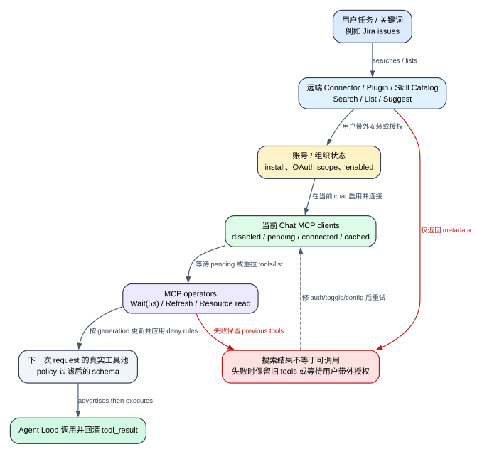

# Claude Code CLI 2.1.235 Connector、账号 Catalog 与 MCP Operator：为什么“搜到了”仍不等于“当前可调用”

> 版本：`2.1.235` | 证据：`Static`；MCP refresh 另有本版 exact-binary `Probe` | 远端目录内容、账号 entitlement 与第三方 MCP server 行为：`Boundary`

## 60 秒心智模型

**读者问题：** Claude Code 已经搜到 Jira connector、plugin 或 skill，为什么模型仍然调用不了；MCP server 明明配置了，为什么工具列表没有更新；resource 又为什么能列出却读不到？

**一句话模型：** Claude Code 同时维护“远端组织目录”“账号已启用 catalog”“当前 session 连接状态”“当前 request 的工具池”四份不同状态；搜索只改变模型的认知，安装/授权多在带外完成，只有连接、刷新、policy 过滤和工具池更新全部成功后，能力才真正进入 Agent Loop。

贯穿场景：用户让 Claude 查看 Jira issues。模型先用 `SearchMcpRegistry` 找到 Jira，再用 `SuggestConnectors` 解析完整卡片；用户在 claude.ai 带外连接后，`ListConnectors` 显示 org-level connected，但 `enabledInChat:false`。用户在当前 chat 开启 connector，MCP client 从 pending 变 connected；`WaitForMcpServers` 收口连接状态，必要时 `RefreshMcpTools` 重新拉 `tools/list`，最后模型才能调用动态 `mcp__...` tool 或读取 MCP resource。



图的结论：`discover -> install/auth -> enable in chat -> connect -> refresh -> advertise -> call` 是七个状态变化；把其中任意一个结果写成“已可用”，都会误导排障和跨版本比较。

### 场景的前后状态

| 对象 | Before | Transformation | After | 用户可见效果 |
| --- | --- | --- | --- | --- |
| Connector directory result | 模型不知道有哪些 connector | `SearchMcpRegistry` 按关键词查询远端目录 | 返回 ranked connector metadata | 只能推荐，尚未安装/启用 |
| Org installation | connector 未连接 | 用户在 claude.ai 带外授权 | `installState/connected` 改变 | 账号有 connector，不代表本 chat 有 tools |
| Session connector state | MCP client disabled/pending | chat toggle、auth、connect/discovery | connected/cached/needs-auth/failed 等 | `ListConnectors.enabledInChat` 可变化 |
| Runtime tool pool | 保留旧 generation/schema | `RefreshMcpTools` 拉新 `tools/list` 并过滤 | added/removed tool names | 后续 request 才可能 advertised 新工具 |
| MCP resource cache | 目录旧或为空 | list/read、404 invalidation | 新 resource list 或本地 blob file | 模型可读 data，但 data 不是 instructions |
| Plugin/Skill catalog | 当前模型不知道账号内容 | List/Search 远端账号 catalog | 返回 id/name/description/enabled | suggestion card 仍不执行安装 |

## 状态所有权与前后变化

| 状态层 | Owner | 客户端字段/对象 | 改变入口 | 不等价于 |
| --- | --- | --- | --- | --- |
| Public/custom connector directory | claude.ai org registry | `directoryUuid`、`installedServerId`、`installState`、metadata | Search/Suggest/List API | 当前 session 已连接 |
| Org connector auth/install | claude.ai account/org | `connected` 或 `installState` | 用户带外 OAuth/设置 | 当前 chat 已启用 |
| Current-chat enablement | 当前 MCP client list | `X-MCP-Server-ID` 与非-disabled client | chat connector settings、refresh clients | tools 已完成 discovery |
| MCP connection | client manager | pending/connected/cached/needs-auth/failed/disabled | startup、`/mcp`、lazy connect | 工具池已热更新 |
| MCP tools generation | runtime tool registry | generation、fetch cache、live pool | startup discovery、`RefreshMcpTools` | server 一定执行成功 |
| MCP resources | MCP server + client cache | uri/name/mime/content/blob path | list/read/directory read | tool schema 或 prompt 内容 |
| Plugin/Skill account catalog | claude.ai account/org | enabled item list、search result、version | account API、sync/download | 本地 plugin 已加载到 session |
| Suggestion card | 当前 UI/result | plugin/skill card payload | `SuggestPluginInstall`/`SuggestSkills` | 用户已点击、安装或启用 |

## 完整调用顺序

### 1. Connector registry tools 只在 first-party remote host 装配

`SearchMcpRegistry`、`SuggestConnectors` 和 `ListConnectors` 都使用同一个 `isEnabled: XDt`。本版 `XDt()` 的精确定义是：

```text
CLAUDE_CODE_REMOTE && provider == firstParty
```

这意味着它们不是普通本地 CLI 的通用 connector browser。它们服务带 remote host 的 first-party surface。三个对象虽然都出现在 80 个同工厂注册调用点中，但 gate 未满足时不会进入当前可用工具池。

账号级 plugin/skill 六工具使用另一套 `emt()`：HIPAA policy 直接关闭；first-party remote host 直接允许；其他受支持 host 还需要对应 host eligibility 与 suggestion rollout latch。两组工具都依赖远端账号，但装配 gate 不相同。

**证据：** `reverse/javascript/cli.readable.js:156093-156121`、`298700-298920`、`299248-299430`。

### 2. `SearchMcpRegistry` 搜关键词，但不会连接 connector

输入 `keywords`：

- 至少 1 个，最多 8 个；
- 每个字符串长度 1-64；
- 请求 POST 到 `/api/oauth/organizations/:orgUUID/mcp/connectors/search`；
- body 为 `{keywords, include_custom:true}`；
- 使用 `teleport-org` auth；
- timeout `15,000 ms`。

`include_custom:true` 很关键：结果既可能来自公共 directory，也可能来自组织自建 connector。返回 schema 本身是宽松 passthrough object，客户端不会把每个 server-defined 字段冒充本版固定合同。

成功结果再经过 `bEi()`，尝试标出 `enabledInChat`。算法不是看 connector name，而是：

1. 遍历当前 `mcpClients`；
2. 忽略 `type:"disabled"`；
3. 从 client config headers 读取 `X-MCP-Server-ID`；
4. 若它匹配结果的 `installedServerId`，则 `enabledInChat:true`。

所以 `installState:"connected"` 与 `enabledInChat:false` 的准确含义是：组织层已授权，但当前 chat 没有加载对应 connector client；其工具不会出现在当前工具池。

**证据：** `reverse/javascript/cli.readable.js:298630-298756`。

### 3. `SuggestConnectors` 只接受 Search 返回的 UUID

`SuggestConnectors` POST 到 `/mcp/connectors/suggest`，输入 `uuids` 最少 1、最多 32，每个 1-64 字符。它的 prompt 明确禁止猜 UUID 或直接传 connector name；正确链路必须先 Search，再用其 `directoryUuid/server_id` 做 lookup。

这个工具返回完整 connector payload，供模型说明 name、description、URL、icon、sample tool names 和 install state。它仍不执行 OAuth、不切当前 chat toggle、不重建 MCP client。

**证据：** `reverse/javascript/cli.readable.js:298757-298838`。

### 4. `ListConnectors` 是“组织已安装列表”，过滤发生在本地

`ListConnectors` POST `/mcp/connectors/list`，然后把当前 MCP client 状态投影成 `enabledInChat`。可选 `keywords` 最多 8 个，每个最多 64 字符；过滤不是服务端 query，而是客户端对 connector `name/description` 做 case-insensitive substring match。

结果上限与 persistence ceiling 都是 `300,000 chars`，显著高于 Search/Suggest 的 `50,000`。这是因为“列出全部已安装 connector”可能很大。较高 ceiling 不是无限制，也不表示所有 payload 都值得保留在后续上下文。

`connected:null` 在 prompt 语义中表示 status check unavailable，应解释为 unknown，而不是 disconnected。`enabledInChat` 仍由当前 client list 独立计算。

**证据：** `reverse/javascript/cli.readable.js:298839-298920`。

### 5. Connector 三个 route 共享 opt-in 和错误合同

三个 route 都先解析 `{results,opt_in_required,message}`：

- `opt_in_required:true` 时，返回空 results + 提示用户到 Claude settings 开启 connector suggestions；
- HTTP >=400 时尝试解析 `{error:{type,message}}`，形成可读错误；
- malformed success body 直接报 `malformed connector response`；
- abort 继续抛 cancellation；
- 其他错误统一记录 telemetry 并对模型显示“registry unavailable right now”。

opt-in 是产品选择状态，不是“没有搜索结果”。把它降级成空列表会让模型误以为用户所在组织没有 connector。

**证据：** `reverse/javascript/cli.readable.js:298630-298699`。

### 6. Plugin/Skill catalog 先解决 OAuth scope，再调用账号 API

账号 catalog 搜索依赖 `allow_plugin_skill_search` policy 和 `user:plugins` OAuth scope。`Yrv()` 按以下顺序做 preflight：

1. policy 未注册/拒绝：返回 `policy_disabled`；
2. 非 first-party provider：`wrong_provider`；
3. essential-traffic-only：拒绝非必要网络；
4. 已在支持的 hosted context：可直接继续；
5. 尝试刷新当前登录；
6. 已有 `user:plugins` scope：继续；
7. custom OAuth client、无 refresh token、环境注入 token：不能自动扩 scope；
8. 同一 credential 本 session 已尝试 expansion：不重复；
9. 通过跨进程 refresh lock 扩 scope，处理 lock contention、sibling token adoption、save failure；
10. 新 token 仍无 scope：`expand_failed`。

scope expansion Promise 被 host-scoped state 去重。普通调用最多等待 `10,000 ms`，后台预热可使用 `15,000 ms`，并支持 abort race。等待超时不一定取消另一并发调用正在做的 token refresh；它只让当前 caller 不再阻塞。

**证据：** `reverse/javascript/cli.readable.js:298921-299005`。

### 7. SearchPlugins 与 SearchSkills 是动态 factory 的静态可展开实例

`tool-registrations.jsonl` 只看到两个 `Yi({name:e.name,...})` factory callsite，但本版 callers 可静态追到：

- `SearchPlugins` -> `/plugins/search`；
- `SearchSkills` -> `/skills/search`；
- `ListPlugins` -> account enabled plugin list；
- `ListSkills` -> account enabled skill list。

所以这四个最终名字不是 runtime-unknown。真正动态的是远端 result 数量与内容，不是本版工具名称。

Search 的共同输入仍是 1-8 个、每个 1-64 字符的 keyword。route timeout `15,000 ms`。HTTP 403 且 error envelope 可解析时，客户端记录 `not_entitled` 并**降级为空列表**；其他 >=400 或 malformed response 才抛错误。

这个 403 empty fallback 是用户解释的重要边界：空列表可能是“未授权”，不一定是 catalog 没有匹配项。

**证据：** `reverse/javascript/cli.readable.js:299006-299047`、`299248-299327`。

### 8. `ListPlugins` 有分页上限和一次重试，`ListSkills` 没有同样分页

`ListPlugins` 调用 compact list endpoint：

- 每页 `100`；
- 最多 `20` 页，即最多收集 2,000 个 enabled plugin 后再判 page cap；
- 单请求 timeout `10,000 ms`；
- `enabled:false` 被过滤；
- 首轮若失败且不是 403，等待 `500 ms` 后完整重试一次；
- 403 不重试，交给上层降级为空。

`ListSkills` 调用 `list-skills?include_wiggle_skills=true`：

- 若当前 entrypoint 存在，追加 `entrypoint` query；
- timeout `30,000 ms`；
- response max content `16,777,216 bytes`；
- `enabled:false` 被过滤；
- schema malformed 或 error envelope 单独记录。

两者都只返回账号 catalog 视图，不证明本地 plugin 下载、解压、enable、session registry、Skill prompt listing 或 LSP process 已完成。那些状态仍由 [Plugins、Skills、Commands 与 LSP](plugins-skills-commands-lsp.md) 负责。

**证据：** `reverse/javascript/cli.readable.js:299048-299247`。

### 9. Suggestion tool 渲染卡片，不执行安装

`SuggestPluginInstall` 的 call 只是把输入加上固定 note：用户需要带外 enable plugin，后续必须用 `ListPlugins` 重新观察实际安装状态。它最多接受 16 个 plugin，每项可带最多 32 个 skill 摘要。结果 card 不是安装 receipt。

`SuggestSkills` 更特殊：

- 输入 keyword 1-8；
- 远端 SearchSkills 后过滤 `enabled !== true`，只展示未启用项；
- result 记录 trigger 是 `user_asked` 或 `proactive`；
- feature `tengu_saddle_lantern` 决定它是否 deferred，以及 prompt 是否允许主动建议；
- 主动搜索无结果时，prompt 要求静默继续任务，不用向用户汇报“搜过但没有”。

因此 suggestion tool 的副作用主要是 UI 呈现和 transcript/result；真正安装、授权和 session reload 仍在带外或其他生命周期。

**证据：** `reverse/javascript/cli.readable.js:299328-299430`。

### 10. `WaitForMcpServers` 只等当前 pending clients，最多 5 秒

工具只有在当前 client list 存在 pending server 时启用。默认等待全部 pending；传 `servers[]` 时按 canonicalized name 匹配。循环每 `50 ms` 检查一次，最多 `5,000 ms`，并响应 abort。

结束后把状态分为：

| 分类 | 含义 | 是否 ready |
| --- | --- | --- |
| `connected` | live connection，tools 可用 | 是 |
| `cached` | schema cache 可用，首次调用再 connect | 是 |
| `failed` | 连接失败 | 否 |
| `stillPending` | 5s 后仍在连接 | 否 |
| `needsAuth` | 需要用户 `/mcp` 认证 | 否 |
| `disabled` | 被关闭 | 否 |
| `unconfigured` | 配置存在但无 URL 等必要值 | 否 |
| `unknown` | 请求的名字不在 client list | 否 |

`ready` 只有在 pending/failed/needsAuth/disabled/unknown 都为空时为 true。tool result 对 `ready:false` 设置 `is_error:true`，但它不会无限等待，也不会替用户执行 OAuth。

**证据：** `reverse/javascript/cli.readable.js:296759-296834`。

### 11. `RefreshMcpTools` 只重读 live connection，绝不负责 dial

`RefreshMcpTools` 只在环境变量 `CLAUDE_CODE_ENABLE_REFRESH_MCP_TOOLS` 打开时被装配，并且当前至少有一个 MCP client 时才 enabled。它不是 `WaitForMcpServers` 的别名：

1. 可选指定一个 server；不存在时在请求前报错并列出 available names；
2. 先过 connector/web-search isolation policy；
3. 只处理 `type:"connected"`，其他状态返回 `not_connected`，明确写明“never dials”；
4. 删除该 client 的 `fetchToolsForClient` cache；
5. 保存 previous tools Promise，以便失败时解释 retained state；
6. 重新执行 `tools/list`；
7. discovery auth failure 且空列表时保留旧工具；
8. 用 per-client `started/applied` sequence 防止较老并发 refresh 覆盖较新结果；
9. 更新 live pool；若 server 在 in-flight 期间被移除/断开，返回“刷新成功但 pool 未应用”；
10. 经过 deny rules 后再计算 toolCount/added/removed。

失败策略是 `kept-previous`，不是把工具池清空。这样 transient discovery failure 不会让本轮所有旧工具突然消失；代价是旧 schema 可能继续存在，用户需要看到 status/error 才能判断 refresh 是否真正生效。

**证据：** `reverse/javascript/cli.readable.js:296542-296608`、`315665-315675`。

### 12. List/Read resource 与 MCP tool discovery 是两套能力

`ListMcpResourcesTool` 遍历指定或全部 clients：

- server name 不存在时明确报错；
- client 未连接或没声明 `resources` capability 时返回空；
- 每个 server 的 listing error 会记录诊断并降级为空，不让一个 server 阻断全部列表；
- 空总结果的文案明确提醒：server 没 resource 仍可能有 tools。

`ReadMcpResourceDirTool` 还需要本 build 启用 directory read，且 server capability 声明支持。`not a directory` 被映射成结构化 error，并提示改用 `ReadMcpResourceTool`。

`ReadMcpResourceTool` 对两类协议失败做恢复：

- `MethodNotFound`：server 宣称 resources 却未实现 read；
- `ResourceNotFound`：使 resource-list cache 失效，提示重新 List；若支持 directory read，再提示可能用了目录 URI。

text content 原样返回。binary blob 先 base64 decode，再保存为本地随机文件；结果包含 `blobSavedTo` 和可供后续 Read/media pipeline 使用的描述。保存失败不会伪造成功，而是把 error 写进 text 字段。

这些 operator tools 都标记 read-only，但读取远端 data、写本地 blob、记录 plugin source attribution 和 telemetry 仍是实际副作用；`isReadOnly` 只描述主要业务资源未被远端修改。

**证据：** `reverse/javascript/cli.readable.js:154255-154330`、`296619-296758`。

### 13. 最终工具能否调用，由下一次 request 的真实工具池决定

完成 connector auth、server connect 或 refresh 后，Agent Loop 仍要在下一次请求装配阶段拿到更新后的 tools。Tool Search/defer 还可能让 schema 不常驻首个 request，而是在模型搜索后再加载。

因此最终验收不能只看：

- registry 搜索有结果；
- `/mcp` UI 显示 configured；
- `WaitForMcpServers` exit 成功；
- `RefreshMcpTools` 返回 refreshed；
- 静态 bundle 里有注册对象。

强证据是 exact-binary request 中 advertised schema，以及后续真实 `tool_use -> tool_result` 配对。仓库现有 MCP refresh Probe 已观察：刷新状态与“当前请求立即热替换”并非同一时刻，见 `analysis/runtime-probes/mcp-refresh.json` 和 `analysis/runtime-probe-index.md`。

## Gate、优先级与阈值

| 项目 | `2.1.235` 值/规则 | 行为影响 |
| --- | --- | --- |
| Connector tools host gate | `CLAUDE_CODE_REMOTE && firstParty` | 本地普通 CLI 不自动获得目录工具 |
| Connector route timeout | `15,000 ms` | Search/Suggest/List 共享 |
| Search keywords | `1..8`，每个 `1..64 chars` | 防超大 intent query |
| Suggest UUIDs | `1..32`，每个 `1..64 chars` | 只解析 Search 返回的 id |
| Search/Suggest result cap | `50,000 chars` | 目录结果有界 |
| ListConnectors cap | `300,000 chars` | 全量 org list 可更大 |
| Catalog search timeout | `15,000 ms` | Plugin/Skill Search |
| Scope expansion wait | foreground `10,000 ms`；prewarm `15,000 ms` | 去重 token refresh，不无限阻塞 caller |
| Plugin list page | `100` | compact pagination |
| Plugin list page cap | `20` | 最多 2,000 条后 fail |
| Plugin list retry | `500 ms` 后 1 次完整重试 | 403 不重试 |
| Plugin list timeout | `10,000 ms/request` | 每页独立预算 |
| Skill list timeout | `30,000 ms` | 单次 list endpoint |
| Skill list response cap | `16,777,216 bytes` | 防异常大账号 payload |
| WaitForMcpServers | `5,000 ms`，poll `50 ms` | bounded wait，不负责登录 |
| Refresh result cap | `50,000 chars` | added/removed list 有界 |
| MCP resource result cap | `100,000 chars` | list/read/dir read |
| Suggest plugin count | `1..16` | card 不无限膨胀 |
| Skills per plugin suggestion | `0..32` | 只用于卡片摘要 |

### 优先级和 fallback

1. managed policy/provider/host gate 先于网络调用；
2. OAuth scope preflight 先于账号 catalog route；
3. connector opt-in result 高于“空结果”解释；
4. MCP pending 状态先由 Wait 收口，再由 Refresh 拉 tools/list；
5. refresh failure 保留 previous tools；
6. deny rules 在 new tools 写入最终可见集合前重新过滤；
7. suggestion card 永远不升级为安装成功事实。

## 失败与恢复

| 失败 | Detection | Retry/change | State retained | 用户最终看到 |
| --- | --- | --- | --- | --- |
| Connector tool gate 不成立 | 工具未装配 | 切到支持 host/provider | 远端 org connector 不变 | 当前会话无法搜索目录 |
| opt-in required | structured result | 用户在 settings opt in | 没有 connector result | 不是“0 matches” |
| registry timeout/malformed | transport/schema error | 稍后重试；不猜 connector | session clients 不变 | registry unavailable |
| connected 但 enabledInChat false | ID join 不匹配 | 当前 chat 开启 connector | org auth 保留 | tools 仍不可用直到 client rebuild |
| Plugin scope expansion lock contention | `lock_contended` | 等另一进程完成再重试 | sibling token 可能已落盘 | 不并发覆盖 credential |
| custom/env token 无法扩 scope | `custom_client/no_refresh` | 标准 `/login` | 旧 token 保留 | catalog 不可用 |
| Catalog 403 | parseable 403 | 记 not_entitled，降级空 | 账号状态不变 | 空结果有 entitlement 歧义 |
| Plugin pagination >20 页 | page cap | 缩小账号范围/修服务端 | 已收集列表不作为成功返回 | 明确 page cap error |
| MCP still pending after 5s | `stillPending` | 再 Wait 或继续无该 server | pending client 保留 | `ready:false/is_error:true` |
| MCP needs auth | `needsAuth` | 用户 `/mcp` | config 保留 | 不自动弹出/伪造 OAuth |
| Refresh tools/list 失败 | kept-previous | 修 auth/server 后再 refresh | 旧 tools 保留 | status error，不突然清空 |
| 并发 refresh 乱序 | applied sequence | 较旧结果被 supersede | 较新结果保留 | 不回滚到旧 schema |
| Pool update in-flight 失联 | refreshed but not applied | next pool rebuild | fetch result可用于下次 | 当前 request 未热替换 |
| Resource read 404 | protocol classification | invalidate list cache，重新 List | 其他 resource cache 可保留 | 提示 URI stale/目录可能性 |
| Binary save 失败 | local saver error | 修磁盘/权限后重读 | 远端 resource 不变 | text error，不返回假 path |

## 用户影响：token、延迟、费用、隐私与副作用

### Token 与 prompt cache

- Connector/catalog tools 自身 schema 和结果都占上下文；Tool Search/defer 的目标是让不常用 schema 不常驻首轮 request。
- `ListConnectors` 300k ceiling、账号大 catalog、MCP resources 都可能显著增加一次 turn 的 token；关键词过滤和分页是成本控制，不只是 UI convenience。
- Refresh 增删 tool schema 会改变 request prefix，可能打断 prompt-cache reuse；保留旧工具减少瞬时抖动，但也延长旧 schema 生命周期。

### 延迟与费用

- 完整 connector 可用链通常至少包含目录搜索、带外授权、MCP connect、tools/list、下一次模型 request，延迟远高于单个工具调用。
- scope expansion 持锁并可能刷新 token；多进程 contention 会让 catalog 调用等待或失败。
- MCP resource binary 保存到磁盘不额外调用模型，但后续 Read/image/PDF 工具会继续消耗时间和 token。

### 隐私

- 搜索关键词会发送到 claude.ai org route；它们可能直接透露用户任务和产品名称。
- Connector metadata、plugin/skill description、resource content 都可能进入 transcript。
- custom connector 与第三方 MCP resource 是外部数据，不能因位于 org catalog 就视为可信指令。
- binary blob 被写到本地会话目录；文件路径和内容受本地 retention/cleanup 约束，而不是只存在模型上下文。

### 副作用

- Search/List 多数是业务只读，但会产生网络请求、telemetry、scope refresh、cache invalidation、本地 blob file 和 UI card。
- `RefreshMcpTools` 会改变后续工具池，即使它标记 read-only；这是 runtime registry side effect，不是远端业务 write。
- Suggestion card 不安装，List 也不 enable；用户带外操作才改变账号和 current-chat state。

## 证据索引

| 结论 | Evidence class | 位置 |
| --- | --- | --- |
| host gate 与 plugin/skill enable gate | Static runtime | `reverse/javascript/cli.readable.js:156093-156121` |
| Connector route、opt-in、enabledInChat join | Static runtime | `reverse/javascript/cli.readable.js:298630-298699` |
| Search/Suggest/List Connectors | Static runtime/consumer | `reverse/javascript/cli.readable.js:298700-298920` |
| user:plugins scope expansion/lock | Static runtime | `reverse/javascript/cli.readable.js:298921-299005` |
| catalog search/403 fallback | Static runtime | `reverse/javascript/cli.readable.js:299006-299047` |
| Plugin list pagination/retry/download guard | Static runtime | `reverse/javascript/cli.readable.js:299048-299159` |
| Skill list/download caps | Static runtime | `reverse/javascript/cli.readable.js:299160-299247` |
| List/Search dynamic factories与静态 caller 展开 | Static consumer | `reverse/javascript/cli.readable.js:299248-299327` |
| Suggest cards/rollout/defer | Static runtime/consumer | `reverse/javascript/cli.readable.js:299328-299430` |
| Refresh sequencing/kept-previous | Static runtime + Probe | `reverse/javascript/cli.readable.js:296542-296608`、`analysis/runtime-probes/mcp-refresh.json` |
| MCP resource list/read/dir | Static runtime | `reverse/javascript/cli.readable.js:154255-154330`、`296619-296758` |
| WaitForMcpServers state classifier | Static runtime | `reverse/javascript/cli.readable.js:296759-296834` |

对应结构化 claim：`connector-catalog-mcp.*`，见 `analysis/mechanism-evidence.jsonl`。

## Boundary：本版不能证明什么

1. bundle 能证明 route、schema、gate、timeout 和状态映射，不能证明某组织此刻有哪些 public/custom connectors、plugins 或 skills。
2. `installState/connected` 来自远端 payload；客户端无法证明第三方 OAuth token 的服务器端有效期或权限范围。
3. `enabledInChat:true` 只证明当前 MCP client ID join 成功，不证明每个 advertised tool 调用都会成功。
4. `RefreshMcpTools: refreshed` 证明客户端路径成功，不证明 server tools 的业务语义、幂等性或远端副作用。
5. `ListMcpResources` 空结果不能证明 server 没 tools；resource capability、tool capability 和 prompt capability 是不同协议面。
6. 403 降级空列表会隐藏 entitlement 原因于普通 result；分析文档保留这个歧义，不能把空数组写成“账号没有内容”。
7. plugin suggestion card 和 skill card 不证明用户点击、安装、enable 或 reload；必须重新观察 List 与真实 request tools。
8. 第三方 MCP server、plugin 和 skill 内容属于外部输入；本版发布物不能证明其安全性、准确性、retention 或服务端实现。
