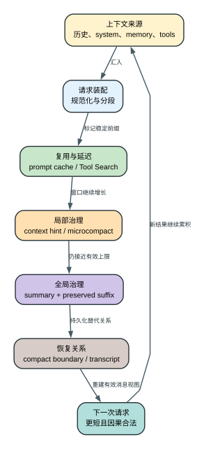

# Claude Code CLI 2.1.235 上下文治理与多层缓存

> 第一次理解 `/compact`，建议先读[图文机制专题](compact-visual-guide.md)。该专题用一个贯穿场景和三张图建立心理模型；本文继续下沉到 system prompt 分段、prompt cache、tool search、context hint、microcompaction、阈值、resume 和成本细节。

这份文档回答的不是“有哪些 context/cache 字段”，而是 Claude Code 在一次真实请求中如何决定：什么内容常驻、什么内容延迟加载、什么内容可以复用、什么时候清理、什么时候总结、总结后如何恢复，以及这些决定怎样影响速度、费用和回答质量。

本文中的函数名是压缩 bundle 的定位符，不是 Anthropic 原始源码 API。主要证据来自 [`reverse/javascript/cli.readable.js`](../reverse/javascript/cli.readable.js)，机器结构来自 [`analysis/source-inventory/`](source-inventory/)。

## 60 秒理解“治理”而不是只记 `/compact`

**读者问题：** 为什么同一个长任务会先出现 cache 命中、工具 schema 延迟加载、旧工具结果变短，最后才 compact；resume 后又为什么仍能接着工作？

**一句话模型：** Claude Code 先装配完整可用上下文，再用 prompt cache 复用稳定前缀、用 Tool Search 延迟 schema、用 microcompaction 清理局部大结果，只有接近有效窗口时才用 Summary 重写历史表示；当前 `/compact`、reactive 和 partial 路径保留合法消息组，cold/full auto 或特定 SDK full compact 才使用无保留后缀的表示，最终都用 boundary 保持恢复关系。



贯穿场景：一个重构任务已经读过大量源码，MCP 又提供数十个工具，最近一次测试输出很长。下一轮请求不会立刻把整段会话总结掉：稳定 system 前缀可被缓存，未用工具 schema 可以 defer，旧 tool result 可以清理；只有有效输入预算继续逼近 compact line 时，客户端才把较早历史替换成 summary、按实际路径保留近期合法消息组并写入 compact boundary。

| 对象 | 治理前 | 转换 | 治理后 | 解决的问题 |
| --- | --- | --- | --- | --- |
| 稳定 system/message 前缀 | 每轮重复出现 | 写入 cache breakpoint 和 TTL 策略 | 逻辑内容仍在，但可被 API cache 复用 | 降低重复前缀成本与首 token 延迟 |
| 工具 schema | 大目录全部可能驻留 | Tool Search/deferred schema 按需发现 | 只装入当前需要的完整定义 | 降低常驻 token，不缓存工具结果 |
| 旧 tool result | 大块输出挤占窗口 | context hint 或本地 microcompaction | 占位信息加近期完整结果 | 腾出窗口，同时保留近期因果 |
| 活跃历史 | 长消息图接近有效上限 | manual/reactive/partial: summary + preserved groups + attachments；cold/full: 无 preserved groups | 更短的有效消息视图 | 继续任务，但承担摘要损失风险 |
| Transcript 关系 | 物理事件仍完整存在 | 写 compact boundary 和保留 UUID | resume 可重建逻辑历史 | 跨进程恢复，不等于 prompt cache |

下面按成功主线解释每层的 owner、阈值和状态变化，再分别处理 cache miss、prompt-too-long、预计算过期和 rapid-refill 等失败路径。

## 先看结论

Claude Code 2.1.235 的上下文治理不是单一的“快满了就 `/compact`”，而是六个互相配合的层次：

1. **装配层**：把固定行为规则、当前机器状态、项目记忆、工具 schema、Agent/skill 描述和历史消息装成请求。
2. **前缀复用层**：把 system prompt 分成稳定前缀和组织/会话动态后缀，在 system 与消息尾部写入 prompt-cache breakpoint。
3. **按需加载层**：大工具目录只先驻留工具名，需要时再把完整 schema 加入上下文。
4. **局部清理层**：旧工具结果超过可节省阈值时，用 context hint 或本地 microcompaction 清掉大块历史输出，但保留最近结果。
5. **全局总结层**：上下文接近有效窗口时预计算或执行 auto-compact，把长历史压成摘要并写入 compact boundary。
6. **持久恢复层**：JSONL transcript、compact boundary、逻辑父节点、memory 文件和预计算摘要 sidecar 共同支持 resume；它们是状态存储，不应和 API prompt cache 混为一谈。

这六层分别解决不同问题。Prompt cache 降低重复前缀的推理成本，但不减少逻辑上下文长度；tool search 和 microcompaction 降低驻留 token；auto-compact 改写历史表示；transcript/memory 负责跨进程延续。

## 一次请求到底装了什么

### 1. 原始会话历史

会话历史不只是 user/assistant 文本。内部消息还包括：

- tool use 与 tool result；
- attachment 和系统提醒；
- permission、hook、background task 等产生的元消息；
- `api_system` 中途系统消息；
- `compact_boundary` 与 compact summary；
- fork/resume 所需的 UUID、parent UUID 和 logical parent。

发 API 前，代码先规范化消息，再决定哪些消息末尾可以放 cache marker。assistant 最后一个 block 如果是 thinking、redacted thinking 或不可缓存 block，不会被当成合法 breakpoint；代码会向前退到最近可缓存消息。证据见可读版 408719-408747、410209-410219。

### 2. System prompt 固定层

`l8()` 负责构建默认 system prompt。它包含的不是一段固定字符串，而是一组有条件的 section，例如：

- communication、action caution、task continuity；
- session guidance、tool 参数规则、语言和输出风格；
- memory、环境信息、scratchpad；
- context management、brief、focus mode；
- Agent/autonomy/deferred-tool 规则；
- Harness、工具权限和 hook 行为。

不同模型、provider、permission mode、工具集合、feature gate 和运行模式会改变 section 集合。代码通过 `q2(section-key, builder)` 这类结构生成 section，因此 system prompt 本身也是版本对比的重要产品表面，而不是一个常量。证据见 408055-408085。

### 3. 机器动态层

下列内容天然容易变化：

- cwd、日期和环境信息；
- memory path 与加载到的 `CLAUDE.md`/rules；
- Git status；
- MCP server 当前连接状态；
- 本轮动态 context reminder。

CLI 选项 `--exclude-dynamic-system-prompt-sections` 会把 cwd、env info、memory paths、Git status 从 system prompt 移到第一条 user message。它只对默认 system prompt 生效，显式 `--system-prompt` 时忽略。目的不是少发这些内容，而是避免每台机器、每个目录都改变 system prompt 的稳定前缀，从而提高跨用户 prompt-cache 复用。证据见 603768 附近的 CLI 描述和 597472-597477 的装配路径。

这也解释了 2.1.235 的 LSP 修复：LSP 连接状态属于动态机器状态，不应该让长期稳定的 prompt 前缀整体失效。

### 4. User context 与 system context

`k7(session)` 和 `O2(session)` 分别装入用户/项目上下文及系统动态上下文。`Ekm()` 还会计算实际上下文构成并记录 `tengu_context_size`：

| 字段 | 含义 |
| --- | --- |
| `git_status_size` | Git 状态文本长度，不是 token 数 |
| `claude_md_size` | 已装入 CLAUDE.md/rules 文本长度 |
| `total_context_size` | 上述两项字符长度之和 |
| `project_file_count_rounded` | 项目文件数的隐私化/取整结果 |
| `mcp_tools_count` | MCP 工具数量 |
| `mcp_servers_count` | 从 MCP 工具名解析出的 server 数量 |
| `mcp_tools_tokens` | MCP schema 的估算 token |
| `non_mcp_tools_count` | 内置及非 MCP 工具数量 |
| `non_mcp_tools_tokens` | 非 MCP schema 的估算 token |

这里故意同时记录“字符”和“token”两类量。Git/CLAUDE.md 是文本体积；工具是序列化 schema 的 token 成本。证据见 408431-408466。

### 5. 工具 schema

工具定义至少包含 `name`、`description`、`input_schema`，并可带 `strict`、`eager_input_streaming`、`defer_loading`、`cache_control`。`$Hi()` 会按模型、provider、工具类型、JSON schema 和若干运行状态构造一个稳定 key，并把生成结果存进进程内 `K5o` 缓存。

因此“工具成本”有两部分：

- 生成工具描述/schema 的本地 CPU 成本；
- 把完整 schema 放进模型上下文的 token 成本。

进程缓存只解决第一部分，tool search 才解决第二部分。

## 多层缓存逐层解释

“多层缓存”在这个版本里不能只写成一句营销词。下面每层缓存的对象、命中、失效和成本都不同。

| 层 | 缓存对象 | 命中条件 | 主要失效条件 | 用户影响 |
| --- | --- | --- | --- | --- |
| 进程内工具 schema cache | 工具 name/description/input schema 的构造结果 | 构造 key 中的工具、模型、provider、schema 和模式一致 | 全局 invalidate、进程退出、任一 key 输入变化 | 减少重复本地构造，不减少 API token |
| 进程内 model config cache | `models.retrieve()` 返回的模型配置 promise/result | 规范化模型 ID 相同 | 进程退出或 provider cache 重建 | 减少配置网络等待，不等于模型响应 cache |
| API system-prefix cache | 稳定 system prompt block | 同模型/provider/beta 下，breakpoint 前渲染前缀一致且 TTL 未过期 | 稳定块内容/顺序变化、模型/beta/provider 变化、TTL 到期、显式关闭 | 直接降低重复输入费用和 TTFT |
| API message-prefix cache | 历史消息直到 marker 的前缀 | marker 前消息序列可复用 | 新 breakpoint 前的消息变化、fork 位置变化、`skipCacheWrite`、TTL 到期 | 长会话每轮不用全价重算全部历史 |
| 预计算 compact cache | 已生成但尚未交换进主历史的 summary/boundary | session、agent、model、CLI version、边界 UUID 和时效校验通过 | 模型/版本/session 不一致、边界缺失、超时、内容继续演化不兼容 | 把等待从“满了以后”前移到用户仍在工作时 |
| 认证/实验等依赖 cache | OAuth token、GrowthBook、本地依赖缓存 | 各依赖自己的 key/expiry | token expiry、配置刷新、登出等 | 属于基础设施，不应算作上下文 cache |

### 进程内工具 schema cache

`$Hi()` 的 cache key 包含 provider、模型特性、工具名、输入 JSON schema 以及是否启用特定行为。命中后直接复用已经构造的 schema 对象；`K5o.invalidateAll()` 会整体清空。

它不会让 API 少收 token。相同 schema 最终仍可能被序列化进每次请求，只是 Claude Code 不必重复生成描述和转换 schema。

### 进程内模型配置 cache

`Hkm(model)` 先查 `providerCache.modelConfigs`，未命中才发 `models.retrieve()`，并把进行中的 promise 放入 map。因此并发请求同一模型时也能合并等待。请求有 5 秒超时，失败会记录 `timeout`、`not_found`、`http_<status>` 或 `connection`，结果为 `null` 时走本地 baked catalog/既有逻辑。证据见 408665-408696。

### System prompt 分段缓存

`Jml()` 把 system prompt 切成最多四类 block：

1. billing header：`cacheScope=null`，不写 cache control；
2. identity/特殊组织块：根据分支为 null 或 org；
3. boundary 之前的稳定块：`cacheScope=global`；
4. boundary 之后的动态块：`cacheScope=org`。

`YSe()` 最终生成：

```json
{"type":"ephemeral","ttl":"1h","scope":"global"}
```

只有内部值为 `global` 时，serializer 才真的在 wire 上写出 `scope:"global"`。内部 `cacheScope:"org"` 在请求里省略 `scope` 字段；本版只能证明客户端把它当作非 global 分支，不能从省略值推断服务端最终采用哪种组织、账户或默认作用域。没有 boundary、关闭相关 beta、provider 不符合条件时，代码会退回这个非 global/无 marker 分支。证据见 408355-408412、409028-409043、410218-410219；省略字段后的服务端解释属于 `Boundary`。

工具列表也会影响 system prompt 的 global cache 策略。如果存在不能安全放进全局前缀的 MCP schema，代码可把 `skipGlobalCacheForSystemPrompt` 打开，避免把机器/组织特定工具描述纳入 global 前缀。

### 消息 breakpoint 与 fork pin

`$km()` 从消息尾部寻找可缓存位置：

- 正常情况标记最后一个合法消息；
- `skipCacheWrite=true` 时向前退一步，避免把本轮尾部写入 cache；
- 尾部是合法 `api_system` 时可把 marker 放到 system 尾部；
- fork 有明确 UUID 时，可额外 pin fork point；
- fork 没有 UUID 且允许 pin 时，可再标记前一个稳定点；
- assistant 尾部如果是 thinking/不可缓存 block，会继续向前找。

`CpT()` 把 marker 写到 user、assistant 或 `api_system` 的最后一个可缓存 content block，并记录：

| 字段 | 含义 |
| --- | --- |
| `totalMessageCount` | 参与本次 API 转换的内部消息数 |
| `cachingEnabled` | 本模型/本请求是否启用 prompt cache |
| `skipCacheWrite` | 本轮是否禁止在尾部新建 cache |
| `forkPointPinned` | 是否额外保住 fork point breakpoint |
| `markerCount` | 实际插入的 breakpoint 数 |

这套逻辑的用户价值是：主线继续增长时，常用尾部前缀可以滚动复用；fork 后仍能复用分叉前的共同历史，而不是从第一条消息重新付费。

### 5 分钟与 1 小时 TTL

默认 `cache_control` 不写 `ttl`，即 5 分钟。`mHe(querySource)` 决定是否使用 1 小时：

优先级如下：

1. `FORCE_PROMPT_CACHING_5M=true`：强制 5 分钟；
2. `ENABLE_PROMPT_CACHING_1H=true`：强制 1 小时；
3. Bedrock 的专用 1h 开关：对 Bedrock 强制 1 小时；
4. 非一方订阅路径或正在使用 overage：不自动启用 1 小时；
5. 其余情况按 query source allowlist，默认包含 `repl_main_thread*`、`sdk`、`auto_mode`、`memdir_relevance`。

全局关闭和分模型关闭由 `WCi()` 处理：`DISABLE_PROMPT_CACHING` 以及 Haiku/Sonnet/Opus/Fable/Mythos 家族开关都能阻止 marker 写入。

### 成本算例：100k Sonnet 4.6 稳定前缀

bundle 的 baked catalog 给 Sonnet 4.6 的价格是每百万 token：普通输入 `$3`、5m cache write `$3.75`、1h cache write `$6`、cache read `$0.30`。

假设稳定前缀是 100k token：

| 情况 | 首次 | 后续每次 | 两次请求合计 | 三次请求合计 |
| --- | ---: | ---: | ---: | ---: |
| 不缓存 | $0.300 | $0.300 | $0.600 | $0.900 |
| 5m cache | $0.375 | $0.030 | $0.405 | $0.435 |
| 1h cache | $0.600 | $0.030 | $0.630 | $0.660 |

因此 5m cache 只要发生一次命中就已经比两次全价输入便宜。1h cache 的首次写入更贵，需要至少两次后续命中才开始省钱，但它能覆盖更长的思考、工具执行和离开终端时间。

实际账单还包含动态 user 消息、tool result、输出 token、web search 和 fast/speed 等项目。验证命中应看响应 usage：

- `input_tokens`：本次全价处理的未缓存输入；
- `cache_creation_input_tokens`：本次新写入 cache 的输入；
- `cache_read_input_tokens`：本次从 cache 读取的输入；
- `cache_creation.ephemeral_5m_input_tokens` / `ephemeral_1h_input_tokens`：写入 token 的 TTL 拆分。

当前总 prompt 量不是只看 `input_tokens`，而是三项输入之和。

## Tool Search：延迟 schema，而不是“缓存工具”

### 为什么需要它

每个 MCP 工具完整驻留时都要发送 name、description 和 input schema。几十到上百个工具会在用户还没调用它们之前就占满大量上下文，并且工具列表变化还会破坏 prompt prefix。

Tool Search 的做法是：

1. 请求中把候选工具标记为 `defer_loading:true`；
2. 模型初始只知道名字/延迟工具提示，不装入完整 schema；
3. Claude 通过 `ToolSearch` 选择需要的工具；
4. 被发现工具的完整 schema 追加到后续上下文；
5. MCP 断开/重连通过 `deferred_tools_delta` 通知可用性变化。

这不是把 schema 缓存在 API 外面，而是改变完整 schema 进入模型上下文的时机。未发现工具不常驻完整 description/input schema，但它们的名字仍会出现在 deferred-tool reminder 中，`ToolSearch` 自身也要携带 prompt 和 schema；因此收益是显著减少未使用工具的 schema token，而不是降到零 token。

### 启用与回退

`ENABLE_TOOL_SEARCH` 支持布尔、`force`、`auto` 和 `auto:N` 形态。auto 模式按模型窗口的一定比例换算字符阈值，并估算可延迟工具 schema 的体积，超过阈值才启用。

代码会在以下情况关闭：

- 模型不支持 `tool_reference`；
- 旧于支持代际的 Vertex 模型会拒绝 tool-search beta；
- Foundry deployment capability 不支持；
- `ToolSearch` 本身被 disallowed；
- 没有可延迟工具且没有 pending MCP server；
- 非一方自定义 base URL 未显式声明代理支持。

启用后，请求带 tool-search beta；Bedrock/Vertex/Mantle/Gateway 与一方使用的 beta 名可能不同。证据见 114268-114368、370198-370225、409385-409409。

## Context hint 与 microcompaction

### 两者的关系

Context hint 是服务端协作协议；microcompaction 是本地实际清理动作。服务端可以提示客户端清理特定工具族的旧结果，但客户端必须能在 beta 不支持、服务繁忙或流式错误时自行回退。

controller 只在以下条件成立时创建：

- 含一方 beta；
- query source 以 `repl_main_thread` 开头；
- `tengu_hazel_osprey` gate 激活。

构建请求前，客户端先估算“清理除最近 5 个之外的工具结果”能节省多少 token。只有潜在节省达到 20,000 token 才发送：

```json
{"context_hint":{"enabled":true,"target_tokens_saved":75000}}
```

`target_tokens_saved` 默认目标为 75,000，但可由 feature 配置调整。

### 本地清理规则

`qUa()` 只从内置候选工具集合产生的 tool-use ID 中收集可清理 tool result，并默认保留最近 5 个相关结果；它不是“清空所有工具输出”的通用遍历器。以下内容不重复处理：

- 已经是 `[Old tool result content cleared]`；
- 已经是 `<persisted-output>...`；
- 没达到 20k token 总节省阈值。

`Jof()` 对旧结果逐个调用 persistence callback。保存成功后，tool result 被替换成包含文件路径的短提示；失败或不适合保存时替换为 `[Old tool result content cleared]`。工具调用本身、tool use ID 和最近结果仍保留，所以模型知道过去调用过什么，但不再携带大段旧输出。改写对象是后续请求使用的 active message view；物理 transcript 中较早的原事件不因此被证明已经删除。

清理结果包括：

- `messages`：改写后的消息；
- `tokensSaved`：估算节省 token；
- `clearedIds`：被清理的 tool use ID；
- `clearedContent`：ID 到持久化提示/占位符的映射。

证据见 263484-263519、408922-408970。

### 错误回退状态机

| API 结果 | 客户端动作 | 历史是否本地清理 |
| --- | --- | --- |
| hint 被接受 | 使用服务端协作结果继续 | 由协议结果决定 |
| HTTP 422/424 | 关闭 hint，执行本地 microcompaction 后重试/继续 | 是 |
| HTTP 400，beta/header 不支持 | 关闭 hint，保留原消息继续 | 否 |
| HTTP 409 | 关闭 hint，保留原消息继续 | 否 |
| HTTP 529 | 关闭 hint，保留原消息继续 | 否 |
| 流式 invalid request | 标记 stream fallback，再执行本地 microcompaction | 是 |
| 其他错误 | 不由 context-hint controller 吞掉 | 否 |

这个设计避免了一个危险失败模式：服务端 hint 不可用时，CLI 不会把“没有清理”误报为“清理成功”，也不会对所有 API 错误擅自改写历史。

## Auto-compact：阈值不是一个数字

### 总开关

`DISABLE_COMPACT` 或 `DISABLE_AUTO_COMPACT` 任一为真，auto-compact 关闭。否则读取 `autoCompactEnabled`，默认值是 true。显式在 user settings 关闭时，UI 可以区分“用户关闭”与其他来源关闭。

### 有效窗口优先级

`jG(model, settingsWindow)` 依次选择：

1. `CLAUDE_CODE_AUTO_COMPACT_WINDOW`；
2. settings 中 `autoCompactWindow`；
3. client data 下发窗口；
4. experiment 窗口；
5. 特定模型默认窗口；
6. baked model/default/unknown-model 规则；
7. 最后回到模型最大 context window。

所有显式窗口必须在 100k 到 1M 之间，并最终被模型最大窗口封顶。`/autocompact` 接受 `auto`、`500k`、`200000` 或 `200` 这类写法；环境变量优先时，命令会明确拒绝覆盖并提示先 unset。

### 四条线

确定 window 后，代码还会预留输出空间：

```text
input_budget = window - min(max_output_tokens, 20k)
compact_line = input_budget - 13k
precompute_line = min(input_budget - input_budget * precompute_fraction,
                      compact_line)
warn_line = compact_line - 20k
blocked_line = model_input_ceiling - 3k
```

默认 precompute fraction 是 20%，可按窗口和 REPL/SDK 使用远程表调整。`CLAUDE_AUTOCOMPACT_PCT_OVERRIDE` 和 blocking override 属于测试/覆盖入口。

### 200k 模型算例

以 200k context、输出预留 20k 为例：

| 状态 | token 线 | 行为 |
| --- | ---: | --- |
| precompute | 144k | 后台提前生成摘要，用户继续工作 |
| warn | 147k | UI 开始提示上下文余量 |
| compact | 167k | 触发 reactive auto-compact |
| blocked | 177k | 不再允许继续堆输入，必须先腾空间 |

所以“200k 窗口”不表示会等到 200k 才总结。输出预算、API 安全余量、预计算等待和最终阻塞都要提前占位。

`blocked_line` 与前三条线的来源必须分开理解。假设同一个 200k 模型被 `autoCompactWindow=140k` 限制，输出仍预留 20k：compact/precompute/warn 都改用 120k 的 effective input budget 计算，但 blocked 仍由模型输入 ceiling 180k 再减 3k，保持 177k。配置更小的 auto-compact window 会让总结更早发生，不会把底层模型硬阻塞线一起降到 117k。

### 预计算 compact

预计算结果不是立即替换主历史。它先写进 session precompute 状态，并可持久化 `precompact.json` sidecar。sidecar 格式版本为 2，单文件上限 8,000,000 bytes；adapter 可用时写 Storage v5 sidecar key，否则写既有文件路径。复用时会校验：

- format version；
- session ID 和 main agent key；
- model 与 CLI version；
- 创建时间和 ready duration；
- `precomputedAtUuid` 是否仍存在于当前历史；
- pre-compact token 与 hook 结果是否可接受。

具体拒绝线包括：创建超过 604,800,000ms（7 天）、当前历史比预计算点增长超过 150,000 token、缩减超过当时 token 的一半、boundary UUID 或任一 preserve UUID 缺失。通过后，达到真正 compact line 时直接 swap 已准备摘要，并把预计算之后的新消息作为 `messagesSince` 追加保留。校验失败会删除 sidecar、记录具体原因并重新走普通总结，不把旧 summary 硬塞进新历史。连续 3 次可计数失败后不再继续 re-arm。证据见 262324-262680。

#### Main sidecar 与跨 Agent 借用

持久 payload 的 schema 明确要求 `agentKey === "main"`，所以磁盘/Storage v5 sidecar 不是通用子 Agent 持久缓存。进程内 precompute registry 才按 `main` 或 agent ID 分槽。fork/subagent 的 `toolUseContext.precomputeSourceKey` 可以指定借用槽：

- 借用项仍是 pending 时，当前 turn 等待它 settled；等待期间 turn abort 会返回 aborted，但保留源 entry；
- 借用 ready 项成功 swap 后，源 entry 不被移除，原 owner 之后仍可消费；
- 没有 borrow key 时读取自己的槽，读取后无论 ready/failed 都 remove，并在属于当前 session 时排队删除 sidecar；
- 借用结果的 boundary UUID 不在当前消息图时只放弃本次应用，不错误消费源摘要。

因此 precomputed compact 的状态不是“谁先读谁拿走”的全局 Promise，而是 owner 槽 + 可借用引用。它减少 fork/subagent 重复总结的延迟和 token，但要求当前消息图仍包含同一个 `precomputedAtUuid`，否则不能跨分支硬套摘要。证据见 262425、262487-262518、262601-262654。

### 四条 compact 路径不能混写

| 路径 | 旧消息内容与因果关系怎样保留 | 证据锚点 |
| --- | --- | --- |
| current manual `/compact` | 至少保留最后 1 个合法 group；必要时增大保留量 | 331301-331367、232845-232876、262247-262294 |
| partial/message-selector | 保留选择器另一侧 `m`，写 preserved UUID | 263048-263087 |
| reactive prompt-too-long | 按合法 group 保留 suffix | 262247-262294 |
| precomputed swap | 保留预计算的 preserve UUID 与其后 `messagesSince` | 262425-262680 |
| cold/full auto 或特定 SDK full compact | 无，返回 `messagesToKeep: []` | 263020-263036、263375-263414、290267 |

这里的“保留”不是对象逐字段不变。`Smi()` 会对保留区执行 `messagesToPreserve.map(tNt)`：非 assistant 消息直接复用，assistant 消息保留内容、UUID 和工具因果关系，但把 `input_tokens`、`output_tokens`、`cache_creation_input_tokens`、`cache_read_input_tokens` 清零。可直接确认的结果是 rebuilt context 不再携带这些字段的旧计数；代码没有在这里给出更高层计费意图。证据见 232865、232883-232885。

因此“compact 后固定保留最后 N 条消息”仍是错误模型：手动/reactive 是按合法 group 和 token 缺口选择，partial 按选择器，precomputed 还合并 `messagesSince`，cold/full 才没有后缀。连续性来自 Summary、条件性 preserved messages、重新生成的 attachments/hooks 和后续输入共同组成的表示。

### PreCompact hook 和失败

实际 compact 前先运行 PreCompact hook。hook 可以：

- 返回给用户显示的信息；
- 注入新的总结指令；
- 明确阻止 compact。

总结 API 失败时会记录 trigger、耗时、preTokens 和错误，不创建成功 boundary。UI 会收到 compact failed 状态；如果上下文继续增长到 blocked line，用户必须重试 compact、清理内容或开启自动压缩，不能把失败摘要当成有效历史。

## API context management 的真实状态

bundle 中存在：

- 环境变量 `USE_API_CONTEXT_MANAGEMENT`；
- beta `context-management-2025-06-27`；
- 请求字段 `context_management`；
- 模型 catalog 的 `context_management` capability；
- thinking 清理策略 `clear_thinking_20251015`。

但 2.1.235 的 beta 构造分支是 `K.USE_API_CONTEXT_MANAGEMENT && false`。这意味着**单独设置该环境变量不能启用这条路径**。当前可达启用条件来自模型/远程能力判断 `AW_(model)`，并且 provider 还要支持对应 beta。请求只有在 beta 已加入、模型支持且存在策略时才写 `context_management`。

这是字段清单无法单独告诉读者的典型例子：字段“存在”不等于开关“可用”，必须检查调用分支是否可达。

## Compact boundary、JSONL 和 resume

### Boundary 保存什么

compact 成功后写入 `system/compact_boundary`。wire/JSONL 字段包括：

| 字段 | 含义 |
| --- | --- |
| `trigger` | `auto`、manual 等触发来源 |
| `pre_tokens` | 总结前估算 token |
| `post_tokens` | 总结后估算 token |
| `cumulative_dropped_tokens` | 多次 compact 累计丢弃的原始 token |
| `duration_ms` | compact 耗时 |
| `user_context` | 总结时需要保留的用户上下文 |
| `messages_summarized` | 被摘要的消息数 |
| `precomputed` | 是否来自预计算结果 |
| `pre_compact_discovered_tools` | compact 前已发现的延迟工具 |
| `preserved_segment` | 保留链段的 head/anchor/tail UUID |
| `preserved_messages` | 保留消息 anchor 与 UUID 列表 |
| `logical_parent_uuid` | 压缩后逻辑父节点，用于恢复链 |

`_k(messages)` 在后续处理时只取最后一个 compact boundary 之后的有效表示，避免把已被 summary 取代的整段历史再次发送。

### Resume 如何修链

resume 先逐行解析 JSONL，只接收有 UUID 的 user、assistant、progress、system、attachment。发现 compact boundary 后：

- `preserved_messages` 模式按 UUID 列表重接 parent chain；
- `preserved_segment` 模式把 head 接到 anchor，并把原 anchor 的其他后继接到 tail；
- 最后重新找叶节点和会话分支。

因此 compact 不是简单“删掉前 N 行”。它保留一张可恢复的逻辑消息图：当前 manual/reactive/partial/precomputed 把 preserved messages 接入 summary/boundary 之后；cold/full compact 只建立新的 summary/boundary 表示。证据见 323188-323443 和 211993-212001。

## Transcript、memory 与 cache 的边界

| 机制 | 是否发送给模型 | 生命周期 | 目的 |
| --- | --- | --- | --- |
| Prompt cache | API 端复用前缀，不改变逻辑内容 | 5m/1h TTL | 降成本、降 prefill 延迟 |
| Process memoization | 通常不直接发送 | 当前 CLI 进程 | 降本地重复计算/请求 |
| Tool deferral | 只发送名字/提示，schema 按需追加 | 当前会话/连接 | 降常驻上下文 |
| Microcompaction | 替换候选工具族的旧 tool result 内容 | 当前 active message view；原 transcript 事件不被证明已删除 | 局部释放 token |
| Auto/manual compact | 用 summary + boundary 替代长历史 | transcript 可恢复 | 全局释放 token |
| JSONL transcript | resume 时重新装载 | 默认保留 30 天，可配置 | 会话持久化与审计 |
| Auto-memory | 相关内容会在未来装入 context | 跨会话文件 | 保存长期项目知识 |

`cleanupPeriodDays` 默认 30 天，只控制 transcript 自动清理；`--no-session-persistence` 才是完全不写 transcript。`autoMemoryEnabled=false` 会阻止读写 auto-memory；`autoMemoryDirectory` 的 project settings 值因安全原因会被忽略；`autoDreamEnabled` 控制后台 memory consolidation。

把这些都叫“缓存”会掩盖真实行为。例如删除 prompt cache 不会删除 transcript，清理 transcript 也不会让已经发送的 API cache 立即失效，关闭 auto-memory 更不会阻止当前会话历史存在。

## 用户如何判断问题在哪一层

### 每轮都很贵，但上下文不大

先看 usage：

- `cache_read_input_tokens` 长期为 0：前缀没有命中；
- `cache_creation_input_tokens` 每轮很高：稳定前缀一直被改写或 breakpoint 在滚动重建；
- `input_tokens` 高：动态消息、tool result 或 schema 本身太大。

再检查模型、provider、beta、system prompt、工具列表和动态机器段是否每轮变化。

### 会话没多长，context 却很满

看 `/context` 类统计的组成：

- MCP tools 高：启用/修复 tool search，或减少 always-load 工具；
- memory files 高：把全局 CLAUDE.md 的项目专用内容下沉到项目/子目录；
- skills 高：description 会受 1536 字符单项上限和 1% context 字符预算控制；
- messages 中 tool result 高：需要 microcompaction 或更短工具输出。

### Resume 后突然产生大量 token

检查：

- 手工把 `autoCompactWindow` 调得过高；
- 上次离开前 cache TTL 已过期；
- resume 改了模型/provider/beta；
- transcript 没有近期 compact boundary；
- 预计算 summary 因版本、模型或边界变化不能 rehydrate。

`/autocompact` 本身会提示：覆盖 auto 可能让长会话 resume 产生高 token 消耗。

### Auto-compact 没触发

按顺序检查：

1. `DISABLE_COMPACT` / `DISABLE_AUTO_COMPACT`；
2. `autoCompactEnabled`；
3. worker 下发的 `autocompact_state.enabled/enforced`；
4. 当前 token 是否真的达到 effective threshold；
5. PreCompact hook 是否 block；
6. 当前 query source 是否属于排除类型；
7. 上次 compact 是否失败。

thin client 会采用 worker 的真实状态：`enabled`、`effective_window`、`threshold`、`enforced`、`source`。客户端本地显示不能覆盖一个 `enforced=true` 的 worker 决策。

## 精确请求形状：缓存不是只存在于源码常量

[runtime-controls.json](runtime-probes/runtime-controls.json) 捕获了精确 2.1.235 二进制发出的首个 Messages 请求。受控输入只启用 `Read`，请求仍出现 3 个 `cache_control` 对象，携带 `anthropic-version`、beta header 和完整 Read schema。认证使用 `Authorization: Bearer $TOKEN`，没有 `x-api-key`。

这条 probe 证明了三件事：缓存 marker 真正进入 wire body；tool schema 与 system/message cache breakpoint 同时参与本轮请求成本；credential source 会改变 header 形状。它没有证明服务端命中率或账单结果，后者仍需响应 usage 中的 `cache_read_input_tokens` / `cache_creation_input_tokens` 验证。

`probe.prompt-cache-disable` 对同类请求设置 `DISABLE_PROMPT_CACHING=1`。默认请求的 `cacheControlCount=3`，禁用后的请求为 0，两次命令均成功。这把“开关被读取”升级为“请求体确实改变”；它仍不等于服务端返回 cache miss，因为禁用后客户端根本不再声明这些 breakpoint。

`probe.manual-compaction-boundary` 则验证另一条完全不同的路径：`/compact` 输出流出现 `system:compact_boundary`，`trigger=manual`、`preTokens=104`。随后 fork 请求保留生成的 compact summary 和当前 prompt，但不再包含 compact 前 prompt、旧 tool-use ID 和旧 assistant result。这里删除的是送模结构历史，不是删除磁盘上一切事件，也不是清空 memory。

当前官方 [Troubleshooting](https://code.claude.com/docs/en/troubleshooting) 还解释了 autocompact thrashing：如果 compact 后大文件或 tool output 数次立即重新填满窗口，CLI 会停止重试以避免继续浪费 API 调用。这条 `Public` 主张登记为 `public.autocompact-thrashing`；2.1.235 的具体计数器和终止分支仍以 bundle 静态证据为准，不能从当前文档倒推所有旧版本阈值。

## 本版本可观测字段

和上下文治理直接相关的事件至少包括：

- `tengu_context_size`：常驻上下文构成；
- `tengu_api_cache_breakpoints`：marker 决策；
- `tengu_sysprompt_boundary_found`：稳定/动态 system 分段；
- `tengu_tool_search_mode_decision`：tool search 开关原因；
- `tengu_context_hint_reject`：hint 回退与节省量；
- `tengu_time_based_microcompact`：清理数量和 token；
- `tengu_reactive_compact_triggered/succeeded/failed`：全局压缩生命周期；
- `tengu_precomputed_compact_*`：预计算、持久化和 rehydrate；
- `tengu_remote_autocompact_state_adopted`：worker 状态同步；
- OTEL `compaction` event/span：管理员自建观测出口。

事件字段如何阅读见 [`inventory-field-guide.md`](inventory-field-guide.md)，传输、默认开关和隐私控制见 [`telemetry.md`](telemetry.md)。

## 证据边界

本文能证明 2.1.235 客户端 bundle 中的装配、门控、字段、请求构造、回退和本地持久化路径。它不能证明：

- Anthropic 服务端实际 cache key 的未发布内部实现；
- 远程 feature/client data 在某个账号此刻返回什么值；
- 服务端 context hint/compact 的内部算法；
- 构建前已删除的源码、注释和原始模块名。

因此文中把“客户端会发送什么、何时发送、收到错误后怎样处理”写成确定事实，把服务端未随产物发布的部分保留为边界。

本专题直接使用的运行主张包括 `probe.request-cache-shape`、`probe.prompt-cache-disable` 和 `probe.manual-compaction-boundary`；公开主张包括 `public.context-auto-compaction`、`public.cache-invalidation`、`public.autocompact-thrashing`。逐条命令、输入、literal output 与 exit status 见 [精确二进制运行证据指南](runtime-probe-index.md)。
