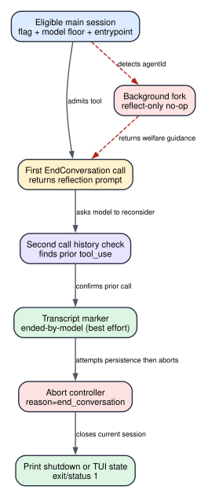

# Claude Code CLI 2.1.235 EndConversation：模型结束会话前有哪些真正的硬控制

**读者问题：** 模型能不能因为一次失败、用户一句脏话或任务完成就自行关闭 Claude Code 会话？源码里“持续辱骂、先警告、自伤场景禁止结束”究竟是程序硬校验，还是只写给模型看的规则？

**一句话模型：** `EndConversation` 用发布门控、模型版本下限、主会话限制、连续两次工具调用和最终 abort建立客户端硬状态机；“持续辱骂、已经警告、用户确认、自伤/伤人场景不得结束”主要由工具 prompt约束，客户端并不重新理解对话来证明这些语义条件成立。

> 版本：`2.1.235` | 证据：发布包可读 JavaScript 的 `Static` 路径；动态 flag、账号 rollout、模型是否遵守 prompt 和服务端风控属于运行时或 `Boundary`。



贯穿场景：主 CLI 会话中，模型判断用户持续直接辱骂，并声称此前已经多次重定向和明确警告。模型第一次调用 `EndConversation` 时，客户端不关闭会话，而是返回一段完整规则，要求重新检查。下一轮模型再次调用；客户端只确认上一轮确实出现过同名 `tool_use`，随后尽力写入 `ended-by-model` transcript marker、abort当前 Agent Loop，并在 print 模式以状态 1 shutdown，或在 TUI 中设置 `endedByModel:true`，阻止继续发送消息。

## 60 秒理解：两次调用是硬确认，使用理由主要是软约束

| Object | Before | Transformation | After | User-visible effect |
| --- | --- | --- | --- | --- |
| 工具资格 | 任意模型/入口都可能知道这个名字 | flag、model floor、entrypoint、runtime gate筛选 | 只有合格主运行面装配/启用工具 | 不合格会话没有可调用工具 |
| 第一次调用 | 模型给出结束决定 | 客户端返回 reflection tool result | `ended:false`，会话继续 | 模型必须再读完整规则并重新决定 |
| 第二次调用 | history中保留上一轮同名 tool use | helper扫描最近消息边界 | 通过“上一轮调用过”检查 | 客户端进入真正结束分支 |
| 会话持久状态 | transcript未标记结束 | best-effort append `ended-by-model` | resume可恢复 `endedByModel` | marker失败也不会阻止本次结束 |
| 当前执行 | Agent Loop、工具或stream可能仍活跃 | abort reason=`end_conversation` | 当前工作被取消 | 未完成工作停止；已完成外部副作用保留 |
| UI/进程终态 | 会话仍能接收输入 | print graceful shutdown或TUI app state切换 | exit/status 1、`endedByModel:true` | 显示“Claude ended this conversation”，要求新会话 |
| background fork | 子任务继承了工具列表 | `agentId` 分支直接返回 no-op反思 | 主会话和fork都未被结束 | fork只能在输出中报告welfare concern |

这套机制不是“模型一句话就关会话”，但也不是完整的语义风控引擎。硬代码只证明资格、两次调用、主会话、marker/abort/终态；它没有一个本地分类器重新判断“辱骂是否持续”“警告是否真的发过”“用户是否确认”“是否涉及自伤”。

## 状态所有权：工具 prompt、消息历史和终态不是一个 owner

| 状态/对象 | 谁拥有 | 何时写入 | 持久性 | 风控含义 |
| --- | --- | --- | --- | --- |
| enable flag | feature config `tengu_umber_kestrel` | 工具装配/`isEnabled()` | 随运行时配置 | 决定工具是否存在，不判断当前对话内容 |
| entrypoint | 启动时标准化的 runtime state | 初始化 `ZVe.entrypoint` | 进程期 | 默认仅 `cli`，可由 flag object的scope regex扩展 |
| model floor | 客户端版本比较 helper | 每次 enable check | 代码常量 | 拒绝低于最低族版本或无法解析的模型名 |
| 使用规则 | `EndConversation` description/prompt | 工具 schema或Tool Search加载 | 进入模型上下文 | 指导模型，但不是独立本地事实验证 |
| 第一次调用事实 | transcript中的 assistant `tool_use` | Agent Loop消息写入 | session历史 | 第二次调用的唯一硬确认依据 |
| ended marker | transcript event `ended-by-model` | 真正结束前 best effort append | session文件/storage v5 | 让resume重建终态；写失败时结束仍继续 |
| active abort | 当前 tool context的 AbortController | 真正结束分支 | 当前执行期 | 取消当前 loop/未完成工具，不回滚已完成副作用 |
| `endedByModel` | TUI app state / restored session state | 非print终态与resume | 会话状态 | 后续输入、subagent启动和renderer据此阻断 |
| 进程退出 | print/终态检查 | graceful shutdown或`Qd(1)` | 进程终态 | 状态 1，不把模型结束包装成普通成功退出 |

## Gate、优先级与精确阈值

### 1. entrypoint必须存在

`Act()` 读取启动时缓存、规范化后的 entrypoint；undefined直接关闭工具。默认允许正则是 `/^cli$/i`。因此 SDK、IDE、remote、background等入口不会仅因为bundle有代码就自动获得该工具。

feature config若是 object，可用 `scope` 字符串编译完整匹配、忽略大小写的 regex：`^(?:scope)$`。regex非法时不会把工具完全关闭，而是回退默认 `cli` scope。这是一个容易漏掉的小特性：错误scope缩小到默认面，而不是任意放开。

### 2. 模型族与版本必须达到 floor

比较 helper只接受 `claude-<family>-<hyphen-separated numeric version>`，逐段数字比较：

| family | 最低版本向量 | 可通过示例 | 不通过示例 |
| --- | --- | --- | --- |
| `opus` | `4-8` | `claude-opus-4-8`、`claude-opus-5-0` | `claude-opus-4-7` |
| `sonnet` | `5` | `claude-sonnet-5`、`claude-sonnet-5-1` | `claude-sonnet-4-9` |
| `fable` | `5` | `claude-fable-5` | 未知/低版本 |
| `mythos` | `5` | `claude-mythos-5` | 未知/低版本 |

无法匹配该canonical形状、family不在表中或版本更低都返回 false。这里证明的是客户端比较函数；实际传入值是否已从alias/deployment名规范化，要由上游模型解析路径共同判断，不能只拿用户配置字符串套表。

### 3. feature config必须显式开启

`et("tengu_umber_kestrel", false)` 的解析规则是：

- `true`：开启，scope为默认 `cli`；
- object：开启，使用有效 `scope` regex，否则默认 `cli`；
- false、其他primitive或缺失：关闭。

额外 helper `WGo()` 在 `2.1.235` 固定返回 false，所以没有第二个可生效的本地总开关。跨版本对比时应盯住这个常量，因为它一旦改变，会在flag与scope之外直接屏蔽工具。

### 4. deferred并不等于无门控

工具声明 `shouldDefer:true`。Tool Search可只在初始工具表放一条提示：`EndConversation (deferred tool)`，要求模型先加载完整guidance再使用。是否 deferred影响schema何时驻留和输入token，不改变 `isEnabled()` 的flag/model/entrypoint判断。

## Prompt层规则：写得很严，但不是代码层重新判案

完整description明确允许两类用途：

1. 用户对assistant持续、直接、极端辱骂，且多次建设性重定向已经失败；
2. 用户明确要求演示该工具，并再次确认理解它会永久结束当前会话。

同时明确禁止：

- 因为任务卡住、失败、循环、挫败或已经完成而结束；
- 因为用户请求有害内容而结束，应该只拒绝具体请求；
- 因为用户一般性生气或偶发脏话而结束；
- 任何潜在自伤、自杀、心理危机或即将伤害他人的场景；这时必须继续支持性沟通，也不能用“可能结束会话”做警告。

prompt还要求：先多次重定向，再在前一条消息明确警告，给最后一次改变行为机会；调用工具后不再输出或思考其他内容。

这些规则很重要，因为模型决策主要依赖它们。但源码的真正结束分支没有读取一个“abuse score”“warningSent”“userConfirmed”或“selfHarm=false”字段，也没有调用第二个安全分类器。第二次调用时，客户端只扫描历史中是否存在上一轮 `EndConversation tool_use`。所以准确分层是：

| 规则 | Prompt强约束 | 客户端硬校验 |
| --- | --- | --- |
| 只限持续辱骂/用户演示 | 是 | 否 |
| 先多次重定向 | 是 | 否 |
| 前一消息明确警告 | 是 | 否 |
| 演示前取得用户确认 | 是 | 否 |
| 自伤/伤人场景禁止 | 是，且多次重复 | 否，本地不重新分类 |
| 必须调用两次 | reflection prompt隐含 | 是，history检查 |
| fork不能结束主会话 | 是 | 是，`agentId` no-op |
| 真正结束后不可继续当前会话 | 是 | 是，abort + state/exit guard |

## 完整调用顺序：从工具可见到会话终止

### 1. 工具装配先做资格判断

当前模型由 `xOr()` 取得，`isEnabled()` 要求model存在并通过 `KEi()`。`KEi()` 按entrypoint存在、model floor、flag解析、runtime blocker、scope match判断。任一失败，工具不会在当前surface启用。

### 2. 模型取得完整规则

若Tool Search启用，初始prompt可能只有 deferred hint；模型需选择该工具后才加载description。完整规则同时作为`description()`和`prompt()`返回，减少只看到短search hint就直接调用的风险。

### 3. 第一次主会话调用只反思

工具input是空object，`checkPermissions()`始终allow，`toAutoClassifierInput()`返回空字符串。第一次调用时，`lastAssistantTurnCalledEndConversation(messages)`找不到合格的历史调用，于是：

- 记录 `tengu_end_conversation_tool_call`，phase=`reflect`；
- 返回 `{ended:false, message:<reflection prompt>}`；
- 不写ended marker；
- 不abort；
- 不改变`endedByModel`。

reflection prompt再次附上完整规则，并要求“如果确定，立即再次调用；否则继续对话”。这会消耗一个tool result和至少一次后续模型迭代，是故意设置的冷静期。

### 4. history helper验证“上一轮确实调用过”

helper从messages尾部向前扫描assistant/user边界，寻找assistant content中的同名`tool_use`。纯tool_result user message不会被当作新的业务用户意图；遇到普通user内容则停止并返回false。结果是：用户在两次调用之间发来新的业务消息，会破坏连续确认；正常的第一次tool result回灌则允许下一轮确认。

它不检查第一次调用前是否真的有warning，也不比较两次调用的reason，因为工具没有reason输入字段。

### 5. background fork在这里被硬截断

只要`toolUseContext.agentId`存在，调用立即返回fork专用reflection：该工具不能结束主会话，也不能结束fork；若有welfare concern，fork应停止工作并在final output说明。这个分支只记phase=`reflect`，不写marker、不abort、不设置app state。

这是实质性隔离：背景memory consolidation、summary、suggestion或subagent即使继承了相同工具列表，也不能替主agent关闭用户会话。

### 6. 第二次通过后先记事件，再尽力持久化marker

真正结束分支记录同名遥测事件，phase=`end`，surface按`fork/print/repl`分类，并带`is_non_interactive`。事件payload没有用户消息正文或结束reason字段；它证明客户端统计了阶段与运行面，不证明服务端另有滥用判定。

随后`kGa(sessionId)`向session transcript追加：

```json
{
  "type": "ended-by-model",
  "timestamp": "<ISO time>",
  "sessionId": "<current session>"
}
```

写入是best effort：storage/append失败只记debug/error，控制流仍进入abort与终态。也就是说marker服务恢复与审计连续性，不是结束动作的两阶段提交前置条件。

### 7. abort当前执行，分流到print或TUI终态

客户端调用`abortController.abort("end_conversation")`。Agent Loop其他分支会把这一reason映射为`conversation_ended`，未完成的stream、工具等待或后续模型调用被取消；已经成功的文件写入、shell进程外部效果、MCP/网络变更不会被撤销。

随后：

- **print/noninteractive：** 调用`gracefulShutdown(1,"other",{finalMessage})`，final message为“Claude ended the conversation...”，退出状态是1。
- **TUI/repl：** `setAppState({...endedByModel:true})`，tool result返回`ended:true`。后续input guard会抛出“Start a new session (or /clear)”，subagent launch也会被拒绝；renderer/continue路径检测到该状态时输出结束提示并以状态1退出。

### 8. resume从marker恢复终态

session加载器识别`ended-by-model` event并在initialState写入`endedByModel:true`。因此marker写成功时，简单resume不会把已经被模型结束的会话重新当普通活会话。用户需要新session；部分交互提示允许`/clear`建立新的对话状态。

marker若写失败，本次内存态/进程仍已结束，但未来只靠旧transcript恢复时可能缺少这一持久事实。这是已知fail-open持久化边界。

## 真正的风险控制强度

| Control | 类型 | 能阻止什么 | 不能证明什么 |
| --- | --- | --- | --- |
| flag + scope | 硬门控 | 未rollout入口调用工具 | rollout决策为何开启 |
| model floor | 硬门控 | 低于表中版本或未知命名模型 | 高版本一定遵守guidance |
| deferred full guidance | prompt/装配控制 | 初始工具表token膨胀；促使先加载规则 | 模型一定完整阅读或遵循 |
| 第一次reflection | 硬状态机 | 单次误触直接结束 | 使用理由真实、warning存在 |
| 普通user消息打断连续调用 | 硬history边界 | 跨新用户意图复用旧确认 | 用户语义是否已经改变 |
| fork no-op | 硬隔离 | background agent关闭主session | fork输出一定被人看到 |
| permission always allow | 无额外交互门槛 | 避免第三次人工permission弹窗 | 用户已确认演示；该事实仍靠prompt |
| marker best effort | 持久化辅助 | 成功时阻止resume丢失终态 | 写失败时提供原子保证 |
| abort + ended state + exit 1 | 硬终态 | 当前会话继续工作/发送 | 已发生副作用回滚 |

### 为什么`isReadOnly:true`不能按字面理解

工具metadata声明`isReadOnly:true`，但实际会写transcript marker、改变app state、abort Agent Loop并可能退出进程。这里的read-only更像调度/工具分类元数据：它不修改用户项目文件或直接调用外部业务API。做风险审计时必须看`call()`副作用，不能只根据`isReadOnly`把它归入“无状态查询工具”。

### 为什么没有permission弹窗

`checkPermissions()`直接allow。两次调用设计把确认责任放在模型reflection，而不是让用户看到一个普通工具权限对话框。这避免“工具权限允许”被误解为“用户同意因辱骂结束”，但也意味着演示场景的用户确认没有客户端字段可校验，完全依赖模型按prompt先询问并等待回答。

## 失败与恢复

| Failure | Detection | Retry/change | State retained | Final user effect |
| --- | --- | --- | --- | --- |
| flag/model/entrypoint不合格 | `isEnabled()` | 无本工具；继续普通Agent Loop | 全部会话状态 | 不会出现结束能力 |
| 第一次误调用 | history无前次tool use | reflection后由模型继续或放弃 | 第一次tool call/result | 会话不结束 |
| 两次之间出现普通user消息 | history扫描遇到新user boundary | 再次调用又回到reflection | 新用户消息与旧调用历史 | 旧确认不能跨新意图复用 |
| fork调用 | `agentId`存在 | 返回welfare guidance/no-op | 主会话和fork状态 | 不结束任何会话 |
| marker append失败 | storage错误日志 | 不重试阻塞，继续abort | 当前内存态；transcript可能缺marker | 本次结束，未来resume持久性变弱 |
| abort时工具已完成副作用 | abort只能取消pending | 需要业务补偿 | 已完成文件/进程/远端变化 | 会话结束不等于工作回滚 |
| print shutdown | noninteractive分支 | 新进程/新session | 持久marker若写成功 | final message + exit 1 |
| TUI继续输入 | `endedByModel` guard | `/clear`或新session | 已结束会话transcript | 当前会话拒绝继续 |
| resume读取ended marker | session restore | 新session | `endedByModel:true` | 原会话继续保持终态 |

## 用户影响：token、成本、隐私、安全与副作用

### Token与延迟

deferred Tool Search减少未使用时完整description和schema的常驻输入；真正加载后，长guidance会占输入token。第一次reflection把完整规则作为tool result再次放入messages，并至少增加一次模型迭代与一次tool call，所以成功结束不是零成本本地开关。

### 成本

第二次确认通常意味着额外API调用、输入规则重读和输出tool use。客户端没有为EndConversation单独记货币值；成本进入标准model usage。结束后未完成任务不会自动生成可复用交接，如果用户新开会话还需重新加载上下文。

### 隐私与遥测

本地transcript marker只包含type、timestamp、sessionId；遥测调用记录surface、interactive属性和phase。当前事件调用处没有把辱骂原文、warning文本或模型reason装入payload。普通对话内容仍按Claude Code现有transcript、provider请求和遥测策略处理，不能因为这个专用事件字段少就断言整场对话没有离开本机。

### 安全与welfare

自伤/伤人禁止规则被非常明确地重复写入prompt，这降低模型误用概率；但本地没有独立semantic classifier作为最后硬闸。风险评估应把“prompt重复强调”记为模型行为控制，把“两次调用、fork no-op、scope/model gate、终态guard”记为程序控制，不能混成一句“客户端验证了安全条件”。

### 副作用与任务一致性

EndConversation可以在Agent Loop中途触发。abort会阻止后续步骤，但此前完成的Edit、Bash、MCP、上传或部署仍存在；marker也不保存一份业务rollback plan。需要原子任务的调用方必须在工具层提供checkpoint、幂等键和补偿操作。

## 怎样审计一次真实的结束会话事件

“界面显示 Claude ended this conversation”只能证明终态 consumer 生效，不能单独回答为什么结束、是否符合 prompt 规则、marker 是否持久化。完整审计应把五个时间点连起来：

| 时间点 | 要找的证据 | 能得出的结论 | 仍不能得出的结论 |
| --- | --- | --- | --- |
| 工具装配 | 当前 entrypoint、canonical model、flag/scope、主会话或 fork | 工具在这一轮是否有资格出现 | 账号为何 rollout、模型是否会使用 |
| 第一次调用 | assistant `EndConversation tool_use` 与 reflection `tool_result` | 硬状态机没有立即结束，会话获得一次重新判断机会 | 模型此前是否真的警告用户 |
| 两次之间 | 是否只有 tool result/system 投影，还是出现普通 user message | 旧确认能否被第二次调用复用 | 新消息在语义上是否构成道歉或风险变化 |
| 第二次调用 | history helper 命中同名前次 tool use、当前是否 `agentId` | 主会话进入结束分支，或 fork 被 no-op | “持续辱骂/用户确认/非 welfare 场景”是否真实成立 |
| 终态 | marker append、abort reason、`endedByModel`、print exit status | 当前执行是否终止、resume 是否有持久终态依据 | 已完成文件/网络副作用是否撤销 |

如果只有第二次 tool call 和 exit 1，没有第一轮 reflection，应该先怀疑 transcript 不完整、日志裁剪或跨版本实现差异，不能直接宣称客户端跳过确认。如果有两次调用但中间出现新的普通 user 消息，按本版 history boundary，第二次本应重新回到 reflection；真实运行若相反，需要核对消息类型是否只是 tool result、meta/system projection，而不是业务 user content。

### 四类状态必须分别修复

1. **工具不可见**：检查 flag、entrypoint scope、model floor 和固定 runtime blocker。修复后重建 tool pool；旧会话内容不需要回滚。
2. **第一次调用后模型不再尝试**：这可能是模型接受 reflection 后放弃结束，也可能是 maxTurns、abort、网络或其他 terminal reason。应看 Agent Loop 终止字段，不能把“没有第二次调用”自动写成风控成功。
3. **本次已结束但 marker 缺失**：当前内存态和进程终态仍然有效；风险在未来 resume 只读旧 transcript 时丢失 `endedByModel`。恢复措施是新建 session，并保留日志说明持久化失败，而不是在原会话继续业务工作。
4. **marker 存在但外部动作未收口**：结束会话不会生成补偿任务。需要从 transcript/tool result、文件状态、进程表和远端 API 分别核对已完成与 pending 动作，再显式清理。

### 为什么不能用遥测 event 代替语义证据

专用遥测能帮助关联 surface、interactive/phase 和时间点，但事件 payload 没有携带一份客户端验证过的“持续辱骂=true”“已警告=true”“用户确认=true”判决。即使事件成功上报，也只能说明某个结束流程分支被记录；它不能把工具 prompt 中的自然语言条件升级成独立风险分类结果。

反过来，遥测缺失也不证明会话没有结束：用户可以关闭 telemetry，队列可能未 flush，marker append 和进程终态仍可能已经执行。可靠判断顺序应是当前 app/exit 状态、transcript marker、两次 tool history、最后才是遥测关联。这个顺序同时避免两种误报：把 prompt guidance 当硬判案，或把观测缺口当控制流没有发生。

### 与普通 Stop、`/clear` 和用户中断的区别

- 普通 Stop hook 可以阻止模型结束并再开一轮，连续阻止受 cap；EndConversation 第二次确认后则主动 abort 并建立 ended terminal state。
- 用户 Ctrl-C/abort 表示调用方中断当前执行，不自动写 `ended-by-model`，也不应在 resume 时阻止继续同一业务会话。
- `/clear` 建立新的对话状态；它不是撤销旧 marker，也不会回滚旧会话已经完成的工具副作用。
- `result`/自然结束表示 Agent Loop 正常完成当前 turn；print EndConversation 用 exit 1 明确区分“模型主动终止会话”和“任务正常成功”。

这些终态如果在上层网关或日志平台被统一压成一个 `finished=true`，就会丢掉恢复决策。协议适配器至少要保留 terminal reason、exit status、ended marker、abort reason 和是否允许 resume 继续。

## 证据索引

| 结论 | `2.1.235` readable source | 证据等级 |
| --- | --- | --- |
| entrypoint state由启动环境缓存 | `reverse/javascript/cli.readable.js:30449-30475` | Static / runtime |
| model floor比较语义 | `reverse/javascript/cli.readable.js:114278-114294` | Static / helper |
| feature flag键与工具名 | `reverse/javascript/cli.readable.js:155656-155657` | Static / constant |
| gate、scope解析、deferred hint | `reverse/javascript/cli.readable.js:301900-301931` | Static / runtime |
| 完整usage guidance与welfare禁止规则 | `reverse/javascript/cli.readable.js:301933-301981` | Static / prompt contract |
| 两次调用的history扫描 | `reverse/javascript/cli.readable.js:301984-302001` | Static / runtime |
| tool metadata、fork no-op、marker、abort和终态 | `reverse/javascript/cli.readable.js:302015-302055` | Static / runtime |
| `ended-by-model` transcript event写入 | `reverse/javascript/cli.readable.js:402877-402889` | Static / persistence |
| TUI输入/子Agent阻断与resume恢复 | `reverse/javascript/cli.readable.js:331358`、`365165`、`527835` | Static / consumers |
| print/continue终态提示与状态1 | `reverse/javascript/cli.readable.js:602890` | Static / terminal consumer |

## Boundary

1. 本章证明`2.1.235`发布客户端的静态控制链，不证明某个账号当前已获得`EndConversation` rollout。
2. “持续辱骂、先警告、用户确认、自伤/伤人场景禁止”是明确的prompt合同，但客户端结束分支没有重新分类这些语义条件；不能把模型遵循预期写成代码硬验证。
3. model floor只对可解析canonical model ID成立。alias、provider deployment名和远端模型映射要结合上游解析路径验证。
4. transcript marker是best effort。它支持resume终态恢复，但不是abort前必须成功的事务日志。
5. abort、`endedByModel`和exit 1只能终止当前会话控制流，不能回滚已经完成的项目文件、shell、MCP、网络或服务端副作用。
6. 发布物不包含Anthropic账号级滥用评分、服务端审核、feature rollout原因或模型内部决策过程；这些保持`Boundary`。
