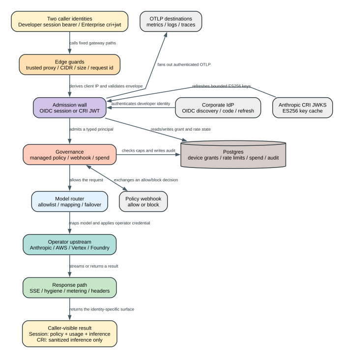

# Claude Code CLI 2.1.235 Enterprise Gateway：身份、策略、路由、花费与遥测怎样串成一条请求链

> 版本：`2.1.235` | 证据：目标版本可读化 bundle 的 `Static` 运行路径 | 边界：没有把 IdP、Anthropic CRI 签发端或云 Provider 内部实现冒充成本地 CLI 代码

**读者问题：** 企业把 Claude Code 指向 `claude gateway --config` 后，一次请求究竟经过哪些身份墙、策略墙和路由层；某一层失败时，用户看到什么，哪一方仍然持有状态？

**一句话模型：** Enterprise Gateway 把开发者或 CRI 调用者先转换成受验证的 principal，再依次实施网络边界、策略与花费控制、模型映射和 operator credential 转发，最后把响应、计量与 OTLP 分别交回用户、Postgres 和观测后端。



图的结论不是“Gateway 是一个代理”，而是：**它同时拥有身份转换、策略执行、上游凭据替换和部分持久状态；CRI 与普通开发者只在中间一段共用管线，不能当成同一种登录方式。**

## 60 秒先看懂一次普通请求

沿用一个贯穿全文的场景：公司把 `https://gw.corp.example` 配成 Claude Code 的强制登录网关。一名开发者第一次执行 `/login`，在浏览器完成公司 OIDC 登录，然后让 Claude Code 调用 `claude-sonnet-4-6`。公司要求研发组只能看到指定模型、超过月度额度后立即拒绝，并把 metrics 转发到自建 Collector。

成功路径是：

1. CLI 从网关的 well-known 文档发现 RFC 8628 device flow 端点。
2. 网关生成 10 分钟有效的 device grant；浏览器完成 OIDC code flow、PKCE、nonce 和浏览器绑定校验。
3. 网关不把 IdP token直接交给 CLI，而是签发自己的短期 session JWT。
4. CLI 用这个 bearer 请求 `/managed/settings`，拿到该用户匹配的模型、权限、环境和 Desktop bootstrap 策略。
5. `/v1/messages` 先经过客户端 IP、请求大小和 session 校验，再执行 spend precheck 与可选 policy webhook。
6. Gateway 把用户请求的模型映射到 operator upstream model，用公司自己的 Anthropic、AWS、GCP 或 Azure credential 发出请求。
7. 成功响应边流式返回边提取 usage；结束或取消时异步写入日、周、月三个 spend bucket。
8. CLI 发到 Gateway 的 OTLP payload 立即收到 `200`，Gateway 在后台 fanout 到配置的 Collector。

### 请求前后究竟改变了什么

| Object | Before | Transformation | After | User-visible effect |
| --- | --- | --- | --- | --- |
| 开发者身份 | IdP browser session、authorization code | Gateway 校验 OIDC claims，再签发自己的 HS256 JWT | `sub/email/name/groups` 成为 Gateway session principal | CLI 后续请求不用携带公司 IdP 的原始 token |
| 请求凭据 | `Authorization: Bearer <gateway-session>` | Gateway 在身份墙消费它，并删除客户端上游凭据 | 上游看到 operator credential | 用户不能借 Gateway token直接调用云 Provider |
| 模型名 | `claude-sonnet-4-6` 或 operator alias | role allowlist -> custom mapping -> baked provider mapping | Bedrock/Vertex/Foundry/Anthropic 的实际 model ID | 同一个 CLI model 可落到不同基础设施 |
| 管理策略 | 用户 groups/email 尚未匹配 | 首个 policy 匹配，必要时叠加 catch-all base | ETag 标识的 managed settings / Desktop bootstrap | 工具、模型、egress 和环境约束按角色生效 |
| 花费状态 | Postgres 中已有 daily/weekly/monthly spend | 请求前读 cap，请求后解析 usage 并累加 | 新 spend bucket 与 unified rate-limit headers | 75%/95% 后出现用量提示，超限返回 `billing_error` |
| CRI 请求 | Anthropic 签发的 `cri+jwt` | 固定 issuer/JWKS/audience/org/scope 校验 | CRI principal，只能进入 inference path | 不获得 managed settings、spend admin 或 Gateway OTLP |
| 遥测 | CLI 产生 OTLP payload | Gateway 鉴权后立即应答，再做有上限的后台 fanout | Collector 成功接收，或 Gateway 静默丢弃 | Collector 故障不阻塞 CLI，但数据可能缺失 |

## 先划清边界：它是什么，不是什么

`claude gateway --config` 注册为 CLI 子命令，描述就是“Run the enterprise auth/telemetry gateway”，入口要求 `--config <path>`；异常统一写成 `claude gateway: ...` 并以状态 1 退出。实际 handler 只在 native Bun binary 中可运行，npm/Node 入口会直接拒绝。[入口证据：630169-630175](../reverse/javascript/cli.readable.js#L630169)，[native gate：627438-627448](../reverse/javascript/cli.readable.js#L627438)

它在本机发布物中真实实现了：

- OIDC discovery client、device authorization server、browser callback 和 refresh；
- Gateway session JWT 的签发、轮换验证和短期 OAuth state/device grant 加密；
- managed settings、Claude Desktop bootstrap 与模型列表；
- Anthropic raw、Bedrock、Anthropic AWS、Vertex、Foundry 上游构造与顺序 failover；
- CRI JWT/JWKS admission wall、policy webhook 和 CRI response hygiene；
- spend cap、admin API、审计、usage 解析与 Postgres retention；
- OTLP metrics/logs/traces 接收、后台 fanout 和 circuit breaker；
- IP/CIDR、trusted proxy、URL/header/body limits、TLS/security headers 和 SSRF 防护。

它没有在本地实现：

- 公司 IdP 如何验证员工、MFA、设备合规或风险分；
- Anthropic 如何决定是否签发 CRI JWT、token 的服务端生命周期和组织授权流程；
- AWS/GCP/Azure 如何执行 IAM、配额、内容审核或账单结算；
- Collector 如何持久化、采样或导出收到的 OTLP；
- 账户级滥用检测、风控画像或服务端限流算法。

因此，本文说“Gateway 验证 CRI token”，不等于“CLI 实现了 CRI token 签发”；说“Gateway 使用 Bedrock credential”，也不等于“CLI 拥有 AWS IAM 控制面”。

## 谁拥有哪一份状态

| Owner | 持有的状态 | 写入时机 | 失效/恢复 | 不负责什么 |
| --- | --- | --- | --- | --- |
| Claude Code CLI / Desktop | Gateway base URL、session/refresh token、managed settings cache、模型与 OTLP bootstrap | 登录、policy refresh、bootstrap | token 过期前 refresh；`401 invalid_grant` 重新登录 | 不解析 Gateway access token 内部 claims |
| Gateway 进程 | 生效配置、upstream clients、session key ring、CRI JWKS cache、OTLP breakers | 启动时构造，运行时更新 cache/breaker | 重启重建；JWKS 按 TTL 刷新 | 不持久保存 session JWT 本身 |
| Postgres | device grants、rate-limit counter、spend limits、spend、identity、admin audit | 登录、请求前后、admin mutation | KV TTL cleanup；审计/花费/identity retention | 不保存 IdP browser session |
| Corporate IdP | authorization code、ID/access/refresh token、用户身份与 groups | 浏览器登录和 refresh | 由 IdP 策略决定 | 不直接决定 Gateway model mapping |
| Anthropic CRI issuer/JWKS | CRI token 签发和 ES256 public keys | Gateway 之外 | Gateway 定期刷新 keys；签发语义是外部边界 | 不替 Gateway 调用 operator upstream |
| Policy webhook | 对当前请求给出 `block: boolean` 决策 | 每次启用该功能的 inference 请求 | timeout/error 按 fail-open/closed | 不改写请求或响应 body |
| Operator upstream | Messages/count_tokens 的真实模型执行 | 路由成功后 | 由 Gateway 顺序 failover 或返回错误 | 不认识 Gateway session/CRI admission token |
| OTLP destination | metrics/logs/traces 的最终接收状态 | Gateway 后台 fanout | 5 次失败开路 30 秒 | 不影响 Gateway 已返回给客户端的 `200` |

## 请求管线：顺序就是控制语义

下面这条顺序比字段清单重要，因为前后位置决定谁能绕过谁、错误在哪一层终止。

```text
socket peer / X-Forwarded-For
  -> deny CIDR
  -> health/readiness special path
  -> allow CIDR
  -> URL/header/body limits
  -> public discovery / OAuth routes
  -> admin special authentication
  -> session or CRI bearer admission
  -> managed/Desktop/OTLP/models/inference dispatch
  -> session spend precheck
  -> JSON parse + optional CRI policy webhook
  -> model allowlist/mapping + sequential upstream failover
  -> response hygiene + successful-session usage metering
```

### Endpoint 与 principal 矩阵

| Path | Credential | Owner / result | 关键边界 |
| --- | --- | --- | --- |
| `GET /healthz` | 无 bearer | 只返回进程存活 | denylist 生效；allowlist 尚未检查；不读 Postgres |
| `GET /readyz` | 无 bearer | 实际读取一次 Postgres KV | denylist 生效；allowlist 尚未检查；失败为 `503` |
| `GET /` | 无 bearer | Gateway 状态页 | 使用严格 CSP，不展示 secret |
| `GET /.well-known/oauth-authorization-server` | 无 bearer | device/token endpoint 与 `cri_enabled` | OIDC 未配置时不发布 OAuth endpoint |
| `GET /protocol` | 无 bearer | 当前 binary 自带的协议说明 | 属于 declaration/surface；本文仍以 runtime path 证明实现 |
| `/oauth/device_authorization`、`/device`、`/oauth/callback`、`/oauth/token` | 无 bearer，browser/CLI 分工 | OIDC device flow | OIDC 未配置时返回 `404` |
| `GET /managed/settings` | Gateway session | 首个匹配 policy，支持 ETag/304 | CRI token不能进入 |
| `GET /user/bootstrap` | Gateway session | Desktop 固定 Gateway bootstrap | policy 必须显式带 `desktop:` |
| `GET /v1/models` | Gateway session | operator/baked model list | CRI token不能进入 |
| `POST /v1/{metrics,logs,traces}` | Gateway session | 接收后总是 `200`，后台 fanout | CRI telemetry 不走本 Gateway |
| `POST /v1/messages`、`/v1/messages/count_tokens` | Gateway session 或 CRI JWT | inference router | spend 只针对 session principal；policy webhook 两者都可执行 |
| `/v1/organizations/spend_limits...` | admin API key 或 admin-group session | spend limit/admin audit API | `x-api-key` 一旦出现，就不再回退 bearer |

运行时路由与上述顺序位于 [627511-627734](../reverse/javascript/cli.readable.js#L627511)。

## 启动：从 YAML 到可接流量的 Bun server

启动不是“读一个配置然后 listen”，而是同步建立一组安全不变量。主链位于 [627446-627750](../reverse/javascript/cli.readable.js#L627446)。

### Phase 1：确认运行容器

`startGateway` 首先检查全局 `Bun`。缺失时立刻报错，Postgres、IdP 和端口都不会被触碰。这意味着 npm 分发中的 JavaScript 即使包含 Gateway 代码，也不是受支持的执行容器。

### Phase 2：读取、展开并严格校验配置

配置文件先按 YAML 解析，再递归处理两种占位符：

- `${ENV_NAME}`：可出现在字符串内部；环境变量未定义即启动失败；
- `${file:/absolute/path}`：必须占满整个字符串、路径必须是绝对路径，读取后 `trim()`。

数组和对象递归展开；旧 `dev:` 顶层字段被明确拒绝，因为 `2.1.235` Gateway 已经是 Postgres-only。[配置展开：625081-625106](../reverse/javascript/cli.readable.js#L625081)

Schema 使用 strict objects。未知 gateway key、重复 upstream name、无效 CIDR、错误 OIDC endpoint、空 CRI audience/org allowlist、无效 model mapping 等都会在启动前失败。[完整 schema/default/refine：625268-625318](../reverse/javascript/cli.readable.js#L625268)

### Phase 3：连接 Postgres 并串行迁移

Gateway 创建 `Bun.SQL` pool，默认最多 5 个连接、连接超时 5 秒；获取 advisory lock `6775156` 后按 v1-v6 迁移。连接错误会被改写成带 `store.postgres_url` 提示的启动错误。CRI-only 也不能省略 Postgres，因为 device/rate-limit 之外，server readiness 与统一 store contract 仍以 Postgres 为基础。

### Phase 4：构造控制器

启动时依次得到：

- admin key ring 与 spend controller；
- 可选 CRI authenticator，并立即 prime JWKS；
- 可选 CRI policy webhook controller；
- session signing/sealing key ring；
- 可选 Google Groups resolver；
- OIDC discovery client；
- 每个 operator upstream client；
- managed policies/legacy settings；
- 可选 TLS cert/key。

这些对象在 `Promise.all` 中有任一构造失败，server 不会进入 listen。唯一有意降级的是 **CRI JWKS prime 失败**：进程仍启动，普通 OIDC/session 流量不受影响，但 CRI path 在首次成功取到 keys 前返回 `503`。

### Phase 5：启动后台任务与 HTTP server

Postgres KV 每 30 秒清理一次；审计、花费和 identity retention 启动时执行一次，之后每小时执行。Bun server 使用 `idleTimeout: 0`、`development: false`，可选 TLS。启动后还会输出配置警告，并探测 pod 是否能直接访问 `169.254.169.254`；可达时提醒补 egress NetworkPolicy。

### 关键默认值

| Field / runtime constant | `2.1.235` default | 实际影响 |
| --- | --- | --- |
| `listen.host` | `0.0.0.0` | 因为非 loopback，默认情况下必须同时提供 `listen.public_url` |
| `listen.port` | `8080` | Bun server 监听端口 |
| `limits.max_request_bytes` | `33,554,432` bytes（32 MiB） | 有 `Content-Length` 时超限返回 `413` |
| `rate_limits.device_authorization` | 30 次 / 600 秒 / client IP | 超限返回 OAuth `slow_down` + `429` |
| `rate_limits.device_verify` | 10 次 / 600 秒 / client IP | 浏览器显示等待提示 |
| `timeouts.upstream_ttfb_ms` | `120,000` ms | 只进入 raw upstream fetch；云 SDK client 自身 timeout 是 1 小时 |
| `session.ttl_hours` | `1` | Gateway session JWT 与 Desktop bootstrap expiry |
| `store.max_connections` | `5` | Bun SQL pool 上限 |
| telemetry destination signals | metrics `true`，logs/traces `false` | 每个 destination 独立筛选信号 |
| admin retention | audit 365 天；spend 13 月；identity 90 天 | 每小时分批删除 |
| `admin.group_limit_mode` | `min` | 同层多个 RBAC group 选最小实际 cap |
| `enforcement.fail_closed_on_error` | `false` | spend store error 默认放行 |
| CRI webhook | timeout 2 秒，最大 30 秒；fail-closed `true` | 决策引擎故障默认阻断 inference |
| CRI JWKS | fetch 10 秒；default refresh 10 分钟；hard age 6 小时；unknown-kid cooldown 1 分钟 | key set 太旧时 CRI fail closed 为 `503` |
| SDK SSE keepalive | 15 秒 | provider SDK 静默期补 Anthropic `ping` event |
| OTLP fanout | 128 个 in-flight；5 次失败；开路 30 秒；destination timeout 10 秒 | 饱和或开路时丢遥测但仍对客户端 `200` |

## 一份能读懂各层关系的 YAML

下面是结构示例，不是生产 secret。它故意同时展示 OIDC、managed policy、spend、OTLP 和 CRI，以说明它们怎样拼接；未使用的块应删除，而不是保留空配置。

```yaml
listen:
  host: 0.0.0.0
  port: 8080
  public_url: https://gw.corp.example
  trusted_proxies:
    - 10.0.0.0/8
  tls:
    cert: ${file:/etc/claude-gateway/tls.crt}
    key: ${file:/etc/claude-gateway/tls.key}

access_control:
  allow_cidrs: [10.0.0.0/8]
  deny_cidrs: [10.23.45.0/24]

limits:
  max_request_bytes: 33554432
  max_request_header_bytes: 65536
  max_url_length: 8192

session:
  jwt_secret:
    - ${file:/run/secrets/gateway_session_v2}
    - ${file:/run/secrets/gateway_session_v1}
  ttl_hours: 1

store:
  postgres_url: ${GATEWAY_POSTGRES_URL}
  max_connections: 5

oidc:
  issuer: https://idp.corp.example
  client_id: claude-gateway
  client_secret: ${file:/run/secrets/oidc_client_secret}
  scopes: [openid, profile, email, offline_access]
  use_pkce: true
  allowed_email_domains: [corp.example]
  allowed_groups: [claude-users]

upstreams:
  - name: primary
    provider: anthropic
    base_url: https://llm-proxy.corp.example
    auth:
      api_key: ${file:/run/secrets/anthropic_api_key}
    forward_user_identity: true
  - name: bedrock-fallback
    provider: bedrock
    region: us-east-1
    auth: {}

models:
  - id: claude-sonnet-4-6
    label: Sonnet 4.6
    upstream_model:
      primary: claude-sonnet-4-6
      bedrock-fallback: global.anthropic.claude-sonnet-4-6-v1:0

managed:
  policies:
    - match:
        groups: [platform-engineering]
        email_domain: corp.example
      cli:
        availableModels: [claude-sonnet-4-6]
      desktop:
        disabledBuiltinTools: [computer]
    - match: {}
      cli:
        env:
          CLAUDE_CODE_ENABLE_GATEWAY_MODEL_DISCOVERY: "1"
        permissions:
          deny: ["WebFetch"]

admin:
  write_keys:
    - id: automation
      key: ${file:/run/secrets/spend_admin_write_key}
  admin_groups: [claude-admins]
  group_limit_mode: min
  blocked_message: Contact the AI platform team for a limit review.

enforcement:
  fail_closed_on_error: true

pricing:
  multiplier: 1
  overrides: []

telemetry:
  forward_to:
    - url: https://otel.corp.example
      headers:
        authorization: ${OTEL_AUTH_HEADER}
      metrics: true
      logs: true
      traces: false

cri:
  enabled: true
  audience: [https://gw.corp.example]
  org_allowlist: [11111111-2222-3333-4444-555555555555]
  policy:
    webhook:
      url: https://policy.corp.example/claude/inference
      timeout_ms: 2000
      fail_closed: true
```

几个容易误配的点：

- `public_url` 不只是展示地址。非 loopback bind 时缺失会启动失败，因为 callback URL、issuer 和外部 origin 不能从客户端可控的 `Host` 推导。
- `${file:...}` 路径必须是绝对路径，且表达式必须占满整个字符串；它不是任意模板函数。
- `oidc` 可以省略的唯一情况是 `cri.enabled: true` 的 CRI-only deployment；但 `session` 和 `store` 仍是必填结构。
- `managed.policies` 按顺序首个匹配，catch-all 应放最后；它仍会作为 base merge 到前面的角色 policy。
- `cri.audience` 与 `cri.org_allowlist` 在启用时都必须非空；空数组不是“允许全部”，而是配置错误。
- `forward_user_identity` 只允许发给 operator 自己控制的 Anthropic-compatible proxy；官方 Anthropic/AWS Anthropic host 会被 schema 拒绝，避免把员工 email 发给错误目标。
- `pricing` 没有 `admin` 时无消费者，会被拒绝；`fail_closed_on_error` 没有 `admin` 时同样无效。

## Edge guards：先确定“这个请求是谁发来的”

### trusted proxy 不是无条件相信 `X-Forwarded-For`

Gateway 只在 socket peer 本身落入 `listen.trusted_proxies` 时读取 `X-Forwarded-For`。它从右向左扫描链，返回第一个不属于 trusted proxy CIDR 的地址；任何地址解析失败都会退回 socket peer。这样客户端直接伪造 XFF 不会改变 rate limit、allowlist、denylist 和审计中的 client IP。[实现：611547-611559](../reverse/javascript/cli.readable.js#L611547)

IPv4-mapped IPv6 会规范化成 IPv4，CIDR 也做相同转换。`deny_cidrs` 先于 `allow_cidrs`，所以一个同时命中两者的地址仍被拒绝。

### health/readiness 的位置是一个运维细节

`/healthz` 和 `/readyz` 位于 denylist 之后、allowlist 之前：

- denylisted 地址看不到 health；
- 不在 allowlist 的负载均衡器仍能探测 health/readiness；
- `/healthz` 只证明 Bun handler 活着；
- `/readyz` 通过 `store.get("__readyz_probe__")` 真实触发 Postgres 读，没有这条 key 也能返回 `ready`，因为 `null` 是正常读结果。

因此“health 200、业务 403”通常不是服务没启动，而是 allowlist/trusted-proxy 解析不同；“health 200、ready 503”则直接指向 Postgres。

### URL、header、body 与 request ID

- `max_url_length` 超限返回 `414`；
- header 大小按 `name.length + value.length + 4` 累加，超限返回 `431`；
- 存在 `Transfer-Encoding` 但没有 `Content-Length` 返回 `411`；
- `Content-Length` 非数字、负数或超过 32 MiB 默认值返回 `413`；
- `x-client-request-id` 只接受 `[A-Za-z0-9._-]{1,64}`，否则生成 UUID；响应统一写 `x-request-id`。

注意 body 上限是在读取 body 前根据 `Content-Length` 实施；Gateway 不接受 chunked-without-length 来绕过这个边界。

### 出站 SSRF 与 DNS rebinding 防护

Gateway 的 safe fetch 只接受 HTTP(S)，拒绝 cloud metadata host、link-local、特殊 metadata IP，以及默认情况下的 loopback/unspecified。域名先解析全部地址，只要任一地址落入阻断范围就拒绝；随后把 URL host 固定成选中的 IP，同时保留原 Host header 和 TLS SNI/hostname verification，而且 `redirect: manual`，避免重定向或二次解析绕过检查。[实现：611144-611216](../reverse/javascript/cli.readable.js#L611144)

`CLAUDE_GATEWAY_ALLOW_LOOPBACK` 是测试逃生口。CRI 的 `jwks_url` override 更严格：只能指向 loopback，并且必须显式开启这个 escape；生产默认 issuer/JWKS 不允许被任意外部 URL 替换。

### 入站响应安全 header

每个 response 都补：

- `X-Content-Type-Options: nosniff`；
- `X-Frame-Options: DENY`；
- `Referrer-Policy: no-referrer`；
- `Cross-Origin-Opener-Policy: same-origin`；
- TLS 启用时 `Strict-Transport-Security: max-age=31536000; includeSubDomains`。

browser 页面另有 CSP：`default-src 'none'`、`frame-ancestors 'none'`、`base-uri 'none'`，verification form 只允许提交到显式 IdP origin 集合。[页面与 CSP：611426-611486](../reverse/javascript/cli.readable.js#L611426)

## OIDC device flow：Gateway 怎样把公司身份变成自己的 session

### Phase 1：生成 device grant

`POST /oauth/device_authorization` 通过 IP rate limit 后生成：

- opaque `device_code`；
- 8 个 base-20 大写字符组成的 `XXXX-XXXX` user code，字符集排除了易混淆元音；
- `expires_in: 600`；
- `interval: 5` 秒。

Postgres KV 不以明文 device code 作 key，而是保存 `device:dc:<sha256(device_code)>`；user code 经过大写/去非字母数字后映射到这个 key。grant payload 先加密再存储，两条 KV 都是 600 秒 TTL。[device helper：610750-610780](../reverse/javascript/cli.readable.js#L610750)，[route：627547-627551](../reverse/javascript/cli.readable.js#L627547)

### Phase 2：浏览器确认与 CSRF 边界

`GET /device?user_code=...` 只预填并展示代码，不自动提交。`POST /device` 要求：

- `Sec-Fetch-Site` 为 `same-origin`/`none`，或者 `Origin` 精确等于 Gateway public origin；
- client IP 未超过 10/600 秒默认限制；
- user code 仍能解析到 pending device grant。

通过后生成 PKCE verifier、nonce 和 32-byte browser secret。Gateway 只把 browser secret 放入 HttpOnly cookie，把 SHA-256 hash 写进 5 分钟有效的 encrypted OAuth state。HTTPS 时 cookie 名为 `__Host-gw_dev` 并带 `Secure`；loopback HTTP 开发模式使用 `gw_dev`。两者都带 `SameSite=Lax; Path=/`，cookie Max-Age 是 600 秒。

`oidc.use_pkce` 默认 `true`；nonce 始终存在。`extra_auth_params` 不能覆盖 `redirect_uri/state/nonce/code_challenge/scope/response_type` 等 Gateway 自己管理的协议字段。

### Phase 3：callback 同时验证三类关联

`/oauth/callback` 不是只拿 code 换 token，它先确认：

1. state 能被当前/旧 key 解密，`kind` 必须是 `oauth_state` 且未过期；
2. browser cookie hash 长度为 32 bytes，并用 timing-safe equality 与 state 中的 hash 比较；
3. state 指向的 device grant 仍是 `pending`，没有被使用或过期。

随后 OIDC client 才带 PKCE verifier 与 nonce 完成 callback。成功时把 device grant 改成 `complete`，写入 Gateway access token、可选 refresh token 和 session TTL；token exchange 失败时改成 `denied`。两条分支都会删除 user-code reverse mapping；成功和 browser-mismatch 分支会主动清 cookie，但 token-exchange failure 只返回失败页，旧 cookie 等待 600 秒 Max-Age 自然失效。[callback：627575-627604](../reverse/javascript/cli.readable.js#L627575)

### Phase 4：claims 进入 Gateway principal 前再做一次 policy gate

Gateway 从 ID token 或可选 userinfo 中解析：

- `sub`：必填且非空；
- `email`：支持单个 claim 名或按顺序尝试多个 claim/JSON pointer；
- `groups`：支持普通 claim 或 JSON pointer；
- `name`：可选。

`email_verified` 如果存在，必须是 `true` 或字符串 `"true"`。配置 `allowed_email_domains` 后，email 必须存在且精确命中规范化后的 domain；配置 `allowed_groups` 后，至少一个 group 精确命中。[claim gates：611387-611417](../reverse/javascript/cli.readable.js#L611387)，[principal mint：627473-627486](../reverse/javascript/cli.readable.js#L627473)

`userinfo_fallback` 默认关闭。打开后，只有 ID token 缺少需要的 email/groups 时才调用 userinfo，并要求 userinfo `sub` 与 ID token `sub` 完全一致。

可选 `google_groups` 不是读取 Google ID token 的 group claim，而是用 service-account key 为 `admin_email` 做 domain-wide delegation，调用 Directory API。access token 在过期前 60 秒复用；每页最多 200 group，最多 50 页。任何 token/Directory error 都使本次登录失败，不会静默当成“没有 group”。[Google Groups：610826-610859](../reverse/javascript/cli.readable.js#L610826)

### Phase 5：CLI poll 得到的是 Gateway JWT

CLI 按返回的 5 秒 interval poll `/oauth/token`。pending 返回 `authorization_pending`；同一 device grant 在 4 秒防抖窗口内第二次 poll 会返回 `slow_down` + `429`；denied 返回 `access_denied`；complete 返回 Gateway access token，然后删除 device-code KV，使 device grant 单次使用。

Gateway 不把 IdP ID token直接给 CLI。它签发：

```text
alg: HS256
typ: JWT
kid: sha256(configured-secret)[0..8 bytes] as hex
aud: claude-gateway
iss: listen.public_url（存在时）
exp: session.ttl_hours
payload: sub / email? / name? / groups?
```

### Phase 6：refresh 的失败语义决定是否重登

`grant_type=refresh_token` 调用 IdP refresh：

- 有 ID token时使用其 claims；
- 没有 ID token但有 access token时调用 userinfo；
- 重新执行 email/group gate，再签一个新的 Gateway session JWT；
- IdP 返回临时网络/协议错误但不是 `invalid_grant` 时，Gateway 返回 `503 temporarily_unavailable`；
- `invalid_grant` 或无法归类为可恢复 IdP 错误时返回 `401 invalid_grant`，强制 CLI 重新走 browser flow。

这使停用员工/撤销 refresh token 有明确的重新认证边界，而普通 IdP 短暂故障不会让客户端丢弃仍可能有效的登录状态。[refresh：627606-627652](../reverse/javascript/cli.readable.js#L627606)

## Session JWT、OAuth state 与 device grant 的密钥关系

`session.jwt_secret` 接受至少 32 字符的 string 或非空数组。数组第一项用于新签发/加密，验证和解密按 `kid` 在整个数组中查找，所以轮换时把新 secret 放首位、旧 secret 暂时保留即可让旧 session 和未完成 device flow 在各自 TTL 内继续。[crypto helpers：610702-610745](../reverse/javascript/cli.readable.js#L610702)

| Object | Format | Key material | TTL | Rotation behavior |
| --- | --- | --- | --- | --- |
| Gateway session | JWS `HS256` | secret 原始 UTF-8 bytes | 默认 1 小时 | 新 token 用第一把；旧 `kid` 可由后续 key 验证 |
| OAuth state | JWE `alg=dir, enc=A256GCM` | `sha256(secret)` 32 bytes | 300 秒 | `kid` 选当前或旧 sealing key |
| Device grant | 同一 JWE contract，`kind=device_grant` | `sha256(secret)` | 600 秒 | 旧 key 保留时未完成 flow 可继续 |

JWE payload 都带 `kind`，解密成功但 kind 不匹配仍返回 `null`，防止 OAuth state 与 device grant 互相当成同一种对象。签名与 sealing 使用同一配置 secret 的不同 material（原始 bytes 与 SHA-256 digest），不是两套独立 secret。

## Managed settings：role policy 不是简单覆盖一份 JSON

Gateway 支持两种来源：

- `managed.settings`：读取一份 legacy JSON file，形成单个 catch-all policy；
- `managed.policies`：在 YAML 内声明按 groups/email domain 匹配的多份 policy。

两者最终都生成带 `uuid/checksum/settings` 的 payload。`/managed/settings` 根据 session claims 按数组顺序选择 **第一个** 匹配项，返回 `ETag: "<checksum>"`；客户端带同一 `If-None-Match` 时返回 `304`。没有匹配项是 `404`，而不是 `200 {}`，因为“无策略”与“策略存在但为空”是两个状态。[加载、匹配与 ETag：625112-625220](../reverse/javascript/cli.readable.js#L625112)，[serve：627665-627671](../reverse/javascript/cli.readable.js#L627665)

### Match 语义

- `groups: [a,b]`：用户 groups 命中任意一个即可；
- `email_domain`：取 email 最后一个 `@` 后的 domain，转小写后精确比较；
- 两者同时存在：必须同时满足；
- `match: {}`：catch-all；
- policy 顺序决定优先级，后面的更具体 policy 不会覆盖已经匹配的前一项。

如果 catch-all 不在最后，Gateway 会警告后续 policy 永远匹配不到。不过 catch-all 还有第二个角色：它会作为 base merge 到所有非 catch-all policy。

### Catch-all merge 不是所有字段同一种规则

| Field family | Merge rule | 运行含义 |
| --- | --- | --- |
| 普通 scalar/top-level key | role policy 覆盖 base | 角色可以替换普通值 |
| `env`、`modelOverrides`、`skillOverrides` | object shallow merge | 保留 base map，role 同名 key 覆盖 |
| `disabledMcpjsonServers`、`deniedMcpServers`、`blockedMarketplaces` | 数组拼接、结构去重 | 角色不能通过省略 base 项来解除限制 |
| `permissions.deny/ask` | 各列表 union/dedup | catch-all 风控继续存在 |
| `hooks.<event>` | 各 event list union/dedup | base 与 role hook 都执行 |
| Desktop `disabledBuiltinTools` | union/dedup | role 只能继续禁用 |
| Desktop `builtinToolPolicy` | role 先覆盖，但 base 的非 `allow` 最后重新压回 | base 限制不能被 role 放宽 |

合并后再次做 managed settings schema 与语义校验；未知 key、alias 冲突、无法由 Gateway serve 的 key 都能让启动失败。`mcpServers` 在这个版本明确不支持通过 Gateway managed settings 下发，而不是“写了但客户端忽略”。

### Gateway 自动注入 OTLP managed env

只要 `telemetry.forward_to` 非空并且有 `listen.public_url`，Gateway 会把以下变量合进 managed policy 的 `env`：

```text
CLAUDE_CODE_ENABLE_TELEMETRY=1
OTEL_METRICS_EXPORTER=otlp
OTEL_LOGS_EXPORTER=otlp
OTEL_TRACES_EXPORTER=otlp
OTEL_EXPORTER_OTLP_ENDPOINT=<public_url>
OTEL_EXPORTER_OTLP_PROTOCOL=http/protobuf
```

没有 `public_url` 时只记录 warning，不告诉客户端 export 到一个由 Host header 推导的地址。[注入：625193-625198](../reverse/javascript/cli.readable.js#L625193)

## Claude Desktop bootstrap：policy 必须显式 opt in

`GET /user/bootstrap` 只有在至少一份 matched policy 带 `desktop:` 时才工作。普通 CLI managed policy 不会自动变成 Desktop 配置；没有 desktop block 返回 `404 not_found_error` 并写入具体 denied reason。

成功 payload 由 Gateway 固定写入：

- `inferenceProvider: gateway`；
- `inferenceGatewayBaseUrl: <public origin>`；
- `inferenceCredentialKind: interactive`；
- 可用模型列表；
- managed CLI `permissions.deny` 中不带参数、非 MCP 的工具名 -> `disabledBuiltinTools`；
- CLI `sandbox.network.allowedDomains` -> `coworkEgressAllowedHosts`；
- 可选 desktop overlay；
- telemetry 启用时固定 `otlpEndpoint`、`http/json` 和 `enduser.id`；
- `expiresAt = now + session.ttl_hours`。

Desktop overlay 先通过“可由 Gateway serve”的字段白名单和 Desktop intake parser。inference/credential/OTLP 等关键连接字段不由 overlay 自由接管，而是由 bootstrap builder 固定产生；这防止某个 role overlay 把 Desktop 引向另一套 credential 或 telemetry endpoint。[Desktop validation：625009-625050](../reverse/javascript/cli.readable.js#L625009)，[bootstrap builder：626418-626448](../reverse/javascript/cli.readable.js#L626418)

响应另带 `x-gateway-spend-admin: true|false`，表示 session groups 是否命中 `admin.admin_groups`。

## 模型与 upstream：Gateway 拥有翻译和凭据替换

### Provider 构造

| Provider | Gateway 接受的 operator credential | Wire 形态 | 认证失效处理 |
| --- | --- | --- | --- |
| `anthropic` raw | API key、OAuth token、OIDC federation/WIF file | 原始 Messages API HTTP/SSE | WIF 401 清 token cache并只重试一次 |
| `bedrock` | AWS bearer、显式 access/secret/session、默认 provider chain | Anthropic Bedrock SDK | 动态 chain credential 可 invalidate/debounce |
| `anthropicAws` | Anthropic AWS API key、AWS keys、默认 provider chain | Anthropic AWS SDK | 动态 chain credential 可 invalidate |
| `vertex` | 固定 access token，或 GoogleAuth/service-account file | Anthropic Vertex SDK | SDK/Google auth 管理 token |
| `foundry` | API key，或 `DefaultAzureCredential` | Anthropic Foundry SDK | Azure credential provider 管理 token |

云 SDK client 统一 `maxRetries: 0`，因为 Gateway 自己在 upstream list 上做 failover；其 client timeout 是 1 小时。`timeouts.upstream_ttfb_ms` 的 120 秒默认值只传给 Anthropic-compatible raw fetch。[upstream construction：625498-625572](../reverse/javascript/cli.readable.js#L625498)

### Model resolution 有两层映射

对每个 upstream，Gateway 按顺序尝试：

1. 在 operator `models[]` 中按完整 ID 或 baked family 找到 row；
2. row 有 `upstream_model.<upstream-name>` 时直接使用；
3. 否则，如果 request model 能识别成 baked Claude family，且 `auto_include_builtin_models` 允许，使用 baked provider model ID；
4. operator row 存在但该 upstream 没 mapping，返回“not configured”；
5. request model 完全不在 operator allowlist，返回“not in operator's model allowlist”。

session principal 还会先经过 matched managed policy 的 `availableModels`。因此一个 400 “model not allowed”可能来自 role allowlist，也可能来自 operator model map；调试时要先区分这两层。[model resolver：625403-625420](../reverse/javascript/cli.readable.js#L625403)

### Raw forwarding 只保留必要 header

请求侧只保留：

- `content-type`、`accept`、`accept-encoding`；
- `anthropic-beta`、`anthropic-version`；
- `user-agent`；
- 所有 `x-stainless-*`。

随后明确删除客户端 `Authorization` 和 `x-api-key`，再应用 operator credential。raw response 删除 hop-by-hop/infra header，包括 `content-encoding`、`content-length`、`transfer-encoding`、`connection`、`cf-ray`、`via`、`request-id`；`anthropic-ratelimit-*` 也不会直接泄漏给调用者。

启用 `forward_user_identity` 时，Gateway 只对该自建 proxy加：

- `x-litellm-end-user-id` = email；
- `x-claude-gateway-user-id` = subject；
- `x-claude-gateway-user-email` = email。

值先过滤/percent-encode 成可用 header 字符。schema 拒绝把这组身份 header 发往 Anthropic 官方 host。[identity forwarding：625674-625683](../reverse/javascript/cli.readable.js#L625674)

### Sequential failover 与最终错误优先级

upstream 按 YAML 顺序串行尝试。下面状态会继续下一条：

- 任意 `5xx`；
- `429`；
- `401` / `403`；
- `404`；
- 网络/SDK exception。

`400` 和 `413` 不 failover，因为通常表示请求本身或 capability 不兼容，换 operator credential 并不能自动修复。客户端主动断开时停止尝试并返回非标准 `499`。

如果所有可映射 upstream 都失败，Gateway 保留并最终返回的响应优先级是：

```text
429 > 401/403 > 404 > 501 > generic 502
```

普通 500/529 body 不会成为最终保留响应；没有更高优先级可返回时，用户得到 `502 all upstreams failed (N attempted)`。这避免把最后一个偶然的 5xx 当成全局根因。[router：625573-625672](../reverse/javascript/cli.readable.js#L625573)

### Cloud provider 协议翻译

- Bedrock 的 beta 从 header 搬入 body `anthropic_beta`；
- Bedrock `/v1/messages/count_tokens` 直接返回 `501 not_supported`；
- SDK streaming event 被重写成 Anthropic SSE；
- 静默 15 秒时补 `event: ping`；
- CRI SDK response 的 `model` 可改回 caller 请求的 wire model，避免暴露 provider-specific ID；
- provider SDK error先归一化成 Anthropic error envelope。

计量需要 input token而 direct count_tokens 走 Bedrock 不可用时，Gateway 另有 fallback：发一个 `max_tokens: 1, stream: false` 的 Bedrock Messages probe；再失败才按序列化字符数 `/4` 估算。[count estimator：625371-625399](../reverse/javascript/cli.readable.js#L625371)，[SDK bridge：625685-625757](../reverse/javascript/cli.readable.js#L625685)

## CRI admission wall：另一种 principal，不是另一种 session

CRI 只在 `cri.enabled: true` 时构造。Gateway 通过 JWT protected header 的 `typ: cri+jwt` 识别候选 CRI token；只有 `POST /v1/messages` 和 `POST /v1/messages/count_tokens` 会进入 CRI verifier。其它 path 即使携带 CRI JWT，也会按普通 session token验证并得到 `401`。

### 固定信任根

默认值是：

```text
issuer = https://api.anthropic.com/api/oauth/cri
jwks   = {issuer}/jwks.json
alg    = ES256
typ    = cri+jwt
clock tolerance = 60 seconds
```

生产模式下不能把 `jwks_url` 指向任意外部服务。该 override 只允许 loopback test mock，并要求 `CLAUDE_GATEWAY_ALLOW_LOOPBACK`。自定义 issuer 必须是 canonical URL、无 query/fragment、末尾无 `/`，因为 exact `iss` pin 与 `{issuer}/jwks.json` 派生都使用这个字符串。[CRI verifier：611236-611342](../reverse/javascript/cli.readable.js#L611236)

### JWKS cache 的 fresh、stale-while-refresh 与 hard-fail

取回的 JWKS 只接受：

- `kty: EC`；
- `crv: P-256`；
- 非空 `kid`；
- 可导入为 ES256 public key。

如果新响应没有任何可用 key，Gateway 保留旧 key set，不用空集覆盖。refresh 时间读取 `Cache-Control: max-age`，但最多取 hard ceiling 6 小时的一半，即 3 小时；没有 header 时 10 分钟。

运行状态分三段：

1. **fresh**：当前时间早于 refresh deadline，直接使用；
2. **stale but <= 6h**：先用旧 keys 回答请求，同时触发后台 refresh；
3. **never fetched 或 > 6h**：同步尝试 refresh，仍失败则 CRI path 返回 `503`，并带 `Retry-After: 30`。

遇到 unknown `kid` 会额外触发 refresh，但有 60 秒 cooldown；同一时刻只有一个 fetch promise。JWKS fetch timeout 是 10 秒。这里返回 `503` 而不是 `401`，让客户端重试，而不是把可能仍有效的 token 当成用户凭据错误丢弃。

### 每个 token 的 admission 条件

Gateway 要求：

- protected header `typ=cri+jwt`、`alg=ES256`、非空 `kid`；
- signature 对应当前可用 JWKS key；
- `iss` 精确等于配置 issuer；
- `aud` 命中至少一个配置 audience；
- required claims 含 `exp/iat/aud/sub/org/scope`；
- `exp`，以及存在时的 `nbf`，通过 60 秒 clock tolerance；
- `scope` 精确等于 `inference`；
- `org` 转小写后命中 `org_allowlist`；
- `sub` 非空；可选 `act.sub` 被保留为 acting principal。

验证只发生在 admission。流式响应开始后，即使 token 在中途跨过 `exp`，当前 request 不会被 Gateway 主动截断。

### CRI 与 session path 的差异

| Capability | Gateway session | CRI principal |
| --- | --- | --- |
| `/v1/messages` / count tokens | 是 | 是 |
| matched `availableModels` | 是 | 否；仍受 operator models/mapping |
| managed settings / Desktop | 是 | 否 |
| spend precheck/meter | 是（admin 启用时） | 否 |
| admin group bearer | 是 | 否 |
| Gateway OTLP relay | 是 | 否 |
| policy webhook | 可选 | 可选 |
| upstream credential | operator credential | 同样是 operator credential |
| upstream error body | 普通归一化 | 强制净化并保留 capability recovery token |

CRI bearer 永远不会被转发到 upstream。它只证明“这个 caller 可以穿过 Gateway admission wall”，不证明它能直接使用 Anthropic/AWS/GCP/Azure credential。

### CRI response hygiene 为什么不能只返回“upstream error”

Gateway 删除 `anthropic-organization-id` 和内部 gateway headers。CRI 上游错误 body 默认替换成泛化的 Anthropic envelope，避免云 account ID、ARN、project、host banner 等进入调用者上下文。

但 Claude Code 的恢复逻辑会根据 400/413 文案识别 prompt-too-long、thinking signature、unsupported effort、media block 等 capability failure。因此 Gateway 先分类，再把 message 替换成稳定 token，例如：

```text
capability_rejected: prompt_too_long
capability_rejected: thinking_signature
capability_rejected: effort_unsupported
capability_rejected: image_block
```

无法可靠分类时才使用 generic copy。错误状态保持原 HTTP status 和准确 `error.type`，既不泄漏基础设施细节，也不切断客户端的自恢复分支。[CRI hygiene：625441-625488](../reverse/javascript/cli.readable.js#L625441)

## Policy webhook：只允许“放行或替换整份响应”

`cri.policy.webhook` 虽然位于 `cri` 配置块中，但 controller 一旦构造，会对 session 与 CRI inference 都运行。调用发生在 JSON parse之后、model router 之前。

Webhook 收到：

```json
{
  "path": "/v1/messages",
  "query": "?beta=true",
  "headers": {
    "content-type": "application/json",
    "anthropic-version": "2023-06-01"
  },
  "body": { "model": "...", "messages": [] }
}
```

另有 `x-request-id` 与净化后的 `x-principal-sub` header。`org` 和 `act` 不进入 webhook payload；它们只在 Gateway 的 policy telemetry/audit fields 中用于归因。

响应必须是 JSON object 且含 boolean `block`：

- `block: false`：继续路由；
- `block: true`：返回 `400 policy_blocked`、`x-should-retry: false`，不触碰 upstream；
- `reason`：删除 control/format 字符、trim、最多 500 个 Unicode code point，超限加省略号；
- `rule_id`：写入 Gateway policy event。

timeout、非 2xx、无效 JSON、非 object、缺少 boolean 的处理取决于 `fail_closed`。默认 `true` 时返回 `policy check unavailable`；`false` 时记录 `policy.skipped` 并放行。[webhook：626500-626535](../reverse/javascript/cli.readable.js#L626500)

Gateway 不支持 webhook 修改请求或响应。它要么放行原 body，要么用完整 `policy_blocked` response 替换。这避免 policy mutation 造成 CLI transcript、prompt cache key 与 upstream 实际看到的对话分叉。

## Spend enforcement：请求前读 cap，请求后异步记账

只有配置 `admin:` 才构造 spend controller；它只包围 **session principal 的 `/v1/messages`**。count_tokens、CRI、managed settings、OTLP 都不计入这套 spend bucket。

### Cap precedence

Postgres function `caps_by_period` 对 daily/weekly/monthly 分别选一条 binding：

```text
user > rbac_group > organization
```

只要 user scope 有该 period 的 row，就不会再看 group/org。多个 group row 的选择由 `group_limit_mode` 决定：

- `min`：优先最小的非-null cap；只有全部 unlimited 时才得到 unlimited；
- `max`：`amount: null`（unlimited）优先，否则选最大 cap。

`amount` 是整数字符串形式的 cents；`null` 表示 unlimited。period 只能是 daily/weekly/monthly，currency 固定 USD。[SQL precedence：627240-627276](../reverse/javascript/cli.readable.js#L627240)

### Precheck 与 fail-open/closed

每次 session `/v1/messages` 在读 body 前：

1. 异步尝试更新 principal email/name/groups，单一 identity fingerprint 最多每 15 分钟一次；
2. Postgres transaction 设置 `statement_timeout=2s`；
3. 外层再以约 2.5 秒 timeout 包住 precheck；
4. 同时读取 daily/weekly/monthly cap 和已花 cents；
5. 若任何 binding exceeded，返回 `429 billing_error`，不调用 upstream。

store error 默认 fail-open：无 header、继续推理。`enforcement.fail_closed_on_error: true` 时返回 `429`、`x-should-retry:false`、disabled reason `fetch_error`。[precheck：626345-626364](../reverse/javascript/cli.readable.js#L626345)

### 多个 period 怎样决定显示哪一个

Gateway 先给每个 binding 计算 utilization 与 reset：

- 有 exceeded 时，优先 exceeded binding；多个 exceeded 取 reset 最晚的；
- 都未 exceeded 时，取 utilization 最高的。

成功请求在 utilization **严格大于** 0.75 或 0.95 后加入 `anthropic-ratelimit-unified-*` headers。等于 75%/95% 尚不触发 threshold header。超限时 utilization 至少显示 1，并提供 period、reset、`org_spend_cap_reached`、`retry-after` 和 `x-should-retry:false`。[header selection：626385-626416](../reverse/javascript/cli.readable.js#L626385)

### Usage meter 怎样从 response 得到 cents

成功 response 被流式 wrapper 包住，原 chunk 立即交给客户端，同时旁路解析 usage：

- SSE：读取 `message_start`、`content_block_delta`、`message_delta`；
- JSON：读取顶层 usage；
- 缺 output token时按已观察 output chars `/4` 估算；
- 非流式 response 没 usage但有 body时，input 通过 countTokens/probe/serialized chars `/4` 补估；
- parser 内部文本 buffer 上限 8 MiB，超限放弃精确 parse而不阻断 response。

response 完成、出错或被客户端 cancel 时只执行一次 usage finalize。价格计算包含 input、output、prompt cache read/write 与 web search；operator override 可替换具体费率，`pricing.multiplier` 只允许 `(0, 1]`，因此只能保持或折减计量，不能用它加价。未知 model 回退 default tier并 warning。[usage parsing：626198-626343](../reverse/javascript/cli.readable.js#L626198)

### 这不是严格 reservation-based quota

记账发生在 response 结束后，`xpy(...).catch(...)` 异步启动，调用者不等待 Postgres 写完。写入一次 transaction 同时 upsert daily/weekly/monthly bucket，statement timeout 时重试一次。

因此可从代码确定：

- 长 streaming request 在结束前不会反映到 spend；
- 多个并发请求可以同时通过同一 precheck；
- 计量写失败不会撤销已经返回的模型输出；
- 这套 cap 是“前置读取 + 后置计量”，不是原子预留额度。

所以它能提供实用限额与 UI 提示，但不能保证高并发下绝不瞬时超出一个 cent。需要严格硬上限时，必须在外部增加 reservation/serialization；本地 `2.1.235` 代码没有这一步。

## Spend admin API：认证优先级和审计比 URL 更重要

基础路径是 `/v1/organizations/spend_limits`，支持：

- list / create-or-update；
- 按 ID get / delete；
- `/effective` 查询 user 的实际 binding/spend；
- `/audit` 查询 mutation audit。

### Authentication precedence

1. 如果请求带 `x-api-key`，只检查 admin key ring；即使同时有合法 bearer，也不回退。
2. write key 先于 read key，比较使用 timing-safe equality；重复 key ID 在启动时被拒绝。
3. 没有 `x-api-key` 时，session bearer groups 命中 `admin.admin_groups` 获得 `canWrite: true`。
4. read key 对 mutation 返回 `403 requires write:spend_limits`。

OIDC admin group 没有“只读 admin”模式；命中即写权限。每个响应带独立 `req_<uuid>` request ID，认证失败会记录 `admin.denied`。[admin auth：626028-626071](../reverse/javascript/cli.readable.js#L626028)

### Mutation consistency

upsert 按 `scope_type:scope_id:period` 取 transaction advisory lock，再写 `spend_limits` 并在同一 transaction 写 `admin_audit`；delete 也在 transaction 中同时保存 before snapshot。API body 用 Zod 严格限制 scope、amount、period/currency。

这保证单次 cap mutation 与其审计记录同生共死，但不等于所有 admin 操作之间有全局 serializable transaction。

## Postgres：六次迁移、三类 retention、一个 readiness 真相

### Migration contract

| Version | Object | Purpose |
| --- | --- | --- |
| v1 | `kv` + expiry index | device grant、user-code map、rate-limit counters |
| v2 | `spend_limits` + unique scope index + `caps_by_period` | cap 与 precedence |
| v3 | `admin_audit` | spend admin before/after audit |
| v4 | `spend` | principal 的 daily/weekly/monthly bucket |
| v5 | `principal_emails` | email/name/groups 搜索与展示 |
| v6 | `spend(period,cents desc,principal)` index | spend-desc 查询 |

所有 replica 先争用 advisory lock `6775156`；每个 migration 在自己的 transaction 写 schema 与 `_migrations` row，完成后 unlock。[migrations：627217-627325](../reverse/javascript/cli.readable.js#L627217)

Postgres 版本低于 14 只 warning，不阻止启动。

### KV lifecycle

`set/get/del/incr` 都是真实 SQL。`incr` 在 TTL 已过期时原子重置为 1，否则递增并保留原 expiry，因此 rate-limit window 是 fixed window，不是每次请求向后滑动。过期 row 每 30 秒物理删除，但 `get` 已经用 `expires_at > now()` 做逻辑过期，所以 cleanup 延迟不会让过期 grant继续有效。

### Retention lifecycle

启动时和每小时分别清：

- `admin_audit.at` 早于默认 365 天；
- `spend.updated_at` 早于默认 13 月；
- `principal_emails.updated_at` 早于默认 90 天。

每类最多 50 批，每批 10,000 row，每批 transaction 设置 30 秒 statement timeout。一次 sweep 最多处理 500,000 row；更多数据留待下一小时。数据库 role 缺少 `DELETE`（SQLSTATE `42501`）时只 warning once，服务继续运行，结果是数据超出 retention window 保留。[store/retention：627329-627420](../reverse/javascript/cli.readable.js#L627329)

## OTLP relay：客户端成功与 Collector 成功是两个事件

session principal 可向 `/v1/metrics`、`/v1/logs`、`/v1/traces` POST OTLP/HTTP protobuf 或 JSON。Gateway 根据每个 destination 的 signal flags 选择目标，读取完整 request body后调用 `fanout()`，随后立即返回空 `200`；它不等待 destination。

### Fanout state machine

```text
incoming OTLP payload
  -> no destination for this signal: 200 and discard
  -> inFlight >= 128: 200 and drop
  -> destination circuit open: skip it
  -> POST with content-type/content-encoding/custom headers, timeout 10s
  -> success: delete breaker state
  -> failure 1..4: retain fail count
  -> failure 5: open 30s
```

`inFlight` 统计正在 fanout 的 incoming payload，不是 destination 数量。多 destination 使用 `Promise.allSettled` 并行。开路期间 incoming payload 仍对 CLI 返回 `200`；第 30 秒后的下一次 probe若再次失败，会重新开路。日志会清除 destination URL 中的 userinfo，避免把 basic credential 写入 stderr。[fanout：626456-626499](../reverse/javascript/cli.readable.js#L626456)

这套设计把 inference/CLI latency 与 telemetry backend 隔离，但代价是 at-most-best-effort：没有本地 durable queue、重放日志或 ack 给客户端。CRI client 不使用这些 Gateway OTLP endpoints；bundle 内协议明确把 CRI telemetry 留在 Gateway 之外。

## 日志与审计：两种输出，不是一条 telemetry pipeline

Gateway 直接向 stderr 写两类内容：

1. `[gateway] timestamp level message`：启动、warning、upstream、JWKS、retention、OTLP breaker 等 operator log；控制字符会转义，避免 log injection。
2. 一行 JSON event：`ts`、`evt` 和事件字段，用于认证、policy、spend 与 admin 归因。

可观察的事件 family 包括：

- `config.load`；
- `device.authorize`、`device.verify`、`device.callback`；
- `session.mint`、`session.refresh`；
- `auth.denied`、`access.denied`；
- `managed.serve`、`desktop_bootstrap.serve/denied`；
- `inference`；
- `policy.blocked/skipped`；
- `spend.blocked`；
- `admin.denied`、`admin.limit.upsert/delete`。

这些 stderr event 与 `/v1/logs` OTLP relay 是不同通道：配置 OTLP forwarding 不会自动把 Gateway 自己的 stderr JSON 送进 Collector，除非部署环境另行采集 stdout/stderr。

## 失败与恢复矩阵

| Failure | Detection | Retry/change | State retained | Final user effect |
| --- | --- | --- | --- | --- |
| 非 native binary | 启动检查无 `Bun` | 无 | 配置未加载 | 命令状态 1，提示安装 native binary |
| YAML/env/file/schema 错误 | config parse/refine | 无 | Postgres/port 未触碰 | 启动失败并显示具体字段 |
| Postgres 不可达 | pool connect/migration | 无自动后台降级 | 无可服务 store | 启动失败；已有其他 replica 不受影响 |
| migration lock 长期占用 | advisory lock等待 | 等待 owner release | 已完成 migration 保留 | 进程不 listen，日志提示查 key `6775156` |
| OIDC discovery/endpoint 被 SSRF gate 拒绝 | startup discovery | 无 | Postgres 已可能完成 migration | 启动失败，不接受半配置登录 |
| CRI JWKS prime 失败 | startup prefetch | 后续 CRI admission按 cooldown refresh | OIDC/session/upstream 正常 | 只有 CRI 返回 `503` |
| missing/invalid session bearer | HS256/aud/issuer verify | 无 | IdP refresh token可能仍在 CLI | `401 authentication_error`，CLI 可能 refresh/relogin |
| IdP refresh temporary error | RP/network classification | CLI 可稍后重试 | 旧 refresh token保留 | `503 temporarily_unavailable` |
| IdP `invalid_grant` | refresh response | 重新 device flow | Gateway 不保留 session | `401 invalid_grant` |
| CRI audience/org/scope/signature 错 | ES256 claim validation | unknown kid最多触发 bounded refresh | 当前 JWKS cache保留 | `401 invalid token`，并写精确 denied reason |
| Policy webhook error，fail closed | timeout/non-2xx/shape | 无 upstream attempt | request body未修改 | `400 policy_blocked`、不重试 |
| Policy webhook error，fail open | 同上 | 记录 skipped 后继续 | 原 request完整保留 | 用户通常无感，operator 能看到 warning |
| Spend store error，fail open | precheck timeout/SQL error | 直接继续 | 旧 spend row保留 | 无用量 header，推理继续 |
| Spend store error，fail closed | 同上 | 无 upstream attempt | 旧 spend row保留 | `429 billing_error`、`x-should-retry:false` |
| 达到 cap | `spent >= cap` | 等 reset/管理员改 cap | spend/audit保留 | `429`，展示 period/reset/blocked message |
| Raw WIF 401 | 第一次 upstream response | invalidate token并重试同 upstream一次 | request body保留 | 第二次仍失败才进入 failover |
| 云 dynamic credential 401/403 | SDK error class | invalidate/debounce并重试一次 | static credential不变 | 仍失败再进入下一 upstream |
| Upstream 400/413 | 状态不在 failover list | CRI 先分类/净化；session 直接返回 | 其它 upstream未尝试 | CLI 可按 capability error自恢复 |
| Upstream 5xx/429/401/403/404 | router classification | 顺序尝试下一 upstream | 已失败 body被 cancel；operator logs保留 | 返回首个成功或优先级最高错误 |
| Client 中途断开 | request abort signal | 停止剩余 upstream | 已发生的 upstream side effect无法回滚 | Gateway 返回内部 `499` path |
| OTLP fanout saturated/open | inFlight/breaker | drop/30 秒后 probe | inference与session不变 | CLI 仍收到 `200`，telemetry 缺失 |
| Retention DELETE 权限不足 | SQLSTATE 42501 | 下一小时仍会尝试 | 旧 row继续存在 | 用户无感，operator warning once |

## 从用户现象反推故障层

| Symptom | 先查什么 | 根因边界 |
| --- | --- | --- |
| `/healthz` 200、业务全 403 | trusted proxy、XFF、allow CIDR | 进程和 Postgres不一定有问题 |
| `/healthz` 200、`/readyz` 503 | Postgres连接/权限 | 与 IdP/upstream 无关 |
| `/device` 404 | `oidc` 是否配置、是否 CRI-only | 不是 user code过期文案 |
| browser 提示 different browser | `__Host-gw_dev/gw_dev` cookie、反向代理 origin、回调 browser | code exchange尚未发生 |
| login 成功后很快 401 | session secret rotation、issuer/public_url、TTL | 不等于 upstream key失效 |
| CRI 固定 503、session 正常 | JWKS fetch/SSRF/DNS/cache hard age | 不要让用户反复换 CRI token |
| 只有某个 role 400 model denied | policy `availableModels` 与 operator model map | upstream可能完全没收到请求 |
| 429 `rate_limit_error` | upstream throttle | 与本地 spend cap不同 |
| 429 `billing_error` + `x-should-retry:false` | Gateway spend binding/reset | SDK 不应自动重试 |
| 全 upstream 失败返回 502 | operator logs中的逐 leg error | 返回体故意不含全部基础设施细节 |
| 推理正常但 Collector 没数据 | destination signal flag、128 saturation、breaker | 客户端 `200`不能证明 Collector成功 |
| 高并发短时超过 cap | precheck/async meter时序 | 当前实现没有 reservation |

## 对延迟、成本、隐私、安全与恢复的影响

| Dimension | 设计收益 | 明确代价/边界 |
| --- | --- | --- |
| 延迟 | raw/SSE 不缓冲；OTLP 后台发送 | policy webhook最多增加配置 timeout；spend precheck最多约 2.5 秒；顺序 upstream failover累加等待 |
| 成本 | role model allowlist、daily/weekly/monthly cap、统一 usage headers | post-response async meter可在并发下超调；未知模型用 default pricing tier |
| 隐私 | caller credential不进 upstream；CRI error净化；官方 host禁止 identity forwarding | 自建 proxy启用 `forward_user_identity` 后会收到 sub/email；Postgres保存 identity 与 spend |
| 安全 | OIDC nonce/PKCE/browser binding、JWT issuer/audience、CRI fixed trust root、SSRF/CIDR/TLS headers | Gateway session使用 shared-secret HS256；secret rotation与文件权限由 operator负责 |
| 可恢复性 | IdP transient refresh 503、JWKS stale-while-refresh、credential retry、upstream failover | policy/spend fail-closed会主动牺牲可用性；OTLP drop无 durable recovery |
| 可诊断性 | request ID、structured events、health/ready分离、admin audit | CRI/infra error body被净化，详细根因只在 operator logs |

## 版本边界与不能从本地代码推出的结论

本文能证明 `2.1.235` binary 中存在并可由 `claude gateway --config` 进入的静态调用链，但没有在本专题新增 production IdP/Postgres/cloud account 的 exact-binary end-to-end probe。因此：

- 可以确认 Gateway 如何构造 OIDC client、JWT、JWKS cache、Postgres schema、router、webhook 与 fanout；
- 不能确认任一真实公司 IdP 的 claims、refresh token策略和 group payload；
- 不能确认 Anthropic CRI issuer 当前实际签发频率、token分钟数或组织审批逻辑；
- 不能确认 AWS/GCP/Azure 服务端最终 IAM、配额与错误文本；
- 不能确认远端 policy webhook 是否正确实现组织规则；
- 不能把本地 allow/deny、spend cap、policy webhook称为完整“账户风控系统”；它们是可证实的 admission/governance controls。

bundle 自带 `/protocol` 长文档能说明作者预期的 wire contract，但它属于 declaration/surface。上面的关键结论都回到实际 handler、schema、SQL、crypto 和 router consumer，不用内嵌文档单独证明运行行为。

## Evidence map

| Topic | Target-version source | Evidence kind | 证明范围 |
| --- | --- | --- | --- |
| CLI registration/error | [630169-630175](../reverse/javascript/cli.readable.js#L630169) | Static surface + runtime handler | `gateway --config` 可达，异常退出 |
| YAML/env/file/Postgres-only | [625081-625106](../reverse/javascript/cli.readable.js#L625081) | Static runtime | 配置展开和 `dev:` 拒绝 |
| Gateway schema/default/refine | [625268-625318](../reverse/javascript/cli.readable.js#L625268) | Static declaration + consumer | 字段、默认值、跨字段启动 gate |
| Managed merge/match/OTLP env | [625112-625220](../reverse/javascript/cli.readable.js#L625112) | Static runtime | catch-all、首个匹配、ETag payload前状态 |
| Desktop overlay validation | [625009-625050](../reverse/javascript/cli.readable.js#L625009) | Static runtime | gateway-servable whitelist与 restrictive merge |
| Session/JWE crypto | [610702-610780](../reverse/javascript/cli.readable.js#L610702) | Static runtime | alg、kid、TTL、key rotation、device key |
| OIDC discovery/claim gates | [611370-611417](../reverse/javascript/cli.readable.js#L611370) | Static runtime | blocked endpoints、client config、email/group gate |
| CRI JWT/JWKS | [611236-611342](../reverse/javascript/cli.readable.js#L611236) | Static runtime | issuer、audience、org、JWKS lifecycle、503/401 |
| trusted proxy/IP | [611518-611564](../reverse/javascript/cli.readable.js#L611518) | Static runtime | CIDR normalization、XFF 解析、deny/allow输入 |
| safe fetch/SSRF | [611144-611216](../reverse/javascript/cli.readable.js#L611144) | Static runtime | metadata/link-local/redirect/DNS pinning |
| Upstream construction | [625498-625572](../reverse/javascript/cli.readable.js#L625498) | Static runtime | provider credentials、SDK/raw client |
| Model router/failover | [625573-625672](../reverse/javascript/cli.readable.js#L625573) | Static runtime | mapping、status continuation、error priority |
| Raw/SDK bridge | [625674-625817](../reverse/javascript/cli.readable.js#L625674) | Static runtime | headers、SSE ping、Bedrock beta/count_tokens |
| Spend/admin | [625831-626417](../reverse/javascript/cli.readable.js#L625831) | Static runtime | period、auth、precheck、headers、meter入口 |
| Usage parsing | [626198-626343](../reverse/javascript/cli.readable.js#L626198) | Static runtime | SSE/JSON usage与fallback估算 |
| Desktop bootstrap | [626418-626454](../reverse/javascript/cli.readable.js#L626418) | Static runtime | fixed inference/OTLP/model/tool/egress payload |
| OTLP fanout | [626456-626499](../reverse/javascript/cli.readable.js#L626456) | Static runtime | 128、5 failures、30s、always-200旁路 |
| Policy webhook | [626500-626535](../reverse/javascript/cli.readable.js#L626500) | Static runtime | request shape、fail-open/closed、block response |
| Postgres migration/store/retention | [627217-627420](../reverse/javascript/cli.readable.js#L627217) | Static runtime | v1-v6、KV、cleanup、retention |
| Full server pipeline | [627446-627750](../reverse/javascript/cli.readable.js#L627446) | Static runtime | startup owner、route order、principal分流、response路径 |

阅读这张表时应坚持一个原则：schema 说明“允许配置什么”，只有 handler/consumer 说明“配置怎样改变请求”。本文的默认值同时绑定 schema 与实际 consumer；外部 IdP、CRI signer、cloud service 和 Collector 仍保持 `Boundary`。
