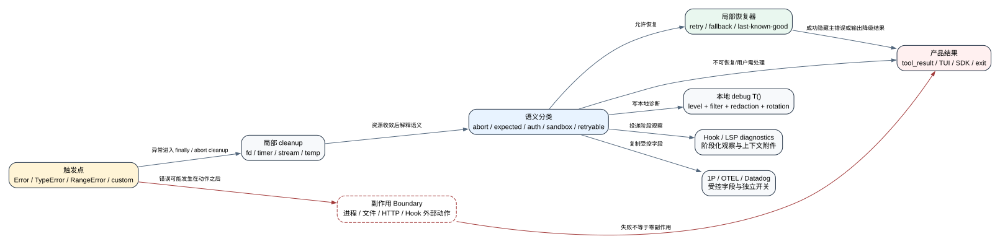

# Claude Code CLI 2.1.235 错误与诊断机制图谱

**读者问题：** 一条 `Error(...)`、一行 debug log、一个 tool failure 和一次 telemetry error 到底是什么关系，用户看到“失败”时哪些状态已经改变、客户端又会在哪里恢复？

**一句话模型：** 2.1.235 把失败拆成“异常对象 -> 语义分类 -> 局部恢复 -> 用户结果 -> debug/Hook/telemetry 观察面”；同一异常可以被恢复后只留日志，也可以成为 tool_result、turn terminal 或进程 exit，不能用一条错误文案代替整条状态机。

贯穿场景：Bash 在 sandbox 中命中策略。执行层抛出带 `code/stdout/stderr/interrupted/hadSandboxViolation` 的 `ShellError`；tool pipeline 先区分 interrupt、sandbox violation、expected tool error 与未知异常。只有在“sandbox violation、当前 tool 允许 unsandboxed retry、调用方没有显式禁用该恢复”同时成立时才自动重试一次；否则生成失败 tool_result。debug log 记录路径，telemetry 只发分类字段，PostToolUseFailure/StopFailure 观察失败，但已经启动的子进程或外部系统副作用不能由“抛错”自动回滚。

## 60 秒看懂：五层状态归属

| 层 | 谁拥有 / 状态归属 | 典型载体 | 对用户的意义 |
| --- | --- | --- | --- |
| 触发点 | 参数、文件、网络、进程、stream、协议当前状态 | `Error`/`TypeError`/`RangeError`/自定义 Error | 说明哪里检测到不变量破坏 |
| 语义分类 | abort、expected、permission、sandbox、auth、retryable、fatal | class/name/code/status/cause | 决定重试、降级、阻止还是终止 |
| 局部恢复器 | retry counter、fallback、last-known-good、cleanup、resume state | catch/retry/controller | 决定本操作是否还能继续 |
| 产品表面 | tool_result、stderr/TUI、SDK result、Hook event、exit code | human message + machine code | 用户真正看到和可操作的结果 |
| 观察面 | debug file、in-memory errors、1P/OTEL/Datadog | redacted log/event/error envelope | 用于诊断，不拥有业务回滚 |

## 生命周期：错误不是终点，而是分流点

1. **触发点构造异常。** `TypeError` 多用于调用契约或类型不变量，`RangeError` 多用于界限，普通 `Error` 覆盖依赖和产品状态；自定义 class 携带 code、path、status、stdout/stderr、reasonCode 等机器字段。
2. **立即清理局部资源。** `finally`/abort handler 关闭 stream、timer、fd、child process 或临时文件；清理失败常只追加 diagnostic，不能覆盖主错误。
3. **判断是否属于控制流。** `AbortError`、`APIUserAbortError`、`StreamClosedAbortError` 与 shutdown/background reason 不按未知崩溃处理，通常映射为 interrupted/cancelled。
4. **按子系统分类。** tool pipeline、request retry、MCP、Hook、config/startup、storage/rewind 各自解释 class/code/status；全局 `Error` 名称不是最终 taxonomy。
5. **执行局部恢复。** 可重试网络错误、beta strip、fallback、配置 last-known-good、sandbox unsandboxed retry、MCP reconnect 各有独立计数和 gate。
6. **生成用户结果。** 恢复成功则错误可能只留 debug；恢复失败则进入 tool_result、TUI/stderr、SDK result 或 terminal reason。
7. **复制到观察面。** `T()` 写 debug，`Re()` 进入错误 sink/in-memory buffer，1P/Datadog/Hook 记录经过约束的字段；这些出口不会替业务状态机做恢复。
8. **保留副作用边界。** 文件 rename、进程命令、HTTP POST、Hook command 已经执行后再抛错，失败结果只说明“未确认完整成功”，不证明零副作用。

## 三种内建 constructor：数量与含义

<!-- ERROR_DIAGNOSTIC_METRICS_START -->
- constructor callsites 共 **4,831**：`Error` **4,055**、`TypeError` **742**、`RangeError` **34**；三者合计必须等于总数。
- constructor message argument shape：`string` 2,891, `template` 1,493, `call` 169, `identifier` 110, `member-or-call` 67, `missing` 59, `expression` 23, `conditional` 17, `array` 2。`missing` 或动态表达式表示静态阶段拿不到最终 message，不表示没有错误。
- diagnostic `T()` callsites 共 **5,403**；显式/默认 level：`default-debug` 3,325, `verbose` 16, `debug` 42, `info` 58, `warn` 962, `error` 1,000。没有第二参数时由 `T()` 默认成 debug。
- diagnostic message argument shape：`template` 4,413, `string` 859, `identifier` 55, `member-or-call` 33, `conditional` 28, `call` 15。template 占多数，说明最终日志常带运行时 path/status/id，公开时不能只扫描固定 literal。
- exact owner projection 覆盖全部 **10,234** 条 callsite：`Product exact caller` **308**、`Dependency exact package/function` **250**、`Unresolved` **9,676**；当前精确收口 **558** 条，不用宽行区间或相似文案补 owner。
- 分流后 Error constructor 为 Product **54** / Dependency **250** / Unresolved **4,527**；Diagnostic 为 Product **254** / Dependency **0** / Unresolved **5,149**。
<!-- ERROR_DIAGNOSTIC_METRICS_END -->

## 精确 owner 投影：同一句错误为什么不能直接归模块

完整逐 callsite 结果见 [`error-diagnostic-owner-index.md`](error-diagnostic-owner-index.md)，机器投影见 [`error-diagnostic-owner-projection.jsonl`](error-diagnostic-owner-projection.jsonl)，覆盖与哈希见 [`error-diagnostic-owner-summary.json`](error-diagnostic-owner-summary.json)。这一层解决原清单最关键的缺口：`function + immediate consumer` 只能告诉读者“错误在当前 lexical scope 里怎样被构造”，不能自动回答它属于 Claude Code 产品、打包依赖，还是哪一个恢复 owner。

一个具体反例是 Zod。`"Unprocessed schema. This is a bug in Zod."` 位于经过复核的 Zod 内部 scope，可以标成 `Dependency exact package/function`；但另一个 caller 即使也写着 `expected a Zod schema`，仍可能是 Agent SDK 或产品 adapter 对输入的二次约束，不能靠 `Zod` 关键词继承 owner。同理，OpenTelemetry protobuf generated codec 与同一 canonical 行上的其他 constructor 不会因为行号相同一起归入 OTLP。

投影因此把结论拆成五个互不替代的字段：

| 字段 | 精确证据 | 为什么仍可能 Unresolved |
| --- | --- | --- |
| Product / Dependency owner | 完整 callsite identity 命中 reviewed allowlist | 同名 function、同一行或相似 message 都不构成 identity |
| lexical function | AST `scopePath + functionKind + function` | 压缩后短名不能单独说明产品模块 |
| immediate consumer | constructor/T() 的直接 AST parent/relation/role | `throw` 或 expression statement 不说明上层怎样消费 |
| catch / retry owner | exact Product rule 直接绑定 catch wrapper 或 attempt/breaker owner | owner 已解析不等于每条日志都持有 retry counter |
| tool-result / user-surface owner | exact ledger/end-turn 或输出 wrapper | debug diagnostic 不自动进入模型，也不自动显示给用户 |

当前高置信批次故意让 Product 的 catch 与 user-surface 字段继续全部 fail closed；只有直接位于 recovery controller 的 caller 获得 retry owner，只有 tool-result ledger、deferred resume 或 end-turn scope 获得 tool-result owner。这个保守结果比把几千个 `T()` 全称为“Claude Code 日志”更有用：排障者能区分已确认状态 owner 与仍待追踪的 caller chain，也能看到剩余欠账，而不是从一个很大的覆盖率数字里误读完整性。

这些计数来自 AST callsite，不等于 4,831 个产品故障：打包依赖、SDK、内嵌 runtime 都在同一 bundle。强结论必须回到 consumer。三个 constructor 的实用区别是：

- `TypeError`：调用方式、参数类型、private member 等程序契约破坏。它通常不适合用户重试同一个输入；若来自依赖，必须由上层翻译。
- `RangeError`：数值/长度/递归/索引越界。产品层常在 schema 或 CLI parser 提前截住，漏到顶层更像实现或依赖错误。
- `Error`：通用载体，语义完全依赖 class/name/code/status/cause 和捕获位置。只看 message 无法判断可恢复性。

## 产品错误类如何变成可操作结果

### 启动与配置：在进 Agent Loop 前失败

基础错误层定义 `CliUserError`、`ConfigParseError`、`ShellError`、`AbortError`、`TeleportOperationError` 和 telemetry-safe error，见 [`reverse/javascript/cli.readable.js` L13536-L13768](../reverse/javascript/cli.readable.js#L13536)。启动器只对前两类做专门用户处理：`CliUserError` 直接写 stderr 并 exit 1；`ConfigParseError` 在交互模式可打开修复 dialog，非交互则打印文件和原因后 exit 1，见 [L591180-L591244](../reverse/javascript/cli.readable.js#L591180)。其他异常继续抛给更高层，不能被误写成“所有启动错误都友好降级”。

### interrupt 与 stream close：控制流，不是普通失败

`Ic()` 同时识别内部 AbortError、SDK user abort、标准 `AbortError` name 和 Axios cancel，见 [L13538-L13545](../reverse/javascript/cli.readable.js#L13538)。Agent Loop 为 user-cancel、remote-cancel、shutdown、interrupt、background、fallback edit 和 recovery timeout 建立不同 abort reason；tool terminal 再结合 signal reason 映射 `interrupted` 或 `cancelled`，见 [L92624-L92628](../reverse/javascript/cli.readable.js#L92624)、[L315980-L316002](../reverse/javascript/cli.readable.js#L315980)。因此 Ctrl-C、stream 关闭和 timeout 不能统一统计成 tool failure。

### tool pipeline：expected error 与未知异常分开

tool 分类器优先识别 MCP auth/OAuth、Shell、MCP call、filesystem、read budget、telemetry-safe、malformed command，再用受控 class allowlist映射 `tool_expected_error`；剩余异常才是 `tool_call_threw`，见 [L315987-L316027](../reverse/javascript/cli.readable.js#L315987)。这个分类影响 telemetry 和 UI 的“sad/expected”语义，但不改变原始 tool_result：模型仍需看到足够的失败信息决定下一步。

### filesystem 与安全写入：失败可能保护了原文件

原子写入先写 temp、应用权限、fsync、rename；`fchmod/fsync` 不支持可降级，但 temp write/rename 失败会记录主错误并清理。另有 `SymlinkWriteRefusedError`、`StagingDirTamperedError`、`PathTraversalError` 等把路径不变量变成显式 class。安全拒绝说明目标写入没有按请求完成；若之前已创建 temp、修改别处或调用 Hook，仍需逐项判断副作用。

### API、stream 与 fallback：恢复状态属于请求控制器

API 层区分 status、request ID、stream idle/suspended、Bedrock content type、refusal/fallback 与 retry exhaustion。max-output continuation、signed-thinking resume、context-hint strip、server-fallback beta strip 都有自己的计数与 transcript 规则，不能用一个“自动重试 3 次”覆盖全部请求错误。详见 [resilience-and-recovery.md](resilience-and-recovery.md)；本图谱强调这些恢复完成后，原异常可能只留 debug/telemetry，不再成为 terminal。

### MCP、Hook、Agent 与 Workflow：外部 owner 不同

MCP error class携带 server/tool/transport/schema；Hook failure还要区分前置 fail-closed、后置 non-blocking 和 callback stream close；Workflow/Agent 有 precondition、budget、remote termination 与 monitor 错误。它们共同使用 `Error` 基类，但恢复 owner 分别是 MCP connection、Hook runner、subagent/workflow orchestrator，不能互相套用重试规则。

## 字段怎样驱动恢复，而不是只出现在日志里

错误对象的价值不在 class 名本身，而在上层只读取哪些字段。2.1.235 的关键判断可以压缩成下面这张“字段 -> 决策”表：

| 字段/关系 | 由谁写 | consumer 怎样读 | 恢复或终态 | 误读风险 |
| --- | --- | --- | --- | --- |
| `name=AbortError` / Axios `__CANCEL__` | abort controller、SDK、transport | `Ic()` 与各 loop 的 signal reason 联合判断 | interrupted/cancelled；通常不报未知崩溃 | 只看 name 会丢 user/remote/shutdown/background 区别 |
| `ShellError.code` | Bash/PowerShell runner | tool classifier 和结果 formatter | shell failure；interrupt 单独处理 | exit code 非零不证明命令零副作用 |
| `ShellError.hadSandboxViolation` | sandbox parser | Bash tool retry gate | 条件满足时只自动 unsandboxed retry 一次 | 不是所有 sandbox failure 都会放宽执行 |
| errno-shaped `code` | fs/network/runtime | `St/om/jx/bO` 等 sanitizer/classifier | fs expected error、transport retry 或用户修路径 | 同一个 `ENOENT` 在不同 owner 下语义不同 |
| HTTP `status` | SDK/Axios wrapper | auth、retry、beta strip、quota consumer | 401 refresh、400定向降级、429/5xx backoff 等 | “非 2xx”不是统一重试条件 |
| API `requestID` / client request ID | response/request wrapper | retry、telemetry、debug correlation | 关联多次 attempt，不拥有恢复 | ID 可关联敏感会话，不应公开原值 |
| `reasonCode` | Artifact/expected product errors | tool expected-error allowlist | 稳定 machine code + 人类 message | 只有格式受控的 reasonCode 才进入 telemetry code |
| `cause` chain | wrapper/custom error | 最多深度 5 的 cause 查找与 provider classifier | 保留根因类别，外层换用户文案 | 无限递归/任意对象不会被完整展开 |
| `telemetryMessage/errorClass` | 显式 telemetry-safe wrapper | error tracker 和 tool classifier | 上传受控替代文本/类别 | “safe”只覆盖该字段，不代表周边 payload 全安全 |
| `stdout/stderr` | process runner | tool result、debug、Hook payload | 给模型/用户诊断，可能截断 | 内容来自外部程序，既可能敏感也可能带指令文本 |

这里还有一个重要优先级：**控制流先于业务失败，具体 owner 先于通用 Error**。例如 `ShellError` 同时可能带 interrupted 和 non-zero code，上层先把 interrupt 映射为终止原因；MCP 401 若能识别 auth owner，会走 reauth，而不是先落入 generic `tool_call_threw`。只有前面的专门分支都不匹配，才使用未知异常兜底。

## 恢复预算与“只试一次”的边界

恢复器不是一个全局 retry 开关。不同层各自拥有预算，而且一次操作可能依次穿过多个预算：

- Bash sandbox violation 的 unsandboxed retry 由 tool 层决定，不复用 HTTP retry counter；用户或 policy 不允许 unsandboxed 时直接保留失败。
- request 429/5xx/backoff、stream resume、max-output continuation、fallback model、fallback beta strip 各有独立状态；一次请求的 attempt 增加不等于 Agent Loop turn 增加。
- LSP handler 不是失败一次就弹 warning；同一 server 连续累计到 3 次才输出“可能是 server 或 diagnostic processing 问题”。
- debug writer flush 最多观察 backend line 是否继续增长 3 轮；这是退出前 drain，不是业务操作重试。
- error ring 只保留最近 100 条；旧错误被移出内存不等于磁盘 debug、telemetry 或 transcript 已删除。

因此排障时要问“哪个 owner 的第几次 attempt”，不能只问“Claude Code 重试了几次”。如果用户看到两次外部 POST，也不能先归因于 HTTP retry：可能是业务提交、auth refresh 后重建、fallback lane 或用户再次执行，需要 request ID、method/path、attempt reason 一起判断。

## Debug logger：`T()` 实际做了什么

`T(message, {level})` 默认 `debug`，交给单例 `DebugLog`；不是 `console.log` 的别名，见 [L15235-L15250](../reverse/javascript/cli.readable.js#L15235)。关键机制：

| 机制 | 精确行为 | 证据 |
| --- | --- | --- |
| level | `verbose=0, debug=1, info=2, warn=3, error=4`，低于最小等级直接丢弃 | [L15250](../reverse/javascript/cli.readable.js#L15250) |
| 启用 gate | 外部构建默认需 `--debug`/`--debug-file`/DEBUG env 或运行时 `/debug`；test 环境无显式文件时不写 | [L14917-L14983](../reverse/javascript/cli.readable.js#L14917) |
| filter | `--debug=<filter>` 决定 `shouldLog`；多行在 formatted output 后会 JSON stringify | [L14940-L14955](../reverse/javascript/cli.readable.js#L14940) |
| redaction | 每行写入前经 `gp()` secret scanner；输出包含 ISO timestamp 和 level | [L14780-L14882](../reverse/javascript/cli.readable.js#L14780)、[L14949-L14960](../reverse/javascript/cli.readable.js#L14949) |
| buffering | writer 每 1 秒 flush，按内容长度计 buffer 100；退出时同步 drain 未刷 chunk | [L15138-L15163](../reverse/javascript/cli.readable.js#L15138) |
| rotation | raw log 超过 10,485,760 bytes 后转为 `.1`，失败时尝试 unlink/rename | [L14996-L15016](../reverse/javascript/cli.readable.js#L14996)、[L15250](../reverse/javascript/cli.readable.js#L15250) |
| storage | 默认 `<config>/debug/<session>.txt`；Storage V5 可写 `namespace=log, channel=debug` | [L14961-L14968](../reverse/javascript/cli.readable.js#L14961)、[L14899-L14907](../reverse/javascript/cli.readable.js#L14899) |

**隐私边界：** logger 的 regex 会遮盖多类 key/token/private key，但它不是信息流证明。普通路径、prompt、tool input、Hook output、server message 仍可能进入 debug；即使 secret scanner命中，也不保证所有自定义凭据格式可识别。因此仓库公开前仍需独立绝对路径/凭据扫描。

## Error sink、Datadog 与 telemetry：观察面不是一条管道

`Re(error)` 先把非 Error 转成 Error，然后逐项检查六个明确的 provider env 模式：`CLAUDE_CODE_USE_BEDROCK`、`CLAUDE_CODE_USE_VERTEX`、`CLAUDE_CODE_USE_FOUNDRY`、`CLAUDE_CODE_USE_ANTHROPIC_AWS`、`CLAUDE_CODE_USE_ANTHROPIC_GOOGLE_CLOUD`、`CLAUDE_CODE_USE_MANTLE`。任一命中，或 `DISABLE_ERROR_REPORTING`、essential-traffic 模式生效时，error sink 直接退出；普通 first-party Anthropic 不会仅因 provider 这一项被禁用。否则它保存 stack/message + timestamp 到最多 100 条的内存 ring，并投递 sink，见 [L17282-L17351](../reverse/javascript/cli.readable.js#L17282)、[L17394](../reverse/javascript/cli.readable.js#L17394)。这和 `T()` 本地 debug 是两条独立通道。

Datadog error envelope会：

- 把 message 截到 4,000 字符、formatted stack 截到 16,000 字符、frames 最多 20；
- sanitize class、errno、top frame、entrypoint、model/provider 等字段；
- 把 `APIUserAbortError`、`AuthenticationError`、`McpSessionExpiredError` 和少数已知网络 top frame 当噪声过滤；
- 区分 handled `logError`、`unhandled_rejection`、`uncaught_exception`。

对应实现见 [L110940-L111030](../reverse/javascript/cli.readable.js#L110940)。一方 event、OTEL log/span、Datadog error tracking 和 debug file 的开关、字段、采样与默认值不同，不能看到 `T(...,{level:"error"})` 就断言它被上传。

## LSP diagnostics：业务诊断内容怎样进入上下文

LSP diagnostics 不是 `T()` 消息。handler 验证 URI、range、message、severity，丢弃 malformed item；按 URI/内容去重后进入 pending registry，连续 3 次 handler failure 才追加 warning，见 [L193842-L193901](../reverse/javascript/cli.readable.js#L193842)。注入模型时：

- severity 映射为 Error/Warning/Info/Hint；
- 人类摘要用 1-based line/column；
- 整个 summary 超过 4,000 字符截断；
- 成功交付后清 pending/delivered state，失败时记录 error 并返回空 attachment。

格式化与 4,000 字符阈值见 [L180990-L181040](../reverse/javascript/cli.readable.js#L180990)，attachment 获取失败回退见 [L322743-L322763](../reverse/javascript/cli.readable.js#L322743)。这类 diagnostics 会占模型上下文；debug log 不会自动进入模型，除非 `/debug` 或其他工具显式读取。

## Token、延迟、成本、隐私与副作用

| 影响面 | 错误/诊断链怎样改变它 | 读者应如何判断 |
| --- | --- | --- |
| Token | LSP diagnostics 最多形成 `4,000` 字符 attachment；tool error、Hook output、MCP error 和恢复提示也可能进入下一轮模型上下文 | 本地 `T()` debug 不会自动入模；只有被包装为消息、tool_result 或 attachment 的内容才占上下文 token |
| 延迟 | cleanup、分类、network backoff、stream resume、fallback、MCP reconnect、debug flush 和 Hook runner各有独立等待 | “发生一次 Error”不能推导总等待；应记录 owner、attempt、timeout 和是否进入下一层恢复器 |
| 成本 | 重试、fallback model、重新生成、重新执行 tool 或人工重跑可能增加 API/计算成本 | error/diagnostic callsite 数量不是生产故障率或账单；实际成本需要 runtime usage/attempt 证据 |
| 隐私 | debug、stderr/tool_result、LSP message、error sink、telemetry/Datadog拥有不同字段、redaction、采样和存储位置 | secret scanner 与字段裁剪是局部控制，不证明 path、prompt、Hook output 或自定义 credential 全部被移除 |
| 安全 | path/symlink/tamper、permission、sandbox、auth 与 schema 错误可能是 fail-closed 保护结果 | “失败”不总是可靠性问题；放宽规则或盲目重试可能绕过原本阻止危险写入的控制 |
| 副作用 | process、file rename、HTTP POST、Hook command 或远端 write 可能先成功，随后在 readback/cleanup/response parse 处抛错 | tool_result、abort、tombstone、resume 或 retry只改变客户端后续状态，不能证明已执行的外部动作被事务性撤销 |

这也是为什么排障报告不能只粘贴最后一行 message。至少要把触发 owner、class/code/status/cause、发生在副作用前后、局部恢复次数、最终用户 surface 和观察通道分开；否则同一句 `failed` 既可能表示“安全拒绝且目标未改”，也可能表示“远端写入完成但确认失败”。

## 用户症状与恢复决策表

| 用户症状 | 先看哪个 owner | 客户端可能恢复 | 不能据此断言 |
| --- | --- | --- | --- |
| 命令启动即 exit 1 | CLI parser/config loader | 修配置、交互 dialog | Agent Loop 已启动 |
| tool_result 显示失败 | tool executor + permission/sandbox | 重试、改输入、unsandboxed retry | 外部副作用为零 |
| 回答中断/取消 | abort reason + stream owner | resume/new turn | 远端请求一定停止 |
| “API error”后自动继续 | request retry/fallback controller | backoff、model fallback、beta strip | 第一次请求没计费/没产生服务端副作用 |
| MCP tool unavailable | MCP transport/auth/schema owner | reconnect、reauth、refresh tools | server 未配置 |
| Hook error但主流程继续 | Hook stage | 后置 Hook non-blocking | Hook command 没做外部动作 |
| debug 有 error、界面正常 | logger/局部 catch | 已被局部恢复 | 产品动作失败 |
| telemetry/Datadog有 error | observability sink | 不负责恢复 | 用户一定看见同一文本 |
| diagnostics 被截断 | LSP attachment formatter | 下一轮重新获取 | 原始 LSP 只有 4,000 字符 |

## 从一行日志反查到可验证结论

面对 `Failed to ...`、`retrying` 或 `continuing without ...`，按下面顺序查，能避免把诊断文本写成行为事实：

1. 在 `diagnostic-message-callsites.jsonl` 找 `comparisonKey`、`function`、argument shape 和显式 level；template 中的 path/status/id 只在运行时才确定。
2. 回到 readable callsite，看 `T()` 前后的 `if/catch/return/throw`。`T(...); return null`、`T(...); throw`、`T(...); continue` 对用户的结果完全不同。
3. 找调用者怎样消费返回值。返回 `null` 可能代表“功能关闭后继续”，也可能在上层立即变成 fatal precondition；不能停在当前函数。
4. 查副作用发生在日志前还是日志后。`POST` 已返回异常、temp file 已写、Hook command 已启动和仅做参数校验属于不同恢复成本。
5. 最后才核对用户表面、Hook event、telemetry 和 exit status；若没有精确 Probe，只写 Static 分支与 Boundary，不补想象中的实际输出。

反过来也成立：用户看见一个简短错误，不代表 debug 只有这句话。产品层会把内部 class/status/cause 压成可操作文案，原始 stack 可能只在 debug/error sink；公开 issue 时应先复现、裁剪最小相关区间并再次做 path/token 清理，而不是上传整个 session debug 文件。

## 全量清单怎样使用，而不是怎样堆出来

原始 evidence substrate 保留：

- [`error-message-callsites.jsonl`](source-inventory/error-message-callsites.jsonl)：4,831 个 `Error/TypeError/RangeError` AST 调用点，含 constructor、argument shape、function、line/offset；
- [`error-message-templates.jsonl`](source-inventory/error-message-templates.jsonl)：1,526 个模板/表达式聚合；
- [`error-message-literals.txt`](source-inventory/error-message-literals.txt)：2,248 个固定 literal；
- [`diagnostic-message-callsites.jsonl`](source-inventory/diagnostic-message-callsites.jsonl)：5,403 个 `T()` 调用点；
- [`diagnostic-message-templates.jsonl`](source-inventory/diagnostic-message-templates.jsonl)：4,438 个模板/表达式聚合；
- [`diagnostic-message-literals.txt`](source-inventory/diagnostic-message-literals.txt)：830 个固定 literal。

正确读法是：先用本文确定 owner 和恢复问题，再在 JSONL 里按 `calleeRole/function/nameArgument/comparisonKey` 找候选，最后回到 readable consumer。不能按英文关键词把 `failed` 全算成用户错误，也不能按 `level:error` 全算成上传 telemetry。

## 证据与边界

**Static：** constructor、logger、error sink、tool classifier、startup catch、LSP diagnostics 和阈值都来自 2.1.235 可读 bundle；计数来自 canonical inventory 的 AST/regex 生成物。可读视图是格式化重建层，不是 Anthropic 原始源码。

**Boundary：** 没有 exact-binary Probe 的分支不声明实际触发；没有网络捕获的 observation 不声明已上传；异常发生在外部副作用之后时不声明事务回滚；服务端 error taxonomy、Datadog backend retention、Hook 外部程序行为和 provider 网络状态不在客户端发布物内。

复核强结论时应从 inventory 行回到真实 consumer：基础错误 class 与 abort classifier 见 [`reverse/javascript/cli.readable.js` L13536-L13768](../reverse/javascript/cli.readable.js#L13536)，debug writer、filter、rotation 与 redaction 见 [L14780-L15250](../reverse/javascript/cli.readable.js#L14780)，error sink 见 [L17282-L17394](../reverse/javascript/cli.readable.js#L17282)，LSP attachment 与 handler 见 [L180990-L181040](../reverse/javascript/cli.readable.js#L180990) 和 [L193842-L193901](../reverse/javascript/cli.readable.js#L193842)，tool error 分类见 [L315980-L316027](../reverse/javascript/cli.readable.js#L315980)。这些位置证明客户端分支与阈值，不能证明某次真实运行触发、日志已上传或外部动作已回滚。
