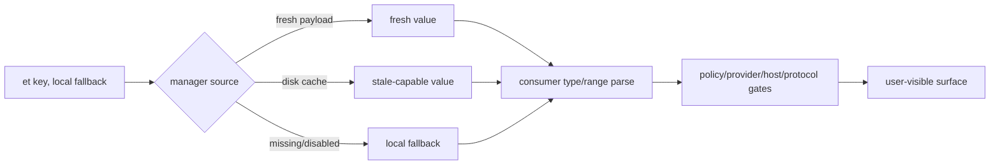

# Claude Code CLI 2.1.235 Feature Flag 逐 key 参考：默认值、consumer 和服务端边界

## 读者问题

为什么 bundle 中明明存在一个 `tengu_*` key，别人的客户端有功能而我的没有？为什么某个 key 的 fallback 是 `true`，功能仍可能被 policy、provider 或 host 关闭？

## 一句话心智模型

Feature key 只是取值入口：**reader + 本地 fallback + fresh/disk/remote source + consumer 自己的类型解析 + policy/provider/protocol 二次门** 共同决定行为；key 名和 fallback 都不是功能已交付的证明。

## 贯穿场景

用户打开 Remote Control。客户端先通过 first-party endpoint、auth scope、subscription/organization 和 managed policy，再读取 `tengu_ccr_bridge`。fresh true 可以立即通过；disk true 是 stale-capable；没有值时使用本地 fallback。即使 flag 为 true，前置 gate 仍可拒绝。反过来，bundle 中出现 key 也不代表服务端给当前账号下发 true。

## 状态总表

| 状态 | 本版数量 | 能证明什么 | 不能证明什么 |
| --- | ---: | --- | --- |
| static feature keys | 361 | 至少一个 `et()` 名称可静态恢复 | 账号当前值或功能已启用 |
| 已绑定业务 consumer 合同 | 205 个 key | 已人工追到 fallback 解析、二次 gate、状态变化与失败边界 | 服务端 value/rule/rollout 和当前账号可达性 |
| 已绑定 immediate AST consumer、未完成人工机制解释 | 156 个 key | key、fallback、lexical function、role/operator/target 和位置可交叉比较 | 不得从 codename 或 immediate syntax 直接推断全部 caller、二次 gate 和产品结果 |
| 可静态恢复的 `et()` callsites | 455 | direct literal 或 assignment resolver 得到 361 个 key | 远端值、consumer reachability 或线上 rollout |
| direct literal `et()` callsites | 444 | key 直接写在调用参数中 | consumer 分支当前可达 |
| assignment-resolved `et()` callsites | 11 | 非 literal 语法可追到静态 key；6 个 key 只通过这一级进入 361 key 集合 | 运行时 feature value 已知 |
| truly dynamic unresolved `et()` callsites | 43 | 只保留表达式和调用点 | 最终 key、远端值和语义 |
| nonliteral syntax（证据形态，不是 dynamic 口径） | 54 | 11 个 assignment-resolved + 43 个 unresolved | 可以把 54 个全部标为 dynamic |
| 全部 `et()` callsites | 498 | reader 调用面完整 | 服务器规则、rollout 比例、entitlement |
| cached dynamic-config static keys | 6 | `CB()` 的静态 key 集合 | dynamic config 天然 fresh 或 schema 已验证 |
| 全部 cached dynamic-config callsites | 12 | 静态与动态 `CB()` 调用面 | 当前 payload 与服务端规则 |

## 字段怎么读

| 字段 | 精确含义 | 常见误读 |
| --- | --- | --- |
| `defaults` | 每个 callsite 传给 reader 的本地 fallback 原表达式 | 把它叫服务端默认值 |
| `shape` | 仅从 fallback syntax 推导的形状，明确是 heuristic | 把 object-like 当成已验证 JSON schema |
| `count/functions` | 该 key 的静态调用次数和 lexical function | 把 minified function 名翻译成业务模块 |
| `immediate consumer roles / targets` | `et()` 返回值直接进入的 if/return/variable/call/member/operator 与静态 target | 把 immediate parent 当成全部 caller 链或最终状态变化 |
| `category` | 名称关键词导航，统一标 `Heuristic/name` | 把 codenames 展开成产品结论 |
| `meaning/evidence` | 已人工收口的 key 给出完整 consumer 机制；其余 key 至少给出 Static immediate consumer，codename 仍标 Opaque name | 从 key 名或 immediate parent 自行生成二次 gate、失败恢复或十分钟故事 |
| `Boundary` | 当前账号 payload、server rule、experiment 分桶、entitlement 不在 bundle | 用本地静态证据宣称线上 rollout |

## 失败与服务端边界

1. `et(key, fallback)` 的 fallback 是客户端调用点默认，不是服务端 feature definition 的 default。
2. fresh map、disk last-known-good、fallback 可以让同一版本、不同启动状态出现不同结果。
3. consumer 必须自行验证 object/string/number 的类型和范围；Feature manager 不替业务完成 schema 校验。
4. policy、permission、provider、host、model、protocol 和 subscription gate 可以在 flag 之后再次拒绝。
5. server-side rule、rollout 百分比、实验分桶、紧急 kill switch、账号实时值都属于 Boundary。
6. 498 个调用点必须按 `455 static-resolvable + 43 truly dynamic` 计数；455 又分为 444 direct literal 和 11 assignment-resolved。不能把 54 个 nonliteral syntax 全部叫 dynamic。

## 三个读法示例

### 1. 布尔 fallback

`!0` 是压缩后的 true，`!1` 是 false。它只回答“manager 没给值时 consumer 收到什么”，不回答服务器是否下发、是否曝光、其他 gate 是否通过。

### 2. object fallback

`tengu_prompt_cache_1h_config` 的 fallback 是带 allowlist 的 object；这能说明 consumer 期待配置形状，但不能证明服务端不会增加字段，也不能证明 provider 实际命中一小时缓存。

### 3. opaque codename

`tengu_amber_anchor` 一类 key 的 codename 仍不可解释；本文保留 fallback、lexical function、immediate role/operator/target 和位置，标为 `Opaque name / Static immediate consumer`。只有 caller、二次 gate、状态变化与失败恢复人工收口后，才能升级为完整 consumer 合同；服务端 value/rule/rollout 仍单独是 Boundary。

## 361 个 static feature key 逐项参考

覆盖合同：`361/361`，对应 `455/455` 个可静态恢复调用点。`count` 同时包含 direct literal 和 assignment-resolved 静态调用。

| key | defaults / shape | count / functions | immediate consumer roles / targets | locations | category | meaning / evidence | Boundary |
| --- | --- | --- | --- | --- | --- | --- | --- |
| <code>tengu_alder_compass</code> | <code>!1</code> shape heuristic: boolean(false) | 1 / <code>isRelevant</code> x1 | <code>isRelevant</code>: <code>return</code> | [read L63589:C4320](../extracted/cli.js#L63589) | Heuristic/name：opaque experiment codename | Opaque name / Static consumer 人工合同：owner=startup tip `powerup-onboarding` relevance predicate；读取位置=`isRelevant` 在 [readable L583244](../reverse/javascript/cli.readable.js#L583244) 读取或写入该值；fallback/precedence=boolean fallback false；还要求 startup count <10 且尚未解锁任何 powerup；state delta=把 `/powerup` 交互教程 tip 加入候选池，priority 3、cooldown 1 session；真正显示还要赢过更高优先级/更久未展示的候选；failure/Boundary=关闭或不相关只隐藏 tip，不禁用 `/powerup`；tip rendering/persistence failure 不影响主会话；用户影响=影响新用户早期发现教学入口，不改变 Agent Loop、工具权限或功能可用性。详见 [onboarding-workspace-trust-and-safe-startup.md](onboarding-workspace-trust-and-safe-startup.md)。 | 服务端 value/rule/rollout 与 consumer reachability 均未观察。 |
| <code>tengu_amber_anchor</code> | <code>!1</code> shape heuristic: boolean(false) | 1 / <code>HIt</code> x1 | <code>HIt</code>: <code>return</code> | [read L388:C34027](../extracted/cli.js#L388) | Heuristic/name：opaque experiment codename | Opaque name / Static immediate consumer：codename 本身不可解释，但本行已给出 lexical function、immediate AST role/operator/target、fallback 和位置。Semantic follow-up：全部 caller、二次 gate、状态变化与失败恢复尚未人工收口；不得从 codename 自行生成功能结论。 | 服务端 value/rule/rollout 与 consumer reachability 均未观察。 |
| <code>tengu_amber_creek</code> | <code>!1</code> shape heuristic: boolean(false) | 2 / <code>_Tb</code> x1, <code>spt</code> x1 | <code>_Tb</code>: <code>assignment (op=??=, target=e.downsellGateCached)</code> <code>spt</code>: <code>logical (op=??, target=right)</code> | [read L800:C3079](../extracted/cli.js#L800) [read L800:C3698](../extracted/cli.js#L800) | Heuristic/name：opaque experiment codename | Opaque name / Static immediate consumer：codename 本身不可解释，但本行已给出 lexical function、immediate AST role/operator/target、fallback 和位置。Semantic follow-up：全部 caller、二次 gate、状态变化与失败恢复尚未人工收口；不得从 codename 自行生成功能结论。 | 服务端 value/rule/rollout 与 consumer reachability 均未观察。 |
| <code>tengu_amber_flint</code> | <code>!0</code> shape heuristic: boolean(true) | 1 / <code>_d</code> x1 | <code>_d</code>: <code>unary (op=!)</code> | [read L2945:C2319](../extracted/cli.js#L2945) | Heuristic/name：opaque experiment codename | Opaque name / Static immediate consumer：codename 本身不可解释，但本行已给出 lexical function、immediate AST role/operator/target、fallback 和位置。Semantic follow-up：全部 caller、二次 gate、状态变化与失败恢复尚未人工收口；不得从 codename 自行生成功能结论。 | 服务端 value/rule/rollout 与 consumer reachability 均未观察。 |
| <code>tengu_amber_kestrel</code> | <code>!1</code> shape heuristic: boolean(false) | 1 / <code>D</code> x1 | <code>D</code>: <code>if (target=test)</code> | [read L16010:C35497](../extracted/cli.js#L16010) | Heuristic/name：opaque experiment codename | Opaque name / Static immediate consumer：codename 本身不可解释，但本行已给出 lexical function、immediate AST role/operator/target、fallback 和位置。Semantic follow-up：全部 caller、二次 gate、状态变化与失败恢复尚未人工收口；不得从 codename 自行生成功能结论。 | 服务端 value/rule/rollout 与 consumer reachability 均未观察。 |
| <code>tengu_amber_lark</code> | <code>!1</code> shape heuristic: boolean(false) | 1 / <code>O5v</code> x1 | <code>O5v</code>: <code>if (target=test)</code> | [read L19639:C10](../extracted/cli.js#L19639) | Heuristic/name：opaque experiment codename | Opaque name / Static immediate consumer：codename 本身不可解释，但本行已给出 lexical function、immediate AST role/operator/target、fallback 和位置。Semantic follow-up：全部 caller、二次 gate、状态变化与失败恢复尚未人工收口；不得从 codename 自行生成功能结论。 | 服务端 value/rule/rollout 与 consumer reachability 均未观察。 |
| <code>tengu_amber_lattice</code> | <code>{}</code> shape heuristic: object-like | 1 / <code>DCm</code> x1 | <code>DCm</code>: <code>member (op=., target=plugins)</code> | [read L21540:C3210](../extracted/cli.js#L21540) | Heuristic/name：opaque experiment codename | Opaque name / Static immediate consumer：codename 本身不可解释，但本行已给出 lexical function、immediate AST role/operator/target、fallback 和位置。Semantic follow-up：全部 caller、二次 gate、状态变化与失败恢复尚未人工收口；不得从 codename 自行生成功能结论。 | 服务端 value/rule/rollout 与 consumer reachability 均未观察。 |
| <code>tengu_amber_lynx</code> | <code>!1</code> shape heuristic: boolean(false) | 1 / <code>Cwh</code> x1 | <code>Cwh</code>: <code>variable (target=D)</code> | [read L22918:C10685](../extracted/cli.js#L22918) | Heuristic/name：opaque experiment codename | Opaque name / Static immediate consumer：codename 本身不可解释，但本行已给出 lexical function、immediate AST role/operator/target、fallback 和位置。Semantic follow-up：全部 caller、二次 gate、状态变化与失败恢复尚未人工收口；不得从 codename 自行生成功能结论。 | 服务端 value/rule/rollout 与 consumer reachability 均未观察。 |
| <code>tengu_amber_packet</code> | <code>!1</code> shape heuristic: boolean(false) | 1 / <code>eyi</code> x1 | <code>eyi</code>: <code>logical (op=&amp;&amp;, target=left)</code> | [read L14565:C9127](../extracted/cli.js#L14565) | Heuristic/name：opaque experiment codename | Opaque name / Static consumer 行为：consumer `eyi` 是预计算摘要 sidecar 的持久化/rehydrate gate，且 session persistence 必须未被显式关闭。通过后 main-agent ready 结果可写 `precompact.json`/Storage v5 sidecar；复用还校验 session、model、7 天时效、150000-token 增长、boundary/preserve UUID，失败会删 sidecar 并回退普通总结，不把陈旧 summary 注入历史。详见 [context-governance-and-caching.md](context-governance-and-caching.md)。 | 服务端 value/rule/rollout 与 consumer reachability 均未观察。 |
| <code>tengu_amber_prism</code> | <code>!1</code> shape heuristic: boolean(false) | 1 / <code>GNt</code> x1 | <code>GNt</code>: <code>logical (op=&amp;&amp;, target=right)</code> | [read L21134:C3308](../extracted/cli.js#L21134) | Heuristic/name：opaque experiment codename | Opaque name / Static immediate consumer：codename 本身不可解释，但本行已给出 lexical function、immediate AST role/operator/target、fallback 和位置。Semantic follow-up：全部 caller、二次 gate、状态变化与失败恢复尚未人工收口；不得从 codename 自行生成功能结论。 | 服务端 value/rule/rollout 与 consumer reachability 均未观察。 |
| <code>tengu_amber_quill_moth</code> | <code>!1</code> shape heuristic: boolean(false) | 1 / <code>Mnf</code> x1 | <code>Mnf</code>: <code>return</code> | [read L14233:C9386](../extracted/cli.js#L14233) | Heuristic/name：opaque experiment codename | Opaque name / Static immediate consumer：codename 本身不可解释，但本行已给出 lexical function、immediate AST role/operator/target、fallback 和位置。Semantic follow-up：全部 caller、二次 gate、状态变化与失败恢复尚未人工收口；不得从 codename 自行生成功能结论。 | 服务端 value/rule/rollout 与 consumer reachability 均未观察。 |
| <code>tengu_amber_redwood2</code> | <code>""</code> shape heuristic: string-like | 1 / <code>j2p</code> x1 | <code>j2p</code>: <code>logical (op=&#124;&#124;, target=left)</code> | [read L3105:C34140](../extracted/cli.js#L3105) | Heuristic/name：opaque experiment codename | Opaque name / Static consumer 行为：与 `tengu_amber_redwood3` 以短路 OR 组成字符串配置，consumer `MPa` 仅在 auto compact 开启、非 bare mode、模型严格等于 `claude-opus-4-8` 时解析 `auto`、K/M 或数值窗口，并限制到 32000-1000000 token；空值/非法值不覆盖正常窗口计算。客户端选择窗口不证明服务端模型接受该上下文长度。详见 [context-governance-and-caching.md](context-governance-and-caching.md)。 | 服务端 value/rule/rollout 与 consumer reachability 均未观察。 |
| <code>tengu_amber_redwood3</code> | <code>""</code> shape heuristic: string-like | 1 / <code>j2p</code> x1 | <code>j2p</code>: <code>logical (op=&#124;&#124;, target=right)</code> | [read L3105:C34171](../extracted/cli.js#L3105) | Heuristic/name：opaque experiment codename | Opaque name / Static consumer 行为：作为 `tengu_amber_redwood2` 的第二优先级字符串输入，只在前者为空时生效；后续仍经过 Opus 4.8、auto-compact、bare-mode 和 32000-1000000 范围校验。它改变客户端 compact window 候选，不改变 provider 的实际 context limit；非法值静默回到既有窗口路径。详见 [context-governance-and-caching.md](context-governance-and-caching.md)。 | 服务端 value/rule/rollout 与 consumer reachability 均未观察。 |
| <code>tengu_amber_relay</code> | <code>!1</code> shape heuristic: boolean(false) | 1 / <code>BXs</code> x1 | <code>BXs</code>: <code>return</code> | [read L392:C471](../extracted/cli.js#L392) | Heuristic/name：opaque experiment codename | Opaque name / Static immediate consumer：codename 本身不可解释，但本行已给出 lexical function、immediate AST role/operator/target、fallback 和位置。Semantic follow-up：全部 caller、二次 gate、状态变化与失败恢复尚未人工收口；不得从 codename 自行生成功能结论。 | 服务端 value/rule/rollout 与 consumer reachability 均未观察。 |
| <code>tengu_amber_rokovoko</code> | <code>_ui</code> shape heuristic: expression/unknown | 1 / <code>OPa</code> x1 | <code>OPa</code>: <code>variable (target=e)</code> | [read L3105:C39184](../extracted/cli.js#L3105) | Heuristic/name：opaque experiment codename | Opaque name / Static immediate consumer：codename 本身不可解释，但本行已给出 lexical function、immediate AST role/operator/target、fallback 和位置。Semantic follow-up：全部 caller、二次 gate、状态变化与失败恢复尚未人工收口；不得从 codename 自行生成功能结论。 | 服务端 value/rule/rollout 与 consumer reachability 均未观察。 |
| <code>tengu_amber_sentinel</code> | <code>!1</code> shape heuristic: boolean(false) | 1 / <code>Hbe</code> x1 | <code>Hbe</code>: <code>return</code> | [read L1377:C253](../extracted/cli.js#L1377) | Heuristic/name：opaque experiment codename | Opaque name / Static immediate consumer：codename 本身不可解释，但本行已给出 lexical function、immediate AST role/operator/target、fallback 和位置。Semantic follow-up：全部 caller、二次 gate、状态变化与失败恢复尚未人工收口；不得从 codename 自行生成功能结论。 | 服务端 value/rule/rollout 与 consumer reachability 均未观察。 |
| <code>tengu_amber_sextant</code> | <code>!0</code> shape heuristic: boolean(true) | 1 / <code>cdT</code> x1 | <code>cdT</code>: <code>unary (op=!)</code> | [read L21579:C2306](../extracted/cli.js#L21579) | Heuristic/name：opaque experiment codename | Opaque name / Static immediate consumer：codename 本身不可解释，但本行已给出 lexical function、immediate AST role/operator/target、fallback 和位置。Semantic follow-up：全部 caller、二次 gate、状态变化与失败恢复尚未人工收口；不得从 codename 自行生成功能结论。 | 服务端 value/rule/rollout 与 consumer reachability 均未观察。 |
| <code>tengu_amber_wren</code> | <code>{}</code> shape heuristic: object-like | 1 / <code>pmt</code> x1 | <code>pmt</code>: <code>variable (target=t)</code> | [read L1964:C29687](../extracted/cli.js#L1964) | Heuristic/name：opaque experiment codename | Opaque name / Static consumer 行为：consumer `pmt` 把 object 字段逐项解析为默认文件读取限制：`maxSizeBytes`/`maxTokens` 只接受 finite positive number，`includeMaxSizeInPrompt`/`targetedRangeNudge` 只接受 boolean；环境 `CLAUDE_CODE_FILE_READ_MAX_OUTPUT_TOKENS` 对 maxTokens 优先，结果缓存进 runtime state。非法字段回落 25k-token 等内置值；限制只约束 Read/附件装配，不证明文件内容已进入模型。详见 [builtin-tools-reference.md](builtin-tools-reference.md)。 | 服务端 value/rule/rollout 与 consumer reachability 均未观察。 |
| <code>tengu_ant_yolo_equiv_strip_config</code> | <code>{}</code> shape heuristic: object-like | 1 / <code>lKS</code> x1 | <code>lKS</code>: <code>variable (target=e)</code> | [read L14993:C9868](../extracted/cli.js#L14993) | Heuristic/name：opaque experiment codename | Opaque name / Static immediate consumer：codename 本身不可解释，但本行已给出 lexical function、immediate AST role/operator/target、fallback 和位置。Semantic follow-up：全部 caller、二次 gate、状态变化与失败恢复尚未人工收口；不得从 codename 自行生成功能结论。 | 服务端 value/rule/rollout 与 consumer reachability 均未观察。 |
| <code>tengu_artifact_hljs_highlight</code> | <code>!0</code> shape heuristic: boolean(true) | 1 / <code>kef</code> x1 | <code>kef</code>: <code>return</code> | [read L3470:C2681](../extracted/cli.js#L3470) | Heuristic/name：UI/IDE/媒体 | Static consumer 人工合同：owner=Artifact HTML publish enrichment gate `kef -> Hnf/r$a`；读取位置=`kef` 在 [readable L242530](../reverse/javascript/cli.readable.js#L242530) 读取或写入该值；fallback/precedence=boolean fallback 为 true；仍要求 publish caller 请求 highlight runtime，且 HTML 扫描到受支持的 `language-*` code block；state delta=安全校验 vendored highlight.js 与 init script 后，把两段 runtime 注入发布页；单块最多 50,000 字符、整页高亮预算 250,000 字符、注入块小于 4 MiB；failure/Boundary=flag off 或未检出代码只是不注入；bundle unreadable、unsafe、overspan 或 block 无法可靠剥离时记录 `artifact_publish` cause 并保留无高亮页面，不把失败伪装成代码内容错误；用户影响=改变已发布 Artifact 的代码着色、脚本体积和浏览器执行成本，不改变模型上下文、源代码文本或 Artifact 写权限。详见 [workflow-artifact-design.md](workflow-artifact-design.md)。 | 服务端 value/rule/rollout 与 consumer reachability 均未观察。 |
| <code>tengu_artifact_mermaid_diagrams</code> | <code>!0</code> shape heuristic: boolean(true) | 1 / <code>fNt</code> x1 | <code>fNt</code>: <code>return</code> | [read L3497:C537](../extracted/cli.js#L3497) | Heuristic/name：UI/IDE/媒体 | Static consumer 人工合同：owner=Artifact Mermaid fence renderer/runtime gate `fNt -> Vrf/Hnf`；读取位置=`fNt` 在 [readable L242638](../reverse/javascript/cli.readable.js#L242638) 读取或写入该值；fallback/precedence=boolean fallback 为 true；只认 fenced code 的首个语言 token `mermaid`，runtime 注入还要求 caller 开启 diagram lane 且页面实际含 diagram；state delta=把合格 fence 变成 `<pre class="mermaid">`，并按页面主题注入 strict-security Mermaid runtime；主题变化会重新渲染但不会改源 diagram text；failure/Boundary=关闭时新页面不获得 diagram renderer；已有 composed PR review 若携带 diagram runtime，republish 会明确拒绝而不是悄悄丢图；bundle load/validation 失败也会保留 named publish error；用户影响=决定 Artifact 中图表是可渲染图还是普通代码，并影响 republish 连续性、页面脚本体积与浏览器执行面。详见 [workflow-artifact-design.md](workflow-artifact-design.md)。 | 服务端 value/rule/rollout 与 consumer reachability 均未观察。 |
| <code>tengu_async_goblet</code> | <code>!0</code> shape heuristic: boolean(true) | 1 / <code>lwi</code> x1 | <code>lwi</code>: <code>conditional (target=test)</code> | [read L16055:C2270](../extracted/cli.js#L16055) | Heuristic/name：opaque experiment codename | Opaque name / Static immediate consumer：codename 本身不可解释，但本行已给出 lexical function、immediate AST role/operator/target、fallback 和位置。Semantic follow-up：全部 caller、二次 gate、状态变化与失败恢复尚未人工收口；不得从 codename 自行生成功能结论。 | 服务端 value/rule/rollout 与 consumer reachability 均未观察。 |
| <code>tengu_auto_mode_config</code> | <code>ARd</code> <code>{}</code> <code>kmf</code> shape heuristic: expression/unknown, object-like | 23 / <code>Bvm</code> x1, <code>IRd</code> x1, <code>Q$f</code> x1, <code>RnT</code> x1, <code>U$f</code> x1, <code>Uur</code> x1, <code>a$f</code> x1, <code>aBf</code> x1, <code>c$f</code> x1, <code>cXa</code> x1, <code>fLf</code> x1, <code>fSv</code> x1, <code>iBf</code> x1, <code>l$f</code> x1, <code>lBf</code> x1, <code>lRi</code> x1, <code>mAp</code> x1, <code>mSv</code> x1, <code>nTm</code> x1, <code>pAp</code> x1, <code>r5a</code> x1, <code>sBf</code> x1, <code>t5a</code> x1 | <code>Bvm</code>: <code>member (op=., target=classifyAskUserQuestion)</code> <code>IRd</code>: <code>variable (target=e)</code> <code>Q$f</code>: <code>member (op=., target=severityByModel)</code> <code>RnT</code>: <code>member (op=., target=enabled)</code> <code>U$f</code>: <code>variable (target=e)</code> <code>Uur</code>: <code>variable (target=t)</code> <code>a$f</code>: <code>member (op=., target=gitStatusType)</code> <code>aBf</code>: <code>member (op=., target=twoStageClassifier)</code> <code>c$f</code>: <code>member (op=., target=gitStatusTruncationLimit)</code> <code>cXa</code>: <code>member (op=., target=envOnboarding)</code> <code>fLf</code>: <code>variable (target=t)</code> <code>fSv</code>: <code>member (op=., target=s1SuffixByModel)</code> <code>iBf</code>: <code>member (op=., target=maxRetries)</code> <code>l$f</code>: <code>member (op=., target=gitStatusUploads)</code> <code>lBf</code>: <code>variable (target=e)</code> <code>lRi</code>: <code>member (op=., target=repoVisibility)</code> <code>mAp</code>: <code>member (op=., target=editRemovalCap)</code> <code>mSv</code>: <code>member (op=., target=s2SuffixByModel)</code> <code>nTm</code>: <code>member (op=., target=classifyEditsModels)</code> <code>pAp</code>: <code>variable (target=t)</code> <code>r5a</code>: <code>variable (target=e)</code> <code>sBf</code>: <code>member (op=., target=unavailableOuterRetries)</code> <code>t5a</code>: <code>member (op=., target=enabled)</code> | [read L475:C525](../extracted/cli.js#L475) [read L2661:C448](../extracted/cli.js#L2661) [read L2661:C740](../extracted/cli.js#L2661) [read L14994:C8452](../extracted/cli.js#L14994) [read L14994:C8564](../extracted/cli.js#L14994) [read L17843:C5632](../extracted/cli.js#L17843) [read L18093:C1112](../extracted/cli.js#L18093) [read L18093:C4315](../extracted/cli.js#L18093) [read L18093:C4579](../extracted/cli.js#L18093) [read L18093:C4844](../extracted/cli.js#L18093) [read L18386:C300](../extracted/cli.js#L18386) [read L18443:C293](../extracted/cli.js#L18443) [read L18443:C470](../extracted/cli.js#L18443) [read L18443:C613](../extracted/cli.js#L18443) [read L18447:C2703](../extracted/cli.js#L18447) [read L18447:C3959](../extracted/cli.js#L18447) [read L18447:C4157](../extracted/cli.js#L18447) [read L18447:C4375](../extracted/cli.js#L18447) [read L18447:C4608](../extracted/cli.js#L18447) [read L18456:C1921](../extracted/cli.js#L18456) [read L20881:C14346](../extracted/cli.js#L20881) [read L21031:C274](../extracted/cli.js#L21031) [read L21031:C3277](../extracted/cli.js#L21031) | Heuristic/name：permission/Auto Mode/policy | Static consumer 教学解释：交付 Auto Mode 配置对象。consumer 继续解析 enabled/config 字段，deterministic permission/policy floor 仍具有最终约束力。详见 [auto-mode-classifier.md](auto-mode-classifier.md)。 | 服务端 value/rule/rollout 与 consumer reachability 均未观察。 |
| <code>tengu_auto_mode_worktree_fast_path</code> | <code>!1</code> shape heuristic: boolean(false) | 1 / <code>_$i</code> x1 | <code>_$i</code>: <code>return</code> | [read L21033:C27387](../extracted/cli.js#L21033) | Heuristic/name：permission/Auto Mode/policy | Static consumer 教学解释：控制 Auto Mode worktree fast path；deterministic policy floor、classifier result、worktree creation 与 tool permission 仍具有最终约束力。详见 [auto-mode-classifier.md](auto-mode-classifier.md)。 | 服务端 value/rule/rollout 与 consumer reachability 均未观察。 |
| <code>tengu_basalt_loom</code> | <code>!1</code> shape heuristic: boolean(false) | 1 / <code>Vip</code> x1 | <code>Vip</code>: <code>logical (op=??, target=right)</code> | [read L1634:C10877](../extracted/cli.js#L1634) | Heuristic/name：opaque experiment codename | Opaque name / Static immediate consumer：codename 本身不可解释，但本行已给出 lexical function、immediate AST role/operator/target、fallback 和位置。Semantic follow-up：全部 caller、二次 gate、状态变化与失败恢复尚未人工收口；不得从 codename 自行生成功能结论。 | 服务端 value/rule/rollout 与 consumer reachability 均未观察。 |
| <code>tengu_basalt_meadow</code> | <code>!1</code> shape heuristic: boolean(false) | 2 / <code>Eyp</code> x1, <code>sXb</code> x1 | <code>Eyp</code>: <code>variable (target=t)</code> <code>sXb</code>: <code>unary (op=!)</code> | [read L2102:C17235](../extracted/cli.js#L2102) [read L2102:C17373](../extracted/cli.js#L2102) | Heuristic/name：opaque experiment codename | Opaque name / Static immediate consumer：codename 本身不可解释，但本行已给出 lexical function、immediate AST role/operator/target、fallback 和位置。Semantic follow-up：全部 caller、二次 gate、状态变化与失败恢复尚未人工收口；不得从 codename 自行生成功能结论。 | 服务端 value/rule/rollout 与 consumer reachability 均未观察。 |
| <code>tengu_basalt_scarp</code> | <code>!1</code> shape heuristic: boolean(false) | 1 / <code>olf</code> x1 | <code>olf</code>: <code>logical (op=&amp;&amp;, target=right)</code> | [read L14599:C7764](../extracted/cli.js#L14599) | Heuristic/name：opaque experiment codename | Opaque name / Static immediate consumer：codename 本身不可解释，但本行已给出 lexical function、immediate AST role/operator/target、fallback 和位置。Semantic follow-up：全部 caller、二次 gate、状态变化与失败恢复尚未人工收口；不得从 codename 自行生成功能结论。 | 服务端 value/rule/rollout 与 consumer reachability 均未观察。 |
| <code>tengu_basalt_spur</code> | <code>!1</code> shape heuristic: boolean(false) | 1 / <code>i6r</code> x1 | <code>i6r</code>: <code>logical (op=&amp;&amp;, target=right)</code> | [read L14599:C7709](../extracted/cli.js#L14599) | Heuristic/name：opaque experiment codename | Opaque name / Static immediate consumer：codename 本身不可解释，但本行已给出 lexical function、immediate AST role/operator/target、fallback 和位置。Semantic follow-up：全部 caller、二次 gate、状态变化与失败恢复尚未人工收口；不得从 codename 自行生成功能结论。 | 服务端 value/rule/rollout 与 consumer reachability 均未观察。 |
| <code>tengu_bg_attach_stall_ms</code> | <code>bSw</code> shape heuristic: expression/unknown | 1 / <code>TSw</code> x1 | <code>TSw</code>: <code>variable (target=e)</code> | [read L23008:C546](../extracted/cli.js#L23008) | Heuristic/name：background/runtime 监督 | Static consumer 教学解释：number fallback 为内置 `bSw`；consumer 将 0 解释为关闭，否则取 flag 与 launcher 场景最小值（有 wrapper 时更高、普通至少 2000ms）的较大者，作为 attach 无首帧检测期限。超时只在 worker 仍 running、socket 未毁、未 shutdown 时 SIGTERM 并以 transcript/session flags respawn；恢复有次数预算，不能恢复已完成外部副作用。详见 [runtime-supervision-and-processes.md](runtime-supervision-and-processes.md)。 | 服务端 value/rule/rollout 与 consumer reachability 均未观察。 |
| <code>tengu_bg_attach_upgrade</code> | <code>!0</code> shape heuristic: boolean(true) | 1 / <code>Oyl</code> x1 | <code>Oyl</code>: <code>return</code> | [read L21883:C871](../extracted/cli.js#L21883) | Heuristic/name：background/runtime 监督 | Static consumer 教学解释：boolean fallback true；consumer 仅在非低内存时扫描 version-stale、非 exec、非 pinned worker，按 per-sweep 和 burst 预算做 idle respawn/prewarm；downgrade、booting、host sleep、low memory 或 shutdown 会跳过/停止。它升级后续 attach 的 worker binary，不原地改写正在执行的进程。详见 [runtime-supervision-and-processes.md](runtime-supervision-and-processes.md)。 | 服务端 value/rule/rollout 与 consumer reachability 均未观察。 |
| <code>tengu_bg_binary_takeover</code> | <code>!0</code> shape heuristic: boolean(true) | 1 / <code>FSw</code> x1 | <code>FSw</code>: <code>unary (op=!)</code> | [read L23018:C1697](../extracted/cli.js#L23018) | Heuristic/name：background/runtime 监督 | Static consumer 教学解释：boolean fallback true；consumer 还要求无 launcher 配置错误、当前 binary 更新或旧 daemon 缺 process wrapper、launcher 可运行、daemon lock 带 procStart identity且没有安装提示阻塞，才终止 stale transient daemon，必要时 SIGKILL。身份/锁/版本任一不确定即拒绝 takeover；worker 后续由新 daemon adopt/respawn，旧外部动作不回滚。详见 [runtime-supervision-and-processes.md](runtime-supervision-and-processes.md)。 | 服务端 value/rule/rollout 与 consumer reachability 均未观察。 |
| <code>tengu_bg_classifier_config</code> | <code>{useSmallFastModel:!0,disableThinking:!0,midTurnLlmDebounceMs:60000}</code> shape heuristic: object-like | 1 / <code>e3a</code> x1 | <code>e3a</code>: <code>return</code> | [read L14904:C1161](../extracted/cli.js#L14904) | Heuristic/name：permission/Auto Mode/policy | Static consumer 教学解释：object fallback `{useSmallFastModel:true, disableThinking:true, midTurnLlmDebounceMs:60000}`；consumer 分别选择小模型、关闭 thinking，并用 debounce 控制 mid-turn LLM 分类。字段缺失各自回落，非法 interval 不直接授权动作；分类只更新 background intent/progress state，API failure 走既有 degraded classification，不替代工具 permission。详见 [runtime-supervision-and-processes.md](runtime-supervision-and-processes.md)。 | 服务端 value/rule/rollout 与 consumer reachability 均未观察。 |
| <code>tengu_bg_leftarrow_inprocess</code> | <code>!0</code> shape heuristic: boolean(true) | 1 / <code>&lt;top-level&gt;</code> x1 | <code>&lt;top-level&gt;</code>: <code>if (target=test)</code> | [read L63544:C4019](../extracted/cli.js#L63544) | Heuristic/name：background/runtime 监督 | Static consumer 教学解释：boolean fallback true；用户用 left-arrow 把当前 session 后台化后，consumer 优先在本进程打开 Agent View；该路径失败会记录异常并回退启动 `claude agents` 子进程。它仍要求 session persistence、dispatch/materialized transcript 和 background spawn 成功，视图切换不代表 worker 已完成。详见 [runtime-supervision-and-processes.md](runtime-supervision-and-processes.md)。 | 服务端 value/rule/rollout 与 consumer reachability 均未观察。 |
| <code>tengu_bg_low_mem_mb</code> | <code>1024</code> shape heuristic: number-like | 1 / <code>Pyl</code> x1 | <code>Pyl</code>: <code>binary (op=*, target=left)</code> | [read L21883:C342](../extracted/cli.js#L21883) | Heuristic/name：background/runtime 监督 | Static consumer 教学解释：提供 background supervisor 的 low-memory threshold，单位 MiB，内置 fallback 为 1024；真实 pressure detection 与 reap eligibility 仍是运行时状态。详见 [runtime-supervision-and-processes.md](runtime-supervision-and-processes.md)。 | 服务端 value/rule/rollout 与 consumer reachability 均未观察。 |
| <code>tengu_bg_prewarm_burst_concurrency</code> | <code>3</code> shape heuristic: number-like | 1 / <code>Y</code> x1 | <code>Y</code>: <code>variable (target=z)</code> | [read L65301:C15519](../extracted/cli.js#L65301) | Heuristic/name：background/runtime 监督 | Static consumer 教学解释：number fallback 3；post-takeover burst consumer 用它限制同时 booting 的 stale workers，值 <=0 关闭 burst。实际候选还排除 exec、pinned、unverified、低内存和已 booting；host sleep/时间预算会提前停止，未处理项留给后续 sweep。详见 [runtime-supervision-and-processes.md](runtime-supervision-and-processes.md)。 | 服务端 value/rule/rollout 与 consumer reachability 均未观察。 |
| <code>tengu_bg_prewarm_burst_delay_ms</code> | <code>15000</code> shape heuristic: number-like | 1 / <code>Y</code> x1 | <code>Y</code>: <code>variable (target=q)</code> | [read L65301:C15439](../extracted/cli.js#L65301) | Heuristic/name：background/runtime 监督 | Static consumer 教学解释：number fallback 15000ms；daemon takeover/adopt 后先 unref sleep，再检查 upgrade gate、shutdown、low-memory 与 stale candidates。延迟只改变预热启动时机，不延长 worker task deadline；进程在 timer 前退出则没有 burst，后续普通 attach 仍可冷启动。详见 [runtime-supervision-and-processes.md](runtime-supervision-and-processes.md)。 | 服务端 value/rule/rollout 与 consumer reachability 均未观察。 |
| <code>tengu_bg_prewarm_per_sweep</code> | <code>3</code> shape heuristic: number-like | 1 / <code>X</code> x1 | <code>X</code>: <code>variable (target=ee)</code> | [read L65301:C14136](../extracted/cli.js#L65301) | Heuristic/name：background/runtime 监督 | Static consumer 教学解释：number fallback 3；每个 supervisor sweep 最多成功 respawn 该数量的 stale idle worker，并另有 12 次检查预算；值 <=0 跳过。booting 会消耗本轮名额，拒绝/错误消耗检查预算，pinned、exec、downgrade 和低内存候选不动，下一 sweep 可重试。详见 [runtime-supervision-and-processes.md](runtime-supervision-and-processes.md)。 | 服务端 value/rule/rollout 与 consumer reachability 均未观察。 |
| <code>tengu_bg_retire_grace_bridged_min</code> | <code>480</code> shape heuristic: number-like | 1 / <code>zDm</code> x1 | <code>zDm</code>: <code>binary (op=*, target=left)</code> | [read L21883:C799](../extracted/cli.js#L21883) | Heuristic/name：Remote Control/cloud/bridge | Static consumer 教学解释：提供 bridged background process 的 retirement grace，单位分钟，内置 fallback 为 480；retirement 前仍检查 liveness 与 ownership。详见 [runtime-supervision-and-processes.md](runtime-supervision-and-processes.md)。 | 服务端 value/rule/rollout 与 consumer reachability 均未观察。 |
| <code>tengu_bg_revival_guard</code> | <code>!0</code> shape heuristic: boolean(true) | 1 / <code>iMm</code> x1 | <code>iMm</code>: <code>return</code> | [read L21889:C256](../extracted/cli.js#L21889) | Heuristic/name：background/runtime 监督 | Static consumer 教学解释：boolean fallback true；worker respawn 时写 `CLAUDE_CODE_RESUME_INTERRUPTED_TURN=1` 并读取 durable job state，consumer 用 revival guard 防止同一 interrupted turn/terminal outcome 被重复复活。状态读取失败降级为无 guard 信息，respawn budget和 session conflict 仍会阻断；它不能判定外部命令是否已完成。详见 [runtime-supervision-and-processes.md](runtime-supervision-and-processes.md)。 | 服务端 value/rule/rollout 与 consumer reachability 均未观察。 |
| <code>tengu_bg_spare_enable</code> | <code>!0</code> shape heuristic: boolean(true) | 2 / <code>b</code> x1, <code>v</code> x1 | <code>b</code>: <code>unary (op=!)</code> <code>v</code>: <code>logical (op=&amp;&amp;, target=right)</code> | [read L65301:C6058](../extracted/cli.js#L65301) [read L65301:C8868](../extracted/cli.js#L65301) | Heuristic/name：background/runtime 监督 | Static consumer 教学解释：boolean fallback true；daemon 只有在版本完全匹配、非 exec dispatch、未低内存且存在可 claim spare 时才把预热进程改绑到真实 job；claim 异常会 dispose spare 并正常 spawn。关闭时也会清理/不创建 spare，不影响普通 worker 路径；claim 成功只减少冷启动，不复制已执行任务。详见 [runtime-supervision-and-processes.md](runtime-supervision-and-processes.md)。 | 服务端 value/rule/rollout 与 consumer reachability 均未观察。 |
| <code>tengu_birch_kettle</code> | <code>!1</code> shape heuristic: boolean(false) | 1 / <code>isEnabled</code> x1 | <code>isEnabled</code>: <code>logical (op=&amp;&amp;, target=right)</code> | [read L62240:C294](../extracted/cli.js#L62240) | Heuristic/name：opaque experiment codename | Opaque name / Static immediate consumer：codename 本身不可解释，但本行已给出 lexical function、immediate AST role/operator/target、fallback 和位置。Semantic follow-up：全部 caller、二次 gate、状态变化与失败恢复尚未人工收口；不得从 codename 自行生成功能结论。 | 服务端 value/rule/rollout 与 consumer reachability 均未观察。 |
| <code>tengu_birch_lantern</code> | <code>"off"</code> shape heuristic: string-like | 1 / <code>EJl</code> x1 | <code>EJl</code>: <code>return</code> | [read L23121:C37613](../extracted/cli.js#L23121) | Heuristic/name：opaque experiment codename | Opaque name / Static immediate consumer：codename 本身不可解释，但本行已给出 lexical function、immediate AST role/operator/target、fallback 和位置。Semantic follow-up：全部 caller、二次 gate、状态变化与失败恢复尚未人工收口；不得从 codename 自行生成功能结论。 | 服务端 value/rule/rollout 与 consumer reachability 均未观察。 |
| <code>tengu_bracken_sluice</code> | <code>!1</code> shape heuristic: boolean(false) | 1 / <code>LPf</code> x1 | <code>LPf</code>: <code>logical (op=??, target=right)</code> | [read L17194:C696](../extracted/cli.js#L17194) | Heuristic/name：opaque experiment codename | Opaque name / Static immediate consumer：codename 本身不可解释，但本行已给出 lexical function、immediate AST role/operator/target、fallback 和位置。Semantic follow-up：全部 caller、二次 gate、状态变化与失败恢复尚未人工收口；不得从 codename 自行生成功能结论。 | 服务端 value/rule/rollout 与 consumer reachability 均未观察。 |
| <code>tengu_bramble_lintel</code> | <code>null</code> shape heuristic: nullish | 1 / <code>a</code> x1 | <code>a</code>: <code>logical (op=??, target=left)</code> | [read L14606:C4658](../extracted/cli.js#L14606) | Heuristic/name：opaque experiment codename | Opaque name / Static immediate consumer：codename 本身不可解释，但本行已给出 lexical function、immediate AST role/operator/target、fallback 和位置。Semantic follow-up：全部 caller、二次 gate、状态变化与失败恢复尚未人工收口；不得从 codename 自行生成功能结论。 | 服务端 value/rule/rollout 与 consumer reachability 均未观察。 |
| <code>tengu_brass_sled</code> | <code>!1</code> shape heuristic: boolean(false) | 1 / <code>$1f</code> x1 | <code>$1f</code>: <code>conditional (target=test)</code> | [read L17857:C19242](../extracted/cli.js#L17857) | Heuristic/name：opaque experiment codename | Opaque name / Static immediate consumer：codename 本身不可解释，但本行已给出 lexical function、immediate AST role/operator/target、fallback 和位置。Semantic follow-up：全部 caller、二次 gate、状态变化与失败恢复尚未人工收口；不得从 codename 自行生成功能结论。 | 服务端 value/rule/rollout 与 consumer reachability 均未观察。 |
| <code>tengu_brick_follow</code> | <code>!1</code> shape heuristic: boolean(false) | 2 / <code>ntm</code> x1, <code>uSm</code> x1 | <code>ntm</code>: <code>return</code> <code>uSm</code>: <code>object-property (target=tengu_brick_follow)</code> | [read L19303:C6740](../extracted/cli.js#L19303) [read L20881:C15352](../extracted/cli.js#L20881) | Heuristic/name：opaque experiment codename | Opaque name / Static immediate consumer：codename 本身不可解释，但本行已给出 lexical function、immediate AST role/operator/target、fallback 和位置。Semantic follow-up：全部 caller、二次 gate、状态变化与失败恢复尚未人工收口；不得从 codename 自行生成功能结论。 | 服务端 value/rule/rollout 与 consumer reachability 均未观察。 |
| <code>tengu_bridge_attestation_enforce</code> | <code>!1</code> shape heuristic: boolean(false) | 1 / <code>vJt</code> x1 | <code>vJt</code>: <code>unary (op=!)</code> | [read L287:C75126](../extracted/cli.js#L287) | Heuristic/name：permission/Auto Mode/policy | Static consumer 教学解释：控制 bridge attestation 强制执行；配套 config key、本地 identity material 与 remote verifier result 仍是附加输入。详见 [runtime-supervision-and-processes.md](runtime-supervision-and-processes.md)。 | 服务端 value/rule/rollout 与 consumer reachability 均未观察。 |
| <code>tengu_bridge_attestation_enforce_config</code> | <code>{}</code> shape heuristic: object-like | 1 / <code>vJt</code> x1 | <code>vJt</code>: <code>variable (target=t)</code> | [read L287:C75206](../extracted/cli.js#L287) | Heuristic/name：permission/Auto Mode/policy | Static consumer 教学解释：object fallback `{}`；只有 trusted-device总 gate已开、组织 policy标为 enforced且 `tengu_bridge_attestation_enforce` 为 true时才交给 `Mad`解析 filter policy，否则使用内置默认。非法字段按 parser fallback，配置只决定客户端 attestation过滤，server token/enrollment判定仍是 Boundary。详见 [tui-ide-remote-cloud.md](tui-ide-remote-cloud.md)。 | 服务端 value/rule/rollout 与 consumer reachability 均未观察。 |
| <code>tengu_bridge_auth_revive</code> | <code>!0</code> shape heuristic: boolean(true) | 1 / <code>JMr</code> x1 | <code>JMr</code>: <code>return</code> | [read L391:C5409](../extracted/cli.js#L391) | Heuristic/name：Remote Control/cloud/bridge | Static consumer 教学解释：boolean fallback true；Remote Control因 auth失败而 disabled、非 outbound-only时，consumer轮询 credential generation，只在同 account新 token出现且未触发 noninteractive brake时重新 enable；4094 remint也受该 gate。跨账号、无 profile、达到尝试上限或 flag关闭保持失败，revive不会重放已丢 control request。详见 [auth-account-and-subscription-lifecycle.md](auth-account-and-subscription-lifecycle.md)。 | 服务端 value/rule/rollout 与 consumer reachability 均未观察。 |
| <code>tengu_bridge_initialize_commands</code> | <code>!1</code> shape heuristic: boolean(false) | 1 / <code>fls</code> x1 | <code>fls</code>: <code>unary (op=!)</code> | [read L23550:C16993](../extracted/cli.js#L23550) | Heuristic/name：Remote Control/cloud/bridge | Static consumer 教学解释：boolean fallback false；bridge client initialize时，consumer还排除受限 host，才把当前非 terminal-oriented slash commands映射进 init payload；关闭发空数组。命令列表是快照，可随 plugin/MCP reload过期；暴露命令不等于远端调用获批，handler permission和本地状态仍权威。详见 [cli-sdk-output-protocol.md](cli-sdk-output-protocol.md)。 | 服务端 value/rule/rollout 与 consumer reachability 均未观察。 |
| <code>tengu_bridge_owner_pinned_end</code> | <code>!0</code> shape heuristic: boolean(true) | 1 / <code>pXt</code> x1 | <code>pXt</code>: <code>return</code> | [read L391:C5592](../extracted/cli.js#L391) | Heuristic/name：Remote Control/cloud/bridge | Static consumer 教学解释：boolean fallback true；仅 first-party、非 privacy禁用、store credential且能解析 account identity时建立 owner pin。identity文件换账号会二次向server归属校验，确认 changed后取消 pending control、停止transport并用原 owner token archive；不确定时保守保持/重查。它防止跨账号续传，但 archive timeout不证明远端已终止。详见 [auth-account-and-subscription-lifecycle.md](auth-account-and-subscription-lifecycle.md)。 | 服务端 value/rule/rollout 与 consumer reachability 均未观察。 |
| <code>tengu_bridge_recovery_patience</code> | <code>!0</code> shape heuristic: boolean(true) | 1 / <code>Xe</code> x1 | <code>Xe</code>: <code>return</code> | [read L17094:C15985](../extracted/cli.js#L17094) | Heuristic/name：Remote Control/cloud/bridge | Static consumer 教学解释：boolean fallback true；CCR 401/4091/4093/4094恢复中，consumer决定 heartbeat/credential故障是否进入带间隔的 remint/refetch patience path及 cap，关闭会更早按对应 failure终止。owner-change、abort、OAuth拒绝和 superseded session仍立即停止；恢复只重建transport/credential，不重做已执行工具。详见 [resilience-and-recovery.md](resilience-and-recovery.md)。 | 服务端 value/rule/rollout 与 consumer reachability 均未观察。 |
| <code>tengu_bridge_repl_v2_cse_shim_enabled</code> | <code>!0</code> shape heuristic: boolean(true) | 1 / <code>NXs</code> x1 | <code>NXs</code>: <code>return</code> | [read L391:C5128](../extracted/cli.js#L391) | Heuristic/name：Remote Control/cloud/bridge | Static immediate consumer：本行给出 lexical function、immediate AST role/operator/target、fallback 与位置；描述性 key 名只用于导航。Semantic follow-up：全部二次 gate、状态变化和失败恢复尚未人工收口，不得把这项客户端欠账改写成 Boundary。 | 服务端 value/rule/rollout 与 consumer reachability 均未观察。 |
| <code>tengu_bridge_requires_action_details</code> | <code>!1</code> shape heuristic: boolean(false) | 2 / <code>sendControlRequest</code> x2 | <code>sendControlRequest</code>: <code>if (target=test)</code> x2 | [read L17094:C42692](../extracted/cli.js#L17094) [read L17094:C43758](../extracted/cli.js#L17094) | Heuristic/name：Remote Control/cloud/bridge | Static consumer 教学解释：boolean fallback false；发送 can_use_tool/request_user_dialog control request时，consumer为 Question/Plan/tool构造 label/body details并写 pending-action metadata；关闭只发送基础 pending action。details受已知 tool/input shape和长度裁剪，解析失败省略；它改善远端 UI提示，不改变 permission结果或证明用户已看到。详见 [tui-ide-remote-cloud.md](tui-ide-remote-cloud.md)。 | 服务端 value/rule/rollout 与 consumer reachability 均未观察。 |
| <code>tengu_bridge_resume_respects_local_owner</code> | <code>!0</code> shape heuristic: boolean(true) | 1 / <code>FXs</code> x1 | <code>FXs</code>: <code>return</code> | [read L391:C5465](../extracted/cli.js#L391) | Heuristic/name：Remote Control/cloud/bridge | Static consumer 教学解释：boolean fallback true；resume命中 persisted bridge pointer且本机 registry显示另一 live pid仍持有时，隐式恢复会 decline并保留原 owner，显式 enable可 takeover。registry查询失败继续既有流程；该 guard只解决本机 ownership竞争，不能证明远端没有其他 client。详见 [sessions-checkpoints-memory.md](sessions-checkpoints-memory.md)。 | 服务端 value/rule/rollout 与 consumer reachability 均未观察。 |
| <code>tengu_bridge_selfheal_heartbeats</code> | <code>!0</code> shape heuristic: boolean(true) | 1 / <code>qe</code> x1 | <code>qe</code>: <code>return</code> | [read L17094:C15922](../extracted/cli.js#L17094) | Heuristic/name：Remote Control/cloud/bridge | Static consumer 教学解释：控制 bridge heartbeat self-healing；ownership、socket authentication、reconnect budget 与 durable job state 仍相互独立。详见 [runtime-supervision-and-processes.md](runtime-supervision-and-processes.md)。 | 服务端 value/rule/rollout 与 consumer reachability 均未观察。 |
| <code>tengu_bridge_system_init</code> | <code>!1</code> shape heuristic: boolean(false) | 1 / <code>Gxn</code> x1 | <code>Gxn</code>: <code>return</code> | [read L391:C5248](../extracted/cli.js#L391) | Heuristic/name：Remote Control/cloud/bridge | Static consumer 教学解释：boolean fallback false；还要求 bridge已连接、非 outbound-only，并与 state-announce gate组合，才发送包含 model、permission mode、commands、agents、skills、MCP commands、fast/effort的 `system/init`；状态变化做去重。构建/发送失败记录但不断开 session，payload是客户端快照，不证明远端 UI已采用。详见 [cli-sdk-output-protocol.md](cli-sdk-output-protocol.md)。 | 服务端 value/rule/rollout 与 consumer reachability 均未观察。 |
| <code>tengu_bridge_vivid</code> | <code>!1</code> shape heuristic: boolean(false) | 1 / <code>_ib</code> x1 | <code>_ib</code>: <code>return</code> | [read L392:C544](../extracted/cli.js#L392) | Heuristic/name：Remote Control/cloud/bridge | Static immediate consumer：本行给出 lexical function、immediate AST role/operator/target、fallback 与位置；描述性 key 名只用于导航。Semantic follow-up：全部二次 gate、状态变化和失败恢复尚未人工收口，不得把这项客户端欠账改写成 Boundary。 | 服务端 value/rule/rollout 与 consumer reachability 均未观察。 |
| <code>tengu_brindle_causeway</code> | <code>!1</code> shape heuristic: boolean(false) | 1 / <code>Hq</code> x1 | <code>Hq</code>: <code>binary (op====, target=left)</code> | [read L1145:C79662](../extracted/cli.js#L1145) | Heuristic/name：opaque experiment codename | Opaque name / Static immediate consumer：codename 本身不可解释，但本行已给出 lexical function、immediate AST role/operator/target、fallback 和位置。Semantic follow-up：全部 caller、二次 gate、状态变化与失败恢复尚未人工收口；不得从 codename 自行生成功能结论。 | 服务端 value/rule/rollout 与 consumer reachability 均未观察。 |
| <code>tengu_byte_stream_idle_timeout_ms</code> | <code>r</code> shape heuristic: expression/unknown | 1 / <code>S1S</code> x1 | <code>S1S</code>: <code>variable (target=s)</code> | [read L3232:C716](../extracted/cli.js#L3232) | Heuristic/name：请求/stream/protocol | Static consumer 教学解释：number fallback 为 provider 默认；只有 `CLAUDE_BYTE_STREAM_IDLE_TIMEOUT_MS` 未给正值且 legacy stream timeout 未显式设置时才读 flag，随后 clamp 到内置最小/最大。consumer 重置每块 byte 到达时间，超时 abort 当前 stream并进入既有 request retry/fallback；partial assistant/tool state仍须丢弃或 tombstone，已完成工具副作用不回滚。详见 [resilience-and-recovery.md](resilience-and-recovery.md)。 | 服务端 value/rule/rollout 与 consumer reachability 均未观察。 |
| <code>tengu_c4e_slash_upsell</code> | <code>!1</code> shape heuristic: boolean(false) | 1 / <code>iim</code> x1 | <code>iim</code>: <code>logical (op=&amp;&amp;, target=right)</code> | [read L19667:C5579](../extracted/cli.js#L19667) | Heuristic/name：opaque experiment codename | Opaque name / Static consumer 人工合同：owner=Enterprise-only slash-command stub gate `iim`；读取位置=`iim` 在 [readable L365919](../reverse/javascript/cli.readable.js#L365919) 读取或写入该值；fallback/precedence=boolean fallback false；只在没有 first-party Claude account、检测到 Enterprise acquisition context且为 interactive session 时启用；state delta=注册隐藏的 `/ultraplan`、`/ultrareview`、`/teleport`、`/remote-control`、`/schedule`、`/autofix-pr` stubs；调用只记录 shown event 并返回迁移提示；failure/Boundary=stub 不运行真实命令、不创建远端 session；用户已有对应真实命令时由正常 registry/eligibility 决定，Enterprise 迁移和 entitlement 属外部 Boundary；用户影响=让 API-key/企业环境用户输入已知命令时得到可操作说明，而不是 unknown command；不改变账号、费用或权限。详见 [complex-slash-command-lifecycles.md](complex-slash-command-lifecycles.md)。 | 服务端 value/rule/rollout 与 consumer reachability 均未观察。 |
| <code>tengu_canary</code> | <code>{}</code> shape heuristic: object-like | 1 / <code>exm</code> x1 | <code>exm</code>: <code>variable (target=e)</code> | [read L21729:C24169](../extracted/cli.js#L21729) | Heuristic/name：opaque experiment codename | Opaque name / Static immediate consumer：codename 本身不可解释，但本行已给出 lexical function、immediate AST role/operator/target、fallback 和位置。Semantic follow-up：全部 caller、二次 gate、状态变化与失败恢复尚未人工收口；不得从 codename 自行生成功能结论。 | 服务端 value/rule/rollout 与 consumer reachability 均未观察。 |
| <code>tengu_ccr_bridge</code> | <code>!1</code> shape heuristic: boolean(false) | 1 / <code>uXt</code> x1 | <code>uXt</code>: <code>logical (op=&amp;&amp;, target=right)</code> | [read L389:C1966](../extracted/cli.js#L389) | Heuristic/name：Remote Control/cloud/bridge | Static consumer 教学解释：Remote Control rollout gate。只有 first-party host、authentication scope、subscription/organization 与 policy 检查通过后才读取；单独 true 不能让 Remote Control 可用。详见 [feature-flags-remote-config.md](feature-flags-remote-config.md)。 | 服务端 value/rule/rollout 与 consumer reachability 均未观察。 |
| <code>tengu_ccr_bundle_max_bytes</code> | <code>null</code> shape heuristic: nullish | 1 / <code>$1p</code> x1 | <code>$1p</code>: <code>logical (op=??, target=left)</code> | [read L2959:C1895](../extracted/cli.js#L2959) | Heuristic/name：Remote Control/cloud/bridge | Static consumer 教学解释：提供 Remote Control bundle-size ceiling；本地 fallback 为 null，表示求值前有效值可以保持缺失。详见 [tui-ide-remote-cloud.md](tui-ide-remote-cloud.md)。 | 服务端 value/rule/rollout 与 consumer reachability 均未观察。 |
| <code>tengu_ccr_delta_rehydrate</code> | <code>!1</code> shape heuristic: boolean(false) | 1 / <code>ays</code> x1 | <code>ays</code>: <code>return</code> | [read L63861:C2418](../extracted/cli.js#L63861) | Heuristic/name：Remote Control/cloud/bridge | Static consumer 教学解释：控制 remote worker resume 是否先用本地 transcript 派生的 last event ID 做 delta hydration；还要求 remote resume argv、可定位 transcript 和 CCR init 成功。consumer 并行读取 main/subagent internal events，再按恢复边界合并；解析或 fetch 失败降级为无 prefetch，不能据此声称服务端事件完整。详见 [sessions-checkpoints-memory.md](sessions-checkpoints-memory.md)。 | 服务端 value/rule/rollout 与 consumer reachability 均未观察。 |
| <code>tengu_ccr_idle_heartbeat</code> | <code>!1</code> shape heuristic: boolean(false) | 2 / <code>constructor</code> x1, <code>gt</code> x1 | <code>constructor</code>: <code>object-property (target=advertiseHeartbeatProbeSupport)</code> <code>gt</code>: <code>return</code> | [read L17094:C16109](../extracted/cli.js#L17094) [read L63867:C209](../extracted/cli.js#L63867) | Heuristic/name：Remote Control/cloud/bridge | Static consumer 教学解释：使 CCR heartbeat request 声明 `supports_heartbeat_probe` 并携带 current interval/idle seconds；只有 server 返回更长有效 interval 才 latch idle grant，失败或非 429 会撤销 grant并回到 seed interval。token expiry 仍会 clamp interval，flag 不保证 server 授权降频或连接存活。详见 [resilience-and-recovery.md](resilience-and-recovery.md)。 | 服务端 value/rule/rollout 与 consumer reachability 均未观察。 |
| <code>tengu_ccr_reactivation_beat</code> | <code>!1</code> shape heuristic: boolean(false) | 2 / <code>Ge</code> x1, <code>constructor</code> x1 | <code>Ge</code>: <code>return</code> <code>constructor</code>: <code>object-property (target=beatOnReactivation)</code> | [read L17094:C16219](../extracted/cli.js#L17094) [read L63867:C346](../extracted/cli.js#L63867) | Heuristic/name：Remote Control/cloud/bridge | Static consumer 教学解释：只有 idle-heartbeat 协商已授予较长 interval、idle tracker 存在且观察到足够 idle 时才 arm；本地重新活跃会发送一次 `reactivate` beat。429 会恢复 arm，其他失败会撤销 idle grant并缩回 seed interval；它加速重新报活，不证明 remote viewer 已重连。详见 [resilience-and-recovery.md](resilience-and-recovery.md)。 | 服务端 value/rule/rollout 与 consumer reachability 均未观察。 |
| <code>tengu_ccr_reconnect_beat</code> | <code>!1</code> shape heuristic: boolean(false) | 2 / <code>Ve</code> x1, <code>constructor</code> x1 | <code>Ve</code>: <code>return</code> <code>constructor</code>: <code>object-property (target=beatOnStaleReconnect)</code> | [read L17094:C16164](../extracted/cli.js#L17094) [read L63867:C264](../extracted/cli.js#L63867) | Heuristic/name：Remote Control/cloud/bridge | Static consumer 教学解释：允许 transport reconnect 后在上次成功 heartbeat 已超过放大后的当前 interval、且未处于 429 冷却时立即发 `resync_stale` beat；已有 idle grant 则总走普通 resync。in-flight/spacing 会排队合并，失败恢复 heartbeat 状态但不能重放丢失事件。详见 [resilience-and-recovery.md](resilience-and-recovery.md)。 | 服务端 value/rule/rollout 与 consumer reachability 均未观察。 |
| <code>tengu_ccr_stream_event_flush_ms</code> | <code>mWr</code> shape heuristic: expression/unknown | 2 / <code>constructor</code> x1, <code>ot</code> x1 | <code>constructor</code>: <code>object-property (target=streamEventFlushIntervalMs)</code> <code>ot</code>: <code>return</code> | [read L17094:C16046](../extracted/cli.js#L17094) [read L63867:C136](../extracted/cli.js#L63867) | Heuristic/name：Remote Control/cloud/bridge | Static consumer 教学解释：提供 Remote Control stream-event flush cadence，单位毫秒；network delivery 与 server acknowledgement 仍是 Boundary。详见 [tui-ide-remote-cloud.md](tui-ide-remote-cloud.md)。 | 服务端 value/rule/rollout 与 consumer reachability 均未观察。 |
| <code>tengu_ccr_subagent_skip_on_delta</code> | <code>!1</code> shape heuristic: boolean(false) | 1 / <code>lys</code> x1 | <code>lys</code>: <code>return</code> | [read L63861:C2475](../extracted/cli.js#L63861) | Heuristic/name：Agent Loop/工具 | Static consumer 教学解释：仅在 `tengu_ccr_delta_rehydrate` 同时为 true 时，consumer 跳过独立 subagent internal-event 全量读取，依赖 delta hydration 已覆盖所需状态；任一 gate 为 false 都继续读取 subagent stream。它减少恢复 I/O，但若服务端 delta 缺失，客户端没有静态证据证明子 Agent 状态可完整恢复。详见 [sessions-checkpoints-memory.md](sessions-checkpoints-memory.md)。 | 服务端 value/rule/rollout 与 consumer reachability 均未观察。 |
| <code>tengu_ccr_v2_send_events_cli</code> | <code>!1</code> shape heuristic: boolean(false) | 1 / <code>FIt</code> x1 | <code>FIt</code>: <code>return</code> | [read L391:C5653](../extracted/cli.js#L391) | Heuristic/name：Remote Control/cloud/bridge | Static consumer 教学解释：选择 Remote Control event/control-request 的 v2 route/body builder，consumer 覆盖 interrupt、首条 user event、runner client 与 event uploader；OAuth、org/trusted-device headers、session-id 校验和 HTTP 结果仍独立检查。false 走 legacy event path，true 只表示客户端改用 v2 wire shape，不证明服务端接收、持久化或处理了事件。详见 [tui-ide-remote-cloud.md](tui-ide-remote-cloud.md)。 | 服务端 value/rule/rollout 与 consumer reachability 均未观察。 |
| <code>tengu_ccr_v2_session_crud_cli</code> | <code>!1</code> shape heuristic: boolean(false) | 1 / <code>Oje</code> x1 | <code>Oje</code>: <code>return</code> | [read L391:C5713](../extracted/cli.js#L391) | Heuristic/name：Remote Control/cloud/bridge | Static consumer 教学解释：选择 Remote Control session CRUD 的 `/v1/code/sessions` v2 路由及 cursor/headers shape，覆盖 create/get/update/list/archive/unarchive；legacy 路径仍用 `/v1/sessions`、beta 与 org header。401/403/404/409、trusted-device elevation、malformed body 和网络失败各自保留，route 选择不等于 mutation 成功。详见 [tui-ide-remote-cloud.md](tui-ide-remote-cloud.md)。 | 服务端 value/rule/rollout 与 consumer reachability 均未观察。 |
| <code>tengu_cedar_lantern</code> | <code>!0</code> shape heuristic: boolean(true) | 1 / <code>&lt;top-level&gt;</code> x1 | <code>&lt;top-level&gt;</code>: <code>logical (op=??, target=right)</code> | [read L21676:C144](../extracted/cli.js#L21676) | Heuristic/name：opaque experiment codename | Opaque name / Static immediate consumer：codename 本身不可解释，但本行已给出 lexical function、immediate AST role/operator/target、fallback 和位置。Semantic follow-up：全部 caller、二次 gate、状态变化与失败恢复尚未人工收口；不得从 codename 自行生成功能结论。 | 服务端 value/rule/rollout 与 consumer reachability 均未观察。 |
| <code>tengu_cedar_lattice</code> | <code>!1</code> shape heuristic: boolean(false) | 1 / <code>&lt;top-level&gt;</code> x1 | <code>&lt;top-level&gt;</code>: <code>logical (op=??, target=right)</code> | [read L21700:C16516](../extracted/cli.js#L21700) | Heuristic/name：opaque experiment codename | Opaque name / Static immediate consumer：codename 本身不可解释，但本行已给出 lexical function、immediate AST role/operator/target、fallback 和位置。Semantic follow-up：全部 caller、二次 gate、状态变化与失败恢复尚未人工收口；不得从 codename 自行生成功能结论。 | 服务端 value/rule/rollout 与 consumer reachability 均未观察。 |
| <code>tengu_cedar_marsh</code> | <code>!1</code> shape heuristic: boolean(false) | 1 / <code>vx</code> x1 | <code>vx</code>: <code>logical (op=&amp;&amp;, target=right)</code> | [read L22013:C2428](../extracted/cli.js#L22013) | Heuristic/name：opaque experiment codename | Opaque name / Static immediate consumer：codename 本身不可解释，但本行已给出 lexical function、immediate AST role/operator/target、fallback 和位置。Semantic follow-up：全部 caller、二次 gate、状态变化与失败恢复尚未人工收口；不得从 codename 自行生成功能结论。 | 服务端 value/rule/rollout 与 consumer reachability 均未观察。 |
| <code>tengu_cedar_plume</code> | <code>!1</code> shape heuristic: boolean(false) | 1 / <code>isRelevant</code> x1 | <code>isRelevant</code>: <code>return</code> | [read L63589:C14672](../extracted/cli.js#L63589) | Heuristic/name：opaque experiment codename | Opaque name / Static consumer 人工合同：owner=contextual Claude Design tip relevance predicate；读取位置=`isRelevant` 在 [readable L583347](../reverse/javascript/cli.readable.js#L583347) 读取或写入该值；fallback/precedence=boolean fallback false；还要求 first-party account 且当前 session 的文件/tool signals 被 `G4g` 判为 UI/design context；state delta=把指向 Claude Design 的 contextual tip 加入候选池，priority 1、cooldown 15 sessions，并携带固定 campaign attribution；failure/Boundary=flag off、非 UI context 或非 first-party 只不展示；它不加载 Design tool、不上传项目，也不证明链接可访问；用户影响=在前端/界面任务中提示先做 mockup，属于发现性 UI，而不是 Artifact/Design capability gate。详见 [tui-input-accessibility-media-ide-chrome.md](tui-input-accessibility-media-ide-chrome.md)。 | 服务端 value/rule/rollout 与 consumer reachability 均未观察。 |
| <code>tengu_cedar_transom</code> | <code>!1</code> shape heuristic: boolean(false) | 1 / <code>Sga</code> x1 | <code>Sga</code>: <code>unary (op=!)</code> | [read L1634:C11088](../extracted/cli.js#L1634) | Heuristic/name：opaque experiment codename | Opaque name / Static consumer 人工合同：owner=Artifact plan-workshop offer kill switch `Sga`；读取位置=`Sga` 在 [readable L156021](../reverse/javascript/cli.readable.js#L156021) 读取或写入该值；fallback/precedence=boolean fallback false，并以 negated gate 参与；true 无条件关闭 offer，false 仍要求 workshop enabled、bundled skills 可用、plan-artifact lane 关闭且 larch enable 打开；state delta=true 让 `eQt()` workshop-offer availability 为 false，停止 workshop doc attachment/reminder、plan offer 与 workshop filename recognition 的这条可达路径；failure/Boundary=它不禁用基础 Artifact tool、已发布页面或已有 workshop 文件，也不回滚读者在页面上的决定；其他 Artifact/skill gates继续独立判断；用户影响=为有问题的 plan-workshop 集成提供快速退场开关，减少模型提示与附件，但不会删除用户内容。详见 [workflow-artifact-design.md](workflow-artifact-design.md)。 | 服务端 value/rule/rollout 与 consumer reachability 均未观察。 |
| <code>tengu_cfc_in_product_permissions</code> | <code>!1</code> shape heuristic: boolean(false) | 1 / <code>lFt</code> x1 | <code>lFt</code>: <code>return</code> | [read L14943:C60792](../extracted/cli.js#L14943) | Heuristic/name：permission/Auto Mode/policy | Static consumer 教学解释：控制产品内 CFC permission 处理；managed policy、deterministic rule、classifier outcome、hook 与 interactive fallback 仍相互独立。详见 [tools-permissions-hooks.md](tools-permissions-hooks.md)。 | 服务端 value/rule/rollout 与 consumer reachability 均未观察。 |
| <code>tengu_chair_sermon</code> | <code>!1</code> shape heuristic: boolean(false) | 4 / <code>mEm</code> x1, <code>rlT</code> x1, <code>t9</code> x2 | <code>mEm</code>: <code>conditional (target=test)</code> <code>rlT</code>: <code>unary (op=!)</code> <code>t9</code>: <code>conditional (target=test)</code> <code>t9</code>: <code>if (target=test)</code> | [read L21146:C1832](../extracted/cli.js#L21146) [read L21146:C2108](../extracted/cli.js#L21146) [read L21153:C251](../extracted/cli.js#L21153) [read L21399:C12004](../extracted/cli.js#L21399) | Heuristic/name：opaque experiment codename | Opaque name / Static immediate consumer：codename 本身不可解释，但本行已给出 lexical function、immediate AST role/operator/target、fallback 和位置。Semantic follow-up：全部 caller、二次 gate、状态变化与失败恢复尚未人工收口；不得从 codename 自行生成功能结论。 | 服务端 value/rule/rollout 与 consumer reachability 均未观察。 |
| <code>tengu_chomp_inflection</code> | <code>!1</code> shape heuristic: boolean(false) | 2 / <code>fdr</code> x1, <code>k_i</code> x1 | <code>fdr</code>: <code>conditional (target=test)</code> <code>k_i</code>: <code>unary (op=!)</code> | [read L14681:C3236](../extracted/cli.js#L14681) [read L18879:C25598](../extracted/cli.js#L18879) | Heuristic/name：opaque experiment codename | Opaque name / Static immediate consumer：codename 本身不可解释，但本行已给出 lexical function、immediate AST role/operator/target、fallback 和位置。Semantic follow-up：全部 caller、二次 gate、状态变化与失败恢复尚未人工收口；不得从 codename 自行生成功能结论。 | 服务端 value/rule/rollout 与 consumer reachability 均未观察。 |
| <code>tengu_chrome_auto_enable</code> | <code>!1</code> shape heuristic: boolean(false) | 2 / <code>Azl</code> x1, <code>BVg</code> x1 | <code>Azl</code>: <code>logical (op=&amp;&amp;, target=right)</code> <code>BVg</code>: <code>variable (target=v)</code> | [read L22940:C8455](../extracted/cli.js#L22940) [read L63855:C51265](../extracted/cli.js#L63855) | Heuristic/name：UI/IDE/媒体 | Static consumer 教学解释：控制 Chrome integration 自动启用；extension/native host 是否存在、browser state、consent 与 platform support 仍是附加 gate。详见 [tui-input-accessibility-media-ide-chrome.md](tui-input-accessibility-media-ide-chrome.md)。 | 服务端 value/rule/rollout 与 consumer reachability 均未观察。 |
| <code>tengu_chrome_install_upsell</code> | <code>!1</code> shape heuristic: boolean(false) | 1 / <code>ROg</code> x1 | <code>ROg</code>: <code>logical (op=&amp;&amp;, target=right)</code> | [read L27864:C2790](../extracted/cli.js#L27864) | Heuristic/name：UI/IDE/媒体 | Static consumer 人工合同：owner=Claude in Chrome missing-extension setup eligibility `ROg`；读取位置=`ROg` 在 [readable L538506](../reverse/javascript/cli.readable.js#L538506) 读取或写入该值；fallback/precedence=boolean fallback false，并同时排除已有/禁用 Chrome、noninteractive/remote/SSH/WSL/teleported/unsupported host、managed deny、已 dismiss 与本 session 已结算的 setup；state delta=让 `/chrome` skill 在 extension 缺失时可达；模型真正需要浏览器时通过 requestDialog 启动安装/连接状态机，并把本 session resolution 缓存为继续、跳过或失败；failure/Boundary=managed policy、用户跳过/中断、安装未连上或内部异常都返回明确 continuation guidance；永久 dismiss 写 user state，普通失败不会伪装成 browser tools ready；用户影响=可在任务中插入阻塞安装对话并打开扩展页面；成功后增加对现有 Chrome 会话的交互能力，但 site permission 和 MCP connection 仍独立控制。详见 [tui-input-accessibility-media-ide-chrome.md](tui-input-accessibility-media-ide-chrome.md)。 | 服务端 value/rule/rollout 与 consumer reachability 均未观察。 |
| <code>tengu_cicada_nap_ms</code> | <code>0</code> shape heuristic: number-like | 1 / <code>ZGg</code> x1 | <code>ZGg</code>: <code>variable (target=bm)</code> | [read L63855:C20](../extracted/cli.js#L63855) | Heuristic/name：opaque experiment codename | Opaque name / Static immediate consumer：codename 本身不可解释，但本行已给出 lexical function、immediate AST role/operator/target、fallback 和位置。Semantic follow-up：全部 caller、二次 gate、状态变化与失败恢复尚未人工收口；不得从 codename 自行生成功能结论。 | 服务端 value/rule/rollout 与 consumer reachability 均未观察。 |
| <code>tengu_cinder_plover</code> | <code>""</code> shape heuristic: string-like | 1 / <code>prompt</code> x1 | <code>prompt</code>: <code>member (op=., target=trim)</code> | [read L15267:C5733](../extracted/cli.js#L15267) | Heuristic/name：opaque experiment codename | Opaque name / Static immediate consumer：codename 本身不可解释，但本行已给出 lexical function、immediate AST role/operator/target、fallback 和位置。Semantic follow-up：全部 caller、二次 gate、状态变化与失败恢复尚未人工收口；不得从 codename 自行生成功能结论。 | 服务端 value/rule/rollout 与 consumer reachability 均未观察。 |
| <code>tengu_cinder_wren</code> | <code>""</code> shape heuristic: string-like | 1 / <code>prompt</code> x1 | <code>prompt</code>: <code>variable (target=r)</code> | [read L15269:C13](../extracted/cli.js#L15269) | Heuristic/name：opaque experiment codename | Opaque name / Static immediate consumer：codename 本身不可解释，但本行已给出 lexical function、immediate AST role/operator/target、fallback 和位置。Semantic follow-up：全部 caller、二次 gate、状态变化与失败恢复尚未人工收口；不得从 codename 自行生成功能结论。 | 服务端 value/rule/rollout 与 consumer reachability 均未观察。 |
| <code>tengu_classifier_disabled_surfaces</code> | <code>""</code> shape heuristic: string-like | 1 / <code>$cf</code> x1 | <code>$cf</code>: <code>call-argument (callee=BWS, arg=0)</code> | [read L14921:C2887](../extracted/cli.js#L14921) | Heuristic/name：permission/Auto Mode/policy | Static consumer 人工合同：owner=background/remote 状态分类器的 sink 编译器 `$cf`；读取位置=`$cf` 在 [readable L270312](../reverse/javascript/cli.readable.js#L270312) 通过 `BWS()` 解析逗号列表；fallback/precedence=空字符串 fallback 不禁用任何 surface；只接受 `bg/watched/ccr/bridge/desktop/cli/repl`，未知名称忽略且仅告警一次；state delta=在选择 classifier engine 前，删除每个被禁 surface 所拥有的全部 sink；failure/Boundary=background 会独立删除 `summary`；禁用 sink 不停止任务执行，也不擦除已有 status record；用户影响=可压掉指定 host 的 status/headline/summary 投影，但底层 Agent Loop 继续运行。详见 [runtime-supervision-and-processes.md](runtime-supervision-and-processes.md)。 | 服务端 value/rule/rollout 与 consumer reachability 均未观察。 |
| <code>tengu_classifier_summary_kill</code> | <code>!1</code> shape heuristic: boolean(false) | 1 / <code>$cf</code> x1 | <code>$cf</code>: <code>if (target=test)</code> | [read L14921:C3036](../extracted/cli.js#L14921) | Heuristic/name：permission/Auto Mode/policy | Static consumer 人工合同：owner=background/remote 状态分类器的 sink 编译器 `$cf`；读取位置=`$cf` 在 [readable L270318](../reverse/javascript/cli.readable.js#L270318) 完成 surface 展开后读取该布尔值；fallback/precedence=false 保留 surface 提供的 summary sink；true 在所有 surface 合并后删除 `summary`；state delta=强制进入无 summary 的分类形态；除非其他 state sink 要求 LLM，`Bcf` 会选择 heuristic；failure/Boundary=state/headline sink 仍保留；该 flag 既不取消分类，也不保证 heuristic 结果正确；用户影响=从 CCR/bridge/desktop/CLI surface 移除 post-turn summary，但不会停止任务。详见 [runtime-supervision-and-processes.md](runtime-supervision-and-processes.md)。 | 服务端 value/rule/rollout 与 consumer reachability 均未观察。 |
| <code>tengu_classifier_summary_llm_emit</code> | <code>!1</code> shape heuristic: boolean(false) | 1 / <code>UWS</code> x1 | <code>UWS</code>: <code>if (target=test)</code> | [read L14921:C3687](../extracted/cli.js#L14921) | Heuristic/name：permission/Auto Mode/policy | Static consumer 人工合同：owner=classifier engine 选择器 `UWS -> Bcf`；读取位置=`UWS` 在 [readable L270337](../reverse/javascript/cli.readable.js#L270337) 读取该布尔值；fallback/precedence=false 让仅 summary 的 sink 默认走 `heuristic`；显式 `CLAUDE_CODE_CLASSIFIER_SUMMARY` 和 state sink 优先；state delta=为剩余 summary sink 选择 `llm` 而非 `heuristic`，启动带独立 token/timeout budget 的 side-query；failure/Boundary=LLM error、timeout 或非法 JSON 会降级到 heuristic；classifier 永不授予工具权限；用户影响=用延迟、模型 token 和额外降级路径换取更丰富的状态摘要。详见 [runtime-supervision-and-processes.md](runtime-supervision-and-processes.md)。 | 服务端 value/rule/rollout 与 consumer reachability 均未观察。 |
| <code>tengu_clever_orbit</code> | <code>!1</code> shape heuristic: boolean(false) | 1 / <code>Doi</code> x1 | <code>Doi</code>: <code>logical (op=??, target=right)</code> | [read L2491:C2083](../extracted/cli.js#L2491) | Heuristic/name：opaque experiment codename | Opaque name / Static immediate consumer：codename 本身不可解释，但本行已给出 lexical function、immediate AST role/operator/target、fallback 和位置。Semantic follow-up：全部 caller、二次 gate、状态变化与失败恢复尚未人工收口；不得从 codename 自行生成功能结论。 | 服务端 value/rule/rollout 与 consumer reachability 均未观察。 |
| <code>tengu_cobalt_harbor</code> | <code>!1</code> shape heuristic: boolean(false) | 1 / <code>kqo</code> x1 | <code>kqo</code>: <code>object-property (target=value)</code> | [read L392:C351](../extracted/cli.js#L392) | Heuristic/name：opaque experiment codename | Opaque name / Static consumer 行为：boolean fallback false。它只在非 remote environment、非 persistent-remote session且没有 org `remote_control_at_startup` override时，作为 Remote Control auto-start默认值；用户/组织显式值优先。true仍要通过first-party、OAuth scope、subscription、policy和bridge rollout，失败不会强制启动。详见 [tui-ide-remote-cloud.md](tui-ide-remote-cloud.md)。 | 服务端 value/rule/rollout 与 consumer reachability 均未观察。 |
| <code>tengu_cobalt_harbor_notice</code> | <code>!0</code> shape heuristic: boolean(true) | 2 / <code>cCw</code> x1, <code>uSm</code> x1 | <code>cCw</code>: <code>unary (op=!)</code> <code>uSm</code>: <code>object-property (target=tengu_cobalt_harbor_notice)</code> | [read L20881:C15174](../extracted/cli.js#L20881) [read L23121:C57936](../extracted/cli.js#L23121) | Heuristic/name：opaque experiment codename | Opaque name / Static consumer 人工合同：owner=Remote Control auto-default announcement + VS Code gate projection `cCw/uSm`；读取位置=`cCw/uSm` 在 [readable L483986](../reverse/javascript/cli.readable.js#L483986) 读取或写入该值；fallback/precedence=boolean fallback true；VS Code 总会收到该 gate 值，本地 info banner 还要求 bridge auto-on-by-default、Remote Control capability/host/policy 通过且展示次数未达上限；state delta=向 VS Code `experiment_gates` notification 投射同名 boolean，并在终端插入 `Keep working from anywhere` banner；展示后增加 durable seenNotifications count；failure/Boundary=VS Code notification rejection只写 debug；banner gate off/次数耗尽只隐藏文案，既不关闭已经启动的 bridge，也不改变其 inbound/outbound authority；用户影响=解释为什么 session 默认可从 mobile/desktop/web 继续，并提供 `/remote-control` 退出入口；属于告知面，不是连接开关。详见 [tui-ide-remote-cloud.md](tui-ide-remote-cloud.md)。 | 服务端 value/rule/rollout 与 consumer reachability 均未观察。 |
| <code>tengu_cobalt_lantern</code> | <code>!1</code> shape heuristic: boolean(false) | 4 / <code>EDp</code> x1, <code>NDE</code> x1, <code>getPromptForCommand</code> x1, <code>isEnabled</code> x1 | <code>EDp</code>: <code>logical (op=&amp;&amp;, target=left)</code> <code>NDE</code>: <code>logical (op=&amp;&amp;, target=left)</code> <code>getPromptForCommand</code>: <code>logical (op=&amp;&amp;, target=left)</code> <code>isEnabled</code>: <code>logical (op=&amp;&amp;, target=left)</code> | [read L2914:C17929](../extracted/cli.js#L2914) [read L19685:C1441](../extracted/cli.js#L19685) [read L52414:C135](../extracted/cli.js#L52414) [read L52420:C1821](../extracted/cli.js#L52420) | Heuristic/name：opaque experiment codename | Opaque name / Static immediate consumer：codename 本身不可解释，但本行已给出 lexical function、immediate AST role/operator/target、fallback 和位置。Semantic follow-up：全部 caller、二次 gate、状态变化与失败恢复尚未人工收口；不得从 codename 自行生成功能结论。 | 服务端 value/rule/rollout 与 consumer reachability 均未观察。 |
| <code>tengu_cobalt_plinth</code> | <code>f5b()</code> shape heuristic: expression/unknown | 1 / <code>zip</code> x1 | <code>zip</code>: <code>logical (op=&#124;&#124;, target=right)</code> | [read L1634:C8692](../extracted/cli.js#L1634) | Heuristic/name：opaque experiment codename | Opaque name / Static consumer 行为：consumer `zip` 是 Artifact 主 rollout gate，还叠加环境禁用/设置、first-party/account capability、host 和工具装配。true 只允许 Artifact surface 进入候选注册，publish 仍要经过文件读取、slug/ownership、contract、并发 baseVersion、上传和 complete 回执；任何远端副作用均不会被 flag 回滚。详见 [workflow-artifact-design.md](workflow-artifact-design.md)。 | 服务端 value/rule/rollout 与 consumer reachability 均未观察。 |
| <code>tengu_cobalt_plinth_bracken</code> | <code>!1</code> shape heuristic: boolean(false) | 1 / <code>Igi</code> x1 | <code>Igi</code>: <code>return</code> | [read L14233:C8957](../extracted/cli.js#L14233) | Heuristic/name：opaque experiment codename | Opaque name / Static consumer 行为：consumer 同时控制 Artifact tool schema 是否暴露 `files/root`，以及 publish 时是否接受 supporting files；关闭会在任何上传前返回 `multifile_flag_off`。开启后仍限制最多 64 个映射、路径位于工作目录、content type/总预算和单文件 review 约束，部分远端上传不具原子回滚。详见 [workflow-artifact-design.md](workflow-artifact-design.md)。 | 服务端 value/rule/rollout 与 consumer reachability 均未观察。 |
| <code>tengu_cobalt_plinth_dataviz</code> | <code>!1</code> shape heuristic: boolean(false) | 1 / <code>mxE</code> x1 | <code>mxE</code>: <code>if (target=test)</code> | [read L26627:C113](../extracted/cli.js#L26627) | Heuristic/name：opaque experiment codename | Opaque name / Static consumer 行为：consumer 只在生成 Artifact/页面设计指导时追加“图表与 diagram 加载指定 skill”的系统提示段。它改变 prompt/schema residency 与 token 成本，不注册图表执行器，也不证明模型调用了 skill 或产出正确可视化。详见 [workflow-artifact-design.md](workflow-artifact-design.md)。 | 服务端 value/rule/rollout 与 consumer reachability 均未观察。 |
| <code>tengu_cobalt_plinth_direct</code> | <code>!0</code> shape heuristic: boolean(true) | 1 / <code>Enf</code> x1 | <code>Enf</code>: <code>logical (op=&#124;&#124;, target=right)</code> | [read L14247:C3949](../extracted/cli.js#L14247) | Heuristic/name：opaque experiment codename | Opaque name / Static consumer 行为：consumer 在 new create、特定 entrypoint、显式环境 override 或该 flag 为 true 时选择 direct upload lane，否则可走既有 staged/relay lane。两条 lane 都要完成 upload 与 deploy/complete，错误可能落在已上传但结果未知的 post-side-effect Boundary；切 lane 不提供自动回滚。详见 [workflow-artifact-design.md](workflow-artifact-design.md)。 | 服务端 value/rule/rollout 与 consumer reachability 均未观察。 |
| <code>tengu_cobalt_plinth_fern</code> | <code>!0</code> shape heuristic: boolean(true) | 1 / <code>Fzn</code> x1 | <code>Fzn</code>: <code>return</code> | [read L14233:C8628](../extracted/cli.js#L14233) | Heuristic/name：opaque experiment codename | Opaque name / Static consumer 行为：consumer `Fzn` 控制普通 redeploy 是否携带 tracked `baseVersion` 做 optimistic concurrency；composed PR review/auto-edit attribution 仍强制保留 baseVersion。关闭后普通更新更少携带版本前置条件，但 server ownership、slug 和 conflict 结果仍是权威，不能把客户端缺字段解释为覆盖成功。详见 [workflow-artifact-design.md](workflow-artifact-design.md)。 | 服务端 value/rule/rollout 与 consumer reachability 均未观察。 |
| <code>tengu_cobalt_plinth_laurel</code> | <code>!1</code> shape heuristic: boolean(false) | 1 / <code>PBa</code> x1 | <code>PBa</code>: <code>return</code> | [read L14233:C8792](../extracted/cli.js#L14233) | Heuristic/name：opaque experiment codename | Opaque name / Static consumer 行为：consumer 为 Artifact publish tool schema 增加可选 `lang`，且只接受 BCP-47-like 校验通过的值，再进入页面 `<html lang>`/metadata 处理。关闭时字段根本不在 schema；开启不自动识别语言，也不证明 gallery/search 已消费该 metadata。详见 [workflow-artifact-design.md](workflow-artifact-design.md)。 | 服务端 value/rule/rollout 与 consumer reachability 均未观察。 |
| <code>tengu_cobalt_plinth_moss</code> | <code>!0</code> shape heuristic: boolean(true) | 1 / <code>IBa</code> x1 | <code>IBa</code>: <code>return</code> | [read L14233:C8684](../extracted/cli.js#L14233) | Heuristic/name：opaque experiment codename | Opaque name / Static consumer 行为：consumer 在 Artifact update stale-guard 中决定是否自动读取 remote current version/metadata再比较本地 tracked base；关闭时该自动 guard 返回 gate_off。即使开启，read 失败、ownership/slug 不匹配或后续 409 都会阻止/要求重试，预读不能构成事务锁。详见 [workflow-artifact-design.md](workflow-artifact-design.md)。 | 服务端 value/rule/rollout 与 consumer reachability 均未观察。 |
| <code>tengu_cobalt_plinth_osier</code> | <code>!1</code> shape heuristic: boolean(false) | 1 / <code>Onf</code> x1 | <code>Onf</code>: <code>return</code> | [read L14233:C8900](../extracted/cli.js#L14233) | Heuristic/name：opaque experiment codename | Opaque name / Static consumer 行为：这是 shared-scope list kill switch：consumer 在 scope 非 `mine` 时直接返回 `scope_disabled`，而不是请求 shared/all 列表。false 只允许继续发 list，OAuth、server capability、分页与共享可见性仍可能失败；它不影响 owner 自己的 mine 列表。详见 [workflow-artifact-design.md](workflow-artifact-design.md)。 | 服务端 value/rule/rollout 与 consumer reachability 均未观察。 |
| <code>tengu_cobalt_plinth_putguard</code> | <code>!0</code> shape heuristic: boolean(true) | 1 / <code>y3S</code> x1 | <code>y3S</code>: <code>return</code> | [read L14233:C9243](../extracted/cli.js#L14233) | Heuristic/name：opaque experiment codename | Opaque name / Static consumer 行为：consumer 在对象存储 PUT 返回 2xx 后强制检查 `x-goog-generation`，缺失时把响应判为 intercepted 403，避免代理伪造上传成功。关闭只移除这项回执 guard，不移除 signed URL、status、complete-call 或 version 检查；generation 存在也不证明 viewer 已渲染。详见 [workflow-artifact-design.md](workflow-artifact-design.md)。 | 服务端 value/rule/rollout 与 consumer reachability 均未观察。 |
| <code>tengu_cobalt_plinth_reader_persist</code> | <code>!1</code> shape heuristic: boolean(false) | 1 / <code>g3S</code> x1 | <code>g3S</code>: <code>return</code> | [read L14233:C9073](../extracted/cli.js#L14233) | Heuristic/name：opaque experiment codename | Opaque name / Static consumer 行为：consumer 只作用于非 owner/public Artifact read：开启后把原始 HTML 交给 `persistBinaryContent` 写成本地 `text/html`，同时生成隔离摘要，结果明确报告保存路径或保存失败；关闭时只返回摘要。它不改变 reader authorization，写盘失败也不会把远端 read 改判失败；服务端 grant 寿命仍是 Boundary。详见 [workflow-artifact-design.md](workflow-artifact-design.md)。 | 服务端 value/rule/rollout 与 consumer reachability 均未观察。 |
| <code>tengu_cobalt_plinth_sedge</code> | <code>!1</code> shape heuristic: boolean(false) | 1 / <code>OBa</code> x1 | <code>OBa</code>: <code>return</code> | [read L14233:C9016](../extracted/cli.js#L14233) | Heuristic/name：opaque experiment codename | Opaque name / Static consumer 行为：consumer 只放行无 member asset token 的 public-reader Artifact read；关闭时返回 `public_read_disabled`。拥有 asset token/owner 路径不由它阻断，开启后 HTTP、contract、大小和服务端访问控制仍独立决定能否读到内容。详见 [workflow-artifact-design.md](workflow-artifact-design.md)。 | 服务端 value/rule/rollout 与 consumer reachability 均未观察。 |
| <code>tengu_cobalt_plinth_sorrel</code> | <code>!0</code> shape heuristic: boolean(true) | 1 / <code>Shi</code> x1 | <code>Shi</code>: <code>unary (op=!)</code> | [read L3343:C4175](../extracted/cli.js#L3343) | Heuristic/name：opaque experiment codename | Opaque name / Static consumer 行为：consumer `Shi` 只有 Artifact/Frame 可用、未设置 custom base URL、flag 为 true 且 relay capability 成立时，才让已知 API family 尝试 CCR frame relay；未知 route、declined cooldown 或 probe 失败走 direct。它改变 HTTP 路由选择，不证明 relay/server 已采用请求。详见 [workflow-artifact-design.md](workflow-artifact-design.md)。 | 服务端 value/rule/rollout 与 consumer reachability 均未观察。 |
| <code>tengu_cobalt_ridge</code> | <code>!1</code> shape heuristic: boolean(false) | 1 / <code>bte</code> x1 | <code>bte</code>: <code>return</code> | [read L478:C10569](../extracted/cli.js#L478) | Heuristic/name：opaque experiment codename | Opaque name / Static immediate consumer：codename 本身不可解释，但本行已给出 lexical function、immediate AST role/operator/target、fallback 和位置。Semantic follow-up：全部 caller、二次 gate、状态变化与失败恢复尚未人工收口；不得从 codename 自行生成功能结论。 | 服务端 value/rule/rollout 与 consumer reachability 均未观察。 |
| <code>tengu_cobalt_thicket</code> | <code>!0</code> shape heuristic: boolean(true) | 1 / <code>ZGg</code> x1 | <code>ZGg</code>: <code>logical (op=&amp;&amp;, target=right)</code> | [read L63848:C5594](../extracted/cli.js#L63848) | Heuristic/name：opaque experiment codename | Opaque name / Static immediate consumer：codename 本身不可解释，但本行已给出 lexical function、immediate AST role/operator/target、fallback 和位置。Semantic follow-up：全部 caller、二次 gate、状态变化与失败恢复尚未人工收口；不得从 codename 自行生成功能结论。 | 服务端 value/rule/rollout 与 consumer reachability 均未观察。 |
| <code>tengu_cobalt_thistle</code> | <code>!1</code> shape heuristic: boolean(false) | 1 / <code>XBd</code> x1 | <code>XBd</code>: <code>return</code> | [read L868:C2958](../extracted/cli.js#L868) | Heuristic/name：opaque experiment codename | Opaque name / Static immediate consumer：codename 本身不可解释，但本行已给出 lexical function、immediate AST role/operator/target、fallback 和位置。Semantic follow-up：全部 caller、二次 gate、状态变化与失败恢复尚未人工收口；不得从 codename 自行生成功能结论。 | 服务端 value/rule/rollout 与 consumer reachability 均未观察。 |
| <code>tengu_cobalt_wren</code> | <code>!1</code> shape heuristic: boolean(false) | 1 / <code>Bcf</code> x1 | <code>Bcf</code>: <code>logical (op=&amp;&amp;, target=right)</code> | [read L14921:C3628](../extracted/cli.js#L14921) | Heuristic/name：opaque experiment codename | Opaque name / Static consumer 人工合同：owner=post-turn summary classifier engine selector `Bcf`；读取位置=`Bcf` 在 [readable L270335](../reverse/javascript/cli.readable.js#L270335) 读取或写入该值；fallback/precedence=boolean fallback false；只在 sinks 本来选中 `llm` 时生效，state-only sinks、无 summary sink 或显式 heuristic 已不需要它；state delta=true 把 summary/headline classification engine 从额外 LLM call 降级为 heuristic；surface detection 与 sink selection 保持不变；failure/Boundary=heuristic 可能丢失细粒度 status/needs-action 语义，但 classifier failure不改变真实 task state；flag off 也不保证 LLM request 一定成功；用户影响=降低 post-turn latency/token/网络调用，代价是 Agent View/Remote Control 摘要质量可能下降；不影响主模型回答。详见 [telemetry.md](telemetry.md)。 | 服务端 value/rule/rollout 与 consumer reachability 均未观察。 |
| <code>tengu_compact_cache_prefix</code> | <code>!0</code> shape heuristic: boolean(true) | 2 / <code>Gof</code> x1, <code>iyi</code> x1 | <code>Gof</code>: <code>logical (op=&amp;&amp;, target=right)</code> <code>iyi</code>: <code>logical (op=&amp;&amp;, target=right)</code> | [read L14567:C1046](../extracted/cli.js#L14567) [read L14568:C6328](../extracted/cli.js#L14568) | Heuristic/name：上下文/cache/模型输出 | Static consumer 教学解释：控制 compact 相关 prompt-cache prefix 路径。key 与两个静态 consumer 证明客户端分支存在，但服务端 cache-hit 行为仍是 Boundary。详见 [context-governance-and-caching.md](context-governance-and-caching.md)。 | 服务端 value/rule/rollout 与 consumer reachability 均未观察。 |
| <code>tengu_composed_quail</code> | <code>!0</code> shape heuristic: boolean(true) | 1 / <code>XMr</code> x1 | <code>XMr</code>: <code>return</code> | [read L391:C5774](../extracted/cli.js#L391) | Heuristic/name：opaque experiment codename | Opaque name / Static consumer 行为：boolean fallback true。consumer把本地 rate-limit event写入 Remote Control SDK stream，并去重镜像 `rate_limit_info` metadata；还要求存在 active bridge和可用 quota state。发送/metadata异常只记录，不改变本地限流；过期 rejected状态会清空镜像，远端展示与服务端quota权威值仍是 Boundary。详见 [usage-cost-credits-and-limits.md](usage-cost-credits-and-limits.md)。 | 服务端 value/rule/rollout 与 consumer reachability 均未观察。 |
| <code>tengu_coordinator_panel</code> | <code>!0</code> shape heuristic: boolean(true) | 1 / <code>Rio</code> x1 | <code>Rio</code>: <code>return</code> | [read L22755:C13610](../extracted/cli.js#L22755) | Heuristic/name：opaque experiment codename | Opaque name / Static immediate consumer：codename 本身不可解释，但本行已给出 lexical function、immediate AST role/operator/target、fallback 和位置。Semantic follow-up：全部 caller、二次 gate、状态变化与失败恢复尚未人工收口；不得从 codename 自行生成功能结论。 | 服务端 value/rule/rollout 与 consumer reachability 均未观察。 |
| <code>tengu_copper_kestrel</code> | <code>!0</code> shape heuristic: boolean(true) | 1 / <code>Cqo</code> x1 | <code>Cqo</code>: <code>return</code> | [read L391:C5357](../extracted/cli.js#L391) | Heuristic/name：opaque experiment codename | Opaque name / Static consumer 行为：boolean fallback true。consumer控制 Remote Control `apply_flag_settings`中的 effort变更及连接后 effort同步；关闭返回明确 disabled或跳过。model capability、organization ceiling、request field和provider接受度仍独立，UI/bridge同步成功不证明下一API attempt采用该 effort。详见 [thinking-effort-and-fast-mode.md](thinking-effort-and-fast-mode.md)。 | 服务端 value/rule/rollout 与 consumer reachability 均未观察。 |
| <code>tengu_copper_lantern</code> | <code>!1</code> shape heuristic: boolean(false) | 1 / <code>RXs</code> x1 | <code>RXs</code>: <code>return</code> | [read L388:C34077](../extracted/cli.js#L388) | Heuristic/name：opaque experiment codename | Opaque name / Static immediate consumer：codename 本身不可解释，但本行已给出 lexical function、immediate AST role/operator/target、fallback 和位置。Semantic follow-up：全部 caller、二次 gate、状态变化与失败恢复尚未人工收口；不得从 codename 自行生成功能结论。 | 服务端 value/rule/rollout 与 consumer reachability 均未观察。 |
| <code>tengu_copper_thistle</code> | <code>!1</code> shape heuristic: boolean(false) | 3 / <code>C_g</code> x1, <code>Ous</code> x1, <code>mBt</code> x1 | <code>C_g</code>: <code>variable (target=v)</code> <code>Ous</code>: <code>assignment (op==, target=chE)</code> <code>mBt</code>: <code>conditional (target=test)</code> | [read L19668:C3331](../extracted/cli.js#L19668) [read L23595:C15115](../extracted/cli.js#L23595) [read L23595:C28283](../extracted/cli.js#L23595) | Heuristic/name：opaque experiment codename | Opaque name / Static consumer 行为：Task/Job 命名与任务 footer 的 UI 分支 gate，fallback 为 false。false 时 MCP background item 仍称 task，并保留旧 footer/task hint 组合；true 时称 job，同时启用新的 footer 管理分支并从旧 keyed hints 中排除相应项。它不改变 task registry、执行权限或远端 durability。详见 [mcp-agents-background.md](mcp-agents-background.md)。 | 服务端 value/rule/rollout 与 consumer reachability 均未观察。 |
| <code>tengu_coral_beacon</code> | <code>!1</code> shape heuristic: boolean(false) | 2 / <code>sJh</code> x1, <code>z9i</code> x1 | <code>sJh</code>: <code>assignment (op==, target=U9w)</code> <code>z9i</code>: <code>assignment (op==, target=F9T)</code> | [read L22736:C16711](../extracted/cli.js#L22736) [read L23525:C11615](../extracted/cli.js#L23525) | Heuristic/name：opaque experiment codename | Opaque name / Static immediate consumer：codename 本身不可解释，但本行已给出 lexical function、immediate AST role/operator/target、fallback 和位置。Semantic follow-up：全部 caller、二次 gate、状态变化与失败恢复尚未人工收口；不得从 codename 自行生成功能结论。 | 服务端 value/rule/rollout 与 consumer reachability 均未观察。 |
| <code>tengu_cowork_auto_mode_include_allowed_write_mcp</code> | <code>!1</code> shape heuristic: boolean(false) | 1 / <code>lTm</code> x1 | <code>lTm</code>: <code>logical (op=&amp;&amp;, target=right)</code> | [read L21031:C5960](../extracted/cli.js#L21031) | Heuristic/name：MCP/plugin/skill | Static consumer 教学解释：boolean fallback false；consumer 只认来源为 `mcpServerPolicy` 的 allow、mode 为 auto 或允许的 plan、且 `isDestructive(input)` 为 true 的 MCP tool，把它送入 Auto Mode 许可分类。显式 deny/ask、schema parse、hook、effective max permission 和 classifier fail-closed 仍优先；纳入候选不等于自动允许写操作。详见 [auto-mode-classifier.md](auto-mode-classifier.md)。 | 服务端 value/rule/rollout 与 consumer reachability 均未观察。 |
| <code>tengu_cowork_chrome_automode_default</code> | <code>!1</code> shape heuristic: boolean(false) | 1 / <code>&lt;top-level&gt;</code> x1 | <code>&lt;top-level&gt;</code>: <code>logical (op=??, target=right)</code> | [read L14994:C2868](../extracted/cli.js#L14994) | Heuristic/name：UI/IDE/媒体 | Static consumer 人工合同：owner=Chrome tool 的 permission-context 编译器 `Xza -> jor`；读取位置=`Xza` 在 [readable L277868](../reverse/javascript/cli.readable.js#L277868) 构建 `chromeClassifierFloorEnabled` 时读取；fallback/precedence=显式 `CLAUDE_CHROME_CLASSIFIER_FLOOR` 通过 `??` 优先；flag false 是后备值，Auto Mode availability 还必须为 true；state delta=为 Chrome tool rule 启用 classifier floor，防止 broad allow 在覆盖的 Chrome surface 跳过 Auto Mode review；failure/Boundary=managed deny/ask、tool schema、hooks、sandbox 和 classifier failure 仍分别决定；true 不是自动 allow；用户影响=即使存在 allow rule，也提高 Chrome automation 的 review 强度。详见 [auto-mode-classifier.md](auto-mode-classifier.md)。 | 服务端 value/rule/rollout 与 consumer reachability 均未观察。 |
| <code>tengu_crimson_vector</code> | <code>!1</code> shape heuristic: boolean(false) | 1 / <code>gqS</code> x1 | <code>gqS</code>: <code>logical (op=&amp;&amp;, target=right)</code> | [read L14593:C62658](../extracted/cli.js#L14593) | Heuristic/name：opaque experiment codename | Opaque name / Static immediate consumer：codename 本身不可解释，但本行已给出 lexical function、immediate AST role/operator/target、fallback 和位置。Semantic follow-up：全部 caller、二次 gate、状态变化与失败恢复尚未人工收口；不得从 codename 自行生成功能结论。 | 服务端 value/rule/rollout 与 consumer reachability 均未观察。 |
| <code>tengu_cuddly_willow</code> | <code>!0</code> shape heuristic: boolean(true) | 1 / <code>JPn</code> x1 | <code>JPn</code>: <code>return</code> | [read L793:C28679](../extracted/cli.js#L793) | Heuristic/name：opaque experiment codename | Opaque name / Static immediate consumer：codename 本身不可解释，但本行已给出 lexical function、immediate AST role/operator/target、fallback 和位置。Semantic follow-up：全部 caller、二次 gate、状态变化与失败恢复尚未人工收口；不得从 codename 自行生成功能结论。 | 服务端 value/rule/rollout 与 consumer reachability 均未观察。 |
| <code>tengu_daemon_refuse_stale_upgrade</code> | <code>!0</code> shape heuristic: boolean(true) | 1 / <code>X</code> x1 | <code>X</code>: <code>logical (op=&amp;&amp;, target=right)</code> | [read L65302:C11036](../extracted/cli.js#L65302) | Heuristic/name：background/runtime 监督 | Static consumer 教学解释：boolean fallback true；daemon 检测 binary target 变化时，若新 target 被版本比较判定为更旧则拒绝 self-restart并继续运行当前 build，持续轮询。关闭允许按普通 binary-change 流程重启；lock race、launcher 不可运行和 identity probe仍可推迟，重启不会撤销 worker 已完成副作用。详见 [runtime-supervision-and-processes.md](runtime-supervision-and-processes.md)。 | 服务端 value/rule/rollout 与 consumer reachability 均未观察。 |
| <code>tengu_dash_flame</code> | <code>!1</code> shape heuristic: boolean(false) | 2 / <code>serverDefaultFallbacksEnabled</code> x2 | <code>serverDefaultFallbacksEnabled</code>: <code>other (relation=body)</code> x2 | [read L14943:C16839](../extracted/cli.js#L14943) [read L21698:C17767](../extracted/cli.js#L21698) | Heuristic/name：opaque experiment codename | Opaque name / Static immediate consumer：codename 本身不可解释，但本行已给出 lexical function、immediate AST role/operator/target、fallback 和位置。Semantic follow-up：全部 caller、二次 gate、状态变化与失败恢复尚未人工收口；不得从 codename 自行生成功能结论。 | 服务端 value/rule/rollout 与 consumer reachability 均未观察。 |
| <code>tengu_defer_cap_ms</code> | <code>1e4</code> shape heuristic: number-like | 1 / <code>ci</code> x1 | <code>ci</code>: <code>logical (op=??, target=left)</code> | [read L63622:C13306](../extracted/cli.js#L63622) | Heuristic/name：opaque experiment codename | Opaque name / Static immediate consumer：codename 本身不可解释，但本行已给出 lexical function、immediate AST role/operator/target、fallback 和位置。Semantic follow-up：全部 caller、二次 gate、状态变化与失败恢复尚未人工收口；不得从 codename 自行生成功能结论。 | 服务端 value/rule/rollout 与 consumer reachability 均未观察。 |
| <code>tengu_deferred_stub_tool</code> | <code>!0</code> shape heuristic: boolean(true) | 1 / <code>Nkm</code> x1 | <code>Nkm</code>: <code>assignment (op==, target=e)</code> | [read L21695:C7456](../extracted/cli.js#L21695) | Heuristic/name：Agent Loop/工具 | Static consumer 教学解释：boolean fallback true；当 Tool Search非 standard、运行时未显式决定且宿主允许时，consumer加入一个 `defer_loading:true` 空 schema stub，作为 deferred tool引用入口。关闭或异常返回 null；stub进入 request不表示目标工具已加载，后续 model/tool-search support、generation和permission仍决定可用性。详见 [context-governance-and-caching.md](context-governance-and-caching.md)。 | 服务端 value/rule/rollout 与 consumer reachability 均未观察。 |
| <code>tengu_destructive_command_warning</code> | <code>!1</code> shape heuristic: boolean(false) | 2 / <code>&lt;top-level&gt;</code> x2 | <code>&lt;top-level&gt;</code>: <code>logical (op=&amp;&amp;, target=right)</code> <code>&lt;top-level&gt;</code>: <code>unary (op=!)</code> | [read L23697:C11416](../extracted/cli.js#L23697) [read L23710:C9790](../extracted/cli.js#L23710) | Heuristic/name：permission/Auto Mode/policy | Static consumer 教学解释：boolean fallback false；Bash/PowerShell render consumer 仅在命令尚未执行且静态 destructive classifier命中时生成醒目 warning，另一路在已允许/非危险时返回 null。permission deny/ask、sandbox和实际执行仍独立；提示不是阻断规则，分类漏报不能证明命令安全，执行后的副作用不可撤销。详见 [tools-permissions-hooks.md](tools-permissions-hooks.md)。 | 服务端 value/rule/rollout 与 consumer reachability 均未观察。 |
| <code>tengu_disable_streaming_to_non_streaming_fallback</code> | <code>!1</code> shape heuristic: boolean(false) | 1 / <code>vAm</code> x1 | <code>vAm</code>: <code>logical (op=&#124;&#124;, target=right)</code> | [read L21700:C39150](../extracted/cli.js#L21700) | Heuristic/name：请求/stream/protocol | Static consumer 教学解释：关闭失败 streaming attempt 到 non-streaming transport 的 fallback；不会关闭普通 HTTP retry 或 model fallback。详见 [resilience-and-recovery.md](resilience-and-recovery.md)。 | 服务端 value/rule/rollout 与 consumer reachability 均未观察。 |
| <code>tengu_drift_lantern</code> | <code>!1</code> shape heuristic: boolean(false) | 1 / <code>wgs</code> x1 | <code>wgs</code>: <code>if (target=test)</code> | [read L63837:C1017](../extracted/cli.js#L63837) | Heuristic/name：opaque experiment codename | Opaque name / Static immediate consumer：codename 本身不可解释，但本行已给出 lexical function、immediate AST role/operator/target、fallback 和位置。Semantic follow-up：全部 caller、二次 gate、状态变化与失败恢复尚未人工收口；不得从 codename 自行生成功能结论。 | 服务端 value/rule/rollout 与 consumer reachability 均未观察。 |
| <code>tengu_edit_minimalanchor_jrn</code> | <code>!1</code> shape heuristic: boolean(false) | 1 / <code>ziS</code> x1 | <code>ziS</code>: <code>conditional (target=test)</code> | [read L2671:C151](../extracted/cli.js#L2671) | Heuristic/name：opaque experiment codename | Opaque name / Static consumer 人工合同：owner=Edit tool prompt compiler `ziS`；读取位置=`ziS` 在 [readable L195722](../reverse/javascript/cli.readable.js#L195722) 读取或写入该值；fallback/precedence=boolean fallback false；只作用于普通 Edit description，alternate exact-edit lane 使用另一份固定 prompt；state delta=true 把指导从“提供更大 surrounding context”改成“通常只给 1-3 行最小唯一 old_string，额外上下文浪费 token”，同时保留 non-unique 必须补最少上下文或 replace_all 的规则；failure/Boundary=它不改变 Edit schema、read-before-edit gate、exact-match/unique validation 或 write implementation；模型仍可能给出过短/过长 anchor 并收到原有错误；用户影响=降低 Edit 参数 token 与过度复制文件内容的倾向，同时把唯一性修复策略说得更精确；不会放宽文件修改权限。详见 [tools-permissions-hooks.md](tools-permissions-hooks.md)。 | 服务端 value/rule/rollout 与 consumer reachability 均未观察。 |
| <code>tengu_ember_latch</code> | <code>!1</code> shape heuristic: boolean(false) | 1 / <code>BYn</code> x1 | <code>BYn</code>: <code>logical (op=&#124;&#124;, target=left)</code> | [read L19673:C14719](../extracted/cli.js#L19673) | Heuristic/name：opaque experiment codename | Opaque name / Static immediate consumer：codename 本身不可解释，但本行已给出 lexical function、immediate AST role/operator/target、fallback 和位置。Semantic follow-up：全部 caller、二次 gate、状态变化与失败恢复尚未人工收口；不得从 codename 自行生成功能结论。 | 服务端 value/rule/rollout 与 consumer reachability 均未观察。 |
| <code>tengu_ethereal_nova</code> | <code>!1</code> shape heuristic: boolean(false) | 1 / <code>bga</code> x1 | <code>bga</code>: <code>logical (op=&amp;&amp;, target=right)</code> | [read L1634:C11022](../extracted/cli.js#L1634) | Heuristic/name：opaque experiment codename | Opaque name / Static immediate consumer：codename 本身不可解释，但本行已给出 lexical function、immediate AST role/operator/target、fallback 和位置。Semantic follow-up：全部 caller、二次 gate、状态变化与失败恢复尚未人工收口；不得从 codename 自行生成功能结论。 | 服务端 value/rule/rollout 与 consumer reachability 均未观察。 |
| <code>tengu_feedback_survey_config</code> | <code>Kms</code> shape heuristic: expression/unknown | 1 / <code>GJg</code> x1 | <code>GJg</code>: <code>variable (target=t)</code> | [read L63878:C47091](../extracted/cli.js#L63878) | Heuristic/name：遥测/feedback | Static consumer 人工合同：owner=终端与 VS Code feedback-survey 调度器 `AUg/eEr`、`GJg`；读取位置=同步 VS Code 路径在 [readable L598084](../reverse/javascript/cli.readable.js#L598084) 的 `GJg` 读取；终端 hook 还会通过 `H_e` 异步解析同一 key；fallback/precedence=回退 `Kms`：初始 10 分钟、local interval 1 小时、至少 5 turns、概率 0.005；账号 survey-rate 可覆盖 probability；state delta=在打开 survey UI 前配置 eligibility 时间、model allowlist、随机抽样和 impression 持久化；failure/Boundary=provider、privacy、policy、disable env、其他 survey 和 cooldown 仍可拒绝；submission/upload 是独立网络 Boundary；用户影响=改变产品反馈提示出现的时机和频率，不允许反馈绕过 consent/policy。详见 [telemetry.md](telemetry.md)。 | 服务端 value/rule/rollout 与 consumer reachability 均未观察。 |
| <code>tengu_fgts</code> | <code>!1</code> shape heuristic: boolean(false) | 1 / <code>$Hi</code> x1 | <code>$Hi</code>: <code>logical (op=&amp;&amp;, target=right)</code> | [read L21678:C1101](../extracted/cli.js#L21678) | Heuristic/name：opaque experiment codename | Opaque name / Static immediate consumer：codename 本身不可解释，但本行已给出 lexical function、immediate AST role/operator/target、fallback 和位置。Semantic follow-up：全部 caller、二次 gate、状态变化与失败恢复尚未人工收口；不得从 codename 自行生成功能结论。 | 服务端 value/rule/rollout 与 consumer reachability 均未观察。 |
| <code>tengu_fleet_past_sessions</code> | <code>!1</code> shape heuristic: boolean(false) | 1 / <code>jxn</code> x1 | <code>jxn</code>: <code>logical (op=&#124;&#124;, target=right)</code> | [read L388:C33919](../extracted/cli.js#L388) | Heuristic/name：session/memory/恢复 | Static consumer 人工合同：owner=Agent View past-session eligibility `jxn -> SNc`；读取位置=`jxn` 在 [readable L89152](../reverse/javascript/cli.readable.js#L89152) 读取或写入该值；fallback/precedence=`CLAUDE_CODE_FLEET_PAST_SESSIONS === true` 高于 boolean flag fallback false；还要求非 remote/unsupported host 的 `vNc()`；state delta=允许 Fleet View 枚举同项目 transcript（受 200 条等边界约束），并让无显式 ID 的裸 `claude --resume` 直接进入 Agent View，而不是普通 resume picker；failure/Boundary=枚举失败记录 `[fleetview] past-session enumeration failed` 并返回空/现有 live jobs；session file 存在仍不证明可合法 resume，实际打开继续走 graph loader；用户影响=把已结束会话与 live/background jobs 放在同一操作面，改善查找与重开，但会增加本地 transcript 扫描和标题/mtime 暴露。详见 [sessions-checkpoints-memory.md](sessions-checkpoints-memory.md)。 | 服务端 value/rule/rollout 与 consumer reachability 均未观察。 |
| <code>tengu_fleetview_peers</code> | <code>!1</code> shape heuristic: boolean(false) | 3 / <code>&lt;top-level&gt;</code> x2, <code>CBg</code> x1 | <code>&lt;top-level&gt;</code>: <code>logical (op=&amp;&amp;, target=right)</code> x2 <code>CBg</code>: <code>logical (op=&amp;&amp;, target=right)</code> | [read L63536:C1801](../extracted/cli.js#L63536) [read L63536:C6320](../extracted/cli.js#L63536) [read L63536:C9127](../extracted/cli.js#L63536) | Heuristic/name：opaque experiment codename | Opaque name / Static consumer 人工合同：owner=Agent/Fleet View 的 cross-session peer 投影 `CBg`；读取位置=`CBg` 的 3 次读取在 [readable L578024](../reverse/javascript/cli.readable.js#L578024) 分别控制 peer listener、500ms registry 投影和渲染；fallback/precedence=false 隐藏 peers；true 仍要求独立 cross-session messaging gate `Hg()`；state delta=启动 peer observation，把 protocol 达标、24 小时内仍 fresh 的其他 interactive process 投影为 `peer-<pid>` 行；failure/Boundary=registry/listener 失败被捕获并返回空 peers；出现一行只证明本地 liveness metadata，不证明消息送达或 authority；用户影响=在 Agent View 展示其他 Claude session 供发现，同时明确它们不是本 session 的 workers。详见 [cloud-background-channels.md](cloud-background-channels.md)。 | 服务端 value/rule/rollout 与 consumer reachability 均未观察。 |
| <code>tengu_fleetview_pr_batch</code> | <code>!0</code> shape heuristic: boolean(true) | 1 / <code>&lt;top-level&gt;</code> x1 | <code>&lt;top-level&gt;</code>: <code>variable (target=Qu)</code> | [read L63536:C3725](../extracted/cli.js#L63536) | Heuristic/name：opaque experiment codename | Opaque name / Static consumer 人工合同：owner=Agent View PR status poller batch selector；读取位置=`Agent View poller` 在 [readable L578075](../reverse/javascript/cli.readable.js#L578075) 读取或写入该值；fallback/precedence=boolean fallback true；只在当前可见 jobs 含未 CLOSED/MERGED PR 且 adaptive poll interval 到期时读取；state delta=true 先用 `qcp` 批量查询所有 PR，再只对 batch 标记 unbatched 的 URL 逐个 fallback；false 对每个 URL 直接调用单项 `I_a`，最终写入同一 PR status map；failure/Boundary=batch 失败/限流把该次结果记为 null 并触发 60 秒 backoff；state reducer 不用 null 覆盖既有 last-known status，因此旧值可能继续显示；GitHub 新鲜度仍是 Boundary；用户影响=减少 Agent View 多 PR 刷新的进程/API 次数和 rate-limit 压力，代价是 batch 故障时整组进入退避并暂时保留旧状态。详见 [runtime-supervision-and-processes.md](runtime-supervision-and-processes.md)。 | 服务端 value/rule/rollout 与 consumer reachability 均未观察。 |
| <code>tengu_fleetview_simple</code> | <code>!1</code> shape heuristic: boolean(false) | 1 / <code>CBg</code> x1 | <code>CBg</code>: <code>logical (op=&#124;&#124;, target=right)</code> | [read L63532:C10979](../extracted/cli.js#L63532) | Heuristic/name：opaque experiment codename | Opaque name / Static consumer 人工合同：owner=Agent/Fleet View 根组件 `CBg`；读取位置=`CBg` 在 [readable L577686](../reverse/javascript/cli.readable.js#L577686) 把该 flag 与 `CLAUDE_CODE_FLEETVIEW_SIMPLE` 合并；fallback/precedence=环境变量 true 优先；否则 false 保留完整视图；显式打开 `remote-*` item 仍会启用 remote lane；state delta=simple mode 在普通 Fleet View 中取消初始 remote-job hydration 和 30 秒 remote poll；failure/Boundary=local/daemon job 仍保留；remote polling error 本来就被收口，flag 不删除任何 remote job；用户影响=降低后台网络和 UI 复杂度，但在显式打开 remote item 前隐藏普通 remote jobs。详见 [runtime-supervision-and-processes.md](runtime-supervision-and-processes.md)。 | 服务端 value/rule/rollout 与 consumer reachability 均未观察。 |
| <code>tengu_flint_harbor_prompt</code> | <code>{}</code> shape heuristic: object-like | 1 / <code>getPromptForCommand</code> x1 | <code>getPromptForCommand</code>: <code>variable (target=r)</code> | [read L19826:C560](../extracted/cli.js#L19826) | Heuristic/name：opaque experiment codename | Opaque name / Static consumer 行为：`/team-onboarding` 的对象配置覆盖。consumer 分别校验 `prompt`、`guideTemplate` 和 `windowDays`；字符串字段非法时回落内置模板，天数先 floor 再 clamp 到 1-365，随后才扫描使用数据、写 `teamOnboardingLastUsedAt` 并组装命令 prompt。远端 payload 不能绕过 workspace/command enable gate。详见 [complex-slash-command-lifecycles.md](complex-slash-command-lifecycles.md)。 | 服务端 value/rule/rollout 与 consumer reachability 均未观察。 |
| <code>tengu_flint_harbor_share</code> | <code>!1</code> shape heuristic: boolean(false) | 1 / <code>XWr</code> x1 | <code>XWr</code>: <code>return</code> | [read L17413:C2769](../extracted/cli.js#L17413) | Heuristic/name：opaque experiment codename | Opaque name / Static consumer 人工合同：owner=team-onboarding share tool eligibility `XWr`；读取位置=`XWr` 在 [readable L315058](../reverse/javascript/cli.readable.js#L315058) 读取或写入该值；fallback/precedence=boolean fallback false；还要求非 excluded auth surface、org policy `allow_team_onboarding` 与账号/host capability `GA()` 同时通过；state delta=注册可写的 onboarding-share tool，并在 `/team-onboarding` prompt 中加入先 create/check、用户答完再 update 同一 short code 的双调用流程；failure/Boundary=每次 create/update/delete/list 都重新检查 org policy；HTTP、auth 或 payload failure 返回 unavailable/error，关闭 flag 时仍可本地生成 `ONBOARDING.md`，只是没有 share URL；用户影响=把本地入门文档变成组织可分享链接并产生远端写入；delete 被标为 destructive，flag 本身不绕过工具 permission。详见 [complex-slash-command-lifecycles.md](complex-slash-command-lifecycles.md)。 | 服务端 value/rule/rollout 与 consumer reachability 均未观察。 |
| <code>tengu_frame_publish_context</code> | <code>!1</code> shape heuristic: boolean(false) | 1 / <code>Dnf</code> x1 | <code>Dnf</code>: <code>return</code> | [read L14233:C9303](../extracted/cli.js#L14233) | Heuristic/name：上下文/cache/模型输出 | Static consumer 教学解释：consumer 决定是否把本地 `publishContext` 映射为 create/update metadata 的 `publish_context`，并在 `/api/frame/deploy/complete` 回执中重复携带；字段缺失或 gate off 不影响页面字节上传。开启只证明客户端发送该上下文，服务端保存、索引和下一会话采用仍是 Boundary。详见 [workflow-artifact-design.md](workflow-artifact-design.md)。 | 服务端 value/rule/rollout 与 consumer reachability 均未观察。 |
| <code>tengu_gable_onyx_sluice</code> | <code>!1</code> shape heuristic: boolean(false) | 2 / <code>gfe</code> x1, <code>gga</code> x1 | <code>gfe</code>: <code>logical (op=&amp;&amp;, target=right)</code> <code>gga</code>: <code>logical (op=&amp;&amp;, target=right)</code> | [read L1634:C10706](../extracted/cli.js#L1634) [read L1634:C10768](../extracted/cli.js#L1634) | Heuristic/name：opaque experiment codename | Opaque name / Static immediate consumer：codename 本身不可解释，但本行已给出 lexical function、immediate AST role/operator/target、fallback 和位置。Semantic follow-up：全部 caller、二次 gate、状态变化与失败恢复尚未人工收口；不得从 codename 自行生成功能结论。 | 服务端 value/rule/rollout 与 consumer reachability 均未观察。 |
| <code>tengu_gb_refresh_interval_minutes</code> | <code>null</code> shape heuristic: nullish | 1 / <code>D0d</code> x1 | <code>D0d</code>: <code>variable (target=r)</code> | [read L388:C18639](../extracted/cli.js#L388) | Heuristic/name：opaque experiment codename | Opaque name / Static consumer 行为：控制 GrowthBook 定时 refresh 周期，单位为分钟；consumer 使用 360 分钟默认值，将有效值 clamp 到 5-360 分钟、乘 0.9-1.1 jitter 后换算为 timer，flagged refresh 失败再进入补偿路径。它不能证明 refresh 已成功或配置已改变。详见 [feature-flags-remote-config.md](feature-flags-remote-config.md)。 | 服务端 value/rule/rollout 与 consumer reachability 均未观察。 |
| <code>tengu_gleaming_fair</code> | <code>!1</code> shape heuristic: boolean(false) | 1 / <code>yug</code> x1 | <code>yug</code>: <code>unary (op=!)</code> | [read L23547:C26271](../extracted/cli.js#L23547) | Heuristic/name：opaque experiment codename | Opaque name / Static consumer 人工合同：owner=large stale-session resume choice gate `yug`；读取位置=`yug` 在 [readable L511107](../reverse/javascript/cli.readable.js#L511107) 读取或写入该值；fallback/precedence=boolean fallback false；还要求用户未永久 dismiss、至少有一条超过一分钟的旧 user/assistant message、age 默认 >=70 分钟且估算 >=100,000 tokens；state delta=返回 age/token evidence，令 resume UI 在载入前提示 full session 会消耗大量额度，并推荐从 summary 恢复；用户仍可选 full、summary、dismiss；failure/Boundary=任一阈值未达只走原 resume；token 是本地估算，summary 生成/质量和后续 API charge 仍独立，flag 不自动 compact transcript；用户影响=把大而陈旧会话的成本选择前置给用户，减少无意加载整段历史；不会删除原 transcript 或外部副作用。详见 [sessions-checkpoints-memory.md](sessions-checkpoints-memory.md)。 | 服务端 value/rule/rollout 与 consumer reachability 均未观察。 |
| <code>tengu_gorse_fathom</code> | <code>!1</code> shape heuristic: boolean(false) | 1 / <code>qZt</code> x1 | <code>qZt</code>: <code>return</code> | [read L865:C1724](../extracted/cli.js#L865) | Heuristic/name：opaque experiment codename | Opaque name / Static immediate consumer：codename 本身不可解释，但本行已给出 lexical function、immediate AST role/operator/target、fallback 和位置。Semantic follow-up：全部 caller、二次 gate、状态变化与失败恢复尚未人工收口；不得从 codename 自行生成功能结论。 | 服务端 value/rule/rollout 与 consumer reachability 均未观察。 |
| <code>tengu_gorse_pylon</code> | <code>!1</code> shape heuristic: boolean(false) | 1 / <code>ZPf</code> x1 | <code>ZPf</code>: <code>logical (op=??, target=right)</code> | [read L17204:C3037](../extracted/cli.js#L17204) | Heuristic/name：opaque experiment codename | Opaque name / Static immediate consumer：codename 本身不可解释，但本行已给出 lexical function、immediate AST role/operator/target、fallback 和位置。Semantic follow-up：全部 caller、二次 gate、状态变化与失败恢复尚未人工收口；不得从 codename 自行生成功能结论。 | 服务端 value/rule/rollout 与 consumer reachability 均未观察。 |
| <code>tengu_gorse_sill</code> | <code>!1</code> shape heuristic: boolean(false) | 1 / <code>Rcv</code> x1 | <code>Rcv</code>: <code>logical (op=??, target=right)</code> | [read L17204:C3463](../extracted/cli.js#L17204) | Heuristic/name：opaque experiment codename | Opaque name / Static immediate consumer：codename 本身不可解释，但本行已给出 lexical function、immediate AST role/operator/target、fallback 和位置。Semantic follow-up：全部 caller、二次 gate、状态变化与失败恢复尚未人工收口；不得从 codename 自行生成功能结论。 | 服务端 value/rule/rollout 与 consumer reachability 均未观察。 |
| <code>tengu_gouda_loop</code> | <code>!1</code> shape heuristic: boolean(false) | 1 / <code>BlE</code> x1 | <code>BlE</code>: <code>other (relation=expressions)</code> | [read L23575:C51078](../extracted/cli.js#L23575) | Heuristic/name：Agent Loop/工具 | Static immediate consumer：本行给出 lexical function、immediate AST role/operator/target、fallback 与位置；描述性 key 名只用于导航。Semantic follow-up：全部二次 gate、状态变化和失败恢复尚未人工收口，不得把这项客户端欠账改写成 Boundary。 | 服务端 value/rule/rollout 与 consumer reachability 均未观察。 |
| <code>tengu_gypsum_kite</code> | <code>!1</code> shape heuristic: boolean(false) | 1 / <code>iya</code> x1 | <code>iya</code>: <code>logical (op=&amp;&amp;, target=right)</code> | [read L1913:C25136](../extracted/cli.js#L1913) | Heuristic/name：opaque experiment codename | Opaque name / Static immediate consumer：codename 本身不可解释，但本行已给出 lexical function、immediate AST role/operator/target、fallback 和位置。Semantic follow-up：全部 caller、二次 gate、状态变化与失败恢复尚未人工收口；不得从 codename 自行生成功能结论。 | 服务端 value/rule/rollout 与 consumer reachability 均未观察。 |
| <code>tengu_gzip_request_bodies</code> | <code>!1</code> shape heuristic: boolean(false) | 1 / <code>T1S</code> x1 | <code>T1S</code>: <code>logical (op=??, target=right)</code> | [read L3232:C2705](../extracted/cli.js#L3232) | Heuristic/name：请求/stream/protocol | Static consumer 教学解释：控制 gzip request-body transport；provider 兼容性与 request retry 分类仍相互独立。详见 [models-auth-providers-request.md](models-auth-providers-request.md)。 | 服务端 value/rule/rollout 与 consumer reachability 均未观察。 |
| <code>tengu_harbor</code> | <code>!1</code> shape heuristic: boolean(false) | 1 / <code>eet</code> x1 | <code>eet</code>: <code>return</code> | [read L15385:C11619](../extracted/cli.js#L15385) | Heuristic/name：opaque experiment codename | Opaque name / Static immediate consumer：codename 本身不可解释，但本行已给出 lexical function、immediate AST role/operator/target、fallback 和位置。Semantic follow-up：全部 caller、二次 gate、状态变化与失败恢复尚未人工收口；不得从 codename 自行生成功能结论。 | 服务端 value/rule/rollout 与 consumer reachability 均未观察。 |
| <code>tengu_harbor_kite</code> | <code>!1</code> shape heuristic: boolean(false) | 1 / <code>Hg</code> x1 | <code>Hg</code>: <code>return</code> | [read L793:C28630](../extracted/cli.js#L793) | Heuristic/name：opaque experiment codename | Opaque name / Static immediate consumer：codename 本身不可解释，但本行已给出 lexical function、immediate AST role/operator/target、fallback 和位置。Semantic follow-up：全部 caller、二次 gate、状态变化与失败恢复尚未人工收口；不得从 codename 自行生成功能结论。 | 服务端 value/rule/rollout 与 consumer reachability 均未观察。 |
| <code>tengu_harbor_kite_cloud</code> | <code>!1</code> shape heuristic: boolean(false) | 1 / <code>siv</code> x1 | <code>siv</code>: <code>logical (op=&#124;&#124;, target=right)</code> | [read L17084:C4397](../extracted/cli.js#L17084) | Heuristic/name：Remote Control/cloud/bridge | Static immediate consumer：本行给出 lexical function、immediate AST role/operator/target、fallback 与位置；描述性 key 名只用于导航。Semantic follow-up：全部二次 gate、状态变化和失败恢复尚未人工收口，不得把这项客户端欠账改写成 Boundary。 | 服务端 value/rule/rollout 与 consumer reachability 均未观察。 |
| <code>tengu_harbor_kite_mode_emit</code> | <code>!1</code> shape heuristic: boolean(false) | 1 / <code>_Wr</code> x1 | <code>_Wr</code>: <code>return</code> | [read L17094:C72895](../extracted/cli.js#L17094) | Heuristic/name：opaque experiment codename | Opaque name / Static consumer 人工合同：owner=cross-session permission-mode class emitter `_Wr`；读取位置=`_Wr` 在 [readable L306275](../reverse/javascript/cli.readable.js#L306275) 读取或写入该值；fallback/precedence=boolean fallback false；开启时 sender 从当前 permission context 归一为 `bypass` 或 `prompting`，显式 legacy/forced receive path仍可在部分入口要求 mode；state delta=在 bridge/UDS peer message envelope 附 `fromMode`，并让默认 inbound policy在无显式 crossSessionInbound setting 时比较 sender/receiver class：相同 accept，不同 hold；listener 也向 child sender 注入 mode provider；failure/Boundary=mode getter 缺失/抛错或未知值一律 fail-closed hold；关闭后 bypass receiver 对无 mode sender仍 hold、prompting receiver可 accept，显式 accept/hold/refuse setting继续优先；用户影响=减少不同安全姿态 session 间静默消息注入，把不匹配消息送用户审批；它只传粗粒度 class，不传完整 rules，也不证明最终 delivery。详见 [cloud-background-channels.md](cloud-background-channels.md)。 | 服务端 value/rule/rollout 与 consumer reachability 均未观察。 |
| <code>tengu_harbor_kite_win</code> | <code>!1</code> shape heuristic: boolean(false) | 1 / <code>Hg</code> x1 | <code>Hg</code>: <code>unary (op=!)</code> | [read L793:C28583](../extracted/cli.js#L793) | Heuristic/name：opaque experiment codename | Opaque name / Static immediate consumer：codename 本身不可解释，但本行已给出 lexical function、immediate AST role/operator/target、fallback 和位置。Semantic follow-up：全部 caller、二次 gate、状态变化与失败恢复尚未人工收口；不得从 codename 自行生成功能结论。 | 服务端 value/rule/rollout 与 consumer reachability 均未观察。 |
| <code>tengu_harbor_ledger</code> | <code>[]</code> shape heuristic: array-like | 1 / <code>Cvi</code> x1 | <code>Cvi</code>: <code>variable (target=e)</code> | [read L15385:C11520](../extracted/cli.js#L15385) | Heuristic/name：opaque experiment codename | Opaque name / Static immediate consumer：codename 本身不可解释，但本行已给出 lexical function、immediate AST role/operator/target、fallback 和位置。Semantic follow-up：全部 caller、二次 gate、状态变化与失败恢复尚未人工收口；不得从 codename 自行生成功能结论。 | 服务端 value/rule/rollout 与 consumer reachability 均未观察。 |
| <code>tengu_harbor_moth</code> | <code>!1</code> shape heuristic: boolean(false) | 1 / <code>Fqv</code> x1 | <code>Fqv</code>: <code>return</code> | [read L19684:C1160](../extracted/cli.js#L19684) | Heuristic/name：opaque experiment codename | Opaque name / Static consumer 行为：remote recap metadata 的 fallback gate，默认 false；只有环境 `CLAUDE_CODE_ENABLE_REMOTE_RECAP` 未显式给值时才读取。consumer 还要求非 remote-worker、本地 bridge/host 条件成立且存在 `onMetadataChanged`，每个 turn-end 只启动一次，成功后写 metadata `recap`。它与自动 `away_summary` event 是不同 sink。详见 [background-model-tasks-and-memory-consolidation.md](background-model-tasks-and-memory-consolidation.md)。 | 服务端 value/rule/rollout 与 consumer reachability 均未观察。 |
| <code>tengu_harbor_permissions</code> | <code>!1</code> shape heuristic: boolean(false) | 1 / <code>Vgf</code> x1 | <code>Vgf</code>: <code>return</code> | [read L15387:C2655](../extracted/cli.js#L15387) | Heuristic/name：permission/Auto Mode/policy | Static consumer 教学解释：boolean fallback false；consumer 还要求非 remote host并已创建 channel permission callback，才把 callback 写进 app state，承接 MCP channel permission request/allow/deny 回执；effect cleanup 会移除同一 callback。flag off 不影响普通 MCP permission，回调丢失或 channel/server 断连只使该请求无法结算，不回滚此前 channel 动作。详见 [cloud-background-channels.md](cloud-background-channels.md)。 | 服务端 value/rule/rollout 与 consumer reachability 均未观察。 |
| <code>tengu_harbor_prism</code> | <code>!1</code> shape heuristic: boolean(false) | 1 / <code>x_a</code> x1 | <code>x_a</code>: <code>return</code> | [read L1967:C6931](../extracted/cli.js#L1967) | Heuristic/name：opaque experiment codename | Opaque name / Static immediate consumer：codename 本身不可解释，但本行已给出 lexical function、immediate AST role/operator/target、fallback 和位置。Semantic follow-up：全部 caller、二次 gate、状态变化与失败恢复尚未人工收口；不得从 codename 自行生成功能结论。 | 服务端 value/rule/rollout 与 consumer reachability 均未观察。 |
| <code>tengu_harbor_willow</code> | <code>!1</code> shape heuristic: boolean(false) | 1 / <code>HIn</code> x1 | <code>HIn</code>: <code>logical (op=&#124;&#124;, target=left)</code> | [read L478:C75](../extracted/cli.js#L478) | Heuristic/name：opaque experiment codename | Opaque name / Static consumer 人工合同：owner=Auto Mode default-launch rollout `HIn -> PRd`；读取位置=`HIn` 在 [readable L94552](../reverse/javascript/cli.readable.js#L94552) 读取或写入该值；fallback/precedence=boolean flag fallback false，与 remote account config `meadow_lantern === true` 做 OR；显式 CLI/frontmatter/mode 与 trusted defaultMode 仍先于 rollout fallback；state delta=在 Auto Mode 未被 settings/circuit breaker 禁用时，让 IDE 读取 trusted defaultMode，并让没有任何显式 mode 的合格 interactive/IDE session 从 `default` 落到 `auto`，标记 `fromAutoFallback`；failure/Boundary=project/local source不能授予 auto；managed disable、circuit breaker、unsupported noninteractive surface 和 classifier fail-closed 仍阻断，flag true 从不等于自动批准某个 tool；用户影响=直接改变新 session 的默认 permission mode，因此影响普通 ask 调用是否进入 Auto Mode classifier；deny/ask rules、Hooks、sandbox 与 OS 权限仍是硬下限。详见 [auto-mode-classifier.md](auto-mode-classifier.md)。 | 服务端 value/rule/rollout 与 consumer reachability 均未观察。 |
| <code>tengu_hawthorn_steeple</code> | <code>!1</code> shape heuristic: boolean(false) | 1 / <code>Glp</code> x1 | <code>Glp</code>: <code>unary (op=!)</code> | [read L1964:C262](../extracted/cli.js#L1964) | Heuristic/name：opaque experiment codename | Opaque name / Static immediate consumer：codename 本身不可解释，但本行已给出 lexical function、immediate AST role/operator/target、fallback 和位置。Semantic follow-up：全部 caller、二次 gate、状态变化与失败恢复尚未人工收口；不得从 codename 自行生成功能结论。 | 服务端 value/rule/rollout 与 consumer reachability 均未观察。 |
| <code>tengu_haze_glass</code> | <code>!1</code> shape heuristic: boolean(false) | 2 / <code>IZt</code> x1, <code>Wna</code> x1 | <code>IZt</code>: <code>unary (op=!)</code> <code>Wna</code>: <code>unary (op=!)</code> | [read L857:C6832](../extracted/cli.js#L857) [read L857:C7863](../extracted/cli.js#L857) | Heuristic/name：opaque experiment codename | Opaque name / Static immediate consumer：codename 本身不可解释，但本行已给出 lexical function、immediate AST role/operator/target、fallback 和位置。Semantic follow-up：全部 caller、二次 gate、状态变化与失败恢复尚未人工收口；不得从 codename 自行生成功能结论。 | 服务端 value/rule/rollout 与 consumer reachability 均未观察。 |
| <code>tengu_hazel_osprey</code> | <code>!1</code> shape heuristic: boolean(false) | 1 / <code>Xkm</code> x1 | <code>Xkm</code>: <code>return</code> | [read L21696:C252](../extracted/cli.js#L21696) | Heuristic/name：opaque experiment codename | Opaque name / Static consumer 行为：控制 prompt-cache breakpoint/selection 的客户端分支，改变 cache_control 放置策略；provider 接受度、真实 cache hit、TTL 和计费结果仍属服务端 Boundary。详见 [context-governance-and-caching.md](context-governance-and-caching.md)。 | 服务端 value/rule/rollout 与 consumer reachability 均未观察。 |
| <code>tengu_hazel_osprey_floor</code> | <code>ZdT</code> shape heuristic: expression/unknown | 1 / <code>Zkm</code> x1 | <code>Zkm</code>: <code>return</code> | [read L21696:C302](../extracted/cli.js#L21696) | Heuristic/name：opaque experiment codename | Opaque name / Static immediate consumer：codename 本身不可解释，但本行已给出 lexical function、immediate AST role/operator/target、fallback 和位置。Semantic follow-up：全部 caller、二次 gate、状态变化与失败恢复尚未人工收口；不得从 codename 自行生成功能结论。 | 服务端 value/rule/rollout 与 consumer reachability 均未观察。 |
| <code>tengu_hazel_quire</code> | <code>!1</code> shape heuristic: boolean(false) | 1 / <code>rib</code> x1 | <code>rib</code>: <code>return</code> | [read L388:C23816](../extracted/cli.js#L388) | Heuristic/name：opaque experiment codename | Opaque name / Static immediate consumer：codename 本身不可解释，但本行已给出 lexical function、immediate AST role/operator/target、fallback 和位置。Semantic follow-up：全部 caller、二次 gate、状态变化与失败恢复尚未人工收口；不得从 codename 自行生成功能结论。 | 服务端 value/rule/rollout 与 consumer reachability 均未观察。 |
| <code>tengu_heron_brook</code> | <code>""</code> shape heuristic: string-like | 1 / <code>ldT</code> x1 | <code>ldT</code>: <code>variable (target=r)</code> | [read L21579:C2054](../extracted/cli.js#L21579) | Heuristic/name：opaque experiment codename | Opaque name / Static immediate consumer：codename 本身不可解释，但本行已给出 lexical function、immediate AST role/operator/target、fallback 和位置。Semantic follow-up：全部 caller、二次 gate、状态变化与失败恢复尚未人工收口；不得从 codename 自行生成功能结论。 | 服务端 value/rule/rollout 与 consumer reachability 均未观察。 |
| <code>tengu_hover_rest</code> | <code>!1</code> shape heuristic: boolean(false) | 11 / <code>$WS</code> x1, <code>&lt;top-level&gt;</code> x1, <code>Gcf</code> x1, <code>LWS</code> x1, <code>Smi</code> x1, <code>c</code> x1, <code>iyi</code> x1, <code>lqe</code> x1, <code>onTombstone</code> x1, <code>qof</code> x1, <code>tdf</code> x1 | <code>$WS</code>: <code>logical (op=&amp;&amp;, target=left)</code> <code>&lt;top-level&gt;</code>: <code>call-argument (callee=Wfl, arg=1)</code> <code>Gcf</code>: <code>logical (op=&amp;&amp;, target=left)</code> <code>LWS</code>: <code>logical (op=&amp;&amp;, target=left)</code> <code>Smi</code>: <code>call-argument (callee=uzr, arg=0)</code> <code>c</code>: <code>call-argument (callee=iZn, arg=1)</code> <code>iyi</code>: <code>call-argument (callee=uzr, arg=0)</code> <code>lqe</code>: <code>variable (target=e)</code> <code>onTombstone</code>: <code>call-argument (callee=iZn, arg=1)</code> <code>qof</code>: <code>call-argument (callee=uzr, arg=0)</code> <code>tdf</code>: <code>logical (op=&amp;&amp;, target=left)</code> | [read L3256:C1946](../extracted/cli.js#L3256) [read L14567:C4189](../extracted/cli.js#L14567) [read L14568:C4355](../extracted/cli.js#L14568) [read L14918:C434](../extracted/cli.js#L14918) [read L14921:C2799](../extracted/cli.js#L14921) [read L14921:C7989](../extracted/cli.js#L14921) [read L14943:C47380](../extracted/cli.js#L14943) [read L21704:C425](../extracted/cli.js#L21704) [read L63617:C7493](../extracted/cli.js#L63617) [read L63617:C8168](../extracted/cli.js#L63617) [read L63878:C7331](../extracted/cli.js#L63878) | Heuristic/name：opaque experiment codename | Opaque name / Static consumer 行为：控制 Claude storage v5 及相关迁移读取分支；namespace、migration fallback、本地缓存和远端持久性分别持有状态，不能由 flag 值合并推断。详见 [storage-v5-reference.md](storage-v5-reference.md)。 | 服务端 value/rule/rollout 与 consumer reachability 均未观察。 |
| <code>tengu_ide_rc_auto_enable</code> | <code>!1</code> shape heuristic: boolean(false) | 1 / <code>I6c</code> x1 | <code>I6c</code>: <code>assignment (op==, target=p.ide_rc_auto_enable_gate)</code> | [read L63924:C3717](../extracted/cli.js#L63924) | Heuristic/name：UI/IDE/媒体 | Static consumer 教学解释：boolean fallback false；consumer仅把 `ide_rc_auto_enable_gate`放进 SDK initialize响应，实际 `remote_control_auto_enable`还由用户设置、host和bridge eligibility计算。它是宿主协商字段，不直接改app state；IDE是否采用、何时发控制请求属于host Boundary。详见 [tui-ide-remote-cloud.md](tui-ide-remote-cloud.md)。 | 服务端 value/rule/rollout 与 consumer reachability 均未观察。 |
| <code>tengu_idle_amber_finch</code> | <code>!1</code> shape heuristic: boolean(false) | 1 / <code>irr</code> x1 | <code>irr</code>: <code>return</code> | [read L1913:C13660](../extracted/cli.js#L1913) | Heuristic/name：opaque experiment codename | Opaque name / Static immediate consumer：codename 本身不可解释，但本行已给出 lexical function、immediate AST role/operator/target、fallback 和位置。Semantic follow-up：全部 caller、二次 gate、状态变化与失败恢复尚未人工收口；不得从 codename 自行生成功能结论。 | 服务端 value/rule/rollout 与 consumer reachability 均未观察。 |
| <code>tengu_immediate_model_command</code> | <code>!1</code> shape heuristic: boolean(false) | 1 / <code>I6e</code> x1 | <code>I6e</code>: <code>return</code> | [read L18875:C1983](../extracted/cli.js#L18875) | Heuristic/name：请求/stream/protocol | Static consumer 教学解释：boolean fallback false；还要求 interactive slash-command host支持，才让带参数的 `/model`、`/config`、Advisor等命令在输入路由中 immediate 执行，而不是等待普通 turn 提交。无参数仍走对应 JSX/控制面，非法参数返回命令错误；切换只更新后续 request model/state，不改变已发出的 API attempt。详见 [tui-input-accessibility-media-ide-chrome.md](tui-input-accessibility-media-ide-chrome.md)。 | 服务端 value/rule/rollout 与 consumer reachability 均未观察。 |
| <code>tengu_import</code> | <code>!1</code> shape heuristic: boolean(false) | 1 / <code>D6e</code> x1 | <code>D6e</code>: <code>return</code> | [read L18970:C1148](../extracted/cli.js#L18970) | Heuristic/name：opaque experiment codename | Opaque name / Static consumer 行为：consumer 控制 `claude import` fast-path 改写到 `/import` 以及 slash command 可见性；仅接受 codex/gemini、`--dry-run`、`--yes=<32hex digest>` 等 argv shape。apply 前重新扫描并校验 preview digest，漂移即拒绝；写入按项目逐步发生而非事务，dry-run 不写，部分导入失败需按报告恢复。详见 [project-purge-import-and-data-lifecycle.md](project-purge-import-and-data-lifecycle.md)。 | 服务端 value/rule/rollout 与 consumer reachability 均未观察。 |
| <code>tengu_jade_anvil_4</code> | <code>!1</code> shape heuristic: boolean(false) | 1 / <code>sJh</code> x1 | <code>sJh</code>: <code>variable (target=YeL)</code> | [read L23525:C11565](../extracted/cli.js#L23525) | Heuristic/name：opaque experiment codename | Opaque name / Static immediate consumer：codename 本身不可解释，但本行已给出 lexical function、immediate AST role/operator/target、fallback 和位置。Semantic follow-up：全部 caller、二次 gate、状态变化与失败恢复尚未人工收口；不得从 codename 自行生成功能结论。 | 服务端 value/rule/rollout 与 consumer reachability 均未观察。 |
| <code>tengu_jade_compass</code> | <code>!0</code> shape heuristic: boolean(true) | 1 / <code>URd</code> x1 | <code>URd</code>: <code>return</code> | [read L478:C2138](../extracted/cli.js#L478) | Heuristic/name：opaque experiment codename | Opaque name / Static immediate consumer：codename 本身不可解释，但本行已给出 lexical function、immediate AST role/operator/target、fallback 和位置。Semantic follow-up：全部 caller、二次 gate、状态变化与失败恢复尚未人工收口；不得从 codename 自行生成功能结论。 | 服务端 value/rule/rollout 与 consumer reachability 均未观察。 |
| <code>tengu_jiggly_mochi</code> | <code>!1</code> shape heuristic: boolean(false) | 1 / <code>Kus</code> x1 | <code>Kus</code>: <code>return</code> | [read L23599:C1740](../extracted/cli.js#L23599) | Heuristic/name：opaque experiment codename | Opaque name / Static immediate consumer：codename 本身不可解释，但本行已给出 lexical function、immediate AST role/operator/target、fallback 和位置。Semantic follow-up：全部 caller、二次 gate、状态变化与失败恢复尚未人工收口；不得从 codename 自行生成功能结论。 | 服务端 value/rule/rollout 与 consumer reachability 均未观察。 |
| <code>tengu_juniper_bassoon</code> | <code>!1</code> shape heuristic: boolean(false) | 1 / <code>rUh</code> x1 | <code>rUh</code>: <code>unary (op=!)</code> | [read L23130:C805](../extracted/cli.js#L23130) | Heuristic/name：opaque experiment codename | Opaque name / Static immediate consumer：codename 本身不可解释，但本行已给出 lexical function、immediate AST role/operator/target、fallback 和位置。Semantic follow-up：全部 caller、二次 gate、状态变化与失败恢复尚未人工收口；不得从 codename 自行生成功能结论。 | 服务端 value/rule/rollout 与 consumer reachability 均未观察。 |
| <code>tengu_juniper_relay</code> | <code>!1</code> shape heuristic: boolean(false) | 2 / <code>B9a</code> x2 | <code>B9a</code>: <code>return</code> x2 | [read L16649:C7345](../extracted/cli.js#L16649) [read L16649:C7381](../extracted/cli.js#L16649) | Heuristic/name：opaque experiment codename | Opaque name / Static immediate consumer：codename 本身不可解释，但本行已给出 lexical function、immediate AST role/operator/target、fallback 和位置。Semantic follow-up：全部 caller、二次 gate、状态变化与失败恢复尚未人工收口；不得从 codename 自行生成功能结论。 | 服务端 value/rule/rollout 与 consumer reachability 均未观察。 |
| <code>tengu_juniper_sundial</code> | <code>null</code> shape heuristic: nullish | 1 / <code>sFf</code> x1 | <code>sFf</code>: <code>call-argument (callee=rFf, arg=0)</code> | [read L18069:C2589](../extracted/cli.js#L18069) | Heuristic/name：opaque experiment codename | Opaque name / Static immediate consumer：codename 本身不可解释，但本行已给出 lexical function、immediate AST role/operator/target、fallback 和位置。Semantic follow-up：全部 caller、二次 gate、状态变化与失败恢复尚未人工收口；不得从 codename 自行生成功能结论。 | 服务端 value/rule/rollout 与 consumer reachability 均未观察。 |
| <code>tengu_juniper_vale</code> | <code>D0t</code> shape heuristic: expression/unknown | 1 / <code>&lt;top-level&gt;</code> x1 | <code>&lt;top-level&gt;</code>: <code>logical (op=??, target=left)</code> | [read L63583:C11276](../extracted/cli.js#L63583) | Heuristic/name：opaque experiment codename | Opaque name / Static immediate consumer：codename 本身不可解释，但本行已给出 lexical function、immediate AST role/operator/target、fallback 和位置。Semantic follow-up：全部 caller、二次 gate、状态变化与失败恢复尚未人工收口；不得从 codename 自行生成功能结论。 | 服务端 value/rule/rollout 与 consumer reachability 均未观察。 |
| <code>tengu_kairos_brief</code> | <code>!1</code> shape heuristic: boolean(false) | 2 / <code>HCl</code> x1, <code>SGi</code> x1 | <code>HCl</code>: <code>logical (op=&#124;&#124;, target=right)</code> <code>SGi</code>: <code>logical (op=&#124;&#124;, target=right)</code> | [read L22065:C85364](../extracted/cli.js#L22065) [read L22758:C7590](../extracted/cli.js#L22758) | Heuristic/name：Remote Control/cloud/bridge | Static consumer 教学解释：Brief 模式总 gate；只有 entitlement、host、配置和工具装配同时成立才进入 Brief lane，true 不等于附件已上传或用户端已渲染。详见 [brief-mode-and-user-visible-output.md](brief-mode-and-user-visible-output.md)。 | 服务端 value/rule/rollout 与 consumer reachability 均未观察。 |
| <code>tengu_kairos_brief_config</code> | <code>Dsm</code> shape heuristic: expression/unknown | 1 / <code>Iqv</code> x1 | <code>Iqv</code>: <code>variable (target=e)</code> | [read L19682:C8798](../extracted/cli.js#L19682) | Heuristic/name：Remote Control/cloud/bridge | Static consumer 教学解释：交付 Brief 配置对象；consumer 对阈值、上传和行为字段逐项解析并应用 fallback，非法远端字段不能直接穿透到运行时。详见 [brief-mode-and-user-visible-output.md](brief-mode-and-user-visible-output.md)。 | 服务端 value/rule/rollout 与 consumer reachability 均未观察。 |
| <code>tengu_kairos_brief_stop_hook_text</code> | <code>""</code> shape heuristic: string-like | 1 / <code>KWS</code> x1 | <code>KWS</code>: <code>variable (target=e)</code> | [read L14921:C5587](../extracted/cli.js#L14921) | Heuristic/name：Remote Control/cloud/bridge | Static consumer 人工合同：owner=Brief post-turn enforcement 文案解析器 `KWS`；读取位置=`KWS` 在 [readable L270409](../reverse/javascript/cli.readable.js#L270409) 读取该字符串；fallback/precedence=空值/非字符串回退 bundled reminder，明确只有 `SendUserMessage` 能到达用户；state delta=Brief turn 结束却没调用必需的用户可见工具时，改变注入的 stop-hook reminder；failure/Boundary=Brief entitlement、host 和 stop-hook gate 仍适用；文案不能保证模型调用工具或 delivery 成功；用户影响=改变防止 Brief 静默回复的 recovery instruction，但不改变隐藏 plain-text 的规则。详见 [brief-mode-and-user-visible-output.md](brief-mode-and-user-visible-output.md)。 | 服务端 value/rule/rollout 与 consumer reachability 均未观察。 |
| <code>tengu_kairos_input_needed_push</code> | <code>!1</code> shape heuristic: boolean(false) | 1 / <code>B1n</code> x1 | <code>B1n</code>: <code>return</code> | [read L1367:C249](../extracted/cli.js#L1367) | Heuristic/name：Remote Control/cloud/bridge | Static consumer 人工合同：owner=notification settings 编译器 `B1n -> fdr/config UI`；读取位置=`B1n` 在 [readable L154802](../reverse/javascript/cli.readable.js#L154802) 读取该布尔值；fallback/precedence=false 隐藏该行；true 仍要求父级 push capability、受支持 host 和未禁用的 notification surface；state delta=新增标为 `Push when actions required` 的 `inputNeededNotifEnabled` toggle，并持久化用户选择；failure/Boundary=该 key 本身不发送 push；permission/question 检测、bridge connectivity 和 mobile delivery 都是后续 gate；用户影响=让用户可单独订阅因 permission/question 阻塞而产生的移动端提醒。详见 [remote-routines-runner-and-notifications.md](remote-routines-runner-and-notifications.md)。 | 服务端 value/rule/rollout 与 consumer reachability 均未观察。 |
| <code>tengu_kairos_loop_dynamic</code> | <code>!1</code> shape heuristic: boolean(false) | 1 / <code>Vft</code> x1 | <code>Vft</code>: <code>return</code> | [read L1495:C640](../extracted/cli.js#L1495) | Heuristic/name：Agent Loop/工具 | Static consumer 人工合同：owner=dynamic loop scheduler 与 `ScheduleWakeup` tool gate `Vft`；读取位置=`Vft` 在 [readable L155102](../reverse/javascript/cli.readable.js#L155102) 读取该布尔值；fallback/precedence=false 让 `ScheduleWakeup` 保持 deferred，直接调用则以 `gate_off` 结束；true 启用 60..3600 秒 self-paced wakeup；state delta=注册/显露 scheduler tool，替换旧 loop wakeup，并写入 pending cron/loop state；failure/Boundary=age limit、user abort、显式 stop 和 keepalive budget 都会终止；scheduled time 不证明未来进程仍存活；用户影响=让模型选择下一次 loop interval，而不是固定 recurring cron。详见 [active-goal-and-stop-loop.md](active-goal-and-stop-loop.md)。 | 服务端 value/rule/rollout 与 consumer reachability 均未观察。 |
| <code>tengu_kairos_loop_keepalive</code> | <code>!1</code> shape heuristic: boolean(false) | 1 / <code>Wop</code> x1 | <code>Wop</code>: <code>return</code> | [read L1495:C790](../extracted/cli.js#L1495) | Heuristic/name：Agent Loop/工具 | Static consumer 人工合同：owner=post-tick fallback rearm 路径 `Wop -> Vop`；读取位置=`Wop` 在 [readable L155108](../reverse/javascript/cli.readable.js#L155108) 读取该 flag；fallback/precedence=`CLAUDE_CODE_LOOP_KEEPALIVE` true 优先；否则 false 表示模型漏掉 rearm 时不补 fallback；state delta=已完成 tick 且没有 pending loop 时，补一个 1200 秒 fallback 并增加 keepalive budget；failure/Boundary=有限 budget 阻止反复漏调；gate-off/age/abort 也会结束 loop；timer 不构成 durable execution 证明；用户影响=避免一次意外漏掉 reschedule 就立刻杀死 active dynamic loop。详见 [active-goal-and-stop-loop.md](active-goal-and-stop-loop.md)。 | 服务端 value/rule/rollout 与 consumer reachability 均未观察。 |
| <code>tengu_kairos_loop_persistent</code> | <code>!1</code> shape heuristic: boolean(false) | 1 / <code>MZo</code> x1 | <code>MZo</code>: <code>return</code> | [read L1454:C627](../extracted/cli.js#L1454) | Heuristic/name：Agent Loop/工具 | Static consumer 人工合同：owner=autonomous-loop instruction 选择器 `MZo -> Bha/j1n`；读取位置=`MZo` 在 [readable L154926](../reverse/javascript/cli.readable.js#L154926) 读取该 flag；fallback/precedence=`CLAUDE_CODE_LOOP_PERSISTENT` true 优先；否则 false 选择保守 preamble，true 选择 persistent-loop guidance；state delta=改变 loop tick 内嵌的 stop criteria 和 blocked-state notification 文案；failure/Boundary=它改变 instructions，不改变 scheduler enforcement；stop call、age limit、abort 和无可做工作仍会结束 loop；用户影响=让自主检查更倾向继续搜索/rearm，而不是一次安静结果后立即停止。详见 [active-goal-and-stop-loop.md](active-goal-and-stop-loop.md)。 | 服务端 value/rule/rollout 与 consumer reachability 均未观察。 |
| <code>tengu_kairos_loop_prompt</code> | <code>!1</code> shape heuristic: boolean(false) | 1 / <code>LZo</code> x1 | <code>LZo</code>: <code>return</code> | [read L1462:C273](../extracted/cli.js#L1462) | Heuristic/name：Agent Loop/工具 | Static consumer 人工合同：owner=自主 `/loop` sentinel 解析器 `LZo -> qha/jop`；读取位置=`LZo` 在 [readable L154955](../reverse/javascript/cli.readable.js#L154955) 读取该布尔值；fallback/precedence=false 原样返回 scheduled prompt；true 也只识别固定 sentinel string；state delta=把识别出的 wakeup 改写为 autonomous-loop preamble/tick，并记录 preamble 或 loop file 是否已投递；failure/Boundary=loop file 缺失/为空时降级为 no-op/autonomous tick；该 flag 自己从不调度下一次 wakeup；用户影响=让 recurring wakeup 延续 durable loop，无需每个 tick 重复完整 instructions。详见 [active-goal-and-stop-loop.md](active-goal-and-stop-loop.md)。 | 服务端 value/rule/rollout 与 consumer reachability 均未观察。 |
| <code>tengu_kairos_push_notifications</code> | <code>!1</code> shape heuristic: boolean(false) | 1 / <code>E3e</code> x1 | <code>E3e</code>: <code>return</code> | [read L1367:C186](../extracted/cli.js#L1367) | Heuristic/name：Remote Control/cloud/bridge | Static consumer 人工合同：owner=主动通知 capability gate `E3e/KDt`；读取位置=`E3e` 在 [readable L154799](../reverse/javascript/cli.readable.js#L154799) 读取该布尔值；fallback/precedence=false 关闭 capability；真正由模型决定的 push 还要求已保存的 `agentPushNotifEnabled` 以及可用 host/Remote Control state；state delta=暴露 notification settings/tool affordance，并允许主动 push lane 进入候选；failure/Boundary=config off、终端仍活跃、bridge 缺失或 delivery failure 都返回 not-sent；远端是否收到 push 是外部 Boundary；用户影响=在独立用户 opt-in 之后，允许 Claude 把用户注意力从终端外拉回 session。详见 [remote-routines-runner-and-notifications.md](remote-routines-runner-and-notifications.md)。 | 服务端 value/rule/rollout 与 consumer reachability 均未观察。 |
| <code>tengu_kairos_ready_nudge</code> | <code>null</code> shape heuristic: nullish | 1 / <code>OJh</code> x1 | <code>OJh</code>: <code>variable (target=e)</code> | [read L23529:C6397](../extracted/cli.js#L23529) | Heuristic/name：Remote Control/cloud/bridge | Static consumer 人工合同：owner=Remote Control ready-push nudge parser `OJh`；读取位置=`OJh` 在 [readable L501906](../reverse/javascript/cli.readable.js#L501906) 读取并校验 config；fallback/precedence=null 关闭；true 展开为 probability 1/max 5；object probability clamp 到 0..1，finite max 取整，缺失字段使用默认值；state delta=bridge 新连接后可写一条 SDK message，并持久化 impression count/key；failure/Boundary=push capability、connection state、历史 impression 和随机抽样均可拒绝；send 不证明移动端已展示；用户影响=控制一个有次数上限的提示，告知用户 session 已可在手机继续。详见 [tui-ide-remote-cloud.md](tui-ide-remote-cloud.md)。 | 服务端 value/rule/rollout 与 consumer reachability 均未观察。 |
| <code>tengu_kestrel_arch</code> | <code>"off"</code> shape heuristic: string-like | 1 / <code>isRelevant</code> x1 | <code>isRelevant</code>: <code>binary (op====, target=left)</code> | [read L63589:C17254](../extracted/cli.js#L63589) | Heuristic/name：opaque experiment codename | Opaque name / Static consumer 人工合同：owner=Claude API acquisition tip relevance predicate；读取位置=`isRelevant` 在 [readable L583365](../reverse/javascript/cli.readable.js#L583365) 读取或写入该值；fallback/precedence=string fallback `off`；只有精确 `on`，且 first-party、API acquisition eligible、无已有 primary/custom/env API key、startup count >10 才候选；state delta=允许显示 `/claude-api` onboarding tip，cooldown 15 sessions；不会自动创建 key 或切换当前 credential source；failure/Boundary=任一已有 key/不支持账号/flag 非 on 都静默隐藏；后续 key issuance、billing 与 provider auth 属外部 Boundary；用户影响=只影响成熟用户发现 Claude API 的时机，不改变本 session 的模型路由或认证。详见 [models-auth-providers-request.md](models-auth-providers-request.md)。 | 服务端 value/rule/rollout 与 consumer reachability 均未观察。 |
| <code>tengu_kestrel_moor</code> | <code>!0</code> shape heuristic: boolean(true) | 1 / <code>M0d</code> x1 | <code>M0d</code>: <code>return</code> | [read L388:C19043](../extracted/cli.js#L388) | Heuristic/name：opaque experiment codename | Opaque name / Static immediate consumer：codename 本身不可解释，但本行已给出 lexical function、immediate AST role/operator/target、fallback 和位置。Semantic follow-up：全部 caller、二次 gate、状态变化与失败恢复尚未人工收口；不得从 codename 自行生成功能结论。 | 服务端 value/rule/rollout 与 consumer reachability 均未观察。 |
| <code>tengu_keybinding_customization_release</code> | <code>!0</code> shape heuristic: boolean(true) | 1 / <code>Tke</code> x1 | <code>Tke</code>: <code>return</code> | [read L1297:C103582](../extracted/cli.js#L1297) | Heuristic/name：UI/IDE/媒体 | Static consumer 教学解释：consumer 控制 `/keybindings` 命令、提示和 `keybindings.json` watcher/load path；还受环境级 `keybindings` disable gate。开启后只接受 `{bindings:[{context,bindings}]}` 合法结构并把用户 bindings 叠在默认 bindings 后，解析/validation/read 失败保留默认键位和 warnings，不会让坏配置中断 TUI。详见 [tui-input-accessibility-media-ide-chrome.md](tui-input-accessibility-media-ide-chrome.md)。 | 服务端 value/rule/rollout 与 consumer reachability 均未观察。 |
| <code>tengu_lantern_prism</code> | <code>!1</code> shape heuristic: boolean(false) | 1 / <code>qte</code> x1 | <code>qte</code>: <code>logical (op=&#124;&#124;, target=left)</code> | [read L1913:C5208](../extracted/cli.js#L1913) | Heuristic/name：opaque experiment codename | Opaque name / Static immediate consumer：codename 本身不可解释，但本行已给出 lexical function、immediate AST role/operator/target、fallback 和位置。Semantic follow-up：全部 caller、二次 gate、状态变化与失败恢复尚未人工收口；不得从 codename 自行生成功能结论。 | 服务端 value/rule/rollout 与 consumer reachability 均未观察。 |
| <code>tengu_lantern_spool</code> | <code>!1</code> shape heuristic: boolean(false) | 1 / <code>&lt;top-level&gt;</code> x1 | <code>&lt;top-level&gt;</code>: <code>logical (op=&amp;&amp;, target=right)</code> | [read L21700:C16361](../extracted/cli.js#L21700) | Heuristic/name：opaque experiment codename | Opaque name / Static immediate consumer：codename 本身不可解释，但本行已给出 lexical function、immediate AST role/operator/target、fallback 和位置。Semantic follow-up：全部 caller、二次 gate、状态变化与失败恢复尚未人工收口；不得从 codename 自行生成功能结论。 | 服务端 value/rule/rollout 与 consumer reachability 均未观察。 |
| <code>tengu_lantern_wick_mode</code> | <code>"off"</code> shape heuristic: string-like | 1 / <code>tdf</code> x1 | <code>tdf</code>: <code>call-argument (callee=pYp, arg=0)</code> | [read L14943:C9716](../extracted/cli.js#L14943) | Heuristic/name：opaque experiment codename | Opaque name / Static immediate consumer：codename 本身不可解释，但本行已给出 lexical function、immediate AST role/operator/target、fallback 和位置。Semantic follow-up：全部 caller、二次 gate、状态变化与失败恢复尚未人工收口；不得从 codename 自行生成功能结论。 | 服务端 value/rule/rollout 与 consumer reachability 均未观察。 |
| <code>tengu_lapis_anchor</code> | <code>"padded-countdown"</code> shape heuristic: string-like | 1 / <code>bqS</code> x1 | <code>bqS</code>: <code>variable (target=r)</code> | [read L14593:C63409](../extracted/cli.js#L14593) | Heuristic/name：opaque experiment codename | Opaque name / Static consumer 人工合同：owner=total-token reminder mode resolver `bqS`；读取位置=`bqS` 在 [readable L266880](../reverse/javascript/cli.readable.js#L266880) 读取或写入该值；fallback/precedence=env `CLAUDE_CODE_TOTAL_TOKENS_REMINDER` 高于 setting `totalTokensReminder`，再到 flag fallback `padded-countdown`；每层只接受 off/infinite/fixed/countdown/padded-countdown；state delta=把合法 mode 缓存在 runtime，并决定 system prompt、tool-result batch 与可选 user turn 是否注入 `<total_tokens>`，以及数字来自 Infinite、5,000,000、真实窗口或 task budget；failure/Boundary=非法值回到 padded-countdown；该 reminder 是给模型看的本地提示，不扩展 API context window、不强制停止，也不等同计费 token；用户影响=改变模型感知剩余预算与跨长任务的自我节制，额外占用少量上下文；off 仅移除提示，不关闭 compact/blocking ceiling。详见 [context-governance-and-caching.md](context-governance-and-caching.md)。 | 服务端 value/rule/rollout 与 consumer reachability 均未观察。 |
| <code>tengu_lapis_anchor_budget</code> | <code>Eaf</code> shape heuristic: expression/unknown | 1 / <code>SqS</code> x1 | <code>SqS</code>: <code>variable (target=r)</code> | [read L14593:C63764](../extracted/cli.js#L14593) | Heuristic/name：opaque experiment codename | Opaque name / Static consumer 人工合同：owner=padded-countdown task-budget resolver `SqS`；读取位置=`SqS` 在 [readable L266892](../reverse/javascript/cli.readable.js#L266892) 读取或写入该值；fallback/precedence=正数 finite env 高于正数 setting，再到 flag；任一无效/非正数最终回落 15,000,000 tokens；state delta=只在 `padded-countdown` mode 下设置 task anchor；tracker 用累计 context usage 减去当前 anchor，并保证 displayed used 不倒退；failure/Boundary=极大合法值只会产生宽松提示，不改变硬窗口；估算/rollover 误差也不会改变 API usage accounting 或 compact trigger 的独立预算；用户影响=控制模型看到的长期任务预算尺度，影响何时开始收敛，但不是 maxTurns、价格上限或服务端配额。详见 [context-governance-and-caching.md](context-governance-and-caching.md)。 | 服务端 value/rule/rollout 与 consumer reachability 均未观察。 |
| <code>tengu_lapis_anchor_user_turn</code> | <code>!0</code> shape heuristic: boolean(true) | 1 / <code>vqS</code> x1 | <code>vqS</code>: <code>return</code> | [read L14593:C64118](../extracted/cli.js#L14593) | Heuristic/name：Agent Loop/工具 | Static consumer 人工合同：owner=per-user-turn reminder/reanchor resolver `vqS`；读取位置=`vqS` 在 [readable L266904](../reverse/javascript/cli.readable.js#L266904) 读取或写入该值；fallback/precedence=defined env boolean 高于 defined setting，再到 boolean flag fallback true；与 mode=off 时短路；state delta=true 在每个 regular user prompt 后追加 token block，并让 padded-countdown 在该 turn 重新锚定完整 task budget；false 让预算跨整场 session 累计，仍保留 system/tool-result reminder；failure/Boundary=meta、compact summary、tool result 等非 regular prompt 不触发 reanchor；它不清空历史，也不保证模型遵循提醒；用户影响=决定多轮会话把每条用户任务视为新预算，还是共享一笔递减预算，直接影响长会话行为但不改变真实 context bytes。详见 [context-governance-and-caching.md](context-governance-and-caching.md)。 | 服务端 value/rule/rollout 与 consumer reachability 均未观察。 |
| <code>tengu_larch_pavise</code> | <code>!1</code> shape heuristic: boolean(false) | 1 / <code>Sga</code> x1 | <code>Sga</code>: <code>logical (op=&amp;&amp;, target=right)</code> | [read L1634:C11126](../extracted/cli.js#L1634) | Heuristic/name：opaque experiment codename | Opaque name / Static consumer 人工合同：owner=Artifact plan-workshop offer rollout enable `Sga`；读取位置=`Sga` 在 [readable L156021](../reverse/javascript/cli.readable.js#L156021) 读取或写入该值；fallback/precedence=boolean fallback false；必须与 workshop enabled、bundled skills 未禁用、cedar kill off、plan-artifact lane off 同时成立；state delta=打开 `eQt()` availability，使主 Agent 可收到 workshop doc/attachment reminder、识别 `.workshop.md`，并把 plan workshop offer 纳入上下文；failure/Boundary=enable 不保证 Artifact publish、runtime capability或 read-back 成功；基础 workshop skill `Dfs`、账号/admin policy与 publish verifier仍分别校验；用户影响=让计划过程可通过可点击 Artifact 决策页反复收集选择，增加 prompt/附件与发布成本；关闭只收回 offer，不删除既有文档。详见 [workflow-artifact-design.md](workflow-artifact-design.md)。 | 服务端 value/rule/rollout 与 consumer reachability 均未观察。 |
| <code>tengu_left_arrow_editing_guard</code> | <code>!0</code> shape heuristic: boolean(true) | 1 / <code>Ze</code> x1 | <code>Ze</code>: <code>call-argument (callee=_Nm, arg=3)</code> | [read L22011:C1072](../extracted/cli.js#L22011) | Heuristic/name：opaque experiment codename | Opaque name / Static consumer 人工合同：owner=空 editor 的 left-arrow gesture state machine `Ze -> _Nm`；读取位置=`Ze` 在 [readable L428684](../reverse/javascript/cli.readable.js#L428684) 把值传入 `_Nm`；fallback/precedence=true 启用 edit 后的 arm/absorb timing；false 让 solo left-arrow 立即 fire；non-solo input 始终 reject；state delta=选择 `fire/arm/absorb/attach-*` transition，并在打开/脱离 Agent View 前更新 gesture timestamp；failure/Boundary=guard 只作用于空 editor，绝不修改 message text；modifier/non-solo 情况保留普通 cursor movement；用户影响=避免 edit 或 attach 活动后，一次有歧义的左箭头误切换视图。详见 [tui-input-accessibility-media-ide-chrome.md](tui-input-accessibility-media-ide-chrome.md)。 | 服务端 value/rule/rollout 与 consumer reachability 均未观察。 |
| <code>tengu_loggia_denkbild</code> | <code>!1</code> shape heuristic: boolean(false) | 1 / <code>&lt;top-level&gt;</code> x1 | <code>&lt;top-level&gt;</code>: <code>other (relation=body)</code> | [read L14943:C16464](../extracted/cli.js#L14943) | Heuristic/name：opaque experiment codename | Opaque name / Static immediate consumer：codename 本身不可解释，但本行已给出 lexical function、immediate AST role/operator/target、fallback 和位置。Semantic follow-up：全部 caller、二次 gate、状态变化与失败恢复尚未人工收口；不得从 codename 自行生成功能结论。 | 服务端 value/rule/rollout 与 consumer reachability 均未观察。 |
| <code>tengu_loop_noop_fold</code> | <code>!1</code> shape heuristic: boolean(false) | 1 / <code>$2r</code> x1 | <code>$2r</code>: <code>return</code> | [read L1495:C697](../extracted/cli.js#L1495) | Heuristic/name：Agent Loop/工具 | Static consumer 人工合同：owner=dynamic-loop tool schema 与 scheduled-task UI 投影 `$2r`；读取位置=`$2r` 在 [readable L155105](../reverse/javascript/cli.readable.js#L155105) 读取该布尔值；fallback/precedence=false 不暴露 `noop` input；true 要求非 stop 调用必须提供，并在 fire 时启用 loop-row folding；state delta=记录 tick 是否改变状态，并在终端视图折叠连续 no-op ticks；failure/Boundary=缺失必填 `noop` 会拒绝 tool call；folding 只改 presentation，绝不删除 transcript/task state；用户影响=减少重复 quiet-loop 噪声，同时保留真正有变化的 tick。详见 [active-goal-and-stop-loop.md](active-goal-and-stop-loop.md)。 | 服务端 value/rule/rollout 与 consumer reachability 均未观察。 |
| <code>tengu_luminous_seal</code> | <code>!0</code> shape heuristic: boolean(true) | 1 / <code>Odt</code> x1 | <code>Odt</code>: <code>return</code> | [read L391:C5197](../extracted/cli.js#L391) | Heuristic/name：opaque experiment codename | Opaque name / Static consumer 行为：boolean fallback true。consumer允许 Remote Control转发 conversation_reset与非 requesting状态/compact结果等 state frames；关闭会过滤这些 frame但本地状态照常变化。compact_error还受宿主可见性过滤，发送成功不等于远端已处理，reset不删除服务端或本地持久历史。详见 [cli-sdk-output-protocol.md](cli-sdk-output-protocol.md)。 | 服务端 value/rule/rollout 与 consumer reachability 均未观察。 |
| <code>tengu_malformed_tool_use_clean_retry</code> | <code>!1</code> shape heuristic: boolean(false) | 1 / <code>Puf</code> x1 | <code>Puf</code>: <code>return</code> | [read L14924:C4513](../extracted/cli.js#L14924) | Heuristic/name：Agent Loop/工具 | Static consumer 教学解释：选择 clean malformed-tool retry history：重试前 tombstone 首次 assistant，而不是保留它并追加 correction prompt；不会增加 retry 次数。详见 [agent-loop.md](agent-loop.md)。 | 服务端 value/rule/rollout 与 consumer reachability 均未观察。 |
| <code>tengu_maple_pier</code> | <code>!1</code> shape heuristic: boolean(false) | 1 / <code>Njc</code> x1 | <code>Njc</code>: <code>unary (op=!)</code> | [read L63608:C5004](../extracted/cli.js#L63608) | Heuristic/name：opaque experiment codename | Opaque name / Static immediate consumer：codename 本身不可解释，但本行已给出 lexical function、immediate AST role/operator/target、fallback 和位置。Semantic follow-up：全部 caller、二次 gate、状态变化与失败恢复尚未人工收口；不得从 codename 自行生成功能结论。 | 服务端 value/rule/rollout 与 consumer reachability 均未观察。 |
| <code>tengu_maple_rung</code> | <code>!1</code> shape heuristic: boolean(false) | 1 / <code>isRelevant</code> x1 | <code>isRelevant</code>: <code>return</code> | [read L63589:C16157](../extracted/cli.js#L63589) | Heuristic/name：opaque experiment codename | Opaque name / Static consumer 人工合同：owner=Remote Control next-surface tip relevance predicate；读取位置=`isRelevant` 在 [readable L583357](../reverse/javascript/cli.readable.js#L583357) 读取或写入该值；fallback/precedence=boolean fallback false；还要求 Remote Control 可用、当前已在 bridge、org policy 允许且能确定下一 surface；state delta=最多 3 次、每 15 sessions 把 web 或 mobile 的下一入口加入 tip pool；目标由 `ppc()` 选择并生成对应链接文案；failure/Boundary=无法确定 surface、policy off 或 flag off 只隐藏 tip；它不连接 bridge，也不证明另一设备收到 session；用户影响=帮助已启用 Remote Control 的用户发现第二终端，不改变 session sharing、auth 或 outbound-only 状态。详见 [tui-ide-remote-cloud.md](tui-ide-remote-cloud.md)。 | 服务端 value/rule/rollout 与 consumer reachability 均未观察。 |
| <code>tengu_maple_sundial</code> | <code>!1</code> shape heuristic: boolean(false) | 1 / <code>F_t</code> x1 | <code>F_t</code>: <code>return</code> | [read L18879:C19330](../extracted/cli.js#L18879) | Heuristic/name：opaque experiment codename | Opaque name / Static immediate consumer：codename 本身不可解释，但本行已给出 lexical function、immediate AST role/operator/target、fallback 和位置。Semantic follow-up：全部 caller、二次 gate、状态变化与失败恢复尚未人工收口；不得从 codename 自行生成功能结论。 | 服务端 value/rule/rollout 与 consumer reachability 均未观察。 |
| <code>tengu_marbled_teal</code> | <code>!1</code> shape heuristic: boolean(false) | 1 / <code>sOh</code> x1 | <code>sOh</code>: <code>return</code> | [read L22973:C32990](../extracted/cli.js#L22973) | Heuristic/name：opaque experiment codename | Opaque name / Static immediate consumer：codename 本身不可解释，但本行已给出 lexical function、immediate AST role/operator/target、fallback 和位置。Semantic follow-up：全部 caller、二次 gate、状态变化与失败恢复尚未人工收口；不得从 codename 自行生成功能结论。 | 服务端 value/rule/rollout 与 consumer reachability 均未观察。 |
| <code>tengu_marlin_porch</code> | <code>!1</code> shape heuristic: boolean(false) | 1 / <code>Mmt</code> x1 | <code>Mmt</code>: <code>assignment (op==, target=e.decstbmRendererEnabled)</code> | [read L2102:C18950](../extracted/cli.js#L2102) | Heuristic/name：opaque experiment codename | Opaque name / Static immediate consumer：codename 本身不可解释，但本行已给出 lexical function、immediate AST role/operator/target、fallback 和位置。Semantic follow-up：全部 caller、二次 gate、状态变化与失败恢复尚未人工收口；不得从 codename 自行生成功能结论。 | 服务端 value/rule/rollout 与 consumer reachability 均未观察。 |
| <code>tengu_mcp_auto_background</code> | <code>!0</code> shape heuristic: boolean(true) | 1 / <code>PZv</code> x1 | <code>PZv</code>: <code>conditional (target=test)</code> | [read L20854:C8673](../extracted/cli.js#L20854) | Heuristic/name：MCP/plugin/skill | Static consumer 教学解释：boolean fallback true；consumer 先排除不支持后台化的 transport、已处于子 Agent、未显式允许后台任务的 non-interactive session，再让 `CLAUDE_CODE_MCP_AUTO_BACKGROUND_MS` 覆盖并 clamp timeout。超时且没有 pending elicitation 时把仍运行的 MCP call 转成 task-registry job，完成/失败异步注入 notification；parent abort、tool error、结果渲染失败分别收口，后台化不撤销 server 已执行动作。详见 [mcp-agents-background.md](mcp-agents-background.md)。 | 服务端 value/rule/rollout 与 consumer reachability 均未观察。 |
| <code>tengu_mcp_claudeai_eligibility_gate</code> | <code>!1</code> shape heuristic: boolean(false) | 1 / <code>EGv</code> x1 | <code>EGv</code>: <code>return</code> | [read L20762:C15600](../extracted/cli.js#L20762) | Heuristic/name：MCP/plugin/skill | Static consumer 教学解释：boolean fallback false；只对 `claudeai-proxy` config 且 server 明确返回 `eligible:false` 的条目生效，consumer 将其排除而不是继续连接。其他 transport、eligible 缺失/true 不受它影响；开启只执行客户端 eligibility gate，账号为何不 eligible 和服务端判定规则仍是 Boundary。详见 [connectors-catalog-and-mcp-operators.md](connectors-catalog-and-mcp-operators.md)。 | 服务端 value/rule/rollout 与 consumer reachability 均未观察。 |
| <code>tengu_mcp_connect_timeout_retry</code> | <code>!0</code> shape heuristic: boolean(true) | 3 / <code>&lt;top-level&gt;</code> x1, <code>Egm</code> x1, <code>ztT</code> x1 | <code>&lt;top-level&gt;</code>: <code>logical (op=&amp;&amp;, target=right)</code> <code>Egm</code>: <code>if (target=test)</code> <code>ztT</code>: <code>if (target=test)</code> | [read L20856:C9534](../extracted/cli.js#L20856) [read L20860:C31784](../extracted/cli.js#L20860) [read L20863:C7593](../extracted/cli.js#L20863) | Heuristic/name：MCP/plugin/skill | Static consumer 教学解释：控制 MCP connection timeout 后的 retry；transport type、auth、policy 与 server process health 仍是独立失败 owner。详见 [mcp-agents-background.md](mcp-agents-background.md)。 | 服务端 value/rule/rollout 与 consumer reachability 均未观察。 |
| <code>tengu_mcp_directory_bff</code> | <code>!1</code> shape heuristic: boolean(false) | 1 / <code>uud</code> x1 | <code>uud</code>: <code>variable (target=e)</code> | [read L287:C95390](../extracted/cli.js#L287) | Heuristic/name：MCP/plugin/skill | Static consumer 教学解释：boolean fallback false；consumer 在非 essential-traffic privacy、目录未禁用时选择 `/api/directory/servers` BFF，否则走 `/mcp-registry/v0/servers` legacy，并用相同 visibility 集合分页、规范化 URL 后写 session `officialUrls`。HTTP/解析异常只记录 fetch_failed 并保留未加载状态，不把目录失败当成 server trust 证明。详见 [connectors-catalog-and-mcp-operators.md](connectors-catalog-and-mcp-operators.md)。 | 服务端 value/rule/rollout 与 consumer reachability 均未观察。 |
| <code>tengu_mcp_directory_visibility</code> | <code>aud</code> shape heuristic: expression/unknown | 1 / <code>VK_</code> x1 | <code>VK_</code>: <code>variable (target=e)</code> | [read L287:C94370](../extracted/cli.js#L287) | Heuristic/name：MCP/plugin/skill | Static consumer 教学解释：array fallback 为 `commercial/gsuite/enterprise/health`；consumer 只接受全为 string 的数组并过滤空串，非法 shape 整体回落。空数组会把 `officialUrls` 明确设为空且不发网络请求；非空数组进入 BFF/legacy query，但远端目录内容、分页完整性和 URL 官方身份仍由响应与后续校验决定。详见 [connectors-catalog-and-mcp-operators.md](connectors-catalog-and-mcp-operators.md)。 | 服务端 value/rule/rollout 与 consumer reachability 均未观察。 |
| <code>tengu_mcp_discovery_cache</code> | <code>!0</code> shape heuristic: boolean(true) | 2 / <code>&lt;top-level&gt;</code> x2 | <code>&lt;top-level&gt;</code>: <code>other (relation=body)</code> x2 | [read L20856:C9666](../extracted/cli.js#L20856) [read L20863:C7725](../extracted/cli.js#L20863) | Heuristic/name：上下文/cache/模型输出 | Static consumer 教学解释：控制 MCP discovery 结果缓存；connection generation 变化与 tool-schema invalidation 仍决定 freshness。详见 [mcp-agents-background.md](mcp-agents-background.md)。 | 服务端 value/rule/rollout 与 consumer reachability 均未观察。 |
| <code>tengu_mcp_issuer_strict_echo</code> | <code>!1</code> shape heuristic: boolean(false) | 1 / <code>wFi</code> x1 | <code>wFi</code>: <code>binary (op====, target=left)</code> | [read L20848:C18663](../extracted/cli.js#L20848) | Heuristic/name：MCP/plugin/skill | Static consumer 教学解释：boolean fallback false；OAuth metadata consumer 比较 expected/received issuer，关闭时仅 observe 并记录 scheme/host/path 等 mismatch facets，开启时除相同 origin 外抛出 issuer mismatch，阻断 token flow。缺 issuer、不可解析和跨 origin 都 fail-closed；同 origin 的路径差异仍可继续，最终授权服务器行为属于外部 Boundary。详见 [connectors-catalog-and-mcp-operators.md](connectors-catalog-and-mcp-operators.md)。 | 服务端 value/rule/rollout 与 consumer reachability 均未观察。 |
| <code>tengu_mcp_listen_reopen_park</code> | <code>!0</code> shape heuristic: boolean(true) | 2 / <code>vQv</code> x2 | <code>vQv</code>: <code>logical (op=&amp;&amp;, target=right)</code> <code>vQv</code>: <code>unary (op=!)</code> | [read L20855:C24187](../extracted/cli.js#L20855) [read L20855:C24619](../extracted/cli.js#L20855) | Heuristic/name：MCP/plugin/skill | Static consumer 教学解释：控制反复被 server 关闭的 `subscriptions/listen` 是否进入 park。consumer 先按 server key 统计 trailing-window reopen，达到 `windowMax` 且仍有 backoff 项才 sleep `parkDelayMinutes`；等待中会再次读 flag，关闭后立即退出 park。重开仍受有限 delay budget、abort 和真实 server 健康约束，耗尽时记录 gave_up/budget_exhausted。详见 [mcp-agents-background.md](mcp-agents-background.md)。 | 服务端 value/rule/rollout 与 consumer reachability 均未观察。 |
| <code>tengu_mcp_listen_reopen_park_tuning</code> | <code>null</code> shape heuristic: nullish | 1 / <code>vQv</code> x1 | <code>vQv</code>: <code>call-argument (arg=0)</code> | [read L20855:C23997](../extracted/cli.js#L20855) | Heuristic/name：MCP/plugin/skill | Static consumer 教学解释：consumer 用 schema 解析 object，仅消费 `windowMax` 与 `parkDelayMinutes`；非法 object/字段回落内置 reopen-window 与 park delay，分钟先乘 60000 并 round。该配置只调节反复断开的 `subscriptions/listen` 恢复预算，不建立连接，也不绕过 transport/auth/policy。详见 [mcp-agents-background.md](mcp-agents-background.md)。 | 服务端 value/rule/rollout 与 consumer reachability 均未观察。 |
| <code>tengu_mcp_local_oauth_blocked_hosts</code> | <code>{hosts:wlm}</code> shape heuristic: object-like | 1 / <code>aGv</code> x1 | <code>aGv</code>: <code>variable (target=e)</code> | [read L20754:C3193](../extracted/cli.js#L20754) | Heuristic/name：MCP/plugin/skill | Static consumer 教学解释：consumer 只接受 `{hosts: string[]}` 且至少一个字符串，否则使用内置 Anthropic-hosted connector host 列表；hostname 会 lowercase 并去尾点。命中后 local/project/user SSE/HTTP 配置被分类为 `anthropic-hosted`，提示改走 claude.ai Connectors，而不是启动 local OAuth；URL 解析失败不命中，真实 cloud entitlement/OAuth 仍是 Boundary。详见 [connectors-catalog-and-mcp-operators.md](connectors-catalog-and-mcp-operators.md)。 | 服务端 value/rule/rollout 与 consumer reachability 均未观察。 |
| <code>tengu_mcp_protocol_negotiation_claudeai</code> | <code>!1</code> shape heuristic: boolean(false) | 1 / <code>&lt;top-level&gt;</code> x1 | <code>&lt;top-level&gt;</code>: <code>binary (op====, target=left)</code> | [read L20856:C8860](../extracted/cli.js#L20856) | Heuristic/name：MCP/plugin/skill | Static consumer 教学解释：控制 claude.ai-owned MCP transport 的 protocol negotiation；account entitlement 与 remote service 行为仍是 Boundary。详见 [mcp-agents-background.md](mcp-agents-background.md)。 | 服务端 value/rule/rollout 与 consumer reachability 均未观察。 |
| <code>tengu_mcp_protocol_negotiation_http</code> | <code>!1</code> shape heuristic: boolean(false) | 1 / <code>&lt;top-level&gt;</code> x1 | <code>&lt;top-level&gt;</code>: <code>binary (op====, target=left)</code> | [read L20856:C8744](../extracted/cli.js#L20856) | Heuristic/name：MCP/plugin/skill | Static consumer 教学解释：控制 HTTP MCP transport 的 protocol negotiation；true fallback 不证明目标 server 支持协商版本。详见 [mcp-agents-background.md](mcp-agents-background.md)。 | 服务端 value/rule/rollout 与 consumer reachability 均未观察。 |
| <code>tengu_mcp_protocol_negotiation_stdio</code> | <code>!1</code> shape heuristic: boolean(false) | 1 / <code>&lt;top-level&gt;</code> x1 | <code>&lt;top-level&gt;</code>: <code>binary (op====, target=left)</code> | [read L20856:C8971](../extracted/cli.js#L20856) | Heuristic/name：MCP/plugin/skill | Static consumer 教学解释：控制 stdio MCP transport 的 protocol negotiation；child process launch 与 initialize success 仍是运行时边界。详见 [mcp-agents-background.md](mcp-agents-background.md)。 | 服务端 value/rule/rollout 与 consumer reachability 均未观察。 |
| <code>tengu_mcp_proxy_needs_approval_retry</code> | <code>!0</code> shape heuristic: boolean(true) | 3 / <code>S</code> x1, <code>isExpectedError</code> x1, <code>wbm</code> x1 | <code>S</code>: <code>logical (op=&amp;&amp;, target=right)</code> <code>isExpectedError</code>: <code>logical (op=&amp;&amp;, target=right)</code> <code>wbm</code>: <code>logical (op=&amp;&amp;, target=right)</code> | [read L20859:C1362](../extracted/cli.js#L20859) [read L20866:C1852](../extracted/cli.js#L20866) [read L20866:C2148](../extracted/cli.js#L20866) | Heuristic/name：MCP/plugin/skill | Static consumer 教学解释：consumer 只处理 MCP error `-32003` 且 data 含 `args_sha256`、存在 CCR approval context/toolUseId、尚未重试的调用；它弹出 suppress-always-allow 的 retroactive approval card，原参数获准后仅重试一次。编辑参数、拒绝、无 prompt surface、abort 或重试失败都终止并保留明确错误；已在 server 发生的前置副作用无法由 retry 撤销。详见 [connectors-catalog-and-mcp-operators.md](connectors-catalog-and-mcp-operators.md)。 | 服务端 value/rule/rollout 与 consumer reachability 均未观察。 |
| <code>tengu_mcp_server_policy_bypass_exempt</code> | <code>!0</code> shape heuristic: boolean(true) | 1 / <code>MsT</code> x1 | <code>MsT</code>: <code>logical (op=&amp;&amp;, target=right)</code> | [read L21033:C3471](../extracted/cli.js#L21033) | Heuristic/name：MCP/plugin/skill | Static consumer 教学解释：boolean fallback true；只在 remote session、ask rule 来源为 `mcpServerPolicy`、该工具 effective mode 为 `bypassPermissions` 时，consumer 允许跳过这条 ask；显式 deny、input schema、hook、tool `effectiveMaxPermission=ask` 和其他 policy floor 仍执行。它不是通用 MCP 绕过开关，server 副作用也不因本地 mode 可撤销。详见 [tools-permissions-hooks.md](tools-permissions-hooks.md)。 | 服务端 value/rule/rollout 与 consumer reachability 均未观察。 |
| <code>tengu_mcp_singleton_unwrap</code> | <code>!0</code> shape heuristic: boolean(true) | 2 / <code>Aym</code> x1, <code>vbm</code> x1 | <code>Aym</code>: <code>logical (op=&#124;&#124;, target=right)</code> <code>vbm</code>: <code>logical (op=&#124;&#124;, target=right)</code> | [read L20858:C21768](../extracted/cli.js#L20858) [read L20865:C21590](../extracted/cli.js#L20865) | Heuristic/name：MCP/plugin/skill | Static consumer 教学解释：consumer 在 MCP 大结果持久化前检查 content block shape；仅当结果恰为一个无 `annotations`、无 `_meta` 的 text block 时才 unwrap 为纯文本并按 text 保存，string 原值也保持 text。多 block、带元数据或非文本仍 JSON 序列化；persist 失败则返回截断错误，因此该 flag 不保证大结果可恢复。详见 [mcp-agents-background.md](mcp-agents-background.md)。 | 服务端 value/rule/rollout 与 consumer reachability 均未观察。 |
| <code>tengu_mcp_skills</code> | <code>!1</code> shape heuristic: boolean(false) | 1 / <code>gx</code> x1 | <code>gx</code>: <code>return</code> | [read L14961:C6724](../extracted/cli.js#L14961) | Heuristic/name：MCP/plugin/skill | Static consumer 教学解释：控制 MCP 提供的 skill 表面；server connection、listing、trust、namespacing 与 prompt injection budget 仍相互独立。详见 [plugins-skills-commands-lsp.md](plugins-skills-commands-lsp.md)。 | 服务端 value/rule/rollout 与 consumer reachability 均未观察。 |
| <code>tengu_mcp_startup_policy_seed</code> | <code>!0</code> shape heuristic: boolean(true) | 1 / <code>ZGg</code> x1 | <code>ZGg</code>: <code>logical (op=&amp;&amp;, target=right)</code> | [read L63855:C1305](../extracted/cli.js#L63855) | Heuristic/name：MCP/plugin/skill | Static consumer 教学解释：boolean fallback true；仅在 `CLAUDE_CODE_REMOTE` startup，consumer 把远端启动 policy seed 合并进初始 MCP config，再进入正常 allow/deny、trust、connect 和 generation refresh。关闭只不做这次 seed；它不会移除 managed deny，也不证明 seeded server 已连接或工具已进入请求。详见 [mcp-agents-background.md](mcp-agents-background.md)。 | 服务端 value/rule/rollout 与 consumer reachability 均未观察。 |
| <code>tengu_mcp_stateless_skip_init</code> | <code>!0</code> shape heuristic: boolean(true) | 1 / <code>A6n</code> x1 | <code>A6n</code>: <code>return</code> | [read L14943:C90485](../extracted/cli.js#L14943) | Heuristic/name：MCP/plugin/skill | Static consumer 教学解释：允许 stateless MCP 在协议约束下跳过普通 initialization；不是 trust 或 policy 的通用绕过。详见 [mcp-agents-background.md](mcp-agents-background.md)。 | 服务端 value/rule/rollout 与 consumer reachability 均未观察。 |
| <code>tengu_mcp_strip_trailing_xml_tags</code> | <code>!1</code> shape heuristic: boolean(false) | 2 / <code>&lt;top-level&gt;</code> x2 | <code>&lt;top-level&gt;</code>: <code>call-argument (callee=Eki, arg=4)</code> x2 | [read L20858:C8349](../extracted/cli.js#L20858) [read L20865:C8212](../extracted/cli.js#L20865) | Heuristic/name：MCP/plugin/skill | Static consumer 教学解释：boolean fallback false；consumer 只检查 object 参数中的 string 尾部，候选必须以 `</invoke>` 结束，可同时去掉匹配的 `</param>`，且原值不得包含对应 opening tag；满足 shape 才复制 input 并剥离。关闭仅记录 wouldStrip telemetry，非字符串/中间 XML/有 opening tag 均原样保留；修复不能证明模型原始意图。详见 [tools-permissions-hooks.md](tools-permissions-hooks.md)。 | 服务端 value/rule/rollout 与 consumer reachability 均未观察。 |
| <code>tengu_mcp_subagent_prompt</code> | <code>!1</code> shape heuristic: boolean(false) | 1 / <code>I3n</code> x1 | <code>I3n</code>: <code>conditional (target=alternate)</code> | [read L3256:C10220](../extracted/cli.js#L3256) | Heuristic/name：Agent Loop/工具 | Static consumer 教学解释：boolean fallback false；consumer 先尊重显式环境/宿主选择，只有未指定时才决定 subagent 是否接收 MCP instructions/prompts。它改变 child system context 与 token 成本，不改变 MCP client generation、schema residency、permission 或连接状态；prompt 缺失时仍正常运行子 Agent。详见 [mcp-agents-background.md](mcp-agents-background.md)。 | 服务端 value/rule/rollout 与 consumer reachability 均未观察。 |
| <code>tengu_media_byte_cap</code> | <code>WOr()?Inp:xnp</code> shape heuristic: expression/unknown | 1 / <code>gpT</code> x1 | <code>gpT</code>: <code>return</code> | [read L21698:C12445](../extracted/cli.js#L21698) | Heuristic/name：UI/IDE/媒体 | Static consumer 教学解释：number fallback 按宿主选择 `Inp/xnp`；request assembler 统计 message与 tool_result 内 base64 image/document bytes，超限时从较旧 media 开始删除并在空内容处放 `[media removed: request limit]`。计数 cap、当前-turn保留量和 provider gate仍独立；剥离只缩小请求，不删除 transcript/本地文件，服务端实际 token计费仍是 Boundary。详见 [context-governance-and-caching.md](context-governance-and-caching.md)。 | 服务端 value/rule/rollout 与 consumer reachability 均未观察。 |
| <code>tengu_medlar_quoin</code> | <code>!1</code> shape heuristic: boolean(false) | 1 / <code>RWr</code> x1 | <code>RWr</code>: <code>return</code> | [read L17180:C5159](../extracted/cli.js#L17180) | Heuristic/name：opaque experiment codename | Opaque name / Static immediate consumer：codename 本身不可解释，但本行已给出 lexical function、immediate AST role/operator/target、fallback 和位置。Semantic follow-up：全部 caller、二次 gate、状态变化与失败恢复尚未人工收口；不得从 codename 自行生成功能结论。 | 服务端 value/rule/rollout 与 consumer reachability 均未观察。 |
| <code>tengu_mem_push_delete_mode</code> | <code>"corroborate"</code> shape heuristic: string-like | 1 / <code>ZQo</code> x1 | <code>ZQo</code>: <code>variable (target=t)</code> | [read L1916:C4291](../extracted/cli.js#L1916) | Heuristic/name：opaque experiment codename | Opaque name / Static consumer 人工合同：owner=shared-memory multi-store 删除策略 `ZQo -> wHn`；读取位置=`ZQo` 在 [readable L158864](../reverse/javascript/cli.readable.js#L158864) 读取并校验字符串；fallback/precedence=`CLAUDE_CODE_MEMORY_PUSH_DELETE_MODE` 原样优先且 `ZQo` 不校验；下游非 `immediate/never` 值走 corroborate 分支；服务端 flag 非这两个值也显式回退 `corroborate`；state delta=在 enqueue delete 前，选择立即远端删除、永久抑制，或两次 walk 加时间的 corroboration；failure/Boundary=read-only/discovery policy、disk trust、partition manifest、mass-delete hold 和 conflict recovery 仍可阻断；远端删除不可在本地回滚；用户影响=控制本地文件消失向 shared team/user memory 传播的激进程度。详见 [sessions-checkpoints-memory.md](sessions-checkpoints-memory.md)。 | 服务端 value/rule/rollout 与 consumer reachability 均未观察。 |
| <code>tengu_memory_bulk_inflate</code> | <code>!0</code> shape heuristic: boolean(true) | 1 / <code>zqb</code> x1 | <code>zqb</code>: <code>unary (op=!)</code> | [read L1916:C29838](../extracted/cli.js#L1916) | Heuristic/name：session/memory/恢复 | Static consumer 教学解释：控制 bulk memory hydration；不会把 memory 与 transcript、prompt cache 或 compact-summary owner 合并。详见 [sessions-checkpoints-memory.md](sessions-checkpoints-memory.md)。 | 服务端 value/rule/rollout 与 consumer reachability 均未观察。 |
| <code>tengu_memory_store_resync_interval_minutes</code> | <code>Zqb</code> shape heuristic: expression/unknown | 1 / <code>Uya</code> x1 | <code>Uya</code>: <code>variable (target=e)</code> | [read L1920:C9439](../extracted/cli.js#L1920) | Heuristic/name：session/memory/恢复 | Static consumer 教学解释：提供 memory-store resynchronization interval，单位分钟；remote store 与 conflict semantics 仍是 service/runtime Boundary。详见 [sessions-checkpoints-memory.md](sessions-checkpoints-memory.md)。 | 服务端 value/rule/rollout 与 consumer reachability 均未观察。 |
| <code>tengu_memory_stream_list</code> | <code>!0</code> shape heuristic: boolean(true) | 1 / <code>Uqb</code> x1 | <code>Uqb</code>: <code>logical (op=&amp;&amp;, target=right)</code> | [read L1916:C24036](../extracted/cli.js#L1916) | Heuristic/name：session/memory/恢复 | Static consumer 教学解释：控制 streamed memory listing；storage backend 可达性、pagination、retention 与 account scope 仍相互独立。详见 [sessions-checkpoints-memory.md](sessions-checkpoints-memory.md)。 | 服务端 value/rule/rollout 与 consumer reachability 均未观察。 |
| <code>tengu_mill_orange</code> | <code>!1</code> shape heuristic: boolean(false) | 1 / <code>aXt</code> x1 | <code>aXt</code>: <code>return</code> | [read L388:C21510](../extracted/cli.js#L388) | Heuristic/name：opaque experiment codename | Opaque name / Static immediate consumer：codename 本身不可解释，但本行已给出 lexical function、immediate AST role/operator/target、fallback 和位置。Semantic follow-up：全部 caller、二次 gate、状态变化与失败恢复尚未人工收口；不得从 codename 自行生成功能结论。 | 服务端 value/rule/rollout 与 consumer reachability 均未观察。 |
| <code>tengu_mint_lanes</code> | <code>!1</code> shape heuristic: boolean(false) | 1 / <code>bCc</code> x1 | <code>bCc</code>: <code>logical (op=&#124;&#124;, target=right)</code> | [read L23576:C3939](../extracted/cli.js#L23576) | Heuristic/name：opaque experiment codename | Opaque name / Static immediate consumer：codename 本身不可解释，但本行已给出 lexical function、immediate AST role/operator/target、fallback 和位置。Semantic follow-up：全部 caller、二次 gate、状态变化与失败恢复尚未人工收口；不得从 codename 自行生成功能结论。 | 服务端 value/rule/rollout 与 consumer reachability 均未观察。 |
| <code>tengu_mocha_barista</code> | <code>!1</code> shape heuristic: boolean(false) | 2 / <code>getPromptForCommand</code> x1, <code>whenToUse</code> x1 | <code>getPromptForCommand</code>: <code>variable (target=p)</code> <code>whenToUse</code>: <code>conditional (target=test)</code> | [read L52420:C502](../extracted/cli.js#L52420) [read L52420:C2878](../extracted/cli.js#L52420) | Heuristic/name：opaque experiment codename | Opaque name / Static immediate consumer：codename 本身不可解释，但本行已给出 lexical function、immediate AST role/operator/target、fallback 和位置。Semantic follow-up：全部 caller、二次 gate、状态变化与失败恢复尚未人工收口；不得从 codename 自行生成功能结论。 | 服务端 value/rule/rollout 与 consumer reachability 均未观察。 |
| <code>tengu_moss_anchor</code> | <code>!1</code> shape heuristic: boolean(false) | 1 / <code>PRd</code> x1 | <code>PRd</code>: <code>logical (op=&#124;&#124;, target=right)</code> | [read L476:C1222](../extracted/cli.js#L476) | Heuristic/name：opaque experiment codename | Opaque name / Static consumer 人工合同：owner=noninteractive Auto Mode default-fallback gate `PRd`；读取位置=`PRd` 在 [readable L94487](../reverse/javascript/cli.readable.js#L94487) 读取或写入该值；fallback/precedence=boolean fallback false；只在 Auto Mode 未被 disable/circuit breaker 阻断、harbor-willow rollout 开启、且 CLI/frontmatter/settings 都未给出更高优先级 mode 时读取；state delta=让原本只对 interactive 或 IDE-owned session 生效的 auto-default fallback 扩展到其他 noninteractive entrypoint，并标记 `fromAutoFallback=true`；failure/Boundary=false 时 noninteractive session 保持 `default`；true 仍不允许 project/local settings授予 auto，也不越过 deterministic deny/ask、classifier fail-closed、Hook、sandbox 或 OS policy；用户影响=决定无显式 permission mode 的 headless host 是否默认把普通 ask 调用送入 Auto Mode classifier；它不是 bypassPermissions，也不会自动批准任何具体工具。详见 [auto-mode-classifier.md](auto-mode-classifier.md)。 | 服务端 value/rule/rollout 与 consumer reachability 均未观察。 |
| <code>tengu_moth_copse</code> | <code>!1</code> shape heuristic: boolean(false) | 1 / <code>ICe</code> x1 | <code>ICe</code>: <code>if (target=test)</code> | [read L388:C21555](../extracted/cli.js#L388) | Heuristic/name：opaque experiment codename | Opaque name / Static immediate consumer：codename 本身不可解释，但本行已给出 lexical function、immediate AST role/operator/target、fallback 和位置。Semantic follow-up：全部 caller、二次 gate、状态变化与失败恢复尚未人工收口；不得从 codename 自行生成功能结论。 | 服务端 value/rule/rollout 与 consumer reachability 均未观察。 |
| <code>tengu_nankeen_kestrel</code> | <code>!1</code> shape heuristic: boolean(false) | 1 / <code>GMe</code> x1 | <code>GMe</code>: <code>return</code> | [read L1087:C138065](../extracted/cli.js#L1087) | Heuristic/name：opaque experiment codename | Opaque name / Static immediate consumer：codename 本身不可解释，但本行已给出 lexical function、immediate AST role/operator/target、fallback 和位置。Semantic follow-up：全部 caller、二次 gate、状态变化与失败恢复尚未人工收口；不得从 codename 自行生成功能结论。 | 服务端 value/rule/rollout 与 consumer reachability 均未观察。 |
| <code>tengu_native_cursor</code> | <code>!1</code> shape heuristic: boolean(false) | 1 / <code>DTa</code> x1 | <code>DTa</code>: <code>return</code> | [read L2102:C19420](../extracted/cli.js#L2102) | Heuristic/name：opaque experiment codename | Opaque name / Static consumer 人工合同：owner=TUI cursor renderer 选择器 `DTa -> gXe`；读取位置=`DTa` 在 [readable L178374](../reverse/javascript/cli.readable.js#L178374) 读取该 flag；fallback/precedence=accessibility、screen-reader 和 `CLAUDE_CODE_NATIVE_CURSOR` override 优先；否则 false 保留 non-native path，且 `!Mmt()` 也必须通过；state delta=缓存 `nativeCursorEnabled`，在 raw terminal rendering 中启用平台 native cursor handling；failure/Boundary=unsupported/alternate renderer gate 会 fallback 且不修改输入文本；终端表现仍依赖 host capability；用户影响=改变 cursor 可见性和移动兼容性，尤其影响 accessibility 与特定终端渲染。详见 [tui-input-accessibility-media-ide-chrome.md](tui-input-accessibility-media-ide-chrome.md)。 | 服务端 value/rule/rollout 与 consumer reachability 均未观察。 |
| <code>tengu_neapolitan</code> | <code>!1</code> shape heuristic: boolean(false) | 1 / <code>Hqn</code> x1 | <code>Hqn</code>: <code>return</code> | [read L15104:C3891](../extracted/cli.js#L15104) | Heuristic/name：opaque experiment codename | Opaque name / Static immediate consumer：codename 本身不可解释，但本行已给出 lexical function、immediate AST role/operator/target、fallback 和位置。Semantic follow-up：全部 caller、二次 gate、状态变化与失败恢复尚未人工收口；不得从 codename 自行生成功能结论。 | 服务端 value/rule/rollout 与 consumer reachability 均未观察。 |
| <code>tengu_non_deferrable_builtins</code> | <code>null</code> shape heuristic: nullish | 1 / <code>OBd</code> x1 | <code>OBd</code>: <code>call-argument (callee=gEb, arg=0)</code> | [read L865:C27034](../extracted/cli.js#L865) | Heuristic/name：opaque experiment codename | Opaque name / Static consumer 行为：携带不可 defer 的 built-in tool list/config；控制 schema residency，不控制 tool permission 或执行成功。详见 [context-governance-and-caching.md](context-governance-and-caching.md)。 | 服务端 value/rule/rollout 与 consumer reachability 均未观察。 |
| <code>tengu_observer_agents_enabled</code> | <code>!0</code> shape heuristic: boolean(true) | 1 / <code>nNn</code> x1 | <code>nNn</code>: <code>unary (op=!)</code> | [read L1986:C301](../extracted/cli.js#L1986) | Heuristic/name：Agent Loop/工具 | Static consumer 教学解释：控制 observer-agent 可用性；observer state 是辅助状态，不替代主循环的 message/tool owner。详见 [agent-loop.md](agent-loop.md)。 | 服务端 value/rule/rollout 与 consumer reachability 均未观察。 |
| <code>tengu_observer_subagent_fanout</code> | <code>!0</code> shape heuristic: boolean(true) | 1 / <code>uup</code> x1 | <code>uup</code>: <code>unary (op=!)</code> | [read L1986:C396](../extracted/cli.js#L1986) | Heuristic/name：Agent Loop/工具 | Static consumer 教学解释：控制 observer 向 subagent fanout；每个 child 仍持有隔离 loop/context，并增加 token 与 coordination cost。详见 [agent-loop.md](agent-loop.md)。 | 服务端 value/rule/rollout 与 consumer reachability 均未观察。 |
| <code>tengu_ochre_finch</code> | <code>!1</code> shape heuristic: boolean(false) | 1 / <code>qoa</code> x1 | <code>qoa</code>: <code>return</code> | [read L865:C1345](../extracted/cli.js#L865) | Heuristic/name：opaque experiment codename | Opaque name / Static immediate consumer：codename 本身不可解释，但本行已给出 lexical function、immediate AST role/operator/target、fallback 和位置。Semantic follow-up：全部 caller、二次 gate、状态变化与失败恢复尚未人工收口；不得从 codename 自行生成功能结论。 | 服务端 value/rule/rollout 与 consumer reachability 均未观察。 |
| <code>tengu_ochre_gantry</code> | <code>{}</code> shape heuristic: object-like | 1 / <code>Hhg</code> x1 | <code>Hhg</code>: <code>variable (target=o)</code> | [read L23590:C3746](../extracted/cli.js#L23590) | Heuristic/name：opaque experiment codename | Opaque name / Static immediate consumer：codename 本身不可解释，但本行已给出 lexical function、immediate AST role/operator/target、fallback 和位置。Semantic follow-up：全部 caller、二次 gate、状态变化与失败恢复尚未人工收口；不得从 codename 自行生成功能结论。 | 服务端 value/rule/rollout 与 consumer reachability 均未观察。 |
| <code>tengu_ochre_hollow</code> | <code>!1</code> shape heuristic: boolean(false) | 1 / <code>hOn</code> x1 | <code>hOn</code>: <code>return</code> | [read L800:C5669](../extracted/cli.js#L800) | Heuristic/name：opaque experiment codename | Opaque name / Static immediate consumer：codename 本身不可解释，但本行已给出 lexical function、immediate AST role/operator/target、fallback 和位置。Semantic follow-up：全部 caller、二次 gate、状态变化与失败恢复尚未人工收口；不得从 codename 自行生成功能结论。 | 服务端 value/rule/rollout 与 consumer reachability 均未观察。 |
| <code>tengu_official_plugin_prompt_overrides</code> | <code>{}</code> shape heuristic: object-like | 1 / <code>Jtt</code> x1 | <code>Jtt</code>: <code>variable (target=n)</code> | [read L20762:C15861](../extracted/cli.js#L20762) | Heuristic/name：MCP/plugin/skill | Static consumer 教学解释：object fallback `{}`；consumer 只对官方 marketplace/plugin source 查同名 entry，先验证顶层和单插件 schema，再把 server instructions、tools、search hints、param descriptions、prompts、skills 复制到 null-prototype maps。非官方、缺项、空 object 或 schema 错误都保留 baked-in text；远端 payload 不能改变 plugin trust、permission 或执行代码。详见 [plugins-skills-commands-lsp.md](plugins-skills-commands-lsp.md)。 | 服务端 value/rule/rollout 与 consumer reachability 均未观察。 |
| <code>tengu_onyx_plover</code> | <code>null</code> shape heuristic: nullish | 2 / <code>b9S</code> x1, <code>nlf</code> x1 | <code>b9S</code>: <code>variable (target=e)</code> <code>nlf</code>: <code>return</code> | [read L14599:C7444](../extracted/cli.js#L14599) [read L14675:C3563](../extracted/cli.js#L14675) | Heuristic/name：opaque experiment codename | Opaque name / Static immediate consumer：codename 本身不可解释，但本行已给出 lexical function、immediate AST role/operator/target、fallback 和位置。Semantic follow-up：全部 caller、二次 gate、状态变化与失败恢复尚未人工收口；不得从 codename 自行生成功能结论。 | 服务端 value/rule/rollout 与 consumer reachability 均未观察。 |
| <code>tengu_onyx_sluice</code> | <code>!1</code> shape heuristic: boolean(false) | 1 / <code>IWr</code> x1 | <code>IWr</code>: <code>if (target=test)</code> | [read L17181:C6591](../extracted/cli.js#L17181) | Heuristic/name：opaque experiment codename | Opaque name / Static immediate consumer：codename 本身不可解释，但本行已给出 lexical function、immediate AST role/operator/target、fallback 和位置。Semantic follow-up：全部 caller、二次 gate、状态变化与失败恢复尚未人工收口；不得从 codename 自行生成功能结论。 | 服务端 value/rule/rollout 与 consumer reachability 均未观察。 |
| <code>tengu_paper_halyard</code> | <code>!1</code> shape heuristic: boolean(false) | 3 / <code>A4r</code> x1, <code>mFf</code> x1, <code>qci</code> x1 | <code>A4r</code>: <code>logical (op=&amp;&amp;, target=right)</code> <code>mFf</code>: <code>variable (target=c)</code> <code>qci</code>: <code>variable (target=o)</code> | [read L3081:C11771](../extracted/cli.js#L3081) [read L3085:C2315](../extracted/cli.js#L3085) [read L18070:C10443](../extracted/cli.js#L18070) | Heuristic/name：opaque experiment codename | Opaque name / Static immediate consumer：codename 本身不可解释，但本行已给出 lexical function、immediate AST role/operator/target、fallback 和位置。Semantic follow-up：全部 caller、二次 gate、状态变化与失败恢复尚未人工收口；不得从 codename 自行生成功能结论。 | 服务端 value/rule/rollout 与 consumer reachability 均未观察。 |
| <code>tengu_passport_quail</code> | <code>!1</code> shape heuristic: boolean(false) | 2 / <code>Nxn</code> x1, <code>l</code> x1 | <code>Nxn</code>: <code>unary (op=!)</code> <code>l</code>: <code>unary (op=!)</code> | [read L388:C21894](../extracted/cli.js#L388) [read L14606:C6728](../extracted/cli.js#L14606) | Heuristic/name：opaque experiment codename | Opaque name / Static immediate consumer：codename 本身不可解释，但本行已给出 lexical function、immediate AST role/operator/target、fallback 和位置。Semantic follow-up：全部 caller、二次 gate、状态变化与失败恢复尚未人工收口；不得从 codename 自行生成功能结论。 | 服务端 value/rule/rollout 与 consumer reachability 均未观察。 |
| <code>tengu_pencil_farmer</code> | <code>!1</code> shape heuristic: boolean(false) | 1 / <code>s_o</code> x1 | <code>s_o</code>: <code>conditional (target=test)</code> | [read L23550:C16484](../extracted/cli.js#L23550) | Heuristic/name：opaque experiment codename | Opaque name / Static immediate consumer：codename 本身不可解释，但本行已给出 lexical function、immediate AST role/operator/target、fallback 和位置。Semantic follow-up：全部 caller、二次 gate、状态变化与失败恢复尚未人工收口；不得从 codename 自行生成功能结论。 | 服务端 value/rule/rollout 与 consumer reachability 均未观察。 |
| <code>tengu_penguins_off</code> | <code>null</code> shape heuristic: nullish | 2 / <code>M9_</code> x1, <code>pK</code> x1 | <code>M9_</code>: <code>logical (op=??, target=left)</code> <code>pK</code>: <code>binary (op=!==, target=left)</code> | [read L286:C36183](../extracted/cli.js#L286) [read L286:C37181](../extracted/cli.js#L286) | Heuristic/name：opaque experiment codename | Opaque name / Static immediate consumer：codename 本身不可解释，但本行已给出 lexical function、immediate AST role/operator/target、fallback 和位置。Semantic follow-up：全部 caller、二次 gate、状态变化与失败恢复尚未人工收口；不得从 codename 自行生成功能结论。 | 服务端 value/rule/rollout 与 consumer reachability 均未观察。 |
| <code>tengu_pewter_brook</code> | <code>!1</code> shape heuristic: boolean(false) | 2 / <code>Ws</code> x1, <code>spt</code> x1 | <code>Ws</code>: <code>assignment (op=??=, target=e.gbGateCached)</code> <code>spt</code>: <code>logical (op=??, target=right)</code> | [read L800:C2986](../extracted/cli.js#L800) [read L800:C3768](../extracted/cli.js#L800) | Heuristic/name：opaque experiment codename | Opaque name / Static immediate consumer：codename 本身不可解释，但本行已给出 lexical function、immediate AST role/operator/target、fallback 和位置。Semantic follow-up：全部 caller、二次 gate、状态变化与失败恢复尚未人工收口；不得从 codename 自行生成功能结论。 | 服务端 value/rule/rollout 与 consumer reachability 均未观察。 |
| <code>tengu_pewter_canteen</code> | <code>!1</code> shape heuristic: boolean(false) | 1 / <code>hef</code> x1 | <code>hef</code>: <code>unary (op=!)</code> | [read L3345:C7226](../extracted/cli.js#L3345) | Heuristic/name：opaque experiment codename | Opaque name / Static immediate consumer：codename 本身不可解释，但本行已给出 lexical function、immediate AST role/operator/target、fallback 和位置。Semantic follow-up：全部 caller、二次 gate、状态变化与失败恢复尚未人工收口；不得从 codename 自行生成功能结论。 | 服务端 value/rule/rollout 与 consumer reachability 均未观察。 |
| <code>tengu_pewter_kite_ms</code> | <code>0</code> shape heuristic: number-like | 1 / <code>d7a</code> x1 | <code>d7a</code>: <code>variable (target=t)</code> | [read L17845:C520](../extracted/cli.js#L17845) | Heuristic/name：opaque experiment codename | Opaque name / Static immediate consumer：codename 本身不可解释，但本行已给出 lexical function、immediate AST role/operator/target、fallback 和位置。Semantic follow-up：全部 caller、二次 gate、状态变化与失败恢复尚未人工收口；不得从 codename 自行生成功能结论。 | 服务端 value/rule/rollout 与 consumer reachability 均未观察。 |
| <code>tengu_pewter_owl_model</code> | <code>""</code> shape heuristic: string-like | 1 / <code>qWS</code> x1 | <code>qWS</code>: <code>return</code> | [read L14921:C4780](../extracted/cli.js#L14921) | Heuristic/name：请求/stream/protocol | Static consumer 人工合同：owner=Pewter Owl tool/Brief model allowlist resolver `qWS -> jcf`；读取位置=`qWS` 在 [readable L270373](../reverse/javascript/cli.readable.js#L270373) 读取或写入该值；fallback/precedence=account config `pewter_owl_model` 的非空字符串最高；否则 flag string fallback empty，empty 表示不加 model restriction；state delta=非空 selector 必须被当前 resolved model identifier 包含，才能继续评估 `pewter_owl_tool` 或 `pewter_owl_brief` 的各自 gate；它不选择或改写 request model；failure/Boundary=不匹配只关闭两个 Pewter Owl surface；noninteractive、env override 和各自 feature gate 仍独立；substring 命中也不验证模型真实能力；用户影响=把实验性 tool/Brief 约束到指定模型族，避免在未验证模型上展示；不会触发 fallback model 或额外计费。详见 [brief-mode-and-user-visible-output.md](brief-mode-and-user-visible-output.md)。 | 服务端 value/rule/rollout 与 consumer reachability 均未观察。 |
| <code>tengu_pewter_summit</code> | <code>!1</code> shape heuristic: boolean(false) | 2 / <code>sJh</code> x1, <code>z9i</code> x1 | <code>sJh</code>: <code>assignment (op==, target=q9w)</code> <code>z9i</code>: <code>logical (op=&amp;&amp;, target=left)</code> | [read L22736:C17201](../extracted/cli.js#L22736) [read L23525:C12006](../extracted/cli.js#L23525) | Heuristic/name：opaque experiment codename | Opaque name / Static immediate consumer：codename 本身不可解释，但本行已给出 lexical function、immediate AST role/operator/target、fallback 和位置。Semantic follow-up：全部 caller、二次 gate、状态变化与失败恢复尚未人工收口；不得从 codename 自行生成功能结论。 | 服务端 value/rule/rollout 与 consumer reachability 均未观察。 |
| <code>tengu_playful_lobster</code> | <code>!0</code> shape heuristic: boolean(true) | 1 / <code>YsT</code> x1 | <code>YsT</code>: <code>return</code> | [read L21033:C35322](../extracted/cli.js#L21033) | Heuristic/name：opaque experiment codename | Opaque name / Static immediate consumer：codename 本身不可解释，但本行已给出 lexical function、immediate AST role/operator/target、fallback 和位置。Semantic follow-up：全部 caller、二次 gate、状态变化与失败恢复尚未人工收口；不得从 codename 自行生成功能结论。 | 服务端 value/rule/rollout 与 consumer reachability 均未观察。 |
| <code>tengu_plugin_autoupdate_allow_credential_helper</code> | <code>!1</code> shape heuristic: boolean(false) | 1 / <code>&lt;top-level&gt;</code> x1 | <code>&lt;top-level&gt;</code>: <code>variable (target=a)</code> | [read L23397:C6369](../extracted/cli.js#L23397) | Heuristic/name：MCP/plugin/skill | Static consumer 教学解释：boolean fallback false；只在 plugin auto-update 已启用、随机延迟结束并得到待刷新 marketplace 集合后，consumer 决定 Git refresh 是否允许 credential helper；false 传 `disableCredentialHelper:true`。网络、pin、dependency 和单 marketplace 失败形成 partial 结果，已更新插件不会因后续失败自动回滚；开启可能调用本机凭据助手但不保证认证成功。详见 [plugins-skills-commands-lsp.md](plugins-skills-commands-lsp.md)。 | 服务端 value/rule/rollout 与 consumer reachability 均未观察。 |
| <code>tengu_plugin_binary_assets</code> | <code>!1</code> shape heuristic: boolean(false) | 1 / <code>lnS</code> x1 | <code>lnS</code>: <code>binary (op====, target=left)</code> | [read L2601:C22735](../extracted/cli.js#L2601) | Heuristic/name：MCP/plugin/skill | Static consumer 教学解释：控制 plugin binary asset 处理；marketplace/source trust、platform compatibility、install state 与 execution permission 仍相互独立。详见 [plugins-skills-commands-lsp.md](plugins-skills-commands-lsp.md)。 | 服务端 value/rule/rollout 与 consumer reachability 均未观察。 |
| <code>tengu_plugin_command_source_refresh</code> | <code>!0</code> shape heuristic: boolean(true) | 1 / <code>uoi</code> x1 | <code>uoi</code>: <code>return</code> | [read L2123:C9976](../extracted/cli.js#L2123) | Heuristic/name：MCP/plugin/skill | Static consumer 教学解释：boolean fallback true；consumer 还要求非 essential-traffic 模式、managed policy 未禁用，并拒绝 cache/workspace 与受保护目录重叠，才允许后台重新执行 command-sourced plugin producer。命令输出仍要通过 cwd/ancestor、大小、路径和 copy/link 校验；失败保留旧 cache/报错，不把命令执行成功等同于 plugin 可加载。详见 [plugins-skills-commands-lsp.md](plugins-skills-commands-lsp.md)。 | 服务端 value/rule/rollout 与 consumer reachability 均未观察。 |
| <code>tengu_plugin_official_mkt_git_fallback</code> | <code>!0</code> shape heuristic: boolean(true) | 3 / <code>$rS</code> x1, <code>EEp</code> x1, <code>z3g</code> x1 | <code>$rS</code>: <code>unary (op=!)</code> <code>EEp</code>: <code>unary (op=!)</code> <code>z3g</code>: <code>unary (op=!)</code> | [read L2593:C9298](../extracted/cli.js#L2593) [read L2593:C11661](../extracted/cli.js#L2593) [read L63590:C19060](../extracted/cli.js#L63590) | Heuristic/name：MCP/plugin/skill | Static consumer 教学解释：控制 official marketplace 路径的 Git fallback；network、credential helper、source trust 与 repository validity 仍相互独立。详见 [plugins-skills-commands-lsp.md](plugins-skills-commands-lsp.md)。 | 服务端 value/rule/rollout 与 consumer reachability 均未观察。 |
| <code>tengu_plum_vx3</code> | <code>!1</code> shape heuristic: boolean(false) | 1 / <code>call</code> x1 | <code>call</code>: <code>conditional (target=test)</code> | [read L16426:C5542](../extracted/cli.js#L16426) | Heuristic/name：opaque experiment codename | Opaque name / Static immediate consumer：codename 本身不可解释，但本行已给出 lexical function、immediate AST role/operator/target、fallback 和位置。Semantic follow-up：全部 caller、二次 gate、状态变化与失败恢复尚未人工收口；不得从 codename 自行生成功能结论。 | 服务端 value/rule/rollout 与 consumer reachability 均未观察。 |
| <code>tengu_pr_footer_surface_suffix</code> | <code>!1</code> shape heuristic: boolean(false) | 1 / <code>Mjf</code> x1 | <code>Mjf</code>: <code>unary (op=!)</code> | [read L18774:C2554](../extracted/cli.js#L18774) | Heuristic/name：opaque experiment codename | Opaque name / Static consumer 人工合同：owner=default PR attribution formatter `Mjf`；读取位置=`Mjf` 在 [readable L330904](../reverse/javascript/cli.readable.js#L330904) 读取或写入该值；fallback/precedence=boolean fallback false；只有 `CLAUDE_CODE_ENTRYPOINT` 能映射为 Desktop、Mobile、Cowork、Claude Tag 或 GitHub Actions 时才有 suffix；state delta=把默认 `Generated with Claude Code` footer 扩展为 `... via <surface>`；自定义 `attribution.pr` 或禁用 attribution 的 setting 仍可覆盖整个默认值；failure/Boundary=未知 entrypoint 原样返回旧 footer；它不验证 PR 实际创建渠道，也不影响 GitHub API/`gh` command 是否成功；用户影响=提高 PR 来源可见性，同时把使用 surface 写入长期 GitHub 文本；不增加 session URL，后者由独立 attribution gate 控制。详见 [settings-reference.md](settings-reference.md)。 | 服务端 value/rule/rollout 与 consumer reachability 均未观察。 |
| <code>tengu_prompt_cache_1h_config</code> | <code>{allowlist:["repl_main_thread*","sdk","auto_mode","memdir_relevance"]}</code> shape heuristic: object-like | 1 / <code>mHe</code> x1 | <code>mHe</code>: <code>member (op=., target=allowlist)</code> | [read L21698:C3477](../extracted/cli.js#L21698) | Heuristic/name：上下文/cache/模型输出 | Static consumer 教学解释：提供一小时 prompt-cache eligibility 的 object allowlist。内置 fallback 列出 repl_main_thread*、sdk、auto_mode 与 memdir_relevance；provider 接受度和真实 cache hit 在服务端。详见 [context-governance-and-caching.md](context-governance-and-caching.md)。 | 服务端 value/rule/rollout 与 consumer reachability 均未观察。 |
| <code>tengu_prompt_cache_diagnostics</code> | <code>!1</code> shape heuristic: boolean(false) | 1 / <code>fpT</code> x1 | <code>fpT</code>: <code>return</code> | [read L21698:C11114](../extracted/cli.js#L21698) | Heuristic/name：上下文/cache/模型输出 | Static consumer 教学解释：控制 prompt-cache 诊断输出，不是缓存本身；看见诊断信息不能证明服务端发生 cache hit。详见 [context-governance-and-caching.md](context-governance-and-caching.md)。 | 服务端 value/rule/rollout 与 consumer reachability 均未观察。 |
| <code>tengu_propose_goal</code> | <code>!1</code> shape heuristic: boolean(false) | 1 / <code>REi</code> x1 | <code>REi</code>: <code>return</code> | [read L17022:C981](../extracted/cli.js#L17022) | Heuristic/name：opaque experiment codename | Opaque name / Static consumer 人工合同：owner=`ProposeGoal` tool registration 与 settings surface `REi`；读取位置=`REi` 在 [readable L299488](../reverse/javascript/cli.readable.js#L299488) 读取该布尔值；fallback/precedence=false 不注册 tool/config row；true 仍会被 noninteractive、remote、background 和用户 setting `disabled` gate 拒绝；state delta=注册 non-concurrent read-only proposal tool：要么打开 approval，要么记录用户已明确授权的 goal；failure/Boundary=agent context 被拒绝，condition 接受长度/schema 校验，用户取消后不留下 active goal；用户影响=允许 Claude 提议可度量 completion condition，但不会静默把每个任务变成 persistent goal。详见 [active-goal-and-stop-loop.md](active-goal-and-stop-loop.md)。 | 服务端 value/rule/rollout 与 consumer reachability 均未观察。 |
| <code>tengu_propose_skills</code> | <code>!1</code> shape heuristic: boolean(false) | 1 / <code>isEnabled</code> x1 | <code>isEnabled</code>: <code>unary (op=!)</code> | [read L17021:C1878](../extracted/cli.js#L17021) | Heuristic/name：MCP/plugin/skill | Static consumer 教学解释：boolean fallback false；consumer 还要求 skill-proposal capability或显式环境 override、remote environment type 存在、非 environment worker，并满足 sync-skills/禁用状态，才注册只读并发工具。输入限制 1-3 个 proposal，improvement 必须有 target；调用只显示 review card并返回数量，不直接写 SKILL.md，用户保存结果属于后续 UI Boundary。详见 [plugins-skills-commands-lsp.md](plugins-skills-commands-lsp.md)。 | 服务端 value/rule/rollout 与 consumer reachability 均未观察。 |
| <code>tengu_ptc_enabled</code> | <code>!0</code> shape heuristic: boolean(true) | 1 / <code>&lt;top-level&gt;</code> x1 | <code>&lt;top-level&gt;</code>: <code>unary (op=!)</code> | [read L63922:C6986](../extracted/cli.js#L63922) | Heuristic/name：opaque experiment codename | Opaque name / Static consumer 人工合同：owner=SDK/Remote Control 的 staged MCP call dispatcher；读取位置=`mcp_call` control-request handler 在 [readable L601989](../reverse/javascript/cli.readable.js#L601989) 读取该值；fallback/precedence=true 允许 staged request；只有 input/output files、expiry 或 timeout 让调用成为 staged 时才读取该 flag；state delta=false 会在 MCP connect/call 前以 `staged mcp_call is disabled` 拒绝；普通非 staged MCP call 绕过此 switch；failure/Boundary=true 仍要求已连接的非 SDK MCP server、staging 校验、session/auth/elicitation 状态和工具成功；用户影响=只 kill 需要 file staging 或 deadline metadata 的 MCP call，不关闭全部 MCP。详见 [cli-sdk-output-protocol.md](cli-sdk-output-protocol.md)。 | 服务端 value/rule/rollout 与 consumer reachability 均未观察。 |
| <code>tengu_quartz_pipit</code> | <code>!0</code> shape heuristic: boolean(true) | 1 / <code>Zcf</code> x1 | <code>Zcf</code>: <code>unary (op=!)</code> | [read L14921:C18708](../extracted/cli.js#L14921) | Heuristic/name：opaque experiment codename | Opaque name / Static immediate consumer：codename 本身不可解释，但本行已给出 lexical function、immediate AST role/operator/target、fallback 和位置。Semantic follow-up：全部 caller、二次 gate、状态变化与失败恢复尚未人工收口；不得从 codename 自行生成功能结论。 | 服务端 value/rule/rollout 与 consumer reachability 均未观察。 |
| <code>tengu_quartz_thimble</code> | <code>!0</code> shape heuristic: boolean(true) | 1 / <code>uVm</code> x1 | <code>uVm</code>: <code>logical (op=&amp;&amp;, target=right)</code> | [read L22650:C1349](../extracted/cli.js#L22650) | Heuristic/name：opaque experiment codename | Opaque name / Static consumer 人工合同：owner=Plugin Eval default Artifact-report publish selector `uVm`；读取位置=`uVm` 在 [readable L448217](../reverse/javascript/cli.readable.js#L448217) 读取或写入该值；fallback/precedence=boolean fallback true；只影响存在 default report dir、未显式 `--publish-report`、非 interview session 的隐式 publish，`publish:false` 最高优先关闭，显式 publish 不依赖该 flag；state delta=允许 eval 完成后在写本地 HTML 的同时检查 Artifact capability并尝试发布报告；publish availability 等待最多 3 秒的 policy limits hydration；failure/Boundary=abort、Artifact unavailable 或 publish failure 都保留/尝试本地 report 并写明确 status；它不改变 eval scores、partial 标记或 CI exit；用户影响=默认把 Plugin Eval 结果变成可分享网页，增加网络上传和报告可见性；关闭可保留纯本地产物以降低隐私面。详见 [plugin-evaluation-harness.md](plugin-evaluation-harness.md)。 | 服务端 value/rule/rollout 与 consumer reachability 均未观察。 |
| <code>tengu_quiet_harbor</code> | <code>!1</code> shape heuristic: boolean(false) | 1 / <code>aib</code> x1 | <code>aib</code>: <code>conditional (target=test)</code> | [read L388:C34129](../extracted/cli.js#L388) | Heuristic/name：opaque experiment codename | Opaque name / Static immediate consumer：codename 本身不可解释，但本行已给出 lexical function、immediate AST role/operator/target、fallback 和位置。Semantic follow-up：全部 caller、二次 gate、状态变化与失败恢复尚未人工收口；不得从 codename 自行生成功能结论。 | 服务端 value/rule/rollout 与 consumer reachability 均未观察。 |
| <code>tengu_quiet_slate_wren</code> | <code>!1</code> shape heuristic: boolean(false) | 1 / <code>Isp</code> x1 | <code>Isp</code>: <code>return</code> | [read L1913:C13714](../extracted/cli.js#L1913) | Heuristic/name：opaque experiment codename | Opaque name / Static immediate consumer：codename 本身不可解释，但本行已给出 lexical function、immediate AST role/operator/target、fallback 和位置。Semantic follow-up：全部 caller、二次 gate、状态变化与失败恢复尚未人工收口；不得从 codename 自行生成功能结论。 | 服务端 value/rule/rollout 与 consumer reachability 均未观察。 |
| <code>tengu_rc_long_turn_nudge</code> | <code>null</code> shape heuristic: nullish | 1 / <code>TJh</code> x1 | <code>TJh</code>: <code>variable (target=e)</code> | [read L23529:C3817](../extracted/cli.js#L23529) | Heuristic/name：Agent Loop/工具 | Static consumer 教学解释：null/object fallback 为关闭；true 展开为 90s、概率1、最多3次、7-21点，object 字段分别 clamp threshold 5-3600s、probability 0-1、小时0-24。还要求 Remote Control 可用、时间窗/随机/印象键通过；展示写计数但不启动 Remote Control，非法 shape不显示。详见 [tui-ide-remote-cloud.md](tui-ide-remote-cloud.md)。 | 服务端 value/rule/rollout 与 consumer reachability 均未观察。 |
| <code>tengu_rc_permission_nudge</code> | <code>fos</code> shape heuristic: expression/unknown | 1 / <code>CJh</code> x1 | <code>CJh</code>: <code>assignment (op=??=, target=e)</code> | [read L23529:C4917](../extracted/cli.js#L23529) | Heuristic/name：permission/Auto Mode/policy | Static consumer 教学解释：object fallback `fos`，环境 JSON 可优先；consumer 对 `afterPromptCount` 至少取 1，对 probability/maxImpressions 只接受 finite number，再要求 Remote Control 可用、用户未使用过且本地 impression 未达上限。展示会持久增加 seen count；非法 JSON/字段回落，nudge 只提示功能，不改变当前 permission 决策。详见 [tui-ide-remote-cloud.md](tui-ide-remote-cloud.md)。 | 服务端 value/rule/rollout 与 consumer reachability 均未观察。 |
| <code>tengu_reactive_compact_remote</code> | <code>!1</code> shape heuristic: boolean(false) | 1 / <code>isOpen</code> x1 | <code>isOpen</code>: <code>assignment (op=??=, target=this.latched)</code> | [read L3105:C34609](../extracted/cli.js#L3105) | Heuristic/name：上下文/cache/模型输出 | Static consumer 教学解释：控制 remote/reactive compact 路径。本地 prompt-too-long 检测、retry budget、summary 合法性与 transcript repair 仍共同决定是否完成。详见 [context-governance-and-caching.md](context-governance-and-caching.md)。 | 服务端 value/rule/rollout 与 consumer reachability 均未观察。 |
| <code>tengu_read_dedup_killswitch</code> | <code>!1</code> shape heuristic: boolean(false) | 1 / <code>Mhv</code> x1 | <code>Mhv</code>: <code>conditional (target=test)</code> | [read L17958:C3620](../extracted/cli.js#L17958) | Heuristic/name：opaque experiment codename | Opaque name / Static consumer 行为：consumer `Mhv` 为 true 时把 prior read state 置空，关闭 Read 的 unchanged 去重；false 时只有同一路径、相同完整/offset+limit 视图且 mtime 未变，或未变的 seeded full view，才返回 `file_unchanged`。stat/mtime 检查异常会继续真实读取；该 flag 不跳过路径权限、大小/token 限制或动态 skill trigger。详见 [builtin-tools-reference.md](builtin-tools-reference.md)。 | 服务端 value/rule/rollout 与 consumer reachability 均未观察。 |
| <code>tengu_record_created_pr_to_ccr</code> | <code>!1</code> shape heuristic: boolean(false) | 1 / <code>cGb</code> x1 | <code>cGb</code>: <code>unary (op=!)</code> | [read L1983:C1670](../extracted/cli.js#L1983) | Heuristic/name：Remote Control/cloud/bridge | Static consumer 教学解释：consumer 仅在检测到结构化 PR、flag 开启且 URL 通过允许的 PR URL 校验时，异步调用 `recordCreatedPrToCcr(pr,cwd)` 更新 Remote Control 关联状态；调用从主命令路径 fire-and-observe，不阻塞本地 PR 成功。网络/HTTP/shape 失败只记录 telemetry，远端是否已关联必须重新读取权威 session/PR 状态。详见 [tui-ide-remote-cloud.md](tui-ide-remote-cloud.md)。 | 服务端 value/rule/rollout 与 consumer reachability 均未观察。 |
| <code>tengu_remote_auto_mode_include_destructive_mcp</code> | <code>!1</code> shape heuristic: boolean(false) | 1 / <code>EsT</code> x1 | <code>EsT</code>: <code>logical (op=&amp;&amp;, target=right)</code> | [read L21031:C6086](../extracted/cli.js#L21031) | Heuristic/name：MCP/plugin/skill | Static consumer 教学解释：consumer 只在 remote session、Auto Mode 正在评估且 MCP tool 的 `isDestructive(input)` 返回 true 时，把该 destructive MCP 纳入 remote auto-mode 分支；deterministic deny/ask policy、managed rules、hook 和 classifier verdict 仍优先。true 不等于自动批准，更不证明远端 MCP 副作用可撤销。详见 [auto-mode-classifier.md](auto-mode-classifier.md)。 | 服务端 value/rule/rollout 与 consumer reachability 均未观察。 |
| <code>tengu_remote_backend</code> | <code>!1</code> shape heuristic: boolean(false) | 1 / <code>Hb0</code> x1 | <code>Hb0</code>: <code>variable (target=Gt)</code> | [read L65282:C10286](../extracted/cli.js#L65282) | Heuristic/name：Remote Control/cloud/bridge | Static consumer 教学解释：选择 remote-backend 客户端分支；真实 backend capability、鉴权、任务持久性、投递确认和恢复语义仍是 remote Boundary。详见 [cloud-background-channels.md](cloud-background-channels.md)。 | 服务端 value/rule/rollout 与 consumer reachability 均未观察。 |
| <code>tengu_rename_full_session_fork</code> | <code>!1</code> shape heuristic: boolean(false) | 1 / <code>cKr</code> x1 | <code>cKr</code>: <code>logical (op=&amp;&amp;, target=right)</code> | [read L19331:C1160](../extracted/cli.js#L19331) | Heuristic/name：session/memory/恢复 | Static consumer 人工合同：owner=automatic `/rename` name generator `cKr`；读取位置=`cKr` 在 [readable L362752](../reverse/javascript/cli.readable.js#L362752) 读取或写入该值；fallback/precedence=boolean fallback false；只有 caller `preferFork` 且 `_Ua()` 证明主请求 cache-safe context 仍在 TTL 约 90% 内、模型未变时使用，失败后回到压平 conversation 的旧生成路径；state delta=为命名启动一个独立一轮 fork，继承完整 session context，禁止全部工具、跳过 transcript/cache write，并要求 JSON title；成功 title 才进入后续 collision/registry write；failure/Boundary=fork abort 返回 null；模型输出无合法 `name`、请求失败或空 title 会 fallback/报无法命名，不会改变原会话消息、工具副作用或 session ID；用户影响=长会话的自动名称可利用更完整上下文，代价是一次额外模型 iteration；命名 fork 无工具权限且不形成可 resume 子会话。详见 [sessions-checkpoints-memory.md](sessions-checkpoints-memory.md)。 | 服务端 value/rule/rollout 与 consumer reachability 均未观察。 |
| <code>tengu_repl_mcp_error_throw</code> | <code>!0</code> shape heuristic: boolean(true) | 1 / <code>_9r</code> x1 | <code>_9r</code>: <code>return</code> | [read L16071:C256](../extracted/cli.js#L16071) | Heuristic/name：MCP/plugin/skill | Static consumer 教学解释：boolean fallback true；仅对 REPL 内 `isMcp` tool wrapper 生效：pre-execution denial或执行失败会抛 `McpToolError`，JSON-looking detail 单独保留；关闭则返回普通错误文本。未 await 的 `o.*` 调用仍在 settle 时包装错误，permission denial 不应重试；此前 REPL 内其他文件/命令副作用不会因 throw 回滚。详见 [repl-programmatic-tool-runtime.md](repl-programmatic-tool-runtime.md)。 | 服务端 value/rule/rollout 与 consumer reachability 均未观察。 |
| <code>tengu_retire_chat_relay_artifact_backstop</code> | <code>!1</code> shape heuristic: boolean(false) | 1 / <code>Fip</code> x1 | <code>Fip</code>: <code>binary (op=!==, target=left)</code> | [read L1634:C7909](../extracted/cli.js#L1634) | Heuristic/name：background/runtime 监督 | Static consumer 人工合同：owner=Artifact SDK-default-off 分类器 `Fip -> Uip`；读取位置=`Fip` 在 [readable L155856](../reverse/javascript/cli.readable.js#L155856) 的 chat-relay/SDK entrypoint 逻辑中读取该 flag；fallback/precedence=false 让 chat-relay-like host 默认关闭 Artifact；显式 `CLAUDE_CODE_ARTIFACT=true` 后续仍可覆盖；GitHub Action/MCP 独立保持关闭；state delta=true 只移除这一层 default-off backstop，使正常 first-party/admin/user Artifact gate 可以继续决定是否注册工具；failure/Boundary=admin disable、provider、host exclusion、rollout、ownership 和 publish failure 都保留；该 flag 不执行 upload；用户影响=改变 relay/SDK surface 的 Artifact 可用性，但不绕过 publication control。详见 [workflow-artifact-design.md](workflow-artifact-design.md)。 | 服务端 value/rule/rollout 与 consumer reachability 均未观察。 |
| <code>tengu_rewind_first_message</code> | <code>!1</code> shape heuristic: boolean(false) | 1 / <code>&lt;top-level&gt;</code> x1 | <code>&lt;top-level&gt;</code>: <code>variable (target=e_)</code> | [read L63922:C66](../extracted/cli.js#L63922) | Heuristic/name：session/memory/恢复 | Static consumer 教学解释：控制 first-message rewind 表面；file checkpoint 与 conversation graph rewind 范围不同，都不能撤销远端副作用。详见 [sessions-checkpoints-memory.md](sessions-checkpoints-memory.md)。 | 服务端 value/rule/rollout 与 consumer reachability 均未观察。 |
| <code>tengu_saffron_anchor</code> | <code>!1</code> shape heuristic: boolean(false) | 1 / <code>$zn</code> x1 | <code>$zn</code>: <code>return</code> | [read L14233:C8740](../extracted/cli.js#L14233) | Heuristic/name：opaque experiment codename | Opaque name / Static immediate consumer：codename 本身不可解释，但本行已给出 lexical function、immediate AST role/operator/target、fallback 和位置。Semantic follow-up：全部 caller、二次 gate、状态变化与失败恢复尚未人工收口；不得从 codename 自行生成功能结论。 | 服务端 value/rule/rollout 与 consumer reachability 均未观察。 |
| <code>tengu_saffron_credits_only_tiers</code> | <code>Osp</code> shape heuristic: expression/unknown | 1 / <code>p6b</code> x1 | <code>p6b</code>: <code>variable (target=e)</code> | [read L1913:C14909](../extracted/cli.js#L1913) | Heuristic/name：opaque experiment codename | Opaque name / Static consumer 人工合同：owner=usage-credits-only subscription-tier parser `p6b`；读取位置=`p6b` 在 [readable L157519](../reverse/javascript/cli.readable.js#L157519) 读取或写入该值；fallback/precedence=array-of-string fallback `['enterprise']`；按 raw value 缓存解析，shape 不合法告警并回默认；Enterprise 且非特殊排除态本来就硬判 credits-only，因此 flag 主要用于增加其他 tier；state delta=把当前 subscription tier 分类为 credits-only；该分类参与 upgrade/overage prompt、extra-usage availability、Fable model picker disabled reason 与 usage-limit handling；failure/Boundary=tier 不在数组只走普通 plan-limit lane；字符串匹配不证明真实 credits balance、billing entitlement 或服务端会接受请求；用户影响=决定某些套餐看到“需要 usage credits”还是常规 overage/upgrade UX，可能隐藏或禁用 Fable 选择，但不扣费也不购买 credits。详见 [models-auth-providers-request.md](models-auth-providers-request.md)。 | 服务端 value/rule/rollout 与 consumer reachability 均未观察。 |
| <code>tengu_saffron_ladder</code> | <code>null</code> shape heuristic: nullish | 1 / <code>wQo</code> x1 | <code>wQo</code>: <code>variable (target=e)</code> | [read L1913:C15471](../extracted/cli.js#L1913) | Heuristic/name：opaque experiment codename | Opaque name / Static immediate consumer：codename 本身不可解释，但本行已给出 lexical function、immediate AST role/operator/target、fallback 和位置。Semantic follow-up：全部 caller、二次 gate、状态变化与失败恢复尚未人工收口；不得从 codename 自行生成功能结论。 | 服务端 value/rule/rollout 与 consumer reachability 均未观察。 |
| <code>tengu_saffron_lattice</code> | <code>Psp</code> shape heuristic: expression/unknown | 1 / <code>c6b</code> x1 | <code>c6b</code>: <code>variable (target=e)</code> | [read L1913:C14100](../extracted/cli.js#L1913) | Heuristic/name：opaque experiment codename | Opaque name / Static immediate consumer：codename 本身不可解释，但本行已给出 lexical function、immediate AST role/operator/target、fallback 和位置。Semantic follow-up：全部 caller、二次 gate、状态变化与失败恢复尚未人工收口；不得从 codename 自行生成功能结论。 | 服务端 value/rule/rollout 与 consumer reachability 均未观察。 |
| <code>tengu_saffron_picker_dim</code> | <code>!1</code> shape heuristic: boolean(false) | 1 / <code>Msp</code> x1 | <code>Msp</code>: <code>return</code> | [read L1913:C15394](../extracted/cli.js#L1913) | Heuristic/name：opaque experiment codename | Opaque name / Static immediate consumer：codename 本身不可解释，但本行已给出 lexical function、immediate AST role/operator/target、fallback 和位置。Semantic follow-up：全部 caller、二次 gate、状态变化与失败恢复尚未人工收口；不得从 codename 自行生成功能结论。 | 服务端 value/rule/rollout 与 consumer reachability 均未观察。 |
| <code>tengu_saffron_wren</code> | <code>!0</code> shape heuristic: boolean(true) | 1 / <code>BqS</code> x1 | <code>BqS</code>: <code>unary (op=!)</code> | [read L14596:C197](../extracted/cli.js#L14596) | Heuristic/name：opaque experiment codename | Opaque name / Static immediate consumer：codename 本身不可解释，但本行已给出 lexical function、immediate AST role/operator/target、fallback 和位置。Semantic follow-up：全部 caller、二次 gate、状态变化与失败恢复尚未人工收口；不得从 codename 自行生成功能结论。 | 服务端 value/rule/rollout 与 consumer reachability 均未观察。 |
| <code>tengu_sage_compass2</code> | <code>{}</code> shape heuristic: object-like | 1 / <code>Cfe</code> x1 | <code>Cfe</code>: <code>member (op=., target=enabled)</code> | [read L2014:C1345](../extracted/cli.js#L2014) | Heuristic/name：opaque experiment codename | Opaque name / Static immediate consumer：codename 本身不可解释，但本行已给出 lexical function、immediate AST role/operator/target、fallback 和位置。Semantic follow-up：全部 caller、二次 gate、状态变化与失败恢复尚未人工收口；不得从 codename 自行生成功能结论。 | 服务端 value/rule/rollout 与 consumer reachability 均未观察。 |
| <code>tengu_salt_marsh</code> | <code>!1</code> shape heuristic: boolean(false) | 2 / <code>WHi</code> x1, <code>YOn</code> x1 | <code>WHi</code>: <code>conditional (target=test)</code> <code>YOn</code>: <code>return</code> | [read L865:C1809](../extracted/cli.js#L865) [read L21310:C783](../extracted/cli.js#L21310) | Heuristic/name：opaque experiment codename | Opaque name / Static immediate consumer：codename 本身不可解释，但本行已给出 lexical function、immediate AST role/operator/target、fallback 和位置。Semantic follow-up：全部 caller、二次 gate、状态变化与失败恢复尚未人工收口；不得从 codename 自行生成功能结论。 | 服务端 value/rule/rollout 与 consumer reachability 均未观察。 |
| <code>tengu_satchel_banjo</code> | <code>!1</code> shape heuristic: boolean(false) | 2 / <code>&lt;top-level&gt;</code> x1, <code>jIw</code> x1 | <code>&lt;top-level&gt;</code>: <code>other (relation=expressions)</code> <code>jIw</code>: <code>unary (op=!)</code> | [read L23129:C8023](../extracted/cli.js#L23129) [read L23130:C1679](../extracted/cli.js#L23130) | Heuristic/name：opaque experiment codename | Opaque name / Static immediate consumer：codename 本身不可解释，但本行已给出 lexical function、immediate AST role/operator/target、fallback 和位置。Semantic follow-up：全部 caller、二次 gate、状态变化与失败恢复尚未人工收口；不得从 codename 自行生成功能结论。 | 服务端 value/rule/rollout 与 consumer reachability 均未观察。 |
| <code>tengu_scalable_quiche</code> | <code>!1</code> shape heuristic: boolean(false) | 1 / <code>Jzr</code> x1 | <code>Jzr</code>: <code>return</code> | [read L14233:C9190](../extracted/cli.js#L14233) | Heuristic/name：opaque experiment codename | Opaque name / Static immediate consumer：codename 本身不可解释，但本行已给出 lexical function、immediate AST role/operator/target、fallback 和位置。Semantic follow-up：全部 caller、二次 gate、状态变化与失败恢复尚未人工收口；不得从 codename 自行生成功能结论。 | 服务端 value/rule/rollout 与 consumer reachability 均未观察。 |
| <code>tengu_scratch</code> | <code>!1</code> shape heuristic: boolean(false) | 1 / <code>vNe</code> x1 | <code>vNe</code>: <code>if (target=test)</code> | [read L21033:C21721](../extracted/cli.js#L21033) | Heuristic/name：opaque experiment codename | Opaque name / Static immediate consumer：codename 本身不可解释，但本行已给出 lexical function、immediate AST role/operator/target、fallback 和位置。Semantic follow-up：全部 caller、二次 gate、状态变化与失败恢复尚未人工收口；不得从 codename 自行生成功能结论。 | 服务端 value/rule/rollout 与 consumer reachability 均未观察。 |
| <code>tengu_sedge_lantern_config</code> | <code>{delayMs:vBc}</code> shape heuristic: object-like | 1 / <code>jzg</code> x1 | <code>jzg</code>: <code>member (op=., target=delayMs)</code> | [read L63590:C38401](../extracted/cli.js#L63590) | Heuristic/name：opaque experiment codename | Opaque name / Static consumer 行为：自动 Away Summary 的 delay 配置对象，fallback `{delayMs:180000}`。consumer 只接受 finite number，并把值下限抬到 `30000ms`；实际定时再取该 delay 与 prompt-cache 剩余寿命 80% 的较小值，且必须通过 turn/cache/rate-limit/draft/background-work gates。它不控制 `/recap` 的显式调用。详见 [background-model-tasks-and-memory-consolidation.md](background-model-tasks-and-memory-consolidation.md)。 | 服务端 value/rule/rollout 与 consumer reachability 均未观察。 |
| <code>tengu_send_file</code> | <code>!1</code> shape heuristic: boolean(false) | 1 / <code>h9r</code> x1 | <code>h9r</code>: <code>logical (op=&amp;&amp;, target=right)</code> | [read L16049:C20185](../extracted/cli.js#L16049) | Heuristic/name：opaque experiment codename | Opaque name / Static consumer 行为：consumer `h9r` 还要求 cross-session inbox 可用，才注册非并发安全、可写副作用的 SendFile。调用逐文件执行 Read permission、realpath、16 文件/单文件 30MiB 等校验，再按 UDS/bridge route 投递；目标 elevation 隔离、abort、部分文件失败和 ack 不确定均保留逐项结果，成功发送不能被 conversation rewind 撤销。详见 [cloud-background-channels.md](cloud-background-channels.md)。 | 服务端 value/rule/rollout 与 consumer reachability 均未观察。 |
| <code>tengu_send_user_file</code> | <code>!0</code> shape heuristic: boolean(true) | 1 / <code>isEnabled</code> x1 | <code>isEnabled</code>: <code>unary (op=!)</code> | [read L17013:C2522](../extracted/cli.js#L17013) | Heuristic/name：opaque experiment codename | Opaque name / Static consumer 行为：consumer 还要求 first-party provider、非 essential-traffic privacy、`allow_send_file` policy、desktop/remote host lane 且非禁用宿主，才注册 SendUserFile。调用解析路径并按 render/attach lane 上传，返回每个 attachment 的 `file_uuid` 或 `upload_error`；本地可见但 Remote Control 未送达会明确标记，HTTP 成功不证明远端 viewer 已渲染。详见 [brief-mode-and-user-visible-output.md](brief-mode-and-user-visible-output.md)。 | 服务端 value/rule/rollout 与 consumer reachability 均未观察。 |
| <code>tengu_sepia_cormorant</code> | <code>null</code> shape heuristic: nullish | 1 / <code>Hxn</code> x1 | <code>Hxn</code>: <code>variable (target=e)</code> | [read L388:C21688](../extracted/cli.js#L388) | Heuristic/name：opaque experiment codename | Opaque name / Static immediate consumer：codename 本身不可解释，但本行已给出 lexical function、immediate AST role/operator/target、fallback 和位置。Semantic follow-up：全部 caller、二次 gate、状态变化与失败恢复尚未人工收口；不得从 codename 自行生成功能结论。 | 服务端 value/rule/rollout 与 consumer reachability 均未观察。 |
| <code>tengu_sepia_moth</code> | <code>!1</code> shape heuristic: boolean(false) | 2 / <code>c5r</code> x1, <code>fdr</code> x1 | <code>c5r</code>: <code>unary (op=!)</code> <code>fdr</code>: <code>conditional (target=test)</code> | [read L14565:C8987](../extracted/cli.js#L14565) [read L18879:C29016](../extracted/cli.js#L18879) | Heuristic/name：opaque experiment codename | Opaque name / Static consumer 行为：consumer `c5r` 只在 auto compact 已启用、remote/reactive compact gate 可达、该 flag 为 true，且 `precomputeCompactionEnabled` 设置为 true 时开启预计算摘要。它只把 pending/ready/failed 写入 session precompute registry，达到 compact line 且 boundary UUID 仍存在时才 swap；连续 3 次可计数失败会停止 re-arm，普通 reactive/manual compact 仍是 fallback。详见 [context-governance-and-caching.md](context-governance-and-caching.md)。 | 服务端 value/rule/rollout 与 consumer reachability 均未观察。 |
| <code>tengu_sequential_puffin</code> | <code>!0</code> shape heuristic: boolean(true) | 1 / <code>$Xs</code> x1 | <code>$Xs</code>: <code>return</code> | [read L391:C5537](../extracted/cli.js#L391) | Heuristic/name：opaque experiment codename | Opaque name / Static consumer 行为：boolean fallback true。resume恢复的 bridge pointer若 owner identity匹配，consumer允许保留 fresh-mint fallback；关闭会把该恢复变为 reattach-or-fail pinned路径。owner mismatch仍清指针并抑制history，identity不可读走保守分支；mint/reattach最终结果由远端session API决定。详见 [sessions-checkpoints-memory.md](sessions-checkpoints-memory.md)。 | 服务端 value/rule/rollout 与 consumer reachability 均未观察。 |
| <code>tengu_session_name_uniqueness</code> | <code>!0</code> shape heuristic: boolean(true) | 1 / <code>Wra</code> x1 | <code>Wra</code>: <code>return</code> | [read L794:C5631](../extracted/cli.js#L794) | Heuristic/name：session/memory/恢复 | Static consumer 教学解释：consumer 在 startup/recheck/rename 时查询已注册 live sessions，按 pid/start time 选出应让位者，为冲突名称追加随机 slug/递增后缀并写回 collision-source name。registry 未注册、当前 pid 缺失或检查异常都会保留原名；该机制只降低本机 live-name 冲突，不提供跨主机全局唯一性。详见 [sessions-checkpoints-memory.md](sessions-checkpoints-memory.md)。 | 服务端 value/rule/rollout 与 consumer reachability 均未观察。 |
| <code>tengu_shale_finch</code> | <code>!1</code> shape heuristic: boolean(false) | 1 / <code>lmf</code> x1 | <code>lmf</code>: <code>return</code> | [read L15090:C64](../extracted/cli.js#L15090) | Heuristic/name：opaque experiment codename | Opaque name / Static immediate consumer：codename 本身不可解释，但本行已给出 lexical function、immediate AST role/operator/target、fallback 和位置。Semantic follow-up：全部 caller、二次 gate、状态变化与失败恢复尚未人工收口；不得从 codename 自行生成功能结论。 | 服务端 value/rule/rollout 与 consumer reachability 均未观察。 |
| <code>tengu_shining_fractals</code> | <code>!1</code> shape heuristic: boolean(false) | 1 / <code>l6m</code> x1 | <code>l6m</code>: <code>variable (target=Z)</code> | [read L22065:C87578](../extracted/cli.js#L22065) | Heuristic/name：opaque experiment codename | Opaque name / Static immediate consumer：codename 本身不可解释，但本行已给出 lexical function、immediate AST role/operator/target、fallback 和位置。Semantic follow-up：全部 caller、二次 gate、状态变化与失败恢复尚未人工收口；不得从 codename 自行生成功能结论。 | 服务端 value/rule/rollout 与 consumer reachability 均未观察。 |
| <code>tengu_silent_harbor</code> | <code>!1</code> shape heuristic: boolean(false) | 1 / <code>&lt;top-level&gt;</code> x1 | <code>&lt;top-level&gt;</code>: <code>logical (op=&amp;&amp;, target=right)</code> | [read L21619:C496](../extracted/cli.js#L21619) | Heuristic/name：opaque experiment codename | Opaque name / Static immediate consumer：codename 本身不可解释，但本行已给出 lexical function、immediate AST role/operator/target、fallback 和位置。Semantic follow-up：全部 caller、二次 gate、状态变化与失败恢复尚未人工收口；不得从 codename 自行生成功能结论。 | 服务端 value/rule/rollout 与 consumer reachability 均未观察。 |
| <code>tengu_silk_hinge</code> | <code>!1</code> shape heuristic: boolean(false) | 2 / <code>cRw</code> x1, <code>fdr</code> x1 | <code>cRw</code>: <code>logical (op=&amp;&amp;, target=right)</code> <code>fdr</code>: <code>conditional (target=test)</code> | [read L18879:C29330](../extracted/cli.js#L18879) [read L23124:C41507](../extracted/cli.js#L23124) | Heuristic/name：opaque experiment codename | Opaque name / Static immediate consumer：codename 本身不可解释，但本行已给出 lexical function、immediate AST role/operator/target、fallback 和位置。Semantic follow-up：全部 caller、二次 gate、状态变化与失败恢复尚未人工收口；不得从 codename 自行生成功能结论。 | 服务端 value/rule/rollout 与 consumer reachability 均未观察。 |
| <code>tengu_skills_dashboard_enabled</code> | <code>!1</code> shape heuristic: boolean(false) | 1 / <code>oUw</code> x1 | <code>oUw</code>: <code>unary (op=!)</code> | [read L23398:C8081](../extracted/cli.js#L23398) | Heuristic/name：MCP/plugin/skill | Static consumer 教学解释：控制 Skills Dashboard 的健康状态拉取。false 时不发请求；true 时 GET /api/claude_code/skills，使用 async auth、5 秒 timeout，并把非 ok、HTTP >=400、非法 skills 数组或异常统一降级为 null；成功时只保留具有已知 health 枚举的 skill_name -> health Map。详见 [plugins-skills-commands-lsp.md](plugins-skills-commands-lsp.md)。 | 服务端 value/rule/rollout 与 consumer reachability 均未观察。 |
| <code>tengu_slate_finch</code> | <code>!1</code> shape heuristic: boolean(false) | 1 / <code>bQs</code> x1 | <code>bQs</code>: <code>logical (op=&amp;&amp;, target=right)</code> | [read L478:C8193](../extracted/cli.js#L478) | Heuristic/name：opaque experiment codename | Opaque name / Static immediate consumer：codename 本身不可解释，但本行已给出 lexical function、immediate AST role/operator/target、fallback 和位置。Semantic follow-up：全部 caller、二次 gate、状态变化与失败恢复尚未人工收口；不得从 codename 自行生成功能结论。 | 服务端 value/rule/rollout 与 consumer reachability 均未观察。 |
| <code>tengu_slate_harbor</code> | <code>!1</code> shape heuristic: boolean(false) | 1 / <code>JB</code> x1 | <code>JB</code>: <code>return</code> | [read L1967:C1460](../extracted/cli.js#L1967) | Heuristic/name：opaque experiment codename | Opaque name / Static consumer 行为：控制 REPL/programmatic tool runtime 的可达分支；还受 entrypoint、variant、宿主 bridge、工具注册和会话状态约束。详见 [repl-programmatic-tool-runtime.md](repl-programmatic-tool-runtime.md)。 | 服务端 value/rule/rollout 与 consumer reachability 均未观察。 |
| <code>tengu_slate_harbor_experiment</code> | <code>!1</code> shape heuristic: boolean(false) | 1 / <code>aCv</code> x1 | <code>aCv</code>: <code>logical (op=&#124;&#124;, target=right)</code> | [read L18970:C2549](../extracted/cli.js#L18970) | Heuristic/name：opaque experiment codename | Opaque name / Static immediate consumer：codename 本身不可解释，但本行已给出 lexical function、immediate AST role/operator/target、fallback 和位置。Semantic follow-up：全部 caller、二次 gate、状态变化与失败恢复尚未人工收口；不得从 codename 自行生成功能结论。 | 服务端 value/rule/rollout 与 consumer reachability 均未观察。 |
| <code>tengu_slate_lantern</code> | <code>!1</code> shape heuristic: boolean(false) | 1 / <code>Bzn</code> x1 | <code>Bzn</code>: <code>return</code> | [read L14233:C9139](../extracted/cli.js#L14233) | Heuristic/name：opaque experiment codename | Opaque name / Static immediate consumer：codename 本身不可解释，但本行已给出 lexical function、immediate AST role/operator/target、fallback 和位置。Semantic follow-up：全部 caller、二次 gate、状态变化与失败恢复尚未人工收口；不得从 codename 自行生成功能结论。 | 服务端 value/rule/rollout 与 consumer reachability 均未观察。 |
| <code>tengu_slate_prism</code> | <code>!0</code> shape heuristic: boolean(true) | 1 / <code>&lt;top-level&gt;</code> x1 | <code>&lt;top-level&gt;</code>: <code>logical (op=&amp;&amp;, target=right)</code> | [read L63921:C18868](../extracted/cli.js#L63921) | Heuristic/name：opaque experiment codename | Opaque name / Static immediate consumer：codename 本身不可解释，但本行已给出 lexical function、immediate AST role/operator/target、fallback 和位置。Semantic follow-up：全部 caller、二次 gate、状态变化与失败恢复尚未人工收口；不得从 codename 自行生成功能结论。 | 服务端 value/rule/rollout 与 consumer reachability 均未观察。 |
| <code>tengu_slate_quill</code> | <code>!1</code> shape heuristic: boolean(false) | 1 / <code>wet</code> x1 | <code>wet</code>: <code>return</code> | [read L17022:C26029](../extracted/cli.js#L17022) | Heuristic/name：opaque experiment codename | Opaque name / Static immediate consumer：codename 本身不可解释，但本行已给出 lexical function、immediate AST role/operator/target、fallback 和位置。Semantic follow-up：全部 caller、二次 gate、状态变化与失败恢复尚未人工收口；不得从 codename 自行生成功能结论。 | 服务端 value/rule/rollout 与 consumer reachability 均未观察。 |
| <code>tengu_slate_thimble</code> | <code>!1</code> shape heuristic: boolean(false) | 1 / <code>Nxn</code> x1 | <code>Nxn</code>: <code>logical (op=&#124;&#124;, target=right)</code> | [read L388:C21946](../extracted/cli.js#L388) | Heuristic/name：opaque experiment codename | Opaque name / Static immediate consumer：codename 本身不可解释，但本行已给出 lexical function、immediate AST role/operator/target、fallback 和位置。Semantic follow-up：全部 caller、二次 gate、状态变化与失败恢复尚未人工收口；不得从 codename 自行生成功能结论。 | 服务端 value/rule/rollout 与 consumer reachability 均未观察。 |
| <code>tengu_soft_slate_nudge</code> | <code>"baseline"</code> shape heuristic: string-like | 1 / <code>jYa</code> x1 | <code>jYa</code>: <code>binary (op====, target=left)</code> | [read L18069:C2278](../extracted/cli.js#L18069) | Heuristic/name：opaque experiment codename | Opaque name / Static immediate consumer：codename 本身不可解释，但本行已给出 lexical function、immediate AST role/operator/target、fallback 和位置。Semantic follow-up：全部 caller、二次 gate、状态变化与失败恢复尚未人工收口；不得从 codename 自行生成功能结论。 | 服务端 value/rule/rollout 与 consumer reachability 均未观察。 |
| <code>tengu_sorrel_trellis</code> | <code>!1</code> shape heuristic: boolean(false) | 1 / <code>Ccv</code> x1 | <code>Ccv</code>: <code>logical (op=??, target=right)</code> | [read L17204:C2936](../extracted/cli.js#L17204) | Heuristic/name：opaque experiment codename | Opaque name / Static immediate consumer：codename 本身不可解释，但本行已给出 lexical function、immediate AST role/operator/target、fallback 和位置。Semantic follow-up：全部 caller、二次 gate、状态变化与失败恢复尚未人工收口；不得从 codename 自行生成功能结论。 | 服务端 value/rule/rollout 与 consumer reachability 均未观察。 |
| <code>tengu_startup_notice</code> | <code>""</code> shape heuristic: string-like | 1 / <code>n</code> x1 | <code>n</code>: <code>variable (target=o)</code> | [read L63593:C4044](../extracted/cli.js#L63593) | Heuristic/name：opaque experiment codename | Opaque name / Static consumer 人工合同：owner=reactive startup notification subscriber；读取位置=`startup notice effect` 在 [readable L585916](../reverse/javascript/cli.readable.js#L585916) 读取或写入该值；fallback/precedence=string fallback empty；订阅 feature refresh，只有值变化才更新，empty 会移除既有 `startup-notice`；state delta=非空文本以 warning/high-priority notification 插入队列，timeout 30 秒；同 key 更新折叠为新文本而非堆叠多条；failure/Boundary=通知队列/渲染不可见不会阻止 CLI 启动；文本没有本地 schema/来源解释，不能从展示内容反推强制 policy；用户影响=允许服务端在不发版时向启动中的用户展示短期高优先级公告，可能打断注意力但不改变 runtime 配置。详见 [feature-flags-remote-config.md](feature-flags-remote-config.md)。 | 服务端 value/rule/rollout 与 consumer reachability 均未观察。 |
| <code>tengu_stone_shell</code> | <code>!1</code> shape heuristic: boolean(false) | 1 / <code>Zoa</code> x1 | <code>Zoa</code>: <code>return</code> | [read L898:C2963](../extracted/cli.js#L898) | Heuristic/name：opaque experiment codename | Opaque name / Static immediate consumer：codename 本身不可解释，但本行已给出 lexical function、immediate AST role/operator/target、fallback 和位置。Semantic follow-up：全部 caller、二次 gate、状态变化与失败恢复尚未人工收口；不得从 codename 自行生成功能结论。 | 服务端 value/rule/rollout 与 consumer reachability 均未观察。 |
| <code>tengu_stream_watchdog_default_on</code> | <code>!0</code> shape heuristic: boolean(true) | 1 / <code>V7p</code> x1 | <code>V7p</code>: <code>return</code> | [read L3232:C2874](../extracted/cli.js#L3232) | Heuristic/name：请求/stream/protocol | Static consumer 教学解释：控制 streaming watchdog 的 default-on 状态；watchdog timeout、partial block state、retry 与 non-stream fallback 仍是独立控制。详见 [resilience-and-recovery.md](resilience-and-recovery.md)。 | 服务端 value/rule/rollout 与 consumer reachability 均未观察。 |
| <code>tengu_structured_output_strict</code> | <code>!1</code> shape heuristic: boolean(false) | 1 / <code>$Hi</code> x1 | <code>$Hi</code>: <code>logical (op=&amp;&amp;, target=right)</code> | [read L21678:C909](../extracted/cli.js#L21678) | Heuristic/name：上下文/cache/模型输出 | Static consumer 教学解释：控制 strict wire-schema 转换。model support 与 provider/deployment acceptance 分开检查；Foundry 400 可以降级 wire path，同时保留本地校验。详见 [structured-output-and-schema-contract.md](structured-output-and-schema-contract.md)。 | 服务端 value/rule/rollout 与 consumer reachability 均未观察。 |
| <code>tengu_subagent_cache_evict</code> | <code>!1</code> shape heuristic: boolean(false) | 1 / <code>mpT</code> x1 | <code>mpT</code>: <code>return</code> | [read L21698:C11249](../extracted/cli.js#L21698) | Heuristic/name：上下文/cache/模型输出 | Static consumer 教学解释：控制 subagent prompt-cache eviction 路径；child context 与 cache owner 仍和 parent Agent Loop 分离。详见 [mcp-agents-background.md](mcp-agents-background.md)。 | 服务端 value/rule/rollout 与 consumer reachability 均未观察。 |
| <code>tengu_surface_failed_mcp_servers</code> | <code>!1</code> shape heuristic: boolean(false) | 1 / <code>ZOn</code> x1 | <code>ZOn</code>: <code>return</code> | [read L865:C28118](../extracted/cli.js#L865) | Heuristic/name：MCP/plugin/skill | Static consumer 教学解释：boolean fallback false；consumer 在 Tool Search/deferred-tools attachment 中附加 failed/disabled MCP server 摘要，让模型知道哪些工具缺席；仅影响提示上下文，不重新连接 server。关闭时失败仍留在本地 MCP state/UI；开启也不证明错误可恢复，并增加少量 prompt token。详见 [mcp-agents-background.md](mcp-agents-background.md)。 | 服务端 value/rule/rollout 与 consumer reachability 均未观察。 |
| <code>tengu_surreal_dali</code> | <code>!1</code> shape heuristic: boolean(false) | 5 / <code>$1g</code> x1, <code>&lt;top-level&gt;</code> x1, <code>B1g</code> x1, <code>isEnabled</code> x2 | <code>$1g</code>: <code>logical (op=&amp;&amp;, target=right)</code> <code>&lt;top-level&gt;</code>: <code>unary (op=!)</code> <code>B1g</code>: <code>logical (op=&amp;&amp;, target=right)</code> <code>isEnabled</code>: <code>logical (op=&amp;&amp;, target=right)</code> x2 | [read L16973:C1739](../extracted/cli.js#L16973) [read L52066:C742](../extracted/cli.js#L52066) [read L52083:C60](../extracted/cli.js#L52083) [read L52420:C718](../extracted/cli.js#L52420) [read L63590:C32004](../extracted/cli.js#L63590) | Heuristic/name：opaque experiment codename | Opaque name / Static consumer 行为：控制 remote routines、runner 和 notification 的客户端分支；队列交付、ack、远端执行结果与通知到达不能由 flag 值证明。详见 [remote-routines-runner-and-notifications.md](remote-routines-runner-and-notifications.md)。 | 服务端 value/rule/rollout 与 consumer reachability 均未观察。 |
| <code>tengu_tab_read_sep</code> | <code>!1</code> shape heuristic: boolean(false) | 1 / <code>Srr</code> x1 | <code>Srr</code>: <code>assignment (op=??=, target=e.tabAwareSeparatorEnabled)</code> | [read L1964:C30270](../extracted/cli.js#L1964) | Heuristic/name：opaque experiment codename | Opaque name / Static consumer 行为：boolean fallback false并缓存到 runtime state；consumer 只改变 Read/diff内容的 tab-aware分隔与行投影，避免 tab列与视觉列混淆。文件权限、offset/limit、token cap和原始字节读取不变；关闭回到旧 separator，任何显示投影都不应替代原文件作写入依据。详见 [builtin-tools-reference.md](builtin-tools-reference.md)。 | 服务端 value/rule/rollout 与 consumer reachability 均未观察。 |
| <code>tengu_teal_corbel</code> | <code>!1</code> shape heuristic: boolean(false) | 1 / <code>lVa</code> x1 | <code>lVa</code>: <code>logical (op=??, target=right)</code> | [read L17180:C5006](../extracted/cli.js#L17180) | Heuristic/name：opaque experiment codename | Opaque name / Static immediate consumer：codename 本身不可解释，但本行已给出 lexical function、immediate AST role/operator/target、fallback 和位置。Semantic follow-up：全部 caller、二次 gate、状态变化与失败恢复尚未人工收口；不得从 codename 自行生成功能结论。 | 服务端 value/rule/rollout 与 consumer reachability 均未观察。 |
| <code>tengu_teleport_send_to_cloud</code> | <code>!1</code> shape heuristic: boolean(false) | 1 / <code>Abc</code> x1 | <code>Abc</code>: <code>logical (op=&amp;&amp;, target=right)</code> | [read L23542:C2571](../extracted/cli.js#L23542) | Heuristic/name：Remote Control/cloud/bridge | Static consumer 教学解释：boolean fallback false；只有当前已绑定非 outbound-only Remote Control session时，`/teleport`才切到 send-to-cloud menu，否则保留本地resume flow。handoff会处理 mayHaveCommitted、断开/重连和10s新session等待；结果未知时提示可能已提交，已移动的远端session不能由本地UI自动回滚。详见 [tui-ide-remote-cloud.md](tui-ide-remote-cloud.md)。 | 服务端 value/rule/rollout 与 consumer reachability 均未观察。 |
| <code>tengu_terminal_sidebar</code> | <code>!1</code> shape heuristic: boolean(false) | 2 / <code>A9g</code> x1, <code>fdr</code> x1 | <code>A9g</code>: <code>logical (op=&amp;&amp;, target=left)</code> <code>fdr</code>: <code>conditional (target=test)</code> | [read L18879:C28482](../extracted/cli.js#L18879) [read L63608:C16033](../extracted/cli.js#L63608) | Heuristic/name：UI/IDE/媒体 | Static consumer 教学解释：boolean fallback false；开启后 `/config` 才暴露 `showStatusInTerminalTab`，用户值写 local/global config；runtime 还要求该设置 true，才把 post-turn status detail投射到 terminal tab/sidebar。flag off保留已存值但不消费；OSC/宿主支持失败只使状态不可见，不影响 Agent Loop。详见 [tui-input-accessibility-media-ide-chrome.md](tui-input-accessibility-media-ide-chrome.md)。 | 服务端 value/rule/rollout 与 consumer reachability 均未观察。 |
| <code>tengu_thinking_block_resumption</code> | <code>!1</code> shape heuristic: boolean(false) | 1 / <code>MGS</code> x1 | <code>MGS</code>: <code>logical (op=&amp;&amp;, target=right)</code> | [read L14939:C3153](../extracted/cli.js#L14939) | Heuristic/name：上下文/cache/模型输出 | Static consumer 教学解释：允许兼容的 max-output 恢复路径续接尾部 signed thinking block；stop reason、block shape 与 model support 是独立 gate。详见 [agent-loop.md](agent-loop.md)。 | 服务端 value/rule/rollout 与 consumer reachability 均未观察。 |
| <code>tengu_tool_memory_cgroup</code> | <code>!1</code> shape heuristic: boolean(false) | 1 / <code>WAp</code> x1 | <code>WAp</code>: <code>unary (op=!)</code> | [read L2710:C331](../extracted/cli.js#L2710) | Heuristic/name：Agent Loop/工具 | Static consumer 教学解释：boolean fallback false；只在 Linux/WSL、未用 `CLAUDE_CODE_TOOL_MEMORY_LIMIT=none/禁用值` 且能解析 `/proc/self/cgroup` 时创建 `claude-code-bash` cgroup并写 memory limit；显式正数可在 flag off时启用。目录/写入/层级失败会缓存 disabled并继续无 cgroup执行，不应把 CLI成功当成内存隔离成功。详见 [sandbox-install-and-runtime-enforcement.md](sandbox-install-and-runtime-enforcement.md)。 | 服务端 value/rule/rollout 与 consumer reachability 均未观察。 |
| <code>tengu_tool_pear</code> | <code>!1</code> shape heuristic: boolean(false) | 1 / <code>xW_</code> x1 | <code>xW_</code>: <code>variable (target=l)</code> | [read L286:C99904](../extracted/cli.js#L286) | Heuristic/name：Agent Loop/工具 | Static immediate consumer：本行给出 lexical function、immediate AST role/operator/target、fallback 与位置；描述性 key 名只用于导航。Semantic follow-up：全部二次 gate、状态变化和失败恢复尚未人工收口，不得把这项客户端欠账改写成 Boundary。 | 服务端 value/rule/rollout 与 consumer reachability 均未观察。 |
| <code>tengu_tool_search_unsupported_models</code> | <code>null</code> shape heuristic: nullish | 1 / <code>mEb</code> x1 | <code>mEb</code>: <code>variable (target=e)</code> | [read L865:C26632](../extracted/cli.js#L865) | Heuristic/name：Agent Loop/工具 | Static consumer 教学解释：携带用于在不支持模型上关闭 Tool Search 的 model list/config；tool generation 与 deferred-schema residency 仍决定 live registry。详见 [mcp-agents-background.md](mcp-agents-background.md)。 | 服务端 value/rule/rollout 与 consumer reachability 均未观察。 |
| <code>tengu_trace_lantern</code> | <code>!1</code> shape heuristic: boolean(false) | 1 / <code>IB</code> x1 | <code>IB</code>: <code>logical (op=&#124;&#124;, target=right)</code> | [read L456:C3899](../extracted/cli.js#L456) | Heuristic/name：遥测/feedback | Static immediate consumer：本行给出 lexical function、immediate AST role/operator/target、fallback 与位置；描述性 key 名只用于导航。Semantic follow-up：全部二次 gate、状态变化和失败恢复尚未人工收口，不得把这项客户端欠账改写成 Boundary。 | 服务端 value/rule/rollout 与 consumer reachability 均未观察。 |
| <code>tengu_transcript_local_gc</code> | <code>!1</code> shape heuristic: boolean(false) | 1 / <code>UYg</code> x1 | <code>UYg</code>: <code>logical (op=??, target=right)</code> | [read L63861:C2574](../extracted/cli.js#L63861) | Heuristic/name：session/memory/恢复 | Static consumer 教学解释：控制本地 transcript garbage collection；server history、prompt cache、memory 与外部副作用不会被该 client GC 删除。详见 [sessions-checkpoints-memory.md](sessions-checkpoints-memory.md)。 | 服务端 value/rule/rollout 与 consumer reachability 均未观察。 |
| <code>tengu_turtle_carbon</code> | <code>!0</code> shape heuristic: boolean(true) | 1 / <code>h7e</code> x1 | <code>h7e</code>: <code>return</code> | [read L286:C94438](../extracted/cli.js#L286) | Heuristic/name：opaque experiment codename | Opaque name / Static immediate consumer：codename 本身不可解释，但本行已给出 lexical function、immediate AST role/operator/target、fallback 和位置。Semantic follow-up：全部 caller、二次 gate、状态变化与失败恢复尚未人工收口；不得从 codename 自行生成功能结论。 | 服务端 value/rule/rollout 与 consumer reachability 均未观察。 |
| <code>tengu_tussock_oriole</code> | <code>!1</code> shape heuristic: boolean(false) | 2 / <code>Y6r</code> x1, <code>mff</code> x1 | <code>Y6r</code>: <code>unary (op=!)</code> <code>mff</code>: <code>unary (op=!)</code> | [read L14962:C981](../extracted/cli.js#L14962) [read L14962:C1110](../extracted/cli.js#L14962) | Heuristic/name：opaque experiment codename | Opaque name / Static immediate consumer：codename 本身不可解释，但本行已给出 lexical function、immediate AST role/operator/target、fallback 和位置。Semantic follow-up：全部 caller、二次 gate、状态变化与失败恢复尚未人工收口；不得从 codename 自行生成功能结论。 | 服务端 value/rule/rollout 与 consumer reachability 均未观察。 |
| <code>tengu_ultraplan_config</code> | <code>null</code> shape heuristic: nullish | 1 / <code>X6e</code> x1 | <code>X6e</code>: <code>member (op=., target=enabled)</code> | [read L19548:C557](../extracted/cli.js#L19548) | Heuristic/name：opaque experiment codename | Opaque name / Static consumer 人工合同：owner=remote Ultraplan eligibility gate `X6e`；读取位置=`X6e` 在 [readable L363793](../reverse/javascript/cli.readable.js#L363793) 读取 object member `enabled`；fallback/precedence=null 表示关闭；`enabled:true` 还必须通过 Remote Control entitlement `uXt()` 与非 remote-session gate `!sc()`；state delta=放行 cloud planning 的 launch/poll 路径，而不是把 planning 留在本地；failure/Boundary=除显式 true 外的 shape 都视为关闭；账号 rollout、session 创建和远端执行仍属外部 Boundary；用户影响=让本地终端可进入高级规划，但不保证 cloud plan 启动或完成。详见 [plan-mode-and-human-approval.md](plan-mode-and-human-approval.md)。 | 服务端 value/rule/rollout 与 consumer reachability 均未观察。 |
| <code>tengu_ultraplan_prompt_identifier</code> | <code>Hrm</code> shape heuristic: expression/unknown | 1 / <code>kYn</code> x1 | <code>kYn</code>: <code>variable (target=e)</code> | [read L19616:C58](../extracted/cli.js#L19616) | Heuristic/name：UI/IDE/媒体 | Static consumer 人工合同：owner=Ultraplan remote system-prompt selector `kYn`；读取位置=`kYn` 在 [readable L363882](../reverse/javascript/cli.readable.js#L363882) 读取或写入该值；fallback/precedence=fallback `simple_plan`；只接受 bundled map 中的 `simple_plan`、`visual_plan`、`three_subagents_with_critique`，任意其他值回落 simple；state delta=选择创建 cloud planning session 时的 system reminder，并同步选择对应 time estimate、dialog pipeline 与 usage blurb；显式 caller promptIdentifier 仍可覆盖此默认；failure/Boundary=非法 rollout 值不会发到远端；远端 session precondition、create/poll/approval/teleport 失败仍由 Ultraplan lifecycle 单独收口；用户影响=在轻量单 Agent 计划、带结构图指导的计划和多 Agent+critique 计划之间改变耗时、token/并发成本与产物深度。详见 [plan-mode-and-human-approval.md](plan-mode-and-human-approval.md)。 | 服务端 value/rule/rollout 与 consumer reachability 均未观察。 |
| <code>tengu_ultraplan_timeout_seconds</code> | <code>5400</code> shape heuristic: number-like | 1 / <code>&lt;top-level&gt;</code> x1 | <code>&lt;top-level&gt;</code>: <code>binary (op=*, target=left)</code> | [read L19617:C138](../extracted/cli.js#L19617) | Heuristic/name：opaque experiment codename | Opaque name / Static consumer 人工合同：owner=Ultraplan poll 编排器 `jzv -> Irm`；读取位置=`jzv` 在 [readable L363902](../reverse/javascript/cli.readable.js#L363902) 把值乘以 1000 后传给 `Irm`；fallback/precedence=数值 fallback 为 5400 秒；可见 callsite 在换算前没有 range clamp；state delta=设置 cloud-plan 总 polling deadline；phase change 同时更新 task state 和本地 notification；failure/Boundary=timeout 变成 `UltraplanPollError`，best-effort archive 后把 task 标 failed；远端工作可能已经推进；用户影响=改变终端等待 plan approval/result 多久后才报告终止。详见 [plan-mode-and-human-approval.md](plan-mode-and-human-approval.md)。 | 服务端 value/rule/rollout 与 consumer reachability 均未观察。 |
| <code>tengu_ultrareview_post_enabled</code> | <code>!0</code> shape heuristic: boolean(true) | 1 / <code>Ujr</code> x1 | <code>Ujr</code>: <code>return</code> | [read L2895:C4123](../extracted/cli.js#L2895) | Heuristic/name：opaque experiment codename | Opaque name / Static consumer 行为：consumer 同时控制 `/ultrareview --post` 的可选 post handoff 与最终 posting routine；还要求 cloud review entitlement、GitHub.com PR scope、用户 consent、合法 findings 和 posting routine 可用。关闭时 findings 仍返回但明确 `not-posted`；开启后 90s routine 等待、最多 61440 bytes、404 rebuild/retry 与 timeout-unknown 都保留，远端评论一旦创建不可由本地回滚。详见 [ultrareview-cloud-review.md](ultrareview-cloud-review.md)。 | 服务端 value/rule/rollout 与 consumer reachability 均未观察。 |
| <code>tengu_umber_kestrel</code> | <code>!1</code> shape heuristic: boolean(false) | 1 / <code>KEi</code> x1 | <code>KEi</code>: <code>call-argument (callee=Ekf, arg=0)</code> | [read L17043:C1259](../extracted/cli.js#L17043) | Heuristic/name：opaque experiment codename | Opaque name / Static consumer 行为：控制 EndConversation 风控终止面；consumer 仍执行风险判定、许可和结束状态转换，true 不表示无条件结束，也不撤销已经完成的副作用。详见 [end-conversation-risk-control.md](end-conversation-risk-control.md)。 | 服务端 value/rule/rollout 与 consumer reachability 均未观察。 |
| <code>tengu_umber_lattice</code> | <code>!1</code> shape heuristic: boolean(false) | 1 / <code>yVa</code> x1 | <code>yVa</code>: <code>logical (op=??, target=right)</code> | [read L17181:C16234](../extracted/cli.js#L17181) | Heuristic/name：opaque experiment codename | Opaque name / Static immediate consumer：codename 本身不可解释，但本行已给出 lexical function、immediate AST role/operator/target、fallback 和位置。Semantic follow-up：全部 caller、二次 gate、状态变化与失败恢复尚未人工收口；不得从 codename 自行生成功能结论。 | 服务端 value/rule/rollout 与 consumer reachability 均未观察。 |
| <code>tengu_umber_petrel</code> | <code>!1</code> shape heuristic: boolean(false) | 1 / <code>Hxn</code> x1 | <code>Hxn</code>: <code>return</code> | [read L388:C21847](../extracted/cli.js#L388) | Heuristic/name：opaque experiment codename | Opaque name / Static immediate consumer：codename 本身不可解释，但本行已给出 lexical function、immediate AST role/operator/target、fallback 和位置。Semantic follow-up：全部 caller、二次 gate、状态变化与失败恢复尚未人工收口；不得从 codename 自行生成功能结论。 | 服务端 value/rule/rollout 与 consumer reachability 均未观察。 |
| <code>tengu_vellum_anchor</code> | <code>!1</code> shape heuristic: boolean(false) | 3 / <code>g3n</code> x1, <code>tdf</code> x1, <code>z9i</code> x1 | <code>g3n</code>: <code>return</code> <code>tdf</code>: <code>if (target=test)</code> <code>z9i</code>: <code>logical (op=&amp;&amp;, target=right)</code> | [read L3233:C2780](../extracted/cli.js#L3233) [read L14943:C9958](../extracted/cli.js#L14943) [read L22736:C18456](../extracted/cli.js#L22736) | Heuristic/name：opaque experiment codename | Opaque name / Static immediate consumer：codename 本身不可解释，但本行已给出 lexical function、immediate AST role/operator/target、fallback 和位置。Semantic follow-up：全部 caller、二次 gate、状态变化与失败恢复尚未人工收口；不得从 codename 自行生成功能结论。 | 服务端 value/rule/rollout 与 consumer reachability 均未观察。 |
| <code>tengu_vellum_siding</code> | <code>!1</code> shape heuristic: boolean(false) | 1 / <code>uSm</code> x1 | <code>uSm</code>: <code>object-property (target=tengu_vellum_siding)</code> | [read L20881:C15400](../extracted/cli.js#L20881) | Heuristic/name：opaque experiment codename | Opaque name / Static immediate consumer：codename 本身不可解释，但本行已给出 lexical function、immediate AST role/operator/target、fallback 和位置。Semantic follow-up：全部 caller、二次 gate、状态变化与失败恢复尚未人工收口；不得从 codename 自行生成功能结论。 | 服务端 value/rule/rollout 与 consumer reachability 均未观察。 |
| <code>tengu_velvet_ibis</code> | <code>{}</code> shape heuristic: object-like | 1 / <code>GHi</code> x1 | <code>GHi</code>: <code>member (op=., target=mcp_tool)</code> | [read L20750:C6783](../extracted/cli.js#L20750) | Heuristic/name：opaque experiment codename | Opaque name / Static immediate consumer：codename 本身不可解释，但本行已给出 lexical function、immediate AST role/operator/target、fallback 和位置。Semantic follow-up：全部 caller、二次 gate、状态变化与失败恢复尚未人工收口；不得从 codename 自行生成功能结论。 | 服务端 value/rule/rollout 与 consumer reachability 均未观察。 |
| <code>tengu_velvet_static</code> | <code>!1</code> shape heuristic: boolean(false) | 1 / <code>isEnabled</code> x1 | <code>isEnabled</code>: <code>other (relation=body)</code> | [read L19667:C4754](../extracted/cli.js#L19667) | Heuristic/name：opaque experiment codename | Opaque name / Static immediate consumer：codename 本身不可解释，但本行已给出 lexical function、immediate AST role/operator/target、fallback 和位置。Semantic follow-up：全部 caller、二次 gate、状态变化与失败恢复尚未人工收口；不得从 codename 自行生成功能结论。 | 服务端 value/rule/rollout 与 consumer reachability 均未观察。 |
| <code>tengu_velvet_tide</code> | <code>!1</code> shape heuristic: boolean(false) | 1 / <code>&lt;top-level&gt;</code> x1 | <code>&lt;top-level&gt;</code>: <code>if (target=test)</code> | [read L868:C4969](../extracted/cli.js#L868) | Heuristic/name：UI/IDE/媒体 | Static immediate consumer：本行给出 lexical function、immediate AST role/operator/target、fallback 与位置；描述性 key 名只用于导航。Semantic follow-up：全部二次 gate、状态变化和失败恢复尚未人工收口，不得把这项客户端欠账改写成 Boundary。 | 服务端 value/rule/rollout 与 consumer reachability 均未观察。 |
| <code>tengu_verified_vs_assumed</code> | <code>!1</code> shape heuristic: boolean(false) | 1 / <code>hdT</code> x1 | <code>hdT</code>: <code>conditional (target=test)</code> | [read L21593:C3587](../extracted/cli.js#L21593) | Heuristic/name：opaque experiment codename | Opaque name / Static immediate consumer：codename 本身不可解释，但本行已给出 lexical function、immediate AST role/operator/target、fallback 和位置。Semantic follow-up：全部 caller、二次 gate、状态变化与失败恢复尚未人工收口；不得从 codename 自行生成功能结论。 | 服务端 value/rule/rollout 与 consumer reachability 均未观察。 |
| <code>tengu_violin_wood</code> | <code>!1</code> shape heuristic: boolean(false) | 1 / <code>g7e</code> x1 | <code>g7e</code>: <code>return</code> | [read L286:C110395](../extracted/cli.js#L286) | Heuristic/name：opaque experiment codename | Opaque name / Static immediate consumer：codename 本身不可解释，但本行已给出 lexical function、immediate AST role/operator/target、fallback 和位置。Semantic follow-up：全部 caller、二次 gate、状态变化与失败恢复尚未人工收口；不得从 codename 自行生成功能结论。 | 服务端 value/rule/rollout 与 consumer reachability 均未观察。 |
| <code>tengu_vscode_feedback_survey</code> | <code>!1</code> shape heuristic: boolean(false) | 1 / <code>GJg</code> x1 | <code>GJg</code>: <code>unary (op=!)</code> | [read L63878:C46937](../extracted/cli.js#L63878) | Heuristic/name：UI/IDE/媒体 | Static consumer 人工合同：owner=VS Code/desktop SDK feedback-survey gate `GJg`；读取位置=`GJg` 在 [readable L598084](../reverse/javascript/cli.readable.js#L598084) 读取；false 时在加载 config 前直接退出；fallback/precedence=false 关闭该 host survey；还必须命中支持的 VS Code/desktop host，并通过 product-feedback policy 与 privacy gate；state delta=向 SDK host 返回 survey config，并在 appeared event 后持久化 `lastShownTime`；failure/Boundary=disabled/error 路径不返回 config；OTLP proxy emission 失败被收口，不会伪造 upload 成功；用户影响=控制 IDE/desktop 用户能否看到与终端同源的 feedback flow。详见 [telemetry.md](telemetry.md)。 | 服务端 value/rule/rollout 与 consumer reachability 均未观察。 |
| <code>tengu_vscode_onboarding</code> | <code>!1</code> shape heuristic: boolean(false) | 1 / <code>uSm</code> x1 | <code>uSm</code>: <code>object-property (target=tengu_vscode_onboarding)</code> | [read L20881:C15234](../extracted/cli.js#L20881) | Heuristic/name：UI/IDE/媒体 | Static immediate consumer：本行给出 lexical function、immediate AST role/operator/target、fallback 与位置；描述性 key 名只用于导航。Semantic follow-up：全部二次 gate、状态变化和失败恢复尚未人工收口，不得把这项客户端欠账改写成 Boundary。 | 服务端 value/rule/rollout 与 consumer reachability 均未观察。 |
| <code>tengu_vscode_review_upsell</code> | <code>!1</code> shape heuristic: boolean(false) | 1 / <code>uSm</code> x1 | <code>uSm</code>: <code>object-property (target=tengu_vscode_review_upsell)</code> | [read L20881:C15111](../extracted/cli.js#L20881) | Heuristic/name：UI/IDE/媒体 | Static immediate consumer：本行给出 lexical function、immediate AST role/operator/target、fallback 与位置；描述性 key 名只用于导航。Semantic follow-up：全部二次 gate、状态变化和失败恢复尚未人工收口，不得把这项客户端欠账改写成 Boundary。 | 服务端 value/rule/rollout 与 consumer reachability 均未观察。 |
| <code>tengu_walnut_gable</code> | <code>!0</code> shape heuristic: boolean(true) | 1 / <code>xgi</code> x1 | <code>xgi</code>: <code>return</code> | [read L14233:C8850](../extracted/cli.js#L14233) | Heuristic/name：opaque experiment codename | Opaque name / Static immediate consumer：codename 本身不可解释，但本行已给出 lexical function、immediate AST role/operator/target、fallback 和位置。Semantic follow-up：全部 caller、二次 gate、状态变化与失败恢复尚未人工收口；不得从 codename 自行生成功能结论。 | 服务端 value/rule/rollout 与 consumer reachability 均未观察。 |
| <code>tengu_walnut_sconce</code> | <code>!1</code> shape heuristic: boolean(false) | 1 / <code>Cga</code> x1 | <code>Cga</code>: <code>logical (op=&amp;&amp;, target=right)</code> | [read L1634:C11314](../extracted/cli.js#L1634) | Heuristic/name：opaque experiment codename | Opaque name / Static immediate consumer：codename 本身不可解释，但本行已给出 lexical function、immediate AST role/operator/target、fallback 和位置。Semantic follow-up：全部 caller、二次 gate、状态变化与失败恢复尚未人工收口；不得从 codename 自行生成功能结论。 | 服务端 value/rule/rollout 与 consumer reachability 均未观察。 |
| <code>tengu_walnut_spire</code> | <code>!1</code> shape heuristic: boolean(false) | 1 / <code>lHn</code> x1 | <code>lHn</code>: <code>logical (op=&#124;&#124;, target=left)</code> | [read L1913:C5288](../extracted/cli.js#L1913) | Heuristic/name：opaque experiment codename | Opaque name / Static immediate consumer：codename 本身不可解释，但本行已给出 lexical function、immediate AST role/operator/target、fallback 和位置。Semantic follow-up：全部 caller、二次 gate、状态变化与失败恢复尚未人工收口；不得从 codename 自行生成功能结论。 | 服务端 value/rule/rollout 与 consumer reachability 均未观察。 |
| <code>tengu_watchdog_skip_nonstreaming_fallback</code> | <code>!1</code> shape heuristic: boolean(false) | 1 / <code>vAm</code> x1 | <code>vAm</code>: <code>logical (op=&#124;&#124;, target=left)</code> | [read L21700:C39012](../extracted/cli.js#L21700) | Heuristic/name：请求/stream/protocol | Static consumer 教学解释：让 watchdog 路径跳过 non-stream fallback；partial assistant/tool 状态仍需普通 discard/tombstone 恢复规则。详见 [resilience-and-recovery.md](resilience-and-recovery.md)。 | 服务端 value/rule/rollout 与 consumer reachability 均未观察。 |
| <code>tengu_willow_crate</code> | <code>!1</code> shape heuristic: boolean(false) | 1 / <code>O6e</code> x1 | <code>O6e</code>: <code>return</code> | [read L18920:C1878](../extracted/cli.js#L18920) | Heuristic/name：opaque experiment codename | Opaque name / Static immediate consumer：codename 本身不可解释，但本行已给出 lexical function、immediate AST role/operator/target、fallback 和位置。Semantic follow-up：全部 caller、二次 gate、状态变化与失败恢复尚未人工收口；不得从 codename 自行生成功能结论。 | 服务端 value/rule/rollout 与 consumer reachability 均未观察。 |
| <code>tengu_wobbly_pinwheel</code> | <code>!0</code> shape heuristic: boolean(true) | 1 / <code>Vxn</code> x1 | <code>Vxn</code>: <code>return</code> | [read L391:C5304](../extracted/cli.js#L391) | Heuristic/name：opaque experiment codename | Opaque name / Static consumer 行为：boolean fallback true。consumer控制 permission-mode status frame和SDK state announce入口；还需 bridge连接，完整 system/init另受 `tengu_bridge_system_init`。关闭不阻止本地mode变化，只不向远端镜像；写失败保留本地权威状态，远端可能暂时显示旧mode。详见 [cli-sdk-output-protocol.md](cli-sdk-output-protocol.md)。 | 服务端 value/rule/rollout 与 consumer reachability 均未观察。 |
| <code>tengu_workflows_enabled</code> | <code>!0</code> shape heuristic: boolean(true) | 3 / <code>BRd</code> x1, <code>Xlb</code> x2 | <code>BRd</code>: <code>unary (op=!)</code> <code>Xlb</code>: <code>unary (op=!)</code> <code>Xlb</code>: <code>variable (target=t)</code> | [read L478:C1733](../extracted/cli.js#L478) [read L478:C1870](../extracted/cli.js#L478) [read L478:C2005](../extracted/cli.js#L478) | Heuristic/name：workflow/design | Static consumer 教学解释：控制 Workflow 产品表面。registry 可用性、host mode、account capability 与 workflow runtime 仍是附加 gate。详见 [workflow-artifact-design.md](workflow-artifact-design.md)。 | 服务端 value/rule/rollout 与 consumer reachability 均未观察。 |
| <code>tengu_xterm_atlas_reset</code> | <code>!0</code> shape heuristic: boolean(true) | 1 / <code>Eyp</code> x1 | <code>Eyp</code>: <code>variable (target=e)</code> | [read L2102:C17200](../extracted/cli.js#L2102) | Heuristic/name：UI/IDE/媒体 | Static consumer 教学解释：boolean fallback true；consumer 初始化 glyph atlas recorder 的 auto-reset与 recording，配套诊断 flag可强制持续 recording。关闭且诊断未开会停止采样；开启允许 atlas saturation时重置/记录 cardinality，debug-tainted recorder跳过。它只修复/观测 TUI渲染缓存，不改变会话内容。详见 [tui-input-accessibility-media-ide-chrome.md](tui-input-accessibility-media-ide-chrome.md)。 | 服务端 value/rule/rollout 与 consumer reachability 均未观察。 |

## 11 个 assignment-resolved `et()` 调用点

这些调用点的第一参数不是 literal，但 inventory 的 lexical assignment resolver 能恢复静态 key。它们属于 455 个 static-resolvable callsites，不属于 43 个 truly dynamic callsites。

| comparison key | expression | resolver result | local fallback / shape | function / immediate consumer | location | evidence / Boundary |
| --- | --- | --- | --- | --- | --- | --- |
| <code>featureValue:48035c92588b4e6cc0f9:1</code> | <code>z8o</code> | Static assignment resolution: <code>tengu_salt_marsh</code> | <code>!1</code> / shape heuristic: boolean(false) | <code>YOn</code> <code>YOn</code>: <code>return</code> | [read L865:C1809](../extracted/cli.js#L865) | Static：语法不是 literal，但 inventory resolver 已恢复静态 key；真实运行 value 与 rollout 仍是 Boundary。 |
| <code>featureValue:b51afb80990437323f29:1</code> | <code>dYp</code> | Static assignment resolution: <code>tengu_lantern_wick_mode</code> | <code>"off"</code> / shape heuristic: string-like | <code>tdf</code> <code>tdf</code>: <code>call-argument (callee=pYp, arg=0)</code> | [read L14943:C9716](../extracted/cli.js#L14943) | Static：语法不是 literal，但 inventory resolver 已恢复静态 key；真实运行 value 与 rollout 仍是 Boundary。 |
| <code>featureValue:491cf538ac66f4498ab9:1</code> | <code>y3n</code> | Static assignment resolution: <code>tengu_vellum_anchor</code> | <code>!1</code> / shape heuristic: boolean(false) | <code>tdf</code> <code>tdf</code>: <code>if (target=test)</code> | [read L14943:C9958](../extracted/cli.js#L14943) | Static：语法不是 literal，但 inventory resolver 已恢复静态 key；真实运行 value 与 rollout 仍是 Boundary。 |
| <code>featureValue:033e084898f1485fdb5d:1</code> | <code>t_i</code> | Static assignment resolution: <code>tengu_dash_flame</code> | <code>!1</code> / shape heuristic: boolean(false) | <code>serverDefaultFallbacksEnabled</code> <code>serverDefaultFallbacksEnabled</code>: <code>other (relation=body)</code> | [read L14943:C16839](../extracted/cli.js#L14943) | Static：语法不是 literal，但 inventory resolver 已恢复静态 key；真实运行 value 与 rollout 仍是 Boundary。 |
| <code>featureValue:b2e254e0c9e2b19e2638:1</code> | <code>dga</code> | Static assignment resolution: <code>tengu_umber_kestrel</code> | <code>!1</code> / shape heuristic: boolean(false) | <code>KEi</code> <code>KEi</code>: <code>call-argument (callee=Ekf, arg=0)</code> | [read L17043:C1259](../extracted/cli.js#L17043) | Static：语法不是 literal，但 inventory resolver 已恢复静态 key；真实运行 value 与 rollout 仍是 Boundary。 |
| <code>featureValue:48035c92588b4e6cc0f9:2</code> | <code>z8o</code> | Static assignment resolution: <code>tengu_salt_marsh</code> | <code>!1</code> / shape heuristic: boolean(false) | <code>WHi</code> <code>WHi</code>: <code>conditional (target=test)</code> | [read L21310:C783](../extracted/cli.js#L21310) | Static：语法不是 literal，但 inventory resolver 已恢复静态 key；真实运行 value 与 rollout 仍是 Boundary。 |
| <code>featureValue:033e084898f1485fdb5d:2</code> | <code>t_i</code> | Static assignment resolution: <code>tengu_dash_flame</code> | <code>!1</code> / shape heuristic: boolean(false) | <code>serverDefaultFallbacksEnabled</code> <code>serverDefaultFallbacksEnabled</code>: <code>other (relation=body)</code> | [read L21698:C17767](../extracted/cli.js#L21698) | Static：语法不是 literal，但 inventory resolver 已恢复静态 key；真实运行 value 与 rollout 仍是 Boundary。 |
| <code>featureValue:26861df8f97f9d33ce63:1</code> | <code>Ren</code> | Static assignment resolution: <code>tengu_pewter_summit</code> | <code>!1</code> / shape heuristic: boolean(false) | <code>z9i</code> <code>z9i</code>: <code>logical (op=&amp;&amp;, target=left)</code> | [read L22736:C17201](../extracted/cli.js#L22736) | Static：语法不是 literal，但 inventory resolver 已恢复静态 key；真实运行 value 与 rollout 仍是 Boundary。 |
| <code>featureValue:491cf538ac66f4498ab9:2</code> | <code>y3n</code> | Static assignment resolution: <code>tengu_vellum_anchor</code> | <code>!1</code> / shape heuristic: boolean(false) | <code>z9i</code> <code>z9i</code>: <code>logical (op=&amp;&amp;, target=right)</code> | [read L22736:C18456](../extracted/cli.js#L22736) | Static：语法不是 literal，但 inventory resolver 已恢复静态 key；真实运行 value 与 rollout 仍是 Boundary。 |
| <code>featureValue:26861df8f97f9d33ce63:2</code> | <code>Ren</code> | Static assignment resolution: <code>tengu_pewter_summit</code> | <code>!1</code> / shape heuristic: boolean(false) | <code>sJh</code> <code>sJh</code>: <code>assignment (op==, target=q9w)</code> | [read L23525:C12006](../extracted/cli.js#L23525) | Static：语法不是 literal，但 inventory resolver 已恢复静态 key；真实运行 value 与 rollout 仍是 Boundary。 |
| <code>featureValue:32c79118d2d612a8a12a:1</code> | <code>CUg</code> | Static assignment resolution: <code>tengu_juniper_vale</code> | <code>D0t</code> / shape heuristic: expression/unknown | <code>&lt;top-level&gt;</code> <code>&lt;top-level&gt;</code>: <code>logical (op=??, target=left)</code> | [read L63583:C11276](../extracted/cli.js#L63583) | Static：语法不是 literal，但 inventory resolver 已恢复静态 key；真实运行 value 与 rollout 仍是 Boundary。 |

## 43 个 truly dynamic unresolved `et()` 调用点

这些调用点既没有 direct literal，也无法由 assignment resolver 恢复静态 key。本文保留表达式、fallback、lexical function、immediate consumer role/target 与位置，不猜最终名称。

| comparison key | expression | local fallback / shape | function / immediate consumer | location | evidence / Boundary |
| --- | --- | --- | --- | --- | --- |
| <code>featureValue:35a170240dc5535b2994:1</code> | <code>gK_</code> | <code>!1</code> / shape heuristic: boolean(false) | <code>_K_</code> <code>_K_</code>: <code>return</code> | [read L287:C61319](../extracted/cli.js#L287) | Static callsite context / key Boundary：lexical owner 和 immediate consumer 可证；最终 key 与真实运行 value 仍依赖执行状态。 |
| <code>featureValue:1b86207fc5306827ee33:1</code> | <code>Gcd</code> | <code>!1</code> / shape heuristic: boolean(false) | <code>E7e</code> <code>E7e</code>: <code>return</code> | [read L287:C74709](../extracted/cli.js#L287) | Static callsite context / key Boundary：lexical owner 和 immediate consumer 可证；最终 key 与真实运行 value 仍依赖执行状态。 |
| <code>featureValue:b6060f677d522cbe43ab:1</code> | <code>xAn</code> | <code>!1</code> / shape heuristic: boolean(false) | <code>Uxt</code> <code>Uxt</code>: <code>unary (op=!)</code> | [read L287:C74809](../extracted/cli.js#L287) | Static callsite context / key Boundary：lexical owner 和 immediate consumer 可证；最终 key 与真实运行 value 仍依赖执行状态。 |
| <code>featureValue:b6060f677d522cbe43ab:2</code> | <code>xAn</code> | <code>!1</code> / shape heuristic: boolean(false) | <code>c3o</code> <code>c3o</code>: <code>unary (op=!)</code> | [read L287:C74882](../extracted/cli.js#L287) | Static callsite context / key Boundary：lexical owner 和 immediate consumer 可证；最终 key 与真实运行 value 仍依赖执行状态。 |
| <code>featureValue:3c3881a6d8abb90b8a7c:1</code> | <code>e</code> | <code>t</code> / shape heuristic: expression/unknown | <code>L_e</code> <code>L_e</code>: <code>return</code> | [read L388:C18398](../extracted/cli.js#L388) | Static callsite context / key Boundary：lexical owner 和 immediate consumer 可证；最终 key 与真实运行 value 仍依赖执行状态。 |
| <code>featureValue:3c3881a6d8abb90b8a7c:2</code> | <code>e</code> | <code>t</code> / shape heuristic: expression/unknown | <code>CB</code> <code>CB</code>: <code>return</code> | [read L388:C19471](../extracted/cli.js#L388) | Static callsite context / key Boundary：lexical owner 和 immediate consumer 可证；最终 key 与真实运行 value 仍依赖执行状态。 |
| <code>featureValue:61f8cd48b3a73e3bace4:1</code> | <code>ksb</code> | <code>!1</code> / shape heuristic: boolean(false) | <code>pZs</code> <code>pZs</code>: <code>return</code> | [read L409:C22413](../extracted/cli.js#L409) | Static callsite context / key Boundary：lexical owner 和 immediate consumer 可证；最终 key 与真实运行 value 仍依赖执行状态。 |
| <code>featureValue:2c33d2f1123b0a6ee478:1</code> | <code>zBd</code> | <code>qBd</code> / shape heuristic: expression/unknown | <code>vEb</code> <code>vEb</code>: <code>variable (target=e)</code> | [read L868:C2446](../extracted/cli.js#L868) | Static callsite context / key Boundary：lexical owner 和 immediate consumer 可证；最终 key 与真实运行 value 仍依赖执行状态。 |
| <code>featureValue:a9b6857ce9b12648f30f:1</code> | <code>ZBd</code> | <code>!1</code> / shape heuristic: boolean(false) | <code>cVo</code> <code>cVo</code>: <code>return</code> | [read L868:C3154](../extracted/cli.js#L868) | Static callsite context / key Boundary：lexical owner 和 immediate consumer 可证；最终 key 与真实运行 value 仍依赖执行状态。 |
| <code>featureValue:7722501da6b1d99a4e38:1</code> | <code>xEb</code> | <code>!1</code> / shape heuristic: boolean(false) | <code>uVo</code> <code>uVo</code>: <code>unary (op=!)</code> | [read L868:C3262](../extracted/cli.js#L868) | Static callsite context / key Boundary：lexical owner 和 immediate consumer 可证；最终 key 与真实运行 value 仍依赖执行状态。 |
| <code>featureValue:01a8d3b2e87d180d6181:1</code> | <code>t</code> | <code>!1</code> / shape heuristic: boolean(false) | <code>MHr</code> <code>MHr</code>: <code>logical (op=&#124;&#124;, target=right)</code> | [read L868:C3327](../extracted/cli.js#L868) | Static callsite context / key Boundary：lexical owner 和 immediate consumer 可证；最终 key 与真实运行 value 仍依赖执行状态。 |
| <code>featureValue:8051971385ce635671bd:1</code> | <code>w9b</code> | <code>{}</code> / shape heuristic: object-like | <code>HHn</code> <code>HHn</code>: <code>member (op=[], target=e)</code> | [read L1956:C15736](../extracted/cli.js#L1956) | Static callsite context / key Boundary：lexical owner 和 immediate consumer 可证；最终 key 与真实运行 value 仍依赖执行状态。 |
| <code>featureValue:1baa15b061c001169dcd:1</code> | <code>PpS</code> | <code>!1</code> / shape heuristic: boolean(false) | <code>oZ</code> <code>oZ</code>: <code>binary (op====, target=left)</code> | [read L2880:C16379](../extracted/cli.js#L2880) | Static callsite context / key Boundary：lexical owner 和 immediate consumer 可证；最终 key 与真实运行 value 仍依赖执行状态。 |
| <code>featureValue:76394060cbf45fbaf006:1</code> | <code>cDp</code> | <code>null</code> / shape heuristic: nullish | <code>P1t</code> <code>P1t</code>: <code>return</code> | [read L2895:C3193](../extracted/cli.js#L2895) | Static callsite context / key Boundary：lexical owner 和 immediate consumer 可证；最终 key 与真实运行 value 仍依赖执行状态。 |
| <code>featureValue:633f7694ae9198868d7c:1</code> | <code>e.flagName</code> | <code>!1</code> / shape heuristic: boolean(false) | <code>mNp</code> <code>mNp</code>: <code>binary (op====, target=left)</code> | [read L3003:C4598](../extracted/cli.js#L3003) | Static callsite context / key Boundary：lexical owner 和 immediate consumer 可证；最终 key 与真实运行 value 仍依赖执行状态。 |
| <code>featureValue:986c1084026ac6867818:1</code> | <code>JwS</code> | <code>null</code> / shape heuristic: nullish | <code>LPa</code> <code>LPa</code>: <code>variable (target=n)</code> | [read L3105:C39305](../extracted/cli.js#L3105) | Static callsite context / key Boundary：lexical owner 和 immediate consumer 可证；最终 key 与真实运行 value 仍依赖执行状态。 |
| <code>featureValue:fa9883507b51cd464915:1</code> | <code>tES</code> | <code>[]</code> / shape heuristic: array-like | <code>Kze</code> <code>Kze</code>: <code>variable (target=e)</code> | [read L3105:C48163](../extracted/cli.js#L3105) | Static callsite context / key Boundary：lexical owner 和 immediate consumer 可证；最终 key 与真实运行 value 仍依赖执行状态。 |
| <code>featureValue:0e44e7eb6e463c3b996e:1</code> | <code>rES</code> | <code>[]</code> / shape heuristic: array-like | <code>jPa</code> <code>jPa</code>: <code>variable (target=e)</code> | [read L3105:C48257](../extracted/cli.js#L3105) | Static callsite context / key Boundary：lexical owner 和 immediate consumer 可证；最终 key 与真实运行 value 仍依赖执行状态。 |
| <code>featureValue:e124e9f6b9b17ed4feae:1</code> | <code>`tengu_${e}`</code> | <code>!1</code> / shape heuristic: boolean(false) | <code>jcf</code> <code>jcf</code>: <code>logical (op=&#124;&#124;, target=left)</code> | [read L14921:C4975](../extracted/cli.js#L14921) | Static callsite context / key Boundary：lexical owner 和 immediate consumer 可证；最终 key 与真实运行 value 仍依赖执行状态。 |
| <code>featureValue:78ef4daa5aa466263098:1</code> | <code>$Sf</code> | <code>!1</code> / shape heuristic: boolean(false) | <code>IZS</code> <code>IZS</code>: <code>logical (op=&amp;&amp;, target=left)</code> | [read L16146:C5022](../extracted/cli.js#L16146) | Static callsite context / key Boundary：lexical owner 和 immediate consumer 可证；最终 key 与真实运行 value 仍依赖执行状态。 |
| <code>featureValue:78ef4daa5aa466263098:2</code> | <code>$Sf</code> | <code>!1</code> / shape heuristic: boolean(false) | <code>Z9n</code> <code>Z9n</code>: <code>unary (op=!)</code> | [read L16146:C5566](../extracted/cli.js#L16146) | Static callsite context / key Boundary：lexical owner 和 immediate consumer 可证；最终 key 与真实运行 value 仍依赖执行状态。 |
| <code>featureValue:1636c46cba5c4fe026d2:1</code> | <code>mov</code> | <code>!1</code> / shape heuristic: boolean(false) | <code>HEi</code> <code>HEi</code>: <code>return</code> | [read L17027:C2098](../extracted/cli.js#L17027) | Static callsite context / key Boundary：lexical owner 和 immediate consumer 可证；最终 key 与真实运行 value 仍依赖执行状态。 |
| <code>featureValue:9279b3c6380c0ad0faf4:1</code> | <code>hov</code> | <code>!1</code> / shape heuristic: boolean(false) | <code>zCf</code> <code>zCf</code>: <code>return</code> | [read L17027:C2131](../extracted/cli.js#L17027) | Static callsite context / key Boundary：lexical owner 和 immediate consumer 可证；最终 key 与真实运行 value 仍依赖执行状态。 |
| <code>featureValue:d1d1aad47310461c13c4:1</code> | <code>ucv</code> | <code>null</code> / shape heuristic: nullish | <code>dcv</code> <code>dcv</code>: <code>binary (op====, target=left)</code> | [read L17204:C547](../extracted/cli.js#L17204) | Static callsite context / key Boundary：lexical owner 和 immediate consumer 可证；最终 key 与真实运行 value 仍依赖执行状态。 |
| <code>featureValue:3c3881a6d8abb90b8a7c:3</code> | <code>e</code> | <code>null</code> / shape heuristic: nullish | <code>YPf</code> <code>YPf</code>: <code>variable (target=t)</code> | [read L17204:C587](../extracted/cli.js#L17204) | Static callsite context / key Boundary：lexical owner 和 immediate consumer 可证；最终 key 与真实运行 value 仍依赖执行状态。 |
| <code>featureValue:cdb9804d3d2f7c2fe456:1</code> | <code>_pv</code> | <code>!1</code> / shape heuristic: boolean(false) | <code>bpv</code> <code>bpv</code>: <code>if (target=test)</code> | [read L17417:C3715](../extracted/cli.js#L17417) | Static callsite context / key Boundary：lexical owner 和 immediate consumer 可证；最终 key 与真实运行 value 仍依赖执行状态。 |
| <code>featureValue:d3a5cc956233596eeb76:1</code> | <code>b_v</code> | <code>b2r</code> / shape heuristic: expression/unknown | <code>v_v</code> <code>v_v</code>: <code>call-argument (arg=0)</code> | [read L18084:C3296](../extracted/cli.js#L18084) | Static callsite context / key Boundary：lexical owner 和 immediate consumer 可证；最终 key 与真实运行 value 仍依赖执行状态。 |
| <code>featureValue:415d9bc6763d2fcab716:1</code> | <code>NEv</code> | <code>{}</code> / shape heuristic: object-like | <code>_4f</code> <code>_4f</code>: <code>return</code> | [read L18879:C1414](../extracted/cli.js#L18879) | Static callsite context / key Boundary：lexical owner 和 immediate consumer 可证；最终 key 与真实运行 value 仍依赖执行状态。 |
| <code>featureValue:39b425c828ba50672eba:1</code> | <code>dzv</code> | <code>null</code> / shape heuristic: nullish | <code>pzv</code> <code>pzv</code>: <code>logical (op=??, target=left)</code> | [read L19333:C7199](../extracted/cli.js#L19333) | Static callsite context / key Boundary：lexical owner 和 immediate consumer 可证；最终 key 与真实运行 value 仍依赖执行状态。 |
| <code>featureValue:3c3881a6d8abb90b8a7c:4</code> | <code>e</code> | <code>[]</code> / shape heuristic: array-like | <code>u2i</code> <code>u2i</code>: <code>variable (target=r)</code> | [read L20856:C6451](../extracted/cli.js#L20856) | Static callsite context / key Boundary：lexical owner 和 immediate consumer 可证；最终 key 与真实运行 value 仍依赖执行状态。 |
| <code>featureValue:3c3881a6d8abb90b8a7c:5</code> | <code>e</code> | <code>[]</code> / shape heuristic: array-like | <code>Z_m</code> <code>Z_m</code>: <code>variable (target=r)</code> | [read L20863:C6451](../extracted/cli.js#L20863) | Static callsite context / key Boundary：lexical owner 和 immediate consumer 可证；最终 key 与真实运行 value 仍依赖执行状态。 |
| <code>featureValue:43d761d895b1d28598f6:1</code> | <code>IIE</code> | <code>!1</code> / shape heuristic: boolean(false) | <code>PIE</code> <code>PIE</code>: <code>unary (op=!)</code> | [read L28402:C197](../extracted/cli.js#L28402) | Static callsite context / key Boundary：lexical owner 和 immediate consumer 可证；最终 key 与真实运行 value 仍依赖执行状态。 |
| <code>featureValue:7759098a44cb5380d0a6:1</code> | <code>FNE</code> | <code>0.2</code> / shape heuristic: number-like | <code>BNE</code> <code>BNE</code>: <code>return</code> | [read L63587:C762](../extracted/cli.js#L63587) | Static callsite context / key Boundary：lexical owner 和 immediate consumer 可证；最终 key 与真实运行 value 仍依赖执行状态。 |
| <code>featureValue:8ded7f140d67daa46497:1</code> | <code>NNE</code> | <code>!1</code> / shape heuristic: boolean(false) | <code>jNE</code> <code>jNE</code>: <code>logical (op=&amp;&amp;, target=left)</code> | [read L63587:C820](../extracted/cli.js#L63587) | Static callsite context / key Boundary：lexical owner 和 immediate consumer 可证；最终 key 与真实运行 value 仍依赖执行状态。 |
| <code>featureValue:def0f2a4d6ac163b4ff1:1</code> | <code>qjg</code> | <code>!1</code> / shape heuristic: boolean(false) | <code>xFE</code> <code>xFE</code>: <code>call-argument (callee=gG1, arg=0)</code> | [read L63587:C22884](../extracted/cli.js#L63587) | Static callsite context / key Boundary：lexical owner 和 immediate consumer 可证；最终 key 与真实运行 value 仍依赖执行状态。 |
| <code>featureValue:86030a65d07ff7414139:1</code> | <code>r4g</code> | <code>""</code> / shape heuristic: string-like | <code>i2E</code> <code>i2E</code>: <code>call-argument (callee=u4g, arg=0)</code> | [read L63587:C27281](../extracted/cli.js#L63587) | Static callsite context / key Boundary：lexical owner 和 immediate consumer 可证；最终 key 与真实运行 value 仍依赖执行状态。 |
| <code>featureValue:f2ed21654a5361774f0a:1</code> | <code>n4g</code> | <code>""</code> / shape heuristic: string-like | <code>i2E</code> <code>i2E</code>: <code>call-argument (callee=a4g, arg=0)</code> | [read L63587:C27302](../extracted/cli.js#L63587) | Static callsite context / key Boundary：lexical owner 和 immediate consumer 可证；最终 key 与真实运行 value 仍依赖执行状态。 |
| <code>featureValue:55be02dae2c59418377a:1</code> | <code>o4g</code> | <code>""</code> / shape heuristic: string-like | <code>i2E</code> <code>i2E</code>: <code>call-argument (callee=l4g, arg=0)</code> | [read L63587:C27323](../extracted/cli.js#L63587) | Static callsite context / key Boundary：lexical owner 和 immediate consumer 可证；最终 key 与真实运行 value 仍依赖执行状态。 |
| <code>featureValue:0aef7c96dcec00ecc11c:1</code> | <code>i4g</code> | <code>""</code> / shape heuristic: string-like | <code>i2E</code> <code>i2E</code>: <code>call-argument (callee=c4g, arg=0)</code> | [read L63587:C27344](../extracted/cli.js#L63587) | Static callsite context / key Boundary：lexical owner 和 immediate consumer 可证；最终 key 与真实运行 value 仍依赖执行状态。 |
| <code>featureValue:4e39efc554580a386886:1</code> | <code>a8E</code> | <code>"off"</code> / shape heuristic: string-like | <code>iys</code> <code>iys</code>: <code>binary (op====, target=left)</code> | [read L63856:C231678](../extracted/cli.js#L63856) | Static callsite context / key Boundary：lexical owner 和 immediate consumer 可证；最终 key 与真实运行 value 仍依赖执行状态。 |
| <code>featureValue:0985a38036e4b01dbb1a:1</code> | <code>l8E</code> | <code>"off"</code> / shape heuristic: string-like | <code>M5c</code> <code>M5c</code>: <code>binary (op====, target=left)</code> | [read L63856:C231727](../extracted/cli.js#L63856) | Static callsite context / key Boundary：lexical owner 和 immediate consumer 可证；最终 key 与真实运行 value 仍依赖执行状态。 |
| <code>featureValue:beb2d36dfec5ba2bf6e7:1</code> | <code>S8E</code> | <code>!1</code> / shape heuristic: boolean(false) | <code>FYg</code> <code>FYg</code>: <code>logical (op=&amp;&amp;, target=right)</code> | [read L63860:C10727](../extracted/cli.js#L63860) | Static callsite context / key Boundary：lexical owner 和 immediate consumer 可证；最终 key 与真实运行 value 仍依赖执行状态。 |
| <code>featureValue:a382dfd2254f72ef63d5:1</code> | <code>ns</code> | <code>""</code> / shape heuristic: string-like | <code>oo</code> <code>oo</code>: <code>variable (target=Zr)</code> | [read L63918:C17685](../extracted/cli.js#L63918) | Static callsite context / key Boundary：lexical owner 和 immediate consumer 可证；最终 key 与真实运行 value 仍依赖执行状态。 |

## Cached dynamic config：6 个静态 key / 12 个调用点

`CB()` 不是另一套天然实时配置。2.1.235 的该 wrapper 走同步缓存读取；6 个调用点使用静态 key，另外 6 个使用动态表达式。下表逐调用点保留默认值、shape、lexical function、immediate consumer 和位置。

| comparison key | key / expression | local fallback / shape | function / immediate consumer | location | meaning / Boundary |
| --- | --- | --- | --- | --- | --- |
| <code>dynamicConfig:cc7856f1c7e813ca7825:1</code> | <code>zY_</code> | <code>{}</code> / shape heuristic: object-like | <code>BJt</code> <code>BJt</code>: <code>member (op=[], target=e)</code> | [read L317:C7296](../extracted/cli.js#L317) | Static callsite context / key Boundary：dynamic key expression 的 lexical owner 与 immediate consumer 可证；最终 key、payload 与业务含义未观察。 |
| <code>dynamicConfig:3d1c56a2d699687a1290:1</code> | <code>qY_</code> | <code>{}</code> / shape heuristic: object-like | <code>Apd</code> <code>Apd</code>: <code>return</code> | [read L317:C7798](../extracted/cli.js#L317) | Static callsite context / key Boundary：dynamic key expression 的 lexical owner 与 immediate consumer 可证；最终 key、payload 与业务含义未观察。 |
| <code>dynamicConfig:7a2af5a3873b6d10b747:1</code> | <code>WY_</code> | <code>{}</code> / shape heuristic: object-like | <code>Rpd</code> <code>Rpd</code>: <code>return</code> | [read L317:C8009](../extracted/cli.js#L317) | Static callsite context / key Boundary：dynamic key expression 的 lexical owner 与 immediate consumer 可证；最终 key、payload 与业务含义未观察。 |
| <code>dynamicConfig:e476bfbcba744979447d:1</code> | <code>tengu_bridge_min_version</code> | <code>{minVersion:"0.0.0"}</code> / shape heuristic: object-like | <code>gib</code> <code>gib</code>: <code>variable (target=e)</code> | [read L391:C5825](../extracted/cli.js#L391) | Static cached dynamic-config key：fallback shape 可见；payload schema、freshness、server rule 与 consumer validation 仍是 Boundary。 |
| <code>dynamicConfig:654433b6aa9d72a818a5:1</code> | <code>tengu-model-error-overrides</code> | <code>{}</code> / shape heuristic: object-like | <code>EQo</code> <code>EQo</code>: <code>variable (target=t)</code> | [read L1913:C16891](../extracted/cli.js#L1913) | Static cached dynamic-config key：fallback shape 可见；payload schema、freshness、server rule 与 consumer validation 仍是 Boundary。 |
| <code>dynamicConfig:2a4e0905c08134f5563c:1</code> | <code>Bsp</code> | <code>Yga</code> / shape heuristic: expression/unknown | <code>qsp</code> <code>qsp</code>: <code>call-argument (callee=Usp, arg=0)</code> | [read L1913:C18176](../extracted/cli.js#L1913) | Static callsite context / key Boundary：dynamic key expression 的 lexical owner 与 immediate consumer 可证；最终 key、payload 与业务含义未观察。 |
| <code>dynamicConfig:fa70a00ffeab146d6d00:1</code> | <code>kVS</code> | <code>null</code> / shape heuristic: nullish | <code>ZAe</code> <code>ZAe</code>: <code>variable (target=e)</code> | [read L14963:C2021](../extracted/cli.js#L14963) | Static callsite context / key Boundary：dynamic key expression 的 lexical owner 与 immediate consumer 可证；最终 key、payload 与业务含义未观察。 |
| <code>dynamicConfig:1f9dfd6b89a06ecfc12e:1</code> | <code>tengu_juniper_relay_config</code> | <code>{}</code> / shape heuristic: object-like | <code>iWn</code> <code>iWn</code>: <code>return</code> | [read L16645:C412](../extracted/cli.js#L16645) | Static cached dynamic-config key：fallback shape 可见；payload schema、freshness、server rule 与 consumer validation 仍是 Boundary。 |
| <code>dynamicConfig:a21ef036b009803a43e0:1</code> | <code>tengu_malort_pedway</code> | <code>lgm</code> / shape heuristic: expression/unknown | <code>Zul</code> <code>Zul</code>: <code>other (relation=argument)</code> | [read L20855:C6429](../extracted/cli.js#L20855) | Static cached dynamic-config key：fallback shape 可见；payload schema、freshness、server rule 与 consumer validation 仍是 Boundary。 |
| <code>dynamicConfig:1a87014bb03945ec91c2:1</code> | <code>VEw</code> | <code>KEw</code> / shape heuristic: expression/unknown | <code>DJl</code> <code>DJl</code>: <code>return</code> | [read L23121:C43797](../extracted/cli.js#L23121) | Static callsite context / key Boundary：dynamic key expression 的 lexical owner 与 immediate consumer 可证；最终 key、payload 与业务含义未观察。 |
| <code>dynamicConfig:814e9ddf53867f78a135:1</code> | <code>tengu_startup_announcements</code> | <code>_Nh</code> / shape heuristic: expression/unknown | <code>bNh</code> <code>bNh</code>: <code>variable (target=e)</code> | [read L23121:C55500](../extracted/cli.js#L23121) | Static cached dynamic-config key：fallback shape 可见；payload schema、freshness、server rule 与 consumer validation 仍是 Boundary。 |
| <code>dynamicConfig:5701304df9a133786f5d:1</code> | <code>tengu_desktop_upsell</code> | <code>N2E</code> / shape heuristic: expression/unknown | <code>cBc</code> <code>cBc</code>: <code>return</code> | [read L63588:C10734](../extracted/cli.js#L63588) | Static cached dynamic-config key：fallback shape 可见；payload schema、freshness、server rule 与 consumer validation 仍是 Boundary。 |

<!-- BEGIN:FEATURE_FLAG_REFERENCE:MACHINE_SUMMARY
{"artifact":"analysis/feature-flag-reference.md","callsiteOnlyStaticKeyCount":156,"consumerContextCallsiteCount":498,"consumerContractCount":205,"consumerContractKeysSha256":"72517c17511516e37790310977b37e0bbf4f886ee1a69eb08a20c2e96777978e","dynamicConfigComparisonKeysSha256":"d22e023deda8ec6b09664119b4de30053b20f4fee607f91d272bb1de7ae38dc0","dynamicConfigKeysSha256":"f99f64c086c7f353b8c2e439409dace2d3ab46d61eb248b769e49d8c44047740","featureKeysSha256":"562a023e1f4dbd016908eab179f36673b71658ec06b6adc1f40b3270a20fb19e","generatedBy":"skill/claude-code-version-diff/scripts/build_environment_feature_references.py","inputSha256":{"environment-access-callsites.jsonl":"43372eb48d7c73b0041a19a3824c3a0baf4307107ebcf34f719c613cda00908f","environment-schema.jsonl":"725dbe97a3e854d55720da98c19c85210b34b9ecdc2faed8e0a8c0f26ce21210","feature-flag-callsites.jsonl":"24bd72fa54ec0fa2389b45c52e85d776a668e732a764700c630be911b262bf8c","feature-flags.txt":"562a023e1f4dbd016908eab179f36673b71658ec06b6adc1f40b3270a20fb19e","growthbook-callsites.jsonl":"b39aeafde38327d39f099dc4f2776aaa85cb1677943f3a7f89ff6dc74a36f91c","growthbook-keys.txt":"f99f64c086c7f353b8c2e439409dace2d3ab46d61eb248b769e49d8c44047740"},"lexicalContextCallsiteCount":498,"metrics":{"dynamic_config_callsites":12,"dynamic_config_static_keys":6,"feature_callsites":498,"feature_direct_literal_callsites":444,"feature_keys":361,"feature_nonliteral_syntax_callsites":54,"feature_resolvable_static_callsites":455,"feature_resolved_nonliteral_callsites":11,"feature_unresolved_dynamic_callsites":43},"nonliteralSyntaxComparisonKeysSha256":"12481e1bf98c1329b797c358d05c0d1678cbb17f11177b9b6b34e7fc28185fdd","resolvableStaticComparisonKeysSha256":"997825a9d9286194d5df1befa6f389e0ee0867fe528ff172fe2170ca83c26c19","resolvedAssignmentComparisonKeysSha256":"102fd475cf2bcdc65ce3085f1ba92b8f1b24ec49c5d958d6a67973010b9571ca","structuredConsumerContractCallsiteCount":58,"structuredConsumerContractCount":55,"structuredConsumerContractKeysSha256":"7efc26ee039ba932362ec4c5aa088fd5c18e221d925949283d03b5edf3a0e6ff","unresolvedDynamicComparisonKeysSha256":"f8d24b692d43fbcfcdb47c50ca923450f0be84c5803a43dbf7e3fa7171c70708","version":"2.1.235"}
END:FEATURE_FLAG_REFERENCE:MACHINE_SUMMARY -->
<!-- BEGIN:FEATURE_FLAG_REFERENCE:STATIC_KEYS
tengu_alder_compass
tengu_amber_anchor
tengu_amber_creek
tengu_amber_flint
tengu_amber_kestrel
tengu_amber_lark
tengu_amber_lattice
tengu_amber_lynx
tengu_amber_packet
tengu_amber_prism
tengu_amber_quill_moth
tengu_amber_redwood2
tengu_amber_redwood3
tengu_amber_relay
tengu_amber_rokovoko
tengu_amber_sentinel
tengu_amber_sextant
tengu_amber_wren
tengu_ant_yolo_equiv_strip_config
tengu_artifact_hljs_highlight
tengu_artifact_mermaid_diagrams
tengu_async_goblet
tengu_auto_mode_config
tengu_auto_mode_worktree_fast_path
tengu_basalt_loom
tengu_basalt_meadow
tengu_basalt_scarp
tengu_basalt_spur
tengu_bg_attach_stall_ms
tengu_bg_attach_upgrade
tengu_bg_binary_takeover
tengu_bg_classifier_config
tengu_bg_leftarrow_inprocess
tengu_bg_low_mem_mb
tengu_bg_prewarm_burst_concurrency
tengu_bg_prewarm_burst_delay_ms
tengu_bg_prewarm_per_sweep
tengu_bg_retire_grace_bridged_min
tengu_bg_revival_guard
tengu_bg_spare_enable
tengu_birch_kettle
tengu_birch_lantern
tengu_bracken_sluice
tengu_bramble_lintel
tengu_brass_sled
tengu_brick_follow
tengu_bridge_attestation_enforce
tengu_bridge_attestation_enforce_config
tengu_bridge_auth_revive
tengu_bridge_initialize_commands
tengu_bridge_owner_pinned_end
tengu_bridge_recovery_patience
tengu_bridge_repl_v2_cse_shim_enabled
tengu_bridge_requires_action_details
tengu_bridge_resume_respects_local_owner
tengu_bridge_selfheal_heartbeats
tengu_bridge_system_init
tengu_bridge_vivid
tengu_brindle_causeway
tengu_byte_stream_idle_timeout_ms
tengu_c4e_slash_upsell
tengu_canary
tengu_ccr_bridge
tengu_ccr_bundle_max_bytes
tengu_ccr_delta_rehydrate
tengu_ccr_idle_heartbeat
tengu_ccr_reactivation_beat
tengu_ccr_reconnect_beat
tengu_ccr_stream_event_flush_ms
tengu_ccr_subagent_skip_on_delta
tengu_ccr_v2_send_events_cli
tengu_ccr_v2_session_crud_cli
tengu_cedar_lantern
tengu_cedar_lattice
tengu_cedar_marsh
tengu_cedar_plume
tengu_cedar_transom
tengu_cfc_in_product_permissions
tengu_chair_sermon
tengu_chomp_inflection
tengu_chrome_auto_enable
tengu_chrome_install_upsell
tengu_cicada_nap_ms
tengu_cinder_plover
tengu_cinder_wren
tengu_classifier_disabled_surfaces
tengu_classifier_summary_kill
tengu_classifier_summary_llm_emit
tengu_clever_orbit
tengu_cobalt_harbor
tengu_cobalt_harbor_notice
tengu_cobalt_lantern
tengu_cobalt_plinth
tengu_cobalt_plinth_bracken
tengu_cobalt_plinth_dataviz
tengu_cobalt_plinth_direct
tengu_cobalt_plinth_fern
tengu_cobalt_plinth_laurel
tengu_cobalt_plinth_moss
tengu_cobalt_plinth_osier
tengu_cobalt_plinth_putguard
tengu_cobalt_plinth_reader_persist
tengu_cobalt_plinth_sedge
tengu_cobalt_plinth_sorrel
tengu_cobalt_ridge
tengu_cobalt_thicket
tengu_cobalt_thistle
tengu_cobalt_wren
tengu_compact_cache_prefix
tengu_composed_quail
tengu_coordinator_panel
tengu_copper_kestrel
tengu_copper_lantern
tengu_copper_thistle
tengu_coral_beacon
tengu_cowork_auto_mode_include_allowed_write_mcp
tengu_cowork_chrome_automode_default
tengu_crimson_vector
tengu_cuddly_willow
tengu_daemon_refuse_stale_upgrade
tengu_dash_flame
tengu_defer_cap_ms
tengu_deferred_stub_tool
tengu_destructive_command_warning
tengu_disable_streaming_to_non_streaming_fallback
tengu_drift_lantern
tengu_edit_minimalanchor_jrn
tengu_ember_latch
tengu_ethereal_nova
tengu_feedback_survey_config
tengu_fgts
tengu_fleet_past_sessions
tengu_fleetview_peers
tengu_fleetview_pr_batch
tengu_fleetview_simple
tengu_flint_harbor_prompt
tengu_flint_harbor_share
tengu_frame_publish_context
tengu_gable_onyx_sluice
tengu_gb_refresh_interval_minutes
tengu_gleaming_fair
tengu_gorse_fathom
tengu_gorse_pylon
tengu_gorse_sill
tengu_gouda_loop
tengu_gypsum_kite
tengu_gzip_request_bodies
tengu_harbor
tengu_harbor_kite
tengu_harbor_kite_cloud
tengu_harbor_kite_mode_emit
tengu_harbor_kite_win
tengu_harbor_ledger
tengu_harbor_moth
tengu_harbor_permissions
tengu_harbor_prism
tengu_harbor_willow
tengu_hawthorn_steeple
tengu_haze_glass
tengu_hazel_osprey
tengu_hazel_osprey_floor
tengu_hazel_quire
tengu_heron_brook
tengu_hover_rest
tengu_ide_rc_auto_enable
tengu_idle_amber_finch
tengu_immediate_model_command
tengu_import
tengu_jade_anvil_4
tengu_jade_compass
tengu_jiggly_mochi
tengu_juniper_bassoon
tengu_juniper_relay
tengu_juniper_sundial
tengu_juniper_vale
tengu_kairos_brief
tengu_kairos_brief_config
tengu_kairos_brief_stop_hook_text
tengu_kairos_input_needed_push
tengu_kairos_loop_dynamic
tengu_kairos_loop_keepalive
tengu_kairos_loop_persistent
tengu_kairos_loop_prompt
tengu_kairos_push_notifications
tengu_kairos_ready_nudge
tengu_kestrel_arch
tengu_kestrel_moor
tengu_keybinding_customization_release
tengu_lantern_prism
tengu_lantern_spool
tengu_lantern_wick_mode
tengu_lapis_anchor
tengu_lapis_anchor_budget
tengu_lapis_anchor_user_turn
tengu_larch_pavise
tengu_left_arrow_editing_guard
tengu_loggia_denkbild
tengu_loop_noop_fold
tengu_luminous_seal
tengu_malformed_tool_use_clean_retry
tengu_maple_pier
tengu_maple_rung
tengu_maple_sundial
tengu_marbled_teal
tengu_marlin_porch
tengu_mcp_auto_background
tengu_mcp_claudeai_eligibility_gate
tengu_mcp_connect_timeout_retry
tengu_mcp_directory_bff
tengu_mcp_directory_visibility
tengu_mcp_discovery_cache
tengu_mcp_issuer_strict_echo
tengu_mcp_listen_reopen_park
tengu_mcp_listen_reopen_park_tuning
tengu_mcp_local_oauth_blocked_hosts
tengu_mcp_protocol_negotiation_claudeai
tengu_mcp_protocol_negotiation_http
tengu_mcp_protocol_negotiation_stdio
tengu_mcp_proxy_needs_approval_retry
tengu_mcp_server_policy_bypass_exempt
tengu_mcp_singleton_unwrap
tengu_mcp_skills
tengu_mcp_startup_policy_seed
tengu_mcp_stateless_skip_init
tengu_mcp_strip_trailing_xml_tags
tengu_mcp_subagent_prompt
tengu_media_byte_cap
tengu_medlar_quoin
tengu_mem_push_delete_mode
tengu_memory_bulk_inflate
tengu_memory_store_resync_interval_minutes
tengu_memory_stream_list
tengu_mill_orange
tengu_mint_lanes
tengu_mocha_barista
tengu_moss_anchor
tengu_moth_copse
tengu_nankeen_kestrel
tengu_native_cursor
tengu_neapolitan
tengu_non_deferrable_builtins
tengu_observer_agents_enabled
tengu_observer_subagent_fanout
tengu_ochre_finch
tengu_ochre_gantry
tengu_ochre_hollow
tengu_official_plugin_prompt_overrides
tengu_onyx_plover
tengu_onyx_sluice
tengu_paper_halyard
tengu_passport_quail
tengu_pencil_farmer
tengu_penguins_off
tengu_pewter_brook
tengu_pewter_canteen
tengu_pewter_kite_ms
tengu_pewter_owl_model
tengu_pewter_summit
tengu_playful_lobster
tengu_plugin_autoupdate_allow_credential_helper
tengu_plugin_binary_assets
tengu_plugin_command_source_refresh
tengu_plugin_official_mkt_git_fallback
tengu_plum_vx3
tengu_pr_footer_surface_suffix
tengu_prompt_cache_1h_config
tengu_prompt_cache_diagnostics
tengu_propose_goal
tengu_propose_skills
tengu_ptc_enabled
tengu_quartz_pipit
tengu_quartz_thimble
tengu_quiet_harbor
tengu_quiet_slate_wren
tengu_rc_long_turn_nudge
tengu_rc_permission_nudge
tengu_reactive_compact_remote
tengu_read_dedup_killswitch
tengu_record_created_pr_to_ccr
tengu_remote_auto_mode_include_destructive_mcp
tengu_remote_backend
tengu_rename_full_session_fork
tengu_repl_mcp_error_throw
tengu_retire_chat_relay_artifact_backstop
tengu_rewind_first_message
tengu_saffron_anchor
tengu_saffron_credits_only_tiers
tengu_saffron_ladder
tengu_saffron_lattice
tengu_saffron_picker_dim
tengu_saffron_wren
tengu_sage_compass2
tengu_salt_marsh
tengu_satchel_banjo
tengu_scalable_quiche
tengu_scratch
tengu_sedge_lantern_config
tengu_send_file
tengu_send_user_file
tengu_sepia_cormorant
tengu_sepia_moth
tengu_sequential_puffin
tengu_session_name_uniqueness
tengu_shale_finch
tengu_shining_fractals
tengu_silent_harbor
tengu_silk_hinge
tengu_skills_dashboard_enabled
tengu_slate_finch
tengu_slate_harbor
tengu_slate_harbor_experiment
tengu_slate_lantern
tengu_slate_prism
tengu_slate_quill
tengu_slate_thimble
tengu_soft_slate_nudge
tengu_sorrel_trellis
tengu_startup_notice
tengu_stone_shell
tengu_stream_watchdog_default_on
tengu_structured_output_strict
tengu_subagent_cache_evict
tengu_surface_failed_mcp_servers
tengu_surreal_dali
tengu_tab_read_sep
tengu_teal_corbel
tengu_teleport_send_to_cloud
tengu_terminal_sidebar
tengu_thinking_block_resumption
tengu_tool_memory_cgroup
tengu_tool_pear
tengu_tool_search_unsupported_models
tengu_trace_lantern
tengu_transcript_local_gc
tengu_turtle_carbon
tengu_tussock_oriole
tengu_ultraplan_config
tengu_ultraplan_prompt_identifier
tengu_ultraplan_timeout_seconds
tengu_ultrareview_post_enabled
tengu_umber_kestrel
tengu_umber_lattice
tengu_umber_petrel
tengu_vellum_anchor
tengu_vellum_siding
tengu_velvet_ibis
tengu_velvet_static
tengu_velvet_tide
tengu_verified_vs_assumed
tengu_violin_wood
tengu_vscode_feedback_survey
tengu_vscode_onboarding
tengu_vscode_review_upsell
tengu_walnut_gable
tengu_walnut_sconce
tengu_walnut_spire
tengu_watchdog_skip_nonstreaming_fallback
tengu_willow_crate
tengu_wobbly_pinwheel
tengu_workflows_enabled
tengu_xterm_atlas_reset
END:FEATURE_FLAG_REFERENCE:STATIC_KEYS -->
<!-- BEGIN:FEATURE_FLAG_REFERENCE:STATIC_RESOLVABLE_COMPARISON_KEYS
featureValue:000790eab51baa57d0f2:1
featureValue:00da46f637e18e7a0e42:1
featureValue:00e3028422ac76d84290:1
featureValue:014bbc273e9ebd4c5657:1
featureValue:014bbc273e9ebd4c5657:2
featureValue:01cc137b1a4f5de1a613:1
featureValue:01cc137b1a4f5de1a613:2
featureValue:025e5a9b86d905887a4f:1
featureValue:033e084898f1485fdb5d:1
featureValue:033e084898f1485fdb5d:2
featureValue:03614887b7b14949e181:1
featureValue:0371637c4a99d3e5db40:1
featureValue:041dad59612c568f36d7:1
featureValue:04a5f0c5f4f7ba124ce7:1
featureValue:04e1abb7f667b08f0254:1
featureValue:050470636fcff2ab20c7:1
featureValue:050470636fcff2ab20c7:2
featureValue:050470636fcff2ab20c7:3
featureValue:05c0edb6433999bdbb37:1
featureValue:05c0edb6433999bdbb37:2
featureValue:07584d8bfb681377ff0d:1
featureValue:08354d6713edfab59e33:1
featureValue:090a2be77e3e4a8c1733:1
featureValue:0cb843a64d58b8a3f1fd:1
featureValue:0ced6f2313bbc1a7cfba:1
featureValue:0f410453e3fd99aa8ef7:1
featureValue:0f5851dcbc0016031740:1
featureValue:110ce8dad706f8fedd63:1
featureValue:129d6714bfafbf3ab753:1
featureValue:135c8b70d7a6a5a18d5f:1
featureValue:135c8b70d7a6a5a18d5f:2
featureValue:135c8b70d7a6a5a18d5f:3
featureValue:138858dc56bdcbb299fe:1
featureValue:139f4a780d013492388a:1
featureValue:13a03f4194d7c2f59619:1
featureValue:140441f1ff91682c5370:1
featureValue:1406de9e8983c612307e:1
featureValue:148c8f8aca4620bf66ad:1
featureValue:14b2e9730651b919514d:1
featureValue:15238c3e0d37c880db91:1
featureValue:15f7d7cf8386a6123ecf:1
featureValue:175288ba2a8b8a5e0f58:1
featureValue:17a8584b4a4c1c86084b:1
featureValue:18e4c5edc342b20db9f1:1
featureValue:19f32e7e5cf99d8517f8:1
featureValue:1a1404bd8f5af333aa73:1
featureValue:1a399692684bd0b69a07:1
featureValue:1a399692684bd0b69a07:2
featureValue:1a648e9373de5221301b:1
featureValue:1a66e49ce3545962aa60:1
featureValue:1aabf4a52bd2416ad40a:1
featureValue:1b0f8646960e2466dbe1:1
featureValue:1b79093825197e994ca8:1
featureValue:1bdb6bbe5f21869ecfc4:1
featureValue:1bdfe527ee2a21604f2a:1
featureValue:1e81be100ae47bae8914:1
featureValue:1e81be100ae47bae8914:2
featureValue:1eaeac1c2dc5c10a13cc:1
featureValue:1f1d1d79bd8771ab6237:1
featureValue:1f7aff7e910422920f19:1
featureValue:1f9641757024d1f438be:1
featureValue:2019fc9f19eb389af761:1
featureValue:2019fc9f19eb389af761:10
featureValue:2019fc9f19eb389af761:11
featureValue:2019fc9f19eb389af761:12
featureValue:2019fc9f19eb389af761:13
featureValue:2019fc9f19eb389af761:14
featureValue:2019fc9f19eb389af761:15
featureValue:2019fc9f19eb389af761:16
featureValue:2019fc9f19eb389af761:17
featureValue:2019fc9f19eb389af761:18
featureValue:2019fc9f19eb389af761:19
featureValue:2019fc9f19eb389af761:2
featureValue:2019fc9f19eb389af761:20
featureValue:2019fc9f19eb389af761:21
featureValue:2019fc9f19eb389af761:22
featureValue:2019fc9f19eb389af761:23
featureValue:2019fc9f19eb389af761:3
featureValue:2019fc9f19eb389af761:4
featureValue:2019fc9f19eb389af761:5
featureValue:2019fc9f19eb389af761:6
featureValue:2019fc9f19eb389af761:7
featureValue:2019fc9f19eb389af761:8
featureValue:2019fc9f19eb389af761:9
featureValue:204f00a92991c3f84b6d:1
featureValue:21ceb65ec8ece5e54ab2:1
featureValue:21fd6f32fd9ef18fcb62:1
featureValue:22cedb1b2e7930be10ea:1
featureValue:232a793c890afeb28002:1
featureValue:238e2724d1a9c0391dd7:1
featureValue:23a3cfaff5cd8ecd29a5:1
featureValue:2408d02e91eb319d7827:1
featureValue:244b652a6f900c63f968:1
featureValue:244b652a6f900c63f968:2
featureValue:246927fefe21447c2a00:1
featureValue:248a2a942b650bec7c3d:1
featureValue:248a2a942b650bec7c3d:2
featureValue:248a2a942b650bec7c3d:3
featureValue:248a2a942b650bec7c3d:4
featureValue:24aaa483ba873e33c8fd:1
featureValue:255f6901b55d45781ad7:1
featureValue:25b6f4ed15087a11bbe3:1
featureValue:25d2f3e4df5fc9f4bef3:1
featureValue:26327cc7cdf6c88f2ed6:1
featureValue:26861df8f97f9d33ce63:1
featureValue:26861df8f97f9d33ce63:2
featureValue:293316c9cc748b9ff75e:1
featureValue:2a62b8f5cd3ec348e87d:1
featureValue:2b3122873d35ea902605:1
featureValue:2b3cb1c1f56dd6bc7597:1
featureValue:2b3cb1c1f56dd6bc7597:2
featureValue:2c6ec6d7f6be61426eb8:1
featureValue:2c99d3d4ba135312ded4:1
featureValue:2d006ffcf28a6d5086fe:1
featureValue:2d39ca3ed6a518841e4a:1
featureValue:2db251e41dda3cab9711:1
featureValue:2db251e41dda3cab9711:2
featureValue:2e3e42890ee1cd835f3b:1
featureValue:2e71db303104683350b5:1
featureValue:300578667e637c196cef:1
featureValue:30304e6353d31cdd4468:1
featureValue:30c2abbf2bb95c8e4c05:1
featureValue:31068d98b724cccfd973:1
featureValue:31068d98b724cccfd973:2
featureValue:319b310ff4b64cc02cc9:1
featureValue:3274019d580e0a0cfc5c:1
featureValue:329e352fc2755d1843e8:1
featureValue:32c79118d2d612a8a12a:1
featureValue:3457ba7694856f6ce113:1
featureValue:34b08a7e2203229a0cc4:1
featureValue:34f63a61d7f7eb86e5e4:1
featureValue:36f81a2ad4a9890a914a:1
featureValue:3798b04695f270a3c620:1
featureValue:37c570a48625406f6e99:1
featureValue:3851f989fafe0ec998f4:1
featureValue:3985c63f87e0ca99f47e:1
featureValue:3ad702e92e9a8fdc4f6d:1
featureValue:3b8e1201a481bf09ee3c:1
featureValue:3ccf7d3e76c0d2de8b22:1
featureValue:3e7f795c93ec09fdd63e:1
featureValue:40bb8b72f32e40acbd68:1
featureValue:40c326b4b4e4cd3e17d3:1
featureValue:40d103062f8c557fbcf5:1
featureValue:4170207e56c6df5f46ac:1
featureValue:41bf0183e5402ad0af58:1
featureValue:41eee771a0ce086e430a:1
featureValue:440bdb5063bc8f6c8369:1
featureValue:447562a5d410b864c571:1
featureValue:447562a5d410b864c571:10
featureValue:447562a5d410b864c571:11
featureValue:447562a5d410b864c571:2
featureValue:447562a5d410b864c571:3
featureValue:447562a5d410b864c571:4
featureValue:447562a5d410b864c571:5
featureValue:447562a5d410b864c571:6
featureValue:447562a5d410b864c571:7
featureValue:447562a5d410b864c571:8
featureValue:447562a5d410b864c571:9
featureValue:44d034ebd4fe8201c3d8:1
featureValue:44ef5c83d69bc96eb260:1
featureValue:4542b4a91080ae36a53e:1
featureValue:4570753c047e853d3959:1
featureValue:4686a62295859b9077ae:1
featureValue:48035c92588b4e6cc0f9:1
featureValue:48035c92588b4e6cc0f9:2
featureValue:48811ac64c11e729fe63:1
featureValue:48b6285778f156847bbe:1
featureValue:491cf538ac66f4498ab9:1
featureValue:491cf538ac66f4498ab9:2
featureValue:49865cdabdd9c901f192:1
featureValue:498b659850c211e78d9a:1
featureValue:4a0f3c4fdb217c5f9166:1
featureValue:4cd82dc8ba36b43f852a:1
featureValue:4d0f986af7665440d5bc:1
featureValue:4d5f00ed4059c026ffa6:1
featureValue:4e365c2256933ff42a49:1
featureValue:4eb73a9f5115a585c507:1
featureValue:4eb73a9f5115a585c507:2
featureValue:4fe150c2230323bdc7da:1
featureValue:505caa0784be598c2427:1
featureValue:508ef4fb531b879096b9:1
featureValue:515cb207ecb5d1c146fc:1
featureValue:52417000ed81c1889867:1
featureValue:52880cd12f3224405d82:1
featureValue:52d84889c569aa87f258:1
featureValue:52d84889c569aa87f258:2
featureValue:532e0b8961f05014b069:1
featureValue:5388841271499d5804a6:1
featureValue:539d33d3faa342204fbd:1
featureValue:53cb7445c47a9f1a093c:1
featureValue:53cb7445c47a9f1a093c:2
featureValue:543309d968ab68bb50ec:1
featureValue:54ef1204f49c0989c33c:1
featureValue:550cbea9b98e036b3ae0:1
featureValue:550cbea9b98e036b3ae0:2
featureValue:552f057c41222f016121:1
featureValue:576119de180e151f580c:1
featureValue:57a0ad90fa4db678204f:1
featureValue:5874723287b6d451268d:1
featureValue:5874723287b6d451268d:2
featureValue:58fdca8db7e66c711aa4:1
featureValue:5991e5e6394b6294b898:1
featureValue:5a2974bff08d09b78ec2:1
featureValue:5b35bdd3a6880704ffb8:1
featureValue:5b4bb69ceb9d08c8bb6c:1
featureValue:5b4e1dd988840e5aa378:1
featureValue:5bfeef84d0da92799487:1
featureValue:5c37f1ffdbf34ba69a1b:1
featureValue:5c6433ae981a09514705:1
featureValue:5c781e46d3cacdac7ba2:1
featureValue:5e5f200b92d1b1c21a72:1
featureValue:5e5f200b92d1b1c21a72:2
featureValue:5f7c30d5a851864479ba:1
featureValue:60be17cd1c42accccd6f:1
featureValue:60eb41e29a5fde6ffd3a:1
featureValue:613495b2a4ff1b228a4d:1
featureValue:61a7dc802aee3354ee02:1
featureValue:61a7dc802aee3354ee02:2
featureValue:61a7dc802aee3354ee02:3
featureValue:6290069f4aba3fa07896:1
featureValue:630e6b0a255ceda4a099:1
featureValue:6393b26a9da18c0a8093:1
featureValue:65300bd9b16dd6fdb4be:1
featureValue:66bbf809c8a1a4c60cbd:1
featureValue:69a729f019dbb242aae4:1
featureValue:6a76ef1e5c0eb3757ba8:1
featureValue:6aead2618b5fd4c303ea:1
featureValue:6b65b4e11f51e48d8c57:1
featureValue:6bb6f7d68bb6cab205ef:1
featureValue:6cf32007f466bf7f9f93:1
featureValue:6d2c441286afd5396a6b:1
featureValue:6dd98131683f4fb99125:1
featureValue:6e739d570b3e7e5f0887:1
featureValue:6f2fc9797fcc1855c084:1
featureValue:6f44329a3459111ea801:1
featureValue:6f4529d8a1ba2f23ac59:1
featureValue:7010cdf0a96f143852d1:1
featureValue:70b6bf767c40e9a3af24:1
featureValue:74491d885c798b2e4561:1
featureValue:74f9d932e871e2079b46:1
featureValue:753ef74b0f487ace85c6:1
featureValue:773e8f74abdb18e9d614:1
featureValue:77768cfdf2b14beac3dc:1
featureValue:7812f136ada5957e9eed:1
featureValue:7812f136ada5957e9eed:2
featureValue:78ea3c771cab4f9b6b32:1
featureValue:79b27ab3538423583a23:1
featureValue:7a74d9b02489c9a4d78a:1
featureValue:7aad7cda176430539242:1
featureValue:7af2619c87bf89d829da:1
featureValue:7af2619c87bf89d829da:2
featureValue:7b4a22e15074e4105329:1
featureValue:7e3818259564a218f4fa:1
featureValue:7e5478b9ae10a31707a0:1
featureValue:7e5478b9ae10a31707a0:2
featureValue:7f56a77bf4152f56cd3d:1
featureValue:801d585e1be54f1515a3:1
featureValue:803fc36786d72633d3bc:1
featureValue:808ef00e69cb052b01a5:1
featureValue:84d39ecb0c60ac191cdf:1
featureValue:850c096460d505effcc3:1
featureValue:854566cbe731c57c961d:1
featureValue:8597fb97f985447113a1:1
featureValue:8597fb97f985447113a1:2
featureValue:85eb7d6dc60419c1046e:1
featureValue:880bef416fbe022e820c:1
featureValue:8998398f38ef0a8470ce:1
featureValue:8ace97a62979e1eee64f:1
featureValue:8ace97a62979e1eee64f:2
featureValue:8ace97a62979e1eee64f:3
featureValue:8ace97a62979e1eee64f:4
featureValue:8ace97a62979e1eee64f:5
featureValue:8bc823c2040e24f5c341:1
featureValue:8c61911ff7f80160fe05:1
featureValue:8d44d5e2ee137eff0dd2:1
featureValue:8d85ae7cf7e4cf48e587:1
featureValue:8da2c058f00638d200df:1
featureValue:8deeced7f757ca6c96e5:1
featureValue:9100574806aedef5f28f:1
featureValue:91c7585dd46c1b4bd5fb:1
featureValue:931401934d2dbe310bbd:1
featureValue:949959b961b4c2940629:1
featureValue:958e1e2b8f1bf355064b:1
featureValue:95fad0fde812dbb704df:1
featureValue:96b07545b43bd506db45:1
featureValue:96b07545b43bd506db45:2
featureValue:96b07545b43bd506db45:3
featureValue:981619e255baa0fbacfb:1
featureValue:997f7e1800cc64730afc:1
featureValue:997f7e1800cc64730afc:2
featureValue:997f7e1800cc64730afc:3
featureValue:9a7df3b592673681e602:1
featureValue:9b7270956e1cca6877a3:1
featureValue:9c24957c22fe11f6adce:1
featureValue:9c24957c22fe11f6adce:2
featureValue:9c3b7832ba0a7d7c7623:1
featureValue:9d63d4d2451b5a721c26:1
featureValue:9d63d4d2451b5a721c26:2
featureValue:9eaedf29a4a97f5c751a:1
featureValue:9ec984261014ad2574ce:1
featureValue:9f4e6eedcf4bf4ee5662:1
featureValue:9fc5e351a438ed4b0f7c:1
featureValue:a144eaadbc325930e0d1:1
featureValue:a26be28eaefd0ca492f1:1
featureValue:a3065a5d09c0ec569518:1
featureValue:a33995fdc31dc31fdc04:1
featureValue:a39eabc7f957867888f8:1
featureValue:a3b041f2e728fcb5f9e9:1
featureValue:a3fa6399b9c8e9d7d32d:1
featureValue:a5cf3707831d5e9f3fd5:1
featureValue:a78a0ed864e76e6f870f:1
featureValue:a8a4a67d5d16ea3a2a2d:1
featureValue:a8c3530c7f945023d09c:1
featureValue:a944fe8f23ab5559e31c:1
featureValue:a955f0681c6f0f6308bc:1
featureValue:a959a891d488f1668940:1
featureValue:aa60bb506a2eac1b8e09:1
featureValue:aa94030dcc545eafd558:1
featureValue:ab6bd7f5984b194ee960:1
featureValue:abf0e16dc0168553a4da:1
featureValue:abf0e16dc0168553a4da:2
featureValue:ac4a27618462bc9c9ee4:1
featureValue:ad1eaee4343cd64036ed:1
featureValue:ad920824fc44f68f4e10:1
featureValue:ad98506b0843a85a3e14:1
featureValue:ad98506b0843a85a3e14:2
featureValue:b0811259974ae0153379:1
featureValue:b2e254e0c9e2b19e2638:1
featureValue:b3361e4379e7423ec48c:1
featureValue:b44a1b3c06b8d6e653ef:1
featureValue:b4bfae0a79cc7fe053cb:1
featureValue:b4ffc715f55d544bb8db:1
featureValue:b51afb80990437323f29:1
featureValue:b59f8c50ee731a39c25c:1
featureValue:b7f5454646707f92d1cc:1
featureValue:b9ad2ac2a0f355794fca:1
featureValue:b9c3d56ff47db240880e:1
featureValue:ba403aba73e758a985e0:1
featureValue:ba44928362e24b01c171:1
featureValue:bd051b2fa5814efa327d:1
featureValue:bd6682c0a7146e22b814:1
featureValue:bd6682c0a7146e22b814:2
featureValue:bdca68959b0eb11031e8:1
featureValue:be4285d97d1d41fae6c8:1
featureValue:be4285d97d1d41fae6c8:2
featureValue:bfa872d63a4acf92f86c:1
featureValue:c020a5c589cfb90fd61f:1
featureValue:c157f66981a535d6df44:1
featureValue:c37be7161cc6a0bb5978:1
featureValue:c37be7161cc6a0bb5978:2
featureValue:c37be7161cc6a0bb5978:3
featureValue:c3b946e4807bc2e8611a:1
featureValue:c3bb74297fe3e34ddd55:1
featureValue:c630fa69554cfc389e0d:1
featureValue:c658857f7146588ad888:1
featureValue:c87c8f8b6f2313fd2117:1
featureValue:c9a88efdb1411143e45f:1
featureValue:ca7df9dee624c3aa66b4:1
featureValue:ca7df9dee624c3aa66b4:2
featureValue:cbd07f8f961221319fa3:1
featureValue:cc4485026a33e63ecf9d:1
featureValue:cc56acfd21ea33d6a553:1
featureValue:ccff9527c0995fa4f5e4:1
featureValue:cd88a530099ebdd79f08:1
featureValue:ce8f096d2435f0975e24:1
featureValue:cef36c730bfab3f042a3:1
featureValue:cfb81e13745627129645:1
featureValue:d030da17dbb9d8d85642:1
featureValue:d096720d90385493afef:1
featureValue:d096720d90385493afef:2
featureValue:d0a74264934bcfe6e082:1
featureValue:d0e906f3f0332afb92b5:1
featureValue:d188e2db78992928b9d9:1
featureValue:d23e1c1825ae6ce56289:1
featureValue:d2d0d504643184d63139:1
featureValue:d2de77ae15172609cb9d:1
featureValue:d2f99aad10420b1ddfbf:1
featureValue:d308df330e669ede0547:1
featureValue:d436769c4398a1b7388f:1
featureValue:d4d48540f1c60404d63b:1
featureValue:d5e44ebc33ab3573b492:1
featureValue:d5e44ebc33ab3573b492:2
featureValue:d5e44ebc33ab3573b492:3
featureValue:d5e44ebc33ab3573b492:4
featureValue:d762bf75b4d91b4e9d2d:1
featureValue:d7a7b085c0b4384cb83b:1
featureValue:d7f30319fac8cc676c19:1
featureValue:d84225586452f2039563:1
featureValue:d85f12188d42028c619a:1
featureValue:d8c8150b59cc8f40948b:1
featureValue:d9121a90e5f58b987b64:1
featureValue:d92c37fd2e5ec2eb9684:1
featureValue:db43ed35b61e1eecb25a:1
featureValue:db8b29c52adee6bbdccf:1
featureValue:dbf79d9f0c1a88b9a0af:1
featureValue:dc6e30b3f22a96dac67a:1
featureValue:dc7310ae3a938c3bb463:1
featureValue:dd8e38cb417064175c05:1
featureValue:de7765e58f7f416f7e68:1
featureValue:dea86f652783ef518859:1
featureValue:e01c648641bf9385092b:1
featureValue:e044d2f16c0ab086c458:1
featureValue:e1b6ff0dd3b69f7c5608:1
featureValue:e2af166b18de823f99c7:1
featureValue:e2dd88897665e1761f1a:1
featureValue:e6071b1bdba15e53d576:1
featureValue:e6a762db1fff0bb50ccf:1
featureValue:e6c1ca702353eb3d7066:1
featureValue:e74158da11a3ed31b659:1
featureValue:e79185bd5a702a833756:1
featureValue:e8291dff2fb61fe7a469:1
featureValue:e8291dff2fb61fe7a469:2
featureValue:ea8dd6bd6b81e099998e:1
featureValue:eaca9e33a4d5c6c858ee:1
featureValue:eae9f255535b5edf83cd:1
featureValue:eb78f0877e5107593558:1
featureValue:ebd6090e1c0a1b050cae:1
featureValue:ec55b3f27a17b5acf433:1
featureValue:ed3a6ac7583257bb8a02:1
featureValue:ed64066957e447f4dec0:1
featureValue:edaeab1d7063faabb22c:1
featureValue:ee013eeb966c58683de3:1
featureValue:ee4b880680f6bde1d1b0:1
featureValue:f06dfcedcd6be6337f7e:1
featureValue:f0f9e59abaac63242ac4:1
featureValue:f1c155fa3343b43d428a:1
featureValue:f24b44b3d9f43822aba7:1
featureValue:f24b44b3d9f43822aba7:2
featureValue:f24b44b3d9f43822aba7:3
featureValue:f27877e459f9b848ecb7:1
featureValue:f2f9ad56139023f8ac33:1
featureValue:f368eaed7e6b75addabe:1
featureValue:f368eaed7e6b75addabe:2
featureValue:f45b2814588b5aacec53:1
featureValue:f55067c653ea7e053b28:1
featureValue:f55067c653ea7e053b28:2
featureValue:f598b6eecf7f37323121:1
featureValue:f598b6eecf7f37323121:2
featureValue:f5bc41576d9c8d8c7053:1
featureValue:f5ce1209628c8968ed26:1
featureValue:f7c3abdeb65763c94990:1
featureValue:f801f8473c1c49ac7a9a:1
featureValue:f8a2c07051be7f933b60:1
featureValue:fa22664953f18cb6bd82:1
featureValue:fa22664953f18cb6bd82:2
featureValue:fa58eb29b76790752c32:1
featureValue:fb8242c5c2bc5aeb6a9f:1
featureValue:fc967c32b6eb3a49ec77:1
featureValue:fd640791adf3d147061d:1
featureValue:fdb296552fb7d50820c2:1
featureValue:fdb296552fb7d50820c2:2
featureValue:fdef63b6a0acfa79c629:1
featureValue:fe1d03ea6b9c3e1c9509:1
featureValue:fea67fa75b75b9404631:1
featureValue:ffa7b7e0d56e6c0f5362:1
END:FEATURE_FLAG_REFERENCE:STATIC_RESOLVABLE_COMPARISON_KEYS -->
<!-- BEGIN:FEATURE_FLAG_REFERENCE:ASSIGNMENT_RESOLVED_COMPARISON_KEYS
featureValue:033e084898f1485fdb5d:1
featureValue:033e084898f1485fdb5d:2
featureValue:26861df8f97f9d33ce63:1
featureValue:26861df8f97f9d33ce63:2
featureValue:32c79118d2d612a8a12a:1
featureValue:48035c92588b4e6cc0f9:1
featureValue:48035c92588b4e6cc0f9:2
featureValue:491cf538ac66f4498ab9:1
featureValue:491cf538ac66f4498ab9:2
featureValue:b2e254e0c9e2b19e2638:1
featureValue:b51afb80990437323f29:1
END:FEATURE_FLAG_REFERENCE:ASSIGNMENT_RESOLVED_COMPARISON_KEYS -->
<!-- BEGIN:FEATURE_FLAG_REFERENCE:DYNAMIC_UNRESOLVED_COMPARISON_KEYS
featureValue:01a8d3b2e87d180d6181:1
featureValue:0985a38036e4b01dbb1a:1
featureValue:0aef7c96dcec00ecc11c:1
featureValue:0e44e7eb6e463c3b996e:1
featureValue:1636c46cba5c4fe026d2:1
featureValue:1b86207fc5306827ee33:1
featureValue:1baa15b061c001169dcd:1
featureValue:2c33d2f1123b0a6ee478:1
featureValue:35a170240dc5535b2994:1
featureValue:39b425c828ba50672eba:1
featureValue:3c3881a6d8abb90b8a7c:1
featureValue:3c3881a6d8abb90b8a7c:2
featureValue:3c3881a6d8abb90b8a7c:3
featureValue:3c3881a6d8abb90b8a7c:4
featureValue:3c3881a6d8abb90b8a7c:5
featureValue:415d9bc6763d2fcab716:1
featureValue:43d761d895b1d28598f6:1
featureValue:4e39efc554580a386886:1
featureValue:55be02dae2c59418377a:1
featureValue:61f8cd48b3a73e3bace4:1
featureValue:633f7694ae9198868d7c:1
featureValue:76394060cbf45fbaf006:1
featureValue:7722501da6b1d99a4e38:1
featureValue:7759098a44cb5380d0a6:1
featureValue:78ef4daa5aa466263098:1
featureValue:78ef4daa5aa466263098:2
featureValue:8051971385ce635671bd:1
featureValue:86030a65d07ff7414139:1
featureValue:8ded7f140d67daa46497:1
featureValue:9279b3c6380c0ad0faf4:1
featureValue:986c1084026ac6867818:1
featureValue:a382dfd2254f72ef63d5:1
featureValue:a9b6857ce9b12648f30f:1
featureValue:b6060f677d522cbe43ab:1
featureValue:b6060f677d522cbe43ab:2
featureValue:beb2d36dfec5ba2bf6e7:1
featureValue:cdb9804d3d2f7c2fe456:1
featureValue:d1d1aad47310461c13c4:1
featureValue:d3a5cc956233596eeb76:1
featureValue:def0f2a4d6ac163b4ff1:1
featureValue:e124e9f6b9b17ed4feae:1
featureValue:f2ed21654a5361774f0a:1
featureValue:fa9883507b51cd464915:1
END:FEATURE_FLAG_REFERENCE:DYNAMIC_UNRESOLVED_COMPARISON_KEYS -->
<!-- BEGIN:FEATURE_FLAG_REFERENCE:DYNAMIC_CONFIG_STATIC_KEYS
tengu-model-error-overrides
tengu_bridge_min_version
tengu_desktop_upsell
tengu_juniper_relay_config
tengu_malort_pedway
tengu_startup_announcements
END:FEATURE_FLAG_REFERENCE:DYNAMIC_CONFIG_STATIC_KEYS -->
<!-- BEGIN:FEATURE_FLAG_REFERENCE:DYNAMIC_CONFIG_COMPARISON_KEYS
dynamicConfig:1a87014bb03945ec91c2:1
dynamicConfig:1f9dfd6b89a06ecfc12e:1
dynamicConfig:2a4e0905c08134f5563c:1
dynamicConfig:3d1c56a2d699687a1290:1
dynamicConfig:5701304df9a133786f5d:1
dynamicConfig:654433b6aa9d72a818a5:1
dynamicConfig:7a2af5a3873b6d10b747:1
dynamicConfig:814e9ddf53867f78a135:1
dynamicConfig:a21ef036b009803a43e0:1
dynamicConfig:cc7856f1c7e813ca7825:1
dynamicConfig:e476bfbcba744979447d:1
dynamicConfig:fa70a00ffeab146d6d00:1
END:FEATURE_FLAG_REFERENCE:DYNAMIC_CONFIG_COMPARISON_KEYS -->
<!-- BEGIN:FEATURE_FLAG_REFERENCE:CONSUMER_CONTRACT_KEYS
tengu_alder_compass
tengu_amber_packet
tengu_amber_redwood2
tengu_amber_redwood3
tengu_amber_wren
tengu_artifact_hljs_highlight
tengu_artifact_mermaid_diagrams
tengu_auto_mode_config
tengu_auto_mode_worktree_fast_path
tengu_bg_attach_stall_ms
tengu_bg_attach_upgrade
tengu_bg_binary_takeover
tengu_bg_classifier_config
tengu_bg_leftarrow_inprocess
tengu_bg_low_mem_mb
tengu_bg_prewarm_burst_concurrency
tengu_bg_prewarm_burst_delay_ms
tengu_bg_prewarm_per_sweep
tengu_bg_retire_grace_bridged_min
tengu_bg_revival_guard
tengu_bg_spare_enable
tengu_bridge_attestation_enforce
tengu_bridge_attestation_enforce_config
tengu_bridge_auth_revive
tengu_bridge_initialize_commands
tengu_bridge_owner_pinned_end
tengu_bridge_recovery_patience
tengu_bridge_requires_action_details
tengu_bridge_resume_respects_local_owner
tengu_bridge_selfheal_heartbeats
tengu_bridge_system_init
tengu_byte_stream_idle_timeout_ms
tengu_c4e_slash_upsell
tengu_ccr_bridge
tengu_ccr_bundle_max_bytes
tengu_ccr_delta_rehydrate
tengu_ccr_idle_heartbeat
tengu_ccr_reactivation_beat
tengu_ccr_reconnect_beat
tengu_ccr_stream_event_flush_ms
tengu_ccr_subagent_skip_on_delta
tengu_ccr_v2_send_events_cli
tengu_ccr_v2_session_crud_cli
tengu_cedar_plume
tengu_cedar_transom
tengu_cfc_in_product_permissions
tengu_chrome_auto_enable
tengu_chrome_install_upsell
tengu_classifier_disabled_surfaces
tengu_classifier_summary_kill
tengu_classifier_summary_llm_emit
tengu_cobalt_harbor
tengu_cobalt_harbor_notice
tengu_cobalt_plinth
tengu_cobalt_plinth_bracken
tengu_cobalt_plinth_dataviz
tengu_cobalt_plinth_direct
tengu_cobalt_plinth_fern
tengu_cobalt_plinth_laurel
tengu_cobalt_plinth_moss
tengu_cobalt_plinth_osier
tengu_cobalt_plinth_putguard
tengu_cobalt_plinth_reader_persist
tengu_cobalt_plinth_sedge
tengu_cobalt_plinth_sorrel
tengu_cobalt_wren
tengu_compact_cache_prefix
tengu_composed_quail
tengu_copper_kestrel
tengu_copper_thistle
tengu_cowork_auto_mode_include_allowed_write_mcp
tengu_cowork_chrome_automode_default
tengu_daemon_refuse_stale_upgrade
tengu_deferred_stub_tool
tengu_destructive_command_warning
tengu_disable_streaming_to_non_streaming_fallback
tengu_edit_minimalanchor_jrn
tengu_feedback_survey_config
tengu_fleet_past_sessions
tengu_fleetview_peers
tengu_fleetview_pr_batch
tengu_fleetview_simple
tengu_flint_harbor_prompt
tengu_flint_harbor_share
tengu_frame_publish_context
tengu_gb_refresh_interval_minutes
tengu_gleaming_fair
tengu_gzip_request_bodies
tengu_harbor_kite_mode_emit
tengu_harbor_moth
tengu_harbor_permissions
tengu_harbor_willow
tengu_hazel_osprey
tengu_hover_rest
tengu_ide_rc_auto_enable
tengu_immediate_model_command
tengu_import
tengu_kairos_brief
tengu_kairos_brief_config
tengu_kairos_brief_stop_hook_text
tengu_kairos_input_needed_push
tengu_kairos_loop_dynamic
tengu_kairos_loop_keepalive
tengu_kairos_loop_persistent
tengu_kairos_loop_prompt
tengu_kairos_push_notifications
tengu_kairos_ready_nudge
tengu_kestrel_arch
tengu_keybinding_customization_release
tengu_lapis_anchor
tengu_lapis_anchor_budget
tengu_lapis_anchor_user_turn
tengu_larch_pavise
tengu_left_arrow_editing_guard
tengu_loop_noop_fold
tengu_luminous_seal
tengu_malformed_tool_use_clean_retry
tengu_maple_rung
tengu_mcp_auto_background
tengu_mcp_claudeai_eligibility_gate
tengu_mcp_connect_timeout_retry
tengu_mcp_directory_bff
tengu_mcp_directory_visibility
tengu_mcp_discovery_cache
tengu_mcp_issuer_strict_echo
tengu_mcp_listen_reopen_park
tengu_mcp_listen_reopen_park_tuning
tengu_mcp_local_oauth_blocked_hosts
tengu_mcp_protocol_negotiation_claudeai
tengu_mcp_protocol_negotiation_http
tengu_mcp_protocol_negotiation_stdio
tengu_mcp_proxy_needs_approval_retry
tengu_mcp_server_policy_bypass_exempt
tengu_mcp_singleton_unwrap
tengu_mcp_skills
tengu_mcp_startup_policy_seed
tengu_mcp_stateless_skip_init
tengu_mcp_strip_trailing_xml_tags
tengu_mcp_subagent_prompt
tengu_media_byte_cap
tengu_mem_push_delete_mode
tengu_memory_bulk_inflate
tengu_memory_store_resync_interval_minutes
tengu_memory_stream_list
tengu_moss_anchor
tengu_native_cursor
tengu_non_deferrable_builtins
tengu_observer_agents_enabled
tengu_observer_subagent_fanout
tengu_official_plugin_prompt_overrides
tengu_pewter_owl_model
tengu_plugin_autoupdate_allow_credential_helper
tengu_plugin_binary_assets
tengu_plugin_command_source_refresh
tengu_plugin_official_mkt_git_fallback
tengu_pr_footer_surface_suffix
tengu_prompt_cache_1h_config
tengu_prompt_cache_diagnostics
tengu_propose_goal
tengu_propose_skills
tengu_ptc_enabled
tengu_quartz_thimble
tengu_rc_long_turn_nudge
tengu_rc_permission_nudge
tengu_reactive_compact_remote
tengu_read_dedup_killswitch
tengu_record_created_pr_to_ccr
tengu_remote_auto_mode_include_destructive_mcp
tengu_remote_backend
tengu_rename_full_session_fork
tengu_repl_mcp_error_throw
tengu_retire_chat_relay_artifact_backstop
tengu_rewind_first_message
tengu_saffron_credits_only_tiers
tengu_sedge_lantern_config
tengu_send_file
tengu_send_user_file
tengu_sepia_moth
tengu_sequential_puffin
tengu_session_name_uniqueness
tengu_skills_dashboard_enabled
tengu_slate_harbor
tengu_startup_notice
tengu_stream_watchdog_default_on
tengu_structured_output_strict
tengu_subagent_cache_evict
tengu_surface_failed_mcp_servers
tengu_surreal_dali
tengu_tab_read_sep
tengu_teleport_send_to_cloud
tengu_terminal_sidebar
tengu_thinking_block_resumption
tengu_tool_memory_cgroup
tengu_tool_search_unsupported_models
tengu_transcript_local_gc
tengu_ultraplan_config
tengu_ultraplan_prompt_identifier
tengu_ultraplan_timeout_seconds
tengu_ultrareview_post_enabled
tengu_umber_kestrel
tengu_vscode_feedback_survey
tengu_watchdog_skip_nonstreaming_fallback
tengu_wobbly_pinwheel
tengu_workflows_enabled
tengu_xterm_atlas_reset
END:FEATURE_FLAG_REFERENCE:CONSUMER_CONTRACT_KEYS -->
<!-- BEGIN:FEATURE_FLAG_REFERENCE:STRUCTURED_CONTRACT_KEYS
tengu_alder_compass
tengu_artifact_hljs_highlight
tengu_artifact_mermaid_diagrams
tengu_c4e_slash_upsell
tengu_cedar_plume
tengu_cedar_transom
tengu_chrome_install_upsell
tengu_classifier_disabled_surfaces
tengu_classifier_summary_kill
tengu_classifier_summary_llm_emit
tengu_cobalt_harbor_notice
tengu_cobalt_wren
tengu_cowork_chrome_automode_default
tengu_edit_minimalanchor_jrn
tengu_feedback_survey_config
tengu_fleet_past_sessions
tengu_fleetview_peers
tengu_fleetview_pr_batch
tengu_fleetview_simple
tengu_flint_harbor_share
tengu_gleaming_fair
tengu_harbor_kite_mode_emit
tengu_harbor_willow
tengu_kairos_brief_stop_hook_text
tengu_kairos_input_needed_push
tengu_kairos_loop_dynamic
tengu_kairos_loop_keepalive
tengu_kairos_loop_persistent
tengu_kairos_loop_prompt
tengu_kairos_push_notifications
tengu_kairos_ready_nudge
tengu_kestrel_arch
tengu_lapis_anchor
tengu_lapis_anchor_budget
tengu_lapis_anchor_user_turn
tengu_larch_pavise
tengu_left_arrow_editing_guard
tengu_loop_noop_fold
tengu_maple_rung
tengu_mem_push_delete_mode
tengu_moss_anchor
tengu_native_cursor
tengu_pewter_owl_model
tengu_pr_footer_surface_suffix
tengu_propose_goal
tengu_ptc_enabled
tengu_quartz_thimble
tengu_rename_full_session_fork
tengu_retire_chat_relay_artifact_backstop
tengu_saffron_credits_only_tiers
tengu_startup_notice
tengu_ultraplan_config
tengu_ultraplan_prompt_identifier
tengu_ultraplan_timeout_seconds
tengu_vscode_feedback_survey
END:FEATURE_FLAG_REFERENCE:STRUCTURED_CONTRACT_KEYS -->
