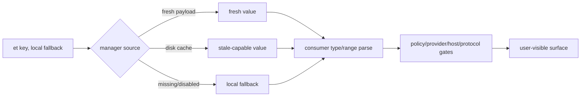

# Claude Code CLI 2.1.235 Feature Flag 逐 key 参考：默认值、consumer 和服务端边界

## 读者问题

为什么 bundle 中明明存在一个 `tengu_*` key，别人的客户端有功能而我的没有？为什么某个 key 的 fallback 是 `true`，功能仍可能被 policy、provider 或 host 关闭？

## 一句话心智模型

Feature key 只是取值入口：**reader + 本地 fallback + fresh/disk/remote source + consumer 自己的类型解析 + policy/provider/protocol 二次门** 共同决定行为；key 名和 fallback 都不是功能已交付的证明。

## 贯穿场景

用户打开 Remote Control。客户端先通过 first-party endpoint、auth scope、subscription/organization 和 managed policy，再读取 `tengu_ccr_bridge`。fresh true 可以立即通过；disk true 是 stale-capable；没有值时使用本地 fallback。即使 flag 为 true，前置 gate 仍可拒绝。反过来，bundle 中出现 key 也不代表服务端给当前账号下发 true。

## 状态总表

| 状态 | 本版数量 | 能证明什么 | 不能证明什么 |
| --- | ---: | --- | --- |
| static feature keys | 361 | 至少一个 `et()` 名称可静态恢复 | 账号当前值或功能已启用 |
| 已绑定业务 consumer 合同 | 56 个 key | 已人工追到 fallback 解析、二次 gate、状态变化与失败边界 | 服务端 value/rule/rollout 和当前账号可达性 |
| 仅 static callsite/fallback、未完成业务解释 | 305 个 key | key、fallback、function 和位置仍可交叉比较 | 不得从 codename 或描述性 key 直接推断产品效果 |
| 可静态恢复的 `et()` callsites | 455 | direct literal 或 assignment resolver 得到 361 个 key | 远端值、consumer reachability 或线上 rollout |
| direct literal `et()` callsites | 444 | key 直接写在调用参数中 | consumer 分支当前可达 |
| assignment-resolved `et()` callsites | 11 | 非 literal 语法可追到静态 key；6 个 key 只通过这一级进入 361 key 集合 | 运行时 feature value 已知 |
| truly dynamic unresolved `et()` callsites | 43 | 只保留表达式和调用点 | 最终 key、远端值和语义 |
| nonliteral syntax（证据形态，不是 dynamic 口径） | 54 | 11 个 assignment-resolved + 43 个 unresolved | 可以把 54 个全部标为 dynamic |
| 全部 `et()` callsites | 498 | reader 调用面完整 | 服务器规则、rollout 比例、entitlement |
| cached dynamic-config static keys | 6 | `CB()` 的静态 key 集合 | dynamic config 天然 fresh 或 schema 已验证 |
| 全部 cached dynamic-config callsites | 12 | 静态与动态 `CB()` 调用面 | 当前 payload 与服务端规则 |

## 字段怎么读

| 字段 | 精确含义 | 常见误读 |
| --- | --- | --- |
| `defaults` | 每个 callsite 传给 reader 的本地 fallback 原表达式 | 把它叫服务端默认值 |
| `shape` | 仅从 fallback syntax 推导的形状，明确是 heuristic | 把 object-like 当成已验证 JSON schema |
| `count/functions` | 该 key 的静态调用次数和 lexical function | 把 minified function 名翻译成业务模块 |
| `category` | 名称关键词导航，统一标 `Heuristic/name` | 把 codenames 展开成产品结论 |
| `meaning/evidence` | 重要 key 给出 consumer 机制和专题；未追 consumer 的描述性 key 标 Untraced，codename 标 Opaque/Inventory only | 从 key 名自行生成十分钟故事，或把客户端未完成分析伪装成 Boundary |
| `Boundary` | 当前账号 payload、server rule、experiment 分桶、entitlement 不在 bundle | 用本地静态证据宣称线上 rollout |

## 失败与服务端边界

1. `et(key, fallback)` 的 fallback 是客户端调用点默认，不是服务端 feature definition 的 default。
2. fresh map、disk last-known-good、fallback 可以让同一版本、不同启动状态出现不同结果。
3. consumer 必须自行验证 object/string/number 的类型和范围；Feature manager 不替业务完成 schema 校验。
4. policy、permission、provider、host、model、protocol 和 subscription gate 可以在 flag 之后再次拒绝。
5. server-side rule、rollout 百分比、实验分桶、紧急 kill switch、账号实时值都属于 Boundary。
6. 498 个调用点必须按 `455 static-resolvable + 43 truly dynamic` 计数；455 又分为 444 direct literal 和 11 assignment-resolved。不能把 54 个 nonliteral syntax 全部叫 dynamic。

## 三个读法示例

### 1. 布尔 fallback

`!0` 是压缩后的 true，`!1` 是 false。它只回答“manager 没给值时 consumer 收到什么”，不回答服务器是否下发、是否曝光、其他 gate 是否通过。

### 2. object fallback

`tengu_prompt_cache_1h_config` 的 fallback 是带 allowlist 的 object；这能说明 consumer 期待配置形状，但不能证明服务端不会增加字段，也不能证明 provider 实际命中一小时缓存。

### 3. opaque codename

`tengu_amber_anchor` 一类 key 只有 codename、fallback 和调用点。本文保留全部技术证据，同时明确 `Opaque codename / Inventory only`，不会把颜色或物体词解释成虚构功能；服务端 value/rule/rollout 才在 Boundary 列单独记录。

## 361 个 static feature key 逐项参考

覆盖合同：`361/361`，对应 `455/455` 个可静态恢复调用点。`count` 同时包含 direct literal 和 assignment-resolved 静态调用。

| key | defaults / shape | count / functions | locations | category | meaning / evidence | Boundary |
| --- | --- | --- | --- | --- | --- | --- |
| <code>tengu_alder_compass</code> | <code>!1</code> shape heuristic: boolean(false) | 1 / <code>isRelevant</code> x1 | [read L63589:C4320](../extracted/cli.js#L63589) | Heuristic/name：opaque experiment codename | Opaque codename / Inventory only：codename 加 fallback/callsite 仍不能揭示产品含义；这是客户端 consumer 待追的静态索引，不得把单词自行扩写成功能结论，也不得用 Boundary 掩盖未完成的分析。 | 服务端 value/rule/rollout 与 consumer reachability 均未观察。 |
| <code>tengu_amber_anchor</code> | <code>!1</code> shape heuristic: boolean(false) | 1 / <code>HIt</code> x1 | [read L388:C34027](../extracted/cli.js#L388) | Heuristic/name：opaque experiment codename | Opaque codename / Inventory only：codename 加 fallback/callsite 仍不能揭示产品含义；这是客户端 consumer 待追的静态索引，不得把单词自行扩写成功能结论，也不得用 Boundary 掩盖未完成的分析。 | 服务端 value/rule/rollout 与 consumer reachability 均未观察。 |
| <code>tengu_amber_creek</code> | <code>!1</code> shape heuristic: boolean(false) | 2 / <code>_Tb</code> x1, <code>spt</code> x1 | [read L800:C3079](../extracted/cli.js#L800) [read L800:C3698](../extracted/cli.js#L800) | Heuristic/name：opaque experiment codename | Opaque codename / Inventory only：codename 加 fallback/callsite 仍不能揭示产品含义；这是客户端 consumer 待追的静态索引，不得把单词自行扩写成功能结论，也不得用 Boundary 掩盖未完成的分析。 | 服务端 value/rule/rollout 与 consumer reachability 均未观察。 |
| <code>tengu_amber_flint</code> | <code>!0</code> shape heuristic: boolean(true) | 1 / <code>_d</code> x1 | [read L2945:C2319](../extracted/cli.js#L2945) | Heuristic/name：opaque experiment codename | Opaque codename / Inventory only：codename 加 fallback/callsite 仍不能揭示产品含义；这是客户端 consumer 待追的静态索引，不得把单词自行扩写成功能结论，也不得用 Boundary 掩盖未完成的分析。 | 服务端 value/rule/rollout 与 consumer reachability 均未观察。 |
| <code>tengu_amber_kestrel</code> | <code>!1</code> shape heuristic: boolean(false) | 1 / <code>D</code> x1 | [read L16010:C35497](../extracted/cli.js#L16010) | Heuristic/name：opaque experiment codename | Opaque codename / Inventory only：codename 加 fallback/callsite 仍不能揭示产品含义；这是客户端 consumer 待追的静态索引，不得把单词自行扩写成功能结论，也不得用 Boundary 掩盖未完成的分析。 | 服务端 value/rule/rollout 与 consumer reachability 均未观察。 |
| <code>tengu_amber_lark</code> | <code>!1</code> shape heuristic: boolean(false) | 1 / <code>O5v</code> x1 | [read L19639:C10](../extracted/cli.js#L19639) | Heuristic/name：opaque experiment codename | Opaque codename / Inventory only：codename 加 fallback/callsite 仍不能揭示产品含义；这是客户端 consumer 待追的静态索引，不得把单词自行扩写成功能结论，也不得用 Boundary 掩盖未完成的分析。 | 服务端 value/rule/rollout 与 consumer reachability 均未观察。 |
| <code>tengu_amber_lattice</code> | <code>{}</code> shape heuristic: object-like | 1 / <code>DCm</code> x1 | [read L21540:C3210](../extracted/cli.js#L21540) | Heuristic/name：opaque experiment codename | Opaque codename / Inventory only：codename 加 fallback/callsite 仍不能揭示产品含义；这是客户端 consumer 待追的静态索引，不得把单词自行扩写成功能结论，也不得用 Boundary 掩盖未完成的分析。 | 服务端 value/rule/rollout 与 consumer reachability 均未观察。 |
| <code>tengu_amber_lynx</code> | <code>!1</code> shape heuristic: boolean(false) | 1 / <code>Cwh</code> x1 | [read L22918:C10685](../extracted/cli.js#L22918) | Heuristic/name：opaque experiment codename | Opaque codename / Inventory only：codename 加 fallback/callsite 仍不能揭示产品含义；这是客户端 consumer 待追的静态索引，不得把单词自行扩写成功能结论，也不得用 Boundary 掩盖未完成的分析。 | 服务端 value/rule/rollout 与 consumer reachability 均未观察。 |
| <code>tengu_amber_packet</code> | <code>!1</code> shape heuristic: boolean(false) | 1 / <code>eyi</code> x1 | [read L14565:C9127](../extracted/cli.js#L14565) | Heuristic/name：opaque experiment codename | Opaque codename / Inventory only：codename 加 fallback/callsite 仍不能揭示产品含义；这是客户端 consumer 待追的静态索引，不得把单词自行扩写成功能结论，也不得用 Boundary 掩盖未完成的分析。 | 服务端 value/rule/rollout 与 consumer reachability 均未观察。 |
| <code>tengu_amber_prism</code> | <code>!1</code> shape heuristic: boolean(false) | 1 / <code>GNt</code> x1 | [read L21134:C3308](../extracted/cli.js#L21134) | Heuristic/name：opaque experiment codename | Opaque codename / Inventory only：codename 加 fallback/callsite 仍不能揭示产品含义；这是客户端 consumer 待追的静态索引，不得把单词自行扩写成功能结论，也不得用 Boundary 掩盖未完成的分析。 | 服务端 value/rule/rollout 与 consumer reachability 均未观察。 |
| <code>tengu_amber_quill_moth</code> | <code>!1</code> shape heuristic: boolean(false) | 1 / <code>Mnf</code> x1 | [read L14233:C9386](../extracted/cli.js#L14233) | Heuristic/name：opaque experiment codename | Opaque codename / Inventory only：codename 加 fallback/callsite 仍不能揭示产品含义；这是客户端 consumer 待追的静态索引，不得把单词自行扩写成功能结论，也不得用 Boundary 掩盖未完成的分析。 | 服务端 value/rule/rollout 与 consumer reachability 均未观察。 |
| <code>tengu_amber_redwood2</code> | <code>""</code> shape heuristic: string-like | 1 / <code>j2p</code> x1 | [read L3105:C34140](../extracted/cli.js#L3105) | Heuristic/name：opaque experiment codename | Opaque codename / Inventory only：codename 加 fallback/callsite 仍不能揭示产品含义；这是客户端 consumer 待追的静态索引，不得把单词自行扩写成功能结论，也不得用 Boundary 掩盖未完成的分析。 | 服务端 value/rule/rollout 与 consumer reachability 均未观察。 |
| <code>tengu_amber_redwood3</code> | <code>""</code> shape heuristic: string-like | 1 / <code>j2p</code> x1 | [read L3105:C34171](../extracted/cli.js#L3105) | Heuristic/name：opaque experiment codename | Opaque codename / Inventory only：codename 加 fallback/callsite 仍不能揭示产品含义；这是客户端 consumer 待追的静态索引，不得把单词自行扩写成功能结论，也不得用 Boundary 掩盖未完成的分析。 | 服务端 value/rule/rollout 与 consumer reachability 均未观察。 |
| <code>tengu_amber_relay</code> | <code>!1</code> shape heuristic: boolean(false) | 1 / <code>BXs</code> x1 | [read L392:C471](../extracted/cli.js#L392) | Heuristic/name：opaque experiment codename | Opaque codename / Inventory only：codename 加 fallback/callsite 仍不能揭示产品含义；这是客户端 consumer 待追的静态索引，不得把单词自行扩写成功能结论，也不得用 Boundary 掩盖未完成的分析。 | 服务端 value/rule/rollout 与 consumer reachability 均未观察。 |
| <code>tengu_amber_rokovoko</code> | <code>_ui</code> shape heuristic: expression/unknown | 1 / <code>OPa</code> x1 | [read L3105:C39184](../extracted/cli.js#L3105) | Heuristic/name：opaque experiment codename | Opaque codename / Inventory only：codename 加 fallback/callsite 仍不能揭示产品含义；这是客户端 consumer 待追的静态索引，不得把单词自行扩写成功能结论，也不得用 Boundary 掩盖未完成的分析。 | 服务端 value/rule/rollout 与 consumer reachability 均未观察。 |
| <code>tengu_amber_sentinel</code> | <code>!1</code> shape heuristic: boolean(false) | 1 / <code>Hbe</code> x1 | [read L1377:C253](../extracted/cli.js#L1377) | Heuristic/name：opaque experiment codename | Opaque codename / Inventory only：codename 加 fallback/callsite 仍不能揭示产品含义；这是客户端 consumer 待追的静态索引，不得把单词自行扩写成功能结论，也不得用 Boundary 掩盖未完成的分析。 | 服务端 value/rule/rollout 与 consumer reachability 均未观察。 |
| <code>tengu_amber_sextant</code> | <code>!0</code> shape heuristic: boolean(true) | 1 / <code>cdT</code> x1 | [read L21579:C2306](../extracted/cli.js#L21579) | Heuristic/name：opaque experiment codename | Opaque codename / Inventory only：codename 加 fallback/callsite 仍不能揭示产品含义；这是客户端 consumer 待追的静态索引，不得把单词自行扩写成功能结论，也不得用 Boundary 掩盖未完成的分析。 | 服务端 value/rule/rollout 与 consumer reachability 均未观察。 |
| <code>tengu_amber_wren</code> | <code>{}</code> shape heuristic: object-like | 1 / <code>pmt</code> x1 | [read L1964:C29687](../extracted/cli.js#L1964) | Heuristic/name：opaque experiment codename | Opaque codename / Inventory only：codename 加 fallback/callsite 仍不能揭示产品含义；这是客户端 consumer 待追的静态索引，不得把单词自行扩写成功能结论，也不得用 Boundary 掩盖未完成的分析。 | 服务端 value/rule/rollout 与 consumer reachability 均未观察。 |
| <code>tengu_ant_yolo_equiv_strip_config</code> | <code>{}</code> shape heuristic: object-like | 1 / <code>lKS</code> x1 | [read L14993:C9868](../extracted/cli.js#L14993) | Heuristic/name：opaque experiment codename | Opaque codename / Inventory only：codename 加 fallback/callsite 仍不能揭示产品含义；这是客户端 consumer 待追的静态索引，不得把单词自行扩写成功能结论，也不得用 Boundary 掩盖未完成的分析。 | 服务端 value/rule/rollout 与 consumer reachability 均未观察。 |
| <code>tengu_artifact_hljs_highlight</code> | <code>!0</code> shape heuristic: boolean(true) | 1 / <code>kef</code> x1 | [read L3470:C2681](../extracted/cli.js#L3470) | Heuristic/name：UI/IDE/媒体 | 仅 Heuristic/name：描述性 key 只提示所属子系统，callsite/default 只证明读取合同。在 consumer 分支和全部二次 gate 追清前标为 Untraced/Inventory only，不得把它写成不可恢复的 Boundary。 | 服务端 value/rule/rollout 与 consumer reachability 均未观察。 |
| <code>tengu_artifact_mermaid_diagrams</code> | <code>!0</code> shape heuristic: boolean(true) | 1 / <code>fNt</code> x1 | [read L3497:C537](../extracted/cli.js#L3497) | Heuristic/name：UI/IDE/媒体 | 仅 Heuristic/name：描述性 key 只提示所属子系统，callsite/default 只证明读取合同。在 consumer 分支和全部二次 gate 追清前标为 Untraced/Inventory only，不得把它写成不可恢复的 Boundary。 | 服务端 value/rule/rollout 与 consumer reachability 均未观察。 |
| <code>tengu_async_goblet</code> | <code>!0</code> shape heuristic: boolean(true) | 1 / <code>lwi</code> x1 | [read L16055:C2270](../extracted/cli.js#L16055) | Heuristic/name：opaque experiment codename | Opaque codename / Inventory only：codename 加 fallback/callsite 仍不能揭示产品含义；这是客户端 consumer 待追的静态索引，不得把单词自行扩写成功能结论，也不得用 Boundary 掩盖未完成的分析。 | 服务端 value/rule/rollout 与 consumer reachability 均未观察。 |
| <code>tengu_auto_mode_config</code> | <code>ARd</code> <code>{}</code> <code>kmf</code> shape heuristic: expression/unknown, object-like | 23 / <code>Bvm</code> x1, <code>IRd</code> x1, <code>Q$f</code> x1, <code>RnT</code> x1, <code>U$f</code> x1, <code>Uur</code> x1, <code>a$f</code> x1, <code>aBf</code> x1, <code>c$f</code> x1, <code>cXa</code> x1, <code>fLf</code> x1, <code>fSv</code> x1, <code>iBf</code> x1, <code>l$f</code> x1, <code>lBf</code> x1, <code>lRi</code> x1, <code>mAp</code> x1, <code>mSv</code> x1, <code>nTm</code> x1, <code>pAp</code> x1, <code>r5a</code> x1, <code>sBf</code> x1, <code>t5a</code> x1 | [read L475:C525](../extracted/cli.js#L475) [read L2661:C448](../extracted/cli.js#L2661) [read L2661:C740](../extracted/cli.js#L2661) [read L14994:C8452](../extracted/cli.js#L14994) [read L14994:C8564](../extracted/cli.js#L14994) [read L17843:C5632](../extracted/cli.js#L17843) [read L18093:C1112](../extracted/cli.js#L18093) [read L18093:C4315](../extracted/cli.js#L18093) [read L18093:C4579](../extracted/cli.js#L18093) [read L18093:C4844](../extracted/cli.js#L18093) [read L18386:C300](../extracted/cli.js#L18386) [read L18443:C293](../extracted/cli.js#L18443) [read L18443:C470](../extracted/cli.js#L18443) [read L18443:C613](../extracted/cli.js#L18443) [read L18447:C2703](../extracted/cli.js#L18447) [read L18447:C3959](../extracted/cli.js#L18447) [read L18447:C4157](../extracted/cli.js#L18447) [read L18447:C4375](../extracted/cli.js#L18447) [read L18447:C4608](../extracted/cli.js#L18447) [read L18456:C1921](../extracted/cli.js#L18456) [read L20881:C14346](../extracted/cli.js#L20881) [read L21031:C274](../extracted/cli.js#L21031) [read L21031:C3277](../extracted/cli.js#L21031) | Heuristic/name：permission/Auto Mode/policy | Static 教学解释：交付 Auto Mode 配置对象。consumer 继续解析 enabled/config 字段，deterministic permission/policy floor 仍具有最终约束力。详见 [auto-mode-classifier.md](auto-mode-classifier.md)。 | 服务端 value/rule/rollout 与 consumer reachability 均未观察。 |
| <code>tengu_auto_mode_worktree_fast_path</code> | <code>!1</code> shape heuristic: boolean(false) | 1 / <code>_$i</code> x1 | [read L21033:C27387](../extracted/cli.js#L21033) | Heuristic/name：permission/Auto Mode/policy | Static 教学解释：控制 Auto Mode worktree fast path；deterministic policy floor、classifier result、worktree creation 与 tool permission 仍具有最终约束力。详见 [auto-mode-classifier.md](auto-mode-classifier.md)。 | 服务端 value/rule/rollout 与 consumer reachability 均未观察。 |
| <code>tengu_basalt_loom</code> | <code>!1</code> shape heuristic: boolean(false) | 1 / <code>Vip</code> x1 | [read L1634:C10877](../extracted/cli.js#L1634) | Heuristic/name：opaque experiment codename | Opaque codename / Inventory only：codename 加 fallback/callsite 仍不能揭示产品含义；这是客户端 consumer 待追的静态索引，不得把单词自行扩写成功能结论，也不得用 Boundary 掩盖未完成的分析。 | 服务端 value/rule/rollout 与 consumer reachability 均未观察。 |
| <code>tengu_basalt_meadow</code> | <code>!1</code> shape heuristic: boolean(false) | 2 / <code>Eyp</code> x1, <code>sXb</code> x1 | [read L2102:C17235](../extracted/cli.js#L2102) [read L2102:C17373](../extracted/cli.js#L2102) | Heuristic/name：opaque experiment codename | Opaque codename / Inventory only：codename 加 fallback/callsite 仍不能揭示产品含义；这是客户端 consumer 待追的静态索引，不得把单词自行扩写成功能结论，也不得用 Boundary 掩盖未完成的分析。 | 服务端 value/rule/rollout 与 consumer reachability 均未观察。 |
| <code>tengu_basalt_scarp</code> | <code>!1</code> shape heuristic: boolean(false) | 1 / <code>olf</code> x1 | [read L14599:C7764](../extracted/cli.js#L14599) | Heuristic/name：opaque experiment codename | Opaque codename / Inventory only：codename 加 fallback/callsite 仍不能揭示产品含义；这是客户端 consumer 待追的静态索引，不得把单词自行扩写成功能结论，也不得用 Boundary 掩盖未完成的分析。 | 服务端 value/rule/rollout 与 consumer reachability 均未观察。 |
| <code>tengu_basalt_spur</code> | <code>!1</code> shape heuristic: boolean(false) | 1 / <code>i6r</code> x1 | [read L14599:C7709](../extracted/cli.js#L14599) | Heuristic/name：opaque experiment codename | Opaque codename / Inventory only：codename 加 fallback/callsite 仍不能揭示产品含义；这是客户端 consumer 待追的静态索引，不得把单词自行扩写成功能结论，也不得用 Boundary 掩盖未完成的分析。 | 服务端 value/rule/rollout 与 consumer reachability 均未观察。 |
| <code>tengu_bg_attach_stall_ms</code> | <code>bSw</code> shape heuristic: expression/unknown | 1 / <code>TSw</code> x1 | [read L23008:C546](../extracted/cli.js#L23008) | Heuristic/name：background/runtime 监督 | 仅 Heuristic/name：描述性 key 只提示所属子系统，callsite/default 只证明读取合同。在 consumer 分支和全部二次 gate 追清前标为 Untraced/Inventory only，不得把它写成不可恢复的 Boundary。 | 服务端 value/rule/rollout 与 consumer reachability 均未观察。 |
| <code>tengu_bg_attach_upgrade</code> | <code>!0</code> shape heuristic: boolean(true) | 1 / <code>Oyl</code> x1 | [read L21883:C871](../extracted/cli.js#L21883) | Heuristic/name：background/runtime 监督 | 仅 Heuristic/name：描述性 key 只提示所属子系统，callsite/default 只证明读取合同。在 consumer 分支和全部二次 gate 追清前标为 Untraced/Inventory only，不得把它写成不可恢复的 Boundary。 | 服务端 value/rule/rollout 与 consumer reachability 均未观察。 |
| <code>tengu_bg_binary_takeover</code> | <code>!0</code> shape heuristic: boolean(true) | 1 / <code>FSw</code> x1 | [read L23018:C1697](../extracted/cli.js#L23018) | Heuristic/name：background/runtime 监督 | 仅 Heuristic/name：描述性 key 只提示所属子系统，callsite/default 只证明读取合同。在 consumer 分支和全部二次 gate 追清前标为 Untraced/Inventory only，不得把它写成不可恢复的 Boundary。 | 服务端 value/rule/rollout 与 consumer reachability 均未观察。 |
| <code>tengu_bg_classifier_config</code> | <code>{useSmallFastModel:!0,disableThinking:!0,midTurnLlmDebounceMs:60000}</code> shape heuristic: object-like | 1 / <code>e3a</code> x1 | [read L14904:C1161](../extracted/cli.js#L14904) | Heuristic/name：permission/Auto Mode/policy | 仅 Heuristic/name：描述性 key 只提示所属子系统，callsite/default 只证明读取合同。在 consumer 分支和全部二次 gate 追清前标为 Untraced/Inventory only，不得把它写成不可恢复的 Boundary。 | 服务端 value/rule/rollout 与 consumer reachability 均未观察。 |
| <code>tengu_bg_leftarrow_inprocess</code> | <code>!0</code> shape heuristic: boolean(true) | 1 / <code>&lt;top-level&gt;</code> x1 | [read L63544:C4019](../extracted/cli.js#L63544) | Heuristic/name：background/runtime 监督 | 仅 Heuristic/name：描述性 key 只提示所属子系统，callsite/default 只证明读取合同。在 consumer 分支和全部二次 gate 追清前标为 Untraced/Inventory only，不得把它写成不可恢复的 Boundary。 | 服务端 value/rule/rollout 与 consumer reachability 均未观察。 |
| <code>tengu_bg_low_mem_mb</code> | <code>1024</code> shape heuristic: number-like | 1 / <code>Pyl</code> x1 | [read L21883:C342](../extracted/cli.js#L21883) | Heuristic/name：background/runtime 监督 | Static 教学解释：提供 background supervisor 的 low-memory threshold，单位 MiB，内置 fallback 为 1024；真实 pressure detection 与 reap eligibility 仍是运行时状态。详见 [runtime-supervision-and-processes.md](runtime-supervision-and-processes.md)。 | 服务端 value/rule/rollout 与 consumer reachability 均未观察。 |
| <code>tengu_bg_prewarm_burst_concurrency</code> | <code>3</code> shape heuristic: number-like | 1 / <code>Y</code> x1 | [read L65301:C15519](../extracted/cli.js#L65301) | Heuristic/name：background/runtime 监督 | 仅 Heuristic/name：描述性 key 只提示所属子系统，callsite/default 只证明读取合同。在 consumer 分支和全部二次 gate 追清前标为 Untraced/Inventory only，不得把它写成不可恢复的 Boundary。 | 服务端 value/rule/rollout 与 consumer reachability 均未观察。 |
| <code>tengu_bg_prewarm_burst_delay_ms</code> | <code>15000</code> shape heuristic: number-like | 1 / <code>Y</code> x1 | [read L65301:C15439](../extracted/cli.js#L65301) | Heuristic/name：background/runtime 监督 | 仅 Heuristic/name：描述性 key 只提示所属子系统，callsite/default 只证明读取合同。在 consumer 分支和全部二次 gate 追清前标为 Untraced/Inventory only，不得把它写成不可恢复的 Boundary。 | 服务端 value/rule/rollout 与 consumer reachability 均未观察。 |
| <code>tengu_bg_prewarm_per_sweep</code> | <code>3</code> shape heuristic: number-like | 1 / <code>X</code> x1 | [read L65301:C14136](../extracted/cli.js#L65301) | Heuristic/name：background/runtime 监督 | 仅 Heuristic/name：描述性 key 只提示所属子系统，callsite/default 只证明读取合同。在 consumer 分支和全部二次 gate 追清前标为 Untraced/Inventory only，不得把它写成不可恢复的 Boundary。 | 服务端 value/rule/rollout 与 consumer reachability 均未观察。 |
| <code>tengu_bg_retire_grace_bridged_min</code> | <code>480</code> shape heuristic: number-like | 1 / <code>zDm</code> x1 | [read L21883:C799](../extracted/cli.js#L21883) | Heuristic/name：Remote Control/cloud/bridge | Static 教学解释：提供 bridged background process 的 retirement grace，单位分钟，内置 fallback 为 480；retirement 前仍检查 liveness 与 ownership。详见 [runtime-supervision-and-processes.md](runtime-supervision-and-processes.md)。 | 服务端 value/rule/rollout 与 consumer reachability 均未观察。 |
| <code>tengu_bg_revival_guard</code> | <code>!0</code> shape heuristic: boolean(true) | 1 / <code>iMm</code> x1 | [read L21889:C256](../extracted/cli.js#L21889) | Heuristic/name：background/runtime 监督 | 仅 Heuristic/name：描述性 key 只提示所属子系统，callsite/default 只证明读取合同。在 consumer 分支和全部二次 gate 追清前标为 Untraced/Inventory only，不得把它写成不可恢复的 Boundary。 | 服务端 value/rule/rollout 与 consumer reachability 均未观察。 |
| <code>tengu_bg_spare_enable</code> | <code>!0</code> shape heuristic: boolean(true) | 2 / <code>b</code> x1, <code>v</code> x1 | [read L65301:C6058](../extracted/cli.js#L65301) [read L65301:C8868](../extracted/cli.js#L65301) | Heuristic/name：background/runtime 监督 | 仅 Heuristic/name：描述性 key 只提示所属子系统，callsite/default 只证明读取合同。在 consumer 分支和全部二次 gate 追清前标为 Untraced/Inventory only，不得把它写成不可恢复的 Boundary。 | 服务端 value/rule/rollout 与 consumer reachability 均未观察。 |
| <code>tengu_birch_kettle</code> | <code>!1</code> shape heuristic: boolean(false) | 1 / <code>isEnabled</code> x1 | [read L62240:C294](../extracted/cli.js#L62240) | Heuristic/name：opaque experiment codename | Opaque codename / Inventory only：codename 加 fallback/callsite 仍不能揭示产品含义；这是客户端 consumer 待追的静态索引，不得把单词自行扩写成功能结论，也不得用 Boundary 掩盖未完成的分析。 | 服务端 value/rule/rollout 与 consumer reachability 均未观察。 |
| <code>tengu_birch_lantern</code> | <code>"off"</code> shape heuristic: string-like | 1 / <code>EJl</code> x1 | [read L23121:C37613](../extracted/cli.js#L23121) | Heuristic/name：opaque experiment codename | Opaque codename / Inventory only：codename 加 fallback/callsite 仍不能揭示产品含义；这是客户端 consumer 待追的静态索引，不得把单词自行扩写成功能结论，也不得用 Boundary 掩盖未完成的分析。 | 服务端 value/rule/rollout 与 consumer reachability 均未观察。 |
| <code>tengu_bracken_sluice</code> | <code>!1</code> shape heuristic: boolean(false) | 1 / <code>LPf</code> x1 | [read L17194:C696](../extracted/cli.js#L17194) | Heuristic/name：opaque experiment codename | Opaque codename / Inventory only：codename 加 fallback/callsite 仍不能揭示产品含义；这是客户端 consumer 待追的静态索引，不得把单词自行扩写成功能结论，也不得用 Boundary 掩盖未完成的分析。 | 服务端 value/rule/rollout 与 consumer reachability 均未观察。 |
| <code>tengu_bramble_lintel</code> | <code>null</code> shape heuristic: nullish | 1 / <code>a</code> x1 | [read L14606:C4658](../extracted/cli.js#L14606) | Heuristic/name：opaque experiment codename | Opaque codename / Inventory only：codename 加 fallback/callsite 仍不能揭示产品含义；这是客户端 consumer 待追的静态索引，不得把单词自行扩写成功能结论，也不得用 Boundary 掩盖未完成的分析。 | 服务端 value/rule/rollout 与 consumer reachability 均未观察。 |
| <code>tengu_brass_sled</code> | <code>!1</code> shape heuristic: boolean(false) | 1 / <code>$1f</code> x1 | [read L17857:C19242](../extracted/cli.js#L17857) | Heuristic/name：opaque experiment codename | Opaque codename / Inventory only：codename 加 fallback/callsite 仍不能揭示产品含义；这是客户端 consumer 待追的静态索引，不得把单词自行扩写成功能结论，也不得用 Boundary 掩盖未完成的分析。 | 服务端 value/rule/rollout 与 consumer reachability 均未观察。 |
| <code>tengu_brick_follow</code> | <code>!1</code> shape heuristic: boolean(false) | 2 / <code>ntm</code> x1, <code>uSm</code> x1 | [read L19303:C6740](../extracted/cli.js#L19303) [read L20881:C15352](../extracted/cli.js#L20881) | Heuristic/name：opaque experiment codename | Opaque codename / Inventory only：codename 加 fallback/callsite 仍不能揭示产品含义；这是客户端 consumer 待追的静态索引，不得把单词自行扩写成功能结论，也不得用 Boundary 掩盖未完成的分析。 | 服务端 value/rule/rollout 与 consumer reachability 均未观察。 |
| <code>tengu_bridge_attestation_enforce</code> | <code>!1</code> shape heuristic: boolean(false) | 1 / <code>vJt</code> x1 | [read L287:C75126](../extracted/cli.js#L287) | Heuristic/name：permission/Auto Mode/policy | Static 教学解释：控制 bridge attestation 强制执行；配套 config key、本地 identity material 与 remote verifier result 仍是附加输入。详见 [runtime-supervision-and-processes.md](runtime-supervision-and-processes.md)。 | 服务端 value/rule/rollout 与 consumer reachability 均未观察。 |
| <code>tengu_bridge_attestation_enforce_config</code> | <code>{}</code> shape heuristic: object-like | 1 / <code>vJt</code> x1 | [read L287:C75206](../extracted/cli.js#L287) | Heuristic/name：permission/Auto Mode/policy | 仅 Heuristic/name：描述性 key 只提示所属子系统，callsite/default 只证明读取合同。在 consumer 分支和全部二次 gate 追清前标为 Untraced/Inventory only，不得把它写成不可恢复的 Boundary。 | 服务端 value/rule/rollout 与 consumer reachability 均未观察。 |
| <code>tengu_bridge_auth_revive</code> | <code>!0</code> shape heuristic: boolean(true) | 1 / <code>JMr</code> x1 | [read L391:C5409](../extracted/cli.js#L391) | Heuristic/name：Remote Control/cloud/bridge | 仅 Heuristic/name：描述性 key 只提示所属子系统，callsite/default 只证明读取合同。在 consumer 分支和全部二次 gate 追清前标为 Untraced/Inventory only，不得把它写成不可恢复的 Boundary。 | 服务端 value/rule/rollout 与 consumer reachability 均未观察。 |
| <code>tengu_bridge_initialize_commands</code> | <code>!1</code> shape heuristic: boolean(false) | 1 / <code>fls</code> x1 | [read L23550:C16993](../extracted/cli.js#L23550) | Heuristic/name：Remote Control/cloud/bridge | 仅 Heuristic/name：描述性 key 只提示所属子系统，callsite/default 只证明读取合同。在 consumer 分支和全部二次 gate 追清前标为 Untraced/Inventory only，不得把它写成不可恢复的 Boundary。 | 服务端 value/rule/rollout 与 consumer reachability 均未观察。 |
| <code>tengu_bridge_owner_pinned_end</code> | <code>!0</code> shape heuristic: boolean(true) | 1 / <code>pXt</code> x1 | [read L391:C5592](../extracted/cli.js#L391) | Heuristic/name：Remote Control/cloud/bridge | 仅 Heuristic/name：描述性 key 只提示所属子系统，callsite/default 只证明读取合同。在 consumer 分支和全部二次 gate 追清前标为 Untraced/Inventory only，不得把它写成不可恢复的 Boundary。 | 服务端 value/rule/rollout 与 consumer reachability 均未观察。 |
| <code>tengu_bridge_recovery_patience</code> | <code>!0</code> shape heuristic: boolean(true) | 1 / <code>Xe</code> x1 | [read L17094:C15985](../extracted/cli.js#L17094) | Heuristic/name：Remote Control/cloud/bridge | 仅 Heuristic/name：描述性 key 只提示所属子系统，callsite/default 只证明读取合同。在 consumer 分支和全部二次 gate 追清前标为 Untraced/Inventory only，不得把它写成不可恢复的 Boundary。 | 服务端 value/rule/rollout 与 consumer reachability 均未观察。 |
| <code>tengu_bridge_repl_v2_cse_shim_enabled</code> | <code>!0</code> shape heuristic: boolean(true) | 1 / <code>NXs</code> x1 | [read L391:C5128](../extracted/cli.js#L391) | Heuristic/name：Remote Control/cloud/bridge | 仅 Heuristic/name：描述性 key 只提示所属子系统，callsite/default 只证明读取合同。在 consumer 分支和全部二次 gate 追清前标为 Untraced/Inventory only，不得把它写成不可恢复的 Boundary。 | 服务端 value/rule/rollout 与 consumer reachability 均未观察。 |
| <code>tengu_bridge_requires_action_details</code> | <code>!1</code> shape heuristic: boolean(false) | 2 / <code>sendControlRequest</code> x2 | [read L17094:C42692](../extracted/cli.js#L17094) [read L17094:C43758](../extracted/cli.js#L17094) | Heuristic/name：Remote Control/cloud/bridge | 仅 Heuristic/name：描述性 key 只提示所属子系统，callsite/default 只证明读取合同。在 consumer 分支和全部二次 gate 追清前标为 Untraced/Inventory only，不得把它写成不可恢复的 Boundary。 | 服务端 value/rule/rollout 与 consumer reachability 均未观察。 |
| <code>tengu_bridge_resume_respects_local_owner</code> | <code>!0</code> shape heuristic: boolean(true) | 1 / <code>FXs</code> x1 | [read L391:C5465](../extracted/cli.js#L391) | Heuristic/name：Remote Control/cloud/bridge | 仅 Heuristic/name：描述性 key 只提示所属子系统，callsite/default 只证明读取合同。在 consumer 分支和全部二次 gate 追清前标为 Untraced/Inventory only，不得把它写成不可恢复的 Boundary。 | 服务端 value/rule/rollout 与 consumer reachability 均未观察。 |
| <code>tengu_bridge_selfheal_heartbeats</code> | <code>!0</code> shape heuristic: boolean(true) | 1 / <code>qe</code> x1 | [read L17094:C15922](../extracted/cli.js#L17094) | Heuristic/name：Remote Control/cloud/bridge | Static 教学解释：控制 bridge heartbeat self-healing；ownership、socket authentication、reconnect budget 与 durable job state 仍相互独立。详见 [runtime-supervision-and-processes.md](runtime-supervision-and-processes.md)。 | 服务端 value/rule/rollout 与 consumer reachability 均未观察。 |
| <code>tengu_bridge_system_init</code> | <code>!1</code> shape heuristic: boolean(false) | 1 / <code>Gxn</code> x1 | [read L391:C5248](../extracted/cli.js#L391) | Heuristic/name：Remote Control/cloud/bridge | 仅 Heuristic/name：描述性 key 只提示所属子系统，callsite/default 只证明读取合同。在 consumer 分支和全部二次 gate 追清前标为 Untraced/Inventory only，不得把它写成不可恢复的 Boundary。 | 服务端 value/rule/rollout 与 consumer reachability 均未观察。 |
| <code>tengu_bridge_vivid</code> | <code>!1</code> shape heuristic: boolean(false) | 1 / <code>_ib</code> x1 | [read L392:C544](../extracted/cli.js#L392) | Heuristic/name：Remote Control/cloud/bridge | 仅 Heuristic/name：描述性 key 只提示所属子系统，callsite/default 只证明读取合同。在 consumer 分支和全部二次 gate 追清前标为 Untraced/Inventory only，不得把它写成不可恢复的 Boundary。 | 服务端 value/rule/rollout 与 consumer reachability 均未观察。 |
| <code>tengu_brindle_causeway</code> | <code>!1</code> shape heuristic: boolean(false) | 1 / <code>Hq</code> x1 | [read L1145:C79662](../extracted/cli.js#L1145) | Heuristic/name：opaque experiment codename | Opaque codename / Inventory only：codename 加 fallback/callsite 仍不能揭示产品含义；这是客户端 consumer 待追的静态索引，不得把单词自行扩写成功能结论，也不得用 Boundary 掩盖未完成的分析。 | 服务端 value/rule/rollout 与 consumer reachability 均未观察。 |
| <code>tengu_byte_stream_idle_timeout_ms</code> | <code>r</code> shape heuristic: expression/unknown | 1 / <code>S1S</code> x1 | [read L3232:C716](../extracted/cli.js#L3232) | Heuristic/name：请求/stream/protocol | 仅 Heuristic/name：描述性 key 只提示所属子系统，callsite/default 只证明读取合同。在 consumer 分支和全部二次 gate 追清前标为 Untraced/Inventory only，不得把它写成不可恢复的 Boundary。 | 服务端 value/rule/rollout 与 consumer reachability 均未观察。 |
| <code>tengu_c4e_slash_upsell</code> | <code>!1</code> shape heuristic: boolean(false) | 1 / <code>iim</code> x1 | [read L19667:C5579](../extracted/cli.js#L19667) | Heuristic/name：opaque experiment codename | Opaque codename / Inventory only：codename 加 fallback/callsite 仍不能揭示产品含义；这是客户端 consumer 待追的静态索引，不得把单词自行扩写成功能结论，也不得用 Boundary 掩盖未完成的分析。 | 服务端 value/rule/rollout 与 consumer reachability 均未观察。 |
| <code>tengu_canary</code> | <code>{}</code> shape heuristic: object-like | 1 / <code>exm</code> x1 | [read L21729:C24169](../extracted/cli.js#L21729) | Heuristic/name：opaque experiment codename | Opaque codename / Inventory only：codename 加 fallback/callsite 仍不能揭示产品含义；这是客户端 consumer 待追的静态索引，不得把单词自行扩写成功能结论，也不得用 Boundary 掩盖未完成的分析。 | 服务端 value/rule/rollout 与 consumer reachability 均未观察。 |
| <code>tengu_ccr_bridge</code> | <code>!1</code> shape heuristic: boolean(false) | 1 / <code>uXt</code> x1 | [read L389:C1966](../extracted/cli.js#L389) | Heuristic/name：Remote Control/cloud/bridge | Static 教学解释：Remote Control rollout gate。只有 first-party host、authentication scope、subscription/organization 与 policy 检查通过后才读取；单独 true 不能让 Remote Control 可用。详见 [feature-flags-remote-config.md](feature-flags-remote-config.md)。 | 服务端 value/rule/rollout 与 consumer reachability 均未观察。 |
| <code>tengu_ccr_bundle_max_bytes</code> | <code>null</code> shape heuristic: nullish | 1 / <code>$1p</code> x1 | [read L2959:C1895](../extracted/cli.js#L2959) | Heuristic/name：Remote Control/cloud/bridge | Static 教学解释：提供 Remote Control bundle-size ceiling；本地 fallback 为 null，表示求值前有效值可以保持缺失。详见 [tui-ide-remote-cloud.md](tui-ide-remote-cloud.md)。 | 服务端 value/rule/rollout 与 consumer reachability 均未观察。 |
| <code>tengu_ccr_delta_rehydrate</code> | <code>!1</code> shape heuristic: boolean(false) | 1 / <code>ays</code> x1 | [read L63861:C2418](../extracted/cli.js#L63861) | Heuristic/name：Remote Control/cloud/bridge | 仅 Heuristic/name：描述性 key 只提示所属子系统，callsite/default 只证明读取合同。在 consumer 分支和全部二次 gate 追清前标为 Untraced/Inventory only，不得把它写成不可恢复的 Boundary。 | 服务端 value/rule/rollout 与 consumer reachability 均未观察。 |
| <code>tengu_ccr_idle_heartbeat</code> | <code>!1</code> shape heuristic: boolean(false) | 2 / <code>constructor</code> x1, <code>gt</code> x1 | [read L17094:C16109](../extracted/cli.js#L17094) [read L63867:C209](../extracted/cli.js#L63867) | Heuristic/name：Remote Control/cloud/bridge | 仅 Heuristic/name：描述性 key 只提示所属子系统，callsite/default 只证明读取合同。在 consumer 分支和全部二次 gate 追清前标为 Untraced/Inventory only，不得把它写成不可恢复的 Boundary。 | 服务端 value/rule/rollout 与 consumer reachability 均未观察。 |
| <code>tengu_ccr_reactivation_beat</code> | <code>!1</code> shape heuristic: boolean(false) | 2 / <code>Ge</code> x1, <code>constructor</code> x1 | [read L17094:C16219](../extracted/cli.js#L17094) [read L63867:C346](../extracted/cli.js#L63867) | Heuristic/name：Remote Control/cloud/bridge | 仅 Heuristic/name：描述性 key 只提示所属子系统，callsite/default 只证明读取合同。在 consumer 分支和全部二次 gate 追清前标为 Untraced/Inventory only，不得把它写成不可恢复的 Boundary。 | 服务端 value/rule/rollout 与 consumer reachability 均未观察。 |
| <code>tengu_ccr_reconnect_beat</code> | <code>!1</code> shape heuristic: boolean(false) | 2 / <code>Ve</code> x1, <code>constructor</code> x1 | [read L17094:C16164](../extracted/cli.js#L17094) [read L63867:C264](../extracted/cli.js#L63867) | Heuristic/name：Remote Control/cloud/bridge | 仅 Heuristic/name：描述性 key 只提示所属子系统，callsite/default 只证明读取合同。在 consumer 分支和全部二次 gate 追清前标为 Untraced/Inventory only，不得把它写成不可恢复的 Boundary。 | 服务端 value/rule/rollout 与 consumer reachability 均未观察。 |
| <code>tengu_ccr_stream_event_flush_ms</code> | <code>mWr</code> shape heuristic: expression/unknown | 2 / <code>constructor</code> x1, <code>ot</code> x1 | [read L17094:C16046](../extracted/cli.js#L17094) [read L63867:C136](../extracted/cli.js#L63867) | Heuristic/name：Remote Control/cloud/bridge | Static 教学解释：提供 Remote Control stream-event flush cadence，单位毫秒；network delivery 与 server acknowledgement 仍是 Boundary。详见 [tui-ide-remote-cloud.md](tui-ide-remote-cloud.md)。 | 服务端 value/rule/rollout 与 consumer reachability 均未观察。 |
| <code>tengu_ccr_subagent_skip_on_delta</code> | <code>!1</code> shape heuristic: boolean(false) | 1 / <code>lys</code> x1 | [read L63861:C2475](../extracted/cli.js#L63861) | Heuristic/name：Agent Loop/工具 | 仅 Heuristic/name：描述性 key 只提示所属子系统，callsite/default 只证明读取合同。在 consumer 分支和全部二次 gate 追清前标为 Untraced/Inventory only，不得把它写成不可恢复的 Boundary。 | 服务端 value/rule/rollout 与 consumer reachability 均未观察。 |
| <code>tengu_ccr_v2_send_events_cli</code> | <code>!1</code> shape heuristic: boolean(false) | 1 / <code>FIt</code> x1 | [read L391:C5653](../extracted/cli.js#L391) | Heuristic/name：Remote Control/cloud/bridge | 仅 Heuristic/name：描述性 key 只提示所属子系统，callsite/default 只证明读取合同。在 consumer 分支和全部二次 gate 追清前标为 Untraced/Inventory only，不得把它写成不可恢复的 Boundary。 | 服务端 value/rule/rollout 与 consumer reachability 均未观察。 |
| <code>tengu_ccr_v2_session_crud_cli</code> | <code>!1</code> shape heuristic: boolean(false) | 1 / <code>Oje</code> x1 | [read L391:C5713](../extracted/cli.js#L391) | Heuristic/name：Remote Control/cloud/bridge | 仅 Heuristic/name：描述性 key 只提示所属子系统，callsite/default 只证明读取合同。在 consumer 分支和全部二次 gate 追清前标为 Untraced/Inventory only，不得把它写成不可恢复的 Boundary。 | 服务端 value/rule/rollout 与 consumer reachability 均未观察。 |
| <code>tengu_cedar_lantern</code> | <code>!0</code> shape heuristic: boolean(true) | 1 / <code>&lt;top-level&gt;</code> x1 | [read L21676:C144](../extracted/cli.js#L21676) | Heuristic/name：opaque experiment codename | Opaque codename / Inventory only：codename 加 fallback/callsite 仍不能揭示产品含义；这是客户端 consumer 待追的静态索引，不得把单词自行扩写成功能结论，也不得用 Boundary 掩盖未完成的分析。 | 服务端 value/rule/rollout 与 consumer reachability 均未观察。 |
| <code>tengu_cedar_lattice</code> | <code>!1</code> shape heuristic: boolean(false) | 1 / <code>&lt;top-level&gt;</code> x1 | [read L21700:C16516](../extracted/cli.js#L21700) | Heuristic/name：opaque experiment codename | Opaque codename / Inventory only：codename 加 fallback/callsite 仍不能揭示产品含义；这是客户端 consumer 待追的静态索引，不得把单词自行扩写成功能结论，也不得用 Boundary 掩盖未完成的分析。 | 服务端 value/rule/rollout 与 consumer reachability 均未观察。 |
| <code>tengu_cedar_marsh</code> | <code>!1</code> shape heuristic: boolean(false) | 1 / <code>vx</code> x1 | [read L22013:C2428](../extracted/cli.js#L22013) | Heuristic/name：opaque experiment codename | Opaque codename / Inventory only：codename 加 fallback/callsite 仍不能揭示产品含义；这是客户端 consumer 待追的静态索引，不得把单词自行扩写成功能结论，也不得用 Boundary 掩盖未完成的分析。 | 服务端 value/rule/rollout 与 consumer reachability 均未观察。 |
| <code>tengu_cedar_plume</code> | <code>!1</code> shape heuristic: boolean(false) | 1 / <code>isRelevant</code> x1 | [read L63589:C14672](../extracted/cli.js#L63589) | Heuristic/name：opaque experiment codename | Opaque codename / Inventory only：codename 加 fallback/callsite 仍不能揭示产品含义；这是客户端 consumer 待追的静态索引，不得把单词自行扩写成功能结论，也不得用 Boundary 掩盖未完成的分析。 | 服务端 value/rule/rollout 与 consumer reachability 均未观察。 |
| <code>tengu_cedar_transom</code> | <code>!1</code> shape heuristic: boolean(false) | 1 / <code>Sga</code> x1 | [read L1634:C11088](../extracted/cli.js#L1634) | Heuristic/name：opaque experiment codename | Opaque codename / Inventory only：codename 加 fallback/callsite 仍不能揭示产品含义；这是客户端 consumer 待追的静态索引，不得把单词自行扩写成功能结论，也不得用 Boundary 掩盖未完成的分析。 | 服务端 value/rule/rollout 与 consumer reachability 均未观察。 |
| <code>tengu_cfc_in_product_permissions</code> | <code>!1</code> shape heuristic: boolean(false) | 1 / <code>lFt</code> x1 | [read L14943:C60792](../extracted/cli.js#L14943) | Heuristic/name：permission/Auto Mode/policy | Static 教学解释：控制产品内 CFC permission 处理；managed policy、deterministic rule、classifier outcome、hook 与 interactive fallback 仍相互独立。详见 [tools-permissions-hooks.md](tools-permissions-hooks.md)。 | 服务端 value/rule/rollout 与 consumer reachability 均未观察。 |
| <code>tengu_chair_sermon</code> | <code>!1</code> shape heuristic: boolean(false) | 4 / <code>mEm</code> x1, <code>rlT</code> x1, <code>t9</code> x2 | [read L21146:C1832](../extracted/cli.js#L21146) [read L21146:C2108](../extracted/cli.js#L21146) [read L21153:C251](../extracted/cli.js#L21153) [read L21399:C12004](../extracted/cli.js#L21399) | Heuristic/name：opaque experiment codename | Opaque codename / Inventory only：codename 加 fallback/callsite 仍不能揭示产品含义；这是客户端 consumer 待追的静态索引，不得把单词自行扩写成功能结论，也不得用 Boundary 掩盖未完成的分析。 | 服务端 value/rule/rollout 与 consumer reachability 均未观察。 |
| <code>tengu_chomp_inflection</code> | <code>!1</code> shape heuristic: boolean(false) | 2 / <code>fdr</code> x1, <code>k_i</code> x1 | [read L14681:C3236](../extracted/cli.js#L14681) [read L18879:C25598](../extracted/cli.js#L18879) | Heuristic/name：opaque experiment codename | Opaque codename / Inventory only：codename 加 fallback/callsite 仍不能揭示产品含义；这是客户端 consumer 待追的静态索引，不得把单词自行扩写成功能结论，也不得用 Boundary 掩盖未完成的分析。 | 服务端 value/rule/rollout 与 consumer reachability 均未观察。 |
| <code>tengu_chrome_auto_enable</code> | <code>!1</code> shape heuristic: boolean(false) | 2 / <code>Azl</code> x1, <code>BVg</code> x1 | [read L22940:C8455](../extracted/cli.js#L22940) [read L63855:C51265](../extracted/cli.js#L63855) | Heuristic/name：UI/IDE/媒体 | Static 教学解释：控制 Chrome integration 自动启用；extension/native host 是否存在、browser state、consent 与 platform support 仍是附加 gate。详见 [tui-input-accessibility-media-ide-chrome.md](tui-input-accessibility-media-ide-chrome.md)。 | 服务端 value/rule/rollout 与 consumer reachability 均未观察。 |
| <code>tengu_chrome_install_upsell</code> | <code>!1</code> shape heuristic: boolean(false) | 1 / <code>ROg</code> x1 | [read L27864:C2790](../extracted/cli.js#L27864) | Heuristic/name：UI/IDE/媒体 | 仅 Heuristic/name：描述性 key 只提示所属子系统，callsite/default 只证明读取合同。在 consumer 分支和全部二次 gate 追清前标为 Untraced/Inventory only，不得把它写成不可恢复的 Boundary。 | 服务端 value/rule/rollout 与 consumer reachability 均未观察。 |
| <code>tengu_cicada_nap_ms</code> | <code>0</code> shape heuristic: number-like | 1 / <code>ZGg</code> x1 | [read L63855:C20](../extracted/cli.js#L63855) | Heuristic/name：opaque experiment codename | Opaque codename / Inventory only：codename 加 fallback/callsite 仍不能揭示产品含义；这是客户端 consumer 待追的静态索引，不得把单词自行扩写成功能结论，也不得用 Boundary 掩盖未完成的分析。 | 服务端 value/rule/rollout 与 consumer reachability 均未观察。 |
| <code>tengu_cinder_plover</code> | <code>""</code> shape heuristic: string-like | 1 / <code>prompt</code> x1 | [read L15267:C5733](../extracted/cli.js#L15267) | Heuristic/name：opaque experiment codename | Opaque codename / Inventory only：codename 加 fallback/callsite 仍不能揭示产品含义；这是客户端 consumer 待追的静态索引，不得把单词自行扩写成功能结论，也不得用 Boundary 掩盖未完成的分析。 | 服务端 value/rule/rollout 与 consumer reachability 均未观察。 |
| <code>tengu_cinder_wren</code> | <code>""</code> shape heuristic: string-like | 1 / <code>prompt</code> x1 | [read L15269:C13](../extracted/cli.js#L15269) | Heuristic/name：opaque experiment codename | Opaque codename / Inventory only：codename 加 fallback/callsite 仍不能揭示产品含义；这是客户端 consumer 待追的静态索引，不得把单词自行扩写成功能结论，也不得用 Boundary 掩盖未完成的分析。 | 服务端 value/rule/rollout 与 consumer reachability 均未观察。 |
| <code>tengu_classifier_disabled_surfaces</code> | <code>""</code> shape heuristic: string-like | 1 / <code>$cf</code> x1 | [read L14921:C2887](../extracted/cli.js#L14921) | Heuristic/name：permission/Auto Mode/policy | 仅 Heuristic/name：描述性 key 只提示所属子系统，callsite/default 只证明读取合同。在 consumer 分支和全部二次 gate 追清前标为 Untraced/Inventory only，不得把它写成不可恢复的 Boundary。 | 服务端 value/rule/rollout 与 consumer reachability 均未观察。 |
| <code>tengu_classifier_summary_kill</code> | <code>!1</code> shape heuristic: boolean(false) | 1 / <code>$cf</code> x1 | [read L14921:C3036](../extracted/cli.js#L14921) | Heuristic/name：permission/Auto Mode/policy | 仅 Heuristic/name：描述性 key 只提示所属子系统，callsite/default 只证明读取合同。在 consumer 分支和全部二次 gate 追清前标为 Untraced/Inventory only，不得把它写成不可恢复的 Boundary。 | 服务端 value/rule/rollout 与 consumer reachability 均未观察。 |
| <code>tengu_classifier_summary_llm_emit</code> | <code>!1</code> shape heuristic: boolean(false) | 1 / <code>UWS</code> x1 | [read L14921:C3687](../extracted/cli.js#L14921) | Heuristic/name：permission/Auto Mode/policy | 仅 Heuristic/name：描述性 key 只提示所属子系统，callsite/default 只证明读取合同。在 consumer 分支和全部二次 gate 追清前标为 Untraced/Inventory only，不得把它写成不可恢复的 Boundary。 | 服务端 value/rule/rollout 与 consumer reachability 均未观察。 |
| <code>tengu_clever_orbit</code> | <code>!1</code> shape heuristic: boolean(false) | 1 / <code>Doi</code> x1 | [read L2491:C2083](../extracted/cli.js#L2491) | Heuristic/name：opaque experiment codename | Opaque codename / Inventory only：codename 加 fallback/callsite 仍不能揭示产品含义；这是客户端 consumer 待追的静态索引，不得把单词自行扩写成功能结论，也不得用 Boundary 掩盖未完成的分析。 | 服务端 value/rule/rollout 与 consumer reachability 均未观察。 |
| <code>tengu_cobalt_harbor</code> | <code>!1</code> shape heuristic: boolean(false) | 1 / <code>kqo</code> x1 | [read L392:C351](../extracted/cli.js#L392) | Heuristic/name：opaque experiment codename | Opaque codename / Inventory only：codename 加 fallback/callsite 仍不能揭示产品含义；这是客户端 consumer 待追的静态索引，不得把单词自行扩写成功能结论，也不得用 Boundary 掩盖未完成的分析。 | 服务端 value/rule/rollout 与 consumer reachability 均未观察。 |
| <code>tengu_cobalt_harbor_notice</code> | <code>!0</code> shape heuristic: boolean(true) | 2 / <code>cCw</code> x1, <code>uSm</code> x1 | [read L20881:C15174](../extracted/cli.js#L20881) [read L23121:C57936](../extracted/cli.js#L23121) | Heuristic/name：opaque experiment codename | Opaque codename / Inventory only：codename 加 fallback/callsite 仍不能揭示产品含义；这是客户端 consumer 待追的静态索引，不得把单词自行扩写成功能结论，也不得用 Boundary 掩盖未完成的分析。 | 服务端 value/rule/rollout 与 consumer reachability 均未观察。 |
| <code>tengu_cobalt_lantern</code> | <code>!1</code> shape heuristic: boolean(false) | 4 / <code>EDp</code> x1, <code>NDE</code> x1, <code>getPromptForCommand</code> x1, <code>isEnabled</code> x1 | [read L2914:C17929](../extracted/cli.js#L2914) [read L19685:C1441](../extracted/cli.js#L19685) [read L52414:C135](../extracted/cli.js#L52414) [read L52420:C1821](../extracted/cli.js#L52420) | Heuristic/name：opaque experiment codename | Opaque codename / Inventory only：codename 加 fallback/callsite 仍不能揭示产品含义；这是客户端 consumer 待追的静态索引，不得把单词自行扩写成功能结论，也不得用 Boundary 掩盖未完成的分析。 | 服务端 value/rule/rollout 与 consumer reachability 均未观察。 |
| <code>tengu_cobalt_plinth</code> | <code>f5b()</code> shape heuristic: expression/unknown | 1 / <code>zip</code> x1 | [read L1634:C8692](../extracted/cli.js#L1634) | Heuristic/name：opaque experiment codename | Opaque codename / Inventory only：codename 加 fallback/callsite 仍不能揭示产品含义；这是客户端 consumer 待追的静态索引，不得把单词自行扩写成功能结论，也不得用 Boundary 掩盖未完成的分析。 | 服务端 value/rule/rollout 与 consumer reachability 均未观察。 |
| <code>tengu_cobalt_plinth_bracken</code> | <code>!1</code> shape heuristic: boolean(false) | 1 / <code>Igi</code> x1 | [read L14233:C8957](../extracted/cli.js#L14233) | Heuristic/name：opaque experiment codename | Opaque codename / Inventory only：codename 加 fallback/callsite 仍不能揭示产品含义；这是客户端 consumer 待追的静态索引，不得把单词自行扩写成功能结论，也不得用 Boundary 掩盖未完成的分析。 | 服务端 value/rule/rollout 与 consumer reachability 均未观察。 |
| <code>tengu_cobalt_plinth_dataviz</code> | <code>!1</code> shape heuristic: boolean(false) | 1 / <code>mxE</code> x1 | [read L26627:C113](../extracted/cli.js#L26627) | Heuristic/name：opaque experiment codename | Opaque codename / Inventory only：codename 加 fallback/callsite 仍不能揭示产品含义；这是客户端 consumer 待追的静态索引，不得把单词自行扩写成功能结论，也不得用 Boundary 掩盖未完成的分析。 | 服务端 value/rule/rollout 与 consumer reachability 均未观察。 |
| <code>tengu_cobalt_plinth_direct</code> | <code>!0</code> shape heuristic: boolean(true) | 1 / <code>Enf</code> x1 | [read L14247:C3949](../extracted/cli.js#L14247) | Heuristic/name：opaque experiment codename | Opaque codename / Inventory only：codename 加 fallback/callsite 仍不能揭示产品含义；这是客户端 consumer 待追的静态索引，不得把单词自行扩写成功能结论，也不得用 Boundary 掩盖未完成的分析。 | 服务端 value/rule/rollout 与 consumer reachability 均未观察。 |
| <code>tengu_cobalt_plinth_fern</code> | <code>!0</code> shape heuristic: boolean(true) | 1 / <code>Fzn</code> x1 | [read L14233:C8628](../extracted/cli.js#L14233) | Heuristic/name：opaque experiment codename | Opaque codename / Inventory only：codename 加 fallback/callsite 仍不能揭示产品含义；这是客户端 consumer 待追的静态索引，不得把单词自行扩写成功能结论，也不得用 Boundary 掩盖未完成的分析。 | 服务端 value/rule/rollout 与 consumer reachability 均未观察。 |
| <code>tengu_cobalt_plinth_laurel</code> | <code>!1</code> shape heuristic: boolean(false) | 1 / <code>PBa</code> x1 | [read L14233:C8792](../extracted/cli.js#L14233) | Heuristic/name：opaque experiment codename | Opaque codename / Inventory only：codename 加 fallback/callsite 仍不能揭示产品含义；这是客户端 consumer 待追的静态索引，不得把单词自行扩写成功能结论，也不得用 Boundary 掩盖未完成的分析。 | 服务端 value/rule/rollout 与 consumer reachability 均未观察。 |
| <code>tengu_cobalt_plinth_moss</code> | <code>!0</code> shape heuristic: boolean(true) | 1 / <code>IBa</code> x1 | [read L14233:C8684](../extracted/cli.js#L14233) | Heuristic/name：opaque experiment codename | Opaque codename / Inventory only：codename 加 fallback/callsite 仍不能揭示产品含义；这是客户端 consumer 待追的静态索引，不得把单词自行扩写成功能结论，也不得用 Boundary 掩盖未完成的分析。 | 服务端 value/rule/rollout 与 consumer reachability 均未观察。 |
| <code>tengu_cobalt_plinth_osier</code> | <code>!1</code> shape heuristic: boolean(false) | 1 / <code>Onf</code> x1 | [read L14233:C8900](../extracted/cli.js#L14233) | Heuristic/name：opaque experiment codename | Opaque codename / Inventory only：codename 加 fallback/callsite 仍不能揭示产品含义；这是客户端 consumer 待追的静态索引，不得把单词自行扩写成功能结论，也不得用 Boundary 掩盖未完成的分析。 | 服务端 value/rule/rollout 与 consumer reachability 均未观察。 |
| <code>tengu_cobalt_plinth_putguard</code> | <code>!0</code> shape heuristic: boolean(true) | 1 / <code>y3S</code> x1 | [read L14233:C9243](../extracted/cli.js#L14233) | Heuristic/name：opaque experiment codename | Opaque codename / Inventory only：codename 加 fallback/callsite 仍不能揭示产品含义；这是客户端 consumer 待追的静态索引，不得把单词自行扩写成功能结论，也不得用 Boundary 掩盖未完成的分析。 | 服务端 value/rule/rollout 与 consumer reachability 均未观察。 |
| <code>tengu_cobalt_plinth_reader_persist</code> | <code>!1</code> shape heuristic: boolean(false) | 1 / <code>g3S</code> x1 | [read L14233:C9073](../extracted/cli.js#L14233) | Heuristic/name：opaque experiment codename | Opaque codename / Inventory only：codename 加 fallback/callsite 仍不能揭示产品含义；这是客户端 consumer 待追的静态索引，不得把单词自行扩写成功能结论，也不得用 Boundary 掩盖未完成的分析。 | 服务端 value/rule/rollout 与 consumer reachability 均未观察。 |
| <code>tengu_cobalt_plinth_sedge</code> | <code>!1</code> shape heuristic: boolean(false) | 1 / <code>OBa</code> x1 | [read L14233:C9016](../extracted/cli.js#L14233) | Heuristic/name：opaque experiment codename | Opaque codename / Inventory only：codename 加 fallback/callsite 仍不能揭示产品含义；这是客户端 consumer 待追的静态索引，不得把单词自行扩写成功能结论，也不得用 Boundary 掩盖未完成的分析。 | 服务端 value/rule/rollout 与 consumer reachability 均未观察。 |
| <code>tengu_cobalt_plinth_sorrel</code> | <code>!0</code> shape heuristic: boolean(true) | 1 / <code>Shi</code> x1 | [read L3343:C4175](../extracted/cli.js#L3343) | Heuristic/name：opaque experiment codename | Opaque codename / Inventory only：codename 加 fallback/callsite 仍不能揭示产品含义；这是客户端 consumer 待追的静态索引，不得把单词自行扩写成功能结论，也不得用 Boundary 掩盖未完成的分析。 | 服务端 value/rule/rollout 与 consumer reachability 均未观察。 |
| <code>tengu_cobalt_ridge</code> | <code>!1</code> shape heuristic: boolean(false) | 1 / <code>bte</code> x1 | [read L478:C10569](../extracted/cli.js#L478) | Heuristic/name：opaque experiment codename | Opaque codename / Inventory only：codename 加 fallback/callsite 仍不能揭示产品含义；这是客户端 consumer 待追的静态索引，不得把单词自行扩写成功能结论，也不得用 Boundary 掩盖未完成的分析。 | 服务端 value/rule/rollout 与 consumer reachability 均未观察。 |
| <code>tengu_cobalt_thicket</code> | <code>!0</code> shape heuristic: boolean(true) | 1 / <code>ZGg</code> x1 | [read L63848:C5594](../extracted/cli.js#L63848) | Heuristic/name：opaque experiment codename | Opaque codename / Inventory only：codename 加 fallback/callsite 仍不能揭示产品含义；这是客户端 consumer 待追的静态索引，不得把单词自行扩写成功能结论，也不得用 Boundary 掩盖未完成的分析。 | 服务端 value/rule/rollout 与 consumer reachability 均未观察。 |
| <code>tengu_cobalt_thistle</code> | <code>!1</code> shape heuristic: boolean(false) | 1 / <code>XBd</code> x1 | [read L868:C2958](../extracted/cli.js#L868) | Heuristic/name：opaque experiment codename | Opaque codename / Inventory only：codename 加 fallback/callsite 仍不能揭示产品含义；这是客户端 consumer 待追的静态索引，不得把单词自行扩写成功能结论，也不得用 Boundary 掩盖未完成的分析。 | 服务端 value/rule/rollout 与 consumer reachability 均未观察。 |
| <code>tengu_cobalt_wren</code> | <code>!1</code> shape heuristic: boolean(false) | 1 / <code>Bcf</code> x1 | [read L14921:C3628](../extracted/cli.js#L14921) | Heuristic/name：opaque experiment codename | Opaque codename / Inventory only：codename 加 fallback/callsite 仍不能揭示产品含义；这是客户端 consumer 待追的静态索引，不得把单词自行扩写成功能结论，也不得用 Boundary 掩盖未完成的分析。 | 服务端 value/rule/rollout 与 consumer reachability 均未观察。 |
| <code>tengu_compact_cache_prefix</code> | <code>!0</code> shape heuristic: boolean(true) | 2 / <code>Gof</code> x1, <code>iyi</code> x1 | [read L14567:C1046](../extracted/cli.js#L14567) [read L14568:C6328](../extracted/cli.js#L14568) | Heuristic/name：上下文/cache/模型输出 | Static 教学解释：控制 compact 相关 prompt-cache prefix 路径。key 与两个静态 consumer 证明客户端分支存在，但服务端 cache-hit 行为仍是 Boundary。详见 [context-governance-and-caching.md](context-governance-and-caching.md)。 | 服务端 value/rule/rollout 与 consumer reachability 均未观察。 |
| <code>tengu_composed_quail</code> | <code>!0</code> shape heuristic: boolean(true) | 1 / <code>XMr</code> x1 | [read L391:C5774](../extracted/cli.js#L391) | Heuristic/name：opaque experiment codename | Opaque codename / Inventory only：codename 加 fallback/callsite 仍不能揭示产品含义；这是客户端 consumer 待追的静态索引，不得把单词自行扩写成功能结论，也不得用 Boundary 掩盖未完成的分析。 | 服务端 value/rule/rollout 与 consumer reachability 均未观察。 |
| <code>tengu_coordinator_panel</code> | <code>!0</code> shape heuristic: boolean(true) | 1 / <code>Rio</code> x1 | [read L22755:C13610](../extracted/cli.js#L22755) | Heuristic/name：opaque experiment codename | Opaque codename / Inventory only：codename 加 fallback/callsite 仍不能揭示产品含义；这是客户端 consumer 待追的静态索引，不得把单词自行扩写成功能结论，也不得用 Boundary 掩盖未完成的分析。 | 服务端 value/rule/rollout 与 consumer reachability 均未观察。 |
| <code>tengu_copper_kestrel</code> | <code>!0</code> shape heuristic: boolean(true) | 1 / <code>Cqo</code> x1 | [read L391:C5357](../extracted/cli.js#L391) | Heuristic/name：opaque experiment codename | Opaque codename / Inventory only：codename 加 fallback/callsite 仍不能揭示产品含义；这是客户端 consumer 待追的静态索引，不得把单词自行扩写成功能结论，也不得用 Boundary 掩盖未完成的分析。 | 服务端 value/rule/rollout 与 consumer reachability 均未观察。 |
| <code>tengu_copper_lantern</code> | <code>!1</code> shape heuristic: boolean(false) | 1 / <code>RXs</code> x1 | [read L388:C34077](../extracted/cli.js#L388) | Heuristic/name：opaque experiment codename | Opaque codename / Inventory only：codename 加 fallback/callsite 仍不能揭示产品含义；这是客户端 consumer 待追的静态索引，不得把单词自行扩写成功能结论，也不得用 Boundary 掩盖未完成的分析。 | 服务端 value/rule/rollout 与 consumer reachability 均未观察。 |
| <code>tengu_copper_thistle</code> | <code>!1</code> shape heuristic: boolean(false) | 3 / <code>C_g</code> x1, <code>Ous</code> x1, <code>mBt</code> x1 | [read L19668:C3331](../extracted/cli.js#L19668) [read L23595:C15115](../extracted/cli.js#L23595) [read L23595:C28283](../extracted/cli.js#L23595) | Heuristic/name：opaque experiment codename | Static 教学解释：Task/Job 命名与任务 footer 的 UI 分支 gate，fallback 为 false。false 时 MCP background item 仍称 task，并保留旧 footer/task hint 组合；true 时称 job，同时启用新的 footer 管理分支并从旧 keyed hints 中排除相应项。它不改变 task registry、执行权限或远端 durability。详见 [mcp-agents-background.md](mcp-agents-background.md)。 | 服务端 value/rule/rollout 与 consumer reachability 均未观察。 |
| <code>tengu_coral_beacon</code> | <code>!1</code> shape heuristic: boolean(false) | 2 / <code>sJh</code> x1, <code>z9i</code> x1 | [read L22736:C16711](../extracted/cli.js#L22736) [read L23525:C11615](../extracted/cli.js#L23525) | Heuristic/name：opaque experiment codename | Opaque codename / Inventory only：codename 加 fallback/callsite 仍不能揭示产品含义；这是客户端 consumer 待追的静态索引，不得把单词自行扩写成功能结论，也不得用 Boundary 掩盖未完成的分析。 | 服务端 value/rule/rollout 与 consumer reachability 均未观察。 |
| <code>tengu_cowork_auto_mode_include_allowed_write_mcp</code> | <code>!1</code> shape heuristic: boolean(false) | 1 / <code>lTm</code> x1 | [read L21031:C5960](../extracted/cli.js#L21031) | Heuristic/name：MCP/plugin/skill | 仅 Heuristic/name：描述性 key 只提示所属子系统，callsite/default 只证明读取合同。在 consumer 分支和全部二次 gate 追清前标为 Untraced/Inventory only，不得把它写成不可恢复的 Boundary。 | 服务端 value/rule/rollout 与 consumer reachability 均未观察。 |
| <code>tengu_cowork_chrome_automode_default</code> | <code>!1</code> shape heuristic: boolean(false) | 1 / <code>&lt;top-level&gt;</code> x1 | [read L14994:C2868](../extracted/cli.js#L14994) | Heuristic/name：UI/IDE/媒体 | 仅 Heuristic/name：描述性 key 只提示所属子系统，callsite/default 只证明读取合同。在 consumer 分支和全部二次 gate 追清前标为 Untraced/Inventory only，不得把它写成不可恢复的 Boundary。 | 服务端 value/rule/rollout 与 consumer reachability 均未观察。 |
| <code>tengu_crimson_vector</code> | <code>!1</code> shape heuristic: boolean(false) | 1 / <code>gqS</code> x1 | [read L14593:C62658](../extracted/cli.js#L14593) | Heuristic/name：opaque experiment codename | Opaque codename / Inventory only：codename 加 fallback/callsite 仍不能揭示产品含义；这是客户端 consumer 待追的静态索引，不得把单词自行扩写成功能结论，也不得用 Boundary 掩盖未完成的分析。 | 服务端 value/rule/rollout 与 consumer reachability 均未观察。 |
| <code>tengu_cuddly_willow</code> | <code>!0</code> shape heuristic: boolean(true) | 1 / <code>JPn</code> x1 | [read L793:C28679](../extracted/cli.js#L793) | Heuristic/name：opaque experiment codename | Opaque codename / Inventory only：codename 加 fallback/callsite 仍不能揭示产品含义；这是客户端 consumer 待追的静态索引，不得把单词自行扩写成功能结论，也不得用 Boundary 掩盖未完成的分析。 | 服务端 value/rule/rollout 与 consumer reachability 均未观察。 |
| <code>tengu_daemon_refuse_stale_upgrade</code> | <code>!0</code> shape heuristic: boolean(true) | 1 / <code>X</code> x1 | [read L65302:C11036](../extracted/cli.js#L65302) | Heuristic/name：background/runtime 监督 | 仅 Heuristic/name：描述性 key 只提示所属子系统，callsite/default 只证明读取合同。在 consumer 分支和全部二次 gate 追清前标为 Untraced/Inventory only，不得把它写成不可恢复的 Boundary。 | 服务端 value/rule/rollout 与 consumer reachability 均未观察。 |
| <code>tengu_dash_flame</code> | <code>!1</code> shape heuristic: boolean(false) | 2 / <code>serverDefaultFallbacksEnabled</code> x2 | [read L14943:C16839](../extracted/cli.js#L14943) [read L21698:C17767](../extracted/cli.js#L21698) | Heuristic/name：opaque experiment codename | Opaque codename / Inventory only：codename 加 fallback/callsite 仍不能揭示产品含义；这是客户端 consumer 待追的静态索引，不得把单词自行扩写成功能结论，也不得用 Boundary 掩盖未完成的分析。 | 服务端 value/rule/rollout 与 consumer reachability 均未观察。 |
| <code>tengu_defer_cap_ms</code> | <code>1e4</code> shape heuristic: number-like | 1 / <code>ci</code> x1 | [read L63622:C13306](../extracted/cli.js#L63622) | Heuristic/name：opaque experiment codename | Opaque codename / Inventory only：codename 加 fallback/callsite 仍不能揭示产品含义；这是客户端 consumer 待追的静态索引，不得把单词自行扩写成功能结论，也不得用 Boundary 掩盖未完成的分析。 | 服务端 value/rule/rollout 与 consumer reachability 均未观察。 |
| <code>tengu_deferred_stub_tool</code> | <code>!0</code> shape heuristic: boolean(true) | 1 / <code>Nkm</code> x1 | [read L21695:C7456](../extracted/cli.js#L21695) | Heuristic/name：Agent Loop/工具 | 仅 Heuristic/name：描述性 key 只提示所属子系统，callsite/default 只证明读取合同。在 consumer 分支和全部二次 gate 追清前标为 Untraced/Inventory only，不得把它写成不可恢复的 Boundary。 | 服务端 value/rule/rollout 与 consumer reachability 均未观察。 |
| <code>tengu_destructive_command_warning</code> | <code>!1</code> shape heuristic: boolean(false) | 2 / <code>&lt;top-level&gt;</code> x2 | [read L23697:C11416](../extracted/cli.js#L23697) [read L23710:C9790](../extracted/cli.js#L23710) | Heuristic/name：permission/Auto Mode/policy | 仅 Heuristic/name：描述性 key 只提示所属子系统，callsite/default 只证明读取合同。在 consumer 分支和全部二次 gate 追清前标为 Untraced/Inventory only，不得把它写成不可恢复的 Boundary。 | 服务端 value/rule/rollout 与 consumer reachability 均未观察。 |
| <code>tengu_disable_streaming_to_non_streaming_fallback</code> | <code>!1</code> shape heuristic: boolean(false) | 1 / <code>vAm</code> x1 | [read L21700:C39150](../extracted/cli.js#L21700) | Heuristic/name：请求/stream/protocol | Static 教学解释：关闭失败 streaming attempt 到 non-streaming transport 的 fallback；不会关闭普通 HTTP retry 或 model fallback。详见 [resilience-and-recovery.md](resilience-and-recovery.md)。 | 服务端 value/rule/rollout 与 consumer reachability 均未观察。 |
| <code>tengu_drift_lantern</code> | <code>!1</code> shape heuristic: boolean(false) | 1 / <code>wgs</code> x1 | [read L63837:C1017](../extracted/cli.js#L63837) | Heuristic/name：opaque experiment codename | Opaque codename / Inventory only：codename 加 fallback/callsite 仍不能揭示产品含义；这是客户端 consumer 待追的静态索引，不得把单词自行扩写成功能结论，也不得用 Boundary 掩盖未完成的分析。 | 服务端 value/rule/rollout 与 consumer reachability 均未观察。 |
| <code>tengu_edit_minimalanchor_jrn</code> | <code>!1</code> shape heuristic: boolean(false) | 1 / <code>ziS</code> x1 | [read L2671:C151](../extracted/cli.js#L2671) | Heuristic/name：opaque experiment codename | Opaque codename / Inventory only：codename 加 fallback/callsite 仍不能揭示产品含义；这是客户端 consumer 待追的静态索引，不得把单词自行扩写成功能结论，也不得用 Boundary 掩盖未完成的分析。 | 服务端 value/rule/rollout 与 consumer reachability 均未观察。 |
| <code>tengu_ember_latch</code> | <code>!1</code> shape heuristic: boolean(false) | 1 / <code>BYn</code> x1 | [read L19673:C14719](../extracted/cli.js#L19673) | Heuristic/name：opaque experiment codename | Opaque codename / Inventory only：codename 加 fallback/callsite 仍不能揭示产品含义；这是客户端 consumer 待追的静态索引，不得把单词自行扩写成功能结论，也不得用 Boundary 掩盖未完成的分析。 | 服务端 value/rule/rollout 与 consumer reachability 均未观察。 |
| <code>tengu_ethereal_nova</code> | <code>!1</code> shape heuristic: boolean(false) | 1 / <code>bga</code> x1 | [read L1634:C11022](../extracted/cli.js#L1634) | Heuristic/name：opaque experiment codename | Opaque codename / Inventory only：codename 加 fallback/callsite 仍不能揭示产品含义；这是客户端 consumer 待追的静态索引，不得把单词自行扩写成功能结论，也不得用 Boundary 掩盖未完成的分析。 | 服务端 value/rule/rollout 与 consumer reachability 均未观察。 |
| <code>tengu_feedback_survey_config</code> | <code>Kms</code> shape heuristic: expression/unknown | 1 / <code>GJg</code> x1 | [read L63878:C47091](../extracted/cli.js#L63878) | Heuristic/name：遥测/feedback | 仅 Heuristic/name：描述性 key 只提示所属子系统，callsite/default 只证明读取合同。在 consumer 分支和全部二次 gate 追清前标为 Untraced/Inventory only，不得把它写成不可恢复的 Boundary。 | 服务端 value/rule/rollout 与 consumer reachability 均未观察。 |
| <code>tengu_fgts</code> | <code>!1</code> shape heuristic: boolean(false) | 1 / <code>$Hi</code> x1 | [read L21678:C1101](../extracted/cli.js#L21678) | Heuristic/name：opaque experiment codename | Opaque codename / Inventory only：codename 加 fallback/callsite 仍不能揭示产品含义；这是客户端 consumer 待追的静态索引，不得把单词自行扩写成功能结论，也不得用 Boundary 掩盖未完成的分析。 | 服务端 value/rule/rollout 与 consumer reachability 均未观察。 |
| <code>tengu_fleet_past_sessions</code> | <code>!1</code> shape heuristic: boolean(false) | 1 / <code>jxn</code> x1 | [read L388:C33919](../extracted/cli.js#L388) | Heuristic/name：session/memory/恢复 | 仅 Heuristic/name：描述性 key 只提示所属子系统，callsite/default 只证明读取合同。在 consumer 分支和全部二次 gate 追清前标为 Untraced/Inventory only，不得把它写成不可恢复的 Boundary。 | 服务端 value/rule/rollout 与 consumer reachability 均未观察。 |
| <code>tengu_fleetview_peers</code> | <code>!1</code> shape heuristic: boolean(false) | 3 / <code>&lt;top-level&gt;</code> x2, <code>CBg</code> x1 | [read L63536:C1801](../extracted/cli.js#L63536) [read L63536:C6320](../extracted/cli.js#L63536) [read L63536:C9127](../extracted/cli.js#L63536) | Heuristic/name：opaque experiment codename | Opaque codename / Inventory only：codename 加 fallback/callsite 仍不能揭示产品含义；这是客户端 consumer 待追的静态索引，不得把单词自行扩写成功能结论，也不得用 Boundary 掩盖未完成的分析。 | 服务端 value/rule/rollout 与 consumer reachability 均未观察。 |
| <code>tengu_fleetview_pr_batch</code> | <code>!0</code> shape heuristic: boolean(true) | 1 / <code>&lt;top-level&gt;</code> x1 | [read L63536:C3725](../extracted/cli.js#L63536) | Heuristic/name：opaque experiment codename | Opaque codename / Inventory only：codename 加 fallback/callsite 仍不能揭示产品含义；这是客户端 consumer 待追的静态索引，不得把单词自行扩写成功能结论，也不得用 Boundary 掩盖未完成的分析。 | 服务端 value/rule/rollout 与 consumer reachability 均未观察。 |
| <code>tengu_fleetview_simple</code> | <code>!1</code> shape heuristic: boolean(false) | 1 / <code>CBg</code> x1 | [read L63532:C10979](../extracted/cli.js#L63532) | Heuristic/name：opaque experiment codename | Opaque codename / Inventory only：codename 加 fallback/callsite 仍不能揭示产品含义；这是客户端 consumer 待追的静态索引，不得把单词自行扩写成功能结论，也不得用 Boundary 掩盖未完成的分析。 | 服务端 value/rule/rollout 与 consumer reachability 均未观察。 |
| <code>tengu_flint_harbor_prompt</code> | <code>{}</code> shape heuristic: object-like | 1 / <code>getPromptForCommand</code> x1 | [read L19826:C560](../extracted/cli.js#L19826) | Heuristic/name：opaque experiment codename | Static 教学解释：`/team-onboarding` 的对象配置覆盖。consumer 分别校验 `prompt`、`guideTemplate` 和 `windowDays`；字符串字段非法时回落内置模板，天数先 floor 再 clamp 到 1-365，随后才扫描使用数据、写 `teamOnboardingLastUsedAt` 并组装命令 prompt。远端 payload 不能绕过 workspace/command enable gate。详见 [complex-slash-command-lifecycles.md](complex-slash-command-lifecycles.md)。 | 服务端 value/rule/rollout 与 consumer reachability 均未观察。 |
| <code>tengu_flint_harbor_share</code> | <code>!1</code> shape heuristic: boolean(false) | 1 / <code>XWr</code> x1 | [read L17413:C2769](../extracted/cli.js#L17413) | Heuristic/name：opaque experiment codename | Opaque codename / Inventory only：codename 加 fallback/callsite 仍不能揭示产品含义；这是客户端 consumer 待追的静态索引，不得把单词自行扩写成功能结论，也不得用 Boundary 掩盖未完成的分析。 | 服务端 value/rule/rollout 与 consumer reachability 均未观察。 |
| <code>tengu_frame_publish_context</code> | <code>!1</code> shape heuristic: boolean(false) | 1 / <code>Dnf</code> x1 | [read L14233:C9303](../extracted/cli.js#L14233) | Heuristic/name：上下文/cache/模型输出 | 仅 Heuristic/name：描述性 key 只提示所属子系统，callsite/default 只证明读取合同。在 consumer 分支和全部二次 gate 追清前标为 Untraced/Inventory only，不得把它写成不可恢复的 Boundary。 | 服务端 value/rule/rollout 与 consumer reachability 均未观察。 |
| <code>tengu_gable_onyx_sluice</code> | <code>!1</code> shape heuristic: boolean(false) | 2 / <code>gfe</code> x1, <code>gga</code> x1 | [read L1634:C10706](../extracted/cli.js#L1634) [read L1634:C10768](../extracted/cli.js#L1634) | Heuristic/name：opaque experiment codename | Opaque codename / Inventory only：codename 加 fallback/callsite 仍不能揭示产品含义；这是客户端 consumer 待追的静态索引，不得把单词自行扩写成功能结论，也不得用 Boundary 掩盖未完成的分析。 | 服务端 value/rule/rollout 与 consumer reachability 均未观察。 |
| <code>tengu_gb_refresh_interval_minutes</code> | <code>null</code> shape heuristic: nullish | 1 / <code>D0d</code> x1 | [read L388:C18639](../extracted/cli.js#L388) | Heuristic/name：opaque experiment codename | Static 教学解释：控制 GrowthBook 定时 refresh 周期，单位为分钟；consumer 使用 360 分钟默认值，将有效值 clamp 到 5-360 分钟、乘 0.9-1.1 jitter 后换算为 timer，flagged refresh 失败再进入补偿路径。它不能证明 refresh 已成功或配置已改变。详见 [feature-flags-remote-config.md](feature-flags-remote-config.md)。 | 服务端 value/rule/rollout 与 consumer reachability 均未观察。 |
| <code>tengu_gleaming_fair</code> | <code>!1</code> shape heuristic: boolean(false) | 1 / <code>yug</code> x1 | [read L23547:C26271](../extracted/cli.js#L23547) | Heuristic/name：opaque experiment codename | Opaque codename / Inventory only：codename 加 fallback/callsite 仍不能揭示产品含义；这是客户端 consumer 待追的静态索引，不得把单词自行扩写成功能结论，也不得用 Boundary 掩盖未完成的分析。 | 服务端 value/rule/rollout 与 consumer reachability 均未观察。 |
| <code>tengu_gorse_fathom</code> | <code>!1</code> shape heuristic: boolean(false) | 1 / <code>qZt</code> x1 | [read L865:C1724](../extracted/cli.js#L865) | Heuristic/name：opaque experiment codename | Opaque codename / Inventory only：codename 加 fallback/callsite 仍不能揭示产品含义；这是客户端 consumer 待追的静态索引，不得把单词自行扩写成功能结论，也不得用 Boundary 掩盖未完成的分析。 | 服务端 value/rule/rollout 与 consumer reachability 均未观察。 |
| <code>tengu_gorse_pylon</code> | <code>!1</code> shape heuristic: boolean(false) | 1 / <code>ZPf</code> x1 | [read L17204:C3037](../extracted/cli.js#L17204) | Heuristic/name：opaque experiment codename | Opaque codename / Inventory only：codename 加 fallback/callsite 仍不能揭示产品含义；这是客户端 consumer 待追的静态索引，不得把单词自行扩写成功能结论，也不得用 Boundary 掩盖未完成的分析。 | 服务端 value/rule/rollout 与 consumer reachability 均未观察。 |
| <code>tengu_gorse_sill</code> | <code>!1</code> shape heuristic: boolean(false) | 1 / <code>Rcv</code> x1 | [read L17204:C3463](../extracted/cli.js#L17204) | Heuristic/name：opaque experiment codename | Opaque codename / Inventory only：codename 加 fallback/callsite 仍不能揭示产品含义；这是客户端 consumer 待追的静态索引，不得把单词自行扩写成功能结论，也不得用 Boundary 掩盖未完成的分析。 | 服务端 value/rule/rollout 与 consumer reachability 均未观察。 |
| <code>tengu_gouda_loop</code> | <code>!1</code> shape heuristic: boolean(false) | 1 / <code>BlE</code> x1 | [read L23575:C51078](../extracted/cli.js#L23575) | Heuristic/name：Agent Loop/工具 | 仅 Heuristic/name：描述性 key 只提示所属子系统，callsite/default 只证明读取合同。在 consumer 分支和全部二次 gate 追清前标为 Untraced/Inventory only，不得把它写成不可恢复的 Boundary。 | 服务端 value/rule/rollout 与 consumer reachability 均未观察。 |
| <code>tengu_gypsum_kite</code> | <code>!1</code> shape heuristic: boolean(false) | 1 / <code>iya</code> x1 | [read L1913:C25136](../extracted/cli.js#L1913) | Heuristic/name：opaque experiment codename | Opaque codename / Inventory only：codename 加 fallback/callsite 仍不能揭示产品含义；这是客户端 consumer 待追的静态索引，不得把单词自行扩写成功能结论，也不得用 Boundary 掩盖未完成的分析。 | 服务端 value/rule/rollout 与 consumer reachability 均未观察。 |
| <code>tengu_gzip_request_bodies</code> | <code>!1</code> shape heuristic: boolean(false) | 1 / <code>T1S</code> x1 | [read L3232:C2705](../extracted/cli.js#L3232) | Heuristic/name：请求/stream/protocol | Static 教学解释：控制 gzip request-body transport；provider 兼容性与 request retry 分类仍相互独立。详见 [models-auth-providers-request.md](models-auth-providers-request.md)。 | 服务端 value/rule/rollout 与 consumer reachability 均未观察。 |
| <code>tengu_harbor</code> | <code>!1</code> shape heuristic: boolean(false) | 1 / <code>eet</code> x1 | [read L15385:C11619](../extracted/cli.js#L15385) | Heuristic/name：opaque experiment codename | Opaque codename / Inventory only：codename 加 fallback/callsite 仍不能揭示产品含义；这是客户端 consumer 待追的静态索引，不得把单词自行扩写成功能结论，也不得用 Boundary 掩盖未完成的分析。 | 服务端 value/rule/rollout 与 consumer reachability 均未观察。 |
| <code>tengu_harbor_kite</code> | <code>!1</code> shape heuristic: boolean(false) | 1 / <code>Hg</code> x1 | [read L793:C28630](../extracted/cli.js#L793) | Heuristic/name：opaque experiment codename | Opaque codename / Inventory only：codename 加 fallback/callsite 仍不能揭示产品含义；这是客户端 consumer 待追的静态索引，不得把单词自行扩写成功能结论，也不得用 Boundary 掩盖未完成的分析。 | 服务端 value/rule/rollout 与 consumer reachability 均未观察。 |
| <code>tengu_harbor_kite_cloud</code> | <code>!1</code> shape heuristic: boolean(false) | 1 / <code>siv</code> x1 | [read L17084:C4397](../extracted/cli.js#L17084) | Heuristic/name：Remote Control/cloud/bridge | 仅 Heuristic/name：描述性 key 只提示所属子系统，callsite/default 只证明读取合同。在 consumer 分支和全部二次 gate 追清前标为 Untraced/Inventory only，不得把它写成不可恢复的 Boundary。 | 服务端 value/rule/rollout 与 consumer reachability 均未观察。 |
| <code>tengu_harbor_kite_mode_emit</code> | <code>!1</code> shape heuristic: boolean(false) | 1 / <code>_Wr</code> x1 | [read L17094:C72895](../extracted/cli.js#L17094) | Heuristic/name：opaque experiment codename | Opaque codename / Inventory only：codename 加 fallback/callsite 仍不能揭示产品含义；这是客户端 consumer 待追的静态索引，不得把单词自行扩写成功能结论，也不得用 Boundary 掩盖未完成的分析。 | 服务端 value/rule/rollout 与 consumer reachability 均未观察。 |
| <code>tengu_harbor_kite_win</code> | <code>!1</code> shape heuristic: boolean(false) | 1 / <code>Hg</code> x1 | [read L793:C28583](../extracted/cli.js#L793) | Heuristic/name：opaque experiment codename | Opaque codename / Inventory only：codename 加 fallback/callsite 仍不能揭示产品含义；这是客户端 consumer 待追的静态索引，不得把单词自行扩写成功能结论，也不得用 Boundary 掩盖未完成的分析。 | 服务端 value/rule/rollout 与 consumer reachability 均未观察。 |
| <code>tengu_harbor_ledger</code> | <code>[]</code> shape heuristic: array-like | 1 / <code>Cvi</code> x1 | [read L15385:C11520](../extracted/cli.js#L15385) | Heuristic/name：opaque experiment codename | Opaque codename / Inventory only：codename 加 fallback/callsite 仍不能揭示产品含义；这是客户端 consumer 待追的静态索引，不得把单词自行扩写成功能结论，也不得用 Boundary 掩盖未完成的分析。 | 服务端 value/rule/rollout 与 consumer reachability 均未观察。 |
| <code>tengu_harbor_moth</code> | <code>!1</code> shape heuristic: boolean(false) | 1 / <code>Fqv</code> x1 | [read L19684:C1160](../extracted/cli.js#L19684) | Heuristic/name：opaque experiment codename | Static 教学解释：remote recap metadata 的 fallback gate，默认 false；只有环境 `CLAUDE_CODE_ENABLE_REMOTE_RECAP` 未显式给值时才读取。consumer 还要求非 remote-worker、本地 bridge/host 条件成立且存在 `onMetadataChanged`，每个 turn-end 只启动一次，成功后写 metadata `recap`。它与自动 `away_summary` event 是不同 sink。详见 [background-model-tasks-and-memory-consolidation.md](background-model-tasks-and-memory-consolidation.md)。 | 服务端 value/rule/rollout 与 consumer reachability 均未观察。 |
| <code>tengu_harbor_permissions</code> | <code>!1</code> shape heuristic: boolean(false) | 1 / <code>Vgf</code> x1 | [read L15387:C2655](../extracted/cli.js#L15387) | Heuristic/name：permission/Auto Mode/policy | 仅 Heuristic/name：描述性 key 只提示所属子系统，callsite/default 只证明读取合同。在 consumer 分支和全部二次 gate 追清前标为 Untraced/Inventory only，不得把它写成不可恢复的 Boundary。 | 服务端 value/rule/rollout 与 consumer reachability 均未观察。 |
| <code>tengu_harbor_prism</code> | <code>!1</code> shape heuristic: boolean(false) | 1 / <code>x_a</code> x1 | [read L1967:C6931](../extracted/cli.js#L1967) | Heuristic/name：opaque experiment codename | Opaque codename / Inventory only：codename 加 fallback/callsite 仍不能揭示产品含义；这是客户端 consumer 待追的静态索引，不得把单词自行扩写成功能结论，也不得用 Boundary 掩盖未完成的分析。 | 服务端 value/rule/rollout 与 consumer reachability 均未观察。 |
| <code>tengu_harbor_willow</code> | <code>!1</code> shape heuristic: boolean(false) | 1 / <code>HIn</code> x1 | [read L478:C75](../extracted/cli.js#L478) | Heuristic/name：opaque experiment codename | Opaque codename / Inventory only：codename 加 fallback/callsite 仍不能揭示产品含义；这是客户端 consumer 待追的静态索引，不得把单词自行扩写成功能结论，也不得用 Boundary 掩盖未完成的分析。 | 服务端 value/rule/rollout 与 consumer reachability 均未观察。 |
| <code>tengu_hawthorn_steeple</code> | <code>!1</code> shape heuristic: boolean(false) | 1 / <code>Glp</code> x1 | [read L1964:C262](../extracted/cli.js#L1964) | Heuristic/name：opaque experiment codename | Opaque codename / Inventory only：codename 加 fallback/callsite 仍不能揭示产品含义；这是客户端 consumer 待追的静态索引，不得把单词自行扩写成功能结论，也不得用 Boundary 掩盖未完成的分析。 | 服务端 value/rule/rollout 与 consumer reachability 均未观察。 |
| <code>tengu_haze_glass</code> | <code>!1</code> shape heuristic: boolean(false) | 2 / <code>IZt</code> x1, <code>Wna</code> x1 | [read L857:C6832](../extracted/cli.js#L857) [read L857:C7863](../extracted/cli.js#L857) | Heuristic/name：opaque experiment codename | Opaque codename / Inventory only：codename 加 fallback/callsite 仍不能揭示产品含义；这是客户端 consumer 待追的静态索引，不得把单词自行扩写成功能结论，也不得用 Boundary 掩盖未完成的分析。 | 服务端 value/rule/rollout 与 consumer reachability 均未观察。 |
| <code>tengu_hazel_osprey</code> | <code>!1</code> shape heuristic: boolean(false) | 1 / <code>Xkm</code> x1 | [read L21696:C252](../extracted/cli.js#L21696) | Heuristic/name：opaque experiment codename | Static 教学解释：控制 prompt-cache breakpoint/selection 的客户端分支，改变 cache_control 放置策略；provider 接受度、真实 cache hit、TTL 和计费结果仍属服务端 Boundary。详见 [context-governance-and-caching.md](context-governance-and-caching.md)。 | 服务端 value/rule/rollout 与 consumer reachability 均未观察。 |
| <code>tengu_hazel_osprey_floor</code> | <code>ZdT</code> shape heuristic: expression/unknown | 1 / <code>Zkm</code> x1 | [read L21696:C302](../extracted/cli.js#L21696) | Heuristic/name：opaque experiment codename | Opaque codename / Inventory only：codename 加 fallback/callsite 仍不能揭示产品含义；这是客户端 consumer 待追的静态索引，不得把单词自行扩写成功能结论，也不得用 Boundary 掩盖未完成的分析。 | 服务端 value/rule/rollout 与 consumer reachability 均未观察。 |
| <code>tengu_hazel_quire</code> | <code>!1</code> shape heuristic: boolean(false) | 1 / <code>rib</code> x1 | [read L388:C23816](../extracted/cli.js#L388) | Heuristic/name：opaque experiment codename | Opaque codename / Inventory only：codename 加 fallback/callsite 仍不能揭示产品含义；这是客户端 consumer 待追的静态索引，不得把单词自行扩写成功能结论，也不得用 Boundary 掩盖未完成的分析。 | 服务端 value/rule/rollout 与 consumer reachability 均未观察。 |
| <code>tengu_heron_brook</code> | <code>""</code> shape heuristic: string-like | 1 / <code>ldT</code> x1 | [read L21579:C2054](../extracted/cli.js#L21579) | Heuristic/name：opaque experiment codename | Opaque codename / Inventory only：codename 加 fallback/callsite 仍不能揭示产品含义；这是客户端 consumer 待追的静态索引，不得把单词自行扩写成功能结论，也不得用 Boundary 掩盖未完成的分析。 | 服务端 value/rule/rollout 与 consumer reachability 均未观察。 |
| <code>tengu_hover_rest</code> | <code>!1</code> shape heuristic: boolean(false) | 11 / <code>$WS</code> x1, <code>&lt;top-level&gt;</code> x1, <code>Gcf</code> x1, <code>LWS</code> x1, <code>Smi</code> x1, <code>c</code> x1, <code>iyi</code> x1, <code>lqe</code> x1, <code>onTombstone</code> x1, <code>qof</code> x1, <code>tdf</code> x1 | [read L3256:C1946](../extracted/cli.js#L3256) [read L14567:C4189](../extracted/cli.js#L14567) [read L14568:C4355](../extracted/cli.js#L14568) [read L14918:C434](../extracted/cli.js#L14918) [read L14921:C2799](../extracted/cli.js#L14921) [read L14921:C7989](../extracted/cli.js#L14921) [read L14943:C47380](../extracted/cli.js#L14943) [read L21704:C425](../extracted/cli.js#L21704) [read L63617:C7493](../extracted/cli.js#L63617) [read L63617:C8168](../extracted/cli.js#L63617) [read L63878:C7331](../extracted/cli.js#L63878) | Heuristic/name：opaque experiment codename | Static 教学解释：控制 Claude storage v5 及相关迁移读取分支；namespace、migration fallback、本地缓存和远端持久性分别持有状态，不能由 flag 值合并推断。详见 [storage-v5-reference.md](storage-v5-reference.md)。 | 服务端 value/rule/rollout 与 consumer reachability 均未观察。 |
| <code>tengu_ide_rc_auto_enable</code> | <code>!1</code> shape heuristic: boolean(false) | 1 / <code>I6c</code> x1 | [read L63924:C3717](../extracted/cli.js#L63924) | Heuristic/name：UI/IDE/媒体 | 仅 Heuristic/name：描述性 key 只提示所属子系统，callsite/default 只证明读取合同。在 consumer 分支和全部二次 gate 追清前标为 Untraced/Inventory only，不得把它写成不可恢复的 Boundary。 | 服务端 value/rule/rollout 与 consumer reachability 均未观察。 |
| <code>tengu_idle_amber_finch</code> | <code>!1</code> shape heuristic: boolean(false) | 1 / <code>irr</code> x1 | [read L1913:C13660](../extracted/cli.js#L1913) | Heuristic/name：opaque experiment codename | Opaque codename / Inventory only：codename 加 fallback/callsite 仍不能揭示产品含义；这是客户端 consumer 待追的静态索引，不得把单词自行扩写成功能结论，也不得用 Boundary 掩盖未完成的分析。 | 服务端 value/rule/rollout 与 consumer reachability 均未观察。 |
| <code>tengu_immediate_model_command</code> | <code>!1</code> shape heuristic: boolean(false) | 1 / <code>I6e</code> x1 | [read L18875:C1983](../extracted/cli.js#L18875) | Heuristic/name：请求/stream/protocol | 仅 Heuristic/name：描述性 key 只提示所属子系统，callsite/default 只证明读取合同。在 consumer 分支和全部二次 gate 追清前标为 Untraced/Inventory only，不得把它写成不可恢复的 Boundary。 | 服务端 value/rule/rollout 与 consumer reachability 均未观察。 |
| <code>tengu_import</code> | <code>!1</code> shape heuristic: boolean(false) | 1 / <code>D6e</code> x1 | [read L18970:C1148](../extracted/cli.js#L18970) | Heuristic/name：opaque experiment codename | Opaque codename / Inventory only：codename 加 fallback/callsite 仍不能揭示产品含义；这是客户端 consumer 待追的静态索引，不得把单词自行扩写成功能结论，也不得用 Boundary 掩盖未完成的分析。 | 服务端 value/rule/rollout 与 consumer reachability 均未观察。 |
| <code>tengu_jade_anvil_4</code> | <code>!1</code> shape heuristic: boolean(false) | 1 / <code>sJh</code> x1 | [read L23525:C11565](../extracted/cli.js#L23525) | Heuristic/name：opaque experiment codename | Opaque codename / Inventory only：codename 加 fallback/callsite 仍不能揭示产品含义；这是客户端 consumer 待追的静态索引，不得把单词自行扩写成功能结论，也不得用 Boundary 掩盖未完成的分析。 | 服务端 value/rule/rollout 与 consumer reachability 均未观察。 |
| <code>tengu_jade_compass</code> | <code>!0</code> shape heuristic: boolean(true) | 1 / <code>URd</code> x1 | [read L478:C2138](../extracted/cli.js#L478) | Heuristic/name：opaque experiment codename | Opaque codename / Inventory only：codename 加 fallback/callsite 仍不能揭示产品含义；这是客户端 consumer 待追的静态索引，不得把单词自行扩写成功能结论，也不得用 Boundary 掩盖未完成的分析。 | 服务端 value/rule/rollout 与 consumer reachability 均未观察。 |
| <code>tengu_jiggly_mochi</code> | <code>!1</code> shape heuristic: boolean(false) | 1 / <code>Kus</code> x1 | [read L23599:C1740](../extracted/cli.js#L23599) | Heuristic/name：opaque experiment codename | Opaque codename / Inventory only：codename 加 fallback/callsite 仍不能揭示产品含义；这是客户端 consumer 待追的静态索引，不得把单词自行扩写成功能结论，也不得用 Boundary 掩盖未完成的分析。 | 服务端 value/rule/rollout 与 consumer reachability 均未观察。 |
| <code>tengu_juniper_bassoon</code> | <code>!1</code> shape heuristic: boolean(false) | 1 / <code>rUh</code> x1 | [read L23130:C805](../extracted/cli.js#L23130) | Heuristic/name：opaque experiment codename | Opaque codename / Inventory only：codename 加 fallback/callsite 仍不能揭示产品含义；这是客户端 consumer 待追的静态索引，不得把单词自行扩写成功能结论，也不得用 Boundary 掩盖未完成的分析。 | 服务端 value/rule/rollout 与 consumer reachability 均未观察。 |
| <code>tengu_juniper_relay</code> | <code>!1</code> shape heuristic: boolean(false) | 2 / <code>B9a</code> x2 | [read L16649:C7345](../extracted/cli.js#L16649) [read L16649:C7381](../extracted/cli.js#L16649) | Heuristic/name：opaque experiment codename | Opaque codename / Inventory only：codename 加 fallback/callsite 仍不能揭示产品含义；这是客户端 consumer 待追的静态索引，不得把单词自行扩写成功能结论，也不得用 Boundary 掩盖未完成的分析。 | 服务端 value/rule/rollout 与 consumer reachability 均未观察。 |
| <code>tengu_juniper_sundial</code> | <code>null</code> shape heuristic: nullish | 1 / <code>sFf</code> x1 | [read L18069:C2589](../extracted/cli.js#L18069) | Heuristic/name：opaque experiment codename | Opaque codename / Inventory only：codename 加 fallback/callsite 仍不能揭示产品含义；这是客户端 consumer 待追的静态索引，不得把单词自行扩写成功能结论，也不得用 Boundary 掩盖未完成的分析。 | 服务端 value/rule/rollout 与 consumer reachability 均未观察。 |
| <code>tengu_juniper_vale</code> | <code>D0t</code> shape heuristic: expression/unknown | 1 / <code>&lt;top-level&gt;</code> x1 | [read L63583:C11276](../extracted/cli.js#L63583) | Heuristic/name：opaque experiment codename | Opaque codename / Inventory only：codename 加 fallback/callsite 仍不能揭示产品含义；这是客户端 consumer 待追的静态索引，不得把单词自行扩写成功能结论，也不得用 Boundary 掩盖未完成的分析。 | 服务端 value/rule/rollout 与 consumer reachability 均未观察。 |
| <code>tengu_kairos_brief</code> | <code>!1</code> shape heuristic: boolean(false) | 2 / <code>HCl</code> x1, <code>SGi</code> x1 | [read L22065:C85364](../extracted/cli.js#L22065) [read L22758:C7590](../extracted/cli.js#L22758) | Heuristic/name：Remote Control/cloud/bridge | Static 教学解释：Brief 模式总 gate；只有 entitlement、host、配置和工具装配同时成立才进入 Brief lane，true 不等于附件已上传或用户端已渲染。详见 [brief-mode-and-user-visible-output.md](brief-mode-and-user-visible-output.md)。 | 服务端 value/rule/rollout 与 consumer reachability 均未观察。 |
| <code>tengu_kairos_brief_config</code> | <code>Dsm</code> shape heuristic: expression/unknown | 1 / <code>Iqv</code> x1 | [read L19682:C8798](../extracted/cli.js#L19682) | Heuristic/name：Remote Control/cloud/bridge | Static 教学解释：交付 Brief 配置对象；consumer 对阈值、上传和行为字段逐项解析并应用 fallback，非法远端字段不能直接穿透到运行时。详见 [brief-mode-and-user-visible-output.md](brief-mode-and-user-visible-output.md)。 | 服务端 value/rule/rollout 与 consumer reachability 均未观察。 |
| <code>tengu_kairos_brief_stop_hook_text</code> | <code>""</code> shape heuristic: string-like | 1 / <code>KWS</code> x1 | [read L14921:C5587](../extracted/cli.js#L14921) | Heuristic/name：Remote Control/cloud/bridge | 仅 Heuristic/name：描述性 key 只提示所属子系统，callsite/default 只证明读取合同。在 consumer 分支和全部二次 gate 追清前标为 Untraced/Inventory only，不得把它写成不可恢复的 Boundary。 | 服务端 value/rule/rollout 与 consumer reachability 均未观察。 |
| <code>tengu_kairos_input_needed_push</code> | <code>!1</code> shape heuristic: boolean(false) | 1 / <code>B1n</code> x1 | [read L1367:C249](../extracted/cli.js#L1367) | Heuristic/name：Remote Control/cloud/bridge | 仅 Heuristic/name：描述性 key 只提示所属子系统，callsite/default 只证明读取合同。在 consumer 分支和全部二次 gate 追清前标为 Untraced/Inventory only，不得把它写成不可恢复的 Boundary。 | 服务端 value/rule/rollout 与 consumer reachability 均未观察。 |
| <code>tengu_kairos_loop_dynamic</code> | <code>!1</code> shape heuristic: boolean(false) | 1 / <code>Vft</code> x1 | [read L1495:C640](../extracted/cli.js#L1495) | Heuristic/name：Agent Loop/工具 | 仅 Heuristic/name：描述性 key 只提示所属子系统，callsite/default 只证明读取合同。在 consumer 分支和全部二次 gate 追清前标为 Untraced/Inventory only，不得把它写成不可恢复的 Boundary。 | 服务端 value/rule/rollout 与 consumer reachability 均未观察。 |
| <code>tengu_kairos_loop_keepalive</code> | <code>!1</code> shape heuristic: boolean(false) | 1 / <code>Wop</code> x1 | [read L1495:C790](../extracted/cli.js#L1495) | Heuristic/name：Agent Loop/工具 | 仅 Heuristic/name：描述性 key 只提示所属子系统，callsite/default 只证明读取合同。在 consumer 分支和全部二次 gate 追清前标为 Untraced/Inventory only，不得把它写成不可恢复的 Boundary。 | 服务端 value/rule/rollout 与 consumer reachability 均未观察。 |
| <code>tengu_kairos_loop_persistent</code> | <code>!1</code> shape heuristic: boolean(false) | 1 / <code>MZo</code> x1 | [read L1454:C627](../extracted/cli.js#L1454) | Heuristic/name：Agent Loop/工具 | 仅 Heuristic/name：描述性 key 只提示所属子系统，callsite/default 只证明读取合同。在 consumer 分支和全部二次 gate 追清前标为 Untraced/Inventory only，不得把它写成不可恢复的 Boundary。 | 服务端 value/rule/rollout 与 consumer reachability 均未观察。 |
| <code>tengu_kairos_loop_prompt</code> | <code>!1</code> shape heuristic: boolean(false) | 1 / <code>LZo</code> x1 | [read L1462:C273](../extracted/cli.js#L1462) | Heuristic/name：Agent Loop/工具 | 仅 Heuristic/name：描述性 key 只提示所属子系统，callsite/default 只证明读取合同。在 consumer 分支和全部二次 gate 追清前标为 Untraced/Inventory only，不得把它写成不可恢复的 Boundary。 | 服务端 value/rule/rollout 与 consumer reachability 均未观察。 |
| <code>tengu_kairos_push_notifications</code> | <code>!1</code> shape heuristic: boolean(false) | 1 / <code>E3e</code> x1 | [read L1367:C186](../extracted/cli.js#L1367) | Heuristic/name：Remote Control/cloud/bridge | 仅 Heuristic/name：描述性 key 只提示所属子系统，callsite/default 只证明读取合同。在 consumer 分支和全部二次 gate 追清前标为 Untraced/Inventory only，不得把它写成不可恢复的 Boundary。 | 服务端 value/rule/rollout 与 consumer reachability 均未观察。 |
| <code>tengu_kairos_ready_nudge</code> | <code>null</code> shape heuristic: nullish | 1 / <code>OJh</code> x1 | [read L23529:C6397](../extracted/cli.js#L23529) | Heuristic/name：Remote Control/cloud/bridge | 仅 Heuristic/name：描述性 key 只提示所属子系统，callsite/default 只证明读取合同。在 consumer 分支和全部二次 gate 追清前标为 Untraced/Inventory only，不得把它写成不可恢复的 Boundary。 | 服务端 value/rule/rollout 与 consumer reachability 均未观察。 |
| <code>tengu_kestrel_arch</code> | <code>"off"</code> shape heuristic: string-like | 1 / <code>isRelevant</code> x1 | [read L63589:C17254](../extracted/cli.js#L63589) | Heuristic/name：opaque experiment codename | Opaque codename / Inventory only：codename 加 fallback/callsite 仍不能揭示产品含义；这是客户端 consumer 待追的静态索引，不得把单词自行扩写成功能结论，也不得用 Boundary 掩盖未完成的分析。 | 服务端 value/rule/rollout 与 consumer reachability 均未观察。 |
| <code>tengu_kestrel_moor</code> | <code>!0</code> shape heuristic: boolean(true) | 1 / <code>M0d</code> x1 | [read L388:C19043](../extracted/cli.js#L388) | Heuristic/name：opaque experiment codename | Opaque codename / Inventory only：codename 加 fallback/callsite 仍不能揭示产品含义；这是客户端 consumer 待追的静态索引，不得把单词自行扩写成功能结论，也不得用 Boundary 掩盖未完成的分析。 | 服务端 value/rule/rollout 与 consumer reachability 均未观察。 |
| <code>tengu_keybinding_customization_release</code> | <code>!0</code> shape heuristic: boolean(true) | 1 / <code>Tke</code> x1 | [read L1297:C103582](../extracted/cli.js#L1297) | Heuristic/name：UI/IDE/媒体 | 仅 Heuristic/name：描述性 key 只提示所属子系统，callsite/default 只证明读取合同。在 consumer 分支和全部二次 gate 追清前标为 Untraced/Inventory only，不得把它写成不可恢复的 Boundary。 | 服务端 value/rule/rollout 与 consumer reachability 均未观察。 |
| <code>tengu_lantern_prism</code> | <code>!1</code> shape heuristic: boolean(false) | 1 / <code>qte</code> x1 | [read L1913:C5208](../extracted/cli.js#L1913) | Heuristic/name：opaque experiment codename | Opaque codename / Inventory only：codename 加 fallback/callsite 仍不能揭示产品含义；这是客户端 consumer 待追的静态索引，不得把单词自行扩写成功能结论，也不得用 Boundary 掩盖未完成的分析。 | 服务端 value/rule/rollout 与 consumer reachability 均未观察。 |
| <code>tengu_lantern_spool</code> | <code>!1</code> shape heuristic: boolean(false) | 1 / <code>&lt;top-level&gt;</code> x1 | [read L21700:C16361](../extracted/cli.js#L21700) | Heuristic/name：opaque experiment codename | Opaque codename / Inventory only：codename 加 fallback/callsite 仍不能揭示产品含义；这是客户端 consumer 待追的静态索引，不得把单词自行扩写成功能结论，也不得用 Boundary 掩盖未完成的分析。 | 服务端 value/rule/rollout 与 consumer reachability 均未观察。 |
| <code>tengu_lantern_wick_mode</code> | <code>"off"</code> shape heuristic: string-like | 1 / <code>tdf</code> x1 | [read L14943:C9716](../extracted/cli.js#L14943) | Heuristic/name：opaque experiment codename | Opaque codename / Inventory only：codename 加 fallback/callsite 仍不能揭示产品含义；这是客户端 consumer 待追的静态索引，不得把单词自行扩写成功能结论，也不得用 Boundary 掩盖未完成的分析。 | 服务端 value/rule/rollout 与 consumer reachability 均未观察。 |
| <code>tengu_lapis_anchor</code> | <code>"padded-countdown"</code> shape heuristic: string-like | 1 / <code>bqS</code> x1 | [read L14593:C63409](../extracted/cli.js#L14593) | Heuristic/name：opaque experiment codename | Opaque codename / Inventory only：codename 加 fallback/callsite 仍不能揭示产品含义；这是客户端 consumer 待追的静态索引，不得把单词自行扩写成功能结论，也不得用 Boundary 掩盖未完成的分析。 | 服务端 value/rule/rollout 与 consumer reachability 均未观察。 |
| <code>tengu_lapis_anchor_budget</code> | <code>Eaf</code> shape heuristic: expression/unknown | 1 / <code>SqS</code> x1 | [read L14593:C63764](../extracted/cli.js#L14593) | Heuristic/name：opaque experiment codename | Opaque codename / Inventory only：codename 加 fallback/callsite 仍不能揭示产品含义；这是客户端 consumer 待追的静态索引，不得把单词自行扩写成功能结论，也不得用 Boundary 掩盖未完成的分析。 | 服务端 value/rule/rollout 与 consumer reachability 均未观察。 |
| <code>tengu_lapis_anchor_user_turn</code> | <code>!0</code> shape heuristic: boolean(true) | 1 / <code>vqS</code> x1 | [read L14593:C64118](../extracted/cli.js#L14593) | Heuristic/name：Agent Loop/工具 | 仅 Heuristic/name：描述性 key 只提示所属子系统，callsite/default 只证明读取合同。在 consumer 分支和全部二次 gate 追清前标为 Untraced/Inventory only，不得把它写成不可恢复的 Boundary。 | 服务端 value/rule/rollout 与 consumer reachability 均未观察。 |
| <code>tengu_larch_pavise</code> | <code>!1</code> shape heuristic: boolean(false) | 1 / <code>Sga</code> x1 | [read L1634:C11126](../extracted/cli.js#L1634) | Heuristic/name：opaque experiment codename | Opaque codename / Inventory only：codename 加 fallback/callsite 仍不能揭示产品含义；这是客户端 consumer 待追的静态索引，不得把单词自行扩写成功能结论，也不得用 Boundary 掩盖未完成的分析。 | 服务端 value/rule/rollout 与 consumer reachability 均未观察。 |
| <code>tengu_left_arrow_editing_guard</code> | <code>!0</code> shape heuristic: boolean(true) | 1 / <code>Ze</code> x1 | [read L22011:C1072](../extracted/cli.js#L22011) | Heuristic/name：opaque experiment codename | Opaque codename / Inventory only：codename 加 fallback/callsite 仍不能揭示产品含义；这是客户端 consumer 待追的静态索引，不得把单词自行扩写成功能结论，也不得用 Boundary 掩盖未完成的分析。 | 服务端 value/rule/rollout 与 consumer reachability 均未观察。 |
| <code>tengu_loggia_denkbild</code> | <code>!1</code> shape heuristic: boolean(false) | 1 / <code>&lt;top-level&gt;</code> x1 | [read L14943:C16464](../extracted/cli.js#L14943) | Heuristic/name：opaque experiment codename | Opaque codename / Inventory only：codename 加 fallback/callsite 仍不能揭示产品含义；这是客户端 consumer 待追的静态索引，不得把单词自行扩写成功能结论，也不得用 Boundary 掩盖未完成的分析。 | 服务端 value/rule/rollout 与 consumer reachability 均未观察。 |
| <code>tengu_loop_noop_fold</code> | <code>!1</code> shape heuristic: boolean(false) | 1 / <code>$2r</code> x1 | [read L1495:C697](../extracted/cli.js#L1495) | Heuristic/name：Agent Loop/工具 | 仅 Heuristic/name：描述性 key 只提示所属子系统，callsite/default 只证明读取合同。在 consumer 分支和全部二次 gate 追清前标为 Untraced/Inventory only，不得把它写成不可恢复的 Boundary。 | 服务端 value/rule/rollout 与 consumer reachability 均未观察。 |
| <code>tengu_luminous_seal</code> | <code>!0</code> shape heuristic: boolean(true) | 1 / <code>Odt</code> x1 | [read L391:C5197](../extracted/cli.js#L391) | Heuristic/name：opaque experiment codename | Opaque codename / Inventory only：codename 加 fallback/callsite 仍不能揭示产品含义；这是客户端 consumer 待追的静态索引，不得把单词自行扩写成功能结论，也不得用 Boundary 掩盖未完成的分析。 | 服务端 value/rule/rollout 与 consumer reachability 均未观察。 |
| <code>tengu_malformed_tool_use_clean_retry</code> | <code>!1</code> shape heuristic: boolean(false) | 1 / <code>Puf</code> x1 | [read L14924:C4513](../extracted/cli.js#L14924) | Heuristic/name：Agent Loop/工具 | Static 教学解释：选择 clean malformed-tool retry history：重试前 tombstone 首次 assistant，而不是保留它并追加 correction prompt；不会增加 retry 次数。详见 [agent-loop.md](agent-loop.md)。 | 服务端 value/rule/rollout 与 consumer reachability 均未观察。 |
| <code>tengu_maple_pier</code> | <code>!1</code> shape heuristic: boolean(false) | 1 / <code>Njc</code> x1 | [read L63608:C5004](../extracted/cli.js#L63608) | Heuristic/name：opaque experiment codename | Opaque codename / Inventory only：codename 加 fallback/callsite 仍不能揭示产品含义；这是客户端 consumer 待追的静态索引，不得把单词自行扩写成功能结论，也不得用 Boundary 掩盖未完成的分析。 | 服务端 value/rule/rollout 与 consumer reachability 均未观察。 |
| <code>tengu_maple_rung</code> | <code>!1</code> shape heuristic: boolean(false) | 1 / <code>isRelevant</code> x1 | [read L63589:C16157](../extracted/cli.js#L63589) | Heuristic/name：opaque experiment codename | Opaque codename / Inventory only：codename 加 fallback/callsite 仍不能揭示产品含义；这是客户端 consumer 待追的静态索引，不得把单词自行扩写成功能结论，也不得用 Boundary 掩盖未完成的分析。 | 服务端 value/rule/rollout 与 consumer reachability 均未观察。 |
| <code>tengu_maple_sundial</code> | <code>!1</code> shape heuristic: boolean(false) | 1 / <code>F_t</code> x1 | [read L18879:C19330](../extracted/cli.js#L18879) | Heuristic/name：opaque experiment codename | Opaque codename / Inventory only：codename 加 fallback/callsite 仍不能揭示产品含义；这是客户端 consumer 待追的静态索引，不得把单词自行扩写成功能结论，也不得用 Boundary 掩盖未完成的分析。 | 服务端 value/rule/rollout 与 consumer reachability 均未观察。 |
| <code>tengu_marbled_teal</code> | <code>!1</code> shape heuristic: boolean(false) | 1 / <code>sOh</code> x1 | [read L22973:C32990](../extracted/cli.js#L22973) | Heuristic/name：opaque experiment codename | Opaque codename / Inventory only：codename 加 fallback/callsite 仍不能揭示产品含义；这是客户端 consumer 待追的静态索引，不得把单词自行扩写成功能结论，也不得用 Boundary 掩盖未完成的分析。 | 服务端 value/rule/rollout 与 consumer reachability 均未观察。 |
| <code>tengu_marlin_porch</code> | <code>!1</code> shape heuristic: boolean(false) | 1 / <code>Mmt</code> x1 | [read L2102:C18950](../extracted/cli.js#L2102) | Heuristic/name：opaque experiment codename | Opaque codename / Inventory only：codename 加 fallback/callsite 仍不能揭示产品含义；这是客户端 consumer 待追的静态索引，不得把单词自行扩写成功能结论，也不得用 Boundary 掩盖未完成的分析。 | 服务端 value/rule/rollout 与 consumer reachability 均未观察。 |
| <code>tengu_mcp_auto_background</code> | <code>!0</code> shape heuristic: boolean(true) | 1 / <code>PZv</code> x1 | [read L20854:C8673](../extracted/cli.js#L20854) | Heuristic/name：MCP/plugin/skill | 仅 Heuristic/name：描述性 key 只提示所属子系统，callsite/default 只证明读取合同。在 consumer 分支和全部二次 gate 追清前标为 Untraced/Inventory only，不得把它写成不可恢复的 Boundary。 | 服务端 value/rule/rollout 与 consumer reachability 均未观察。 |
| <code>tengu_mcp_claudeai_eligibility_gate</code> | <code>!1</code> shape heuristic: boolean(false) | 1 / <code>EGv</code> x1 | [read L20762:C15600](../extracted/cli.js#L20762) | Heuristic/name：MCP/plugin/skill | 仅 Heuristic/name：描述性 key 只提示所属子系统，callsite/default 只证明读取合同。在 consumer 分支和全部二次 gate 追清前标为 Untraced/Inventory only，不得把它写成不可恢复的 Boundary。 | 服务端 value/rule/rollout 与 consumer reachability 均未观察。 |
| <code>tengu_mcp_connect_timeout_retry</code> | <code>!0</code> shape heuristic: boolean(true) | 3 / <code>&lt;top-level&gt;</code> x1, <code>Egm</code> x1, <code>ztT</code> x1 | [read L20856:C9534](../extracted/cli.js#L20856) [read L20860:C31784](../extracted/cli.js#L20860) [read L20863:C7593](../extracted/cli.js#L20863) | Heuristic/name：MCP/plugin/skill | Static 教学解释：控制 MCP connection timeout 后的 retry；transport type、auth、policy 与 server process health 仍是独立失败 owner。详见 [mcp-agents-background.md](mcp-agents-background.md)。 | 服务端 value/rule/rollout 与 consumer reachability 均未观察。 |
| <code>tengu_mcp_directory_bff</code> | <code>!1</code> shape heuristic: boolean(false) | 1 / <code>uud</code> x1 | [read L287:C95390](../extracted/cli.js#L287) | Heuristic/name：MCP/plugin/skill | 仅 Heuristic/name：描述性 key 只提示所属子系统，callsite/default 只证明读取合同。在 consumer 分支和全部二次 gate 追清前标为 Untraced/Inventory only，不得把它写成不可恢复的 Boundary。 | 服务端 value/rule/rollout 与 consumer reachability 均未观察。 |
| <code>tengu_mcp_directory_visibility</code> | <code>aud</code> shape heuristic: expression/unknown | 1 / <code>VK_</code> x1 | [read L287:C94370](../extracted/cli.js#L287) | Heuristic/name：MCP/plugin/skill | 仅 Heuristic/name：描述性 key 只提示所属子系统，callsite/default 只证明读取合同。在 consumer 分支和全部二次 gate 追清前标为 Untraced/Inventory only，不得把它写成不可恢复的 Boundary。 | 服务端 value/rule/rollout 与 consumer reachability 均未观察。 |
| <code>tengu_mcp_discovery_cache</code> | <code>!0</code> shape heuristic: boolean(true) | 2 / <code>&lt;top-level&gt;</code> x2 | [read L20856:C9666](../extracted/cli.js#L20856) [read L20863:C7725](../extracted/cli.js#L20863) | Heuristic/name：上下文/cache/模型输出 | Static 教学解释：控制 MCP discovery 结果缓存；connection generation 变化与 tool-schema invalidation 仍决定 freshness。详见 [mcp-agents-background.md](mcp-agents-background.md)。 | 服务端 value/rule/rollout 与 consumer reachability 均未观察。 |
| <code>tengu_mcp_issuer_strict_echo</code> | <code>!1</code> shape heuristic: boolean(false) | 1 / <code>wFi</code> x1 | [read L20848:C18663](../extracted/cli.js#L20848) | Heuristic/name：MCP/plugin/skill | 仅 Heuristic/name：描述性 key 只提示所属子系统，callsite/default 只证明读取合同。在 consumer 分支和全部二次 gate 追清前标为 Untraced/Inventory only，不得把它写成不可恢复的 Boundary。 | 服务端 value/rule/rollout 与 consumer reachability 均未观察。 |
| <code>tengu_mcp_listen_reopen_park</code> | <code>!0</code> shape heuristic: boolean(true) | 2 / <code>vQv</code> x2 | [read L20855:C24187](../extracted/cli.js#L20855) [read L20855:C24619](../extracted/cli.js#L20855) | Heuristic/name：MCP/plugin/skill | 仅 Heuristic/name：描述性 key 只提示所属子系统，callsite/default 只证明读取合同。在 consumer 分支和全部二次 gate 追清前标为 Untraced/Inventory only，不得把它写成不可恢复的 Boundary。 | 服务端 value/rule/rollout 与 consumer reachability 均未观察。 |
| <code>tengu_mcp_listen_reopen_park_tuning</code> | <code>null</code> shape heuristic: nullish | 1 / <code>vQv</code> x1 | [read L20855:C23997](../extracted/cli.js#L20855) | Heuristic/name：MCP/plugin/skill | 仅 Heuristic/name：描述性 key 只提示所属子系统，callsite/default 只证明读取合同。在 consumer 分支和全部二次 gate 追清前标为 Untraced/Inventory only，不得把它写成不可恢复的 Boundary。 | 服务端 value/rule/rollout 与 consumer reachability 均未观察。 |
| <code>tengu_mcp_local_oauth_blocked_hosts</code> | <code>{hosts:wlm}</code> shape heuristic: object-like | 1 / <code>aGv</code> x1 | [read L20754:C3193](../extracted/cli.js#L20754) | Heuristic/name：MCP/plugin/skill | 仅 Heuristic/name：描述性 key 只提示所属子系统，callsite/default 只证明读取合同。在 consumer 分支和全部二次 gate 追清前标为 Untraced/Inventory only，不得把它写成不可恢复的 Boundary。 | 服务端 value/rule/rollout 与 consumer reachability 均未观察。 |
| <code>tengu_mcp_protocol_negotiation_claudeai</code> | <code>!1</code> shape heuristic: boolean(false) | 1 / <code>&lt;top-level&gt;</code> x1 | [read L20856:C8860](../extracted/cli.js#L20856) | Heuristic/name：MCP/plugin/skill | Static 教学解释：控制 claude.ai-owned MCP transport 的 protocol negotiation；account entitlement 与 remote service 行为仍是 Boundary。详见 [mcp-agents-background.md](mcp-agents-background.md)。 | 服务端 value/rule/rollout 与 consumer reachability 均未观察。 |
| <code>tengu_mcp_protocol_negotiation_http</code> | <code>!1</code> shape heuristic: boolean(false) | 1 / <code>&lt;top-level&gt;</code> x1 | [read L20856:C8744](../extracted/cli.js#L20856) | Heuristic/name：MCP/plugin/skill | Static 教学解释：控制 HTTP MCP transport 的 protocol negotiation；true fallback 不证明目标 server 支持协商版本。详见 [mcp-agents-background.md](mcp-agents-background.md)。 | 服务端 value/rule/rollout 与 consumer reachability 均未观察。 |
| <code>tengu_mcp_protocol_negotiation_stdio</code> | <code>!1</code> shape heuristic: boolean(false) | 1 / <code>&lt;top-level&gt;</code> x1 | [read L20856:C8971](../extracted/cli.js#L20856) | Heuristic/name：MCP/plugin/skill | Static 教学解释：控制 stdio MCP transport 的 protocol negotiation；child process launch 与 initialize success 仍是运行时边界。详见 [mcp-agents-background.md](mcp-agents-background.md)。 | 服务端 value/rule/rollout 与 consumer reachability 均未观察。 |
| <code>tengu_mcp_proxy_needs_approval_retry</code> | <code>!0</code> shape heuristic: boolean(true) | 3 / <code>S</code> x1, <code>isExpectedError</code> x1, <code>wbm</code> x1 | [read L20859:C1362](../extracted/cli.js#L20859) [read L20866:C1852](../extracted/cli.js#L20866) [read L20866:C2148](../extracted/cli.js#L20866) | Heuristic/name：MCP/plugin/skill | 仅 Heuristic/name：描述性 key 只提示所属子系统，callsite/default 只证明读取合同。在 consumer 分支和全部二次 gate 追清前标为 Untraced/Inventory only，不得把它写成不可恢复的 Boundary。 | 服务端 value/rule/rollout 与 consumer reachability 均未观察。 |
| <code>tengu_mcp_server_policy_bypass_exempt</code> | <code>!0</code> shape heuristic: boolean(true) | 1 / <code>MsT</code> x1 | [read L21033:C3471](../extracted/cli.js#L21033) | Heuristic/name：MCP/plugin/skill | 仅 Heuristic/name：描述性 key 只提示所属子系统，callsite/default 只证明读取合同。在 consumer 分支和全部二次 gate 追清前标为 Untraced/Inventory only，不得把它写成不可恢复的 Boundary。 | 服务端 value/rule/rollout 与 consumer reachability 均未观察。 |
| <code>tengu_mcp_singleton_unwrap</code> | <code>!0</code> shape heuristic: boolean(true) | 2 / <code>Aym</code> x1, <code>vbm</code> x1 | [read L20858:C21768](../extracted/cli.js#L20858) [read L20865:C21590](../extracted/cli.js#L20865) | Heuristic/name：MCP/plugin/skill | 仅 Heuristic/name：描述性 key 只提示所属子系统，callsite/default 只证明读取合同。在 consumer 分支和全部二次 gate 追清前标为 Untraced/Inventory only，不得把它写成不可恢复的 Boundary。 | 服务端 value/rule/rollout 与 consumer reachability 均未观察。 |
| <code>tengu_mcp_skills</code> | <code>!1</code> shape heuristic: boolean(false) | 1 / <code>gx</code> x1 | [read L14961:C6724](../extracted/cli.js#L14961) | Heuristic/name：MCP/plugin/skill | Static 教学解释：控制 MCP 提供的 skill 表面；server connection、listing、trust、namespacing 与 prompt injection budget 仍相互独立。详见 [plugins-skills-commands-lsp.md](plugins-skills-commands-lsp.md)。 | 服务端 value/rule/rollout 与 consumer reachability 均未观察。 |
| <code>tengu_mcp_startup_policy_seed</code> | <code>!0</code> shape heuristic: boolean(true) | 1 / <code>ZGg</code> x1 | [read L63855:C1305](../extracted/cli.js#L63855) | Heuristic/name：MCP/plugin/skill | 仅 Heuristic/name：描述性 key 只提示所属子系统，callsite/default 只证明读取合同。在 consumer 分支和全部二次 gate 追清前标为 Untraced/Inventory only，不得把它写成不可恢复的 Boundary。 | 服务端 value/rule/rollout 与 consumer reachability 均未观察。 |
| <code>tengu_mcp_stateless_skip_init</code> | <code>!0</code> shape heuristic: boolean(true) | 1 / <code>A6n</code> x1 | [read L14943:C90485](../extracted/cli.js#L14943) | Heuristic/name：MCP/plugin/skill | Static 教学解释：允许 stateless MCP 在协议约束下跳过普通 initialization；不是 trust 或 policy 的通用绕过。详见 [mcp-agents-background.md](mcp-agents-background.md)。 | 服务端 value/rule/rollout 与 consumer reachability 均未观察。 |
| <code>tengu_mcp_strip_trailing_xml_tags</code> | <code>!1</code> shape heuristic: boolean(false) | 2 / <code>&lt;top-level&gt;</code> x2 | [read L20858:C8349](../extracted/cli.js#L20858) [read L20865:C8212](../extracted/cli.js#L20865) | Heuristic/name：MCP/plugin/skill | 仅 Heuristic/name：描述性 key 只提示所属子系统，callsite/default 只证明读取合同。在 consumer 分支和全部二次 gate 追清前标为 Untraced/Inventory only，不得把它写成不可恢复的 Boundary。 | 服务端 value/rule/rollout 与 consumer reachability 均未观察。 |
| <code>tengu_mcp_subagent_prompt</code> | <code>!1</code> shape heuristic: boolean(false) | 1 / <code>I3n</code> x1 | [read L3256:C10220](../extracted/cli.js#L3256) | Heuristic/name：Agent Loop/工具 | 仅 Heuristic/name：描述性 key 只提示所属子系统，callsite/default 只证明读取合同。在 consumer 分支和全部二次 gate 追清前标为 Untraced/Inventory only，不得把它写成不可恢复的 Boundary。 | 服务端 value/rule/rollout 与 consumer reachability 均未观察。 |
| <code>tengu_media_byte_cap</code> | <code>WOr()?Inp:xnp</code> shape heuristic: expression/unknown | 1 / <code>gpT</code> x1 | [read L21698:C12445](../extracted/cli.js#L21698) | Heuristic/name：UI/IDE/媒体 | 仅 Heuristic/name：描述性 key 只提示所属子系统，callsite/default 只证明读取合同。在 consumer 分支和全部二次 gate 追清前标为 Untraced/Inventory only，不得把它写成不可恢复的 Boundary。 | 服务端 value/rule/rollout 与 consumer reachability 均未观察。 |
| <code>tengu_medlar_quoin</code> | <code>!1</code> shape heuristic: boolean(false) | 1 / <code>RWr</code> x1 | [read L17180:C5159](../extracted/cli.js#L17180) | Heuristic/name：opaque experiment codename | Opaque codename / Inventory only：codename 加 fallback/callsite 仍不能揭示产品含义；这是客户端 consumer 待追的静态索引，不得把单词自行扩写成功能结论，也不得用 Boundary 掩盖未完成的分析。 | 服务端 value/rule/rollout 与 consumer reachability 均未观察。 |
| <code>tengu_mem_push_delete_mode</code> | <code>"corroborate"</code> shape heuristic: string-like | 1 / <code>ZQo</code> x1 | [read L1916:C4291](../extracted/cli.js#L1916) | Heuristic/name：opaque experiment codename | Opaque codename / Inventory only：codename 加 fallback/callsite 仍不能揭示产品含义；这是客户端 consumer 待追的静态索引，不得把单词自行扩写成功能结论，也不得用 Boundary 掩盖未完成的分析。 | 服务端 value/rule/rollout 与 consumer reachability 均未观察。 |
| <code>tengu_memory_bulk_inflate</code> | <code>!0</code> shape heuristic: boolean(true) | 1 / <code>zqb</code> x1 | [read L1916:C29838](../extracted/cli.js#L1916) | Heuristic/name：session/memory/恢复 | Static 教学解释：控制 bulk memory hydration；不会把 memory 与 transcript、prompt cache 或 compact-summary owner 合并。详见 [sessions-checkpoints-memory.md](sessions-checkpoints-memory.md)。 | 服务端 value/rule/rollout 与 consumer reachability 均未观察。 |
| <code>tengu_memory_store_resync_interval_minutes</code> | <code>Zqb</code> shape heuristic: expression/unknown | 1 / <code>Uya</code> x1 | [read L1920:C9439](../extracted/cli.js#L1920) | Heuristic/name：session/memory/恢复 | Static 教学解释：提供 memory-store resynchronization interval，单位分钟；remote store 与 conflict semantics 仍是 service/runtime Boundary。详见 [sessions-checkpoints-memory.md](sessions-checkpoints-memory.md)。 | 服务端 value/rule/rollout 与 consumer reachability 均未观察。 |
| <code>tengu_memory_stream_list</code> | <code>!0</code> shape heuristic: boolean(true) | 1 / <code>Uqb</code> x1 | [read L1916:C24036](../extracted/cli.js#L1916) | Heuristic/name：session/memory/恢复 | Static 教学解释：控制 streamed memory listing；storage backend 可达性、pagination、retention 与 account scope 仍相互独立。详见 [sessions-checkpoints-memory.md](sessions-checkpoints-memory.md)。 | 服务端 value/rule/rollout 与 consumer reachability 均未观察。 |
| <code>tengu_mill_orange</code> | <code>!1</code> shape heuristic: boolean(false) | 1 / <code>aXt</code> x1 | [read L388:C21510](../extracted/cli.js#L388) | Heuristic/name：opaque experiment codename | Opaque codename / Inventory only：codename 加 fallback/callsite 仍不能揭示产品含义；这是客户端 consumer 待追的静态索引，不得把单词自行扩写成功能结论，也不得用 Boundary 掩盖未完成的分析。 | 服务端 value/rule/rollout 与 consumer reachability 均未观察。 |
| <code>tengu_mint_lanes</code> | <code>!1</code> shape heuristic: boolean(false) | 1 / <code>bCc</code> x1 | [read L23576:C3939](../extracted/cli.js#L23576) | Heuristic/name：opaque experiment codename | Opaque codename / Inventory only：codename 加 fallback/callsite 仍不能揭示产品含义；这是客户端 consumer 待追的静态索引，不得把单词自行扩写成功能结论，也不得用 Boundary 掩盖未完成的分析。 | 服务端 value/rule/rollout 与 consumer reachability 均未观察。 |
| <code>tengu_mocha_barista</code> | <code>!1</code> shape heuristic: boolean(false) | 2 / <code>getPromptForCommand</code> x1, <code>whenToUse</code> x1 | [read L52420:C502](../extracted/cli.js#L52420) [read L52420:C2878](../extracted/cli.js#L52420) | Heuristic/name：opaque experiment codename | Opaque codename / Inventory only：codename 加 fallback/callsite 仍不能揭示产品含义；这是客户端 consumer 待追的静态索引，不得把单词自行扩写成功能结论，也不得用 Boundary 掩盖未完成的分析。 | 服务端 value/rule/rollout 与 consumer reachability 均未观察。 |
| <code>tengu_moss_anchor</code> | <code>!1</code> shape heuristic: boolean(false) | 1 / <code>PRd</code> x1 | [read L476:C1222](../extracted/cli.js#L476) | Heuristic/name：opaque experiment codename | Opaque codename / Inventory only：codename 加 fallback/callsite 仍不能揭示产品含义；这是客户端 consumer 待追的静态索引，不得把单词自行扩写成功能结论，也不得用 Boundary 掩盖未完成的分析。 | 服务端 value/rule/rollout 与 consumer reachability 均未观察。 |
| <code>tengu_moth_copse</code> | <code>!1</code> shape heuristic: boolean(false) | 1 / <code>ICe</code> x1 | [read L388:C21555](../extracted/cli.js#L388) | Heuristic/name：opaque experiment codename | Opaque codename / Inventory only：codename 加 fallback/callsite 仍不能揭示产品含义；这是客户端 consumer 待追的静态索引，不得把单词自行扩写成功能结论，也不得用 Boundary 掩盖未完成的分析。 | 服务端 value/rule/rollout 与 consumer reachability 均未观察。 |
| <code>tengu_nankeen_kestrel</code> | <code>!1</code> shape heuristic: boolean(false) | 1 / <code>GMe</code> x1 | [read L1087:C138065](../extracted/cli.js#L1087) | Heuristic/name：opaque experiment codename | Opaque codename / Inventory only：codename 加 fallback/callsite 仍不能揭示产品含义；这是客户端 consumer 待追的静态索引，不得把单词自行扩写成功能结论，也不得用 Boundary 掩盖未完成的分析。 | 服务端 value/rule/rollout 与 consumer reachability 均未观察。 |
| <code>tengu_native_cursor</code> | <code>!1</code> shape heuristic: boolean(false) | 1 / <code>DTa</code> x1 | [read L2102:C19420](../extracted/cli.js#L2102) | Heuristic/name：opaque experiment codename | Opaque codename / Inventory only：codename 加 fallback/callsite 仍不能揭示产品含义；这是客户端 consumer 待追的静态索引，不得把单词自行扩写成功能结论，也不得用 Boundary 掩盖未完成的分析。 | 服务端 value/rule/rollout 与 consumer reachability 均未观察。 |
| <code>tengu_neapolitan</code> | <code>!1</code> shape heuristic: boolean(false) | 1 / <code>Hqn</code> x1 | [read L15104:C3891](../extracted/cli.js#L15104) | Heuristic/name：opaque experiment codename | Opaque codename / Inventory only：codename 加 fallback/callsite 仍不能揭示产品含义；这是客户端 consumer 待追的静态索引，不得把单词自行扩写成功能结论，也不得用 Boundary 掩盖未完成的分析。 | 服务端 value/rule/rollout 与 consumer reachability 均未观察。 |
| <code>tengu_non_deferrable_builtins</code> | <code>null</code> shape heuristic: nullish | 1 / <code>OBd</code> x1 | [read L865:C27034](../extracted/cli.js#L865) | Heuristic/name：opaque experiment codename | Static 教学解释：携带不可 defer 的 built-in tool list/config；控制 schema residency，不控制 tool permission 或执行成功。详见 [context-governance-and-caching.md](context-governance-and-caching.md)。 | 服务端 value/rule/rollout 与 consumer reachability 均未观察。 |
| <code>tengu_observer_agents_enabled</code> | <code>!0</code> shape heuristic: boolean(true) | 1 / <code>nNn</code> x1 | [read L1986:C301](../extracted/cli.js#L1986) | Heuristic/name：Agent Loop/工具 | Static 教学解释：控制 observer-agent 可用性；observer state 是辅助状态，不替代主循环的 message/tool owner。详见 [agent-loop.md](agent-loop.md)。 | 服务端 value/rule/rollout 与 consumer reachability 均未观察。 |
| <code>tengu_observer_subagent_fanout</code> | <code>!0</code> shape heuristic: boolean(true) | 1 / <code>uup</code> x1 | [read L1986:C396](../extracted/cli.js#L1986) | Heuristic/name：Agent Loop/工具 | Static 教学解释：控制 observer 向 subagent fanout；每个 child 仍持有隔离 loop/context，并增加 token 与 coordination cost。详见 [agent-loop.md](agent-loop.md)。 | 服务端 value/rule/rollout 与 consumer reachability 均未观察。 |
| <code>tengu_ochre_finch</code> | <code>!1</code> shape heuristic: boolean(false) | 1 / <code>qoa</code> x1 | [read L865:C1345](../extracted/cli.js#L865) | Heuristic/name：opaque experiment codename | Opaque codename / Inventory only：codename 加 fallback/callsite 仍不能揭示产品含义；这是客户端 consumer 待追的静态索引，不得把单词自行扩写成功能结论，也不得用 Boundary 掩盖未完成的分析。 | 服务端 value/rule/rollout 与 consumer reachability 均未观察。 |
| <code>tengu_ochre_gantry</code> | <code>{}</code> shape heuristic: object-like | 1 / <code>Hhg</code> x1 | [read L23590:C3746](../extracted/cli.js#L23590) | Heuristic/name：opaque experiment codename | Opaque codename / Inventory only：codename 加 fallback/callsite 仍不能揭示产品含义；这是客户端 consumer 待追的静态索引，不得把单词自行扩写成功能结论，也不得用 Boundary 掩盖未完成的分析。 | 服务端 value/rule/rollout 与 consumer reachability 均未观察。 |
| <code>tengu_ochre_hollow</code> | <code>!1</code> shape heuristic: boolean(false) | 1 / <code>hOn</code> x1 | [read L800:C5669](../extracted/cli.js#L800) | Heuristic/name：opaque experiment codename | Opaque codename / Inventory only：codename 加 fallback/callsite 仍不能揭示产品含义；这是客户端 consumer 待追的静态索引，不得把单词自行扩写成功能结论，也不得用 Boundary 掩盖未完成的分析。 | 服务端 value/rule/rollout 与 consumer reachability 均未观察。 |
| <code>tengu_official_plugin_prompt_overrides</code> | <code>{}</code> shape heuristic: object-like | 1 / <code>Jtt</code> x1 | [read L20762:C15861](../extracted/cli.js#L20762) | Heuristic/name：MCP/plugin/skill | 仅 Heuristic/name：描述性 key 只提示所属子系统，callsite/default 只证明读取合同。在 consumer 分支和全部二次 gate 追清前标为 Untraced/Inventory only，不得把它写成不可恢复的 Boundary。 | 服务端 value/rule/rollout 与 consumer reachability 均未观察。 |
| <code>tengu_onyx_plover</code> | <code>null</code> shape heuristic: nullish | 2 / <code>b9S</code> x1, <code>nlf</code> x1 | [read L14599:C7444](../extracted/cli.js#L14599) [read L14675:C3563](../extracted/cli.js#L14675) | Heuristic/name：opaque experiment codename | Opaque codename / Inventory only：codename 加 fallback/callsite 仍不能揭示产品含义；这是客户端 consumer 待追的静态索引，不得把单词自行扩写成功能结论，也不得用 Boundary 掩盖未完成的分析。 | 服务端 value/rule/rollout 与 consumer reachability 均未观察。 |
| <code>tengu_onyx_sluice</code> | <code>!1</code> shape heuristic: boolean(false) | 1 / <code>IWr</code> x1 | [read L17181:C6591](../extracted/cli.js#L17181) | Heuristic/name：opaque experiment codename | Opaque codename / Inventory only：codename 加 fallback/callsite 仍不能揭示产品含义；这是客户端 consumer 待追的静态索引，不得把单词自行扩写成功能结论，也不得用 Boundary 掩盖未完成的分析。 | 服务端 value/rule/rollout 与 consumer reachability 均未观察。 |
| <code>tengu_paper_halyard</code> | <code>!1</code> shape heuristic: boolean(false) | 3 / <code>A4r</code> x1, <code>mFf</code> x1, <code>qci</code> x1 | [read L3081:C11771](../extracted/cli.js#L3081) [read L3085:C2315](../extracted/cli.js#L3085) [read L18070:C10443](../extracted/cli.js#L18070) | Heuristic/name：opaque experiment codename | Opaque codename / Inventory only：codename 加 fallback/callsite 仍不能揭示产品含义；这是客户端 consumer 待追的静态索引，不得把单词自行扩写成功能结论，也不得用 Boundary 掩盖未完成的分析。 | 服务端 value/rule/rollout 与 consumer reachability 均未观察。 |
| <code>tengu_passport_quail</code> | <code>!1</code> shape heuristic: boolean(false) | 2 / <code>Nxn</code> x1, <code>l</code> x1 | [read L388:C21894](../extracted/cli.js#L388) [read L14606:C6728](../extracted/cli.js#L14606) | Heuristic/name：opaque experiment codename | Opaque codename / Inventory only：codename 加 fallback/callsite 仍不能揭示产品含义；这是客户端 consumer 待追的静态索引，不得把单词自行扩写成功能结论，也不得用 Boundary 掩盖未完成的分析。 | 服务端 value/rule/rollout 与 consumer reachability 均未观察。 |
| <code>tengu_pencil_farmer</code> | <code>!1</code> shape heuristic: boolean(false) | 1 / <code>s_o</code> x1 | [read L23550:C16484](../extracted/cli.js#L23550) | Heuristic/name：opaque experiment codename | Opaque codename / Inventory only：codename 加 fallback/callsite 仍不能揭示产品含义；这是客户端 consumer 待追的静态索引，不得把单词自行扩写成功能结论，也不得用 Boundary 掩盖未完成的分析。 | 服务端 value/rule/rollout 与 consumer reachability 均未观察。 |
| <code>tengu_penguins_off</code> | <code>null</code> shape heuristic: nullish | 2 / <code>M9_</code> x1, <code>pK</code> x1 | [read L286:C36183](../extracted/cli.js#L286) [read L286:C37181](../extracted/cli.js#L286) | Heuristic/name：opaque experiment codename | Opaque codename / Inventory only：codename 加 fallback/callsite 仍不能揭示产品含义；这是客户端 consumer 待追的静态索引，不得把单词自行扩写成功能结论，也不得用 Boundary 掩盖未完成的分析。 | 服务端 value/rule/rollout 与 consumer reachability 均未观察。 |
| <code>tengu_pewter_brook</code> | <code>!1</code> shape heuristic: boolean(false) | 2 / <code>Ws</code> x1, <code>spt</code> x1 | [read L800:C2986](../extracted/cli.js#L800) [read L800:C3768](../extracted/cli.js#L800) | Heuristic/name：opaque experiment codename | Opaque codename / Inventory only：codename 加 fallback/callsite 仍不能揭示产品含义；这是客户端 consumer 待追的静态索引，不得把单词自行扩写成功能结论，也不得用 Boundary 掩盖未完成的分析。 | 服务端 value/rule/rollout 与 consumer reachability 均未观察。 |
| <code>tengu_pewter_canteen</code> | <code>!1</code> shape heuristic: boolean(false) | 1 / <code>hef</code> x1 | [read L3345:C7226](../extracted/cli.js#L3345) | Heuristic/name：opaque experiment codename | Opaque codename / Inventory only：codename 加 fallback/callsite 仍不能揭示产品含义；这是客户端 consumer 待追的静态索引，不得把单词自行扩写成功能结论，也不得用 Boundary 掩盖未完成的分析。 | 服务端 value/rule/rollout 与 consumer reachability 均未观察。 |
| <code>tengu_pewter_kite_ms</code> | <code>0</code> shape heuristic: number-like | 1 / <code>d7a</code> x1 | [read L17845:C520](../extracted/cli.js#L17845) | Heuristic/name：opaque experiment codename | Opaque codename / Inventory only：codename 加 fallback/callsite 仍不能揭示产品含义；这是客户端 consumer 待追的静态索引，不得把单词自行扩写成功能结论，也不得用 Boundary 掩盖未完成的分析。 | 服务端 value/rule/rollout 与 consumer reachability 均未观察。 |
| <code>tengu_pewter_owl_model</code> | <code>""</code> shape heuristic: string-like | 1 / <code>qWS</code> x1 | [read L14921:C4780](../extracted/cli.js#L14921) | Heuristic/name：请求/stream/protocol | 仅 Heuristic/name：描述性 key 只提示所属子系统，callsite/default 只证明读取合同。在 consumer 分支和全部二次 gate 追清前标为 Untraced/Inventory only，不得把它写成不可恢复的 Boundary。 | 服务端 value/rule/rollout 与 consumer reachability 均未观察。 |
| <code>tengu_pewter_summit</code> | <code>!1</code> shape heuristic: boolean(false) | 2 / <code>sJh</code> x1, <code>z9i</code> x1 | [read L22736:C17201](../extracted/cli.js#L22736) [read L23525:C12006](../extracted/cli.js#L23525) | Heuristic/name：opaque experiment codename | Opaque codename / Inventory only：codename 加 fallback/callsite 仍不能揭示产品含义；这是客户端 consumer 待追的静态索引，不得把单词自行扩写成功能结论，也不得用 Boundary 掩盖未完成的分析。 | 服务端 value/rule/rollout 与 consumer reachability 均未观察。 |
| <code>tengu_playful_lobster</code> | <code>!0</code> shape heuristic: boolean(true) | 1 / <code>YsT</code> x1 | [read L21033:C35322](../extracted/cli.js#L21033) | Heuristic/name：opaque experiment codename | Opaque codename / Inventory only：codename 加 fallback/callsite 仍不能揭示产品含义；这是客户端 consumer 待追的静态索引，不得把单词自行扩写成功能结论，也不得用 Boundary 掩盖未完成的分析。 | 服务端 value/rule/rollout 与 consumer reachability 均未观察。 |
| <code>tengu_plugin_autoupdate_allow_credential_helper</code> | <code>!1</code> shape heuristic: boolean(false) | 1 / <code>&lt;top-level&gt;</code> x1 | [read L23397:C6369](../extracted/cli.js#L23397) | Heuristic/name：MCP/plugin/skill | 仅 Heuristic/name：描述性 key 只提示所属子系统，callsite/default 只证明读取合同。在 consumer 分支和全部二次 gate 追清前标为 Untraced/Inventory only，不得把它写成不可恢复的 Boundary。 | 服务端 value/rule/rollout 与 consumer reachability 均未观察。 |
| <code>tengu_plugin_binary_assets</code> | <code>!1</code> shape heuristic: boolean(false) | 1 / <code>lnS</code> x1 | [read L2601:C22735](../extracted/cli.js#L2601) | Heuristic/name：MCP/plugin/skill | Static 教学解释：控制 plugin binary asset 处理；marketplace/source trust、platform compatibility、install state 与 execution permission 仍相互独立。详见 [plugins-skills-commands-lsp.md](plugins-skills-commands-lsp.md)。 | 服务端 value/rule/rollout 与 consumer reachability 均未观察。 |
| <code>tengu_plugin_command_source_refresh</code> | <code>!0</code> shape heuristic: boolean(true) | 1 / <code>uoi</code> x1 | [read L2123:C9976](../extracted/cli.js#L2123) | Heuristic/name：MCP/plugin/skill | 仅 Heuristic/name：描述性 key 只提示所属子系统，callsite/default 只证明读取合同。在 consumer 分支和全部二次 gate 追清前标为 Untraced/Inventory only，不得把它写成不可恢复的 Boundary。 | 服务端 value/rule/rollout 与 consumer reachability 均未观察。 |
| <code>tengu_plugin_official_mkt_git_fallback</code> | <code>!0</code> shape heuristic: boolean(true) | 3 / <code>$rS</code> x1, <code>EEp</code> x1, <code>z3g</code> x1 | [read L2593:C9298](../extracted/cli.js#L2593) [read L2593:C11661](../extracted/cli.js#L2593) [read L63590:C19060](../extracted/cli.js#L63590) | Heuristic/name：MCP/plugin/skill | Static 教学解释：控制 official marketplace 路径的 Git fallback；network、credential helper、source trust 与 repository validity 仍相互独立。详见 [plugins-skills-commands-lsp.md](plugins-skills-commands-lsp.md)。 | 服务端 value/rule/rollout 与 consumer reachability 均未观察。 |
| <code>tengu_plum_vx3</code> | <code>!1</code> shape heuristic: boolean(false) | 1 / <code>call</code> x1 | [read L16426:C5542](../extracted/cli.js#L16426) | Heuristic/name：opaque experiment codename | Opaque codename / Inventory only：codename 加 fallback/callsite 仍不能揭示产品含义；这是客户端 consumer 待追的静态索引，不得把单词自行扩写成功能结论，也不得用 Boundary 掩盖未完成的分析。 | 服务端 value/rule/rollout 与 consumer reachability 均未观察。 |
| <code>tengu_pr_footer_surface_suffix</code> | <code>!1</code> shape heuristic: boolean(false) | 1 / <code>Mjf</code> x1 | [read L18774:C2554](../extracted/cli.js#L18774) | Heuristic/name：opaque experiment codename | Opaque codename / Inventory only：codename 加 fallback/callsite 仍不能揭示产品含义；这是客户端 consumer 待追的静态索引，不得把单词自行扩写成功能结论，也不得用 Boundary 掩盖未完成的分析。 | 服务端 value/rule/rollout 与 consumer reachability 均未观察。 |
| <code>tengu_prompt_cache_1h_config</code> | <code>{allowlist:["repl_main_thread*","sdk","auto_mode","memdir_relevance"]}</code> shape heuristic: object-like | 1 / <code>mHe</code> x1 | [read L21698:C3477](../extracted/cli.js#L21698) | Heuristic/name：上下文/cache/模型输出 | Static 教学解释：提供一小时 prompt-cache eligibility 的 object allowlist。内置 fallback 列出 repl_main_thread*、sdk、auto_mode 与 memdir_relevance；provider 接受度和真实 cache hit 在服务端。详见 [context-governance-and-caching.md](context-governance-and-caching.md)。 | 服务端 value/rule/rollout 与 consumer reachability 均未观察。 |
| <code>tengu_prompt_cache_diagnostics</code> | <code>!1</code> shape heuristic: boolean(false) | 1 / <code>fpT</code> x1 | [read L21698:C11114](../extracted/cli.js#L21698) | Heuristic/name：上下文/cache/模型输出 | Static 教学解释：控制 prompt-cache 诊断输出，不是缓存本身；看见诊断信息不能证明服务端发生 cache hit。详见 [context-governance-and-caching.md](context-governance-and-caching.md)。 | 服务端 value/rule/rollout 与 consumer reachability 均未观察。 |
| <code>tengu_propose_goal</code> | <code>!1</code> shape heuristic: boolean(false) | 1 / <code>REi</code> x1 | [read L17022:C981](../extracted/cli.js#L17022) | Heuristic/name：opaque experiment codename | Opaque codename / Inventory only：codename 加 fallback/callsite 仍不能揭示产品含义；这是客户端 consumer 待追的静态索引，不得把单词自行扩写成功能结论，也不得用 Boundary 掩盖未完成的分析。 | 服务端 value/rule/rollout 与 consumer reachability 均未观察。 |
| <code>tengu_propose_skills</code> | <code>!1</code> shape heuristic: boolean(false) | 1 / <code>isEnabled</code> x1 | [read L17021:C1878](../extracted/cli.js#L17021) | Heuristic/name：MCP/plugin/skill | 仅 Heuristic/name：描述性 key 只提示所属子系统，callsite/default 只证明读取合同。在 consumer 分支和全部二次 gate 追清前标为 Untraced/Inventory only，不得把它写成不可恢复的 Boundary。 | 服务端 value/rule/rollout 与 consumer reachability 均未观察。 |
| <code>tengu_ptc_enabled</code> | <code>!0</code> shape heuristic: boolean(true) | 1 / <code>&lt;top-level&gt;</code> x1 | [read L63922:C6986](../extracted/cli.js#L63922) | Heuristic/name：opaque experiment codename | Opaque codename / Inventory only：codename 加 fallback/callsite 仍不能揭示产品含义；这是客户端 consumer 待追的静态索引，不得把单词自行扩写成功能结论，也不得用 Boundary 掩盖未完成的分析。 | 服务端 value/rule/rollout 与 consumer reachability 均未观察。 |
| <code>tengu_quartz_pipit</code> | <code>!0</code> shape heuristic: boolean(true) | 1 / <code>Zcf</code> x1 | [read L14921:C18708](../extracted/cli.js#L14921) | Heuristic/name：opaque experiment codename | Opaque codename / Inventory only：codename 加 fallback/callsite 仍不能揭示产品含义；这是客户端 consumer 待追的静态索引，不得把单词自行扩写成功能结论，也不得用 Boundary 掩盖未完成的分析。 | 服务端 value/rule/rollout 与 consumer reachability 均未观察。 |
| <code>tengu_quartz_thimble</code> | <code>!0</code> shape heuristic: boolean(true) | 1 / <code>uVm</code> x1 | [read L22650:C1349](../extracted/cli.js#L22650) | Heuristic/name：opaque experiment codename | Opaque codename / Inventory only：codename 加 fallback/callsite 仍不能揭示产品含义；这是客户端 consumer 待追的静态索引，不得把单词自行扩写成功能结论，也不得用 Boundary 掩盖未完成的分析。 | 服务端 value/rule/rollout 与 consumer reachability 均未观察。 |
| <code>tengu_quiet_harbor</code> | <code>!1</code> shape heuristic: boolean(false) | 1 / <code>aib</code> x1 | [read L388:C34129](../extracted/cli.js#L388) | Heuristic/name：opaque experiment codename | Opaque codename / Inventory only：codename 加 fallback/callsite 仍不能揭示产品含义；这是客户端 consumer 待追的静态索引，不得把单词自行扩写成功能结论，也不得用 Boundary 掩盖未完成的分析。 | 服务端 value/rule/rollout 与 consumer reachability 均未观察。 |
| <code>tengu_quiet_slate_wren</code> | <code>!1</code> shape heuristic: boolean(false) | 1 / <code>Isp</code> x1 | [read L1913:C13714](../extracted/cli.js#L1913) | Heuristic/name：opaque experiment codename | Opaque codename / Inventory only：codename 加 fallback/callsite 仍不能揭示产品含义；这是客户端 consumer 待追的静态索引，不得把单词自行扩写成功能结论，也不得用 Boundary 掩盖未完成的分析。 | 服务端 value/rule/rollout 与 consumer reachability 均未观察。 |
| <code>tengu_rc_long_turn_nudge</code> | <code>null</code> shape heuristic: nullish | 1 / <code>TJh</code> x1 | [read L23529:C3817](../extracted/cli.js#L23529) | Heuristic/name：Agent Loop/工具 | 仅 Heuristic/name：描述性 key 只提示所属子系统，callsite/default 只证明读取合同。在 consumer 分支和全部二次 gate 追清前标为 Untraced/Inventory only，不得把它写成不可恢复的 Boundary。 | 服务端 value/rule/rollout 与 consumer reachability 均未观察。 |
| <code>tengu_rc_permission_nudge</code> | <code>fos</code> shape heuristic: expression/unknown | 1 / <code>CJh</code> x1 | [read L23529:C4917](../extracted/cli.js#L23529) | Heuristic/name：permission/Auto Mode/policy | 仅 Heuristic/name：描述性 key 只提示所属子系统，callsite/default 只证明读取合同。在 consumer 分支和全部二次 gate 追清前标为 Untraced/Inventory only，不得把它写成不可恢复的 Boundary。 | 服务端 value/rule/rollout 与 consumer reachability 均未观察。 |
| <code>tengu_reactive_compact_remote</code> | <code>!1</code> shape heuristic: boolean(false) | 1 / <code>isOpen</code> x1 | [read L3105:C34609](../extracted/cli.js#L3105) | Heuristic/name：上下文/cache/模型输出 | Static 教学解释：控制 remote/reactive compact 路径。本地 prompt-too-long 检测、retry budget、summary 合法性与 transcript repair 仍共同决定是否完成。详见 [context-governance-and-caching.md](context-governance-and-caching.md)。 | 服务端 value/rule/rollout 与 consumer reachability 均未观察。 |
| <code>tengu_read_dedup_killswitch</code> | <code>!1</code> shape heuristic: boolean(false) | 1 / <code>Mhv</code> x1 | [read L17958:C3620](../extracted/cli.js#L17958) | Heuristic/name：opaque experiment codename | Opaque codename / Inventory only：codename 加 fallback/callsite 仍不能揭示产品含义；这是客户端 consumer 待追的静态索引，不得把单词自行扩写成功能结论，也不得用 Boundary 掩盖未完成的分析。 | 服务端 value/rule/rollout 与 consumer reachability 均未观察。 |
| <code>tengu_record_created_pr_to_ccr</code> | <code>!1</code> shape heuristic: boolean(false) | 1 / <code>cGb</code> x1 | [read L1983:C1670](../extracted/cli.js#L1983) | Heuristic/name：Remote Control/cloud/bridge | 仅 Heuristic/name：描述性 key 只提示所属子系统，callsite/default 只证明读取合同。在 consumer 分支和全部二次 gate 追清前标为 Untraced/Inventory only，不得把它写成不可恢复的 Boundary。 | 服务端 value/rule/rollout 与 consumer reachability 均未观察。 |
| <code>tengu_remote_auto_mode_include_destructive_mcp</code> | <code>!1</code> shape heuristic: boolean(false) | 1 / <code>EsT</code> x1 | [read L21031:C6086](../extracted/cli.js#L21031) | Heuristic/name：MCP/plugin/skill | 仅 Heuristic/name：描述性 key 只提示所属子系统，callsite/default 只证明读取合同。在 consumer 分支和全部二次 gate 追清前标为 Untraced/Inventory only，不得把它写成不可恢复的 Boundary。 | 服务端 value/rule/rollout 与 consumer reachability 均未观察。 |
| <code>tengu_remote_backend</code> | <code>!1</code> shape heuristic: boolean(false) | 1 / <code>Hb0</code> x1 | [read L65282:C10286](../extracted/cli.js#L65282) | Heuristic/name：Remote Control/cloud/bridge | Static 教学解释：选择 remote-backend 客户端分支；真实 backend capability、鉴权、任务持久性、投递确认和恢复语义仍是 remote Boundary。详见 [cloud-background-channels.md](cloud-background-channels.md)。 | 服务端 value/rule/rollout 与 consumer reachability 均未观察。 |
| <code>tengu_rename_full_session_fork</code> | <code>!1</code> shape heuristic: boolean(false) | 1 / <code>cKr</code> x1 | [read L19331:C1160](../extracted/cli.js#L19331) | Heuristic/name：session/memory/恢复 | 仅 Heuristic/name：描述性 key 只提示所属子系统，callsite/default 只证明读取合同。在 consumer 分支和全部二次 gate 追清前标为 Untraced/Inventory only，不得把它写成不可恢复的 Boundary。 | 服务端 value/rule/rollout 与 consumer reachability 均未观察。 |
| <code>tengu_repl_mcp_error_throw</code> | <code>!0</code> shape heuristic: boolean(true) | 1 / <code>_9r</code> x1 | [read L16071:C256](../extracted/cli.js#L16071) | Heuristic/name：MCP/plugin/skill | 仅 Heuristic/name：描述性 key 只提示所属子系统，callsite/default 只证明读取合同。在 consumer 分支和全部二次 gate 追清前标为 Untraced/Inventory only，不得把它写成不可恢复的 Boundary。 | 服务端 value/rule/rollout 与 consumer reachability 均未观察。 |
| <code>tengu_retire_chat_relay_artifact_backstop</code> | <code>!1</code> shape heuristic: boolean(false) | 1 / <code>Fip</code> x1 | [read L1634:C7909](../extracted/cli.js#L1634) | Heuristic/name：background/runtime 监督 | 仅 Heuristic/name：描述性 key 只提示所属子系统，callsite/default 只证明读取合同。在 consumer 分支和全部二次 gate 追清前标为 Untraced/Inventory only，不得把它写成不可恢复的 Boundary。 | 服务端 value/rule/rollout 与 consumer reachability 均未观察。 |
| <code>tengu_rewind_first_message</code> | <code>!1</code> shape heuristic: boolean(false) | 1 / <code>&lt;top-level&gt;</code> x1 | [read L63922:C66](../extracted/cli.js#L63922) | Heuristic/name：session/memory/恢复 | Static 教学解释：控制 first-message rewind 表面；file checkpoint 与 conversation graph rewind 范围不同，都不能撤销远端副作用。详见 [sessions-checkpoints-memory.md](sessions-checkpoints-memory.md)。 | 服务端 value/rule/rollout 与 consumer reachability 均未观察。 |
| <code>tengu_saffron_anchor</code> | <code>!1</code> shape heuristic: boolean(false) | 1 / <code>$zn</code> x1 | [read L14233:C8740](../extracted/cli.js#L14233) | Heuristic/name：opaque experiment codename | Opaque codename / Inventory only：codename 加 fallback/callsite 仍不能揭示产品含义；这是客户端 consumer 待追的静态索引，不得把单词自行扩写成功能结论，也不得用 Boundary 掩盖未完成的分析。 | 服务端 value/rule/rollout 与 consumer reachability 均未观察。 |
| <code>tengu_saffron_credits_only_tiers</code> | <code>Osp</code> shape heuristic: expression/unknown | 1 / <code>p6b</code> x1 | [read L1913:C14909](../extracted/cli.js#L1913) | Heuristic/name：opaque experiment codename | Opaque codename / Inventory only：codename 加 fallback/callsite 仍不能揭示产品含义；这是客户端 consumer 待追的静态索引，不得把单词自行扩写成功能结论，也不得用 Boundary 掩盖未完成的分析。 | 服务端 value/rule/rollout 与 consumer reachability 均未观察。 |
| <code>tengu_saffron_ladder</code> | <code>null</code> shape heuristic: nullish | 1 / <code>wQo</code> x1 | [read L1913:C15471](../extracted/cli.js#L1913) | Heuristic/name：opaque experiment codename | Opaque codename / Inventory only：codename 加 fallback/callsite 仍不能揭示产品含义；这是客户端 consumer 待追的静态索引，不得把单词自行扩写成功能结论，也不得用 Boundary 掩盖未完成的分析。 | 服务端 value/rule/rollout 与 consumer reachability 均未观察。 |
| <code>tengu_saffron_lattice</code> | <code>Psp</code> shape heuristic: expression/unknown | 1 / <code>c6b</code> x1 | [read L1913:C14100](../extracted/cli.js#L1913) | Heuristic/name：opaque experiment codename | Opaque codename / Inventory only：codename 加 fallback/callsite 仍不能揭示产品含义；这是客户端 consumer 待追的静态索引，不得把单词自行扩写成功能结论，也不得用 Boundary 掩盖未完成的分析。 | 服务端 value/rule/rollout 与 consumer reachability 均未观察。 |
| <code>tengu_saffron_picker_dim</code> | <code>!1</code> shape heuristic: boolean(false) | 1 / <code>Msp</code> x1 | [read L1913:C15394](../extracted/cli.js#L1913) | Heuristic/name：opaque experiment codename | Opaque codename / Inventory only：codename 加 fallback/callsite 仍不能揭示产品含义；这是客户端 consumer 待追的静态索引，不得把单词自行扩写成功能结论，也不得用 Boundary 掩盖未完成的分析。 | 服务端 value/rule/rollout 与 consumer reachability 均未观察。 |
| <code>tengu_saffron_wren</code> | <code>!0</code> shape heuristic: boolean(true) | 1 / <code>BqS</code> x1 | [read L14596:C197](../extracted/cli.js#L14596) | Heuristic/name：opaque experiment codename | Opaque codename / Inventory only：codename 加 fallback/callsite 仍不能揭示产品含义；这是客户端 consumer 待追的静态索引，不得把单词自行扩写成功能结论，也不得用 Boundary 掩盖未完成的分析。 | 服务端 value/rule/rollout 与 consumer reachability 均未观察。 |
| <code>tengu_sage_compass2</code> | <code>{}</code> shape heuristic: object-like | 1 / <code>Cfe</code> x1 | [read L2014:C1345](../extracted/cli.js#L2014) | Heuristic/name：opaque experiment codename | Opaque codename / Inventory only：codename 加 fallback/callsite 仍不能揭示产品含义；这是客户端 consumer 待追的静态索引，不得把单词自行扩写成功能结论，也不得用 Boundary 掩盖未完成的分析。 | 服务端 value/rule/rollout 与 consumer reachability 均未观察。 |
| <code>tengu_salt_marsh</code> | <code>!1</code> shape heuristic: boolean(false) | 2 / <code>WHi</code> x1, <code>YOn</code> x1 | [read L865:C1809](../extracted/cli.js#L865) [read L21310:C783](../extracted/cli.js#L21310) | Heuristic/name：opaque experiment codename | Opaque codename / Inventory only：codename 加 fallback/callsite 仍不能揭示产品含义；这是客户端 consumer 待追的静态索引，不得把单词自行扩写成功能结论，也不得用 Boundary 掩盖未完成的分析。 | 服务端 value/rule/rollout 与 consumer reachability 均未观察。 |
| <code>tengu_satchel_banjo</code> | <code>!1</code> shape heuristic: boolean(false) | 2 / <code>&lt;top-level&gt;</code> x1, <code>jIw</code> x1 | [read L23129:C8023](../extracted/cli.js#L23129) [read L23130:C1679](../extracted/cli.js#L23130) | Heuristic/name：opaque experiment codename | Opaque codename / Inventory only：codename 加 fallback/callsite 仍不能揭示产品含义；这是客户端 consumer 待追的静态索引，不得把单词自行扩写成功能结论，也不得用 Boundary 掩盖未完成的分析。 | 服务端 value/rule/rollout 与 consumer reachability 均未观察。 |
| <code>tengu_scalable_quiche</code> | <code>!1</code> shape heuristic: boolean(false) | 1 / <code>Jzr</code> x1 | [read L14233:C9190](../extracted/cli.js#L14233) | Heuristic/name：opaque experiment codename | Opaque codename / Inventory only：codename 加 fallback/callsite 仍不能揭示产品含义；这是客户端 consumer 待追的静态索引，不得把单词自行扩写成功能结论，也不得用 Boundary 掩盖未完成的分析。 | 服务端 value/rule/rollout 与 consumer reachability 均未观察。 |
| <code>tengu_scratch</code> | <code>!1</code> shape heuristic: boolean(false) | 1 / <code>vNe</code> x1 | [read L21033:C21721](../extracted/cli.js#L21033) | Heuristic/name：opaque experiment codename | Opaque codename / Inventory only：codename 加 fallback/callsite 仍不能揭示产品含义；这是客户端 consumer 待追的静态索引，不得把单词自行扩写成功能结论，也不得用 Boundary 掩盖未完成的分析。 | 服务端 value/rule/rollout 与 consumer reachability 均未观察。 |
| <code>tengu_sedge_lantern_config</code> | <code>{delayMs:vBc}</code> shape heuristic: object-like | 1 / <code>jzg</code> x1 | [read L63590:C38401](../extracted/cli.js#L63590) | Heuristic/name：opaque experiment codename | Static 教学解释：自动 Away Summary 的 delay 配置对象，fallback `{delayMs:180000}`。consumer 只接受 finite number，并把值下限抬到 `30000ms`；实际定时再取该 delay 与 prompt-cache 剩余寿命 80% 的较小值，且必须通过 turn/cache/rate-limit/draft/background-work gates。它不控制 `/recap` 的显式调用。详见 [background-model-tasks-and-memory-consolidation.md](background-model-tasks-and-memory-consolidation.md)。 | 服务端 value/rule/rollout 与 consumer reachability 均未观察。 |
| <code>tengu_send_file</code> | <code>!1</code> shape heuristic: boolean(false) | 1 / <code>h9r</code> x1 | [read L16049:C20185](../extracted/cli.js#L16049) | Heuristic/name：opaque experiment codename | Opaque codename / Inventory only：codename 加 fallback/callsite 仍不能揭示产品含义；这是客户端 consumer 待追的静态索引，不得把单词自行扩写成功能结论，也不得用 Boundary 掩盖未完成的分析。 | 服务端 value/rule/rollout 与 consumer reachability 均未观察。 |
| <code>tengu_send_user_file</code> | <code>!0</code> shape heuristic: boolean(true) | 1 / <code>isEnabled</code> x1 | [read L17013:C2522](../extracted/cli.js#L17013) | Heuristic/name：opaque experiment codename | Opaque codename / Inventory only：codename 加 fallback/callsite 仍不能揭示产品含义；这是客户端 consumer 待追的静态索引，不得把单词自行扩写成功能结论，也不得用 Boundary 掩盖未完成的分析。 | 服务端 value/rule/rollout 与 consumer reachability 均未观察。 |
| <code>tengu_sepia_cormorant</code> | <code>null</code> shape heuristic: nullish | 1 / <code>Hxn</code> x1 | [read L388:C21688](../extracted/cli.js#L388) | Heuristic/name：opaque experiment codename | Opaque codename / Inventory only：codename 加 fallback/callsite 仍不能揭示产品含义；这是客户端 consumer 待追的静态索引，不得把单词自行扩写成功能结论，也不得用 Boundary 掩盖未完成的分析。 | 服务端 value/rule/rollout 与 consumer reachability 均未观察。 |
| <code>tengu_sepia_moth</code> | <code>!1</code> shape heuristic: boolean(false) | 2 / <code>c5r</code> x1, <code>fdr</code> x1 | [read L14565:C8987](../extracted/cli.js#L14565) [read L18879:C29016](../extracted/cli.js#L18879) | Heuristic/name：opaque experiment codename | Opaque codename / Inventory only：codename 加 fallback/callsite 仍不能揭示产品含义；这是客户端 consumer 待追的静态索引，不得把单词自行扩写成功能结论，也不得用 Boundary 掩盖未完成的分析。 | 服务端 value/rule/rollout 与 consumer reachability 均未观察。 |
| <code>tengu_sequential_puffin</code> | <code>!0</code> shape heuristic: boolean(true) | 1 / <code>$Xs</code> x1 | [read L391:C5537](../extracted/cli.js#L391) | Heuristic/name：opaque experiment codename | Opaque codename / Inventory only：codename 加 fallback/callsite 仍不能揭示产品含义；这是客户端 consumer 待追的静态索引，不得把单词自行扩写成功能结论，也不得用 Boundary 掩盖未完成的分析。 | 服务端 value/rule/rollout 与 consumer reachability 均未观察。 |
| <code>tengu_session_name_uniqueness</code> | <code>!0</code> shape heuristic: boolean(true) | 1 / <code>Wra</code> x1 | [read L794:C5631](../extracted/cli.js#L794) | Heuristic/name：session/memory/恢复 | 仅 Heuristic/name：描述性 key 只提示所属子系统，callsite/default 只证明读取合同。在 consumer 分支和全部二次 gate 追清前标为 Untraced/Inventory only，不得把它写成不可恢复的 Boundary。 | 服务端 value/rule/rollout 与 consumer reachability 均未观察。 |
| <code>tengu_shale_finch</code> | <code>!1</code> shape heuristic: boolean(false) | 1 / <code>lmf</code> x1 | [read L15090:C64](../extracted/cli.js#L15090) | Heuristic/name：opaque experiment codename | Opaque codename / Inventory only：codename 加 fallback/callsite 仍不能揭示产品含义；这是客户端 consumer 待追的静态索引，不得把单词自行扩写成功能结论，也不得用 Boundary 掩盖未完成的分析。 | 服务端 value/rule/rollout 与 consumer reachability 均未观察。 |
| <code>tengu_shining_fractals</code> | <code>!1</code> shape heuristic: boolean(false) | 1 / <code>l6m</code> x1 | [read L22065:C87578](../extracted/cli.js#L22065) | Heuristic/name：opaque experiment codename | Opaque codename / Inventory only：codename 加 fallback/callsite 仍不能揭示产品含义；这是客户端 consumer 待追的静态索引，不得把单词自行扩写成功能结论，也不得用 Boundary 掩盖未完成的分析。 | 服务端 value/rule/rollout 与 consumer reachability 均未观察。 |
| <code>tengu_silent_harbor</code> | <code>!1</code> shape heuristic: boolean(false) | 1 / <code>&lt;top-level&gt;</code> x1 | [read L21619:C496](../extracted/cli.js#L21619) | Heuristic/name：opaque experiment codename | Opaque codename / Inventory only：codename 加 fallback/callsite 仍不能揭示产品含义；这是客户端 consumer 待追的静态索引，不得把单词自行扩写成功能结论，也不得用 Boundary 掩盖未完成的分析。 | 服务端 value/rule/rollout 与 consumer reachability 均未观察。 |
| <code>tengu_silk_hinge</code> | <code>!1</code> shape heuristic: boolean(false) | 2 / <code>cRw</code> x1, <code>fdr</code> x1 | [read L18879:C29330](../extracted/cli.js#L18879) [read L23124:C41507](../extracted/cli.js#L23124) | Heuristic/name：opaque experiment codename | Opaque codename / Inventory only：codename 加 fallback/callsite 仍不能揭示产品含义；这是客户端 consumer 待追的静态索引，不得把单词自行扩写成功能结论，也不得用 Boundary 掩盖未完成的分析。 | 服务端 value/rule/rollout 与 consumer reachability 均未观察。 |
| <code>tengu_skills_dashboard_enabled</code> | <code>!1</code> shape heuristic: boolean(false) | 1 / <code>oUw</code> x1 | [read L23398:C8081](../extracted/cli.js#L23398) | Heuristic/name：MCP/plugin/skill | Static 教学解释：控制 Skills Dashboard 的健康状态拉取。false 时不发请求；true 时 GET /api/claude_code/skills，使用 async auth、5 秒 timeout，并把非 ok、HTTP >=400、非法 skills 数组或异常统一降级为 null；成功时只保留具有已知 health 枚举的 skill_name -> health Map。详见 [plugins-skills-commands-lsp.md](plugins-skills-commands-lsp.md)。 | 服务端 value/rule/rollout 与 consumer reachability 均未观察。 |
| <code>tengu_slate_finch</code> | <code>!1</code> shape heuristic: boolean(false) | 1 / <code>bQs</code> x1 | [read L478:C8193](../extracted/cli.js#L478) | Heuristic/name：opaque experiment codename | Opaque codename / Inventory only：codename 加 fallback/callsite 仍不能揭示产品含义；这是客户端 consumer 待追的静态索引，不得把单词自行扩写成功能结论，也不得用 Boundary 掩盖未完成的分析。 | 服务端 value/rule/rollout 与 consumer reachability 均未观察。 |
| <code>tengu_slate_harbor</code> | <code>!1</code> shape heuristic: boolean(false) | 1 / <code>JB</code> x1 | [read L1967:C1460](../extracted/cli.js#L1967) | Heuristic/name：opaque experiment codename | Static 教学解释：控制 REPL/programmatic tool runtime 的可达分支；还受 entrypoint、variant、宿主 bridge、工具注册和会话状态约束。详见 [repl-programmatic-tool-runtime.md](repl-programmatic-tool-runtime.md)。 | 服务端 value/rule/rollout 与 consumer reachability 均未观察。 |
| <code>tengu_slate_harbor_experiment</code> | <code>!1</code> shape heuristic: boolean(false) | 1 / <code>aCv</code> x1 | [read L18970:C2549](../extracted/cli.js#L18970) | Heuristic/name：opaque experiment codename | Opaque codename / Inventory only：codename 加 fallback/callsite 仍不能揭示产品含义；这是客户端 consumer 待追的静态索引，不得把单词自行扩写成功能结论，也不得用 Boundary 掩盖未完成的分析。 | 服务端 value/rule/rollout 与 consumer reachability 均未观察。 |
| <code>tengu_slate_lantern</code> | <code>!1</code> shape heuristic: boolean(false) | 1 / <code>Bzn</code> x1 | [read L14233:C9139](../extracted/cli.js#L14233) | Heuristic/name：opaque experiment codename | Opaque codename / Inventory only：codename 加 fallback/callsite 仍不能揭示产品含义；这是客户端 consumer 待追的静态索引，不得把单词自行扩写成功能结论，也不得用 Boundary 掩盖未完成的分析。 | 服务端 value/rule/rollout 与 consumer reachability 均未观察。 |
| <code>tengu_slate_prism</code> | <code>!0</code> shape heuristic: boolean(true) | 1 / <code>&lt;top-level&gt;</code> x1 | [read L63921:C18868](../extracted/cli.js#L63921) | Heuristic/name：opaque experiment codename | Opaque codename / Inventory only：codename 加 fallback/callsite 仍不能揭示产品含义；这是客户端 consumer 待追的静态索引，不得把单词自行扩写成功能结论，也不得用 Boundary 掩盖未完成的分析。 | 服务端 value/rule/rollout 与 consumer reachability 均未观察。 |
| <code>tengu_slate_quill</code> | <code>!1</code> shape heuristic: boolean(false) | 1 / <code>wet</code> x1 | [read L17022:C26029](../extracted/cli.js#L17022) | Heuristic/name：opaque experiment codename | Opaque codename / Inventory only：codename 加 fallback/callsite 仍不能揭示产品含义；这是客户端 consumer 待追的静态索引，不得把单词自行扩写成功能结论，也不得用 Boundary 掩盖未完成的分析。 | 服务端 value/rule/rollout 与 consumer reachability 均未观察。 |
| <code>tengu_slate_thimble</code> | <code>!1</code> shape heuristic: boolean(false) | 1 / <code>Nxn</code> x1 | [read L388:C21946](../extracted/cli.js#L388) | Heuristic/name：opaque experiment codename | Opaque codename / Inventory only：codename 加 fallback/callsite 仍不能揭示产品含义；这是客户端 consumer 待追的静态索引，不得把单词自行扩写成功能结论，也不得用 Boundary 掩盖未完成的分析。 | 服务端 value/rule/rollout 与 consumer reachability 均未观察。 |
| <code>tengu_soft_slate_nudge</code> | <code>"baseline"</code> shape heuristic: string-like | 1 / <code>jYa</code> x1 | [read L18069:C2278](../extracted/cli.js#L18069) | Heuristic/name：opaque experiment codename | Opaque codename / Inventory only：codename 加 fallback/callsite 仍不能揭示产品含义；这是客户端 consumer 待追的静态索引，不得把单词自行扩写成功能结论，也不得用 Boundary 掩盖未完成的分析。 | 服务端 value/rule/rollout 与 consumer reachability 均未观察。 |
| <code>tengu_sorrel_trellis</code> | <code>!1</code> shape heuristic: boolean(false) | 1 / <code>Ccv</code> x1 | [read L17204:C2936](../extracted/cli.js#L17204) | Heuristic/name：opaque experiment codename | Opaque codename / Inventory only：codename 加 fallback/callsite 仍不能揭示产品含义；这是客户端 consumer 待追的静态索引，不得把单词自行扩写成功能结论，也不得用 Boundary 掩盖未完成的分析。 | 服务端 value/rule/rollout 与 consumer reachability 均未观察。 |
| <code>tengu_startup_notice</code> | <code>""</code> shape heuristic: string-like | 1 / <code>n</code> x1 | [read L63593:C4044](../extracted/cli.js#L63593) | Heuristic/name：opaque experiment codename | Opaque codename / Inventory only：codename 加 fallback/callsite 仍不能揭示产品含义；这是客户端 consumer 待追的静态索引，不得把单词自行扩写成功能结论，也不得用 Boundary 掩盖未完成的分析。 | 服务端 value/rule/rollout 与 consumer reachability 均未观察。 |
| <code>tengu_stone_shell</code> | <code>!1</code> shape heuristic: boolean(false) | 1 / <code>Zoa</code> x1 | [read L898:C2963](../extracted/cli.js#L898) | Heuristic/name：opaque experiment codename | Opaque codename / Inventory only：codename 加 fallback/callsite 仍不能揭示产品含义；这是客户端 consumer 待追的静态索引，不得把单词自行扩写成功能结论，也不得用 Boundary 掩盖未完成的分析。 | 服务端 value/rule/rollout 与 consumer reachability 均未观察。 |
| <code>tengu_stream_watchdog_default_on</code> | <code>!0</code> shape heuristic: boolean(true) | 1 / <code>V7p</code> x1 | [read L3232:C2874](../extracted/cli.js#L3232) | Heuristic/name：请求/stream/protocol | Static 教学解释：控制 streaming watchdog 的 default-on 状态；watchdog timeout、partial block state、retry 与 non-stream fallback 仍是独立控制。详见 [resilience-and-recovery.md](resilience-and-recovery.md)。 | 服务端 value/rule/rollout 与 consumer reachability 均未观察。 |
| <code>tengu_structured_output_strict</code> | <code>!1</code> shape heuristic: boolean(false) | 1 / <code>$Hi</code> x1 | [read L21678:C909](../extracted/cli.js#L21678) | Heuristic/name：上下文/cache/模型输出 | Static 教学解释：控制 strict wire-schema 转换。model support 与 provider/deployment acceptance 分开检查；Foundry 400 可以降级 wire path，同时保留本地校验。详见 [structured-output-and-schema-contract.md](structured-output-and-schema-contract.md)。 | 服务端 value/rule/rollout 与 consumer reachability 均未观察。 |
| <code>tengu_subagent_cache_evict</code> | <code>!1</code> shape heuristic: boolean(false) | 1 / <code>mpT</code> x1 | [read L21698:C11249](../extracted/cli.js#L21698) | Heuristic/name：上下文/cache/模型输出 | Static 教学解释：控制 subagent prompt-cache eviction 路径；child context 与 cache owner 仍和 parent Agent Loop 分离。详见 [mcp-agents-background.md](mcp-agents-background.md)。 | 服务端 value/rule/rollout 与 consumer reachability 均未观察。 |
| <code>tengu_surface_failed_mcp_servers</code> | <code>!1</code> shape heuristic: boolean(false) | 1 / <code>ZOn</code> x1 | [read L865:C28118](../extracted/cli.js#L865) | Heuristic/name：MCP/plugin/skill | 仅 Heuristic/name：描述性 key 只提示所属子系统，callsite/default 只证明读取合同。在 consumer 分支和全部二次 gate 追清前标为 Untraced/Inventory only，不得把它写成不可恢复的 Boundary。 | 服务端 value/rule/rollout 与 consumer reachability 均未观察。 |
| <code>tengu_surreal_dali</code> | <code>!1</code> shape heuristic: boolean(false) | 5 / <code>$1g</code> x1, <code>&lt;top-level&gt;</code> x1, <code>B1g</code> x1, <code>isEnabled</code> x2 | [read L16973:C1739](../extracted/cli.js#L16973) [read L52066:C742](../extracted/cli.js#L52066) [read L52083:C60](../extracted/cli.js#L52083) [read L52420:C718](../extracted/cli.js#L52420) [read L63590:C32004](../extracted/cli.js#L63590) | Heuristic/name：opaque experiment codename | Static 教学解释：控制 remote routines、runner 和 notification 的客户端分支；队列交付、ack、远端执行结果与通知到达不能由 flag 值证明。详见 [remote-routines-runner-and-notifications.md](remote-routines-runner-and-notifications.md)。 | 服务端 value/rule/rollout 与 consumer reachability 均未观察。 |
| <code>tengu_tab_read_sep</code> | <code>!1</code> shape heuristic: boolean(false) | 1 / <code>Srr</code> x1 | [read L1964:C30270](../extracted/cli.js#L1964) | Heuristic/name：opaque experiment codename | Opaque codename / Inventory only：codename 加 fallback/callsite 仍不能揭示产品含义；这是客户端 consumer 待追的静态索引，不得把单词自行扩写成功能结论，也不得用 Boundary 掩盖未完成的分析。 | 服务端 value/rule/rollout 与 consumer reachability 均未观察。 |
| <code>tengu_teal_corbel</code> | <code>!1</code> shape heuristic: boolean(false) | 1 / <code>lVa</code> x1 | [read L17180:C5006](../extracted/cli.js#L17180) | Heuristic/name：opaque experiment codename | Opaque codename / Inventory only：codename 加 fallback/callsite 仍不能揭示产品含义；这是客户端 consumer 待追的静态索引，不得把单词自行扩写成功能结论，也不得用 Boundary 掩盖未完成的分析。 | 服务端 value/rule/rollout 与 consumer reachability 均未观察。 |
| <code>tengu_teleport_send_to_cloud</code> | <code>!1</code> shape heuristic: boolean(false) | 1 / <code>Abc</code> x1 | [read L23542:C2571](../extracted/cli.js#L23542) | Heuristic/name：Remote Control/cloud/bridge | 仅 Heuristic/name：描述性 key 只提示所属子系统，callsite/default 只证明读取合同。在 consumer 分支和全部二次 gate 追清前标为 Untraced/Inventory only，不得把它写成不可恢复的 Boundary。 | 服务端 value/rule/rollout 与 consumer reachability 均未观察。 |
| <code>tengu_terminal_sidebar</code> | <code>!1</code> shape heuristic: boolean(false) | 2 / <code>A9g</code> x1, <code>fdr</code> x1 | [read L18879:C28482](../extracted/cli.js#L18879) [read L63608:C16033](../extracted/cli.js#L63608) | Heuristic/name：UI/IDE/媒体 | 仅 Heuristic/name：描述性 key 只提示所属子系统，callsite/default 只证明读取合同。在 consumer 分支和全部二次 gate 追清前标为 Untraced/Inventory only，不得把它写成不可恢复的 Boundary。 | 服务端 value/rule/rollout 与 consumer reachability 均未观察。 |
| <code>tengu_thinking_block_resumption</code> | <code>!1</code> shape heuristic: boolean(false) | 1 / <code>MGS</code> x1 | [read L14939:C3153](../extracted/cli.js#L14939) | Heuristic/name：上下文/cache/模型输出 | Static 教学解释：允许兼容的 max-output 恢复路径续接尾部 signed thinking block；stop reason、block shape 与 model support 是独立 gate。详见 [agent-loop.md](agent-loop.md)。 | 服务端 value/rule/rollout 与 consumer reachability 均未观察。 |
| <code>tengu_tool_memory_cgroup</code> | <code>!1</code> shape heuristic: boolean(false) | 1 / <code>WAp</code> x1 | [read L2710:C331](../extracted/cli.js#L2710) | Heuristic/name：Agent Loop/工具 | 仅 Heuristic/name：描述性 key 只提示所属子系统，callsite/default 只证明读取合同。在 consumer 分支和全部二次 gate 追清前标为 Untraced/Inventory only，不得把它写成不可恢复的 Boundary。 | 服务端 value/rule/rollout 与 consumer reachability 均未观察。 |
| <code>tengu_tool_pear</code> | <code>!1</code> shape heuristic: boolean(false) | 1 / <code>xW_</code> x1 | [read L286:C99904](../extracted/cli.js#L286) | Heuristic/name：Agent Loop/工具 | 仅 Heuristic/name：描述性 key 只提示所属子系统，callsite/default 只证明读取合同。在 consumer 分支和全部二次 gate 追清前标为 Untraced/Inventory only，不得把它写成不可恢复的 Boundary。 | 服务端 value/rule/rollout 与 consumer reachability 均未观察。 |
| <code>tengu_tool_search_unsupported_models</code> | <code>null</code> shape heuristic: nullish | 1 / <code>mEb</code> x1 | [read L865:C26632](../extracted/cli.js#L865) | Heuristic/name：Agent Loop/工具 | Static 教学解释：携带用于在不支持模型上关闭 Tool Search 的 model list/config；tool generation 与 deferred-schema residency 仍决定 live registry。详见 [mcp-agents-background.md](mcp-agents-background.md)。 | 服务端 value/rule/rollout 与 consumer reachability 均未观察。 |
| <code>tengu_trace_lantern</code> | <code>!1</code> shape heuristic: boolean(false) | 1 / <code>IB</code> x1 | [read L456:C3899](../extracted/cli.js#L456) | Heuristic/name：遥测/feedback | 仅 Heuristic/name：描述性 key 只提示所属子系统，callsite/default 只证明读取合同。在 consumer 分支和全部二次 gate 追清前标为 Untraced/Inventory only，不得把它写成不可恢复的 Boundary。 | 服务端 value/rule/rollout 与 consumer reachability 均未观察。 |
| <code>tengu_transcript_local_gc</code> | <code>!1</code> shape heuristic: boolean(false) | 1 / <code>UYg</code> x1 | [read L63861:C2574](../extracted/cli.js#L63861) | Heuristic/name：session/memory/恢复 | Static 教学解释：控制本地 transcript garbage collection；server history、prompt cache、memory 与外部副作用不会被该 client GC 删除。详见 [sessions-checkpoints-memory.md](sessions-checkpoints-memory.md)。 | 服务端 value/rule/rollout 与 consumer reachability 均未观察。 |
| <code>tengu_turtle_carbon</code> | <code>!0</code> shape heuristic: boolean(true) | 1 / <code>h7e</code> x1 | [read L286:C94438](../extracted/cli.js#L286) | Heuristic/name：opaque experiment codename | Opaque codename / Inventory only：codename 加 fallback/callsite 仍不能揭示产品含义；这是客户端 consumer 待追的静态索引，不得把单词自行扩写成功能结论，也不得用 Boundary 掩盖未完成的分析。 | 服务端 value/rule/rollout 与 consumer reachability 均未观察。 |
| <code>tengu_tussock_oriole</code> | <code>!1</code> shape heuristic: boolean(false) | 2 / <code>Y6r</code> x1, <code>mff</code> x1 | [read L14962:C981](../extracted/cli.js#L14962) [read L14962:C1110](../extracted/cli.js#L14962) | Heuristic/name：opaque experiment codename | Opaque codename / Inventory only：codename 加 fallback/callsite 仍不能揭示产品含义；这是客户端 consumer 待追的静态索引，不得把单词自行扩写成功能结论，也不得用 Boundary 掩盖未完成的分析。 | 服务端 value/rule/rollout 与 consumer reachability 均未观察。 |
| <code>tengu_ultraplan_config</code> | <code>null</code> shape heuristic: nullish | 1 / <code>X6e</code> x1 | [read L19548:C557](../extracted/cli.js#L19548) | Heuristic/name：opaque experiment codename | Opaque codename / Inventory only：codename 加 fallback/callsite 仍不能揭示产品含义；这是客户端 consumer 待追的静态索引，不得把单词自行扩写成功能结论，也不得用 Boundary 掩盖未完成的分析。 | 服务端 value/rule/rollout 与 consumer reachability 均未观察。 |
| <code>tengu_ultraplan_prompt_identifier</code> | <code>Hrm</code> shape heuristic: expression/unknown | 1 / <code>kYn</code> x1 | [read L19616:C58](../extracted/cli.js#L19616) | Heuristic/name：UI/IDE/媒体 | 仅 Heuristic/name：描述性 key 只提示所属子系统，callsite/default 只证明读取合同。在 consumer 分支和全部二次 gate 追清前标为 Untraced/Inventory only，不得把它写成不可恢复的 Boundary。 | 服务端 value/rule/rollout 与 consumer reachability 均未观察。 |
| <code>tengu_ultraplan_timeout_seconds</code> | <code>5400</code> shape heuristic: number-like | 1 / <code>&lt;top-level&gt;</code> x1 | [read L19617:C138](../extracted/cli.js#L19617) | Heuristic/name：opaque experiment codename | Opaque codename / Inventory only：codename 加 fallback/callsite 仍不能揭示产品含义；这是客户端 consumer 待追的静态索引，不得把单词自行扩写成功能结论，也不得用 Boundary 掩盖未完成的分析。 | 服务端 value/rule/rollout 与 consumer reachability 均未观察。 |
| <code>tengu_ultrareview_post_enabled</code> | <code>!0</code> shape heuristic: boolean(true) | 1 / <code>Ujr</code> x1 | [read L2895:C4123](../extracted/cli.js#L2895) | Heuristic/name：opaque experiment codename | Opaque codename / Inventory only：codename 加 fallback/callsite 仍不能揭示产品含义；这是客户端 consumer 待追的静态索引，不得把单词自行扩写成功能结论，也不得用 Boundary 掩盖未完成的分析。 | 服务端 value/rule/rollout 与 consumer reachability 均未观察。 |
| <code>tengu_umber_kestrel</code> | <code>!1</code> shape heuristic: boolean(false) | 1 / <code>KEi</code> x1 | [read L17043:C1259](../extracted/cli.js#L17043) | Heuristic/name：opaque experiment codename | Static 教学解释：控制 EndConversation 风控终止面；consumer 仍执行风险判定、许可和结束状态转换，true 不表示无条件结束，也不撤销已经完成的副作用。详见 [end-conversation-risk-control.md](end-conversation-risk-control.md)。 | 服务端 value/rule/rollout 与 consumer reachability 均未观察。 |
| <code>tengu_umber_lattice</code> | <code>!1</code> shape heuristic: boolean(false) | 1 / <code>yVa</code> x1 | [read L17181:C16234](../extracted/cli.js#L17181) | Heuristic/name：opaque experiment codename | Opaque codename / Inventory only：codename 加 fallback/callsite 仍不能揭示产品含义；这是客户端 consumer 待追的静态索引，不得把单词自行扩写成功能结论，也不得用 Boundary 掩盖未完成的分析。 | 服务端 value/rule/rollout 与 consumer reachability 均未观察。 |
| <code>tengu_umber_petrel</code> | <code>!1</code> shape heuristic: boolean(false) | 1 / <code>Hxn</code> x1 | [read L388:C21847](../extracted/cli.js#L388) | Heuristic/name：opaque experiment codename | Opaque codename / Inventory only：codename 加 fallback/callsite 仍不能揭示产品含义；这是客户端 consumer 待追的静态索引，不得把单词自行扩写成功能结论，也不得用 Boundary 掩盖未完成的分析。 | 服务端 value/rule/rollout 与 consumer reachability 均未观察。 |
| <code>tengu_vellum_anchor</code> | <code>!1</code> shape heuristic: boolean(false) | 3 / <code>g3n</code> x1, <code>tdf</code> x1, <code>z9i</code> x1 | [read L3233:C2780](../extracted/cli.js#L3233) [read L14943:C9958](../extracted/cli.js#L14943) [read L22736:C18456](../extracted/cli.js#L22736) | Heuristic/name：opaque experiment codename | Opaque codename / Inventory only：codename 加 fallback/callsite 仍不能揭示产品含义；这是客户端 consumer 待追的静态索引，不得把单词自行扩写成功能结论，也不得用 Boundary 掩盖未完成的分析。 | 服务端 value/rule/rollout 与 consumer reachability 均未观察。 |
| <code>tengu_vellum_siding</code> | <code>!1</code> shape heuristic: boolean(false) | 1 / <code>uSm</code> x1 | [read L20881:C15400](../extracted/cli.js#L20881) | Heuristic/name：opaque experiment codename | Opaque codename / Inventory only：codename 加 fallback/callsite 仍不能揭示产品含义；这是客户端 consumer 待追的静态索引，不得把单词自行扩写成功能结论，也不得用 Boundary 掩盖未完成的分析。 | 服务端 value/rule/rollout 与 consumer reachability 均未观察。 |
| <code>tengu_velvet_ibis</code> | <code>{}</code> shape heuristic: object-like | 1 / <code>GHi</code> x1 | [read L20750:C6783](../extracted/cli.js#L20750) | Heuristic/name：opaque experiment codename | Opaque codename / Inventory only：codename 加 fallback/callsite 仍不能揭示产品含义；这是客户端 consumer 待追的静态索引，不得把单词自行扩写成功能结论，也不得用 Boundary 掩盖未完成的分析。 | 服务端 value/rule/rollout 与 consumer reachability 均未观察。 |
| <code>tengu_velvet_static</code> | <code>!1</code> shape heuristic: boolean(false) | 1 / <code>isEnabled</code> x1 | [read L19667:C4754](../extracted/cli.js#L19667) | Heuristic/name：opaque experiment codename | Opaque codename / Inventory only：codename 加 fallback/callsite 仍不能揭示产品含义；这是客户端 consumer 待追的静态索引，不得把单词自行扩写成功能结论，也不得用 Boundary 掩盖未完成的分析。 | 服务端 value/rule/rollout 与 consumer reachability 均未观察。 |
| <code>tengu_velvet_tide</code> | <code>!1</code> shape heuristic: boolean(false) | 1 / <code>&lt;top-level&gt;</code> x1 | [read L868:C4969](../extracted/cli.js#L868) | Heuristic/name：UI/IDE/媒体 | 仅 Heuristic/name：描述性 key 只提示所属子系统，callsite/default 只证明读取合同。在 consumer 分支和全部二次 gate 追清前标为 Untraced/Inventory only，不得把它写成不可恢复的 Boundary。 | 服务端 value/rule/rollout 与 consumer reachability 均未观察。 |
| <code>tengu_verified_vs_assumed</code> | <code>!1</code> shape heuristic: boolean(false) | 1 / <code>hdT</code> x1 | [read L21593:C3587](../extracted/cli.js#L21593) | Heuristic/name：opaque experiment codename | Opaque codename / Inventory only：codename 加 fallback/callsite 仍不能揭示产品含义；这是客户端 consumer 待追的静态索引，不得把单词自行扩写成功能结论，也不得用 Boundary 掩盖未完成的分析。 | 服务端 value/rule/rollout 与 consumer reachability 均未观察。 |
| <code>tengu_violin_wood</code> | <code>!1</code> shape heuristic: boolean(false) | 1 / <code>g7e</code> x1 | [read L286:C110395](../extracted/cli.js#L286) | Heuristic/name：opaque experiment codename | Opaque codename / Inventory only：codename 加 fallback/callsite 仍不能揭示产品含义；这是客户端 consumer 待追的静态索引，不得把单词自行扩写成功能结论，也不得用 Boundary 掩盖未完成的分析。 | 服务端 value/rule/rollout 与 consumer reachability 均未观察。 |
| <code>tengu_vscode_feedback_survey</code> | <code>!1</code> shape heuristic: boolean(false) | 1 / <code>GJg</code> x1 | [read L63878:C46937](../extracted/cli.js#L63878) | Heuristic/name：UI/IDE/媒体 | 仅 Heuristic/name：描述性 key 只提示所属子系统，callsite/default 只证明读取合同。在 consumer 分支和全部二次 gate 追清前标为 Untraced/Inventory only，不得把它写成不可恢复的 Boundary。 | 服务端 value/rule/rollout 与 consumer reachability 均未观察。 |
| <code>tengu_vscode_onboarding</code> | <code>!1</code> shape heuristic: boolean(false) | 1 / <code>uSm</code> x1 | [read L20881:C15234](../extracted/cli.js#L20881) | Heuristic/name：UI/IDE/媒体 | 仅 Heuristic/name：描述性 key 只提示所属子系统，callsite/default 只证明读取合同。在 consumer 分支和全部二次 gate 追清前标为 Untraced/Inventory only，不得把它写成不可恢复的 Boundary。 | 服务端 value/rule/rollout 与 consumer reachability 均未观察。 |
| <code>tengu_vscode_review_upsell</code> | <code>!1</code> shape heuristic: boolean(false) | 1 / <code>uSm</code> x1 | [read L20881:C15111](../extracted/cli.js#L20881) | Heuristic/name：UI/IDE/媒体 | 仅 Heuristic/name：描述性 key 只提示所属子系统，callsite/default 只证明读取合同。在 consumer 分支和全部二次 gate 追清前标为 Untraced/Inventory only，不得把它写成不可恢复的 Boundary。 | 服务端 value/rule/rollout 与 consumer reachability 均未观察。 |
| <code>tengu_walnut_gable</code> | <code>!0</code> shape heuristic: boolean(true) | 1 / <code>xgi</code> x1 | [read L14233:C8850](../extracted/cli.js#L14233) | Heuristic/name：opaque experiment codename | Opaque codename / Inventory only：codename 加 fallback/callsite 仍不能揭示产品含义；这是客户端 consumer 待追的静态索引，不得把单词自行扩写成功能结论，也不得用 Boundary 掩盖未完成的分析。 | 服务端 value/rule/rollout 与 consumer reachability 均未观察。 |
| <code>tengu_walnut_sconce</code> | <code>!1</code> shape heuristic: boolean(false) | 1 / <code>Cga</code> x1 | [read L1634:C11314](../extracted/cli.js#L1634) | Heuristic/name：opaque experiment codename | Opaque codename / Inventory only：codename 加 fallback/callsite 仍不能揭示产品含义；这是客户端 consumer 待追的静态索引，不得把单词自行扩写成功能结论，也不得用 Boundary 掩盖未完成的分析。 | 服务端 value/rule/rollout 与 consumer reachability 均未观察。 |
| <code>tengu_walnut_spire</code> | <code>!1</code> shape heuristic: boolean(false) | 1 / <code>lHn</code> x1 | [read L1913:C5288](../extracted/cli.js#L1913) | Heuristic/name：opaque experiment codename | Opaque codename / Inventory only：codename 加 fallback/callsite 仍不能揭示产品含义；这是客户端 consumer 待追的静态索引，不得把单词自行扩写成功能结论，也不得用 Boundary 掩盖未完成的分析。 | 服务端 value/rule/rollout 与 consumer reachability 均未观察。 |
| <code>tengu_watchdog_skip_nonstreaming_fallback</code> | <code>!1</code> shape heuristic: boolean(false) | 1 / <code>vAm</code> x1 | [read L21700:C39012](../extracted/cli.js#L21700) | Heuristic/name：请求/stream/protocol | Static 教学解释：让 watchdog 路径跳过 non-stream fallback；partial assistant/tool 状态仍需普通 discard/tombstone 恢复规则。详见 [resilience-and-recovery.md](resilience-and-recovery.md)。 | 服务端 value/rule/rollout 与 consumer reachability 均未观察。 |
| <code>tengu_willow_crate</code> | <code>!1</code> shape heuristic: boolean(false) | 1 / <code>O6e</code> x1 | [read L18920:C1878](../extracted/cli.js#L18920) | Heuristic/name：opaque experiment codename | Opaque codename / Inventory only：codename 加 fallback/callsite 仍不能揭示产品含义；这是客户端 consumer 待追的静态索引，不得把单词自行扩写成功能结论，也不得用 Boundary 掩盖未完成的分析。 | 服务端 value/rule/rollout 与 consumer reachability 均未观察。 |
| <code>tengu_wobbly_pinwheel</code> | <code>!0</code> shape heuristic: boolean(true) | 1 / <code>Vxn</code> x1 | [read L391:C5304](../extracted/cli.js#L391) | Heuristic/name：opaque experiment codename | Opaque codename / Inventory only：codename 加 fallback/callsite 仍不能揭示产品含义；这是客户端 consumer 待追的静态索引，不得把单词自行扩写成功能结论，也不得用 Boundary 掩盖未完成的分析。 | 服务端 value/rule/rollout 与 consumer reachability 均未观察。 |
| <code>tengu_workflows_enabled</code> | <code>!0</code> shape heuristic: boolean(true) | 3 / <code>BRd</code> x1, <code>Xlb</code> x2 | [read L478:C1733](../extracted/cli.js#L478) [read L478:C1870](../extracted/cli.js#L478) [read L478:C2005](../extracted/cli.js#L478) | Heuristic/name：workflow/design | Static 教学解释：控制 Workflow 产品表面。registry 可用性、host mode、account capability 与 workflow runtime 仍是附加 gate。详见 [workflow-artifact-design.md](workflow-artifact-design.md)。 | 服务端 value/rule/rollout 与 consumer reachability 均未观察。 |
| <code>tengu_xterm_atlas_reset</code> | <code>!0</code> shape heuristic: boolean(true) | 1 / <code>Eyp</code> x1 | [read L2102:C17200](../extracted/cli.js#L2102) | Heuristic/name：UI/IDE/媒体 | 仅 Heuristic/name：描述性 key 只提示所属子系统，callsite/default 只证明读取合同。在 consumer 分支和全部二次 gate 追清前标为 Untraced/Inventory only，不得把它写成不可恢复的 Boundary。 | 服务端 value/rule/rollout 与 consumer reachability 均未观察。 |

## 11 个 assignment-resolved `et()` 调用点

这些调用点的第一参数不是 literal，但 inventory 的 lexical assignment resolver 能恢复静态 key。它们属于 455 个 static-resolvable callsites，不属于 43 个 truly dynamic callsites。

| comparison key | expression | resolver result | local fallback / shape | function | location | evidence / Boundary |
| --- | --- | --- | --- | --- | --- | --- |
| <code>featureValue:48035c92588b4e6cc0f9:1</code> | <code>z8o</code> | Static assignment resolution: <code>tengu_salt_marsh</code> | <code>!1</code> / shape heuristic: boolean(false) | <code>YOn</code> | [read L865:C1809](../extracted/cli.js#L865) | Static：语法不是 literal，但 inventory resolver 已恢复静态 key；真实运行 value 与 rollout 仍是 Boundary。 |
| <code>featureValue:b51afb80990437323f29:1</code> | <code>dYp</code> | Static assignment resolution: <code>tengu_lantern_wick_mode</code> | <code>"off"</code> / shape heuristic: string-like | <code>tdf</code> | [read L14943:C9716](../extracted/cli.js#L14943) | Static：语法不是 literal，但 inventory resolver 已恢复静态 key；真实运行 value 与 rollout 仍是 Boundary。 |
| <code>featureValue:491cf538ac66f4498ab9:1</code> | <code>y3n</code> | Static assignment resolution: <code>tengu_vellum_anchor</code> | <code>!1</code> / shape heuristic: boolean(false) | <code>tdf</code> | [read L14943:C9958](../extracted/cli.js#L14943) | Static：语法不是 literal，但 inventory resolver 已恢复静态 key；真实运行 value 与 rollout 仍是 Boundary。 |
| <code>featureValue:033e084898f1485fdb5d:1</code> | <code>t_i</code> | Static assignment resolution: <code>tengu_dash_flame</code> | <code>!1</code> / shape heuristic: boolean(false) | <code>serverDefaultFallbacksEnabled</code> | [read L14943:C16839](../extracted/cli.js#L14943) | Static：语法不是 literal，但 inventory resolver 已恢复静态 key；真实运行 value 与 rollout 仍是 Boundary。 |
| <code>featureValue:b2e254e0c9e2b19e2638:1</code> | <code>dga</code> | Static assignment resolution: <code>tengu_umber_kestrel</code> | <code>!1</code> / shape heuristic: boolean(false) | <code>KEi</code> | [read L17043:C1259](../extracted/cli.js#L17043) | Static：语法不是 literal，但 inventory resolver 已恢复静态 key；真实运行 value 与 rollout 仍是 Boundary。 |
| <code>featureValue:48035c92588b4e6cc0f9:2</code> | <code>z8o</code> | Static assignment resolution: <code>tengu_salt_marsh</code> | <code>!1</code> / shape heuristic: boolean(false) | <code>WHi</code> | [read L21310:C783](../extracted/cli.js#L21310) | Static：语法不是 literal，但 inventory resolver 已恢复静态 key；真实运行 value 与 rollout 仍是 Boundary。 |
| <code>featureValue:033e084898f1485fdb5d:2</code> | <code>t_i</code> | Static assignment resolution: <code>tengu_dash_flame</code> | <code>!1</code> / shape heuristic: boolean(false) | <code>serverDefaultFallbacksEnabled</code> | [read L21698:C17767](../extracted/cli.js#L21698) | Static：语法不是 literal，但 inventory resolver 已恢复静态 key；真实运行 value 与 rollout 仍是 Boundary。 |
| <code>featureValue:26861df8f97f9d33ce63:1</code> | <code>Ren</code> | Static assignment resolution: <code>tengu_pewter_summit</code> | <code>!1</code> / shape heuristic: boolean(false) | <code>z9i</code> | [read L22736:C17201](../extracted/cli.js#L22736) | Static：语法不是 literal，但 inventory resolver 已恢复静态 key；真实运行 value 与 rollout 仍是 Boundary。 |
| <code>featureValue:491cf538ac66f4498ab9:2</code> | <code>y3n</code> | Static assignment resolution: <code>tengu_vellum_anchor</code> | <code>!1</code> / shape heuristic: boolean(false) | <code>z9i</code> | [read L22736:C18456](../extracted/cli.js#L22736) | Static：语法不是 literal，但 inventory resolver 已恢复静态 key；真实运行 value 与 rollout 仍是 Boundary。 |
| <code>featureValue:26861df8f97f9d33ce63:2</code> | <code>Ren</code> | Static assignment resolution: <code>tengu_pewter_summit</code> | <code>!1</code> / shape heuristic: boolean(false) | <code>sJh</code> | [read L23525:C12006](../extracted/cli.js#L23525) | Static：语法不是 literal，但 inventory resolver 已恢复静态 key；真实运行 value 与 rollout 仍是 Boundary。 |
| <code>featureValue:32c79118d2d612a8a12a:1</code> | <code>CUg</code> | Static assignment resolution: <code>tengu_juniper_vale</code> | <code>D0t</code> / shape heuristic: expression/unknown | <code>&lt;top-level&gt;</code> | [read L63583:C11276](../extracted/cli.js#L63583) | Static：语法不是 literal，但 inventory resolver 已恢复静态 key；真实运行 value 与 rollout 仍是 Boundary。 |

## 43 个 truly dynamic unresolved `et()` 调用点

这些调用点既没有 direct literal，也无法由 assignment resolver 恢复静态 key。本文保留表达式、fallback、function 与位置，不猜最终名称。

| comparison key | expression | local fallback / shape | function | location | evidence / Boundary |
| --- | --- | --- | --- | --- | --- |
| <code>featureValue:35a170240dc5535b2994:1</code> | <code>gK_</code> | <code>!1</code> / shape heuristic: boolean(false) | <code>_K_</code> | [read L287:C61319](../extracted/cli.js#L287) | Opaque/Boundary：最终 key 与真实运行 value 依赖执行状态；本文不生成语义 key 结论。 |
| <code>featureValue:1b86207fc5306827ee33:1</code> | <code>Gcd</code> | <code>!1</code> / shape heuristic: boolean(false) | <code>E7e</code> | [read L287:C74709](../extracted/cli.js#L287) | Opaque/Boundary：最终 key 与真实运行 value 依赖执行状态；本文不生成语义 key 结论。 |
| <code>featureValue:b6060f677d522cbe43ab:1</code> | <code>xAn</code> | <code>!1</code> / shape heuristic: boolean(false) | <code>Uxt</code> | [read L287:C74809](../extracted/cli.js#L287) | Opaque/Boundary：最终 key 与真实运行 value 依赖执行状态；本文不生成语义 key 结论。 |
| <code>featureValue:b6060f677d522cbe43ab:2</code> | <code>xAn</code> | <code>!1</code> / shape heuristic: boolean(false) | <code>c3o</code> | [read L287:C74882](../extracted/cli.js#L287) | Opaque/Boundary：最终 key 与真实运行 value 依赖执行状态；本文不生成语义 key 结论。 |
| <code>featureValue:3c3881a6d8abb90b8a7c:1</code> | <code>e</code> | <code>t</code> / shape heuristic: expression/unknown | <code>L_e</code> | [read L388:C18398](../extracted/cli.js#L388) | Opaque/Boundary：最终 key 与真实运行 value 依赖执行状态；本文不生成语义 key 结论。 |
| <code>featureValue:3c3881a6d8abb90b8a7c:2</code> | <code>e</code> | <code>t</code> / shape heuristic: expression/unknown | <code>CB</code> | [read L388:C19471](../extracted/cli.js#L388) | Opaque/Boundary：最终 key 与真实运行 value 依赖执行状态；本文不生成语义 key 结论。 |
| <code>featureValue:61f8cd48b3a73e3bace4:1</code> | <code>ksb</code> | <code>!1</code> / shape heuristic: boolean(false) | <code>pZs</code> | [read L409:C22413](../extracted/cli.js#L409) | Opaque/Boundary：最终 key 与真实运行 value 依赖执行状态；本文不生成语义 key 结论。 |
| <code>featureValue:2c33d2f1123b0a6ee478:1</code> | <code>zBd</code> | <code>qBd</code> / shape heuristic: expression/unknown | <code>vEb</code> | [read L868:C2446](../extracted/cli.js#L868) | Opaque/Boundary：最终 key 与真实运行 value 依赖执行状态；本文不生成语义 key 结论。 |
| <code>featureValue:a9b6857ce9b12648f30f:1</code> | <code>ZBd</code> | <code>!1</code> / shape heuristic: boolean(false) | <code>cVo</code> | [read L868:C3154](../extracted/cli.js#L868) | Opaque/Boundary：最终 key 与真实运行 value 依赖执行状态；本文不生成语义 key 结论。 |
| <code>featureValue:7722501da6b1d99a4e38:1</code> | <code>xEb</code> | <code>!1</code> / shape heuristic: boolean(false) | <code>uVo</code> | [read L868:C3262](../extracted/cli.js#L868) | Opaque/Boundary：最终 key 与真实运行 value 依赖执行状态；本文不生成语义 key 结论。 |
| <code>featureValue:01a8d3b2e87d180d6181:1</code> | <code>t</code> | <code>!1</code> / shape heuristic: boolean(false) | <code>MHr</code> | [read L868:C3327](../extracted/cli.js#L868) | Opaque/Boundary：最终 key 与真实运行 value 依赖执行状态；本文不生成语义 key 结论。 |
| <code>featureValue:8051971385ce635671bd:1</code> | <code>w9b</code> | <code>{}</code> / shape heuristic: object-like | <code>HHn</code> | [read L1956:C15736](../extracted/cli.js#L1956) | Opaque/Boundary：最终 key 与真实运行 value 依赖执行状态；本文不生成语义 key 结论。 |
| <code>featureValue:1baa15b061c001169dcd:1</code> | <code>PpS</code> | <code>!1</code> / shape heuristic: boolean(false) | <code>oZ</code> | [read L2880:C16379](../extracted/cli.js#L2880) | Opaque/Boundary：最终 key 与真实运行 value 依赖执行状态；本文不生成语义 key 结论。 |
| <code>featureValue:76394060cbf45fbaf006:1</code> | <code>cDp</code> | <code>null</code> / shape heuristic: nullish | <code>P1t</code> | [read L2895:C3193](../extracted/cli.js#L2895) | Opaque/Boundary：最终 key 与真实运行 value 依赖执行状态；本文不生成语义 key 结论。 |
| <code>featureValue:633f7694ae9198868d7c:1</code> | <code>e.flagName</code> | <code>!1</code> / shape heuristic: boolean(false) | <code>mNp</code> | [read L3003:C4598](../extracted/cli.js#L3003) | Opaque/Boundary：最终 key 与真实运行 value 依赖执行状态；本文不生成语义 key 结论。 |
| <code>featureValue:986c1084026ac6867818:1</code> | <code>JwS</code> | <code>null</code> / shape heuristic: nullish | <code>LPa</code> | [read L3105:C39305](../extracted/cli.js#L3105) | Opaque/Boundary：最终 key 与真实运行 value 依赖执行状态；本文不生成语义 key 结论。 |
| <code>featureValue:fa9883507b51cd464915:1</code> | <code>tES</code> | <code>[]</code> / shape heuristic: array-like | <code>Kze</code> | [read L3105:C48163](../extracted/cli.js#L3105) | Opaque/Boundary：最终 key 与真实运行 value 依赖执行状态；本文不生成语义 key 结论。 |
| <code>featureValue:0e44e7eb6e463c3b996e:1</code> | <code>rES</code> | <code>[]</code> / shape heuristic: array-like | <code>jPa</code> | [read L3105:C48257](../extracted/cli.js#L3105) | Opaque/Boundary：最终 key 与真实运行 value 依赖执行状态；本文不生成语义 key 结论。 |
| <code>featureValue:e124e9f6b9b17ed4feae:1</code> | <code>`tengu_${e}`</code> | <code>!1</code> / shape heuristic: boolean(false) | <code>jcf</code> | [read L14921:C4975](../extracted/cli.js#L14921) | Opaque/Boundary：最终 key 与真实运行 value 依赖执行状态；本文不生成语义 key 结论。 |
| <code>featureValue:78ef4daa5aa466263098:1</code> | <code>$Sf</code> | <code>!1</code> / shape heuristic: boolean(false) | <code>IZS</code> | [read L16146:C5022](../extracted/cli.js#L16146) | Opaque/Boundary：最终 key 与真实运行 value 依赖执行状态；本文不生成语义 key 结论。 |
| <code>featureValue:78ef4daa5aa466263098:2</code> | <code>$Sf</code> | <code>!1</code> / shape heuristic: boolean(false) | <code>Z9n</code> | [read L16146:C5566](../extracted/cli.js#L16146) | Opaque/Boundary：最终 key 与真实运行 value 依赖执行状态；本文不生成语义 key 结论。 |
| <code>featureValue:1636c46cba5c4fe026d2:1</code> | <code>mov</code> | <code>!1</code> / shape heuristic: boolean(false) | <code>HEi</code> | [read L17027:C2098](../extracted/cli.js#L17027) | Opaque/Boundary：最终 key 与真实运行 value 依赖执行状态；本文不生成语义 key 结论。 |
| <code>featureValue:9279b3c6380c0ad0faf4:1</code> | <code>hov</code> | <code>!1</code> / shape heuristic: boolean(false) | <code>zCf</code> | [read L17027:C2131](../extracted/cli.js#L17027) | Opaque/Boundary：最终 key 与真实运行 value 依赖执行状态；本文不生成语义 key 结论。 |
| <code>featureValue:d1d1aad47310461c13c4:1</code> | <code>ucv</code> | <code>null</code> / shape heuristic: nullish | <code>dcv</code> | [read L17204:C547](../extracted/cli.js#L17204) | Opaque/Boundary：最终 key 与真实运行 value 依赖执行状态；本文不生成语义 key 结论。 |
| <code>featureValue:3c3881a6d8abb90b8a7c:3</code> | <code>e</code> | <code>null</code> / shape heuristic: nullish | <code>YPf</code> | [read L17204:C587](../extracted/cli.js#L17204) | Opaque/Boundary：最终 key 与真实运行 value 依赖执行状态；本文不生成语义 key 结论。 |
| <code>featureValue:cdb9804d3d2f7c2fe456:1</code> | <code>_pv</code> | <code>!1</code> / shape heuristic: boolean(false) | <code>bpv</code> | [read L17417:C3715](../extracted/cli.js#L17417) | Opaque/Boundary：最终 key 与真实运行 value 依赖执行状态；本文不生成语义 key 结论。 |
| <code>featureValue:d3a5cc956233596eeb76:1</code> | <code>b_v</code> | <code>b2r</code> / shape heuristic: expression/unknown | <code>v_v</code> | [read L18084:C3296](../extracted/cli.js#L18084) | Opaque/Boundary：最终 key 与真实运行 value 依赖执行状态；本文不生成语义 key 结论。 |
| <code>featureValue:415d9bc6763d2fcab716:1</code> | <code>NEv</code> | <code>{}</code> / shape heuristic: object-like | <code>_4f</code> | [read L18879:C1414](../extracted/cli.js#L18879) | Opaque/Boundary：最终 key 与真实运行 value 依赖执行状态；本文不生成语义 key 结论。 |
| <code>featureValue:39b425c828ba50672eba:1</code> | <code>dzv</code> | <code>null</code> / shape heuristic: nullish | <code>pzv</code> | [read L19333:C7199](../extracted/cli.js#L19333) | Opaque/Boundary：最终 key 与真实运行 value 依赖执行状态；本文不生成语义 key 结论。 |
| <code>featureValue:3c3881a6d8abb90b8a7c:4</code> | <code>e</code> | <code>[]</code> / shape heuristic: array-like | <code>u2i</code> | [read L20856:C6451](../extracted/cli.js#L20856) | Opaque/Boundary：最终 key 与真实运行 value 依赖执行状态；本文不生成语义 key 结论。 |
| <code>featureValue:3c3881a6d8abb90b8a7c:5</code> | <code>e</code> | <code>[]</code> / shape heuristic: array-like | <code>Z_m</code> | [read L20863:C6451](../extracted/cli.js#L20863) | Opaque/Boundary：最终 key 与真实运行 value 依赖执行状态；本文不生成语义 key 结论。 |
| <code>featureValue:43d761d895b1d28598f6:1</code> | <code>IIE</code> | <code>!1</code> / shape heuristic: boolean(false) | <code>PIE</code> | [read L28402:C197](../extracted/cli.js#L28402) | Opaque/Boundary：最终 key 与真实运行 value 依赖执行状态；本文不生成语义 key 结论。 |
| <code>featureValue:7759098a44cb5380d0a6:1</code> | <code>FNE</code> | <code>0.2</code> / shape heuristic: number-like | <code>BNE</code> | [read L63587:C762](../extracted/cli.js#L63587) | Opaque/Boundary：最终 key 与真实运行 value 依赖执行状态；本文不生成语义 key 结论。 |
| <code>featureValue:8ded7f140d67daa46497:1</code> | <code>NNE</code> | <code>!1</code> / shape heuristic: boolean(false) | <code>jNE</code> | [read L63587:C820](../extracted/cli.js#L63587) | Opaque/Boundary：最终 key 与真实运行 value 依赖执行状态；本文不生成语义 key 结论。 |
| <code>featureValue:def0f2a4d6ac163b4ff1:1</code> | <code>qjg</code> | <code>!1</code> / shape heuristic: boolean(false) | <code>xFE</code> | [read L63587:C22884](../extracted/cli.js#L63587) | Opaque/Boundary：最终 key 与真实运行 value 依赖执行状态；本文不生成语义 key 结论。 |
| <code>featureValue:86030a65d07ff7414139:1</code> | <code>r4g</code> | <code>""</code> / shape heuristic: string-like | <code>i2E</code> | [read L63587:C27281](../extracted/cli.js#L63587) | Opaque/Boundary：最终 key 与真实运行 value 依赖执行状态；本文不生成语义 key 结论。 |
| <code>featureValue:f2ed21654a5361774f0a:1</code> | <code>n4g</code> | <code>""</code> / shape heuristic: string-like | <code>i2E</code> | [read L63587:C27302](../extracted/cli.js#L63587) | Opaque/Boundary：最终 key 与真实运行 value 依赖执行状态；本文不生成语义 key 结论。 |
| <code>featureValue:55be02dae2c59418377a:1</code> | <code>o4g</code> | <code>""</code> / shape heuristic: string-like | <code>i2E</code> | [read L63587:C27323](../extracted/cli.js#L63587) | Opaque/Boundary：最终 key 与真实运行 value 依赖执行状态；本文不生成语义 key 结论。 |
| <code>featureValue:0aef7c96dcec00ecc11c:1</code> | <code>i4g</code> | <code>""</code> / shape heuristic: string-like | <code>i2E</code> | [read L63587:C27344](../extracted/cli.js#L63587) | Opaque/Boundary：最终 key 与真实运行 value 依赖执行状态；本文不生成语义 key 结论。 |
| <code>featureValue:4e39efc554580a386886:1</code> | <code>a8E</code> | <code>"off"</code> / shape heuristic: string-like | <code>iys</code> | [read L63856:C231678](../extracted/cli.js#L63856) | Opaque/Boundary：最终 key 与真实运行 value 依赖执行状态；本文不生成语义 key 结论。 |
| <code>featureValue:0985a38036e4b01dbb1a:1</code> | <code>l8E</code> | <code>"off"</code> / shape heuristic: string-like | <code>M5c</code> | [read L63856:C231727](../extracted/cli.js#L63856) | Opaque/Boundary：最终 key 与真实运行 value 依赖执行状态；本文不生成语义 key 结论。 |
| <code>featureValue:beb2d36dfec5ba2bf6e7:1</code> | <code>S8E</code> | <code>!1</code> / shape heuristic: boolean(false) | <code>FYg</code> | [read L63860:C10727](../extracted/cli.js#L63860) | Opaque/Boundary：最终 key 与真实运行 value 依赖执行状态；本文不生成语义 key 结论。 |
| <code>featureValue:a382dfd2254f72ef63d5:1</code> | <code>ns</code> | <code>""</code> / shape heuristic: string-like | <code>oo</code> | [read L63918:C17685](../extracted/cli.js#L63918) | Opaque/Boundary：最终 key 与真实运行 value 依赖执行状态；本文不生成语义 key 结论。 |

## Cached dynamic config：6 个静态 key / 12 个调用点

`CB()` 不是另一套天然实时配置。2.1.235 的该 wrapper 走同步缓存读取；6 个调用点使用静态 key，另外 6 个使用动态表达式。下表逐调用点保留默认值、shape、function 和位置。

| comparison key | key / expression | local fallback / shape | function | location | meaning / Boundary |
| --- | --- | --- | --- | --- | --- |
| <code>dynamicConfig:cc7856f1c7e813ca7825:1</code> | <code>zY_</code> | <code>{}</code> / shape heuristic: object-like | <code>BJt</code> | [read L317:C7296](../extracted/cli.js#L317) | Opaque/Boundary：dynamic key expression；最终 key、payload 与业务含义均未观察。 |
| <code>dynamicConfig:3d1c56a2d699687a1290:1</code> | <code>qY_</code> | <code>{}</code> / shape heuristic: object-like | <code>Apd</code> | [read L317:C7798](../extracted/cli.js#L317) | Opaque/Boundary：dynamic key expression；最终 key、payload 与业务含义均未观察。 |
| <code>dynamicConfig:7a2af5a3873b6d10b747:1</code> | <code>WY_</code> | <code>{}</code> / shape heuristic: object-like | <code>Rpd</code> | [read L317:C8009](../extracted/cli.js#L317) | Opaque/Boundary：dynamic key expression；最终 key、payload 与业务含义均未观察。 |
| <code>dynamicConfig:e476bfbcba744979447d:1</code> | <code>tengu_bridge_min_version</code> | <code>{minVersion:"0.0.0"}</code> / shape heuristic: object-like | <code>gib</code> | [read L391:C5825](../extracted/cli.js#L391) | Static cached dynamic-config key：fallback shape 可见；payload schema、freshness、server rule 与 consumer validation 仍是 Boundary。 |
| <code>dynamicConfig:654433b6aa9d72a818a5:1</code> | <code>tengu-model-error-overrides</code> | <code>{}</code> / shape heuristic: object-like | <code>EQo</code> | [read L1913:C16891](../extracted/cli.js#L1913) | Static cached dynamic-config key：fallback shape 可见；payload schema、freshness、server rule 与 consumer validation 仍是 Boundary。 |
| <code>dynamicConfig:2a4e0905c08134f5563c:1</code> | <code>Bsp</code> | <code>Yga</code> / shape heuristic: expression/unknown | <code>qsp</code> | [read L1913:C18176](../extracted/cli.js#L1913) | Opaque/Boundary：dynamic key expression；最终 key、payload 与业务含义均未观察。 |
| <code>dynamicConfig:fa70a00ffeab146d6d00:1</code> | <code>kVS</code> | <code>null</code> / shape heuristic: nullish | <code>ZAe</code> | [read L14963:C2021](../extracted/cli.js#L14963) | Opaque/Boundary：dynamic key expression；最终 key、payload 与业务含义均未观察。 |
| <code>dynamicConfig:1f9dfd6b89a06ecfc12e:1</code> | <code>tengu_juniper_relay_config</code> | <code>{}</code> / shape heuristic: object-like | <code>iWn</code> | [read L16645:C412](../extracted/cli.js#L16645) | Static cached dynamic-config key：fallback shape 可见；payload schema、freshness、server rule 与 consumer validation 仍是 Boundary。 |
| <code>dynamicConfig:a21ef036b009803a43e0:1</code> | <code>tengu_malort_pedway</code> | <code>lgm</code> / shape heuristic: expression/unknown | <code>Zul</code> | [read L20855:C6429](../extracted/cli.js#L20855) | Static cached dynamic-config key：fallback shape 可见；payload schema、freshness、server rule 与 consumer validation 仍是 Boundary。 |
| <code>dynamicConfig:1a87014bb03945ec91c2:1</code> | <code>VEw</code> | <code>KEw</code> / shape heuristic: expression/unknown | <code>DJl</code> | [read L23121:C43797](../extracted/cli.js#L23121) | Opaque/Boundary：dynamic key expression；最终 key、payload 与业务含义均未观察。 |
| <code>dynamicConfig:814e9ddf53867f78a135:1</code> | <code>tengu_startup_announcements</code> | <code>_Nh</code> / shape heuristic: expression/unknown | <code>bNh</code> | [read L23121:C55500](../extracted/cli.js#L23121) | Static cached dynamic-config key：fallback shape 可见；payload schema、freshness、server rule 与 consumer validation 仍是 Boundary。 |
| <code>dynamicConfig:5701304df9a133786f5d:1</code> | <code>tengu_desktop_upsell</code> | <code>N2E</code> / shape heuristic: expression/unknown | <code>cBc</code> | [read L63588:C10734](../extracted/cli.js#L63588) | Static cached dynamic-config key：fallback shape 可见；payload schema、freshness、server rule 与 consumer validation 仍是 Boundary。 |

<!-- BEGIN:FEATURE_FLAG_REFERENCE:MACHINE_SUMMARY
{"artifact":"analysis/feature-flag-reference.md","callsiteOnlyStaticKeyCount":305,"consumerContractCount":56,"consumerContractKeysSha256":"90b3e320cafd121ef1c3496b4374808d068f41fac8da4caee28f6e8e1233b490","dynamicConfigComparisonKeysSha256":"d22e023deda8ec6b09664119b4de30053b20f4fee607f91d272bb1de7ae38dc0","dynamicConfigKeysSha256":"f99f64c086c7f353b8c2e439409dace2d3ab46d61eb248b769e49d8c44047740","featureKeysSha256":"562a023e1f4dbd016908eab179f36673b71658ec06b6adc1f40b3270a20fb19e","generatedBy":"skill/claude-code-version-diff/scripts/build_environment_feature_references.py","inputSha256":{"environment-access-callsites.jsonl":"f48d6325407407fc2f0f875c73e2c52b9e6e0abf8e09af06a45aafac74ef936b","environment-schema.jsonl":"725dbe97a3e854d55720da98c19c85210b34b9ecdc2faed8e0a8c0f26ce21210","feature-flag-callsites.jsonl":"5e866300d8b1717463df469a2bfbd31719fb7d0ff4d2a6810803de02feb6b10a","feature-flags.txt":"562a023e1f4dbd016908eab179f36673b71658ec06b6adc1f40b3270a20fb19e","growthbook-callsites.jsonl":"f872067a99ec5713d77256a2fdde7205b08a98a829183676fd5e4271a8836e97","growthbook-keys.txt":"f99f64c086c7f353b8c2e439409dace2d3ab46d61eb248b769e49d8c44047740"},"metrics":{"dynamic_config_callsites":12,"dynamic_config_static_keys":6,"feature_callsites":498,"feature_direct_literal_callsites":444,"feature_keys":361,"feature_nonliteral_syntax_callsites":54,"feature_resolvable_static_callsites":455,"feature_resolved_nonliteral_callsites":11,"feature_unresolved_dynamic_callsites":43},"nonliteralSyntaxComparisonKeysSha256":"12481e1bf98c1329b797c358d05c0d1678cbb17f11177b9b6b34e7fc28185fdd","resolvableStaticComparisonKeysSha256":"997825a9d9286194d5df1befa6f389e0ee0867fe528ff172fe2170ca83c26c19","resolvedAssignmentComparisonKeysSha256":"102fd475cf2bcdc65ce3085f1ba92b8f1b24ec49c5d958d6a67973010b9571ca","unresolvedDynamicComparisonKeysSha256":"f8d24b692d43fbcfcdb47c50ca923450f0be84c5803a43dbf7e3fa7171c70708","version":"2.1.235"}
END:FEATURE_FLAG_REFERENCE:MACHINE_SUMMARY -->
<!-- BEGIN:FEATURE_FLAG_REFERENCE:STATIC_KEYS
tengu_alder_compass
tengu_amber_anchor
tengu_amber_creek
tengu_amber_flint
tengu_amber_kestrel
tengu_amber_lark
tengu_amber_lattice
tengu_amber_lynx
tengu_amber_packet
tengu_amber_prism
tengu_amber_quill_moth
tengu_amber_redwood2
tengu_amber_redwood3
tengu_amber_relay
tengu_amber_rokovoko
tengu_amber_sentinel
tengu_amber_sextant
tengu_amber_wren
tengu_ant_yolo_equiv_strip_config
tengu_artifact_hljs_highlight
tengu_artifact_mermaid_diagrams
tengu_async_goblet
tengu_auto_mode_config
tengu_auto_mode_worktree_fast_path
tengu_basalt_loom
tengu_basalt_meadow
tengu_basalt_scarp
tengu_basalt_spur
tengu_bg_attach_stall_ms
tengu_bg_attach_upgrade
tengu_bg_binary_takeover
tengu_bg_classifier_config
tengu_bg_leftarrow_inprocess
tengu_bg_low_mem_mb
tengu_bg_prewarm_burst_concurrency
tengu_bg_prewarm_burst_delay_ms
tengu_bg_prewarm_per_sweep
tengu_bg_retire_grace_bridged_min
tengu_bg_revival_guard
tengu_bg_spare_enable
tengu_birch_kettle
tengu_birch_lantern
tengu_bracken_sluice
tengu_bramble_lintel
tengu_brass_sled
tengu_brick_follow
tengu_bridge_attestation_enforce
tengu_bridge_attestation_enforce_config
tengu_bridge_auth_revive
tengu_bridge_initialize_commands
tengu_bridge_owner_pinned_end
tengu_bridge_recovery_patience
tengu_bridge_repl_v2_cse_shim_enabled
tengu_bridge_requires_action_details
tengu_bridge_resume_respects_local_owner
tengu_bridge_selfheal_heartbeats
tengu_bridge_system_init
tengu_bridge_vivid
tengu_brindle_causeway
tengu_byte_stream_idle_timeout_ms
tengu_c4e_slash_upsell
tengu_canary
tengu_ccr_bridge
tengu_ccr_bundle_max_bytes
tengu_ccr_delta_rehydrate
tengu_ccr_idle_heartbeat
tengu_ccr_reactivation_beat
tengu_ccr_reconnect_beat
tengu_ccr_stream_event_flush_ms
tengu_ccr_subagent_skip_on_delta
tengu_ccr_v2_send_events_cli
tengu_ccr_v2_session_crud_cli
tengu_cedar_lantern
tengu_cedar_lattice
tengu_cedar_marsh
tengu_cedar_plume
tengu_cedar_transom
tengu_cfc_in_product_permissions
tengu_chair_sermon
tengu_chomp_inflection
tengu_chrome_auto_enable
tengu_chrome_install_upsell
tengu_cicada_nap_ms
tengu_cinder_plover
tengu_cinder_wren
tengu_classifier_disabled_surfaces
tengu_classifier_summary_kill
tengu_classifier_summary_llm_emit
tengu_clever_orbit
tengu_cobalt_harbor
tengu_cobalt_harbor_notice
tengu_cobalt_lantern
tengu_cobalt_plinth
tengu_cobalt_plinth_bracken
tengu_cobalt_plinth_dataviz
tengu_cobalt_plinth_direct
tengu_cobalt_plinth_fern
tengu_cobalt_plinth_laurel
tengu_cobalt_plinth_moss
tengu_cobalt_plinth_osier
tengu_cobalt_plinth_putguard
tengu_cobalt_plinth_reader_persist
tengu_cobalt_plinth_sedge
tengu_cobalt_plinth_sorrel
tengu_cobalt_ridge
tengu_cobalt_thicket
tengu_cobalt_thistle
tengu_cobalt_wren
tengu_compact_cache_prefix
tengu_composed_quail
tengu_coordinator_panel
tengu_copper_kestrel
tengu_copper_lantern
tengu_copper_thistle
tengu_coral_beacon
tengu_cowork_auto_mode_include_allowed_write_mcp
tengu_cowork_chrome_automode_default
tengu_crimson_vector
tengu_cuddly_willow
tengu_daemon_refuse_stale_upgrade
tengu_dash_flame
tengu_defer_cap_ms
tengu_deferred_stub_tool
tengu_destructive_command_warning
tengu_disable_streaming_to_non_streaming_fallback
tengu_drift_lantern
tengu_edit_minimalanchor_jrn
tengu_ember_latch
tengu_ethereal_nova
tengu_feedback_survey_config
tengu_fgts
tengu_fleet_past_sessions
tengu_fleetview_peers
tengu_fleetview_pr_batch
tengu_fleetview_simple
tengu_flint_harbor_prompt
tengu_flint_harbor_share
tengu_frame_publish_context
tengu_gable_onyx_sluice
tengu_gb_refresh_interval_minutes
tengu_gleaming_fair
tengu_gorse_fathom
tengu_gorse_pylon
tengu_gorse_sill
tengu_gouda_loop
tengu_gypsum_kite
tengu_gzip_request_bodies
tengu_harbor
tengu_harbor_kite
tengu_harbor_kite_cloud
tengu_harbor_kite_mode_emit
tengu_harbor_kite_win
tengu_harbor_ledger
tengu_harbor_moth
tengu_harbor_permissions
tengu_harbor_prism
tengu_harbor_willow
tengu_hawthorn_steeple
tengu_haze_glass
tengu_hazel_osprey
tengu_hazel_osprey_floor
tengu_hazel_quire
tengu_heron_brook
tengu_hover_rest
tengu_ide_rc_auto_enable
tengu_idle_amber_finch
tengu_immediate_model_command
tengu_import
tengu_jade_anvil_4
tengu_jade_compass
tengu_jiggly_mochi
tengu_juniper_bassoon
tengu_juniper_relay
tengu_juniper_sundial
tengu_juniper_vale
tengu_kairos_brief
tengu_kairos_brief_config
tengu_kairos_brief_stop_hook_text
tengu_kairos_input_needed_push
tengu_kairos_loop_dynamic
tengu_kairos_loop_keepalive
tengu_kairos_loop_persistent
tengu_kairos_loop_prompt
tengu_kairos_push_notifications
tengu_kairos_ready_nudge
tengu_kestrel_arch
tengu_kestrel_moor
tengu_keybinding_customization_release
tengu_lantern_prism
tengu_lantern_spool
tengu_lantern_wick_mode
tengu_lapis_anchor
tengu_lapis_anchor_budget
tengu_lapis_anchor_user_turn
tengu_larch_pavise
tengu_left_arrow_editing_guard
tengu_loggia_denkbild
tengu_loop_noop_fold
tengu_luminous_seal
tengu_malformed_tool_use_clean_retry
tengu_maple_pier
tengu_maple_rung
tengu_maple_sundial
tengu_marbled_teal
tengu_marlin_porch
tengu_mcp_auto_background
tengu_mcp_claudeai_eligibility_gate
tengu_mcp_connect_timeout_retry
tengu_mcp_directory_bff
tengu_mcp_directory_visibility
tengu_mcp_discovery_cache
tengu_mcp_issuer_strict_echo
tengu_mcp_listen_reopen_park
tengu_mcp_listen_reopen_park_tuning
tengu_mcp_local_oauth_blocked_hosts
tengu_mcp_protocol_negotiation_claudeai
tengu_mcp_protocol_negotiation_http
tengu_mcp_protocol_negotiation_stdio
tengu_mcp_proxy_needs_approval_retry
tengu_mcp_server_policy_bypass_exempt
tengu_mcp_singleton_unwrap
tengu_mcp_skills
tengu_mcp_startup_policy_seed
tengu_mcp_stateless_skip_init
tengu_mcp_strip_trailing_xml_tags
tengu_mcp_subagent_prompt
tengu_media_byte_cap
tengu_medlar_quoin
tengu_mem_push_delete_mode
tengu_memory_bulk_inflate
tengu_memory_store_resync_interval_minutes
tengu_memory_stream_list
tengu_mill_orange
tengu_mint_lanes
tengu_mocha_barista
tengu_moss_anchor
tengu_moth_copse
tengu_nankeen_kestrel
tengu_native_cursor
tengu_neapolitan
tengu_non_deferrable_builtins
tengu_observer_agents_enabled
tengu_observer_subagent_fanout
tengu_ochre_finch
tengu_ochre_gantry
tengu_ochre_hollow
tengu_official_plugin_prompt_overrides
tengu_onyx_plover
tengu_onyx_sluice
tengu_paper_halyard
tengu_passport_quail
tengu_pencil_farmer
tengu_penguins_off
tengu_pewter_brook
tengu_pewter_canteen
tengu_pewter_kite_ms
tengu_pewter_owl_model
tengu_pewter_summit
tengu_playful_lobster
tengu_plugin_autoupdate_allow_credential_helper
tengu_plugin_binary_assets
tengu_plugin_command_source_refresh
tengu_plugin_official_mkt_git_fallback
tengu_plum_vx3
tengu_pr_footer_surface_suffix
tengu_prompt_cache_1h_config
tengu_prompt_cache_diagnostics
tengu_propose_goal
tengu_propose_skills
tengu_ptc_enabled
tengu_quartz_pipit
tengu_quartz_thimble
tengu_quiet_harbor
tengu_quiet_slate_wren
tengu_rc_long_turn_nudge
tengu_rc_permission_nudge
tengu_reactive_compact_remote
tengu_read_dedup_killswitch
tengu_record_created_pr_to_ccr
tengu_remote_auto_mode_include_destructive_mcp
tengu_remote_backend
tengu_rename_full_session_fork
tengu_repl_mcp_error_throw
tengu_retire_chat_relay_artifact_backstop
tengu_rewind_first_message
tengu_saffron_anchor
tengu_saffron_credits_only_tiers
tengu_saffron_ladder
tengu_saffron_lattice
tengu_saffron_picker_dim
tengu_saffron_wren
tengu_sage_compass2
tengu_salt_marsh
tengu_satchel_banjo
tengu_scalable_quiche
tengu_scratch
tengu_sedge_lantern_config
tengu_send_file
tengu_send_user_file
tengu_sepia_cormorant
tengu_sepia_moth
tengu_sequential_puffin
tengu_session_name_uniqueness
tengu_shale_finch
tengu_shining_fractals
tengu_silent_harbor
tengu_silk_hinge
tengu_skills_dashboard_enabled
tengu_slate_finch
tengu_slate_harbor
tengu_slate_harbor_experiment
tengu_slate_lantern
tengu_slate_prism
tengu_slate_quill
tengu_slate_thimble
tengu_soft_slate_nudge
tengu_sorrel_trellis
tengu_startup_notice
tengu_stone_shell
tengu_stream_watchdog_default_on
tengu_structured_output_strict
tengu_subagent_cache_evict
tengu_surface_failed_mcp_servers
tengu_surreal_dali
tengu_tab_read_sep
tengu_teal_corbel
tengu_teleport_send_to_cloud
tengu_terminal_sidebar
tengu_thinking_block_resumption
tengu_tool_memory_cgroup
tengu_tool_pear
tengu_tool_search_unsupported_models
tengu_trace_lantern
tengu_transcript_local_gc
tengu_turtle_carbon
tengu_tussock_oriole
tengu_ultraplan_config
tengu_ultraplan_prompt_identifier
tengu_ultraplan_timeout_seconds
tengu_ultrareview_post_enabled
tengu_umber_kestrel
tengu_umber_lattice
tengu_umber_petrel
tengu_vellum_anchor
tengu_vellum_siding
tengu_velvet_ibis
tengu_velvet_static
tengu_velvet_tide
tengu_verified_vs_assumed
tengu_violin_wood
tengu_vscode_feedback_survey
tengu_vscode_onboarding
tengu_vscode_review_upsell
tengu_walnut_gable
tengu_walnut_sconce
tengu_walnut_spire
tengu_watchdog_skip_nonstreaming_fallback
tengu_willow_crate
tengu_wobbly_pinwheel
tengu_workflows_enabled
tengu_xterm_atlas_reset
END:FEATURE_FLAG_REFERENCE:STATIC_KEYS -->
<!-- BEGIN:FEATURE_FLAG_REFERENCE:STATIC_RESOLVABLE_COMPARISON_KEYS
featureValue:000790eab51baa57d0f2:1
featureValue:00da46f637e18e7a0e42:1
featureValue:00e3028422ac76d84290:1
featureValue:014bbc273e9ebd4c5657:1
featureValue:014bbc273e9ebd4c5657:2
featureValue:01cc137b1a4f5de1a613:1
featureValue:01cc137b1a4f5de1a613:2
featureValue:025e5a9b86d905887a4f:1
featureValue:033e084898f1485fdb5d:1
featureValue:033e084898f1485fdb5d:2
featureValue:03614887b7b14949e181:1
featureValue:0371637c4a99d3e5db40:1
featureValue:041dad59612c568f36d7:1
featureValue:04a5f0c5f4f7ba124ce7:1
featureValue:04e1abb7f667b08f0254:1
featureValue:050470636fcff2ab20c7:1
featureValue:050470636fcff2ab20c7:2
featureValue:050470636fcff2ab20c7:3
featureValue:05c0edb6433999bdbb37:1
featureValue:05c0edb6433999bdbb37:2
featureValue:07584d8bfb681377ff0d:1
featureValue:08354d6713edfab59e33:1
featureValue:090a2be77e3e4a8c1733:1
featureValue:0cb843a64d58b8a3f1fd:1
featureValue:0ced6f2313bbc1a7cfba:1
featureValue:0f410453e3fd99aa8ef7:1
featureValue:0f5851dcbc0016031740:1
featureValue:110ce8dad706f8fedd63:1
featureValue:129d6714bfafbf3ab753:1
featureValue:135c8b70d7a6a5a18d5f:1
featureValue:135c8b70d7a6a5a18d5f:2
featureValue:135c8b70d7a6a5a18d5f:3
featureValue:138858dc56bdcbb299fe:1
featureValue:139f4a780d013492388a:1
featureValue:13a03f4194d7c2f59619:1
featureValue:140441f1ff91682c5370:1
featureValue:1406de9e8983c612307e:1
featureValue:148c8f8aca4620bf66ad:1
featureValue:14b2e9730651b919514d:1
featureValue:15238c3e0d37c880db91:1
featureValue:15f7d7cf8386a6123ecf:1
featureValue:175288ba2a8b8a5e0f58:1
featureValue:17a8584b4a4c1c86084b:1
featureValue:18e4c5edc342b20db9f1:1
featureValue:19f32e7e5cf99d8517f8:1
featureValue:1a1404bd8f5af333aa73:1
featureValue:1a399692684bd0b69a07:1
featureValue:1a399692684bd0b69a07:2
featureValue:1a648e9373de5221301b:1
featureValue:1a66e49ce3545962aa60:1
featureValue:1aabf4a52bd2416ad40a:1
featureValue:1b0f8646960e2466dbe1:1
featureValue:1b79093825197e994ca8:1
featureValue:1bdb6bbe5f21869ecfc4:1
featureValue:1bdfe527ee2a21604f2a:1
featureValue:1e81be100ae47bae8914:1
featureValue:1e81be100ae47bae8914:2
featureValue:1eaeac1c2dc5c10a13cc:1
featureValue:1f1d1d79bd8771ab6237:1
featureValue:1f7aff7e910422920f19:1
featureValue:1f9641757024d1f438be:1
featureValue:2019fc9f19eb389af761:1
featureValue:2019fc9f19eb389af761:10
featureValue:2019fc9f19eb389af761:11
featureValue:2019fc9f19eb389af761:12
featureValue:2019fc9f19eb389af761:13
featureValue:2019fc9f19eb389af761:14
featureValue:2019fc9f19eb389af761:15
featureValue:2019fc9f19eb389af761:16
featureValue:2019fc9f19eb389af761:17
featureValue:2019fc9f19eb389af761:18
featureValue:2019fc9f19eb389af761:19
featureValue:2019fc9f19eb389af761:2
featureValue:2019fc9f19eb389af761:20
featureValue:2019fc9f19eb389af761:21
featureValue:2019fc9f19eb389af761:22
featureValue:2019fc9f19eb389af761:23
featureValue:2019fc9f19eb389af761:3
featureValue:2019fc9f19eb389af761:4
featureValue:2019fc9f19eb389af761:5
featureValue:2019fc9f19eb389af761:6
featureValue:2019fc9f19eb389af761:7
featureValue:2019fc9f19eb389af761:8
featureValue:2019fc9f19eb389af761:9
featureValue:204f00a92991c3f84b6d:1
featureValue:21ceb65ec8ece5e54ab2:1
featureValue:21fd6f32fd9ef18fcb62:1
featureValue:22cedb1b2e7930be10ea:1
featureValue:232a793c890afeb28002:1
featureValue:238e2724d1a9c0391dd7:1
featureValue:23a3cfaff5cd8ecd29a5:1
featureValue:2408d02e91eb319d7827:1
featureValue:244b652a6f900c63f968:1
featureValue:244b652a6f900c63f968:2
featureValue:246927fefe21447c2a00:1
featureValue:248a2a942b650bec7c3d:1
featureValue:248a2a942b650bec7c3d:2
featureValue:248a2a942b650bec7c3d:3
featureValue:248a2a942b650bec7c3d:4
featureValue:24aaa483ba873e33c8fd:1
featureValue:255f6901b55d45781ad7:1
featureValue:25b6f4ed15087a11bbe3:1
featureValue:25d2f3e4df5fc9f4bef3:1
featureValue:26327cc7cdf6c88f2ed6:1
featureValue:26861df8f97f9d33ce63:1
featureValue:26861df8f97f9d33ce63:2
featureValue:293316c9cc748b9ff75e:1
featureValue:2a62b8f5cd3ec348e87d:1
featureValue:2b3122873d35ea902605:1
featureValue:2b3cb1c1f56dd6bc7597:1
featureValue:2b3cb1c1f56dd6bc7597:2
featureValue:2c6ec6d7f6be61426eb8:1
featureValue:2c99d3d4ba135312ded4:1
featureValue:2d006ffcf28a6d5086fe:1
featureValue:2d39ca3ed6a518841e4a:1
featureValue:2db251e41dda3cab9711:1
featureValue:2db251e41dda3cab9711:2
featureValue:2e3e42890ee1cd835f3b:1
featureValue:2e71db303104683350b5:1
featureValue:300578667e637c196cef:1
featureValue:30304e6353d31cdd4468:1
featureValue:30c2abbf2bb95c8e4c05:1
featureValue:31068d98b724cccfd973:1
featureValue:31068d98b724cccfd973:2
featureValue:319b310ff4b64cc02cc9:1
featureValue:3274019d580e0a0cfc5c:1
featureValue:329e352fc2755d1843e8:1
featureValue:32c79118d2d612a8a12a:1
featureValue:3457ba7694856f6ce113:1
featureValue:34b08a7e2203229a0cc4:1
featureValue:34f63a61d7f7eb86e5e4:1
featureValue:36f81a2ad4a9890a914a:1
featureValue:3798b04695f270a3c620:1
featureValue:37c570a48625406f6e99:1
featureValue:3851f989fafe0ec998f4:1
featureValue:3985c63f87e0ca99f47e:1
featureValue:3ad702e92e9a8fdc4f6d:1
featureValue:3b8e1201a481bf09ee3c:1
featureValue:3ccf7d3e76c0d2de8b22:1
featureValue:3e7f795c93ec09fdd63e:1
featureValue:40bb8b72f32e40acbd68:1
featureValue:40c326b4b4e4cd3e17d3:1
featureValue:40d103062f8c557fbcf5:1
featureValue:4170207e56c6df5f46ac:1
featureValue:41bf0183e5402ad0af58:1
featureValue:41eee771a0ce086e430a:1
featureValue:440bdb5063bc8f6c8369:1
featureValue:447562a5d410b864c571:1
featureValue:447562a5d410b864c571:10
featureValue:447562a5d410b864c571:11
featureValue:447562a5d410b864c571:2
featureValue:447562a5d410b864c571:3
featureValue:447562a5d410b864c571:4
featureValue:447562a5d410b864c571:5
featureValue:447562a5d410b864c571:6
featureValue:447562a5d410b864c571:7
featureValue:447562a5d410b864c571:8
featureValue:447562a5d410b864c571:9
featureValue:44d034ebd4fe8201c3d8:1
featureValue:44ef5c83d69bc96eb260:1
featureValue:4542b4a91080ae36a53e:1
featureValue:4570753c047e853d3959:1
featureValue:4686a62295859b9077ae:1
featureValue:48035c92588b4e6cc0f9:1
featureValue:48035c92588b4e6cc0f9:2
featureValue:48811ac64c11e729fe63:1
featureValue:48b6285778f156847bbe:1
featureValue:491cf538ac66f4498ab9:1
featureValue:491cf538ac66f4498ab9:2
featureValue:49865cdabdd9c901f192:1
featureValue:498b659850c211e78d9a:1
featureValue:4a0f3c4fdb217c5f9166:1
featureValue:4cd82dc8ba36b43f852a:1
featureValue:4d0f986af7665440d5bc:1
featureValue:4d5f00ed4059c026ffa6:1
featureValue:4e365c2256933ff42a49:1
featureValue:4eb73a9f5115a585c507:1
featureValue:4eb73a9f5115a585c507:2
featureValue:4fe150c2230323bdc7da:1
featureValue:505caa0784be598c2427:1
featureValue:508ef4fb531b879096b9:1
featureValue:515cb207ecb5d1c146fc:1
featureValue:52417000ed81c1889867:1
featureValue:52880cd12f3224405d82:1
featureValue:52d84889c569aa87f258:1
featureValue:52d84889c569aa87f258:2
featureValue:532e0b8961f05014b069:1
featureValue:5388841271499d5804a6:1
featureValue:539d33d3faa342204fbd:1
featureValue:53cb7445c47a9f1a093c:1
featureValue:53cb7445c47a9f1a093c:2
featureValue:543309d968ab68bb50ec:1
featureValue:54ef1204f49c0989c33c:1
featureValue:550cbea9b98e036b3ae0:1
featureValue:550cbea9b98e036b3ae0:2
featureValue:552f057c41222f016121:1
featureValue:576119de180e151f580c:1
featureValue:57a0ad90fa4db678204f:1
featureValue:5874723287b6d451268d:1
featureValue:5874723287b6d451268d:2
featureValue:58fdca8db7e66c711aa4:1
featureValue:5991e5e6394b6294b898:1
featureValue:5a2974bff08d09b78ec2:1
featureValue:5b35bdd3a6880704ffb8:1
featureValue:5b4bb69ceb9d08c8bb6c:1
featureValue:5b4e1dd988840e5aa378:1
featureValue:5bfeef84d0da92799487:1
featureValue:5c37f1ffdbf34ba69a1b:1
featureValue:5c6433ae981a09514705:1
featureValue:5c781e46d3cacdac7ba2:1
featureValue:5e5f200b92d1b1c21a72:1
featureValue:5e5f200b92d1b1c21a72:2
featureValue:5f7c30d5a851864479ba:1
featureValue:60be17cd1c42accccd6f:1
featureValue:60eb41e29a5fde6ffd3a:1
featureValue:613495b2a4ff1b228a4d:1
featureValue:61a7dc802aee3354ee02:1
featureValue:61a7dc802aee3354ee02:2
featureValue:61a7dc802aee3354ee02:3
featureValue:6290069f4aba3fa07896:1
featureValue:630e6b0a255ceda4a099:1
featureValue:6393b26a9da18c0a8093:1
featureValue:65300bd9b16dd6fdb4be:1
featureValue:66bbf809c8a1a4c60cbd:1
featureValue:69a729f019dbb242aae4:1
featureValue:6a76ef1e5c0eb3757ba8:1
featureValue:6aead2618b5fd4c303ea:1
featureValue:6b65b4e11f51e48d8c57:1
featureValue:6bb6f7d68bb6cab205ef:1
featureValue:6cf32007f466bf7f9f93:1
featureValue:6d2c441286afd5396a6b:1
featureValue:6dd98131683f4fb99125:1
featureValue:6e739d570b3e7e5f0887:1
featureValue:6f2fc9797fcc1855c084:1
featureValue:6f44329a3459111ea801:1
featureValue:6f4529d8a1ba2f23ac59:1
featureValue:7010cdf0a96f143852d1:1
featureValue:70b6bf767c40e9a3af24:1
featureValue:74491d885c798b2e4561:1
featureValue:74f9d932e871e2079b46:1
featureValue:753ef74b0f487ace85c6:1
featureValue:773e8f74abdb18e9d614:1
featureValue:77768cfdf2b14beac3dc:1
featureValue:7812f136ada5957e9eed:1
featureValue:7812f136ada5957e9eed:2
featureValue:78ea3c771cab4f9b6b32:1
featureValue:79b27ab3538423583a23:1
featureValue:7a74d9b02489c9a4d78a:1
featureValue:7aad7cda176430539242:1
featureValue:7af2619c87bf89d829da:1
featureValue:7af2619c87bf89d829da:2
featureValue:7b4a22e15074e4105329:1
featureValue:7e3818259564a218f4fa:1
featureValue:7e5478b9ae10a31707a0:1
featureValue:7e5478b9ae10a31707a0:2
featureValue:7f56a77bf4152f56cd3d:1
featureValue:801d585e1be54f1515a3:1
featureValue:803fc36786d72633d3bc:1
featureValue:808ef00e69cb052b01a5:1
featureValue:84d39ecb0c60ac191cdf:1
featureValue:850c096460d505effcc3:1
featureValue:854566cbe731c57c961d:1
featureValue:8597fb97f985447113a1:1
featureValue:8597fb97f985447113a1:2
featureValue:85eb7d6dc60419c1046e:1
featureValue:880bef416fbe022e820c:1
featureValue:8998398f38ef0a8470ce:1
featureValue:8ace97a62979e1eee64f:1
featureValue:8ace97a62979e1eee64f:2
featureValue:8ace97a62979e1eee64f:3
featureValue:8ace97a62979e1eee64f:4
featureValue:8ace97a62979e1eee64f:5
featureValue:8bc823c2040e24f5c341:1
featureValue:8c61911ff7f80160fe05:1
featureValue:8d44d5e2ee137eff0dd2:1
featureValue:8d85ae7cf7e4cf48e587:1
featureValue:8da2c058f00638d200df:1
featureValue:8deeced7f757ca6c96e5:1
featureValue:9100574806aedef5f28f:1
featureValue:91c7585dd46c1b4bd5fb:1
featureValue:931401934d2dbe310bbd:1
featureValue:949959b961b4c2940629:1
featureValue:958e1e2b8f1bf355064b:1
featureValue:95fad0fde812dbb704df:1
featureValue:96b07545b43bd506db45:1
featureValue:96b07545b43bd506db45:2
featureValue:96b07545b43bd506db45:3
featureValue:981619e255baa0fbacfb:1
featureValue:997f7e1800cc64730afc:1
featureValue:997f7e1800cc64730afc:2
featureValue:997f7e1800cc64730afc:3
featureValue:9a7df3b592673681e602:1
featureValue:9b7270956e1cca6877a3:1
featureValue:9c24957c22fe11f6adce:1
featureValue:9c24957c22fe11f6adce:2
featureValue:9c3b7832ba0a7d7c7623:1
featureValue:9d63d4d2451b5a721c26:1
featureValue:9d63d4d2451b5a721c26:2
featureValue:9eaedf29a4a97f5c751a:1
featureValue:9ec984261014ad2574ce:1
featureValue:9f4e6eedcf4bf4ee5662:1
featureValue:9fc5e351a438ed4b0f7c:1
featureValue:a144eaadbc325930e0d1:1
featureValue:a26be28eaefd0ca492f1:1
featureValue:a3065a5d09c0ec569518:1
featureValue:a33995fdc31dc31fdc04:1
featureValue:a39eabc7f957867888f8:1
featureValue:a3b041f2e728fcb5f9e9:1
featureValue:a3fa6399b9c8e9d7d32d:1
featureValue:a5cf3707831d5e9f3fd5:1
featureValue:a78a0ed864e76e6f870f:1
featureValue:a8a4a67d5d16ea3a2a2d:1
featureValue:a8c3530c7f945023d09c:1
featureValue:a944fe8f23ab5559e31c:1
featureValue:a955f0681c6f0f6308bc:1
featureValue:a959a891d488f1668940:1
featureValue:aa60bb506a2eac1b8e09:1
featureValue:aa94030dcc545eafd558:1
featureValue:ab6bd7f5984b194ee960:1
featureValue:abf0e16dc0168553a4da:1
featureValue:abf0e16dc0168553a4da:2
featureValue:ac4a27618462bc9c9ee4:1
featureValue:ad1eaee4343cd64036ed:1
featureValue:ad920824fc44f68f4e10:1
featureValue:ad98506b0843a85a3e14:1
featureValue:ad98506b0843a85a3e14:2
featureValue:b0811259974ae0153379:1
featureValue:b2e254e0c9e2b19e2638:1
featureValue:b3361e4379e7423ec48c:1
featureValue:b44a1b3c06b8d6e653ef:1
featureValue:b4bfae0a79cc7fe053cb:1
featureValue:b4ffc715f55d544bb8db:1
featureValue:b51afb80990437323f29:1
featureValue:b59f8c50ee731a39c25c:1
featureValue:b7f5454646707f92d1cc:1
featureValue:b9ad2ac2a0f355794fca:1
featureValue:b9c3d56ff47db240880e:1
featureValue:ba403aba73e758a985e0:1
featureValue:ba44928362e24b01c171:1
featureValue:bd051b2fa5814efa327d:1
featureValue:bd6682c0a7146e22b814:1
featureValue:bd6682c0a7146e22b814:2
featureValue:bdca68959b0eb11031e8:1
featureValue:be4285d97d1d41fae6c8:1
featureValue:be4285d97d1d41fae6c8:2
featureValue:bfa872d63a4acf92f86c:1
featureValue:c020a5c589cfb90fd61f:1
featureValue:c157f66981a535d6df44:1
featureValue:c37be7161cc6a0bb5978:1
featureValue:c37be7161cc6a0bb5978:2
featureValue:c37be7161cc6a0bb5978:3
featureValue:c3b946e4807bc2e8611a:1
featureValue:c3bb74297fe3e34ddd55:1
featureValue:c630fa69554cfc389e0d:1
featureValue:c658857f7146588ad888:1
featureValue:c87c8f8b6f2313fd2117:1
featureValue:c9a88efdb1411143e45f:1
featureValue:ca7df9dee624c3aa66b4:1
featureValue:ca7df9dee624c3aa66b4:2
featureValue:cbd07f8f961221319fa3:1
featureValue:cc4485026a33e63ecf9d:1
featureValue:cc56acfd21ea33d6a553:1
featureValue:ccff9527c0995fa4f5e4:1
featureValue:cd88a530099ebdd79f08:1
featureValue:ce8f096d2435f0975e24:1
featureValue:cef36c730bfab3f042a3:1
featureValue:cfb81e13745627129645:1
featureValue:d030da17dbb9d8d85642:1
featureValue:d096720d90385493afef:1
featureValue:d096720d90385493afef:2
featureValue:d0a74264934bcfe6e082:1
featureValue:d0e906f3f0332afb92b5:1
featureValue:d188e2db78992928b9d9:1
featureValue:d23e1c1825ae6ce56289:1
featureValue:d2d0d504643184d63139:1
featureValue:d2de77ae15172609cb9d:1
featureValue:d2f99aad10420b1ddfbf:1
featureValue:d308df330e669ede0547:1
featureValue:d436769c4398a1b7388f:1
featureValue:d4d48540f1c60404d63b:1
featureValue:d5e44ebc33ab3573b492:1
featureValue:d5e44ebc33ab3573b492:2
featureValue:d5e44ebc33ab3573b492:3
featureValue:d5e44ebc33ab3573b492:4
featureValue:d762bf75b4d91b4e9d2d:1
featureValue:d7a7b085c0b4384cb83b:1
featureValue:d7f30319fac8cc676c19:1
featureValue:d84225586452f2039563:1
featureValue:d85f12188d42028c619a:1
featureValue:d8c8150b59cc8f40948b:1
featureValue:d9121a90e5f58b987b64:1
featureValue:d92c37fd2e5ec2eb9684:1
featureValue:db43ed35b61e1eecb25a:1
featureValue:db8b29c52adee6bbdccf:1
featureValue:dbf79d9f0c1a88b9a0af:1
featureValue:dc6e30b3f22a96dac67a:1
featureValue:dc7310ae3a938c3bb463:1
featureValue:dd8e38cb417064175c05:1
featureValue:de7765e58f7f416f7e68:1
featureValue:dea86f652783ef518859:1
featureValue:e01c648641bf9385092b:1
featureValue:e044d2f16c0ab086c458:1
featureValue:e1b6ff0dd3b69f7c5608:1
featureValue:e2af166b18de823f99c7:1
featureValue:e2dd88897665e1761f1a:1
featureValue:e6071b1bdba15e53d576:1
featureValue:e6a762db1fff0bb50ccf:1
featureValue:e6c1ca702353eb3d7066:1
featureValue:e74158da11a3ed31b659:1
featureValue:e79185bd5a702a833756:1
featureValue:e8291dff2fb61fe7a469:1
featureValue:e8291dff2fb61fe7a469:2
featureValue:ea8dd6bd6b81e099998e:1
featureValue:eaca9e33a4d5c6c858ee:1
featureValue:eae9f255535b5edf83cd:1
featureValue:eb78f0877e5107593558:1
featureValue:ebd6090e1c0a1b050cae:1
featureValue:ec55b3f27a17b5acf433:1
featureValue:ed3a6ac7583257bb8a02:1
featureValue:ed64066957e447f4dec0:1
featureValue:edaeab1d7063faabb22c:1
featureValue:ee013eeb966c58683de3:1
featureValue:ee4b880680f6bde1d1b0:1
featureValue:f06dfcedcd6be6337f7e:1
featureValue:f0f9e59abaac63242ac4:1
featureValue:f1c155fa3343b43d428a:1
featureValue:f24b44b3d9f43822aba7:1
featureValue:f24b44b3d9f43822aba7:2
featureValue:f24b44b3d9f43822aba7:3
featureValue:f27877e459f9b848ecb7:1
featureValue:f2f9ad56139023f8ac33:1
featureValue:f368eaed7e6b75addabe:1
featureValue:f368eaed7e6b75addabe:2
featureValue:f45b2814588b5aacec53:1
featureValue:f55067c653ea7e053b28:1
featureValue:f55067c653ea7e053b28:2
featureValue:f598b6eecf7f37323121:1
featureValue:f598b6eecf7f37323121:2
featureValue:f5bc41576d9c8d8c7053:1
featureValue:f5ce1209628c8968ed26:1
featureValue:f7c3abdeb65763c94990:1
featureValue:f801f8473c1c49ac7a9a:1
featureValue:f8a2c07051be7f933b60:1
featureValue:fa22664953f18cb6bd82:1
featureValue:fa22664953f18cb6bd82:2
featureValue:fa58eb29b76790752c32:1
featureValue:fb8242c5c2bc5aeb6a9f:1
featureValue:fc967c32b6eb3a49ec77:1
featureValue:fd640791adf3d147061d:1
featureValue:fdb296552fb7d50820c2:1
featureValue:fdb296552fb7d50820c2:2
featureValue:fdef63b6a0acfa79c629:1
featureValue:fe1d03ea6b9c3e1c9509:1
featureValue:fea67fa75b75b9404631:1
featureValue:ffa7b7e0d56e6c0f5362:1
END:FEATURE_FLAG_REFERENCE:STATIC_RESOLVABLE_COMPARISON_KEYS -->
<!-- BEGIN:FEATURE_FLAG_REFERENCE:ASSIGNMENT_RESOLVED_COMPARISON_KEYS
featureValue:033e084898f1485fdb5d:1
featureValue:033e084898f1485fdb5d:2
featureValue:26861df8f97f9d33ce63:1
featureValue:26861df8f97f9d33ce63:2
featureValue:32c79118d2d612a8a12a:1
featureValue:48035c92588b4e6cc0f9:1
featureValue:48035c92588b4e6cc0f9:2
featureValue:491cf538ac66f4498ab9:1
featureValue:491cf538ac66f4498ab9:2
featureValue:b2e254e0c9e2b19e2638:1
featureValue:b51afb80990437323f29:1
END:FEATURE_FLAG_REFERENCE:ASSIGNMENT_RESOLVED_COMPARISON_KEYS -->
<!-- BEGIN:FEATURE_FLAG_REFERENCE:DYNAMIC_UNRESOLVED_COMPARISON_KEYS
featureValue:01a8d3b2e87d180d6181:1
featureValue:0985a38036e4b01dbb1a:1
featureValue:0aef7c96dcec00ecc11c:1
featureValue:0e44e7eb6e463c3b996e:1
featureValue:1636c46cba5c4fe026d2:1
featureValue:1b86207fc5306827ee33:1
featureValue:1baa15b061c001169dcd:1
featureValue:2c33d2f1123b0a6ee478:1
featureValue:35a170240dc5535b2994:1
featureValue:39b425c828ba50672eba:1
featureValue:3c3881a6d8abb90b8a7c:1
featureValue:3c3881a6d8abb90b8a7c:2
featureValue:3c3881a6d8abb90b8a7c:3
featureValue:3c3881a6d8abb90b8a7c:4
featureValue:3c3881a6d8abb90b8a7c:5
featureValue:415d9bc6763d2fcab716:1
featureValue:43d761d895b1d28598f6:1
featureValue:4e39efc554580a386886:1
featureValue:55be02dae2c59418377a:1
featureValue:61f8cd48b3a73e3bace4:1
featureValue:633f7694ae9198868d7c:1
featureValue:76394060cbf45fbaf006:1
featureValue:7722501da6b1d99a4e38:1
featureValue:7759098a44cb5380d0a6:1
featureValue:78ef4daa5aa466263098:1
featureValue:78ef4daa5aa466263098:2
featureValue:8051971385ce635671bd:1
featureValue:86030a65d07ff7414139:1
featureValue:8ded7f140d67daa46497:1
featureValue:9279b3c6380c0ad0faf4:1
featureValue:986c1084026ac6867818:1
featureValue:a382dfd2254f72ef63d5:1
featureValue:a9b6857ce9b12648f30f:1
featureValue:b6060f677d522cbe43ab:1
featureValue:b6060f677d522cbe43ab:2
featureValue:beb2d36dfec5ba2bf6e7:1
featureValue:cdb9804d3d2f7c2fe456:1
featureValue:d1d1aad47310461c13c4:1
featureValue:d3a5cc956233596eeb76:1
featureValue:def0f2a4d6ac163b4ff1:1
featureValue:e124e9f6b9b17ed4feae:1
featureValue:f2ed21654a5361774f0a:1
featureValue:fa9883507b51cd464915:1
END:FEATURE_FLAG_REFERENCE:DYNAMIC_UNRESOLVED_COMPARISON_KEYS -->
<!-- BEGIN:FEATURE_FLAG_REFERENCE:DYNAMIC_CONFIG_STATIC_KEYS
tengu-model-error-overrides
tengu_bridge_min_version
tengu_desktop_upsell
tengu_juniper_relay_config
tengu_malort_pedway
tengu_startup_announcements
END:FEATURE_FLAG_REFERENCE:DYNAMIC_CONFIG_STATIC_KEYS -->
<!-- BEGIN:FEATURE_FLAG_REFERENCE:DYNAMIC_CONFIG_COMPARISON_KEYS
dynamicConfig:1a87014bb03945ec91c2:1
dynamicConfig:1f9dfd6b89a06ecfc12e:1
dynamicConfig:2a4e0905c08134f5563c:1
dynamicConfig:3d1c56a2d699687a1290:1
dynamicConfig:5701304df9a133786f5d:1
dynamicConfig:654433b6aa9d72a818a5:1
dynamicConfig:7a2af5a3873b6d10b747:1
dynamicConfig:814e9ddf53867f78a135:1
dynamicConfig:a21ef036b009803a43e0:1
dynamicConfig:cc7856f1c7e813ca7825:1
dynamicConfig:e476bfbcba744979447d:1
dynamicConfig:fa70a00ffeab146d6d00:1
END:FEATURE_FLAG_REFERENCE:DYNAMIC_CONFIG_COMPARISON_KEYS -->
<!-- BEGIN:FEATURE_FLAG_REFERENCE:CONSUMER_CONTRACT_KEYS
tengu_auto_mode_config
tengu_auto_mode_worktree_fast_path
tengu_bg_low_mem_mb
tengu_bg_retire_grace_bridged_min
tengu_bridge_attestation_enforce
tengu_bridge_selfheal_heartbeats
tengu_ccr_bridge
tengu_ccr_bundle_max_bytes
tengu_ccr_stream_event_flush_ms
tengu_cfc_in_product_permissions
tengu_chrome_auto_enable
tengu_compact_cache_prefix
tengu_copper_thistle
tengu_disable_streaming_to_non_streaming_fallback
tengu_flint_harbor_prompt
tengu_gb_refresh_interval_minutes
tengu_gzip_request_bodies
tengu_harbor_moth
tengu_hazel_osprey
tengu_hover_rest
tengu_kairos_brief
tengu_kairos_brief_config
tengu_malformed_tool_use_clean_retry
tengu_mcp_connect_timeout_retry
tengu_mcp_discovery_cache
tengu_mcp_protocol_negotiation_claudeai
tengu_mcp_protocol_negotiation_http
tengu_mcp_protocol_negotiation_stdio
tengu_mcp_skills
tengu_mcp_stateless_skip_init
tengu_memory_bulk_inflate
tengu_memory_store_resync_interval_minutes
tengu_memory_stream_list
tengu_non_deferrable_builtins
tengu_observer_agents_enabled
tengu_observer_subagent_fanout
tengu_plugin_binary_assets
tengu_plugin_official_mkt_git_fallback
tengu_prompt_cache_1h_config
tengu_prompt_cache_diagnostics
tengu_reactive_compact_remote
tengu_remote_backend
tengu_rewind_first_message
tengu_sedge_lantern_config
tengu_skills_dashboard_enabled
tengu_slate_harbor
tengu_stream_watchdog_default_on
tengu_structured_output_strict
tengu_subagent_cache_evict
tengu_surreal_dali
tengu_thinking_block_resumption
tengu_tool_search_unsupported_models
tengu_transcript_local_gc
tengu_umber_kestrel
tengu_watchdog_skip_nonstreaming_fallback
tengu_workflows_enabled
END:FEATURE_FLAG_REFERENCE:CONSUMER_CONTRACT_KEYS -->
