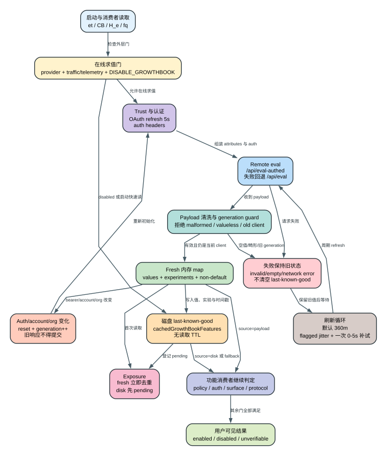

# Claude Code CLI 2.1.235 Feature Flags 与 Remote Config：同一版本为什么表现不同

Feature flag 不是一个简单的布尔开关。`2.1.235` 把启动阶段、账号与组织属性、内存值、磁盘旧值、远端求值、实验曝光、刷新循环和具体功能自己的 policy/provider/protocol gate 叠在一起。任何一层不满足，都会出现“bundle 里明明有这个 key，但当前用户看不到功能”的现象。

## 60 秒理解

**读者问题：** 为什么两台都安装 `2.1.235` 的机器会显示不同命令？为什么退出登录后功能才出现？为什么关闭遥测会连带影响 Remote Control？为什么在环境变量里写一个内部 flag override 仍然不生效？

**一句话模型：** 客户端先决定是否允许连接远端 feature service，再用账号、组织、设备和入口属性获取一批值；每个消费者随后把“内存新值、磁盘旧值或 baked default”与自己的 settings、policy、provider、命令注册和服务端能力继续相与，最终才形成用户可见行为。



贯穿场景：用户执行 Remote Control。客户端先检查是否连接一方 API、组织 policy、登录 scope 和订阅，再读取 `tengu_ccr_bridge`。若内存已有 fresh true，立即通过；若磁盘旧值为 true，也会先通过并登记待确认 exposure；若没有 true，则可能阻塞初始化 GrowthBook。即使 flag 为 true，前面的 host、auth、organization 和 policy 仍可拒绝功能。反过来，即使 bundle 中存在 key，只要 feature evaluation 被关闭、账号没有 rollout 或远端服务不可达，用户仍然看不到可用入口。

| 状态对象 | 所有者 | 可观察状态 | 生命周期 |
| --- | --- | --- | --- |
| baked default | 每个 `et`、`CB`、`H_e` 调用点 | 第二个参数，如 `false`、`{}`、`null` | 随二进制版本固定 |
| fresh feature map | GrowthBook manager 的 `remoteEvalFeatureValues` | `source: payload`、`hasFreshGrowthBookFeatures=true` | 进程内；有效 payload 或账号重置时替换 |
| disk feature map | global config 的 `cachedGrowthBookFeatures` | `source: disk`、`cachedGrowthBookFeaturesAt` | 跨启动；读取路径没有年龄 TTL 拒绝 |
| experiment metadata | `experimentDataByFeature`、cached experiment data | experiment ID、variation ID、待曝光集合 | fresh payload 与磁盘共同参与，账号切换时清理 |
| refresh loop | `AbortController` 与 generation | 默认 360 分钟；flagged cadence 带 jitter | 当前进程；beforeExit、reset、dispose 时停止 |
| consumer state | command/tool/UI/request/policy 子系统 | 工具是否注册、请求字段、阈值、提示或错误 | 由各消费者自己的 cache/reload 规则决定 |

## 一、先区分四种“看起来都像 flag”的东西

### 1. Boolean feature gate

典型读取是：

```text
et("some_key", false)
fq("some_gate")
```

`et()` 是同步、允许陈旧值的读取；`fq()` 是 gate 专用读取，缓存 true 时直接返回，否则可以阻塞初始化。它们都不证明功能最终可用，只给消费者一个值。

### 2. Dynamic config

`CB(key, defaultObject)` 与 `H_e(key, defaultObject)` 读取的不是单一布尔值，而是对象、版本范围、采样率、模型错误覆盖或阈值。例如：

- `tengu_auto_mode_config` 返回 Auto Mode 配置；
- `tengu-off-switch` 返回 `{activated}`；
- `tengu_version_config` 与 `tengu_max_version_config` 返回版本范围；
- `tengu-model-error-overrides` 返回错误覆盖表；
- `tengu_startup_announcements` 返回启动公告配置。

因此“361 个 feature key”不能替代对值类型的解释。一个 key 可能控制布尔 gate，也可能返回结构化策略。

### 3. Environment/settings gate

`DISABLE_GROWTHBOOK`、`CLAUDE_CODE_DISABLE_NONESSENTIAL_TRAFFIC`、`DISABLE_TELEMETRY`、`DO_NOT_TRACK` 等不是远端实验值。它们在更外层决定 feature service 是否启用，或者是否只准读磁盘缓存。

各产品能力还有自己的环境或 settings gate，例如关闭 Workflow、Artifact、background task、tool search 或 Remote Control。外层 gate 为 false 时，远端 flag 为 true 也没有意义。

### 4. Entitlement 与服务端 capability

账号 plan、organization policy、OAuth scope、服务端 endpoint、beta 协议和后端 rollout 不在静态 key 列表里完整呈现。客户端最多能显示“当前拿到了什么值”或“服务不可达”；它不能从 bundle 推导任意账号此刻的 entitlement。

## 二、启动门：什么时候根本不会做远端求值

### 1. `isGrowthBookEnabled` 实际绑定一方事件通道

`jMr()` 的条件是：

```text
!DISABLE_GROWTHBOOK && is1PEventLoggingEnabled()
```

而一方事件通道在以下情况下会关闭：

- 非一方 provider；
- host-managed/provider 特殊路径；
- gateway/受管入口命中对应条件；
- `CLAUDE_CODE_DISABLE_NONESSENTIAL_TRAFFIC`；
- `DISABLE_TELEMETRY`；
- `DO_NOT_TRACK`。

这解释了为什么“关闭遥测”不只是少发 analytics，还会让在线 feature evaluation 关闭。`2.1.235` 将实验曝光与一方事件通道绑定，避免在声明不发送非必要流量时继续进行常规远端实验求值。

### 2. 遥测关闭时的磁盘缓存例外

禁用在线求值后，默认读取结果是 consumer 的 baked default。只有同时满足以下条件，客户端才允许在 disabled 状态读取旧磁盘值：

```text
CLAUDE_CODE_GB_DISK_CACHE_WHEN_TELEMETRY_OFF
&& !DISABLE_GROWTHBOOK
&& telemetry/traffic is disabled
&& first-party provider
```

这个例外不重新联网，也不会让缓存变 fresh。它只允许“在不做远端求值的情况下继续使用上次保存的 feature map”。因此它改善行为连续性，却也扩大陈旧配置继续生效的时间。

### 3. Workspace trust 控制认证，不直接决定是否创建 client

GrowthBook client 可以在尚未建立 workspace trust 时创建，但认证 header 只在 trust 成立后解析。创建前会尝试刷新 OAuth token，最长等待 5 秒；认证失败时记录原因并继续创建无 auth client。

这条设计避免一个不受信工作区通过启动流程过早触发 credential helper 或认证链。它也意味着“client 对象存在”不等于“已拿到账号级 payload”。

### 4. 启动只在无磁盘值时等待 1.5 秒

主启动路径会检查：一方事件通道已启用，且 `cachedGrowthBookFeatures` 为空。只有这时，加载 tools/commands 前最多等待 GrowthBook 初始化 1500 ms。

| 启动状态 | 行为 | 用户影响 |
| --- | --- | --- |
| 已有磁盘 feature map | 不为 GB 阻塞 tools/commands | 启动快，但最初消费者可能读到旧值 |
| 没有磁盘 map，在线求值启用 | 最多等待 1.5 秒 | 尝试减少首次命令/tool surface 抖动 |
| 在线求值关闭 | 直接使用 baked default，或显式允许的磁盘值 | 不承担远端初始化等待 |
| OAuth/GB 初始化超时 | 启动继续 | 功能可能先按 default/旧值运行，稍后刷新 |

SDK client 自身的 `init` timeout 是 5 秒。启动只等待 1.5 秒，不代表底层任务被定义为 1.5 秒后永久失败；其他启动点和后续刷新仍可继续初始化。

## 三、远端求值携带哪些属性

### 1. 属性集合

`getUserAttributes()` 为 remote evaluation 组装以下可选字段：

| 字段 | 含义 | 影响 |
| --- | --- | --- |
| `id` / `deviceID` | device ID | 设备级稳定分桶 |
| `sessionId` | 当前 session | 会话级分析或规则条件 |
| `platform` | 操作系统/平台 | 平台 rollout |
| `apiBaseUrlHost` | 非默认 `ANTHROPIC_BASE_URL` host | 自定义 host 分流；默认 host 不重复发送 |
| `organizationUUID` | 组织 | 组织 rollout 与 cache key |
| `accountUUID` | 账号 | 账号规则与诊断 |
| `userType` | 用户类型 | 账号类别分桶 |
| `subscriptionType` | 订阅类型 | plan rollout |
| `rateLimitTier` | 速率层级 | 容量/体验分流 |
| `organizationRole` | 组织角色 | 管理员/成员差异 |
| `subscriptionCreatedAt` | 订阅创建时间戳 | cohort 规则 |
| `firstTokenTime` | 首次 token 时间 | 新旧用户 cohort |
| `email` | 账号 email | 规则或调试属性；属于敏感标识 |
| `appVersion` | CLI 版本 | 版本 rollout |
| `githubActionsMetadata` | CI 元数据 | CI/Actions 场景分流 |
| `releaseChannel` | release channel | 此构建中局部来源为空，不能假设总会发送 |
| `entrypoint` | 启动入口 | TUI、print、agent 等入口差异 |
| `hasUsedRemoteSession` | 是否使用过远端 session | 体验引导/rollout |
| `hasRemoteEnvironment` | 是否存在远端环境 | cloud/remote 分流 |

这些字段先交给 GrowthBook client 作为 attributes，SDK 生成的 payload 再由请求层 JSON 序列化。静态证据证明客户端提供了这些字段，不证明服务端保存期限、规则内容或每个字段都在每次请求出现。

### 2. SDK cache key 只选两项

client 构造时明确设置：

```text
cacheKeyAttributes: ["id", "organizationUUID"]
```

这不表示规则只读取两项。它表示 SDK cache identity 以 device 与 organization 为主要分区；payload 中仍可包含前面的其他 attributes。账号、订阅或 entrypoint 改变后，客户端还需要主动 reset/reinitialize，不能只依赖 cache key 自动隔离所有状态。

### 3. 远端 endpoint 与 fallback

GrowthBook client 固定使用：

```text
apiHost = https://api.anthropic.com/
clientKey = sdk-zAZezfDKGoZuXXKe
remoteEval = true
```

当 `tengu_gb_eval_authed_enable` 为 false，走 SDK 的普通 `/api/eval` 路径。为 true 时，客户端尝试：

```text
POST /api/eval-authed/{clientKey}
headers = SDK headers + trusted auth headers
body = SDK remote-eval payload
```

`eval-authed` 返回非 2xx 或 fetch 抛错时，不把本轮直接判死，而是记录错误并回退 SDK `/api/eval`。所以“authed eval 失败”与“整个 feature service 失败”是两种状态。

## 四、值解析顺序：同步、阻塞和 gate 并不相同

### 1. 同步读取 `et()`

`et(key, fallback)` 实际调用 `getFeatureValueWithSource`，顺序为：

```text
environment override
-> config override
-> disabled gate
-> fresh in-memory payload
-> disk cache
-> baked fallback
```

但这张逻辑顺序表需要结合本版可达性看。`2.1.235` 的 environment/config override 分支保留了 API 外形，却没有可达实现：

- `getEnvironmentOverrides()` 在读取 `CLAUDE_INTERNAL_FC_OVERRIDES` 前直接返回；后续 parse 代码不可达；
- `readConfigOverrides()` 直接 `return`；
- `setConfigOverride()` 与 `clearConfigOverrides()` 直接 `return`。

因此本版真实可达顺序是：

```text
disabled/default decision
-> fresh in-memory payload
-> disk cache
-> baked fallback
```

不能建议用户通过 `CLAUDE_INTERNAL_FC_OVERRIDES` 强开功能，也不能把 exported `setGrowthBookConfigOverride` 当作有效调试接口。声明/导出名只证明表面，不证明分支可执行。

### 2. `null` 与其他 falsy 值不同

读取 helper 使用 `cXs(value, fallback)`：只有 `value === null` 才退回 fallback。以下值都保留：

- `false`；
- `0`；
- 空字符串；
- 空对象/空数组。

因此不能用普通 truthy/falsy 心智模型解释 dynamic config。消费者还必须按自己的 schema 校验值类型和范围。

### 3. 阻塞读取 `H_e()` / deprecated `dqo()`

`H_e(key, fallback)` 最终调用 `getFeatureValueBlocking`：

1. 检查 override 表面；本版实际均为空；
2. 在线求值关闭则返回 fallback；
3. 等待 manager initialize；
4. 优先读取 fresh in-memory map；
5. 否则调用 SDK `getFeatureValue`；
6. 登记 experiment exposure。

这个路径用于 off switch、Auto Mode config、版本范围和其他需要在决策前尽量拿到 fresh 值的机制。它不会直接读取 global config 的 disk map；磁盘快速路径主要由同步读取和 `checkGateCachedOrBlocking` 承担。

### 4. Gate 读取 `fq()` 的非对称快路径

`checkGateCachedOrBlocking(key)` 的关键顺序是：

1. fresh map 中值严格等于 `true`：立即返回 true；
2. disk map 中值严格等于 `true`：立即返回 true，并登记 deferred exposure；
3. 其他情况：调用 blocking reader，以 false 为 default。

这意味着缓存 true 与缓存 false 不对称：

| 缓存状态 | 是否立即返回 | 后续行为 |
| --- | --- | --- |
| fresh true | 是 | 记录一次 exposure |
| disk true | 是 | 先通过 gate，待 fresh payload 匹配后补 exposure |
| fresh/disk false | 否 | 尝试 blocking 初始化/读取 |
| 无值 | 否 | 尝试在线求值，失败则 false |

好处是已 rollout 功能不因一次启动网络抖动明显变慢；代价是旧 true 可能在刷新前继续生效。产品消费者仍应有独立 policy/protocol 校验，不能把 flag 当安全授权。

### 5. 名字看似会 refresh 的 API 实际没有触发 refresh

`getFeatureValue_CACHED_WITH_REFRESH` 对应的 `L_e(e, t2, r2)` 在本版只执行 `et(e, t2)`，第三个参数没有被使用，也没有启动一次 refresh。

同样，`getDynamicConfig_CACHED_MAY_BE_STALE` 的 `CB()` 只是 `et()` 的别名。名字描述的是允许陈旧值的合同，不是“每次调用都会联网”。

## 五、远端 payload 怎样变成可用状态

### 1. 输入清洗

`processRemoteEvalPayload` 不会把服务端对象原样塞进全局 map。它逐项检查：

- feature entry 必须是非 null object；
- 只有 `value` 而无 `defaultValue` 时，会复制为 `defaultValue` 兼容 SDK；
- experiment source 需要字符串 experiment key 与数字 variation ID；
- entry 必须最终得到非 `undefined` 的 value；
- 无值、非对象和 malformed experiment 分别记录一次错误，避免无限刷日志。

如果清洗后一个有效值都没有，本轮返回 false，不覆盖现有 fresh map 与磁盘 last-known-good。

### 2. 原子替换与 generation guard

有效 payload 先写回 SDK client；随后再次检查 `this.client === evaluatedClient`。只有当前 client 仍是同一代，才依次替换：

- experiment map；
- non-default feature set；
- fresh feature value map。

账号切换或 reset 会增加 generation、销毁旧 client 并清空状态。旧请求即使晚到，也会因为 client identity 不匹配而放弃提交，避免上一个账号的 payload 覆盖新账号。

### 3. 磁盘 last-known-good

成功 payload 会写入 global config：

```text
cachedGrowthBookFeatures
cachedExperimentFeatures
cachedExperimentData
cachedGrowthBookFeaturesAt = Date.now()
```

读取 `cachedGrowthBookFeatures` 时没有按 `cachedGrowthBookFeaturesAt` 做年龄 TTL 拒绝。时间戳主要用于 doctor/debug 显示“多久前获取”。所以磁盘值必须被称为 cached/stale-capable，而不能被称为“在某 TTL 内才有效”。

### 4. `cachedDynamicConfigs` 不是当前读取主路径

global config 默认对象仍有 `cachedDynamicConfigs: {}`，但本版可读源码只看到默认字段，没有对应消费/更新路径。当前 `CB()` 与 `H_e()` 都走统一 feature manager，而不是读取这张旧 map。

这个细节对跨版本比较很重要：字段仍存在不代表机制仍由它驱动。应比较 consumer，而不是只比较 schema/key。

## 六、实验曝光为什么要延迟和去重

### 1. fresh exposure

当 fresh payload 声明某 key 来自 experiment，并给出 experiment ID 与 variation ID，消费者第一次读取该 key 时会调用一方事件日志。成功后把 key 放入 `loggedExposures`，同进程内不重复发送。

若日志函数返回 false，key 会从 logged set 移除，允许后续读取重试。这里的“已记录”指客户端日志入口接受，不证明服务端最终持久化。

### 2. disk exposure 不立即发送

磁盘缓存可能来自旧实验或旧 variation。读取 disk 值时，客户端只把 `{feature -> experimentId/variationId}` 放到 `pendingExposures`。

fresh payload 到达后，只有新旧 experiment ID 与 variation ID 完全一致，才真正记录 exposure；随后清空 pending set。这样避免把旧磁盘值误报成当前实验曝光。

### 3. 隐私与诊断影响

曝光事件会携带 experiment、variation、feature ID 和 `getUserAttributes()` 产生的用户属性。用户关闭非必要流量后在线 feature evaluation 和 exposure 都随一方事件通道关闭；显式磁盘缓存例外只读旧值，不恢复正常 exposure 管道。

## 七、刷新循环、重试与账号切换

### 1. 默认 cadence

没有 `tengu_gb_refresh_interval_minutes` 时，刷新间隔固定为 360 分钟，`flagged=false`。

远端 cadence 存在时：

1. 字符串先转 Number；
2. 正有限数且大于 0 才接受，否则回到 360；
3. 基准值 clamp 到 5-360 分钟；
4. 乘 0.9-1.1 jitter；
5. 最终只再封顶 360 分钟。

所以实际范围不是简单“5-360”：

| 配置基准 | 实际单次区间 |
| ---: | ---: |
| 5 分钟 | 约 4.5-5.5 分钟 |
| 60 分钟 | 约 54-66 分钟 |
| 360 分钟 | 约 324-360 分钟，向上的 jitter 被封顶 |
| 非法值 | 约 324-360 分钟，但仍标记 `flagged=true` |

### 2. flagged cadence 的一次快速补偿

每轮刷新前记录 `remoteEvalFetchOkCount`。若刷新后计数没有增加，且 cadence 来自 flag，客户端随机等待 0-5 秒，再补做一次 refresh。

这不是无限 retry。外层 loop 抛错时记录错误并等待 60 秒；下一正常周期再继续。产品请求的 HTTP retry 与这里的 feature refresh retry 是不同层。

### 3. refresh 只提交有效新 payload

`refreshFeatures({skipCache:true})` 后仍要通过 payload 清洗与 client identity 检查。网络成功但 payload 为空/无值，不会清空 last-known-good map；网络失败也只记录错误，旧内存/磁盘状态继续存在。

### 4. auth bearer、account 和 organization 变化

若 client 最初带 auth：

- refresh 前尝试更新 OAuth token；
- 重新解析 Authorization；
- bearer 变化时重读用户属性；
- accountUUID 与 organizationUUID 未变，允许保留已记录 exposure set；
- 账号/组织变化则不保留，reset 后重新初始化。

若 client 最初因为临时 auth resolution 失败而无 auth，后续成功拿到 bearer 也会 reset/reinitialize。这个机制解释了为什么重新登录、切换组织或凭据恢复后，rollout 可以在同一版本中改变。

### 5. reset/dispose 的边界

reset 会：

- 停止 periodic loop；
- 移除 beforeExit/exit handler；
- destroy client；
- generation 加一；
- 清空 fresh values、experiment map 和 non-default set；
- 按参数决定是否保留 pending/logged exposure；
- 清空 client/initialize promise；
- 重置 override parse 状态。

dispose 还会恢复 SDK 原始 remote-eval fetch handler。进程退出时只销毁 client；磁盘 cache 不自动删除。

## 八、消费者怎样把 flag 继续变成功能

### 1. Remote Control：最完整的多门示例

Remote Control doctor 同时检查：

1. 当前是否连接 `api.anthropic.com`；
2. managed `disableRemoteControl`；
3. 是否登录 claude.ai；
4. 订阅 auth 是否 active；
5. OAuth 是否含 profile scope；
6. organization 是否解析成功；
7. 服务端 org policy `allow_remote_control`；
8. feature evaluation 是否启用；
9. `tengu_ccr_bridge` 是否 true；
10. 是否拿到 fresh server response。

因此它能区分三种常见结果：

- rollout enabled；
- fresh response 存在，但账号未 rollout；
- 没有 fresh response，无法验证，而不是武断写成 false。

这套诊断体现了正确的用户思维：告诉用户是哪一门没开，而不是只打印一个内部 key。

### 2. Auto Mode、off switch 与版本限制

以下路径使用 blocking dynamic config：

- Auto Mode 在使用前读取 `tengu_auto_mode_config` 并自行 parse `enabled`；
- 特定模型/入口在继续前读取 `tengu-off-switch`；
- 版本约束读取 min/max version config；
- bridge REPL v2 配置读取后再做 schema safeParse。

即使返回对象，consumer 仍负责类型校验、版本比较和 fallback。Feature manager 只交付值，不替业务做完整验证。

### 3. 采样、公告和错误覆盖

允许陈旧的 `CB()` 适合不必阻塞启动的配置：

- 一方事件采样率；
- batch/日志配置；
- 启动公告；
- 模型错误覆盖；
- bridge 最低版本；
- desktop upsell。

这些配置读到 disk/default 时可以立即继续，fresh payload 到达后由订阅回调或下一次读取生效。并非所有 consumer 都会响应 refresh；必须逐个看它是否订阅 `onGrowthBookRefresh`、是否重建 cache，或只在初始化读取一次。

### 4. Feature flag 不是权限系统

高风险行为仍应经过：

- managed policy；
- permission rule；
- workspace trust；
- sandbox/filesystem/network isolation；
- auth scope 与 provider gate；
- 明确 protocol/server validation。

把 remote flag 当授权会让旧 disk true、服务端误配或实验规则承担不该承担的安全责任。本版 Remote Control 等功能把 flag 放在 policy/auth 后面，是更合理的分层。

## 九、机器清单怎样读

`2.1.235` 的确定性 inventory 给出：

| 表面 | 数量 | 能证明什么 |
| --- | ---: | --- |
| 静态 feature key | 361 | bundle 中提取到稳定 key 文本 |
| `et()` AST callsite | 498 | cached-may-be-stale feature reader 的调用位置和参数表达式 |
| 静态 GrowthBook/dynamic config key | 6 | `CB()` 调用中可静态解析的 key |
| `CB()` AST callsite | 12 | cached dynamic config 调用位置；部分 key 是 unresolved identifier |
| readable 中 `H_e()` 调用行 | 8，含 wrapper 定义 | blocking dynamic config 的直接使用面 |
| readable 中 `fq()` 调用行 | 14，含 wrapper 定义 | gate cached-or-blocking 使用面 |

数字有三个边界：

1. 同一行可能有多个 AST callsite，所以文本行数不等于调用数；
2. identifier 经压缩后可能无法仅靠局部 AST 恢复常量名，inventory 会保留 unresolved expression；
3. key/callsite 只证明读取表面，不证明 remote value、账号 rollout、consumer reachability 或服务端成功。

正确阅读顺序是：key -> reader 类型 -> default/value schema -> consumer -> 其他 gates -> refresh/lifecycle -> Probe/Boundary。

## 十、四类典型故障怎么定位

### 1. “同一版本，别人有我没有”

依次检查：

1. provider 与 `ANTHROPIC_BASE_URL`；
2. 非必要流量/telemetry/GrowthBook 是否关闭；
3. OAuth scope、subscription、account、organization；
4. managed policy；
5. doctor 是否显示 fresh feature response；
6. disk cache 获取时间；
7. command/tool surface 是否注册；
8. 后端 endpoint/protocol 是否支持。

不要从 `feature-flags.txt` 搜到一个 key 就结论“该账号应当可用”。

### 2. “关闭遥测后功能消失”

这是本版架构的可解释结果：在线 GrowthBook 依赖一方事件通道。需要区分用户的目标是“不发 experiment/analytics”还是“仍使用上次旧值”。后者只有显式 disk-cache-when-telemetry-off 路径，而且仅限一方 provider，仍有陈旧风险。

### 3. “设置 `CLAUDE_INTERNAL_FC_OVERRIDES` 没反应”

`2.1.235` 的读取函数在 parse 前提前返回，config override 方法也是空实现。精确二进制 Probe 在禁用在线求值时设置：

```text
CLAUDE_INTERNAL_FC_OVERRIDES={"tengu_ccr_bridge":true}
```

doctor 仍报告：

```text
- Feature-flag evaluation disabled (disabled by CLAUDE_CODE_DISABLE_NONESSENTIAL_TRAFFIC)
- Remote Control rollout could not be verified for this account (no server response this session)
```

如果 override 分支可达，`fq()` 会在 disabled gate 前读到 true；本次结果没有发生。这个 Probe 只证明该本地 override 没把 `tengu_ccr_bridge` 变成 true，不证明在线服务对账号的真实 rollout。

### 4. “刚切账号仍显示旧功能”

检查 auth refresh 是否真正改变 bearer、accountUUID 或 organizationUUID。正常路径会 reset generation 并重新初始化；若只是切换了外部 UI 而 CLI auth state 未变化，旧进程状态不会凭空更新。必要时用 doctor 查看账号/组织与 fresh fetch 时间，而不是只重开一个终端标签。

## 十一、延迟、成本、隐私与安全影响

| 维度 | 机制 | 影响 |
| --- | --- | --- |
| 启动延迟 | 无 disk map 时最多等待 1.5 秒；OAuth/SDK 内部各有 5 秒级 timeout | 首次运行更可能拿到正确 surface，失败时仍继续启动 |
| 网络成本 | 默认约 6 小时刷新；flagged cadence 可更短，失败可 0-5 秒补试一次 | 一般低频；大量短进程仍可能各自初始化 |
| CPU/内存 | 361 key 与 payload map 驻留，消费者同步读取 | 单次成本低，复杂度主要来自状态一致性 |
| 隐私 | device/session/account/org/email/subscription/entrypoint 等可作为 attributes | 便于精细 rollout，也扩大身份与行为元数据面 |
| 可用性 | disk last-known-good、fallback `/api/eval`、invalid payload 保留旧值 | 网络抖动不立即撤销功能，但 stale true/配置可延长 |
| 安全 | flag 只控制 rollout，不应替代 policy/permission/sandbox/auth | 旧 cache 或实验误配不能成为高风险操作授权 |
| 诊断 | `source`、fresh map、last fetched、doctor 多门检查 | 可区分 disabled、offline、not rolled out 与 policy denied |

## 十二、微小但关键的实现事实

- `getFeatureValue_CACHED_WITH_REFRESH` 在本版没有 refresh side effect。
- `CB()` 与 `et()` 走同一同步缓存读取；dynamic config 不天然 fresh。
- `H_e()` 才是 blocking-on-init dynamic config。
- `fq()` 只对严格 `true` 走 cache fast path，truthy 字符串不会在该两处判断中直接当 true。
- disk cache 没有读取 TTL；`cachedGrowthBookFeaturesAt` 是诊断时间，不是 expiry enforcement。
- remote payload 无有效值时保留旧 map，而不是清空。
- `client !== evaluatedClient` 防止旧 generation 的 late response 覆盖新账号。
- experiment exposure 对 disk 值先 pending，fresh variation 匹配后才发送。
- `source !== defaultValue/unknownFeature` 才进入 non-default set。
- `value:null` 回退 default，`false/0/""` 不回退。
- refresh cadence 在 360 分钟处只保留向下 jitter；5 分钟处可能低至约 4.5 分钟。
- cadence flag 存在但值非法时使用 360 基准，仍会启用 flagged failure fast-retry。
- auth eval 非 2xx/throw 会 fallback 普通 SDK eval，不直接让整个 refresh 失败。
- untrusted workspace 不解析 auth headers，但 client 对象仍可存在。
- `cachedDynamicConfigs` 字段存在，却没有当前主读取 consumer。
- custom `ANTHROPIC_BASE_URL` 的非默认 host 会成为 attribute；GrowthBook apiHost 仍固定为 Anthropic endpoint。

## 十三、证据与不能恢复的边界

### Static

- manager 状态、override 空实现、payload 清洗、磁盘同步、读取顺序、刷新与 reset：`reverse/javascript/cli.readable.js:88098-88440`；
- enable gate、disk-cache exception、attributes、reader wrappers 与 cadence：`reverse/javascript/cli.readable.js:88464-88589`；
- telemetry/traffic gate：`reverse/javascript/cli.readable.js:17264-17284`、`67191-67207`、`77973-78006`；
- startup 1500 ms await：`reverse/javascript/cli.readable.js:592731-592735`；
- Remote Control 多门 doctor：`reverse/javascript/cli.readable.js:89284-89320`；
- inventory：`analysis/source-inventory/feature-flags.txt`、`feature-flag-callsites.jsonl`、`growthbook-keys.txt`、`growthbook-callsites.jsonl`。

### Probe

`probe.feature-override-unreachable` 使用精确 `2.1.235` 二进制、隔离 HOME/config、不可达本地 endpoint、禁用非必要流量并设置 `CLAUDE_INTERNAL_FC_OVERRIDES`。literal output、exit status 与 target SHA-256 记录在 `analysis/runtime-probes/lifecycle-doctor.json`，人类解释见 `analysis/runtime-probe-index.md`。

### Boundary

客户端不能从 shipped bundle 证明：

- 任一账号当前拿到的实际 payload；
- 服务端规则表达式、分桶比例和紧急 kill switch 值；
- 组织 entitlement 的后台来源；
- experiment/attribute 在服务端的保存期限与查询权限；
- current public documentation 对未来版本的实现；
- 一个 hidden/disabled/stub consumer 是否已由服务端完整交付。

所以本专题可以准确解释 `2.1.235` 客户端如何取值、缓存、刷新和消费，却不会把 server-side rollout 猜成静态事实。
