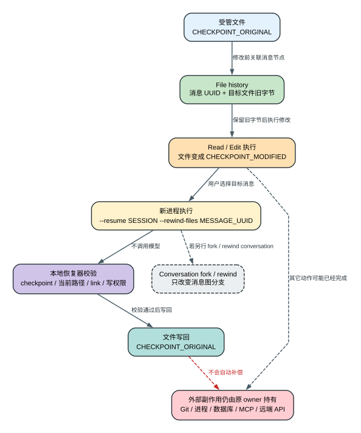

# Claude Code 2.1.235 File Checkpoint 与 Rewind：为什么能恢复文件，却不能撤销整个任务

Claude Code 的 file rewind 不会让模型再写一段“反向修改”。它读取客户端此前保存的文件历史，直接把受管文件写回目标消息节点对应的字节。

下面从 `2.1.235` 精确二进制 Probe 开始。

## 一次真实的 Read、Edit 与 Rewind

隔离工作区先有一个文件：

```text
$WORKSPACE/checkpoint.txt
CHECKPOINT_ORIGINAL
```

Probe 让 Claude Code 在固定 session 中依次调用内置 `Read` 和 `Edit`。Edit 输入把唯一一行替换为：

```text
CHECKPOINT_MODIFIED
```

客户端执行完成后，模型返回：

```text
CHECKPOINT_EDIT_OK
```

CLI 结果为 `subtype=success`，exit status 为 `0`；磁盘文件此时确实是 `CHECKPOINT_MODIFIED`。

Probe 随后从这份真实 session JSONL 中取出触发修改的 user message UUID，并在新的 Claude Code 进程中运行：

```text
$CLAUDE_TARGET --print \
  --resume $SESSION_ID \
  --rewind-files $USER_MESSAGE_UUID
```

CLI literal output 是：

```text
Files rewound to state at message $USER_MESSAGE_UUID
```

命令 exit status 为 `0`，文件最终重新变成：

```text
CHECKPOINT_ORIGINAL
```

Rewind 阶段收到的 Messages 请求数是 `0`。恢复动作完全发生在本地客户端，没有请求模型，也没有让模型重新生成一条 Edit。



## Checkpoint 在修改前保存什么

File history 需要把一次可修改动作与消息图中的节点关联起来。对受管文件，客户端至少要保存或推导：

- 哪个 message/tool action 发生在文件变化之前；
- 规范化文件路径和目标节点处的文件内容；
- 后续哪些消息与修改位于这个 checkpoint 之后；
- 当前文件是否仍能安全写回；
- 缺失文件、symbolic link、权限或写入失败怎样报告。

因此 checkpoint 不是“每次 Edit 都复制整个工作区”。它只覆盖文件历史系统能够跟踪的路径和动作。Bash 脚本在未知目录里创建的文件、MCP 远端写入、数据库更新和 Git remote 状态没有自动进入同一份文件快照。

`2.1.235` 最多保留 `100` 个 checkpoint。上限位于可读 bundle 的 17194、194602-194619。长会话超过这个数量后，旧节点会按实现规则退出可恢复集合；看到历史消息仍在，不等于对应文件快照还在。

## Rewind 前为什么还要重新检查当前状态

真正写回之前，客户端不能只相信一个旧 UUID。可达接口会检查：

1. file history 是否启用；
2. 目标 message 是否存在对应 checkpoint；
3. 当前文件、路径和 link 状态是否允许恢复；
4. 恢复实现能否把目标字节安全写回；
5. 哪些链接或路径必须跳过并返回给调用方。

SDK 路径支持 dry run。它可以先返回：

```text
canRewind
filesChanged
insertions
deletions
skippedLinks
```

这些字段让调用方先看影响范围，而不是把“回到某条消息”误解为只移动聊天光标。失败会形成明确结果，例如：

```text
File rewinding is not enabled.
No file checkpoint found for this message.
Failed to rewind: ...
```

目标版的文件 edit tracking 与 rewind 主路径位于可读 JS 194641-194804。

## Conversation Rewind 与 File Rewind 改变的是两种状态

Claude Code 同时存在两类容易混淆的回退：

```text
conversation rewind
  -> 改变 message graph 的当前 leaf / 后续对话分支

file rewind
  -> 改变受管文件在磁盘上的当前字节
```

只回退 conversation，磁盘上的修改仍可能保留；只回退 files，当前对话仍可能记得后来发生过的要求、工具结果和判断。一个可靠的 UI 或 SDK 必须明确本次操作改变哪一层，不能只显示笼统的“已回退”。

Fork 也不等于 rewind。Fork 从某个历史节点创建新的会话分支，但不会自动恢复那个节点时的工作区。要同时改变对话分支和受管文件，调用方需要分别执行对应操作，并处理其中任何一步失败后的部分状态。

## 为什么源进程仍存活时不能随便接管文件历史

Resume 还有一条 owner 规则：当 `CLAUDE_CODE_RESUME_SOURCE_ALIVE` 表示原进程仍存活且 session 身份匹配时，新进程不会恢复 `fileHistorySnapshots`。

原因是两个活进程不能同时假设自己拥有同一份 file rewind 历史。消息、attribution 或 context-collapse 状态可以装入新进程，但文件快照 ownership 仍留给源进程。否则两个进程可能基于不同当前字节同时执行 rewind，覆盖彼此刚完成的修改。

这条规则说明 file history 不是普通只读 transcript。它最终会写工作区，因此必须有唯一执行 owner。

## 哪些副作用永远不在 File Checkpoint 里

File rewind 只处理客户端受管的本地文件字节。以下动作即使出现在 transcript 中，也不会因为 rewind 自动撤销：

- 已经完成的 `git commit` 或 `git push`；
- Bash 修改但未进入 file history 的路径；
- 仍在运行或已经退出的普通子进程；
- 数据库写入、队列消息或支付操作；
- MCP、Artifact、GitHub、Slack 等远端 API 写入；
- 已发送给其他用户的消息与通知。

Transcript 中保存 `deployment_id`、PID 或远端 URL，只说明客户端记录过这些文本，不表示它拥有对应系统的撤销能力。远端恢复需要服务自己的 readback、幂等键、cancel/delete API 或人工补偿。

这也是为什么 checkpoint 不能被描述成“项目级事务”或“时间倒流”。它是针对受管文件的本地补偿机制。

## 失败后的状态怎样判断

Rewind 失败时先看失败发生在哪一层：

| 失败位置 | 仍然有效的状态 | 下一步判断 |
| --- | --- | --- |
| 没有 checkpoint | 当前文件与消息图都不变 | 目标节点是否过旧、history 是否关闭 |
| 某些 link 被跳过 | 其它成功文件可能已恢复 | 检查 `skippedLinks`，不能宣称全量成功 |
| 写回中途失败 | 已成功写回的文件可能已改变 | 逐文件 readback，不能只看总 exit |
| Conversation 已 fork、file rewind 失败 | 新分支存在，工作区仍是新字节 | 决定重试文件恢复还是保留当前工作区 |
| File rewind 成功、远端副作用仍在 | 本地字节已恢复 | 查询远端 owner 并执行补偿 |

客户端和集成方应把 rewind 当成有明确对象和部分成功边界的操作。单个成功提示不能证明所有外部状态已经回到同一时刻。

## 用户能从这个机制得到什么

File checkpoint 的价值不是代替 Git，而是让 Claude Code 在同一工作会话中快速撤回受管文件修改，并把恢复目标绑定到消息节点。它减少“模型改错后人工寻找旧内容”的成本，也为 SDK 提供 dry-run 差异和精确错误。

代价同样明确：客户端需要保存文件历史，checkpoint 有数量上限，链接和外部路径需要额外防护，多个活进程还要争夺唯一 owner。恢复范围越明确，越不能把它宣传成整项任务回滚。

## 证据与边界

精确运行证据位于 [checkpoint-rewind.json](runtime-probes/checkpoint-rewind.json)：

- 输入从 `CHECKPOINT_ORIGINAL` 真实修改为 `CHECKPOINT_MODIFIED`；
- 从真实 transcript 读取目标 user message UUID；
- `--rewind-files` 输出 `Files rewound to state at message ...`；
- rewind 阶段模型请求数为 `0`；
- 最终文件字节恢复为 `CHECKPOINT_ORIGINAL`；
- 命令 exit status 为 `0`。

结构化 claim 为 `probe.checkpoint-rewind-positive`。同一报告绑定 Claude Code `2.1.235` 二进制 SHA-256：`83b8f806f6f2eea316cfe246628e6c23374711d868f1fd0409db551b877b7748`。

静态证据：checkpoint 上限见可读 JS 17194、194602-194619；edit tracking/rewind 见 194641-194804；SDK dry-run、error 与 `skippedLinks` 位于 SDK engine 的 `rewindFiles` 分支。

这组 Probe 证明的是受控本地文件的正向恢复合同。它不证明 symlink、硬链接、并发外部写入、权限变化、网络文件系统、所有工具类型或远端系统的通用回滚。完整 session/compact/memory 关系见[会话、检查点与 Memory](sessions-checkpoints-memory.md)。
