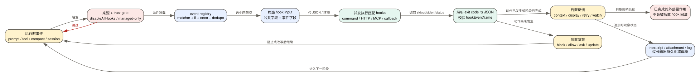

# Claude Code CLI 2.1.235 Hooks：31 个事件到底在什么时候运行、能改什么

> 版本：`2.1.235` | 证据：目标版本 readable bundle 的 `Static` 路径；未做账号侧或远端服务行为倒推

Hooks 不是一组等价的“回调”。有的发生在副作用之前，可以拒绝或改写动作；有的发生在工具、压缩、目录切换或会话结束之后，只能补充反馈；还有的直接承担 Worktree 创建这类业务动作。判断一个 Hook 是否安全、是否能恢复，必须先回答：它在状态变化的前面还是后面，输出由谁消费，失败时原动作是否已经发生。

## 60 秒理解 Hook 控制面

**读者问题：** 为什么同样是 Hook，`PreToolUse` 能阻止命令，`PostToolUse` 却撤不回网络请求，`Stop` 又能让已经准备结束的 Agent 继续一轮？

**一句话模型：** Claude Code 把运行时事件映射成带公共会话字段和事件字段的 Hook input，经来源、信任、matcher 与条件筛选后并发执行，再按事件所在阶段把结果解释成前置决策、后置反馈、显示替换或生命周期动作。

贯穿场景：模型准备执行 `Bash` 修改文件。`PreToolUse` 在 `tool.call` 前看到工具名、输入和 ID，可以拒绝、要求询问或返回 `updatedInput`；工具成功后，`PostToolUse` 能替换送回模型的工具输出或增加上下文，但文件已经写入；一批工具都结束后，`PostToolBatch` 可进行整批审计；主 Agent 准备结束时，`Stop` 的 blocking feedback 又能重新打开 Agent Loop。

| 对象 | 触发前 | Hook 转换 | 触发后 | 用户可见影响 |
| --- | --- | --- | --- | --- |
| 工具提案 | 只有 `tool_name`、`tool_input`、`tool_use_id` | `PreToolUse` 可 allow/ask/deny/defer 或改输入 | 重新校验后执行，或生成拒绝结果 | 审批、阻止、改参数，尚无工具副作用 |
| 单工具结果 | 工具已经成功或失败 | Post hook 可补 context、改模型看到的 output | paired `tool_result` 进入下一轮 | 能改变后续推理，不能撤销文件/进程/网络动作 |
| 工具批次 | sibling tools 尚未全部 resolve | `PostToolBatch` 等待屏障后执行一次 | 整批 context 或停止信号进入循环 | 适合跨工具审计，不保证逐工具 Hook 串行 |
| Agent 结束 | 模型已准备停止 | `Stop`/`SubagentStop` 可给 blocking feedback | `stop_hook_active` 后重新请求模型 | 可要求补测试或解释，但有连续阻止上限 |
| Compact | 长历史准备被替换 | `PreCompact` 可加定制说明或阻止 | summary 与 boundary 写入；`PostCompact` 再通知 | 前置可影响摘要，后置不能恢复已丢失的表示 |
| UI 显示 | assistant delta 已生成 | `MessageDisplay` 可替换屏幕内容 | transcript 与模型内容保持原样 | 只改显示，不改事实历史 |

## 一、Hook 运行管线

### 1. 事件不是直接执行命令

目标版本把 31 个事件登记到同一个 registry。事件发生后，runner 先汇合 managed settings、用户/项目设置、plugin/skill 动态 Hook，再完成以下筛选：

1. workspace 是否可信，`disableAllHooks` 是否关闭全部 Hook；
2. 当前 Agent 是否只允许 managed hooks；
3. event 名是否匹配；
4. matcher 是否命中事件的匹配字段；
5. 可选 `if` 条件是否成立；
6. 同源、同配置 Hook 是否已经去重；
7. `once` Hook 是否已经消费并应从 session registry 移除。

筛选后的匹配项以 `Promise.all` 形态并发执行。这里的“并发”指同一事件命中的 Hook 之间没有默认串行保证；它不表示所有事件彼此并发。例如 `PostToolBatch` 本身要等本批工具 resolve 后才触发。

证据：事件枚举见 [`source-inventory/hook-events.txt`](source-inventory/hook-events.txt)；registry、来源汇合与 matcher 路径见 [`cli.readable.js`](../reverse/javascript/cli.readable.js) 405354、405890-405976、488410-488517 附近。

### 2. 每个 input 都有一组公共字段

`createBaseHookInput` 会按可用状态写入：

| 字段 | 运行时含义 | 读法与边界 |
| --- | --- | --- |
| `session_id` | 当前会话身份 | 可关联 transcript；属于敏感运行标识，不应随日志公开 |
| `transcript_path` | 当前 transcript 本地路径 | 可能暴露用户目录、项目结构和会话内容位置 |
| `cwd` | Hook 触发时工作目录 | 不等于所有工具最终访问范围；工具还受权限与 sandbox 约束 |
| `prompt_id` | 当前 prompt 关联 ID，若存在 | 适合关联诊断，不是稳定业务主键 |
| `permission_mode` | 事件调用方传入的权限模式，若存在 | 不表示 Hook 自己在 sandbox 内运行，也不覆盖 managed policy |
| `agent_id` / `agent_type` | 主 Agent、子 Agent 或特定运行上下文 | 某些事件会同时向父/子上下文匹配，不能只按 session ID 去重 |
| `effort` | 支持模型下的归一化 effort level | 只有当前模型和状态能构造时才出现 |
| `hook_event_name` | 本次事件名 | JSON 输出中的 `hookSpecificOutput.hookEventName` 必须与期望事件一致 |

公共字段不应被当成稳定公开 API 的全部合同。2.1.235 的 bundle 能证明客户端当前构造形状，但后续版本可增加字段；Hook 消费方应忽略未知字段。

### 3. matcher 只匹配事件选择字段

matcher 不是任意 JSON 查询。每类事件有自己的 `matchQuery`：

- 工具事件、`PermissionRequest`、`PermissionDenied`：工具名；
- `Notification`：notification type；
- `SessionStart`：`startup/resume/clear/compact/fork` 等 source；
- `PreCompact`/`PostCompact`：`manual/auto`；
- `ConfigChange`：配置 source；
- `InstructionsLoaded`：load reason；
- MCP Elicitation：server name；
- `UserPromptExpansion`：command name；
- 任务、Stop、显示等没有专属 matcher metadata 时，配置 matcher 不产生同样的字段过滤语义。

设置界面列出的 matcher values 是帮助和 schema 表面；真实是否触发仍取决于事件调用点、workspace trust、配置来源和当前运行模式。

### 4. 执行载体并不等价

本版 runner 可看到 command、HTTP、MCP tool、prompt、agent、function/callback 等 Hook 形态，但不是每个事件都支持所有载体。

| 载体 | 输入/输出 | 关键限制 |
| --- | --- | --- |
| command | JSON input 送进子进程；解析 exit code、stdout/stderr 和可选 JSON | 默认 600 秒；注入 `CLAUDE_PROJECT_DIR`；进程继承面和工作目录要单独审计 |
| HTTP | POST 结构化 input，响应必须是 JSON | 不跟随重定向；受 URL allowlist、环境变量 allowlist和 sandbox proxy 路径约束；`SessionStart`、`Setup` 禁用 HTTP Hook |
| MCP tool | 把配置 input 模板解析后调用已连接 MCP server/tool | server 未连接、超时、MCP error 都成为 Hook 失败；文本 content 被拼接为 body |
| prompt / agent | 让模型或 Agent 处理 Hook prompt | REPL 外若事件不支持会明确报 unsupported；它们会额外产生模型延迟和 token 成本 |
| function/callback | 进程内回调 | 主要用于 REPL 内受控路径；REPL 外到达该分支被视为内部错误 |

`SessionStart`、`Setup`、`CwdChanged`、`FileChanged` 的 command Hook 还可拿到 `CLAUDE_ENV_FILE`，向其中写 shell exports 影响后续 Bash 环境。它是跨后续命令的状态写入，不只是一次 Hook stdout。

## 二、输出如何改变控制流

### Exit code 不是全事件统一语义

命令 Hook 的通用规律是：

- `0` 表示命令本身成功，随后仍要解析和校验 JSON；
- `2` 常用于 blocking，但具体阻止什么由事件决定；
- 其他非零通常成为 non-blocking error，显示或记录错误后继续原流程。

不能把这三条机械套到全部事件。`StopFailure` 输出被忽略；`SessionEnd` 失败只写 stderr；`WorktreeCreate` 没有有效路径就整体失败；`PostToolBatch` 的 exit 2 停止后续 Agent Loop，但不能回滚已完成的工具批次；`ConfigChange(policy_settings)` 的结果会被强制标为不阻塞。

### JSON 输出的共享字段

| 输出 | 消费效果 |
| --- | --- |
| `continue:false` + `stopReason` | 设置 `preventContinuation`，由调用事件决定终止当前路径 |
| `decision:approve/block` | 映射到 allow/deny；block 生成 blocking error |
| `systemMessage` | 作为受控系统消息进入支持该结果的调用方 |
| `terminalSequence` | 只接受有限 OSC/BEL allowlist，拒绝任意终端控制序列 |
| `suppressOutput` | 控制 Hook 自身展示，不等于删除工具或 transcript 结果 |
| `hookSpecificOutput` | 按事件解释 updated input/output、additional context、watch paths、标题、显示内容等 |

JSON 必须通过 schema，并且 `hookSpecificOutput.hookEventName` 必须与当前事件一致。命令 stdout 以 `{` 开头但 schema 不合法时会报告 validation error；HTTP body 则必须是合法 JSON，不能退回普通文本。

### 能实际修改的状态

| 事件 | 可修改状态 | 后续校验/边界 |
| --- | --- | --- |
| `PreToolUse` | permission decision、reason、`updatedInput`、`additionalContext` | 改写后的工具输入必须重新过 schema/自定义校验；defer 受运行模式和批次限制 |
| `PermissionRequest` | allow/deny decision，allow 可带 `updatedInput` | 仍要进入剩余 permission/tool 校验，不是直接调用工具 |
| `PostToolUse` | `updatedToolOutput`、兼容 MCP output、`additionalContext` | 修改后的输出仍要过工具 output schema；失败时保留原始结果并附 Hook error |
| `PermissionDenied` | `retry:true` | 只告诉模型可重试；被拒绝的本次工具没有执行 |
| `UserPromptSubmit` | context、session title、suppress original prompt | blocking 时原 prompt 不进入后续业务处理 |
| `SessionStart` | context、initial user message、title、watch paths、reload skills | 影响启动上下文和 watcher；不能据此推断所有插件已成功重载 |
| `CwdChanged`/`FileChanged` | watch paths、system message、环境文件 | 已发生的 cwd/file event 不会被撤销 |
| `Elicitation`/`ElicitationResult` | action/content | decline 转成 blocking/decline 结果；远端 MCP server 的后续行为是边界 |
| `MessageDisplay` | `displayContent` | 只替换屏幕 delta，不修改 stored message 或模型上下文 |

### 过长输出如何处理

Hook 输出小于限制时直接返回；过长时会写入本地持久化文件并用引用/缩减文本进入上下文。若持久化失败，客户端截断到限制并附失败说明。它解决上下文膨胀，不等于敏感信息脱敏：Hook stdout/stderr、路径、tool input 和 response 仍可能进入 transcript、日志或持久化附件。

## 三、31 个事件逐项合同

下表的“阻塞/修改”描述的是本版调用方实际消费，不是从事件名称猜测。`Boundary` 表示 bundle 中能看到输入或 schema，却没有足够证据证明远端服务、账号状态或外部程序完成了什么。

<!-- HOOK_EVENT_COVERAGE_BEGIN -->
<!-- hook-event:ConfigChange -->
<!-- hook-event:CwdChanged -->
<!-- hook-event:DirectoryAdded -->
<!-- hook-event:Elicitation -->
<!-- hook-event:ElicitationResult -->
<!-- hook-event:FileChanged -->
<!-- hook-event:InstructionsLoaded -->
<!-- hook-event:MessageDisplay -->
<!-- hook-event:Notification -->
<!-- hook-event:PermissionDenied -->
<!-- hook-event:PermissionRequest -->
<!-- hook-event:PostCompact -->
<!-- hook-event:PostToolBatch -->
<!-- hook-event:PostToolUse -->
<!-- hook-event:PostToolUseFailure -->
<!-- hook-event:PreCompact -->
<!-- hook-event:PreToolUse -->
<!-- hook-event:SessionEnd -->
<!-- hook-event:SessionStart -->
<!-- hook-event:Setup -->
<!-- hook-event:Stop -->
<!-- hook-event:StopFailure -->
<!-- hook-event:SubagentStart -->
<!-- hook-event:SubagentStop -->
<!-- hook-event:TaskCompleted -->
<!-- hook-event:TaskCreated -->
<!-- hook-event:TeammateIdle -->
<!-- hook-event:UserPromptExpansion -->
<!-- hook-event:UserPromptSubmit -->
<!-- hook-event:WorktreeCreate -->
<!-- hook-event:WorktreeRemove -->
<!-- HOOK_EVENT_COVERAGE_END -->

| Event | 时机与事件字段 | matcher | 阻塞/修改能力 | 失败、持久化与敏感度 |
| --- | --- | --- | --- | --- |
| `ConfigChange` | session 中配置文件变化；`source`、`file_path` | source：user/project/local/policy settings、skills | exit 2 可阻止普通变更应用到当前 session；`policy_settings` 结果被强制改为 non-blocking | 文件路径敏感；Hook 失败不应被误写成磁盘文件回滚 |
| `CwdChanged` | cwd 已从 `old_cwd` 变成 `new_cwd` | 无专属 UI matcher | 可返回 watch paths/system message；可写 `CLAUDE_ENV_FILE` | 后置观察，不能撤销 cwd 变化；绝对路径敏感 |
| `DirectoryAdded` | `/add-dir` 或 SDK `register_repo_root` 已注册 `directory`，带 `source` | source | 可给 system message；不是前置拒绝门 | sandbox/permission 已刷新后才触发；Hook command 自身未因此自动 sandbox；路径敏感 |
| `Elicitation` | MCP server 请求用户输入；server、message、schema、mode、URL、ID | `mcp_server_name` | 可输出 accept/decline/cancel 和 content；decline 形成 blocking error | schema/message 可能含第三方内容和敏感字段；服务端是否接受为 Boundary |
| `ElicitationResult` | 用户已对 MCP elicitation 作答；action、content、mode、ID | `mcp_server_name` | 可覆盖 action/content；decline 阻止原响应继续 | Hook 接触用户答案；外部 MCP 的最终状态为 Boundary |
| `FileChanged` | watcher 观察到 `file_path` 的 change/add/unlink | 文件名 matcher 用于 watcher | 可更新 watch paths、system message、环境文件 | 文件事件已经发生；不能还原文件；路径和文件名敏感 |
| `InstructionsLoaded` | CLAUDE.md/rule 被加载；path、memory type、load reason、globs、trigger/parent path | load reason | observability-only，不支持 blocking | 能暴露指令文件图和路径；失败只记录，不能撤回已加载内容 |
| `MessageDisplay` | assistant 文本按 completed lines 显示；turn/message/index/final/delta | 无 | `displayContent` 替换本次屏幕 delta | stored message 和模型上下文不变；delta 可能含敏感回答；失败显示原 delta |
| `Notification` | 客户端发送 notification；message、title、type | notification type | 观察/外部通知，不改变业务状态 | command/HTTP 外发可能复制提示内容；失败通常只展示或记录 |
| `PermissionDenied` | auto classifier 等拒绝工具后；tool、input、ID、reason | tool name | `retry:true` 允许模型考虑再试 | 工具尚未执行；reason/input 可能暴露命令和路径 |
| `PermissionRequest` | permission dialog 路径；tool、input、suggestions | tool name | 可直接给 allow/deny decision，allow 可带 updated input | 工具尚未执行；仍受后续校验/policy；Hook 不应把 ask 当作无限权限 |
| `PostCompact` | summary 已生成并交换进会话；trigger、compact summary | manual/auto | 可向用户显示结果；不修改已完成 compact | summary 高敏感；失败不能恢复旧 prompt 表示，物理 transcript 是否保留由会话层决定 |
| `PostToolBatch` | 一批 sibling tool 全 resolve、下一次模型请求前；`tool_calls[]` | 无 | 可注入一次 additional context；exit 2 停止 agentic loop | 工具副作用均可能已发生；批量 input/response 体积与敏感度高 |
| `PostToolUse` | 单工具成功后；tool、input、response、ID、duration | tool name | 可改模型看到的 output、补 context；exit 2 给模型立即反馈 | 不能撤销成功副作用；输出修改要复验 schema；大输出可持久化 |
| `PostToolUseFailure` | 单工具失败后；tool、input、ID、error、interrupt、duration | tool name | 可补 additional context，帮助下一轮诊断 | 工具可能部分执行后才报错；失败不证明零副作用 |
| `PreCompact` | manual/auto compact 之前；trigger、custom instructions | manual/auto | stdout/JSON 可追加 compact instructions；exit 2 阻止 compact | 阻止后上下文仍可能接近上限；Hook 延迟会增加压缩等待 |
| `PreToolUse` | input 校验后、permission/call 前；tool、input、ID | tool name | allow/ask/deny/defer、updated input、context；exit 2 阻止调用 | 默认 600 秒但调用方可传超时；超时 fail closed，本次工具不执行 |
| `SessionEnd` | session 正在结束；`reason` | reason | 清理/通知；不作为继续会话的阻塞门 | 默认 1500 ms，可由环境和配置上调但有上限；失败写 stderr；外部清理可能未完成 |
| `SessionStart` | startup/resume/clear/compact/fork；source、agent type、model、title | source | 可注入 context/initial message、改 title、watch paths、reload skills | command 可写 env file；HTTP Hook 禁用；exit 2 只报告，不是可靠启动阻断 |
| `Setup` | repo init/maintenance；`trigger` | init/maintenance | 可注入 additional context | command 可写 env file；HTTP Hook 禁用；setup 外部动作失败需看 Hook 自身结果 |
| `Stop` | 主 Agent 准备正常结束；last message、background tasks、session crons、active flag | 无 | exit 2/additional context 让模型继续；设置 `stop_hook_active` | 默认连续阻止 cap 为 8；已完成工具副作用保留；Hook 必须避免自循环 |
| `StopFailure` | API error 导致 turn 失败，替代 Stop；error、details、last message | error category | fire-and-forget；输出和 exit code 被忽略 | 用于观测告警，不是恢复器；错误详情可能含 provider/请求诊断 |
| `SubagentStart` | Agent tool 创建子 Agent；agent ID/type | agent type | 可给子 Agent additional context | managed-only 与子 Agent上下文会影响来源；不能改变已经选定的所有 parent 状态 |
| `SubagentStop` | 子 Agent 准备结束；ID/type/transcript path/last message/tasks/crons | agent type | exit 2/additional context 让子 Agent 继续 | transcript path 与结果敏感；子 Agent外部副作用不回滚 |
| `TaskCompleted` | task 准备标 completed；ID、subject、description、teammate/team | 无 | exit 2 阻止完成并把反馈给模型 | 不会撤销完成前已做的工作；任务文本可能含业务敏感信息 |
| `TaskCreated` | task 准备创建；ID、subject、description、teammate/team | 无 | exit 2 阻止创建 | 前置控制 task registry 变化；Hook 自身外发仍是独立副作用 |
| `TeammateIdle` | teammate 即将 idle；teammate/team | 无 | exit 2 阻止 idle并让 teammate 继续 | 反复阻止会增加 token、延迟和协调成本 |
| `UserPromptExpansion` | 用户输入 slash command 正在展开；type/name/args/source/original prompt | command name | exit 2 阻止展开；可补 additional context | command args 和原 prompt 高敏感；默认 600 秒会直接增加交互延迟 |
| `UserPromptSubmit` | 用户原始 prompt 进入 Agent 前；prompt、session title | 无 | exit 2 阻止并擦除原 prompt；JSON 可补 context、改 title、suppress original | 固定 30000 ms；最敏感文本入口之一；超时/失败不应默默放大上下文 |
| `WorktreeCreate` | 隔离 worktree 需要创建；建议 `name` | 无 | Hook 必须返回路径；它是创建实现，不只是通知 | 无匹配、无路径或全部失败会让创建失败；返回相对路径会按项目 cwd 解析；路径敏感 |
| `WorktreeRemove` | 请求移除先前 worktree；`worktree_path` | 无 | Hook 自身执行删除；至少一个成功视为 handled | 可能是不可逆文件系统副作用；失败只记录，调用方需核对目录实际状态 |

## 四、并发、超时与失败矩阵

### 三个默认超时不能混用

| 路径 | 2.1.235 默认值 | 为什么不同 |
| --- | ---: | --- |
| 一般 command/事件 Hook | `600000 ms` | 允许构建、检查或集成脚本，但也可能长期占住用户流程 |
| `UserPromptSubmit` | `30000 ms` | 位于每次输入前，必须限制首响应延迟 |
| `SessionEnd` | `1500 ms` | 退出清理不能让进程长期挂住；可读取配置/环境上调并受 cap 限制 |

单个 Hook 配置的 `timeout` 以秒转毫秒覆盖一般值。超时不是统一 fail-open：`PreToolUse` 超时明确不执行工具；生命周期或后置 Hook 通常记录失败并让既有状态继续。审计时要记录“原动作是否已发生”，不能只记录 Hook status。

| 失败点 | 原动作是否发生 | 客户端如何处理 | 剩余风险 |
| --- | --- | --- | --- |
| trust/disable gate 跳过 | 否或事件自身已发生，取决于阶段 | 不运行匹配 Hook | 团队以为有控制，但本 session 实际没有执行 |
| matcher/if 不命中 | 同上 | 正常视为无 Hook | 配置表达式错误会表现成静默不触发 |
| `PreToolUse` timeout/error | 否 | fail closed，构造阻止/错误反馈 | 其他并发 Hook 可能尚未完成；Hook 自身已启动的外部动作可能存在 |
| command exit 2 | 由事件决定 | 转 blocking result 或控制信号 | 后置事件不能回滚已发生副作用 |
| 其他非零 | 多数继续原流程 | non-blocking error，stderr 给用户或日志 | 审计失败不等于业务失败 |
| JSON schema 错 | 由事件阶段决定 | validation error；HTTP 不接受纯文本回退 | 错误 Hook 可能让原始动作继续或使前置动作 fail closed |
| PostTool output 改写不合法 | 是 | 保留原始工具 output，附 Hook error | 原工具结果仍进入模型，Hook 预期的脱敏/转换没有生效 |
| Stop 连续阻止过多 | 是 | 达 cap 后覆盖 Hook，允许结束 | 之前新增轮次已经产生 token、费用和潜在工具副作用 |
| 输出过长且落盘失败 | 由事件阶段决定 | 截断并附持久化失败说明 | 截断可丢诊断；未自动脱敏 |

## 五、成本、隐私和安全

| 维度 | 主要成本或风险 | 实际控制点 |
| --- | --- | --- |
| 延迟 | 每个同步事件要等最慢匹配 Hook；prompt/agent/MCP/HTTP 还引入网络等待 | 缩短 timeout；把纯观察任务做成异步；不要在高频 `MessageDisplay` 做重活 |
| Token | prompt/agent Hook、additional context、Stop 重入、错误反馈都会进入模型上下文 | 只返回模型决策必需信息；大输出持久化不能替代内容预算 |
| 本地 CPU/进程 | command Hook 可在每个工具、文件事件或显示 delta 触发 | 用 matcher/if 限定；避免高频 fork/编译 |
| 隐私 | prompt、tool input/output、transcript path、cwd、MCP elicitation、task 文本可被 Hook 读取或外发 | 配置来源审计、HTTP URL/env allowlist、最小输出、日志脱敏 |
| 安全 | command Hook 自身是代码执行面；后置 Hook 不是事务回滚 | workspace trust、managed policy、插件来源控制、前置校验、独立 sandbox/权限 |
| 可用性 | blocking Hook、长 timeout、Stop 自循环可让 Agent 卡住 | fail-closed 只放在真正前置动作；Stop cap；SessionEnd 短超时 |

最重要的安全边界是：Hook runner 与被控制工具是两个副作用主体。即使 `PreToolUse` 阻止了 Bash，Hook command/HTTP/MCP 自己也可能已经执行本地或远端动作；即使 `PostToolUse` 返回 block，原工具的文件写入、进程启动或远端请求也已经完成。2.1.235 没有把这两者包进统一事务。

## 六、配置和排障顺序

遇到“Hook 没运行”时按状态路径排查，而不是先改脚本：

1. 确认事件在当前模式真的有调用点，例如 `StopFailure` 不会和正常 `Stop` 同时触发；
2. 确认 workspace trust、safe/bare mode、`disableAllHooks` 与 managed-only gate；
3. 确认 Hook 来源已加载，plugin/skill one-shot Hook 尚未被消费；
4. 用事件的真实 matcher 字段检查配置，不要拿 tool matcher 套到 lifecycle 事件；
5. 检查 `if` 条件、工作目录和环境变量 allowlist；
6. 区分“命令没启动”“命令非零”“JSON 不合法”“输出修改后二次校验失败”；
7. 同时核对原动作状态：文件是否写入、请求是否到达、task 是否进入 registry、Agent 是否已继续；
8. 最后看 transcript/attachment、debug log 和持久化的大输出引用。

## 七、证据范围

| 结论 | 目标版本证据 |
| --- | --- |
| 31 个事件的权威集合 | `reverse/javascript/cli.readable.js` 32407 附近；`analysis/source-inventory/hook-events.txt` |
| 工具类 input 构造与调用 | 163069-163108 |
| 非工具事件 input 构造 | 405065-405325 |
| 公共 input 字段 | 405411-405415 |
| JSON output 解析和逐事件修改能力 | 405417-405592 |
| matcher、来源、去重、`if` 条件 | 405890-405976 |
| REPL runner、并发和 blocking 解释 | 406019-406320 |
| REPL 外 command/HTTP/MCP runner | 406334-406431 |
| 设置 UI 中逐事件字段和 exit code 合同 | 488410-488517 |

这些 `Static` 证据可以证明客户端在 `2.1.235` 中怎样构造、筛选、执行和消费 Hook。它不能证明用户机器上的某个 Hook 配置已经启用，也不能证明 Hook 调用的 HTTP/MCP/脚本完成了远端业务动作。服务端账号风控、组织审计保留期、Hook endpoint 的处理逻辑和外部系统事务性都保持 `Boundary`。
