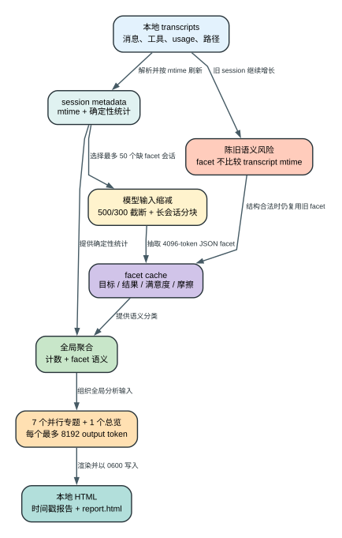

# Claude Code CLI 2.1.235 `/insights` 历史分析管线：它读取什么、调用多少次模型、缓存为什么会过期不彻底？

> `2.1.235 | Static` | 视图：`reverse/javascript/cli.readable.js`

**读者问题：** `/insights` 是把本地统计直接画成 HTML，还是会把历史会话交给模型重新分析；再次运行时为什么更快，又为什么可能继续使用已经过时的目标、满意度和摩擦判断？

**一句话模型：** 客户端先把 transcript 压成可缓存的 session metadata，再对最多 50 个未缓存会话抽取模型 facet，最后用 7 个并行专题分析加 1 个总览请求生成本地 HTML 报告。



图的结论：本地统计和模型语义判断是两层缓存；metadata 会按 transcript mtime 刷新，但 facet 缓存只校验 JSON 结构，存在长期陈旧窗口。

## 60 秒看懂：数据如何变化

贯穿场景：用户连续一个月在多个项目中使用 Claude Code，今天运行 `/insights`，随后继续在旧 session 里工作，几天后再次运行 `/insights`。

| 状态 owner / 对象 | Before | Transformation | After | 用户可见效果 |
| --- | --- | --- | --- | --- |
| Transcript | 多个 JSONL、消息和工具事件 | 统计消息、token、工具、语言、错误、提交与时序 | session metadata JSON | 报告能汇总数量、时长和工作分布 |
| 长会话文本 | 可能超过模型单次输入预算 | 每条 user 截 `500` 字、assistant 截 `300` 字；超过 `30k` 字符则按 `25k` 分块总结 | 较短 session text | 能继续做 facet，但细节会损失 |
| Session facet | 目标、结果、满意度、摩擦尚未判断 | 最多 `4096` output token 的模型 JSON 抽取 | facet cache | 报告得到语义分类而非只有计数 |
| 全局洞察 | 多个 metadata 与 facet | 聚合后并行生成 7 个专题，再生成总览 | insights object | 用户看到项目、风格、优势、摩擦、建议等章节 |
| 报告文件 | 不存在或是旧报告 | 写时间戳 HTML 与稳定别名 `report.html` | mode `0600` 本地文件 | 浏览器打开完整报告，旧时间戳报告仍保留 |

## 完整成功路径

### 1. 扫描 transcript，并先构造确定性 metadata

客户端从会话存储读取 transcript，逐条统计：

- user/assistant 消息数、起止时间与分钟数；
- input/output token；
- tool name 调用次数；
- 文件扩展名映射出的语言；
- git commit/push；
-中断、用户响应时间、工具错误及错误分类；
- Task agent、MCP、WebSearch、WebFetch 使用情况；
- 增删行数、修改文件数、消息小时分布；
- `session_id`、项目路径、首条 prompt 与 transcript mtime。

metadata 不是模型输出。它是本地解析产生的确定性中间层，保存在配置目录的 `usage-data/session-meta/<session>.json`，文件 mode 为十进制 `384`，即八进制 `0600`。

同一 session 出现多个候选时，客户端优先保留 user message 更多的版本；消息数相同再比较 duration。少于 `2` 条 user message 或持续不足 `1` 分钟的 session 不进入后续有效分析集。

证据：`reverse/javascript/cli.readable.js:367764-367901`、`reverse/javascript/cli.readable.js:367903-367915`、`reverse/javascript/cli.readable.js:369019-369068`。

### 2. 冷缓存不是无限重扫，而是两类各最多 200 个

运行时先按 transcript mtime 排序扫描 session：

- metadata 不存在：本次最多处理 `200` 个；
- metadata 存在但 `transcript_mtime < transcript mtime`：本次最多处理 `200` 个；
- 超出上限的 stale metadata 暂时继续复用；
- 每批读取 `10` 个 session，批间让出事件循环；
- 新 metadata 写回后带上当前 transcript mtime。

这个设计控制一次 `/insights` 的磁盘读取和解析延迟，但也意味着历史很多时，一次运行可能没有刷新完所有 stale session。

证据：`reverse/javascript/cli.readable.js:369019-369057`。

### 3. 把 transcript 变成模型可读的 session text

对每个待生成 facet 的会话：

- user 字符串或 text block 每段最多保留 `500` 字符；
- assistant text block 每段最多 `300` 字符；
- tool use 不保留完整输入，只写 `[Tool: name]`；
- 附加 session id 前 8 位、日期、项目路径和时长。

如果拼接文本不超过 `30,000` 字符，直接进入 facet；超过则按 `25,000` 字符切块，对每块调用一次最长 `500` output token 的总结。分块并行执行；API 失败时退回该块原文前 `2,000` 字符。

这不是无损压缩。`500/300` 字符截断和分块总结都会丢细节，因此后续“目标、摩擦、满意度”是基于这个缩减视图的模型判断。

证据：`reverse/javascript/cli.readable.js:367916-367955`。

### 4. 每个新 session 生成结构化 facet

facet 请求要求只返回 JSON，字段包括：

| 字段 | 含义 | 下游用途 |
| --- | --- | --- |
| `underlying_goal` | 用户根本目标 | 会话摘要和全局洞察语境 |
| `goal_categories` | 目标类别及计数 | 工作类型聚合 |
| `outcome` | fully/mostly/partially/not/unclear | 成果达成率 |
| `user_satisfaction_counts` | 满意度信号计数 | 满意度分布 |
| `claude_helpfulness` | unhelpful 到 essential | 帮助程度分布 |
| `session_type` | single/multi/iterative/exploration/quick | 交互形态 |
| `friction_counts` | 摩擦类型计数 | 摩擦聚合 |
| `friction_detail` | 一句具体摩擦 | 全局专题输入，最多取 20 条 |
| `primary_success` | 搜索、编辑、解释、调试等主要成功 | 优势分布 |
| `brief_summary` | 一句话结果 | 全局专题输入，最多取 50 条 |

每个 facet 请求最多 `4096` output token。冷缓存最多选择 `50` 个尚无 facet 的有效 session，并行生成后写入 `usage-data/facets/<session>.json`。

证据：`reverse/javascript/cli.readable.js:368056-368080`、`reverse/javascript/cli.readable.js:369068-369081`。

### 5. 聚合确定性指标，再运行 7+1 个全局分析请求

客户端把 metadata 与 facet 合并成全局数据，包括：日期范围、消息/时长/token、工具、语言、项目路径、提交、错误、满意度、结果、摩擦、响应时间和“30 分钟窗口内多 session 交错”的 multi-clauding 指标。

随后并行执行 7 个专题请求，每个最多 `8192` output token：

1. `project_areas`：4-5 个项目领域；
2. `interaction_style`：交互风格；
3. `what_works`：有效工作流；
4. `friction_analysis`：摩擦类别与例子；
5. `suggestions`：CLAUDE.md、功能和使用模式建议；
6. `on_the_horizon`：未来工作流机会；
7. `fun_ending`：一个定性记忆点。

这 7 个完成后，再运行第 8 个 `at_a_glance` 请求，同样最多 `8192` output token。某个专题失败只让该 section 为空，不阻止其余 section 和 HTML 报告生成。

证据：`reverse/javascript/cli.readable.js:368147-368229`、`reverse/javascript/cli.readable.js:369196-369287`。

### 6. 渲染并持久化两个 HTML 文件

完成后写入：

- `usage-data/report-YYYY-MM-DD-HHMMSS.html`：本次不可覆盖的时间戳报告；
- `usage-data/report.html`：指向最近一次内容的稳定文件名。

两者均以 `0600` 写入。命令返回时间戳文件的 `file://` URL 供本地打开，同时保留结构化 insights、聚合 data 与 facet map 供命令后续组织文本。

证据：`reverse/javascript/cli.readable.js:369090-369098`、`reverse/javascript/cli.readable.js:369289-369292`。

## 最大 output-token 配额怎么算

不计长会话分块总结，冷缓存单次运行的静态最大 output-token 配额为：

```text
50 个新 facet * 4096
+ 7 个专题 * 8192
+ 1 个 at_a_glance * 8192
= 204,800 + 65,536
= 270,336 output tokens
```

如果存在长会话，还要额外加：

```text
500 * 所有待生成 facet 的长会话总分块数
```

这是**客户端设置的最大输出额度之和，不等于实际输出 token，也不等于账单金额**。实际模型通常提前结束；缓存命中、facet 已存在、section 失败或有效 session 不足都会降低调用量。输入 token、provider 计价、prompt cache 与服务端折扣没有在这条静态公式中计算。

## 关键准确性问题：metadata 会刷新，facet 不一定刷新

这是 `2.1.235` 最容易被忽略的缓存不一致：

1. session metadata 包含 `transcript_mtime`；再次运行时会比较 transcript mtime，旧 metadata 可被识别为 stale 并重建。
2. facet cache 的加载函数只解析 JSON 并用 schema 校验；它没有读取或比较 transcript mtime。
3. 只要 `<session>.json` facet 结构仍合法，调用方就直接放入 facet map，不再对该 session 运行模型抽取。

结果：用户继续在一个旧 session 里工作后，消息数、token、时长、工具统计可能已经刷新，但旧 `underlying_goal`、`outcome`、`friction_detail`、满意度和帮助程度仍被长期复用。最终报告可能出现“数量是新的，语义判断是旧的”的混合状态。

这不是推测：facet loader 的校验条件里没有 transcript mtime 字段或比较分支。

证据：`reverse/javascript/cli.readable.js:367957-367987`、`reverse/javascript/cli.readable.js:369019-369027`、`reverse/javascript/cli.readable.js:369068-369081`。

## Gate、默认值与阈值

| 项目 | `2.1.235` 数值/行为 | 影响 |
| --- | --- | --- |
| 有效 session | `user_message_count >= 2` 且 `duration_minutes >= 1` | 过滤过短会话 |
| 新 metadata 上限 | `200/run` | 限制冷启动 I/O |
| stale metadata 上限 | `200/run` | 大历史库可能多次运行才刷完 |
| transcript 批大小 | `10` | 控制并行磁盘读取 |
| user/assistant text | 每段 `500/300` 字符 | 语义输入有损 |
| 长会话阈值 | `30,000` 字符 | 超过才分块 |
| 分块大小 | `25,000` 字符 | 保留块间余量 |
| 分块输出 | `500` token/块 | 总结可能再丢细节 |
| 新 facet 上限 | `50/run` | 限制最贵的 session 级调用 |
| facet 输出 | `4096/session` | 结构化语义分析额度 |
| 全局专题 | `7` 个并行 + `1` 个总览 | 部分失败可降级 |
| 全局输出 | `8192/request` | 单次静态最大 65,536 output token |
| 文件权限 | `0600` | 仅当前用户可读写 |

## 失败与恢复矩阵

| Failure | Detection | Retry/change | State retained | Final user effect |
| --- | --- | --- | --- | --- |
| transcript 文件不可读 | 读取抛错 | 当前 session 视为空日志；其他 session 继续 | 已有 cache 可能保留 | 报告少一部分历史 |
| metadata stale 数量过多 | 超过本轮 `200` 配额 | 下次 `/insights` 再处理 | 超额旧 metadata 继续使用 | 本轮数据可能不完全新鲜 |
| 长块总结 API 失败 | API error/exception | 退回该块前 `2000` 字符 | 其他块总结保留 | facet 仍生成，但信息更少 |
| facet JSON 非法 | 无 JSON 或 schema 不通过 | 本轮返回 null；不写有效 cache | metadata 保留 | 该 session 不参与语义聚合 |
| facet cache JSON 损坏 | loader schema 失败 | 删除损坏 cache，允许重建 | transcript/metadata 保留 | 最多增加一次模型调用延迟 |
| facet cache 语义过期 | 无检测分支 | 不自动恢复 | 旧 facet 长期保留 | 数量更新、语义可能陈旧 |
| 某个全局专题失败 | 请求或 JSON 解析失败 | section 置空，其余并行结果继续 | metadata/facet/其他 section 保留 | HTML 缺少该章节，不阻断报告 |
| HTML 写入失败 | `writeFile` 抛错 | 当前调用失败 | 之前时间戳报告与 caches 保留 | 没有新的可打开报告 |

## Token、延迟、费用、隐私、安全和恢复影响

- **Token/费用：** 最大额度高的原因不是一个超大请求，而是最多 50 个 session facet 与 8 个全局请求叠加。真正账单还取决于输入长度、模型、provider 定价和缓存命中。
- **延迟：** transcript 读取、长会话分块和 facet 都有并行；速度提升以峰值并发和 provider 限流风险为代价。缓存命中时主要剩下 8 个全局请求。
- **质量：** 本地计数比语义 facet 更确定；`outcome`、满意度、摩擦和建议是模型判断，且基于截断文本。报告不应被当作精确绩效审计。
- **隐私：** 截取的历史消息、工具名、项目路径、首条 prompt、session 摘要和聚合数据会发送给当前 inference provider。HTML、metadata 和 facet JSON 留在本地配置目录并使用 `0600`。
- **安全：** 报告生成请求禁用 agents 和 MCP tools；它不会因为历史 transcript 中出现工具语法就直接执行工具。但历史文本仍是模型输入，输出内容需要按模型生成内容对待。
- **恢复：** metadata 可依靠 mtime 局部自愈；损坏 facet 可删除重建；语义陈旧 facet 在此版本没有自动 invalidation，需要清理对应 cache 才会重新抽取。
- **副作用：** 每次成功运行会新增时间戳 HTML，并覆盖稳定别名 `report.html`；metadata/facet cache 也会持续留在本地。报告写入失败不会撤销已更新 cache，清理 cache 则会让下一次运行重新产生模型调用和费用。

## Static 与 Boundary

### `Static` 可确认

- 本地目录、文件 mode、metadata 字段与聚合规则；
- `500/300` 字符截断、`30k/25k/500` 长会话分块策略；
- `200+200` metadata 刷新上限、`50` facet 冷缓存上限；
- 7 个专题加 1 个总览、每个 `8192`；
- facet cache 不比较 transcript mtime；
- 时间戳报告和 `report.html` 的写入位置与权限。

### `Boundary` 仍不能由客户端静态源码证明

- 当前 provider 的实际模型质量、输出 token 与账单；
- provider 对历史消息和项目路径的服务端保留策略；
- 每个 facet 对真实用户意图、满意度和成果的客观准确率；
- 某次运行遇到的真实 session 数、缓存命中率和最终耗时；
- HTML 被用户打开后的浏览器扩展、同步或备份行为。

## 证据索引

| 主题 | 精确源码范围 |
| --- | --- |
| 缓存目录、mode 与 metadata schema | `reverse/javascript/cli.readable.js:367764-367901`、`369193-369195` |
| 文本截断与长会话分块 | `reverse/javascript/cli.readable.js:367916-367955` |
| facet cache 只做结构校验 | `reverse/javascript/cli.readable.js:367957-367987` |
| facet schema 与 `4096` 配额 | `reverse/javascript/cli.readable.js:368056-368080` |
| 聚合指标与 multi-clauding | `reverse/javascript/cli.readable.js:368086-368145` |
| 7 个专题与第 8 个总览 | `reverse/javascript/cli.readable.js:368147-368229`、`369196-369287` |
| metadata mtime 刷新与两类 200 上限 | `reverse/javascript/cli.readable.js:369019-369057` |
| facet 冷缓存 50 与陈旧复用 | `reverse/javascript/cli.readable.js:369068-369081` |
| HTML 写入 | `reverse/javascript/cli.readable.js:369090-369098` |
