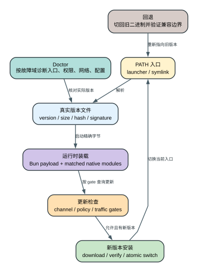

# Claude Code CLI 2.1.235 Native 安装、自更新与 Doctor 生命周期

当前 shell 正在运行 `2.1.235`，Native auto-updater 的 channel 是 `latest`。假定本次 feed 解析出的目标是 `2.1.236`，客户端不会覆盖当前可执行文件，而是按下面的顺序准备下一次启动：

```text
latest feed
  -> 候选版本 2.1.236
  -> 应用 maxVersion / minimumVersion / requiredMaximumVersion / canary 策略
  -> 本次最终 target 仍为 2.1.236
  -> GET 2.1.236/manifest.json
  -> 选择 darwin-arm64 的 URL 与 checksum
  -> 下载到 staging/2.1.236.<pid>.<timestamp>/claude
  -> 边下载边计算 SHA-256；与 manifest 不同就删除并重试
  -> 复制到 $XDG_DATA_HOME/claude/versions/2.1.236.tmp.<pid>.<timestamp>，chmod 0755
  -> rename(...tmp..., $XDG_DATA_HOME/claude/versions/2.1.236) [提交点一]
  -> 检查 ~/.local/bin/claude 是否归 Native installer 管理
  -> 创建临时 symlink，再 rename 到 ~/.local/bin/claude [提交点二]
  -> 写 last-update-result，提示 Restart to update
```

第一个 `rename` 成功后，`versions/2.1.236` 已经是一份完整、可执行且通过 manifest checksum 的版本文件。它只提交了**版本发布**：当前进程仍然运行已经映射的 `2.1.235`，下一次输入 `claude` 也还不一定能到达新文件。

第二个 `rename` 提交的是**启动入口激活**。如果 `~/.local/bin/claude` 原本就是 Native installer 管理的 symlink，临时 symlink 会原子替换旧入口；当前会话依旧是 `2.1.235`，退出后重新启动才会进入 `2.1.236`。

如果这个入口是用户自己的 wrapper，客户端在 ownership 检查时返回 `activationRefused`，不会覆盖它。提交点一不会因此回滚：新版本文件继续留在 versions 目录，顶层结果仍可能是 `success: true`，但 launcher 没有改变，下一次启动哪个版本仍由 wrapper 决定。这就是更新器的真实部分成功，不是“所有步骤要么一起成功、要么一起撤销”。

## 两个提交点分别由谁负责

| 状态对象 | 谁拥有状态 | 更新前 | 成功后 | 关键含义 |
| --- | --- | --- | --- | --- |
| 当前进程映像 | OS + 已启动的 Claude 进程 | `2.1.235` 已映射 | 仍是 `2.1.235` | symlink 改变不会重写进程内存 |
| 版本文件 | Native installer | `versions/2.1.235` | 新增完整的 `versions/2.1.236` | 文件名是版本选择，内容靠 manifest checksum 验证 |
| staging 候选 | 当前 updater attempt | 不存在 | 成功后删除；失败时由后续 sweep 清理 | 与正式版本目录分开，避免半下载文件成为 launcher 目标 |
| launcher | Native installer 或外部 wrapper | 指向旧版本 | 原子指向新版本，或因 ownership 检查拒绝切换 | “下载成功”与“已激活”是两个状态 |
| update result | config/Storage v5 | 上一次结果 | 写入 path、outcome、status、from/to | Doctor 和页脚读取，不等于当前进程已升级 |
| version lock | 从 versions 路径启动的进程 | 尝试保护 `2.1.235` | 成功则在退出时释放，失败为 non-fatal | cleanup 另按当前 `process.execPath` 保护本进程；其它进程只有成功持锁才受保护 |



这里的 transaction 不是一项跨网络 ACID 事务。当前 updater attempt 拥有 manifest、下载预算和唯一 staging；Native installer 拥有正式版本目录；launcher 只有在 ownership 检查通过后才由 installer 更新；OS 与已经启动的 Claude 进程继续拥有旧进程映像。结果记录和 cleanup 又在两个提交点之后独立发生。

这张图的核心不是“下载后覆盖原文件”，而是三次分离：**下载与正式发布分离、正式版本与 launcher 分离、磁盘激活与当前进程分离。**

## 三个入口，做的事并不相同

### `claude install [target] [--force]`

这是切换到 Native 安装方式的入口。`target` 可以是 `stable`、`latest` 或具体版本；未传时读取 `autoUpdatesChannel`，默认 `latest`。成功后它会把 `installMethod` 改为 `native`，设置 `autoUpdatesProtectedForNative`，检查 PATH/launcher，再尝试清理 npm-global、npm-local 和旧 shell alias。清理 npm 安装失败不会把已经发布的 Native 二进制撤回，而是作为 setup note 或 cleanup error 暴露。

若显式传入 `stable` 或 `latest`，命令还会保存新的 `autoUpdatesChannel`。`--force` 的含义是强制重新下载并安装目标，而不是“忽略任意文件系统错误”：它仍受版本字符串校验、下载、checksum、写权限和 launcher ownership 约束。

### `claude update` / `claude upgrade`

这个命令先运行安装诊断，再按**当前实际运行方式**分流：

- Native：进入本文的 Native transaction；
- npm-local / npm-global：走 npm/bun package install，并有另一套 Windows executable 保护与恢复逻辑；
- Homebrew、winget、apk 等 package manager：只检查或给出对应外部升级命令，不越权替它们覆盖文件；
- development：明确退出，不更新开发构建。

配置中的 `installMethod` 与实际运行方式冲突时，手动 update 会提示并把配置修正为当前方式。它不会因为配置声称 `native` 就覆盖一个实际由 Homebrew 启动的二进制。

### TUI Native Auto-update

Native TUI 在进入界面后发起检查，并每 `30 分钟`再次调度；进程内的公共 throttle 又保证两次真实检查至少相隔 `5 分钟`。它受 `DISABLE_UPDATES`、`DISABLE_AUTOUPDATER`、`CLAUDE_CODE_DISABLE_NONESSENTIAL_TRAFFIC` 和兼容配置状态控制。publish 与 activation attempt 返回 `wasUpdated` 后，页脚显示 `Restart to update`；这证明当前进程没有热切换，不证明 launcher 一定已激活新版本。

还有一个容易混淆的同名入口：隐藏的会话内 `/update`（别名 `/restart`）负责保存 transcript 并重启/续接会话，它不负责下载二进制。CLI `claude update` 是安装更新；会话 `/update` 是在已经可用的新 launcher 上重启会话。

## 完整生命周期：一次 Native update 的 10 个阶段

### 1. 识别 installationType，不信任单个配置字段

`rSt()`同时观察 Bun standalone、`process.execPath`、npm module 路径以及 Homebrew、winget、mise、asdf、pacman、apk、deb、rpm 的 ownership 结果，返回 `native`、`npm-local`、`npm-global`、`package-manager`、`development` 或 `unknown`。手动 update 先用这一结果选 owner；Native auto-updater 只在已经确认的 Native 路径运行。

### 2. 把 channel 或具体版本解析成 target

具体版本接受 `vX.Y.Z` 或 `X.Y.Z[-suffix]`，会去掉前导 `v`；`99.99.*` 测试版本在正式构建中拒绝。channel 只接受 `stable` 和 `latest`，源码虽然识别字符串 `rc`，随后会明确拒绝它。channel 通过 `https://downloads.claude.ai/claude-code-releases/<channel>` 解析成具体版本。

### 3. 应用 maxVersion、minimumVersion、canary 与强制降级

目标不是简单取“最大 semver”。客户端会读取远端 `tengu_max_version_config` 的 `maxVersion`/force-downgrade、配置 `minimumVersion`、managed `requiredMaximumVersion` 和 canary。普通 channel update 会被上限截断，也可能因 minimum/required maximum 不满足而跳过；server policy 打开 force downgrade 时，当前版本高于目标也会降级。`--force` 绕过普通 skip/cap 分支，重装解析后的 target（可以是显式版本，也可以是未传 target 时的默认 channel），但不会绕过版本格式和文件安全检查。

### 4. 建立 staging、versions、locks 与 launcher 路径

路径 owner 是 `_rt()`：

```text
$XDG_CACHE_HOME/claude/staging/       下载候选；默认 ~/.cache/claude/staging/
$XDG_DATA_HOME/claude/versions/       正式版本文件；默认 ~/.local/share/claude/versions/
$XDG_STATE_HOME/claude/locks/         运行版本锁；默认 ~/.local/state/claude/locks/
~/.local/bin/claude                   下一次启动的 launcher
```

版本名只允许字母、数字、点、下划线、加号和连字符，拒绝 `..` 与单独的 `.`，因此版本参数不能逃出 versions 目录。本版使用 lockless install 分支：staging 目录带 `<version>.<pid>.<timestamp>`，同一进程内的并发 `installLatest` 会合并到一份 Promise，不共享半成品目录；跨进程没有 updater serialization，最后一次成功的 target/launcher rename 生效。

`$hl()`还会用 `flag: "wx"`预先创建 `versions/<version>` 的 `0` 字节占位文件；它只保留名字，不会通过“regular + non-empty + executable”检查。manifest 在此后失败时，占位可能暂时残留，但 launcher 不会指向它；后续成功 publish 的 rename 会替换它，cleanup 也把这类文件纳入版本候选处理。不能把“正式路径存在”当成“版本已安装”。

### 5. 先取 manifest.json，再选择当前平台条目

客户端请求 `<base>/<version>/manifest.json`，再按 `darwin-arm64`、`linux-arm64-musl` 等 `kNe()` 平台键选择条目。平台不存在时，错误会列出该 release 实际包含的平台；不会退回下载另一个架构。manifest fetch 最多 `3 次`，只对连接中断类错误重试，间隔 `1 秒`。

### 6. 流式下载 binary，并在 staging 内完成 SHA-256

二进制 URL 是 `<base>/<version>/<platform>/claude`。下载流每个 chunk 同时写 staging 文件并更新 SHA-256；digest 必须等于 manifest 的 `checksum`，否则删除部分文件并重试。单次 attempt 有 `120 秒`无数据 stall timeout 和 `10 分钟`总 deadline；checksum mismatch、stall 或 premature close 最多形成 `3 次` attempt，重试间隔 `1 秒`。通过后才把候选 chmod 为 `0755`。

### 7. 用同目录临时文件 rename 发布正式版本

候选不会直接覆盖 `versions/<version>`。`ZRm()`先把 staging binary 复制为 versions 目录旁的 `<target>.tmp.<pid>.<timestamp>.<attempt>`，chmod `0755`，再 `rename(temp, target)`。因为 temp 与 target 同目录，POSIX rename 提供同文件系统的原子名字切换；失败会删除 temp。本版在 `EBUSY` 时按 `100ms -> 500ms -> 2000ms`退避，连同第一次共最多 `4 次` publish attempt。

发布成功后 staging 目录才被删除。到这里能证明的是**完整候选已成为版本文件**，还不能证明 launcher 已切换，更不能证明当前进程在运行它。

这里的“原子”只指 directory entry 从 temp 名称切成 target 名称。`ZRm()`没有对 temp 文件或父目录调用 `fsync`；静态代码因此不能把 namespace atomicity 外推为突然掉电后的持久落盘保证。

### 8. 检查 launcher ownership，再原子切换 symlink

POSIX launcher 不存在时直接创建 symlink；已存在时，只有两类对象允许覆盖：

1. symlink 最终落在 `claude/versions/` 中，说明由 Native installer 管理；
2. realpath 指向 `.js` 或 `node_modules`，说明是可迁移的 npm shim。

其它 executable 或 wrapper 返回 `refused`。允许切换时，客户端先创建 `<launcher>.tmp.<pid>.<timestamp>` symlink，再 `rename` 到正式 launcher，读者不会观察到一个先 unlink 后空窗的路径。Windows 不用 symlink：它把旧 exe rename 到 `.old.<timestamp>`，复制新文件；复制失败时再 rename 回旧 exe。

### 9. 记录 last-update-result，并提示重启后重新判定入口

Native auto-update 只有 `wasUpdated=true` 才写 success result：`timestamp`、`path=native`、`outcome`、`status`、`version_from`、`version_to`、`error_code`。普通文件后端用 atomic write，Storage v5 写 `last-update-result` namespace。TUI 把结果投影为 `Update installed · Restart to update`；手动命令退出后，下一次 shell 会重新解析 launcher。但 `activationRefused/Failed` 也可能随顶层 success 产生同一 result/notice，所以 notice 不是 launcher 已切换的证明。

如果检测到后台 daemon 仍在跑不同版本，手动 update 只打印“daemon 将在新版本上重启，后台 job 不受影响”的提示；这里的检查本身只是比较 daemon lock 中的 version，并不是当前函数亲自替换 daemon 进程。

### 10. 独立调度 cleanup；它不是 update commit barrier

从 versions 目录启动的进程会尝试为真实路径取得 lifetime version lock；失败只记 non-fatal。cleanup 无条件保护当前 `process.execPath`；launcher target 只有解析为 non-empty executable 时才加入保护集，其它版本也只有成功持锁才受保护。其余候选文件按 mtime 排序，额外保留最新 `2 个`，再尝试在短期 cleanup lock 下删除更老候选；候选集合会包含 `0` 字节 placeholder，因此“保留 2 个”不等于保留两个可运行 binary。

cleanup 还会删除超过 `1 小时`的 staging 目录和匹配 orphan `.tmp` install 文件，并清理 stale PID lock；`1 小时`规则不覆盖普通 `0` 字节 placeholder。`GRm()`调用 `nJr()`后直接返回，不等待 sweep，startup housekeeping 也会另行调度，所以 result/restart notice 与 cleanup 可以并行。若 launcher 是外部 wrapper，版本删除整体跳过，因为客户端无法知道 wrapper 下一次需要哪个版本。

## Gate、优先级与精确阈值

| Gate / 阈值 | 实际作用 | 不应误读为 |
| --- | --- | --- |
| `DISABLE_AUTOUPDATER` | 停止后台 check/install | 禁止手动 `claude update` 或 `install` |
| `DISABLE_UPDATES` | 手动 install/update 与后台 updater 都停止；命令输出 policy 文案并 exit 0 | “已经更新成功” |
| `CLAUDE_CODE_DISABLE_NONESSENTIAL_TRAFFIC` | 通过 `X7e()`关闭后台 updater | 禁止模型推理或所有网络 |
| `autoUpdatesChannel` | `latest` 默认；可持久化 `stable` | 当前已运行版本 |
| `minimumVersion` | 候选低于本地 minimum 时跳过 | 强制客户端升级到某个更高版本 |
| `requiredMaximumVersion` | managed policy 限制候选不能高于上限 | manifest checksum 或签名策略 |
| remote `maxVersion` | channel 目标上限；force-downgrade 可把高版本拉回 | 可由客户端独立证明的服务端发布规则 |
| `--force` | 重装解析后的 target（显式版本或默认 channel）并跳过普通 same-version/cap skip | 覆盖外部 launcher、忽略 checksum |
| check throttle | 同进程 `5 分钟`内不重复真实 check | auto-updater 只每 5 分钟运行 |
| scheduler | TUI 每 `30 分钟`调度检查 | 每次调度都会联网 |
| version feed | 最多 `3 次`，每次 `30 秒` timeout，指数+jitter退避 | binary stream 的重试预算 |
| binary stream | `120 秒` stall、`10 分钟` deadline、最多 `3 个 attempt` | 整个 install transaction 的统一 timeout |
| atomic publish | EBUSY 后 `100/500/2000ms`，最多 `4 次` | 任意错误都重试 |
| cleanup retention | 保护本进程/launcher/成功持锁对象，再额外留最新 `2 个候选文件` | 两个候选都保证可执行，或 versions 总数永远为 2 |

旧配置 `autoUpdates: false` 会迁移到 user settings 的 `env.DISABLE_AUTOUPDATER=1`；写成功后清理旧字段，写失败则记录 migration failure，不假装迁移完成。Native install 又会写 `autoUpdatesProtectedForNative=true`，避免旧 `autoUpdates:false` 在安装方式切换后意外关闭 Native updater。

## 失败、部分成功与恢复

### 下载失败不会激活未校验 bytes，但会留下占位

`$hl()`在 manifest fetch 之前已经尝试创建 versions 目录中的 `0` 字节 placeholder；因此 manifest/platform 失败不是“只发生在 staging”，也不保证正式目录零变化。实际 binary 的 partial bytes 写在 staging；checksum mismatch、stall、deadline 或连接中断会删除 partial 并按各自预算重试，不会成为 executable 或 launcher target。`1 小时` sweep 只回收 staging 与匹配 orphan temp，不保证立刻删除 placeholder；后续成功 publish 可通过 rename 替换它。

### publish 失败会清理临时文件，但不会撤销旧版本

同目录 temp copy/chmod/rename 任一步失败都会尝试删除 temp。旧 launcher 仍指向旧版本，所以旧启动路径保持可用。代码没有把远端 version feed、manifest 和 binary 当成一个跨网络 ACID 事务；它用本地发布边界保证失败候选不成为正式入口。

### activationFailed 与 activationRefused 是真正的部分成功

`WRm()`把版本文件发布和 launcher 激活分开返回：`activationFailed` 表示创建/替换 launcher 失败，`activationRefused` 表示现有 launcher 不归 Native installer 或 npm 管理。若旧 launcher 本身仍是可执行文件，顶层 `emT()`会保留新版本文件、记录 secondary update outcome，并仍返回 `success: true`。所以日志里的 `Successfully updated to version X` 不能单独证明 PATH 入口已经指向 X。

只有 launcher 无法更新且现有入口也不是有效 executable 时，transaction 才抛出 `update_apply_native_symlink_failed`。Doctor 会把外部 launcher 解释为“新版本仍安装到 versions 目录，由你的 launcher 决定运行什么，并禁用自动版本清理”，而不是偷偷覆盖用户 wrapper。

### 当前进程和旧版本文件不需要“回滚”

POSIX Native 更新没有原地改写当前 `process.execPath`；它新增版本文件再切 launcher。当前进程继续跑旧 inode，cleanup 又显式保护当前 `process.execPath`；lifetime lock 只在获取成功时额外保护跨进程使用。因此失败后的主要恢复动作是：修复 launcher 权限/ownership 后重跑 update，或让 launcher 明确指向已存在的版本文件。

这和 npm/Windows 分支不同：Windows global npm 更新可能先把正在运行的 exe rename 成 `.old.<timestamp>`，失败时按 rename、copy、retired-directory copy 多级恢复；Native Windows launcher 激活也会在 copy 新 exe 失败时 rename 回旧 exe。不能把那套恢复文案套到 POSIX Native symlink transaction。

### cleanup 不承诺程序化降级数据

版本目录保留旧 binary 只是提供安装级选择。切回旧版本不会反向迁移 settings、transcript、Storage v5 或新版本写过的字段，也不会撤销已完成的远端副作用。`claude install <old-version> --force` 能重新发布旧 binary/launcher，不等于数据 schema rollback。

## Doctor 到底诊断什么

根命令 `claude doctor` 是诊断入口，不启动 Agent session；Doctor handler 本身不执行 repair，但完整 CLI 命令先经过共享 preAction，可能运行并持久化 settings migrations 和 `migrationVersion`。handler 内的 macOS Keychain 可写性 probe 还会执行 `add-generic-password`，成功后发起未等待结果的 `delete-generic-password`。所以端到端 `claude doctor` 不是 filesystem/settings 只读，也不能保证零持久副作用。`2.1.235` 的 handler 实际输出：

- installation type、版本、commit、平台、resolved path 与 invoked binary；
- config install method、auto-update gate/channel、last update attempt；
- bundled/system ripgrep 状态；
- 多重 npm/local/native 安装和 leftover package；
- Native launcher 是否由 installer 管理、是否在 PATH、是否可执行；
- settings parse/status notice、关键 output-limit 环境变量；
- macOS Keychain 可写 probe；
- sandbox dependency/policy warning 与 Remote Control 可用性摘要。

它不会在这个根命令里完成 MCP server 连接、Provider 凭据正向请求或 IDE extension 端到端测试。输出末尾明确把可修复的完整 checkup 引导到会话内 `/doctor`；两者不是同一个执行深度。

现有 exact-binary Probe 在隔离 HOME 中让 settings JSON 损坏，同时关闭 auto updater 和非必要流量。literal output 仍识别 native `2.1.235`、commit `ba01fa45e3d1`、`darwin-arm64`、bundled search、auto-update gate、invalid settings 与 Remote Control 原因。另一个命令 `DISABLE_UPDATES=1 claude update` 输出 `Updates are disabled by your administrator. Contact your IT team to get the latest version.` 且 exit 0；exit 0 表示 policy 分支被正常处理，不表示执行过下载。

## 用户影响：速度、成本、隐私与副作用

| 维度 | 2.1.235 的实际影响 |
| --- | --- |
| 可用性 | 当前进程与新版本文件分离，下载/激活失败通常不打断正在进行的会话；固定 launcher 路径检测为外部对象时默认拒绝覆盖 |
| 延迟 | 正常无更新只有 feed/check 成本；大 binary 遇到 checksum/stall 最多重下 3 次，最坏延迟受 10 分钟 attempt deadline 约束 |
| 带宽与成本 | retry 会重复下载完整 binary；不调用 Messages 模型，不消耗模型 token，也没有推理费用，但会产生网络和磁盘 I/O 成本 |
| 隐私 | version/channel/platform、更新结果遥测可能进入一方观测管线；binary 下载不需要把项目文件、prompt 或 transcript 发给 release host |
| 安全 | manifest SHA-256 防止传输后字节与 manifest 不一致；launcher ownership 默认拒绝覆盖检测到的外部 launcher，但 check 与 rename 不是绑定同一 inode 的强 TOCTOU 保证 |
| 副作用 | 成功 publish 后 versions 目录新增 executable；install 入口还可能删除 npm/local 安装与 shell alias。这些不会因当前会话继续跑旧字节而自动撤销 |
| 恢复 | 本进程始终保护；有效 executable launcher target 与成功持锁对象才额外保护；另留两个新近候选文件（可能含 placeholder），没有数据自动降级 |

最重要的用户判断是：**“update 下载成功”“launcher 激活成功”“当前进程已切换”“持久数据可向后兼容”是四个不同结论。** `--version` 只回答当前进程的 build constant；要验证下一次启动，还要解析 launcher 的实际目标并对版本文件做 hash。

## 微小但关键的 2.1.235 特性

- Native install 使用 lockless 唯一 staging + atomic rename；声明中的 `ENABLE_LOCKLESS_UPDATES` 名称不是这里的运行时 owner，目标版可达代码已经内联为 `Nn("true")`。
- PID-based version lock 同样是目标版内联分支；进程会尝试获取，失败 non-fatal。它只保护 cleanup，不负责把多个 updater 排成全局队列。
- 同一进程内重复 `installLatest` 会 join in-flight Promise；跨进程没有确定顺序，依赖唯一 staging 和原子 target/launcher rename，最后一次成功 rename 生效。
- 已安装版本只用 regular/non-empty/executable bit 判断可运行，不重新计算它与 manifest 的 checksum。
- POSIX launcher owner 判断看 symlink 是否进入 `claude/versions/`；npm shim 通过 realpath 的 `.js`/`node_modules` 特征迁移。
- Native activation refused 可以与顶层 success 同时出现；必须读 secondary outcome 或检查 symlink，不能只搜 `Successfully updated`。
- cleanup 遇到外部 launcher 会保留所有版本，因为它无法推断 wrapper 的 target。
- versions cleanup 的“留 2 个”是在保护集之外再留两个候选文件，候选可能是 `0` 字节 placeholder，既不是总数上限，也不是两个可运行回退版本的保证。
- 当前 `claude update` 完成后不会把调用它的进程变成新版本；会话内 `/update` 才负责 transcript-aware relaunch，而且它不下载 binary。
- `claude install` 的 npm/alias cleanup 发生在 Native publish 之后，cleanup error 可能留下多个可执行入口，需要 Doctor/`which -a claude`判断实际 owner。

## 证据与边界

以下结论是 `2.1.235` 发布物中的 **Static** 可达代码，而不是从通用 updater 常识推断：

- 安装类型检测与 package-manager ownership：[readable JS 412050-412181](../reverse/javascript/cli.readable.js#L412050)
- Native 路径布局、版本名校验与可执行判断：[readable JS 412738-412763](../reverse/javascript/cli.readable.js#L412738)
- channel/version feed、合法 channel 与具体版本处理：[readable JS 412419-412445](../reverse/javascript/cli.readable.js#L412419)
- 下载 stall/deadline/retry 与 SHA-256 比对：[readable JS 412446-412541](../reverse/javascript/cli.readable.js#L412446)
- PID version lock 与 stale lock 处理：[readable JS 412596-412709](../reverse/javascript/cli.readable.js#L412596)
- 同目录 temp copy/chmod/rename 与 publish retry：[readable JS 412738-412861](../reverse/javascript/cli.readable.js#L412738)
- Native target policy、lockless 分支与 partial activation flags：[readable JS 412863-412929](../reverse/javascript/cli.readable.js#L412863)
- POSIX ownership、临时 symlink 与 atomic rename：[readable JS 412939-413001](../reverse/javascript/cli.readable.js#L412939)
- 运行版本 lifetime lock、staging/temp/version cleanup：[readable JS 413084-413249](../reverse/javascript/cli.readable.js#L413084)
- Doctor 聚合字段、Keychain add/delete probe 与安装 warning：[readable JS 412317-412382](../reverse/javascript/cli.readable.js#L412317)
- install 命令的 channel 保存、PATH 检查和 npm/alias cleanup：[readable JS 442015-442071](../reverse/javascript/cli.readable.js#L442015)
- 根诊断 handler 与会话内可修复 checkup 分界：[readable JS 442117-442163](../reverse/javascript/cli.readable.js#L442117)
- Native auto-updater 的 gate、30 分钟调度、结果与 restart notice：[readable JS 515130-515176](../reverse/javascript/cli.readable.js#L515130)
- 手动 `claude update` 的 installation-type 分流与 native failure surface：[readable JS 629051-629191](../reverse/javascript/cli.readable.js#L629051)
- 所有根命令共用的 preAction 与 settings migration 调用：[readable JS 603704-603717](../reverse/javascript/cli.readable.js#L603704)
- auto-update settings 与 migrationVersion 持久化：[readable JS 595195-595421](../reverse/javascript/cli.readable.js#L595195)
- update result 持久化 schema：[readable JS 411968-412017](../reverse/javascript/cli.readable.js#L411968)

**Probe** 只覆盖离线安全分支：精确二进制 identity、`claude doctor` 字段与 `DISABLE_UPDATES` literal output/exit status，见 [运行证据指南](runtime-probe-index.md)。本仓库没有让真实安装器在线覆盖用户当前版本；transaction 的下载、checksum、publish、symlink 和 cleanup 结论来自目标 bundle 的完整静态调用链。

**Boundary** 必须收窄到发布物真正没有携带的事实：客户端从 HTTPS release host 取 manifest 并校验其中的 SHA-256，但这段 updater 代码没有在线验证 manifest 的独立 GPG/Ed25519 签名，没有在激活前执行 `codesign`/Gatekeeper probe，也没有重新启动候选做 `--version` smoke test；publish 路径也没有 `fsync`。正常 caller 没有在 updater 函数里显式传入业务 headers，但请求会委托共享 HTTP client，因此未继续追完的默认 headers、proxy 和 TLS agent 也不能从“caller 没传”外推成 wire 上绝对不存在。因此，代码能证明“binary 与收到的 manifest checksum 一致”和“名称切换原子”，不能单独证明 manifest 的发布者真实性、掉电耐久性、release backend 的 channel 生成规则、CDN/证书基础设施、服务端 force-downgrade 决策或下载后 OS 首次执行一定成功。

归档层仍应独立记录发布物 SHA-256、Mach-O architecture 和 code signature；那是在保存目标版本时验证二进制身份，不应倒写成 updater 本身已经执行了同样的签名检查。当前官网文档或安装脚本晚于 `2.1.235` 的延时、host 和校验流程也只能用于提出核查问题，不能倒灌成这个目标版本事实。安装级回退只切换 binary/launcher，settings、transcript、Storage v5 和已发生远端副作用没有程序化 rollback。
