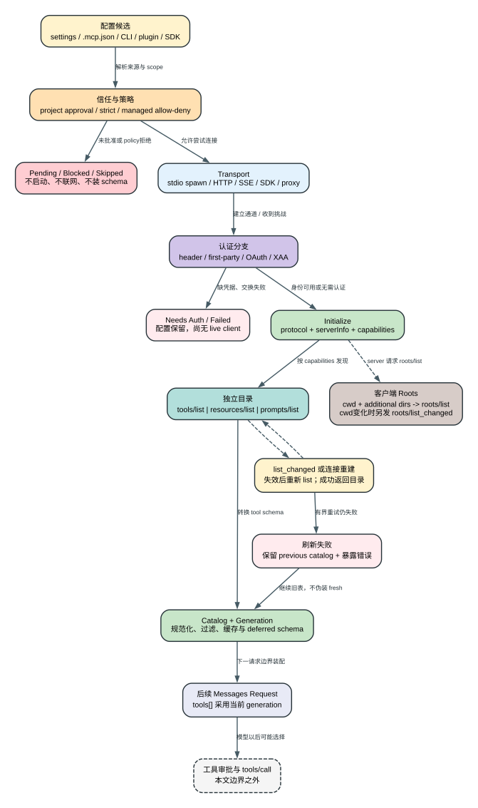

# Claude Code CLI 2.1.235 MCP Runtime：一份配置怎样变成后续请求里的工具 Schema

先看 `2.1.235` 精确二进制实际走过的一条 stdio 链。隔离 Probe 给 Claude Code 一份只有一个 server 的配置：

```json
{
  "mcpServers": {
    "probe": {
      "type": "stdio",
      "command": "$NODE",
      "args": ["$MCP_SERVER"],
      "env": { "MCP_PROBE_LOG": "$MCP_LOG" },
      "alwaysLoad": true
    }
  }
}
```

用户请求不是泛泛的“测试 MCP”，而是固定 marker：

```text
$CLAUDE_TARGET --print MCP_REFRESH_PROMPT_MARKER \
  --output-format stream-json --verbose \
  --model claude-sonnet-4-5 \
  --mcp-config $MCP_CONFIG --strict-mcp-config \
  --permission-mode bypassPermissions \
  --dangerously-skip-permissions \
  --session-id $SESSION_ID
```

`--strict-mcp-config` 在这里很关键：它让本次进程只使用 `--mcp-config` 给出的 server，避免用户目录、项目 `.mcp.json` 或 plugin server 污染观察。Probe server 从 stdin 读取一行一个 JSON-RPC message，从 stdout 回协议消息；日志单独写文件，不混入 stdout。

第一次连接时，Claude Code 发送 `initialize`。server 返回它接受的 protocol version、名称、版本和 `tools.listChanged:true`：

```text
client -> server: initialize
server -> client:
  protocolVersion: <客户端请求的版本>
  capabilities.tools.listChanged: true
  serverInfo.name: claude-version-probe

client -> server: tools/list
server -> client:
  tools: [probe_echo]
```

客户端把 `probe_echo` 包装为 `mcp__$SERVER__probe_echo`，再装入第一份 Messages 请求。受控模型选择它后，调用与结果按 ID 闭合：

```text
Messages #1 tools:
  ...
  mcp__$SERVER__probe_echo

assistant tool_use:
  id: toolu_mcp_refresh_probe
  name: mcp__$SERVER__probe_echo
  input: {value: "probe"}

client -> server: tools/call(probe_echo, {value:"probe"})
server -> client: notifications/tools/list_changed
server -> client: MCP_TOOL_RESULT_MARKER
```

收到第一次调用后，server 把内部 `refreshed` 改为 true，并在通知后让第二次 `tools/list` 返回两个定义：`probe_echo` 和新增的 `probe_new`。但请求时序没有立即跳到新目录：

```text
重新 tools/list: [probe_echo, probe_new]

Messages #2 tools:
  mcp__$SERVER__probe_echo          # 仍没有 probe_new
Messages #2 messages:
  tool_result(toolu_mcp_refresh_probe) = MCP_TOOL_RESULT_MARKER

Messages #3 tools:
  mcp__$SERVER__probe_echo
  mcp__$SERVER__probe_new           # 到第三个请求才出现
Messages #3 messages:
  tool_result(toolu_mcp_refresh_probe_2) = MCP_TOOL_RESULT_MARKER
```

最终 stdout result 为 `MCP_REFRESH_OK`，`subtype=success`，exit status 为 `0`。报告同时记录 `3` 次 Messages 请求、`2` 次 `tools/list` 和 `2` 次 `tools/call`。这条 Probe 证明的不是“通知一到，模型立刻拥有新工具”，而是：**通知使客户端目录失效并触发刷新；只有后续请求装配采用新 generation 时，模型才看到新增 schema。**

完整命令、输入、literal output、exit status 和 checks 在 [mcp-refresh.json](runtime-probes/mcp-refresh.json)，fixture 在 [probe_mcp_refresh.mjs](../skill/claude-code-version-diff/scripts/probe_mcp_refresh.mjs)。下面把这条可达路径扩展成 MCP runtime 的完整客户端模型；本文止于 schema 进入 Messages request，不进入工具审批和执行。



## 六份状态，不能只看 Connected

从配置到请求至少有六份彼此独立的状态：

| 状态 | Owner | 成功标志 | 仍不能证明 |
| --- | --- | --- | --- |
| 配置声明 | settings/CLI/plugin/SDK | server spec 解析成功 | 允许启动或联网 |
| 信任与 policy | workspace、用户、managed policy | spec 未被 pending/deny/strict gate 排除 | transport 已建立 |
| 连接与认证 | MCP client + transport + credential store | `connected` client | `tools/list` 已成功 |
| 协议能力 | initialize response | protocol、capabilities、serverInfo 已保存 | server 实现与声明一致 |
| 发现目录 | 每个 client 的 tools/resources/prompts cache | list 完成并形成 generation | 已发出的请求会热更新 |
| 请求工具表 | Agent Loop request assembly | 具体 Messages body 的 `tools[]` 出现 schema | 模型一定调用、权限一定放行、远端动作一定成功 |

最常见的错误诊断，是从 `/mcp` 显示 `connected` 直接跳到“模型现在有工具”。Probe 已经给出反例：新目录已经拉到客户端，紧接着的第二个请求仍可携带旧工具表。

## 配置先决定“可以尝试什么”

MCP server 可以来自 user、project、local settings，项目 `.mcp.json`，命令行 `--mcp-config`，plugin `.mcp.json`，SDK/in-process host，以及 managed/claude.ai connector 路径。合并配置并不等于全部启用：来源决定后续还要经过哪一层信任。

### 项目配置需要先批准

仓库提交的 `.mcp.json` 能指定本地命令、URL、headers 和环境变量。连接 stdio 会执行命令，连接 HTTP/SSE 会向 URL 发请求，所以 Claude Code 不把“配置文件能解析”当作授权。新的 project server 会进入 pending approval；用户可只允许该 server、允许本项目未来所有 server，或继续但不连接。`claude mcp list/get` 也明确把未批准项显示为 `Pending approval`，而不是对它做健康检查。

`enableAllProjectMcpServers` 是信任快捷开关，不是 managed policy 的替代品。项目 settings 有校验错误时，approval 写入可能被跳过或要求先用 doctor 修复，避免一次修复动作覆盖带 warning 的配置。

### Strict 和 managed policy解决不同问题

`--strict-mcp-config` 的 CLI 合同是“只使用 `--mcp-config` 的 servers，忽略其它 MCP 配置”。它适合 SDK、Probe 和隔离运行，但 enterprise MCP config 存在时不能同时使用；企业路径不允许进程用动态 config 绕开集中控制。

Managed `deniedMcpServers` 先于 allow，能按 server name、展开后的 command 或 URL 匹配。`allowedMcpServers` 未声明表示没有额外 allowlist；显式空数组表示全部拒绝。command/URL 中变量展开缺失或不安全时不会被包装成可靠匹配。即使用户批准了 project server，managed deny 仍然可以阻止它。

因此 config 的输出不是一张“已连接表”，而是三类候选：可连接、等待用户批准、被 strict/managed/source gate 排除。

## Transport 是不同的执行边界

`2.1.235` 的 MCP client 不只有一种网络形态：

| Transport | 建立方式 | 主要边界 |
| --- | --- | --- |
| `stdio` | spawn `command + args`，stdin/stdout 传 JSON-RPC | 本机新进程、环境变量、cwd、stdout 协议纯度 |
| `http` | Streamable HTTP，请求/响应或流 | URL、redirect、proxy/TLS、session header、OAuth |
| `sse` | legacy SSE stream + POST endpoint | 长连接断开、重开和 endpoint 生命周期 |
| `sdk` / in-process | host 提供 MCP instance | host 自己拥有进程、网络与 credential |
| `claudeai-proxy` | claude.ai connector/proxy transport | first-party login、connector entitlement、远端 session |

stdio 启动时 `shell:false`，客户端只继承一组受控基础环境，再叠加 server config 的 `env`。server 必须把 JSON-RPC 写 stdout，把普通日志写 stderr。客户端给无换行协议数据设置 `16,777,216 bytes` 上限；超过后会断开，错误明确指出 server 很可能把日志或非协议数据写进了 stdout。关闭时先结束 stdin并等待，之后依次尝试 `SIGTERM` 和 `SIGKILL`，不会把一个失联子进程永久留给连接对象。

远端 HTTP/SSE 不启动本机 command，但会把 URL、headers、token 和 request metadata送到外部服务。HTTP body 同样有 `16 MiB` 级无事件边界保护，防止 captive portal 或非协议响应无限增长。

连接调度也有界：默认 connect timeout 为 `5,000 ms`，普通 MCP request/list timeout 为 `30,000 ms`；本地 server 默认每批连接 `3` 个，remote server 默认 `20` 个。这些值可由对应环境变量覆盖，但正值会被限制到 JavaScript timer 范围。批量连接不是原子事务：一个 client失败不应把已经连接的其它 client伪装成失败。

## Auth 发生在 initialize 之前

stdio 通常靠进程环境或 server 自己的凭据，不走 HTTP OAuth。HTTP/SSE/claude.ai 路径则可能在 transport 建立阶段遇到 401/403，并分成四类，不能统一写成“请登录”：

1. **用户显式 `Authorization` header**：server 拒绝后标为 `AUTH_HEADER_REJECTED`。显式 header 存在时 OAuth fallback 被关闭，避免悄悄把另一套身份送往同一 endpoint。
2. **CLI/session-owned bearer**：拒绝后等待 session credential刷新，不把它误当第三方 consent flow。
3. **first-party claude.ai token**：可进行一次 token refresh/retry；仍失败时要求 `/login` 或对应 first-party登录入口。
4. **普通 MCP OAuth 或 XAA**：client进入 `needs-auth`，配置保留，但没有可用 connection和工具目录。

### 标准 OAuth

`claude mcp login <name>` 只面向 HTTP、SSE 或 claude.ai connector。标准流程会读取 protected-resource/auth-server metadata，建立 state和 code verifier，在 `127.0.0.1` callback listener 接收 authorization code，随后交换并保存 access/refresh token。callback默认有 `300,000 ms`超时；固定 callback port和预配置 client ID/secret可由 server config提供，SSH/headless 可用 `--no-browser` 手工回填 redirect URL。

Credential store 读取失败与“没有 token”是两种状态，前者不能降级成未登录。已有 token在到期前 `300 s`进入主动 refresh；并发 caller复用同一个 refresh promise。token保存失败会留下明确诊断，不能因为当前内存 token可用就声称凭据已经耐久落盘。

### XAA 不是 OAuth 后的附加步骤

XAA 是另一条认证选择。它要求 `CLAUDE_CODE_ENABLE_XAA=1`、server config中的 `oauth.xaa`、预先配置的 IdP connection，以及 MCP authorization server的 client ID/secret。缺一项就明确失败，不会静默切到标准 consent flow。

其客户端链路是：发现 protected resource metadata，校验 resource与目标 endpoint一致；发现 authorization server metadata，校验 issuer一致并拒绝非 HTTPS token endpoint；从 IdP取得 OIDC ID token；用 JWT bearer得到 ID-JAG，再向 MCP authorization server交换 access token。access token缺失、`issued_token_type`异常、metadata非 JSON、issuer/resource不一致都分别报错。没有 cached ID token时，silent exchange只会返回“需要交互认证”，不会伪造 refresh成功。

这些代码能证明客户端检查、缓存和错误分类，不能证明企业 IdP、authorization server或第三方 MCP当前接受这套交换。

## Connect 与 Initialize 只建立协议关系

trust和 auth通过后，client才建立 transport并发送 `initialize`。响应至少决定：

- 双方采用的 protocol version；
- `serverInfo.name/version`；
- server instructions；
- tools、resources、prompts、logging、elicitation等 capabilities；
- tools/resources/prompts 是否声明 `listChanged`。

本版同时保留 legacy handshake和条件 protocol negotiation。auto probe有独立短预算，denylist或不支持的 transport回退 legacy；version negotiation失败不会被写成普通空工具表。server instructions在进入客户端上下文前最多保留 `2,048`字符，避免一个 server用超长初始化说明占满 prompt。

此时 `connected` 只说明 transport和 initialize完成。若 capabilities声称有 tools，客户端仍要执行 `tools/list`；server若只声明 resources或prompts，不能据此制造一个模型工具。

## 三套目录和一套 Roots

### Tools：从远端对象变成 Claude tool

`tools/list` 支持 cursor分页。单次 list使用默认 `30 s` request预算；可重试错误按 `250/500/1,000 ms`间隔最多再试三次，分页最多 `20`页。4xx、invalid params、method not found、明确 request timeout和分页超限不会套用同一重试。

每个返回项还要经过本地转换：

1. 读取 name、description、inputSchema、annotations和 `_meta`；
2. 检查顶层 schema combinator及API不接受的property key；
3. gate允许时规范化；否则只丢弃坏工具，保留同 server的其它工具；
4. 生成 `mcp__<server>__<tool>`规范名和 `mcpInfo`；
5. description/prompt超过 `2,048`字符时截断；
6. 绑定 readOnly/destructive/openWorld、alwaysLoad、result-size和permission metadata；
7. 写入当前 client catalog/generation。

invalid tool schema若未被过滤，可能让整个 Messages请求被API拒绝，所以“server返回了定义”仍不是最终成功。转换完成后，Tool Search还可以让非 `alwaysLoad`工具保持 deferred：工具可发现，不代表完整 schema常驻当前 request。

### Resources 和 Prompts不是 Tools的别名

`resources/list`、resource templates与`prompts/list`有独立 cache、失败和 `list_changed`通知。一个 server没有 resources，仍可能有 tools；反之，resource存在也不会自动变成 `tools[]`项。Resource读取还能返回远端文本或 binary blob，binary可写入本地随机文件，但那已经是后续 operator调用，不属于本篇“发现并装配 schema”的完成条件。

单个 server的 resource listing失败会被隔离，不应阻断其它 server的目录。`MethodNotFound`表示 capability或实现不一致；`ResourceNotFound`会使相应list cache失效，提示重新发现，而不是把旧URI无限重试。

### Roots由客户端回答

当 server声明 roots capability并请求 `roots/list` 时，Claude Code从当前 cwd、additional directories和特定受控 staging root生成去重后的 `file://` URI。工作目录集合变化时，客户端向live clients发送 `notifications/roots/list_changed`；发送失败只记录该connection错误，不会假装 server已经同步。

Roots告诉 server“当前可见的工作根发生了变化”。它不授予文件权限，也不证明server读取了任何文件；实际访问仍由server实现、Claude Code工具权限和OS边界共同决定。

## Refresh 改目录，Request Assembly 才改模型视图

初始化时注册的三个标准通知各管自己的目录：

- `notifications/tools/list_changed` -> tools cache/refetch；
- `notifications/resources/list_changed` -> resource cache/refetch；
- `notifications/prompts/list_changed` -> prompt cache/refetch。

`tools/list_changed`不携带完整新工具表。客户端先失效对应发现结果，再重新 list、转换 schema、推进generation。刷新失败时保留previous tools，而不是瞬间清空；这样临时网络故障不会让所有旧工具从会话中消失，但也意味着旧schema可能继续存在，必须把refresh status与具体request中的工具名一起看。

显式 `RefreshMcpTools`同样只处理已经 `connected`的client，明确“never dials”。它用per-client `started/applied` sequence防止较旧并发结果覆盖较新结果；如果刷新期间server被移除或断开，结果可以是“list成功但未应用到live pool”。

最后，Agent Loop在请求边界重建当前tools。已经组装或已经发送的Messages body不会被notification原地修改。开场Probe中第二个请求继续使用旧表、第三个请求才采用新表，正是这条所有权边界的运行结果。

## Reconnect 不是无限重试

Transport close、`ECONNRESET`、`ETIMEDOUT`、`EPIPE`、`ECONNREFUSED`、SSE断流或session-expired错误会进入不同恢复分支。客户端可以丢弃memoized connect结果、重新dial、重新initialize，并在恢复后重新拉取server声明会变化的目录；它不会把旧socket当作resume对象。

对支持 `subscriptions/listen` 的连接，本版重开间隔是 `1,000 / 2,000 / 4,000 ms`。server优雅关闭时先留 `5,000 ms` redeploy窗口；预算耗尽后停止重开并记录结果。重开成功后，只对initialize capability中声明 `listChanged` 的tools/prompts/resources执行相应refetch。

连接恢复与工具调用重放必须分开。重新建立catalog可以让后续请求再次看到schema，但不能确认断线前某个远端写操作是否已经完成；客户端最多根据tool ID、远端查询或业务幂等键判断，不能因为connection重建就自动重放写类调用。

## 失败时保留哪一份状态

| 失败点 | 客户端状态 | 自动动作 | 后续请求 |
| --- | --- | --- | --- |
| project server未批准 | pending config | 等用户选择 | 不装入schema |
| managed deny/strict排除 | blocked/skipped | 无dial | 不装入schema |
| stdio spawn或remote connect超时 | failed client | 条件清memo并重连 | 其它server仍可继续 |
| 401/403需要认证 | `needs-auth` + config | `/mcp`/`mcp login` | 无该server schema |
| initialize/version失败 | failed connection | 按协商分支回退或报错 | 不伪装空tools成功 |
| `tools/list`瞬时失败 | connected + discovery error | 有界retry | 初次发现无schema；refresh可保留旧schema |
| 分页超过20页 | capped/error | 停止继续拉取 | 不把不完整集合冒充完整成功 |
| 单个tool schema非法 | catalog降级 | normalize或drop该项 | 其它合法tool仍可进入 |
| list_changed refresh失败 | previous catalog保留 | 等下一次refresh/reconnect | 继续旧表并暴露错误 |
| reconnect预算耗尽 | failed/disconnected | 停止自动重开 | 后续请求不应声称live能力 |

诊断顺序也应按这张表：先看source/trust，再看client status和auth，再看initialize capabilities、list结果/generation，最后抓具体Messages request的`tools[]`。只看面板绿点或只看bundle里存在某个tool name，都不足以证明模型本轮可调用。

## 在模型调用工具之前，已经发生了哪些副作用

MCP discovery常被叫作“只读”，但在schema进入请求之前，客户端已经可能：

- 执行项目或plugin声明的本地stdio command；
- 向第三方URL发送headers、OAuth metadata请求和token exchange；
- 打开浏览器并监听本地callback端口；
- 把token、client registration和auth cache写入credential/config storage；
- 向server发送initialize、list、roots和notification；
- 改变本地discovery cache、generation、telemetry和diagnostic log；
- 把server instructions、tool description、prompt/resource metadata引入后续上下文候选。

这些动作解释了为什么project trust和managed policy必须在dial之前。它们也说明“还没有执行模型选择的业务tool”不等于“系统完全没有外部效果”。第三方server可以记录IP、账号、请求时间和目录访问；仓库无法从客户端bundle证明其retention或删除策略。

真正的MCP `tools/call`在本文边界之外。它仍需经过Claude Code的schema、Hook、permission/policy和结果配对；调用成功后产生的数据库、工单、部署或消息副作用不受transcript tombstone、fallback、compact或file rewind回滚。

## 证据与 Boundary

本文使用三类证据：

- **Probe**：[mcp-refresh.json](runtime-probes/mcp-refresh.json)绑定`2.1.235`二进制SHA-256 `83b8f806f6f2eea316cfe246628e6c23374711d868f1fd0409db551b877b7748`，证明stdio initialize、首次list、paired result、list_changed、再次list和第三个request出现新schema。
- **Static runtime**：配置policy约在 `reverse/javascript/cli.readable.js:274220-274330`；MCP timeout与connect budget在`275334-275350`；auth/XAA在`380600-381700`；transport、initialize、list、schema转换、roots与refresh主体在`383864-386160`；project approval约在`430720-430810`。
- **Public**：当前MCP说明用于解释roots/list_changed等协议目的；目标版事实仍以本版bundle和精确Probe为准。

本版客户端不能独自证明：第三方server当前上线的tool/schema、OAuth或XAA服务端有效性、账号entitlement、远端tool实现、实际业务副作用、服务端日志/retention、网络中间层行为，以及未来protocol revision。即使某个schema已经进入Messages request，也只能证明**客户端在这一轮向模型声明了能力**；模型是否选择、permission是否放行、server是否执行以及外部状态是否改变，都要继续观察后续`tool_use -> tools/call -> tool_result`和目标系统状态。
