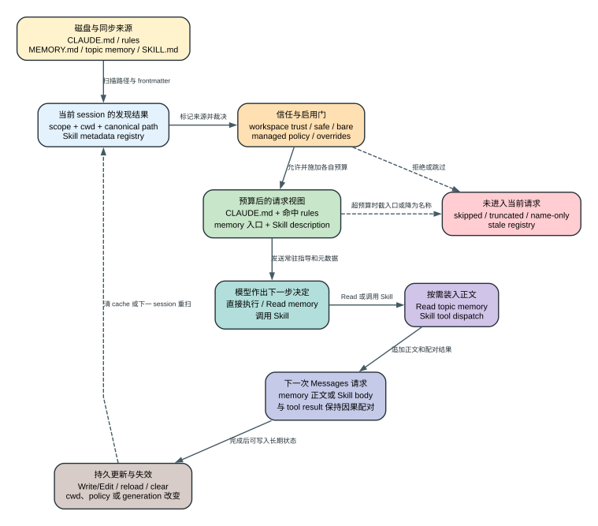

# Claude Code CLI 2.1.235 的长期上下文：CLAUDE.md、Rules、Memory 与 Skills 怎样进入一次请求

一个仓库同时放了下面三份内容：

```text
repo/CLAUDE.md
  包管理器使用 pnpm；修改 API 客户端后运行 pnpm test:contract。

repo/.claude/rules/api.md
  paths: ["src/api/**"]
  重试逻辑必须保留 idempotency key，并验证 429 与 503。

repo/.claude/skills/release-check/SKILL.md
  description: 检查 API 变更的测试、变更记录和发布前置条件
  body: 先运行 contract tests，再检查 changeset，最后汇报未完成项。
```

这台机器的项目 memory 目录里还有一个 `MEMORY.md` 入口：

```markdown
- [网关重试约定](gateway-retry.md) - 上次事故确认的退避与幂等要求
```

用户从仓库根目录启动 Claude Code，接受 workspace trust，然后输入：

> 修复 `src/api/client.ts` 的 503 重试，沿用上次事故约定，并按项目发布流程验证。

第一次 Messages 请求并不会把四个文件不加区别地全部拼进去。下面是忠实简化后的状态，而不是抓包原文：

```text
user context:
  CLAUDE.md: 使用 pnpm；API 修改后运行 contract test
  memory index: 网关重试约定 -> gateway-retry.md
  available skill: release-check - 检查测试、changeset 和发布前置条件

user:
  修复 src/api/client.ts 的 503 重试……
```

模型先 `Read(src/api/client.ts)`。文件路径使 `api.md` 的 `paths` 条件成立，后续上下文可以加入这条只针对 `src/api/**` 的 rule。模型再按 memory 索引 `Read(gateway-retry.md)`，看到上次事故留下的退避细节；入口索引只负责告诉它“可能有这份记忆”，并没有让整篇正文常驻每一轮。

修改完成后，模型调用 `Skill({skill:"release-check"})`。客户端先返回与该 `tool_use_id` 配对的结果：

```text
Launching skill: release-check
```

这个结果只表示调度成功。`SKILL.md` 正文会作为新的上下文消息进入下一次模型迭代，模型随后才按正文运行 contract test、检查 changeset 并汇总结果。仓库已有的精确二进制 Probe 观察到了同样的三步：首个请求只有 Skill 名称和 description，Skill 工具得到 launch acknowledgement，正文 marker 出现在第二个请求。由此可以先得到全文最重要的判断：**`CLAUDE.md` 和可用 rule 是基础指导，`MEMORY.md` 是按预算常驻的检索入口，Skill description 是能力目录，Skill body 则是调用后才付费装入的工作流。**



图中没有“万能 memory 层”。磁盘文件先归属不同 owner，经过各自 gate 和预算后形成请求视图；写文件、reload、切换 cwd 或清 session 只会让后续构建重新发现，不会改写已经发出的请求。

## 同样是 Markdown，owner 完全不同

`CLAUDE.md`、`.claude/rules/*.md` 和 `CLAUDE.local.md` 由用户、项目、管理员或当前开发者维护。客户端负责发现、去重、筛选和装入，模型负责把它们当作指导。它们不是 permission rule：即使 `CLAUDE.md` 写着“允许执行发布”，本地 deny、managed policy、Hook 与 sandbox 仍可阻止工具调用。

Auto-memory 的默认 owner 是当前项目对应的持久目录，通常位于 `~/.claude/projects/<sanitized-cwd>/memory/`。`MEMORY.md` 是入口，专题 Markdown 保存正文。模型可以通过正常的 `Read`、`Write`、`Edit` 工具维护这些文件；客户端另外记录访问、刷新索引和处理同步冲突。它不是 transcript，也不是 prompt cache：新 session 会重新发现它，删除 transcript 不会删除 memory。

Skill 还有两层 owner。loader 拥有名称、description、来源、可调用性和 frontmatter 等 metadata；Skill 被调用后，当前 Agent Loop 才拥有这次正文注入、允许工具、模型或 fork context。文件作者可以提出工作流和能力要求，但不能靠正文或 frontmatter 越过客户端的 permission、policy 和 sandbox。

## 发现顺序先确定作用域，再读取正文

`2.1.235` 会先加入 managed instructions，再处理用户级 `CLAUDE.md` 与 rules。对项目上下文，它从文件系统根方向走到当前 cwd，依次寻找每层的 `CLAUDE.md`、`.claude/CLAUDE.md`、`.claude/rules/**/*.md`，并在允许 local settings 时加入 `CLAUDE.local.md`。通过 `--add-dir` 或受控注册的新根目录也可进入同一发现流程。规范化路径集合负责去重；`@include` 最多递归五层，并对外部路径、symlink、hardlink 与已批准范围另做判断。[发现与 include：readable L214209-L214381](../reverse/javascript/cli.readable.js#L214209)

Rules 分为两类。没有 `paths` 的规则可随项目上下文直接装入；带 `paths` 的规则先保留条件，只有当前文件相对路径匹配时才加入。于是开场例子里 `api.md` 不需要污染所有任务，但在 `Read(src/api/client.ts)` 后能影响下一轮。这里的“匹配”是客户端选择上下文，不是给文件系统工具增加一条强制 ACL。

Auto-memory 先解析功能开关、运行模式、模型 gate 和目录。`autoMemoryEnabled=false` 会关闭读写；bare mode 跳过 auto-memory；普通 remote session 没有显式 memory 目录时也不加载。自定义目录不能由仓库里的 project settings 任意重定向，默认路径则按规范化项目根生成。[开关与路径：readable L88650-L88768](../reverse/javascript/cli.readable.js#L88650)

Skill 来源至少包括 bundled、user、project、plugin 与 account-synced。项目 Skill 要先通过 workspace trust；safe mode 关闭 custom skills；`strictPluginOnlyCustomization` 可以屏蔽 user/project 来源；`disableBundledSkills`、`skillOverrides` 和 session allowlist继续决定它是否列给模型。`user-invocable-only` 仍允许用户输入 `/name`，却不会把它放进模型目录。发现成功只产生 registry object，不等于正文已经进入请求。

## 三套预算不能混成一个“上下文上限”

`CLAUDE.md`/rules 的单文件读取硬上限是 4 MiB；特殊文件、目录或超限文件会被跳过。客户端还计算一个“过大指令”警告线：至少 40,000 字符，并随模型上下文按约 5% 放大。这个数只触发 `/memory` 和状态页告警，不会在该位置自动截断正文。外部 include 的五层深度又是另一条循环防护。[读取与告警：readable L214007-L214145](../reverse/javascript/cli.readable.js#L214007)

`MEMORY.md` 的常驻视图最多 200 行且最多 25,000 个 JavaScript UTF-16 code units。超过后，客户端在已装入片段末尾附加截断警告；专题文件仍留在磁盘，可按索引继续 `Read`。自动目录索引还有独立 I/O 预算：最多递归 8 层、扫描 5,000 个目录项，只考虑不超过 1 MiB 的 Markdown，并发读取 16 个，默认列出最近修改的 200 项；每个候选只读前 30 行、最多 65,536 bytes 提取标题或 frontmatter，最终索引仍受 25,000 code units 限制。[入口预算：readable L114131-L114159、L114927-L114948](../reverse/javascript/cli.readable.js#L114927) [索引预算：L213691-L213741](../reverse/javascript/cli.readable.js#L213691)

Pinned memory 是这个“入口优先”原则的有限例外。客户端最多挑选四篇标记为 pinned 的专题正文直接加入每次会话，候选按修改时间排序；每篇仍经过 200 行和 25,000 code units 的正文裁剪。它适合真正跨任务都要用的少量约束，而不适合把整个知识库设为常驻。超过四篇时，多余候选仍保留在磁盘，只是不再获得 eager injection，因此“文件已 pin”和“当前请求确实带正文”仍是两个状态。

Skill listing 默认把每个 description 限在 1,536 字符，并把总目录预算设为模型窗口的 1%，按默认 4 chars/token 换算。对 200k token 模型，默认目录预算约为 `200000 * 4 * 0.01 = 8000` 字符。超预算时，客户端优先保留 bundled 与显式 `name-only` 项，再按使用优先级把其他低优先级 description 降成只有名称；它不是简单砍掉列表尾部。[listing 预算：readable L281960-L282035](../reverse/javascript/cli.readable.js#L281960)

Skill body 不共享这 1% 的目录预算。调用后，正文、参数和动态展开结果成为下一轮的新消息，实际增加多少上下文取决于该 Skill 内容。Compact 恢复时又采用另一套保留预算：单个已调用 Skill 最多恢复约 5,000 字符，合计约 25,000；需要完整正文时可以重新调用，客户端会区分字节相同的重复调用、参数变化和被 compact 截断后的重新装载。

## 请求装配让“常驻元数据、按需正文”成为可能

启动阶段会为当前 session 构造 `userContext`。`CLAUDE.md`、已命中的 rules、auto-memory 入口或 pinned memory 在这里被格式化为带来源说明的上下文，再作为首部 reminder 进入有效消息视图；它们不会覆盖 top-level system preset，也不会直接进入本地 permission engine。启用 `--exclude-dynamic-system-prompt-sections` 时，memory path 等动态机器信息也会从 system 区移动到第一条 user context，以减少稳定前缀变化；内容只是换了位置，并未消失。

Skill metadata 走另一条路。当前 registry 先移除 disabled、冲突和不允许 model invocation 的对象，再按预算生成 available-skills listing。模型只有看到名称和 description，足以决定“是否调用”，却看不到正文细节。调用 `Skill` 时，客户端重新查 registry，检查用户是否本轮显式输入、override、allowlist、deny rule、permission 与 execution context。普通 inline Skill 的 tool result 是 `Launching skill: ...`，正文通过 `newMessages` 加入下一轮；`context: fork` 则把正文交给隔离 Agent，并返回 fork 结果或后台任务身份。[Skill 调用：readable L282227-L282313](../reverse/javascript/cli.readable.js#L282227)

这种分层节省了未使用 Skill 的正文成本，但 description 仍会成为每轮逻辑上下文的一部分。稳定 listing 可能命中 provider prompt cache，仍不等于不占上下文；Skill generation、顺序或 description 变化也可能改变前缀。

## 更新不会倒流进已经发送的请求

用户修改 `CLAUDE.md` 或 rules 后，当前已发出的 API request 保持原样。Session clear、cwd/worktree 切换、policy/settings 刷新、注册新 repo root并要求 reload 等事件会清 instruction cache；后续 context build 才重新扫描。外部文件变化还可通过 mtime/read-state 形成 changed-file reminder。这个设计保留请求因果：旧响应对应旧上下文，新内容只影响下一次决策。

模型更新 auto-memory 时，本质上仍是受权限控制的 `Write`/`Edit`。内部 PostToolUse callback 会记录该路径被读或写，清除 pinned header scan，通知 memory owner，并在同步冲突、持久化异常或 `MEMORY.md` 接近上限时给下一轮附加说明。专题文件和入口通常是两个独立写入，因此中途失败可能留下“正文已写、索引尚未更新”或相反状态；这里没有跨文件事务。[memory 写后状态：readable L330809-L330858](../reverse/javascript/cli.readable.js#L330809)

Skill 文件修改也不会自动替换当前 registry object。`/reload-skills` 清 Skill cache并重扫磁盘；plugin 提供的完整组件变化通常由 `/reload-plugins` 重建 commands、agents、MCP、LSP、hooks 与 generation。未 reload 的 session 可以继续使用旧 Skill，下一次启动则从磁盘重新发现。Reload 造成 listing 或工具集合变化时，下一轮 prompt-cache 前缀可能失效，这是新内容生效的成本，不是文件写入失败。

Compact 和 resume 同样不把这些对象冻结成永久快照。Compact 用摘要与有限 attachment 恢复已调用 Skill；auto-memory 从持久目录重新筛选；resume 可恢复 Skill 已列出、已调用的状态，但新 cwd、当前 settings、文件内容和 registry仍要重新计算。恢复的是因果连续性，不是旧进程全部内存。

## 失败时最容易出现的四种误判

第一，文件存在不等于已装入。未信任项目、safe/bare mode、scope gate、exclude、symlink/外部 include 拒绝、读取权限或 4 MiB 上限都可能让 `CLAUDE.md`/rule 缺席；单项失败通常被记录后跳过，不会把整次请求变成启动失败。

第二，`MEMORY.md` 被截断不等于 memory 被删除。它只说明常驻入口超预算；没有进入前 200 行或 25,000 code units 的链接，需要通过搜索、目录索引或明确路径找到。反过来，入口中有链接也不证明专题正文已经读入。

第三，看到 Skill 名称不等于正文有效。Frontmatter 错误、source policy、override、同步下载失败、permission deny 或 reload 前旧 registry 都可能让调用失败。看到 `Launching skill` 也只证明这次 dispatch 被接受；应在下一次 request 或最终行为中验证正文确实出现。

第四，memory 是历史事实，不是真值数据库。客户端会提示模型在依赖 memory 前核对当前文件或资源，并更新或删除过期记录，但发布物没有一个通用事实验证器。旧 memory 与当前代码冲突时，模型是否正确识别仍受上下文、工具结果和模型行为影响。

## 隐私边界从“是否进入 wire”开始

项目 `CLAUDE.md`、命中的 rule、`MEMORY.md` 入口与 pinned memory 一旦进入 user context，就会发送给当前 model provider。Skill 的名称和 description 即使从未调用，也可能随 listing发送；正文通常在调用后才发送。Prompt cache改变重复输入的计费与延迟，不改变这些内容已经离开本机的事实。

因此长期上下文不应保存凭据、token 或不必要的个人信息。Team memory 比个人 auto-memory多一层共享对象；project Skill 和 rules 又可能来自仓库贡献者。客户端用 trust、来源标记、目录限制和 permission纵深降低风险，但 Markdown 文本不是签名，也不能因为被包装成 reminder 就获得执行权限。

## 本版证据与 Boundary

这篇文章的普通成功路径由 `2.1.235` readable view 中的 instruction discovery、auto-memory budget/path、Skill listing/invocation 和写后 callback 支撑。Skill 的“metadata first、acknowledgement、body next request”还有精确二进制 Probe：[`plugin-skill-lsp.json`](runtime-probes/plugin-skill-lsp.json)。开场 trace 为基于这些合同的忠实简化，用来把同一 session 的对象连起来，不冒充一份真实用户 transcript。

客户端证据不能证明模型一定遵守某条冲突 guidance、某账号当前有哪些 account-synced Skills、服务端是否命中 prompt cache、provider怎样保留输入、外部 memory 同步服务的最终一致性，也不能证明某篇旧 memory 仍然正确。这些事实分别属于模型行为、账号实时状态、服务端和外部数据 owner；客户端能确定的是哪些文件有资格被发现、何时被裁剪、怎样进入请求，以及哪些更新只对未来请求生效。
