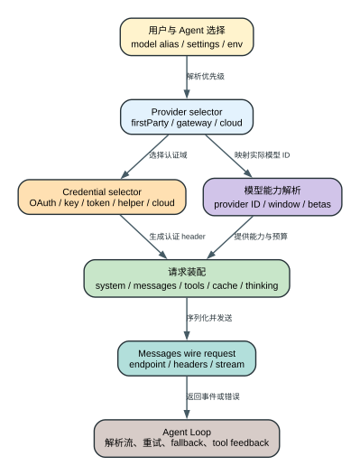

# Claude Code CLI 2.1.235 模型、认证、Provider 与请求装配

这一层决定 Claude Code 最终把什么上下文交给哪个模型、通过哪条网络路径发送、使用哪种凭据，以及哪些 beta、缓存、thinking 和工具能力能够进入请求。它不是一个简单的 `model + apiKey + messages` 对象：同一个模型别名在 first-party、Bedrock、Vertex、Foundry、Anthropic cloud variants、Mantle 或 gateway 下，模型 ID、鉴权材料、endpoint、可用 beta 和失败恢复路径都可能不同。

## 60 秒理解一次请求怎样真正成形

**读者问题：** 用户只写了 `--model sonnet`，为什么最终请求里的模型 ID、endpoint、认证 header、beta、cache 和工具能力会因 provider 与 base URL 不同而变化？

**一句话模型：** 客户端先确定 provider，再在该 provider 的认证域中选择凭据和实际模型 ID，最后把已经治理过的 system、messages、tools、thinking、cache 与 beta 装成 wire request；任何一步的选择都会改变后续能力与失败语义。



贯穿场景：用户选择 `sonnet`，通过自定义 `ANTHROPIC_BASE_URL` 发送，并提供 `ANTHROPIC_AUTH_TOKEN`。客户端仍要先完成 provider 判定和模型别名解析；自定义 host 会影响 first-party 能力 gate；bearer token 生成 `Authorization` 而不是 `x-api-key`；请求体再加入工具 schema、cache marker 和 beta。代理返回 SSE 后，Agent Loop 才能继续工具闭环。

| 对象 | 解析前 | 转换 | Wire 状态 | 用户影响 |
| --- | --- | --- | --- | --- |
| Provider | 多个环境 selector、gateway 状态 | 按固定优先级选中一个分支 | endpoint、region、provider label | 走错云、凭据不匹配、能力 gate 改变 |
| Model | alias、agent override、默认/备用模型 | 映射 baked catalog 与 provider ID | 实际 `model` 和能力预算 | 窗口、thinking、价格、fallback 不同 |
| Credential | OAuth、API key、bearer、helper、cloud credentials | 按 provider/source 选择并刷新 | `Authorization`、`x-api-key` 或云签名 | 401、helper trust、token refresh 行为 |
| Request body | 已治理上下文和工具目录 | 加入 system/messages/tools/cache/thinking/betas | `/v1/messages` body 与 headers | token、延迟、工具和 cache 能否工作 |
| Response | SSE 或错误状态 | 解析事件、分类 retry/fallback | assistant blocks 或 terminal failure | 一次 turn 内可能有多个 API attempt |

后文沿这条成功路径解释每个 selector 和字段，再单独处理认证刷新、代理兼容、重试和 model fallback；它们不能被压成一张“凭据优先级表”。

## 先建立正确的调用链

```text
用户 --model / agent model / settings / 环境默认
                    |
                    v
              模型别名解析与能力目录
                    |
                    v
provider selector -> provider-specific model ID / region / endpoint
                    |
                    v
credential selector -> OAuth / API key / auth token / helper / cloud credentials
                    |
                    v
context builder -> system + messages + tools + thinking + cache + betas
                    |
                    v
Messages streaming request -> SSE parser -> Agent Loop / retry / fallback
```

Agent Loop 在 `reverse/javascript/cli.readable.js` 271832-271842 调用 `m.callModel` 时，已经把 `messages`、`systemPrompt`、`thinkingConfig`、当前工具表、signal、主模型、下一 fallback model、是否非交互、MCP 状态、effort、cache 行为和 tracing 回调交给模型层。也就是说，`callModel` 不是从零读取所有配置；它消费的是前面多层已经解析好的有效状态。

## Provider selector 持有什么状态

2.1.235 的 provider 判定函数位于 `reverse/javascript/cli.readable.js` 62740-62743。顺序是：

1. gateway 状态先于普通环境开关；
2. `CLAUDE_CODE_USE_BEDROCK`；
3. `CLAUDE_CODE_USE_FOUNDRY`；
4. `CLAUDE_CODE_USE_ANTHROPIC_AWS`；
5. `CLAUDE_CODE_USE_ANTHROPIC_GOOGLE_CLOUD`；
6. `CLAUDE_CODE_USE_MANTLE`；
7. `CLAUDE_CODE_USE_VERTEX`；
8. 都未命中时为 `firstParty`。

这是实际优先级，不是“哪个环境变量最后写入就覆盖”。多个 selector 同时为真时，排在前面的分支获胜。用户排查“明明设置了 Vertex 却走 Bedrock”时，第一步应打印所有 provider selectors，而不是只看期望使用的那个变量。

Provider 状态还会影响：

- 模型别名映射到哪种 provider model ID；
- region 和 endpoint 选择；
- 使用 API key、OAuth、AWS、GCP 还是 Foundry 凭据；
- prompt cache 1h、Tool Search、某些 beta 和 first-party account capability 是否可用；
- 错误文本、doctor 检查和 fallback 是否进入 provider-specific 分支；
- telemetry 中记录的 provider 标签和诊断维度。

## 自定义 Base URL 为什么不只是换域名

`ANTHROPIC_BASE_URL` 会改变 endpoint，也会改变“这是不是 first-party host”的判断。`reverse/javascript/cli.readable.js` 62783-62798 明确把 `api.anthropic.com` 作为已知 first-party host；设置其他 host 时，除非 `_CLAUDE_CODE_ASSUME_FIRST_PARTY_BASE_URL` 显式覆盖，否则相关逻辑会把它视为非 first-party。

这会直接影响能力门控。例如 Tool Search 在 `reverse/javascript/cli.readable.js` 114358-114369 检查 first-party provider 与 base URL；代理若能完整转发 `tool_reference`，仍需要显式配置对应开关。仅把代理做成 Anthropic-compatible JSON 并不自动证明它支持所有 first-party beta、SSE 事件、cache TTL、OAuth 或 remote-control 协议。

因此代理兼容性必须拆成至少五层验证：

| 层 | 要验证的对象 | 失败表现 |
| --- | --- | --- |
| HTTP | path、method、headers、status | 401/404/代理握手失败 |
| Messages schema | system/messages/tools/thinking | 参数拒绝或字段被丢弃 |
| SSE | block start/delta/stop/message stop | 流中断、空结果、thinking/tool JSON 断裂 |
| Agent Loop | `tool_use` 与 `tool_result` 配对 | 工具执行后无法继续 |
| 产品协议 | beta、Tool Search、OAuth、remote/cloud | 功能被客户端 gate 或服务端拒绝 |

本仓库的正向探针已经证明普通 HTTP `ANTHROPIC_BASE_URL` 可以驱动 2.1.235 完成真实工具闭环；它没有把该本地 endpoint 声称为 first-party，也没有据此证明所有 beta。

## 认证不是单一优先级列表

认证需要先按 provider 分流，再在 provider 内选择 credential source。环境契约在 `reverse/javascript/cli.readable.js` 39422-39432 把以下对象分组：

- provider selectors 与 cloud workspace/project/region；
- endpoints；
- `ANTHROPIC_API_KEY`、`ANTHROPIC_AUTH_TOKEN`、`CLAUDE_CODE_OAUTH_TOKEN`；
- `apiKeyHelper`、`awsAuthRefresh`、`awsCredentialExport`、`gcpAuthRefresh`；
- AWS/GCP credential files；
- model override；
- proxy、TLS certificate 和 nonessential-traffic controls。

API-key 选择路径在 `reverse/javascript/cli.readable.js` 87433-87455 显式返回 `apiKeySource`，能区分直接环境 key、`apiKeyHelper` 和无 key。OAuth 还维护 token source、401 refresh、存储凭据与用户显式 `CLAUDE_CODE_OAUTH_TOKEN` 的冲突处理。Cloud provider 则需要自己的 region/project/profile/refresh 组合。

### 运行时凭据决策树：先选 provider，再解释“优先级”

`2.1.235` 没有一条跨所有 provider 通用的 `OAuth > API key > helper` 排序。真正的决策发生在两层：`Gn()` 先锁定 provider，`hme()` 再只构造该 provider 的 SDK client。源码 [230727-230829](../reverse/javascript/cli.readable.js#L230727) 把这些分支写在同一个 client factory 中，因此可把实际 wire owner 归纳为：

| Provider 分支 | 首要凭据/签名路径 | 显式覆盖与降级 | 最终 wire owner | 典型失败 |
| --- | --- | --- | --- | --- |
| `gateway` | 已建立 gateway session 的 JWT | JWT 过期时不退回普通 API key | gateway client 写 `Authorization: Bearer` | 要求刷新 gateway token 或重新登录 |
| `bedrock` | AWS bearer 或 AWS credential chain/SigV4 | skip-auth 时可消费受管 `Authorization`；否则可用 host/provider chain 与本地 AWS cache | Bedrock SDK/AWS signer | region、credential chain、签名或服务 tier 错误 |
| `foundry` | Foundry auth token、Foundry API key或 Azure credential provider | skip-auth 只在显式 gate 下成立 | Foundry SDK/Azure token provider | Azure credential 不可用或资源 endpoint 错误 |
| `anthropicAws` | Anthropic-on-AWS API key或 AWS credential chain | host-owned auth 与 skip-auth 有独立分支 | Anthropic AWS client | AWS credential 过期、region/workspace 不匹配 |
| `anthropicGoogleCloud` | Google auth/project/workspace | skip-auth 时只接受显式 host wire auth | Anthropic Google Cloud client | GCP login、project/location 或 host token 失败 |
| `mantle` | `AWS_BEARER_TOKEN_BEDROCK`，否则 AWS credential chain | skip-auth/custom `Authorization` 与 provider chain互斥 | Mantle client/AWS signer | bearer、region 或 AWS credential chain 失败 |
| `vertex` | Google auth 与 Vertex project/region | skip-auth 时消费显式 wire `Authorization` | Vertex SDK/Google auth | project 未解析、ADC 不可用或 endpoint 改写失败 |
| `firstParty` | API key、OAuth/profile/WIF、外部 auth token按各自 gate进入 | custom header、helper、host refresh 仍有独立来源标签 | Anthropic client | source-specific 401/403、helper trust、refresh 失败 |

这张表描述的是客户端分支，不把云 SDK 内部 credential chain 伪装成 Claude Code 自己实现的排序。特别是 `CLAUDE_CODE_SKIP_*_AUTH`：它表示宿主或显式 header 接管签名，并不等于“无认证也会成功”。

first-party token source classifier 在 [87468-87484](../reverse/javascript/cli.readable.js#L87468) 还区分 `ANTHROPIC_AUTH_TOKEN`、`CLAUDE_CODE_OAUTH_TOKEN`、OAuth token file descriptor、CCR token file、`apiKeyHelper`、profile、已保存 claude.ai login 与 `none`。这些 source label 会继续进入错误诊断、refresh 能力和 telemetry；两个 bearer token 即使 wire 都是 `Authorization`，也不能据此当成相同生命周期：环境/FD token通常没有本地 refresh token，保存登录则可以进入 refresh 状态机。

这里有两个容易漏掉的安全细节：

1. `apiKeyHelper` 是可执行程序，不是静态字符串。2.1.235 在 workspace trust 未确认前调用 helper 会触发安全错误，相关 guard 在 readable JS 86609-86635。
2. 子进程、background worker 和 host-managed provider 不能无条件继承全部父进程环境。源码维护专门的 credential/environment 分类集合，用于传播、清理或交给 host refresh。

所以诊断认证时不能只问“有没有 key”，还要问：当前 provider 是谁、source 是谁、helper 是否获信任、refresh 是否成功、最终 header 由客户端还是 host 注入。

## Profile、WIF、OIDC 与 user OAuth：凭据不是读一次文件就结束

这一组认证方式共同解决的是“不给长期 API key，怎样持续得到可用的短期 bearer token”。2.1.235 把它拆成五层状态：profile 选择、配置补全、身份材料换 token、进程内 token cache、磁盘 credential cache。任何一层失败都会阻止请求进入 Messages API，但各层的恢复方式并不相同。

### 1. Profile/WIF 的真实选择顺序

CLI 自己的 WIF selector 位于 [67596-67685](../reverse/javascript/cli.readable.js#L67596)，顺序不是泛化的“环境变量总是覆盖配置文件”：

1. 若显式设置 `ANTHROPIC_PROFILE`，且对应 config 的 `authentication.type` 是 `oidc_federation` 或 `user_oauth`，选择 `profile-explicit`；无效或不存在的 profile 不会继续伪装成有效凭据。
2. 否则，若 `ANTHROPIC_FEDERATION_RULE_ID` 与 `ANTHROPIC_ORGANIZATION_ID` 同时存在，选择 `env-quad`，认证类型固定为 `oidc_federation`。
3. 否则读取 `active_config`，没有该文件时使用 `default`；其 config 类型有效时选择 `profile-implicit`。
4. 三者都未成立时，WIF 不激活，first-party client 继续使用其它 credential source。

配置目录在 Node/Deno SDK 中按 `ANTHROPIC_CONFIG_DIR`、Windows `APPDATA`/`USERPROFILE`、`XDG_CONFIG_HOME`、`HOME` 推导；CLI 的 Unix 路径快照见 [67641-67647](../reverse/javascript/cli.readable.js#L67641)。profile 名称只允许字母、数字、`_`、`.`、`-`，同时拒绝空值、`.`、`..` 和任何路径分隔符，避免 profile 名称逃逸到 `configs/` 或 `credentials/` 目录之外 [8879-8892](../reverse/javascript/cli.readable.js#L8879)。

SDK 的 profile loader 中，文件值优先，缺失字段才由环境补齐：`organization_id`、`workspace_id`、`base_url`、`scope`，以及 OIDC 的 identity-token file、federation rule、service account 都使用这种 nullish fill 语义 [8900-8921](../reverse/javascript/cli.readable.js#L8900)。但 Claude Code 的 CLI WIF wrapper 在真正构造 provider 时又用运行时 `ANTHROPIC_BASE_URL || profile.base_url` 选择 token/API base URL，所以 **base URL 是一个明确例外：CLI 环境值可覆盖 profile 文件值** [68662-68668](../reverse/javascript/cli.readable.js#L68662)。`user_oauth` 没写 `credentials_path` 时，文件型 profile 默认落到 `<config_dir>/credentials/<profile>.json`；`env-quad` 没有隐式 credential file。user OAuth 有 `workspace_id` 时还会额外写入 `anthropic-workspace-id` header，OIDC 不走这条 header 分支 [9059-9068](../reverse/javascript/cli.readable.js#L9059)。

打包 SDK 的构造器还规定：`profile` 与 `credentials`/`config` 最多选一种；显式给出 `profile` 时不会再默认读取 `ANTHROPIC_API_KEY` 或 `ANTHROPIC_AUTH_TOKEN` [13175-13209](../reverse/javascript/cli.readable.js#L13175)。这是 SDK 直接使用路径的合同。Claude Code 主请求则先由 CLI wrapper 解析 WIF，再把解析出的短期 token 作为普通 `authToken` 交给 Anthropic client，二者不能混成同一条优先级。

| 状态对象 | 输入 | 成功后状态 | 失败/恢复 | 用户可见影响 |
| --- | --- | --- | --- | --- |
| WIF source | 显式 profile、env-quad、active profile | 唯一 source label 与 auth type | source 无效则 WIF 不激活或 profile resolution 报错 | 同一组环境下可能走 OIDC、user OAuth 或普通 key |
| Config | profile JSON 与缺失字段的环境补全 | organization/workspace/base URL/auth contract | JSON、type、必填字段错误直接终止 credential resolution | 请求尚未发往模型 endpoint |
| Identity material | token file 或 `ANTHROPIC_IDENTITY_TOKEN` | OIDC assertion provider | 文件不存在/空、来源类型不支持、assertion 超限 | token exchange 前失败，不泄漏到 Messages API |
| Token cache | access token、`expiresAt`、pending refresh | 可复用 bearer token | 临近过期后台/阻塞刷新；401 后失效并受限重解析 | 普通请求不必每次交换 token |
| Credential file | access/refresh token、expiry、profile metadata | 跨进程可恢复登录 | 权限错误拒绝；并发锁、原子替换和 stale refresh 清理 | 多个 CLI 进程不会无约束覆盖 refresh token |

### 2. OIDC federation 怎样把 identity token 换成 access token

OIDC identity source 的优先级是：profile 的 `authentication.identity_token`、`ANTHROPIC_IDENTITY_TOKEN_FILE`、`ANTHROPIC_IDENTITY_TOKEN`。本 SDK 版本对 profile 内的结构化 source 只接受 `source: "file"`；路径为空或其它 source 会在本地报错 [9091-9102](../reverse/javascript/cli.readable.js#L9091)。读取发生在每次 provider 执行时，文件不存在、不可读或 trim 后为空都会终止交换，因此外部身份系统可以通过原子替换 token file 更新 assertion，而不必重启 CLI。

交换前先检查 token endpoint：只接受 HTTPS，唯一明文例外是 `localhost`、`127.0.0.1`、`::1` 的 HTTP [8651-8663](../reverse/javascript/cli.readable.js#L8651)。随后向 `<baseURL>/v1/oauth/token` 发送：

| Wire 字段 | 2.1.235 值/来源 | 约束 |
| --- | --- | --- |
| `grant_type` | `urn:ietf:params:oauth:grant-type:jwt-bearer` | 固定 |
| `assertion` | identity-token provider 返回值 | 最多 16 KiB |
| `federation_rule_id` | profile/env | 必填 |
| `organization_id` | profile/env | 必填 |
| `service_account_id` | 可选 | 有值才发送 |
| `workspace_id` | 可选 | 有值才发送；401 时错误信息会提示多 workspace 场景 |
| `anthropic-beta` | `oauth-2025-04-20,oidc-federation-2026-04-01` | token endpoint 协议协商 |

CLI 包装的 exchange fetch 还有 10 秒超时 [68662-68670](../reverse/javascript/cli.readable.js#L68662)。响应体最多读取 1 MiB，必须是 JSON、包含 `access_token`、若有 `token_type` 则必须为 Bearer，并且 `expires_in` 必须可转成有限数字；错误正文只保留 `error`、`error_description`、`error_uri` 等允许字段，普通字符串最多展示 2000 字符 [8664-8756](../reverse/javascript/cli.readable.js#L8664)。这既保留诊断信息，也避免把整个异常响应无界写入日志。

### 3. TokenCache 的 120 秒/30 秒双阈值

token provider 外层的 `TokenCache` 不是单一 TTL map，而是带并发合并和强制刷新状态的对象 [8770-8803](../reverse/javascript/cli.readable.js#L8770)：

```text
无缓存 / 收到 invalidate
        -> 阻塞 refresh -> 缓存 token

expiresAt 为空
        -> 直接使用，视为无已知到期时间

剩余 > 120 秒
        -> 直接使用

30 秒 < 剩余 <= 120 秒
        -> 先返回当前 token，同时后台 refresh

剩余 <= 30 秒
        -> 阻塞 refresh，成功后才发业务请求
```

同一时刻的普通 refresh 共享 `pendingRefresh`，避免多个请求重复交换；强制 refresh 可以绕开已有 pending promise。后台刷新失败不会立即打断当前请求，因为旧 token 仍在 30 秒安全窗外，但 advisory error 最多每 5 秒触发一次。

401 要分 SDK 与 CLI 两条路径理解：

- 打包 SDK 若被外部调用者直接传入 `profile`/`config`，会给 request options 记录 `usedTokenCache` 与 `didRefreshFor401`；首次 401 使 cache `invalidate()` 并允许该 request 强制刷新一次，标志位阻止同一 request 无限循环 [13260-13272](../reverse/javascript/cli.readable.js#L13260)、[13395-13405](../reverse/javascript/cli.readable.js#L13395)。
- Claude Code 主请求不把 profile 交给 SDK。client factory 先从 CLI 的 WIF singleton cache 取 token，再用普通 `authToken`/`Authorization` 构造 client [230793-230800](../reverse/javascript/cli.readable.js#L230793)。外层 API loop 收到 401 后把上一 token 记入最多 20 项的 rejected-token set，调用 `invalidate()`，重建 client 并重新取 token；重试次数由外层有限 attempt budget 管理 [215592-215608](../reverse/javascript/cli.readable.js#L215592)、[68674-68683](../reverse/javascript/cli.readable.js#L68674)。token-exchange 自身的 network/401/5xx 错误也可触发 cache invalidation，但 account-on-hold 与“已过期且无 refresh”被排除，避免把必须人工处理的状态伪装成可恢复网络故障 [215829-215835](../reverse/javascript/cli.readable.js#L215829)。

所以“401 后换 token”只适用于 WIF/profile cached bearer，不能据此推断环境 `ANTHROPIC_AUTH_TOKEN`、API key、AWS/GCP signer 都会自动换凭据；同一个被拒 token 也不会被兄弟进程刚写回文件后再次误采纳。

### 4. user OAuth 的文件安全、refresh 与多进程竞争

`user_oauth` 读取 credential file 前检查真实路径和 mode：group/world writable 或 readable 都是硬错误，并提示收紧为 `chmod 600`；owner UID 不同只发 warning，让受管环境仍可显式使用 [8694-8705](../reverse/javascript/cli.readable.js#L8694)。有效 access token 在 `expires_at` 未知，或距过期至少 30 秒时直接使用；否则必须同时有 `client_id` 和 `refresh_token` 才能刷新 [9015-9053](../reverse/javascript/cli.readable.js#L9015)。

刷新同样请求 `/v1/oauth/token`，但 body 改成 `grant_type=refresh_token`、旧 refresh token 和 client ID，beta 只带 `oauth-2025-04-20`。成功响应必须有 access token 与有限 `expires_in`；服务端没有返回新 refresh token 时保留旧值，而不是把本地恢复能力清空。写盘使用 `0700` 目录、`0600` 临时文件、文件 `fsync`、原子 rename，再尽力 `fsync` 目录 [8707-8731](../reverse/javascript/cli.readable.js#L8707)，所以进程崩溃更可能留下旧完整文件或新完整文件，而不是半段 JSON。

CLI 又在 SDK provider 外包了跨进程锁：锁以 60 秒为 stale 阈值、每 5 秒续期；冲突后最多重试 5 次，每次等待 1-2 秒随机抖动 [68621-68647](../reverse/javascript/cli.readable.js#L68621)。强制刷新前还会重读 credential file：若兄弟进程已经写入一个未被当前 401 拒绝、且距过期超过 30 秒的新 access token，本进程直接采用它，跳过重复 refresh grant [68699-68712](../reverse/javascript/cli.readable.js#L68699)。

如果 refresh endpoint 返回 400/401 `invalid_grant`，且磁盘上的 refresh token 仍等于本进程刚使用的旧值，CLI 会原子清除该 stale refresh token，再把原错误向上传递；若兄弟进程已经轮换 token，则不会误删新 token [68714-68740](../reverse/javascript/cli.readable.js#L68714)。这是失败收敛，不是自动重新登录：下一次用户会得到“access token 已过期且没有 refresh 可用”，需要重新获取凭据。

## 模型选择分成名称、能力和 provider ID

机器清单中的 [model-catalog.jsonl](source-inventory/model-catalog.jsonl)、[model-aliases.jsonl](source-inventory/model-aliases.jsonl)、[model-catalog-metadata.jsonl](source-inventory/model-catalog-metadata.jsonl) 和 [model-pricing-tiers.jsonl](source-inventory/model-pricing-tiers.jsonl) 分别回答四个问题：

- bundle 认识哪些 baked model；
- `sonnet`、`opus`、`haiku` 等别名如何指向具体模型；
- 每个模型声明了哪些窗口、thinking、fast mode 或 provider metadata；
- token、cache write/read 和长上下文成本如何计价。

有效模型不只来自 `--model`。主会话、subagent definition、`ANTHROPIC_MODEL`、默认模型、small/fast model、fallback model、advisor/compact/background classifier 都可以持有不同选择。`model: inherit` 只表示子 Agent 默认继承父会话的模型选择；它仍然拥有独立请求与上下文。

版本比较时应以稳定的 catalog/alias/provider mapping 为主，不能把 minified 局部变量变化当成模型变更。真正有意义的变化包括：别名指向改变、某 provider 从 `null` 变为可用、窗口/价格/能力 metadata 改变、默认 fallback 顺序改变。

## Request construction：每一类字段解决什么问题

模型请求至少由以下组组成：

| 组 | 典型字段 | 目的 |
| --- | --- | --- |
| 身份 | `model`、provider-specific ID | 选择实际推理端点 |
| 上下文 | `system`、`messages` | 提供指令、历史和观察结果 |
| 输出预算 | `max_tokens` | 控制单次响应上限，不等同于 Agent 总轮数 |
| 思考 | `thinking`、effort | 控制推理预算与展示策略 |
| 工具 | `tools`、`tool_choice` | 声明可调用工具合同 |
| 缓存 | `cache_control`、cache breakpoint | 稳定前缀复用与 TTL |
| Beta | `anthropic-beta` | 协商 tool search、cache、thinking 等协议能力 |
| 观测 | request ID、trace headers、metadata | retry、成本、诊断与链路关联 |

SDK 层最终向 `/v1/messages?beta=true` 发送 body，并依据 `stream` 选择流式路径；可读源码 12294-12307 还保留 non-streaming timeout、beta header、user-profile header 和 count-tokens 路径。Agent Loop 的主请求不是直接拼接原始 transcript：在此之前已经完成 message graph 选择、compact、tool-result cleanup、system 分段、deferred schema、cache breakpoint 和 provider-specific betas。

最关键的字段关系是 `tool_use.id` 与下一轮 `tool_result.tool_use_id`。本版精确二进制探针实际观测到：第一次请求声明 `Read`；模型返回 ID 为 `toolu_agent_loop_probe` 的调用；第二次请求同时包含该 `tool_use` 和同 ID、含文件 marker 的 `tool_result`；最终 result 为 `TOOL_EXECUTION_OK`。完整输入、literal output 和 exit status 见 [agent-loop-tool-result-resume.json](runtime-probes/agent-loop-tool-result-resume.json)。

## Messages request mutation：不是组装一次，而是每次 attempt 重新派生

主请求 builder 位于 [409464-409531](../reverse/javascript/cli.readable.js#L409464)。它每次 API attempt 都从当前 loop state 重新生成 body；retry handler 修改 messages、beta latch、thinking capability 或 hint state 后，下一 attempt 会重新走完整 builder。因此抓到的一次 wire body 只能证明该 attempt，不能代表后续重试仍发送同样字段。

### 字段变换顺序与覆盖关系

| 阶段 | 读取状态 | 变换 | 写入 request | 关键不变量/影响 |
| --- | --- | --- | --- | --- |
| Beta 基线 | sticky beta 集合、model、provider | 复制集合；按模型/provider 加能力 beta；Bedrock 的部分 beta 写入 body `anthropic_beta` | header `betas` 与 provider body params | retry 可以给某 beta 加 sticky reject，下一次不再出现 |
| Extra body | `CLAUDE_CODE_EXTRA_BODY` | 只接受 JSON object；合并 provider beta；若 `metadata.user_id` 内含内部 `tk`，先移除该字段 | 临时 body overlay | 解析失败只记错误，回退为空对象 |
| Output config | extra `output_config`、effort、task budget、format | 先从 overlay 取出并删除，再按模型能力补 `effort`、`task_budget`、structured `format` 和对应 beta | 最终 `output_config` | extra body 已给具体子字段时不重复覆盖；不支持 effort 的模型会删除 effort |
| Fallback | server refusal 配置、fallback credit lane | 生成 server-side fallback body、armed/mode 状态和一次性 credit token | fallback fields/本 attempt token | token 在发送前移入本 attempt 局部变量并从待发送状态清空；错误处理可 strip 后重试 |
| 输出与 thinking | model 上限、attempt/global override、thinking config | `max_tokens` 取 override/default 后再被模型上限封顶；固定 thinking budget 被夹在 `1024..max_tokens-1` | `max_tokens`、`thinking` | 开启 thinking 时命名 `tool_choice` 降为 `auto`；机械关闭 thinking 会限制不兼容的高 effort |
| Context/cache | prompt-cache gate、TTL、hint controller、evict/diagnosis latch | 规范化 messages；插 cache breakpoint；加入 1h、hint、evict、diagnostics beta/body | `messages`、`context_management`、`cache_control`、`diagnostics.previous_message_id` | cache、hint、diagnostics 是独立状态，不应合称一个“缓存开关” |
| Wire schema | model alias、system、tool catalog、metadata | model 归一化、tool schema 转换、metadata 加 session/device/account/parent/remote attribution | 完整 Messages body | tool schema 与 messages 在每个 attempt 一起重建 |
| 最终净化 | disabled-thinking shape、Unicode string validity | `thinking:{type:"disabled"}` 删除多余键；检测到 lone surrogate 时深拷贝净化并验证 | 可序列化 body | 防止代理/API 因非法 Unicode 或 disabled-thinking 附加字段拒绝整次请求 |

合并顺序有一个调试时必须知道的细节：基础字段和 fallback 字段之后才展开 `CLAUDE_CODE_EXTRA_BODY`，所以该 object 可以覆盖较早的普通 body key；但 `output_config` 被单独抽出治理，随后生成的 `output_config`、`speed` 和 cache-diagnostics 又位于 overlay 之后。换句话说，它不是“所有字段无条件最后覆盖”，而是有受管尾字段。把代理侧 capture 与 CLI 配置对照时，必须按这个顺序解释最终值，不能只搜索某个环境变量是否存在。extra-body 解析和 metadata 处理见 [408975-408999](../reverse/javascript/cli.readable.js#L408975)，effort/task budget/output format 的能力 gate 见 [409039-409062](../reverse/javascript/cli.readable.js#L409039)。

### API 400/兼容性降级梯：每次只退掉一个已识别能力

request 失败后，2.1.235 的 error handler 按固定顺序尝试可逆 mutation [409703-409761](../reverse/javascript/cli.readable.js#L409703)。它不是把 400 一律重发，也不是立即切模型：只有错误形状能归因到某个可选能力时，才修改对应状态并返回带原因的 retry transition。

| 优先级 | 识别的失败 | 本次修改 | 后续 attempt | 保留/终态 |
| --- | --- | --- | --- | --- |
| 1 | auto/AFK beta 被拒 | 关闭当前 session 的 auto-mode，移除 beta sticky state | `retry:afk-beta` | session 内不再反复试同一能力 |
| 2 | dispatch header 遇到 5xx 或连接错误 | 一次性 circuit-break dispatch v2 header | `retry:dispatch-header-strip` | body/messages 不变；普通 4xx 不触发此分支 |
| 3 | advisor message 不兼容 | 从 `Q` 消息视图移除 advisor 结构 | `retry:advisor-strip` | transcript 原始事实与 wire view 要区分 |
| 4 | API 指出具体 image/document block 路径不可处理 | 只删除 `messages[i].content[j]` 对应 block | `retry:media-strip:<kind>:i.j` | 记录被删 kind/index，随后向 loop 产出 `invalid_request` 观察 |
| 5 | 400 只有 media kind、没有可用 path | 从最近 carrier 删除该 kind 的 base64 blocks | `retry:media-strip-latest` | 最多执行 3 次，防止无界丢内容重试 |
| 6 | cache diagnosis/evict beta 被拒 | 分别关闭 diagnosis 或本 conversation 的 evict latch | 对应 cache beta retry | 普通 prompt cache 状态不会被一并全部关闭 |
| 7 | `thinking.type` 不兼容 | 在 `enabled` 与 `adaptive` 间切换并记录 model capability | `retry:thinking-type` | 这是能力协商，不是缩短 thinking budget |
| 8 | `output_config.effort` 不支持 | 对该 model latch unsupported | `retry:effort-unsupported` | 下一 body 不再带 effort |
| 9 | thinking signature/block 被拒 | 删除所有 signed/redacted/unsigned thinking blocks | `retry:thinking-signature-strip` | 只在未启用 incomplete-thinking resume 时执行；文本/工具块保留 |
| 10 | mid-conversation system/per-turn effort 被拒 | 重建无 `{role:"system"}` turn 的 wire messages，移除相应 beta | `retry:mid-conv-system` | sticky reject 持续到 `/clear` 或 `/compact` |
| 11 | proxy 只拒绝 api-system tail 的 `cache_control` | 把 breakpoint 下沉到 trailing message | `retry:api-system-cache-demote` | 保留缓存意图，改变 breakpoint 位置 |
| 12 | context hint 请求被拒或需清理 | hint controller 返回新 messages，并回报 cleared IDs/content | `retry:context-hint` | 只清除 controller 指定的 hint 状态 |
| 13 | fallback-credit/server-fallback 400 | 按 attribution 逐层移除 credit token、category beta、server-fallback beta或 header | `retry:fallback-credit-strip` 等 | 每层有 boolean/sticky latch，退到兼容形态后停止重复 strip |

最后一层的精确顺序在 [409539-409574](../reverse/javascript/cli.readable.js#L409539)：先处理可归因的 fallback-credit 错误，再处理 category beta，再处理通用 server-fallback beta；streaming attempt 若已经发出一次性 credit token但错误无法归因，可做一次 unattributed strip。只有已 armed 的 fallback 状态才会进入后面的兜底 strip，且每个分支都用 `tr`、`Ar`、`Co`、`Ct` 等一次性标志阻止循环。

这些 mutation 改的是四种不同对象：`Q` 是本次模型调用使用的 messages；`f` 是 request-local beta 基线；`L` 保存该 query 所属 sticky scope 的 reject 状态，scope 可能是 session、detached main、agent 或 auxiliary；provider/model capability cache 保存跨 attempt 的兼容结论。重试不会回滚 transcript 中已完成的旧工具，也不会撤销前一 Agent iteration 已发生的文件、shell 或远端副作用。它只能让“下一次 API attempt 的 wire request”恢复为服务端可接受的形态。

## Retry、fallback 与“轮次”的边界

HTTP retry、SSE 续流、同模型请求重试、模型 fallback 和 Agent turn 不是同一个计数器。Agent Loop 的 `turnCount` 代表逻辑模型-工具循环；网络层可在一次逻辑 turn 内做多次 API attempt。fallback 还会携带 refusal lane、fallback credit、silent/visible model 和 streaming fallback 回调。

用户看到“请求了三次”不能直接推断“消耗三个 maxTurns”。反过来，工具已完成后再发生 fallback，也不能把外部副作用回滚。请求层能丢弃 provisional message、生成 synthetic error 或重建下一次消息；文件写入、shell 命令和远端 API 已经发生的动作仍需要工具自身的幂等、检查点或人工恢复。

## 微小但会影响真实使用的特性

- 自定义 base URL 会改变 Tool Search 等 optimistic gate，不只是 URL 字符串。
- `ANTHROPIC_AUTH_TOKEN` 与 `ANTHROPIC_API_KEY` 是不同 source；OAuth 401 refresh 又是另一条状态机。
- `apiKeyHelper` 输出必须是可接受的 printable ASCII token，且不能在 workspace trust 前运行。
- provider 选择优先级固定，多 selector 同时开启不会合并 provider。
- model alias 和 provider mapping 分离：同一个用户名称能映射成不同云平台 ID。
- count-tokens、compaction 请求和主 Messages 请求不是同一种调用，分析 capture 时要分类。
- non-streaming timeout 会参考 `max_tokens`；流式路径则还受 stream idle timeout 和事件完整性约束。
- 关闭 telemetry 不等于关闭模型请求；`CLAUDE_CODE_DISABLE_NONESSENTIAL_TRAFFIC` 的边界应按具体 traffic family 验证。

## 精确二进制请求捕获

[runtime-controls.json](runtime-probes/runtime-controls.json) 对 SHA-256 固定的版本文件运行受控请求，观察到：

- `ANTHROPIC_AUTH_TOKEN` 变成 `Authorization: Bearer $TOKEN`；
- `x-api-key` 不存在；
- `anthropic-version` 与 `anthropic-beta` 存在；
- `model` 为命令行指定的 `claude-sonnet-4-5`；
- `tools` 包含 Read schema；
- 请求体出现 3 个 `cache_control`。

这给 provider/auth/request 章节增加了 wire-level 证据。它只证明客户端构造结果，不证明自定义 endpoint 实现了这些 beta，也不证明 Anthropic 服务端接受同样的 token、cache 或 routing 语义。

同一报告新增 `probe.request-api-key-auth`：只提供 `ANTHROPIC_API_KEY` 时，实际 request 发送 `x-api-key: $API_KEY`，`Authorization` 不存在，CLI 最终 success、exit 0。与 `probe.request-bearer-auth` 联合后可以确认两条 credential source 产生互斥的 header shape，而不是把两种凭据同时转发。

当前固定的官方 [Authentication](https://code.claude.com/docs/en/authentication) 摘录只明确两条环境来源及其 header 形状：`ANTHROPIC_AUTH_TOKEN` 使用 `Authorization: Bearer`，`ANTHROPIC_API_KEY` 使用 `X-Api-Key`，对应 `public.auth-precedence`。它没有给出所有 cloud provider、helper、OAuth/profile/subscription 的统一顺序；本章因此用上面的 target-version Static client factory 解释分支，而不把 Public 证据扩大。2.1.235 已正向验证 bearer/API-key 两条 wire shape；其它分支的 client construction、source label 和失败路径属于 Static，真实 AWS/GCP/Azure/profile/WIF 环境成功仍是环境相关 Probe 边界。

模型恢复也不能和 credential fallback 混写。`probe.model-fallback-sequence` 观察到主模型三次 529 后第四次使用备用模型；认证 400/401、计费、rate limit、请求尺寸和 transport 不应从这个结果推断会切模型。完整失败分类见 [韧性与恢复](resilience-and-recovery.md)。

## 跨版本比较清单

每个新版本至少比较 provider precedence、first-party host 判定、credential source、helper trust gate、model alias/provider ID、Messages body 字段、beta 集合、cache TTL、thinking/effort、fallback lane、retry 参数和正向工具回灌 probe。某个 endpoint host 或压缩符号变化只作为线索；只有稳定 key、请求字段、可达分支、probe 或官方 release note 与本地证据互相印证，才写成功能变化。

## 证据与边界

结构化证据条目：`provider.selection`、`provider.first-party-host`、`auth.environment-contract`、`auth.key-source`、`agent-loop.model-call`、`probe.agent-loop-tool-feedback`、`probe.request-bearer-auth`、`probe.request-api-key-auth`、`probe.model-fallback-sequence`、`public.auth-precedence`、`public.fallback-chain`。精确命令、header 占位结果、模型请求序列和 exit status 见 [精确二进制运行证据指南](runtime-probe-index.md)。

已证实的是客户端 selector、credential source、request state 和本地工具闭环。未从发布物中恢复的是 Anthropic 服务端的真实路由器、缓存命中算法、账户 abuse/risk score、服务端隐藏 beta 分流、容量调度和模型内部实现。这些必须保留为 `Boundary`，不能因为客户端发送了某个 header 就写成服务端一定执行了对应策略。
