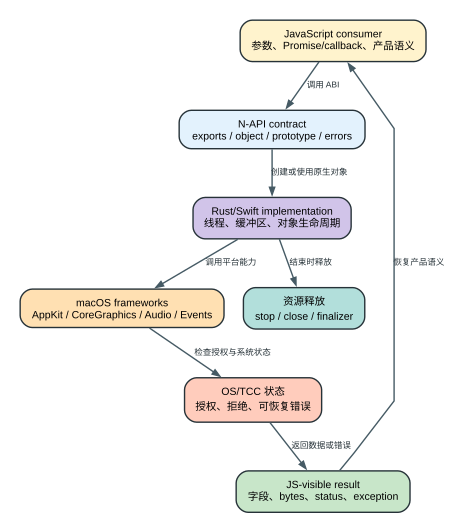

# Claude Code CLI 2.1.235 Native Bridge 与 JavaScript Runtime

Claude Code 的主控制面在 bundled JavaScript 中，但图像、音频、键鼠、截图、应用/TCC 和 URL event 等能力通过 5 个 `.node` 模块进入 macOS 原生框架。要理解这些功能，必须把三层连起来：JavaScript 调用点定义产品语义，N-API export 定义 ABI 合同，Rust/Swift/Mach-O 分析解释底层实现。

## 60 秒理解原生桥

**读者问题：** 为什么导出函数名对上了还不算重建完成，截图、录音或键鼠调用失败时又应该查 JavaScript、N-API、线程、TCC 还是系统框架？

**一句话模型：** JavaScript wrapper 规定产品可见的参数、返回值和生命周期，N-API 规定二进制合同，Rust/Swift 对象调用 macOS 框架并承受线程、内存和 TCC 约束；兼容重建必须同时匹配这三层，而不是只复制 export 表。



贯穿场景：Computer Use 请求截取窗口并发送鼠标点击。JS 先用 wrapper 构造参数；N-API 创建原生对象；Swift 截图路径访问 ScreenCaptureKit/CoreGraphics 并检查授权；Rust 输入模块产生真实鼠标副作用；结果回到 JS 后被转成模型可见字段。截图失败可以重试或提示授权，已经发出的点击却不能靠 JS exception 回滚。

| 层 | 合同对象 | 需要匹配的细节 | 失败表象 | 恢复/副作用边界 |
| --- | --- | --- | --- | --- |
| JavaScript consumer | 函数调用、参数和产品状态 | nullability、Promise/callback、字段语义、调用顺序 | 参数看似正确但 UI/Agent 行为不对 | wrapper 决定何时重试和如何展示 |
| N-API ABI | exports、object/prototype、native handle | 类型、异常、线程安全、finalizer、架构 | load error、crash、对象失效 | export count 相同仍可能不兼容 |
| Rust/Swift runtime | buffer、线程、资源对象 | bytes、采样率、图像格式、stop/dispose | 泄漏、竞态、错误字段不一致 | 必须显式释放长期资源 |
| macOS/TCC | framework 与授权状态 | permission、display/window/app identity、event delivery | 无画面、无音频、输入被拒绝 | 授权和系统状态在模块外部 |
| 外部副作用 | 键鼠、录音、URL event | 执行顺序和幂等性 | 调用失败前动作已部分发生 | 普通异常不能撤销真实输入 |

后文按五个模块逐一连接 JS consumer、N-API contract、Mach-O/语言证据、资源生命周期和双跑 Probe，并始终保留 `Observed`、`Derived`、`Compatible` 三类结论。

## 五个 native module 在运行时的位置

`reverse/javascript/cli.readable.js` 45-57 通过 Bun standalone 虚拟路径加载：

| Module | 语言证据 | JavaScript 侧用途 |
| --- | --- | --- |
| `image-processor.node` | Rust + `image` ecosystem | 图像 metadata、resize、JPEG/PNG/WebP、clipboard image |
| `computer-use-swift.node` | Swift + AppKit/ScreenCaptureKit/CoreGraphics | 截图、显示器、应用发现、TCC、ESC hotkey |
| `computer-use-input.node` | Rust + Enigo/AppKit | 键盘、鼠标、滚轮、前台应用 |
| `audio-capture.node` | Rust + CPAL/CoreAudio/AVFoundation | 录音、播放、PCM、麦克风授权 |
| `url-handler.node` | Rust + Carbon Apple Events | 等待 `GURL` URL event |

```text
bundled JS
   |
   | require('/$bunfs/root/<module>.node')
   v
N-API exports / objects / prototypes / Promise callbacks
   |
   v
Rust or Swift runtime
   |
   v
macOS frameworks / devices / TCC / event loop
```

Native module 不是独立服务。它们在同一个进程地址空间内运行；panic、ABI mismatch、线程/回调错误可以直接影响 CLI 进程。

## 三种证据等级不能混淆

- **Observed**：发布字节、N-API export、Mach-O import/export、字符串、Swift demangle、反汇编或原版 probe 直接证实。
- **Derived**：由调用参数、上下游结构和底层依赖推导。
- **Compatible**：独立重写后通过行为双跑，但不等于上游原函数体。

完整逐模块分类见 [reconstructed/EVIDENCE.md](../reconstructed/EVIDENCE.md)。没有源码级 DWARF/source map 时，原始注释、局部名、文件边界、泛型写法和优化删除的分支无法逐字恢复。

## JavaScript wrapper 为什么是产品合同

`.node` export 只说明函数存在。真正的产品语义还由 JS wrapper 决定：

- 何时 lazy load；
- 不支持平台时返回 null、false 还是抛错；
- 参数如何归一化；
- Promise/stream callback 如何接入 React/Agent Loop；
- 资源何时 dispose；
- native error 如何转成用户提示；
- 权限检查发生在调用前还是 native 内部。

因此 native 逆向不能只输出 symbol/strings。每个 export 都要回到主 JS 找 consumer。

## Image processor：一次性资源对象

JavaScript wrapper 在 `reverse/javascript/cli.readable.js` 198380-198392：

1. 读取 native module；
2. module 不可用时抛 `Native image processor module not available`；
3. 调用 `processImage(input)` 得到 native `ImageProcessor`；
4. 再调用 `metadata/resize/jpeg/png/webp/toBuffer/dispose`。

原版 probe 证实 transform 方法返回同一 JavaScript 对象，支持链式调用；`toBuffer` 或 `dispose` 后再次访问会返回统一 consumed error。这说明对象持有 native buffer/decoder state，`toBuffer` 是消费边界，而不是无状态纯函数。

### 生命周期

```text
input Buffer/Data URL
      -> processImage
      -> native ImageProcessor owns decoded state
      -> resize/encode mutate or configure same object
      -> toBuffer OR dispose
      -> consumed; later calls fail
```

用户影响：忘记消费/释放会延长内存占用；重复调用不能假设幂等。重建验证对固定 1x1 RGBA PNG 的 JPEG、PNG、WebP 输出做了精确字节比较。

## Computer Use Swift：高层 macOS 能力树

`computer-use-swift.node` 顶层导出 `computerUse`，再分为：

- `screenshot.captureExcluding/captureRegion`；
- `apps.listInstalled/listRunning/open/iconDataUrl/appUnderPoint/...`；
- `tcc.checkAccessibility/checkScreenRecording/request...`；
- `display.listAll/getSize`；
- `hotkey.registerEscape/unregister/notifyExpectedEscape`；
- `resolvePrepareCapture` 与测试/run-loop helper。

每个架构保留 1,237 个 demangled Swift symbols。静态证据显示 ScreenCaptureKit、AppKit、CoreGraphics、Spotlight metadata、CGEvent tap 与 TCC API。

### 截图不是简单 `CGDisplayCreateImage`

调用链需要处理 display、window/application exclusion、目标尺寸、JPEG quality、权限和异步 capture。结果字段包含 base64、width、height；base64 是裸 JPEG，不带 Data URL prefix。连续桌面帧不稳定，因此 probe 验证字段、尺寸、JPEG magic，并用对应原版/重建版 `image-processor.node` 实际解码格式与宽高，不比较两次真实截图的完整 SHA-256。

### App discovery 的微小语义

- installed apps 使用 Spotlight metadata；
- 保留 Spotlight 顺序和重复 bundle ID；
- Spotlight query 无法启动时 rejected Promise 携带稳定错误，不以文件系统扫描结果静默代替；
- icon 路径重绘为透明 64x64 PNG；
- `appUnderPoint` 可返回 Dock 等覆盖窗口；
- 结果是 `{bundleId, displayName}`，不额外返回 `pid`。

这些小行为决定 UI/自动化调用者的兼容性，不能被“列出应用”四个字替代。

### TCC 是显式状态，不是异常文本

Accessibility 与 Screen Recording 有 check/request 两套调用。用户拒绝、未决定、已允许应映射成稳定状态；请求授权通常需要主线程/run loop 协调。Native bridge 不能把 TCC dialog 当成普通工具 permission：前者是 macOS 系统权限，后者是 Claude Code 的动作授权，两层都可能阻止执行。

## Computer Use Input：实际外部副作用边界

`computer-use-input.node` 导出：

- `key/keys/typeText`；
- `moveMouse/mouseButton/mouseScroll/mouseLocation`；
- `getFrontmostAppInfo`。

原模块保留 Enigo key mapping，包括 F1-F20、左右修饰键、媒体/亮度/照明、Launchpad、Mission Control 和 numpad。输入校验错误已用无副作用 probe 验证，例如空 keys、invalid key/action/button/axis；本轮还验证了 Accessibility `NoPermission` 文本和各 API 是先校验参数还是先初始化 Enigo。

这里的风险边界很清楚：schema/permission/hook 通过后，native call 会向 OS 注入真实输入，之后的 model fallback 或 transcript rewind不能撤销点击、按键和已触发的外部应用动作。自动测试默认只跑只读状态和校验错误，不主动发送真实键鼠事件。

## Audio capture：线程、采样与授权

`reverse/javascript/cli.readable.js` 362436-362498 展示 audio bridge：

- 尝试 embedded/相对路径 module；
- module 不可用返回 null；
- forward `startRecording/stopRecording/isRecording`；
- forward playback 与 `microphoneAuthorizationStatus`；
- 在 voice app state 中缓存 lazy-load Promise 和 module。

静态证据保留 `napi-2.16.17`、`cpal-0.15.3`、`coreaudio-rs-0.11.3`。这里必须把三层事实分开：原版 JS wrapper 只把 `startRecording` callback 收到的 bytes 原样上抛，本身不声明采样率转换（`reverse/javascript/cli.readable.js` 362451-362455）；SoX fallback 明确使用 `-r 16000 -e signed -b 16 -c 1`（362559-362580），Voice WebSocket query 也声明 `encoding=linear16`、`sample_rate=16000`、`channels=1`，这是可观察的 fallback/wire 消费合同；原版 native 内部是否以及怎样完成 16 kHz、单声道、signed 16-bit 重采样，当前静态证据没有恢复。授权路径动态加载 AVFoundation 并调用 `authorizationStatusForMediaType:`。

### 音频状态机

```text
lazy load module
  -> query microphone authorization
  -> startRecording(callback)
  -> native callback emits audio bytes / SoX emits linear16 audio
  -> JS forwards bytes into voice state and WebSocket queue
  -> stopRecording

playback: startPlayback -> writePlaybackData* -> stopPlayback
```

原版 probe 证实初始 `{recording:false, playing:false, mic:0}`，播放启动后 `isPlaying=true`，停止后立即 false。重建版为匹配 SoX/wire 消费合同独立实现 16 kHz/mono/s16 转换、静音阈值和内部 buffer policy；这些是 `Derived / Compatible`，测试通过也不能升级成原始 native 源码事实。

## URL handler：Apple Event 与超时

JS wrapper 在 `reverse/javascript/cli.readable.js` 604122-604133 lazy load module；不可用返回 null，否则调用 `waitForUrlEvent(timeout)`。Mach-O import/反汇编显示 `AEInstallEventHandler`、`AEGetParamPtr`、`GURL` direct object 和 UTF-8 decode。

这条能力用于 macOS URL scheme/登录回调一类事件。原版与重建版 `waitForUrlEvent(1)` 在无事件时都返回 null。超时是正常结果，不应自动当成 module crash。

## N-API 边界要检查什么

每个版本至少比较：

1. 顶层 export 名；
2. object tree 和 prototype method；
3. sync/Promise/callback 形态；
4. 参数数量、可选值、null/undefined 语义；
5. 返回 object 字段；
6. error type/message；
7. resource ownership/dispose；
8. thread-safe function 和 abort；
9. 每个 architecture slice；
10. linked framework/dependency version。

只比较 `_napi_register_module_v1` 或导出数量无法发现字段/生命周期漂移。

## 原版与重建版双跑

[module-exports.json](../reconstructed/contracts/module-exports.json) 固化 5 个模块的 function/object/prototype contract。[build_and_validate.sh](../reconstructed/scripts/build_and_validate.sh) 会：

- 先运行 [validate_computer_use_semantics.mjs](../reconstructed/scripts/validate_computer_use_semantics.mjs)，核对原版两个架构的 Finder 静态对象、`0.1` alpha 常量和关键指令；它还会从两个原版 slice 的静态数组对象解码精确 8 项截图白名单，核对数组初始化、`computeExcludedApps -> Set.contains` 消费链、full/region nil 分支、cstring 地址与 79/75 字节长度，再按函数绑定兼容 Swift 源码中的对应错误合同、`systemChromeBundleIds` union 和 `failureMessage` catch，并内置两项消费链故障注入；
- 格式/编译 4 个 Rust crate 和 1 个 Swift package；
- 把产物复制到全新临时目录并改成原 `.node` 文件名；
- 分别加载 original 与 reconstructed；
- 比较 exports 和 23 组行为；
- 写出 [native-reconstruction.json](runtime-probes/native-reconstruction.json)，逐项记录模块、比较模式、输入策略和架构证据；
- 避免覆盖已经映射的 Mach-O。

当前 arm64 结果：

```text
computer-use static semantics: PASS
native contract validation: PASS
modules checked: 5
native behavior comparison: PASS
checks passed: 23
reconstructed native validation: PASS
```

通过说明重建实现满足当前检查过的外部合同，不说明内部算法等同原始源码。

机器报告把 23 项拆为：22 项真实原版/重建对照和 1 个最低覆盖审计。22 项对照中有 `14 exact`、`5 normalized-semantic`、`3 schema-and-invariants`，本轮 `environment-boundary` 为 0。`exact` 用于稳定状态、错误和归序后的完整 hide 候选；`normalized-semantic` 用于应用、显示器和 icon 等先归一化再比较的结果；`schema-and-invariants` 用于输入模块和实时截图结构。hide 候选保留全部字段与成员：公共 helper 固定豁免 Finder，并筛掉非 layer 0、alpha 不大于 `0.1` 或不与目标显示器相交的窗口；它不检查窗口宽高，源码中 `width/height > 1` 只用于窗口所属显示器和普通激活候选两个独立流程。`prepareDisplay` 调用方又额外豁免 host 与 Finder，preview 调用方不另加 Finder，但仍经过公共 helper，并把可选 display ID 解析为指定或主显示器 frame。screenshot 则单独使用 8 项系统界面 bundle ID 白名单，loginwindow 只属于该集合。截图比较字段、尺寸、显示器元数据、规范 Base64 和 JPEG SOI/EOI，并由对应原版/重建版图像模块实际解码，要求格式为 JPEG 且解码宽高等于返回值；不比较实时像素字节。只有双方返回完全相同的已知 TCC/ScreenCaptureKit 失败合同才改记 `environment-boundary`，其他成功/失败组合或错误文本漂移都会失败。构建前置静态校验同时绑定 arm64/x86_64 的 Finder 编码、`0.1` 常量和关键指令。比较器先使旧报告失效，再把 PASS 或 FAIL 通过临时文件、`fsync` 和 rename 原子写入；因此失败运行不会把旧 PASS 留给后续 validator。这样后续版本能看出是“行为变了”“环境没提供能力”还是“总覆盖不足”，而不只是总 PASS 变成 FAIL。

## 架构与平台边界

发布产物中 `computer-use-input.node` 和 `computer-use-swift.node` 含 arm64 + x86_64 slice；其他模块的归档架构见 [native-architectures.txt](../reverse/index/native-architectures.txt)。当前可编译重建只在 arm64 macOS 实际运行。

| 层 | arm64 | x86_64 |
| --- | --- | --- |
| Original 发布模块 | 5 个模块，runtime + static | 2 个 Computer Use slice，static only |
| Compatible 重建模块 | 5 个模块，build + runtime，23/23 checks | not built or run |

因此“重建通过”只落在 arm64 外部合同。x86_64 原始机器码仍已完整静态归档，但没有被兼容源码的 x86_64 产物和运行结果覆盖。

跨版本应分别比较 slice。universal module 的一个 slice 未变化，不代表另一个 slice 未变化；arm64 probe 也不能替代 x86_64 execution evidence。

## 失败与恢复

| 失败 | JS 层应观察到 | 恢复方向 |
| --- | --- | --- |
| module 缺失/加载失败 | null/false 或明确 unavailable error | 平台/安装检查，禁用 surface |
| N-API shape 漂移 | method undefined / argument error | 版本成套安装 |
| TCC 未授权 | check state/request failure | 用户在系统设置授权 |
| screenshot capture fail | rejected Promise/null | display/window/permission 诊断 |
| audio device fail | start false/error callback | 设备/采样/授权诊断 |
| input validation fail | 稳定参数错误 | 模型或 schema 修正 |
| native crash | CLI 进程退出 | crash report + exact module hash |

Native 操作已经改变外部状态时，Agent Loop 的 message tombstone、resume repair 和 fallback 不能撤销它。键鼠/应用打开需要幂等策略或人工确认。

## 微小但关键的特性

- `ImageProcessor` 是一次性消费对象，不是每次调用重新 decode。
- screenshot base64 不带 Data URL prefix。
- installed apps 保留重复 bundle ID 和 Spotlight 顺序。
- `appUnderPoint` 结果不带 pid。
- optional integer 的 null/undefined 都映射 Swift nil。
- URL timeout 返回 null，是正常无事件状态。
- audio module lazy-load 后缓存在 app state。
- module unavailable 的 JS 行为因模块而异：有的抛错，有的返回 null/false。
- 已加载 `.node` 不能在原路径热替换后继续可靠测试。

## 证据与边界

结构化证据条目除静态 consumer 外，还包括 `probe.native-original-compatible` 与 `probe.native-architecture-boundary`。完整 Mach-O 证据在 [reverse/native](../reverse/native)，归一化 ABI/依赖/Swift symbol diff 在 [reverse/index](../reverse/index)。

本仓库已经尽可能恢复发布物可观察合同和兼容源码；它不是 Anthropic 构建前的原始 C/C++/Rust/Swift 仓库。缺失源码级 debug info 后，内部文件布局、注释、优化前函数体和被编译器删除的代码不能逐字恢复。
