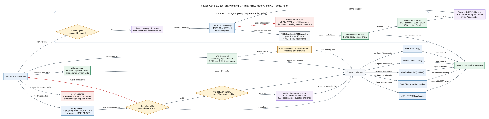

# Claude Code CLI 2.1.235 网络栈：代理、CA、mTLS 与 CCR 不是一个开关

在企业网络里，Claude Code 的“能不能连上”至少由四个平面共同决定：请求选不选择代理、客户端信不信服务端证书、服务端是否要求客户端证书、远程 CCR 环境是否强制经 policy egress relay。它们使用不同配置、缓存、失败恢复和 transport adapter。把它们统称为“代理问题”，会直接导致错误排查：例如 CA 正确但 `NO_PROXY` 绕过了代理，mTLS cert 已轮换但连接池仍拿着旧 material，或 MCP WebSocket 与普通 HTTP 走了不同 agent。

本文以 `2.1.235` 发布 bundle 为准。公开文档只用来解释产品意图；具体优先级、TTL、阈值和 fallback 都以目标版本 Static 证据为准。

## 60 秒理解：一条 HTTPS 请求要连续通过四个判断

**读者问题：** 设置了 `HTTPS_PROXY`、`NODE_EXTRA_CA_CERTS` 和 client cert 后，为什么主模型请求能成功，某个 MCP、AWS SDK、后台 Agent 或 OTLP exporter 仍可能失败？

**一句话模型：** 每个 transport 先选择自己的 proxy adapter，再组装 CA trust 与 mTLS client material；Remote CCR 还可能把子进程流量改写到本地 CONNECT relay，因此必须逐 transport 验证“路由、服务端信任、客户端身份、远端 policy”四层，而不能只检查环境变量存在。



贯穿场景：企业要求 Claude Code 通过 `https://proxy.corp:8443` 出网，代理使用内部 CA，Anthropic gateway 还要求 client certificate。CLI 启动时验证 proxy URL，加载 bundled/system/extra CA 与 cert/key；主 API `fetch` 经统一请求选项，Axios/undici、WebSocket 和 AWS SDK 各装配自己的 agent。若 session 运行在 Remote CCR，客户端又启动本地 `127.0.0.1` CONNECT relay，把子进程 HTTPS 隧道经 WebSocket 送到 hosted policy proxy，并把该 proxy CA 注入常见工具信任链。

| 状态平面 / owner | 解决的问题 | 关键输入 | 主要缓存/状态 | 常见误判 |
| --- | --- | --- | --- | --- |
| proxy routing | 请求经哪个中间节点 | `https_proxy`/`HTTPS_PROXY`/`http_proxy`/`HTTP_PROXY`、`NO_PROXY` | proxy agent cache、global dispatcher | 设置变量就等于所有库都使用 |
| CA trust | 客户端是否信任服务端/代理证书 | bundled/system store、`NODE_EXTRA_CA_CERTS` | CA aggregate cache | client cert 能替代 root CA |
| mTLS identity | 客户端向服务端证明什么身份 | cert/key/passphrase | last-good material、HTTPS agent | CA 信任成功就等于 mTLS 成功 |
| CCR policy relay | Remote 子进程流量是否经组织 egress policy | session ID/token、feature gate、relay CA | local relay、WS pool、tool trust state | 与普通 `HTTPS_PROXY` 完全同一实现 |
| telemetry exporter | Claude 自身 OTLP HTTP 如何建立 TLS | OTLP endpoint/protocol + 通用 proxy、CA、mTLS | `n1i() -> Kol()` programmatic agent | OTLP 专用 cert变量一定拥有 effective agent |

## 完整调用顺序：启动状态怎样进入一次请求

目标版本的初始化顺序可以压缩成：

```text
load/apply safe settings env
-> load NODE_EXTRA_CA_CERTS + mTLS material + other safe config
-> configure global mTLS view
-> validate selected proxy URL
-> configure Axios/undici/global agents
-> mark network configured
-> Remote + gate 时初始化 CCR agent proxy
-> 后续模型、MCP、AWS、WebSocket、子进程按各自 adapter 取配置
```

proxy URL validation发生在 global agents 安装前。选中的 proxy 值如果不是带 scheme 且含 host 的完整 URL，初始化抛配置错误，文案要求修复/取消该变量并 restart；不会静默把 `proxy.corp:8080` 当成合法 HTTP proxy。

1. settings/env owner 先应用受信的环境值，未信任 project helper 不执行。
2. CA owner 合并 bundled、system 与 extra roots；mTLS owner读取并校验 cert/key pair。
3. proxy selector 按小写到大写的固定顺序选择第一个非空值，并校验完整 URL。
4. global network setup清旧 agent/cache，为 fetch、Axios、undici、WebSocket、AWS 与 MCP装各自 adapter。
5. request-time adapter对目标 URL执行对应的 `NO_PROXY` matcher，决定直连或 proxy。
6. 使用 proxy 且收到 407 时，auth owner清 helper cache、保存 challenge，并把请求交回有界 retry。
7. TLS handshake使用 CA 验证服务端；配置 mTLS 时再发送 client certificate证明本地身份。
8. Remote CCR 条件成立时另建 loopback CONNECT relay；普通 transport 成功不会把 CCR/OTLP/子进程路径一并升级为已验证。

Static：主初始化位于 `reverse/javascript/cli.readable.js` 591165-591205；通用 proxy helper 位于 58199-58410。

## 第一层：普通 HTTP(S) proxy 如何选择

### 优先级是固定的“第一个非空值”

`Cut()` 按下面的数组顺序查找：

```text
https_proxy
HTTPS_PROXY
http_proxy
HTTP_PROXY
```

这不是“HTTPS 请求只看 HTTPS_PROXY、HTTP 请求只看 HTTP_PROXY”。本版先选出一个统一 proxy value，再交给各 adapter。因而同时配置大小写变量时，排在前面的值会遮蔽后面的值；排障必须打印**实际被选中的 source**，不能只确认 `HTTPS_PROXY` 存在。

`Vee()` 对选中值执行 URL parse 与 host 检查。非法值会去除控制字符后打印安全错误；初始化阶段再次检测并抛配置异常。完整格式示例：

```text
http://proxy.example.com:8080
```

Static：`reverse/javascript/cli.readable.js` 58199-58240、58390-58410。

### `NO_PROXY` 有两套相关但不相同的匹配器

普通应用层读取顺序是：

```text
no_proxy -> NO_PROXY
```

`Fie(url)` 支持：

| 写法 | 匹配语义 |
| --- | --- |
| `*` | 所有目标绕过 proxy |
| `example.com` | 精确 hostname |
| `example.com:8443` | 精确 host + effective port |
| `.example.com` | apex `example.com` 或任意该域后缀 |
| 逗号/空白分隔 | 多条规则 |

普通 matcher 不把任意 glob、CIDR 当作域名规则。CCR/fallback 路径另有 `M3s()`：先复用普通匹配，再对 URL hostname 为 IP 的情况支持 CIDR 和单 IP。两个 matcher 共存，是因为普通 app proxy 与 Remote relay 的 bypass/直连边界不同。

这也是为什么“在 `NO_PROXY` 写了 CIDR”不能不加限定地说对所有请求都有效。

Static：`reverse/javascript/cli.readable.js` 58240-58285。

## 不同 transport 怎样消费 proxy、CA 与 mTLS

### 主请求与通用 `fetch`：`mg()`

`mg({url,forAnthropicAPI,...})` 组装 Bun/fetch 请求选项：

1. Anthropic API 可应用 idle-timeout 和 Unix socket 特例。
2. 有合法普通 proxy 时，先检查 `NO_PROXY`；否则设置 proxy URL。
3. proxy auth cache 有值时加入 `Proxy-Authorization` header。
4. 无普通 proxy但调用者提供 `fallbackProxy` 时，使用 CCR fallback URL/CA，并用增强 IP/CIDR matcher 判断 bypass。
5. 无论直连还是代理，都合并 `j7t()` 返回的 CA/mTLS TLS options。

### Axios 与 undici：`Qde()`

`Qde()` 不是简单设置一个全局变量。它会：

- 清理旧 Axios interceptor 和 agent；
- 普通 proxy 存在时关闭 Axios 内建 proxy 解析，给请求按 `NO_PROXY` 选择 direct 或 `HttpsProxyAgent`；
- 给 undici 安装 `EnvHttpProxyAgent` global dispatcher；
- proxy 消失时恢复新的 undici `Agent`；
- 直连分支仍可使用 mTLS/CA HTTPS agent。

因此 settings/cert 变化后，代码必须同时清 agent cache 与重装 global agents，不能只更新 `process.env`。

### WebSocket：`FW()` + `MW()`

MCP/IDE WebSocket 分别读取：

- `FW(url)`：普通 proxy URL，受普通 `NO_PROXY` 影响；
- `MW()`：mTLS cert/key/passphrase 与 CA aggregate。

WebSocket constructor 拿到 `proxy` 与 `tls` 两组独立 option。HTTP transport 成功不代表 WS upgrade 一定使用同一路径。

### AWS SDK：专用 `NodeHttpHandler`

AWS provider helper 通过 `uYt()` 构造 Smithy `NodeHttpHandler`，把同一个 `HttpsProxyAgent` 放到 `httpAgent` 与 `httpsAgent`，并可配置 request timeout。它不是 Axios global agent 的副作用。

### MCP：transport 类型决定 adapter

| MCP transport | 网络路径 |
| --- | --- |
| HTTP / SSE | `CBt(url)` -> `mg()`；无普通 proxy 时可读取 agent-proxy env 作为 fallback |
| WS / WS-IDE | `FW(url)` + `MW()` |
| stdio | 子进程 env 来自 `tM()` 或 Remote `rPt()`，可继承 CCR proxy/CA env |
| in-process / SDK 特例 | 按各自实现，不应从 stdio/HTTP 结论外推 |

Static：通用 adapter 位于 `reverse/javascript/cli.readable.js` 58285-58410；MCP fallback/transport 位于 371455-371468、385585-385648。

## Proxy authentication helper：缓存的是 header value，不是永久登录

settings 中的 `proxyAuthHelper` 是一个 shell command，输出完整 `Proxy-Authorization` header value。它只有在 `CLAUDE_CODE_ENABLE_PROXY_AUTH_HELPER` feature env 开启时才被消费。

### Trust gate

如果 helper 来自 project/local settings，且 workspace trust 尚未接受，客户端跳过执行并记录 warning。user/managed 等可信来源不走这条 project trust 阻断。这样可以避免刚进入一个不受信 workspace 就执行仓库提供的认证命令。

### TTL、timeout 与输入

| 项目 | 默认值/内容 |
| --- | --- |
| cache TTL | `300000 ms`（5 分钟），可由 feature env 覆盖为非负值 |
| helper process timeout | `30000 ms` |
| `CLAUDE_CODE_PROXY_URL` | 当前选中的 proxy URL |
| `CLAUDE_CODE_PROXY_HOST` | proxy hostname |
| `CLAUDE_CODE_PROXY_AUTHENTICATE` | 最近一次 407 的 `Proxy-Authenticate` challenge，若有 |

helper 成功输出会 trim 后缓存。执行失败、timeout 或空输出时，客户端打印错误；如果已有旧缓存值，会返回旧值而不是立刻清空。这是可用性优先的 last-known-value 策略，代价是短时间内可能继续尝试过期 credential。

### 407 如何触发刷新

请求分类器看到 `status === 407` 且 helper 启用时：

1. 读取响应 `proxy-authenticate`；
2. 清空 auth cache；
3. 保存 challenge；
4. 把错误归为可重试；
5. 下一次 helper 调用携带 `CLAUDE_CODE_PROXY_AUTHENTICATE` 重取 header。

所以 helper 不是固定启动脚本，而是带 challenge 的认证状态机。

Static：`reverse/javascript/cli.readable.js` 58295-58340、215830-215860、432244-432245。

## 第二层：CA store 如何组成服务端信任

### 默认是 bundled + system

`CLAUDE_CODE_CERT_STORE` 只接受两个 token：

```text
bundled
system
```

默认顺序包含二者。值可用逗号组合、去重；未知 token 被 warning 后忽略。如果全部 token 都无效，回退默认，而不是得到空 trust store。

CLI flag `--use-system-ca` 与 `--use-openssl-ca` 在这一应用层都映射为 `['system']`。名称不同不代表这里保留了两套 store 实现。

### system store 会过滤过期证书

当 runtime 提供 `tls.getCACertificates('system')` 时，客户端解析每张 X.509 的 `validTo`，丢弃明确过期证书并记录 dropped count。无法解析为 X.509 的条目被保留，避免把未知格式误判为过期。

fallback 规则：

| 状态 | 行为 |
| --- | --- |
| 只选 system，但 runtime 没有 system CA API | 返回 undefined，交给 runtime 默认行为 |
| system API 返回空，且未选 bundled | 加入 bundled roots |
| system API 抛错，且未选 bundled | 记录错误并加入 bundled roots |
| 同时选 bundled + system | 合并两组，system 空/失败时仍有 bundled |

这说明“system store 失败”不必然造成完全无 CA；也不能把 fallback 写成 system 读取成功。

### `NODE_EXTRA_CA_CERTS` 可来自环境或 settings env

初始化先应用受信 settings env，并有 config fallback 查找 `NODE_EXTRA_CA_CERTS`。loader 读取整个文件内容，按 path + content 维护 cache；文件变化、路径变化或变量清除会清 CA aggregate cache。

CA aggregate 最终是：

```text
selected bundled roots
+ non-expired system roots
+ NODE_EXTRA_CA_CERTS file content
```

读取 extra file 失败会记录 error；如果之前已有 extra cache，会清掉旧值并使 aggregate 重新计算，避免无限沿用已删除文件。

Static：`reverse/javascript/cli.readable.js` 43941-44040、589760-589785、273155-273168。

## 第三层：mTLS client cert/key 的加载与轮换

CA 回答“我信不信对方”；mTLS cert/key 回答“对方是否信任我”。本版通过：

- `CLAUDE_CODE_CLIENT_CERT`；
- `CLAUDE_CODE_CLIENT_KEY`；
- `CLAUDE_CODE_CLIENT_KEY_PASSPHRASE`；

配置客户端身份。

### 输入防线

每个 cert/key 文件必须：

1. 是 regular file；
2. 大小不超过 `1048576` bytes（1 MiB）；
3. 包含完整 `-----BEGIN ...-----` / `-----END ...-----` PEM block。

超限、非文件、读取失败或不完整 PEM 都被忽略并记录 error。passphrase 被直接交给 Node private-key loader。

### cert/key 配对检查

异步 reload 同时读取 cert 与 key，再用 private key 检查证书块是否匹配。若配置声明了路径但某一边读取失败，或读到了一组不匹配 material，客户端把这次状态标为 `readFailed/mismatched`。

关键恢复策略是 **last-good retention**：

- 中途轮换时先写 cert、后写 key，短暂不匹配，不会立即把 working material 替换成坏 pair；
- 单个文件暂时不可读时，保留此前 `RKe/xKe`；
- 只有新 pair 可接受时才更新 cache，并清理 mTLS HTTPS agent。

这避免证书轮换的非原子文件更新瞬间击穿所有新连接，但也意味着排障时“磁盘已经是新证书”不代表进程已采用新证书。

### stale connection 触发 reload

API 错误分类把常见 socket/TLS code、`EPROTO`、`FailedToOpenSocket`、`ERR_OSSL_*`、`ERR_SSL_*` 识别为 stale-connection 候选。若 client cert 已配置，且没有设置 `CLAUDE_CODE_DISABLE_MTLS_RELOAD_ON_STALE_CONNECTION`：

1. 重新读取 cert/key；
2. material changed 时清 proxy agent cache并重装 global agents；
3. read failed/mismatched 时保留 last-good 并记录分类；
4. 成功变化时记录 reload success，再由上层 retry 逻辑继续。

settings env 热更新也会清 CA/mTLS/proxy cache，再异步重读并重新配置 agent。

Static：`reverse/javascript/cli.readable.js` 44197-44307、215568-215590、273155-273168。

## 第四层：Remote CCR agent proxy 是另一套 policy relay

普通 `HTTPS_PROXY` 路径把请求交给用户/企业指定 proxy。CCR agent proxy 则是 Remote session 的受控 egress 设施：本机/容器内启动一个 loopback HTTP relay，只接受 HTTPS CONNECT，再把 tunnel 数据经 WebSocket 送到 hosted agent proxy。

### 启用 gate 与敏感输入收口

初始化必须同时满足：

1. `CLAUDE_CODE_REMOTE` 为真；
2. `CCR_AGENT_PROXY_ENABLED` gate 开启；
3. 有 `CLAUDE_CODE_REMOTE_SESSION_ID`；
4. 能从 session token file、session ingress auth 或专用 auth token 得到 token。

`AGENT_PROXY_URL`、`AGENT_PROXY_AUTH_TOKEN`、relay mode 与 include hosts 在函数入口读取后立即从环境 accessor unset。token file 在 relay 成功启动后尝试 unlink。这样后续普通子进程不会自然继承 bootstrap secret；它们只得到 loopback proxy URL、CA path 和必要的工具适配 env。

缺 session ID/token 时 agent proxy disabled，并记录具体 init reason。主初始化 catch 会 warning 后继续，不把普通 CLI 启动自动等同于 Remote proxy 成功。

Static：`reverse/javascript/cli.readable.js` 590701-590830、591185-591205。

### 本地 relay 只接受 HTTPS CONNECT

loopback listener 解析第一段 HTTP header：

- client 直接向 relay port 发 TLS bytes：关闭，并提示 `HTTPS_PROXY` 必须是 `http://` URL；
- header 在结束标记前超过 `8 KiB`：返回 400；
- `GET /__agentproxy/status`：返回当前 proxy/trust/recent failures JSON；
- 不是 `CONNECT host:port HTTP/1.x`：返回 `405 Method Not Allowed`；
- 合法 CONNECT：选择 hosted tunnel 或 selective direct path。

因此把同一 relay 填到 `HTTP_PROXY` 让工具发送 absolute-form plain HTTP，会得到 405。本版内置诊断特别点名旧 Axios HTTPS proxy 行为和只读 `HTTP_PROXY` 的工具。

### 流控、重试与池阈值

| 字段 | 2.1.235 值 | 作用 |
| --- | ---: | --- |
| CONNECT header cap | `8192` bytes | 防止无界 header buffer |
| pending data cap | `33554432` bytes（32 MiB） | tunnel 未建立/暂停时的请求缓存上限 |
| WebSocket pool max | `4` | 可复用 tunnel 数 |
| open timeout | `10000 ms` | 单次 open/pooled response deadline |
| open max attempts | `3` | fresh WS 建立上限 |
| backoff base | `100 ms` | 指数退避起点 |
| send high water | `4194304` bytes（4 MiB） | 超过后暂停 client drain |
| send low water | `1048576` bytes（1 MiB） | 低于后恢复发送 |
| drain poll | `50 ms` | bufferedAmount 检查间隔 |
| pool idle TTL | `10000 ms` | idle tunnel 回收 |
| pool max age | `2700000 ms`（45 分钟） | tunnel 最大寿命 |
| FIN grace | `10000 ms` | half-close 收尾窗口 |
| recent failures | `20` 条 | status endpoint 的诊断环形记录 |

pending cap 或 open attempts 耗尽会关闭当前 client request并返回 502/错误记录；它不会无限堆内存或永久等待 hosted relay。

Static：`reverse/javascript/cli.readable.js` 589940-590506。

### selective relay 不是任意直连

selective mode 可以让 include hosts 走 hosted tunnel、未列出 host 走 normal networking。include list 为空/无法解析时客户端明确 **fail closed to tunnel-all**，避免错误配置静默放开全部直连。

直连分支还检查 localhost、link-local、metadata endpoints、非 canonical IP、IPv6 非 global 等目标，并在 DNS connect 后再次检查 resolved peer，降低通过域名解析绕过 SSRF/metadata 边界的风险。

### CA 与工具适配是 best effort，不是“所有工具必然生效”

CCR 下载 policy proxy CA，与 system/customer CA 合成 bundle，然后尝试配置：

- `SSL_CERT_FILE`、`NODE_EXTRA_CA_CERTS`、Requests/AWS/Cargo/pip 等常见 CA env；
- system trust store；
- JVM PKCS#12 truststore 与 `JAVA_TOOL_OPTIONS`；
- Bazel system bazelrc，因为 Bazel embedded JDK 可忽略 `JAVA_TOOL_OPTIONS`；
- browser NSS DB；
- gsutil/boto config；
- Git proxy/CA config 或 session-scoped `gh` shim（按 gate）。

每个适配都可能失败。状态对象用 `javaTrustStorePath`、`toolTrustFailureCodes`、`gitConfigConflicts` 等字段暴露实际结果；缺 keytool、certutil、不可写系统目录或工具自己的 config 都可能让某个客户端不信 CA。

Static：`reverse/javascript/cli.readable.js` 590500-590830、590947-591130。

### 明确不支持的协议/客户端

本版生成的 CCR 诊断 README 明列：

- gRPC / HTTP2-only APIs；
- WebSocket upgrade；
- client mTLS；
- certificate-pinned clients；
- non-443 HTTPS ports；
- raw TCP databases。

这里描述的是 **CCR CONNECT/WebSocket policy relay 的支持边界**，不是说 Claude Code 通用网络栈永远不能使用这些协议。例如普通 MCP WebSocket 有独立 `FW/MW` 路径；只是不能把它穿过这套 CCR relay并宣称受支持。

## 子进程和 MCP 为什么看不到 Claude 自身 OTLP 配置

普通 tool/MCP stdio 子进程 env builder 会删除所有 `OTEL_*`，同时删除 `CLAUDE_CODE_OTEL_DIAG_STDERR`。后台 exec 模式还会更广泛地 scrub `CLAUDE_*` 与 `OTEL_*`。

目的不是关闭 Claude Code 自己的 telemetry，而是避免把 CLI 的 collector endpoint、headers、resource attributes 和采样/内容开关泄露给任意 Bash/MCP child，或让 child 的 OpenTelemetry SDK 意外向同一个 collector 发数据。

Remote 子进程所需的 proxy/CA env 由 agent proxy env provider重新注入，因此“删除 OTEL”与“保留受控出网”是两条独立规则。

Static：`reverse/javascript/cli.readable.js` 93505-93530、421865-421885。

## OTLP 库有独立 TLS 变量，但 2.1.235 的有效 agent 由 Claude 覆盖

bundled OTLP HTTP library 确实读取：

- `OTEL_EXPORTER_OTLP_<SIGNAL>_CERTIFICATE` / 通用 certificate；
- `..._CLIENT_CERTIFICATE`；
- `..._CLIENT_KEY`；

并为这些值构造 environment `agentFactory`。OTLP gRPC exporter也读取同类文件，按 endpoint scheme或 insecure flag创建 gRPC credentials。只读到这里，会得出“OTLP 使用自己独立 CA/mTLS agent”的结论，但这不是 2.1.235 HTTP exporter 的最终合并结果。

Claude Code 在 `n1i("logs")` 返回的 programmatic options 里无条件写入 `httpAgentOptions = Kol(endpoint)`；legacy converter把它变成 programmatic `agentFactory`。OTLP merge 的顺序是：

```text
programmatic agentFactory ?? environment agentFactory ?? default agentFactory
```

因此 environment parser 虽然读到了 `OTEL_EXPORTER_OTLP_*_CERTIFICATE/CLIENT_*`，它生成的 factory 排在 Claude 注入的 `Kol()` 后面。HTTP logs 的有效 routing/TLS owner 实际回到 Claude 通用网络配置：`https_proxy/HTTPS_PROXY`、`NODE_EXTRA_CA_CERTS` 与 `CLAUDE_CODE_CLIENT_CERT/KEY`。这条结论只适用于本版由 `n1i()` 构造的 HTTP exporter；gRPC credentials 仍是另一条实现。

Static：环境 TLS parser见 `reverse/javascript/cli.readable.js` 345993-346015；merge precedence见 345748-345764；Claude programmatic agent见 361719-361737；gRPC credentials见 357461-357496。下面的 exact-binary Probe 验证 HTTP logs 的有效 owner。

## 设置热更新和证书轮换的状态转换

settings manager 在重新应用 env 时，先保存旧的 `NODE_EXTRA_CA_CERTS`、client cert、client key，再合并各来源。之后：

1. 无条件清 CA aggregate cache；
2. 判断已加载 mTLS path 与新 env 是否偏离；
3. 清 mTLS cache或暂时保留 last-good；
4. 清 proxy agent cache并调用 `Qde()`；
5. 异步 `loadExtraCACerts()` + `loadMTLSClientMaterial()`；
6. 任一 material 实际变化后再次清 cache/重装 agents。

这是一种“两阶段刷新”：先使新请求不再盲用旧 aggregate，再异步确认文件 material；轮换中途失败时 mTLS last-good 防止瞬时全断。代价是短窗口内状态较复杂，日志和 loaded-path fields 比单看 env 更可靠。

Static：`reverse/javascript/cli.readable.js` 273155-273168。

## 精确二进制 Probe：主 Messages HTTPS 路径

[`network-proxy-tls.json`](runtime-probes/network-proxy-tls.json) 对 SHA-256 固定为 `83b8f806f6f2eea316cfe246628e6c23374711d868f1fd0409db551b877b7748` 的 `2.1.235` 二进制建立本地 HTTPS Messages service、两个 CONNECT proxy、一日测试 CA 和 client certificate。所有证书只在临时目录生成，没有外部账号或企业 PKI 参与。

| 受控运行 | 输入 | literal result / exit | 外部观测 | 证明边界 |
| --- | --- | --- | --- | --- |
| CA 缺失 | `NO_PROXY=localhost`，不提供 extra CA | `Self-signed certificate detected...` / `1` | HTTPS server 零 HTTP marker | TLS 在 HTTP handler 前拒绝；不证明其他 transport 错误文案 |
| extra CA | `NODE_EXTRA_CA_CERTS=$CA` | `NETWORK_OK` / `0` | server 收到一次 Messages POST | 主 Messages transport 采用 extra CA |
| proxy precedence | `https_proxy=$A`、`HTTPS_PROXY=$B`、无 bypass | `NETWORK_OK` / `0` | 只有 lowercase proxy A 收到 `CONNECT localhost:$PORT` | 小写值遮蔽大写值；仅证明该 transport |
| `NO_PROXY` | 两个 proxy 仍设置，`no_proxy=localhost` | `NETWORK_OK` / `0` | 两个 proxy 的 CONNECT 数均不增加 | 普通 hostname bypass 在主 Messages transport 生效 |
| 非法 proxy | `https_proxy=proxy.invalid:8080` | 进程失败 / `1` | API server 零 marker | 缺 scheme 配置 fail closed，未发送受控请求 |
| mTLS | extra CA + `CLAUDE_CODE_CLIENT_CERT/KEY` | `MTLS_OK` / `0` | server 观察 `authorized=true`、CN=`Claude Probe Client` | 证明 client material 进入本地 TLS handshake |

报告的 14 个 checks 全为 true。专属 validator 交叉校验版本/SHA、命令与 marker、exit/result、API 命中、proxy A/B、mTLS peer 和四条 Boundary；22 种字段/结构伪造全部被拒绝。

**不能外推：** 这组 Probe 只覆盖主 Messages HTTPS transport。Axios、undici global dispatcher、WebSocket、AWS SDK、MCP、子进程和 CCR relay 仍需分别建立 wire Probe；OTLP 由下一组独立报告验证。client cert 成功也不证明企业证书签发、轮换或撤销。

## 精确二进制 Probe：OTLP HTTP logs 的有效 CA、mTLS 与 proxy owner

[`otlp-tls.json`](runtime-probes/otlp-tls.json) 用同一 SHA-256 的 `2.1.235` 二进制运行 15 个互相隔离的 CLI 进程。本地 Messages stub只负责让 Agent 正常结束；另建普通 HTTPS、TLS 1.2、强制 mTLS collector和两个 CONNECT proxy。Node 原生客户端先对三种 collector逐一 POST并得到 200，避免把坏夹具归咎于 Claude。

| 对照 | 配置与外部观测 | 结论 |
| --- | --- | --- |
| 无额外 CA | collector 没有 HTTP request；TLS server记录 `ERR_SSL_DECRYPTION_FAILED_OR_BAD_RECORD_MAC` | 该受控自签 collector不可达，但 Agent task仍 success/exit 0 |
| signal/common OTLP CA | `OTEL_EXPORTER_OTLP_LOGS_CERTIFICATE`、通用 `..._CERTIFICATE` 均零 HTTP；JSON、protobuf、TLS 1.2、IP SAN和 signal-over-wrong-common对照不改变结果 | library environment agent没有成为 effective agent；不能把变量“被读取”写成证书已生效 |
| Claude global CA | `NODE_EXTRA_CA_CERTS=$CA` 后 collector收到 `POST /v1/logs`、`application/json` | `Kol()` 的通用 CA owner真实生效 |
| OTLP client pair | 配置 `OTEL_EXPORTER_OTLP_LOGS_CLIENT_CERTIFICATE/KEY` 后 mTLS server仍记录 `ERR_SSL_PEER_DID_NOT_RETURN_A_CERTIFICATE` | library client pair没有进入 effective HTTP agent |
| Claude client pair | `CLAUDE_CODE_CLIENT_CERT/KEY` 后 collector记录 `authorized=true`、CN=`Claude OTLP Probe Client`；只给 cert 不给 key仍在 HTTP前拒绝 | 通用 mTLS owner进入 OTLP HTTP handshake，且 pair不能拆开 |
| proxy precedence | endpoint使用 `collector.invalid`，小写/大写 proxy冲突；只有小写 proxy收到 `CONNECT collector.invalid:$TLS_PORT`，collector POST成功 | OTLP HTTP继承通用 proxy selector，小写值获胜 |

30 个 required checks全部为 true；26 类伪造会被专属 validator拒绝，包括把 signal-specific CA伪造成成功、把 OTLP client pair伪造成已发送、篡改 mTLS CN或把 collector CONNECT改标为大写 proxy。两次报告去掉 `capturedAt` 后 SHA-256一致。

三个边界必须保留。第一，正向结果覆盖 HTTP/JSON logs；protobuf臂只用于证明 agent precedence，没有建立完整 protobuf成功合同。第二，gRPC、metrics、traces、collector retention/remote delivery和 CCR relay未由该报告验证。第三，`NODE_TLS_REJECT_UNAUTHORIZED=0` 只是诊断对照，不能作为修复方案或可接受安全姿态。

## 成功、失败与恢复矩阵

| 症状 | 更可能的问题层 | 当前实现行为 | 恢复/验证 |
| --- | --- | --- | --- |
| 启动时报 invalid proxy URL | routing config | 初始化拒绝不完整 URL | 修成含 scheme/host 的 URL，restart |
| 主 API 直连但预期走 proxy | precedence/NO_PROXY | 更高优先级变量或 matcher 绕过 | 打印四变量与实际 selected source；逐条检查 matcher |
| 407 后反复失败 | proxy auth | challenge 触发 helper cache clear/retry；失败可沿用旧值 | 检查 helper trust、30s timeout、challenge 输入和输出 header |
| 自签 CA 错误 | server trust | tool 未读取 aggregate/env/system trust | 对应 transport 检查 agent；CCR 查 status 的 trust failure codes |
| cert/key 轮换后仍是旧身份 | mTLS cache | 新 material 不完整/不匹配时保留 last-good | 原子发布 pair；触发/观察 reload 与 loaded paths |
| TLS stale error 后恢复 | mTLS reload | 重新读取 material，变化时重建 agents | 检查 reload event；确认没有 disable env |
| MCP HTTP 成功、WS 失败 | transport split | HTTP 用 `mg/CBt`，WS 用 `FW/MW` | 分别验证 proxy 与 TLS option；不要只测一个 transport |
| CCR proxy 返回 405 | protocol mismatch | relay 只接受 HTTPS CONNECT | 不给该工具设置 plain `HTTP_PROXY`；升级/配置正确 HTTPS proxy 支持 |
| CCR status 有 `toolTrustFailureCodes` | tool adapter | CA bundle存在，但 JVM/NSS/Bazel/boto 某项未配置 | 按 code 修工具信任；不要关闭 TLS verification |
| CCR startup probe failed | hosted relay unreachable | local relay启动但 traffic 可 502；主 init继续 | 检查到 CCR base URL 的 egress和 status endpoint |
| gRPC/WS/client-mTLS/raw TCP 试图走 CCR relay | unsupported transport | CONNECT relay不把这些协议升级为受支持 | 改用独立 transport；不能靠重试或关闭 TLS verification 恢复 |
| OTLP exporter连不上 | effective agent/TLS | HTTP exporter的 programmatic `Kol()` 遮蔽 library env agent；失败不终止 Agent task | 2.1.235 检查通用 `NODE_EXTRA_CA_CERTS`、`CLAUDE_CODE_CLIENT_CERT/KEY` 和 proxy；不要假设 OTLP 专用 cert变量生效 |
| 子进程看不到 `OTEL_*` | env scrub，非 bug | CLI 主动删除，防止 telemetry config 继承 | 给子进程显式配置它自己的 telemetry，不依赖继承 |

## 隐私、安全、性能与运维成本

### 安全收益

- 完整 proxy URL validation 避免把 malformed config带进不同库产生不一致路由。
- project/local `proxyAuthHelper` 在 workspace trust 前不执行，降低仓库配置命令注入风险。
- CA store过滤过期 system cert；mTLS 文件有 1 MiB/regular-file/PEM 防线。
- cert/key mid-rotation保留 last-good，降低非原子部署造成全局中断。
- CCR bootstrap token从 env unset、token file删除，子进程只拿最小 relay配置。
- CCR relay限制 header、pending buffer、pool、age 和 retry，并阻止 metadata/local target 的不安全直连。
- `OTEL_*` 不继承给任意工具进程，减少 collector credential/endpoint 泄露。

### 隐私边界

- 普通 forward proxy至少可见目标 metadata；TLS MITM/CCR policy proxy在重新终止 TLS 时可见 HTTPS host、headers 和 body。组织应把 proxy/operator/log retention 当作高敏感数据处理。
- client key 与 passphrase留在 Claude Code 进程/agent option；helper 输出的 Proxy-Authorization header在 TTL 内驻留内存。
- CCR CA/trust setup会写 session state、JVM truststore、NSS/boto/Bazel 配置；这些路径及 failure status 会成为运维痕迹。
- dummy `proxy-injected` tokens用于让特定工具把请求送到 policy relay，不能当成真实 GitHub/AWS/Google credential，也不能泄漏到直连目标。

### 性能与可用性成本

- proxy/CA/mTLS 不直接改变逻辑 prompt token，但握手失败和 retry 可能重复发送同一请求、增加延迟与潜在费用；服务端是否对失败 attempt 计费仍是 Boundary。
- proxy 多一跳，CCR 又增加 loopback CONNECT + WebSocket tunnel + hosted egress；延迟和带宽背压都高于直连。
- CA aggregate、mTLS parse、system trust/JVM/NSS安装主要发生在启动/刷新，缓存降低稳态成本，但轮换会重建连接池。
- helper 最长占用 30 秒；407 还会增加至少一次 retry。
- CCR pending 上限 32 MiB、pool 4 和 4/1 MiB 水位保护内存，但大型上传或高并发工具会更早遇到背压。
- 不支持 gRPC/WS/client-mTLS/raw TCP 意味着某些工具不是“配置一下 CA”就能恢复，需要换 transport 或由管理员提供独立路径。

### 外部副作用

CCR/tool-trust setup 可能写 system trust、JVM truststore、NSS、boto、Bazel 和 Git 配置；proxyAuthHelper 又会执行外部命令。这些副作用不因一次 Messages 请求失败而自动撤销，必须按 adapter 的 status/failure code 清理或补偿。

## 证据分层

| 标签 | 本章使用方式 | 能证明什么 | 不能证明什么 |
| --- | --- | --- | --- |
| `Public` | [官方网络配置摘录](public-source-excerpts.md#public-background-network-settings) | 当前公开产品要求背景 session 从 settings env获取一致网络配置 | 不证明 2.1.235 每个 transport 的 adapter 与阈值 |
| `Static` | proxy/CA/mTLS/CCR/MCP/OTLP 的目标 bundle 调用链 | 本版优先级、TTL、caps、fallback、env scrub和失败分支 | 某企业 proxy/CA/CCR 服务当前可达 |
| `Probe` | 精确二进制 Messages 与 OTLP HTTP logs 两组 HTTPS/CONNECT/CA/mTLS 场景；另引用 sandbox network Probe | 两个 transport 的有效 CA/mTLS owner、proxy precedence及失败隔离 | 407 helper、轮换、Axios/WS/AWS/MCP/OTLP gRPC/CCR transport |
| `Boundary` | server policy、真实企业 PKI、Remote entitlement、exporter proxy behavior | 明确哪些结论仍需现场触发 | 不代表代码路径不存在 |

## 关键源码定位

| 主题 | `reverse/javascript/cli.readable.js` |
| --- | --- |
| proxy precedence、URL validation、NO_PROXY、helper、global agents | [58199-58410](../reverse/javascript/cli.readable.js#L58199) |
| CA store、过期过滤、extra CA cache | [43941-44040](../reverse/javascript/cli.readable.js#L43941) |
| mTLS file loading、pair validation、last-good、agents | [44197-44307](../reverse/javascript/cli.readable.js#L44197) |
| stale TLS error后的 mTLS reload | [215568-215590](../reverse/javascript/cli.readable.js#L215568) |
| settings env热更新与 cache/agent重建 | [273155-273168](../reverse/javascript/cli.readable.js#L273155) |
| CCR relay parser、pool、limits、flow control | [589940-590506](../reverse/javascript/cli.readable.js#L589940) |
| CCR trust adapters、gate、env输出与诊断 | [590500-591174](../reverse/javascript/cli.readable.js#L590500) |
| 主初始化顺序 | [591165-591205](../reverse/javascript/cli.readable.js#L591165) |
| MCP agent-proxy fallback | [371455-371468](../reverse/javascript/cli.readable.js#L371455) |
| MCP HTTP/SSE/WS/stdio transports | [385585-385648](../reverse/javascript/cli.readable.js#L385585) |
| child env OTEL scrub | [93505-93530](../reverse/javascript/cli.readable.js#L93505)、[421865-421885](../reverse/javascript/cli.readable.js#L421865) |
| OTLP HTTP TLS material | [345993-346015](../reverse/javascript/cli.readable.js#L345993) |
| OTLP HTTP agent merge precedence | [345748-345764](../reverse/javascript/cli.readable.js#L345748) |
| Claude OTLP programmatic `Kol()` agent | [361719-361737](../reverse/javascript/cli.readable.js#L361719) |
| OTLP gRPC credentials | [357461-357496](../reverse/javascript/cli.readable.js#L357461) |

## 后续版本交叉对比清单

每次新版本至少比较：

1. 四个 proxy env 的优先级和 URL validation 是否变化。
2. 普通 `NO_PROXY` 与 CCR CIDR matcher 是否合并、扩展或改变端口语义。
3. `mg()`、Axios、undici、WebSocket、AWS、MCP 各 adapter 是否仍共享同一配置源。
4. proxyAuthHelper gate、workspace trust、TTL、timeout、407 challenge与旧值 fallback。
5. CA store token、默认组合、system API fallback、过期过滤与 extra CA reload。
6. mTLS 文件上限、PEM/pair validation、last-good 与 stale reload触发码。
7. settings reload时 cache clear/reinstall agents的顺序。
8. CCR enable gate、bootstrap secret unset/unlink和 selective fail-closed行为。
9. CONNECT parser、status endpoint、header/pending/pool/watermark/age/retry阈值。
10. system/JVM/Bazel/NSS/boto/Git/gh trust适配及 failure code。
11. CCR unsupported protocol清单是否缩小或扩大。
12. MCP各 transport与 stdio env inheritance 是否变化。
13. child process `OTEL_*` scrub是否仍存在，是否增加其他敏感 family。
14. OTLP HTTP是否仍由 `n1i() -> Kol()` 覆盖 library env agent；OTLP专用 cert变量是否开始变成 effective配置。
15. OTLP logs的 proxy precedence、Claude global CA/mTLS owner与失败隔离是否变化；gRPC/metrics/traces需另做 wire Probe。

真正的网络验收应为每个 transport记录：实际目标、selected proxy、NO_PROXY判定、CA来源、client cert fingerprint、请求次数、literal错误/响应和外部服务命中。环境变量清单只能证明配置输入，不能证明最终路由。
