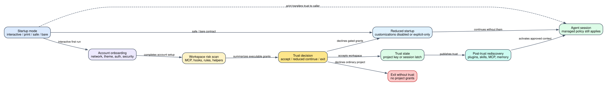

# Claude Code CLI 2.1.235 首次启动、工作区信任与安全启动：项目配置什么时候才真正生效

> 版本：`2.1.235` | 主证据：目标版本可读化 bundle 的 `Static` 启动路径 | 运行边界：`--print`、`--safe-mode`、`--bare` 是三种不同责任模型，不应合并成“安全模式”

**读者问题：** 克隆一个带 `.claude/settings.json`、hooks、MCP 和 skills 的仓库后，Claude Code 会不会在用户确认前就执行项目里的命令；`--print`、`--safe-mode`、`--bare` 又分别还剩下什么能力？

**一句话模型：** 交互启动先完成账号级 onboarding，再扫描项目配置中可能执行命令、扩大目录或预授权工具的能力，只有 workspace trust 被接受后才重新发现并启用项目定制；safe mode、bare mode 和 noninteractive 只是从不同位置缩小或转移这条信任责任。

图的核心结论是：**trust dialog 不是一句免责声明，而是项目级配置从“可见但隔离”进入“可以影响执行”的状态转换。**

## 60 秒看懂一个不可信仓库的首次启动

贯穿场景：开发者刚克隆一个陌生仓库，里面包含：

- `.claude/settings.json`：预允许 `Bash(git *)`，加入一个额外目录；
- `.claude/settings.local.json`：配置 `apiKeyHelper` 和危险环境变量；
- `.mcp.json`：一个 stdio MCP server；
- project skill：frontmatter 允许 Bash；
- hook/status line：可启动外部命令。

普通交互启动的顺序是：

1. 首次账号 onboarding 依次处理网络 preflight、theme、自定义 API key、OAuth、安全说明和 terminal setup。
2. trust scanner 汇总 MCP、hooks、allow rules、additional directories、credential helpers、dangerous env、auto-memory、Bash-capable skill/command。
3. 对话框先告诉用户当前目录可读、可写、可执行，再单独列出“确认后无需再次询问”的权限和额外目录。
4. 用户接受后，普通项目把 `hasTrustDialogAccepted` 写入项目配置；home directory 只设置当前 session latch。
5. CLI 标记当前 session trusted，并重新发现 project skills/plugins、MCP approvals、external `CLAUDE.md` includes 和 memory watcher。
6. 用户拒绝时，普通项目退出；存在 gated grants 的特殊 backstop 可以继续，但不启用这些项目授权。

### 启动前后哪些对象变化

| Object | Before | Transformation | After | User-visible effect |
| --- | --- | --- | --- | --- |
| global onboarding | 未完成 | preflight、theme、auth、安全提示、terminal setup | `hasCompletedOnboarding=true` + version | 下次启动不重复完整向导 |
| workspace trust | 项目配置存在但未获授权 | scanner 汇总可执行/扩权 surface | persisted project trust 或 session-only trust | 项目 hooks/MCP/allow rules 是否可进入会话 |
| project customization | 初始发现可能被 gate | trust 后重新发现 | skills/plugins/MCP/CLAUDE.md 进入有效集合 | slash command、工具和上下文发生变化 |
| managed policy | 启动前已加载 | safe/bare/trust 规则与 policy 合并 | policy 能继续限制或提供 managed hooks | 用户确认不能覆盖管理员 deny |
| mode responsibility | interactive / print / safe / bare | 各模式选择不同装载矩阵 | 用户、调用方或 policy 成为剩余信任 owner | “没弹框”不等于同一种隔离 |
| memory watcher | trust 前不应消费项目 memory | trust 后且非 remote/bare 时启动 | 监听已获信任的 memory source | 后续 prompt context 可包含项目 memory |

## 第一条原则：账号 onboarding 与 workspace trust 是两份状态

| State | Scope | 写入位置/寿命 | 解决的问题 |
| --- | --- | --- | --- |
| `hasCompletedOnboarding` | 全局账号/安装体验 | global config，带 `lastOnboardingVersion` | 用户是否走过产品、认证和安全介绍 |
| `hasTrustDialogAccepted` | 项目路径 | `projects[normalizedPath]` | 该目录及受认可父级是否允许项目定制生效 |
| session trust latch | 当前进程 | `sessionFlags.sessionTrustAccepted` | home、background、sandbox 等不适合普通项目持久键的会话信任 |
| local-settings tracked state | 当前 cwd cache | process-local，必要时 Git probe | 未信任时如何保守对待 `.claude/settings.local.json` |
| managed policy | 组织/机器 | policy settings/remote settings | 用户 trust 也不能越过的强制约束 |

全局 onboarding 写入位于 [594107-594113](../reverse/javascript/cli.readable.js#L594107)。项目 trust 查询会先看 process cache/session latch，再看当前项目或 Git root 内已信任父目录；显式 project key 使用规范化路径。[trust 状态：89533-89557](../reverse/javascript/cli.readable.js#L89533)，[父路径继承与写入：89622-89656](../reverse/javascript/cli.readable.js#L89622)

## 启动总链：setup screen 结束后仍未进入 Agent Loop

根交互启动先创建 TUI root，再调用 `showSetupScreens()`。它完成后，主启动才会：

- 在 trust 从 false 变 true 时重新解析 dynamic MCP config；
- 接受 Chrome offer 时注入动态 MCP/system prompt，并刷新 commands；
- onboarding 后刷新 managed settings，Gateway 必要时 relaunch；
- 最后校验组织策略，才把 root、commands、MCP promise 和 prompt 交给会话初始化。

因此 setup screen 是 Agent Loop 前的控制面，不是“模型回答中的一个 UI”。[主启动接线：630256-630308](../reverse/javascript/cli.readable.js#L630256)

## Phase 1：首次 onboarding 解决的是账号与客户端准备

`Onboarding` 动态构建步骤，不是固定六页：

1. OAuth 可用时先做 10 秒 connectivity preflight，同时检查 API 与 token host；
2. theme 总是存在；
3. 检测到 custom `ANTHROPIC_API_KEY` 时要求显式批准，默认推荐 No；
4. OAuth 可用时进入 login；若用户已接受 API key，可跳过下一步 OAuth；
5. security notes 总是存在，强调模型会犯错和 prompt injection；
6. terminal 支持时可安装推荐的 newline/bell 设置。

每步都有 telemetry step ID；最后只执行一次 `onDone`，防止重复按键导致多次提交。[onboarding 步骤：593377-593409](../reverse/javascript/cli.readable.js#L593377)

`hasCompletedOnboarding` 并不等于 workspace trusted。向导结束后，`BVg()` 仍会单独进入 trust dialog；退出登录也可以选择清 onboarding，但不自动删除每个项目的 trust entry。[总流程：594167-594201](../reverse/javascript/cli.readable.js#L594167)

## Phase 2：trust scanner 不只看 `.mcp.json`

scanner 把“项目可以改变什么”分成十二类：

| Risk surface | 扫描对象 | 为什么需要单独提示 |
| --- | --- | --- |
| MCP servers | project-scope server names/config | stdio 可执行命令，HTTP/SSE 可向外发送数据 |
| hooks/status/file suggestion | project/local settings | 可在 session/tool 生命周期运行外部逻辑 |
| Bash-capable allow rules | permission rules | 接受后命中规则可不再询问 |
| other allow rules | Read/Write/Edit/Web/MCP 等 | 可预授权文件、网络或开放世界工具 |
| additional directories | `permissions.additionalDirectories` | 扩大默认 workspace 文件边界 |
| `apiKeyHelper` | project/local settings | 可执行命令并返回 credential |
| AWS helpers | `awsAuthRefresh` / `awsCredentialExport` | 可执行 cloud credential 命令 |
| GCP helper | `gcpAuthRefresh` | 可刷新或导出 cloud credential |
| OTEL headers helper | `otelHeadersHelper` | 可生成观测后端认证 header |
| proxy auth helper | `proxyAuthHelper` | 可执行命令并生成 Proxy-Authorization |
| dangerous env | project/local `env` 中不满足安全 predicate 的值 | 可影响代理、runtime、credential 或工具行为 |
| auto memory directory | project/local setting | 改变长期上下文的读写位置 |
| Bash-capable command/skill | project command、skill 或 plugin frontmatter | 被调用时可以运行 shell |

规则显示会去控制字符、每项截到 60 字符、去重，并把 MCP/Bash/写入类排在前面；additional directories 把绝对/`~`、含 `..`、普通相对路径分组排序。UI 最多展示若干项并保留原始计数，避免超长恶意配置淹没对话框。[扫描与规范化：593436-593597](../reverse/javascript/cli.readable.js#L593436)

## Phase 3：接受与拒绝不是简单二选一

### 接受普通项目

普通目录接受后调用 project-config updater，把 `hasTrustDialogAccepted: true` 写入当前规范化 project key。随后 `onDone` 继续启动流程。[接受与持久化：593600-593729](../reverse/javascript/cli.readable.js#L593600)

### 接受 home directory

当 cwd 就是 home directory，CLI 不把整个 home 永久写成普通 project trust entry，而是设置 session trust latch。原因是 home 包含过大的权限面，把它当作长期项目根会让许多子目录自动继承信任。

### 普通拒绝

没有特殊 gated grants 时，No 的 label 是 `No, exit`，拒绝记录 `onboarding_trust_denied` 并以状态 1 结束。Esc 还需要二次确认，防止误触。

### gated-grants backstop

若当前环境存在必须被 trust gate 控制的授权，No 的 label 变成 `No, continue without these permissions`。该分支记录 `gated_grants_backstop_declined` 后继续，但不会把 project trust 持久化。它的含义是“继续一个被收缩的会话”，不是“用户已经信任项目”。[拒绝分支：593644-593682](../reverse/javascript/cli.readable.js#L593644)

## Phase 4：trust 后必须重新发现，而不是只翻一个布尔值

`BVg()` 在 trust dialog 返回后执行一组重新装载：

- `fye(true)` 设置 session trust；
- 发出 `post-trust: re-discover project @skills-dir plugins`；
- 重新初始化 feature/remote config；
- 处理 MCP approval warning；
- 读取外部 `CLAUDE.md` include 并可能再询问；
- 非 Remote、非 bare 时启动 memory watcher；
- 后续再处理 trial、provider upgrade、bypass permission、channels 和 Chrome offer。

如果项目配置在 trust 前就已经完整激活，重新发现就没有必要。这个显式重载是“隔离 -> 允许”的实现证据。[post-trust 总链：594182-594204](../reverse/javascript/cli.readable.js#L594182)

## 四种启动责任模型：不要混为一谈

| Mode | Trust dialog | Customization surface | Auth / built-in tools | 剩余信任责任 |
| --- | --- | --- | --- | --- |
| 普通 interactive | 显示，除非已持久信任/特殊 host | trust 后可加载项目/user 定制，仍受 managed policy | 正常 | 用户在 dialog 中决定项目是否可信 |
| `--print` / stdout 非 TTY | 跳过交互 dialog | 仍是非交互会话；无 UI 可处理 validation/approval，错误配置可静默忽略 | 正常 Agent Loop 和 tools | 调用方必须预先选择可信 cwd、settings 和 permission contract |
| `--safe-mode` | 启动逻辑知道 safe-mode；customization 被全局收缩 | CLAUDE.md、skills、plugins、非 managed hooks、MCP、自定义 agents/commands/styles/workflows/themes/keybindings 等关闭 | auth、model、built-in tools、permissions 正常；managed policy 仍在 | 管理员 policy + built-in permission/sandbox；用于排查坏配置 |
| `--bare` | minimal pipeline，不等于 safe mode | 跳 hooks/LSP/plugin sync/attribution/auto-memory/background prefetch/keychain/CLAUDE.md auto-discovery；显式 skill/context/plugin/MCP 参数仍可进入 | Anthropic auth 只读 `ANTHROPIC_API_KEY` 或 `--settings` helper；3P 用自己的 credential | 调用方对所有显式输入负责，强调可重复、最小环境 |

根 help 对三者的合同写得很明确：`--print` 只是跳 trust UI；`--safe-mode` 保留正常 auth/model/tools/permission；`--bare` 改变 credential 与自动发现路径。[CLI 合同：603757](../reverse/javascript/cli.readable.js#L603757)

### `--safe-mode` 的精确装载矩阵

release-local `kab` 表表明 safe mode 不是“一行 return”：

- 关闭 CLAUDE.md、skills、plugins、plugin monitors、themes、project hooks、MCP auto-discovery/Claude.ai/frontmatter、agents、output styles、LSP、keybindings；
- status line 与 file suggestion 仍保留；
- workflows 在该通用表中没有被 safe-mode predicate 全局标成 skip，但根 help 和其它 consumer 会进一步禁用 custom workflow surface；
- hook resolver 在 safe mode 只返回 policy-managed hooks。

最后一条尤其重要：safe mode 不是“没有任何 hook”，而是“只允许 managed hook”。[safe/bare 功能矩阵：91820-91833](../reverse/javascript/cli.readable.js#L91820)，[managed-only hooks：91893-91909](../reverse/javascript/cli.readable.js#L91893)

### `--bare` 仍允许显式 skill

bare mode 的 skill loader 不做普通目录发现，只读取调用方显式指定目录中的 `.claude/skills`。这让 CI 可以构造一个可审计的最小上下文，但也意味着 `--bare --plugin-dir ...` 或显式 skill 不是天然安全内容；它们是调用方主动加入的信任输入。[bare skill 边界：319570-319576](../reverse/javascript/cli.readable.js#L319570)

bare 还跳过 headless plugin sync，避免启动时从已有注册表自动安装/对账；显式 plugin 参数仍由其它入口处理。[plugin sync gate：600804-600830](../reverse/javascript/cli.readable.js#L600804)

### `--print` 为什么没有 dialog 仍然需要更谨慎

非交互状态由 process launch option 决定，`Rn()` 只是 `!isInteractive()`。[状态 owner：4460-4462](../reverse/javascript/cli.readable.js#L4460) 该模式无法停下来让人审核 project allow rules、MCP command 或 helper；根 help 因而明确写着 only use in directories you trust。它不是通过禁用全部定制来获得安全，而是把审批责任前移给自动化调用方。

## 成功、部分成功和恢复

| Failure | Detection | Retry/change | State retained | Final user effect |
| --- | --- | --- | --- | --- |
| network preflight 失败 | API/token hello timeout/status | 修网络、proxy/CA 后重启 | onboarding 未完成 | 停在 connectivity 页面 |
| custom API key 被拒绝 | onboarding choice | 可继续 OAuth | rejection/approval 记录在 global config | 不使用环境 key |
| 普通 workspace trust 拒绝 | dialog | 在审查仓库后重启并接受 | project trust 未写 | process exit 1 |
| gated grants 被拒绝 | dialog backstop | 继续但不启用 grants | session 可继续，project trust 未写 | 能对话，但预授权/扩权缺失 |
| post-trust plugin/MCP 发现失败 | reload/reconcile | 记录 warning，部分 surface 缺失 | trust 已持久化 | session 启动但某些命令/MCP 不可用 |
| external CLAUDE.md include 未批准 | include dialog | 删除 include 或显式批准 | workspace trust 已接受 | 外部上下文不进入 prompt |
| Gateway managed settings 失败 | onboarding 后 fetch | login/relaunch 或终止 | transcript 尽力保存 | 不在半应用 policy 下继续 |
| safe mode 中自定义能力缺失 | mode gate | 去掉 safe mode 后重新启动 | managed policy 保留 | 用于判断问题是否来自 customization |
| bare mode 缺 OAuth/keychain | credential contract | 显式 API key/helper 或 3P credential | 不读取隐式 credential | 可重复但需要调用方补齐输入 |

## 不可逆副作用与信任撤销边界

- 接受 trust 后，项目 hook、MCP、helper 或 skill 可能已经执行外部动作；把 `hasTrustDialogAccepted` 改回 false 不能撤销已完成副作用。
- project allow rule 的意义是后续命中可不再询问；接受前必须审核规则内容，而不是只看数量。
- additional directories 扩大的是文件可见/可写边界；trust 撤销后，先前已经读取到 prompt/transcript 的内容不会从历史自动删除。
- managed deny、sandbox 和 credential policy 在 trust 后仍继续约束；用户接受不能提升到管理员禁止的能力。
- home directory 的 session-only trust 会随进程结束消失，但本轮已发生的文件或网络动作不会消失。
- `--safe-mode` 可以阻止坏 customization 再次加载，但不能修复它此前对文件、远端服务或 credential store 做过的改变。

## 成本、隐私与用户影响

| Dimension | 影响 |
| --- | --- |
| Startup latency | preflight、OAuth、remote settings、plugin/MCP rediscovery、Chrome scan 都可能增加首次启动时间 |
| Context cost | trust 后 CLAUDE.md、skills、agents、MCP schemas 和 memory 才可能进入 prompt；safe/bare 会显著缩小自动上下文 |
| Privacy | additional directories、MCP、OTEL/proxy helpers 和 auto-memory 能扩大代码、credential metadata 或 prompt 的流向 |
| Security | trust 是启用项目定制的必要边界，但不是 sandbox、managed policy、tool permission 的替代品 |
| Recoverability | safe mode 适合隔离坏配置；bare 适合最小可重复环境；两者都不是已发生外部副作用的回滚器 |
| Automation | print 模式避免 UI 卡住，但把 cwd、settings、MCP 和 permission 的审核责任交给调用方 |

## 微小但关键的特性

- trust dialog 会明确显示原始 allow-rule/additional-directory 数量，即使可打印名称被截断或含控制字符。
- `.claude/settings.local.json` 是否 Git tracked 在未信任时采用保守判定；Git probe 超时、异常或不确定通常按 tracked/高风险处理。
- background session 和 bridge reattach 不重复普通 onboarding，但会设置 session trust并继续必要的 MCP/recall warmup。[后台/reattach：594167-594170](../reverse/javascript/cli.readable.js#L594167)
- Chrome offer 在 safe mode、enterprise MCP block、已有决策或 extension 不存在时会跳过；它不是 onboarding 必选步骤。[Chrome offer gate：469048-469050](../reverse/javascript/cli.readable.js#L469048)
- onboarding 中批准 API key 可能跳过紧随其后的 OAuth step；这不是 OAuth 页面渲染失败。
- trust 接受后才启动 project memory watcher，说明 memory 也是 workspace trust surface，而不只是一个缓存功能。

## 证据等级与明确边界

### Static

- onboarding 动态步骤：[593377-593409](../reverse/javascript/cli.readable.js#L593377)
- trust risk scanner：[593436-593597](../reverse/javascript/cli.readable.js#L593436)
- dialog、接受/拒绝和持久化：[593600-593729](../reverse/javascript/cli.readable.js#L593600)
- setup/trust/post-trust 总流程：[594167-594275](../reverse/javascript/cli.readable.js#L594167)
- trust 状态、父路径继承和项目写入：[89533-89656](../reverse/javascript/cli.readable.js#L89533)
- safe/bare predicates 与装载矩阵：[8159-8171](../reverse/javascript/cli.readable.js#L8159)、[91820-91909](../reverse/javascript/cli.readable.js#L91820)

### Probe

本专题没有新增会执行陌生 hook/MCP/helper 的正向 probe。现有 CLI help/runtime probes 可证明 mode surface 和 exact binary identity，但未把任何真实不可信项目授权给目标二进制，因此不把“某个恶意仓库一定被拦截”包装成运行结论。

### Public

公开 security 文档可作为 prompt-injection 与 workspace trust 的设计背景；本专题的扫描项目、safe/bare 矩阵、home session latch 和 post-trust 重发现顺序以 `2.1.235` Static 路径为准。

### Boundary

客户端能证明它何时读取/启用项目配置，不能证明仓库内容本身可信，也不能证明所有 MCP server、hook command、helper binary 或 plugin 下载源没有恶意行为。真实供应链信誉需要代码审查、签名/来源验证和隔离运行环境。
