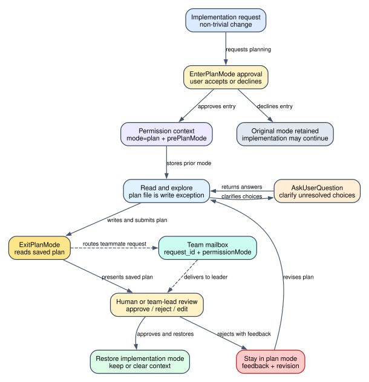

# Claude Code CLI 2.1.235 Plan Mode 与人工审批：从“先别改代码”到可恢复实施的完整状态机

> 版本：`2.1.235` | 主证据：目标版本可读化 bundle 的 `Static` 运行路径 | 主题边界：普通本地会话、SDK/print host、团队成员、AFK 与远端 Ultraplan 的计划审批链

**读者问题：** Claude 进入 Plan Mode 后，究竟是谁阻止它修改代码；计划写到哪里；`AskUserQuestion`、`ExitPlanMode` 和人工批准分别解决什么问题；用户批准、拒绝、离开键盘、关闭 SDK 或把计划交给团队负责人后，状态又如何继续？

**一句话模型：** Plan Mode 不是一段“请先规划”的提示词，而是由专用进入对话框、`permission context` 状态转换、周期性 system reminder、计划文件写入例外、工具权限底线和 `ExitPlanMode` 审批协议共同组成的客户端状态机。



图的核心结论是：**模型负责提出方案，客户端负责持有模式、文件和审批状态，用户或 team lead 才拥有“允许实施”的最终转换权。**

## 60 秒看懂一次“新增 OAuth 登录”

贯穿场景：用户要求“给现有账号系统新增 GitHub OAuth 登录，复用当前 session，并补齐迁移和测试”。这不是一个适合边读边改的单文件任务。

1. 模型调用 `EnterPlanMode`，客户端打开专用确认框，而不是直接把工具视为已获准。
2. 用户接受后，客户端把 `toolPermissionContext.mode` 改成 `plan`，并把进入前的模式存进 `prePlanMode`。
3. Agent Loop 注入完整 Plan Mode reminder：只能探索、读取和写本次 plan file，不能改业务代码、提交或修改配置。
4. 模型读取路由、账号、session、数据库迁移和测试结构，把结论增量写入计划文件。
5. 若 OAuth provider、账号绑定策略或回滚要求不明确，模型调用 `AskUserQuestion`。它只负责澄清需求，不代表批准计划。
6. 计划完成后，模型调用 `ExitPlanMode`。工具不信任模型参数里的任意计划文本，而是读取本次 session 的 plan file，交给客户端审批 UI。
7. 用户可以批准并选择退出后的 permission mode，也可以附反馈拒绝并继续留在 Plan Mode；计划太大时，批准入口会被扣留。
8. 批准后客户端恢复此前模式或用户选择的新模式，再把批准后的计划作为实施依据送回 Agent Loop；拒绝则把计划和反馈回灌，要求修订后重新提交。

### 前后发生了什么变化

| Object | Before | Transformation | After | User-visible effect |
| --- | --- | --- | --- | --- |
| permission mode | `default` / `acceptEdits` / `auto` / 其他 | 进入时保存旧值并切到 `plan` | `mode=plan`, `prePlanMode=<旧值>` | 读取继续，实施动作受限制 |
| model instructions | 普通 Agent Loop system/context | 注入 full 或 sparse plan reminder | 模型持续收到计划工作流和只读边界 | 长对话、compact 后仍不容易忘记模式 |
| plan artifact | 不存在或已有旧内容 | 生成 session slug，增量写 plan file | 磁盘或 Storage V5 中存在可审阅计划 | 审批 UI 展示的是实际保存内容 |
| clarification | 模型存在未决问题 | `AskUserQuestion` 打开结构化问答 | 答案、自由文本、批注或 AFK 状态回灌 | 需求决策与批准计划分开 |
| approval | 没有实施授权 | `ExitPlanMode` 读取计划并请求人工决定 | approve / reject / team pending / remote pending | 未批准时不能自然滑入实施 |
| exit mode | `plan` | 恢复 `prePlanMode` 或应用审批选项 | `default` / `acceptEdits` / `auto` / bypass | 用户决定实施阶段的权限强度 |
| context | 探索信息持续累积 | 可保留 context，或批准时清空并自动续接计划 | 原上下文继续，或新 context 从批准计划开始 | 在连续性和上下文占用之间选择 |

## 先分清四个责任对象

| 对象 | Owner | 持有的状态 | 不负责什么 |
| --- | --- | --- | --- |
| `EnterPlanMode` | tool + permission dialog | 是否请求进入、是否获得用户同意 | 不生成最终计划，不批准实施 |
| Plan Mode reminder | context assembly | 只读前言、工作流、plan file 路径、退出协议 | 不是唯一强制层，不能代替 permission engine |
| `AskUserQuestion` | blocking user interaction | 问题、选项、答案、批注、AFK timeout | 不能问“这个计划可以吗”来绕过 `ExitPlanMode` |
| `ExitPlanMode` | tool + plan review UI | 磁盘计划、批准/拒绝、退出模式、反馈 | 不应在纯研究任务结束时机械调用 |
| `toolPermissionContext` | client session | `mode`, `prePlanMode`, allow/deny/ask rules | 不替模型写计划，也不回滚已发生副作用 |
| plan file | plan storage | 当前 session/agent 的规范化 Markdown 计划 | 不是任意业务文件写入许可 |
| team mailbox | team lead / teammate runtime | request ID、计划正文、批准结果、反馈、permission mode | teammate 不能批准自己的计划 |

## Plan Mode 不是单层提示词

把它理解成四层叠加，才能解释为什么“提示词里说只读”仍不等于完整机制。

| Layer | 作用 | 关键对象 | 失效时的后果 |
| --- | --- | --- | --- |
| 进入审批层 | 用户先决定是否进入规划阶段 | `permission_enter_plan_mode` dialog | 未同意就不应切 mode |
| 状态层 | 客户端持久持有当前模式与返回模式 | `mode`, `prePlanMode`, stripped rules | 退出时可能恢复错误权限 |
| 提示层 | 告诉模型工作流、边界和 plan file | full/sparse plan attachment | 模型更容易遗忘当前阶段 |
| 执行约束层 | 工具自身检查、permission floor、路径例外共同决策 | tool permission engine | 单靠文字约束无法约束所有 host/MCP 路径 |

因此不能把实现概括为“系统提示词要求不要写文件”，也不能反过来说“所有写操作都在一个统一函数里硬拒绝”。`2.1.235` 的真实边界是：**系统 reminder + session permission mode + tool 自身权限检查 + MCP plan floor + 明确路径例外**共同组成。

## Phase 1：进入 Plan Mode 先经过专用用户批准

`EnterPlanMode` 的工具说明鼓励在多文件、架构决策、行为变更、需求不清或存在多个合理方案时主动使用，同时明确排除简单改字、极小修复和纯研究任务。[工具说明：281665-281758](../reverse/javascript/cli.readable.js#L281665)

工具对象本身是只读、可并发、deferred tool；调用时禁止 agent context，并在成功路径里把 permission context 切到 `plan`。[工具对象与状态转换：281772-281816](../reverse/javascript/cli.readable.js#L281772)

这里有一个容易写错的细节：**不是 `EnterPlanMode.checkPermissions()` 覆盖方法返回 ask。** 这个工具没有在自身对象里实现该方法。真实批准面来自专用 dialog route：

- `permission_enter_plan_mode` 有独立 payload/result schema；取消时默认结果是 `cancelled`；
- dialog registry 把 `EnterPlanMode` 工具映射到这个 dialog；
- TUI 展示“不会在批准计划前修改代码”，按钮分别是进入 Plan Mode 或直接开始实施；
- 用户拒绝后会显示 `User declined to enter plan mode`，而不是伪装成工具执行错误。

[dialog schema：280653-280658](../reverse/javascript/cli.readable.js#L280653) [dialog 注册：289839-289858](../reverse/javascript/cli.readable.js#L289839) [进入 UI：531269-531302](../reverse/javascript/cli.readable.js#L531269) [拒绝状态：454287-454291](../reverse/javascript/cli.readable.js#L454287)

### 直接以 `--permission-mode plan` 启动

Plan Mode 也可以是启动状态。初始化 permission context 时，如果启动 mode 是 `plan`，客户端会处理 Auto Mode 相关规则，并在需要时把 `prePlanMode` 设为 `default`。[启动初始化：591405-591411](../reverse/javascript/cli.readable.js#L591405)

这条路径没有“模型先调用 EnterPlanMode”的步骤，因此交互 UI 与启动参数是两个入口，但最后汇合到同一个 session permission context。

## Phase 2：`prePlanMode` 解决的是“批准后回到哪里”

进入 Plan Mode 不是简单覆盖一个字符串。`lqr()` 会根据进入前状态构造返回信息：

- 已经是 `plan`：保持不变；
- 从 `auto` 进入：记录 `prePlanMode="auto"`，并根据 Auto gate/active state处理危险 allow rules；
- 从普通模式进入：记录原模式；
- 从 `bypassPermissions` 进入时采用特殊处理，不把它当成普通可恢复分支。

[进入前模式保存：278018-278029](../reverse/javascript/cli.readable.js#L278018)

### Auto Mode 为什么还要暂存规则

Auto Mode 会剥离可能绕过 classifier 的危险 allow rules，并把来源和值放进 `strippedDangerousRules`。离开 Auto 或 Plan 时，客户端需要按目标 mode 决定恢复还是继续剥离这些规则。[规则暂存与恢复：277750-277781](../reverse/javascript/cli.readable.js#L277750)

这意味着 `prePlanMode` 不只是 UI 上的“返回上一档”，还参与 permission rule 的生命周期。Auto gate 在计划期间关闭时，客户端会修正 `prePlanMode` 或恢复规则，避免批准后回到一个已经不可用的 Auto 状态。[计划期间 Auto gate 变化：278031-278039](../reverse/javascript/cli.readable.js#L278031)

### `useAutoModeDuringPlan`：Plan Mode 内部也可以使用 Auto 语义

`useAutoModeDuringPlan` 是独立 capability setting，schema 声明默认 true；配置面把它显示为 `Use auto mode during plan`。任一参与合并的有效配置层显式设为 false，`BEn()` 就会让该能力关闭。[字段与默认：39898](../reverse/javascript/cli.readable.js#L39898) [配置 UI：332709-332710](../reverse/javascript/cli.readable.js#L332709) [合并 consumer：42960-42967](../reverse/javascript/cli.readable.js#L42960)

运行时 `CSi()` 要求 Auto gate 可用且 `useAutoModeDuringPlan` 没被关闭；`lqn()` 才会激活 Auto 语义并剥离危险 allow rules。[运行时 gate：278011-278017](../reverse/javascript/cli.readable.js#L278011)

一个容易忽略的结果是：即使用户从 `default` 或 `acceptEdits` 进入 Plan Mode，规划阶段也可能采用 Auto 的 permission 语义，但 `prePlanMode` 仍记录进入前模式。批准退出后恢复的是原模式，不是因为规划期用了 Auto 就必然切到 `auto`。

### UI 的 mode cycle 不是审批替代品

快捷切换的 cycle 是 `default -> acceptEdits -> plan -> bypass/auto/default`，取决于当前可用能力。[mode cycle：488116-488137](../reverse/javascript/cli.readable.js#L488116) 这解释了 Plan Mode 是 permission mode 集合中的真实状态，但从 UI 切换 mode 仍不等于计划已经被 `ExitPlanMode` 审批。

## Phase 3：进入后，客户端持续重新注入规划边界

Plan Mode reminder 不是只在进入时出现一次。

### 首次进入与 compact 后

只要当前 permission mode 是 `plan`，上下文构造器就会生成一个 `plan_mode` attachment，带上：

- `reminderType: "full"`；
- 当前 plan file 路径；
- 计划是否已存在；
- 可选 custom instructions；
- workshop/artifact routing 状态。

[首次/compact 后 full reminder：263218-263228](../reverse/javascript/cli.readable.js#L263218)

### 长对话中的重复注入

运行时先检查上一条 plan attachment 之后经过了多少用户 turn：不足 5 个时不重复注入。达到间隔后，会重新附加 plan state；attachment 计数决定本次用 full 还是 sparse reminder。常量中两个阈值都为 `5`。[重注入逻辑：322141-322157](../reverse/javascript/cli.readable.js#L322141) [常量：323137](../reverse/javascript/cli.readable.js#L323137)

准确地说：

- 第一次是 full；
- 后续至少隔 5 个用户 turn 才会新增 reminder attachment；
- attachment 序号每跨过 5 个周期再次使用 full，其余使用 sparse；
- sparse 文案仍明确“只读，plan file 例外”，并引用前文完整工作流。

这是一种上下文成本折中：每轮重复完整工作流会浪费 token，完全不重复又容易在长 Agent Loop 或 compact 后丢失阶段约束。

## Phase 4：自定义工作流只能替换中段，不能拿掉边界

`--plan-mode-instructions` 和 SDK initialize 的 `planModeInstructions` 可以替换默认规划 workflow，但客户端固定保留两端：

1. 开头仍是只读强制前言、plan file 路径和唯一写入例外；
2. 中间插入调用方给出的 `customInstructions`；
3. 结尾仍要求调用 `ExitPlanMode`，保留审批协议。

[实际拼装：398876-398889](../reverse/javascript/cli.readable.js#L398876) [SDK 字段合同：595971](../reverse/javascript/cli.readable.js#L595971)

没有 custom instructions 时，CLI 使用自己的完整多阶段 workflow，包括探索、方案设计、最终计划、可选 workshop/prototype 和验证要求。[默认 workflow：398891-398928](../reverse/javascript/cli.readable.js#L398891)

CLI 参数还有一个 host 边界：`--plan-mode-instructions` 只允许在 `--print` 模式使用，交互调用若直接带该参数会报错。[参数校验：592685-592687](../reverse/javascript/cli.readable.js#L592685)

因此“自定义 Plan Mode”不是把整个安全壳交给调用方，而是允许 SDK/automation 改写**怎么规划**，不允许它轻易删除**只读阶段和人工退出协议**。

## Phase 5：plan file 是可审计的写入例外

### 路径如何产生

本次 session 先获得 plan slug，主线程文件名是 `<slug>.md`，agent 则是 `<slug>-agent-<agentId>.md`。默认目录来自 plans directory；`plansDirectory` 可以相对项目根配置，但解析后必须仍在项目根内部，并通过路径与链接边界检查，否则回退默认目录。[目录解析与路径：115906-115979](../reverse/javascript/cli.readable.js#L115906)

计划内容可能来自普通文件读写，也可能来自 Storage V5 cache/backend。`PX()` 会先查 plan cache，再读原始文件；`ExitPlanMode` 读取的是这个 canonical plan state，而不是要求模型把正文作为普通工具参数传进来。[计划读取：116021-116033](../reverse/javascript/cli.readable.js#L116021)

### 为什么允许写 plan file

full reminder 明确写道：plan file 是唯一允许编辑的文件；active workshop 时会扩展到对应 workshop document。[固定只读前言：399924-399931](../reverse/javascript/cli.readable.js#L399924)

permission path 也识别本次 session 的 plan/workshop 文件并返回显式允许原因 `Plan files for current session are allowed for writing`。[路径例外：396220-396236](../reverse/javascript/cli.readable.js#L396220)

这项设计有三个价值：

- **可审阅：** 用户看到的是磁盘上真实计划，而不是模型临时生成的一段不可复查文本；
- **可编辑：** 用户可以在审批 UI 里用外部编辑器修订；
- **可恢复：** compact、resume、team handoff 或 remote flow 可以重新读取同一计划对象。

### “只读”在运行时到底怎么落地

非只读 MCP 在 plan mode 且没有命中允许例外时，会从 passthrough 转成 `ask`，reason 标为 `mode: plan`。[MCP plan gate：395299-395334](../reverse/javascript/cli.readable.js#L395299)

后续 permission floor 会识别 `plan_mode_floor`，在自动批准路径里保留真实询问或拒绝，而不是因为 Auto/bypass 环境就无条件放行。[permission floor：395408-395425](../reverse/javascript/cli.readable.js#L395408)

但内建工具还各自拥有 `isReadOnly`、`checkPermissions`、路径校验、sandbox 和 policy 逻辑。因此正确结论是“多层收敛为只读阶段”，不是“任何写调用都在同一处返回 deny”。

## Phase 6：`AskUserQuestion` 只解决未决需求

`ExitPlanMode` 的工具说明明确要求：如果实现方案仍有未决问题，先用 `AskUserQuestion`；不要用它询问“计划是否可以”，因为批准计划正是 `ExitPlanMode` 的职责。[分工合同：279625-279647](../reverse/javascript/cli.readable.js#L279625)

### 输入 schema 不是随便一段问题文本

`2.1.235` 的结构化限制包括：

| Field | 约束 | 设计目的 |
| --- | --- | --- |
| `questions` | 每次 1-4 题 | 控制一次阻塞交互的认知负担 |
| `options` | 每题 2-4 个 | 单选项不构成决策；过多选项应拆分 |
| `header` | 最多 12 字符 | 适配 chip/tag UI |
| `label` | 建议 1-5 词 | 保证选择项可扫描 |
| `multiSelect` | 默认 false | 明确互斥与可多选语义 |
| `Other` | 客户端自动提供 | 模型不能手工重复添加 |
| uniqueness | 问题文本全局唯一，同题 label 唯一 | 答案以问题文本为 key，防止覆盖 |
| `preview` | 可选；HTML 模式只允许 fragment | 支持方案预览但拒绝完整 document/script/style |

[schema 与唯一性：281093-281127](../reverse/javascript/cli.readable.js#L281093) [preview 校验：281086-281091](../reverse/javascript/cli.readable.js#L281086)

若某题少于 2 个选项，专用 steer 会告诉模型：用户从未看到该问题，不要编造一个凑数选项；直接说明将采用的唯一方案，其他合法问题可以单独重问。[单选项失败处理：281149-281165](../reverse/javascript/cli.readable.js#L281149)

### runtime 为什么一定会阻塞

工具声明 `requiresUserInteraction=true`，`checkPermissions()` 返回 ask，结果可以包含选项答案、自由文本、批注和 `afkTimeoutMs`。回灌时客户端区分：正常结构化答案、自由文本、无人回答、AFK 前已有部分选择。[runtime：281218-281259](../reverse/javascript/cli.readable.js#L281218)

这使 `AskUserQuestion` 成为 Agent Loop 中真正的 human-in-the-loop barrier，而不是模型输出一段问句后自行猜测。

## Phase 7：`ExitPlanMode` 读取计划并打开审批 UI

`ExitPlanMode` 的 schema 允许 normalize 阶段注入 `plan` 和 `planFilePath`，但普通模型调用不需要传计划正文。工具会从本次 session/agent 的 plan state 读取内容。[schema：279650-279678](../reverse/javascript/cli.readable.js#L279650) [读取与调用：279692-279716](../reverse/javascript/cli.readable.js#L279692)

关键门槛：

- 非 Plan Mode 调用直接校验失败，并提示先进入；
- 普通本地路径的 `checkPermissions()` 必须返回 ask；
- 纯 research/exploration 不应该为了“收尾”而机械退出 Plan Mode；
- plan 为空时可以批准退出，但 tool result 只说可以继续，不伪造计划正文。

### 审批 UI 不只是 Yes/No

常规 plan review 会展示真实计划、permission result 和执行选项。根据 session capability/config，用户可能看到：

- 保留当前 context，并以 `default`、`acceptEdits`、`auto` 或可用的 bypass mode 实施；
- 清空规划 context，再以 Auto/accept edits/bypass 实施；
- 留在 Plan Mode 并输入反馈；
- 把计划交给 Ultraplan 远端细化；
- 先发布为可审阅 artifact。

[选项构造：526806-526826](../reverse/javascript/cli.readable.js#L526806)

`showClearContextOnPlanAccept` 默认 false；开启后，“clear context”路径会把批准计划组成新的自动 continuation，并附上完整 transcript 路径提示，随后在新的 context 中实施。[清理上下文转换：527034-527053](../reverse/javascript/cli.readable.js#L527034)

这项设计把 Plan Mode 与上下文治理连在一起：规划期可能读了大量文件和历史讨论，实施期不一定要继续携带所有探索 token；但清空上下文也会失去未写进计划的细节，所以客户端明确要求把批准计划作为新的实施入口。

### 用户可以直接编辑计划

审批 UI 捕获 `Ctrl+G`，用外部编辑器打开 plan file 或临时内容。返回内容发生变化时，会标记 plan edited，并在 tool result 中使用 `Approved Plan (edited by user)`。[外部编辑器：527111-527126](../reverse/javascript/cli.readable.js#L527111)

这不是旁路：编辑后的计划仍通过同一批准流程，并被回灌给模型作为实施合同。

### 计划过大时批准被扣留

UI 常量把超大计划阈值设为 `200000` 字符；超限时显示“plan is too large to be shown in full”，并明确 withholding approval，要求缩短计划或按 Esc。[大计划边界：527199](../reverse/javascript/cli.readable.js#L527199)

这不是 plan file 写入上限，而是**可审阅性上限**：用户看不全就不应被要求批准。

## Phase 8：批准后如何恢复 permission mode

普通成功路径读取 `prePlanMode`，然后：

1. 如果目标是 `auto`，再次检查 Auto gate；
2. gate 已关闭时回落 `default`，并发即时 warning notification；
3. 记录 `plan -> target` mode transition；
4. 根据目标 mode 继续剥离或恢复危险 allow rules；
5. 清除 `prePlanMode`。

[退出恢复：279718-279744](../reverse/javascript/cli.readable.js#L279718)

tool result 会区分：

- team member 正在等待 lead approval；
- agent 已获批准，只需结束自己的计划回合；
- 空计划批准；
- 普通批准计划；
- 用户编辑后批准的计划。

[结果映射：279747-279770](../reverse/javascript/cli.readable.js#L279747)

因此“点击批准”并不只是把一条 Yes 文本发送给模型，而是同时完成 permission state、规则集合、context continuation 和 model-visible plan 的协调转换。

## Phase 9：拒绝不是结束，而是回到修订循环

用户选择 `No, keep planning` 时，可以附文本反馈或图片。客户端返回 deny 结果并携带反馈；没有反馈也没有图片时不会伪造一次拒绝提交。[反馈构造：526833-526845](../reverse/javascript/cli.readable.js#L526833)

模型侧会看到“计划被用户拒绝，继续留在 Plan Mode”的结构化语义，并拿到 rejected plan 与反馈，再次探索、修改 plan file、重新调用 `ExitPlanMode`。[拒绝提示常量：399919-399924](../reverse/javascript/cli.readable.js#L399919)

拒绝后的正确状态是：

```text
mode = plan
plan file = retained and editable
prePlanMode = retained
implementation permission = not granted
next action = incorporate feedback -> resubmit ExitPlanMode
```

## 团队模式：teammate 不能直接向最终用户要批准

团队成员以 `--plan-mode-required` 启动时，任务状态初始化为 `permissionMode: "plan"`、`awaitingPlanApproval: false`。[teammate 启动与状态：290688-290728](../reverse/javascript/cli.readable.js#L290688)

当 teammate 调用 `ExitPlanMode`：

1. 必须已有 plan；
2. 生成唯一 `requestId`；
3. 把 `plan_approval_request` 写入 team lead inbox；
4. mailbox 写入失败则抛错，明确“plan not submitted”；
5. 成功后返回 `awaitingLeaderApproval: true`，要求等待 inbox 回复。

[request/response schema：279598-279603](../reverse/javascript/cli.readable.js#L279598) [teammate 提交：279710-279716](../reverse/javascript/cli.readable.js#L279710)

lead UI 展示来源、完整计划和文件路径。批准/拒绝回复都绑定 request ID；批准回复还能携带实施阶段 `permissionMode`。[lead 展示：457426-457489](../reverse/javascript/cli.readable.js#L457426) [lead 决策：307244-307256](../reverse/javascript/cli.readable.js#L307244)

重要权限边界：只有 team lead 可以批准；teammate 不能批准自己或其他成员的计划。团队审批因此是“模型 -> teammate runtime -> mailbox -> lead -> response -> teammate”的显式消息协议，不是共享终端里的一句自然语言。

## AFK：用户离开键盘时如何不永久卡住

`askUserQuestionTimeout` 提供 `never`、`60s`、`5m`、`10m` 四个设置值；默认语义是 `never`，只有显式配置后才自动继续。[配置选项：332750-332757](../reverse/javascript/cli.readable.js#L332750) [枚举：332885](../reverse/javascript/cli.readable.js#L332885)

底层 timeout hook 使用 `60000ms` 作为通用默认内部值，但 AskUserQuestion UI 是否启用 AFK 仍由设置/环境与 host 条件决定，不能把这个内部常量误写成“默认 60 秒自动回答”。[内部常量：5277](../reverse/javascript/cli.readable.js#L5277) [倒计时计算：530203-530220](../reverse/javascript/cli.readable.js#L530203)

AFK 只在没有 screen reader、没有 external racer、不是被排除的后台/host 状态，并且配置或环境明确提供 timeout 时启用。超时时会连同用户已选的部分答案一起提交，telemetry 标记 `hadPartialAnswers` 和是否在 Plan Mode。[启用条件与部分答案：530419-530425](../reverse/javascript/cli.readable.js#L530419)

回灌给模型的文本明确说：用户可能离开键盘，请基于已有上下文做最佳判断；如果超时前已有选择，也会原样列出。[AFK 回灌：281083-281085](../reverse/javascript/cli.readable.js#L281083) [结果映射：281244-281257](../reverse/javascript/cli.readable.js#L281244)

AFK 是澄清问题的恢复策略，不是计划批准策略。用户没回答 OAuth 绑定策略时，模型可以采用已有上下文中的最佳方案继续完善计划；它仍然必须通过 `ExitPlanMode` 获得实施批准。

## SDK shutdown park：host 关闭时保留尚未回答的问题

stream-json/SDK host 的 permission request 使用稳定 `request_id`。在特定 feature gate 下，关闭期间若 pending tool 是 `AskUserQuestion`，客户端可以：

- 把 request ID 加入 preserved park set；
- 跳过 cancel 和 deny；
- 保持问题在恢复后可回答；
- 若是 stream-close interrupt 策略，则显式中断 parked request 并让 turn 以 shutdown 结束。

[request ID 与 park：596367-596400](../reverse/javascript/cli.readable.js#L596367) [AskUserQuestion 保留/中断：596439-596468](../reverse/javascript/cli.readable.js#L596439)

这解决的是 host lifecycle 与 human wait time 不一致的问题：用户没有因为桌面端重连或 SDK shutdown 就被客户端伪造成“拒绝了问题”。

## 远端 Ultraplan：批准状态来自事件流，不是本地按钮

远端 planning session 会把 `ExitPlanMode` tool use/result 作为事件解析。ingest 状态包括：

- `pending`：看到了 Exit 调用但还没有结果；
- `rejected`：tool result 是 error，且没有 teleport marker；
- `approved`：结果中存在 Approved Plan marker；
- `teleport`：拒绝内容含本地接管 marker；
- `terminated`：会话在批准前结束。

[事件状态机：363700-363720](../reverse/javascript/cli.readable.js#L363700)

poller 每 3 秒读取新事件，网络错误最多容忍 5 次连续重试；成功时区分 `executionTarget: remote` 与 `local`。超时也分成两类：曾看到 pending plan 的 `timeout_pending`，以及一直没有到达 `ExitPlanMode` 的 `timeout_no_plan`。[轮询与错误：363723-363775](../reverse/javascript/cli.readable.js#L363723)

远端 prompt 还规定：拒绝后按反馈修订，teleport 后停止远端实施并交回本地；broken handoff 不得顺势开始改代码。[远端连续性合同：363801-363875](../reverse/javascript/cli.readable.js#L363801)

## 完整失败矩阵

| Failure | Detection | Tool call / side effect | Retained state | Recovery |
| --- | --- | --- | --- | --- |
| 用户拒绝进入 Plan Mode | enter dialog 返回 deny | 未切 `mode=plan` | 原 permission context | 直接实施或等待用户新指令 |
| agent context 调 Enter | tool call 抛错 | 无 mode 变化 | agent state 保留 | 由主线程进入或用团队 plan-required 路径 |
| 非 plan mode 调 Exit | `validateInput` 失败 | 不打开正式计划审批 | 当前 mode 不变 | 先进入 Plan Mode，或已批准则继续实施 |
| 没有 plan file 的 teammate Exit | precondition error | 不写 lead inbox | teammate 仍在 plan | 先写计划再提交 |
| team mailbox 写失败 | `aH(...) === undefined` | 请求未提交 | plan file 保留 | 重试 inbox 写入，不得开始实施 |
| 用户拒绝计划且有反馈 | Exit permission deny | 业务代码未实施 | mode、plan、prePlanMode 保留 | 修改计划后重新 Exit |
| 用户拒绝但未给反馈 | UI 不构造有效提交 | 没有伪造反馈 | 仍在审批/计划状态 | 输入反馈或 Esc |
| 计划超过 200000 字符 | UI withholding | 不允许批准 | plan file 保留 | 缩短计划后重新审阅 |
| Auto gate 在计划期关闭 | Exit 时再次检查 | 不恢复不可用 Auto | rules 按 default 修正 | 通知用户并以 default 实施 |
| AskUserQuestion schema 非法 | schema/preview validation | 用户从未看到问题 | Agent Loop 保留 | 拆题、修正选项或直接采用唯一方案 |
| AskUserQuestion AFK | timeout 到期 | 提交已有部分答案 | `afkTimeoutMs` + answers | 基于上下文继续，必要时稍后重问 |
| SDK shutdown during AUQ | park/interrupt gate | 不把 shutdown 当人工 deny | pending request ID 可保留 | host 恢复后回答，或明确中断 turn |
| remote 连续网络失败 | 5 次 retry 后 error | 远端 session 可能仍在运行 | event stats/reject count | 查询远端状态，不把本地 timeout 当终止证明 |
| remote 一直未到 Exit | `timeout_no_plan` | 无批准 | 远端可能启动失败或 session mismatch | 修复 handoff/session ID 后重试 |

## Token、延迟、成本、隐私与副作用

| Dimension | 具体影响 |
| --- | --- |
| Token | full reminder、计划正文、探索文件、AskUserQuestion 回灌都会占 context；5-turn/5-attachment 节流降低重复提示成本 |
| Context quality | plan file 把关键结论外置，批准时可选择保留或清空探索 context；未写进计划的细节在 clear-context 后可能丢失 |
| Latency | 多一次 enter approval、若干澄清问题和 exit approval；team/remote 还增加 mailbox 或 3 秒 polling 延迟 |
| Cost | 规划本身会增加模型轮次，但可减少错误实现和返工；远端多 agent planning 还会增加并行模型成本 |
| Privacy | 计划可能包含文件名、架构、风险和实现细节；team inbox、Storage V5、artifact publish 或远端 session 会扩大可见范围 |
| Security | Plan Mode 降低未批准修改概率，但不替代 managed deny、sandbox、workspace trust 和 host permission policy |
| Recoverability | plan file、request ID、prePlanMode 和 parked question 支持恢复；它们不能回滚进入 Plan Mode 前已经完成的外部副作用 |
| Human factors | 大计划 withholding、结构化选项、外部编辑和反馈循环提升可审阅性；过度规划简单任务会造成无谓摩擦 |

## 微小但关键的特性

- `EnterPlanMode` 的用户确认 UI 明确提供 `No, start implementing now`，拒绝进入不是拒绝整个任务。
- plan file 名区分主线程与 agent，避免同一 session 内计划互相覆盖。
- `plansDirectory` 虽可配置，但必须留在项目根内；无效路径会记录错误并回退。
- custom plan workflow 只替换中间业务阶段，固定只读前言和 `ExitPlanMode` footer 不变。
- sparse reminder 仍携带 plan file 路径，不是只有一句“还在计划模式”。
- `AskUserQuestion` 的答案 map 以完整 question text 为 key，所以 schema 强制问题文本唯一。
- HTML preview 禁止 `<html>`、`<body>`、doctype、`script` 和 `style`，但允许 inline style 的 fragment。
- AskUserQuestion timeout 可以提交部分答案，不会把已选内容全部丢弃。
- plan review 支持图片反馈；拒绝结果可以把 image blocks 一起送回模型。
- `Ctrl+G` 编辑后会标记 `planWasEdited`，模型能区分原计划与用户改写计划。
- plan approval 可以选择保留 context 或清空 context；这不是 `/compact`，而是以批准计划构造自动 continuation。
- team lead 批准时会把自己的当前 permission mode 规范化后带给 teammate；lead 自己若仍在 plan，则给成员 `default`。
- remote poll 的“连接失败”不等于远端 session 已停止，错误文案明确保留这一边界。

## 如何判断 Plan Mode 是否真的生效

不要只看模型说“我先制定计划”。至少要看到以下状态链中的多个对象：

1. `EnterPlanMode` 专用 dialog 或启动 `permission-mode=plan`；
2. session permission context 中 `mode=plan`；
3. plan attachment 带真实 plan file 路径；
4. 非只读工具命中 plan permission floor/ask；
5. plan file 被创建并能由 `ExitPlanMode` 重新读取；
6. 审批 UI 展示计划并返回 allow/deny；
7. allow 后 mode 恢复，deny 后 mode 仍是 plan；
8. team/remote path 中 request ID 与结果 marker 成对出现。

只截一段 Plan Mode prompt，只能证明提示面存在；只看到 `mode=plan` schema，只能证明状态类型存在；只有把入口、context、permission、文件和审批结果串起来，才能证明完整客户端机制。

## 证据等级与明确边界

### Static

- permission mode 与 `prePlanMode`：[277750-278039](../reverse/javascript/cli.readable.js#L277750)
- `ExitPlanMode`、team request 和 mode restore：[279598-279770](../reverse/javascript/cli.readable.js#L279598)
- `AskUserQuestion` schema/runtime：[281083-281259](../reverse/javascript/cli.readable.js#L281083)
- `EnterPlanMode` 工具与调用：[281665-281816](../reverse/javascript/cli.readable.js#L281665)
- reminder 注入与节流：[322141-322157](../reverse/javascript/cli.readable.js#L322141)
- permission floor 和 plan file 例外：[395299-396236](../reverse/javascript/cli.readable.js#L395299)
- custom/default workflow：[398876-398933](../reverse/javascript/cli.readable.js#L398876)
- plan review UI、context clear 和外部编辑：[526806-527199](../reverse/javascript/cli.readable.js#L526806)
- AFK 与 SDK park：[530203-530425](../reverse/javascript/cli.readable.js#L530203)、[596367-596468](../reverse/javascript/cli.readable.js#L596367)

### Probe

本专题没有新增会真实修改项目或等待人工长时间交互的 exact-binary probe。现有 source path 能证明 client-side state machine、schema、UI 与 permission branches 的可达结构，但不能把某一次真实用户批准结果包装成已运行证据。

### Public

公开文档可以解释 Plan Mode 的产品用途；本专题的 reminder 周期、`prePlanMode`、200000 字符 withholding、AFK partial answers、team mailbox 和 shutdown park 均以 `2.1.235` 静态实现为准，不从当前文档反向补写。

### Boundary

- 服务端模型是否严格遵循计划质量要求，客户端源码不能保证。
- plan approval 降低未授权实施风险，但不能撤销进入 Plan Mode 前或其它进程已经完成的文件、网络、数据库和外部服务副作用。
- 远端 Ultraplan 的容器调度、服务端审批存储和模型质量不在本地 bundle 可证明范围内。
- UI 中出现的选项受 feature gate、账号能力、host 和设置影响；静态代码存在不等于每个用户都会同时看到所有选项。
- `isReadOnly()` 和工具声明表达的是 Claude Code permission contract，不等于动作在现实世界绝对没有副作用。读取远端资源仍可能产生网络请求、计费、访问日志或数据暴露；Plan Mode 不能替代网络隔离、最小 credential、MCP server 审计和 managed policy。
- SDK、桌面端或远端 host 必须把真实用户决定正确映射回 request ID、dialog result 或 permission response。本地 bundle 能证明协议和 fail-closed 分支，不能证明第三方 host 没有伪造批准、重复回复、错误绑定 request ID 或在 UI 中遗漏关键计划内容。
- team mailbox 能证明 teammate 与 lead 之间存在结构化 request/response，但不能证明 lead 的账号身份、组织授权或人工审阅质量。远端事件中的 Approved Plan marker 也只证明客户端解析到了约定结果，不证明服务端审批存储、传输完整性和访问控制的全部实现。
- Plan Mode 保护的是“从规划到实施”的客户端转换，不是事务边界。批准后正常工具权限、sandbox、hooks、workspace trust 和外部系统自己的并发控制仍必须继续工作；计划描述正确也不保证实施期间仓库、数据库 schema、远端 API 或依赖版本没有变化。

## 最终判断

Claude Code CLI `2.1.235` 的 Plan Mode 本质上是一条**可审阅、可拒绝、可恢复、可跨 host/团队传递的实施授权流水线**。它最重要的技术点不是“模型会写一份计划”，而是客户端把以下对象绑在了一起：

```text
human consent
-> permission state
-> repeated planning context
-> canonical plan artifact
-> structured clarification
-> explicit approval result
-> restored implementation mode
```

缺少其中任何一层，Plan Mode 都会退化：只有提示词时缺少执行约束，只有 permission mode 时缺少可读计划，只有 plan file 时缺少人工授权，只有 Yes/No 时缺少恢复和团队连续性。`2.1.235` 的实现价值正是把这些层做成同一条状态机。
