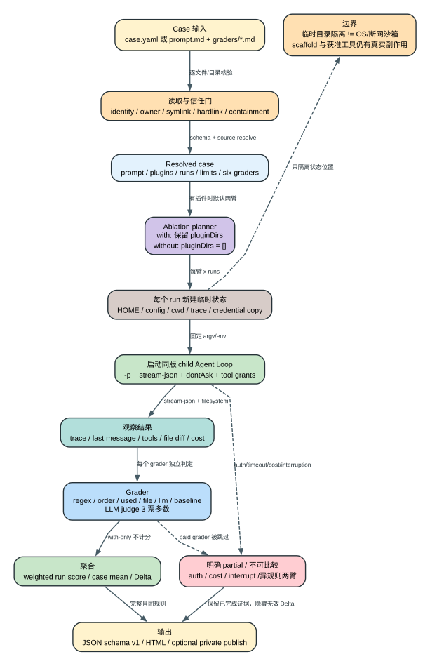

# Claude Code CLI 2.1.235 Plugin Evaluation Harness：怎样证明一个 Plugin 真的带来改进

## 60 秒理解 Plugin Eval

**读者问题：** `claude plugin eval` 跑出一个高分，究竟证明了插件有效，还是只证明 Claude 本来就能完成任务？

**一句话模型：** `2.1.235` 的 Plugin Eval 是客户端内置的实验编排器：它先把可信 case 编译成受限运行合同，再为每次 run 建立独立 HOME/config/workspace，按需执行“加载插件”和“不加载插件”两条臂，最后用确定性与 LLM grader 加权评分并计算 Delta。

贯穿场景：一个插件声明了代码审查 Skill。作者准备 3 个 case，每个 case 运行 3 次；Eval Harness 会让 with-plugin 与 without-plugin 各跑 3 次。若两边都得 0.9，绝对分很高，但 `Delta=0`，不能证明插件产生了增益；若费用上限在其中一臂跳过了 LLM grader，两臂评分规则已经不同，客户端会隐藏 Delta，而不是输出伪精确差值。



可编辑图源：[plugin-evaluation-lifecycle.dot](visuals/plugin-evaluation-lifecycle.dot)。CLI 注册与完整选项见 [448562-448590](../reverse/javascript/cli.readable.js#L448562)，handler 与报告发布见 [448043-448264](../reverse/javascript/cli.readable.js#L448043)。

## 先看清五个状态对象

| 状态对象 | 谁拥有 | 输入 | 成功状态 | 失败意味着什么 |
| --- | --- | --- | --- | --- |
| Eval suite | case discovery/loader | `case.yaml`、`prompt.md`、`graders/*.md` | 严格 schema 的 resolved cases | 只拒绝坏 case；其它 case 可继续 |
| Plugin arm | ablation planner | target、case `plugins`、信任判定 | `with` 保留 pluginDirs，`without` 清空 | 未解析出插件时不能伪造 Delta |
| Run sandbox | per-run temp owner | prompt、HOME、config、cwd、凭据副本 | 独立 trace、文件差异、费用和终态 | 这里的 sandbox 不是 OS/网络隔离 |
| Grader result | six grader executors | trace、last message、文件、工具调用 | pass/fail、weight、evidence、judge votes | grader 抛错按 fail 计入，不静默跳过 |
| Aggregate/report | suite aggregator | runs、两臂、阈值、partial reason | JSON schema v1、HTML、可选私有 publish | partial 或异规则两臂不能当完整比较 |

## 一、Case 不是随便读几个 Markdown 文件

### 两种输入最后合并成同一 schema

一个 case 目录可以使用：

1. 单文件 `case.yaml`；
2. `prompt.md` 加 `graders/*.md`；
3. 两者同时存在，由 prose frontmatter/body 覆盖或追加 YAML 对应字段。

`prompt.md` 正文成为 `execution.prompt`；frontmatter 只接受顶层 `schema_version/name/description/tags/plugins/runs/expected_outcome` 和 execution 的 `model/max_turns/timeout_seconds/allowed_tools/artifact_publish/growthbook_overrides/append_system_prompt/env`。每个 grader Markdown 必须在 frontmatter 声明 `type`，文件名成为 grader name；`llm`、`baseline`、`regex` 可把正文分别作为 `criteria` 或 `pattern`。未知 frontmatter key、未闭合 frontmatter、重复 grader name 都是 case load error [445247-445361](../reverse/javascript/cli.readable.js#L445247)。

最终合同要求：

- `schema_version` 必须存在；本二进制支持 major `1`；默认 prose schema 是 `1.1`；
- `execution.prompt` 与 `context.history_file` 至少存在一个；
- `runs` 默认 `3`、最大 `50`；
- `max_turns` 默认 `10`、最大 `200`；
- `timeout_seconds` 默认 `300`、最大 `3600`；
- 至少一个 grader；grader name 在 case 内唯一。

完整 Zod schema 与兼容检查在 [445210-445245](../reverse/javascript/cli.readable.js#L445210)。这些是 **Static schema**，能证明客户端接受/拒绝的结构；它们不证明某个 case 已真实跑过。

### 读取过程为什么反复检查身份

Eval case 会驱动模型、插件甚至可选 shell，因此 loader 不把“路径在目录里”当作充分信任：

- prose/基线/焦点文件读取前 open handle，检查 regular file、inode/device、hardlink，读取后核对 size，拒绝读到一半被替换；单个 prose 文件上限 `1 MiB` [445302-445353](../reverse/javascript/cli.readable.js#L445302)；
- `graders/` 自身不能是 symlink，目录 listing 与全部读取结束后再次核对 inode/device；最多 `256` 个 `.md` [445323-445353](../reverse/javascript/cli.readable.js#L445323)；
- case 目录扫描跳过 symlink entry、仓库元数据和结果目录，深度最多 `16` [446365-446388](../reverse/javascript/cli.readable.js#L446365)；
- case 中的 `plugins` 路径必须解析在 containment root 内；自动发现或显式加载的插件还要通过 ownership/mode 信任判定 [446185-446202](../reverse/javascript/cli.readable.js#L446185)；
- 插件树会检查 symlink、hardlink、owner、group/world writable ancestor、目录可交换性和不可验证 identity；外链 symlink、网络 share、未能完整检查的 object tree 都会被拒绝或降为明确 problem [445960-446141](../reverse/javascript/cli.readable.js#L445960)。

这个设计保护的是“父进程准备执行的输入仍是刚才审查过的那份输入”。它不把第三方 case 变成可信代码；尤其 `scaffold_script` 一旦获准，仍是作者提供的真实 shell。

## 二、Ablation 才回答“是不是插件造成的”

### `with-without` 的实际差异只有 pluginDirs

当 target 解析出插件，默认 ablation 是 `with-without`。同一 case、同一 prompt、同一模型合同会各跑两臂：

```text
with     = resolved case，保留 pluginDirs
without  = 同一个 resolved case，但 pluginDirs = []
Delta    = score(with) - score(without)
```

planner 位于 [447324-447343](../reverse/javascript/cli.readable.js#L447324)，真正清空 `pluginDirs` 的位置在 [447410-447419](../reverse/javascript/cli.readable.js#L447410)。如果 case 没解析出插件，强制 `with-without` 会报错：两臂配置相同的 Delta 没有意义。replay case 的 history 已携带插件影响，或根本无插件可剥离时，自动模式会单臂运行并明确写出“无 Delta”。

### `with-only` 为什么不参与基线分数

grader 的 `arm` 可以是 `with-only` 或 `both`。未显式写 arm 的 `tool_used: Skill` 也自动视为 with-only：它用来回答“插件有没有被触发”，而不是把“基线没有 Skill”直接算成插件质量优势。without arm 会过滤 with-only grader；两臂模式下该 grader 在 with arm 仍展示结果，但标记 `with_only=true`、`scored=false`，加权分母不会包含它 [447037-447047](../reverse/javascript/cli.readable.js#L447037)、[447256-447267](../reverse/javascript/cli.readable.js#L447256)。

因此报告中“Skill 被调用”是机制证据，不等于任务效果。效果必须由两臂都能公平执行的 grader 评估。

## 三、每个 run 到底启动了什么

### 新 HOME/config/workspace 是进程状态隔离

每次 run 创建新的系统临时目录，内部有：

```text
root/
  config/.claude.json
  home/.gitconfig
  home/.git/
  home/cwd/          # child 工作目录
  out/               # trace / artifact stub
```

初始化把 onboarding 标成已完成、关闭 auto update，并建立最小 Git identity/repository [446390-446407](../reverse/javascript/cli.readable.js#L446390)。运行前只把当前 credential 写入临时 config，结束后主动删除 `.credentials.json` [446418-446429](../reverse/javascript/cli.readable.js#L446418)、[447474-447500](../reverse/javascript/cli.readable.js#L447474)。

child 以当前可执行文件重新启动，核心 argv 固定为：

```text
-p --output-format stream-json --verbose
--max-turns <case.max_turns>
--permission-mode dontAsk
--setting-sources user
[--model] [--plugin-dir] [--allowed-tools] [--resume] [--add-dir]
```

详见 [446622-446632](../reverse/javascript/cli.readable.js#L446622)。`dontAsk` 的含义是未获得明确规则的动作直接拒绝，不在无人值守 eval 中弹交互审批；它不是“所有工具都允许”。case 自己只可使用安全只读/协调工具，Bash、Write、Edit、WebFetch、`mcp__*` 等还需要 operator 的 `--allow-tools` grant，malformed/wildcard 规则会拒绝 [446535-446560](../reverse/javascript/cli.readable.js#L446535)、[447397-447403](../reverse/javascript/cli.readable.js#L447397)。

环境变量也分层治理：case 的 `execution.env` 只允许 `EVAL_*`；HOME/XDG/config 强制指向临时目录；Git author、shell startup、credential-shaped 和内部 eval control 变量被过滤；AWS/GCloud config 可显式指回 operator home 以支持真实 provider authentication [446650-446677](../reverse/javascript/cli.readable.js#L446650)。这说明凭据和 provider 可用性仍是外部边界，不是完全无身份的 hermetic test。

### 为什么它不能被称为 OS sandbox

源码中的 `sandbox` 对象保存的是 temp root、cwd、home、configDir、outDir。child argv 没有自动加入 OS sandbox 开关，环境也没有阻断网络；相反，模型调用和可授权的 WebFetch/MCP 必须能联网。因此它提供：

- 独立工作目录、HOME、Claude config 和 trace；
- permission `dontAsk` 与工具 allowlist；
- 输入路径和插件来源信任检查；
- timeout、turn、stdout、cost 边界。

它**不提供**：默认断网、seccomp/bwrap/macOS sandbox profile、容器 namespace、跨进程系统调用封锁。获得 Bash/Write/WebFetch grant 的 case 可以按这些工具的正常能力产生真实副作用。报告里把 temp 目录称为 sandbox，是 Eval Harness 的运行目录名，不应扩张解释成操作系统隔离。

### Timeout、输出和费用边界

child timeout 使用 case `timeout_seconds`，超时直接 `SIGKILL`；stdout 超过内部 cap 也会 kill，stderr 最多留 `64 KiB`、终态展示尾部 `2,000` 字符，stream-json 解析成 trace 后落 `trace.jsonl` [446565-446620](../reverse/javascript/cli.readable.js#L446565)。`max_turns` 由 child Agent Loop 自己执行，两者是独立上限。

`--max-cost-usd` 在每个 run 开始前检查已花费用，因此单个已经启动的 Agent run 可以越过 ceiling；该 run 完成后，付费 `llm/baseline` grader 被跳过并记为 fail，免费 grader 仍执行。随后剩余 case 停止，suite 标记 `partial_reason=cost_ceiling` [447431-447455](../reverse/javascript/cli.readable.js#L447431)。这就是 help 中“overrun bounded to one agent run”的实现含义。

## 四、六类 grader 各自证明什么

| 类型 | 观察对象 | 通过条件 | 适合证明 | 不能证明 |
| --- | --- | --- | --- | --- |
| `regex` | trace、last message、files 或 case 内文件 | contains/not_contains/count:N | 精确文本、固定标记、结构化输出 | 图片语义、宽泛质量 |
| `tool_order` | tool call 序列 | before 首次位置小于 after | 关键调用顺序 | 两次调用间所有副作用 |
| `tool_used` | tool name + 可选 input regex | 调用次数在 min..max | 插件/工具是否触发 | 最终结果是否正确 |
| `file_exists` | run 前后文件集合差异 | glob 对应新增文件存在/不存在 | 产物是否创建 | 文件内容和修改已有文件 |
| `llm` | trace、last message、files 或文件/图片 | 3 次独立 judge 多数 PASS | 难以规则化的质量/视觉标准 | 完全确定、零噪声判定 |
| `baseline` | 新 trace 与 baseline JSONL | 3 次 judge 判断不差于 baseline | 相对既有轨迹的质量 | 插件因果；它不是 without arm |

前四类执行在 [447069-447123](../reverse/javascript/cli.readable.js#L447069)。LLM/baseline grader 都发起 `3` 次独立 judge call，严格要求 `PASS`/`FAIL`，`2-of-3` 多数决定结果 [447147-447231](../reverse/javascript/cli.readable.js#L447147)。文件焦点上限 `10 MiB`；普通文本会截成最多约 `100,000` 字符并保留尾部 `20,000`，trace 超过 24 条时只保留首 12、尾 12。长文件、二进制和被 API 拒绝的图片都会留下明确 grader failure，而不是当作没执行。

单次 run 分数为通过 grader weight 之和除以全部 scored grader weight；run 发生异常或 grader 抛错不会从平均值消失，而是形成 0 分/失败结果。case score 再对 runs 取平均 [447256-447267](../reverse/javascript/cli.readable.js#L447256)。因此增加大量低权重容易通过的 grader 会改变分母，grader 设计本身就是实验合同的一部分。

## 五、Scaffold 是真实执行面，不是 Fixture 复制器

`scaffold_script` 默认关闭；只有 operator 明确给 `--scaffold` 才执行。它以 `bash <script>`、run cwd、临时 HOME 启动，但保留当前 PATH，120 秒后 `SIGKILL`，非零 exit 让该 run 直接 0 分 [447480-447514](../reverse/javascript/cli.readable.js#L447480)。

这段脚本由 case 作者提供并以当前 OS 用户执行。路径信任检查只能防止 loader 被换包，不能限制脚本通过 PATH 中的程序访问网络或用户可读文件。正确的风险模型是“只对自己或组织审核过的 case 打开 scaffold”，不是“开了也在安全容器里”。CLI 自己也在启用时打印同样的 owner 警告 [448117-448120](../reverse/javascript/cli.readable.js#L448117)。

## 六、失败、partial 与 CI exit code

| 终态 | Exit | 报告状态 | 是否可用于插件结论 |
| --- | ---: | --- | --- |
| 全部 case 达阈值且无 load error | `0` | complete | 可以，仍需区分绝对分与 Delta |
| 任一 case 低于 threshold、case load error、无 case | `1` | complete 或无有效 case | 失败证据有效；不能忽略坏 case |
| cost ceiling、auth failure、interrupt | `2`；SIGINT 预检可为 `130` | `partial=true` | 只能分析已完成部分，不是完整 suite |
| CLI 参数/target/eval-dir 拒绝 | `1` | 通常没有 run report | 只证明输入合同失败 |

auth 在任何 case 前做一次 preflight；确定的 WIF/auth 配置错误直接停止，瞬时 5xx/429/timeout 只告警继续。首个 run 若仍出现 auth rejection，会触发 backstop，后续所有 run 停止，避免同一坏 credential 烧完整预算 [446501-446525](../reverse/javascript/cli.readable.js#L446501)、[447374-447380](../reverse/javascript/cli.readable.js#L447374)、[447450-447455](../reverse/javascript/cli.readable.js#L447450)。

费用 ceiling 导致两臂跳过的 paid graders 不一致时，客户端仍显示已有 with/without 分数，但不再写 `score_without` 和 Delta；终端明确显示“graded under different rules” [447416-447425](../reverse/javascript/cli.readable.js#L447416)。这是正确的数据语义：异规则结果可以诊断，不能比较。

## 七、报告不是一张终端表

内部 aggregate 首先生成 `schema_version: "1.0"`，包含 Claude version、duration、cost、partial reason、plugin problems、每个 case 的 with/without runs、grader evidence、judge votes、trace path 和 Delta [447312-447315](../reverse/javascript/cli.readable.js#L447312)。随后转换为受 Zod 再验证的 result schema v1；若转换结果 drift，客户端会打印 bug warning 并记录 telemetry [447589-447621](../reverse/javascript/cli.readable.js#L447589)、[448267-448274](../reverse/javascript/cli.readable.js#L448267)。

输出有四层：

1. 终端摘要，适合人在本次运行中快速判断；
2. `aggregate-result.json`，适合 CI 和长期版本比较；
3. 自包含 HTML，保留 prompt、grader、run、evidence 与 partial banner；
4. 可选 claude.ai artifact publish。

publish 先等待 policy limits，只有 account/provider/privacy mode 允许 artifact tool 才执行；上传说明明确为“private to you”。发布失败不抹掉已经成功写出的本地报告，`--no-publish` 可以彻底保持本地 [448214-448264](../reverse/javascript/cli.readable.js#L448214)。这是当前客户端行为；服务端保留期、账号管理员可见性等不在 bundle 中，属于 **Boundary**。

## 八、怎样读一个可信结论

一个“插件提升 20 分”的可复核结论至少要同时给出：

1. 固定的 plugin version/path identity 和无 `identity_unverified/will_not_load`；
2. case schema、prompt、grader 和权重；
3. `with-without` 两臂都真实存在，不是 replay/single-arm；
4. 两臂相同 runs、model、max turns、timeout 与工具 grant；
5. `partial=false`，两臂都没有 skipped paid graders；
6. 原始 per-run scores、Delta 分布、费用与 trace，而不只均值；
7. with-only 指标单列，不混入效果分；
8. scaffold、network、provider、远端模型差异作为实验环境写清。

做到这些，Plugin Eval 才是可复现实验；否则它只是一次带评分的 Agent 运行。

## 证据结论

- **Static：** case schema、信任检查、run argv/env、six graders、3-vote majority、ablation、cost/auth/partial、JSON/HTML/publish 生命周期均可由 `2.1.235` readable view定位。
- **Surface：** `claude plugin eval --help` 的真实选项与 exit 说明已由 command-tree probe 捕获，但 help 不证明任何付费 judge 或插件 case 已成功运行。
- **Boundary：** 本仓库尚未保存一个绑定该二进制 hash 的完整 paid eval 正向 Probe；模型质量、账号 artifact policy、真实网络/provider 和服务端 publish retention 不能由静态 bundle 推断。
