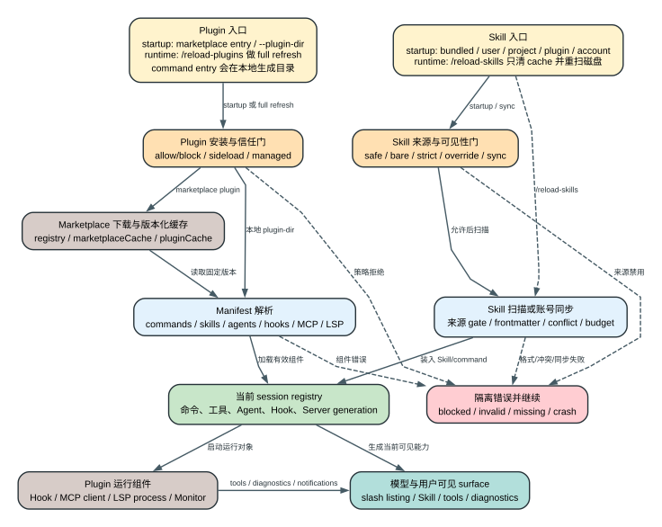

# Claude Code CLI 2.1.235 的 Plugins、Skills、Slash Commands 与 LSP 生命周期

这四个能力经常被分别介绍，但在 `2.1.235` 中它们共享一条动态扩展链：来源先经过信任与企业策略，再进入版本化缓存和 manifest 解析，最后变成当前 session 的命令、Skill、Agent、Hook、MCP 或 LSP surface。文件存在不等于本轮 Agent 已经看见，安装成功也不等于当前 registry 已刷新。

## 60 秒理解动态扩展

**读者问题：** 为什么一个插件已经安装，`/plugin` 也显示 enabled，模型仍然看不到它的 Skill、命令或 LSP？为什么 `/reload-plugins` 有时还警告会破坏 prompt cache？

**一句话模型：** 安装状态、enabled settings、当前 session registry、模型本轮可见 listing 和已启动 LSP/MCP process 是五份不同状态；只有来源、策略、依赖、manifest、运行时刷新和组件启动全部成功后，能力才真正可用。



贯穿场景：团队在 project settings 启用 `formatter@team-marketplace`。新机器先要认识并允许该 marketplace，再下载固定版本，验证 manifest 和依赖，读取它的 Skill/command/LSP 配置，把组件装入当前 registry，启动 language server，最后才向模型展示 Skill 描述和诊断。若用户只修改了磁盘文件但未 reload，安装目录已经变化，当前 session 仍可能继续使用旧对象。

| 状态对象 | 主要所有者 | 何时改变 | 不能证明什么 |
| --- | --- | --- | --- |
| marketplace registry | storage v5 `pluginRegistry` | add/remove/update/policy migration | 某 plugin 已下载或 enabled |
| marketplace manifest/catalog | `marketplaceCache` | refresh source | 本地固定版本内容有效 |
| installed plugin bytes | `pluginCache(marketplace,plugin,version,relPath)` | install/update/orphan sweep | 当前 session 已重新加载 |
| enabled decision | 五层 settings + dependency closure | settings/policy/reload | 每个组件都启动成功 |
| session plugin registry | App state `plugins`、commands、agents、MCP/LSP generation | startup 或 `/reload-plugins` | 远端服务或 language server 正常 |
| model listing | system/context builder | 下一次 context/request rebuild | 用户可手动输入的全部 slash command |
| LSP process | LSP manager | 文件类型出现、reload、crash/restart | diagnostics 永远新鲜或无误报 |

## 插件来源：先决定“可不可以碰”，再决定“能不能装”

### Marketplace entry 与 plugin source

manifest schema 位于 readable JS 39770-40080。`2.1.235` 的 marketplace plugin entry 接受以下 source 类型；这是一组 entry source，不等于全部都是远端下载协议：

- `npm`
- `url`
- `github`
- `git-subdir`
- `archive`
- `command`

其中 `command` 是本地 shell producer：命令执行后产出 plugin directory，因此不能归类为“远端 plugin source”。另外还存在本地/inline/session sideload 路径。Marketplace 名称禁止空格、path separator、`..`，并阻止冒充 Anthropic/Claude 官方名称；`inline`、`builtin`、`skills-dir` 是保留名字。

Archive URL 必须使用 HTTPS，且不能指向 loopback、link-local 或 cloud metadata host。这个校验发生在“准备下载”层，不替代下载内容 hash、manifest 路径和安装后组件校验。

`command` source 风险更高：marketplace 声明的本地命令会产生 plugin directory。managed `disableCommandPluginSources=true` 会让它完全不执行；未设置时还会跟随 `allowManagedHooksOnly` 的限制。无效值 fail closed，schema recovery 会把它当 true。

### 四组看似相近、实际不同的策略

| Setting | 作用 | 发生时机 | 常见误解 |
| --- | --- | --- | --- |
| `extraKnownMarketplaces` | 注册额外来源 | discovery | 注册不等于允许下载 |
| `strictKnownMarketplaces` | managed allowlist | 下载前 | 它不自动注册 marketplace |
| `blockedMarketplaces` | managed blocklist | 下载前 | 命中后 bytes 不应落盘 |
| `disableSideloadFlags` | 拒绝 plugin-dir/url/agents/部分 MCP CLI sideload | startup argv | 不等于关闭所有 MCP 入口 |

`allowedMarketplaces`、`additionalMarketplaces` 是兼容 alias；同一文件同时设置新旧 key 会产生 warning，旧客户端是否理解 alias 仍是版本边界。

`strictPluginOnlyCustomization` 可从 managed policy 阻断 user/project 的 skills、hooks、MCP 等非 plugin customization；它与 marketplace allowlist 组合后，管理员才能同时控制“插件从哪里来”和“是否允许绕过插件直接注入”。

### 跨 Marketplace 依赖不是传递信任

Marketplace manifest 可以声明 `allowCrossMarketplaceDependenciesOn`。loader 只读取**根声明 marketplace**的 allowlist，不做无限传递信任：A 允许 B，不意味着 B 的依赖 C 自动被允许。缺少依赖时 `/reload-plugins` 会尝试解析、安装，再重新加载；仍不满足就保留 `dependency-unsatisfied` 或 version error。

## 安装、Enable 与当前 Session 是三步

### 安装 scope 与 registry

Plugin registry 支持 v1 到 v2 结构：v2 把一个 `plugin@marketplace` 映射到多条 managed/user/project/local installation entry，每条记录 installPath、version、installedAt、lastUpdated、Git SHA、resolvedVersion 和是否由依赖自动安装。`auto: true` 的孤儿依赖可被 sweep；手动安装默认保留。

storage v5 的专用对象：

- `pluginRegistry`: `installed`、`marketplaces`、`flagged`、`catalog`、`inUseSweep`；
- `marketplaceCache`: `manifest`、`catalog`；
- `pluginCache`: marketplace/plugin/version/relative path；
- plugin cache 还写入 process marker 和使用 stamp，用于并发/清理判断。

这些对象让“下载的哪个版本”和“当前进程正在用什么”分离，避免 updater 直接改写已加载目录。

### `enabledPlugins` 的合并

key 使用 `plugin-id@marketplace-id`，值可为 boolean、版本列表或扩展约束。schema 明确给出 settings precedence：user < project < local < flag < policy。因此 project 启用、user 关闭时 project 胜出；要在本机关闭项目启用项，应在 local 设置 false。

`defaultEnabled` 只在用户没有显式决定时生效。依赖 closure 可让 required plugin 即使自身 default 为 false 仍被启用。Enable 之后仍要验证：installed cache、manifest、dependency version、component path、policy 和启动结果。

### Flagged plugin

flagged 状态独立持久化；记录 `flaggedAt`、`seenAt`，已 seen 项在 172,800,000ms 后清理。它是本地诊断/提示状态，不等于远端 malware verdict，也不能被写成 Anthropic 服务端封禁判定。

## 一个 Plugin 能提供什么

`2.1.235` plugin manifest 不是“只有 Skills 的文件夹”。它可声明：

| 组件 | 主要输入 | 进入当前 session 后的对象 |
| --- | --- | --- |
| Commands | Markdown path、inline content、description/model/allowed tools | namespaced prompt slash command |
| Skills | 一个或多个 skill directory | Skill tool + 可输入 slash command + listing |
| Agents | agent Markdown files | agent definitions / `Task` selector |
| Hooks | JSON path 或 inline hook config | 31 类 hook registry |
| MCP | `.mcp.json`、inline config、MCPB/DXT path 或 URL | MCP clients/tools/resources/prompts |
| LSP | `.lsp.json` 或 inline server config | server manager + `LSP` tool/diagnostics |
| Workflows | directory 或 `.js` | prompt command + `Workflow` script |
| Output styles/themes | file/directory | render/system response style |
| Syntax highlighting | 最多 16 个 language package spec | Highlight.js language extension |
| Channels | MCP server binding + user config | inbound channel capability |
| Monitors | persistent shell command + arm trigger | session lifetime background Monitor task |
| User config | typed fields | settings 或 secure storage + substitution |

显式列出某类 component path 时，默认目录的自动扫描可能被替代；不是“自定义 path 再加默认目录”一律成立。Command schema要求 `source` 和 `content` 二选一。

Plugin user config 支持 string/number/boolean/directory/file、required/default/min/max/multiple。`sensitive: true` 会把值放 secure storage，而不是 settings JSON；skill/agent content 只允许替换非敏感值，hook/MCP/LSP 的凭据传播仍需各自 scrub 和 trust 边界。

Plugin Monitor 是 unsandboxed、与 hooks 同 trust tier 的 session-lifetime process。它可在 startup/reload 或首次调用指定 Skill 时 arm，stdout 每行变成 task notification。它不是普通 Skill 文本，因此安装来源的信任决定是否允许进程执行。

## Skills：发现、列入 Prompt、调用是三件事

### 来源层

本版可见来源至少包括 bundled、user、project、plugin、account-synced。每个来源受不同 gate：

- safe mode 关闭 custom skills；
- bare mode 跳过 plugin sync 等自动装载，但显式 `/skill-name` 仍有单独解析边界；
- `disableBundledSkills` 移除 bundled skills/workflows，但 built-in slash command 仍可手动输入，只是不列给模型；
- `strictPluginOnlyCustomization` 可阻断 user/project skills；
- `skillOverrides` 可设 `on`、`name-only`、`user-invocable-only`、`off`。

`user-invocable-only` 的关键含义是：用户仍可输入 `/name`，模型 listing 不包含它。不能通过“模型没有看到”推断命令不存在。

### Listing 预算

Skill listing 是每轮 context 成本的一部分，不是一次性 UI 菜单：

- `skillListingMaxDescChars` 默认 1536 chars/skill；
- `skillListingBudgetFraction` 默认用 context window 的 1% 字符预算；
- 超出预算会缩短 description；
- `name-only` 进一步只保留名字；
- `/skill-doctor` 结合 listing footprint、usage counter 与 transcript usage 诊断长期未用内容。

Prompt cache 可降低稳定 listing 后续读成本，但 listing 仍占逻辑上下文；插件或 Skill generation 改变会重建对应 prefix。

### Account-synced Skills

`syncClaudeAiSkills` 的 schema 给出非常具体的本版语义：

- 只有 false 是本地强制值；true 不能提前开启服务端尚未给账号的能力；
- user 或 managed false 会停止下载、隐藏 synced skills，并在下次 launch 把旧目录移动到 trash，按 cleanup period 删除；重新启用会重新下载，不是从 trash 恢复；
- local/flag false 只阻断当前 workspace/invocation，不搬全局目录；
- project settings 不读取该 key；
- 开启时约每 10 分钟重新同步，claude.ai 端禁用项会被移除；
- 只适用于 Claude account 登录。

无效值按 false 处理，属于 fail closed。

### Skill 内容执行

Skill/自定义 command 可包含 inline shell expansion。`disableSkillShellExecution` 会用 placeholder 替代 user/project/plugin source 的 inline shell，而不是执行后再隐藏输出。Skill text 仍是不可信扩展指令：它不能绕过 tool permission、managed policy 或 sandbox。

## Slash Command：三种执行模型

静态集合见 `slash-command-identifiers.txt`，共 103 个保守 identifier。动态 plugin/MCP command、feature-gated host 注入和同名不同 renderer 可能不在这个计数内。

### `local`

本地 command 加载一个 call handler，可声明 `supportsNonInteractive`、`isEnabled`、`isHidden`、`thinClientDispatch`。典型用途是修改 session/config、输出状态或触发本地 lifecycle，例如 `/compact`、`/reload-skills`、非交互 `/model`。

### `local-jsx`

该类型打开 Ink/TUI component 或交互 dialog，例如 `/plugin`、`/tasks`、`/status`。同一个 command 可能同时有 `local-jsx` 与 `local` twin：交互 CLI 用前者，thin client/noninteractive 用后者。二者共享名字不表示实现路径相同。

### `prompt`

Prompt command把内容变成用户/系统上下文并可能继续进入 Agent Loop。字段可包含：

- allowed/disallowed tools；
- model/effort；
- `context: fork`；
- agent/background；
- userInvocable 与 model invocation visibility；
- hooks、requires、argument hints 和 completion；
- source、loadedFrom、pluginInfo/provenance。

Plugin command 使用 `plugin:name` namespace；manifest 可从 Markdown path 或 inline content 构造。动态 workflow 也会包装成 prompt command，再调用 `Workflow`。

### 可见、可输入、可由模型调用

这三个布尔状态必须分开：

| 状态 | 主要字段/机制 | 例子 |
| --- | --- | --- |
| 用户菜单可见 | `isHidden`、availability、requires | hidden migration/upsell command 不进入菜单 |
| 用户手动可输入 | `userInvocable`、parser/alias | `user-invocable-only` Skill |
| 模型 listing 可见 | `disableModelInvocation`、Skill override、context budget | built-in command 仍能输入但不列给模型 |

因此“103 个 command identifier”不能直接解释成“用户此刻菜单里有 103 项”。完整逐命令状态图需要按 type、gate、持久化和远端依赖逐项列出。

## Reload：为什么改了磁盘还不生效

### `/reload-skills`

readable JS 365683 附近会：

1. 读取 reload 前当前 cwd 的 skills，并排除 MCP command 冲突；
2. 清理 skill 相关内存 cache；
3. 重新扫描磁盘；
4. emit command-change signal；
5. 返回总数、added/removed；
6. safe mode 下明确提示 custom skills disabled。

它不负责重新安装 plugin、重新解析 marketplace dependency 或启动 plugin LSP/MCP。

### `/reload-plugins`

readable JS 365500-365680 的 `refreshActivePlugins` 会清空 plugin caches、重新读取 enabled/disabled/errors/warnings，重建 commands、agents、MCP、LSP、hooks，更新 app state，并递增 `mcp.pluginReconnectKey`。这个 generation 变化属于显式 `/reload-plugins` 的 full refresh，不等同于普通 LSP process 断线重连。

Reload 前会比较 plugin MCP server added/removed。如果 Tool Search 未接管 schema residency 且当前已有 context，变更会让下一条消息重读整个 conversation，命令先给出 cache impact warning；只有 `--force` 才直接应用。这个 warning 不是“插件一定破坏缓存”，而是具体 MCP tool schema set 改变可能打断 request prefix。

缺失 dependency 可在 reload 中安装；若安装成功会再跑一次完整 refresh。最终结果按 enabled plugin、command/skill、agent、hook、MCP、LSP 和 error 计数返回。单个 component load failure 会进入 errors，其他 plugin/component 仍可继续。

远端/thin client 通过 `reload_plugins` control request 执行；本地 UI 显示的结果必须来自远端 response，不能用本地 registry 猜远端状态。

## LSP：Plugin 只是配置来源，Server 才是运行对象

### Manifest contract

每个 LSP server 配置包含：

- `command`、`args`；
- `extensionToLanguage`，至少一个 `.ext -> language id`；
- `transport`: `stdio` 默认，或 `socket`；
- `env`、`initializationOptions`、`settings`；
- `workspaceFolder`；
- `startupTimeout`、`shutdownTimeout`；
- `restartOnCrash`、`maxRestarts`；
- `diagnostics`，默认 true；false 时仍保留 navigation，但不把 publishDiagnostics 自动注入 Agent context。

Plugin path 不能用 `..` 逃出 root。启动 executable、env 和 workspace 均属于本地执行边界，信任级别不能低于 plugin/hook。

### 运行状态机

```text
plugin config accepted
-> file extension activates server
-> spawn/connect (stdio or socket)
-> initialize + workspace/config
-> navigation requests and publishDiagnostics
-> shutdown/reload

crash -> restartOnCrash + maxRestarts -> give up/error
request -> timeout/failure -> tool error, server may remain alive
```

错误类型在 495700 附近完整区分：invalid config、start failed、crashed(exit/signal)、request timeout、request failed。诊断 UI 建议查看 `--debug` server logs；不能把所有失败都归因于“LSP 没装”。

### `LSP` tool 与 diagnostics

内置 `LSP` tool 提供 definition、references、hover、symbols、implementation、call hierarchy 九种 operation。Plugin LSP manager 还会把 diagnostics 注入 context；两条链共享 server process，但消费方式不同：

- tool call 是显式、带 `tool_use_id` 的请求/结果；
- diagnostics 是 server push 后形成的动态上下文；
- `diagnostics:false` 只关闭后者；
- navigation 使用会计入 plugin usage；diagnostic delivery 也能证明 LSP 提供过价值，但 transcript 不一定保存 server name。
- 没有匹配 server 时，内置工具返回普通 `data.result` 错误文本，而不是统一 `is_error` tool result；Agent 必须根据内容决定是否安装/启用 LSP 或改用文本检索。

### 本版 prompt-cache 修复的准确含义

`2.1.235` release note 能证明的范围是：LSP 断线/重连本身不再使整个 prompt cache 失效。发布说明没有穷举所有仍会改变 cache key/prefix 的输入，因此不能反推“只有 diagnostics、tool surface 或实际 context 内容变化才会失效”。显式 `/reload-plugins` 会重建 plugin 组件并递增 `mcp.pluginReconnectKey`；普通 LSP reconnect 与 plugin full refresh 是两条不同路径。这个修复也不是服务端 cache 命中保证，更不意味着任意 plugin/MCP reload 都不影响 cache。

## 精确二进制闭环：Plugin Skill 怎样进入下一轮，LSP 怎样真正启动

静态 schema 能说明 Plugin 可以声明 Skill 和 LSP，却不能单独证明发布二进制会怎样把两者接回 Agent Loop。`plugin-skill-lsp.json` 因此构造了一个临时 `--plugin-dir`：它只包含一个 Skill、一个 `.probe` 文件和一个 stdio LSP server，模型端与 server 都是本地受控 fixture。

### Skill 不是“把 Markdown 塞进 tool_result”

实际观察到的三步是：

1. 第一个 Messages request 的 Skill listing 出现 `probe-plugin:probe-skill` 和 description marker；
2. `Skill` tool use 获得同 ID 的 `Launching skill: probe-plugin:probe-skill` acknowledgement；
3. Skill 正文 marker 另行注入第二个 Messages request，供下一次模型决策读取。

这解释了两个常见误判：看到 launch acknowledgement 只证明 dispatch 已接受，不能只从该字符串判断正文已经进入模型；反过来，正文注入属于下一轮上下文变化，可能改变 token footprint 和 cache prefix，不能当成一个零成本的 UI 展开。

### LSP schema 可 deferred，但 server 生命周期仍由 Plugin manager 持有

同一探针在 allowlist 中明确给出 `LSP`，首个 request 仍只发送 `Skill` schema；这符合 `LSP.shouldDefer=true`，不代表工具未注册。受控模型发出 LSP tool use 后，真实进程顺序为：

```text
initialize
-> initialized
-> textDocument/didOpen
-> textDocument/definition
-> paired tool_result
-> shutdown
```

工具输入是编辑器习惯的 `line=1, character=1`，fake server 收到 LSP protocol 的 `line=0, character=0`。definition 结果包含 fixture 文件位置，并以原 `tool_use_id` 回到第三个 Messages request，最终 CLI 输出 `PLUGIN_SKILL_LSP_OK`、exit 0。

这个 Probe 把四层状态分开：Plugin manifest 决定 server config；tool schema residency 可以 deferred；LSP manager 持有进程、open-file 和 request；Agent Loop 只通过配对 result 观察结果。第三方 server 的索引算法、跨平台 executable 和真实项目诊断准确率仍是外部 Boundary。

## 失败矩阵

| 故障 | 失败前是否下载/执行 | 当前 session 状态 | 修复动作 |
| --- | --- | --- | --- |
| marketplace 被 policy block | 否 | 无新 cache/registry | 管理员调整 allow/block；不能本地绕过 |
| network/Git/auth/timeout | 可能有临时 bytes | 旧安装仍可保留 | 修复连接/凭据，重新 update |
| manifest parse/validation | 已下载，未加载有效组件 | plugin error | 修 manifest/schema，reload |
| path traversal/missing component | 不执行该 component | 其他组件可继续 | 修相对路径，保持 root 内 |
| dependency missing/version mismatch | root plugin 不能完整启用 | error + optional resolver | 注册/允许 marketplace，安装匹配版本 |
| command/skill 单文件过大或 frontmatter 错 | 跳过该项 | 其余 command 可见 | 缩小/修复文件后 reload |
| hook load failed | plugin 其他组件可在 registry | hook 不运行 | `/plugin` 查看错误，修配置 |
| LSP start/crash | plugin 可 enabled | 无有效 server/diagnostic | debug logs、修 executable/env/config |
| reload MCP set 改变 | 尚未应用时可先 warning | 旧 generation 继续 | 确认 cache 成本后 `--force` |
| safe mode | 不加载 custom surface | built-in/auth/model仍工作 | 用于诊断；退出 safe mode再验证来源 |

## 用户影响、成本与安全

- Skill descriptions、Agent definitions、MCP schemas、diagnostics 都消耗 context；“安装很多但不用”仍可能产生每轮成本。
- Prompt cache 能降低稳定 prefix 后续输入费用，不能消除逻辑上下文占用；reload/generation 改变会影响复用。
- Plugin source 可带本地 executable、hook、monitor、MCP/LSP server；marketplace 名称和 UI 描述不是信任证明。
- Sensitive plugin config 进入 secure storage，但传给本地 server/hook 后仍存在进程环境和子进程泄露面。
- Project settings 可启用 plugin，local settings 可覆盖；managed policy 应在下载前阻止不可信 marketplace，而不是等代码运行后再阻止工具。
- Account-synced Skill、marketplace catalog、plugin suggestion 和 entitlement 依赖远端；客户端只能证明 gate 与本地状态，不能证明某账号当前返回值。
- LSP diagnostics 和 plugin command 内容来自项目/扩展，属于不可信数据；它们不能覆盖 system/user 指令或绕过 permission。

## 证据与版本边界

主要 Static 范围：manifest/source/schema 39770-40080；storage key factory 38091、109295-110552；account skill sync 211650 附近；bundled/plugin prompt command 构造 181560-185186；command types 329343-369315；plugin errors/LSP errors 495609-495802；plugin refresh 与 reload 365500-365683；LSP tool 296229-296537。

精确 `2.1.235` Probe：[`plugin-skill-lsp.json`](runtime-probes/plugin-skill-lsp.json) 绑定发布二进制 SHA-256，验证 Plugin Skill listing/acknowledgement/body injection，以及 LSP initialize/open/definition/shutdown、坐标换算和 paired result。探针脚本位于长期 Skill 的 `scripts/probe_plugin_skill_lsp.mjs`，后续版本可原样重跑并比较 wire shape。

机器集合：[slash-command-identifiers.txt](source-inventory/slash-command-identifiers.txt)、[root-settings-schema.jsonl](source-inventory/root-settings-schema.jsonl)、[hook-events.txt](source-inventory/hook-events.txt)、[claude-storage-namespaces.txt](source-inventory/claude-storage-namespaces.txt)。

这些证据证明 `2.1.235` 的客户端来源、schema、policy、cache、loader、reload、LSP process 和错误分支。Marketplace 远端内容在未来时刻是什么、账号是否拿到 synced-skill entitlement、某第三方 plugin 是否可信、LSP server 自身算法以及 Anthropic 服务端推荐排序不在发布 bundle 中，保持 Runtime/Public/Boundary，不能倒灌成本版本事实。
