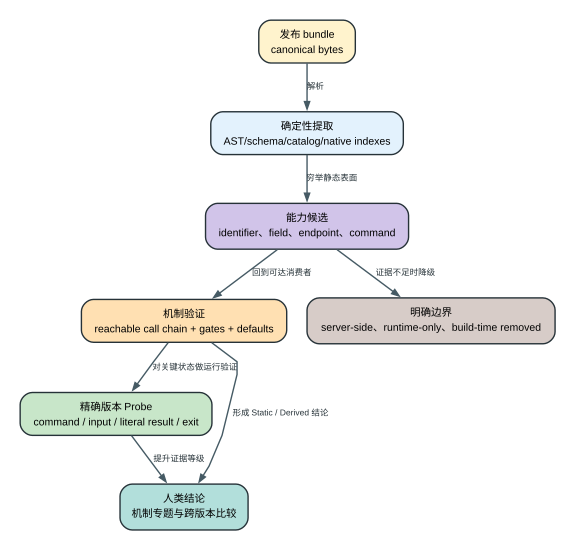

# Claude Code CLI 2.1.235 产品表面与 70 类证据归属地图

这篇不是把 70 个文件重新堆成目录，而是回答：每类机器清单为什么存在、能证明哪一层、应该回到哪篇人类专题，以及什么时候必须停止推断。

## 60 秒理解这张地图

**读者问题：** `summary.json` 已经注册 70 类清单，为什么仍可能不全面？

**一句话模型：** 清单解决“候选证据有没有漏”，专题解决“消费者和状态机讲没讲清”，Probe 解决“发布二进制是否真的走过该分支”，Boundary 解决“发布物根本不携带什么”；四层缺一都不能用数量代替。

贯穿场景：读者在 `urls.txt` 看到一个远端地址，在 `feature-flags.txt` 看到一个开关，在 `error-message-literals.txt` 看到一条失败文案。地址可能来自依赖，flag 只有 consumer 才能说明 gate，错误文本只有进入可达分支才说明运行语义。地图先给三者定归属，再把读者送到请求、Feature 或恢复专题，而不是让名字自行生成结论。

| 层 | 它拥有的事实 | 不能替代什么 |
| --- | --- | --- |
| Canonical/AST inventory | packed bytes、完整目标调用点、动态表达式和词法候选 | 产品归属、可达性、状态机 |
| Human mechanism | consumer、owner、调用顺序、gate、失败、恢复和用户影响 | 精确二进制实际走过分支 |
| Exact-binary Probe | 固定输入下的 request/result/exit/副作用 | 真实账号、第三方服务、其他平台 |
| Boundary | 明确发布物缺少的实现和值 | 不能用猜测补空白 |

## 七个证据域怎样分工

| 证据域 | 清单数 | 先问什么 | 主要阅读入口 |
| --- | ---: | --- | --- |
| 请求、模型与网络地址 | 12 | 哪些值进入 provider/model/header/route 装配，哪些只是 bundle 中出现过的地址？ | [models-auth-providers-request.md](models-auth-providers-request.md)、[technical-architecture.md](technical-architecture.md)、[source-surface.md](source-surface.md) |
| 工具、命令、Hooks 与协议 | 7 | 哪些是客户端真实注册/dispatch surface，哪些是内嵌 MCP 或兼容标识？ | [builtin-tools-reference.md](builtin-tools-reference.md)、[cli-sdk-output-protocol.md](cli-sdk-output-protocol.md)、[plugins-skills-commands-lsp.md](plugins-skills-commands-lsp.md)、[slash-command-reference.md](slash-command-reference.md)、[hooks-event-reference.md](hooks-event-reference.md) |
| Settings、环境变量与 Policy | 13 | 哪些字段有 typed schema/consumer，哪些名字只来自广义环境或 schema 字符串？ | [settings-reference.md](settings-reference.md)、[settings-feature-flags-policy.md](settings-feature-flags-policy.md)、[inventory-field-guide.md](inventory-field-guide.md) |
| 遥测、诊断出口与 Feature Evaluation | 27 | 事件从哪里产生、走哪条 transport、哪些字段会被采样/脱敏，哪些只是依赖 schema？ | [telemetry.md](telemetry.md)、[feature-flags-remote-config.md](feature-flags-remote-config.md)、[public-claims-validation.md](public-claims-validation.md) |
| 错误、诊断与恢复线索 | 6 | 错误文本由哪个 consumer/状态机产生，还是仅作为词法证据存在？ | [resilience-and-recovery.md](resilience-and-recovery.md)、[install-update-doctor-lifecycle.md](install-update-doctor-lifecycle.md)、[inventory-field-guide.md](inventory-field-guide.md) |
| Storage namespace 与运行依赖 | 3 | 哪些 key 有一方 typed consumer，哪些 namespace/require 来自依赖或可选 runtime？ | [storage-v5-reference.md](storage-v5-reference.md)、[native-bridge-runtime.md](native-bridge-runtime.md)、[source-surface.md](source-surface.md) |
| 完整词法证据底座 | 2 | 怎样证明没有因为动态表达式、模板或长字符串而漏检候选证据？ | [inventory-field-guide.md](inventory-field-guide.md)、[source-surface.md](source-surface.md)、[completeness-audit.md](completeness-audit.md) |

## 六种归属标签怎么读

| 标签 | 结论强度 | 正确用法 |
| --- | --- | --- |
| `Product structured` | 一方结构化集合或完整 catalog/schema | 可作为穷举入口，仍需 consumer/状态机 |
| `Product callsites` | AST 确认的一方调用点 | 可定位真实消费者和动态参数 |
| `Product broad surface` | 一方相关但粒度较宽的 identifier 集合 | 用于发现入口，不能直接声称默认启用 |
| `Mixed heuristic` | 产品、依赖、内嵌文档可能混合 | 必须二次归属，不能按名字计功能数 |
| `Dependency surface` | 第三方依赖或 runtime contract | 只在一方 consumer 可达时进入产品机制 |
| `Evidence substrate` | 完整词法/错误/模板证据底座 | 用于防漏和定位，不单独证明可达行为 |

## 70/70 精确归属

下面是机器核对附录。顺序和文件集合必须与 `analysis/source-inventory/summary.json` 完全一致；新增版本出现新类别时，生成器会拒绝继续，直到维护者明确归属和阅读路由。

<!-- SOURCE_INVENTORY_COVERAGE_BEGIN -->
| 机器清单 | 证据域 | 归属 | 人类阅读入口 | 不能越过的边界 |
| --- | --- | --- | --- | --- |
| [`anthropic-beta-identifiers.txt`](source-inventory/anthropic-beta-identifiers.txt) | `request-model-network` | `Product broad surface` | [models-auth-providers-request.md](models-auth-providers-request.md)、[technical-architecture.md](technical-architecture.md)、[source-surface.md](source-surface.md) | 远端路由、账号 entitlement、服务端实现和 URL 背后的实时内容不在发布物中。 |
| [`api-path-templates.jsonl`](source-inventory/api-path-templates.jsonl) | `request-model-network` | `Product callsites` | [models-auth-providers-request.md](models-auth-providers-request.md)、[technical-architecture.md](technical-architecture.md)、[source-surface.md](source-surface.md) | 远端路由、账号 entitlement、服务端实现和 URL 背后的实时内容不在发布物中。 |
| [`api-paths.txt`](source-inventory/api-paths.txt) | `request-model-network` | `Mixed heuristic` | [models-auth-providers-request.md](models-auth-providers-request.md)、[technical-architecture.md](technical-architecture.md)、[source-surface.md](source-surface.md) | 远端路由、账号 entitlement、服务端实现和 URL 背后的实时内容不在发布物中。 |
| [`builtin-tool-identifiers.txt`](source-inventory/builtin-tool-identifiers.txt) | `tools-commands-protocol` | `Product structured` | [builtin-tools-reference.md](builtin-tools-reference.md)、[cli-sdk-output-protocol.md](cli-sdk-output-protocol.md)、[plugins-skills-commands-lsp.md](plugins-skills-commands-lsp.md)、[slash-command-reference.md](slash-command-reference.md)、[hooks-event-reference.md](hooks-event-reference.md) | 第三方 host、MCP server、Plugin 和 Hook 程序自身行为仍属于外部实现。 |
| [`claude-storage-namespaces.txt`](source-inventory/claude-storage-namespaces.txt) | `storage-runtime` | `Product structured` | [storage-v5-reference.md](storage-v5-reference.md)、[native-bridge-runtime.md](native-bridge-runtime.md)、[source-surface.md](source-surface.md) | adapter、外部进程和平台依赖是否真实可用需要运行或环境证据。 |
| [`datadog-forwarded-events.txt`](source-inventory/datadog-forwarded-events.txt) | `telemetry-feature` | `Product structured` | [telemetry.md](telemetry.md)、[feature-flags-remote-config.md](feature-flags-remote-config.md)、[public-claims-validation.md](public-claims-validation.md) | 服务端留存、实验分桶、实时 flag 值和第三方 collector 行为不由客户端 bundle 决定。 |
| [`datadog-redacted-fields.txt`](source-inventory/datadog-redacted-fields.txt) | `telemetry-feature` | `Product structured` | [telemetry.md](telemetry.md)、[feature-flags-remote-config.md](feature-flags-remote-config.md)、[public-claims-validation.md](public-claims-validation.md) | 服务端留存、实验分桶、实时 flag 值和第三方 collector 行为不由客户端 bundle 决定。 |
| [`datadog-tag-fields.txt`](source-inventory/datadog-tag-fields.txt) | `telemetry-feature` | `Product structured` | [telemetry.md](telemetry.md)、[feature-flags-remote-config.md](feature-flags-remote-config.md)、[public-claims-validation.md](public-claims-validation.md) | 服务端留存、实验分桶、实时 flag 值和第三方 collector 行为不由客户端 bundle 决定。 |
| [`diagnostic-message-callsites.jsonl`](source-inventory/diagnostic-message-callsites.jsonl) | `diagnostics-errors` | `Evidence substrate` | [resilience-and-recovery.md](resilience-and-recovery.md)、[install-update-doctor-lifecycle.md](install-update-doctor-lifecycle.md)、[inventory-field-guide.md](inventory-field-guide.md) | 文本出现不能单独证明分支可达、错误分类正确或恢复成功。 |
| [`diagnostic-message-literals.txt`](source-inventory/diagnostic-message-literals.txt) | `diagnostics-errors` | `Evidence substrate` | [resilience-and-recovery.md](resilience-and-recovery.md)、[install-update-doctor-lifecycle.md](install-update-doctor-lifecycle.md)、[inventory-field-guide.md](inventory-field-guide.md) | 文本出现不能单独证明分支可达、错误分类正确或恢复成功。 |
| [`diagnostic-message-templates.jsonl`](source-inventory/diagnostic-message-templates.jsonl) | `diagnostics-errors` | `Evidence substrate` | [resilience-and-recovery.md](resilience-and-recovery.md)、[install-update-doctor-lifecycle.md](install-update-doctor-lifecycle.md)、[inventory-field-guide.md](inventory-field-guide.md) | 文本出现不能单独证明分支可达、错误分类正确或恢复成功。 |
| [`direct-process-environment-accesses.txt`](source-inventory/direct-process-environment-accesses.txt) | `settings-environment-policy` | `Product callsites` | [settings-reference.md](settings-reference.md)、[settings-feature-flags-policy.md](settings-feature-flags-policy.md)、[inventory-field-guide.md](inventory-field-guide.md) | 运行时文件、管理员下发值、环境值和远端 policy payload 不包含在固定 bundle 中。 |
| [`dynamic-process-environment-callsites.jsonl`](source-inventory/dynamic-process-environment-callsites.jsonl) | `settings-environment-policy` | `Product callsites` | [settings-reference.md](settings-reference.md)、[settings-feature-flags-policy.md](settings-feature-flags-policy.md)、[inventory-field-guide.md](inventory-field-guide.md) | 运行时文件、管理员下发值、环境值和远端 policy payload 不包含在固定 bundle 中。 |
| [`endpoint-hosts.txt`](source-inventory/endpoint-hosts.txt) | `request-model-network` | `Mixed heuristic` | [models-auth-providers-request.md](models-auth-providers-request.md)、[technical-architecture.md](technical-architecture.md)、[source-surface.md](source-surface.md) | 远端路由、账号 entitlement、服务端实现和 URL 背后的实时内容不在发布物中。 |
| [`environment-access-callsites.jsonl`](source-inventory/environment-access-callsites.jsonl) | `settings-environment-policy` | `Product callsites` | [settings-reference.md](settings-reference.md)、[settings-feature-flags-policy.md](settings-feature-flags-policy.md)、[inventory-field-guide.md](inventory-field-guide.md) | 运行时文件、管理员下发值、环境值和远端 policy payload 不包含在固定 bundle 中。 |
| [`environment-access-identifiers.txt`](source-inventory/environment-access-identifiers.txt) | `settings-environment-policy` | `Mixed heuristic` | [settings-reference.md](settings-reference.md)、[settings-feature-flags-policy.md](settings-feature-flags-policy.md)、[inventory-field-guide.md](inventory-field-guide.md) | 运行时文件、管理员下发值、环境值和远端 policy payload 不包含在固定 bundle 中。 |
| [`environment-like-identifiers.txt`](source-inventory/environment-like-identifiers.txt) | `settings-environment-policy` | `Mixed heuristic` | [settings-reference.md](settings-reference.md)、[settings-feature-flags-policy.md](settings-feature-flags-policy.md)、[inventory-field-guide.md](inventory-field-guide.md) | 运行时文件、管理员下发值、环境值和远端 policy payload 不包含在固定 bundle 中。 |
| [`environment-proxy-accesses.txt`](source-inventory/environment-proxy-accesses.txt) | `settings-environment-policy` | `Product callsites` | [settings-reference.md](settings-reference.md)、[settings-feature-flags-policy.md](settings-feature-flags-policy.md)、[inventory-field-guide.md](inventory-field-guide.md) | 运行时文件、管理员下发值、环境值和远端 policy payload 不包含在固定 bundle 中。 |
| [`environment-schema.jsonl`](source-inventory/environment-schema.jsonl) | `settings-environment-policy` | `Product structured` | [settings-reference.md](settings-reference.md)、[settings-feature-flags-policy.md](settings-feature-flags-policy.md)、[inventory-field-guide.md](inventory-field-guide.md) | 运行时文件、管理员下发值、环境值和远端 policy payload 不包含在固定 bundle 中。 |
| [`error-message-callsites.jsonl`](source-inventory/error-message-callsites.jsonl) | `diagnostics-errors` | `Evidence substrate` | [resilience-and-recovery.md](resilience-and-recovery.md)、[install-update-doctor-lifecycle.md](install-update-doctor-lifecycle.md)、[inventory-field-guide.md](inventory-field-guide.md) | 文本出现不能单独证明分支可达、错误分类正确或恢复成功。 |
| [`error-message-literals.txt`](source-inventory/error-message-literals.txt) | `diagnostics-errors` | `Evidence substrate` | [resilience-and-recovery.md](resilience-and-recovery.md)、[install-update-doctor-lifecycle.md](install-update-doctor-lifecycle.md)、[inventory-field-guide.md](inventory-field-guide.md) | 文本出现不能单独证明分支可达、错误分类正确或恢复成功。 |
| [`error-message-templates.jsonl`](source-inventory/error-message-templates.jsonl) | `diagnostics-errors` | `Evidence substrate` | [resilience-and-recovery.md](resilience-and-recovery.md)、[install-update-doctor-lifecycle.md](install-update-doctor-lifecycle.md)、[inventory-field-guide.md](inventory-field-guide.md) | 文本出现不能单独证明分支可达、错误分类正确或恢复成功。 |
| [`feature-flag-callsites.jsonl`](source-inventory/feature-flag-callsites.jsonl) | `telemetry-feature` | `Product callsites` | [telemetry.md](telemetry.md)、[feature-flags-remote-config.md](feature-flags-remote-config.md)、[public-claims-validation.md](public-claims-validation.md) | 服务端留存、实验分桶、实时 flag 值和第三方 collector 行为不由客户端 bundle 决定。 |
| [`feature-flags.txt`](source-inventory/feature-flags.txt) | `telemetry-feature` | `Product structured` | [telemetry.md](telemetry.md)、[feature-flags-remote-config.md](feature-flags-remote-config.md)、[public-claims-validation.md](public-claims-validation.md) | 服务端留存、实验分桶、实时 flag 值和第三方 collector 行为不由客户端 bundle 决定。 |
| [`first-party-environment-fields.txt`](source-inventory/first-party-environment-fields.txt) | `telemetry-feature` | `Product structured` | [telemetry.md](telemetry.md)、[feature-flags-remote-config.md](feature-flags-remote-config.md)、[public-claims-validation.md](public-claims-validation.md) | 服务端留存、实验分桶、实时 flag 值和第三方 collector 行为不由客户端 bundle 决定。 |
| [`first-party-event-callsites.jsonl`](source-inventory/first-party-event-callsites.jsonl) | `telemetry-feature` | `Product callsites` | [telemetry.md](telemetry.md)、[feature-flags-remote-config.md](feature-flags-remote-config.md)、[public-claims-validation.md](public-claims-validation.md) | 服务端留存、实验分桶、实时 flag 值和第三方 collector 行为不由客户端 bundle 决定。 |
| [`first-party-event-families.tsv`](source-inventory/first-party-event-families.tsv) | `telemetry-feature` | `Product structured` | [telemetry.md](telemetry.md)、[feature-flags-remote-config.md](feature-flags-remote-config.md)、[public-claims-validation.md](public-claims-validation.md) | 服务端留存、实验分桶、实时 flag 值和第三方 collector 行为不由客户端 bundle 决定。 |
| [`first-party-event-fields.tsv`](source-inventory/first-party-event-fields.tsv) | `telemetry-feature` | `Product structured` | [telemetry.md](telemetry.md)、[feature-flags-remote-config.md](feature-flags-remote-config.md)、[public-claims-validation.md](public-claims-validation.md) | 服务端留存、实验分桶、实时 flag 值和第三方 collector 行为不由客户端 bundle 决定。 |
| [`first-party-event-schema-fields.txt`](source-inventory/first-party-event-schema-fields.txt) | `telemetry-feature` | `Product structured` | [telemetry.md](telemetry.md)、[feature-flags-remote-config.md](feature-flags-remote-config.md)、[public-claims-validation.md](public-claims-validation.md) | 服务端留存、实验分桶、实时 flag 值和第三方 collector 行为不由客户端 bundle 决定。 |
| [`first-party-event-templates.txt`](source-inventory/first-party-event-templates.txt) | `telemetry-feature` | `Product structured` | [telemetry.md](telemetry.md)、[feature-flags-remote-config.md](feature-flags-remote-config.md)、[public-claims-validation.md](public-claims-validation.md) | 服务端留存、实验分桶、实时 flag 值和第三方 collector 行为不由客户端 bundle 决定。 |
| [`first-party-events.txt`](source-inventory/first-party-events.txt) | `telemetry-feature` | `Product structured` | [telemetry.md](telemetry.md)、[feature-flags-remote-config.md](feature-flags-remote-config.md)、[public-claims-validation.md](public-claims-validation.md) | 服务端留存、实验分桶、实时 flag 值和第三方 collector 行为不由客户端 bundle 决定。 |
| [`growthbook-callsites.jsonl`](source-inventory/growthbook-callsites.jsonl) | `telemetry-feature` | `Product callsites` | [telemetry.md](telemetry.md)、[feature-flags-remote-config.md](feature-flags-remote-config.md)、[public-claims-validation.md](public-claims-validation.md) | 服务端留存、实验分桶、实时 flag 值和第三方 collector 行为不由客户端 bundle 决定。 |
| [`growthbook-event-fields.txt`](source-inventory/growthbook-event-fields.txt) | `telemetry-feature` | `Product structured` | [telemetry.md](telemetry.md)、[feature-flags-remote-config.md](feature-flags-remote-config.md)、[public-claims-validation.md](public-claims-validation.md) | 服务端留存、实验分桶、实时 flag 值和第三方 collector 行为不由客户端 bundle 决定。 |
| [`growthbook-keys.txt`](source-inventory/growthbook-keys.txt) | `telemetry-feature` | `Product structured` | [telemetry.md](telemetry.md)、[feature-flags-remote-config.md](feature-flags-remote-config.md)、[public-claims-validation.md](public-claims-validation.md) | 服务端留存、实验分桶、实时 flag 值和第三方 collector 行为不由客户端 bundle 决定。 |
| [`hook-events.txt`](source-inventory/hook-events.txt) | `tools-commands-protocol` | `Product structured` | [builtin-tools-reference.md](builtin-tools-reference.md)、[cli-sdk-output-protocol.md](cli-sdk-output-protocol.md)、[plugins-skills-commands-lsp.md](plugins-skills-commands-lsp.md)、[slash-command-reference.md](slash-command-reference.md)、[hooks-event-reference.md](hooks-event-reference.md) | 第三方 host、MCP server、Plugin 和 Hook 程序自身行为仍属于外部实现。 |
| [`http-route-identifiers.txt`](source-inventory/http-route-identifiers.txt) | `request-model-network` | `Mixed heuristic` | [models-auth-providers-request.md](models-auth-providers-request.md)、[technical-architecture.md](technical-architecture.md)、[source-surface.md](source-surface.md) | 远端路由、账号 entitlement、服务端实现和 URL 背后的实时内容不在发布物中。 |
| [`known-tool-catalog.txt`](source-inventory/known-tool-catalog.txt) | `tools-commands-protocol` | `Mixed heuristic` | [builtin-tools-reference.md](builtin-tools-reference.md)、[cli-sdk-output-protocol.md](cli-sdk-output-protocol.md)、[plugins-skills-commands-lsp.md](plugins-skills-commands-lsp.md)、[slash-command-reference.md](slash-command-reference.md)、[hooks-event-reference.md](hooks-event-reference.md) | 第三方 host、MCP server、Plugin 和 Hook 程序自身行为仍属于外部实现。 |
| [`model-aliases.jsonl`](source-inventory/model-aliases.jsonl) | `request-model-network` | `Product structured` | [models-auth-providers-request.md](models-auth-providers-request.md)、[technical-architecture.md](technical-architecture.md)、[source-surface.md](source-surface.md) | 远端路由、账号 entitlement、服务端实现和 URL 背后的实时内容不在发布物中。 |
| [`model-catalog-metadata.jsonl`](source-inventory/model-catalog-metadata.jsonl) | `request-model-network` | `Product structured` | [models-auth-providers-request.md](models-auth-providers-request.md)、[technical-architecture.md](technical-architecture.md)、[source-surface.md](source-surface.md) | 远端路由、账号 entitlement、服务端实现和 URL 背后的实时内容不在发布物中。 |
| [`model-catalog.jsonl`](source-inventory/model-catalog.jsonl) | `request-model-network` | `Product structured` | [models-auth-providers-request.md](models-auth-providers-request.md)、[technical-architecture.md](technical-architecture.md)、[source-surface.md](source-surface.md) | 远端路由、账号 entitlement、服务端实现和 URL 背后的实时内容不在发布物中。 |
| [`model-identifiers.txt`](source-inventory/model-identifiers.txt) | `request-model-network` | `Product broad surface` | [models-auth-providers-request.md](models-auth-providers-request.md)、[technical-architecture.md](technical-architecture.md)、[source-surface.md](source-surface.md) | 远端路由、账号 entitlement、服务端实现和 URL 背后的实时内容不在发布物中。 |
| [`model-pricing-tiers.jsonl`](source-inventory/model-pricing-tiers.jsonl) | `request-model-network` | `Product structured` | [models-auth-providers-request.md](models-auth-providers-request.md)、[technical-architecture.md](technical-architecture.md)、[source-surface.md](source-surface.md) | 远端路由、账号 entitlement、服务端实现和 URL 背后的实时内容不在发布物中。 |
| [`named-component-identifiers.txt`](source-inventory/named-component-identifiers.txt) | `tools-commands-protocol` | `Mixed heuristic` | [builtin-tools-reference.md](builtin-tools-reference.md)、[cli-sdk-output-protocol.md](cli-sdk-output-protocol.md)、[plugins-skills-commands-lsp.md](plugins-skills-commands-lsp.md)、[slash-command-reference.md](slash-command-reference.md)、[hooks-event-reference.md](hooks-event-reference.md) | 第三方 host、MCP server、Plugin 和 Hook 程序自身行为仍属于外部实现。 |
| [`observability-environment-defaults.jsonl`](source-inventory/observability-environment-defaults.jsonl) | `telemetry-feature` | `Product structured` | [telemetry.md](telemetry.md)、[feature-flags-remote-config.md](feature-flags-remote-config.md)、[public-claims-validation.md](public-claims-validation.md) | 服务端留存、实验分桶、实时 flag 值和第三方 collector 行为不由客户端 bundle 决定。 |
| [`observability-environment-schema.jsonl`](source-inventory/observability-environment-schema.jsonl) | `telemetry-feature` | `Product structured` | [telemetry.md](telemetry.md)、[feature-flags-remote-config.md](feature-flags-remote-config.md)、[public-claims-validation.md](public-claims-validation.md) | 服务端留存、实验分桶、实时 flag 值和第三方 collector 行为不由客户端 bundle 决定。 |
| [`observability-identifiers.txt`](source-inventory/observability-identifiers.txt) | `telemetry-feature` | `Mixed heuristic` | [telemetry.md](telemetry.md)、[feature-flags-remote-config.md](feature-flags-remote-config.md)、[public-claims-validation.md](public-claims-validation.md) | 服务端留存、实验分桶、实时 flag 值和第三方 collector 行为不由客户端 bundle 决定。 |
| [`observability-templates.jsonl`](source-inventory/observability-templates.jsonl) | `telemetry-feature` | `Evidence substrate` | [telemetry.md](telemetry.md)、[feature-flags-remote-config.md](feature-flags-remote-config.md)、[public-claims-validation.md](public-claims-validation.md) | 服务端留存、实验分桶、实时 flag 值和第三方 collector 行为不由客户端 bundle 决定。 |
| [`otel-environment-variables.txt`](source-inventory/otel-environment-variables.txt) | `telemetry-feature` | `Product broad surface` | [telemetry.md](telemetry.md)、[feature-flags-remote-config.md](feature-flags-remote-config.md)、[public-claims-validation.md](public-claims-validation.md) | 服务端留存、实验分桶、实时 flag 值和第三方 collector 行为不由客户端 bundle 决定。 |
| [`otel-event-callsites.jsonl`](source-inventory/otel-event-callsites.jsonl) | `telemetry-feature` | `Product callsites` | [telemetry.md](telemetry.md)、[feature-flags-remote-config.md](feature-flags-remote-config.md)、[public-claims-validation.md](public-claims-validation.md) | 服务端留存、实验分桶、实时 flag 值和第三方 collector 行为不由客户端 bundle 决定。 |
| [`otel-metrics.tsv`](source-inventory/otel-metrics.tsv) | `telemetry-feature` | `Product structured` | [telemetry.md](telemetry.md)、[feature-flags-remote-config.md](feature-flags-remote-config.md)、[public-claims-validation.md](public-claims-validation.md) | 服务端留存、实验分桶、实时 flag 值和第三方 collector 行为不由客户端 bundle 决定。 |
| [`otel-spans.txt`](source-inventory/otel-spans.txt) | `telemetry-feature` | `Product structured` | [telemetry.md](telemetry.md)、[feature-flags-remote-config.md](feature-flags-remote-config.md)、[public-claims-validation.md](public-claims-validation.md) | 服务端留存、实验分桶、实时 flag 值和第三方 collector 行为不由客户端 bundle 决定。 |
| [`output-protocol-event-identifiers.txt`](source-inventory/output-protocol-event-identifiers.txt) | `tools-commands-protocol` | `Product structured` | [builtin-tools-reference.md](builtin-tools-reference.md)、[cli-sdk-output-protocol.md](cli-sdk-output-protocol.md)、[plugins-skills-commands-lsp.md](plugins-skills-commands-lsp.md)、[slash-command-reference.md](slash-command-reference.md)、[hooks-event-reference.md](hooks-event-reference.md) | 第三方 host、MCP server、Plugin 和 Hook 程序自身行为仍属于外部实现。 |
| [`root-settings-keys.txt`](source-inventory/root-settings-keys.txt) | `settings-environment-policy` | `Product structured` | [settings-reference.md](settings-reference.md)、[settings-feature-flags-policy.md](settings-feature-flags-policy.md)、[inventory-field-guide.md](inventory-field-guide.md) | 运行时文件、管理员下发值、环境值和远端 policy payload 不包含在固定 bundle 中。 |
| [`root-settings-schema.jsonl`](source-inventory/root-settings-schema.jsonl) | `settings-environment-policy` | `Product structured` | [settings-reference.md](settings-reference.md)、[settings-feature-flags-policy.md](settings-feature-flags-policy.md)、[inventory-field-guide.md](inventory-field-guide.md) | 运行时文件、管理员下发值、环境值和远端 policy payload 不包含在固定 bundle 中。 |
| [`runtime-requires.txt`](source-inventory/runtime-requires.txt) | `storage-runtime` | `Dependency surface` | [storage-v5-reference.md](storage-v5-reference.md)、[native-bridge-runtime.md](native-bridge-runtime.md)、[source-surface.md](source-surface.md) | adapter、外部进程和平台依赖是否真实可用需要运行或环境证据。 |
| [`schema-descriptions.txt`](source-inventory/schema-descriptions.txt) | `settings-environment-policy` | `Mixed heuristic` | [settings-reference.md](settings-reference.md)、[settings-feature-flags-policy.md](settings-feature-flags-policy.md)、[inventory-field-guide.md](inventory-field-guide.md) | 运行时文件、管理员下发值、环境值和远端 policy payload 不包含在固定 bundle 中。 |
| [`schema-property-identifiers.txt`](source-inventory/schema-property-identifiers.txt) | `settings-environment-policy` | `Mixed heuristic` | [settings-reference.md](settings-reference.md)、[settings-feature-flags-policy.md](settings-feature-flags-policy.md)、[inventory-field-guide.md](inventory-field-guide.md) | 运行时文件、管理员下发值、环境值和远端 policy payload 不包含在固定 bundle 中。 |
| [`sdk-control-subtypes.txt`](source-inventory/sdk-control-subtypes.txt) | `tools-commands-protocol` | `Product structured` | [builtin-tools-reference.md](builtin-tools-reference.md)、[cli-sdk-output-protocol.md](cli-sdk-output-protocol.md)、[plugins-skills-commands-lsp.md](plugins-skills-commands-lsp.md)、[slash-command-reference.md](slash-command-reference.md)、[hooks-event-reference.md](hooks-event-reference.md) | 第三方 host、MCP server、Plugin 和 Hook 程序自身行为仍属于外部实现。 |
| [`slash-command-identifiers.txt`](source-inventory/slash-command-identifiers.txt) | `tools-commands-protocol` | `Product structured` | [builtin-tools-reference.md](builtin-tools-reference.md)、[cli-sdk-output-protocol.md](cli-sdk-output-protocol.md)、[plugins-skills-commands-lsp.md](plugins-skills-commands-lsp.md)、[slash-command-reference.md](slash-command-reference.md)、[hooks-event-reference.md](hooks-event-reference.md) | 第三方 host、MCP server、Plugin 和 Hook 程序自身行为仍属于外部实现。 |
| [`static-enum-groups.tsv`](source-inventory/static-enum-groups.tsv) | `settings-environment-policy` | `Mixed heuristic` | [settings-reference.md](settings-reference.md)、[settings-feature-flags-policy.md](settings-feature-flags-policy.md)、[inventory-field-guide.md](inventory-field-guide.md) | 运行时文件、管理员下发值、环境值和远端 policy payload 不包含在固定 bundle 中。 |
| [`static-string-literals.jsonl`](source-inventory/static-string-literals.jsonl) | `lexical-evidence` | `Evidence substrate` | [inventory-field-guide.md](inventory-field-guide.md)、[source-surface.md](source-surface.md)、[completeness-audit.md](completeness-audit.md) | 词法完整不等于产品归属或运行可达，必须回到 AST consumer 和状态机。 |
| [`storage-namespaces.txt`](source-inventory/storage-namespaces.txt) | `storage-runtime` | `Mixed heuristic` | [storage-v5-reference.md](storage-v5-reference.md)、[native-bridge-runtime.md](native-bridge-runtime.md)、[source-surface.md](source-surface.md) | adapter、外部进程和平台依赖是否真实可用需要运行或环境证据。 |
| [`telemetry-endpoints.txt`](source-inventory/telemetry-endpoints.txt) | `telemetry-feature` | `Product broad surface` | [telemetry.md](telemetry.md)、[feature-flags-remote-config.md](feature-flags-remote-config.md)、[public-claims-validation.md](public-claims-validation.md) | 服务端留存、实验分桶、实时 flag 值和第三方 collector 行为不由客户端 bundle 决定。 |
| [`template-literals.jsonl`](source-inventory/template-literals.jsonl) | `lexical-evidence` | `Evidence substrate` | [inventory-field-guide.md](inventory-field-guide.md)、[source-surface.md](source-surface.md)、[completeness-audit.md](completeness-audit.md) | 词法完整不等于产品归属或运行可达，必须回到 AST consumer 和状态机。 |
| [`tengu-identifiers.txt`](source-inventory/tengu-identifiers.txt) | `telemetry-feature` | `Mixed heuristic` | [telemetry.md](telemetry.md)、[feature-flags-remote-config.md](feature-flags-remote-config.md)、[public-claims-validation.md](public-claims-validation.md) | 服务端留存、实验分桶、实时 flag 值和第三方 collector 行为不由客户端 bundle 决定。 |
| [`third-party-otel-event-fields.tsv`](source-inventory/third-party-otel-event-fields.tsv) | `telemetry-feature` | `Dependency surface` | [telemetry.md](telemetry.md)、[feature-flags-remote-config.md](feature-flags-remote-config.md)、[public-claims-validation.md](public-claims-validation.md) | 服务端留存、实验分桶、实时 flag 值和第三方 collector 行为不由客户端 bundle 决定。 |
| [`third-party-otel-events.txt`](source-inventory/third-party-otel-events.txt) | `telemetry-feature` | `Dependency surface` | [telemetry.md](telemetry.md)、[feature-flags-remote-config.md](feature-flags-remote-config.md)、[public-claims-validation.md](public-claims-validation.md) | 服务端留存、实验分桶、实时 flag 值和第三方 collector 行为不由客户端 bundle 决定。 |
| [`url-templates.jsonl`](source-inventory/url-templates.jsonl) | `request-model-network` | `Mixed heuristic` | [models-auth-providers-request.md](models-auth-providers-request.md)、[technical-architecture.md](technical-architecture.md)、[source-surface.md](source-surface.md) | 远端路由、账号 entitlement、服务端实现和 URL 背后的实时内容不在发布物中。 |
| [`urls.txt`](source-inventory/urls.txt) | `request-model-network` | `Mixed heuristic` | [models-auth-providers-request.md](models-auth-providers-request.md)、[technical-architecture.md](technical-architecture.md)、[source-surface.md](source-surface.md) | 远端路由、账号 entitlement、服务端实现和 URL 背后的实时内容不在发布物中。 |
| [`user-config-directories.txt`](source-inventory/user-config-directories.txt) | `settings-environment-policy` | `Product broad surface` | [settings-reference.md](settings-reference.md)、[settings-feature-flags-policy.md](settings-feature-flags-policy.md)、[inventory-field-guide.md](inventory-field-guide.md) | 运行时文件、管理员下发值、环境值和远端 policy payload 不包含在固定 bundle 中。 |
<!-- SOURCE_INVENTORY_COVERAGE_END -->

## 怎样从一行清单追到结论

1. 先读归属标签；`Mixed heuristic` 和 `Evidence substrate` 不允许直接写产品功能。
2. 打开主要专题，找到 consumer、owned state、gate、失败与恢复；只有 schema/help 时维持 declaration/surface。
3. 需要运行结论时检查 `mechanism-evidence.jsonl` 和 `runtime-probe-index.md`，联合读取 command、input、literal output、exit status 和 required checks。
4. 真实账号、远端服务、第三方程序、其他平台或构建前删除源码不在本版证据中，写成 Boundary。

## 完整性结论

本图覆盖 `summary.json` 的全部 70 个注册文件，canonical source SHA-256 为 `22642ddc2aa33ff16a5ee3c5a5bffb14f03c270f0047b4e5e40ba6a22efbeb8e`。它证明所有确定性 inventory 类别都有产品归属、证据强度和人类阅读路由；它不把 70/70 自动解释为所有运行分支都经过 Probe。最终状态仍以 `completeness-audit.md` 的逐能力合同为准。
