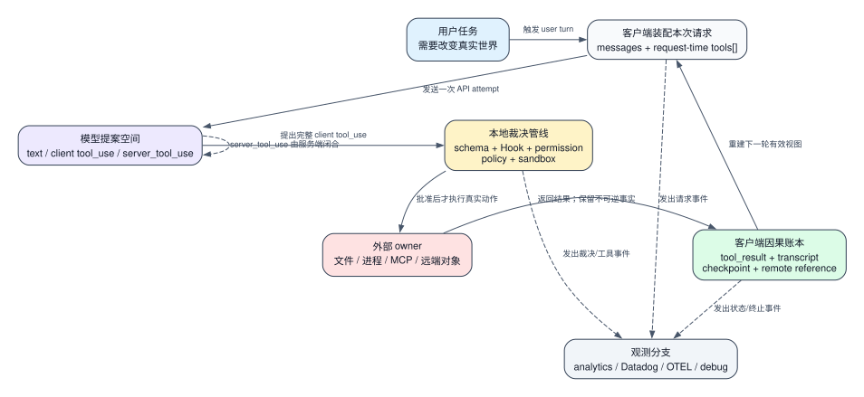
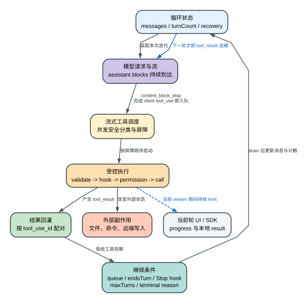
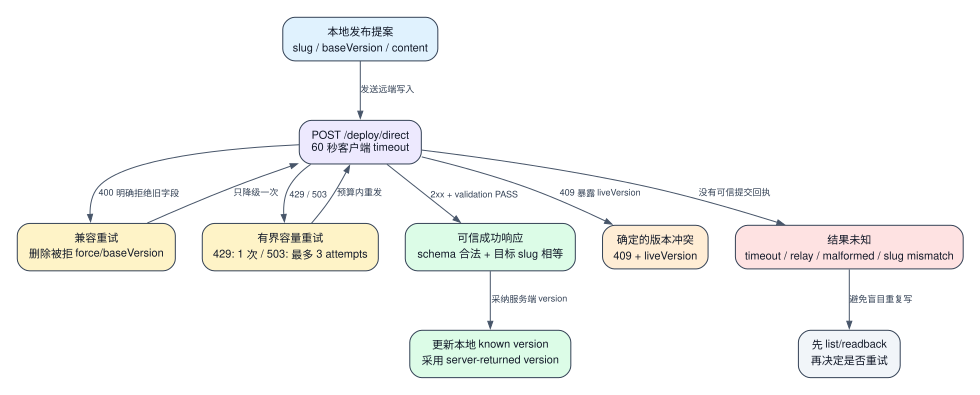
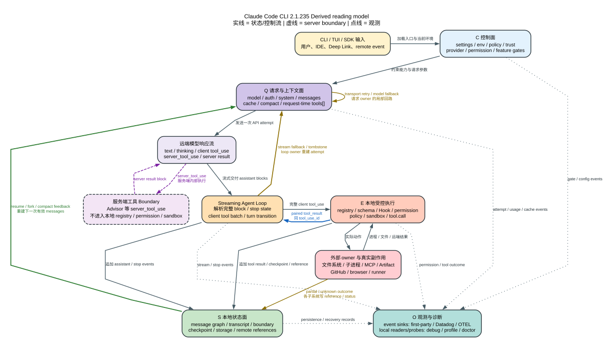

# Claude Code CLI 2.1.235：不是 Agent Loop 重写，而是一次状态边界修正

> 版本判断：状态边界修正 | 架构证据：`Static` + `Probe` | 服务端内部：`Boundary`

**先说结论：** `2.1.235` 不是一次新的 Agent Loop 架构发布。上游变更没有整体替换请求循环、工具调度或权限体系，而是在既有架构上修正用户真正会碰到的状态边界。

第一类是**状态一致性**：屏幕高亮、焦点、输入 offset、permission 文案和实际 grant 必须指向同一动作。用户看到的是 Shift+Tab 不再误批 Edit，快速 Arrow+Enter 执行当前高亮项，Vim/panel 与多行输入不再显示一种状态却提交另一种状态。

第二类是**增量长会话**：LSP 重连不再污染整段稳定 prompt cache，后台 cloud event 不再反复全量扫描，resume 或更新后的 UI 状态尽量延续。这里优化的是状态怎样增量更新，不是引入新的会话模型。

第三类是**显式失败**：不存在的 Agent、病态 grep、关闭 auto-compact 后触顶、超限 SendMessage 和企业网关下不可用的 Remote Control，都应尽早形成模型或用户能够采取行动的终态，而不是静默丢失或拖垮进程。

第四类是**本地辅助**：可选 spellcheck 复用本机 `aspell/hunspell/ispell`，默认关闭，只改变输入高亮，不改发给模型的文本。完整原文、条目编号、逐项状态变化与 Static/Probe/Boundary 见 [固定上游 Release Notes](release-notes.md)。

这些是**版本特征**，回答“本版修了什么”；后文的**架构特征**回答“这个固定版本怎样分配权力”。不能因为本版修了 dialog、cache 或失败文案，就把既有 Agent Loop、compact、resume 和 tool pipeline 说成 `2.1.235` 新增。

## 版本判断与三个世界

**架构判断：** 模型只能提出下一步；客户端决定这一轮暴露哪些能力、哪些提议可以执行、结果怎样进入因果链；文件系统、子进程和远端服务拥有已经发生的真实副作用。Agent 的自主性来自反复提案，不来自模型成为系统最终权威。

整篇只需要记住三个不等价的世界：

| 世界 | 保存什么 | 可以重建什么 | 不能假装什么 |
| --- | --- | --- | --- |
| 模型世界 | 当前 request 中可见的文本、schema 与下一步提案 | 重新请求后生成新的判断 | `tool_use` 出现不等于动作发生 |
| 客户端世界 | permission 决定、message graph、tool pair、boundary、checkpoint/reference | compact/resume 后重建合法因果视图 | 历史表示改变不等于外部世界回滚 |
| 外部世界 | 文件、进程、socket、MCP/GitHub/Artifact 等真实状态 | 只能按各 owner 提供的 readback、reference 或补偿机制继续 | 本地 transcript 不能宣布远端提交或撤销 |

贯穿场景保持简单：用户第一次进入一个未信任的 Node 项目，要求把端口从 8080 改成 9090 并运行测试。测试失败，主 Agent 只在确有必要时委派一次 MCP 文档查询；长会话随后执行 `/compact`，用户退出并 resume，最后发布 HTML Artifact，但请求 timeout。Voice 不属于这条编码任务，只在 Native 尾声用来检验同一权力边界怎样跨过 ABI。

这条任务只问四个问题：模型这一轮为什么能看见某项能力；一份提议怎样变成文件或进程事实；历史变短后为什么还能继续；请求发出却没有可信响应时，谁有资格判断结果。后面的每一幕都沿同一条因果链推进。

## 能力编译：模型看到什么，也不是模型决定的

用户还没有提交“改端口”，本地 runtime 已开始编译能力：当前是 TUI、print/SDK 还是内部 worker；项目是否可信；哪些 settings 来源可读；managed policy 能否收紧权限；provider 和凭据走哪条路径；Plugin、Skill、MCP 与内置 registry 的当前 generation 是什么。产物不是一份永久 `config`，而是**这个 session 的这次 request 可以到达的能力图**。

因此“bundle 里存在 Bash”至少要拆成 candidate、trusted/enabled、advertised、authorized、executed 五种状态。Tool Search 还把“名称可发现”与“完整 schema 已驻留”分开；广告路径让模型正常发现工具，本地 dispatch 则以当前 registry 和具体 input 为准。安装成功、列表可见、请求携带、用户批准和外部执行成功从来不是同一个事实。

在贯穿场景里，未信任项目提交的 Hook、MCP、skills 和可执行 settings 先留在 trust boundary 外。接受项目后 runtime 必须重新发现资源，不能复用信任前快照。随后 provider、host、policy 和 feature state 继续缩小能力图；自定义 base URL 可以改请求地址，却不会自动获得 first-party account entitlement。

<strong>细节：trust、settings merge、热更新与 provider 怎样编译能力</strong>

### Workspace trust 不是欢迎弹窗

项目目录可携带 hooks、MCP、skills、helpers、settings 和命令定义。在信任成立前，项目可控的可执行配置不进入普通能力加载；接受后重新发现项目资源。风险扫描、接受/拒绝与持久化主链见 [L593436-L593729](../reverse/javascript/cli.readable.js#L593436)，safe/bare 判定见 [L8159-L8171](../reverse/javascript/cli.readable.js#L8159)。首次进入时“仓库里有 Hook/MCP 但看不见”，通常是能力尚未跨过 trust boundary，不是扫描漏项。

### Settings 不是后写覆盖前写

settings store 同时持有来源缓存、合并缓存、policy 派生状态和失效 epoch。普通层大致按 `user < project < local < flag < policy` 解析，但字段不共享一种 merge：普通数组拼接去重，`fallbackModel` 高层整组替换，marketplace map 按 key 合并，managed-only 和限制性 policy 独立收紧。`--setting-sources` 只能筛 user/project/local，不能移除 flag 与 policy。来源顺序见 [L39176-L39215](../reverse/javascript/cli.readable.js#L39176)，merge 例外见 [L41697-L41703](../reverse/javascript/cli.readable.js#L41697)。

热更新也不是全进程事务。watcher 等文件稳定、抑制本进程写回声、运行 `ConfigChange` Hook，再推进 settings epoch 并清空派生缓存；sandbox、Plugin、TUI、provider client 等 consumer 按各自生命周期重读、重建或保留旧快照。它防止异步慢读把旧值倒灌回新状态，不保证已发 request、既有 subagent 或正在运行的 Bash 被热改。完整状态机见 [Settings 解析与热重载](settings-resolution-and-reload.md)。

### Provider 不只改 endpoint

`--model sonnet` 仍不足以确定 wire request。客户端先按 selector 顺序判 provider，再在认证域选择实际 model ID、endpoint/region 和 OAuth、API key、bearer 或云凭据，最后决定 beta、prompt-cache、Tool Search、thinking 与 fallback 能力。provider selector 见 [L62740-L62743](../reverse/javascript/cli.readable.js#L62740)；模型层收到的已经是治理后的 messages、system、tools、thinking、effort、cache 与 fallback state（[L271832-L271842](../reverse/javascript/cli.readable.js#L271832)）。

同一版本在两台机器上像两个产品，是因为版本只固定 shipped candidates；workspace trust、host、平台、账号、远端 feature/config、policy、provider、Plugin/MCP generation 与 session mode 决定实际 surface。Feature Evaluation 的 fresh memory、disk last-known-good 和 baked fallback 也会让离线启动与在线刷新得到不同结果，实时分桶仍是服务端 Boundary。

## 从提议到副作用：一轮 Agent 工作怎样交接所有权

下面的 `t0-t11` 是全文唯一时间骨架。后续所有细节都只是在某个时刻放大一层，不再另造一条“完整流程”。

| 时刻 | 当前 owner 收到什么 | 它真正改变的状态 | 下一位消费者看到什么 |
| --- | --- | --- | --- |
| `t0` 用户提交 | “把端口改成 9090 并跑测试”、当前 session leaf | transcript 追加 user message，分配 UUID/parent | request builder 获得合法新叶子 |
| `t1` 控制面解析 | settings、env、policy、workspace trust、host、账号 | 计算 provider、permission 上限、feature gates 和候选能力 | 请求层得到 effective state，而非配置文件并集 |
| `t2` 请求装配 | system blocks、有效 message view、memory、Agent/Skill/MCP、工具候选 | 选择历史、cache breakpoint 和本轮 `tools[]` | 模型只看见当下能力图 |
| `t3` API attempt 1 | model、headers、messages、tools、thinking/cache | 发出具体 provider 请求 | 首个有效 block 前失败可在同一 model iteration 内重试 |
| `t4` API attempt 2 | 同轮业务上下文与 retry/fallback state | 新 attempt 获得自己的 request identity | SSE parser 开始接收 assistant blocks；`turnCount` 不自动增加 |
| `t5` Read block 闭合 | 完整 `tool_use{id,name,input}` | executor 固化 concurrency-safe 分类并把 Read 入队 | 模型仍可继续流式输出 Edit/Bash |
| `t6` Edit block 闭合 | 编辑提案及原始 input | unsafe 项建立 drain 屏障；schema、Hook、permission、sandbox 尚未全过 | Bash 不能越过写屏障去测试旧文件 |
| `t7` 本地执行 | 通过裁决的 Read/Edit 与各自 ID | 文件读取结果和端口写入成为外部事实 | result mapper 与 transcript/checkpoint 保存可配对投影 |
| `t8` Bash 执行 | 已修改工作区和测试命令 | 子进程产生 exit code、stdout/stderr | 失败编码成同 ID `tool_result`，不是 Agent 进程异常退出 |
| `t9` batch drain | stream 结束，已入队工具完成或形成错误 | 客户端按调用 ID 组装结果 | 下一次 model iteration 才能看见结果 |
| `t10` model iteration 2 | 原上下文 + 配对结果 + 排队的新输入 | `turnCount` 推进，重新治理上下文与工具表 | 模型根据测试错误提出修复，而非重放第一批工具 |
| `t11` terminal | 无新 client tool、显式 end-turn、受控停止或 typed failure | transcript 写最终状态，外层返回 terminal reason | UI/SDK 得到终态；观测面只收到允许的投影 |

这条时间线解释 Agent 能持续工作的原因：API retry 重做请求尝试，不等于新一轮模型决策；工具可与 assistant 流式输出重叠，但结果不能逆向塞回正在进行的 SSE；测试失败改变下一轮模型可见事实，而不是让整个循环崩掉。

本地 runtime 只 dispatch client `tool_use`。`server_tool_use` 可以被客户端显示、规范化和记录，但执行生命周期与后端仍归服务端：

| 对象 | 裁决 owner | effect owner | 本地 registry/permission/sandbox | 结果回路 |
| --- | --- | --- | --- | --- |
| client `tool_use` | Claude Code runtime | OS、MCP、浏览器或远端 API 等具体 owner | 进入 | 客户端生成同 `tool_use_id` 的 user `tool_result`，进入后续模型轮次 |
| `server_tool_use` | Anthropic 服务端工具生命周期 | 服务端工具及后端 | 不进入 | server result 留在 assistant stream |

<strong>细节：四种时钟、工具驻留与 maxTurns 边界</strong>

| 计数单位 | 开始与结束 | 什么推进它 | 不能和什么混用 |
| --- | --- | --- | --- |
| 用户 turn | 用户提交到 CLI 返回 terminal reason | 完成、取消、受控停止或硬失败 | 内部可有多轮模型与多批工具 |
| 模型 iteration | 组装一次有效上下文并让模型决定下一步 | tool result、Stop Hook 重入或 continuation | `maxTurns` 限制它，不限制 HTTP 次数或工具数 |
| API attempt | 一次 provider/model/stream 请求 | transport retry、流转非流、model/refusal fallback | retry 不一定增加 `turnCount` |
| Tool batch | 同一 assistant response 中的 client tool 集合 | block 完整入队并 drain | 完成顺序不决定因果配对 |

外层 turn wrapper、core loop、API attempt 与 streaming executor 的主链见 [L271491-L272425](../reverse/javascript/cli.readable.js#L271491)。parser 在 `content_block_stop` 产出完整 block（[L409843-L409906](../reverse/javascript/cli.readable.js#L409843)）；Agent Loop 立即 `addTool(...)`，stream/executor helper 在模型事件与 drain tick 间竞速（[L267292-L267310](../reverse/javascript/cli.readable.js#L267292)、[L272032-L272045](../reverse/javascript/cli.readable.js#L272032)）。正确性依赖完整 block、屏障、同 ID 配对和最终 drain，不是一次 `Promise.all`。

把 `maxTurns=1` 代入场景：第一轮仍可返回 Read/Edit/Bash，工具仍执行并产生副作用；客户端只禁止结果后的第二轮模型判断，最终给出 `error_max_turns`。精确二进制 Probe 观察到工具完成、PostToolUse 已发生、服务端只收到一个 Messages request。`maxTurns` 不是工具配额，更不是回滚器；见 [运行证据索引](runtime-probe-index.md) 与 [Agent Loop](agent-loop.md)。

candidate name、factory registration、enabled registry、request advertisement 与 dispatch 是不同状态。deferred declaration 在 request 中不等于完整 schema 已进入 active context；但广告也不是本地 dispatch 存在性的唯一证明：精确 Probe 曾观察首请求未广告 LSP schema，而有效 LSP `tool_use` 仍由本地 registry 执行并回灌。工具注册证据见 [工具注册与宿主表面](tool-registration-and-host-surfaces.md)。

<strong>细节：并发纯度合同为什么在 Hook 改写前固化</strong>

`addTool()` 先用原始 parsed input 调 `isConcurrencySafe(input)`，把结果固化在队列项；`processQueue()` 让 safe 项重叠，unsafe 项等待前序 drain 并阻塞后序启动（[L267124-L267149](../reverse/javascript/cli.readable.js#L267124)）。PreToolUse Hook 和 permission handler 后续可返回 `updatedInput`（[L316220-L316330](../reverse/javascript/cli.readable.js#L316220)），但调度器不会回头重算并发分类。

这不表示改写后不校验：schema 与 permission 会复验；只表示并发顺序沿用最初 input。safe overlap 降低等待，unsafe barrier 防止 Bash 越过 Edit 去测旧文件，同 ID 配对防止并发完成顺序改写因果。代价是扩展不应把原本安全的调用改成全新共享副作用，并期待 scheduler 自动识别。当前为目标 bundle 的 Static 合同，尚未覆盖全部多工具竞态 Probe。

<strong>细节：一份 Edit 提议要穿过哪些执行关卡</strong>

| 阶段 | 决定 owner | 能改变什么 | 失败反馈 | `tool.call` |
| --- | --- | --- | --- | --- |
| registry / alias | session registry | 名称解析到唯一实现；区分 deferred 存在与 schema 驻留 | unknown/deferred result | 否 |
| parse / schema | 通用 parser 与工具 schema | JSON 变 typed input，拒绝缺字段/错类型 | 具体校验错误 | 否 |
| custom `validateInput` | 工具实现 | 检查路径与参数前置条件 | 工具专属 validation | 否 |
| `PreToolUse` Hook | 扩展 runner | block、defer 或 `updatedInput` | 受控 block/defer | 否 |
| updated-input revalidation | schema + permission context | 防止改写绕过 schema；不重算 concurrency class | 新输入非法则拒绝 | 否 |
| rule / policy / permission / Auto Mode | 本地决策引擎与必要时的人类/classifier | allow、ask、deny、scope 与 reason | denial 成为模型新观察 | 否 |
| sandbox / OS permission | 适用工具、sandbox、OS | 文件、网络、socket、credential、平台权限 | sandbox/TCC/OS error | 可能已开始 |
| `tool.call` | 工具实现与外部 owner | 真正改文件、起进程或调用远端 | success/failure/partial | 是 |
| PostToolUse / result mapper | Hook 与输出合同 | 追加诊断或改写反馈；只在 Hook 改写输出时做条件性 schema 复验 | 影响后续反馈，不能撤销写入 | 已发生/尝试 |

PreToolUse、permission 与适用 sandbox 能阻止动作到达副作用；PostToolUse、tombstone、compact 和 resume 最多改变记录与后续判断。`bypassPermissions` 只绕过普通交互批准，不会关闭工具内部 sandbox、OS 或远端权限。

批准 scope 也分 owner：关闭 comment field、一次性批准、session-wide `acceptEdits` 和持久规则不是一个状态。精确 TUI Probe 证明 Shift+Tab 退出 comment input 不批准 Edit；显式 Enter 只批第一次，第二次仍询问；只有 Down+Enter 选中 `acceptEdits`，后续同类 Edit 才不再弹框。见 [TUI Probe](runtime-probes/tui-regressions.json) 与 [工具控制管线](tools-permissions-hooks.md)。

Auto Mode 位于确定性下限之上：deny/ask rule、safety check、requires-user-interaction、组织 ceiling 与 managed floor 先判；剩余普通 ask 才进入 fast path 和两阶段 classifier（[L395300-L395501](../reverse/javascript/cli.readable.js#L395300)）。无有效 verdict、request unavailable 或 safeguard refusal 时 fail closed，但 blocked outcome 不应被反推为“已证明危险”。Plan Mode 又在更早位置改变 permission mode 与工具合同；退出输入框、模型提出计划、用户批准实施和恢复原 mode 是不同状态。完整预算与失败编码见 [Auto Mode](auto-mode-classifier.md) 和 [Plan Mode](plan-mode-and-human-approval.md)。

## 历史变短，现实不变：compact 与 resume 改的是表示

测试失败后的对话越来越长。这里同时出现两种需求：每轮请求要降低重复成本，窗口逼近上限时又必须替换历史表示。Claude Code 没有一个“万能缓存”；prompt cache、Tool Search、Context Hint、microcompaction、precomputed compact、full compact 与 transcript boundary 分别持有不同对象。

| 机制 | 真正改变什么 | 明确不改变什么 |
| --- | --- | --- |
| Prompt cache | 给稳定 system/message 前缀写 `cache_control` | 不缩短逻辑消息，不负责 resume；真实 hit/计费仍是 API Boundary |
| Tool Search | 延迟完整工具 schema 驻留 | deferred declaration 不等于模型已有完整 schema，也不是零 token |
| Context Hint | 服务端协作协议提示客户端清理特定工具族的旧 result | 协议启用不等于本地已经清理成功 |
| microcompaction | 本地改写 active view 中旧的大型 tool result | 不删除 tool ID 因果或 physical transcript |
| Precomputed compact | 提前生成候选 summary，命中时校验分支后交换 | pending、过期或 anchor 不匹配不会进入主历史 |
| Full compact | 现场生成 summary 并重建下一次 effective messages；cold path 使用 `messagesToKeep=[]` | 不撤销文件、进程、Git 或远端 API 副作用 |
| Transcript + boundary | 保存 summary、preserved UUID、logical parent 与表示切换 | 不保存旧 Bun 进程、socket 或 Promise |

先看普通 manual miss：`PreCompact` Hook 放行且没有可复用预计算结果时，客户端在旧对话末尾插入专用虚拟用户消息，以 `CRITICAL` 要求模型停止业务工作、禁止工具，先输出 `<analysis>` 做时序梳理，再输出固定九段 `
`。extractor 用正则剥离首个 `<analysis>`，再把找到的 `
` 改写为 Summary；它不是严格双标签 parser，标签外文本可能保留，缺失 `
` 也不会在这一步自动变成格式拒绝。这里的 `<analysis>` 是应用层提示格式，不是 API 原生 thinking；模板与提取见 [L261931-L262207](../reverse/javascript/cli.readable.js#L261931)。

Summary 之外，客户端还保留合法的 message groups、附件/Hook 精确材料和 compact boundary。不能机械保留末尾 N 条，因为 `tool_use/tool_result` 必须成组；Summary 与附件可能重复，但分别防范语义遗忘与逐字符失真。`/compact` 因而是**有损语义通道 + 有界精确信息通道 + 因果恢复边界**的表示替换。

用户随后退出。resume 不会解冻旧进程，而是让 message graph、compact boundary、file checkpoint、task registry 和远端 reference 各自恢复自己真正拥有的对象：

| 可恢复对象 | 恢复动作 | 恢复后 | 仍然缺什么 |
| --- | --- | --- | --- |
| Message graph | 按 session/UUID/parent/leaf 重建有效链 | resume/fork 得到合法 messages | 不会重新执行或重放历史工具，不会恢复旧 socket/Promise |
| Compact boundary | 把 summary、preserved UUID 与 logical parent 接回 anchor | compact 前后表示继续 | summary 漏掉的细节不能凭空恢复 |
| File checkpoint | 对受管文件 dry-run diff 或 rewind | 恢复被跟踪文件字节 | 未跟踪路径、数据库、Git/远端写入不在合同内 |
| Background task / MCP / Artifact reference | owner 仍存活时 attach、poll、reconnect 或 readback | 延续明确暴露的 identity | transcript metadata 不能复活旧进程或提供外部回滚 |

这时用户看到“上下文变短但文件仍是 9090”，resume 后又能继续读测试错误。它不是矛盾：客户端恢复的是事实的**表示与引用**，而文件事实仍由文件系统持有。

<strong>细节：microcompaction、预计算与 full compact 的阈值为何不同</strong>

普通 model iteration 每轮都重建 effective messages、system blocks 和 request-time tools，再选 cache breakpoint 与估算 budget。只有逼近治理线才进入旧结果清理、预计算、warning、full compact 或最终 blocked。

| release-local 条件 | 防什么风险 | 命中时 | miss/failure 后 |
| --- | --- | --- | --- |
| microcompaction 保留最近 5 个相关 result；预计节省不足 20k token 不做 | 小收益破坏近期细节 | 大型旧 result 变带因果 ID 的占位 | 保持 active view 继续预算判断 |
| precomputed sidecar 上限 8,000,000 bytes | 异常缓存占满本地存储 | 超限候选不复用 | 普通 compact miss |
| sidecar 不超过 7 天，且之后新增不超过 150,000 token | 陈旧 summary 套到新任务 | 校验通过才 swap | 拒绝旧候选并重新总结 |
| 当前消息量不能比预计算点缩减过半，关键 UUID 仍存在 | fork/rewind 后接错分支 | 接回 preserve UUID + messagesSince | 缺 anchor 按 miss |
| 连续 3 次可计数失败 | 后台反复消耗 token/延迟 | 停止 re-arm | reactive/manual compact 仍可用 |
| 200k window 示例约 144k precompute、147k warning、167k compact、177k blocked | 把输出预算、总结空间和硬输入上限混成一条线 | 依次准备、提示、替换、最终拒绝 | 调小 auto window 只前移前三条，不等比改硬线 |

代码先从有效 window 扣最多 20k output reserve，再算 precompute/warning/compact；blocked 来自输入 ceiling 再减 3k。主路径见 [L216096](../reverse/javascript/cli.readable.js#L216096)。Prompt cache 的显式 `ttl=1h` 或省略 ttl 是 Static wire shape；默认 5m 与 hit 后费用/延迟来自 API/Public 合同，本仓库没有 cache-hit 账单 Probe。Context Hint 对 400/409/422/424/529 和流式错误有不同 fallback；完整 provider 与成本差异见 [上下文治理](context-governance-and-caching.md)。

microcompaction 只重写 active view；预计算 summary 在主任务真正 compact 前生成 sidecar，等临界点校验分支后采用。二者主路径见 [L263484-L263519](../reverse/javascript/cli.readable.js#L263484) 与 [L262324-L262680](../reverse/javascript/cli.readable.js#L262324)。

预计算 hit 不发送新 summary request，直接把 preserve UUID 与 `messagesSince` 交给 compact finalizer；custom instructions、Hook 追加、sidecar 未就绪或 boundary UUID 缺失形成 miss。hit/miss 入口见 [L331309-L331345](../reverse/javascript/cli.readable.js#L331309)，普通 full summary 与 prompt-too-long 缩减见 [L262996-L263036](../reverse/javascript/cli.readable.js#L262996)。

精确二进制 manual compact Probe 观察到 `system:compact_boundary`、`trigger=manual`、`preTokens=104`；104 只属于该受控输入，不是 auto threshold。fork request 保留 summary 与当前 prompt，不再发送样本指定的旧 prompt、tool-use ID 和 assistant result。它证明下一次送模视图改变，不证明 transcript、文件、Memory 或远端副作用删除。

<strong>细节：resume 怎样修复消息图，而不是读取末尾 N 行</strong>

物理 JSONL 可保留已放弃分支；下一次送模必须得到一条逻辑父链。resume entry 先解析来源、Storage/JSONL 与 fork 语义，再交给 interrupted-turn repair（[L323373-L323423](../reverse/javascript/cli.readable.js#L323373)）。

1. graph loader 扫描事件，建立 `uuid -> node` 与 parent map，收集 leaf、last-prompt、rewind 和 session metadata（[L403569-L403650](../reverse/javascript/cli.readable.js#L403569)）。
2. compact relinker 找最近有效 boundary，把 `preservedMessages/preservedSegment` 接回声明的 anchor（[L402489-L402531](../reverse/javascript/cli.readable.js#L402489)）。
3. ancestor walker 从 leaf 逆 `parentUuid` 回走并查环；父缺失时只在受控条件使用 timestamp fallback（[L402554-L402667](../reverse/javascript/cli.readable.js#L402554)）。
4. 同一 API message 的并行 assistant fragments 与 tool results 成组补回，避免孤立 pair。
5. 顶层过滤坏 attachment、撤回分支和中断残片；file rewind 另走 checkpoint（[L194641-L194804](../reverse/javascript/cli.readable.js#L194641)）。

| 损坏类型 | 处理 | 用户风险 |
| --- | --- | --- |
| parent 环/自指 | 停止把该链当合法 ancestor | 分支不能完整 resume，物理事件仍可诊断 |
| parent 缺失 | 只按允许的 timestamp fallback | 无法证明的上下文丢弃，不编造父链 |
| 坏 attachment | 从有效送模视图过滤 | 精确文件材料需重读 |
| 中断 tool pair | interrupted-turn/tombstone 修复表示 | 已完成外部副作用仍在，先查状态再继续 |
| checkpoint 缺失/路径不受管 | rewind 无对象可恢复 | 文件、数据库、Git/远端写需单独补偿 |

精确 Probe 把消息恢复与文件恢复分开：compact 后 fork 生成新 session ID 并使用 summary view；file rewind 不发送 Messages request，直接把受管临时文件恢复成原始字节。它不涵盖 Git push、Artifact、数据库或已发送消息。详见 [Session/Checkpoint/Memory](sessions-checkpoints-memory.md)。

## 扩展与委派：连接、启动和产生增益是三件事

测试失败后，主 Agent 需要查一份 MCP 文档。MCP `connected` 只证明 transport；配置还要经过来源、workspace trust、managed filter、command/URL/header helper 与 OAuth 状态，连接后才 list tools/resources/prompts。`tools/list_changed` 或重连刷新 catalog generation，并使旧 generation 的 Tool Search schema cache 失效（[L491915-L491964](../reverse/javascript/cli.readable.js#L491915)）。当前 Messages request 不热改；Agent Loop 到下一轮前才检查 generation（[L272372-L272382](../reverse/javascript/cli.readable.js#L272372)）。

所以 `connected -> catalog refreshed -> name discoverable -> schema resident -> input authorized -> remote call completed` 是六个状态。主 Agent 若把检索委派给子 Agent，最先得到的 `async_launched` 也只是 task identity；子 Agent 用独立 messages、context、tools、model/effort/maxTurns、permission、abort controller 与可选 worktree，完成 notification 到父队列后，父循环下一轮才看到 findings。精确 Probe 证明子请求不含父 prompt、拥有自己的工具表，父循环先收 launch ACK、后收完成通知。

Plugin Eval 把“扩展可加载”再推进一步：**加载成功不等于插件带来增益。** exact `2.1.235` Probe 用本地 deterministic Messages stub 跑一份可信 case，建立 with-plugin 与 without-plugin 两臂，只用免费 `regex(last_message)` grader并显式 `--no-publish --no-scaffold`。两臂都得 1 分，with request 才含 Plugin `SessionStart` hook context，without request 不含；aggregate 为 `Delta=0`、`partial=false`，本地 JSON/HTML 写出成功。这证明 plugin resolution、两臂 child orchestration、grader 与 Delta 闭环，不证明模型或插件质量，也没覆盖 paid LLM/baseline judge、真实费用与远端 publish。见 [Plugin Evaluation Harness](plugin-evaluation-harness.md) 与 [exact Probe](runtime-probes/plugin-evaluation.json)。

<strong>细节：Task、mailbox、worktree 与 supervisor 各自隔离什么</strong>

Task registry 的 claim 让任务有明确 owner/status/dependency；team mailbox 管消息、broadcast、shutdown/request/response 与 ack；worktree 只隔离 Git 文件视图。两个 task 仍可碰同一数据库、端口、缓存、credential 或远端 API。claim 见 [L202474-L202511](../reverse/javascript/cli.readable.js#L202474)，mailbox 见 [L279171-L279317](../reverse/javascript/cli.readable.js#L279171)。

默认 fork 是 `maxTurns:200`、`model:inherit`、`permissionMode:bubble`（[L156505-L156518](../reverse/javascript/cli.readable.js#L156505)）：inherit 不共享 API call，bubble 只把无法本地裁决的审批上浮，不自动继承父会话全部权限。

后台 Agent 再增加进程 owner：Agent View 是投影；daemon supervisor、PTY host、Claude worker、rendezvous 和 Storage job record 分别持进程、终端字节、Agent Loop、控制状态和 durable metadata。resume transcript 不复活 Promise；只有 durable owner 仍在，attach/respawn 才有对象。完整 socket auth、backpressure、heartbeat、respawn budget 与 memory-pressure reap 见 [Runtime Supervision](runtime-supervision-and-processes.md)。

Plugin Eval 的 temp HOME/config/workspace 是进程状态隔离，不是 OS/网络 sandbox；`dontAsk` 让无明确 grant 的动作直接拒绝，不是全部允许。partial、auth/cost ceiling 与异规则两臂不能补出可信 Delta。完整输入信任、grader、费用、CI exit 与发布边界见 [Plugin Evaluation Harness](plugin-evaluation-harness.md)。

## 远端结果未知：Artifact timeout 后，Telemetry 也不能替你下结论

resume 后客户端重新核验文件与测试，再发布 HTML Artifact。这里选 direct-publish route，不是因为它代表全部 Artifact 协议，而是它把三个世界的边界暴露得最清楚：本地发出了请求，服务端可能已经处理，但客户端没有可信 response 时只能得到“结果未知”。

| 返回/失败 | 客户端策略 | local known version | 能否确定远端结果 | 下一步 |
| --- | --- | --- | --- | --- |
| `2xx` + schema 合法 + slug 相等 | 接受可信 response | 采用 server version | 只确认该 response 描述的提交；页面渲染另证 | 继续使用 slug/version |
| `400` 明确拒绝旧 `force/baseVersion` | 有界删除被拒字段后重发一次 | 成功前不更新 | 首请求是否部分处理取决于远端 | 看第二次 response，不能当原子替换 |
| `409` + `liveVersion` | 不盲覆盖 | 保留本地认识并暴露 live version | 确认服务端报告并发版本 | read/compare 后决定 |
| `429` | `retry-after` 最多等 30 秒，只重试一次 | 成功前不更新 | rate limit 不说明首请求后续状态 | 等有界结果 |
| `503` | backoff，最多 3 次总 attempt | 成功前不更新 | 没有可信成功 response | 预算耗尽停止自动重发 |
| timeout / relay error / malformed response / slug mismatch | 终止，不采用未知 version | 不更新 | **未知**；请求可能已到达并提交 | 先 list/readback，再决定是否重试 |

direct route 是 POST、60 秒 timeout，随后做 response schema 与目标 slug equality check；server version 被直接采信为新的 known version，不做 local-version equality。错误中的“check artifact list”只是 advisory，不是自动强制 read gate。证据见 [L260784-L260808](../reverse/javascript/cli.readable.js#L260784) 与 [L261085-L261090](../reverse/javascript/cli.readable.js#L261085)。这条 route 的可见 body/header 没恢复出独立 idempotency key；slug、baseVersion、force 与 conflict 提供身份/并发控制，但不能证明 timeout 重试天然幂等。当前主要是 Static 可达证据，没有真实远端 Artifact 成功 Probe，持久化仍是 Boundary。

此时 Telemetry 能否证明提交？不能。Bash exit 或 Artifact request state 先成为业务事实，事件调用点随后才读取 outcome、duration 与 correlation fields，再经过 enable、sampling、content、queue 与 exporter。事件缺失可能来自 gate、sampling、redaction 或 drop；事件出现也只证明某个投影曾被发出，不证明 collector 持久化，更不替代 Artifact list/readback。

最重要的不对称是：Agent Loop 消费 `tool_result`，不等待一方 logger、Datadog、OTEL 或 debug sink 成功；但 telemetry/nonessential-traffic enablement 同时可能影响在线 GrowthBook Feature Evaluation。要同时避免两种误读：“出口失败会让 Agent 回滚”，以及“关闭遥测只少几条日志、绝不改变在线控制能力”。

<strong>细节：Telemetry 关联字段、四条通道与 raw-body 隐私门</strong>

| 字段 | 回答什么 | 不能推出什么 |
| --- | --- | --- |
| `session_id` | 哪份可 resume 会话 | fork 新 session；远端未必复用 |
| `queryChainId/queryDepth` | 同一任务的模型决策深度 | sampling/drop 会缺段；同 iteration retry depth 不变 |
| `request_id` | 具体 API attempt/response | retry 前后 ID 可变；无服务端内部 span |
| `tool_use_id` | client proposal 与 result 配对 | MCP/远端还有自己的 transaction ID |
| `turn_count` | maxTurns 等终止时的 model iteration | 并非每个 event 都携带，不能用事件数反推轮次 |

循环从 `turnCount=1` 和新 chain/depth 开始（[L271553-L271643](../reverse/javascript/cli.readable.js#L271553)）；terminal event 写 `terminal_reason`，仅 max-turns 场景附 `turn_count`（[L270840-L270845](../reverse/javascript/cli.readable.js#L270840)）。

| 通道 | enable owner | 内容/可靠性 | 证据边界 |
| --- | --- | --- | --- |
| 一方事件 | provider、traffic gate、killswitch、sampling | queue/batch；失败 batch 可持久化重试 | callsite 不等于发出或服务端保留 |
| Datadog | first-party + feature + allowlist | 复用前置 sampling，再删字段、归一 tag、batch | 分支删除字段不是全局隐私合同 |
| OTEL | `CLAUDE_CODE_ENABLE_TELEMETRY` + signal exporter | metrics/logs/traces 与正文 gate 分开 | 一方关闭不自动关闭管理员 OTEL |
| 本地诊断 | debug/profile/doctor/Perfetto | stderr、本地文件、进程 profile | 本地缺失不证明远端未发送 |

一方入口按事件名采样后把 payload 分给可选 Datadog 与一方 logger（[L90870-L90891](../reverse/javascript/cli.readable.js#L90870)）。Datadog 再过 provider/feature/allowlist 与字段删除、batch/timeout（[L90790-L90868](../reverse/javascript/cli.readable.js#L90790)）；一方 logger 有 pre-init queue、batch、失败落盘/重放/backoff（[L77550-L78097](../reverse/javascript/cli.readable.js#L77550)）。

OTEL bootstrap 分别构造 metrics/logs/traces exporter（[L361612-L361670](../reverse/javascript/cli.readable.js#L361612)）。`OTEL_LOG_USER_PROMPTS` 默认把正文变成 `<REDACTED>`；exact Probe 证明显式开启后 marker 才进入 collector。`OTEL_LOG_RAW_API_BODIES` 又是独立门：未设时无 body event；设置为 `1` 时完整受控 request/response marker 可进入 collector，即使 `OTEL_LOG_USER_PROMPTS` 没开；`file:<dir>` 时正文写本地 JSON，event 只带 `body_ref`。file 模式把风险从 collector 移到本地明文，不是无条件“更隐私”。见 [raw-body Probe](runtime-probes/telemetry-otlp.json) 与 [Telemetry](telemetry.md)。

OTLP HTTP logs 还有一处反直觉 precedence：Claude先用 `n1i()` 注入 `httpAgentOptions=Kol(endpoint)`（[L361719-L361737](../reverse/javascript/cli.readable.js#L361719)），OTLP merge再优先采用 programmatic agent而不是 library的 environment agent（[L345748-L345764](../reverse/javascript/cli.readable.js#L345748)）。exact [OTLP TLS Probe](runtime-probes/otlp-tls.json) 因而观察到：OTLP专用 CA/client变量没有成为有效 HTTP agent，`NODE_EXTRA_CA_CERTS`、`CLAUDE_CODE_CLIENT_CERT/KEY` 和通用 proxy才控制实际 handshake；exporter失败仍不改变 Agent success。

`tengu_other` 是本仓库前缀分类的兜底，不是客户端统一模块。caller-owner 只接受 event、exact caller identity 与 comparison fingerprint 同时命中；旧的巨大行区间曾把 EndConversation、heap dump、update refused 错归邻近业务。该研究纠错不改变 runtime，但防止排障去找错 owner。完整剩余边界见 [Telemetry 场景索引](telemetry-event-catalog.md)。

## Native 尾声：同一权力边界怎样跨过 ABI

Voice 不属于“改端口”主场景，但它能检验同一原则是否只适用于文本工具。Claude Code 把图像、键鼠、音频和 URL event 等 macOS 能力放进同进程 `.node` bridge，以较低 IPC 换取更大的 ABI、panic/finalizer 与 TCC 故障半径。`require` 存在只证明发布物有装载入口，不证明当前机器 load 成功、权限已授予或内部算法已知。

用户按住语音键后，音频不会直接成为模型消息。Voice 走 `本地采集 -> Voice WebSocket/STT -> composer 文本`；只有 final transcript 被提交，普通 Agent Loop 才看到 user message。native callback bytes 进入声明 `linear16/16000/1` 的 WebSocket 合同是可见事实，但 JS wrapper 不能证明 callback 前怎样采样或重采样。native 不可用时 SoX `rec` 明确请求 16 kHz、mono、signed 16-bit raw PCM。

因此 ABI 仍遵守三个世界：模型只看到最终文本；客户端持 recorder/socket/composer state；麦克风、native 线程和远端 STT 持真实 effect。取消可清本次 buffer，却不能回滚已经发送的 audio frame；native crash 甚至可能带走 CLI 进程。

<strong>细节：Voice buffering、失败分型与 Native/x86 证据等级</strong>

普通 Voice gate 依次检查账号/capability、本地音频环境、依赖、麦克风 permission 与 settings；无设备 remote/cloud 在录音前失败（[命令与环境 gate](../reverse/javascript/cli.readable.js#L362598)、[设备检查](../reverse/javascript/cli.readable.js#L362522)）。recorder 与 WebSocket 并行启动；连接前 chunk 进内存 queue，ready 后合成有界 frame 顺序 flush，并周期 KeepAlive（[连接协议](../reverse/javascript/cli.readable.js#L362289)、[buffer/flush](../reverse/javascript/cli.readable.js#L525811)）。interim/final 更新 composer state；结束后 final 注入 composer，interim/audio 清空回 idle（[转写累积](../reverse/javascript/cli.readable.js#L525839)、[最终注入](../reverse/javascript/cli.readable.js#L525725)）。

无 transcript 的早期 connection error 只做有界重连并保留未发送 queue；检测到 audio 却 finalize no-data，只允许新连接重放缓存一次；已有文字后的中途错误尽量 salvage transcript 后结束，而不是无限重传（[early retry](../reverse/javascript/cli.readable.js#L525875)、[silent-drop replay](../reverse/javascript/cli.readable.js#L525687)、[partial salvage](../reverse/javascript/cli.readable.js#L525884)）。load failure、TCC、设备、socket、no-speech 和同进程 crash 属于不同 owner。

Native 证据分层：Mach-O 依赖、符号、字符串、反汇编、JS wrapper、SoX argv 与 WebSocket query 是 Static artifact；受控 original/compatible 调用才是 Probe；独立 Rust/Swift 重写只是 Compatible。arm64 报告比较列出的 export、return/throw/null 与 lifecycle，不会真的录音、注入键鼠或覆盖所有 permission 组合。

x86_64/Rosetta 报告证明 supplied compatible artifacts 是独立 regular x86_64 Mach-O、不是原版同 hash 复用，并能在 x64 Node/Rosetta load 和满足 export contract；只有发布物含 x86 slice 的 Input/Swift 两模块能做同输入行为对照。Rust/Swift command 只是 build recipe，没有同次 build literal output/status，所以方法必须写 `validated-artifacts-and-runtime`。audio、image、URL 没 original x86 slice，不能外推原版 x86 行为。服务端音频留存/训练/删除和缺失的原始内部函数仍是 Boundary。详见 [Native Bridge](native-bridge-runtime.md) 与 [重建报告](../reconstructed/README.md)。

## 三个工程选择

**第一，Agent 自主性建立在权力不对称上。** 模型可以不断提出 client tool，但 registry、Hook、policy、permission、Auto Mode、sandbox 与 effect owner 分别拥有最终决定。用户可观察现象是：同一版本在两台机器上会显示不同工具；Edit 即使被模型提出，也可能弹一次批准、升级为 session scope，或在 OS/MCP 层再次失败。

**第二，事实与表示被刻意分开。** prompt cache 改重复输入成本，Tool Search 改 schema 驻留，microcompaction/full compact 改 active history，resume 改可重建的因果视图；它们都不改已经发生的文件、进程和远端提交。用户可观察现象是：`/compact` 后聊天历史明显变短，端口文件仍是 9090；resume 能继续读上下文，却不会复活退出前的测试 Promise。

**第三，可靠性来自局部恢复和显式不确定性，而不是全局回滚。** request retry、compact、checkpoint、MCP reconnect、daemon respawn 与 Artifact conflict 各自持有限 budget/reference；Telemetry 只是有损投影。用户可观察现象是：Artifact timeout 后客户端要求先 list/readback，而不是直接宣布失败并重发；事件缺失也不能证明请求没到服务端。

这三条都是 `2.1.235` 固定 bundle 的架构判断，不是 release delta 宣称的新架构。`2.1.235` 真正新增或修复的是开头四类状态边界；架构解释说明这些小变化为什么会影响安全、长会话和失败恢复。

## 按问题继续阅读

- 为什么一次用户任务包含多轮模型、API retry 与工具 batch：读 [Agent Loop](agent-loop.md)。
- 为什么工具可见、可调用和获准执行是三种状态：读 [工具注册](tool-registration-and-host-surfaces.md) 与 [权限管线](tools-permissions-hooks.md)。
- `/compact` 为什么不撤销文件，resume 又怎样接回消息图：读 [上下文治理](context-governance-and-caching.md)、[Compact 图文专题](compact-visual-guide.md) 与 [Session/Checkpoint](sessions-checkpoints-memory.md)。
- MCP connected 为什么仍不可调用，子 Agent launch 为什么不是结果：读 [MCP/Agents](mcp-agents-background.md)。
- Plugin 加载成功怎样升级为可比较的增益证据：读 [Plugin Evaluation Harness](plugin-evaluation-harness.md)。
- Artifact timeout、API path 和错误分别归谁：读 [Workflow/Artifact](workflow-artifact-design.md)、[API/Beta owner](api-beta-route-ownership.md) 与 [错误图谱](error-diagnostic-atlas.md)。
- 遥测正文、raw body、sampling 和 exporter 怎样分开：读 [Telemetry](telemetry.md) 与 [事件场景索引](telemetry-event-catalog.md)。
- `.node`、Voice、compatible reconstruction 到底证明什么：读 [Native Bridge](native-bridge-runtime.md) 与 [重建报告](../reconstructed/README.md)。
- 版本仍有哪些客户端语义未追完：读 [全面性审计](completeness-audit.md) 与 [机器证据索引](product-surface-inventory-index.md)。

## 折叠证据附录

<strong>C/Q/E/S/O 只作为证据路由，不作为正文架构目录</strong>

C/Q/E/S/O 是本文从最终决定权归纳的 Derived 阅读框架，不是源码目录，也不是 Anthropic 官方命名。同一功能可跨多个面；恢复留在 request、compact、tool、process 等各 owner 的局部回路，没有中央 recovery manager。

| ID | Derived 阅读面 | owner 与决定权 | 专题入口 |
| --- | --- | --- | --- |
| `C` | **控制面** | CLI 入口、Settings store、managed policy、workspace trust、环境变量和 Feature Evaluation。约束 provider、permission mode、能力上限和候选功能；写入配置不等于所有 consumer 已热更新 | [settings-resolution-and-reload.md](settings-resolution-and-reload.md)、[settings-feature-flags-policy.md](settings-feature-flags-policy.md)、[environment-variable-reference.md](environment-variable-reference.md)、[feature-flag-reference.md](feature-flag-reference.md) |
| `Q` | **请求与上下文面** | model/provider/auth 选择、system/messages、cache、compact、thinking/effort 与请求时 tools[] 装配。决定某一次 API attempt 真正发送什么；一个用户 turn 可以包含多次 attempt 和多轮模型调用 | [models-auth-providers-request.md](models-auth-providers-request.md)、[context-governance-and-caching.md](context-governance-and-caching.md)、[technical-architecture.md](technical-architecture.md) |
| `E` | **本地 Agent Loop 与执行面** | client tool_use parser、工具 registry、Hook、permission/policy、sandbox、tool.call 与 result mapper。模型提出 client tool_use；客户端决定是否执行、怎样调度，以及如何用同一 tool_use_id 回灌 tool_result。server_tool_use 不进入这条本地管线 | [agent-loop.md](agent-loop.md)、[tool-registration-and-host-surfaces.md](tool-registration-and-host-surfaces.md)、[tools-permissions-hooks.md](tools-permissions-hooks.md)、[cli-sdk-output-protocol.md](cli-sdk-output-protocol.md) |
| `S` | **本地状态面** | message graph、JSONL transcript、compact boundary、checkpoint、Storage、Memory、后台任务状态、remote ID/reference 与补偿线索。决定什么能 resume/rewind、什么只能通过引用继续或补偿；它不拥有真实文件、子进程和远端对象 | [sessions-checkpoints-memory.md](sessions-checkpoints-memory.md)、[storage-v5-reference.md](storage-v5-reference.md)、[resilience-and-recovery.md](resilience-and-recovery.md)、[cloud-background-channels.md](cloud-background-channels.md) |
| `O` | **观测与诊断面** | first-party analytics、Datadog、OTEL 等事件 sink，以及 debug/profile/doctor 等本地诊断 reader/probe。解释运行状态但不拥有 retry/fallback/compact/supervisor 的控制决定；关闭一个 exporter 也不等于关闭全部诊断 | [error-diagnostic-atlas.md](error-diagnostic-atlas.md)、[telemetry.md](telemetry.md)、[telemetry-event-catalog.md](telemetry-event-catalog.md)、[install-update-doctor-lifecycle.md](install-update-doctor-lifecycle.md) |

<strong>怎样从发布物字符串走到可复核结论</strong>

### 十个常见归因错误

| 静态表面 | 错误结论 | 正确下一步 |
| --- | --- | --- |
| 核心工具参考集合 | 本轮模型一定拿到这些工具 | 查 host/gate/alias/defer 与 request-time `tools[]` |
| 工厂注册 callsite | 默认启用同样数量工具 | 展开 factory caller、dynamic registry 与 `isEnabled` |
| Feature key | 每个 key 都是已知用户功能 | 追 lexical consumer、fallback、secondary gate、state delta 与 rollout |
| API path | 客户端一定发过请求 | 绑定 method、caller、base URL、auth 与 success/failure contract |
| 一方 event name | 每个事件都稳定上报 | 查 payload、sampling、queue、exporter eligibility 与服务端 Boundary |
| Error callsite | 每条错误都有独立恢复 | 找 typed classifier、retry budget、partial state 与 user surface |
| `process.env` AST read | 一定是一方产品逻辑 | whole-bundle AST 含依赖，继续追 caller ownership |
| `.node` require | native 已可用且算法已知 | 查 ABI、platform、load、OS permission、device、Probe 与证据等级 |
| `compact_boundary` | 旧历史和文件都删除 | 区分 physical transcript、effective messages 与外部副作用 |
| telemetry switch | 所有记录/诊断/恢复一起关闭 | 分开 first-party、Datadog、OTEL、debug、error reporting 与 recovery controller |

### 三条证据链

- 配置/环境/Feature：`schema/key -> named read -> lexical function -> caller -> secondary gate -> state delta`。
- 工具：`candidate -> factory -> enable/host gate -> request tools[] -> client tool_use -> execution -> tool_result`；`server_tool_use` 单列。
- 错误/恢复：`string/template -> callsite -> typed classifier -> retry/fallback/tombstone -> user surface -> post-effect boundary`。

只有 schema 是 Declaration；AST callsite 仍要判 whole-bundle ownership。consumer 尚未追完叫 `Untraced/Inventory only`，这是可继续逆向的客户端待办，不是 Boundary。server/runtime value、第三方内部、其他平台状态和构建前删除源码才属于 Boundary。

### 三轴证据坐标

| 轴 | 回答什么 | 典型值 |
| --- | --- | --- |
| 提取来源 | 怎样从 bundle 得到 | Targeted AST、Structured extraction、Heuristic scan、Derived projection、Manual intersection |
| 所有权 | 候选属于谁 | Product、Dependency、Mixed、Unresolved |
| 证明层级 | 当前最多推出什么 | Candidate、Declaration、Callsite、Structured surface、Evidence substrate |

`environment-access-callsites.jsonl` 虽是真实 AST callsite，但扫描 whole bundle，包含 `@grpc/grpc-js` 等依赖读取，所有权只能是 Mixed。`otel-environment-variables.txt` 也来自 broad union，不能统一写成一方 Product。

<strong>证据、完成度与机器清单在哪里</strong>

精确 inventory 文件集合、canonical hash、提取来源、ownership、proof level、C/Q/E/S/O 路由和当前语义欠账集中在 [机器证据索引](product-surface-inventory-index.md)。逐能力的 `Deep / Inventory only / Boundary` 在 [全面性审计](completeness-audit.md)。机器清单防漏，机制 registry 约束强结论，人工 consumer tracing 才说明行为被理解。

**最终边界：** bundle 能证明 shipped bytes、可达分支、默认值、状态字段和本地协议；exact-binary Probe 只证明受控输入触发的路径；服务端实时配置、账号 entitlement、模型内部判断、远端持久化、第三方实现和缺失的原始 TypeScript/Rust/Swift 源码仍是 Boundary。`Untraced/Inventory only` 不得为了宣称完成而改写成 Boundary。

