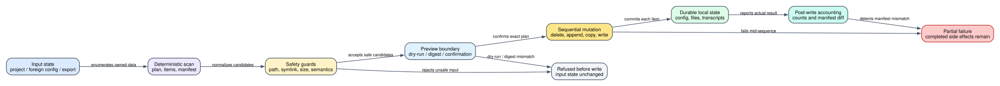

# Claude Code CLI 2.1.235 项目清理、配置导入与会话归档：哪些数据会写，失败后还剩什么

> 版本：`2.1.235` | 主证据：目标版本可读化 bundle 的 `Static` 文件/Storage V5 路径 | 核心边界：dry-run、preview digest 和 manifest 都是护栏，不是跨文件事务

**读者问题：** `claude project purge`、`claude import` 和隐藏的 `import-conversations` 会分别改哪些文件；为什么命令 exit 1 时，磁盘上仍可能已经出现一部分结果？

**一句话模型：** 三条数据生命周期都先把输入转换成确定的计划或清单，再按项目逐项写入/删除；预览可以做到零写入，摘要和 manifest 可以检测输入漂移或数量不符，但确认后的执行是顺序副作用，发生中途错误时不会自动回滚先前成功项。



图中最重要的结论是：**“有确认”不等于“有事务”，“有 manifest”也不等于“失败前没写任何东西”。**

## 60 秒看懂一次迁移与清理

贯穿场景：开发者换到一台新机器，希望完成三件事：

1. 从 Codex/Gemini 配置中迁入 user MCP、commands、agents 和 instructions；
2. 把 Claude.ai export ZIP 导入到新的工作目录，恢复项目 docs、files 和 conversations；
3. 删除旧工作区在 Claude Code 下的 transcript、tasks、debug、file history 和 project config。

正确顺序是：先对 config import 运行 `/import` preview并保存 digest；对 archive import 先 `--dry-run`；对 purge 先 `--dry-run`。确认输出符合预期后再执行。即便如此，三个真实执行都不是原子事务：

- config import 某个 command 写成功、下一个 MCP 写失败时，前一个文件保留；
- archive import 先写 projects/files/transcripts，再发现 manifest count mismatch 时，命令 exit 1，但已写文件保留；
- purge 已删除前几个目录、history rewrite 被拒绝时，已删除目录不会恢复。

### 三条生命周期改变的对象

| Object | Before | Transformation | After | User-visible effect |
| --- | --- | --- | --- | --- |
| project state | transcripts/tasks/debug/file-history/config/history 混在多个 namespace | build purge plan并逐项删除/过滤 | 目标项目状态减少；非项目级 snapshot 保留 | `/resume`、prompt history、trust/MCP entry 可能消失 |
| foreign config | Codex TOML/AGENTS/prompts 或 Gemini JSON/GEMINI/commands | scan、sanitize、map、preview digest、apply | Claude settings/MCP/commands/agents/skills/instructions 增加 | 功能迁入，但 warning/project items 默认不批量启用 |
| export archive | JSON/ZIP + manifest/projects/files/conversations | size/path validation、sanitize、convert、no-overwrite writes | 新 project docs/files 和 Claude JSONL sessions | 可在目标 cwd 恢复对话视图 |
| confirmation state | 用户看过某一份 preview | digest 或 interactive confirmation 绑定 | 执行只接受匹配当前 scan 的摘要 | 配置变化后旧 `--yes=<digest>` 被拒绝 |
| failure state | 尚无副作用 | sequential mutation 中途失败 | 已成功项保留，失败项报告 | exit 1 不能被理解成“什么都没改” |

## 先区分三个命令：它们没有共享一个“导入/清理引擎”

| Command | 输入 | 主要输出 | 默认护栏 |
| --- | --- | --- | --- |
| `claude project purge [path]` | 当前/指定 project path 或 `--all` | 删除 Claude Code 本地 project state | plan、dry-run、确认、interactive item picker |
| `claude import [codex|gemini]` / `/import` | foreign agent config | Claude config、MCP、command、agent、skill、instructions | source gate、safe mapping、preview digest、warning/project holdback |
| `claude import-conversations <exportPath>` | Claude export JSON/ZIP + `--cwd` | project docs/files + imported transcripts | feature gate、size/zip validation、dry-run、no-overwrite、manifest check |

Commander 注册也把它们放在不同 owner 下：purge 是公开 `project` 子命令；import 是 conditional action并重写成 `/import`；conversation importer 是 hidden command。[命令注册：630193-630198](../reverse/javascript/cli.readable.js#L630193)、[import 注册：630241-630248](../reverse/javascript/cli.readable.js#L630241)

## 一、Project purge：先建立“这个项目拥有哪些状态”

### 单项目计划不是删一个目录

`buildPurgePlan()` 同时用传入 path、解析后的 repo root 和 Git/worktree 相关路径建立 match set，然后收集：

- project transcript directories，包括 `.jsonl` 与 `memory/`；
- 每个 session 的 task list；
- `debug/<session>.txt`；
- `file-history/<session>/`；
- global config 的 `projects[path]` entry，其中可能含 trust、history、MCP server；
- `history.jsonl` 中 `project` 落在 match path 下的 prompt 行。

它不会删除 `shell-snapshots/`，因为该目录不是 project-scoped；`backups/` 中旧 `.claude.json` snapshot 也不会立即改写，只警告最多保留 5 份并等待自动轮换。[计划构建：628297-628335](../reverse/javascript/cli.readable.js#L628297)

### transcript 归属判断为什么需要采样

目录名通常由 project key 派生，但 worktree、旧命名和 Storage V5 可能让单靠目录名不足。CLI 会读取 transcript 起始行，寻找第一条可解析的 `cwd`：

- 最多检查 50 行；
- 第一页最多 16 KiB；
- 后续页 256 KiB；
- Storage V5 pagination 最多 10,000 页；
- 无法回答时退回 legacy filesystem 路径。

这是一种保守归属判定：不能证明 transcript 属于目标项目时，不应为了“清得干净”而误删其它项目。[transcript 扫描：628033-628094](../reverse/javascript/cli.readable.js#L628033)，[阈值：628458-628459](../reverse/javascript/cli.readable.js#L628458)

### prompt history 需要过滤重写，不是整文件删除

单项目 purge 只删 `history.jsonl` 中匹配项目的行。Storage V5 路径以 1 MiB 页扫描，再用 `replaceRecords()` 写回保留行；若 stream 有 torn tail、backend unavailable 或通用接口无法安全回答，则 defer 到 legacy readline filter。以下情况会 fail closed：

- storage interface 认为 history 是 symlink/非普通文件；
- read/rewrite 返回 InvalidArgument；
- replace precondition 不满足；
- 无法安全保证 rewrite 语义。

这样设计是为了避免一个 purge 请求把并发追加或畸形 history 尾部静默吞掉。[V5 scan/replace/fallback：628095-628248](../reverse/javascript/cli.readable.js#L628095)

### 执行模式和实际副作用

| Option | 行为 | 是否写入 |
| --- | --- | --- |
| `--dry-run` | 打印完整 plan 和 warnings 后结束 | 否 |
| 无 `-y` | plan 后询问一次不可撤销确认 | 取决于用户 |
| `-y/--yes` | 跳过确认，仍先打印 plan | 是 |
| `-i/--interactive` | 每项 Delete/Skip/Delete all remaining/Abort | 已确认项逐个写；Abort 不撤销前项 |
| `--all` | 构建全局 projects/tasks/debug/file-history/history/config plan | 是；不允许同时 path 或 interactive |

真实执行按 plan 顺序调用 `rm`、删除 config key 或过滤 history。每项失败被结构化成 `config_write_failed`、`history_rewrite_refused` 等，最后统一报告；没有 undo log。[执行与部分失败：628351-628457](../reverse/javascript/cli.readable.js#L628351)

## 二、Config import：摘要绑定解决 TOCTOU，不解决事务

### CLI 只是把受支持 argv 改写成 `/import`

pre-router 只接受 `codex`、`gemini`、`--dry-run`、`--yes` 和 `--yes=<digest>`。其它位置/参数不会进入 rewrite。feature gate 未启用时返回 build unavailable/config error，而不是偷偷读 foreign config。[argv rewrite：334155-334186](../reverse/javascript/cli.readable.js#L334155)

### Scan 阶段先决定“可映射、需警告、不可映射”

Codex scanner 可识别：

- `config.toml` 的 MCP server、approval policy、agents、skills；
- user `AGENTS.md` / `AGENTS.override.md`；
- project `.codex/config.toml` 与 instructions；
- user prompts -> Claude slash commands。

Gemini scanner可识别 user MCP、GEMINI instructions 和平铺 TOML commands；project settings、extensions、namespaced commands 等进入 unmappable 清单。

每个 importable item 都包含稳定 `id/kind/scope/label/fingerprint/apply()`；scan 失败按 source 隔离，一个 provider 读坏不必让另一个 provider 的结果消失。[Codex scan：333519-333889](../reverse/javascript/cli.readable.js#L333519)，[Gemini scan：333891-334009](../reverse/javascript/cli.readable.js#L333891)

### 安全映射不是字符串复制

Importer 在写入前执行多层检查：

| Guard | 具体行为 |
| --- | --- |
| 单文件大小 | foreign text 大于 10 MiB 时拒绝读取 |
| redirected root | home/config root 异常、网络路径或落进 project 时跳过 user-scope scan/write |
| containment | relative path 规范化后必须仍在 source root 内 |
| symlink walk | project source/target 任一级出现 symlink 时拒绝读写 |
| safe name | 非字母数字、`._-` 转为 `_`，避免路径注入 |
| no overwrite | 已存在 MCP/file/dir 返回 skipped，而不是覆盖 |
| shell marker translation | 检查 Codex/Gemini 中本来 inert、在 Claude 中会执行的 `` !`cmd` `` / ```! 组合 |
| approval policy | 升权映射带 warning；repo-level `auto` 不允许静默覆盖 user policy |
| skill adoption | 检查 SKILL.md、大小、frontmatter、shell marker、reserved name 和 plugin-like 子目录 |

核心 path/file guard 位于 [333321-333519](../reverse/javascript/cli.readable.js#L333321)，Codex skill/agent/command guard 位于 [333620-333889](../reverse/javascript/cli.readable.js#L333620)。

### Preview digest 怎样绑定“我看到的”和“将执行的”

`scanDigest()` 对 source 按 `sourceId` 排序；每个 item 按 `id` 排序并序列化 `id/kind/scope/label/description/warning/fingerprint`；unmappable 按 label/reason/scope 排序。最后取 SHA-256 hex 的前 32 字符。

`/import --yes=<digest>` 会重新 scan：

- digest 不是 32 个小写 hex，拒绝；
- current digest 与 preview 不同，拒绝并打印新摘要；
- 完全匹配才进入 apply。

这能阻止“用户预览后 foreign config 被换掉”的 TOCTOU，但不能阻止 apply 第一项成功、第二项失败。[digest 与拒绝分支：334052-334143](../reverse/javascript/cli.readable.js#L334052)

### Headless 批量导入故意只选低风险 user items

非交互 `/import --yes=<digest>` 自动 apply 的集合是：`scope=user`、没有 warning、且 `kind !== skill`。以下项目 held back：

- project-level items；
- warning-flagged permission/MCP/agent 等；
- skills；
- 需要 interactive picker 的逐项选择。

unmappable user items 可以被写成 `skills/import-to-claude-code/SKILL.md` 供后续手工迁移；这个 fallback skill 本身也是一个写入副作用，`--dry-run` 只报告 would write。[headless selection/apply：334071-334143](../reverse/javascript/cli.readable.js#L334071)

### Apply 是逐项 best-effort

每个 item 的 `apply()` 被单独 try/catch：成功显示 check，已存在显示 skipped，失败显示 cross；随后继续其它项。结果标题使用实际 imported count，并提示 held-back 数量。没有临时目录统一 commit，也没有失败后删除先前写入的 files/MCP/settings。[apply loop：334098-334132](../reverse/javascript/cli.readable.js#L334098)

## 三、Conversation archive import：写完以后才做 manifest 对账

### 入口 gate 与输入合同

hidden `import-conversations` 只有 `CLAUDE_IMPORT_CONVERSATIONS` gate 打开才运行，并强制要求 `--cwd`。目标 cwd 先规范到 project root；`--dry-run` 仍会完整 parse、验证 archive 和计算输出，但不创建目录或 transcript。[handler：629598-629623](../reverse/javascript/cli.readable.js#L629598)

### JSON/ZIP 的四层体积护栏

整个 export 文件最大 `1,073,741,824` bytes（1 GiB）。ZIP 解压还复用 entry validator：

| Limit | 2.1.235 value | 拒绝原因 |
| --- | --- | --- |
| 单 entry uncompressed size | 536,870,912 bytes（512 MiB） | 防止单文件耗尽内存/磁盘 |
| 总 uncompressed size | 1,073,741,824 bytes（1 GiB） | 限制展开总量 |
| entry count | 100,000 | 防止 inode/file-count exhaustion |
| compression ratio | 50:1 | 检测 zip bomb |
| path | relative、非 traversal、非 absolute | 防止写出 archive root |

validator 在 unzip filter 中逐 entry 执行，任一超限会在真正 import 前抛错。[ZIP validator：108608-108634](../reverse/javascript/cli.readable.js#L108608)，[常量：108655-108662](../reverse/javascript/cli.readable.js#L108655)，[export 上限：629496-629527](../reverse/javascript/cli.readable.js#L629496)

### Archive 解析和名称降权

非 ZIP 必须是有效 JSON。ZIP 优先读取 `conversations.json`、`projects.json`、`manifest.json`、`users.json`，也接受 `projects/*.json`；`files/` 下只接收 basename 匹配 `[a-zA-Z0-9_-]+` 的文件 UUID。

写入前会：

- filename 清洗后截到 128 字符；
- project dir 使用 `name-uuid`，必须只含安全字符且最长 200；不满足的 project 被跳过；
- `CLAUDE.md`、`CLAUDE.local.md`、`.git`、`.claude*`、AGENTS/GEMINI/Cursor 等有自动加载语义的名称加 `imported-` 前缀；
- prompt template 固定写为 `project-instructions.md`，避免直接成为 active `CLAUDE.md`。

这不是 cosmetic rename，而是防止“导入历史资料”意外变成目标项目下一次启动会自动执行/加载的配置。[名称和 reserved-name 处理：629343-629370](../reverse/javascript/cli.readable.js#L629343)

### 写入顺序与文件模式

非 dry-run 的顺序是：

1. 创建 transcript project scope；
2. 创建 `<cwd>/projects` 和 `<cwd>/files`，目录 mode `0700`；
3. 逐 project 写 `project-instructions.md`、docs、project files；
4. 写未归属项目的 files；
5. 把每个 conversation 转成 Claude JSONL user/assistant records；
6. 对可 attach 的 image/file 生成 attachment records并修 parent chain；
7. transcript 使用 Storage V5 append 或 legacy `writeFile(..., {mode:0600, flag:"wx"})`；
8. 收集 session IDs、titles、timestamps、project mapping 和 attachment mapping；
9. 最后对 manifest counts 做比较。

普通 project/docs/files 也用 `0600` + `wx`，存在同名文件时返回 false而不覆盖。已存在 transcript 被计入 `skipped`，不是 merge。[no-overwrite 写入：629359-629397](../reverse/javascript/cli.readable.js#L629359)，[完整导入：629528-629596](../reverse/javascript/cli.readable.js#L629528)

### 为什么 manifest mismatch 是“已产生副作用的失败”

`_my()` 完成所有 project/file/transcript 写入后才计算 `manifestDiff`。handler 先把 imported counts 和完整 result JSON 写到 stdout，然后：

- diff 为空：exit 0；
- diff 非空：stderr 打印 `IMPORT_MANIFEST_MISMATCH`，exit 1。

所以 exit 1 只说明 manifest 声明的 conversation/message/project/doc 数量与实际不一致，不说明 import 被回滚。自动化必须解析 result JSON 中的 `sessionIds/jsonlPaths/counts`，决定保留、审计或显式清理。[manifest 对账：629496-629527](../reverse/javascript/cli.readable.js#L629496)，[post-write exit：629612-629623](../reverse/javascript/cli.readable.js#L629612)

## 精确二进制 Probe：dry-run、真实导入与部分写入

[project-data-lifecycle.json](runtime-probes/project-data-lifecycle.json) 使用 SHA-256 为 `83b8f806f6f2eea316cfe246628e6c23374711d868f1fd0409db551b877b7748` 的 `2.1.235` 原始二进制。脚本为七次 CLI 执行分别建立不共享的 HOME、`TMPDIR`、`CLAUDE_CONFIG_DIR`、secure-storage、workspace 和目标目录；进程环境采用 replace 而不是继承。合同显式关闭 GrowthBook、非必要流量、遥测、错误上报和自动更新，清空 Anthropic API/auth/OAuth/session 凭据，并用 `/dev/null` global Git config、禁用 system config/prompt、固定 askpass。输入只包含受控 marker，没有读取或写入真实用户配置。

报告把“方便阅读”和“可复现执行”分成两层，避免再把缩略命令冒充 exact：

- `commands.<scenario>` 是从合同生成的完整 `env -i ...` shell 展示串，适合复制和审阅；
- `executionContracts.<scenario>` 才是权威执行记录，逐项保存 `$CLAUDE_TARGET`、完整 normalized `argv`、`cwd`、stdin 策略、`environmentMode: replace` 和全部环境键值；
- `literalOutput` 与 `exitStatus` 保存实际返回，`beforeAfter` 保存文件状态，`observed` 只由 stdout 解析或 before/after 计算，不预填 `5/0/false`；
- `target.version`、实际 binary SHA 与 snapshot metadata 都必须精确等于本版常量；`pass` 只由全部 69 项 checks 的布尔合取产生。

脚本在两个随机临时根中连续运行两次；对完整 JSON 执行 `jq -S 'del(.capturedAt)'` 后，两份结果逐字相等，SHA-256 同为 `77e749180c01b38ede7aa99f56c8946e64b860120b9c303487ed42235855be2b`。这项稳定性来自路径规范化而不是忽略 transcript：JSONL 先把随机 cwd/config/HOME/TMPDIR/target 路径替换成稳定占位符，再计算 canonical content SHA-256。

### Purge dry-run 建立计划，但 domain 数据零变化

隔离配置目录包含 `projects/`、`tasks/`、`debug/`、`file-history/`、`history.jsonl`、`shell-snapshots/` 和 `backups/`。下面只展示业务 argv；完整环境以报告中的 `executionContracts.purgeDryRun` 为准：

```text
$CLAUDE_TARGET project purge --all --dry-run
```

CLI exit `0`，stdout 最终逐字为 `Dry run: 5 item(s) would be deleted.`。Probe 不是只匹配这个数字，而是逐行解析五个 plan entry 的 kind、完整规范化路径和 owned target，得到四个 dir：`projects`、`tasks`、`debug`、`file-history`，以及一个 file：`history.jsonl`。stderr 同时确认 `shell-snapshots/ are not project-scoped and will not be touched`，并说明 backups 只会按自己的轮换策略退出。planned 与 excluded fixture 的 path、mode、bytes 和 SHA-256 在命令前后完全相同。

这里观察到一个必须单列的进程边界：CLI 启动阶段仍创建了 `.claude.json` 和一份自动 backup。也就是说，`--dry-run` 对 **purge 拥有的删除/重写对象** 是零写入，不代表整个 CLI 进程绝对不产生启动级配置文件。后续自动化如果要求真正 filesystem-silent，必须先在隔离目录完成 CLI bootstrap，再比较 domain roots。

### `project purge --all -y` 的真实删除合同

第二个完全独立的 fixture 使用相同五类 owned target，但 marker、HOME、TMPDIR、config 和 workspace 均不与 dry-run 共用。实际 argv 是：

```text
$CLAUDE_TARGET project purge --all -y
```

它 exit `0`，stdout 逐字结束于 `Purged 5 item(s) across all projects.`。关键证据不是成功文案，而是状态差：

| 对象 | before | after | 判定 |
| --- | --- | --- | --- |
| `projects/` | mode `0700`，含 mode `0600` transcript marker及其 bytes/SHA | 无任何 row | 已删除 |
| `tasks/` | 含 task marker及其 bytes/SHA | 无任何 row | 已删除 |
| `debug/` | 含 debug marker及其 bytes/SHA | 无任何 row | 已删除 |
| `file-history/` | 含 snapshot marker及其 bytes/SHA | 无任何 row | 已删除 |
| `history.jsonl` | mode `0600`，74 bytes，有固定 SHA | 无任何 row | 已删除 |
| `shell-snapshots/keep.txt` | mode `0600`，42 bytes，SHA `315eb961…d6a6c0` | mode/bytes/SHA 完全相同 | 明确保留 |
| `backups/keep.txt` | mode `0600`，34 bytes，SHA `3a1f8536…f79d55` | mode/bytes/SHA 完全相同 | 明确保留 |

进程另行新增 `.claude.json` 与 `backups/$AUTO_BACKUP`，报告把二者放在 `startupChangesOutsidePlan`，没有把它们混进 purge 成功判定。这个正向 Probe 只证明 `--all` 的五项全局计划和执行一致；它**没有运行指定 path 的单项目 purge**，因此单项目 `history.jsonl` 过滤、project config key 删除和失败恢复仍以 Static 路径为证，不能由本结果外推。

### JSON dry-run 与真实 import 的状态差异

同一份 JSON fixture 声明 1 个 project、1 个 conversation、2 条 message、1 个 doc。dry-run 命令 exit `0` 并输出：

```text
[dry-run] imported: conversations=1 skipped=0 messages=2 projects=1 docs=1 files=0
```

目标 cwd 与 transcript root 前后都为空。去掉 `--dry-run` 后命令仍 exit `0`，但状态发生三组可观察变化：

1. 写出 1 个 mode `0600` 的 JSONL transcript；user UUID 精确为 fixture 的 `50000000-…0005`，assistant UUID 精确为 `70000000-…0007`，后者 `parentUuid` 精确等于前者，record version 均为 `claude-export-import`。随机路径规范化后的 transcript 是 1,216 bytes，canonical SHA-256 为 `bbf01984…7aac6b0`。
2. `prompt_template` 写成精确路径 `projects/json-import-project-10000000-…0001/project-instructions.md`；mode `0600`、32 bytes、内容 SHA `5b7f8bd7…23648a` 与输入 marker 的预期 bytes/SHA 全等。
3. 输入 doc 名为 `CLAUDE.md`，实际写成同项目目录下的 `imported-CLAUDE.md`；mode `0600`、31 bytes、内容 SHA `3083f6f2…804c4` 与输入正文全等。这里验证的是路径、mode、bytes 和内容，不是只看文件名 suffix。

### ZIP manifest mismatch 在 exit 1 前已经完成写入

ZIP fixture 的真实内容仍是 1 个 conversation、2 条 message、1 个 project、1 个 doc、1 个 project file，但 manifest 故意声明 3 条 message 和 2 个 doc。命令 stdout 先报告真实导入计数，随后 stderr 逐字给出：

```text
manifest mismatch:
  messages: manifest=3 imported=2
  docs: manifest=2 imported=1
Import completed with mismatches (IMPORT_MANIFEST_MISMATCH)
```

进程 exit `1`，但 before/after 证明 1 个 mode `0600` transcript、`project-instructions.md`、`imported-CLAUDE.md` 和 `imported-AGENTS.md` 全部保留。transcript 两个 UUID 精确复用 fixture 的 `60000000-…0006` 与 `80000000-…0008`，assistant parent 精确指向 user；规范化 transcript canonical SHA 为 `4d37df63…836db`。三个 project artifact 均位于精确的 `projects/zip-mismatch-project-20000000-…0002/` 下，mode 都是 `0600`，bytes 分别为 33/32/33，实际内容 SHA 分别精确等于 project instructions、CLAUDE doc 和 AGENTS file fixture 的预期 SHA。这个 Probe 把“post-write manifest check”从 Static 顺序提升为真实部分完成语义：调用方必须联合读取 stdout result、stderr mismatch 和目标目录，不能只凭 exit code 决定是否清理。

### Config import 的本地正向路径仍被 feature gate 阻断

隔离 HOME 中存在一个合法 Codex `config.toml`，但禁用在线 feature evaluation 后，`tengu_import` 使用本版内置 false；本地 override 又是不可达分支。命令 exit `1`，stderr 逐字为：

```text
`claude import` is not yet available in this build. Run `claude` and use /mcp or edit ~/.claude/settings.json directly.
```

Codex fixture 与 Claude config before/after 相同。因此本组 Probe 不把 config preview/digest/apply 升级为正向运行结论；它证明的是 exact-binary action gate 和零 apply，真实账号 rollout 值仍属于 Boundary。

## 失败、部分完成和恢复矩阵

| Failure | Detection | Retry/change | State retained | Final user effect |
| --- | --- | --- | --- | --- |
| purge dry-run | explicit flag | 检查 plan 后重跑 | 所有数据 | 只打印 would delete |
| purge 中途删除失败 | per-item error | 修权限后重新 plan | 前面已删项不会恢复，失败项仍在 | 汇总失败 code，exit 非成功 |
| history rewrite refused | V5/legacy safety check | 修 symlink/权限/torn tail 后重试 | 其它 purge 项可能已删除；history 保留 | 明确 `history_rewrite_refused` |
| import digest drift | rescan hash mismatch | 重新 preview并用新 digest | Claude config 未开始写 | 拒绝执行 |
| config item apply 失败 | per-item exception | 修单项后重新 scan/apply | 先前成功项和 skipped 项保留 | 输出 success/skipped/failure 混合结果 |
| archive 超限/unsafe path | pre-unzip validator | 减小/修复 archive | 目标 cwd 未开始写 | `IMPORT_TOO_LARGE` 或 `IMPORT_ERROR` |
| archive 文件已存在 | `wx` / transcript stat | 改目标 cwd、删除冲突或接受 skip | 既有文件不覆盖 | conversation `skipped` 增加 |
| archive 写入中途异常 | filesystem/storage exception | 根据 result/目录审计后重跑 | 已写 projects/files/transcripts 保留 | `IMPORT_ERROR`，无自动 rollback |
| manifest mismatch | 所有写入后计数比较 | 审计 stdout result与 archive | 已写内容全部保留 | `IMPORT_MANIFEST_MISMATCH`, exit 1 |

## 不可逆副作用和实际恢复策略

### Purge

- `rm`、history filter 和 project-config delete 没有 undo log。
- file checkpoint 只覆盖受跟踪的工作区文件，不覆盖 Claude config/transcript/task/debug 删除。
- 恢复只能来自外部 backup、filesystem snapshot、Git 或旧 `.claude.json` backup；而 purge 明确不会立刻清 backup，所以短期内可能仍能人工恢复 project entry。

### Config import

- 新 MCP/command/agent/skill 一旦写入，后续启动可能加载；失败后应按 preview/result逐项移除，而不是假设 importer 清理。
- instruction import 使用 marker并追加现有文件；删除 marker section 需要文本级审计，不能只删整个 `CLAUDE.md`。
- 已存在 target 被 skip，不会自动 merge；重复执行应先重新 scan，因为 digest 和 existing-state 结果可能变化。

### Conversation import

- result JSON 给出 session IDs、JSONL paths、project dir mapping 和 attachment files，是失败后定向清理的依据。
- imported transcripts 使用稳定 UUID namespace从 export conversation UUID 派生；重跑同一 archive通常会 skip 已存在 transcript，而 project/docs/files 的 `wx` 也避免覆盖。
- project/docs/files 可能早于 transcript 写入；只删除 JSONL 不等于完整回滚。
- manifest mismatch 后若决定保留，应把 mismatch 视为数据完整性告警；若决定清理，应按 result JSON 和目标目录审计，不要对整个 cwd 做递归删除。

## 成本、隐私与安全影响

| Dimension | 影响 |
| --- | --- |
| Disk | archive 允许最高 1 GiB compressed/uncompressed envelope、100k entries；导入还会生成 JSONL 与 enriched attachments |
| CPU/memory | ZIP 使用同步解压到内存对象，接近上限的 archive 会造成明显峰值；50:1 ratio只是 zip-bomb backstop |
| Privacy | purge plan、import result 和 status JSON 会打印项目路径、session title/ID、foreign config label；公开日志前应脱敏 |
| Security | config importer重点防 path traversal、symlink、shell-marker语义升级、repo-authored grant 和 plugin-like skill adoption |
| Integrity | digest 保护 preview-to-apply，manifest 保护声明-to-result；二者都不替代原子写入 |
| Recoverability | `--dry-run` 对 purge/import 自己拥有的 domain 对象不写；CLI bootstrap 仍可能初始化 `.claude.json`/backup。真实执行后的恢复依赖 per-item 结果、backup 和人工清理 |

## 微小但关键的特性

- purge 的 `--all` 不能与 path 或 interactive 同用，避免把逐项 UI误当成全局删除的最后防线。
- purge 全局 history 删除是整条 history stream；单项目则只过滤匹配 path 的行。
- config importer 会把 foreign item label 当作不可信数据，preview prompt 明确禁止把 label 当成指令执行。
- Codex `approval_policy=never` 不会被解释成“最安全”，而是警告其依赖 Codex 自己的 sandbox，Claude 没有等价语义。
- Gemini shell block translation 会验证翻译前后实际可执行命令集合，防止 backtick/argument substitution 重配对。
- imported media files不会全部自动变成 active attachment；音视频等扩展名会保留为 file，避免 enrichment 路径误处理。
- conversation manifest fallback 可从实际 conversations/projects生成，这意味着“没有有效 manifest”不一定阻止导入，但最终完整性只能以实际 parsed data为准。
- archive error 分类只把体积/ratio/file-count/per-file-size归为 `IMPORT_TOO_LARGE`；unsafe path属于一般 `IMPORT_ERROR`，两者都在写入前失败。

## 证据等级与明确边界

### Static

- purge plan、history rewrite和执行：[627978-628459](../reverse/javascript/cli.readable.js#L627978)
- config importer path/shell/symlink guard：[333321-334143](../reverse/javascript/cli.readable.js#L333321)
- CLI import rewrite/gate：[334155-334186](../reverse/javascript/cli.readable.js#L334155)
- archive ZIP limits：[108608-108662](../reverse/javascript/cli.readable.js#L108608)
- conversation parser、writer、manifest/handler：[629343-629623](../reverse/javascript/cli.readable.js#L629343)

### Probe

专属脚本 [probe_project_data_lifecycle.mjs](../skill/claude-code-version-diff/scripts/probe_project_data_lifecycle.mjs) 和报告 [project-data-lifecycle.json](runtime-probes/project-data-lifecycle.json) 已覆盖 purge dry-run、独立 `--all -y` 正向删除、conversation JSON dry-run/真实导入、ZIP manifest mismatch 部分写入和 config import gate。报告保存 shell 展示命令、权威结构化 execution contract、完整 fixture、规范化 literal stdout/stderr、exit status、文件精确 path/mode/bytes/content SHA、transcript UUID parent chain、canonical transcript SHA 与 69 项 checks；本轮总结果为 `pass: true`。所有目标数据都位于自动清理的临时目录，真实用户配置未进入输入或输出。

### Public

公开产品文档可以解释 import/purge 的用户入口，但本专题的 50-line scan、16/256 KiB页、10,000页、10 MiB foreign file、512 MiB ZIP entry、1 GiB total、100,000 files、50:1 ratio 和 post-write manifest mismatch 都绑定 `2.1.235` bundle，不向其它版本外推。

### Boundary

客户端不能证明 export 生成端的数据为何缺失、foreign agent 配置是否语义正确、Storage V5 backend 的云端备份策略或 filesystem snapshot 是否可用。Importer 只验证它能观察到的结构、路径、大小和计数；业务内容真实性仍需要用户或上游系统校验。
