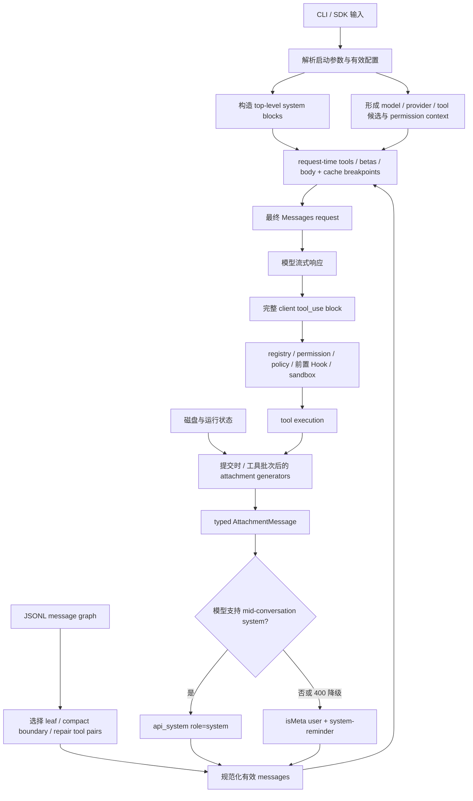

# Claude Code CLI 2.1.235 Prompt Assembly：一次请求究竟怎样被编译出来

> 版本：`2.1.235` | 证据：`Static` + `Public` | 视图：`reverse/javascript/cli.readable.js`

**读者问题：** 用户明明只输入了一句话，为什么模型还知道工作目录、CLAUDE.md、可用 Skills、IDE 选区、后台任务和文件刚被外部修改？这些内容谁的优先级更高，哪些只是建议，哪些能真正阻止工具执行？

**一句话模型：** Claude Code 不会把 transcript 原样发给模型；启动阶段先形成model/provider/tool候选与permission context，每次API attempt再编译稳定system前缀、最终tools/betas/body和有效消息历史；用户提交及工具批次后产生的动态attachment则按模型能力编码成中途`system`消息或带`<system-reminder>`的user/meta消息。

这篇文章补的是此前文档最关键的一处断层：已有文章分别讲了 system prompt、CLAUDE.md、Prompt Cache、Hooks、MCP 和 compact，却没有回答**它们在同一次真实请求里怎样排队、怎样获得权威、怎样失效，以及为什么有时出现在 user/tool result 里却不是用户说的话。**

## 先看一张图：模型看到的不是磁盘 transcript



图里最重要的不是箭头数量，而是两条完全不同的控制线：

- **模型上下文线**决定 Claude 知道什么、倾向怎样行动；system、user context、reminder 和 tool result 都在这条线上。
- **本地执行线**决定动作能不能真正发生；tool registry、deny/ask/allow、managed policy、前置Hook、适用sandbox和OS权限不依赖模型是否听话。PostToolUse/PostToolBatch等后置Hook只能改变反馈或后续控制流，不能撤销已完成副作用。

所以“项目 CLAUDE.md 要求不要运行某命令”和“managed permission deny 拒绝该命令”不是同一种优先级。前者是模型应遵循的上下文，后者是客户端在 `tool.call` 前执行的硬门。

## 四种看起来都像“指令”的对象

| 对象 | Wire / 内部形态 | 谁生成 | 能否单独强制阻止副作用 | 主要失效方式 |
| --- | --- | --- | --- | --- |
| Top-level system prompt | API 顶层 `system[]` blocks | Claude Code preset、`--system-prompt`、append、output style | 否，仍需本地控制管线 | model/provider/mode/tool-set/section 变化，或整个 session 重建 |
| Mid-conversation system | `messages[]` 中 `role:"system"` 的 `api_system` | 支持该能力时由 harness 提升动态状态 | 否；权威高于普通 user 文本，但执行仍受本地门控 | 模型/代理不支持时 400，随后对本会话 sticky 降级 |
| Meta reminder / attachment | 内部`attachment`，发送前常变成`isMeta` user message与`<system-reminder>` | 文件监控、Memory、Skill、MCP、IDE、Hook、task、mode等 | 否；它告诉模型当前事实或约束 | 去重、提交/工具批次重算、compact重建、超时/生成失败、resume过滤 |
| 本地 enforcement | registry、permission、policy、前置Hook、sandbox、凭据和OS | 客户端与管理员配置 | **前置层可以**；后置Hook不能撤销已完成副作用 | 配置来源变化、session重建、平台能力或外部policy变化 |

不能把这张表简化成一条“system > user > tool”的固定排序。`2.1.235` 同时使用模型 authority 和客户端 enforcement：即使 Plan Mode reminder 在消息里告诉模型只读，客户端仍用 permission mode 和工具专属规则阻止不允许的写；即使某个外部内容伪造 `<system-reminder>`，来源标记和本地权限也不能因此被提升。

## 一次请求的完整编译顺序

### 1. 先确定运行合同，而不是先拼字符串

启动层先解析：

- 默认或自定义 system prompt；
- `--append-system-prompt` 及文件版本；
- `--exclude-dynamic-system-prompt-sections`；
- model、provider、effort、fast mode、permission mode；
- settings、managed policy、workspace trust；
- 内置、条件、Plugin、MCP、Agent 和动态注册工具。

`--system-prompt` 会替换默认 preset；append 只追加。动态 section 排除只对默认 preset 生效，显式自定义 system prompt 时忽略。对应 CLI 合同位于 [readable L603768](../reverse/javascript/cli.readable.js#L603768)。

这一步已经决定了后面哪些 section、工具和 beta 有资格出现。一个功能字符串存在于 bundle，不表示它会进入当前 request；host、account、feature、provider、session、policy 与 Tool Search 仍会继续缩小能力集合。

外层一次用户提交会先解析 runtime model，再构造 `systemPrompt/userContext/systemContext` 快照；同一个 Agent Loop 内的后续模型迭代复用这份基础快照，而工具批次后的动态 attachment 会重新计算。换句话说，“system/context 编译一次”与“每轮状态不再更新”不是一回事。入口见 [readable L597468-L597668](../reverse/javascript/cli.readable.js#L597468)。

### 2. Top-level system prompt 由 section 编译，不是一整段常量

默认 builder 按 section key 生成 communication、task execution、action caution、tool use、memory、环境、context management、Agent、权限与 Hook 等块。不同模型、provider、模式和工具集合会改变 section 集合。

为了缓存，system prompt 还会划分稳定与动态区域：稳定规则尽量进入可共享前缀；cwd、Git、Memory path 等机器/项目状态留在较晚区域。启用 `--exclude-dynamic-system-prompt-sections` 时，这批动态内容被移动到第一条 user message，而不是被删除。

这说明“system prompt 长度”不是唯一问题。**顺序和稳定性决定后续整个消息历史能否复用缓存。** 官方 2026-04-30 的设计文章把顺序概括为 static system/tools、CLAUDE.md、session context、conversation messages；它用于解释设计动机，本版具体 block、scope、TTL 和 gate 仍以本地实现为准。见 [Prompt Cache 专题](context-governance-and-caching.md)。

### 3. User context 与 system context 独立构造

`k7(session)` 与 `O2(session)` 分别生成两类上下文：

- `k7()`：CLAUDE.md、rules、Memory等user context；
- `O2()`：Git status、Perforce mode等system context。

cwd、日期、平台与shell原本来自默认system builder的environment sections，不是`k7()/O2()`普通输出。只有dynamic-section exclusion开启时，这些容易变化的system sections才被重定向到user context。

这些上下文能影响模型判断，却不等同于 settings merge 或 permission engine。官方当前文档也明确区分：CLAUDE.md/rules 是模型读取的 guidance，settings/permissions/hooks 是客户端执行的 configuration。当前文档只用于提出这个区分；`2.1.235` 的实际载体与 consumer 由本 bundle 证明。

主循环真正发请求时，`systemContext` 被追加到 top-level system blocks，`userContext` 则作为首部 reminder 放进消息视图；启用 dynamic-section exclusion 时，原本容易变化的 system 内容也并入 user context，并清空对应 system context。见 [readable L367319-L367323](../reverse/javascript/cli.readable.js#L367319)、[L271653-L271655](../reverse/javascript/cli.readable.js#L271653) 与 [L408415-L408429](../reverse/javascript/cli.readable.js#L408415)。

### 4. Transcript 先变成“当前有效消息图”

JSONL 物理顺序不是 API 的最终 `messages[]`。发送前还要：

1. 选择当前 session leaf 与 parent chain；
2. 应用最后一个有效 compact boundary；
3. 按 preserved UUID/segment 修复 compact 后的逻辑链；
4. 保证 `tool_use` 与 `tool_result` 合法配对；
5. 丢弃 progress、被 tombstone/supersede 的临时分支和不应送模的 UI 事件；
6. 对 provider/model 不接受的 block 做定向 strip 或 fallback。

这一步解释了两个常见误解：resume 不是读取 JSONL 最后 N 行；compact 也不是把历史文件覆盖成一段 summary。物理 transcript、逻辑消息图和本次 wire view 是三个对象。

### 5. 在用户提交和工具批次后并行计算动态 attachment

`lFf()` 是多数动态上下文的汇合点。attachment会在初始用户提交，以及工具批次完成、准备下一次模型决策时重算；同一模型轮次内的网络retry、400兼容性strip或stream fallback通常复用当前消息快照，不会把全部generator重跑一遍。[汇合顺序：readable L322002-L322021](../reverse/javascript/cli.readable.js#L322002)

下表描述最终会进入attachment/message正规化的主要动态对象；其中多数由`lFf()`汇合，read truncation与同步UserPromptSubmit Hook等对象由工具或Hook管线稍后追加。

| 类别 | 典型 attachment | 解决的问题 |
| --- | --- | --- |
| 输入展开 | `file`、`directory`、MCP resource、Agent/peer mention | 用户输入中的 `@...` 实际指向什么 |
| 文件新鲜度 | `edited_text_file`、`edited_image_file`；工具管线另产read truncation | 模型先前看到的文件是否已被外部改变 |
| 指令与记忆 | nested memory、relevant memories、memory update | 哪些持久文本刚进入或已经过期 |
| 扩展能力 | skill listing、dynamic skill、deferred tools、MCP instructions、dropped tools、Agent listing | 当前会话的能力目录发生了什么变化 |
| 运行模式 | Plan、Auto、output style、critical reminder、token/budget | 本轮该怎样行动及何时收尾 |
| 编辑器与诊断 | IDE selection/open file、IDE/LSP diagnostics | 用户正在看的内容与新诊断是什么 |
| 异步工作 | queued command、task status、Agent pending message、team context | 正在运行或刚完成的后台工作怎样回到主循环 |
| 可编程扩展 | sync/async Hook result、additional context、system message | 外部 Hook 怎样阻断或增加上下文 |

generator共用一个约1秒后触发的abort signal；每个`vw(label, generator)`单独计时并捕获异常。某个attachment计算失败时，它记录diagnostic并返回空集合，不会因为“IDE状态没取到”或“某个附件构造失败”就终止整个Agent Loop。这个timer只会触发signal，不保证忽略AbortSignal的外部代码立刻停止。[异常隔离：readable L322023-L322037](../reverse/javascript/cli.readable.js#L322023)

这是一种明确取舍：动态辅助信息可以缺席，主请求仍要继续；权限、tool pair 和 schema 合法性则不能按同样方式忽略。

当前 user message 与基础 attachment 构造完成后，客户端才运行 `UserPromptSubmit` Hook；Hook additional context/system message继续追加到尾部，blocking Hook则让本次提交根本不进入模型。工具批次结束后又会运行一次attachment extractor，把文件变化、MCP generation、队列消息和task状态带入下一次model iteration。见 [readable L462452-L462588](../reverse/javascript/cli.readable.js#L462452)、[L272372-L272424](../reverse/javascript/cli.readable.js#L272372)。

### 6. Typed attachment 被渲染成 API 消息

内部先保留`{type:"attachment", attachment:{type:...}}`，而不是立即拼XML。[readable L322843](../reverse/javascript/cli.readable.js#L322843)的`dc()`只增加UUID和timestamp。发送前`WHi()`先把attachment映射成零个或多个内部消息：多数动态状态成为meta user reminder，human-origin queued command可保持非meta，支持时部分纯文本reminder还会提升为`api_system`。`wy()`会把适用text block包进：

```text
<system-reminder>
...
</system-reminder>
```

对应实现见 [readable L398727-L398799](../reverse/javascript/cli.readable.js#L398727) 与 [attachment renderer L398948-L400100](../reverse/javascript/cli.readable.js#L398948)。

因此：

- `<system-reminder>` 是**发送编码**，不是所有动态状态的内部存储格式；
- attachment 才保留类型、字段、UUID、时间和 resume/compact 语义；
- `WHi()` 可以保留某些 attachment 为内部 SDK/transcript frame 而不生成模型文本，不能用“记录存在”推断模型一定看见；
- 并非用户输入中出现同样标签就自动获得 harness 身份；
- meta message 虽使用 user-role 兼容载体，但 `isMeta`、origin 和类型判断让客户端不会把它当作普通 human prompt。

`qtt()/yyt()`会排除tool result、`isMeta`、compact summary、非human origin和多种系统envelope，避免它们进入“真实用户prompt数”等逻辑。[human/meta：readable L397283-L397321](../reverse/javascript/cli.readable.js#L397283)；[origin predicates：L72174-L72206](../reverse/javascript/cli.readable.js#L72174)

### 7. 支持时提升为 mid-conversation system，失败时降级

`2.1.235` 已包含 `api_system`：内部消息携带 `role:"system"`，wire serializer 会发成 mid-conversation system message。[readable L111799](../reverse/javascript/cli.readable.js#L111799)、[L410214](../reverse/javascript/cli.readable.js#L410214)

这条路径受 model/provider capability 和 session latch 约束。支持时，客户端可以把聚合后的 reminder 提升为 `api_system`；若 API 或代理拒绝 mid-conversation system，客户端 sticky关闭该能力，重新构造兼容的user-role reminder，避免每轮重复撞同一个400。若拒绝的只是`api_system`尾部cache marker，则只把breakpoint降到trailing message后重试，不需要改写top-level system。[readable L409347-L409351](../reverse/javascript/cli.readable.js#L409347)、[L409575-L409582](../reverse/javascript/cli.readable.js#L409575)

所以 2.1.235 不是“所有 reminder 永远都是普通 user 消息”，也不是“所有动态状态都能获得 system authority”。实际结果由模型支持、beta/capability 与失败恢复共同决定。

### 8. Reminder 会被放进合法的消息位置

模型 API 对 role 顺序和 tool pair 有严格要求。客户端不能随便在 `assistant.tool_use` 与对应 `user.tool_result` 中间插一条独立消息。

- `jaT()` 将内部 attachment 移到合适的 user/assistant 边界；
- `Jwm()` 可以把独立的 reminder text 合并进最后一个符合条件的 tool result；
- `api_system` 必须出现在允许的 role 位置；
- 正规化器还会过滤已不可用的 tool reference、非法 media 和 orphan block。

这就是为什么抓包时 `<system-reminder>` 可能出现在 user message，也可能附着在 tool result 内。它是为了保持 API 消息合法性和 cache 前缀，而不是在声称“这段内容由用户输入”。相关装配见 [readable L397730-L398210](../reverse/javascript/cli.readable.js#L397730)。

### 9. 最后才放 cache breakpoint 并发请求

系统块、tools 和规范化 messages 都确定后，客户端才决定 cache marker：

- system 稳定/动态 boundary；
- 最后一条合法消息；
- `skipCacheWrite` 时向前移动；
- fork point pin；
- thinking、不可缓存 block 与 `api_system` 尾部的特殊处理。

在既有前缀字节、model、betas和active tool schemas稳定时，新消息通常只追加到旧前缀之后；动态context、工具generation或外层提交重建仍可能改写前缀。客户端把effort等request属性记为相邻调用的cache-break候选，但服务端真实cache key仍是Boundary。详细归因见 [上下文治理与多层缓存](context-governance-and-caching.md#缓存失效不是玄学desktopcowork-怎样定位一次-break)。

## 文件为什么“刚改完不用重读”，外部修改又会被发现

`readFileState` 是 Prompt Assembly 与文件工具之间的一份共享事实表。`2.1.235` 使用路径归一化的 LRU：最多 `5,000` 条、总预算 `25 MiB`；普通内容超过 `4,096` bytes 时默认只保留 hash/length，必要对象可用 `keepContent` 保留正文。[readable L195260-L195335](../reverse/javascript/cli.readable.js#L195260)

不同写入来源故意留下不同状态：

| 来源 | 保存的状态 | 后续含义 |
| --- | --- | --- |
| 普通 `Read` | content/hash、mtime、`offset`/`limit`；默认 offset 为 1 | 相同范围且 mtime 未变时可 dedup；部分视图不能证明整文件新鲜 |
| `Edit` / `Write` | 新 content/hash、写后 mtime、`offset/limit=undefined` | harness 知道写入成功；后续外部变化可进入 changed-file attachment |
| CLAUDE.md / nested memory seed | 原内容、mtime、`seededFromContext`、`keepContent` | 后续 Read 可返回“启动时内容仍有效”，变更时重新装入 |
| relevant memory | 内容、mtime 与可选 limit | 防止同一 memory 在本轮重复 surface |

贯穿例子：模型 Read `config.ts`，Edit 把端口从 3000 改到 4000。Edit 成功后状态表已经记录写后内容，所以模型无需为了“确认写成功”再 Read。此时 formatter 又把引号改了：

1. `hFf()` 只检查 `offset/limit` 均未设置的完整 owner；
2. 比较当前 mtime 与记录时间；
3. 重新通过 Read validator/consumer 读取，而不是直接信任磁盘路径；
4. 文本未变化则不提醒；变化则产生 diff snippet；
5. 同一轮所有 changed text snippet 总预算 `16,384` 字符，超过后仍保留“发生变化”事实，但省略后续 diff；
6. 这次重读会更新规范化 key，使 reminder 成为一次性状态迁移，而不是每轮重复注入。

实现见 [changed-file detector L322450-L322490](../reverse/javascript/cli.readable.js#L322450)；Edit/Write 的 stale-read 强制检查见 [L196150-L196430](../reverse/javascript/cli.readable.js#L196150)。

## Compact 后哪些动态信息回来

Summary生成成功后，客户端才快照并清空`readFileState`，随后构造compact boundary，并由`wmi()`从旧状态与当前owner按预算重建必要附件；总结失败不会清空这份状态。[reactive path：readable L232845-L232868](../reverse/javascript/cli.readable.js#L232845)、[full path：L263015-L263036](../reverse/javascript/cli.readable.js#L263015)、[restore：L263175-L263230](../reverse/javascript/cli.readable.js#L263175)

重建不是“把所有提醒复制一遍”：

- 最近最多 `5` 个合格文件；
- 单文件恢复读取最多约 `5,000` token；
- 文件附件合计预算 `50,000`；
- invoked Skill 单项截到 `5,000`，合计 `25,000`；
- 当前 plan、task status、MCP/deferred-tool/Agent delta；
- 重新运行的 SessionStart Hook 消息。

PostCompact在恢复attachment之后执行；其当前consumer只汇总用户显示文本，不作为这组model-facing restored attachment注入模型。

文件正文太大时只留 `compact_file_reference`，要求需要时重新 Read。Skill attachment 会明确标注“此前已调用”，防止 summary 后把一次性 setup 再执行。`compact_boundary` 还保存 discovered tools 与 preserved UUID，使 Tool Search 和合法消息链能够恢复。

所以 compact 后的连续性来自四部分：semantic summary、条件性 preserved messages、按预算重建的 attachments/hooks、压缩后的新用户输入。只说“summary + 最后一轮对话”会漏掉能力和文件状态的恢复层。

## Resume 不是全局去重器

Resume只对`invoked_skills`、`hook_success`、`skill_listing`、`hook_additional_context`等少数高风险attachment执行专门结构校验；其他类型默认通过，随后另有obsolete-type删除和旧记录`displayPath`补齐。它还能从`invoked_skills`与`skill_listing`恢复已调用/已公布Skill状态。这不是覆盖整个attachment union的完整schema validation。[guards：readable L323147-L323178](../reverse/javascript/cli.readable.js#L323147)、[restore/drop：L323307-L323365](../reverse/javascript/cli.readable.js#L323307)

但去重按类型完成，而不是把所有 reminder 文本放进一个全局 Set：

- SessionStart Hook message 用内容 identity 去重；
- Skill listing 恢复 sent-name state；
- MCP/Agent delta 根据当前集合与历史 attachment 计算；
- plan/todo/task reminder按各自 turn counter；
- changed file 依赖重建后的 read state 和当前 mtime。

因此“resume 后看见一条相似 reminder”不自动等于重复 bug。必须先判断它属于一次性事件、当前状态重申、delta 重建还是确实失效的去重 owner。

## 信任与提示注入：标签不创造权威

`2.1.235` 的 system prompt明确告诉模型：standard 模式下，tool result 和 user message 可能带 `<system-reminder>`，标签由系统提供的信息组成，与它所在的具体 user/tool result 没有直接关系；另一分支更直白地说标签由 harness 注入、不是用户。[readable L407999](../reverse/javascript/cli.readable.js#L407999)

但标签本身仍是文本。真正的信任来自客户端掌握的结构和 origin：

- genuine human input、channel、peer、task notification、observer 和 unclassified input 使用不同 origin；
- 多数非用户来源会按origin获得专用envelope或meta标记；具体文案和是否显式声明untrusted取决于source renderer，`observer-activity`等存在例外；
- MCP instruction、resource、Hook stdout、IDE text 和文件内容仍可能携带恶意指令；
- permission/sandbox 不会因为文本自称 system 就自动放行；
- mid-conversation `role:"system"` 由客户端构造，外部文件不能直接创建该内部对象。

这也是全局风控必须同时看 Prompt Assembly 和执行管线的原因：prompt injection protection 只能降低模型被误导的概率；permission、sandbox、credential boundary 和网络 policy 才限制误导成功后的真实影响。

## 失败与恢复矩阵

| Failure | Detection | Client action | Preserved state | User effect |
| --- | --- | --- | --- | --- |
| 某 attachment generator 超时/抛错 | 1s abort 或 `vw()` catch | 记录 diagnostic，本项返回空 | 主 messages/system/tools | 请求继续，但缺一项辅助上下文 |
| 文件 mtime 变但内容相同 | hash/content compare | 更新/忽略，不生成 diff | read state | 无无效提醒 |
| changed-file diff 总量超预算 | 累计超过 16,384 chars | 后续保留变化事实、隐藏 snippet | 文件路径与状态 | 模型需按需 Read |
| mid-conversation system 被拒 | 400/capability error | sticky 降级为兼容 reminder 后重试 | top-level system 与历史 | 少一次反复失败；authority lane 降级 |
| `api_system` 尾 cache marker 被代理拒 | 定向 400 | marker 降到 trailing message | 消息内容不变 | 可能多一次请求，不必丢动态状态 |
| attachment 破坏 tool pair 位置 | role/pair normalizer | 移动或合并进合法 tool result | tool ID 因果关系 | 模型仍能把结果配回调用 |
| compact 后旧文件太大 | restore budget / Read cap | 只写 file reference | path、旧读取事实 | 真正需要时重新读取 |
| resume遇到受专门guard保护的malformed attachment | limited schema guard | 丢弃该attachment并记录错误 | 其余消息图 | 局部上下文缺失；其他attachment并非全union完整校验 |

## Token、延迟、隐私和正确性影响

| 维度 | Prompt Assembly 带来的收益 | 代价 / 风险 |
| --- | --- | --- |
| Token | 动态更新尽量追加到尾部，稳定system/tools/history可命中cache；Skill/MCP/文件按需恢复 | 提交/工具批次后的reminder、listing、diagnostic仍占上下文；过多扩展会持续抬高基线 |
| 延迟 | attachment 并行计算，单项失败不阻断主请求 | 文件 stat/diff、IDE、MCP、Hook 和 memory prefetch会增加请求前等待 |
| 正确性 | file state、tool pair、mode、task 和 diagnostics让模型拿到最新事实 | 附件缺席、过预算裁剪、旧 summary 或外部恶意内容仍可能误导 |
| 隐私 | 类型与 gate让不同来源可审计，Read deny可阻止 IDE/文件内容进入 context | CLAUDE.md、Memory、选区、Hook、MCP resource 和文件 diff一旦进入 wire，就会发送给当前 model provider |
| 安全 | origin wrapper、system/user区分和本地执行门形成纵深 | `<system-reminder>` 不是密码学签名；模型提示不能替代 permission/sandbox |
| 恢复 | compact/resume 可按 owner重建文件、Skill、MCP、task和 Hook 上下文 | 预算重建不保证逐字保留所有旧内容，外部副作用也不随消息重建回滚 |

## 本版可确认与不能确认

**Static 可确认：** section/request builder、typed attachment 集合、并行计算、meta/system-reminder renderer、`api_system`、role normalizer、file-state owner、compact attachment重建和 resume 类型恢复。

**Public 只用于设计解释：** Anthropic 当前文章确认 Claude Code 围绕稳定前缀、消息式动态更新、固定工具集合、deferred schema 和 cache-safe compact设计。它不替代本版具体阈值、功能开关和 wire Probe。

**Boundary：** 模型内部如何权衡冲突指令、服务端对不同 authority lane 的全部训练细节、未抓包路径的最终 cache hit、外部 Hook/MCP 内容是否可信，以及 provider保存/处理 prompt 的内部实现。

## 可复核源码索引

| 主题 | `reverse/javascript/cli.readable.js` |
| --- | --- |
| `readFileState` LRU、path normalization、hash/content budget | 195260-195335 |
| Edit/Write stale-read 与写后 state | 196150-196430 |
| summary成功后清state、构造boundary与重建附件 | 232845-232868、263015-263036、263175-263230 |
| attachment汇合与单项失败隔离 | 322002-322021、322023-322037 |
| changed-file 检测与 16KiB snippet budget | 322450-322490 |
| attachment internal record | 322843 |
| resume有限attachment guard、drop与Skill state恢复 | 323147-323178、323307-323365 |
| human prompt / meta / origin分类 | 397283-397321、72174-72206 |
| role、tool-result 与 attachment 正规化 | 397730-398210 |
| `<system-reminder>` wrapper 与 attachment renderer | 398727-400100 |
| system prompt 对 reminder authority 的说明 | 407999 |
| cache marker 与 `api_system` request serialization | 408719-410219 |
| custom/append system 与 dynamic-section CLI contract | 603768 |

相关专题：[上下文治理与多层缓存](context-governance-and-caching.md)、[Session、Checkpoint 与 Memory](sessions-checkpoints-memory.md)、[工具、权限与 Hooks](tools-permissions-hooks.md)、[MCP、Agents 与后台协作](mcp-agents-background.md)、[全局数据流与隐私](client-data-flow-and-privacy.md)。
