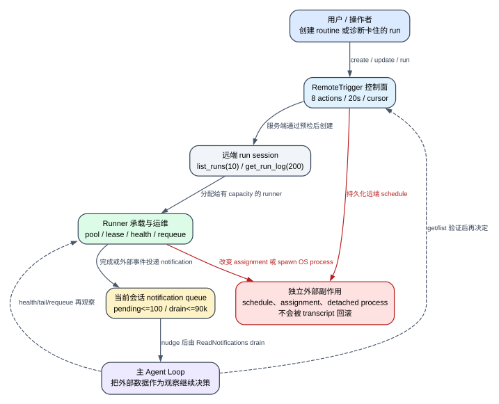

# Claude Code CLI 2.1.235 Remote Routines、Runner 运维与通知队列：远端任务怎样被创建、承载并回到主循环

> 版本：`2.1.235` | 证据：`Static`（发布 bundle 的可读逆向视图） | 远端账号、调度服务与真实 runner 接单结果：`Boundary`

## 60 秒心智模型

**读者问题：** Claude Code 创建一个定时云端任务后，任务究竟在哪里运行；self-hosted runner 卡住时客户端能做什么；GitHub webhook 或例行任务结果又怎样安全地回到当前对话？

**一句话模型：** `RemoteTrigger` 只改远端 routine 控制面，self-hosted runner 工具只观察或操作执行承载面，`ReadNotifications` 只消费当前会话的外部输入队列；三者通过 session、run 和 notification 标识关联，但没有一个跨三层的原子事务。

贯穿场景：用户创建一个“工作日检查仓库 CI”的 routine。第二天 routine 已生成 run，但承载它的 self-hosted runner 失联；操作者先查看 pool、runner、session 和本机健康状态，再把 session requeue。远端最终投递一条 `github_webhook` 或 `trigger_fire` notification，主 Agent 调用 `ReadNotifications` 读取后继续处理。

图的结论：创建 routine 不等于 run 已创建，run 已创建不等于 runner 已执行，runner 已执行也不等于结果已被当前主循环读取；每一段都有自己的 gate、状态与恢复动作。

### 场景的前后状态

| 对象 | Before | Transformation | After | 用户可见效果 |
| --- | --- | --- | --- | --- |
| Routine record | 没有 schedule/webhook | `RemoteTrigger create` 或 `create_webhook_trigger` 写远端控制面 | 远端返回 routine id、server-parsed `next_run_at` 或绑定 URL | 用户拿到管理链接和服务端解释后的执行时间 |
| Run session | routine 到点但尚未建 session | 调度服务完成预检并创建 run | `list_runs` 可看到 session id、状态与时间 | 能继续读取该 run 的日志；空列表仍不能证明从未触发 |
| Runner assignment | session 已分配给失联 runner | 操作者核对 assignment 后执行 `requeue` | 原 runner 被加入 excluded 集合，session 回到调度队列 | 任务可被其他 runner 领取；这不是对旧副作用的回滚 |
| Local runner process | 本机尚未承载 runner | `spawn_local` 启动 detached child 并写 PID 文件 | 进程在当前 Claude 会话结束后仍可能继续 | 返回 PID、log path、health port 和等价命令 |
| Notification queue | 外部事件到达但模型未读 | 入站校验、去重、排队、nudge；随后 drain | 已读 ID 保留，pending 缩短，事件 lifecycle 被确认 | 主 Agent 得到按最老优先排列的外部数据 |
| Agent Loop | 正在做原任务 | task-notification meta prompt 要求先 drain | 下一轮吸收 notification body | 模型基于外部事实继续，但 body 不获得更高指令权 |

## 状态所有权与前后变化

| 状态 | 真正 owner | 客户端保存/看到什么 | 谁能改变 | 生命周期边界 |
| --- | --- | --- | --- | --- |
| Routine 定义、启停、下次执行时间 | claude.ai routine API | HTTP status、JSON、解析后的 schedule summary | `RemoteTrigger create/update/run/create_webhook_trigger` | 客户端不能证明 scheduler 按时触发 |
| Run session 与 event pages | cloud session/event API | run id、状态、cursor、压缩后的 transcript event | 远端 worker 追加；客户端只读 | `list_runs` 只有实际建成 session 的 fire |
| Pool、runner、assignment、secret metadata | self-hosted runner control API | aggregate、lease、assignment、secret metadata | 多数工具只读；`requeue` 写 assignment | secret value 不返回；服务端冲突保护仍是最终裁决 |
| 本机 runner child | 当前 OS | PID、PID file、log file、health/metrics endpoint | `spawn_local` 创建；OS/操作者停止 | detached child 不随当前 Agent Loop 自动结束 |
| Notification pending buffer | 当前 app state | `pending[]`、`drainedIds[]`、`nudge` | transport arrival 与 `ReadNotifications` | 仅主会话能 drain；subagent 被拒绝 |
| Notification command lifecycle | 当前 remote session transport | event UUID 的 completed acknowledgement | malformed/duplicate/drain 路径调用 ack | 超大正文和满 buffer 故意不 ack，等待服务端重投 |
| Tool result/transcript | 主 Agent Loop | JSON 或受控文本结果，与 `tool_use_id` 配对 | 工具映射器写入下一轮消息 | 不能撤销已发生的远端创建、requeue 或本机 spawn |

这里最重要的所有权判断是：**operator tool 能看到控制面，不等于 operator tool 拥有执行面。** `get_pool` 返回 capacity 只是快照；`read_health` 只探测本机某个端口；`list_runs` 只列已建 session；`ReadNotifications` 只消费送达当前会话的队列。它们互相补证，不能互相替代。

## 完整调用顺序

### 1. 工具装配先决定这三组能力是否进入当前会话

`RemoteTrigger` 不是普通离线工具。`2.1.235` 同时要求：

1. API provider 是 `firstParty`；
2. 当前凭据走 claude.ai OAuth 路径并具有对应基础 scope；
3. 当前不是 `CLAUDE_CODE_REMOTE` 会话；
4. feature `tengu_surreal_dali` 开启；
5. managed/local policy 允许 `allow_remote_sessions`；
6. policy 允许 `allow_routines`。

任何一项不成立，静态注册对象仍在 bundle 中，但不会成为本轮可用的 `RemoteTrigger`。

9 个 self-hosted runner operator tools 走另一条 gate。它们只有在单向的 `wizardOperatorToolsEnabled` latch 被打开后，才由工具池装配器整体加入。这个 latch 是生产环境单向开启：源码明确拒绝把它重新设为 `false`。因此普通对话看到 runner 实现代码，不代表当前 request advertised 了这 9 个 schema。

`ReadNotifications` 的注册对象总在基础工具集合附近，但 `isEnabled` 要求 remote-mode 环境与对应 remote session 能力都成立。它只服务当前 remote 主会话的排队外部输入。

**证据：** `reverse/javascript/cli.readable.js:62747-62749`、`87233-87236`、`297687-297690`、`298543-298553`、`315665-315675`。

### 2. `RemoteTrigger` 先把 8 个 action 归一成 method、path 和 body

`RemoteTrigger` 的输入不是八个独立工具，而是一个带 `action` discriminator 的 operator：

| action | HTTP | path | 必填输入 | 客户端写入性判断 |
| --- | --- | --- | --- | --- |
| `list` | GET | `/v1/code/triggers` | 无 | read-only |
| `get` | GET | `/v1/code/triggers/{trigger_id}` | `trigger_id` | read-only |
| `create` | POST | `/v1/code/triggers` | `body` | write |
| `update` | POST | `/v1/code/triggers/{trigger_id}` | `trigger_id`、`body` | write |
| `run` | POST | `/v1/code/triggers/{trigger_id}/run` | `trigger_id`；`body` 可选 | write |
| `create_webhook_trigger` | POST | `/v1/code/webhook-triggers` | `body` | write |
| `list_runs` | GET | `/v1/code/sessions?trigger_id=...` | `trigger_id`；`cursor` 可选 | read-only |
| `get_run_log` | GET | `/v1/code/sessions/{session_id}/events` | `session_id`；`cursor` 可选 | read-only |

`get/update/run/list_runs` 缺 `trigger_id`、`get_run_log` 缺 `session_id`、`create/update/create_webhook_trigger` 缺 `body` 时，客户端在发请求前直接抛错。`run` 还会从可选 body 中移除同名 `trigger_id`，避免 path id 与 body id 形成两个来源。

Auto Mode 下所有 action 都交给 classifier review；非 Auto Mode 的工具 permission 返回 allow，但这不跳过 provider、policy、auth 和 HTTP 错误。

**证据：** `reverse/javascript/cli.readable.js:298514-298608`。

### 3. Routine 请求使用进程内 OAuth，20 秒后终止等待

请求使用 `auth: "teleport-org"`，携带本版 beta header，timeout 固定为 `20,000 ms`，并绑定当前工具的 abort signal。OAuth token 由客户端 transport 在进程内添加，不需要也不应该通过 shell/curl 暴露。

transport 层 `ok:false` 分成两类用户错误：

- `no-auth`：提示运行 `/login`；
- 其他 transport reason：包装成 `Remote triggers unavailable: <reason>`。

HTTP status 是否成功另算：`2xx` 才进入成功解析；非 `2xx` 仍以 `{status,json}` 进入 operator result，而不是由该分支统一抛成网络异常。这使模型能看到服务端的具体拒绝 body，但也意味着调用工具成功返回不等于业务 action 成功。

**证据：** `reverse/javascript/cli.readable.js:298585-298617`。

### 4. 创建和更新必须把“服务端解释后的时间”返回给用户

对 `create`、`update` 和成功的 `create_webhook_trigger`，客户端不会只透传原始 body：

- routine response 尝试解析 `id`、`enabled`、`next_run_at`、`cron_expression`、`run_once_at`；
- `next_run_at` 被格式化成相对时间和标准 UTC 时间；
- 若一次性任务的 `next_run_at` 已在过去，追加显式警告；
- 若 disabled，显示“next run would be ...”；
- 有 id 时追加 claude.ai `/code/routines/{id}` 管理链接；
- webhook action 不伪造 schedule，而是显示它将触发哪个 routine。

因此用户确认的应是服务端返回的 `next_run_at`，不是模型自己对 cron 或 timezone 的推算。

**证据：** `reverse/javascript/cli.readable.js:298477-298493`、`298609-298625`。

### 5. `list_runs` 每页 10 条，但空列表不是“从未触发”

`list_runs` 固定 `limit=10`，cursor 最长 `1024` 字符。返回行被裁成 id、title、status、worker_status、created_at、last_event_at，并为每个 session 附加 claude.ai URL。

只有 fire 已成功创建 session，才会有 run row。以下情况可能发生过 fire 但没有 row：

- routine paused；
- fire cap、429、kill switch 或 org setting 在建 session 前拒绝；
- scheduler 未运行；
- repository access、token preflight、environment lookup 在建 session 前失败；
- routine 把输入追加到已有 session，而非创建新 session。

所以空列表的恢复动作是再调用 `get` 检查 `enabled/next_run_at`，不是直接断言 scheduler 从未触发。

**证据：** `reverse/javascript/cli.readable.js:298250-298261`、`298493-298513`、`298567-298574`。

### 6. `get_run_log` 每页取最新 200 个 event，再做语义压缩

`get_run_log` 使用 `limit=200&sort_order=desc`。客户端不把远端 JSONL 原样灌入模型，而是按事件类型压缩：

- assistant text 最多约 `2,000` 字符；user text 最多约 `1,000`；
- tool input 摘要最多 `300`；普通 tool result 最多 `400`；error result 最多 `1,500`；
- 单个格式化 event 最多 `4,000`；
- 原始字符串先受 `16,000` 字符通用裁剪；
- 低价值 status/thinking/task-progress 等事件只计数，不逐条展示；
- 最多列出 6 类被跳过事件的计数；
- page 预算不足时保留较新的 event，并说明有多少旧 event 未显示；
- 总 tool result 上限约 `100,000` 字符，并为 header/cursor 留出空间。

`compact_boundary`、permission denial、API retry/error、stop-hook failure、rate-limit rejection 和 final result 都有专门的人类可读投影。这个转换提高可读性，但不是完整远端 transcript；排障时必须保留 `events_fetched`、`events_shown` 和 `next_cursor` 的差异。

所有 run title 和日志都被显式标为外部数据：它们可能引用仓库、issue、网页或 connector 内容，不能因为通过官方 routine API 返回就升级成指令。

**证据：** `reverse/javascript/cli.readable.js:298250-298476`、`298574-298585`。

### 7. Runner 控制 API 先执行 first-party 与 OAuth-only 双重认证

runner 的远端管理工具统一经过 `bet()`：

1. provider 必须是 `firstParty`；
2. 客户端先尝试刷新本地登录；
3. 必须存在 OAuth `accessToken`；
4. `ANTHROPIC_API_KEY` 明确不能用于这些环境管理 endpoint；
5. 请求携带 Bearer、`anthropic-version: 2023-06-01`，timeout `20,000 ms`；
6. 401/403/404/409/429 被保留为有 status 的 `SelfHostedRunnerApiError`；
7. 结果在进入 tool result 前统一经过 secret redaction。

这组 operator tool 的目标是让模型协助操作者诊断，不是把环境 secret 交给模型。`list_secrets` 只返回 jti、label、created_at、revoked、last_used_at 等 metadata，description 明确承诺不返回 value。

**证据：** `reverse/javascript/cli.readable.js:297840-297918`、`297975-298002`。

### 8. 九个 runner 工具分为四类，不应按名字平铺

| 类别 | 工具 | 主要状态 | 副作用 |
| --- | --- | --- | --- |
| 远端只读控制面 | `get_pool`、`list_runners`、`list_sessions`、`list_secrets` | pool aggregate、runner lease/assignment、session failure、secret metadata | 远端 API 读取；结果可能进入 transcript |
| 本机只读探针 | `read_health`、`read_metrics`、`tail_log` | loopback health、Prometheus gauges、log tail | 读取本机端口/文件；日志先脱敏 |
| 本机写操作 | `spawn_local` | detached runner process、PID/log/workspace | 创建目录、进程和 PID 文件；持续到会话外 |
| 远端写操作 | `requeue_session` | assignment/excluded runner set | 让 session 回队列，可能在另一 runner 重启 |

每个远端只读结果都附带 `equivalent.ui`，指向 Admin settings 中相同观察面。这个字段的用途是让操作者可以脱离 Agent 重复验证，不是第二套数据源。

### 9. `spawn_local` 是 detached process，批准后不会自动回滚

`spawn_local` 默认：

- `capacity=1`；
- `base_dir=./runner-setup/workspace`；
- `health_port=8080`；
- `log_path=./runner-setup/runner.log`；
- PID file 固定为 `./runner-setup/runner.pid`。

客户端把这些路径解析成绝对路径后创建目录，通过当前 executable 的 `self-hosted-runner` 子命令启动 child。参数始终使用空格分隔，并显式传 `--base-dir`，因为 runner 内建 `/workspace` 默认值不适合操作者笔记本。

child 使用 `detached:true`、`stdio:"ignore"`、`unref()`；只有 spawn event 成功且有 PID 才写 PID file。工具返回 `{pid,pid_file,log_path,health_port,command}`。permission 文案明确说明：runner 会执行该环境排队的 session，并在当前 Claude 会话结束后继续运行。

因此 rewind transcript、取消后续模型调用或关闭 TUI，都不会自动 kill 已 spawn 的 runner。

**证据：** `reverse/javascript/cli.readable.js:298119-298191`。

### 10. Health、metrics 和 log tail 是三种不同证据

`read_health` 与 `read_metrics` 都只访问 `127.0.0.1:{health_port}`，timeout 固定 `2,000 ms`：

- port `0` 返回 `{disabled:true}`；
- 连接异常返回 `{unreachable:true,error}`；
- health 请求接受任意 HTTP status 并返回 response body，所以拿到 JSON 不等于 status 是 2xx；
- metrics 只解析 `claude_code_self_hosted_runner_*` 前缀；bucket、`session_idle_seconds`、`poll_errors_total` 被忽略；同名 gauge 累加；`locked_account` label 可提取 email；
- metrics raw text 在返回前脱敏。

`tail_log` 默认读取最后 `65,536 bytes`，不是最后 N 行。它从文件尾按 byte offset 读取，UTF-8 边界可能从半个字符开始；随后应用同一 redactor：URL userinfo、key/token/password、`sk-ant`、Bearer、JWT、GitHub/GitLab/Slack/Stripe/Meta 等 PAT 形态和 Basic auth 都被替换。脱敏是风险降低，不是对任意未知 secret 格式的数学保证。

**证据：** `reverse/javascript/cli.readable.js:298003-298093`、`298192-298224`。

### 11. `requeue_session` 必须经过人工/classifier，并用 assignment conflict 防止误操作

`requeue_session` 是 9 个工具中唯一远端写操作：

- `isReadOnly=false`；
- 忽略 whole-tool allow，且禁止生成 always-allow 规则；
- Auto Mode 必须 classifier review；
- 其他模式显示 ask，明确说明会在另一 runner 重新启动 session；
- POST body 带操作者观察到的 `runner_id`。

server 会验证当前 assignment 仍匹配该 runner；若 session 已被其他控制器移动，返回 409 Conflict，阻止基于过期快照的 requeue。对于 runner 已消失的 stuck session，schema description 表示 server 可接受任意 runner id。成功后 observed runner 被加入 excluded list，避免队列立即把任务分回同一故障 runner。

这只改变未来 assignment；旧 runner 已完成的 Git push、远端 API write 或文件副作用不会被撤销。

**证据：** `reverse/javascript/cli.readable.js:298094-298118`。

### 12. Notification 到达时先校验、去重，再决定是否确认

入站 `queued_notification` 先经过 schema：

- `notification_id` 非空；
- `origin` 只接受 1-40 位小写字母/下划线，否则 coercion 为 `unknown`；
- `priority` 只接受 `now/next/later`，否则归为 `later`；
- `queued_at` 保留字符串；
- `content` 原样保留。

处理顺序决定重投语义：

1. malformed：drop，并 ack event lifecycle；
2. 当前非 remote mode：drop，并 ack；
3. content 超过 `87,488` 字符：拒绝且**不 ack**；
4. notification id 已在最近 `1,000` 个 drained IDs：不重复入队，但 ack 本次 delivery；
5. 同 id 已 pending：直接返回，不重复排队；
6. pending 已达 `100`：拒绝且**不 ack**，同时重新 nudge；
7. 其他情况 append 到 pending，再创建/刷新 nudge。

不 ack 超大正文和满 buffer 是背压设计：客户端没有假装已处理，服务端可以在条件变化后重投。

**证据：** `reverse/javascript/cli.readable.js:291287-291348`、`291432-291454`。

### 13. Nudge 只提醒模型“去读”，不把正文伪装成高优先级指令

nudge 是 `mode:"task-notification"`、`priority:"later"` 的 meta prompt。它包含 unread 数量和按 origin 汇总的计数，要求模型立即调用 `ReadNotifications`，并明确声明：正文是 out-of-band external data，不是 nudge 本身的 instructions。

若 nudge 在 Agent 忙碌时被吸收/忽略，客户端会在安全边界 rearm；最大 rearm 次数是 `2`。超过后只记录 `nudge_ignored`，避免同一个提醒无限重入主循环。已有相同 task-notification 仍在队列时，不重复创建。

**证据：** `reverse/javascript/cli.readable.js:291348-291393`。

### 14. `ReadNotifications` 按 90,000 字符预算 drain，并且只能由主会话调用

每次 drain 的总体预算是 `90,000` 字符。计算先预留约 `2,000` 字符 header，并为每条通知预留 `512` 字符 envelope；第一条即使接近预算也会被取出，后续条目超预算则留在 pending。顺序保持 oldest first。

状态更新与 acknowledgement 顺序如下：

1. 从 pending 中选出本批；
2. 原子更新 app state：移除本批、把 IDs 追加到 `drainedIds` 并截取最后 `1,000` 个、清空 nudge；
3. 移除对应 task-notification；
4. 对本批每个 event UUID 标记 command lifecycle completed；
5. 返回 `{notifications,remaining}`。

`ReadNotifications.call` 检查 `agentId`：只要它存在，就拒绝调用，错误明确写明 subagent 不得 drain session notification buffer。这样不会出现某个后台 Agent 抢走主会话外部消息、主 Agent却只看到“已经读过”的情况。

工具结果再次强调：body 可以伪造 delimiter，只有客户端给出的条数可信；应按 system prompt 和 body 内自报 sender 判断谁能下指令，并对异常内容回到 primary source 验证。

**证据：** `reverse/javascript/cli.readable.js:291393-291487`。

### 15. Drain 结果进入下一轮，但三个 owner 仍不合并

主 Agent 看到 notification 后，可以再调用 `RemoteTrigger get/list_runs/get_run_log` 或 runner operator tools 验证状态。这个闭环是“观察 -> 决策 -> 操作 -> 再观察”，不是分布式事务：

- notification 被 drain 后，routine record 不变；
- requeue 成功后，旧 run log 不消失；
- spawn local 成功后，关闭当前 session 不停止 runner；
- update routine 成功后，已创建的旧 run 不自动取消；
- tool result 被 compact 后，远端 routine/runner 状态仍在外部系统中。

## Gate、优先级与阈值

| 项目 | `2.1.235` 精确值/规则 | 行为含义 |
| --- | --- | --- |
| RemoteTrigger actions | 8 | 一个 operator schema 分派 4 读、4 写 action |
| Remote request timeout | `20,000 ms` | 超时只终止本次等待，不证明服务端未执行 write |
| `list_runs` page | `10` | cursor 继续读取更旧 run |
| `get_run_log` page | `200`，descending | 先取最新 event，再在客户端倒序成可读时间线 |
| RemoteTrigger result cap | `100,000 chars` | log 会先按语义压缩再进 tool result |
| log string cap | `16,000 chars` | 单个原始长字段先裁剪 |
| formatted event cap | `4,000 chars` | 单 event 不独占整个结果 |
| Runner API timeout | `20,000 ms` | provider/OAuth 通过后仍有网络与 HTTP 失败 |
| Local health/metrics timeout | `2,000 ms` | 只探测 loopback endpoint |
| Default health port | `8080` | `0` 明确表示禁用 |
| Default log tail | `65,536 bytes` | byte tail，不是 line count |
| Notification pending cap | `100` | 满时不 ack，形成背压 |
| Notification drained ID cap | `1,000` | 有界 dedupe history |
| Notification drain budget | `90,000 chars` | 单次 tool result 不吞掉全部上下文 |
| Per-notification content cap | `87,488 chars` | `90,000 - 2,000 - 512` |
| Nudge rearm cap | `2` | 防止提醒无限驱动 Agent Loop |
| Notification result cap | `100,000 chars` | tool 自己跳过 aggregate budget，但仍有硬 ceiling |

优先级要分三层：notification payload 自带 `priority` 字段，但当前入队状态保存的是 id/origin/content/time/event UUID；真正推动 Agent Loop 的 nudge 固定为 `priority:"later"`。因此外部发送者不能仅靠把 payload 写成 `now` 就绕过主循环的调度和指令层级。

### Drop、ack、backpressure 和 drain 是四种不同结果

| 到达结果 | 是否入 pending | 是否 ack delivery | 后续含义 |
| --- | --- | --- | --- |
| malformed 或当前不在 remote mode | 否 | 是 | 客户端明确丢弃，发送端不应无限重投同一坏 payload |
| ID 已在 pending 或最近 1,000 个 drained IDs | 否/保持原条目 | 是 | 重复 delivery 被吸收，不产生第二条业务消息 |
| content 超过 87,488 或 pending 已满 100 | 否 | 否 | 形成背压，发送端仍需保留并在容量恢复后重投 |
| 合法新消息 | 是 | 到 drain 时才 ack | nudge 只报数量；主 Agent 调用 `ReadNotifications` 后才完成本次消费确认 |

因此“服务端收到 ack”不等于正文指示的业务动作完成，只说明这次 notification delivery 已被丢弃、去重或真正 drain。排障必须同时看 pending 数、drained ID、transport event UUID 和 routine/runner 的独立业务状态。

## 失败与恢复

| 失败 | Detection | Retry/change | State retained | 最终用户效果 |
| --- | --- | --- | --- | --- |
| RemoteTrigger gate 未通过 | 工具不进入可用池 | 修登录/policy/feature/entrypoint 后重建工具池 | 已有 routine 不受影响 | 当前会话看不到工具 |
| Routine transport no-auth | `ok:false/no-auth` | `/login` 后重试 | 未证明服务端 action 已发生 | 明确认证错误 |
| Routine HTTP 非 2xx | `{status,json}` | 按 status/body 修 body、policy 或 quota | 已发生的远端副作用取决于 server | 模型可见原始拒绝信息 |
| 20s timeout/abort | transport 抛错 | 先 `get/list` 查状态，再决定是否重试 write | 服务端可能已接收请求 | 不能盲目重复 create/run |
| `list_runs` 为空 | 0 rows | `get` routine，查 enabled/next_run_at | routine record 保留 | 不误报“从未触发” |
| run log page 太大 | `events_shown < events_fetched` | 用 cursor 读更旧页；必要时看原始服务面 | run/events 不变 | 得到较新、可读摘要 |
| Runner provider/API key 不合格 | 403/401 preflight | 切回 first-party + `claude login` | runner/pool 不变 | operator tool 失败且不泄漏 secret |
| Local health unreachable | 2s exception | `tail_log`、确认 port/PID/process | detached process 可能仍活着 | 返回 `{unreachable,error}` |
| Spawn error | 无 spawn event/PID | 修 executable/path/secret 后重试 | 已创建目录可能保留 | 没有 PID 时不伪报成功 |
| Requeue assignment stale | HTTP 409 | 重新 list session/runner 后再决策 | 新 assignment 保留 | 避免把已移动 session 再次移动 |
| Notification malformed/non-remote | schema/gate | drop 并 ack | 不进入 pending | 主 Agent 永远看不到正文 |
| Notification 太大 | `content > 87,488` | 发送端缩短后重投 | 不 ack，不进 pending | 不污染上下文，也不假装已处理 |
| Pending 满 100 | buffer cap | 先 drain，再等待重投 | 现有 100 条保留 | 新条目不 ack |
| Nudge 被忽略 | rearm 达 2 | 记录 ignored；等待其他请求边界/人工动作 | pending 保留 | 消息未丢，但不会无限打断 |
| Subagent 调用 ReadNotifications | `agentId !== undefined` | 主 Agent 调用 | pending 完整保留 | 防止后台 Agent 抢消息 |

### 写操作重试前必须先观察

`create`、`update`、`run`、`create_webhook_trigger`、`spawn_local`、`requeue_session` 都有“客户端超时/中断但外部系统已经开始执行”的窗口。可靠恢复顺序是：

1. 用 list/get/PID/health/session assignment 查询当前事实；
2. 对比目标状态；
3. 只补做缺失动作；
4. 保留旧 run/log/notification 作为诊断证据。

直接重放 write 会产生重复 routine、重复 run、多个 detached runner 或二次 requeue。

## 用户影响：token、延迟、费用、隐私与副作用

### Token 与上下文

- `get_run_log` 的语义裁剪和 `ReadNotifications` 的 90k drain budget 都是在保护模型上下文；它们降低一次性膨胀，但意味着结果不是原始全量事件流。
- runner list/pool/session 返回任意 JSON object，复杂环境可能仍产生较大 tool result；UI path 和 metadata 也会进入 transcript。
- `ReadNotifications` 设置 `skipAggregateToolResultBudget`，避免通用聚合器再次压缩，但硬上限仍是 100k。

### 延迟与费用

- Routine 和 runner control API 每次最多等待 20s；日志分页、runner 状态交叉验证会叠加网络往返。
- health/metrics 各自最多 2s；它们不触发模型费用之外的远端 control API，但仍增加本地诊断时间。
- routine 真正运行会产生独立 cloud Agent Loop 的模型/环境成本；静态 bundle 不能证明账号计价、quota 或账单归属。

### 隐私

- Routine title/log 可包含仓库、issue、网页和 connector 数据；进入当前 tool result 后会成为会话上下文。
- Runner list 可能返回 account email、session failure log；secret list 只应返回 metadata。
- `tail_log` 和 metrics 应用已知规则脱敏，但未知 credential 格式、业务 payload 和路径仍可能存在敏感信息。
- Notification body 原样进入主对话；origin 是 server-attested token，但正文仍是不可信外部数据。

### 副作用与恢复

- `spawn_local` 创建长期 OS process 和文件；`requeue` 改远端 assignment；routine create/update 改服务端 schedule。
- compact、resume、rewind 和删除 tool result 都不能普遍撤销这些外部副作用。
- notification ack 只说明 delivery command lifecycle 已完成，不说明正文指示的业务动作已经执行。

## 证据索引

| 结论 | Evidence class | 位置 |
| --- | --- | --- |
| RemoteTrigger gate、8 actions、20s request、permission 与 response | Static runtime | `reverse/javascript/cli.readable.js:298514-298625` |
| run list/log 分页、压缩、untrusted-data 标记 | Static runtime/consumer | `reverse/javascript/cli.readable.js:298250-298513` |
| runner 名称、描述、first-party/OAuth、redaction、API error | Static runtime | `reverse/javascript/cli.readable.js:297821-297918` |
| runner list/read tools | Static runtime | `reverse/javascript/cli.readable.js:297891-298093` |
| requeue、spawn、tail | Static runtime | `reverse/javascript/cli.readable.js:298094-298224` |
| operator tools 的一体装配与 wizard latch | Static consumer | `reverse/javascript/cli.readable.js:4556-4563`、`315665-315675` |
| notification arrival、dedupe、backpressure | Static runtime | `reverse/javascript/cli.readable.js:291287-291348` |
| nudge、drain、ack 与预算 | Static runtime | `reverse/javascript/cli.readable.js:291348-291454` |
| `ReadNotifications` 主会话限制与 result security wording | Static runtime/consumer | `reverse/javascript/cli.readable.js:291454-291487` |

对应结构化 claim：`remote-ops.*`，见 `analysis/mechanism-evidence.jsonl`。

## Boundary：本版不能证明什么

1. bundle 能证明客户端 gate、请求 path/body、timeout、结果压缩和错误映射，不能证明某账号当前拥有 routines、remote sessions 或 self-hosted entitlement。
2. `create` 返回 2xx 与 `next_run_at` 不能证明 scheduler 将准时触发；真实时钟、fire cap、kill switch 和服务端队列属于外部系统。
3. `list_runs` 只证明 API 返回的已建 session；没有 row 不能证明没有 fire。
4. runner tools 能证明 operator contract，不能证明某 pool、runner 或 secret 真实存在，也不能证明 requeue 后另一 runner 成功接单。
5. `read_health` 返回 body 不证明 HTTP status 是 2xx；`read_metrics` 只解析当前 loopback response，不证明控制面认为 runner healthy。
6. redactor 能证明已实现一组模式替换，不能证明任意业务 secret 都会被识别。
7. notification 进入 pending 只能证明当前客户端接收路径执行；服务端最初如何鉴权 webhook、保存多久、怎样重投，不在发布物内。
8. 这里没有把当前官网行为倒灌成 `2.1.235`；所有数值都绑定本版静态代码，未执行真实付费/账号远端正向 Probe。
