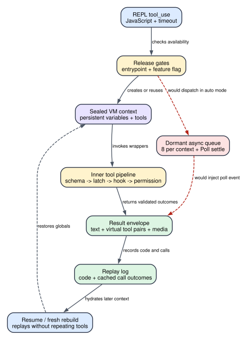

# Claude Code CLI 2.1.235 REPL：一段 JavaScript 怎样编排完整工具管线

**读者问题：** Claude Code 为什么要在一个工具里再运行 JavaScript、调用其他工具？变量为什么能跨多次调用保留？resume 时它会不会把写文件、执行命令等副作用再做一遍？

**一句话模型：** `REPL` 是一个持久但受控的 JavaScript VM，它把多个内层工具调用编排成一次外层 `tool_use`；客户端仍让每个内层工具经过自己的 schema、隔离、Hook 和权限管线，并用“代码 + 已完成调用结果”的重放日志恢复变量，而不是重做外部副作用。

> 版本：`2.1.235` | 证据：发布包可读 JavaScript 的 `Static` 路径；本章没有把 feature flag 开启状态或服务端行为伪装成账号级 `Probe`。



贯穿场景：模型需要在一个大型仓库里找出三处旧 API、读取相关文件、修改其中两处，再注册一个只在后续轮次使用的 `verify_patch` 工具。它提交一段 JavaScript：先 `rgf()` 找文件，再 `cat()` 读取，随后 `put()` 写回，最后 `registerTool()`。外层只产生一个 `REPL` 调用；内部却形成多组真实工具进度、虚拟 `tool_use/tool_result`、文件副作用、一个新工具定义以及可供 resume 重放的日志。

## 60 秒理解：外层是编排器，内层仍是完整工具调用

| Object | Before | Transformation | After | User-visible effect |
| --- | --- | --- | --- | --- |
| JavaScript 代码 | 只是 `REPL` 的字符串参数 | Bun transpile 后在 sealed VM 执行 | 得到最后表达式、stdout、stderr 或 error | UI 看到一次 REPL 结果，而不是十几个顶层工具卡片 |
| 内层工具调用 | 只有函数名和 input | schema、isolation latch、PreToolUse、permission、真实执行、PostToolUse | 每个调用得到 complete/error 状态 | 权限拒绝仍会阻止真实副作用，REPL 不是绕过器 |
| VM 全局状态 | 新 context 或上一次 context | 重置受管 global，保留普通变量和动态注册工具 | 下一次 REPL 可继续使用变量 | 多步调查不必重复读取和计算 |
| transcript 表示 | 一个外层 `REPL tool_use` | 追加内层虚拟 tool pairs 和外层结果 | Agent Loop 可看到内层发生过什么 | Hook、消息合法性和恢复逻辑仍能按 tool ID 工作 |
| resume 状态 | 进程内 VM 已消失 | 重跑旧代码，但把工具 wrapper 替换为缓存结果 | 变量和注册工具尽量恢复 | 已完成的 Bash/Edit/Write/MCP 不会因 hydration 再执行 |
| 外部副作用 | 文件、进程或远端系统已改变 | 只记录结果，不建立事务 | 副作用继续存在 | 后续报错、abort、compact 或 replay drift 都不会自动回滚 |

最关键的结论有三个：

1. `REPL.checkPermissions()` 返回 allow，只批准“进入编排器”；它不代表内层工具被无条件放行。
2. 持久化的是 VM 逻辑状态和动态工具，不是一个永久运行的 Node 进程。timer 在每次调用结束时会被清理，managed globals 每次会被宿主重新安装。
3. 恢复采用结果重放。旧代码会再次求值以恢复变量，但对应工具函数只返回当时缓存的结果，不再次执行真实工具。

## 状态所有权：谁能改变什么

| 状态/对象 | 谁拥有 | 生命周期 | 写入点 | 失效或重建条件 |
| --- | --- | --- | --- | --- |
| REPL enablement | 启动环境与动态配置 | 进程/请求装配期 | `CLAUDE_CODE_REPL`、entrypoint、`tengu_slate_harbor` | 显式 false、非允许 entrypoint、flag 未开 |
| context map | `Gbe` tool state | session 中按 context key 保存 | 首次调用或 fresh rebuild | session boundary UUID 改变、poison、fork fresh、显式 release |
| VM globals | `vm.Context` + host sealer | 多次 REPL 调用之间 | 首建、每次 refresh、用户代码赋值 | managed global 被钉成 non-configurable 时整块重建 |
| current cwd/repository | `helperState` | 单次调用重置 cwd，repo hint 可继承 | `chdir()`、context refresh | 下一次调用 cwd 回到 CLI cwd；repo hint保留 |
| dynamic registered tools | context 内 `registeredTools` map | 跨 REPL 调用 | `registerTool/unregisterTool` | context rebuild 或 hydration 失败后丢失 |
| inner-call progress | 单次调用的 Map | 一个 REPL 执行期 | start/executing/complete/error 事件 | 外层结果组装后释放 |
| replay log | context + transcript 可恢复表示 | session/resume | 每次代码结束记录 `code/calls/threw` | async-dispatched block 跳过；fresh fallback 不继承 |
| external side effects | 文件系统、shell、MCP/远端 owner | 超出 VM 生命周期 | 真实内层工具执行 | 只能由业务补偿或显式回滚撤销 |

## Gate、默认值与本版实际可达分支

### REPL 是否出现在工具列表

`JB()` 的判断顺序是：

1. 基础 runtime gate `Rye()` 必须为真；`2.1.235` 中该 helper 固定返回 true。
2. `CLAUDE_CODE_REPL=false` 立即关闭。
3. `CLAUDE_CODE_REPL=true` 立即开启，不再检查默认 entrypoint 分支。
4. 没有显式覆盖时，只有 `CLAUDE_CODE_ENTRYPOINT` 为 `cli` 或 `remote` 才读取动态配置 `tengu_slate_harbor`，默认值为 false。
5. 其他 entrypoint 默认关闭。

因此“bundle 里有 REPL”不等于某个账号或入口一定看到它。源码能证明客户端 gate 和优先级，不能恢复运行时远端 flag 值。

### 同步执行与异步队列不能混写

代码中确实发货了一套 async dispatcher：每个 context 最多 8 个 queued/running eval，按 context 串行执行，完成后把 `<event kind="repl-eval">` 送入 Poll/事件通道；settle 还会经过 Hook，阻断时只回注 withheld 说明。

但决定是否进入它的 `S_a()` 在 `2.1.235` 固定返回 false。`yQS()` 与后续 `S_a()` 分支因此都不可达，当前可达路径直接调用 `_9a()`。所以正确表述是：

- **已发货实现：** 有 8 深度上限、串行队列、异步 settle 和 Poll 回注代码。
- **本版运行事实：** gate 恒 false，不能把它写成普通 REPL 调用正在使用的执行模式。
- **比较价值：** 后续版本只要改变该 gate，就可能激活已存在的大块行为，跨版本 diff 应单独盯住这一常量和调用条件。

## 完整执行顺序：从一个 `tool_use` 到多个真实工具结果

### 1. 外层输入先固定执行预算

`REPL` 输入包含 `code`、可选 `description` 和可选 `timeout`。省略 timeout 时脚本时间是 `30,000 ms`，更大的值会被截到 `600,000 ms`，同一数值也是硬 wall clock。input schema在这里把它声明为number，但运行分支没有另做positive fallback；因此不能把0或负数描述成“自动恢复默认值”。

“脚本时间”与 wall clock 不同：只要有内层工具处于 start/executing，脚本计时器就暂停；工具结束后继续扣剩余脚本预算。另有 600 秒硬 wall clock 防止一个挂死的内层调用永久占住 REPL。

### 2. 宿主选择复用、恢复还是新建 context

主 context key 是 `main`，子 Agent 使用自己的 `agentId`。context 还绑定第一条消息的 boundary UUID：边界相同就复用原 VM；边界改变则清理 timer/console 并新建。

新建时根据 `replHydration` 选择：

- `fresh`：空 VM；
- `resume`：从 transcript 提取历史 REPL block 与虚拟工具结果；
- `fork`：可带显式 replay log，但如果 fork 同时拿到现存 parent context，代码会改为 fresh，避免直接复制活的 VM 对象。

hydration 若遇到 non-configurable managed global，会保留 repo hint、丢弃中毒 context，并以 fresh VM 继续。普通 replay error 或 branch drift只记录 warn；它不会冒充“全部状态已精确恢复”。

### 3. sealed VM 安装受控全局

VM 使用空原型 context，允许字符串代码生成但禁用 WebAssembly。源码扫描拒绝静态 import、dynamic import 和 require 形态；dynamic import callback也会直接抛错。`process`、Node module loader和普通文件系统 API没有被注入。

宿主只安装受控能力：

- 完整工具名 wrapper，如 `Read`、`Edit`、MCP 工具；
- 便捷函数 `sh/cat/rg/rgf/gl/put/chdir`；
- `haiku(prompt, schema?)` 的单轮模型采样；
- `registerTool/unregisterTool/listTools/getTool`；
- console、timer、`atob/btoa`、`shQuote`、`str`、预声明对象 `o` 和 repo hint。

输出对象跨 VM 边界时会被克隆/字符串化，Proxy、函数、带危险自定义 coercion 的值不会被直接信任。console 总预算为 `52,428,800` bytes，达到后追加截断提示。

### 4. JavaScript 被 transpile 并在 VM 中求值

客户端使用 Bun `Transpiler({loader:"js", replMode:true})` 处理 top-level await，再由 `vm.Script` 执行。每次调用重新创建 `o={}`、把 cwd 复位为 CLI cwd，并刷新工具 wrapper；用户创建的普通变量和注册工具仍留在同一个 context。

最后表达式若未定义，则读取 `o`。返回值会深度 resolve，使 `o.x=sh(...)` 这类 thenable 在“返回时”自动等待；但把未 await 的 Promise用于字符串拼接会触发专门错误，避免隐式得到 `[object Promise]`。

### 5. 每个内层工具重新走工具管线

内层 wrapper 不是直接调用 tool handler。顺序包括：

1. 为调用建立独立 `toolUseID`，发出 start progress；
2. 用工具自己的 Zod schema 解析 input；失败立即形成 error；
3. 检查 web/connector isolation latch；冲突时在执行前拒绝；
4. 运行 `PreToolUse` Hook，接收 hook permission result 和可能被改写的 input；
5. 执行工具自身 permission 判断/用户批准路径；
6. 发出 executing 与 native timeout；
7. 调用真实工具；
8. 运行标准输出验证、PostToolUse/失败 Hook 和状态更新；
9. 发出 complete/error，保存结构化 result 供外层与 replay 使用。

这就是为什么 `REPL.isTransparentWrapper()` 为 true、`REPL.checkPermissions()` 为 allow仍不能绕过权限。外层 allow只避免为“运行 JavaScript 容器”重复询问；`Edit`、Bash、MCP 或动态注册工具各自仍决定 ask/allow/deny。动态工具甚至固定返回 ask，提示为 `Execute registered tool "<name>"`。

### 6. watchdog 同时保护脚本和内层工具

已知 native timeout 的内层工具会装一个额外 watchdog：约为 `ceil(nativeTimeout * 1.5) + 5,000 ms`。如果该值已经大于等于 600 秒硬上限，则不再另装更短 watchdog。触发时 abort 派生 controller，并报告哪个工具、watchdog 与 native timeout。

常见默认 native timeout包括：shell 从 `BASH_DEFAULT_TIMEOUT_MS` 或 120 秒取得；`TaskOutput` 为 30 秒；Read、Write、Edit、Glob、Grep等一组工具为 10 秒。这里的数值服务watchdog计算，不等于所有真实工具都共享同一执行上限。

### 7. 外层结果同时生成三种表示

一次成功执行返回：

- `code/result/stdout/stderr`；
- 本次新增的动态工具名；
- 最多 8 张 image 与 4 个 PDF；
- 内层已完成调用生成的虚拟 assistant `tool_use` 和 user `tool_result`；
- 对应的新 top-level tool definition，使后续模型轮次能调用 `eval_registered__<name>`。

纯文本结果默认上限约 100,000 字符，`CLAUDE_REPL_VARIANT=trimNk` 可改变。带 image/PDF 时，文本也先按该 cap截断，再拼接 media content blocks。未 await、仍停在 start/executing 的内层调用不会偷偷在调用结束后继续交付结果：它们被列入 stderr 警告，结果丢弃，并在 finally 中 abort派生 controller、清理 timer/watchdog。

### 8. 记录 replay log，而不是记录一份 VM 快照

成功或失败都会追加：

```text
{ code, calls: [ok/error outcomes], threw }
```

这里不序列化 V8/Bun VM heap。resume 时客户端重新求值旧代码，但临时把所有工具 wrapper 换成“按原顺序返回缓存结果”的函数。这样变量赋值、数组构造和 `registerTool()` 会重建，而 Bash、Write、Edit、MCP不会再次触发。

### 9. replay 对非确定性分支只诊断，不造假

每个 replay block检查：调用数量是否一致、工具名顺序是否一致、原来是否抛错、现在是否在同一位置抛错。`Date.now()`、`Math.random()` 或依赖外部条件的 branch若改变，可能出现 consumed 少于/多于 cached call、调用了不同工具或原失败变成功。

结果分为 `ok`、`drift`、`threw`，并写日志摘要。只有 managed global poison会触发整块 fresh rebuild；一般 drift不会把缓存结果硬塞到错误的业务含义里，也不会重做真实副作用。这意味着“恢复尽力保持工作状态”，不等于确定性 checkpoint。

## 动态注册工具的真实边界

`registerTool(name, desc, schema, handler, {displayName?})` 对 name 强制 `^[a-zA-Z0-9_-]{1,111}$`，schema 必须是可 JSON 序列化 object，且不得与 built-in global 冲突。注册后：

- wire name 变为 `eval_registered__${name}`；
- input JSON Schema 保留注册时 schema；
- handler 在原 VM realm 中运行；
- 每次模型调用仍进入普通 tool pipeline并 ask；
- 返回值会跨 realm stringify/parse，不能序列化时退回字符串；
- handler抛出非 Error VM value时，宿主转换成可读错误；
- 工具是 `isReadOnly:false`、`isConcurrencySafe:false`，不会与其他不安全工具并行。

注册工具不等于把任意 JavaScript函数永久写入磁盘。它属于 REPL context；resume 依靠 replay旧 `registerTool()` 调用恢复，context fresh且无法 replay时就不存在。

## 失败与恢复

| Failure | Detection | Retry/change | State retained | Final user effect |
| --- | --- | --- | --- | --- |
| REPL gate关闭 | tool assembly 的 `isEnabled()` | 使用普通顶层工具 | session其他状态 | 模型看不到 REPL schema |
| import/require | transpiler import scan或dynamic callback | 改用工具 global | 现有 VM变量 | 外层返回明确 sealed-VM error |
| input schema错误 | 内层 `safeParse` | 修正参数后再调 | 前面已完成的内层结果/副作用 | 当前内层 call error，不自动撤销前序写入 |
| isolation latch冲突 | 执行前分类 web/connectors | 新 session或停止冲突访问 | latch状态与先前结果 | 被拒绝工具不执行 |
| Hook/permission拒绝 | 标准工具管线 | 模型改方案或请求批准 | transcript、已完成调用 | REPL不能绕过拒绝 |
| 脚本时间用尽 | 30秒默认的可暂停计时器 | 拆分代码或提高至最多600秒 | context变量可能已部分改变；外部副作用保留 | 返回 timeout，脚本可能短暂仍在 unwind |
| 内层工具挂死 | native watchdog或600秒 wall clock | 缩短工具 timeout、拆分 | 已完成调用与外部副作用 | 派生 controller被 abort |
| Promise未等待 | script end扫描 pending progress | 加 `await` 后重新执行未完成部分 | 已完成调用保留 | pending结果被丢弃并警告；盲目整段重跑可能重复副作用 |
| global poison | managed global变为 non-configurable | 自动 fresh context | repo hint；外部副作用 | 变量和注册工具丢失，错误要求重跑代码 |
| replay drift | cached调用顺序/数量或throw不一致 | 记录 drift；继续尽力恢复 | 能恢复的变量、原外部副作用 | 不保证所有内存状态精确一致 |
| async queue超限 | dormant dispatcher depth `>=8` | 等待 Poll settle | 队列中已有 eval | 本版 gate恒 false，属于已发货但不可达分支 |

### 不能用“重跑整段代码”当通用恢复

一段 REPL 可以同时读文件、写文件、启动命令和调用远端 MCP。若最后一步 timeout，前面步骤可能已经完成。外层错误只说明脚本没有得到完整终态，不说明事务回滚。正确恢复必须查看虚拟 tool results/实际文件状态，只补做缺失步骤；幂等操作应带业务键，破坏性操作应先建 checkpoint或单独执行。

## 用户影响：token、延迟、成本、隐私、安全与副作用

### Token 与缓存

- REPL tool prompt包含 API、规则和可用工具说明，会增加 system/tool schema输入。
- 编排把多次“模型决定下一步”压成一次 JavaScript执行，通常减少模型轮次和中间自然语言 token；但脚本本身、内层虚拟 tool pairs与大结果仍进入 transcript/context。
- 动态注册工具会新增 tool schema，后续请求的工具表和 prompt-cache identity会变化。
- 默认结果约 100k 字符，若模型过度抓取仍会显著占上下文；prompt建议一次过量但有界地读取，不代表无限输出免费。

### 延迟与成本

同一脚本内可以循环、分支和 `Promise.all`，省去多次模型往返。真实工具是否并行仍由脚本写法和每个工具的并发/权限约束决定。`REPL.isConcurrencySafe:false` 还会让外层调用在 Agent Loop工具调度中形成屏障；不能把“内部能 Promise.all”误写成“外层可与任何工具并发”。

`haiku()` 会发起独立 `querySource="repl_sampling"` 的模型请求，可选 JSON schema。它增加真实模型 usage/延迟；函数名虽固定为 haiku API，返回 globals还把 opus/sonnet/fable指向同一 wrapper，不能据此推断四次不同模型调用。

### 隐私

通过 `cat/rg/Read` 取得的文件内容可能进入 REPL结果、虚拟 tool result和后续模型请求；console、error和MCP detail也可能进入 transcript。sealed VM限制直接模块访问，但不替调用方做脱敏。动态工具 description/schema同样会发送给模型 provider。

### 安全

安全边界来自“能力白名单 + 内层工具管线”，不是 JavaScript语言本身。禁止 import/require减少了直接任意模块访问；但 `sh`、Write、Edit、MCP本来就可能有强副作用，所以 isolation latch、Hook、permission、sandbox和managed policy仍是决定性控制。

### 恢复与副作用

replay只防止 hydration重复工具副作用，不保证用户再次手工执行同一 REPL代码时幂等。compact、resume、fork、abort、fallback或消息 tombstone都不能撤销已经完成的文件、进程和远端变更。

## 运行结果和恢复日志应该怎样读

排障时不能只看外层 REPL 卡片的最后一行。一次调用至少留下四种不同证据，它们回答的问题不同：

| 证据对象 | 能证明什么 | 不能证明什么 | 排障时先看什么 |
| --- | --- | --- | --- |
| outer `tool_result` | 本段 JavaScript 是否返回、抛错、timeout，以及最终表达式/console 摘要 | 每个内层副作用是否都成功 | `is_error`、timeout 文案、stdout/stderr 截断提示 |
| inner progress/result | 某个工具经过 start/executing/complete/error，并拿到哪个结构化结果 | 后续脚本是否消费了该结果，外部系统是否最终一致 | tool name、tool-use ID、permission/Hook error、native timeout |
| virtual tool pairs | transcript 中内层调用与结果是否按 ID 配对，可否被后续模型理解 | VM 当前变量是否与当时完全相同 | assistant `tool_use` 与 user `tool_result` 的顺序和数量 |
| replay log | 旧代码、缓存调用结果、原 throw 状态能否用于 hydration | 字节级 VM snapshot、外部副作用事务、非确定性分支稳定 | `code/calls/threw`、consumed count、tool order、drift warning |

例如脚本先 `put("a.txt", ...)`，再调用远端 MCP，最后因 MCP timeout 抛错。outer result 只能说明整段没有正常终态；inner result 若显示 `put` complete，就必须把文件写入当成已经发生。resume 时 replay wrapper 会把旧 `put` 的缓存结果还给重新求值的代码，所以恢复变量时不再写一次；但用户手工重跑同一段代码会创建一个全新的真实调用，仍可能重复写入或重复远端请求。

### Context 复用、fresh rebuild 和 replay 是三种恢复结果

1. **活 context 复用**：同一 session/context key 仍在进程内，普通变量、注册工具和 repo hint 直接继续；managed globals 会被宿主刷新，cwd 回到 CLI 当前目录。
2. **fresh rebuild + replay**：进程重启、resume 或 context 被释放后，新建 sealed VM，再按日志求值旧代码；工具 wrapper 返回缓存结果，尽力重建派生变量和 `registerTool()`。
3. **fresh fallback**：managed global 被钉成不可配置、日志损坏或无法安全 hydration 时，宿主丢弃中毒 context，只保留允许继承的 hint；不能恢复的变量和动态工具明确消失，而不是伪装成功。

这三种路径的用户表象可能都是“REPL 又能运行了”，但连续性不同。判断是否真的恢复，应让后续代码读取一个纯内存变量、检查动态工具是否仍在 tool registry，再核对旧外部动作没有新增一次调用记录；只看到外层返回成功不足以证明 replay 正确。

### 一个可操作的失败恢复决策树

1. 先按 inner result 列出 `complete/error/pending`，不要从 outer error 推断全部失败。
2. 对 complete 的文件、进程和远端调用读取真实当前状态；这些是后续补偿或幂等判断的基线。
3. 若只是脚本预算耗尽，拆分纯计算与强副作用步骤；提高 timeout 不能超过 600,000 ms，也不能消除 native watchdog。
4. 若是 permission/Hook 拒绝，修改输入或策略后只重做被拒绝的内层调用，不重放已经完成的前序写操作。
5. 若出现 replay drift，比较旧/new 调用数量、名称和 throw 位置；把 `Date.now()`、随机数和外部查询结果显式存成输入，减少再次 hydration 的分支漂移。
6. 若 context fresh 后动态工具消失，重新执行只包含 `registerTool()` 的无副作用定义代码；不要为恢复一个 handler 顺便重跑旧 Bash/Edit/MCP。

这个决策树体现了 REPL 的真实价值和边界：它压缩模型往返并保存编排状态，但没有把一串异构工具升级成 ACID transaction。

## 证据索引

| 结论 | `2.1.235` readable source | 证据等级 |
| --- | --- | --- |
| enable gate、entrypoint与 `S_a()=false` | `reverse/javascript/cli.readable.js:161973-161989` | Static / runtime |
| async dispatcher、8深度、settle Hook/Poll | `reverse/javascript/cli.readable.js:292663-292741` | Static / dormant runtime |
| prompt、shorthands、haiku和注册工具 API | `reverse/javascript/cli.readable.js:292788-292865` | Static / prompt + runtime anchors |
| dynamic tool wire name、ask、realm转换 | `reverse/javascript/cli.readable.js:292880-292942` | Static / runtime |
| inner schema、isolation latch、Hook/permission wrapper | `reverse/javascript/cli.readable.js:293135-293295` | Static / runtime |
| sealed globals、registerTool约束、shorthand实现 | `reverse/javascript/cli.readable.js:293600-293840` | Static / runtime |
| replay extraction、cached wrappers、drift诊断 | `reverse/javascript/cli.readable.js:293842-294027` | Static / recovery |
| timeout、watchdog、context reuse、执行与结果 | `reverse/javascript/cli.readable.js:294075-294159` | Static / runtime |
| media caps、结果映射与 transparent wrapper | `reverse/javascript/cli.readable.js:294046-294066`、`294261-294325` | Static / consumer |

## Boundary

1. 本章能证明 `2.1.235` 客户端发布物中的 gate、VM、工具管线、结果与恢复实现；不能证明某个账号当前的 `tengu_slate_harbor` 值。
2. `reverse/javascript/cli.readable.js` 是从发布包生成的可读视图，不是 Anthropic 原始 TypeScript、注释或模块树。
3. async dispatcher代码存在，但 `S_a()` 恒 false使其在本版普通路径不可达；本文没有把 shadowed实现写成运行 Probe。
4. replay的目标是恢复 JavaScript派生状态并避免重复工具调用，不是字节级 VM snapshot，也不是外部系统事务。
5. 内层权限、sandbox、Hook、MCP服务端和远端 provider的最终行为依赖运行时配置。静态路径证明调用顺序，不证明特定策略必然 allow。
