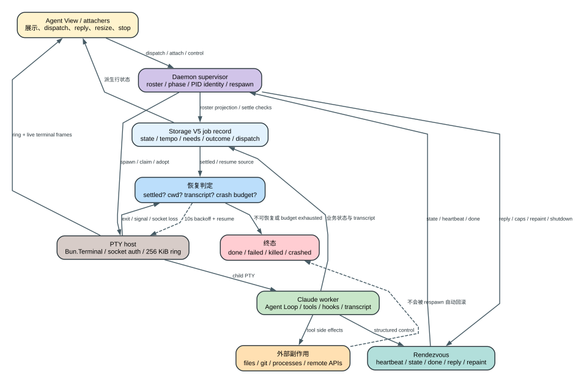

# Claude Code CLI 2.1.235 Runtime Supervision：后台 Agent、PTY、Daemon 和恢复到底谁负责

## 60 秒理解后台监督链

**读者问题：** 关闭一个终端后后台 Agent 为什么还能跑；Agent View 显示 `running` 时又为什么可能无法 attach？

**一句话模型：** `2.1.235` 把后台执行拆成“展示与控制客户端、daemon supervisor、PTY host、Claude worker、rendezvous 控制通道、Storage V5 job record”六个 owner；它们彼此传递状态，但没有任何单一对象同时等于进程存活、终端可连接、Agent Loop 可继续和任务成功。

贯穿场景：用户用 `claude --bg` 派发一个长任务后退出终端。daemon 继续持有 worker；PTY host 保存最近输出并允许之后 attach；worker 把业务状态写入 job record，通过 rendezvous 上报 blocked/done；Agent View 再从 supervisor roster、Storage 状态和 socket 活性派生行状态。若 worker 崩溃，supervisor 可以 resume；若工作目录被删则明确终止；若 Bash 已经推送远端，进程重启不会撤销该副作用。

可编辑图源：[runtime-supervision-lifecycle.dot](visuals/runtime-supervision-lifecycle.dot)。后台 worker/PTY 主实现位于 [420733-422667](../reverse/javascript/cli.readable.js#L420733)，`claude agents` 入口位于 [630199-630202](../reverse/javascript/cli.readable.js#L630199)。

## 六个 owner 分别拥有什么

| Owner | 真正拥有的状态 | 不拥有的状态 | 典型失败 |
| --- | --- | --- | --- |
| Agent View / `claude agents --json` | 过滤、展示、attach/stop/reply 命令，dispatch defaults | worker 进程和 Agent Loop | 行状态旧、可见但 attach 失败 |
| Daemon supervisor | worker roster、PID identity、phase、respawn、warm spare、process wrapper | 模型 transcript 语义 | control socket 失联、版本/launcher skew |
| PTY host | Bun.Terminal、child process、PTY socket、输出 ring、resize/input/signal | 会话 message graph | socket auth 错、孤儿、客户端慢 |
| Claude worker | Agent Loop、tool/hook/MCP、transcript、业务 job state | supervisor 生命周期 | startup wedge、crash、blocked input |
| Rendezvous server | worker -> supervisor 的 heartbeat/state/done；supervisor -> worker 的 reply/repaint/caps/shutdown | 大段终端字节流 | auth mismatch、heartbeat stale |
| Storage V5 job record | session/job 可恢复状态、tempo/needs/detail、dispatch/roster projection | 活进程本身 | 磁盘 settled 与内存进程状态短暂分叉 |

`claude agents` 的参数只为 Agent View 和新 dispatch 提供 cwd、plugin、MCP、permission、model、effort 等默认值；`--json` 输出 active/all session projection [630199-630202](../reverse/javascript/cli.readable.js#L630199)。它不是另一个模型执行器。

## 一、Daemon 冷启动不是“每个后台任务各起一个孤立 CLI”

当需要后台能力而 service 尚未运行，`daemonColdStart` 的有效值是：

- `transient`：为本次登录会话拉起临时 supervisor；
- `ask`：先询问是否安装持久 service。

环境 `CLAUDE_CODE_DAEMON_COLD_START` 优先，其次受信 settings，再到 GrowthBook 默认；源码默认回落 `transient` [89972-89977](../reverse/javascript/cli.readable.js#L89972)。Linux/WSL 若 `logind.conf` 设置 `KillUserProcesses=yes`，客户端明确警告 SSH 断开会杀 transient daemon，并给出 linger 或持久安装路径 [479201-479216](../reverse/javascript/cli.readable.js#L479201)。

supervisor 不是只保存 PID。它维护 worker roster、CLI version、launch target、process wrapper、control socket、origin、启动时间和是否可提供 background sessions；control socket 失联但 PID 仍活时会先做 ping 复查，只有 PID identity 可验证才发重启信号，缺少 `procStart` 时拒绝盲杀 [479185-479199](../reverse/javascript/cli.readable.js#L479185)。

这形成三种不同状态：

1. supervisor PID 活且 control socket 可达：可调度；
2. PID 活但 socket 不可达：zombie audit/restart；
3. service 活但 background control socket 启动失败：daemon 仍存在，`--bg` 明确拒绝并指向 daemon log。

所以“进程列表里有 claude”不能证明后台调度正常。

## 二、`processWrapper` 是企业进程启动合同

`processWrapper`/`CLAUDE_CODE_PROCESS_WRAPPER` 允许企业把 supervisor、worker 和其它受覆盖的 background process 统一放进审计、容器或 EDR launcher。来源顺序是：环境变量优先；否则 policy settings、flag/SDK settings、user settings；project/local settings 被忽略 [40285](../reverse/javascript/cli.readable.js#L40285)、[273148-273152](../reverse/javascript/cli.readable.js#L273148)。

它被解析为 argv，不经过 shell：

- 支持 JSON string array，或带双引号的空白分隔 argv；
- launcher 必须是绝对路径、regular executable；
- 拒绝未加引号的 `; | & $ ( ) \` < >`；
- 拒绝把 Claude 自己当 wrapper，避免递归；
- Windows 明确忽略，因为此合同要求 launcher `exec` 进入 Claude。

解析与验证见 [272846-272971](../reverse/javascript/cli.readable.js#L272846)。真正 self-spawn 时 wrapper argv 被放在目标 binary 前 [290488-290508](../reverse/javascript/cli.readable.js#L290488)。配置存在但失效时，后台 self-spawn **fail closed**：拒绝启动而不是悄悄绕过 launcher；已经运行的旧 daemon 若 wrapper/version 不一致会被标记 skew，必要时退休后换新 [478824-479179](../reverse/javascript/cli.readable.js#L478824)。

launcher 还有三个可观测合同：必须 `exec` 而不是 fork 后自己退出；必须保持目标 argv；必须把 wrapper 环境继续传给后继。worker 在 12 秒内“launcher exit 0 但 Claude 尚未 ready”会被判为 fork-and-exit 违规 [422483-422516](../reverse/javascript/cli.readable.js#L422483)，warm spare 也会因早退停用快捷路径 [630754-630800](../reverse/javascript/cli.readable.js#L630754)。

## 三、PTY host 为什么独立于 Claude worker

supervisor 不直接把用户终端连到 worker stdin/stdout。它先启动 `--bg-pty-host <sock> <cols> <rows> -- <worker...>`：PTY host 创建 `Bun.Terminal` 和 child，再通过 Unix socket 向一个或多个 attacher 转发终端帧 [420733-420850](../reverse/javascript/cli.readable.js#L420733)。

这种拆分带来四个能力：

1. 用户终端断开时 child 不必退出；
2. 新 attacher 先收到最近 `256 KiB` 输出 ring，再切到 live stream；
3. resize、Ctrl-C/Ctrl-\\、kill 和 repaint 有独立控制帧；
4. supervisor/Agent View 无需成为真实 PTY owner。

慢客户端不是无限缓存：单 socket writable queue 超过 `1 MiB` 会被销毁；ring 只保留最近 `256 KiB` [420755-420767](../reverse/javascript/cli.readable.js#L420755)、[265502](../reverse/javascript/cli.readable.js#L265502)。因此重新 attach 能看到诊断尾部，不保证得到完整历史；完整业务历史应看 transcript/job storage，而不是 PTY ring。

### Socket authentication 与 token 生命周期

每个 worker 默认生成 `rvAuth` 和 `ptyAuth`，各为 16 random bytes 的 hex string [421942-421983](../reverse/javascript/cli.readable.js#L421942)。非 Windows 平台优先把 token 写进 mode `0600` 的一次性文件，由 child 读取后删除，减少长期暴露在环境中的时间 [421888-421906](../reverse/javascript/cli.readable.js#L421888)。PTY 客户端在发送 DATA 前必须完成 auth；token 错误会得到 `auth-required`，supervisor 将其视为 roster 被污染并 re-key，而不是继续接受输入 [420821-420847](../reverse/javascript/cli.readable.js#L420821)、[422587-422615](../reverse/javascript/cli.readable.js#L422587)。

旧 roster 缺 token、daemon schema skew、socket 路径残留和 PID reuse 都有单独检查。adopt 时会同时核对 PID 与 `procStart`；只有两者仍指向同一个进程才复用，PID 已被系统回收则拒绝 adopt [422196-422223](../reverse/javascript/cli.readable.js#L422196)。

### Heartbeat 与 orphan watchdog

PTY host 对 attacher 默认每 `60s` 发 ping，连续漏 `3` 次就断开该客户端；它不会因此立即杀 worker。Unix 上还每 `2s` 检查一次 parent/client，若 parent PID 已变化且没有任何 attacher，连续 `30` 次，即约 `60s`，才把 child `SIGTERM`，5 秒后仍未退出则 `SIGKILL` [420858-420890](../reverse/javascript/cli.readable.js#L420858)。

这两个计时器解决不同问题：heartbeat 回收坏连接；orphan watchdog 回收已经失去 supervisor 和所有客户端的 PTY host。把它们都叫“session timeout”会误判后台持久性。

## 四、Rendezvous 管控制状态，PTY 管终端字节

worker 启动时拿到 `CLAUDE_BG_RENDEZVOUS_SOCK`，在本地创建 server，并立即从环境删除 socket/token，避免后继工具默认继承 [269645-269665](../reverse/javascript/cli.readable.js#L269645)。通道处理：

- worker -> supervisor：`heartbeat`、`state patch`、`done`、`detach-request`、`interactive-mark`、`repaint-done`；
- supervisor -> worker：`reply`、`repaint`、`attacher-caps`、`shutdown`；
- reply 优先回答正在等待的问题，否则作为下一优先级 human message 入 Agent Loop queue [269697-269703](../reverse/javascript/cli.readable.js#L269697)。

PTY socket 传 raw terminal input/output；rendezvous 传结构化控制。PTY 还活不代表 Agent Loop rendezvous 健康，rendezvous 心跳正常也不代表某个 attacher 能处理终端帧。

worker 启动 45 秒仍卡在 startup working state 时，rendezvous 将 job 标为 `blocked`/needs input，而不是让 Agent View永远显示“正在启动” [269590-269623](../reverse/javascript/cli.readable.js#L269590)。

## 五、Supervisor 如何判断重启还是终止

每个 worker 的内存 phase 是 `spawning -> running -> upgrading/retiring -> retired`；对外 record 另有 `starting/running/resuming/crashed/stopped`、tempo、detail、outcome。phase 与展示 state 不是同一个枚举 [421927-422012](../reverse/javascript/cli.readable.js#L421927)。

### 三种进入方式

| 入口 | 行为 | 关键差异 |
| --- | --- | --- |
| cold spawn | 新建 PTY host 和 worker | attempt 从 1 开始 |
| warm spare claim | claim 已启动但未绑定任务的 PTY/CLI | 省启动延迟；claim token 5 秒时限 |
| adopt | 新 supervisor 接管旧 roster worker | 校验 PID/procStart/socket auth/schema |

实现见 [422172-422223](../reverse/javascript/cli.readable.js#L422172) 与 warm spare [630747-630840](../reverse/javascript/cli.readable.js#L630747)。warm spare 不是提前运行用户任务；它在 claim frame 到达后才切 cwd/env/argv/session。

### Respawn 合同

普通 worker 异常退出后，supervisor 不直接重放原始 prompt：

1. 检查 Storage V5 是否已经 settled；若已完成，抑制 respawn；
2. 检查 transcript 是否已有消息；有则用 `--resume`；
3. 为意外中断设置 `CLAUDE_CODE_RESUME_INTERRUPTED_TURN=1` 和恢复提示，要求重验时间敏感状态；
4. 若 `/clear` 后换了 session，使用 post-clear respawn 标记；
5. 10 秒 backoff 后重启，最多 20 attempts。

详见 [422347-422442](../reverse/javascript/cli.readable.js#L422347)、[422544-422579](../reverse/javascript/cli.readable.js#L422544)。连续 3 次在 5 秒内 fast crash、未 ready 的重复失败、工作目录消失、launcher 违规都会转为终态 `crashed`；工作稳定超过 5 分钟后 attempt budget 可重置 [422483-422542](../reverse/javascript/cli.readable.js#L422483)。

resume 只能恢复 transcript 中可表达的状态。已经完成的文件写、Git push、数据库或远端 API 副作用不因 worker crash 自动回滚；恢复提示要求重新核验正是为了减少重复执行。

### Liveness 不是只做 `kill(pid, 0)`

supervisor 每 5 秒检查 PID；每隔更多 tick 复核 `procStart` 防 PID reuse；rendezvous 超过 120 秒没有 heartbeat 且 job tempo 仍 active 时记录 stalled telemetry。主机睡眠/唤醒造成长 tick 会把 grace clocks 前移，避免把系统暂停误判为 worker hang [422617-422665](../reverse/javascript/cli.readable.js#L422617)。

## 六、Agent View 的状态是派生投影

supervisor 的 `rosterEntry()` 保存 PID、procStart、sessionId、socket、CLI version、attempt、cwd/worktree、dispatch、phase hint、terminal modes、interactive marks 和两个 auth token；长字符串截到 `4096`，凭据/PATH/extra-body 等从 dispatch projection 删除 [422291-422299](../reverse/javascript/cli.readable.js#L422291)。

Agent View 再把 roster、Storage job state、in-flight tasks、tempo、attachability组合成用户行。比如 job 已 settled 但仍有 `session_cron`，派生状态仍可视为 inflight；普通 active tempo、queued work、monitor drain 又是不同条件 [421908-421923](../reverse/javascript/cli.readable.js#L421908)。

所以这些显示必须这样读：

- `running`：当前派生状态还未终结，不保证模型正在生成 token；
- `needs input`/blocked：worker 还可活着，只是在等终端、认证、permission 或用户回答；
- attach 失败：PTY/socket/auth 层失败，不等于 transcript/job 已丢失；
- completed：Storage 业务状态 settled，不保证所有外部进程或 cron 已消失。

## 七、Cron、Remote Control 和 Agent View 的关系

`session_cron` 被 supervisor 的 in-flight 判断单独保留，因此 worker可以在“当前 turn 不忙”时仍因定时恢复合同保持后台所有权 [421908-421917](../reverse/javascript/cli.readable.js#L421908)。cron 何时真正唤醒 Agent Loop、Monitor 怎样 drain，仍由 worker/task层负责；daemon 只保证进程和调度载体存在。

Remote Control 是另一条 attacher/control path。它把远程客户端接到本地 session owner，但不把执行 owner 迁到手机或网页；断开 viewer 不等于停止 worker。完整 bridge/reattach/跨 session 输入合同见 [后台、Channels、Remote 与 Cloud](cloud-background-channels.md)。

## 八、内存压力会有选择地回收后台 Shell

交互主进程监听 `memoryPressure`。只有满足全部条件的 local background Bash 才会被 pressure-reap：不是非交互模式、没有归属 subagent、任务仍 running、尚未通知、用户至少 30 分钟无交互、主 Agent Loop 不忙、task registry 没有阻止回收的活动 [289113-289135](../reverse/javascript/cli.readable.js#L289113)、[289246](../reverse/javascript/cli.readable.js#L289246)。

命中后它先生成 killed task notification，再终止 shell。`CLAUDE_CODE_DISABLE_BG_SHELL_PRESSURE_REAP` 可关闭此客户端策略。这个机制不是操作系统 OOM killer，也不针对 daemon worker 本身；它减少空闲交互会话中长期后台 shell 的内存压力。

## 九、`asyncRewake` Hook 会重新唤醒模型，但只认 exit 2

command Hook 设置 `asyncRewake: true` 后，进程先作为 async hook 后台运行；完成时收集 stdout/stderr 并记录 hook outcome。只有 exit code `2` 才把内容包装成“Stop hook feedback”task notification，以 `priority: next`、`stopHookActive: true` 注入下一次 Agent Loop wake [405374-405406](../reverse/javascript/cli.readable.js#L405374)。exit 0 只是成功结束，其它非零记录错误但不走这个 rewake 分支。

该能力只在交互或 streaming-input host 存在时启用；普通一次性非交互调用不承诺模型在进程退出后仍可被唤醒 [405675-405689](../reverse/javascript/cli.readable.js#L405675)。session shutdown 最多等 pending async-rewake hooks 30 秒，再继续退出 [405361-405366](../reverse/javascript/cli.readable.js#L405361)。

这仍不是事务回滚：Hook 在外部已经做过的动作不会因 exit 2 被撤销；它只是把阻塞反馈重新送入模型决策。

## 十、故障定位顺序

| 用户症状 | 先检查 | 再检查 | 不要误判 |
| --- | --- | --- | --- |
| `--bg` 无法派发 | daemon control/status、processWrapper | socket dir ownership、service config | 有 daemon PID就等于可调度 |
| Agent View 有行但 attach 失败 | PTY socket、ptyAuth、procStart | worker/job storage | transcript 一定丢了 |
| 反复 `respawning` | ring tail、fastCrash、cwd、launcher | transcript resume、provider auth | supervisor 会无限重试 |
| 显示 active 但没输出 | rendezvous heartbeat、tempo、needs | permission/MCP/input wait | 模型一定卡死 |
| 终端退出后任务消失 | transient daemon/logind/orphan watchdog | 是否安装 service | Agent View 是执行 owner |
| 重启后动作重复 | transcript terminal state、外部副作用 | resume prompt、tool result pairing | tombstone/respawn 会撤销副作用 |

## 证据结论

- **Static：** daemon cold start、wrapper fail-closed、PTY/socket auth、heartbeat/orphan、worker adopt/respawn、roster projection、pressure reap 与 asyncRewake 的客户端生命周期均可由 `2.1.235` readable view确定。
- **Surface：** `claude agents`、hidden daemon/background/PTY entrypoints 已出现在 command inventory；入口存在不代表当前机器 service 已安装或某次 adopt 成功。
- **Boundary：** 当前仓库没有对断电、真实 OS sleep、跨 CLI version daemon takeover、systemd/launchd 安装和真实 Remote Control 多客户端做全组合 Probe；平台 service manager 与远端 bridge 服务行为不由 bundle 单独证明。
