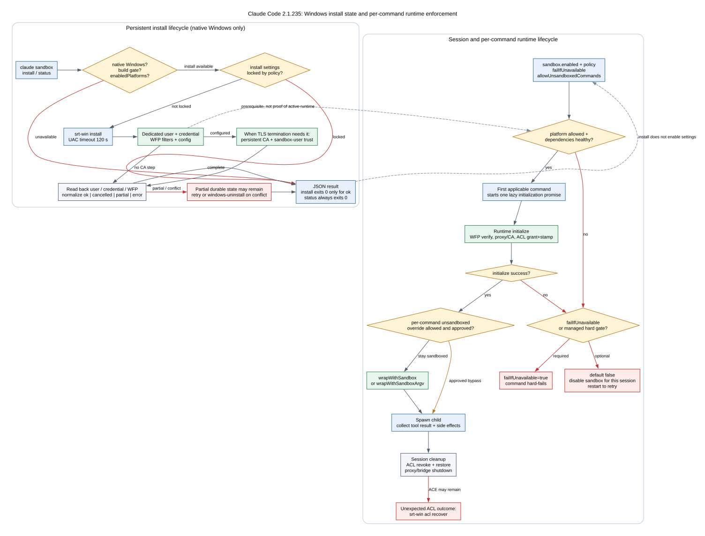

# Claude Code CLI 2.1.235 Sandbox：一次安装不等于每条命令都已受控

很多人把“装好了 Windows sandbox”“设置里打开了 sandbox”“本次 Bash 正在 sandbox 中运行”当成同一个状态。`2.1.235` 实际维护两条独立生命周期：**安装链**在 Windows 上预置长期存在的账户、凭据和网络过滤器；**运行链**在每个 Claude Code session 中读取设置、检查依赖、初始化隔离设施，再为每一条适用命令生成 sandbox wrapper。任何一条链只完成一半，都不能推出“当前动作已被隔离”。

本文只讲发布 bundle 中能直接追到的客户端行为。函数名来自可读化 bundle，不是 Anthropic 原始 TypeScript 符号。

## 60 秒理解：先问自己正在看哪一种状态

**读者问题：** `claude sandbox status` 显示 `installed: true` 后，为什么命令仍可能没在 sandbox 中运行；反过来，CLI 最终退出 `0`，为什么被禁止的写文件或联网动作仍然失败？

**一句话模型：** 安装链回答“Windows 主机是否具备运行依赖”，运行链回答“本 session、这条命令是否真的经过 sandbox wrapper”；Agent Loop 的进程退出码只说明 CLI 是否正常处理了工具结果，不能代替检查工具结果和外部副作用。



贯穿场景：企业管理员要求 Windows 上所有 Bash/PowerShell 命令都进入 sandbox，并开启 TLS inspection。管理员先执行一次 `claude sandbox install`，预置专用用户、credential、WFP filters 和持久 CA；开发者随后启动新 session。第一条 Bash 到来时，CLI 才懒初始化运行时、给专用用户授予本 session 所需 ACL、启动网络代理，并把命令改写成 `srt-win exec ...`。session 退出时 ACL 被撤销/恢复，但安装阶段创建的专用用户和 WFP filters 继续存在，供下次 session 使用。

| 状态对象 | 它回答的问题 | 主要所有者 | 生命周期 | 不能据此推出 |
| --- | --- | --- | --- | --- |
| settings intent | 用户或策略是否要求 sandbox | settings/policy | 可热更新，部分设置需重启/重初始化 | 依赖已经安装 |
| dependency state | 专用用户、credential、WFP 等是否可用 | `srt-win` / OS | 跨 session 持久 | 当前 session 已初始化 |
| session runtime | 代理、CA、ACL、运行时 config 是否已建立 | SandboxManager | 当前 Claude Code 进程 | 每条工具都适用同一个 wrapper |
| per-command wrapper | 这条 Bash/PowerShell 的 argv/env 是否被改写 | Bash/PowerShell tool | 单次工具调用 | 命令内部动作一定成功 |
| Agent Loop result | CLI 是否把成功或错误回灌给模型并正常收尾 | Agent Loop | 单个用户 turn | 被拒绝的文件/网络副作用发生过 |

## 最重要的结论：这是两台状态机，不是一个开关

```text
安装状态机（Windows、持久）
CLI gate -> policy gate -> UAC/srt-win install
         -> user + credential + WFP
         -> optional persistent CA/trust
         -> read-back -> JSON status

运行状态机（每个 session、每条命令）
settings -> cheap gates -> dependency probe
         -> lazy initialize -> ACL/proxy/CA
         -> wrapWithSandbox / wrapWithSandboxArgv
         -> spawn -> tool_result -> session cleanup
```

`install` 的成功不会自动把 `sandbox.enabled` 写成 true；运行时启用也不会自动补齐缺失的 Windows 依赖。源码中的成功文案甚至主动区分三种结果：已安装且当前 active、已安装但只在 settings 中启用、已安装但仍需要用户选择模式并开启。

Static：CLI handler 和安装结果分支见 `reverse/javascript/cli.readable.js` 504134-504188、629017-629038、630228-630235。

## 第一条链：`claude sandbox install/status` 到底做了什么

### 入口本身是隐藏的 Windows 专用子命令

Commander 注册了隐藏的 `sandbox` 根节点，下面只有两个子命令：

| 命令 | 行为 | 成功退出条件 |
| --- | --- | --- |
| `claude sandbox install` | 安装 Windows sandbox user 与 network filters，打印 `{status,message}` | **只有** `status === "ok"` 才退出 `0` |
| `claude sandbox status` | 打印 `{available,installed,policyLocked,reasons}` | 无论结果内容如何都退出 `0` |

二者进入 handler 前都经过同一组 availability gate：

1. 必须是 native Windows；WSL 不算 native Windows install surface。
2. 当前 build 的 Windows sandbox feature gate 必须开启。
3. 当前平台必须被 managed `sandbox.enabledPlatforms` 允许。

`install` 还有一层 policy gate：如果 sandbox 的核心设置被 flag/policy 锁定，客户端拒绝本地 provisioning，并提示由管理员管理。`status` 是只读查询，不因 policy locked 而拒绝；它把 `policyLocked` 单独返回。

这解释了一个容易误诊的现象：

```text
claude sandbox status
exit 0
{"available":false,"installed":false,...}
```

这里的 `0` 只代表“状态查询成功完成并打印了 JSON”，不代表 sandbox available 或 installed。

Static：注册位于 `reverse/javascript/cli.readable.js` 630228-630235；gate 与退出语义位于 629017-629038。

### `installed: true` 的精确定义比名字窄

`status` 在通过平台 gate 后调用 `checkDependenciesAsync()`，然后按下面的表达式生成结果：

```text
installed = dependencyCheck.errors.length === 0
```

因此它证明的是“当前依赖探针没有 error”。它**不证明**：

- `sandbox.enabled` 已经打开；
- 当前 session 已完成 SandboxManager 初始化；
- 当前命令没有使用允许的 unsandboxed override；
- 当前命令属于会经过 OS sandbox 的工具类型；
- 某个被模型请求的文件写入或网络请求成功。

对 Windows 而言，dependency probe 分别读取 sandbox user/credential 与 WFP 状态。非提权进程可能得到 WFP `cannot-read`；该状态会被记录，但与明确 `installed` 的可验证状态不同。用户未 provision、credential 不可读或 WFP 明确未安装会进入 errors。

Static：`reverse/javascript/cli.readable.js` 125730-125790、138820-138880、629017-629038。

## 安装链的完整顺序

```text
sandboxInstallHandler
  -> platform/build/enabledPlatforms gate
  -> policy-lock gate
  -> single-flight install runner
  -> srt-win install（需要时 UAC）
  -> 读取 user + WFP 状态
  -> dependency cache invalidate + recheck
  -> TLS termination 需要时创建/复用持久 CA，并写入 sandbox user trust
  -> 把状态归一成 ok / cancelled / partial / error
  -> JSON 输出
  -> status == ok ? exit 0 : exit 1
```

### 安装阶段预置的是长期对象

`srt-win install` 的目标不是启动一条临时子进程，而是准备后续 session 都要复用的主机状态：

- 专用 sandbox 用户；
- 与该用户对应、可由运行时读取的 credential；
- 以 sandbox user SID 为边界的 Windows Filtering Platform filters；
- WFP proxy port range 等安装配置；
- TLS termination 路径需要时，持久 CA material 与 sandbox 用户信任。

WFP 使用专用用户 SID 作为匹配边界，所以安装文案明确说明不要求用户 logout，普通用户网络不应因这组过滤器被整体改写。运行时仍会在初始化时执行 WFP egress verify，避免“对象存在但 fence 没有真正工作”。

### UAC 与退出码不是普通的成功/失败二元组

默认安装 timeout 是 `120000 ms`，也就是 2 分钟。`srt-win install` 的状态码被客户端解释为：

| `srt-win` status | 客户端解释 | 上层结果 |
| ---: | --- | --- |
| `0` | 安装流程完成 | 继续 read-back |
| `10` | elevation/UAC 被取消 | 标记 `cancelled`，仍继续读取已有状态 |
| `12` | WFP filter install failed | `install_wfp_failed` -> `error` |
| `13` | 已有 filters 与当前 port range/user 等配置冲突 | `install_config_conflict` -> `error` |
| `14` | sandbox user provisioning failed | `install_user_failed` -> `error` |
| 其他非零 | 未分类 install failure | `install_failed` -> `error` |

状态 `10` 特别值得注意。用户取消 UAC 后，如果专用用户和 credential 其实早已存在，客户端会根据当前 policy/TLS 状态继续做有限 read-back 或 CA trust 处理；在一个受管 TLS 分支中，CA 成功补齐后甚至可能返回 `ok`，但文案仍明确说明非提权进程无法验证 network filters。不能把“这次 UAC 取消”简单等同于“主机上什么都没装”。

Static：`reverse/javascript/cli.readable.js` 125590-125655、504134-504188。

### 最终 JSON 状态表示哪一种恢复位置

| `status` | 意义 | 典型下一步 | CLI exit |
| --- | --- | --- | ---: |
| `ok` | user/credential 与 WFP read-back 达到接受条件；需要时 CA 步骤也完成 | 检查/开启 settings，必要时重启 session | `0` |
| `cancelled` | UAC 取消，可能保留或复用已有部分状态 | 再运行 install 并批准 UAC；先用 status 查看 | `1` |
| `partial` | 安装进程结束，但 user、credential、WFP 或 CA 有一部分未达到要求 | 修复对应项后重试 install | `1` |
| `error` | timeout、配置冲突、status read-back 或安装异常 | 按具体 message 处理 | `1` |

`partial` 是真实可持久化状态，不是输出层的客气说法。例如 sandbox user 已 provision、但 WFP 未安装；或 user/WFP 完成但持久 CA 无法创建/信任。下一次 install 会从主机现状继续，而不是从一个自动回滚后的空白状态开始。

### 没有 CLI uninstall 子命令，也没有已证明的事务回滚

本版 `claude sandbox` 只注册 `install` 与 `status`。配置冲突文案要求从 trusted directory 运行：

```text
npx @anthropic-ai/sandbox-runtime windows-uninstall
```

然后再执行 install。这里能证明的是“错误恢复文案暴露了底层 runtime 的 uninstall 路径”，不能把它写成 `claude sandbox uninstall`。

安装流程会在各阶段读取状态并给出 partial/error，但源码没有显示一个覆盖 user、credential、WFP、CA 的统一事务日志和逆序回滚。因此最保守且准确的模型是：**安装可能留下可供下次重试的部分持久状态**。配置冲突需要显式卸载旧 filter set；普通 partial 则通常直接重试。

Boundary：没有 Windows 精确运行探针验证 UAC UI、实际账户对象和 WFP 主机状态；上述结论来自目标 bundle 的 Static 调用链，不是本机 Windows Probe。

## 第二条链：每条命令如何真正进入 sandbox

安装完成后，普通工具调用不会回到 install handler。运行时由 SandboxManager 维护另一组 process-local 状态：dependency probe cache、`initializationPromise`、`sandboxDisabledThisSession`、`initFailureReason`、TLS 初始化形态、Windows ACL snapshot、代理与 bridge 等。

### 运行前的四层 gate

一条命令只有同时满足以下条件，`isSandboxingEnabled()` 才会为 true：

1. settings intent 为 enabled；
2. `enabledPlatforms` 允许当前平台；
3. 当前平台实现受支持；
4. dependency probe 没有 errors，且本 session 没被标记 `sandboxDisabledThisSession`。

`failIfUnavailable` 不参与“依赖是否存在”的判断，它决定依赖/初始化失败后是硬失败还是降级：

| 条件 | 结果 |
| --- | --- |
| `sandbox.enabled=true` 且 `failIfUnavailable=true` | sandbox 不可用或初始化失败时抛硬错误，命令不以 unsandboxed 方式继续 |
| `sandbox.enabled=true` 且 `failIfUnavailable=false` | 初始化失败后本 session 标记禁用，提示 restart 后重试 |
| `sandbox.enabled=false` | 不进入 sandbox wrapper；permission/policy 仍独立工作 |

降级只持续当前 session。dependency cache invalidate 或新进程会清除 session-local failure state；文案要求重启，是为了重新建立干净的初始化和资源生命周期。

Static：`reverse/javascript/cli.readable.js` 138820-139130。

### 初始化是懒执行，并由 single promise 合并

SandboxManager 不必在 CLI 启动时立刻建立全部隔离设施。第一条需要 sandbox 的命令进入 `kVd()` 时：

1. 如果 `isSandboxingEnabled()` 为 true 且尚无 `initializationPromise`，记录 lazy-init 事件并调用 initialize。
2. 同 session 中并发到来的命令等待同一个 promise，不各自重复初始化。
3. 初始化成功后订阅 settings/policy 变化，更新 runtime config。
4. 初始化失败会清空 promise、记录 `initFailureReason`；下一层依据 `failIfUnavailable` 选择硬失败或本 session 禁用。

这套设计减少空闲 session 的启动成本，但会让“第一条 Bash”承担依赖检查、代理/bridge、CA 和 ACL 的一次性延迟。故性能分析应区分 session cold start 与后续 warm command。

### Windows 初始化时建立的是 session 级 ACL

Windows 分支的关键顺序是：

```text
read sandbox user status
-> verify provisioned + credential
-> once-per-process WFP egress verify
-> prepare persistent/configured CA and validate trust thumbprint
-> resolve filesystem allow/deny + credential file rules
-> srt-win acl grant（允许路径）
-> srt-win acl stamp（deny 路径）
-> initialize HTTP/SOCKS/TLS network infrastructure
```

ACL 不是每条命令临时创建一套。grant/stamp 以当前进程 PID 作为 holder，把本 session 的 resolved file-access set 应用给 sandbox user。settings 热更新如果改变了 `filesystem.* ∪ credentials.files`，源码明确警告：之前的 session-wide ACL 仍然生效，需要 `reset()` 后重新 `initialize()` 才能应用新集合。

初始化中途失败时，客户端会尝试 revoke grant 并 restore deny stamp，再清除 session state；这是运行时 ACL 阶段的补偿清理，不能倒推出安装阶段也拥有同等级的全事务回滚。

Static：`reverse/javascript/cli.readable.js` 125940-126030、139080-139150。

### 每条命令仍要被包装后才能 spawn

macOS/Linux 与 Windows 的 wrapper 形态不同：

| 平台 | wrapper 输出 | spawn 方式 |
| --- | --- | --- |
| macOS/Linux/WSL2 | `wrapWithSandbox()` 返回 shell command string | 原 shell `-c` 执行 |
| native Windows | `wrapWithSandboxArgv()` 返回 `argv + env + unsetEnv` | `shell:false` 直接 spawn `srt-win exec` |

Windows 不能使用返回 shell string 的通用 wrapper，源码会直接抛错并要求 `wrapWithSandboxArgv()`。生成的 argv 包含 per-exec deny、代理、CA、受控 env、shell executable/args 与原命令；组装长度超过约 `30000` 字符时提前拒绝，避免逼近 `CreateProcessW` 的 `32767` 限制。PowerShell 还会因 base64 编码进一步压缩可用脚本空间，错误建议写入文件或拆分命令。

Bash/PowerShell tool 随后把 wrapper 输出传给真正的 subprocess spawn，并在进程结果中记录 `sandboxed`、`sandbox_enabled`、`dangerously_disable_sandbox` 与 violation 状态。只有走到这里，才可以说“这条命令被 sandbox wrapper 包装”。

Static：`reverse/javascript/cli.readable.js` 126180-126275、139050-139100、198110-198175。

## `dangerouslyDisableSandbox` 到底绕过了什么

该字段不是一个隐形后门，它仍位于工具 permission pipeline 中：当当前输入从 sandboxed 变成 unsandboxed 时，权限层可以返回 ask/deny，并把 decision reason 标成 `sandboxOverride`。默认允许 unsandboxed 的配置也不等于自动批准所有动作。

更关键的是：

- `sandbox.allowUnsandboxedCommands=false` 时，这个参数被完全忽略，命令必须继续走 sandbox；
- managed policy 还可直接禁止 unsandboxed commands；
- 即使 permission mode 是 `bypassPermissions`，只要命令仍被判定为 sandboxed，OS 文件/网络边界继续生效；
- 一个命令因 sandbox violation 自动建议/重试 unsandboxed，也仍取决于该能力是否允许。

所以 permission bypass、sandbox bypass 与 OS 动作成功是三个不同判断。

Static：settings contract 位于 `reverse/javascript/cli.readable.js` 32646；manager 与 permission consumer 位于 138880-138905、319002-319049、393214-393266。

## Session 结束时清理什么，什么会继续存在

### 会清理的 process/session 状态

Windows cleanup 会：

1. 对 session grant 执行 `acl revoke`；
2. 对 deny stamp 执行 `acl restore`；
3. 接受 `revoked`、`stillHeld`、`restored`、`alreadyOriginal` 等正常 per-path 状态；
4. 关闭 proxy/bridge、清除临时 CA/监听器与 manager state。

若某路径返回异常状态，CLI 会警告 ACE 可能残留，并要求修复路径问题后运行：

```text
srt-win acl recover
```

这是一条“异常终止后的 ACL 修复”路径，不是日常 uninstall。

### 不随普通 session cleanup 删除的持久状态

- sandbox 专用用户与 credential；
- WFP filter set；
- 持久 CA/trust（启用对应 TLS 形态时）；
- 安装配置冲突所关联的旧 filter set。

这些对象属于安装生命周期。否则每次启动 Claude Code 都会重新触发 UAC，违背一次性 provisioning 设计。

Static：ACL helper 与 cleanup 位于 `reverse/javascript/cli.readable.js` 125660-125720、126280-126330。

## 精确版本 Probe：证明“CLI 成功收尾”不等于“动作成功”

仓库中的 [sandbox-enforcement.json](runtime-probes/sandbox-enforcement.json) 使用与本快照一致的 `2.1.235` 二进制，SHA-256 为 `83b8f806f6f2eea316cfe246628e6c23374711d868f1fd0409db551b877b7748`。环境是 macOS arm64，因此它证明 Unix 运行时 enforcement，不证明 Windows install/UAC/WFP。

受控 settings：

```json
{
  "enabled": true,
  "failIfUnavailable": true,
  "allowUnsandboxedCommands": false,
  "filesystemDenyWrite": "$OUTSIDE",
  "networkAllowedDomains": [],
  "networkStrictAllowlist": true
}
```

三条 CLI 命令都显式使用 `bypassPermissions` 与 `--dangerously-skip-permissions`，以排除普通 permission prompt，单独观察 sandbox 层：

| Probe | literal/observable result | CLI exit | 正确解释 |
| --- | --- | ---: | --- |
| workspace allowed write | tool result success；文件内容为 `ALLOWED` | `0` | sandbox 内允许的副作用发生 |
| outside denied write | tool result error；目标文件不存在 | `0` | Agent Loop 正常处理了工具错误；写入未发生 |
| strict empty allowlist network | tool result error；受控 server hit count `0` | `0` | 请求没有到达目标；CLI turn 仍正常收尾 |

这组 Probe 证明 permission 与 sandbox 是独立层，也证明验收时至少要同时读取：

```text
CLI exit status
+ paired tool_result success/error
+ 目标文件/服务端命中等外部副作用
```

只看其中一个会误判。

Probe：claim `probe.sandbox-filesystem-enforcement` 与 `probe.sandbox-network-enforcement`；字段解释见 [runtime-probe-index.md](runtime-probe-index.md)。

## 成功、失败与恢复矩阵

| 观察到的状态 | 问题本质 | 当前命令是否执行 | 恢复动作 |
| --- | --- | --- | --- |
| install `ok`，settings disabled | 依赖已装但意图未开启 | 默认不进入 sandbox | 开启 settings/选择模式，必要时重启 |
| status `installed=false` + reasons | dependency probe 有 errors | 若 required 则拒绝；否则可能降级 | 按 reasons 安装/修复依赖 |
| install `cancelled` | UAC 未批准；可能已有旧状态 | 与当前 runtime 状态有关 | status 检查后重跑 install |
| install `partial` | user/credential/WFP/CA 只有部分成功 | 不应视为 ready | 修复对应项并重试 |
| install config conflict | 旧 WFP set 与当前配置不同 | 新配置未建立 | trusted directory 运行 runtime `windows-uninstall` 后重装 |
| lazy init failed + `failIfUnavailable=true` | 强制 sandbox 无法建立 | 否 | 修依赖/配置，restart |
| lazy init failed + default false | 本 session 被标记 sandbox disabled | 可能 unsandboxed，取决于调用路径 | restart 重新尝试；先修根因 |
| sandbox tool error + CLI exit `0` | 动作被 OS/runtime 拒绝，但循环正常 | wrapper 已运行，目标动作失败 | 读 tool result/violation；调整规则或显式审批 unsandboxed |
| ACL cleanup 异常 | session ACE 可能残留 | 已结束或正在清理 | 解决路径占用/访问问题，运行 `srt-win acl recover` |
| TLS CA 已安装但当前 session 未启用 | 初始化早于 TLS setting/CA 变化 | HTTPS inspection 可能不可用 | 按提示 restart，重新初始化 |

## 配置字段：哪些改变安全姿态，哪些只改变故障策略

| 字段 | 核心语义 | 默认/边界 | 代价与风险 |
| --- | --- | --- | --- |
| `sandbox.enabled` | 是否要求使用 sandbox runtime | 默认 false | 启动/首命令有初始化成本 |
| `failIfUnavailable` | runtime 建不起来时硬失败还是当前 session 降级 | 默认 false | true 更适合强制合规，但可阻断开发流程 |
| `allowUnsandboxedCommands` | 是否允许经 permission gate 的单命令 override | 默认 true | false 收紧逃生口，配置错误时恢复更难 |
| `enabledPlatforms` | managed policy 允许的平台集合 | 空数组禁用全部 | 可统一 rollout；错误配置会整体禁用 |
| `filesystem.allowWrite/denyWrite` | 运行时可写边界 | 与 workspace/default allow 合并 | 过宽增加破坏面；过窄增加工具失败 |
| `filesystem.denyRead/allowRead` | 敏感读取与例外 | Windows 形成 session ACL stamp | 规则变更需 reset/reinitialize 才完整应用 |
| `network.allowedDomains/deniedDomains` | sandboxed command 的 egress 范围 | strict allowlist 可 fail closed | 网络隔离增加代理与 DNS/TLS 开销 |
| `network.tlsTerminate` | 让 per-request filter 看见 HTTPS 请求 | Windows 需已信任的 persistent/configured CA | 代理可见请求内容；证书管理复杂度上升 |
| `credentials.*` | deny/mask 本地凭据并限制注入 host | macOS/Windows file mask 可降级为 deny | 降低 secret 暴露，但错误配置会导致认证失败 |
| `dangerouslyDisableSandbox` | 单次工具输入请求绕过 sandbox | 仍经过 permission；可被 policy/setting 禁用 | 外部副作用不再受 OS sandbox 保护 |

## 隐私、安全、性能与运维成本

### 安全收益

- permission 允许后仍有 OS 强制边界，降低模型、hook 或用户误判直接变成主机副作用的概率。
- Windows 专用用户把文件 ACL 与 WFP egress 绑定到独立 SID，而不是修改整个登录用户的网络。
- credential deny/mask 与 TLS/domain filter 可把“进程能读到什么”和“真实 secret 能发往哪里”拆开。
- `failIfUnavailable=true` 能把缺依赖从静默降级变成明确阻断。

### 隐私边界

- TLS termination 会在本机/runtime proxy 解密 HTTPS，才能检查 body 和注入受控凭据；相应 CA private key、代理日志和 inspection policy 都成为高敏感资产。
- violation、命令 telemetry 与工具结果可能暴露路径、域名和错误摘要；它们是诊断证据，也需要按企业日志策略保护。
- `mask` 不是“secret 消失”：真实值仍由 host proxy 在允许目标上恢复，安全性取决于 host narrowing、CA 和 proxy 边界。

### 性能与可用性成本

- 首条 sandboxed command 可能承担 dependency probe、ACL、WFP verify、proxy/bridge、CA 初始化。
- 每条命令增加 wrapper/argv/env 构造与代理跳转；TLS termination 还增加握手和证书验证。
- strict allowlist、路径 deny 和 credential mask 会把以前可工作的工具变成 error，Agent Loop 可能再花一轮模型 token 诊断或换方案。
- Windows session ACL 是集合级状态，频繁切换 workspace/settings 需要 reset/reinitialize，而不是零成本热替换。

## 证据分层

| 标签 | 本章使用方式 | 能证明什么 | 不能证明什么 |
| --- | --- | --- | --- |
| `Public` | [官方 Sandboxing 摘录](public-source-excerpts.md#public-sandbox-layers) | 当前公开设计把 filesystem/network 视为独立 OS enforcement 层 | 不自动证明 2.1.235 的 Windows install 状态码和 wrapper 顺序 |
| `Static` | 目标 bundle 的 CLI、manager、`srt-win` consumer 与 settings schema | 2.1.235 的 gate、字段、阈值、调用链、错误和恢复分支 | 未触发平台上的真实 OS 结果 |
| `Probe` | `sandbox-enforcement.json` | 精确二进制在 macOS arm64 上允许/拒绝的真实副作用与 tool result | Windows UAC、专用用户、WFP、ACL cleanup |
| `Boundary` | 明确保留 Windows 主机与企业 policy 的未触发部分 | 防止把静态分支包装成跨平台实测 | 不代表功能不存在 |

## 关键源码定位

| 主题 | `reverse/javascript/cli.readable.js` |
| --- | --- |
| sandbox settings schema、`failIfUnavailable`、unsandboxed override | 32614-32646 |
| Windows `srt-win` install/status/CA/ACL helpers | 125369-126330 |
| runtime initialize、wrapper、cleanup | 125940-126330 |
| SandboxManager gate、lazy init、failure policy | 138820-139276 |
| Bash/PowerShell wrapper 后 spawn | 198110-198175、318989-319049、393199-393368 |
| install handler 与结果归一 | 504134-504188 |
| hidden CLI 注册 | 630228-630235 |
| CLI install/status gate 与 exit | 629017-629038 |

## 后续版本交叉对比清单

版本升级时，不要只 diff `sandbox` settings key。至少逐项检查：

1. `claude sandbox` 命令树是否增加 uninstall/repair 或改变隐藏状态。
2. native Windows/build/`enabledPlatforms`/policy gate 的顺序是否变化。
3. `status.installed` 的计算是否仍只是 dependency errors 为空。
4. `srt-win` accepted exit codes、UAC timeout 和错误映射是否变化。
5. install 是否新增真正的事务日志或 rollback；不能用文案猜测。
6. persistent CA 的创建、轮换、trust 与 restart 条件是否变化。
7. lazy init、single-promise、session-disable 与 `failIfUnavailable` 的分支是否变化。
8. Windows ACL grant/stamp/revoke/restore 与 recover contract 是否变化。
9. per-command wrapper 的平台形态、argv cap、env scrub 和 spawn 顺序是否变化。
10. `dangerouslyDisableSandbox` 的 permission/policy gate 是否变化。
11. 对同版本二进制重新运行 allowed write、denied write、denied network Probe；有 Windows 环境时补充 install/status/ACL/WFP Probe。

只有安装态、session 态、命令 wrapper、tool result 与外部副作用五层都对上，才能准确回答“这条命令到底有没有被 sandbox 控住”。
