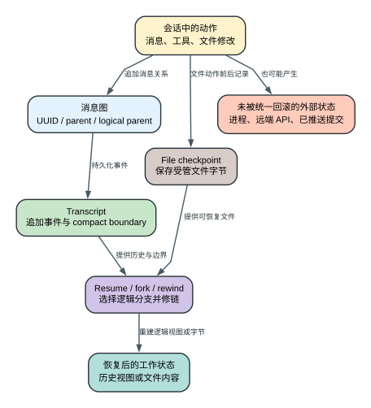

# Claude Code CLI 2.1.235 会话、检查点与 Memory：Claude Code 到底保存了什么

用户看到的是一条连续对话，但 Claude Code 需要同时保存四类完全不同的状态：消息图、JSONL transcript、文件 checkpoint 和 memory。它们的生命周期、恢复能力和失败边界不同。把它们统称为“会话缓存”，会直接导致错误预期，例如认为 `resume` 可以恢复正在运行的 shell，或认为 rewind 能撤销已经推送到远端的 commit。

本章只把 `2.1.235` 客户端中可以追到的行为写成本版事实。当前官方 Sessions、Checkpointing 和 Memory 文档用于解释目的；字段、上限和修链逻辑以发布 bundle 为准。

## 60 秒理解恢复对象

**读者问题：** 为什么 `--resume` 能找回对话，`rewind` 能恢复部分文件，却不能复活旧进程、撤销远端部署或让 Claude 自动记住所有历史？

**一句话模型：** Transcript 保存消息图事件，compact boundary 保存历史表示的切换关系，file checkpoint 保存受管文件字节，Memory 为未来请求提供长期文本；它们分别恢复不同对象，没有一个机制能回滚整个外部世界。

贯穿场景：Claude 修改 `config.json`、运行一个本地进程并调用远端部署接口，然后用户退出 CLI。重新进入时，resume 可以重建消息父链；checkpoint 可以把受管文件恢复到修改前；旧进程句柄已经消失；已提交的远端部署仍要查询、取消或补偿；Memory 只会在后续请求装载时影响模型，不是这次运行的完整快照。

| 对象 | 保存形式 | 能恢复什么 | 不能恢复什么 | 用户判断 |
| --- | --- | --- | --- | --- |
| Session/message graph | session ID、UUID、parent/logical parent | 对话分支与逻辑顺序 | 外部工具的真实事务 | “回到哪段对话” |
| JSONL transcript | 逻辑追加事件流；达到门槛后会条件压实重写 | 历史、tool pair、boundary 元数据 | 旧进程内对象 | “发生过什么” |
| File checkpoint | 受管文件的快照/差异 | 本地文件字节 | 数据库、远端 API、未覆盖路径 | “文件能否回退” |
| Memory | 用户/项目长期文本 | 下一次上下文中的稳定说明 | 原会话逐条消息和精确运行状态 | “以后应继续记住什么” |

后文先讲持久化主线，再给出 resume、fork、conversation rewind、file rewind 的恢复矩阵；任何恢复结论都必须说清“恢复的是哪个对象”。

## 一张表先分清四个对象

| 对象 | 保存什么 | 主要用途 | 能恢复什么 | 不能恢复什么 |
| --- | --- | --- | --- | --- |
| message graph | message UUID、parent、type、content、logical parent | 表示分支、compact 后逻辑历史和当前 leaf | 下一轮应该看到的对话链 | 外部工具自身的事务状态 |
| JSONL transcript | 按事件逻辑追加；物理文件会删除 tombstone 并压实 superseded records | resume、审计、会话列表、fork | 可解析的会话消息和边界元数据 | 已退出进程中的 Promise、socket、子进程内存 |
| file checkpoint | 被跟踪文件在消息节点前后的内容/元数据 | rewind 文件改动 | 本地、可跟踪、仍可写的文件状态 | Git push、数据库写、HTTP side effect |
| memory | `CLAUDE.md`/规则/auto-memory 中的长期文本 | 未来轮次重新注入高价值知识 | 计划、约定、项目事实的文本表示 | 完整 transcript、模型隐藏状态、任意二进制状态 |

## 会话不是 message 数组，而是一张有父指针的图

每条可持久消息拥有 UUID，并通过 `parentUuid` 接到前一节点。正常线性对话看起来像数组，但以下行为需要图结构：

- 从历史消息 fork 后，旧分支和新分支共享祖先，但拥有不同 leaf。
- compact 用 summary 替代一段活跃上下文，同时保留原历史和逻辑父节点。
- rewind conversation 需要选择目标 message，而不是简单删除最后 N 行。
- resume 需要找到当前分支的 leaf，并排除 tombstone/discarded 或其他分支。
- 子 Agent、progress、attachment 和 system event 可能与可见 user/assistant 消息有不同的展示和持久化规则。

因此，JSONL 的物理行顺序只是追加顺序，不一定等于下一次请求模型时使用的逻辑顺序。恢复器必须解析 UUID、parent、compact boundary 和 branch，重新建立有效链。

## Session ID 管理的是 transcript 身份

一个 session ID 指向一份可恢复的本地会话记录。`--resume` 的工作不是把 ID 直接放进下一次 API request，而是：

1. 校验 ID 语法或解析用户选择。
2. 在会话存储中定位对应 transcript。
3. 逐行读取可识别事件，恢复消息对象。
4. 修复 compact/fork 后的父子关系。
5. 选择当前 leaf 和活跃分支。
6. 用恢复后的 messages、session metadata 和运行时配置创建新的进程内 Agent Loop 状态。

精确版本探针证明了两层失败语义：非法 ID 直接失败；结构合法但本地不存在的 UUID 返回 `No conversation found with session ID: ...`，exit status 1。CLI 不会把不存在的 resume ID 静默当成新会话。

bundle 中的 resume 修复主路径位于 `reverse/javascript/cli.readable.js` 323188-323443。它处理的不是单个文本文件拼接，而是消息过滤、UUID/parent 关系、fork/compact 信息和当前会话选择。

## JSONL transcript 保存的是事件流

可恢复记录不只有聊天文本。根据本版解析与 output protocol surface，transcript 可以包含：

- `user` 与 `assistant` message；
- 工具调用对应的 `tool_result`；
- `system` 生命周期事件；
- `progress` 与部分后台任务状态；
- `attachment`，包括被转换的命令、上下文和相关 memory；
- `compact_boundary` 及其保留段信息；
- tombstone、状态或其他用于恢复/展示的控制记录。

不同事件不一定都重新发送给模型。UI progress、诊断状态和本地命令可以留在 transcript 供恢复或展示，但请求装配层会建立一个经过过滤、压缩和正规化的 message view。

### 物理 transcript 不是永远只追加

这里要分清两个名字相近、owner 完全不同的动作：

| 动作 | 改变的对象 | 是否调用模型 | 主要结果 |
| --- | --- | --- | --- |
| `/compact` / auto-compact | 下一轮 API 使用的逻辑 message view，并写 summary + `compact_boundary` | 是，或消费已预计算 summary | 降低上下文 token，改变后续模型看到的历史表示 |
| transcript physical compact | 本地 JSONL 或 Storage v5 record stream | 否 | 去掉重复/失效控制记录，保留可恢复主干，降低磁盘扫描成本 |

正常记录通过串行 writer 逻辑追加，但 physical compact 会按两张 release-local 策略表重写：user/assistant/system/attachment 等属于 `dedup-transcript`；summary、title、checkpoint metadata 等属于 `always`；agent 引用走 `route-by-agent`。压实阶段又把记录分成 `transcript`、`boundary-cleared`、`accumulate`、`last-wins`：例如 progress 和旧 file-history delta 可在 boundary 后清理，title/mode/permission 只留最后值，content replacement 与 fork refs 则累计。策略表位于 404545-404547。

#### 什么时候会压实

writer 只有在 local GC 开启时才调度。文件不足 **5 MiB** 时直接跳过；每个 session 初始按新增 **20 MiB** 作为 backstop。若一次 compact 回收不到原大小的 10%，下一轮 backstop 翻倍，最高 **160 MiB**；回收达到 10% 时恢复 20 MiB。compact boundary 等高价值切面写入后会主动把 backstop 重置并排队 compact，普通追加则等累计 bytes 触发。

UUID 删除也不是“追加一条删除标记就结束”。writer 先尝试在尾部定位并截除目标 record；V5 fast path 发生条件冲突时最多重读重写 **3 次**。目标不在尾部时才走全流慢路径，文件大于 **50 MiB** 就放弃，避免为了删一条记录无界读取；V5 慢路径按 **1 MiB** 分页，并用版本条件保护重写。

#### Legacy 文件怎样避免覆盖并发写

legacy compactor 先保存 inode/size，并抽样读取头、中、尾各 4 KiB；snapshot 尾部不是换行就报告 `snapshot_mid_line`，因为最后一条 JSON 可能尚未写完。它只压实初始 size 内的记录，写到权限 `0600` 的临时文件。发布前重新检查 inode、size 和三段抽样；中段变化、截断或文件被替换都会以 `source_changed` 放弃。

如果原文件只在 snapshot 之后增长，compactor 会读取新增 bytes，但只把截至最后一个换行的完整 records 接到新文件，因此保留**并发尾追加**而不带入半条 JSON。临时文件 fsync 后再次核验 source，最后原子 rename；任何阶段失败都会清理未发布临时文件，原 transcript 继续作为权威值。

#### Storage v5 怎样做条件原子替换

V5 先用 witness stat 获取 size/version/`tornTailBytes`；存在 torn tail 时直接跳过。随后按 **4 MiB** 页读取 snapshot 区间，生成压实 records，并调用 `replaceRecords`：`preserveFrom` 指向原 snapshot size，precondition 使用 `ifUnchangedThrough` 校验最后读取 seq 和 witness version，publish discipline 为 `atomic`，mode 为 `0600`，parent 必须已存在。

因此 backend 必须把 snapshot 后的新 records 接回去，同时拒绝已读取区间被改动的发布。前置条件失败记为 `source_changed`；检测到 shared inode 时错误码为 `SharedInode`；非法 token/参数、rename fallback 和 I/O 各有独立诊断。V5 compact 本身只尝试一次 guarded replace，不能把 tombstone fast path 的 3 次条件重试误写成 compact 重试。

这套协议只保证本地 transcript 的一致发布。它不会撤销已经执行的工具、恢复已退出的进程，也不会把 context summary 中遗漏的细节重新创造出来。物理 compact 成功后还会重新追加 session metadata，使 resume 仍能找到当前 title、mode、permission、leaf 等最新状态。主实现见 401023-401100、401217-401498；阈值常量见 404491。

### 持久化开关与清理

- 默认 transcript 有自动清理周期，`cleanupPeriodDays` 的本版默认值为 30 天。
- `--no-session-persistence` 控制本次运行是否持久化会话，不等于“禁用 prompt cache”。
- 清理旧 transcript 不会删除服务端已经建立的 prompt cache 条目；后者按自身 TTL 失效。
- 关闭 auto-memory 不会删除当前 session messages。

这些设置管理的是不同存储层，不能互相替代。

## Compact boundary 是可恢复的逻辑切面

compact 成功后，本版会写入 `system/compact_boundary`。关键字段及用途如下：

| 字段 | 恢复意义 |
| --- | --- |
| `trigger` | 区分 auto、manual 等触发来源 |
| `pre_tokens` / `post_tokens` | 证明 compact 前后窗口变化 |
| `cumulative_dropped_tokens` | 多次 compact 后累计被摘要掉的原始 token |
| `duration_ms` | 区分模型响应慢与 compact 本身慢 |
| `messages_summarized` | 本次 summary 覆盖多少消息 |
| `precomputed` | 是否使用提前生成的 compact 结果 |
| `pre_compact_discovered_tools` | 恢复压缩前已发现的 deferred tools |
| `preserved_segment` | head/anchor/tail 形式的保留链段；保留型 compact 路径存在 |
| `preserved_messages` | 需要精确保留的 message UUID 集合；当前 `/compact` 会由 group compactor 生成 |
| `logical_parent_uuid` | summary 后的逻辑父节点 |

当前 `/compact` 通过 group compactor 生成 preserved metadata；partial/reactive/precomputed 也会按各自规则生成。只有 cold/full auto 或特定 SDK full compact 返回 `messagesToKeep: []`。resume 遇到带 preserved metadata 的 boundary 后有两类附加修链路径：

1. `preserved_messages` 模式按 UUID 顺序重接父链。
2. `preserved_segment` 模式把保留段 head 接到 anchor，再把原 anchor 后继接到 tail。

最后才重新寻找 leaf。这个设计同时满足两件冲突的事：模型下一轮不再携带完整旧历史，但 transcript 仍能描述“摘要替代了哪一段；若存在保留消息，它们和后续节点接在哪里”。

详见 [上下文治理与多层缓存](context-governance-and-caching.md) 的 compact threshold、precompute 和 cache breakpoint 分析。

## File checkpoint 管的是文件，不是整个世界

### 建立 checkpoint

文件历史系统会围绕可修改工具记录消息节点与文件状态。它需要知道：

- 哪个 message/tool action 触发了文件变化；
- 文件的规范路径和当时内容；
- 后续哪些 message 位于这个 checkpoint 之后；
- 当前文件是否仍满足可恢复条件；
- symbolic link、缺失文件或写入错误应该如何报告。

本版保留的 checkpoint 数量上限是 100。相关常量和裁剪路径见 `reverse/javascript/cli.readable.js` 17194、194602-194619。上限意味着长会话不是无限保存每次文件状态；旧 checkpoint 会按实现规则退出可恢复集合。

### 计算差异

在真正 rewind 前，SDK 路径支持 dry run，返回 `filesChanged`、`insertions`、`deletions`。这一步的用户价值是先确认影响范围，避免把“回到某条消息”误解为只移动聊天光标。

### 执行 rewind

可达接口先检查：

1. file history 是否启用；
2. 目标 message 是否存在 checkpoint；
3. 当前历史是否仍可恢复；
4. dry run 还是实际写回；
5. 恢复过程中是否跳过 link 或遇到写入错误。

失败会返回明确文本，例如 `File rewinding is not enabled.`、`No file checkpoint found for this message.` 或 `Failed to rewind: ...`。文件 edit tracking 与 rewind 实现在 `reverse/javascript/cli.readable.js` 194641-194804；SDK 暴露的 `rewindFiles` 分支也保留 `canRewind`、diff stats 和 `skippedLinks` 结果。

## Conversation rewind 与 file rewind 是两件事

回退到历史节点通常包含两个选择：

- 只改变对话分支，让下一轮从旧 message 继续；
- 同时恢复这个节点之后被跟踪的文件改动。

第一项改变的是 message graph leaf；第二项改变的是文件系统。用户如果只 fork conversation，磁盘上的修改可能仍保留。用户如果只 rewind files，当前对话里模型仍可能记得后来发生过的内容。可靠 UI/SDK 必须明确告诉用户本次操作改变哪一层。

## 为什么 checkpoint 不能撤销所有工具副作用

这里的**外部状态**指不由当前 message graph、transcript 或 file history 拥有的数据：远端服务、数据库、Git hosting、MCP server 内部状态、设备和独立进程。CLI 可以记录动作结果，却没有这些系统的通用事务句柄。

file history 能处理“CLI 知道哪些文件被改、保留了旧内容、当前仍有权限写回”的场景。以下动作没有通用逆操作：

- `git push`、创建 PR、发送消息；
- 数据库提交、云资源创建、付款或发布；
- MCP server 在自己的进程/服务中执行的写操作；
- Bash 脚本修改了未被 checkpoint 跟踪的文件；
- 已经结束的外部进程或不可重放的设备操作。

Agent Loop 的 abort/tombstone 只能阻止未完成工作并清理失败分支消息。它不能把已经发生的外部动作变成“没发生”。这也是高风险工具需要 permission、sandbox、dry run 和幂等设计的原因。

## Memory 是未来上下文的输入源

### 三类常见长期文本

| 来源 | 典型内容 | 作用域 |
| --- | --- | --- |
| `CLAUDE.md` / rules | 项目规范、命令、架构约束 | 全局、项目或目录层级 |
| auto-memory | CLI 提炼的项目事实、用户偏好或长期工作状态 | 跨会话持久目录 |
| compact summary | 当前 session 被压缩历史的继续工作摘要 | 当前会话消息图 |

它们都会影响未来模型上下文，但来源、更新方式和可信度不同。`CLAUDE.md` 是用户维护的指令；auto-memory 是持久化知识；compact summary 是一次窗口治理产物。

### `MEMORY.md` 的装载边界

本版 bundle 对 `MEMORY.md` 有显式处理：入口文件按 200 行和 `25,000` 个 JavaScript UTF-16 code units 的边界建立可注入视图；纯 ASCII 时约等于 25KB，非 ASCII 文本不能把 code-unit 数严格当成 UTF-8 字节数。底层诊断最多先读取 `100,000` bytes（`4 * 25,000`）来判断入口是否超限，但常驻 prompt splice 仍受 200 行/25,000 code units 约束。超出部分需要通过进一步读取或索引获取，而不是无条件把整个目录塞进每次 prompt。相关逻辑位于 114131-114159、114927-114941、330216-330280。

这两个限制的目的不是永久删除 memory，而是控制常驻 token：

- 入口保留高频、高价值概览；
- 详细历史下沉到专题文件；
- Agent 需要时再按路径读取；
- 避免 memory 自身把 context window 挤满。

### 自动索引和 connected memory 还有各自预算

本地 memory 目录自动组装索引时最多递归 8 层、扫描 5,000 个目录项、只考虑不超过 1MiB 的 Markdown 文件，并发读取 16 个；默认列出最近修改的 200 项。每项只读前 30 行、最多 65,536 bytes 来提取 frontmatter/标题，最终索引文本仍在 25,000 code units 处截断。证据见 213691-213741。

连接式 memory store 不是无条件覆盖写：list 每页最多 50 项；单文档读写 cap 是 102,400 bytes；更新文档要求 `if_version`，新建用字面值 `new`，已有文档必须先 read 获取 12 位内容版本 token。并发变化会返回 conflict、当前版本，并在未超 cap 时返回当前正文，调用方需要 merge 后重试。底层 compare-update 遇到一次冲突会重读并只在原 SHA-256 仍匹配时重试一次；第二次无变化冲突会报 `repeated_spurious_conflict`，不会无限覆盖。写入是整篇替换，不是 append/patch；省略的旧行会被删除。证据见 295134-295520。

这些预算解决不同问题：入口预算控制每轮 token，目录索引预算控制启动 I/O，版本 token 控制多人并发覆盖。三者都不等于“Memory 只允许存 25KB”。

### Memory 设置的安全边界

- `autoMemoryEnabled=false` 会阻止 auto-memory 的读写路径。
- 项目 settings 中指定任意 `autoMemoryDirectory` 会被安全边界限制，避免项目配置把 memory 重定向到意外目录。
- 后台 consolidation/dream 属于独立开关，不应与普通 transcript 保存混为一谈。
- 相关 memory 被装入上下文时，应被视为可更新的外部文本，而不是永远正确的模型事实。

## Resume 的恢复矩阵

| 状态 | resume 后结果 | 需要重新建立什么 |
| --- | --- | --- |
| user/assistant 历史 | 可恢复 | message view、cache breakpoint |
| tool result | 可恢复文本/结构 | 工具不重新执行，只把历史结果纳入消息图 |
| compact boundary | 可恢复 | 当前 manual/reactive/partial/precomputed 恢复 preserved chain、logical parent、discovered tools；cold/full 路径没有 preserved chain |
| permission mode/settings | 部分来自当前启动配置 | 重新计算有效配置优先级 |
| MCP connection | transcript 不保存活 socket | 重新连接、重新列工具、generation refresh |
| shell/background process | 取决于是否有独立 durable task | 普通进程内句柄不能凭 JSONL 复活 |
| file checkpoint | 本地历史仍在且可写时可恢复 | 校验目标 checkpoint 与当前文件状态 |
| prompt cache | 由 provider TTL 和前缀一致性决定 | resume 不保证命中 |
| auto-memory | 从持久目录重新装入 | 重新筛选和注入相关内容 |

## 用户视角的故障定位

### Resume 后“历史在，但 Claude 像失忆”

依次检查：

1. 当前 leaf 是否在预期 fork 分支。
2. 最近是否发生 compact，关键细节是否只存在于被摘要段。
3. memory/CLAUDE.md 是否在新 cwd 下仍能发现。
4. MCP/tool schema 是否重新连接和发现。
5. cache miss 是否只是成本/延迟变化，而非逻辑历史丢失。

### Rewind 后文件没有完全恢复

看 dry-run diff、`canRewind`、`skippedLinks` 和目标 message 是否有 checkpoint。再区分未跟踪文件、symlink、外部副作用和旧 checkpoint 已被 100 项上限裁剪的情况。

### 精确二进制如何证明 fork 与 rewind

`probe.session-fork-identity` 先在同一真实 session 上完成工具闭环和 manual compact，再执行 `--fork-session`。报告观察到 fork session ID 与原 ID 不同，fork 请求包含 compact summary 和当前 prompt，同时不包含 compact 前 prompt、tool-use ID 与旧 assistant result。这证明 fork 复制的是 compact 后的逻辑会话状态，不是让两个 session 继续共用同一个 transcript ID。

`probe.checkpoint-rewind-positive` 使用 Read/Edit 把临时文件从 `CHECKPOINT_ORIGINAL` 改为 `CHECKPOINT_MODIFIED`，然后从真实 transcript 提取 user message UUID，调用独立 `--rewind-files`。CLI literal output 为 `Files rewound to state at message $USER_MESSAGE_UUID`，文件最终字节恢复为 `CHECKPOINT_ORIGINAL`，rewind 阶段 Messages 请求数为 0。

这个结果很关键：file rewind 是由本地 checkpoint 数据驱动的补偿操作，不需要模型重新生成反向 Edit。它只恢复被跟踪的文件字节；Bash 修改、subagent 外部路径、远端部署、数据库写入和已经发送的消息仍在恢复边界之外。

### 长会话列表突然少了

先看 `cleanupPeriodDays`、显式清理和 `--no-session-persistence`，不要把 transcript 清理与 memory、Git history 或 provider cache 混为一谈。

### Memory 越写越大，反而效果变差

入口只保留索引、稳定事实和决策；把过程日志、原始输出和版本特定证据放进专题文件。200 行/25,000 UTF-16 code-unit 入口边界说明 memory 的价值来自检索结构，不来自无限堆积。

## 跨版本必须比较什么

- session ID 语法、lookup 和不存在会话的错误语义；
- JSONL event 类型、message UUID/parent 字段与 branch 选择规则；
- physical transcript 的 append/reduction 策略、5/20/160 MiB 阈值、tombstone 重试与并发尾保留；
- compact boundary 字段和 resume 修链算法；
- transcript 默认清理周期与 no-persistence 行为；
- file checkpoint 开关、数量上限、dry-run 字段和 link/error 处理；
- rewind conversation 与 rewind files 的 UI/SDK 组合；
- `MEMORY.md` 入口行数/大小边界、auto-memory 开关和目录约束；
- background/durable task 是否获得新的持久化状态；
- release notes 中的 resume/checkpoint 修复是否能在 bundle 分支中对应。

只比较 storage namespace 或错误字符串数量不够。版本报告必须说明：旧版在什么状态下恢复什么，新版改变了哪条父链/裁剪/持久化规则，失败时用户看见什么，以及是否影响数据保留、token、隐私或外部副作用。

## 证据位置

- resume 与消息图修复：`reverse/javascript/cli.readable.js` 323188-323443。
- physical transcript 串行写队列、tombstone 删除与 legacy/V5 compact：401023-401100、401217-401498；策略表和 5/20/160/50 MiB、1/4 MiB 常量：404491、404545-404547。
- compact boundary 生成与读取：见 [上下文治理专题](context-governance-and-caching.md) 中对应 bundle 索引。
- file checkpoint 上限：`reverse/javascript/cli.readable.js` 17194、194602-194619。
- file edit tracking 与 rewind：`reverse/javascript/cli.readable.js` 194641-194804。
- `MEMORY.md` 200 行/25,000 UTF-16 code-unit 入口处理与 100,000-byte 诊断读取：`reverse/javascript/cli.readable.js` 114131-114159、114927-114941、330216-330280；官方当前文档把面向用户的近似口径写作 25KB。
- 本地 memory 索引的 8 层/5,000 项/200 文件/30 行/65,536-byte/16 并发预算：213691-213741。
- connected memory 的 50 项分页、102,400-byte 文档 cap、`if_version` 和单次 compare-update 重试合同：295134-295520。
- SDK `rewindFiles` 的 dry-run、错误和 `skippedLinks`：canonical bundle 的 SDK engine 暴露路径。
- storage/schema/event 全量集合：[source inventory](source-inventory/summary.json)。

结构化运行主张：`probe.resume-history`、`probe.manual-compaction-boundary`、`probe.session-fork-identity`、`probe.checkpoint-rewind-positive`。公开边界：`public.session-fork-identity`、`public.checkpoint-boundaries`、`public.memory-budget`。命令、输入、literal output、exit status 和报告字段见 [精确二进制运行证据指南](runtime-probe-index.md)。

这些位置证明客户端的状态和分支。服务端保存策略、远端 session 产品、账户级 retention 和未写入发布物的原始实现不在本仓库可恢复范围内。
