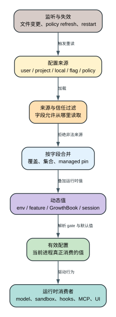

# Claude Code CLI 2.1.235 Settings、Feature Flags 与 Managed Policy

Claude Code 的配置不是一个 JSON 文件，而是一组来源、作用域、信任等级和动态值共同形成的有效配置。用户看到的同一个字段，可能来自 user settings、project settings、local settings、命令行 `--settings`/flags、企业 managed policy、环境变量、GrowthBook/feature value 或当前 session state。要解释“为什么这个开关没有生效”，必须先回答它属于哪类状态、允许从哪些来源读取、谁能覆盖谁、是否在启动后刷新。进程 store、四种 merge、`ConfigChange` 和消费者刷新模式见 [Settings 解析、合并与热重载专题](settings-resolution-and-reload.md)；远端求值、fresh/disk/default、exposure、刷新和账号切换见 [Feature Flags 与 Remote Config 专题](feature-flags-remote-config.md)。

## 60 秒理解“有效配置”

**读者问题：** 为什么项目里明明写了 `sandbox.disabled=true`，运行时仍然启用隔离；或者 feature key 已存在，命令却没有出现？

**一句话模型：** 客户端先按字段过滤不可信来源，再用该字段自己的覆盖、集合或 managed-pin 语义合并五层 settings，随后叠加环境与动态 feature 值；只有最终有效值被可达消费者读取，配置才真正改变行为。



贯穿场景：项目 settings 试图关闭 filesystem isolation，本机 local settings 选择模型，命令行又指定另一个模型，企业 policy 固定网络 allowlist。安全字段会先拒绝 project/local 来源；模型标量由更高有效来源覆盖；网络规则按 managed 约束合并。即使 bundle 中存在一个 feature key，若远程值、平台 gate 或消费分支未满足，UI/命令仍不会出现。

| 阶段 | 输入 | 决策 | 输出 | 常见误判 |
| --- | --- | --- | --- | --- |
| Source loading | user/project/local/flag/policy 文件与参数 | 本次允许加载哪些普通来源 | 候选配置层 | `--setting-sources user` 能绕过 policy |
| Field trust | 字段、来源和 workspace 信任 | 安全字段是否接受 project/local | 允许参与合并的值 | JSON 能解析就一定生效 |
| Merge | 标量、规则集合、hooks、permissions | 覆盖、累积、去重或 managed pin | 静态有效 settings | 所有字段都是“后写覆盖前写” |
| Dynamic gates | env、feature、GrowthBook、session/platform | 默认值、远程值和可达条件 | 当前运行值 | 搜到 feature key 就等于功能已交付 |
| Consumer | model/sandbox/MCP/UI 等读取点 | 是否真正消费该值 | 用户可观察行为 | 改文件后所有对象都会热刷新 |

后文会把 source precedence、field merge、feature reachability 和 policy lifecycle 分开讲，并保留每个关键字段的来源限制、默认值、刷新和 fail-closed 细节。

## 五层 settings 模型

`reverse/javascript/cli.readable.js` 39176-39215 暴露了五个核心 settings source：

```text
userSettings
  < projectSettings
  < localSettings
  < flagSettings
  < policySettings
```

这里的数组顺序是从普通可写来源走向更高控制来源。对应含义是：

| Source | 典型载体 | 作用域 | 主要用途 |
| --- | --- | --- | --- |
| `userSettings` | 用户配置目录的 settings | 当前用户 | 个人默认、UI、模型、环境、工具偏好 |
| `projectSettings` | `.claude/settings.json` | 项目共享 | 团队规则、hooks、permissions、MCP |
| `localSettings` | `.claude/settings.local.json` | 当前项目本机 | 不提交的本地覆盖 |
| `flagSettings` | CLI `--settings`、参数派生值 | 当前进程 | 一次运行的显式覆盖 |
| `policySettings` | managed settings、registry、policy helper | 组织/设备 | 管理员强制约束和不可降级策略 |

`--setting-sources` 只能选择 user/project/local 这三个普通来源；实现仍会加入 `flagSettings` 与 `policySettings`。所以“只加载 user”不等于“绕过 managed policy”，也不应被写成一种策略逃逸方式。

当前官方 [Settings](https://code.claude.com/docs/en/settings) 给出的普通顺序是 managed > command line > local > project > user，同时提醒 permission rules 和安全敏感字段存在例外。`public.settings-precedence` 保存原句；本版五层 source 构造登记为 Static。

`probe.settings-layer-precedence` 再使用四个不同 model 值做运行确认：加载 user/project/local 并提供 `--settings` 时最终 model 为 flag 的 `claude-opus-4-6`；移除 flag 后 local 的 `claude-opus-4-5` 胜出；限制为 `--setting-sources user` 后得到 user 的 `claude-haiku-4-5`。这些值进入真实 Messages request，并非只读取配置文件后打印。

macOS managed settings 来自固定系统目录，探针没有修改管理员路径，因此没有伪造 policy 胜出结果。managed > CLI 仍由官方主张和真实静态 merge 分支证明。这种分层写法比声称“所有五层都 probe 过”更准确。

### 谁持有有效配置

readable JS `1303-1360` 的进程级 store 同时持有 `mergedSettings`、每来源缓存、每文件解析缓存、policy 派生缓存、internal-write 时间、enabled sources、`epoch` 和两类 signal。`invalidateAll()` 会推进 epoch 并清空这些派生状态，但不会修改磁盘，也不会自动重建全部 client。这个 owner 模型决定了“watcher 看见文件变化”与“某个子系统已经采用新值”之间必然还有一段生命周期。

### `policySettings` 内部不是一层

`41421-41676` 还把 managed policy 拆成 helper、remote、MDM/registry、managed file、SDK parent slice、HKCU fallback 和 host model overlay：

- 非 remote-armed helper 成功后可以作为当前 policy 输出；
- remote、MDM/registry、managed file 形成 admin tier 候选，第一有效对象是主要 admin winner；
-限制性开关和 env 仍可跨 admin tier 组合，不能只看 winner 文件；
- `parentSettingsBehavior=merge` 只允许 parent 的 restrictive slice 进入，包括 deny/ask、managed-only lock、sandbox 收紧和 MCP deny，不接纳任意放宽；
- host-managed provider 只得到专用 model overlay，helper/env 等高风险字段会被剥离。

因此 `get_settings.sources` 中的 `policySettings` 是组合结果，不是某个单一文件的原样内容。

## 合并不是所有字段都用同一算法

最容易误导用户的说法是“后面的配置覆盖前面的配置”。实际字段至少有四种合并语义：

1. **通用深合并**：普通 object 由 `mergeWith` 递归合并，普通数组拼接后去重；同一个 nested object 可以同时来自多个文件。
2. **字段级特例**：`fallbackModel` 的高层数组整组替换；`extraKnownMarketplaces` 按 marketplace key 合并；policy 的 `availableModels/enforceAvailableModels` 在通用 merge 后重新 pin。
3. **专用 resolver/规则集合**：permissions、hooks、MCP allow/deny、sandbox 等绕过“最终 object 就是答案”的假设，按自己的集合、信任和裁决顺序解释。
4. **受限来源与 managed pin**：`J0e` 一类安全读取只遍历 policy/flag/user；部分 managed boolean 只能收紧，project/local 根本没有参赛资格。

两个 marketplace alias 也不是独立 merge key：`additionalMarketplaces` 和 `allowedMarketplaces` 会在单文件解析期分别改写为 `extraKnownMarketplaces`、`strictKnownMarketplaces`；同文件同时写 alias 与 canonical 时 alias 被忽略并告警。

因此版本分析需要记录的不只是 schema key，而是每个关键字段的 merge strategy、allowed sources 和 fail-closed 条件。

## 安全字段为什么拒绝项目配置

项目仓库是潜在不可信输入。如果克隆一个仓库就能通过 `.claude/settings.json` 关闭 filesystem isolation、替换 sandbox runtime、允许 Apple Events 或运行 credential helper，那么 workspace trust 之前就已经失去意义。

2.1.235 的 sandbox schema 在 `reverse/javascript/cli.readable.js` 32614-32646 直接写明多项来源限制：

- `network.strictAllowlist` 只接受 user、managed/policy 或 CLI settings，忽略 project/local；
- TLS termination 路径同样忽略 project/local；
- filesystem isolation 的 `disabled` 只接受受控来源；
- managed settings 一旦配置 filesystem restrictions，普通来源不能关闭 isolation；
- `bwrapPath`、`socatPath` 只接受 admin-controlled managed settings；
- `allowAppleEvents` 不接受 project/local，默认 false；
- `failIfUnavailable` 可让 sandbox 启动失败变成进程启动失败，而不是警告后 unsandboxed 继续。

这类字段的重点不是默认值本身，而是“谁有权写”。企业风控强度取决于 policy 能否锁住降级入口，而不只取决于 CLI 是否实现了 sandbox。

## Permissions 的规则优先级与 settings 来源是两件事

官方权限文档的固定摘录说明 permission rules 按 `deny -> ask -> allow` 解释，第一命中决定结果，具体度不改变这个顺序。settings source precedence 决定哪些规则进入有效集合；permission precedence 决定集合中的规则如何裁决。

例如：

- managed policy 提供 `deny Bash(aws *)`；
- project settings 提供 `allow Bash(aws s3 ls *)`；
- 即使 project rule 更具体，deny 阶段仍先命中；
- `--setting-sources project` 也不会移除 policy layer。

把这两套优先级混为一谈，会错误地建议用户用更具体 allow 覆盖企业 deny。

## Environment 与 settings 的关系

环境变量不是独立于 settings 的“第六个 JSON 文件”。2.1.235 将部分 settings 的 `env` 注入到进程环境代理，也把某些旧偏好迁移成 settings。例如 `reverse/javascript/cli.readable.js` 595195-595206 会把旧 `autoUpdates: false` 迁移为 user settings 中的 `env.DISABLE_AUTOUPDATER=1`，并记录迁移成功或写入失败。

关键问题是每个变量的读取时机：

- provider selectors、base URL、auth 通常在请求/客户端构造时读取；
- UI/terminal flags 在 TUI 初始化时读取；
- `DISABLE_TELEMETRY`、`DO_NOT_TRACK` 等决定非必要流量和 exporter；
- timeout/concurrency/token budget 可能在工具或请求创建时读取；
- 部分环境代理支持进程内更新，部分库在初始化后已经缓存。

因此“改了环境变量但当前会话没变化”需要检查值是否已经被初始化对象捕获，不能一律建议重启，也不能一律宣称热更新。

## Feature flag 不等于已交付功能

机器清单 [feature-flags.txt](source-inventory/feature-flags.txt) 和 [feature-flag-callsites.jsonl](source-inventory/feature-flag-callsites.jsonl) 记录 bundle 中出现的稳定 flag key 与调用点。它们只能证明客户端存在读取路径，不能单独证明：

- 当前账户拿到 true；
- 远端服务支持对应协议；
- 所有 prerequisite 都满足；
- UI 命令已对用户显示；
- 功能在所有 provider 可用。

2.1.235 同时存在 baked default、settings gate、provider gate、account/org capability 和 remote feature value。它还保留 environment/config override 的导出名与死代码外形，但本版 `getEnvironmentOverrides()` 在解析 `CLAUDE_INTERNAL_FC_OVERRIDES` 前提前返回，config override 读写也是 no-op；不能把它列为当前可用门。一个功能真正可用，通常需要多门同时打开。

### 建议的 feature 可达性表

| 维度 | 要记录的内容 |
| --- | --- |
| key | 稳定 flag/settings/env 名 |
| default | bundle 内默认值 |
| source | baked default、GrowthBook、account API；environment/config override 在本版不可达 |
| provider gate | first-party only 或云 provider 限制 |
| policy gate | managed setting 是否可禁用/强制 |
| surface gate | 命令、工具或 UI 是否注册 |
| protocol gate | endpoint/beta/SSE subtype 是否存在 |
| probe | 精确二进制是否触发成功路径 |

只有 key 命中而没有 surface/protocol/probe，应标成 `Static` 或 `Boundary`，不能写成“用户已经能用”。

## Managed policy 的控制面

根 settings schema 在 readable JS 40285 附近包含 `policyHelper` 与 `policyHelpers`。后者支持按 macOS/Linux/Windows/WSL 选择 helper、inline script、refresh interval、静态 default settings 和 fallback chain。这里管理的是“如何得到有效政策”，不是某个单独 permission rule。

有效 managed policy 可以控制：

- permission rules 和 permission modes；
- sandbox availability、network/domain、filesystem、credentials；
- MCP server allow/deny 与 strict config；
- hooks、helpers、process wrapper；
- update、telemetry、login/provider 与组织功能；
- 某些 UI/command surface 是否出现；
- project settings 的哪些部分被接受。

`policyHelper` 执行失败必须记录是沿用静态 default、保留上次值还是启动失败。只写“支持 managed settings”无法回答真实风控问题。

### Helper 的实际执行合同

| 项目 | `2.1.235` 行为 |
| --- | --- |
| 默认 timeout | 10 秒 |
| stdout 上限 | 1 MiB |
| refresh | `0` 不刷新；非 0 至少 60 秒；`refreshInFlight` 禁止重叠 |
| stdout envelope | `managedSettings`、`claudeMd`、`appendSystemPrompt` |
| singular helper | 不支持 inline script |
| remote-armed helper | 禁止 inline script，必须满足 path 规范、verification 和 consent |

刷新失败时的状态转换是确定的：有 static default 就从 helper 切到 default；没有 default 就保留当前有效 policy。helper 恢复后再替换 default。per-OS static default 自身非法会 startup-fatal，因为一份无法验证的 fallback 比暂时没有 helper 更危险。

remote-armed helper 还记录 `remoteArmGeneration`。执行期间 consent/payload 变化，即使子进程已经返回成功 JSON，输出也会被丢弃；这防止用户批准 A 后实际应用 B。

### Remote managed settings 不是盲信缓存

remote settings 优先尝试 Storage v5 subscription，失败或 view stand down 时保留 disk probe。cache 上限为 2 MiB；cache file 命中 symlink `ELOOP` 时按 absent 处理；account change 会 reset 所有 session/verified/consented payload 并让旧 view stand down。

未验证 payload 的 `env` 只保留 allowlist。危险 shell/helper/hook/`claudeMd` 路径要求当前 `sessionCache`、`verifiedPayload`、`consentedPayload` 指向同一个 payload；否则只能停留在受限视图，不能借远端缓存获得本地代码执行权。

## Lifecycle：启动、监听、刷新、失效

settings 系统维护 internal-write 时间、enabled source cache 和全局 epoch。不同子系统对配置变化的响应不同：

当前官方文档说明大多数 user/project/local/managed 设置会在运行中重新加载并触发 ConfigChange，对应 `public.settings-live-reload`。这是一条当前产品主张；2.1.235 每个字段是否热更新仍需看具体 consumer 是否重读，不能因为 watcher 存在就把所有初始化对象写成动态刷新。

- 文件 watcher 等待写稳定 1000 ms、轮询 500 ms；普通删除 grace 约 1700 ms，Storage v5 user settings 约 3200 ms；
- 本进程原子写后的 watcher echo 在 5000 ms 内被抑制；MDM 每 30 分钟 poll；flag settings 不由文件 watcher 监听；
- 外部普通变更先执行 `ConfigChange`。Hook 阻断时当前进程保留旧 cache，但磁盘文件不会回滚；`policy_settings` 结果被强制 non-blocking，普通 Hook 不能 veto 管理员政策；
- 放行后 `invalidateAll()` 清 merged/per-source/parsed/policy cache，再发 source-specific changed signal；
- sandbox 订阅 signal 后更新 runtime config；plugin hooks 先比较 plugin-affecting snapshot，无关变化明确跳过 reload；UI selector 可重绘；
- provider/auth/client、已发 request、已运行 tool、已有 subagent/daemon 是否更新，要看各自重建边界，不能从 watcher 存在推断；
- policy helper refresh 走自己的 helper/default/retain/recover 状态机；background agent 已复制的上下文不会自动等同于主会话最新状态。

跨版本比较必须关注 lifecycle，而不仅是新增 key。新增字段但未接入 reload path，和运行中可刷新是两种不同能力。

## 典型故障定位

### “我改了 project settings，但 sandbox 还是没关”

先看该字段是否明确忽略 project/local，再看 managed policy 是否已配置 filesystem restrictions。对这类字段，改 project 文件本来就不会生效。

### “更具体的 allow 为什么赢不了 deny”

settings source 只决定规则集合；permissions 仍按 deny、ask、allow 顺序裁决。具体度不改变阶段顺序。

### “设置了 flag，命令还是不存在”

检查 provider、account/org capability、command registration 和 protocol gate。flag key 存在不是成功 probe。

### “设置了 `CLAUDE_INTERNAL_FC_OVERRIDES` 仍没变化”

不要继续猜 JSON 语法。本版 override parse 分支不可达，精确二进制在禁用在线求值时把 `tengu_ccr_bridge` override 设为 true，doctor 仍报告 rollout 无法验证。应检查真实 feature service、账号/org、provider、policy 和 consumer surface，而不是依赖该内部变量。

### “企业配置偶尔消失”

检查 remote Storage v5 是否 stand down 到 disk、cache 是否超过 2 MiB、account reset、policy helper refresh、10 秒 timeout、static default、当前 serving 状态和 consent/verification generation；不要只检查启动时文件。

## 用户影响与成本

- 设置来源过多会提高诊断成本，因此 UI/doctor 应展示最终值与来源，而不是只展示值。
- project-local 可写配置若能触及高风险字段，会形成供应链入口；本版对多项 sandbox 字段做了来源隔离。
- managed-only 限制提高安全性，但错误 policy 也可能让 CLI fail closed，部署前需要 staged validation。
- feature flag 动态化便于灰度，但会让同一版本不同账户行为不同；版本归档必须保存 bundle default 和 probe 环境边界。
- env 注入可能把凭据传播到子进程；源码因此维护 credential/environment 分类与 scrub 路径。

## 微小但关键的特性

- `--setting-sources` 不接受 `policy` 作为可删除来源，policy 始终加入。
- local settings 被标成 project scope、gitignored，不等于 user settings。
- `strictAllowlist` 只约束 sandboxed commands；in-process `WebFetch` 需要自己的权限控制。
- filesystem isolation 关闭时，network isolation 仍可保留；这两层不能合并成一个“sandbox on/off”。
- `allowAppleEvents` 会显著改变 macOS 隔离边界，默认 false 且不接受项目配置。
- `failIfUnavailable` 决定 sandbox 不可用时是 warning 后继续还是启动失败。
- `DISABLE_AUTOUPDATER` 既有历史环境路径，也有 settings 迁移路径。

## 证据与边界

结构化证据条目：`settings.layer-order`、`settings.managed-sandbox-gates`、`settings.managed-permission-lock`、`settings.managed-cli-permission-lock`、`update.settings-migration`、`public.settings-precedence`、`public.settings-live-reload`、`probe.settings-layer-precedence`。字段目录见 [root-settings-schema.jsonl](source-inventory/root-settings-schema.jsonl)，但 schema 行只证明声明；`staticEvidenceKind=declaration` 会把这种证据与真实执行分支分开。managed-only permission 的运行证据分别落在规则聚合只返回 `policySettings`，以及 CLI/session allow rule 在 permission context 构造前被清空两个分支。Probe 的命令、受控值、最终 request model 和 exit status 见 [精确二进制运行证据指南](runtime-probe-index.md)。

客户端能证明本地 precedence、source restrictions 和 policy hook。组织后台如何下发 entitlement、服务端如何做账户风控、某个用户实时拿到什么 flag 不在静态 bundle 内，必须保留为运行时或服务端边界。
