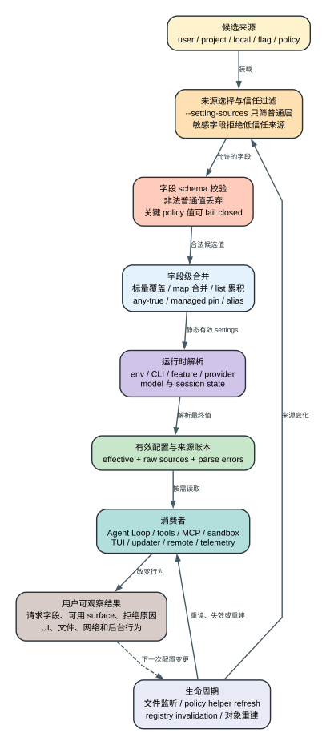

# Claude Code CLI 2.1.235 Settings 全字段参考

> 版本边界：本文只解释本仓库 `2.1.235` 分支。主清单来自 [`root-settings-schema.jsonl`](source-inventory/root-settings-schema.jsonl)：156 个 direct property 和 4 个 spread 记录。字段出现在 schema 中只证明客户端接受或识别该名字；只有定位到读取、决策或状态变化路径时，本文才标为 `Static consumer`。

先读 [Settings 解析、合并与热重载专题](settings-resolution-and-reload.md)：它解释进程级 store、五层与 admin tier、四种 merge、`ConfigChange`、删除 grace、policy helper 恢复以及为什么不同字段不会同时刷新。本文随后承担逐字段字典和精确覆盖合同。

## 60 秒模型：settings 不是一个 JSON 文件

**读者问题：** 为什么同一个字段写进 `.claude/settings.json` 有时生效、有时被忽略，甚至会让程序在启动时直接退出？

**一句话模型：** Claude Code 先装载五类候选来源，再按字段做信任过滤、校验和专用 merge，之后叠加环境变量、CLI/session 与动态能力门；消费者最终读到的才是运行值。



贯穿场景：企业在 policy 中设置 `availableModels`、`allowedMcpServers` 和 `sandbox`；项目仓库设置 `model`、`hooks`；开发者在 local settings 改 `theme`；本次启动再用 `--settings` 指定模型。`model` 的真实探针证明 flag 层能压过 local/project/user；MCP 和 sandbox 还要经过限制性规则；项目若尝试开启 `remoteControlAtStartup` 会被拒绝；最后 Agent Loop、MCP registry、sandbox 和 TUI 各自读取有效值。改文件之后，能否立即变化仍取决于消费者是重读配置、失效缓存，还是只在启动时捕获值。

| 阶段 | 状态 owner | 输入 | 结果 | 用户会看到什么 |
| --- | --- | --- | --- | --- |
| Source loading | settings loader | user/project/local/flag/policy | 候选层；`--setting-sources` 只筛 user/project/local | 文件存在不代表被加载 |
| Trust filter | 字段专用 resolver | 字段、来源、workspace/policy 信任 | 忽略不允许的 project/local 值 | 配置“写了但不生效” |
| Validation | root schema / strict policy parser | 原始 JSON 值 | 合法值、丢弃值、fail-closed 值或启动错误 | warning、设置错误、直接退出 |
| Merge | 字段/子系统 owner | 多层合法候选 | 标量 winner、map、集合、any-true、managed pin | 最终值不一定来自最高文件的整块对象 |
| Runtime resolution | env/model/provider/session owner | 静态 settings + env + CLI + feature/account state | 当前会话实际值 | 同版本不同环境表现不同 |
| Consumer | Agent Loop、tool、MCP、sandbox、TUI 等 | 当前有效值 | 请求、工具面、网络/文件/UI 行为 | 功能开启、隐藏、拒绝或刷新 |

## 证据、类型与 merge 读法

五层名称和启用顺序在 `reverse/javascript/cli.readable.js` 39176-39215；根 schema 和 4 个 spread 在 40275-40285；普通字段的容错与关键 policy 字段的 fail-closed 处理在 40287-40425。这里不能把“层顺序”机械理解为每个字段都后写覆盖：`disableClaudeAiConnectors` 是 any-source-true，MCP deny 优先于 allow，HTTP hook allowlist 会跨来源合并，部分对象整块取 winner，部分 map 又有自己的 key 级语义。

| 标记 | 含义 |
| --- | --- |
| `string` / `boolean` / `number` | 对应字符串、布尔、数字；`int` 表示整数约束 |
| `enum(a/b)` | 只接受列出的字符串 |
| `array<T>` / `map<K,V>` / `object` | 数组、字典、结构化对象；不能据类型推断 merge |
| `未声明` | schema 使用 `optional()`，没有 `.default()`；描述里的产品默认仍会在 consumer 解析 |
| `catch -> unset` | 非法值被转为 `undefined`，不会成为有效值 |
| `Declaration` | 已证明 schema 声明，未证明独立 consumer 或可达成功路径 |
| `Static consumer` | `2.1.235` readable JS 中找到实际读取或决策路径；仍不等于本机账户已触发 |
| `Alias -> Static consumer` | 字段在解析期改写为 canonical key，运行消费者读取 canonical key；alias 不形成第二份状态 |
| `Probe` | 精确 `2.1.235` 二进制在受控输入下观察到真实 request/state sequence；仍只证明报告列出的路径 |

156 个 direct key 的互斥分级是：`Probe=2`、`Alias -> Static consumer=2`、`Declaration=3`、其余 `Static consumer=149`。三个 declaration-only 字段是 `$schema`、`quietHours`、`sshConfigs`；两个 alias 是 `additionalMarketplaces`、`allowedMarketplaces`。

重要消费者定位：凭据 helper 87433-87693；model request 271832-271842、allowlist 158008-158129/271855-271873；MCP allowlist 274256-274293；tool/permission/hook 主管线 316092-316487；sandbox 来源约束 32614-32646；plugin sideload policy 160531-160539/185469-190866；auto-memory 88660-88707/115078/267649；auto-compact 216024-216028/262454-263378；checkpoint 194602-194804；跨会话消息 306333-306424；用户配置 UI 和持久值投影 332541-332817。

## 1. 配置基础、凭据与策略装载

| 字段 | 类型 / 缺省 | 来源、merge 与生命周期 | 消费者、用户影响、风险与证据 |
| --- | --- | --- | --- |
| `$schema` | `string`；未声明 | 仅编辑器/JSON Schema 引用；不参与运行时 merge。 | **Declaration**：除 schema 自身外未发现 consumer。写错只影响编辑体验，不应被解释为功能开关。 |
| `apiKeyHelper` | `string` 路径；未声明 | 普通候选层；凭据解析时执行，结果不是静态 key。 | **Static consumer 87433-87455**：可成为 `apiKeySource`。风险是本地进程执行与 secret 输出；失败会让 API key 路径不可用。 |
| `proxyAuthHelper` | `string` shell command；未声明 | 在代理认证需要时运行，输出 `Proxy-Authorization` 值。 | **Static consumer 58302-58315**：影响企业代理连接；命令执行、header 泄露和超时是主要风险。 |
| `awsCredentialExport` | `string` 路径；未声明 | AWS provider 凭据导出路径，按 provider 初始化/刷新读取。 | **Static consumer 86566-86719**：影响 Bedrock 凭据；错误输出或环境污染会导致认证失败。 |
| `awsAuthRefresh` | `string` 路径；未声明 | AWS 认证刷新命令；不是每个请求都固定重跑。 | **Static consumer 86556-86693**：过期凭据恢复；外部命令副作用和刷新失败需单独诊断。 |
| `gcpAuthRefresh` | `string` command；未声明 | GCP/Vertex 认证刷新入口。 | **Static consumer 86760-86809**：决定 token 过期后的恢复；命令不可用会暴露为 provider auth 失败。 |
| `processWrapper` | `string` argv prefix；未声明 | 只接受 managed、flag/SDK settings、user，顺序为 env `CLAUDE_CODE_PROCESS_WRAPPER` 更高；project/local 忽略。 | **Static consumer 479030-479159**：包装 supervisor/workers 等后台进程。错误 wrapper 会阻断进程启动，也会改变审计与沙箱边界。 |
| `policyHelper` | helper `object`；未声明 | 仅 admin policy；支持 `path`、`timeoutMs>=1000`、`refreshIntervalMs=0或>=60000`。非法普通值忽略，strict policy 有专用诊断。 | **Static consumer 40310-42466**：动态生成 managed settings。helper 失败不能被描述成简单“回退”：要看是否有 per-OS/static payload 或保留当前策略。 |
| `policyHelpers` | platform map；未声明 | 仅 admin policy；macOS/Linux/Windows/WSL 链选择 helper，`defaultSettings` 和顶层 `default` 是静态 fallback。 | **Static consumer 40324-42466**：错误 static payload 可 startup-fatal；这是 policy 可用性和 fail-closed 的核心。 |
| `wslInheritsWindowsSettings` | `boolean`；未声明 | 只在管理员 Windows 来源启用；WSL 追加 HKLM/Program Files/HKCU 链，Windows 来源优先，HKCU 还需双重 opt-in。 | **Static consumer 41930-42004**：决定 WSL 是否继承 Windows policy。错误开启会扩大策略来源，未开启会出现主机与 WSL 治理分裂。 |
| `env` | `map<string,string>`；未声明 | 多层对象，进入 Claude Code 会话环境；具体 key 仍有各自读取时机。 | **Static consumer 595199-595206 等**：能改变 provider、telemetry、tool 子进程。凭据传播和初始化后缓存是主要风险。 |
| `parentSettingsBehavior` | `enum(first-wins/merge)`；默认 `first-wins` | 有 admin tier 时控制 SDK parent managed settings：丢弃 parent，或只把 restrictive-filtered parent 合到 admin winner 之下。 | **Static consumer（schema + policy merge path）**：`merge` 不是任意放宽；误解会错误估计宿主 SDK 的政策权力。 |
| `forceRemoteSettingsRefresh` | `boolean`；未声明 | 仅 managed；any policy source true 后，启动必须拿到新鲜 remote settings。 | **Static consumer 41651、603719、630294**：刷新失败时退出，换取政策新鲜度；直接影响启动可用性。 |

## 2. 文件发现、健康提醒、持久化与 Skills

| 字段 | 类型 / 缺省 | 来源、merge 与生命周期 | 消费者、用户影响、风险与证据 |
| --- | --- | --- | --- |
| `fileSuggestion` | `{type:"command",command:string}`；未声明 | 候选层合并后由 `@` 文件建议读取。 | **Static consumer 406497-406499**：可替换文件候选生成；命令性能和输出可信度影响输入延迟。 |
| `respectGitignore` | `boolean`；产品默认 true | 用户配置持久化；`.ignore` 始终尊重。 | **Static consumer 329801-329817**：影响文件 picker 可见面，false 可能暴露 build/secret 文件名并增大扫描量。 |
| `breakReminder` | object；`enabled=false`、30 分钟、休息阈值 10 分钟 | 内部 opt-in，按连续活动/空闲状态重置和重复触发。 | **Static consumer 438645 附近**：只提示不阻塞；错误阈值主要是打扰和本地活动推断风险。 |
| `quietHours` | object；`enabled=false`，时间为本地 `HH:MM` | 可跨午夜；每 session 最多软提示一次。 | **Declaration**：除根 schema 未发现独立 consumer，不能断言 2.1.235 已可达。 |
| `cleanupPeriodDays` | positive `int`；产品默认 30 | 控制 transcript/skills trash 等清理周期；不是“禁用持久化”。 | **Static consumer 469804-470819**：值过大增加磁盘和隐私保留；完全不写要用 `--no-session-persistence`。 |
| `syncClaudeAiSkills` | `boolean`；server capability 决定是否可用，仅 `false` 能本地关 | user/managed 关闭会隐藏并下次启动移入 trash；local/flag 只限 workspace/session；project 不读；10 分钟重同步。 | **Static consumer 40299、41436、211703**：影响跨设备 skill 面。禁用后的恢复是重下载，不是从 trash 恢复。 |
| `skillListingMaxDescChars` | positive `int`；默认 1536 chars | skill listing 构造时截断单项描述。 | **Static consumer 281961**：提高值增加每轮上下文/token 成本；降低值可能削弱 skill 选择准确性。 |
| `skillListingBudgetFraction` | `number`，`0<x<=1`；默认 0.01 | 控制总 skill listing 字符预算，超出时缩短描述。 | **Static consumer 281964-282020**：是质量/成本旋钮，不是上下文窗口 token 的精确百分比。 |
| `skillOverrides` | `map<string,enum(on/name-only/user-invocable-only/off)>`；缺省 on | 按 skill 名覆盖展示和模型可见性。 | **Static consumer**：`name-only` 降上下文，`user-invocable-only` 只保留 `/name`，`off` 两端隐藏；误配会让模型“看不见”仍可手动调用的 skill。 |
| `disableBundledSkills` | `boolean`；未声明 | settings 或同名 env 关闭内置 skills/workflows，不影响 plugin、项目 skill/command；内置 slash command 仍可键入但对模型隐藏。 | **Static consumer**：缩小内置行为面；风险是工作流提示与命令发现不一致。 |
| `disableSkillShellExecution` | `boolean`；未声明 | 对 user/project/plugin skill 和自定义 slash command 的 inline shell 生效。 | **Static consumer**：命令替换为 placeholder，不执行。降低供应链风险，但会改变 skill 语义。 |

## 3. Git、权限、模型与 MCP

| 字段 | 类型 / 缺省 | 来源、merge 与生命周期 | 消费者、用户影响、风险与证据 |
| --- | --- | --- | --- |
| `attribution` | `{commit?,pr?,sessionUrl?}`；文本用标准值，`sessionUrl` 默认 true | 对象字段控制 commit/PR 文本；空字符串显式隐藏。 | **Static consumer**：影响生成的版本控制文本和会话 URL 暴露；组织模板与用户隐私需权衡。 |
| `includeCoAuthoredBy` | `boolean`；默认 true；deprecated | 旧字段，迁移目标是 `attribution`。 | **Static consumer**：保留兼容，不应与新字段产生双重归因假设。 |
| `includeGitInstructions` | `boolean`；默认 true | 控制内置 commit/PR 工作流说明是否进入 system prompt。 | **Static consumer**：关闭可省少量上下文，但会降低模型对仓库发布规范的默认遵循。 |
| `permissions` | permission object；未声明 | 多来源规则按专用聚合；来源 precedence 与 `deny -> ask -> allow` 裁决顺序是两件事。 | **Static consumer 316092-316487**：决定工具是否执行。错误 allow 可能产生真实副作用；deny/ask 不能靠更具体 allow 覆盖。 |
| `model` | `string`；未声明 | 普通层标量；真实 probe 证明 flag > local > project > user，CLI/session 解析还可进一步覆盖。 | **Probe + consumer 271832-271842**：受控值进入真实 Messages request。别把文件里的 alias 直接当最终 provider model ID。 |
| `fallbackModel` | `array<string>`；未声明 | 通用 merge 的特例：高层整数组替换，不与低层去重并集；CLI `--fallback-model` 更高，`default` 展开为默认模型。 | **Probe consumer**：受控 529 序列观察到主模型 3 次后切到 fallback 并成功；root settings 的来源摄入仍由 Static 路径证明。可能改变质量/成本，每个新 turn 仍可能回主模型。 |
| `availableModels` | `array<string>`；undefined=全可见，空数组=只默认模型 | 支持 family、version prefix、full ID；企业限制。非法 policy 值 fail closed 为空 allowlist。 | **Static consumer 158008-158129、271855-271873**：限制 picker、subagent 和 fallback；被禁模型响应可直接丢弃。 |
| `enforceAvailableModels` | `boolean`；未声明 | 非空 allowlist 时连 Default 解析也受约束；空/未设无效。非法 policy 值按 true 处理。 | **Static consumer**：防止“Default”绕过 allowlist；误配会把默认模型重定向到第一允许项。 |
| `modelOverrides` | `map<string,string>`；未声明 | Anthropic model ID 到 provider-specific ID 的映射，通常 managed。 | **Static consumer**：影响 Bedrock/Vertex/Foundry 等实际请求模型；错误 ARN/ID 会在 provider 侧失败。 |
| `enableAllProjectMcpServers` | `boolean`；未声明 | 项目 MCP 信任快捷开关。 | **Static consumer**：减少逐项批准，但扩大仓库配置可启动的服务面。 |
| `enabledMcpjsonServers` | `array<string>`；未声明 | `.mcp.json` 已批准 server 名单。 | **Static consumer**：与项目 trust/实际配置共同决定连接；名称存在不证明 server 可连。 |
| `disabledMcpjsonServers` | `array<string>`；未声明 | `.mcp.json` 拒绝名单。 | **Static consumer**：显式阻断项目 server；保留旧名称可能让新同名配置继续被拒。 |
| `disableClaudeAiConnectors` | `boolean`；默认未声明；any-source-true | 任一来源 true 即阻断自动获取 cloud connectors；低层 false 不能覆盖高/其他层 true；显式传入 proxy 仍走普通 trust。 | **Static consumer 426353 等**：减少云连接面，但不是全局 MCP kill switch。 |
| `allowedMcpServers` | `array<server matcher>`；undefined=全允许，空=全拒 | 跨 scope 企业 allowlist；invalid policy 值 fail closed 空数组。 | **Static consumer 274256-274293**：按 name/command/URL matcher。与 deny 同时命中时 deny 胜。 |
| `deniedMcpServers` | `array<server matcher>`；未声明 | 跨来源限制集合；deny 优先 allow。非法整体 policy 值会被丢弃并报不能执行的策略缺口。 | **Static consumer 274256-274293**：阻断已配置 server；错误规则可导致治理缺口或业务不可用。 |

## 4. Hooks、Worktree、Workflows 与企业锁定

| 字段 | 类型 / 缺省 | 来源、merge 与生命周期 | 消费者、用户影响、风险与证据 |
| --- | --- | --- | --- |
| `hooks` | hook event map；未声明 | 多来源 hook 有专用聚合，不是整块标量；修改后涉及 hook registry。 | **Static consumer 316092-316487**：可在工具前后阻断、改输入或追加输出；外部命令/HTTP 是高风险执行面。 |
| `worktree` | object；`baseRef=fresh`、`bgIsolation=worktree` | `symlinkDirectories` 默认空，`sparsePaths` 可启用 cone sparse-checkout；作用于 `--worktree`、EnterWorktree 和 agent isolation。 | **Static consumer**：决定分支基线、磁盘与后台写隔离；`head` 会带入未推送状态，`none` 允许后台直接改主 checkout。 |
| `disableAllHooks` | `boolean`；未声明 | 有效 true 同时关闭 hooks 和 `statusLine` 执行。 | **Static consumer**：紧急 kill switch；会让审计/保护 hook 与 UI 状态脚本一起消失。 |
| `disableAgentView` | `boolean`；未声明 | managed 常用；也可由 env 禁用 agent view/background/daemon。 | **Static consumer**：移除 `claude agents`、`--bg`、`/background` 等 surface，不等于删除 Agent Loop。 |
| `disableRemoteControl` | `boolean`；未声明 | managed 常用，覆盖命令、flag、auto-start 和会话 toggle。 | **Static consumer**：是 RC 总禁用门；降低远程控制面，同时使 web/mobile 接续不可用。 |
| `disableWorkflows` | `boolean`；未声明 | settings/env 关闭 workflow surface；限制性开关应按 consumer 与 enable 值共同解析。 | **Static consumer**：禁用多 Agent workflow，避免额外 token/并发和协作副作用。 |
| `disableArtifact` | `boolean`；未声明 | settings/env 禁用 Artifact 工具。 | **Static consumer**：缩小工具面；可能让依赖 artifact 的流程退化。 |
| `enableArtifact` | `boolean`；feature 可用后 unset 默认 enabled | 用户 enable/disable 偏好仍受产品 capability 和 disable gate。 | **Static consumer**：不能用 `true` 绕过组织/feature 禁用。 |
| `enableWorkflows` | `boolean`；unset 由 plan/default 决定 | 用户偏好，仍受 `disableWorkflows` 与 capability。 | **Static consumer**：同名 enable/disable 不是简单互补，要看限制门优先级。 |
| `workflowSizeGuideline` | `enum(unrestricted/small/medium/large)`；默认 medium | settings 值压过 `/config`，有值时 UI 行隐藏；只是建议，不是硬 cap。 | **Static consumer 288631-288731、518568**：改变 workflow 提示和告警；small<5、medium<15、large<50 agents。 |
| `workflowKeywordTriggerEnabled` | `boolean`；默认 true | 控制 prompt 中 `ultracode` 关键词是否触发 Workflow。 | **Static consumer**：关闭只禁关键词入口，不等于关闭显式 workflow。 |
| `defaultShell` | `enum(bash/powershell)`；默认 bash | 输入框 `!` 命令的 shell；Windows 也不自动翻转。 | **Static consumer**：改变命令语法和可执行环境；错误选择直接导致本地命令失败。 |
| `respondToBashCommands` | `boolean`；默认 true | false 时只把 `!` 命令输出放进上下文，不触发模型回复。 | **Static consumer**：降低调用成本/延迟，但用户不会立即得到解释。 |
| `allowManagedHooksOnly` | `boolean`；仅 managed；未声明 | true 时只保留 policy hooks；非法 policy 值按 true fail closed。 | **Static consumer 40299**：阻断 user/project/local hook，也联动 command plugin source 默认禁用。 |
| `allowedHttpHookUrls` | `array<string pattern>`；undefined=全允许，空=全拒 | 数组跨来源合并；`*` wildcard。 | **Static consumer**：限制 hook 出站 URL；过宽 wildcard 会形成数据外传面，过窄会让 hook 失败。 |
| `httpHookAllowedEnvVars` | `array<string>`；undefined=不附加限制 | 跨来源合并后与每个 hook 的 allowlist 取交集。 | **Static consumer**：控制 header 可插值 env；用于防止 secrets 被 HTTP hook 任意读取。 |
| `allowManagedPermissionRulesOnly` | `boolean`；仅 managed | true 时只尊重 managed allow/deny/ask，忽略 user/project/local/CLI rule。 | **Static consumer**：防止普通层放宽，也会让用户自定义 deny/ask 不再进入规则集。 |
| `allowManagedMcpServersOnly` | `boolean`；仅 managed | 只从 managed 读 allowlist；deny 仍可从所有来源累积。非法值按 true。 | **Static consumer**：用户仍能添加 server，但只能通过管理员 allowlist。 |
| `allowAllClaudeAiMcps` | `boolean`；仅 managed，默认 off | 允许 cloud connectors 与 exclusive `managed-mcp.json` 同时装载。 | **Static consumer**：显式放宽 managed MCP lockdown；误开会扩大云连接面。 |
| `strictPluginOnlyCustomization` | `boolean` 或 `array<skills/agents/hooks/mcp>`；invalid -> unset | 仅 managed；按 surface 阻断非 plugin 自定义，但保留 policy 与 plugin 来源。 | **Static consumer**：与 marketplace allowlist 组合形成端到端供应链控制；单独使用不验证 plugin 来源。 |
| `statusLine` | command object；`refreshInterval>=1`，invalid -> unset | 有事件驱动刷新，也可周期执行；`disableAllHooks` 会一并禁用。 | **Static consumer**：每次执行接收状态 JSON；慢脚本会拖累 UI，脚本也能读取会话元数据。 |
| `prUrlTemplate` | `string`；未声明 | 用 `{host}/{owner}/{repo}/{number}/{url}` 生成 PR badge/inline link。 | **Static consumer**：只负责展示跳转，不验证目标 host；模板错误会产生误导链接。 |
| `footerLinksRegexes` | `array<regex badge>`；invalid entry 删除，整体 invalid -> unset | 只读 user/flag/managed，忽略 project/local；扫描最近最多 256 条合格消息、总尾部 65,536 chars、单块 8,192 chars；每条 regex 最多扫描 200 matches，仅保留最后 20 个候选，最终 footer 最多 5 个。 | **Static consumer 431774-432010**：生成 URL 最长 2,048 chars；模板必须固定 literal origin、使用 allowlisted scheme，替换后 origin 不能漂移，dot-segment 被拒。输出是不可信文本，50ms 以上 pattern 会记录 slow warning。 |
| `subagentStatusLine` | command object；未声明 | 每个 subagent 行把 row context JSON 写到 stdin。 | **Static consumer**：增强 agent panel；高频外部命令会增加进程和延迟成本。 |

## 5. Plugins、登录、OTEL 与输出

| 字段 | 类型 / 缺省 | 来源、merge 与生命周期 | 消费者、用户影响、风险与证据 |
| --- | --- | --- | --- |
| `enabledPlugins` | plugin-id map，值可 boolean/版本约束结构；未声明 | 明确 precedence user<project<local<flag<policy；key 级状态可在 local 用 false 压 project true。 | **Static consumer**：决定 plugin 装载；版本/来源错误会产生 warning 或缺失命令/tool。 |
| `extraKnownMarketplaces` | marketplace map；未声明 | 注册额外 marketplace，常放项目 settings。 | **Static consumer**：注册不等于允许；下载前仍受 strict/blocked policy。仓库可引导供应链来源。 |
| `additionalMarketplaces` | 同上；alias | 解析期改写为 `extraKnownMarketplaces`；同文件同时存在 canonical 时 alias 忽略并警告。 | **Alias -> Static consumer 40951-40967**：运行期只消费 canonical map；旧客户端可能完全忽略 alias，跨版本组织应优先 canonical。 |
| `strictKnownMarketplaces` | `array<source>`；未声明 | 仅 managed；下载前 allowlist，GitHub 可 owner wildcard；不会自动注册来源。 | **Static consumer**：阻止未批准 marketplace 触盘；需与 `extraKnownMarketplaces` 配合。 |
| `allowedMarketplaces` | 同上；managed-only alias | 解析期改写为 `strictKnownMarketplaces`；与 canonical 同文件时 alias 忽略并警告。 | **Alias -> Static consumer 40951-40967**：治理最终读取 canonical allowlist，不能假设所有旧版本都识别 alias。 |
| `blockedMarketplaces` | `array<source>`；未声明 | 仅 managed，下载前 blocklist；支持 GitHub owner wildcard。 | **Static consumer**：在网络/文件写入前阻断；与 allow 同时命中应按 block 处理。 |
| `disableCommandPluginSources` | `boolean`；仅 managed | true 禁止 command marketplace source；unset 跟随 `allowManagedHooksOnly`。 | **Static consumer**：阻止 marketplace 声明的本地命令执行；非法 policy 值按 true。 |
| `disableSideloadFlags` | `boolean`；仅 managed | true 在启动拒绝 `--plugin-dir`、`--plugin-url`、`--agents`、非 SDK `--mcp-config`。 | **Static consumer 160531-160539/190866**：堵 CLI flag 绕过 marketplace policy，但不覆盖所有 MCP API。 |
| `pluginSuggestionMarketplaces` | `array<string>`；仅 managed | 名称还必须已注册且来源与 managed 声明一致；官方 marketplace 有来源例外。 | **Static consumer**：只控制上下文 install suggestion，不自动安装；名字碰撞不会绕过 source match。 |
| `pluginConfigs` | `map<plugin,object>`；未声明 | 非敏感 option 和 MCP config 留 settings，敏感值进 secure storage；plugin ID 带 marketplace。 | **Static consumer**：改变 plugin/MCP 行为；把 secret 放普通 option 会形成落盘风险。 |
| `pluginTrustMessage` | `string`；仅 policy | 追加到安装前 trust warning。 | **Static consumer 160554**：只改变告知文本，不代表 plugin 已审计或自动可信。 |
| `forceLoginMethod` | `enum(claudeai/console/gateway)`；invalid -> unset | managed 可强制，普通有效 settings 也可能提供；gateway 还有 admin-only URL。 | **Static consumer 87613-87693、441628-441634**：不匹配账户会阻断登录/请求。 |
| `forceLoginGatewayUrl` | URL `string`；invalid -> unset | 只接受 admin-controlled managed；忽略 user/project/remote-delivered。 | **Static consumer 441628-441634**：预填并自动连接 gateway；来源限制防止仓库劫持认证 origin。 |
| `forceLoginOrgUUID` | `string` 或 `array<string>`；未声明 | managed 组织 allowlist；非法 policy 值变空数组，即无人可登录。 | **Static consumer 87613、441634**：OAuth 账户不属于任一组织时失败。 |
| `otelHeadersHelper` | `string` path；未声明 | OTEL exporter 需要 header 时执行 helper。 | **Static consumer**：支持短期 header；外部命令、secret 输出、失败重试与 exporter 目标共同决定风险。 |
| `outputStyle` | `string`；未声明 | 进入 prompt/output style resolver，可由 session/UI 变化。 | **Static consumer**：改变回答风格而非模型能力；无效 style 通常回退/不可选。 |
| `viewMode` | `enum(default/verbose/focus)`；invalid -> unset | 启动 transcript 视图偏好。 | **Static consumer**：只改变展示密度，不等于 `verbose` 工具输出。 |
| `language` | `string`；未声明 | 响应和 voice dictation 的首选语言；最终仍受 prompt/session。 | **Static consumer**：影响系统提示和语音识别；不是 locale/编码的全局切换。 |

## 6. Sandbox、交互、模型行为与 Agent 入口

| 字段 | 类型 / 缺省 | 来源、merge 与生命周期 | 消费者、用户影响、风险与证据 |
| --- | --- | --- | --- |
| `skipWebFetchPreflight` | `boolean`；未声明 | 面向严格企业网络，跳过 WebFetch blocklist preflight。 | **Static consumer**：只绕过预检，不等于绕过 tool permission/server policy；误开会减少早期阻断。 |
| `sandbox` | nested object；各子字段有独立缺省/来源 | `strictAllowlist`、TLS、filesystem disabled、Apple Events、bwrap/socat 等有 trusted/managed-only 约束。 | **Static consumer 32614-32646**：控制真实文件/网络/credential 隔离；必须逐子字段解释，不能压成 on/off。 |
| `feedbackSurveyRate` | `number` 0..1；未声明 | eligible 时的展示概率，仍受 pacing/privacy/org gate。 | **Static consumer**：0 关闭抽样，1 也不保证每次显示；影响打扰与反馈采集。 |
| `feedbackDrafts` | `enum(notify/quiet/off)`；默认 notify | 控制 SendFeedback 草稿 tool 和提示表面。 | **Static consumer**：off 完全移除 tool，quiet 只隐藏一行通知；草稿仍涉及本地内容与显式上传流程。 |
| `spinnerTipsEnabled` | `boolean`；未声明 | 用户 UI 偏好，配置变更可重绘。 | **Static consumer**：只控制 spinner tips，不影响 Agent Loop。 |
| `spinnerVerbs` | `{mode:append/replace,verbs:string[]}`；未声明 | append 保留默认，replace 完全替换。 | **Static consumer**：纯文案展示；空 replace 可能让 spinner 缺少动词。 |
| `spinnerTipsOverride` | `{tips:string[],excludeDefault?:boolean}`；默认保留默认 tips | 合并/替换由 `excludeDefault` 决定。 | **Static consumer**：可部署组织提示；内容过长影响终端可读性。 |
| `syntaxHighlightingDisabled` | `boolean`；未声明 | UI diff 渲染偏好。 | **Static consumer**：提高某些终端兼容性，但降低 diff 可扫描性。 |
| `spellcheck` | object；enabled 默认 false，checker 默认 auto，invalid -> unset | 整块只读 user/flag/managed，忽略 project/local；checker 从 aspell/hunspell/ispell 选择。 | **Static consumer**：会启动本地拼写程序并标注输入；来源隔离防止仓库指定可执行程序。 |
| `terminalTitleFromRename` | `boolean`；默认 true | `/rename` 后是否更新 terminal tab title。 | **Static consumer**：false 保留自动主题标题；可能避免敏感会话名出现在终端标签。 |
| `alwaysThinkingEnabled` | `boolean`；absent/true=支持模型自动 thinking，false=禁用 | 还受模型 capability 和显式 thinking 配置。 | **Static consumer**：影响延迟、token 和可见 thinking；不能给不支持模型强开。 |
| `effortLevel` | `enum(low/medium/high/xhigh)`；invalid -> unset | 持久偏好，最终按模型 capability 归一化。 | **Static consumer**：影响质量/延迟/成本；unsupported 档位不能当作已发送。 |
| `ultracode` | `boolean`；invalid -> unset，session-scoped | 通常来自 `--settings` 或 `apply_flag_settings`；要求 workflow enabled 和 xhigh model，不由交互 toggle 持久化。 | **Static consumer**：启用 xhigh + 持续 workflow orchestration，显著增加 token/并发。 |
| `autoCompactWindow` | `int` 100000..1000000；invalid -> unset | env > settings > clientdata/experiment/model default 的 resolver；可由 `/autocompact` 改写。 | **Static consumer 331411-331414、433758**：决定 compaction window，但 threshold 还要减 summary buffer。 |
| `advisorModel` | `string`；未声明 | 还需 advisor enablement、allowlist 和 model pairing。 | **Static consumer**：附加 server-side advisor model；schema 值本身不证明请求已携带。 |
| `fastMode` | `boolean`；默认 false | 持久偏好，仍受 first-party、模型、额度和 session cooldown。 | **Static consumer**：改变服务速度/费率路径；rate limit 后可进入 cooldown。 |
| `fastModePerSessionOptIn` | `boolean`；默认 false | true 时不跨 session 保存开启状态，每个 session 从 off 开始。 | **Static consumer**：降低意外持续高成本/高速模式。 |
| `promptSuggestionEnabled` | `boolean`；默认 true | turn 结束后预测下一 prompt，仍受 capability/host。 | **Static consumer**：会增加预测工作和 UI surface；false 关闭建议而非主模型。 |
| `emojiCompletionEnabled` | `boolean`；默认 true | 控制 `:name:` typeahead 和 inline replacement。 | **Static consumer**：纯输入体验；关闭不改变已输入 Unicode。 |
| `awaySummaryEnabled` | `boolean`；默认 true，internal | 离开 5+ 分钟后 recap；公共 SDK type 暂隐藏。 | **Static consumer**：可能触发额外摘要/展示；属于内部 surface，版本可变。 |
| `showClearContextOnPlanAccept` | `boolean`；默认 false | plan approval dialog 的可选操作。 | **Static consumer**：允许接受计划时清上下文；会牺牲旧历史换窗口空间。 |
| `askUserQuestionTimeout` | `enum(60s/5m/10m/never)`；默认 never，invalid -> unset | 等待问题时按已选答案自动继续。 | **Static consumer**：超时会在无人完成全部选项时继续，自动化更顺但可能误解意图。 |
| `dialogExpiry` | 同枚举；默认 5m，env 可覆盖，invalid -> unset | 只读 trusted source；远程 dialog 和 held cross-session 消息到期采用 no-action 默认，本地 prompt 不受影响。 | **Static consumer 332541、306333-306424**：到期 cancel/drop-with-denial，属于 fail-closed。 |
| `agent` | `string`；未声明 | 主 thread 选择 built-in/custom agent，应用其 prompt/tool/model。 | **Static consumer**：改变 Agent Loop 初始定义；不存在的 agent 应报错/回退，不能当成共享 subagent context。 |
| `modelProposedGoals` | enum（auto/alwaysAsk/disabled）；默认 auto，invalid -> unset | 只读 user/policy/flag，忽略 project/local；typed `/goal` 不受影响。 | **Static consumer 332541**：控制模型能否提议持久 goal 和是否必须审批；来源限制保护 consent。 |

## 7. Cloud、更新、TUI、Voice 与通知渠道

| 字段 | 类型 / 缺省 | 来源、merge 与生命周期 | 消费者、用户影响、风险与证据 |
| --- | --- | --- | --- |
| `companyAnnouncements` | `array<string>`；未声明 | 启动时从多条随机选一条。 | **Static consumer**：组织公告 surface；不是强制阻断或 policy。 |
| `remote` | `{defaultEnvironmentId?:string}`；未声明 | cloud session 默认环境选择。 | **Static consumer**：影响新 cloud session 目标，不证明该 environment 存在或有权限。 |
| `autoUpdatesChannel` | `enum(latest/stable/rc)`；未声明 | 更新 channel 偏好，仍受 disable/update policy。 | **Static consumer 472193-472358**：改变候选版本；schema 描述漏写 rc 但 enum 接受。 |
| `minimumVersion` | `string`；未声明 | 防止切 stable 时降到该版本以下；不是启动硬门。 | **Static consumer 472248-472341**：影响 updater 选版。 |
| `requiredMinimumVersion` | `string`；仅 managed | 运行版本更旧时启动退出并要求更新。 | **Static consumer 410818-410849**：硬性 rollout 下界；错误值可导致全员不可用。 |
| `requiredMaximumVersion` | `string`；仅 managed | 运行版本更新时启动退出并要求安装批准版本。 | **Static consumer 410818-410849**：硬性上界，支持冻结；会阻断紧急新版本。 |
| `plansDirectory` | `string` path；默认用户 plans 目录 | 相对路径按 project root 解析。 | **Static consumer 115739-115916**：改变 plan 落盘位置；需关注仓库提交和敏感计划内容。 |
| `tui` | `enum(default/fullscreen)`；未声明 | fullscreen 等价 no-flicker alt-screen/virtualized scrollback。 | **Static consumer**：决定渲染器；部分设置如 auto-scroll 只在 fullscreen 生效。 |
| `voice` | `{enabled?,mode:hold/tap,autoSubmit?}`；mode 默认 hold | voice 输入状态；语言另由 `language`。 | **Static consumer 525640-526297**：会访问音频/本地识别路径；autoSubmit 只对 hold release 有效。 |
| `channelsEnabled` | `boolean`；managed org gate | Teams/Enterprise 默认 off；Console 无 managed settings 时默认 on。 | **Static consumer 282669-282683**：允许 MCP channel inbound notifications；用户仍需 `--channels` 选 server。 |
| `allowedChannelPlugins` | `array<{marketplace,plugin}>`；undefined 用 Anthropic 默认 | 仅在 `channelsEnabled=true` 时有意义；设置后替换默认 allowlist。 | **Static consumer 282690-282691**：限制谁能推 inbound message；误配会静默缺通知。 |
| `prefersReducedMotion` | `boolean`；未声明 | UI accessibility 偏好，影响 shimmer/flash/animation。 | **Static consumer 630127 等**：减少运动，不应被等同于 screen-reader mode。 |

## 8. Agent 完成条件、上下文、Memory 与组织记忆

| 字段 | 类型 / 缺省 | 来源、merge 与生命周期 | 消费者、用户影响、风险与证据 |
| --- | --- | --- | --- |
| `doneMeansMerged` | `boolean`；internal，未声明 | 改写任务完成语义：PR 可 merge、Monitor 已安排或交付自包含 next step。 | **Static consumer**：可能延长 Agent Loop 和工具操作；不是自动 merge 授权。 |
| `totalTokensReminder` | `enum(off/infinite/fixed/countdown/padded-countdown)`；默认 padded-countdown | env 可覆盖；注入 system、tool batch 后及可选 user turn 后。 | **Static consumer 266873-266902**：直接增加 prompt 内容并影响 Agent 对剩余预算判断；不是 API 真实限额。 |
| `totalTokensReminderBudget` | positive `int`；默认 15000000 | GrowthBook/env 可覆盖，供 padded-countdown 起点。 | **Static consumer 266885-266890**：是任务预算提示，不是模型 context window。 |
| `totalTokensReminderAfterUserTurn` | `boolean`；默认 on | true 时每个普通 user turn 重锚预算并注入 reminder；GB/env 可覆盖。 | **Static consumer 266897-266902**：改变预算语义从 session 累计到 task-turn 重置。 |
| `autoMemoryEnabled` | `boolean`；未声明 | false 阻止本项目 auto-memory 读写。 | **Static consumer 88660、115078、498457**：影响长期连续性与本地隐私；不等于删除已有 memory。 |
| `autoMemoryDirectory` | `string`；默认项目派生 memory 目录 | precedence 明确为 policy > flag > trusted local/project > user；project settings 值因安全检查可被忽略。 | **Static consumer 88707、593529-593530**：改变持久化位置；路径可跨项目污染或暴露敏感内容。 |
| `autoDreamEnabled` | `boolean`；未声明 | 明确值压过 server-side 默认，控制后台 consolidation。 | **Static consumer 267649、498461-498462**：增加后台处理但改善 memory 整理；关闭不删除原条目。 |
| `showThinkingSummaries` | `boolean`；未声明 | 请求 API-side thinking summary 并在对话/transcript 展示。 | **Static consumer 71147**：影响请求 capability、token/延迟和可见内容；provider 可能不支持。 |
| `skipDangerousModePermissionPrompt` | `boolean`；本地 consent 状态 | 记录用户是否接受 bypass-permissions dialog，不是管理员 permission rule。 | **Static consumer 42948、595221**：避免重复提示；删除会重新要求确认。 |
| `skipWorkflowUsageWarning` | `boolean`；internal consent 状态 | workflow auto permission 前的一次性 usage warning。 | **Static consumer 288942-288944**：只记录已告知，不直接授予所有工具权限。 |
| `disableAutoMode` | `enum(disable)`；未声明 | capability-generated permission setting；literal `disable` 关闭 auto mode。 | **Static consumer 94561、277953-277972**：单向禁用值，不能用其他字符串启用。 |
| `sshConfigs` | `array<object>`；port 默认 22，目录默认 remote home | schema 规定 id/name/host/identity/startDirectory，描述建议 managed。 | **Declaration**：除根 schema 未发现独立 `sshConfigs` consumer；不能据字段声明声称 2.1.235 SSH 配置成功路径已验证。 |
| `claudeMd` | `string`；仅 managed/policy | 作为组织管理的 CLAUDE.md-style memory 注入。 | **Static consumer 369910-370035**：直接影响 system/user instruction 面；管理员文本具有高提示权重。 |
| `claudeMdExcludes` | `array<string glob/path>`；未声明 | 只排除 User/Project/Local memory，不能排除 Managed；picomatch 对绝对路径匹配。 | **Static consumer 214185**：减少不需要的项目指令；错误 glob 可能丢上下文但不能绕过组织记忆。 |

## 9. 持久 UI 偏好、Compact、Checkpoint 与跨会话协作

| 字段 | 类型 / 缺省 | 来源、merge 与生命周期 | 消费者、用户影响、风险与证据 |
| --- | --- | --- | --- |
| `theme` | 内置 enum 或 `custom:*`；invalid -> unset | 用户偏好投影到 AppState，运行中可重绘。 | **Static consumer 332552 等**：只改变颜色；custom theme 名存在不证明资源可加载。 |
| `editorMode` | enum（本版常见 default/vim）；invalid -> unset | prompt input keymap 偏好。 | **Static consumer 464315**：改变输入语义；与 terminal shell 无关。 |
| `vimInsertModeRemaps` | `map<string,target>`；invalid -> unset | 只在 vim INSERT 生效，key 必须两字符，target 仅 `<Esc>`。 | **Static consumer 464908**：错误 mapping 被丢弃，避免任意命令宏。 |
| `verbose` | `boolean`；未声明 | AppState 启动读取，显示完整 tool output 而非摘要。 | **Static consumer 630331、597494**：提高可诊断性，也扩大终端和 transcript 中敏感输出。 |
| `preferredNotifChannel` | notification enum；invalid -> unset | OS/terminal notification channel 偏好。 | **Static consumer 437842、472343-472344**：目标 terminal 不支持时仍可能降级。 |
| `autoCompactEnabled` | `boolean`；consumer 默认 true | env `DISABLE_AUTO_COMPACT`/`DISABLE_COMPACT` 可更高优先关闭。 | **Static consumer 216024-216028**：控制阈值触发 compact；`DISABLE_COMPACT` 还会禁手动 `/compact`。 |
| `precomputeCompactionEnabled` | `boolean`；默认由 feature resolver | 仅在 auto-compact 开启时有意义；后台预计算有自己的 abort/attempt 状态。 | **Static consumer 262454-263378**：用提前成本换触发时延；历史继续变化会让预计算失效。 |
| `switchModelsOnFlag` | `boolean`；未声明 | safeguards flag 后决定自动换模型还是暂停。 | **Static consumer 323477-323728**：自动继续可能改变模型质量/成本；关闭更保守但中断任务。 |
| `autoContinueAtUsageLimit` | `boolean`；未声明 | claude.ai usage limit 时等待 reset 并继续；off 时只在 dialog 提供选择。 | **Static consumer 331953-331981**：可能让后台任务长时间挂起并稍后自动恢复。 |
| `autoScrollEnabled` | `boolean`；仅 fullscreen | UI 持久偏好。 | **Static consumer 476166、485011**：关闭便于阅读历史；与输出生成无关。 |
| `wheelScrollAccelerationEnabled` | `boolean`；仅 fullscreen | 快速滚轮时提升滚动速度。 | **Static consumer 476056**：纯输入体验，可能影响可控性/accessibility。 |
| `fileCheckpointingEnabled` | `boolean`；consumer 默认 true | Edit/Write 前后的 file history owner 读取；env 还能全局禁用。 | **Static consumer 194602-194804**：支持 `/rewind` 文件恢复；只覆盖受管文件，不能撤销外部副作用。 |
| `showTurnDuration` | `boolean`；未声明 | turn 结束时渲染耗时。 | **Static consumer 460394-460397**：展示 wall time，不等于 API latency。 |
| `showMessageTimestamps` | `boolean`；未声明 | AppState 和 transcript render 读取。 | **Static consumer 630331、483031-483194**：提高时序可读性，也会暴露使用时间。 |
| `terminalProgressBarEnabled` | `boolean`；未声明 | 长操作发送 OSC 9;4。 | **Static consumer 485938**：终端不支持时可能显示转义或无效果。 |
| `todoFeatureEnabled` | `boolean`；未声明 | 控制 todo/task panel surface。 | **Static consumer（AppState/config projection）**：隐藏面板不等于删除 Agent 内部 task 状态。 |
| `teammateMode` | enum（tmux/iterm2/in-process/auto）；invalid -> unset | 决定 spawned teammate 执行宿主。 | **Static consumer 278524-278526、290776**：改变进程/窗口隔离与可见性；仍共享 team 协议而非同一上下文。 |
| `remoteControlAtStartup` | `boolean`；未声明 | project/local 的 true 明确忽略；用户/policy/rollout resolver 决定 auto-enable。 | **Static consumer 89961-89964、332791-332799**：影响每次 session 是否启动 RC bridge；仓库不能自行开启远控。 |
| `isolatePeerMachines` | `boolean`；未声明 | 跨机器 SendMessage 前要求显式批准。 | **Static consumer 307383-308032**：降低 peer session 注入风险，但增加协作交互。 |
| `daemonColdStart` | `enum(transient/ask)`；未声明 | daemon 不存在时 transient 临时启动，ask 提议持久安装。 | **Static consumer 89975-89977**：影响后台服务生命周期和登录后残留。 |
| `crossSessionInbound` | `enum(accept/hold/refuse)`；invalid -> unset；unset=permission-mode parity | trusted/consent 设置；hold 等待批准，refuse 直接拒绝。 | **Static consumer 306333-306424、332811-332817**：控制其他 session 消息是否进入 Agent；held 还受 `dialogExpiry`。 |
| `autoUploadSessions` | `boolean`；未声明 | 将本地 session 镜像到 claude.ai，只读查看，不启用 remote control。 | **Static consumer**：增加云端可见性/同步；应与 RC 区分。 |
| `inputNeededNotifEnabled` | `boolean`；未声明 | permission/question 等待时推 mobile。 | **Static consumer 472343-472358**：包含“需要输入”信号，不应携带未授权正文。 |
| `agentPushNotifEnabled` | `boolean`；未声明 | 允许 Agent 主动 mobile push。 | **Static consumer 299623、501880**：比 input-needed 更主动，需单独 consent 和节流。 |

## 10. 四个 spread 为什么不计入 156 个 direct key

1. `K.CLAUDE_CODE_ENABLE_XAA && { xaaIdp: ... }`：build/env gate 为真时，根 schema 才增加 `xaaIdp`，其结构含 OIDC `issuer`、`clientId` 和可选正整数 `callbackPort`。因此它是条件字段，不属于固定 direct 156；schema 出现仍不证明任何 XAA MCP server 已连通。
2. 第一处 `...false`：位于 `includeCoAuthoredBy` 与 `includeGitInstructions` 之间，是编译后保留的 no-op spread，不增加字段，不应虚构一个隐藏 setting。
3. 第二处 `...false`：位于 `tui` 与 `voice` 之间，同样是 no-op feature placeholder，不增加字段。
4. `...VTu(e)`：`VTu` 在 39879-39883 合并 capability module 的 `shape()`；标准 schema 用 `M7t(D7t())`（40493），本版 `D7t()` 的 build gate 列表会动态加入 `skipAutoPermissionPrompt`、`useAutoModeDuringPlan`、`autoMode`、`disableDeepLinkRegistration`、`voiceEnabled`、`defaultView`、`axScreenReader`。它们是 capability 扩展键，不能伪装成 `root-settings-schema.jsonl` 的 direct property；跨版本比较必须分别比较 direct keys 和 spread 展开结果。

## 11. 字段覆盖索引

下面标记区是机器校验入口：每行一个 direct key，顺序与 `root-settings-schema.jsonl` 一致；应当恰好 156 行、156 个唯一值，并与清单集合完全相等。

九张逐字段表按消费者家族覆盖 `13 + 11 + 15 + 24 + 18 + 25 + 12 + 14 + 24 = 156` 个 direct key。每组的 owner、刷新模式和故障入口汇总在 [Settings 解析、合并与热重载专题的消费者家族表](settings-resolution-and-reload.md#10-156-个-direct-setting-的消费者家族)。

<!-- SETTINGS_DIRECT_KEYS_START -->
```text
001 $schema
002 apiKeyHelper
003 proxyAuthHelper
004 awsCredentialExport
005 awsAuthRefresh
006 gcpAuthRefresh
007 processWrapper
008 policyHelper
009 policyHelpers
010 fileSuggestion
011 respectGitignore
012 breakReminder
013 quietHours
014 cleanupPeriodDays
015 syncClaudeAiSkills
016 skillListingMaxDescChars
017 skillListingBudgetFraction
018 wslInheritsWindowsSettings
019 env
020 attribution
021 includeCoAuthoredBy
022 includeGitInstructions
023 permissions
024 model
025 fallbackModel
026 availableModels
027 enforceAvailableModels
028 modelOverrides
029 enableAllProjectMcpServers
030 enabledMcpjsonServers
031 disabledMcpjsonServers
032 disableClaudeAiConnectors
033 skillOverrides
034 disableBundledSkills
035 allowedMcpServers
036 deniedMcpServers
037 hooks
038 worktree
039 disableAllHooks
040 disableAgentView
041 disableRemoteControl
042 disableWorkflows
043 disableArtifact
044 enableArtifact
045 enableWorkflows
046 workflowSizeGuideline
047 workflowKeywordTriggerEnabled
048 disableSkillShellExecution
049 defaultShell
050 respondToBashCommands
051 allowManagedHooksOnly
052 allowedHttpHookUrls
053 httpHookAllowedEnvVars
054 allowManagedPermissionRulesOnly
055 allowManagedMcpServersOnly
056 allowAllClaudeAiMcps
057 strictPluginOnlyCustomization
058 statusLine
059 prUrlTemplate
060 footerLinksRegexes
061 subagentStatusLine
062 enabledPlugins
063 extraKnownMarketplaces
064 additionalMarketplaces
065 strictKnownMarketplaces
066 allowedMarketplaces
067 blockedMarketplaces
068 disableCommandPluginSources
069 disableSideloadFlags
070 pluginSuggestionMarketplaces
071 forceLoginMethod
072 forceLoginGatewayUrl
073 parentSettingsBehavior
074 forceLoginOrgUUID
075 forceRemoteSettingsRefresh
076 otelHeadersHelper
077 outputStyle
078 viewMode
079 language
080 skipWebFetchPreflight
081 sandbox
082 feedbackSurveyRate
083 feedbackDrafts
084 spinnerTipsEnabled
085 spinnerVerbs
086 spinnerTipsOverride
087 syntaxHighlightingDisabled
088 spellcheck
089 terminalTitleFromRename
090 alwaysThinkingEnabled
091 effortLevel
092 ultracode
093 autoCompactWindow
094 advisorModel
095 fastMode
096 fastModePerSessionOptIn
097 promptSuggestionEnabled
098 emojiCompletionEnabled
099 awaySummaryEnabled
100 showClearContextOnPlanAccept
101 askUserQuestionTimeout
102 dialogExpiry
103 agent
104 modelProposedGoals
105 companyAnnouncements
106 pluginConfigs
107 remote
108 autoUpdatesChannel
109 minimumVersion
110 requiredMinimumVersion
111 requiredMaximumVersion
112 plansDirectory
113 tui
114 voice
115 channelsEnabled
116 allowedChannelPlugins
117 prefersReducedMotion
118 doneMeansMerged
119 totalTokensReminder
120 totalTokensReminderBudget
121 totalTokensReminderAfterUserTurn
122 autoMemoryEnabled
123 autoMemoryDirectory
124 autoDreamEnabled
125 showThinkingSummaries
126 skipDangerousModePermissionPrompt
127 skipWorkflowUsageWarning
128 disableAutoMode
129 sshConfigs
130 claudeMd
131 claudeMdExcludes
132 pluginTrustMessage
133 theme
134 editorMode
135 vimInsertModeRemaps
136 verbose
137 preferredNotifChannel
138 autoCompactEnabled
139 precomputeCompactionEnabled
140 switchModelsOnFlag
141 autoContinueAtUsageLimit
142 autoScrollEnabled
143 wheelScrollAccelerationEnabled
144 fileCheckpointingEnabled
145 showTurnDuration
146 showMessageTimestamps
147 terminalProgressBarEnabled
148 todoFeatureEnabled
149 teammateMode
150 remoteControlAtStartup
151 isolatePeerMachines
152 daemonColdStart
153 crossSessionInbound
154 autoUploadSessions
155 inputNeededNotifEnabled
156 agentPushNotifEnabled
```
<!-- SETTINGS_DIRECT_KEYS_END -->

## 12. 证据边界

- `root-settings-schema.jsonl` 的 type、enum、description、catch 是 `Static declaration`；描述中的默认值只有在 consumer 也采用时才是运行默认。
- readable JS 的属性读取证明客户端有消费路径，不证明当前账户、provider、平台、feature gate 或远端服务已满足。
- `get_settings`/配置 UI 暴露的 effective 值不一定等于最终 API request：model、effort、advisor、compact window、auth 和 provider 还会二次解析。
- managed policy 能证明客户端本地如何装载和 fail closed；组织后台如何下发 entitlement、远程 feature 的实时值和服务端风控仍是 `Boundary`。
- settings 热加载只证明变更事件存在。已经构造的 provider client、正在运行的 tool、subagent、daemon 或 remote session 是否采用新值，必须看各自重建/刷新路径。
